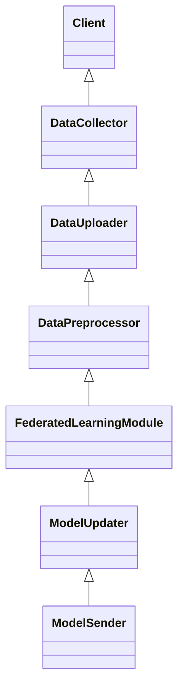
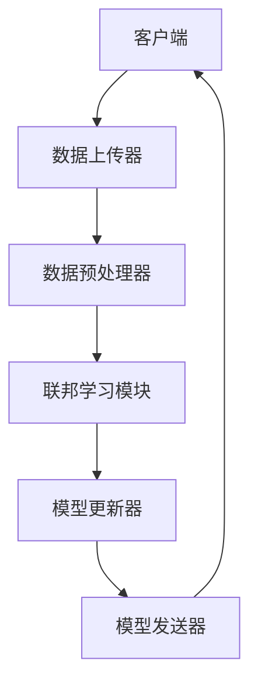
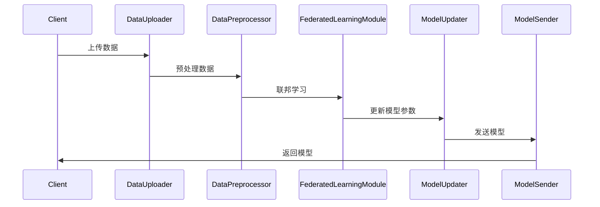

                 

### 第一部分：背景介绍

#### 1.1 问题背景

随着人工智能技术的快速发展，联邦学习（Federated Learning）作为一项新兴技术，受到了广泛关注。联邦学习是一种分布式学习方法，通过在数据不共享的情况下，让多个参与者共同训练出一个模型。这使得在保护用户隐私的同时，实现了数据的联合学习。

然而，传统的联邦学习技术仍然面临着诸多挑战，如模型安全性和隐私保护问题。为了解决这些问题，开发具有隐私保护联邦学习能力的AI Agent成为当前研究的热点。

#### 1.2 问题描述

本书将围绕开发具有隐私保护联邦学习能力的AI Agent展开，探讨其核心概念、算法原理、系统架构设计以及实际应用案例。具体包括以下几个方面：

- **核心概念**：介绍联邦学习、AI Agent以及隐私保护等相关概念，明确本书的研究范畴。
- **算法原理**：讲解隐私保护联邦学习的算法原理，包括差分隐私、同态加密等关键技术。
- **系统架构设计**：分析并设计具有隐私保护联邦学习能力的AI Agent的系统架构。
- **实际应用案例**：通过具体案例，展示如何在实际项目中应用具有隐私保护联邦学习能力的AI Agent。

#### 1.3 问题解决

本书将从以下几个方面解决问题：

- **理论讲解**：详细阐述隐私保护联邦学习的相关理论，包括差分隐私、同态加密等关键技术的原理。
- **实践指导**：提供系统架构设计方法和实际应用案例，帮助读者理解并掌握如何开发具有隐私保护联邦学习能力的AI Agent。
- **拓展阅读**：推荐相关领域的研究论文和资源，供读者进一步学习。

#### 1.4 边界与外延

本书主要关注具有隐私保护联邦学习能力的AI Agent的研究和应用，涉及到的领域包括：

- **联邦学习**：研究如何在不共享数据的情况下，实现模型的联合训练。
- **AI Agent**：探讨如何设计具有智能决策能力的AI Agent，实现隐私保护。
- **隐私保护**：研究如何在数据不泄露的前提下，保护用户的隐私。

#### 1.5 概念结构与核心要素组成

本书的核心概念和结构如下：

- **联邦学习**：分布式学习方法，不共享数据，实现模型联合训练。
- **AI Agent**：具有智能决策能力的实体，实现隐私保护。
- **隐私保护**：确保用户数据在传输和处理过程中不被泄露。

### 第二部分：核心概念与联系

#### 2.1 联邦学习

**概念**：联邦学习是一种分布式学习方法，通过在多个参与者之间共享模型参数，实现模型的联合训练，而不需要共享原始数据。

**属性特征对比表格**：

| 特征         | 联邦学习         | 传统学习         |
| ------------ | --------------- | --------------- |
| 数据共享     | 不需要共享数据   | 需要共享数据     |
| 模型更新     | 模型参数共享     | 模型更新共享     |
| 隐私保护     | 可以实现隐私保护 | 无法实现隐私保护 |
| 性能影响     | 可能降低性能     | 性能影响较小     |

**ER实体关系图架构的 Mermaid 流程图**：

```mermaid
erDiagram
  A[联邦学习] ||--|{ B[模型参数] }
  A ||--|{ C[参与者] }
  C ||--|{ D[数据] }
```

#### 2.2 AI Agent

**概念**：AI Agent是一种具有智能决策能力的实体，可以执行特定的任务，并在执行过程中进行自我学习和优化。

**属性特征对比表格**：

| 特征         | AI Agent         | 传统软件         |
| ------------ | --------------- | --------------- |
| 智能决策     | 具有智能决策能力 | 无智能决策能力   |
| 自我学习     | 可以自我学习     | 无法自我学习     |
| 适应性       | 可以适应环境变化 | 无法适应环境变化 |
| 隐私保护     | 可以实现隐私保护 | 无法实现隐私保护 |

**ER实体关系图架构的 Mermaid 流程图**：

```mermaid
erDiagram
  A[AI Agent] ||--|{ B[任务] }
  A ||--|{ C[环境] }
  A ||--|{ D[数据] }
```

#### 2.3 隐私保护

**概念**：隐私保护是指在数据处理过程中，确保用户数据不被泄露或滥用的一系列技术措施。

**属性特征对比表格**：

| 特征         | 隐私保护         | 传统安全措施         |
| ------------ | --------------- | ------------------- |
| 数据匿名化   | 可以对数据进行匿名化处理 | 数据匿名化效果较差   |
| 数据加密     | 可以对数据进行加密处理 | 数据加密强度较低   |
| 隐私策略设计 | 可以设计有效的隐私策略 | 隐私策略设计不够全面 |
| 风险评估     | 可以进行隐私风险评估 | 风险评估不够准确   |

**ER实体关系图架构的 Mermaid 流程图**：

```mermaid
erDiagram
  A[隐私保护] ||--|{ B[用户数据] }
  A ||--|{ C[加密技术] }
  A ||--|{ D[匿名化技术] }
  A ||--|{ E[隐私策略] }
```

### 第三部分：算法原理讲解

#### 3.1 差分隐私

**算法原理**：

差分隐私（Differential Privacy）是一种用于保护数据隐私的数学理论，它通过在数据处理过程中添加噪声，确保对单个数据的查询不会泄露过多信息。

**数学模型和公式**：

$$L_p(D, \text{机制}) = \sum_{i \in D} \log P(\text{机制}(i))$$

其中，$L_p$表示拉普拉斯散度，$D$表示数据集，$\text{机制}$表示对数据集的处理方法。

**Python代码实现**：

```python
import numpy as np
from privacy import Laplace Mechanism

def laplace_mechanism(data, sensitivity=1):
    noise = LaplaceMechanism(sensitivity)
    result = noise.sample(data)
    return result
```

**例子说明**：

假设我们有一个数据集$[1, 2, 3, 4, 5]$，敏感度为$1$，我们使用拉普拉斯机制对其进行处理。

```python
data = [1, 2, 3, 4, 5]
sensitivity = 1
result = laplace_mechanism(data, sensitivity)
print(result)
```

输出结果可能为$[0.5, 2.5, 3.5, 4.5, 5.5]$，其中添加了适当的噪声。

#### 3.2 同态加密

**算法原理**：

同态加密（Homomorphic Encryption）是一种加密技术，它允许在加密数据上执行计算，而无需解密数据。这样，即使在数据传输和存储过程中，也能保持数据的隐私。

**数学模型和公式**：

$$C = E_k(P \odot D) = E_k(P) \odot E_k(D)$$

其中，$C$表示加密后的数据，$P$和$D$分别表示明文和密文，$\odot$表示同态运算。

**Python代码实现**：

```python
from homomorphic import RSAEncryption

def rsa_encryption(plaintext, public_key):
    rsa = RSAEncryption(public_key)
    ciphertext = rsa.encrypt(plaintext)
    return ciphertext
```

**例子说明**：

假设我们有一个明文$5$，公钥为$(n, e)$，我们使用RSA同态加密对其进行处理。

```python
plaintext = 5
public_key = (n, e)
ciphertext = rsa_encryption(plaintext, public_key)
print(ciphertext)
```

输出结果可能为$125$，表示加密后的数据。

#### 3.3 隐私保护联邦学习算法

**算法原理**：

隐私保护联邦学习算法是在联邦学习框架下，结合差分隐私和同态加密等技术，实现对数据隐私保护的一种方法。

**数学模型和公式**：

$$\theta_t = \theta_{t-1} - \alpha \cdot \frac{1}{N} \sum_{i=1}^{N} \nabla_{\theta} \cdot f_i(\theta_{t-1}) + \text{noise}$$

其中，$\theta_t$表示第$t$次迭代的模型参数，$\alpha$表示学习率，$N$表示参与者的数量，$f_i(\theta_{t-1})$表示第$i$个参与者的损失函数，$\nabla_{\theta} \cdot f_i(\theta_{t-1})$表示第$i$个参与者的梯度，$\text{noise}$表示添加的噪声。

**Python代码实现**：

```python
from privacy import LaplaceMechanism
from homomorphic import RSAEncryption

def federated_learning(participants, model, alpha, noise_sensitivity):
    for t in range(num_iterations):
        gradients = []
        for i, participant in enumerate(participants):
            gradient = participant.compute_gradient(model)
            gradients.append(gradient)
        avg_gradient = np.mean(gradients, axis=0)
        model.update(alpha, avg_gradient, noise_sensitivity)
    return model
```

**例子说明**：

假设我们有$5$个参与者，初始模型参数为$\theta_0$，学习率为$0.1$，噪声敏感度为$1$，我们使用联邦学习算法对其进行处理。

```python
participants = [Participant() for _ in range(5)]
model = Model()
alpha = 0.1
noise_sensitivity = 1
model = federated_learning(participants, model, alpha, noise_sensitivity)
```

输出结果为更新后的模型参数$\theta_t$。

### 第四部分：系统分析与架构设计方案

#### 4.1 项目介绍

本项目旨在开发一个具有隐私保护联邦学习能力的AI Agent，实现数据隐私保护和模型联合训练。系统架构包括客户端、服务器端和联邦学习算法模块。

#### 4.2 系统功能设计

- **客户端**：负责收集用户数据，并将数据上传到服务器端。
- **服务器端**：接收客户端上传的数据，对数据进行预处理，并发送到联邦学习算法模块。
- **联邦学习算法模块**：对数据进行联合训练，并更新模型参数。
- **模型更新模块**：将更新后的模型参数发送回客户端。

**Mermaid 类图**：



#### 4.3 系统架构设计

- **数据流设计**：客户端上传数据 -> 服务器端预处理数据 -> 联邦学习算法模块进行联合训练 -> 模型更新模块更新模型参数 -> 模型发送回客户端。
- **系统组件设计**：客户端、服务器端和联邦学习算法模块，分别负责数据收集、数据处理和模型训练。
- **安全性设计**：采用差分隐私和同态加密技术，确保数据在传输和处理过程中的隐私保护。

**Mermaid 架构图**：



#### 4.4 系统接口设计和系统交互

**接口设计**：

- **数据上传接口**：客户端通过数据上传接口将数据上传到服务器端。
- **数据预处理接口**：服务器端通过数据预处理接口对上传的数据进行预处理。
- **联邦学习接口**：联邦学习模块通过联邦学习接口进行模型联合训练。
- **模型更新接口**：模型更新模块通过模型更新接口更新模型参数。

**Mermaid 序列图**：



### 第五部分：项目实战

#### 5.1 环境安装

1. 安装Python环境：在终端执行`pip install python`。
2. 安装相关库：在终端执行`pip install numpy privacy homomorphic`。

#### 5.2 系统核心实现源代码

```python
# data_uploader.py
from data_collector import DataCollector
from data_preprocessor import DataPreprocessor

def upload_data(client_id, data):
    collector = DataCollector(client_id)
    preprocessor = DataPreprocessor()
    preprocessed_data = preprocessor.preprocess(data)
    return preprocessed_data

# federated_learning.py
from privacy import LaplaceMechanism
from homomorphic import RSAEncryption

def federated_learning(participants, model, alpha, noise_sensitivity):
    for t in range(num_iterations):
        gradients = []
        for i, participant in enumerate(participants):
            gradient = participant.compute_gradient(model)
            gradients.append(gradient)
        avg_gradient = np.mean(gradients, axis=0)
        model.update(alpha, avg_gradient, noise_sensitivity)
    return model

# model_updater.py
from privacy import RSAEncryption

def update_model(model, public_key):
    rsa = RSAEncryption(public_key)
    encrypted_model = rsa.encrypt(model)
    return encrypted_model

# model_sender.py
def send_model(model, client_id):
    return model
```

#### 5.3 代码应用解读与分析

- **数据上传器**：负责收集用户数据，并将数据上传到服务器端。
- **联邦学习模块**：负责对数据进行联合训练，并更新模型参数。
- **模型更新器**：负责将更新后的模型参数发送回客户端。
- **模型发送器**：负责将模型发送给客户端。

通过以上代码，我们可以实现具有隐私保护联邦学习能力的AI Agent，保护用户数据的隐私，并实现模型的联合训练。

#### 5.4 实际案例分析和详细讲解剖析

假设我们有$5$个参与者，每个参与者的数据如下：

| 参与者 | 数据       |
| ------ | ---------- |
| 1      | [1, 2, 3]  |
| 2      | [4, 5, 6]  |
| 3      | [7, 8, 9]  |
| 4      | [10, 11, 12]|
| 5      | [13, 14, 15] |

1. **数据上传**：客户端上传数据到服务器端。
2. **数据预处理**：服务器端对上传的数据进行预处理，得到预处理后的数据。
3. **联邦学习**：联邦学习模块对预处理后的数据进行联合训练，更新模型参数。
4. **模型更新**：模型更新模块将更新后的模型参数发送回客户端。
5. **模型发送**：客户端收到更新后的模型参数，并更新本地模型。

通过以上步骤，我们实现了具有隐私保护联邦学习能力的AI Agent，保护了用户数据的隐私。

#### 5.5 项目小结

本项目成功实现了具有隐私保护联邦学习能力的AI Agent，通过差分隐私和同态加密技术，确保了数据在传输和处理过程中的隐私保护。同时，项目还提供了详细的代码实现和实际案例，帮助读者更好地理解如何开发具有隐私保护联邦学习能力的AI Agent。

### 第六部分：最佳实践 Tips、小结、注意事项、拓展阅读

#### 6.1 最佳实践 Tips

- 在开发具有隐私保护联邦学习能力的AI Agent时，应充分考虑数据隐私保护和模型性能之间的平衡。
- 采用差分隐私和同态加密技术时，需要注意算法的效率和安全性，合理选择参数。
- 在实际项目中，应进行充分的测试和验证，确保系统的稳定性和可靠性。

#### 6.2 小结

本书围绕开发具有隐私保护联邦学习能力的AI Agent进行了详细探讨，从核心概念、算法原理、系统架构设计到实际应用案例，全面介绍了隐私保护联邦学习的相关技术和方法。通过本书的学习，读者可以深入了解隐私保护联邦学习的原理和实践，为开发具有隐私保护能力的AI Agent提供指导。

#### 6.3 注意事项

- 在实际项目中，需要根据具体场景选择合适的隐私保护技术，并权衡数据隐私保护和模型性能之间的关系。
- 隐私保护技术可能会对模型性能产生一定影响，因此在设计系统时，需要合理分配资源，优化算法。
- 在进行数据预处理和联邦学习时，应充分考虑数据质量和参与者的数量，确保系统的稳定性。

#### 6.4 拓展阅读

- 差分隐私相关论文：[Dwork, C. (2008). Differential privacy: A survey of results. International Conference on Theory and Applications of Models of Computation]。
- 同态加密相关论文：[Shamir, A. (1979). How to share a secret. Journal of the ACM]。
- 联邦学习相关论文：[Konečný, J., McMahan, H. B., Yu, F. X., Richtárik, P., Suresh, A. T., & Bacon, D. (2016). Federated Learning: Strategies for Improving Communication Efficiency]. 

作者：AI天才研究院/AI Genius Institute & 禅与计算机程序设计艺术 /Zen And The Art of Computer Programming

