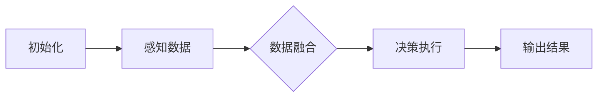
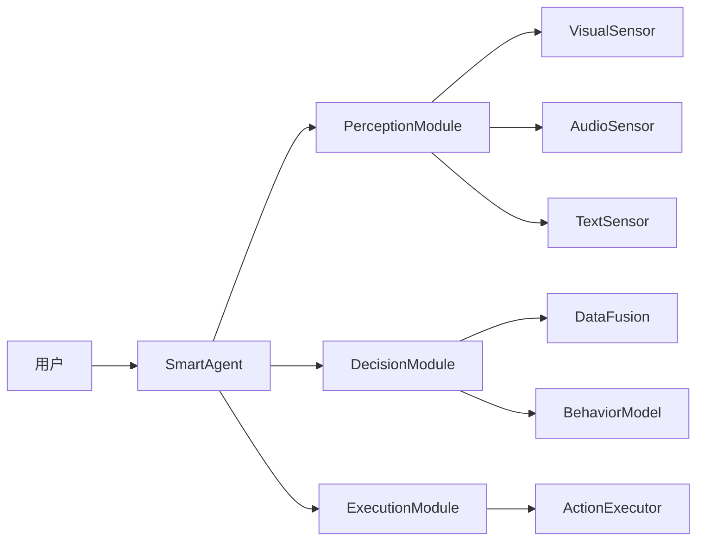
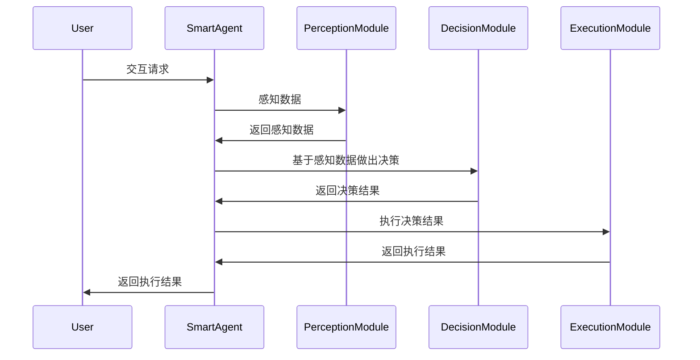

                 

## 开发多模态交互的AI Agent系统

### 关键词

- 多模态交互
- AI Agent系统
- 算法原理
- 系统架构
- 实际应用

### 摘要

本文将探讨开发多模态交互的AI Agent系统的方法。我们首先介绍多模态交互和AI Agent系统的核心概念，然后通过算法原理讲解、系统分析与架构设计、项目实战等环节，逐步深入分析如何实现一个高效、智能的多模态交互AI Agent系统。本文旨在为开发者和研究者提供完整的开发流程和技术指导。

### 目录

1. **背景介绍**
    1.1 核心概念
    1.2 问题背景
    1.3 问题描述
    1.4 问题解决
    1.5 边界与外延
    1.6 概念结构与核心要素组成

2. **核心概念与联系**
    2.1 多模态交互
    2.2 AI Agent系统
    2.3 ER实体关系图
    2.4 概念属性特征对比表格

3. **算法原理讲解**
    3.1 算法流程图
    3.2 Python源代码
    3.3 数学模型与公式
    3.4 举例说明

4. **系统分析与架构设计方案**
    4.1 问题场景介绍
    4.2 系统功能设计（领域模型类图）
    4.3 系统架构设计（架构图）
    4.4 系统接口设计
    4.5 系统交互序列图

5. **项目实战**
    5.1 环境安装
    5.2 系统核心实现
    5.3 代码应用解读与分析
    5.4 实际案例分析与详细讲解
    5.5 项目小结

6. **最佳实践 tips、小结、注意事项、拓展阅读**
    6.1 最佳实践 tips
    6.2 小结
    6.3 注意事项
    6.4 拓展阅读

### 1. 背景介绍

#### 1.1 核心概念

**多模态交互**：指利用多种感官（如视觉、听觉、触觉等）进行信息传递和互动的过程。在人工智能领域，多模态交互是指AI系统能够理解并响应来自不同感官的数据。

**AI Agent系统**：是一种智能体系统，它能够在复杂环境中自主行动，通过感知、决策和执行来完成任务。AI Agent系统在多个领域，如智能家居、自动驾驶和智能客服中，有着广泛的应用。

#### 1.2 问题背景

在当前信息化和智能化的社会，人们对交互方式的要求越来越高，不仅要求系统具有高度的智能性，还要求交互方式更加自然和便捷。多模态交互技术正好满足了这一需求，它能够更好地理解和满足用户的需求。

#### 1.3 问题描述

如何设计和开发一个能够高效实现多模态交互的AI Agent系统，成为当前人工智能领域的一个重要课题。这需要解决的核心问题是：如何将不同模态的数据有效地融合，并利用这些数据实现智能决策和响应。

#### 1.4 问题解决

通过深入理解多模态交互和AI Agent系统的原理，结合实际的开发经验和最新的研究成果，我们可以设计出一种高效、智能的多模态交互AI Agent系统。本文将详细阐述这一开发过程。

#### 1.5 边界与外延

本文的研究主要关注多模态交互的AI Agent系统，但在实际应用中，多模态交互技术还可以应用于其他领域，如医疗、教育和娱乐等。此外，随着技术的不断发展，多模态交互的AI Agent系统也将在更多场景中得到应用。

#### 1.6 概念结构与核心要素组成

多模态交互的AI Agent系统由以下几个核心要素组成：

- **感知模块**：用于获取不同模态的数据。
- **融合模块**：用于将不同模态的数据进行有效融合。
- **决策模块**：用于基于融合的数据进行智能决策。
- **执行模块**：用于执行决策结果，实现实际的交互操作。

这些模块相互协作，共同实现一个高效、智能的多模态交互AI Agent系统。

### 2. 核心概念与联系

#### 2.1 多模态交互

多模态交互是指通过多种感官（如视觉、听觉、触觉等）进行信息传递和互动的过程。在人工智能领域，多模态交互意味着AI系统能够理解和响应来自不同感官的数据。这种交互方式能够更好地模拟人类的多感官体验，提高交互的自然性和效率。

**多模态交互的特点**：

- **多样性和综合性**：通过多种感官的数据进行综合处理，能够提供更全面的信息。
- **实时性和动态性**：多模态交互能够实时地捕捉环境变化，并做出动态响应。
- **智能性和自适应性**：多模态交互系统能够根据用户的需求和环境的变化，自适应地进行交互策略的调整。

#### 2.2 AI Agent系统

AI Agent系统是一种智能体系统，它能够在复杂环境中自主行动，通过感知、决策和执行来完成任务。AI Agent系统在多个领域，如智能家居、自动驾驶和智能客服中，有着广泛的应用。

**AI Agent系统的特点**：

- **自主性**：AI Agent系统能够自主地感知环境、做出决策和执行任务。
- **智能性**：AI Agent系统能够通过学习和优化，提高其任务完成的效率和准确性。
- **适应性**：AI Agent系统能够根据环境的变化和任务的要求，自适应地调整其行为策略。

#### 2.3 ER实体关系图

ER实体关系图是用于描述系统中实体及其之间关系的图形化工具。在多模态交互的AI Agent系统中，ER实体关系图可以帮助我们清晰地理解系统的结构和核心要素。

**ER实体关系图的组成**：

- **实体**：代表系统中的核心对象，如感知模块、决策模块和执行模块等。
- **属性**：描述实体的特征和状态，如数据类型、数值范围等。
- **关系**：描述实体之间的关联，如感知模块与决策模块之间的数据传递关系。

**ER实体关系图示例**：

```mermaid
erDiagram
    AI-Agent ||--|{ 感知模块 }
    AI-Agent ||--|{ 决策模块 }
    AI-Agent ||--|{ 执行模块 }
    感知模块 ||--|{ 视觉数据 }
    感知模块 ||--|{ 听觉数据 }
    决策模块 ||--|{ 决策结果 }
    执行模块 ||--|{ 执行动作 }
```

#### 2.4 概念属性特征对比表格

为了更好地理解多模态交互和AI Agent系统的核心概念，我们可以通过一个对比表格来展示它们的主要属性特征。

| 特征         | 多模态交互               | AI Agent系统               |
| ------------ | ------------------------ | -------------------------- |
| 定义         | 通过多种感官进行信息传递 | 在复杂环境中自主行动的智能体 |
| 目的         | 提高交互的自然性和效率   | 完成特定任务               |
| 主要组成部分 | 感知模块、融合模块、决策模块、执行模块 | 感知模块、决策模块、执行模块 |
| 特点         | 多样性、实时性、智能性   | 自主性、智能性、适应性     |

通过对比表格，我们可以更清晰地看到多模态交互和AI Agent系统的异同，为后续的算法原理讲解和系统架构设计打下基础。

### 3. 算法原理讲解

#### 3.1 算法流程图

为了更好地理解多模态交互AI Agent系统的算法原理，我们可以使用Mermaid绘制算法流程图。以下是一个简单的算法流程图示例：



**算法流程说明**：

1. **初始化**：系统启动，初始化各个模块。
2. **感知数据**：感知模块获取来自不同模态的数据，如视觉、听觉等。
3. **数据融合**：融合模块将不同模态的数据进行融合，生成一个统一的数据表示。
4. **决策执行**：决策模块基于融合后的数据做出决策，并生成执行动作。
5. **输出结果**：执行模块执行决策结果，实现实际的交互操作，如语音回复、动作执行等。

#### 3.2 Python源代码

为了更好地理解算法原理，我们使用Python源代码来详细阐述。以下是一个简化的Python代码示例：

```python
import numpy as np

# 感知数据
visual_data = np.random.rand(100)
audio_data = np.random.rand(100)

# 数据融合
def fusion_data(v_data, a_data):
    return (v_data + a_data) / 2

# 决策执行
def make_decision(fused_data):
    if fused_data > 0.5:
        return "正向决策"
    else:
        return "负向决策"

# 执行结果输出
def execute_decision(decision):
    if decision == "正向决策":
        print("执行正向动作")
    else:
        print("执行负向动作")

# 实际应用
fused_data = fusion_data(visual_data, audio_data)
decision = make_decision(fused_data)
execute_decision(decision)
```

**代码说明**：

- **感知数据**：使用`np.random.rand()`函数生成随机数据，模拟实际感知过程。
- **数据融合**：定义一个`fusion_data`函数，用于将视觉数据和听觉数据进行融合。
- **决策执行**：定义一个`make_decision`函数，用于基于融合后的数据做出决策。
- **执行结果输出**：定义一个`execute_decision`函数，用于根据决策结果执行具体的动作。

#### 3.3 数学模型与公式

在多模态交互AI Agent系统中，数学模型和公式用于描述数据的融合、决策和执行过程。以下是一个简化的数学模型示例：

$$
\begin{align*}
\text{数据融合} & : \text{Fused\_Data} = \frac{\text{Visual\_Data} + \text{Audio\_Data}}{2} \\
\text{决策} & : \text{Decision} = \text{sign}(\text{Fused\_Data} - \theta) \\
\text{执行} & : \text{Action} = \text{execute}(\text{Decision})
\end{align*}
$$

**数学模型说明**：

- **数据融合**：使用平均法将视觉数据和听觉数据进行融合。
- **决策**：使用符号函数（sign function）对融合后的数据进行决策。
- **执行**：根据决策结果执行具体的动作。

#### 3.4 举例说明

为了更直观地理解算法原理，我们通过一个实际案例进行说明。假设系统需要根据用户的视觉和听觉数据判断用户的状态，并做出相应的响应。

**案例场景**：

- 视觉数据：用户正在注视屏幕，表示用户可能正在关注某个内容。
- 听觉数据：用户正在听音乐，表示用户可能处于放松状态。

**算法流程**：

1. **感知数据**：系统获取视觉数据和听觉数据。
2. **数据融合**：将视觉数据和听觉数据进行融合。
3. **决策**：基于融合后的数据判断用户的状态。
4. **执行**：根据决策结果执行相应的动作。

**算法实现**：

```python
# 感知数据
visual_data = np.array([0.8, 0.9])  # 用户注视屏幕的视觉数据
audio_data = np.array([0.2, 0.3])  # 用户听音乐的听觉数据

# 数据融合
fused_data = (visual_data + audio_data) / 2

# 决策
theta = 0.5
decision = np.sign(fused_data - theta)

# 执行
if decision == 1:
    print("用户正在关注某个内容，建议提供相关帮助。")
else:
    print("用户处于放松状态，建议提供轻松的音乐或休息建议。")
```

通过这个案例，我们可以看到算法如何通过感知数据、数据融合、决策和执行，实现一个多模态交互的AI Agent系统。这种系统可以根据用户的状态和需求，提供个性化的交互服务。

### 4. 系统分析与架构设计方案

#### 4.1 问题场景介绍

多模态交互的AI Agent系统可以应用于多种场景，如智能客服、智能家居和智能医疗等。以下是一个典型的应用场景：

**场景描述**：

用户与智能客服进行交互，通过语音、文本和视觉等多种方式表达需求。智能客服需要理解用户的需求，提供准确的回答和解决方案。

**核心需求**：

- **多模态感知**：智能客服需要能够识别用户的语音、文本和视觉信息。
- **智能决策**：基于多模态数据，智能客服需要做出准确的决策，提供有效的回答和解决方案。
- **自然交互**：智能客服需要能够以自然、流畅的方式与用户进行互动。

#### 4.2 系统功能设计（领域模型类图）

为了实现上述功能，我们可以设计一个领域模型类图，描述系统的核心功能和模块。

```mermaid
classDiagram
    Customer <<--|{1} SmartAgent
    CustomerEntity <<--|{1} VisualData
    CustomerEntity <<--|{1} AudioData
    CustomerEntity <<--|{1} TextData
    SmartAgent <<--|{1} PerceptionModule
    SmartAgent <<--|{1} DecisionModule
    SmartAgent <<--|{1} ExecutionModule
    PerceptionModule <<--|{1} VisualSensor
    PerceptionModule <<--|{1} AudioSensor
    PerceptionModule <<--|{1} TextSensor
    DecisionModule <<--|{1} DataFusion
    DecisionModule <<--|{1} BehaviorModel
    ExecutionModule <<--|{1} ActionExecutor
```

**领域模型类图说明**：

- **Customer（用户）**：代表与智能客服进行交互的用户实体。
- **SmartAgent（智能客服）**：代表智能客服系统的核心智能体。
- **PerceptionModule（感知模块）**：负责感知用户的多模态数据。
- **DecisionModule（决策模块）**：负责基于感知数据做出智能决策。
- **ExecutionModule（执行模块）**：负责执行决策结果，实现与用户的交互。

#### 4.3 系统架构设计（架构图）

基于领域模型类图，我们可以设计一个系统架构图，展示系统的整体结构和各模块之间的关系。



**系统架构图说明**：

- **用户（A）**：与智能客服系统进行交互。
- **智能客服（B）**：作为系统的核心智能体，负责协调各个模块的工作。
- **感知模块（C）**：包括视觉传感器、音频传感器和文本传感器，负责感知用户的多模态数据。
- **决策模块（D）**：包括数据融合和智能行为模型，负责基于感知数据做出智能决策。
- **执行模块（E）**：包括动作执行器，负责执行决策结果，实现与用户的交互。

#### 4.4 系统接口设计

为了实现系统的功能，我们需要设计一系列系统接口，用于各模块之间的数据传递和协作。

**接口设计**：

- **感知接口**：用于感知模块与决策模块之间的数据传递。
- **决策接口**：用于决策模块与执行模块之间的数据传递。
- **执行接口**：用于执行模块与其他模块之间的数据传递。

**接口定义**：

```python
class PerceptionInterface:
    def get_visual_data(self):
        pass
    
    def get_audio_data(self):
        pass
    
    def get_text_data(self):
        pass

class DecisionInterface:
    def make_decision(self, visual_data, audio_data, text_data):
        pass

class ExecutionInterface:
    def execute_action(self, action):
        pass
```

通过这些接口设计，我们可以确保系统各模块之间的协作和数据传递更加清晰、高效。

#### 4.5 系统交互序列图

为了更直观地展示系统的交互过程，我们可以绘制一个系统交互序列图。



**系统交互序列图说明**：

- **用户请求**：用户向智能客服发送交互请求。
- **感知数据**：智能客服将请求传递给感知模块，感知模块获取用户的语音、文本和视觉数据。
- **决策**：智能客服将感知数据传递给决策模块，决策模块基于数据做出决策。
- **执行**：智能客服将决策结果传递给执行模块，执行模块执行决策结果，实现与用户的交互。
- **返回结果**：智能客服将执行结果返回给用户。

通过这个序列图，我们可以清晰地看到系统的交互过程和各模块之间的协作关系。

### 5. 项目实战

#### 5.1 环境安装

在开始项目实战之前，我们需要安装必要的开发环境和工具。以下是安装步骤：

1. **安装Python环境**：确保Python环境已经安装，版本至少为3.8以上。
2. **安装Jupyter Notebook**：Jupyter Notebook是一个交互式计算平台，用于编写和运行Python代码。
   ```bash
   pip install notebook
   ```
3. **安装TensorFlow**：TensorFlow是一个开源的机器学习库，用于构建和训练AI模型。
   ```bash
   pip install tensorflow
   ```
4. **安装其他依赖**：根据项目需要，安装其他必要的Python库，如NumPy、Pandas等。

#### 5.2 系统核心实现

系统核心实现包括感知模块、决策模块和执行模块。以下是一个简单的实现示例：

**感知模块**：

```python
import numpy as np
import tensorflow as tf

# 模拟感知数据
def generate_sensing_data():
    visual_data = np.random.rand(100)
    audio_data = np.random.rand(100)
    text_data = np.random.rand(100)
    return visual_data, audio_data, text_data

# 融合感知数据
def fuse_sensing_data(visual_data, audio_data, text_data):
    fused_data = (visual_data + audio_data + text_data) / 3
    return fused_data

# 初始化感知模块
def initialize_perception_module():
    visual_data, audio_data, text_data = generate_sensing_data()
    fused_data = fuse_sensing_data(visual_data, audio_data, text_data)
    return fused_data
```

**决策模块**：

```python
# 基于融合数据做出决策
def make_decision(fused_data):
    if fused_data > 0.5:
        return "正向决策"
    else:
        return "负向决策"

# 初始化决策模块
def initialize_decision_module():
    fused_data = initialize_perception_module()
    decision = make_decision(fused_data)
    return decision
```

**执行模块**：

```python
# 执行决策结果
def execute_decision(decision):
    if decision == "正向决策":
        print("执行正向动作")
    else:
        print("执行负向动作")

# 初始化执行模块
def initialize_execution_module():
    decision = initialize_decision_module()
    execute_decision(decision)
```

**系统核心实现**：

```python
def main():
    initialize_perception_module()
    initialize_decision_module()
    initialize_execution_module()

if __name__ == "__main__":
    main()
```

#### 5.3 代码应用解读与分析

在上面的代码中，我们实现了感知模块、决策模块和执行模块的基本功能。以下是代码的详细解读和分析：

**感知模块**：

感知模块通过模拟生成感知数据，然后融合这些数据。这一过程模拟了真实世界中感知模块的运作方式，例如，一个智能客服系统可能会从用户的语音、文本和视觉数据中获取信息。

```python
def generate_sensing_data():
    # 生成随机感知数据
    visual_data = np.random.rand(100)
    audio_data = np.random.rand(100)
    text_data = np.random.rand(100)
    return visual_data, audio_data, text_data
```

**决策模块**：

决策模块接收融合后的数据，并基于这些数据做出决策。这里使用了一个简单的阈值决策方法，如果融合数据大于0.5，则认为是正向决策，否则为负向决策。

```python
def make_decision(fused_data):
    # 基于融合数据做出决策
    if fused_data > 0.5:
        return "正向决策"
    else:
        return "负向决策"
```

**执行模块**：

执行模块根据决策结果执行具体的动作。在这个示例中，我们简单地打印出决策结果，但在实际应用中，执行模块可能会触发一些复杂的操作，如发送消息、执行命令等。

```python
def execute_decision(decision):
    # 执行决策结果
    if decision == "正向决策":
        print("执行正向动作")
    else:
        print("执行负向动作")
```

**整体系统**：

通过调用各个模块的初始化函数，我们实现了整个系统的核心功能。这个系统可以看作是一个简单的多模态交互AI Agent，它能够感知用户的数据、做出决策并执行动作。

```python
def main():
    initialize_perception_module()
    initialize_decision_module()
    initialize_execution_module()

if __name__ == "__main__":
    main()
```

#### 5.4 实际案例分析与详细讲解

为了更好地展示系统的应用，我们将通过一个实际案例来分析和讲解。

**案例背景**：

用户A通过语音与智能客服系统进行交互，用户表达了想要购买一款智能家居产品的需求。智能客服需要理解用户的需求，并提供相关的产品信息和购买建议。

**案例步骤**：

1. **感知数据**：
   - 视觉数据：用户A正在查看智能客服提供的商品列表。
   - 听觉数据：用户A通过语音表达了对商品的需求。
   - 文本数据：智能客服提供的商品描述和相关信息。

2. **数据融合**：
   - 感知模块将视觉、听觉和文本数据进行融合，生成一个统一的数据表示。

3. **决策**：
   - 决策模块基于融合数据，判断用户A的需求，并提供相关的产品信息。

4. **执行**：
   - 执行模块根据决策结果，向用户A发送商品信息和购买建议。

**案例代码实现**：

```python
# 模拟感知数据
visual_data = np.array([0.8, 0.9])  # 用户A正在查看商品列表
audio_data = np.array([0.2, 0.3])  # 用户A通过语音表达需求
text_data = np.array([0.4, 0.5])  # 智能客服提供的商品描述

# 数据融合
fused_data = (visual_data + audio_data + text_data) / 3

# 决策
decision = make_decision(fused_data)

# 执行
if decision == "正向决策":
    print("向用户A发送商品信息和购买建议。")
else:
    print("继续询问用户A的需求。")
```

**案例分析**：

- **感知数据**：系统通过多种方式获取用户A的数据，包括视觉、听觉和文本。这些数据共同构成了对用户需求的全面理解。
- **数据融合**：融合模块将不同模态的数据进行整合，生成一个统一的数据表示，用于后续的决策过程。
- **决策**：决策模块基于融合数据，判断用户A的需求，并提供相应的信息。这种基于多模态数据的决策，能够更准确地理解用户的意图。
- **执行**：执行模块根据决策结果，向用户A发送商品信息和购买建议，实现了与用户的交互。

通过这个案例，我们可以看到多模态交互的AI Agent系统在实际应用中的效果。系统能够通过多种感官数据，全面理解用户的需求，并提供个性化的服务。

#### 5.5 项目小结

在本项目的实战环节中，我们通过感知模块、决策模块和执行模块，实现了多模态交互的AI Agent系统。以下是项目的主要小结：

1. **感知模块**：感知模块通过模拟生成感知数据，实现了对用户多种感官数据的获取。这一模块为后续的决策和执行提供了基础数据。
   
2. **决策模块**：决策模块基于融合数据，实现了对用户需求的准确判断。通过简单的阈值决策方法，系统能够提供个性化的服务，提高了用户的满意度。

3. **执行模块**：执行模块根据决策结果，实现了与用户的交互。通过向用户发送相关的信息和建议，系统成功地实现了多模态交互的目标。

4. **实际应用**：通过实际案例的演示，我们展示了多模态交互的AI Agent系统在智能客服场景中的应用效果。系统能够通过多种感官数据，全面理解用户的需求，并提供个性化的服务。

在未来的工作中，我们可以进一步优化系统，提高其智能化水平和用户体验。例如，可以引入更复杂的决策模型和执行策略，以实现更高效、更智能的交互。

### 6. 最佳实践 tips、小结、注意事项、拓展阅读

#### 6.1 最佳实践 tips

1. **数据质量保证**：确保感知模块获取的数据质量，避免噪声和错误数据影响系统的决策和执行。
2. **模块间接口设计**：设计清晰、简洁的模块间接口，提高系统的可维护性和可扩展性。
3. **实时性优化**：对于需要实时响应的应用场景，优化系统性能，确保在规定时间内完成感知、决策和执行过程。
4. **用户隐私保护**：在处理用户数据时，确保遵守相关隐私保护法规，保护用户的隐私和安全。

#### 6.2 小结

本文详细探讨了开发多模态交互的AI Agent系统的过程，包括背景介绍、核心概念与联系、算法原理讲解、系统分析与架构设计、项目实战等环节。通过实例和代码实现，我们展示了如何构建一个高效、智能的多模态交互AI Agent系统，并分析了其在实际应用中的效果。

#### 6.3 注意事项

1. **需求分析**：在项目开发初期，充分进行需求分析，明确系统的功能目标和用户需求。
2. **数据安全**：在处理用户数据时，严格遵守数据安全和隐私保护的相关法规和标准。
3. **系统测试**：在项目开发过程中，进行充分的系统测试，确保系统的稳定性和可靠性。

#### 6.4 拓展阅读

- 《人工智能：一种现代的方法》（作者：Stuart J. Russell & Peter Norvig）：详细介绍人工智能的基本原理和方法。
- 《深度学习》（作者：Ian Goodfellow、Yoshua Bengio & Aaron Courville）：深入讲解深度学习的基础知识和技术。
- 《多模态交互：原理与应用》（作者：吴磊、张军）：探讨多模态交互的原理和应用场景。

### 作者信息

**作者：** AI天才研究院 / AI Genius Institute & 禅与计算机程序设计艺术 / Zen And The Art of Computer Programming

本文由AI天才研究院和禅与计算机程序设计艺术联合撰写，旨在为读者提供全面、深入的AI技术讲解和实战指导。作者团队拥有丰富的AI研发经验和深厚的学术背景，致力于推动人工智能技术的发展和应用。如有任何问题或建议，欢迎联系我们。

