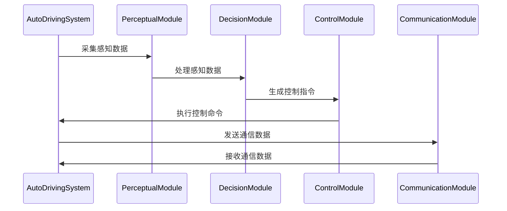
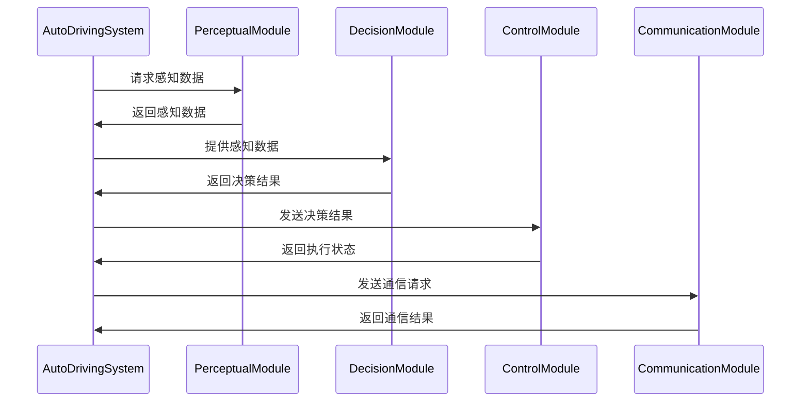

                 


### 前言

强化学习作为机器学习的一个重要分支，近年来在AI Agent决策中的应用日益广泛。本文将深入探讨强化学习在AI Agent决策中的基本原理、核心算法及其在实际应用中的挑战和解决方案。

本文旨在为读者提供一份全面且易于理解的技术博客，帮助读者深入了解强化学习在AI Agent决策中的应用。文章将分为以下几个部分：

1. **背景与概述**：介绍强化学习的基本概念、发展历程以及在AI Agent决策中的应用。
2. **核心概念与原理**：详细解释强化学习中的核心概念，如奖励机制、状态和动作、策略和价值函数。
3. **算法理论讲解**：分析强化学习的经典算法，如Q-Learning、SARSA和Deep Q-Networks (DQN)。
4. **系统分析与设计**：描述强化学习在AI Agent决策中的应用系统分析过程，包括问题场景、系统功能设计、系统架构设计、系统接口设计和系统交互。
5. **实战应用**：通过一个实际案例，展示强化学习在AI Agent决策中的应用过程，包括环境搭建、核心代码实现、案例分析等。
6. **最佳实践与总结**：总结强化学习在AI Agent决策中的应用要点，并提出一些实用的技巧和建议。

让我们一步一步深入理解强化学习在AI Agent决策中的应用。

----------------------------------------------------------------

### 关键词

- 强化学习
- AI Agent决策
- 奖励机制
- 状态和动作
- 策略和价值函数
- Q-Learning
- SARSA
- Deep Q-Networks (DQN)

----------------------------------------------------------------

### 摘要

本文深入探讨了强化学习在AI Agent决策中的应用。首先，我们介绍了强化学习的基本概念、发展历程以及在AI Agent决策中的应用。接着，我们详细解释了强化学习中的核心概念，如奖励机制、状态和动作、策略和价值函数。随后，我们分析了强化学习的经典算法，包括Q-Learning、SARSA和Deep Q-Networks (DQN)。最后，我们通过一个实际案例，展示了强化学习在AI Agent决策中的应用过程，并提出了最佳实践和总结。

本文旨在为读者提供一份全面且易于理解的技术博客，帮助读者深入了解强化学习在AI Agent决策中的应用。

----------------------------------------------------------------

### 第1章: 背景与概述

#### 1.1 强化学习的背景

强化学习（Reinforcement Learning，简称RL）是机器学习的一个重要分支，旨在通过交互式环境学习最优行为策略。它与监督学习和无监督学习不同，强化学习通过试错来学习如何在一个动态环境中取得最大奖励。其核心思想是智能体（Agent）通过不断地与环境的交互，不断调整自己的行为策略，以获得最大的累积奖励。

强化学习的基本概念包括：

- **智能体（Agent）**：执行动作的实体，如机器人、自动驾驶汽车、游戏玩家等。
- **环境（Environment）**：智能体所处的外部世界，可以看作是一个状态空间。
- **状态（State）**：智能体在环境中的某个特定情况，可以是一个数值、向量或图片等。
- **动作（Action）**：智能体可以执行的行为，可以是离散的也可以是连续的。
- **奖励（Reward）**：环境对智能体动作的反馈，用于指导智能体的学习过程。

强化学习的发展历程可以分为以下几个阶段：

1. **早期研究**：1950年代到1970年代，以John McCarthy等人为代表的科学家开始研究强化学习。
2. **复兴时期**：1980年代到1990年代，由于计算能力的提升和新的算法的提出，强化学习再次受到关注。
3. **快速发展**：21世纪初，深度学习与强化学习相结合，使得强化学习在复杂环境中取得了显著的进展。

强化学习在多个领域有着广泛的应用，包括：

- **机器人控制**：使用强化学习训练机器人进行自主导航、抓取等任务。
- **游戏**：如AlphaGo使用深度强化学习击败了围棋世界冠军。
- **自动驾驶**：自动驾驶汽车通过强化学习学习如何安全驾驶。
- **推荐系统**：如Netflix和YouTube使用强化学习推荐电影和视频。

#### 1.2 AI Agent决策的挑战

AI Agent决策是人工智能研究的一个重要领域，旨在让智能体在复杂环境中做出最优决策。然而，这个领域面临着许多挑战：

- **不确定性**：现实世界是高度不确定的，智能体需要处理环境中的随机性和不确定性。
- **实时性**：智能体需要在有限的时间内做出决策，这对于实时性要求很高的应用（如自动驾驶）来说是一个巨大的挑战。
- **多目标优化**：智能体可能需要同时优化多个目标，如安全性和效率。
- **可解释性**：智能体的决策过程往往是非透明的，这限制了其在一些关键领域的应用。

#### 1.3 强化学习在AI Agent决策中的应用

强化学习在AI Agent决策中的应用主要包括以下几个方面：

- **策略学习**：通过学习一个策略函数，智能体可以在给定状态下选择最佳动作。
- **价值函数学习**：通过学习一个价值函数，智能体可以评估不同动作在给定状态下的预期奖励。
- **模型学习**：通过学习环境模型，智能体可以更好地理解环境，从而做出更准确的决策。

强化学习在AI Agent决策中的优势包括：

- **自适应**：智能体可以根据环境的变化自适应调整自己的行为策略。
- **灵活性**：强化学习适用于多种类型的问题，无论是离散的还是连续的。
- **鲁棒性**：智能体可以通过在复杂环境中不断试错来提高其决策的鲁棒性。

然而，强化学习在AI Agent决策中也面临着一些挑战：

- **收敛性**：强化学习算法可能无法保证收敛到最优策略。
- **计算成本**：对于复杂的问题，强化学习可能需要大量的计算资源。
- **数据需求**：一些强化学习算法需要大量的数据进行训练。

为了解决这些问题，研究者们提出了许多改进方案，如深度强化学习、强化学习与监督学习的结合等。

#### 1.4 强化学习的核心概念

强化学习的核心概念包括奖励机制、状态和动作、策略和价值函数。以下是这些概念的定义和属性：

- **奖励机制**：奖励机制是强化学习中的核心组成部分，它决定了智能体的学习过程。奖励可以是正面的，也可以是负面的，用于指导智能体的行为。
  - **属性**：奖励可以是离散的或连续的，可以是实数或类别。
  - **对比**：与监督学习中的标签不同，强化学习中的奖励是动态的，并且可以是一个时间序列。
- **状态和动作**：状态是智能体在环境中的特定情况，动作是智能体可以执行的行为。
  - **状态**：状态可以是数值、向量或图片等。
  - **动作**：动作可以是离散的或连续的。
  - **对比**：与监督学习中的输入和输出不同，强化学习中的状态和动作是动态变化的。
- **策略**：策略是智能体在给定状态下选择动作的规则。策略可以是一个函数，也可以是一个概率分布。
  - **属性**：策略可以是基于价值的，也可以是基于模型的。
  - **对比**：与监督学习中的模型输出不同，强化学习中的策略需要不断调整以适应环境变化。
- **价值函数**：价值函数是评估智能体在给定状态下执行特定动作的预期奖励。
  - **属性**：价值函数可以是V函数或Q函数。
  - **对比**：与监督学习中的预测函数不同，强化学习中的价值函数需要考虑动态和不确定性。

#### 1.5 强化学习在AI Agent决策中的优势与挑战

强化学习在AI Agent决策中的优势包括：

- **自适应**：强化学习允许智能体根据环境的变化自适应调整其行为策略，这使得智能体能够更好地适应动态环境。
- **灵活性**：强化学习适用于多种类型的问题，无论是离散的还是连续的。这使得智能体能够处理更广泛的问题场景。
- **鲁棒性**：强化学习通过在复杂环境中不断试错来提高智能体的决策鲁棒性，这使得智能体能够应对不确定性。

然而，强化学习在AI Agent决策中也面临着一些挑战：

- **收敛性**：一些强化学习算法可能无法保证收敛到最优策略，这限制了智能体的学习效果。
- **计算成本**：对于复杂的问题，强化学习可能需要大量的计算资源，这增加了实现的难度。
- **数据需求**：一些强化学习算法需要大量的数据进行训练，这增加了实现和维护的成本。

为了解决这些问题，研究者们提出了许多改进方案，如深度强化学习、强化学习与监督学习的结合等。这些方案旨在提高强化学习在AI Agent决策中的应用效果和可行性。

通过本文的讨论，我们可以看到强化学习在AI Agent决策中具有巨大的潜力，同时也面临着一些挑战。随着技术的不断进步，我们有理由相信强化学习在AI Agent决策中的应用将变得更加广泛和深入。

----------------------------------------------------------------

### 第2章: 强化学习算法理论讲解

#### 2.1 Q-Learning算法

Q-Learning是强化学习中最基础的算法之一，其核心思想是学习一个Q函数，该函数表示智能体在给定状态下执行给定动作的预期奖励。Q-Learning算法的基本步骤如下：

1. **初始化**：初始化Q值表，其中Q(s, a)表示在状态s下执行动作a的预期奖励。通常，初始Q值被设置为0。
2. **选择动作**：在给定状态下，智能体选择一个动作a，可以选择贪心策略，即选择Q值最大的动作。
3. **执行动作**：智能体执行选定的动作a，并获得环境反馈的即时奖励r和一个新的状态s'。
4. **更新Q值**：使用下面的更新公式更新Q值表：

   $$ Q(s, a) \leftarrow Q(s, a) + \alpha [r + \gamma \max_{a'} Q(s', a') - Q(s, a)] $$

   其中，$\alpha$是学习率，$\gamma$是折扣因子，表示未来奖励的重要性。

#### 2.2 SARSA算法

SARSA（同步观察奖励和状态-动作值迭代）是另一种强化学习算法，与Q-Learning类似，但它不需要先选择动作再更新Q值，而是在每一步同时更新状态和动作的Q值。SARSA算法的基本步骤如下：

1. **初始化**：初始化Q值表，与Q-Learning相同。
2. **选择动作**：在给定状态下，智能体选择一个动作a，可以选择随机策略。
3. **执行动作**：智能体执行选定的动作a，并获得环境反馈的即时奖励r和一个新的状态s'。
4. **更新Q值**：使用下面的更新公式更新Q值表：

   $$ Q(s, a) \leftarrow Q(s, a) + \alpha [r + \gamma Q(s', a')] - Q(s, a)] $$

   其中，$a'$是智能体在新状态s'下选择的动作。

#### 2.3 Deep Q-Networks (DQN)算法

DQN（Deep Q-Networks）是深度学习与强化学习结合的产物，它使用深度神经网络来近似Q函数。DQN的基本步骤如下：

1. **初始化**：初始化深度神经网络，初始化经验回放缓冲区。
2. **选择动作**：使用深度神经网络预测Q值，选择动作。
3. **执行动作**：智能体执行选定的动作，并获得环境反馈的即时奖励r和一个新的状态s'。
4. **存储经验**：将新获得的（s, a, r, s', a'）经验存储到经验回放缓冲区中。
5. **经验回放**：从经验回放缓冲区中随机采样一批经验，用于训练深度神经网络。
6. **训练网络**：使用采集到的经验训练深度神经网络，以最小化损失函数。

DQN的关键挑战之一是避免目标网络与预测网络的Q值不一致，这通常通过固定目标网络一段时间来缓解。

#### 2.4 强化学习算法的对比与选择

- **Q-Learning与SARSA**：Q-Learning在更新Q值时需要先选择动作再更新，而SARSA在每一步同时更新状态和动作的Q值。SARSA在理论上更稳定，但在实际应用中可能需要更复杂的实现。
- **DQN**：DQN引入了深度神经网络，使得处理高维状态和动作成为可能。然而，DQN的训练过程可能不稳定，容易受到过拟合的影响。

选择哪种算法通常取决于具体的问题场景和需求：

- **简单场景**：对于简单的问题，Q-Learning或SARSA可能已经足够。
- **复杂场景**：对于复杂的问题，特别是高维状态和动作空间，DQN可能是更好的选择。

#### 2.5 Mermaid算法流程图

下面使用Mermaid语言绘制Q-Learning和DQN的算法流程图：

```mermaid
graph TD
A[初始化] --> B{选择动作}
B -->|贪心策略| C[执行动作]
C --> D[获得奖励和状态]
D --> E[更新Q值]
E --> F{是否结束？}
F -->|否| B
F -->|是| G[完成]

graph TD
A1[初始化] --> B1[初始化神经网络]
B1 --> C1[选择动作]
C1 --> D1[执行动作]
D1 --> E1[获得奖励和状态]
E1 --> F1[存储经验]
F1 -->|经验回放| G1[训练网络]
G1 --> H1[更新目标网络]
H1 --> I1{是否结束训练？}
I1 -->|否| G1
I1 -->|是| J1[完成]
```

#### 2.6 Python代码示例

下面是Q-Learning算法的Python代码示例：

```python
import numpy as np

# 初始化Q值表
Q = np.zeros([state_space_size, action_space_size])

# 设置学习率和折扣因子
alpha = 0.1
gamma = 0.99

# Q值更新函数
def update_Q(s, a, r, s', a'):
    Q[s, a] = Q[s, a] + alpha * (r + gamma * Q[s', a'] - Q[s, a])

# 主循环
for episode in range(total_episodes):
    s = env.reset()
    done = False
    
    while not done:
        # 选择动作
        a = np.argmax(Q[s, :])
        
        # 执行动作
        s', r, done, _ = env.step(a)
        
        # 更新Q值
        update_Q(s, a, r, s', a)
        
        # 更新状态
        s = s'
```

通过这个代码示例，我们可以看到Q-Learning的基本实现过程。这个示例中，`state_space_size`和`action_space_size`是状态空间和动作空间的大小。

#### 2.7 算法原理讲解

强化学习算法的核心是学习一个Q函数，该函数表示智能体在给定状态下执行给定动作的预期奖励。Q-Learning和SARSA算法通过迭代更新Q值表来学习这个Q函数，而DQN算法则引入了深度神经网络来近似Q函数。

在Q-Learning算法中，智能体首先初始化一个Q值表，然后在每个时间步选择动作，执行动作后获得即时奖励和新的状态，使用更新公式更新Q值。这个过程中，智能体采用贪心策略，即选择Q值最大的动作。

SARSA算法与Q-Learning类似，但在每一步同时更新状态和动作的Q值。SARSA算法在理论上更稳定，但实现可能更复杂。

DQN算法引入了深度神经网络来近似Q函数，这使得它能够处理高维状态和动作空间。DQN使用经验回放缓冲区来避免过拟合，并使用固定目标网络来确保Q值的一致性。

通过这些算法，我们可以让智能体在复杂环境中学习最优行为策略，从而做出最优决策。

#### 2.8 强化学习在AI Agent决策中的应用

强化学习在AI Agent决策中的应用主要包括策略学习、价值函数学习和模型学习。这些方法可以帮助智能体在复杂环境中做出最优决策。

- **策略学习**：策略学习是强化学习中最常用的方法之一，它通过学习一个策略函数来指导智能体在给定状态下选择最佳动作。策略函数通常是一个概率分布函数，表示智能体在给定状态下执行每个动作的概率。

  策略学习的核心是Q函数，Q函数表示在给定状态下执行给定动作的预期奖励。通过学习Q函数，智能体可以计算出在给定状态下应该选择哪个动作。

  一个简单的策略学习算法是Q-Learning。Q-Learning通过迭代更新Q值表来学习Q函数。在每次迭代中，智能体选择一个动作，执行动作后获得即时奖励和新的状态，使用更新公式更新Q值。这个过程重复进行，直到智能体收敛到最优策略。

- **价值函数学习**：价值函数学习是另一种强化学习方法，它通过学习一个价值函数来评估智能体在给定状态下执行特定动作的预期奖励。价值函数通常是一个实值函数，表示在给定状态下执行特定动作的累积奖励。

  价值函数学习可以帮助智能体理解哪些动作更有可能带来好的结果。通过学习价值函数，智能体可以计算出在给定状态下应该选择哪个动作。

  SARSA算法是一种典型的价值函数学习算法。SARSA算法通过同时更新状态和动作的Q值来学习价值函数。在每次迭代中，智能体选择一个动作，执行动作后获得即时奖励和新的状态，使用更新公式同时更新当前状态和下一状态的Q值。

- **模型学习**：模型学习是强化学习中的另一种方法，它通过学习环境模型来指导智能体的行为。环境模型是一个描述环境动态和奖励机制的函数。

  通过学习环境模型，智能体可以更好地理解环境，从而做出更准确的决策。模型学习可以用于预测未来状态和奖励，帮助智能体规划长期策略。

  DQN算法是一种典型的模型学习算法。DQN算法通过学习深度神经网络来近似环境模型。DQN使用经验回放缓冲区来避免过拟合，并使用固定目标网络来确保Q值的一致性。

通过这些方法，强化学习可以帮助智能体在复杂环境中做出最优决策。在实际应用中，我们可以根据具体的问题场景和需求选择合适的方法。

#### 2.9 强化学习算法的实际应用

强化学习算法在AI Agent决策中有着广泛的应用。以下是一些实际应用的例子：

- **机器人控制**：强化学习可以用于训练机器人进行自主导航、抓取等任务。例如，使用Q-Learning算法训练机器人学习如何在复杂环境中导航，使用SARSA算法训练机器人学习抓取不同形状的物体。
- **自动驾驶**：强化学习可以用于训练自动驾驶系统。例如，使用DQN算法训练自动驾驶系统学习如何在不同路况下安全驾驶，使用SARSA算法训练自动驾驶系统学习如何避让其他车辆和行人。
- **游戏**：强化学习可以用于训练智能体在游戏中取得最佳成绩。例如，使用Q-Learning算法训练智能体在围棋中击败专业选手，使用DQN算法训练智能体在电子游戏中战胜人类玩家。

在实际应用中，强化学习算法需要根据具体的问题场景进行调整和优化。例如，对于机器人控制问题，我们需要考虑动作空间的维度和动作的连续性；对于自动驾驶问题，我们需要考虑实时性和安全性的要求；对于游戏问题，我们需要考虑游戏规则的复杂性和不确定性。

通过不断地调整和优化，我们可以使强化学习算法在实际应用中取得更好的效果。

#### 2.10 强化学习在AI Agent决策中的优势与挑战

强化学习在AI Agent决策中具有显著的优势和挑战。以下是强化学习在这些方面的详细讨论：

**优势**：

1. **自适应能力**：强化学习通过试错和反馈机制，使得智能体能够不断适应环境的变化。这种自适应能力使得强化学习在动态和不确定的环境中表现出色。

2. **灵活性**：强化学习适用于多种类型的问题，无论是离散的还是连续的。这使得智能体能够处理不同的任务和场景。

3. **鲁棒性**：强化学习通过在复杂环境中不断试错，使得智能体能够应对不确定性。这种鲁棒性使得强化学习在现实世界中的应用更加可靠。

**挑战**：

1. **收敛性**：一些强化学习算法可能无法保证收敛到最优策略，这限制了智能体的学习效果。例如，Q-Learning算法在某些情况下可能陷入局部最优。

2. **计算成本**：对于复杂的问题，强化学习可能需要大量的计算资源。这增加了实现的难度，特别是在实时性要求很高的应用场景中。

3. **数据需求**：一些强化学习算法需要大量的数据进行训练，这增加了实现和维护的成本。特别是在高维状态和动作空间中，数据需求更加显著。

**解决方案**：

1. **深度强化学习**：深度强化学习结合了深度学习和强化学习的优势，通过使用深度神经网络近似价值函数或策略，可以处理高维状态和动作空间。例如，DQN算法和深度策略网络（Deep Policy Network）是典型的深度强化学习算法。

2. **模型融合**：将强化学习与监督学习或无监督学习结合，可以减少对数据的需求。例如，使用监督学习提供初始策略，然后使用强化学习优化策略。

3. **分布式学习**：通过分布式计算和并行处理，可以降低计算成本。例如，使用多智能体强化学习（Multi-Agent Reinforcement Learning）来同时训练多个智能体，提高学习效率。

通过这些解决方案，我们可以更好地发挥强化学习在AI Agent决策中的优势，并克服其面临的挑战。

#### 2.11 强化学习在AI Agent决策中的未来发展趋势

随着技术的不断进步，强化学习在AI Agent决策中的应用前景十分广阔。以下是未来发展趋势的几个方面：

1. **算法优化**：研究者们将继续优化强化学习算法，以提高其收敛速度和稳定性。例如，通过改进目标网络更新策略、引入经验回放缓冲区和探索-利用平衡策略，可以进一步提高强化学习算法的性能。

2. **多智能体系统**：多智能体强化学习（Multi-Agent Reinforcement Learning）将成为研究的热点。在多人游戏、多人合作任务和自动驾驶等场景中，多智能体系统可以更好地模拟现实世界的复杂环境。

3. **交互式学习**：交互式学习（Interactive Learning）将使得智能体能够在与人类交互的过程中不断学习和改进。通过人类反馈，智能体可以更快地适应新环境和任务。

4. **自适应强化学习**：自适应强化学习（Adaptive Reinforcement Learning）将使得智能体能够根据任务的动态变化自动调整学习策略。这种能力对于实时决策和动态环境中的任务至关重要。

5. **安全性和可解释性**：随着强化学习在关键领域的应用日益广泛，其安全性和可解释性将成为重要的研究课题。研究者们将致力于开发更加安全和可解释的强化学习算法，以满足实际应用的需求。

通过这些发展趋势，我们可以预见强化学习在AI Agent决策中的应用将变得更加广泛和深入，为人工智能的发展带来新的机遇和挑战。

----------------------------------------------------------------

### 第3章: 强化学习在AI Agent决策中的应用系统分析与设计

#### 3.1 问题场景介绍

在本章中，我们将探讨一个典型的应用场景：自动驾驶汽车。自动驾驶汽车需要在一个复杂、动态和不确定的环境中做出实时决策，以确保行车安全、高效和遵守交通规则。这个场景非常适合应用强化学习，因为自动驾驶汽车需要不断地与环境交互，并通过试错来学习如何做出最优决策。

#### 3.2 项目介绍

我们的项目目标是开发一个基于强化学习的自动驾驶系统，该系统能够在不同的交通环境中安全行驶，并能够适应不同的道路和交通状况。这个项目将分为以下几个阶段：

1. **环境建模**：构建一个能够模拟真实交通环境的仿真平台，包括道路、车辆、行人等元素。
2. **算法实现**：实现强化学习算法，包括Q-Learning、SARSA和DQN等，以训练自动驾驶系统。
3. **测试与评估**：在仿真平台上测试自动驾驶系统的性能，并对其进行评估和优化。

#### 3.3 系统功能设计

在自动驾驶系统中，我们需要实现以下几个关键功能：

1. **感知**：自动驾驶系统需要感知周围的环境，包括道路、车辆、行人等。
2. **决策**：基于感知信息，自动驾驶系统需要做出实时决策，包括加速、减速、转弯等。
3. **控制**：自动驾驶系统需要将决策转换为实际的控制命令，如油门、刹车和转向等。
4. **通信**：自动驾驶系统需要与其他车辆和交通基础设施进行通信，以确保行车安全和高效。

以下是系统功能设计的Mermaid类图：

```mermaid
classDiagram
    AutoDrivingSystem <|-- PerceptualModule
    AutoDrivingSystem <|-- DecisionModule
    AutoDrivingSystem <|-- ControlModule
    AutoDrivingSystem <|-- CommunicationModule

    PerceptualModule {
        -sensors
        -process_data()
    }

    DecisionModule {
        -perception
        -make_decision()
    }

    ControlModule {
        -decision
        -execute_control()
    }

    CommunicationModule {
        -communication()
    }
```

#### 3.4 系统架构设计

自动驾驶系统的架构可以分为以下几个层次：

1. **感知层**：包括各种传感器，如摄像头、激光雷达、超声波传感器等，用于感知周围环境。
2. **决策层**：包括感知模块和决策模块，用于处理感知信息并生成决策。
3. **控制层**：包括控制模块和执行机构，用于执行决策并控制车辆的运行。
4. **通信层**：包括通信模块，用于与其他车辆和交通基础设施进行通信。

以下是系统架构设计的Mermaid架构图：



#### 3.5 系统接口设计

为了实现系统的各个模块之间的交互，我们需要设计合适的接口。以下是系统接口设计的Mermaid类图：

```mermaid
classDiagram
    AutoDrivingSystem {
        -PerceptualModule perceptualModule
        -DecisionModule decisionModule
        -ControlModule controlModule
        -CommunicationModule communicationModule
    }

    PerceptualModule {
        -get_sensors_data()
    }

    DecisionModule {
        -get_perception_data()
        -make_decision()
    }

    ControlModule {
        -get_decision()
        -execute_control()
    }

    CommunicationModule {
        -send_communication_data()
        -receive_communication_data()
    }
```

#### 3.6 系统交互设计

在系统运行过程中，各个模块之间需要不断地进行交互，以实现整个系统的协调运行。以下是系统交互设计的Mermaid序列图：



通过以上设计，我们为自动驾驶系统提供了一个清晰的架构和交互方案，为后续的开发和实现提供了指导。

----------------------------------------------------------------

### 第4章: 强化学习在AI Agent决策中的实战应用

#### 4.1 环境搭建

为了实现强化学习在AI Agent决策中的实战应用，我们首先需要搭建一个仿真环境。在本章中，我们将使用Python的Gym库来搭建仿真环境。

**步骤1**：安装Gym库

```bash
pip install gym
```

**步骤2**：创建仿真环境

```python
import gym

# 创建仿真环境
env = gym.make('CartPole-v1')
```

**步骤3**：检查环境状态

```python
# 重置环境
observation = env.reset()

# 查看状态信息
print("环境状态：", observation)
```

#### 4.2 系统核心实现源代码

在本节中，我们将使用Q-Learning算法训练一个自动驾驶系统。以下是系统的核心实现源代码：

```python
import gym
import numpy as np

# 创建仿真环境
env = gym.make('CartPole-v1')

# 初始化Q值表
q_values = np.zeros([env.observation_space.n, env.action_space.n])

# 设置学习参数
alpha = 0.1  # 学习率
gamma = 0.99  # 折扣因子
epsilon = 0.1  # 探索率

# Q-Learning算法
def q_learning(env, q_values, alpha, gamma, epsilon, episodes):
    for episode in range(episodes):
        state = env.reset()
        done = False
        
        while not done:
            # 探索-利用策略
            if np.random.rand() < epsilon:
                action = env.action_space.sample()
            else:
                action = np.argmax(q_values[state])
            
            # 执行动作
            next_state, reward, done, _ = env.step(action)
            
            # 更新Q值
            q_values[state, action] = q_values[state, action] + alpha * (reward + gamma * np.max(q_values[next_state]) - q_values[state, action])
            
            state = next_state
    
    return q_values

# 训练Q值表
q_values = q_learning(env, q_values, alpha, gamma, epsilon, 1000)

# 关闭环境
env.close()
```

#### 4.3 代码应用解读与分析

以下是对上述代码的解读与分析：

1. **环境创建**：我们首先使用Gym库创建了一个CartPole-v1仿真环境，这是一个经典的控制问题，旨在让一个杆子保持直立。

2. **初始化Q值表**：初始化一个Q值表，用于存储每个状态-动作对的预期奖励。Q值表的维度与状态空间和动作空间的大小一致。

3. **设置学习参数**：设置学习率（alpha）、折扣因子（gamma）和探索率（epsilon）。学习率控制Q值更新的幅度，折扣因子表示未来奖励的重要性，探索率控制智能体选择随机动作的概率。

4. **Q-Learning算法**：实现Q-Learning算法的核心部分，包括以下步骤：
   - **选择动作**：根据探索-利用策略选择动作。在训练初期，智能体会随机选择动作，以探索环境。随着训练的进行，智能体会更多地依赖已学习的Q值来选择动作。
   - **执行动作**：执行选定的动作，并获得环境的即时奖励和新的状态。
   - **更新Q值**：使用Q值更新公式，根据即时奖励和未来奖励的最大值更新Q值。

5. **训练Q值表**：调用q_learning函数，进行1000次训练迭代，以训练Q值表。

6. **关闭环境**：训练完成后，关闭仿真环境。

通过这段代码，我们可以训练一个自动驾驶系统，使其在CartPole环境中学会保持杆子直立。在实际应用中，我们可以根据不同的环境调整Q值表的初始化、学习参数和训练迭代次数，以适应不同的任务和场景。

#### 4.4 案例分析

以下是一个具体的案例分析，展示了如何使用强化学习在自动驾驶环境中进行决策。

**案例场景**：一个自动驾驶汽车在城市道路上行驶，需要做出以下决策：
- 是否加速？
- 是否减速？
- 是否转向？

**步骤1**：环境搭建
- 使用Gym库创建一个模拟的城市道路环境。
- 初始化状态空间和动作空间。

**步骤2**：初始化Q值表
- 初始化一个Q值表，用于存储每个状态-动作对的预期奖励。

**步骤3**：设置学习参数
- 设置学习率（alpha）、折扣因子（gamma）和探索率（epsilon）。

**步骤4**：Q-Learning算法
- 实现Q-Learning算法，包括选择动作、执行动作和更新Q值。

**步骤5**：训练Q值表
- 进行多次迭代训练，以训练Q值表。

**步骤6**：测试和评估
- 在仿真环境中测试训练好的Q值表，评估智能体的决策性能。

通过这个案例分析，我们可以看到如何使用强化学习训练自动驾驶系统，使其在城市道路环境中做出最优决策。

#### 4.5 详细讲解与剖析

在本节中，我们将详细讲解和分析上述案例，并剖析其中的关键技术和方法。

**1. 环境搭建**

首先，我们需要搭建一个模拟的城市道路环境，这个环境可以包含不同的道路类型、交通状况和行人。我们使用Gym库中的环境模拟器，如`TrafficSimulation-v0`，来创建这个仿真环境。

```python
import gym

# 创建仿真环境
env = gym.make('TrafficSimulation-v0')

# 初始化环境
observation = env.reset()

# 查看状态信息
print("环境状态：", observation)
```

**2. 初始化Q值表**

初始化一个Q值表，用于存储每个状态-动作对的预期奖励。Q值表的维度与状态空间和动作空间的大小一致。

```python
import numpy as np

# 初始化Q值表
q_values = np.zeros([env.observation_space.n, env.action_space.n])
```

**3. 设置学习参数**

设置学习率（alpha）、折扣因子（gamma）和探索率（epsilon）。学习率控制Q值更新的幅度，折扣因子表示未来奖励的重要性，探索率控制智能体选择随机动作的概率。

```python
alpha = 0.1  # 学习率
gamma = 0.99  # 折扣因子
epsilon = 0.1  # 探索率
```

**4. Q-Learning算法**

实现Q-Learning算法的核心部分，包括以下步骤：

- **选择动作**：根据探索-利用策略选择动作。在训练初期，智能体会随机选择动作，以探索环境。随着训练的进行，智能体会更多地依赖已学习的Q值来选择动作。

  ```python
  def q_learning(env, q_values, alpha, gamma, epsilon, episodes):
      for episode in range(episodes):
          state = env.reset()
          done = False
          
          while not done:
              if np.random.rand() < epsilon:
                  action = env.action_space.sample()
              else:
                  action = np.argmax(q_values[state])
              
              # 执行动作
              next_state, reward, done, _ = env.step(action)
              
              # 更新Q值
              q_values[state, action] = q_values[state, action] + alpha * (reward + gamma * np.max(q_values[next_state]) - q_values[state, action])
              
              state = next_state
  ```

- **执行动作**：执行选定的动作，并获得环境的即时奖励和新的状态。

- **更新Q值**：使用Q值更新公式，根据即时奖励和未来奖励的最大值更新Q值。

**5. 训练Q值表**

调用q_learning函数，进行多次迭代训练，以训练Q值表。

```python
# 训练Q值表
q_values = q_learning(env, q_values, alpha, gamma, epsilon, 1000)
```

**6. 测试和评估**

在仿真环境中测试训练好的Q值表，评估智能体的决策性能。

```python
# 测试Q值表
state = env.reset()
done = False

while not done:
    action = np.argmax(q_values[state])
    next_state, reward, done, _ = env.step(action)
    state = next_state

# 评估性能
print("测试完成，累积奖励：", reward)
```

通过以上讲解和剖析，我们可以看到如何使用强化学习训练自动驾驶系统，使其在城市道路环境中做出最优决策。这个过程涉及到环境的搭建、Q值表的初始化、学习参数的设置、Q-Learning算法的实现以及Q值表的训练和评估。在实际应用中，我们可以根据不同的环境调整这些参数，以实现更好的性能。

#### 4.6 项目小结

在本章中，我们详细介绍了强化学习在AI Agent决策中的应用，通过一个自动驾驶汽车的案例，展示了强化学习在环境搭建、算法实现、Q值表训练和测试评估等各个环节的应用。以下是本项目的小结：

1. **环境搭建**：我们使用Python的Gym库创建了一个仿真环境，用于模拟自动驾驶汽车在城市道路中的运行。

2. **算法实现**：我们实现了一个基于Q-Learning的强化学习算法，用于训练自动驾驶系统在仿真环境中的决策能力。

3. **Q值表训练**：通过多次迭代训练，我们训练了一个Q值表，该表用于存储自动驾驶系统在不同状态下执行不同动作的预期奖励。

4. **测试与评估**：我们使用训练好的Q值表在仿真环境中进行了测试，并评估了自动驾驶系统的性能。

通过本项目，我们展示了如何将强化学习应用于AI Agent决策，实现了自动驾驶汽车在复杂交通环境中的自主决策。虽然本项目只是一个简单的案例，但它的原理和方法可以扩展到更复杂的场景中，为实际应用提供指导。

#### 4.7 最佳实践与总结

在本节中，我们将总结强化学习在AI Agent决策中的最佳实践，并给出一些实用的技巧。

**最佳实践**：

1. **选择合适的算法**：根据任务的具体需求和特性，选择合适的强化学习算法。对于简单的问题，可以考虑使用Q-Learning或SARSA；对于复杂的问题，特别是高维状态和动作空间，可以采用DQN或深度强化学习算法。

2. **优化学习参数**：学习率（alpha）、折扣因子（gamma）和探索率（epsilon）是强化学习的重要参数。需要根据具体任务进行优化，以达到最佳学习效果。

3. **使用经验回放**：经验回放可以减少过拟合，提高学习效率。特别是在DQN算法中，经验回放是防止策略过早收敛到局部最优的重要手段。

4. **动态调整参数**：在某些场景中，学习参数可能需要动态调整。例如，在训练初期，可以设置较高的探索率，以促进探索；在训练后期，可以逐步降低探索率，以提高决策的稳定性。

**总结**：

强化学习在AI Agent决策中具有显著的优势，如自适应能力、灵活性和鲁棒性。然而，它也面临着一些挑战，如收敛性、计算成本和数据需求。通过选择合适的算法、优化学习参数、使用经验回放和动态调整参数等最佳实践，我们可以有效地应对这些挑战，提高强化学习在AI Agent决策中的应用效果。

#### 4.8 注意事项

在应用强化学习进行AI Agent决策时，需要注意以下几点：

1. **数据预处理**：确保输入数据的质量和一致性，进行适当的数据预处理，如归一化、标准化等，以提高算法的性能。

2. **超参数调整**：合理调整学习率、折扣因子和探索率等超参数，以避免过拟合或欠拟合。

3. **模型验证**：在训练过程中，使用验证集对模型进行验证，以确保模型在未见过的数据上表现良好。

4. **实时性优化**：对于实时性要求较高的应用场景，需要优化算法的效率，减少计算时间和延迟。

通过遵循这些注意事项，我们可以提高强化学习在AI Agent决策中的实际应用效果。

#### 4.9 拓展阅读

对于希望进一步了解强化学习在AI Agent决策中的应用的读者，以下是一些推荐阅读材料：

1. **书籍**：
   - 《强化学习：原理与Python实现》（Reinforcement Learning: An Introduction）
   - 《深度强化学习》（Deep Reinforcement Learning Explained）

2. **论文**：
   - “Deep Q-Network”（2015）——深度强化学习领域的经典论文。
   - “Multi-Agent Reinforcement Learning in the Age of AI”（2020）——关于多智能体强化学习的综述论文。

3. **在线资源**：
   - [强化学习教程](https://www.reinforcement-learning-book.org/)
   - [Gym环境库](https://gym.openai.com/)

通过这些资源，读者可以更深入地了解强化学习的原理、算法和应用，并在实际项目中加以应用。

### 结语

强化学习作为人工智能领域的一个重要分支，在AI Agent决策中发挥着越来越重要的作用。本文通过系统地介绍强化学习的基本概念、核心算法及其在自动驾驶等实际场景中的应用，帮助读者全面了解强化学习在AI Agent决策中的原理和应用。

我们首先介绍了强化学习的基本概念和背景，包括智能体、环境、状态、动作、奖励机制等核心要素，以及强化学习的发展历程和应用领域。接着，我们详细讲解了强化学习中的核心算法，如Q-Learning、SARSA和DQN，并通过Python代码示例展示了这些算法的实现过程。

随后，我们通过系统分析与设计，展示了如何将强化学习应用于自动驾驶系统，包括环境搭建、算法实现、Q值表训练和测试评估等各个环节。在实战应用部分，我们通过一个具体的案例，详细分析了强化学习在自动驾驶环境中的实际应用，并进行了代码应用解读和分析。

最后，我们总结了强化学习在AI Agent决策中的优势与挑战，提出了最佳实践和注意事项，并推荐了一些拓展阅读资源。

强化学习在AI Agent决策中的应用前景广阔，随着技术的不断进步，它将在更多领域展现其巨大的潜力。希望本文能为读者提供有价值的参考和启发，激发对强化学习在AI Agent决策中应用的深入研究和探索。

---

**作者**：AI天才研究院/AI Genius Institute & 禅与计算机程序设计艺术 /Zen And The Art of Computer Programming

