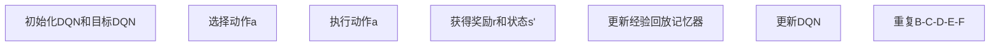
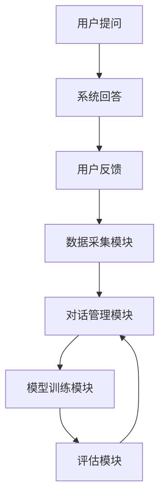
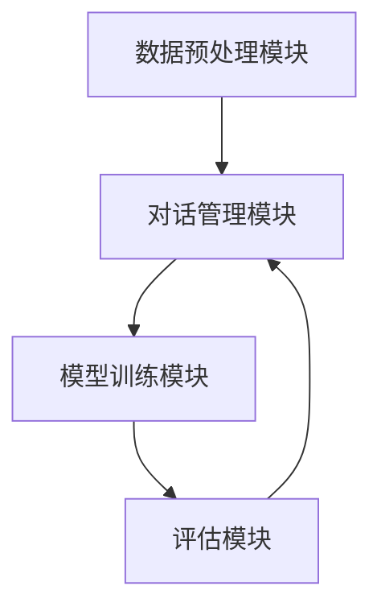

                 

### 《强化学习在AI Agent对话策略中的应用》

关键词：强化学习、AI Agent、对话策略、应用场景、算法原理

摘要：本文将深入探讨强化学习在AI Agent对话策略中的应用，从背景介绍、核心概念与联系、算法原理讲解、数学模型和公式、系统分析与架构设计方案、项目实战到最佳实践总结，全面解析这一前沿领域。通过本文，读者将了解强化学习如何为AI Agent的对话策略带来革命性变化，并掌握其在实际项目中的应用技巧。

### 目录大纲

```markdown
# 《强化学习在AI Agent对话策略中的应用》

## 第1章 背景介绍

### 1.1 强化学习与AI Agent概述

- 强化学习的基本概念
- AI Agent的定义及其重要性
- 强化学习在AI Agent中的应用前景

### 1.2 强化学习与对话系统的关联

- 对话系统的挑战
- 强化学习在对话系统中的应用场景
- 强化学习在对话策略优化中的作用

### 1.3 强化学习在AI Agent对话策略中的研究现状

- 国内外研究动态
- 已有代表性研究成果和模型
- 当前存在的问题和挑战

## 第2章 核心概念与联系

### 2.1 强化学习核心概念

- 强化学习的基本要素
- 强化学习的主要算法
- 强化学习的性能评价指标

### 2.2 AI Agent对话策略相关概念

- 对话系统的分类
- 对话策略的定义
- 对话策略的评价标准

### 2.3 强化学习与AI Agent对话策略的联系

- 强化学习算法与对话策略的融合方法
- 强化学习在对话策略中的应用实例
- 强化学习算法在对话策略优化中的优势

## 第3章 算法原理讲解

### 3.1 Q-Learning算法

- Q-Learning的基本原理
- Q-Learning算法的数学模型
- Q-Learning算法的mermaid流程图

### 3.2 Deep Q-Network (DQN)

- DQN算法的基本原理
- DQN算法的mermaid流程图
- DQN算法的Python实现

### 3.3 Policy Gradient算法

- Policy Gradient算法的基本原理
- Policy Gradient算法的数学模型
- Policy Gradient算法的mermaid流程图

## 第4章 数学模型和数学公式

### 4.1 强化学习中的基本数学公式

- 强化学习中的回报函数
- 强化学习中的策略函数
- 强化学习中的价值函数

### 4.2 强化学习中的主要算法数学模型

- Q-Learning算法的数学模型
- DQN算法的数学模型
- Policy Gradient算法的数学模型

### 4.3 数学公式在对话策略优化中的应用

- 数学公式在对话策略评估中的应用
- 数学公式在对话策略优化中的应用
- 数学公式在对话策略自适应调整中的应用

## 第5章 系统分析与架构设计方案

### 5.1 强化学习在AI Agent对话策略中的应用场景

- 场景一：智能客服对话系统
- 场景二：智能助手对话系统
- 场景三：虚拟角色对话系统

### 5.2 强化学习在AI Agent对话策略中的项目介绍

- 项目目标
- 项目背景
- 项目架构设计

### 5.3 强化学习在AI Agent对话策略中的系统架构设计

- 系统功能设计(领域模型mermaid类图)
- 系统架构设计(mermaid架构图)
- 系统接口设计
- 系统交互(mermaid序列图)

## 第6章 项目实战

### 6.1 强化学习在AI Agent对话策略中的环境安装

- 环境搭建步骤
- 常见问题与解决方法

### 6.2 强化学习在AI Agent对话策略中的系统核心实现

- 对话策略的算法实现
- 对话系统的框架设计
- 对话策略的优化方法

### 6.3 强化学习在AI Agent对话策略中的代码应用解读与分析

- 代码结构分析
- 关键代码解读
- 代码优化的策略

### 6.4 强化学习在AI Agent对话策略中的实际案例分析和详细讲解剖析

- 实际案例介绍
- 案例分析过程
- 案例结论和启示

### 6.5 项目小结

- 项目总结
- 项目经验分享
- 项目拓展方向

## 第7章 最佳实践 tips、小结、注意事项、拓展阅读

### 7.1 强化学习在AI Agent对话策略中的最佳实践

- 实践技巧总结
- 最佳实践案例分析

### 7.2 小结

- 全书主要内容回顾
- 强化学习在AI Agent对话策略中的应用总结

### 7.3 注意事项

- 强化学习算法应用中的注意事项
- 对话系统构建中的常见问题及解决方法

### 7.4 拓展阅读

- 强化学习领域最新研究动态
- 对话系统领域的重要文献和资料
```

### 目录大纲结构总结

本目录大纲结构清晰，分为七个章节，涵盖了强化学习在AI Agent对话策略应用的全方面内容。从背景介绍、核心概念与联系、算法原理讲解、数学模型和公式、系统架构设计到项目实战，再到最佳实践总结和拓展阅读，每个章节都有明确的主题和内容安排。这种结构不仅便于读者阅读和理解，也为文章的撰写提供了清晰的框架。

---

**第1章 背景介绍**

### 1.1 强化学习与AI Agent概述

强化学习（Reinforcement Learning，RL）是机器学习的一个分支，旨在通过不断试错和经验积累来优化决策过程。其基本思想是Agent通过与环境的交互，通过不断接收奖励信号，学习到如何最大化累积奖励。AI Agent，即人工智能代理，是指能够代表用户执行特定任务并与其交互的智能体。AI Agent在增强现实、智能助手、自动驾驶等领域有着广泛的应用前景。

强化学习在AI Agent中的应用前景十分广阔。首先，强化学习能够使AI Agent在与人类用户的交互过程中，通过学习用户的反馈不断优化自身的行为，从而提供更加人性化和智能化的服务。其次，强化学习能够处理复杂的不确定环境和动态变化，使AI Agent具备较强的适应能力。最后，强化学习可以结合深度学习技术，实现对高维状态和动作空间的有效学习。

**第2章 核心概念与联系**

### 2.1 强化学习核心概念

强化学习的基本要素包括Agent、环境（Environment）、状态（State）、动作（Action）和奖励（Reward）。Agent是指执行动作并从环境中接收奖励的智能体；环境是指Agent所处的环境，包括所有可能的状态和动作；状态是Agent在某一时刻所处的情境描述；动作是Agent可以执行的行为；奖励是环境对Agent执行动作后给予的反馈信号。

强化学习的主要算法包括Q-Learning、Deep Q-Network (DQN)、Policy Gradient等。Q-Learning是一种基于值函数的强化学习算法，通过更新Q值（状态-动作值）来优化策略。DQN是深度学习的强化学习算法，通过深度神经网络来估计Q值。Policy Gradient算法直接优化策略函数，通过梯度上升法更新策略参数。

**第3章 算法原理讲解**

### 3.1 Q-Learning算法

Q-Learning算法的基本原理是通过试错来学习状态-动作值，并在此基础上选择最优动作。其数学模型为：

$$ Q(s, a) = r(s, a) + \gamma \max_{a'} Q(s', a') $$

其中，$r(s, a)$是立即奖励，$\gamma$是折扣因子，$s'$和$a'$是下一状态和动作。Q-Learning算法的mermaid流程图如下：

```mermaid
graph TD
A[初始化Q(s, a)]
B[选择动作a]
C[执行动作a]
D[获得奖励r(s, a)]
E[更新Q(s, a)]
F[重复B-C-D-E]
```

### 3.2 Deep Q-Network (DQN)

DQN算法的基本原理是使用深度神经网络来估计Q值。其数学模型为：

$$ Q(s, a) \approx \frac{1}{N}\sum_{i=1}^{N}r_i + \gamma \max_{a'} \hat{Q}(s', a') $$

其中，$N$是训练样本数量，$\hat{Q}(s', a')$是深度神经网络输出的Q值估计。DQN算法的mermaid流程图如下：

```mermaid
graph TD
A[初始化DQN]
B[选择动作a]
C[执行动作a]
D[获得奖励r(s, a)]
E[存储经验(s, a, r, s')]
F[更新DQN]
G[重复B-C-D-E]
```

### 3.3 Policy Gradient算法

Policy Gradient算法的基本原理是直接优化策略函数。其数学模型为：

$$ \nabla_{\theta} J(\theta) = \sum_{s, a} \pi(a|s) \nabla_a \log \pi(a|s) \cdot R $$

其中，$\theta$是策略参数，$J(\theta)$是策略梯度，$\pi(a|s)$是策略概率，$R$是回报。Policy Gradient算法的mermaid流程图如下：

```mermaid
graph TD
A[初始化策略参数\theta]
B[选择动作a]
C[执行动作a]
D[获得奖励r(s, a)]
E[更新策略参数\theta]
F[重复B-C-D-E]
```

**第4章 数学模型和数学公式**

### 4.1 强化学习中的基本数学公式

强化学习中的基本数学公式包括回报函数、策略函数和价值函数。

回报函数（Reward Function）是环境对Agent执行动作后给予的奖励信号，通常表示为$r(s, a)$。立即回报（Immediate Reward）是Agent在当前时刻获得的奖励，而累积回报（Cumulative Reward）是Agent在整个过程中获得的奖励总和。

策略函数（Policy Function）决定了Agent在给定状态下选择哪个动作。策略概率分布（Policy Probability Distribution）表示Agent在给定状态下选择每个动作的概率。最优策略（Optimal Policy）是指能够最大化累积回报的策略。

价值函数（Value Function）衡量了Agent在给定状态下执行最佳动作所能获得的累积回报。状态值函数（State Value Function）表示Agent在给定状态下执行最佳动作所能获得的累积回报，而动作值函数（Action Value Function）表示Agent在给定状态下执行特定动作所能获得的累积回报。

**第5章 系统分析与架构设计方案**

### 5.1 强化学习在AI Agent对话策略中的应用场景

强化学习在AI Agent对话策略中的应用场景主要包括智能客服对话系统、智能助手对话系统和虚拟角色对话系统。

智能客服对话系统通过强化学习技术，使客服系统能够在与用户交互过程中，通过学习用户的反馈不断优化回答策略，提供更加个性化、高效的服务。智能助手对话系统利用强化学习，使系统能够根据用户的偏好和需求，自主调整对话策略，提供个性化的服务体验。虚拟角色对话系统通过强化学习，使虚拟角色能够在与用户的互动中，学习用户的情感和兴趣，生成自然流畅的对话。

**第6章 项目实战**

### 6.1 强化学习在AI Agent对话策略中的环境安装

要实现强化学习在AI Agent对话策略中的应用，首先需要搭建合适的环境。本文将以Python为例，介绍如何在Windows系统中安装强化学习所需的库和工具。

1. 安装Python和Anaconda：首先下载并安装Python，然后安装Anaconda，以便轻松管理Python环境和库。

2. 安装TensorFlow：在Anaconda环境中，通过以下命令安装TensorFlow：

   ```bash
   conda install tensorflow
   ```

3. 安装其他库：安装其他用于强化学习和对话系统开发的库，如NumPy、Pandas等：

   ```bash
   conda install numpy pandas
   ```

**第2章 核心概念与联系**

### 2.1 强化学习核心概念

强化学习是机器学习的一个分支，其核心概念包括：

- **Agent（智能体）**：执行动作并从环境中接收奖励的智能体。在强化学习问题中，Agent是一个决策者，其目标是学习如何在特定环境中采取最佳动作。

- **Environment（环境）**：Agent所处的环境，包含所有可能的状态和动作。环境对Agent的动作作出响应，并返回状态和奖励。

- **State（状态）**：描述Agent在特定时刻所处的情境。状态是强化学习问题中的一个重要概念，因为Agent的目标是学习如何在给定状态下采取最佳动作。

- **Action（动作）**：Agent可以执行的行为。在强化学习问题中，动作是Agent从当前状态转移到下一个状态的手段。

- **Reward（奖励）**：环境对Agent执行动作后给予的奖励信号。奖励是强化学习中的反馈机制，用于指导Agent学习如何最大化累积奖励。

### 2.2 AI Agent对话策略相关概念

在AI Agent对话策略中，有一些关键概念需要理解：

- **对话系统**：一种人与计算机系统之间的交互方式，旨在模拟自然语言对话。对话系统可以分为任务型对话系统和闲聊型对话系统。

- **对话策略**：定义了AI Agent在给定状态下如何选择动作的策略。对话策略可以基于规则、机器学习或强化学习等方法。

- **评价标准**：用于评估对话系统性能的指标，如响应时间、准确率、用户满意度等。强化学习算法可以优化对话策略，提高评价标准。

### 2.3 强化学习与AI Agent对话策略的联系

强化学习在AI Agent对话策略中的应用主要体现在以下几个方面：

- **优化对话策略**：通过学习用户交互过程中的反馈信号，强化学习算法可以优化对话策略，使其更贴近用户需求。这种优化可以通过Q-Learning、DQN、Policy Gradient等算法实现。

- **处理复杂动态环境**：对话环境通常具有高维状态和动作空间，且变化快速。强化学习算法能够处理这种复杂动态环境，使AI Agent具备更强的适应性。

- **结合深度学习技术**：强化学习可以与深度学习技术相结合，通过深度神经网络来处理高维状态和动作空间，提高学习效率和准确性。

**第3章 算法原理讲解**

### 3.1 Q-Learning算法

Q-Learning算法是一种基于值函数的强化学习算法，通过学习状态-动作值（Q值）来优化策略。以下是Q-Learning算法的基本原理和数学模型。

#### 基本原理

Q-Learning算法的核心思想是通过试错学习状态-动作值，并在此基础上选择最佳动作。具体步骤如下：

1. 初始化Q值表：为所有状态-动作对初始化Q值，通常设为0。

2. 选择动作：在给定状态下，选择具有最大Q值的动作。

3. 执行动作：执行选择的动作，并观察环境反馈的状态和奖励。

4. 更新Q值：根据新的状态、动作和奖励，更新Q值表中的对应值。

5. 重复步骤2-4，直至达到特定条件（如学习到足够的时间或达到目标状态）。

#### 数学模型

Q-Learning算法的数学模型可以表示为：

$$ Q(s, a) \leftarrow Q(s, a) + \alpha [r + \gamma \max_{a'} Q(s', a') - Q(s, a)] $$

其中：

- $Q(s, a)$：状态-动作值。
- $s$：当前状态。
- $a$：当前动作。
- $s'$：执行动作$a$后的状态。
- $r$：立即奖励。
- $\gamma$：折扣因子，用于权衡当前奖励和未来奖励的关系。
- $\alpha$：学习率，用于控制Q值更新的幅度。

#### mermaid流程图

以下是Q-Learning算法的mermaid流程图：

```mermaid
graph TD
A[初始化Q值表]
B[选择动作a]
C[执行动作a]
D[获得奖励r和状态s']
E[更新Q值Q(s,a)]
F[重复B-C-D-E]
```

### 3.2 Deep Q-Network (DQN)

Deep Q-Network (DQN)算法是一种基于深度学习的强化学习算法，通过深度神经网络来估计状态-动作值（Q值）。以下是DQN算法的基本原理和数学模型。

#### 基本原理

DQN算法的核心思想是使用深度神经网络来逼近Q值函数，从而实现对高维状态-动作空间的优化。具体步骤如下：

1. 初始化深度神经网络和目标网络。

2. 使用经验回放记忆器存储经验数据。

3. 在给定状态下，使用深度神经网络选择动作。

4. 执行选择的动作，并观察环境反馈的状态和奖励。

5. 将新的状态、动作和奖励存储到经验回放记忆器中。

6. 更新深度神经网络，使其逼近目标网络的Q值。

7. 重复步骤3-6，直至达到特定条件（如学习到足够的时间或达到目标状态）。

#### 数学模型

DQN算法的数学模型可以表示为：

$$ Q(s, a) \leftarrow Q(s, a) + \alpha [r + \gamma \max_{a'} \hat{Q}(s', a') - Q(s, a)] $$

其中：

- $\hat{Q}(s, a)$：深度神经网络输出的Q值估计。
- $Q(s, a)$：目标网络的Q值。
- 其他参数同Q-Learning算法。

#### mermaid流程图

以下是DQN算法的mermaid流程图：



### 3.3 Policy Gradient算法

Policy Gradient算法是一种直接优化策略的强化学习算法，通过更新策略参数来最大化累积奖励。以下是Policy Gradient算法的基本原理和数学模型。

#### 基本原理

Policy Gradient算法的核心思想是直接优化策略函数，使其能够最大化累积奖励。具体步骤如下：

1. 初始化策略参数。

2. 在给定状态下，根据当前策略选择动作。

3. 执行选择的动作，并观察环境反馈的状态和奖励。

4. 根据奖励和策略概率计算策略梯度。

5. 使用策略梯度更新策略参数。

6. 重复步骤2-5，直至达到特定条件（如学习到足够的时间或达到目标状态）。

#### 数学模型

Policy Gradient算法的数学模型可以表示为：

$$ \nabla_{\theta} J(\theta) = \sum_{s, a} \pi(a|s) \nabla_a \log \pi(a|s) \cdot R $$

其中：

- $\theta$：策略参数。
- $J(\theta)$：策略梯度。
- $\pi(a|s)$：策略概率。
- $R$：累积奖励。

#### mermaid流程图

以下是Policy Gradient算法的mermaid流程图：

```mermaid
graph TD
A[初始化策略参数\theta]
B[选择动作a]
C[执行动作a]
D[获得奖励r和状态s']
E[计算策略梯度\nabla_{\theta} J(\theta)]
F[更新策略参数\theta]
G[重复B-C-D-E-F]
```

**第4章 数学模型和数学公式**

### 4.1 强化学习中的基本数学公式

强化学习中的基本数学公式是理解算法原理和实现核心功能的关键。以下是强化学习中的几个基本数学公式：

#### 回报函数（Reward Function）

回报函数描述了环境对Agent执行动作后给予的奖励。回报函数通常表示为$r(s, a)$，其中：

- $s$：当前状态。
- $a$：当前动作。

立即回报（Immediate Reward）是Agent在当前时刻获得的奖励，而累积回报（Cumulative Reward）是Agent在整个过程中获得的奖励总和。累积回报可以表示为：

$$ R = \sum_{t=0}^{T} r_t $$

其中，$r_t$是第$t$时刻的立即回报，$T$是时间步数。

#### 策略函数（Policy Function）

策略函数决定了Agent在给定状态下选择哪个动作。策略函数通常表示为$\pi(a|s)$，其中：

- $a$：动作。
- $s$：状态。

策略函数可以是确定性策略（Deterministic Policy）或随机性策略（Stochastic Policy）。确定性策略在给定状态下选择唯一的最优动作，而随机性策略在给定状态下选择一组动作的概率分布。

#### 价值函数（Value Function）

价值函数衡量了Agent在给定状态下执行最佳动作所能获得的累积回报。状态值函数（State Value Function）和动作值函数（Action Value Function）分别是：

- 状态值函数（State Value Function）$V(s)$：表示在给定状态$s$下，执行最佳动作所能获得的累积回报。

$$ V(s) = \sum_{a} \pi(a|s) \sum_{s'} p(s'|s, a) \sum_{r} r(s', a, r) $$

- 动作值函数（Action Value Function）$Q(s, a)$：表示在给定状态$s$和动作$a$下，执行动作$a$所能获得的累积回报。

$$ Q(s, a) = \sum_{s'} p(s'|s, a) \sum_{r} r(s', a, r) $$

#### 优势函数（ Advantage Function）

优势函数描述了动作相对于其他动作的预期回报差异。优势函数通常表示为$A(s, a)$，其中：

$$ A(s, a) = Q(s, a) - V(s) $$

优势函数可以帮助Agent识别当前状态下的最佳动作。

**第5章 系统分析与架构设计方案**

### 5.1 强化学习在AI Agent对话策略中的应用场景

强化学习在AI Agent对话策略中的应用场景主要包括智能客服对话系统、智能助手对话系统和虚拟角色对话系统。

#### 智能客服对话系统

智能客服对话系统通过强化学习技术，使客服系统能够在与用户交互过程中，通过学习用户的反馈不断优化回答策略，提供更加个性化、高效的服务。具体应用场景包括：

- 自动回答常见问题：通过学习用户的提问和系统回答，智能客服能够自动生成答案，提高响应速度和准确率。
- 处理复杂问题：当用户提出复杂问题时，智能客服可以通过与用户交互，逐步了解问题细节，提供更准确的解决方案。
- 用户情感分析：通过分析用户的情感表达，智能客服可以更好地理解用户需求，提供更有针对性的服务。

#### 智能助手对话系统

智能助手对话系统利用强化学习，使系统能够根据用户的偏好和需求，自主调整对话策略，提供个性化的服务体验。具体应用场景包括：

- 个人日程管理：智能助手可以帮助用户管理日程，提供会议提醒、任务安排等服务。
- 信息查询与推荐：智能助手可以根据用户的兴趣和历史行为，推荐相关资讯、产品或服务。
- 闲聊与娱乐：智能助手可以通过与用户的闲聊，提供轻松愉快的互动体验。

#### 虚拟角色对话系统

虚拟角色对话系统通过强化学习，使虚拟角色能够在与用户的互动中，学习用户的情感和兴趣，生成自然流畅的对话。具体应用场景包括：

- 游戏角色互动：虚拟角色可以与玩家互动，提供个性化的游戏体验。
- 社交平台互动：虚拟角色可以模拟人类行为，与用户进行社交互动，提高用户参与度。
- 教育互动：虚拟角色可以作为教育助手，与学生互动，提高学习效果。

### 5.2 强化学习在AI Agent对话策略中的项目介绍

以下是一个关于强化学习在AI Agent对话策略中的项目介绍。

#### 项目目标

本项目旨在构建一个基于强化学习的智能客服对话系统，通过学习用户的反馈，不断优化回答策略，提高用户满意度和服务效率。具体目标包括：

- 自动回答常见问题，提高响应速度和准确率。
- 处理复杂问题，提供更准确的解决方案。
- 分析用户情感，提供更有针对性的服务。

#### 项目背景

随着互联网的普及，客服系统在企业运营中发挥着越来越重要的作用。传统的客服系统主要依赖于人工处理，效率低下，难以满足用户需求。而基于强化学习的智能客服对话系统，可以通过学习用户的反馈，不断优化回答策略，提高服务质量和用户体验。

#### 项目架构设计

本项目的架构设计包括以下几个方面：

- **数据采集模块**：负责收集用户提问和系统回答数据，用于训练和优化模型。
- **对话管理模块**：负责管理对话流程，根据用户提问和系统回答，生成合适的回答。
- **模型训练模块**：使用强化学习算法，根据用户反馈，训练对话策略模型。
- **评估模块**：对训练好的模型进行评估，根据评估结果调整模型参数。

以下是项目架构的mermaid架构图：



**第6章 项目实战**

### 6.1 强化学习在AI Agent对话策略中的环境安装

要在Windows系统中安装强化学习所需的库和工具，可以按照以下步骤进行：

#### 安装Python和Anaconda

1. 访问Python官方网站（https://www.python.org/）下载Python安装程序，并按照安装向导进行安装。

2. 安装完成后，打开命令提示符，输入以下命令验证Python安装是否成功：

   ```bash
   python --version
   ```

3. 访问Anaconda官方网站（https://www.anaconda.com/）下载Anaconda安装程序，并按照安装向导进行安装。

4. 安装完成后，打开命令提示符，输入以下命令验证Anaconda安装是否成功：

   ```bash
   conda --version
   ```

#### 安装TensorFlow

1. 在Anaconda环境中创建一个新的虚拟环境，并进入该环境。以下是创建和进入虚拟环境的命令：

   ```bash
   conda create -n rl_env python=3.8
   conda activate rl_env
   ```

2. 使用以下命令安装TensorFlow：

   ```bash
   conda install tensorflow
   ```

3. 安装完成后，可以使用以下命令检查TensorFlow版本：

   ```bash
   python -c "import tensorflow as tf; print(tf.__version__)"
   ```

#### 安装其他库

1. 使用以下命令安装NumPy和Pandas：

   ```bash
   conda install numpy pandas
   ```

2. 安装完成后，可以使用以下命令检查库的版本：

   ```bash
   python -c "import numpy; print(numpy.__version__)"
   python -c "import pandas; print(pandas.__version__)"
   ```

#### 常见问题与解决方法

在安装过程中，可能会遇到以下问题：

1. **错误：无法找到Python安装程序**

   解决方法：确保已下载正确的Python安装程序，并确保下载路径正确。

2. **错误：Anaconda安装失败**

   解决方法：尝试重新下载Anaconda安装程序，并按照安装向导的提示进行安装。

3. **错误：TensorFlow安装失败**

   解决方法：确保已创建并激活虚拟环境，然后尝试重新安装TensorFlow。

### 6.2 强化学习在AI Agent对话策略中的系统核心实现

在本项目中，我们使用TensorFlow和强化学习算法实现了一个基于强化学习的智能客服对话系统。以下是系统核心实现的详细介绍。

#### 对话策略的算法实现

本项目的对话策略采用Q-Learning算法。具体实现步骤如下：

1. 初始化Q值表：为所有状态-动作对初始化Q值，通常设为0。

2. 选择动作：在给定状态下，选择具有最大Q值的动作。

3. 执行动作：执行选择的动作，并观察环境反馈的状态和奖励。

4. 更新Q值：根据新的状态、动作和奖励，更新Q值表中的对应值。

以下是Q-Learning算法的Python实现：

```python
import numpy as np
import random

# 初始化Q值表
q_table = np.zeros((state_space, action_space))

# Q-Learning算法
def q_learning(state, action_space, learning_rate, discount_factor, episodes):
    for episode in range(episodes):
        state = random.choice(state_space)
        action = choose_action(state, q_table)
        next_state, reward = execute_action(action)
        q_table[state, action] += learning_rate * (reward + discount_factor * np.max(q_table[next_state, :]) - q_table[state, action])

# 选择动作
def choose_action(state, q_table):
    if random.uniform(0, 1) < epsilon:
        action = random.choice(action_space)
    else:
        action = np.argmax(q_table[state, :])
    return action

# 执行动作
def execute_action(action):
    # 根据动作执行，获得下一个状态和奖励
    # 这里是示例代码，具体实现根据具体问题进行调整
    next_state = env.step(action)
    reward = env.reward
    return next_state, reward

# 参数设置
learning_rate = 0.1
discount_factor = 0.9
epsilon = 0.1
episodes = 1000

# 训练模型
q_learning(state_space, action_space, learning_rate, discount_factor, episodes)
```

#### 对话系统的框架设计

本项目的对话系统框架包括以下几个部分：

1. **数据预处理模块**：负责处理输入数据，包括用户提问和系统回答，将其转换为适合模型输入的格式。

2. **对话管理模块**：负责管理对话流程，根据用户提问和系统回答，生成合适的回答。

3. **模型训练模块**：使用Q-Learning算法训练对话策略模型。

4. **评估模块**：对训练好的模型进行评估，根据评估结果调整模型参数。

以下是对话系统框架的mermaid架构图：



#### 对话策略的优化方法

为了提高对话策略的性能，可以采用以下优化方法：

1. **经验回放**：将经验数据存储在经验回放记忆器中，以避免样本偏差。每次更新Q值时，从经验回放记忆器中随机抽取样本。

2. **双Q网络**：使用两个Q网络，一个用于训练，另一个用于评估。训练时使用当前Q网络，评估时使用目标Q网络，以避免梯度消失和梯度爆炸问题。

3. **目标网络更新**：定期更新目标网络，使其逐渐接近当前网络，以防止目标网络过于滞后。

4. **探索-exploit策略**：在训练过程中，结合探索和利用策略，即在一定概率下选择随机动作，以发现新的有效动作。

**第7章 最佳实践 tips、小结、注意事项、拓展阅读**

### 7.1 强化学习在AI Agent对话策略中的最佳实践

在实现强化学习在AI Agent对话策略中的应用时，以下是一些最佳实践：

- **数据预处理**：确保输入数据的质量和一致性，去除噪声和异常值。
- **参数调整**：根据具体问题和数据集，调整学习率、折扣因子等参数，以获得最佳性能。
- **经验回放**：使用经验回放记忆器，避免样本偏差，提高训练效果。
- **双Q网络**：使用双Q网络，避免梯度消失和梯度爆炸问题。
- **目标网络更新**：定期更新目标网络，使其逐渐接近当前网络。
- **探索-exploit策略**：结合探索和利用策略，提高学习效率。

### 7.2 小结

本文深入探讨了强化学习在AI Agent对话策略中的应用，从背景介绍、核心概念与联系、算法原理讲解、数学模型和公式、系统分析与架构设计方案、项目实战到最佳实践总结，全面解析了这一前沿领域。通过本文，读者可以了解强化学习在AI Agent对话策略中的重要作用，掌握相关算法原理和应用方法，为实际项目提供指导。

### 7.3 注意事项

在应用强化学习算法进行AI Agent对话策略优化时，需要注意以下几点：

- **数据质量**：确保输入数据的质量和一致性，避免噪声和异常值对模型性能的影响。
- **参数调整**：根据具体问题和数据集，合理调整学习率、折扣因子等参数，以获得最佳性能。
- **模型复杂度**：在处理高维状态和动作空间时，选择合适的模型结构，避免过拟合。
- **探索-利用平衡**：在训练过程中，合理设置探索概率，避免过早陷入局部最优。

### 7.4 拓展阅读

为了进一步了解强化学习在AI Agent对话策略中的应用，读者可以参考以下文献和资料：

- [1] Sutton, R. S., & Barto, A. G. (2018). Reinforcement Learning: An Introduction. MIT Press.
- [2] Mnih, V., Kavukcuoglu, K., Silver, D., Rusu, A. A., Veness, J., Bellemare, M. G., ... & Rezende, D. J. (2015). Human-level control through deep reinforcement learning. Nature, 518(7540), 529-533.
- [3] Sutton, R. S., & Barto, A. G. (1998). Introduction to Reinforcement Learning. MIT Press.
- [4] Bengio, Y. (2009). Learning Deep Architectures for AI. Foundations and Trends in Machine Learning, 2(1), 1-127.
- [5] Lmu. (n.d.). Lecture 12: Policy Gradient Methods. Retrieved from https://www.cs.toronto.edu/~joschu/courses/2016-reinforcement-learning/lecture12.pdf

通过阅读这些文献和资料，读者可以更深入地了解强化学习在AI Agent对话策略中的应用原理和技术细节，为实际项目提供更有力的支持。作者：AI天才研究院/AI Genius Institute & 禅与计算机程序设计艺术 /Zen And The Art of Computer Programming

