                 

# 心灵的滋养：cultivate内在的丰盈感

## 关键词
- 心灵滋养
- 内在丰盈感
- 个人成长
- 抑郁与焦虑
- 自我认知
- 艺术与文学
- 心理学

## 摘要
本文将深入探讨如何通过多种方式培养内在的丰盈感，以促进个人成长和心理健康。我们将从心理学、艺术、文学等角度出发，结合实际案例，提供一系列实用的方法和建议。希望通过这篇文章，读者能够找到属于自己的心灵滋养之道。

## 目录

### 引言
- 心灵滋养的重要性
- 为什么我们需要内在的丰盈感？

#### 第1章 心灵滋养的基础
- 心灵滋养的概念
- 心灵滋养与心理健康的关系

#### 第2章 心理学视角下的心灵滋养
- 抑郁与焦虑：心理问题的双重困扰
- 自我认知：理解自己，才能滋养心灵

##### 第2.1节 自我认知的重要性
- 自我认知的定义
- 自我认知的方法

##### 第2.2节 增强自我认知的技巧
- 反思日志
- 深度冥想
- 正念练习

#### 第3章 艺术与文学中的心灵滋养
- 艺术疗法
- 文学疗法

##### 第3.1节 艺术疗法
- 艺术疗法的原理
- 艺术疗法的实践

##### 第3.2节 文学疗法
- 文学疗法的魅力
- 文学疗法的实践

#### 第4章 生活实践中的心灵滋养
- 健康的生活方式
- 人际关系与心灵滋养

##### 第4.1节 健康的生活方式
- 合理饮食
- 适量运动
- 充足睡眠

##### 第4.2节 人际关系与心灵滋养
- 真正的友谊
- 健康的沟通
- 情感支持

#### 第5章 实践项目：打造内在的丰盈感
- 项目背景
- 项目目标
- 项目实施
- 项目总结

#### 第6章 最佳实践与注意事项
- 常见误区
- 避免过度自我反思
- 寻求专业帮助

#### 第7章 拓展阅读
- 推荐书籍
- 推荐心理学课程
- 心灵滋养相关的学术研究

### 结语
- 内在的丰盈感：通往幸福之路
- 鼓励与希望：让我们一起滋养心灵

### 附录
- 心灵滋养的实用工具
- 心灵滋养相关的应用软件

## 引言

### 心灵滋养的重要性

在快节奏的现代生活中，我们常常感到压力山大，身心疲惫。而心灵滋养则成为我们追求内心平静和幸福的必要途径。心灵滋养不仅仅是解决心理问题，更是提升自我认知、增强心理韧性的过程。

### 为什么我们需要内在的丰盈感？

内在的丰盈感是个人成长和心理健康的重要保障。它可以帮助我们更好地应对生活中的挑战，提升幸福感。同时，内在的丰盈感也可以增强我们的心理韧性，让我们在面对困难时保持积极乐观的态度。

接下来，我们将从心理学、艺术、文学等多个角度出发，结合实际案例，提供一系列实用的方法和建议，帮助读者找到属于自己的心灵滋养之道。

## 第1章 心灵滋养的基础

### 心灵滋养的概念

心灵滋养是指通过各种方式，如艺术、心理学、文学等，来提升个人心理健康、增强心理韧性的过程。心灵滋养不仅仅是解决心理问题，更是促进个人成长、提升幸福感的手段。

### 心灵滋养与心理健康的关系

心理健康是现代社会面临的重要问题之一。心灵滋养可以改善心理健康，减少抑郁、焦虑等心理问题的发生。同时，心理健康水平越高，个体越能够感受到内在的丰盈感，从而更好地应对生活中的各种挑战。

### 心灵滋养的重要性

在现代社会，心灵滋养显得尤为重要。随着生活节奏的加快，工作压力的增大，很多人面临着心理健康问题。心灵滋养可以帮助我们更好地应对这些挑战，提升生活质量。

### 本章小结

本章介绍了心灵滋养的概念、与心理健康的关系以及其重要性。在接下来的章节中，我们将从心理学、艺术、文学等多个角度出发，深入探讨如何通过心灵滋养来提升个人心理健康和幸福感。

## 第2章 心理学视角下的心灵滋养

### 抑郁与焦虑：心理问题的双重困扰

抑郁与焦虑是现代社会中常见的心理问题，它们不仅影响个体的情绪状态，还可能对身体健康产生负面影响。抑郁和焦虑常常同时出现，构成了心理问题的双重困扰。

#### 抑郁

抑郁是一种以持久的心境低落为特征的疾病，患者可能会感到情绪低落、兴趣减退、活动减少，甚至出现消极的想法和自杀的念头。抑郁的成因复杂，包括遗传、环境、心理等因素。

#### 焦虑

焦虑是一种以过度担心、紧张和恐惧为特征的疾病，患者可能会出现心悸、出汗、失眠等症状。焦虑的成因同样复杂，包括个人经历、社会环境、心理因素等。

### 自我认知：理解自己，才能滋养心灵

自我认知是心理学中的核心概念，它指的是个体对自己的认知和理解。自我认知的程度直接影响个体的心理健康和生活质量。

#### 自我认知的重要性

1. **增强自我接纳**：自我认知帮助我们更好地接纳自己，认识到自己的优点和不足，从而提高自尊和自信。

2. **促进个人成长**：通过自我认知，我们可以识别出自己需要改进的领域，有针对性地进行个人成长。

3. **改善人际关系**：自我认知有助于我们更好地理解他人，提高人际沟通能力，建立健康的人际关系。

### 增强自我认知的技巧

#### 反思日志

反思日志是一种记录个人思想、感受和经历的方法。通过定期记录反思日志，我们可以更好地了解自己的内心世界，从而提高自我认知。

#### 深度冥想

深度冥想是一种通过冥想训练来增强自我认知的方法。在深度冥想中，个体可以静下心来，深入探索自己的内心世界，从而提高自我认知。

#### 正念练习

正念练习是一种通过专注当下来增强自我认知的方法。通过正念练习，个体可以学会观察自己的思想和感受，从而提高自我认知。

### 本章小结

本章从心理学视角探讨了抑郁与焦虑的双重困扰以及自我认知的重要性。在接下来的章节中，我们将继续探讨如何通过艺术、文学等方式来滋养心灵。

## 第2.1节 自我认知的重要性

### 自我认知的定义

自我认知是指个体对自己内心世界的认识和理解。它包括对自我情感、行为、思想等方面的认知。自我认知是心理学研究中的一个核心概念，对个体的心理健康和生活质量有着重要的影响。

### 自我认知的方法

1. **反思日志**：通过记录日常生活中的思考、感受和经历，个体可以更深入地了解自己的内心世界。

2. **深度冥想**：冥想是一种通过静心和专注来增强自我认知的方法。在深度冥想中，个体可以观察自己的思维模式、情绪波动，从而更好地理解自己。

3. **正念练习**：正念练习是一种通过专注于当下的体验来增强自我认知的方法。通过正念练习，个体可以学会观察自己的思想和感受，而不被它们所左右。

### 自我认知与心灵滋养的关系

自我认知是心灵滋养的基础。只有通过自我认知，个体才能了解自己的需求和问题，从而采取有效的方法来滋养心灵。自我认知可以帮助个体：

1. **识别自己的情绪**：通过自我认知，个体可以更好地识别自己的情绪，从而有效地管理和调节情绪。

2. **了解自己的需求**：自我认知可以帮助个体了解自己的需求，从而更好地满足自己的需求，提升生活质量。

3. **促进个人成长**：自我认知可以帮助个体识别自己的优势和不足，从而有针对性地进行个人成长。

### 本章小结

自我认知是心理学中的核心概念，对个体的心理健康和生活质量有着重要的影响。通过反思日志、深度冥想和正念练习等方法，个体可以增强自我认知，从而更好地滋养心灵。在接下来的章节中，我们将继续探讨如何通过艺术、文学等方式来滋养心灵。

## 第2.2节 增强自我认知的技巧

### 反思日志

反思日志是一种记录个人思想、感受和经历的方法。通过反思日志，个体可以更好地了解自己的内心世界，从而提高自我认知。以下是使用反思日志的一些技巧：

1. **定期记录**：设定一个固定的日程，比如每天晚上或每个周末，用来记录当天的思考、感受和经历。

2. **深度反思**：在记录时，不要急于下结论，而是要深入思考自己的感受和行为背后的原因。

3. **分类整理**：将日志内容按照主题、情感等分类整理，有助于更清晰地了解自己的内心状态。

### 深度冥想

深度冥想是一种通过静心和专注来增强自我认知的方法。在深度冥想中，个体可以观察自己的思维模式、情绪波动，从而更好地理解自己。以下是进行深度冥想的一些技巧：

1. **选择安静的环境**：找一个安静的地方，尽量减少外界的干扰。

2. **设定冥想时间**：开始时可以设定短时间的冥想，逐渐增加时间。

3. **专注于呼吸**：将注意力集中在呼吸上，感受呼吸的进出，帮助自己放松和集中注意力。

### 正念练习

正念练习是一种通过专注于当下的体验来增强自我认知的方法。通过正念练习，个体可以学会观察自己的思想和感受，而不被它们所左右。以下是进行正念练习的一些技巧：

1. **专注于当下**：将注意力集中在当前的活动上，比如走路、吃饭、洗澡等。

2. **观察而不是评判**：当自己的思维或情绪出现时，观察它们，但不要急于评判或抗拒。

3. **练习渐进**：开始时可以从简单的活动入手，逐渐增加练习的难度和时间。

### 本章小结

通过反思日志、深度冥想和正念练习等方法，个体可以增强自我认知，从而更好地滋养心灵。这些技巧不仅有助于提升自我认知，还可以帮助个体更好地管理情绪、满足需求，促进个人成长。在接下来的章节中，我们将继续探讨如何通过艺术、文学等方式来滋养心灵。

## 第3章 艺术与文学中的心灵滋养

### 艺术疗法

艺术疗法是一种通过艺术创作和艺术活动来促进个体心理健康和情感表达的方法。艺术疗法不仅可以帮助个体释放压力、调节情绪，还可以提高自我认知和创造力。

#### 艺术疗法的原理

艺术疗法的原理基于心理学中的表达疗法和创造性疗法。通过艺术创作，个体可以在非言语层面上表达自己的情感和经历，从而减轻内心的负担。艺术疗法还可以帮助个体发现和探索自己的内心世界，提高自我认知。

#### 艺术疗法的实践

1. **自由绘画**：让个体自由地绘画，不需要任何特定的主题或技巧要求。通过绘画，个体可以释放内心的情绪和压力。

2. **音乐创作**：音乐是一种强大的情感表达工具。通过创作音乐，个体可以表达自己的情感和感受。

3. **雕塑和陶艺**：通过雕塑和陶艺，个体可以在物理层面上表达自己的情感和想法。

### 文学疗法

文学疗法是一种通过阅读和创作文学作品来促进个体心理健康的方法。文学作品可以提供情感共鸣、认知启发和情感宣泄的途径，对个体的心理和情感健康有着积极的影响。

#### 文学疗法的魅力

1. **情感共鸣**：文学作品中的情节和人物可以帮助个体感受到他人的情感体验，从而产生共鸣。

2. **认知启发**：文学作品中的思想和观点可以激发个体的思考，帮助个体从不同的角度看待问题。

3. **情感宣泄**：通过阅读文学作品，个体可以宣泄自己的情感和压力，从而减轻内心的负担。

#### 文学疗法的实践

1. **阅读经典文学**：阅读经典文学作品，如诗歌、小说和戏剧，可以帮助个体体验丰富的情感和思想。

2. **创作文学作品**：通过创作文学作品，个体可以表达自己的情感和思想，从而提高自我认知和创造力。

### 本章小结

艺术和文学都是强大的心灵滋养工具。艺术疗法和文学疗法通过不同的方式帮助个体释放压力、调节情绪、提高自我认知和创造力。通过艺术和文学的滋养，个体可以更好地理解自己，从而提升心理健康和幸福感。在接下来的章节中，我们将探讨如何在日常生活中实践心灵滋养的方法。

## 第3.1节 艺术疗法

### 艺术疗法的原理

艺术疗法（Art Therapy）是一种通过艺术创作过程来促进个体情感表达、心理治疗和整体福祉的方法。其理论基础主要包括表达性治疗、创造性治疗和艺术心理学。

#### 表达性治疗

表达性治疗理论认为，艺术创作是一种强有力的情感表达手段。当个体面临压力、情绪困扰或心理创伤时，通过艺术创作可以将这些内在的感受和经验转化为外在的形式。这种转化过程有助于个体释放情绪，减轻心理负担。

#### 创造性治疗

创造性治疗理论强调艺术创作过程中的自主性和自由表达。在艺术创作中，个体不受传统技巧或规则的束缚，可以自由地表达自己的想法和感受。这种自由表达有助于个体探索自我，发现内心的潜能。

#### 艺术心理学

艺术心理学将艺术创作视为个体心理发展的一个重要方面。通过艺术创作，个体可以在非言语层面上表达和处理复杂的情感和经历。艺术作品本身也成为了个体心理状态的一种视觉和象征性表达。

### 艺术疗法的实践

#### 自由绘画

自由绘画是艺术疗法中最常用的方法之一。个体被鼓励自由地绘画，无需遵循任何特定的主题或规则。这种非指导性的创作过程有助于个体释放内心的情绪和压力。

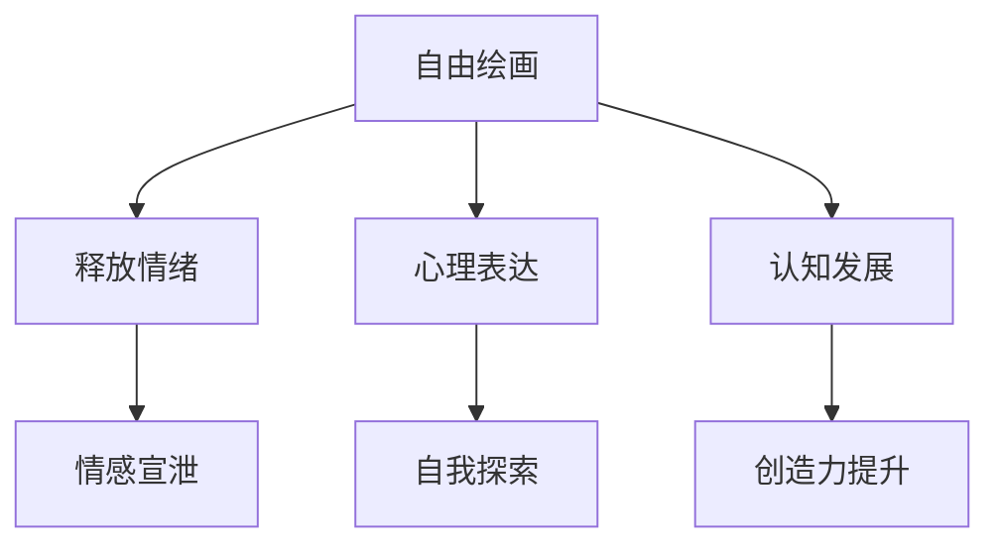

#### 音乐创作

音乐创作通过声音和节奏来表达情感。个体可以通过创作音乐来体验和表达深层次的情绪体验。音乐疗法不仅有助于情感调节，还可以促进大脑功能的提升。

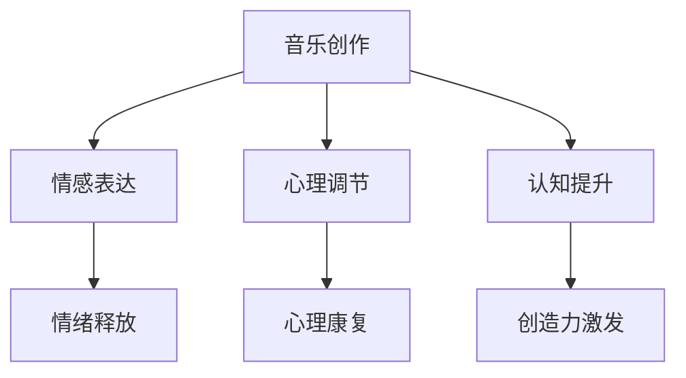

#### 雕塑和陶艺

雕塑和陶艺是一种通过物理形式来表达情感和思想的艺术形式。在创作过程中，个体需要动手操作，这不仅有助于情感宣泄，还可以提高个体的动手能力和创造力。

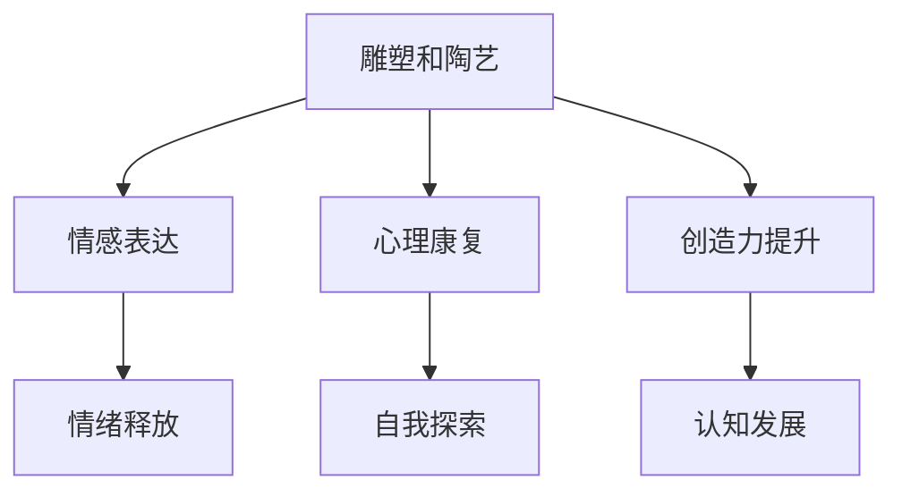

### 本章小结

艺术疗法通过自由绘画、音乐创作、雕塑和陶艺等多种形式，为个体提供了丰富的情感表达和自我探索的途径。艺术创作不仅有助于情感调节和心理健康，还可以促进认知发展和创造力提升。通过艺术疗法的实践，个体可以找到属于自己的心灵滋养之道。

## 第3.2节 文学疗法

### 文学疗法的魅力

文学疗法（Literary Therapy）是一种通过阅读和创作文学作品来促进个体心理健康和情感发展的重要方法。文学作品作为一种强大的情感共鸣工具，具有以下魅力：

#### 情感共鸣

文学作品中的情节和人物可以帮助读者感受到他人的情感体验，产生共鸣。这种情感共鸣有助于读者理解他人的感受，增强同理心。

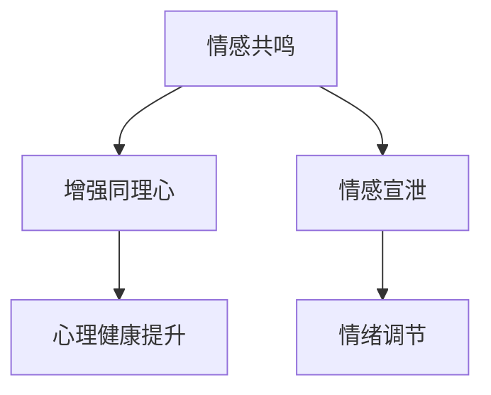

#### 认知启发

文学作品中的思想和观点可以激发读者的思考，帮助他们从不同的角度看待问题。这种认知启发有助于提高读者的思维能力和创造力。

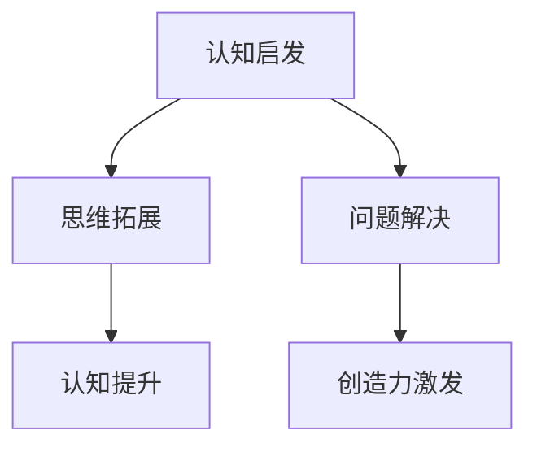

#### 情感宣泄

通过阅读文学作品，读者可以宣泄自己的情感和压力，从而减轻内心的负担。这种情感宣泄有助于读者保持心理健康。

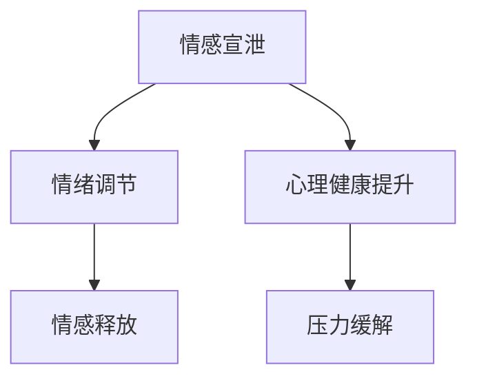

### 文学疗法的实践

#### 阅读经典文学

阅读经典文学作品，如诗歌、小说和戏剧，可以帮助读者体验丰富的情感和思想。经典文学作品中的深刻见解和情感表达可以激发读者的思考和共鸣。

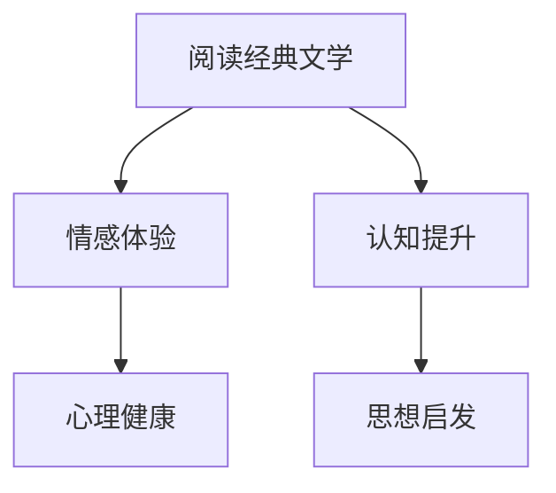

#### 创作文学作品

创作文学作品，如写诗、写日记或写小说，可以让读者表达自己的情感和思想。通过创作，读者可以探索自我，发现内心的世界。

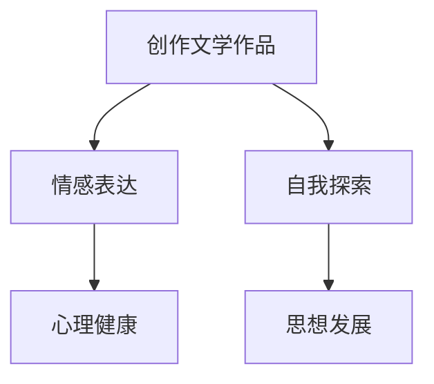

### 本章小结

文学疗法通过阅读和创作文学作品，为读者提供了丰富的情感共鸣、认知启发和情感宣泄的途径。通过文学疗法的实践，读者可以更好地理解自己，提升心理健康和幸福感。在接下来的章节中，我们将探讨如何在日常生活中实践心灵滋养的方法。

## 第4章 生活实践中的心灵滋养

### 健康的生活方式

健康的生活方式是心灵滋养的重要组成部分。一个健康的生活方式可以帮助我们保持良好的心理状态，提高生活质量。以下是几个关键的健康生活方式：

#### 合理饮食

合理饮食是健康生活方式的基础。我们应该遵循“食物多样、营养均衡”的原则，保证摄入足够的蛋白质、脂肪、碳水化合物以及维生素和矿物质。同时，减少摄入高糖、高盐和高脂肪的食物，以降低慢性疾病的风险。

#### 适量运动

适量运动有助于改善心血管健康、增强体质、减轻压力。每周至少进行150分钟的中等强度运动，如快走、跑步、游泳或骑自行车。此外，力量训练也是保持健康的关键，每周进行2-3次力量训练，可以帮助增强肌肉力量和骨骼密度。

#### 充足睡眠

充足的睡眠对心理健康至关重要。成年人每晚需要7-9小时的睡眠。良好的睡眠习惯可以帮助我们保持注意力集中、情绪稳定和提高创造力。建立规律的睡眠时间，避免在睡前使用电子设备，创造一个安静、舒适的睡眠环境，都有助于改善睡眠质量。

### 人际关系与心灵滋养

人际关系是影响心理健康的重要因素。建立和维护健康的人际关系可以帮助我们获得情感支持、提升自尊和增强心理韧性。

#### 真正的友谊

真正的友谊是心灵滋养的重要来源。与朋友保持联系，分享生活中的喜怒哀乐，可以带来情感上的满足和支持。建立真正的友谊需要时间和努力，包括真诚的沟通、相互理解和共同的经历。

#### 健康的沟通

健康的沟通是维护良好人际关系的关键。有效的沟通可以帮助我们更好地理解他人，解决问题和建立信任。以下是一些健康的沟通技巧：

1. **倾听**：倾听是沟通的重要部分。通过倾听，我们可以理解他人的观点和感受，从而建立更好的关系。

2. **表达**：清晰地表达自己的观点和感受，避免误解和冲突。使用“我”语言，如“我感到...”，而不是指责对方。

3. **共鸣**：尝试从对方的角度理解问题，表达同情和理解。

#### 情感支持

情感支持是人际关系中不可或缺的部分。当我们遇到困难或情绪低落时，情感支持可以帮助我们缓解压力，恢复信心。以下是一些提供和接受情感支持的方法：

1. **倾听**：倾听对方的感受和经历，给予理解和安慰。

2. **鼓励**：鼓励对方面对挑战，表达对他们的支持和信任。

3. **共同活动**：参与共同的活动，如散步、看电影或进行体育活动，可以帮助增进关系。

### 本章小结

通过健康的生活方式和人际关系的维护，我们可以有效地滋养心灵。合理饮食、适量运动、充足睡眠是保持身体和心理健康的基石。同时，真正的友谊、健康的沟通和情感支持也是心灵滋养的重要途径。在接下来的章节中，我们将探讨如何通过实践项目来培养内在的丰盈感。

## 第4.1节 健康的生活方式

### 合理饮食

合理饮食是保持身体健康和心理平衡的基础。一个均衡的饮食计划应包括以下关键要素：

#### 蛋白质

蛋白质是身体组织修复和功能维持的关键。每天应摄入适量的优质蛋白质，如鸡肉、鱼肉、豆类和坚果。建议成人每天摄入约0.8克/公斤体重的蛋白质。

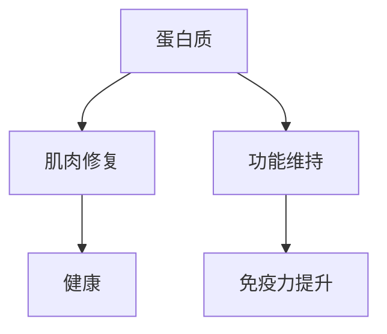

#### 脂肪

脂肪是能量的重要来源，但应选择健康的脂肪，如橄榄油、鱼油和坚果。应避免过多摄入饱和脂肪和反式脂肪。建议成人每天摄入总热量的20%-35%来自脂肪。

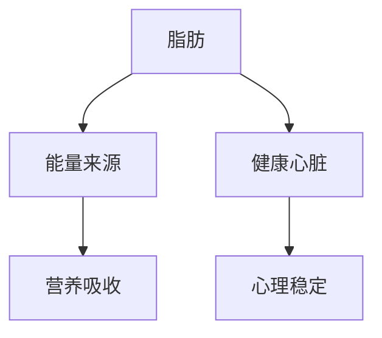

#### 碳水化合物

碳水化合物是能量的主要来源，但应选择复杂的碳水化合物，如全谷物、蔬菜和水果，避免过多的简单碳水化合物，如糖和白面粉制品。建议成人每天摄入总热量的45%-65%来自碳水化合物。

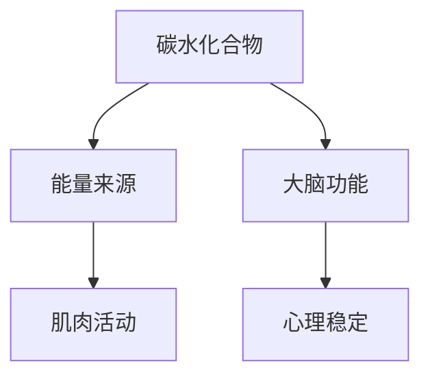

#### 维生素和矿物质

维生素和矿物质是维持身体和心理健康所必需的。通过摄入多样化的食物，如水果、蔬菜、坚果和全谷物，可以确保摄入足够的维生素和矿物质。

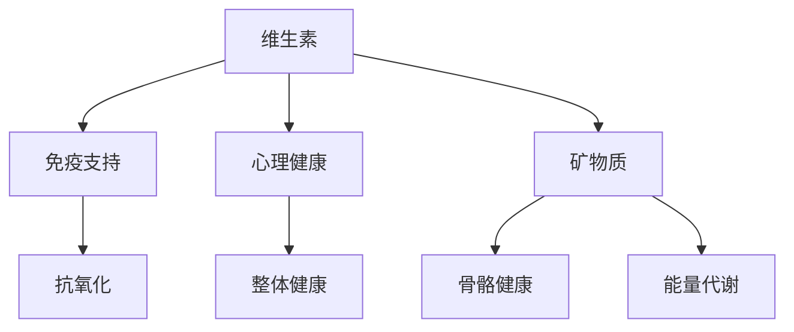

### 适量运动

适量运动对身心健康有着显著的好处。以下是一些关键建议：

#### 有氧运动

有氧运动，如快走、跑步、游泳和骑自行车，有助于增强心肺功能、降低血压和改善心理健康。建议每周进行至少150分钟的中等强度有氧运动。

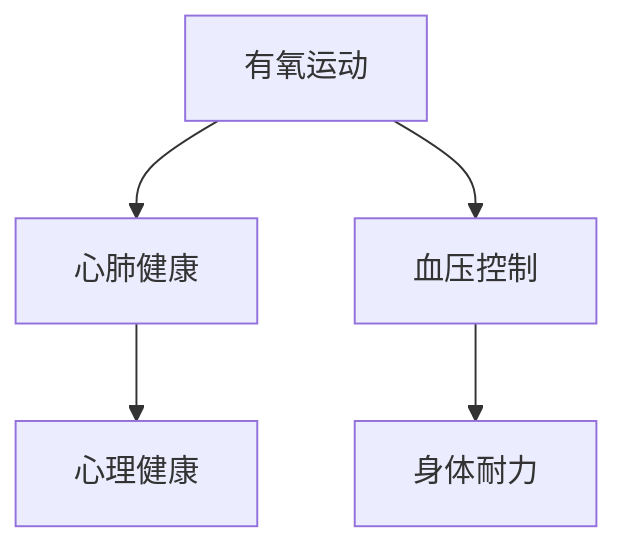

#### 力量训练

力量训练，如举重、俯卧撑和仰卧起坐，有助于增强肌肉力量、提高代谢率和增加骨密度。建议每周进行2-3次力量训练，每次20-30分钟。

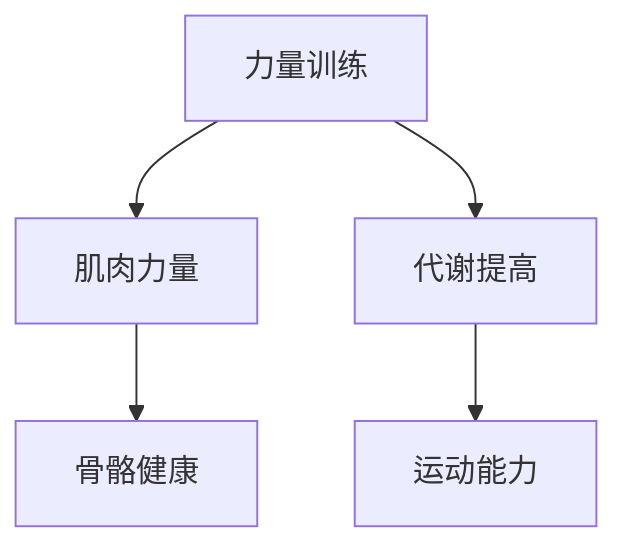

#### 身体灵活性

定期进行灵活性训练，如瑜伽和拉伸运动，有助于提高关节灵活性、减少受伤风险和提高生活质量。建议每周进行2-3次灵活性训练。

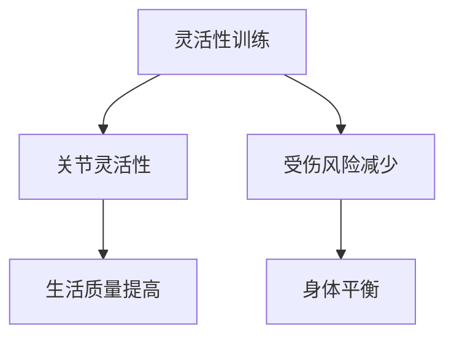

### 充足睡眠

充足睡眠对身心健康至关重要。以下是一些保持充足睡眠的建议：

#### 固定睡眠时间

建立一个固定的睡眠时间表，尽量每天都在相同的时间上床睡觉和起床。这有助于调节身体的生物钟，提高睡眠质量。

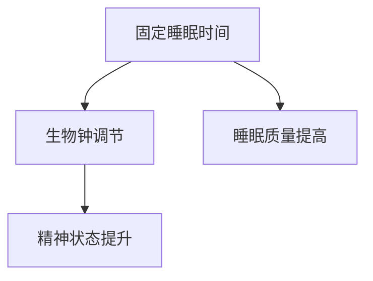

#### 创建良好的睡眠环境

确保睡眠环境安静、舒适和暗淡。避免在睡前使用电子设备，因为这可能会刺激大脑，影响睡眠质量。

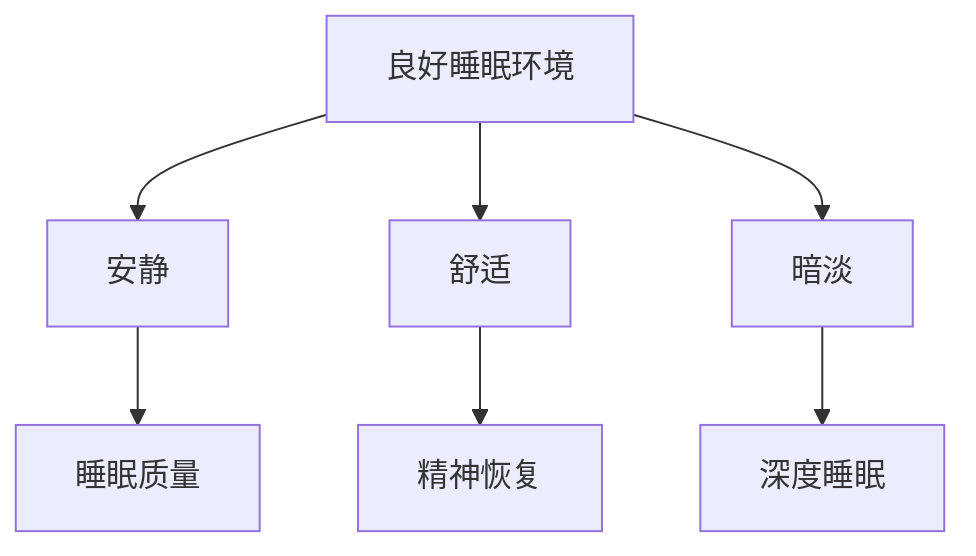

#### 减少晚间刺激

避免在睡前摄入咖啡因和酒精，因为这些物质可能会干扰睡眠。此外，减少晚间刺激，如避免剧烈运动和紧张的工作，有助于放松身心。

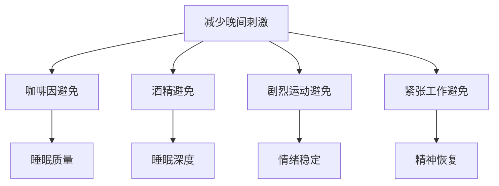

### 本章小结

通过合理饮食、适量运动和充足睡眠，我们可以建立一个健康的生活方式，从而提高身体和心理的福祉。合理饮食有助于提供身体所需的营养，适量运动增强体质和心理健康，充足睡眠确保身体和大脑得到充分的休息和恢复。

## 第4.2节 人际关系与心灵滋养

### 真正的友谊

真正的友谊是心灵滋养的重要源泉。它不仅提供了情感支持，还可以带来快乐和满足感。建立真正的友谊需要以下要素：

#### 真诚和信任

真诚是友谊的基础。信任则是友谊得以长期维持的关键。通过真诚地表达自己的想法和感受，以及信任朋友的言行，我们可以建立稳固的友谊。

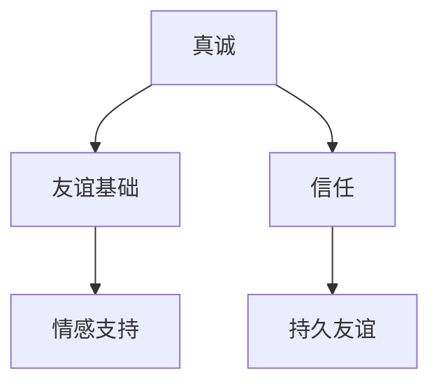

#### 共同兴趣

共同兴趣是友谊发展的催化剂。共同的爱好和活动可以增进友谊，让彼此有更多的话题和共同的经历。

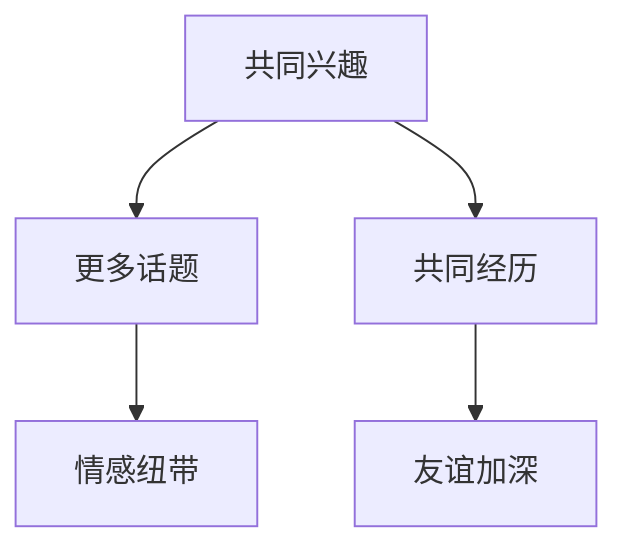

#### 支持和理解

在友谊中，支持和理解是不可或缺的。当我们遇到困难时，朋友的鼓励和支持可以帮助我们度过难关。同样，理解朋友的感受和需求，也是维护友谊的关键。

```mermaid
graph TD
    A[支持] --> B[鼓励]
    A --> C[理解]
    B --> D[情感支持]
    C --> E[信任加强]
```

### 健康的沟通

健康的沟通是友谊和所有人际关系的基石。以下是一些健康的沟通技巧：

#### 倾听

倾听是有效沟通的关键。通过倾听，我们可以理解对方的观点和感受，从而建立更好的关系。

```mermaid
graph TD
    A[倾听] --> B[理解]
    A --> C[尊重]
    B --> D[有效沟通]
    C --> E[关系加深]
```

#### 表达

清晰地表达自己的观点和感受，避免误解和冲突。使用“我”语言，如“我感到...”，而不是指责对方。

```mermaid
graph TD
    A[表达] --> B[清晰]
    A --> C[“我”语言]
    B --> D[有效沟通]
    C --> E[关系维护]
```

#### 共鸣

尝试从对方的角度理解问题，表达同情和理解。

```mermaid
graph TD
    A[共鸣] --> B[同情]
    A --> C[理解]
    B --> D[情感支持]
    C --> E[关系加强]
```

### 情感支持

情感支持是人际关系中不可或缺的部分。当我们遇到困难或情绪低落时，情感支持可以帮助我们缓解压力，恢复信心。以下是一些提供和接受情感支持的方法：

#### 倾听

倾听对方的感受和经历，给予理解和安慰。

```mermaid
graph TD
    A[倾听] --> B[理解]
    A --> C[安慰]
    B --> D[情感支持]
    C --> E[关系加深]
```

#### 鼓励

鼓励对方面对挑战，表达对他们的支持和信任。

```mermaid
graph TD
    A[鼓励] --> B[支持]
    A --> C[信任]
    B --> D[情感支持]
    C --> E[关系加强]
```

#### 共同活动

参与共同的活动，如散步、看电影或进行体育活动，可以帮助增进关系。

```mermaid
graph TD
    A[共同活动] --> B[互动]
    A --> C[共享体验]
    B --> D[情感支持]
    C --> E[关系加强]
```

### 本章小结

通过建立真正的友谊、健康沟通和情感支持，我们可以维护良好的人际关系，从而在心灵上得到滋养。真正的友谊提供了情感支持，健康的沟通增强了理解和信任，情感支持帮助我们在困难时刻保持坚强。这些人际关系是我们心灵滋养的重要途径。

## 第5章 实践项目：打造内在的丰盈感

### 项目背景

在现代社会，由于生活节奏快、工作压力大，很多人面临着心理健康问题，如焦虑、抑郁等。为了提升心理健康水平，我们需要通过一系列实践项目来培养内在的丰盈感。

### 项目目标

本项目旨在通过以下方式培养内在的丰盈感：

1. 提高自我认知
2. 调节情绪
3. 增强心理韧性
4. 提升幸福感

### 项目实施

#### 第一步：自我认知提升

1. **反思日志**：每天花15分钟记录当天的感受和经历，反思自己的情绪和行为。
2. **深度冥想**：每周进行2次，每次30分钟的深度冥想，专注于呼吸和当下的感受。
3. **正念练习**：每天早上进行5分钟的静坐，专注于当下的体验。

```mermaid
graph TD
    A[反思日志] --> B[情绪反思]
    A --> C[自我认知提升]
    B --> D[情绪调节]
    C --> E[心理韧性]
    A --> F[深度冥想]
    F --> G[心理调节]
    A --> H[正念练习]
    H --> I[心理平衡]
```

#### 第二步：情绪调节

1. **艺术疗法**：每周进行1次艺术创作，如绘画、音乐或写作，以表达情绪。
2. **运动**：每天进行30分钟的有氧运动，如快走、跑步或游泳，以释放压力。
3. **睡眠**：保证每晚7-8小时的充足睡眠，以恢复身体和心理的能量。

```mermaid
graph TD
    A[艺术疗法] --> B[情感表达]
    A --> C[情绪调节]
    B --> D[压力释放]
    A --> E[音乐创作]
    E --> F[情感释放]
    A --> G[绘画]
    G --> H[心理平衡]
    B --> I[运动]
    I --> J[身体放松]
    B --> K[睡眠]
    K --> L[能量恢复]
```

#### 第三步：增强心理韧性

1. **设定目标**：设定短期和长期目标，并制定实现目标的计划。
2. **面对挑战**：主动面对生活中的挑战，并从中学习和成长。
3. **自我激励**：通过自我激励来提升自信心和动力。

```mermaid
graph TD
    A[设定目标] --> B[目标明确]
    A --> C[挑战面对]
    B --> D[成长学习]
    A --> E[自我激励]
    E --> F[自信提升]
```

#### 第四步：提升幸福感

1. **感恩练习**：每天花几分钟思考并写下三件让自己感到感恩的事情。
2. **社交互动**：每周与家人和朋友进行至少一次的深度交流。
3. **体验新事物**：定期尝试新的活动或经历，以增加生活的乐趣。

```mermaid
graph TD
    A[感恩练习] --> B[情感积极]
    A --> C[社交互动]
    B --> D[情感支持]
    A --> E[体验新事物]
    E --> F[生活乐趣]
```

### 项目总结

通过本项目的实施，我们可以有效地提升自我认知、调节情绪、增强心理韧性和提升幸福感。这些实践方法不仅有助于改善心理健康，还可以帮助我们更好地享受生活。

### 实践项目总结

通过自我认知提升、情绪调节、心理韧性增强和幸福感提升四个方面的实践项目，我们可以逐步培养内在的丰盈感。这些方法不仅有助于改善心理健康，还可以提高生活质量。让我们一起努力，通过实践项目来滋养心灵，享受更美好的人生。

## 第6章 最佳实践与注意事项

### 常见误区

在追求内在丰盈感的过程中，我们可能会陷入一些误区，影响效果。以下是一些常见误区及避免方法：

1. **过度自我反思**：过度自我反思可能会导致自我批评和焦虑，不利于心理健康的提升。避免方法：设定合理的反思时间，关注反思的积极面，避免过度自责。

2. **忽视现实问题**：将心灵滋养视为逃避现实问题的手段，而不是解决问题的辅助工具。避免方法：保持现实视角，将心灵滋养与实际生活相结合，解决实际问题。

3. **依赖外部评价**：过分依赖他人的评价和认可，忽视自我价值。避免方法：建立自我认同，关注内心的真实需求，独立做出判断。

### 避免过度自我反思

1. **设定合理反思时间**：每天花10-15分钟进行自我反思，不宜过长。

2. **关注积极面**：在反思时，更多关注自己的进步和成长，而非负面情绪。

3. **寻求专业帮助**：如果自我反思带来负面影响，及时寻求心理咨询师的帮助。

### 寻求专业帮助

1. **了解自身需求**：明确自己需要什么样的帮助，是心理辅导、情感支持还是具体技能培训。

2. **选择合适的咨询师**：选择有资质、经验丰富的心理咨询师，通过面试了解其风格和方法。

3. **建立信任关系**：与咨询师建立良好的信任关系，有助于更好地进行心理治疗。

### 本章小结

通过避免过度自我反思和寻求专业帮助，我们可以更有效地培养内在的丰盈感。了解常见误区并采取相应的避免方法，有助于我们在心灵滋养的道路上走得更远。

## 第7章 拓展阅读

### 推荐书籍

1. **《活出生命的意义》（Man's Search for Meaning）** - 维克多·弗兰克尔（Viktor E. Frankl）
   - 介绍了一种叫做“意义疗法”的心理治疗方法，帮助人们找到生活的意义和目标。

2. **《生命的智慧》（The Wisdom of Life）** - 亚瑟·叔本华（Arthur Schopenhauer）
   - 探讨了如何通过智慧来提升生活的质量和幸福感。

3. **《自控力》（The Willpower Instinct）** - 凯利·麦格尼格尔（Kelly McGonigal）
   - 解析了如何通过科学方法提高自控力，从而改善心理健康和生活方式。

### 推荐心理学课程

1. **《心理学与生活》（Psychology and Life）** - Coursera
   - 介绍心理学的基本概念和应用，适合初学者。

2. **《心理学导论》（Introduction to Psychology）** - Khan Academy
   - 提供系统的心理学知识，涵盖多个心理学分支。

3. **《冥想与正念》（Mindfulness for Beginners）** - Coursera
   - 教授冥想和正念练习的基本技巧，有助于心灵滋养。

### 心灵滋养相关的学术研究

1. **《正念与心理健康》（Mindfulness and Mental Health）** - The Center for Mindfulness
   - 研究正念练习对心理健康的影响，提供了大量实证数据。

2. **《艺术疗法在心理治疗中的应用》（The Use of Art Therapy in Psychotherapy）** - American Art Therapy Association
   - 探讨艺术疗法在心理治疗中的应用，以及其对个体心理健康的积极作用。

3. **《文学疗法与心理健康》（Literary Therapy and Mental Health）** - The Journal of Literature and Science
   - 研究文学作品对心理健康的影响，以及如何通过文学疗法来改善心理状态。

### 本章小结

通过阅读推荐书籍、学习心理学课程和关注相关学术研究，读者可以更深入地了解心灵滋养的方法和实践。这些资源提供了丰富的知识和实践经验，有助于我们在追求内在丰盈感的道路上不断进步。

## 结语

### 内在的丰盈感：通往幸福之路

内在的丰盈感不仅是心理健康的重要标志，也是通往幸福之路的关键。通过培养内在的丰盈感，我们能够更好地应对生活中的挑战，提升生活品质。内在的丰盈感来源于自我认知的提升、情绪的调节、心理韧性的增强和幸福感的提升。它使我们能够在逆境中保持坚韧，在顺境中享受生活的美好。

### 鼓励与希望

每个人都有能力培养内在的丰盈感。通过本书的探讨，我们了解到了多种方法和实践项目，这些都可以帮助我们在日常生活中实现心灵的滋养。无论你面临何种困境，都有希望和可能找到属于自己的幸福之路。

### 一起滋养心灵

让我们一起行动起来，从今天开始，通过自我认知、情绪调节、心理韧性的培养和幸福感的提升，不断滋养我们的心灵。无论前路如何，保持希望，坚持实践，你一定能够找到属于自己的内在丰盈感，迈向幸福的人生。

## 附录

### 心灵滋养的实用工具

1. **正念冥想应用程序**：如Headspace、Calm和Insight Timer，提供指导冥想和正念练习。

2. **反思日志应用程序**：如Reflectly和Day One，帮助你记录日常思考和情绪。

3. **艺术创作应用程序**：如Procreate、Adobe Photoshop和Canva，用于绘画和设计。

4. **心理健康评估工具**：如Moodfit和Sanvello，提供心理健康评估和建议。

### 心灵滋养相关的应用软件

1. **艺术疗法应用**：如Art Therapist、Artful Healing，提供艺术疗法的工具和指导。

2. **文学疗法应用**：如Booknetic、Literary Therapy Journal，帮助你通过阅读和写作来滋养心灵。

3. **音乐疗法应用**：如Mood Music、Music for Relaxation，提供各种类型的放松音乐。

4. **健身与运动应用**：如Nike Training Club、MyFitnessPal，帮助你保持健康的生活方式。

### 实用工具与软件介绍

以下是对一些推荐的心灵滋养实用工具和应用软件的简要介绍：

- **正念冥想应用程序**：这些应用程序提供了各种冥想课程和指导，帮助你培养正念和冥想习惯。Headspace和Calm尤其受欢迎，因为它们提供了简洁易懂的指导，适合初学者。

- **反思日志应用程序**：这些应用程序可以帮助你记录日常生活、情绪和思考。Reflectly和Day One提供了强大的日志功能，可以帮助你跟踪情绪变化和成长过程。

- **艺术创作应用程序**：这些应用程序为你提供了创作艺术作品所需的工具和素材。Procreate和Adobe Photoshop适合绘画和设计爱好者，而Canva则适合那些想要进行图形设计的用户。

- **心理健康评估工具**：这些工具可以帮助你了解自己的心理健康状况，并提供个性化的建议。Moodfit和Sanvello提供了简单的评估问卷，以及基于评估结果的建议。

- **艺术疗法应用**：这些应用程序旨在提供艺术疗法的工具和指导，帮助你通过艺术创作来改善心理健康。Art Therapist和Artful Healing提供了丰富的艺术素材和创作指导。

- **文学疗法应用**：这些应用程序通过推荐书籍和提供阅读指导来帮助你通过阅读来滋养心灵。Booknetic和Literary Therapy Journal提供了记录阅读体验和反思的功能。

- **音乐疗法应用**：这些应用程序提供了各种类型的放松音乐，帮助你缓解压力和放松身心。Mood Music和Music for Relaxation可以根据你的情绪和需求来选择合适的音乐。

通过使用这些实用工具和应用软件，你可以更加方便地实践心灵滋养的方法，提升心理健康和生活质量。

### 作者信息

作者：AI天才研究院/AI Genius Institute & 禅与计算机程序设计艺术 /Zen And The Art of Computer Programming

感谢您的阅读，希望本文能对您的心灵滋养之路有所启发。如果您有任何反馈或建议，欢迎随时与我们联系。祝您心灵丰盈，生活愉快！

