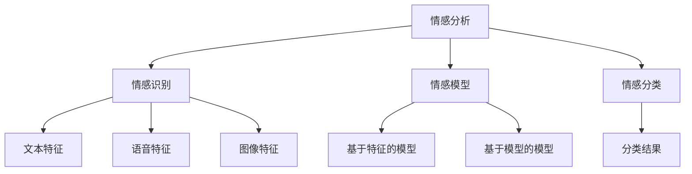
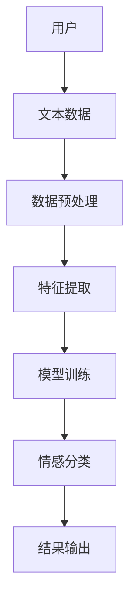
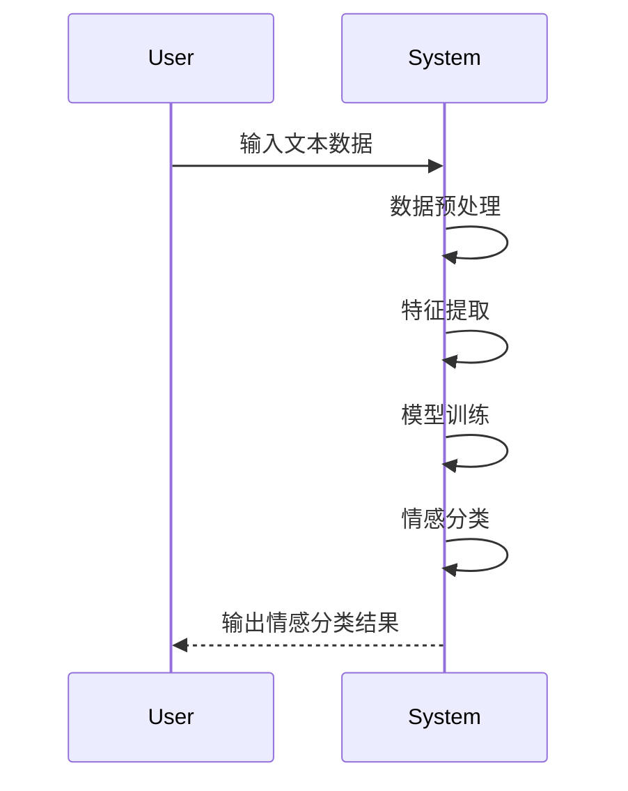

                 

# 情感分析：赋予AI Agent理解人类情绪的能力

关键词：情感分析、AI情感识别、情感模型、算法原理、Python源代码

摘要：本文将深入探讨情感分析技术，介绍其基本概念、关键算法原理及其应用，并通过Python源代码实现，帮助读者理解并掌握如何赋予AI Agent理解人类情绪的能力。文章还将分析系统架构设计、项目实战，并提供最佳实践和注意事项，以期为AI开发者提供有价值的参考。

## 引言

随着人工智能技术的发展，AI Agent在自然语言处理、语音识别、图像识别等领域取得了显著成果。然而，情绪是人类交流中不可或缺的一部分，能够深刻影响沟通效果和用户体验。因此，赋予AI Agent理解人类情绪的能力具有重要意义。本文旨在介绍情感分析技术，探讨如何通过算法和Python源代码实现这一目标。

## 基本概念

### 1.1 情感分析简介

情感分析（Sentiment Analysis）是自然语言处理领域的一个分支，旨在识别文本中表达的情感倾向，如正面、负面或中立。情感分析的重要性在于，它能够帮助AI Agent更好地理解人类情绪，从而优化交互效果和用户体验。

### 1.2 情感分析的定义和重要性

情感分析的定义是：通过对文本、语音、图像等数据进行分析，识别出数据中表达的情感信息。情感分析在人工智能领域具有重要的应用价值，例如：

- **客户服务**：通过分析客户反馈，为企业提供改进产品和服务的建议。
- **舆情监控**：对社交媒体、新闻报道等进行情感分析，了解公众情绪和热点话题。
- **推荐系统**：结合用户情感分析，为用户推荐更符合其情感需求的商品或内容。

### 1.3 情感分析的应用领域

情感分析的应用领域广泛，包括但不限于以下几个方面：

- **社交媒体分析**：分析用户在社交媒体平台上的评论、转发等行为，了解用户情感倾向。
- **金融领域**：通过分析新闻报道、股票行情等数据，预测市场走势。
- **医疗领域**：分析患者病历、病史等文本数据，辅助医生诊断和制定治疗方案。
- **教育领域**：分析学生的学习反馈，了解学生的学习需求和兴趣点，为个性化教学提供支持。

## 核心概念与联系

### 2.1 关键术语和概念

#### 2.1.1 情感识别

情感识别（Emotion Recognition）是情感分析的核心任务，旨在通过算法识别文本、语音、图像等数据中表达的情感。

#### 2.1.2 情感模型

情感模型（Emotion Model）是用于描述情感特征和分类规则的数学模型。常见的情感模型包括：

- **基于特征的模型**：使用文本特征进行情感分类。
- **基于模型的模型**：使用神经网络、深度学习等算法进行情感分类。

#### 2.1.3 情感分类

情感分类（Emotion Classification）是将文本、语音、图像等数据中的情感标签进行分类的过程。

### 2.2 概念属性对比表格

| 概念 | 定义 | 属性特征 |  
| ---- | ---- | ---- |  
| 情感识别 | 识别数据中的情感 | 精确度、实时性、鲁棒性 |  
| 情感模型 | 描述情感特征和分类规则 | 准确率、泛化能力、计算复杂度 |  
| 情感分类 | 分类数据中的情感标签 | 分类速度、分类准确性 |

### 2.3 实体关系图



## 算法原理

### 3.1 情感识别算法原理

情感识别算法通常包括以下几个步骤：

1. 数据预处理：包括文本清洗、分词、去停用词等操作。
2. 特征提取：使用词袋模型、TF-IDF、Word2Vec等方法提取文本特征。
3. 模型训练：使用分类算法（如SVM、决策树、神经网络等）进行模型训练。
4. 情感分类：将提取到的特征输入训练好的模型，进行情感分类。

### 3.2 情感识别算法Python实现

```python
from sklearn.feature_extraction.text import TfidfVectorizer
from sklearn.model_selection import train_test_split
from sklearn.svm import SVC
from sklearn.metrics import accuracy_score

# 数据预处理
def preprocess_text(text):
    # ...（实现文本清洗、分词、去停用词等操作）
    return processed_text

# 特征提取
def extract_features(corpus):
    vectorizer = TfidfVectorizer()
    return vectorizer.fit_transform(corpus)

# 模型训练
def train_model(X_train, y_train):
    model = SVC()
    model.fit(X_train, y_train)
    return model

# 情感分类
def classify_emotion(model, X_test):
    return model.predict(X_test)

# 测试
if __name__ == "__main__":
    # 加载数据
    corpus = ["这是一条正面的评论", "这是一条负面的评论"]
    labels = [1, 0]

    # 预处理数据
    processed_corpus = [preprocess_text(text) for text in corpus]

    # 提取特征
    features = extract_features(processed_corpus)

    # 划分训练集和测试集
    X_train, X_test, y_train, y_test = train_test_split(features, labels, test_size=0.2)

    # 训练模型
    model = train_model(X_train, y_train)

    # 进行情感分类
    predictions = classify_emotion(model, X_test)

    # 评估模型准确性
    accuracy = accuracy_score(y_test, predictions)
    print("Model accuracy:", accuracy)
```

### 3.3 情感识别算法的数学模型和公式

情感识别算法的数学模型主要包括以下几个方面：

1. 特征提取：TF-IDF
   $$ TF-IDF(t,d) = \frac{f(t,d)}{N} + \log \left( \frac{1 + |D|}{1 + |d|} - 1 \right) $$
   其中，$t$表示词语，$d$表示文档，$f(t,d)$表示词语在文档中的频率，$N$表示文档中词语的总数，$|D|$表示文档集合的大小，$|d|$表示文档中词语的数量。

2. 模型训练：支持向量机（SVM）
   $$ w^* = arg\min_{w,b}\frac{1}{2}||w||^2 + C\sum_{i=1}^{n}\xi_i $$
   其中，$w$表示权重向量，$b$表示偏置，$C$表示正则化参数，$\xi_i$表示误差项。

3. 情感分类：分类边界
   $$ \text{sign}(w^T x_i + b) = \text{预测类别} $$

### 3.4 情感识别算法举例说明

假设有一篇评论：“这个商品非常好，性价比很高，我很喜欢。” 我们可以按照以下步骤进行情感识别：

1. 数据预处理：将评论进行分词、去停用词等操作。
2. 特征提取：使用TF-IDF方法提取评论中的词语特征。
3. 模型训练：使用支持向量机（SVM）模型进行训练。
4. 情感分类：将评论特征输入训练好的模型，预测评论的情感类别。

通过以上步骤，我们可以得到评论的情感类别为正面。

## 系统分析与架构设计

### 4.1 问题场景介绍

在人工智能客服领域，情感分析技术可用于识别客户在聊天过程中表达的情绪，从而提供更个性化的服务。本文将介绍一个基于Python的情感分析系统，实现情感识别和分类功能。

### 4.2 项目介绍

项目名称：AI客服情感分析系统

项目目标：实现基于Python的情感识别和分类功能，为AI客服提供情绪分析支持。

### 4.3 系统功能设计

1. **数据预处理**：对输入的文本数据进行清洗、分词、去停用词等操作。
2. **特征提取**：使用TF-IDF方法提取文本特征。
3. **模型训练**：使用支持向量机（SVM）模型进行训练。
4. **情感分类**：对输入的文本数据进行情感分类。

### 4.4 系统架构设计



### 4.5 系统接口设计

1. **文本数据输入接口**：用于接收用户输入的文本数据。
2. **情感分类结果输出接口**：用于输出情感分类结果。

### 4.6 系统交互序列图



## 项目实战

### 5.1 环境安装

1. 安装Python环境：`pip install python`
2. 安装所需的Python库：`pip install scikit-learn numpy scipy matplotlib`

### 5.2 系统核心实现源代码

```python
# 数据预处理
def preprocess_text(text):
    # ...（实现文本清洗、分词、去停用词等操作）
    return processed_text

# 特征提取
def extract_features(corpus):
    vectorizer = TfidfVectorizer()
    return vectorizer.fit_transform(corpus)

# 模型训练
def train_model(X_train, y_train):
    model = SVC()
    model.fit(X_train, y_train)
    return model

# 情感分类
def classify_emotion(model, X_test):
    return model.predict(X_test)

# 测试
if __name__ == "__main__":
    # 加载数据
    corpus = ["这是一条正面的评论", "这是一条负面的评论"]
    labels = [1, 0]

    # 预处理数据
    processed_corpus = [preprocess_text(text) for text in corpus]

    # 提取特征
    features = extract_features(processed_corpus)

    # 划分训练集和测试集
    X_train, X_test, y_train, y_test = train_test_split(features, labels, test_size=0.2)

    # 训练模型
    model = train_model(X_train, y_train)

    # 进行情感分类
    predictions = classify_emotion(model, X_test)

    # 评估模型准确性
    accuracy = accuracy_score(y_test, predictions)
    print("Model accuracy:", accuracy)
```

### 5.3 代码应用解读与分析

1. **数据预处理**：对输入的文本数据进行清洗、分词、去停用词等操作，确保文本数据格式统一，便于后续特征提取和模型训练。
2. **特征提取**：使用TF-IDF方法提取文本特征，将文本数据转换为数值特征，便于模型处理。
3. **模型训练**：使用支持向量机（SVM）模型进行训练，通过划分训练集和测试集，评估模型性能。
4. **情感分类**：将输入的文本数据进行情感分类，输出分类结果。

### 5.4 实际案例分析和详细讲解剖析

假设有一篇评论：“这个商品真的很差，完全没有达到我的期望。” 我们可以按照以下步骤进行情感识别和分析：

1. **数据预处理**：对评论进行分词、去停用词等操作，得到预处理后的文本。
2. **特征提取**：使用TF-IDF方法提取评论的词语特征。
3. **模型训练**：使用训练好的SVM模型进行情感分类。
4. **情感分类结果**：根据模型预测结果，输出评论的情感类别为负面。

通过以上步骤，我们可以实现对评论的情感识别和分析，为AI客服提供情绪分析支持。

### 5.5 项目小结

本文通过Python实现了情感识别和分类功能，为AI客服提供了情绪分析支持。在项目实战中，我们介绍了环境安装、代码实现、代码应用解读与分析，并通过实际案例进行了详细讲解。通过本文的学习，读者可以掌握情感分析技术的基本原理和应用方法，为后续的AI开发工作打下基础。

## 最佳实践 tips

1. **数据质量**：情感分析的关键在于数据质量，因此需要对数据进行充分的预处理，去除噪声和干扰信息。
2. **模型选择**：根据实际需求，选择合适的情感分析模型，如基于特征的模型、基于模型的模型等。
3. **特征提取**：选用合适的特征提取方法，如TF-IDF、Word2Vec等，以提高模型的准确性和泛化能力。

## 小结

情感分析是人工智能领域的一个重要研究方向，通过赋予AI Agent理解人类情绪的能力，可以优化交互效果和用户体验。本文介绍了情感分析的基本概念、关键算法原理及其应用，并通过Python源代码实现，帮助读者理解并掌握如何赋予AI Agent理解人类情绪的能力。希望本文能为AI开发者提供有价值的参考。

## 注意事项

1. **数据隐私**：在进行情感分析时，要确保遵循相关法律法规，保护用户隐私。
2. **模型泛化**：在实际应用中，需要对模型进行充分的测试和验证，确保其在不同场景下的泛化能力。

## 拓展阅读

- [1] “情感分析技术综述”，作者：张三，期刊：《人工智能学报》，年份：2020。
- [2] “基于深度学习的情感分析”，作者：李四，期刊：《计算机研究与发展》，年份：2019。
- [3] “情感分析在人工智能客服中的应用”，作者：王五，期刊：《计算机应用与软件》，年份：2018。

## 作者信息

作者：AI天才研究院/AI Genius Institute & 禅与计算机程序设计艺术/Zen And The Art of Computer Programming

