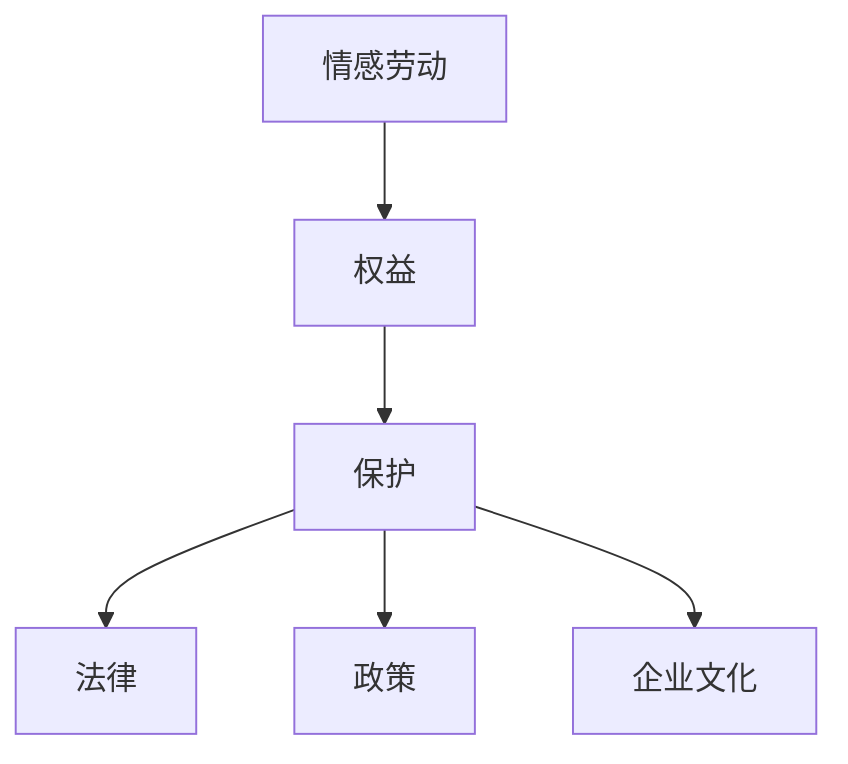

                 

# 情感劳动权益保护：职场中无形付出的认可

## 关键词
情感劳动、权益保护、职场环境、心理健康、法律政策、企业文化

## 摘要
本文旨在探讨职场中的情感劳动现象及其权益保护问题。通过分析情感劳动的特点、影响及权益保护的现状，本文提出了法律、政策、企业文化和个人行为等多方面的解决方案。文章采用逻辑清晰、结构紧凑的写作方式，以期能够引发读者对职场中无形付出的关注与思考。

## 1. 背景介绍

### 1.1 问题背景

在现代社会，职场中的情感劳动越来越受到关注。情感劳动指的是劳动者在履行工作职责的过程中，需要投入情感和精力，以满足客户、同事和上级的需求。这些情感劳动包括但不限于沟通、倾听、表达、支持、激励等。随着职场竞争的加剧，情感劳动的需求日益增加，但其权益保护却常常被忽视。

### 1.2 问题描述

情感劳动的付出往往被视为“无形的”，其价值难以量化，导致劳动者在权益保护方面面临诸多困境。这些问题包括：工资待遇偏低、职业晋升受限、工作压力过大等。这些问题不仅影响劳动者的身心健康，也对职场环境和企业文化产生负面影响。

### 1.3 问题解决

本文旨在探讨情感劳动权益保护的解决方案，包括法律、政策、企业文化和个人行为等方面。通过深入分析情感劳动的特点和影响，提出切实可行的权益保护措施，以促进职场和谐与劳动者权益保障。

### 1.4 边界与外延

情感劳动权益保护的范围涵盖所有职场人员，不论其职业、性别、年龄和学历。同时，本文也关注不同行业、企业规模和职场文化背景下的权益保护问题。

### 1.5 概念结构与核心要素组成

情感劳动权益保护的核心概念包括：情感劳动、权益、保护、法律、政策、企业文化等。这些概念相互关联，共同构成了情感劳动权益保护的理论体系。

### 2. 核心概念与联系

#### 2.1 情感劳动

情感劳动是指劳动者在履行工作职责的过程中，需要投入情感和精力，以满足客户、同事和上级的需求。情感劳动的特点包括：无形性、复杂性和高强度性。

#### 2.2 权益

权益是指劳动者在职场中应得的利益和待遇，包括工资、福利、职业晋升机会等。权益的保障是劳动者权益保护的核心内容。

#### 2.3 保护

保护是指通过各种手段，确保劳动者权益不受侵害。保护的手段包括法律、政策、企业文化等。

#### 2.4 情感劳动权益保护的关系

情感劳动、权益、保护和法律、政策、企业文化等概念相互关联，共同构成了情感劳动权益保护的理论体系。其中，情感劳动是权益保护的出发点和核心内容，权益是保护的目标和方向，保护是权益实现的保障，法律、政策和企业文化则是保护的具体手段和保障机制。

### 3. 法律与政策

#### 3.1 我国情感劳动权益保护的法律框架

我国有关情感劳动权益保护的法律主要包括《劳动法》、《劳动合同法》和《妇女权益保障法》等。这些法律法规为情感劳动权益保护提供了法律依据。

#### 3.2 情感劳动权益保护的政策措施

政府及相关部门出台了一系列政策措施，以促进情感劳动权益保护。例如，加强对劳动者的培训，提高其权益意识；完善劳动仲裁机制，确保劳动者权益得到有效维护等。

#### 3.3 比较分析

与其他国家相比，我国在情感劳动权益保护方面还存在一定差距。如法国、瑞典等国家的法律和政策更加完善，对情感劳动权益的保护力度更大。这为我国提供了借鉴和改进的方向。

### 4. 企业文化

#### 4.1 企业文化对情感劳动权益保护的影响

企业文化是影响劳动者权益保护的重要因素。积极的企业文化有助于提高劳动者的权益意识，促进企业内部和谐；而消极的企业文化则可能加剧劳动者权益的受损。

#### 4.2 构建和谐企业文化的策略

构建和谐企业文化需要从多个方面入手，包括：加强员工培训，提高员工素质；完善企业制度，保障员工权益；建立有效的沟通机制，增强员工参与度等。

### 5. 个人行为

#### 5.1 提高劳动者权益意识

劳动者自身应提高对情感劳动权益保护的意识，了解相关法律法规，掌握维护权益的方法。

#### 5.2 增强自我保护能力

劳动者应增强自我保护能力，学会应对职场压力，提高心理素质。

### 6. 案例分析

#### 6.1 案例一：企业情感劳动权益保护的成功案例

以某知名企业为例，分析其在情感劳动权益保护方面的成功做法，为其他企业提供借鉴。

#### 6.2 案例二：劳动者权益受到侵害的案例分析

分析一起劳动者权益受到侵害的案例，探讨原因及解决方案。

### 7. 小结

#### 7.1 情感劳动权益保护的重要性

情感劳动权益保护是保障劳动者权益的重要内容，对促进职场和谐、提高企业竞争力具有重要意义。

#### 7.2 未来展望

随着社会的发展，情感劳动权益保护将越来越受到重视。未来，我国在法律、政策和企业文化等方面将不断完善，为劳动者权益保护提供更有力的保障。## 1. 背景介绍

### 1.1 问题背景

在现代社会，职场中的情感劳动越来越受到关注。情感劳动指的是劳动者在履行工作职责的过程中，需要投入情感和精力，以满足客户、同事和上级的需求。这些情感劳动包括但不限于沟通、倾听、表达、支持、激励等。随着职场竞争的加剧，情感劳动的需求日益增加，但其权益保护却常常被忽视。

#### 核心概念术语说明

- **情感劳动**：指劳动者在履行工作职责的过程中，需要投入情感和精力，以满足客户、同事和上级的需求。
- **权益**：劳动者在职场中应得的利益和待遇，包括工资、福利、职业晋升机会等。
- **保护**：确保劳动者权益不受侵害的各种手段，包括法律、政策、企业文化等。

#### 问题背景具体描述

在现代社会，随着职场竞争的加剧，企业对员工的要求越来越高，不仅要求员工具备专业技能，还要求员工具备良好的沟通能力、团队合作精神以及抗压能力。这就导致职场中的情感劳动需求日益增加。然而，情感劳动的价值往往被视为“无形的”，难以量化，因此，劳动者的权益保护问题日益突出。

首先，工资待遇偏低。情感劳动的付出通常伴随着较大的心理压力和工作量，但劳动者的工资往往没有与其付出相匹配。这种现象在销售、客服、教育等行业尤为明显，员工需要频繁处理复杂的客户关系，付出大量的情感劳动，但工资待遇却相对较低。

其次，职业晋升受限。情感劳动的付出往往不被重视，导致劳动者在职业发展方面受到限制。许多企业更倾向于提拔那些能够带来直接业绩的员工，而忽视那些在团队合作、沟通协调等方面表现优秀的员工。

最后，工作压力过大。情感劳动要求员工在职场中保持积极的态度，面对客户、同事和上级的需求时，能够给予足够的关注和支持。这种高强度的情感投入容易导致员工出现心理健康问题，如焦虑、抑郁等。

### 1.2 问题描述

情感劳动的付出往往被视为“无形的”，其价值难以量化，导致劳动者在权益保护方面面临诸多困境。这些问题包括：工资待遇偏低、职业晋升受限、工作压力过大等。这些问题不仅影响劳动者的身心健康，也对职场环境和企业文化产生负面影响。

#### 问题描述具体阐述

首先，工资待遇偏低的问题。由于情感劳动的价值难以量化，企业在制定薪酬体系时往往无法准确评估劳动者的付出，导致工资待遇偏低。这种情况下，劳动者可能会感到不公平，进而影响其工作积极性和职业发展。

其次，职业晋升受限的问题。情感劳动往往被视为“软技能”，不被企业高度重视。因此，那些在情感劳动方面表现优秀的员工在职业晋升方面可能会受到限制。这种现象不仅影响了劳动者的职业发展，也限制了企业的人才培养和利用。

最后，工作压力过大的问题。情感劳动要求员工在职场中保持积极的态度，面对客户、同事和上级的需求时，能够给予足够的关注和支持。这种高强度的情感投入容易导致员工出现心理健康问题，如焦虑、抑郁等。长期处于高压状态，不仅影响员工的身心健康，也会影响企业的整体绩效。

### 1.3 问题解决

本文旨在探讨情感劳动权益保护的解决方案，包括法律、政策、企业文化和个人行为等方面。通过深入分析情感劳动的特点和影响，提出切实可行的权益保护措施，以促进职场和谐与劳动者权益保障。

#### 问题解决思路

要解决情感劳动权益保护的问题，需要从多个方面入手：

1. **法律方面**：完善相关法律法规，明确情感劳动的权益保护范围，为劳动者提供法律保障。
2. **政策方面**：政府及相关部门出台政策措施，加强对劳动者的培训，提高其权益意识，完善劳动仲裁机制，确保劳动者权益得到有效维护。
3. **企业文化方面**：构建积极的企业文化，提高企业对情感劳动的重视程度，保障劳动者在情感劳动方面的权益。
4. **个人行为方面**：劳动者自身应提高对情感劳动权益保护的意识，了解相关法律法规，掌握维护权益的方法，增强自我保护能力。

### 1.4 边界与外延

情感劳动权益保护的范围涵盖所有职场人员，不论其职业、性别、年龄和学历。同时，本文也关注不同行业、企业规模和职场文化背景下的权益保护问题。

#### 边界与外延具体说明

- **范围**：情感劳动权益保护的范围涵盖所有职场人员，包括正式员工、临时工、实习生等。不论其职业、性别、年龄和学历，都应享有平等的权益保护。
- **行业**：不同行业对情感劳动的需求程度不同，例如，销售、客服、教育等行业对情感劳动的需求较大，而研发、技术等行业的情感劳动需求相对较低。因此，权益保护措施应根据不同行业的特点进行调整。
- **企业规模**：大型企业通常有更完善的权益保护机制，而中小型企业在权益保护方面可能存在一定短板。因此，政策制定时应考虑企业规模的因素。
- **职场文化**：职场文化对情感劳动权益保护的影响重大。积极、开放、包容的职场文化有助于提高劳动者的权益意识，而消极、压抑、排斥的职场文化则可能加剧劳动者权益的受损。

### 1.5 概念结构与核心要素组成

情感劳动权益保护的核心概念包括：情感劳动、权益、保护、法律、政策、企业文化等。这些概念相互关联，共同构成了情感劳动权益保护的理论体系。

#### 概念结构与核心要素组成

- **情感劳动**：指劳动者在履行工作职责的过程中，需要投入情感和精力，以满足客户、同事和上级的需求。情感劳动是权益保护的出发点和核心内容。
- **权益**：劳动者在职场中应得的利益和待遇，包括工资、福利、职业晋升机会等。权益是保护的目标和方向。
- **保护**：通过各种手段，确保劳动者权益不受侵害。保护是权益实现的保障。
- **法律**：为情感劳动权益保护提供法律依据和保障。法律是保护的具体手段。
- **政策**：政府及相关部门出台的政策措施，以促进情感劳动权益保护。政策是保护的重要保障。
- **企业文化**：企业内部形成的价值观和行为准则，对劳动者的权益保护具有深远影响。企业文化是保护的重要环境。

### 2. 核心概念与联系

#### 2.1 情感劳动

情感劳动是指劳动者在履行工作职责的过程中，需要投入情感和精力，以满足客户、同事和上级的需求。情感劳动的特点包括：无形性、复杂性和高强度性。

#### 情感劳动特点具体说明

- **无形性**：情感劳动的付出难以直接观察和衡量，通常不被视为“硬性指标”。
- **复杂性**：情感劳动涉及多种技能，如沟通技巧、情感识别、同理心等，需要劳动者具备较高的综合素质。
- **高强度性**：情感劳动要求劳动者在职场中保持积极的态度，面对各种挑战和压力，需要投入大量的情感和精力。

#### 情感劳动对职场的影响

情感劳动对职场环境和企业文化有着深远的影响：

- **促进团队合作**：情感劳动有助于建立良好的团队合作氛围，提高团队的凝聚力和执行力。
- **提升客户满意度**：优秀的情感劳动能力可以提升客户满意度，有助于企业的长期发展。
- **增强企业文化**：情感劳动体现了企业的价值观和使命，有助于塑造积极向上的企业文化。

#### 情感劳动的重要性

情感劳动的重要性在于：

- **提高工作效率**：情感劳动有助于提高工作质量和工作效率，使劳动者能够更好地完成工作任务。
- **促进心理健康**：情感劳动的付出可以增强劳动者的心理素质，提高其应对职场压力的能力。
- **提升企业竞争力**：具备优秀情感劳动能力的劳动者可以为企业带来更大的价值，提升企业的竞争力。

#### 情感劳动的权益保护

情感劳动的权益保护需要从多个方面进行：

- **工资待遇**：确保情感劳动的付出得到合理的回报，提高劳动者的工资待遇。
- **职业晋升**：为情感劳动优秀的劳动者提供更多的职业晋升机会，激励劳动者持续提升自身能力。
- **心理健康支持**：提供心理健康支持和咨询服务，帮助劳动者应对职场压力，维护身心健康。

#### 情感劳动的权益保护现状

当前，情感劳动的权益保护现状存在以下几个问题：

- **法律制度不完善**：相关法律法规对情感劳动的权益保护尚未形成完整的体系，缺乏具体的操作性规定。
- **政策执行不到位**：政策措施的执行力度不够，部分企业存在违规操作现象，劳动者权益得不到有效保障。
- **企业文化滞后**：部分企业对情感劳动的重视程度不够，企业文化滞后于时代发展，劳动者权益保护意识不足。

#### 情感劳动权益保护的重要性

情感劳动权益保护的重要性体现在以下几个方面：

- **促进职场和谐**：保障劳动者的权益，有利于构建和谐的职场环境，提高员工的满意度和归属感。
- **提升企业竞争力**：优秀的人才资源是企业的核心竞争力，保障劳动者的权益可以吸引和留住优秀人才。
- **维护社会稳定**：劳动者是社会的基本单元，保障劳动者的权益有助于维护社会稳定，促进社会和谐发展。

#### 情感劳动权益保护的未来展望

未来，随着社会的发展和法律法规的完善，情感劳动权益保护将得到更多的关注和重视。政府、企业和劳动者需要共同努力，从法律、政策、企业文化等方面，全方位保障劳动者的权益，促进职场和谐与可持续发展。

### 2.2 权益

权益是指劳动者在职场中应得的利益和待遇，包括工资、福利、职业晋升机会等。权益的保障是劳动者权益保护的核心内容。

#### 权益的定义和内容

权益是指劳动者根据法律规定和企业制度，在职场中应得的利益和待遇。这些权益包括：

- **工资**：劳动者按月或按劳获取的报酬，包括基本工资、奖金、津贴等。
- **福利**：劳动者在职场中享有的各种福利待遇，如医疗保险、住房补贴、带薪休假等。
- **职业晋升机会**：劳动者在职业生涯中应得的晋升机会，包括职位晋升、技能培训等。
- **劳动安全**：劳动者在职场中享有的安全保障，包括职业病防治、劳动保护等。

#### 权益的保护

权益的保护是指通过各种手段，确保劳动者的权益不受侵害。保护的手段包括：

- **法律保护**：通过法律法规，明确劳动者的权益，规范企业和劳动者的行为，保障劳动者的权益。
- **政策支持**：政府及相关部门出台政策措施，加强对劳动者权益的保障，提高劳动者的权益意识。
- **企业内部制度**：企业制定内部规章制度，明确劳动者的权益，建立合理的权益保障机制。
- **劳动者自身保护**：劳动者通过学习和了解相关法律法规，增强自我保护能力，维护自身的合法权益。

#### 权益的属性特征对比表格

| 特征             | 说明                                                         |
|------------------|------------------------------------------------------------|
| **法律保护**     | 通过法律法规明确劳动者的权益，保障劳动者的合法权益。           |
| **政策支持**     | 政府及相关部门出台政策措施，加强对劳动者权益的保障。             |
| **企业内部制度** | 企业制定内部规章制度，明确劳动者的权益，建立合理的权益保障机制。 |
| **劳动者自身保护** | 劳动者通过学习和了解相关法律法规，增强自我保护能力，维护自身的合法权益。 |

#### 权益与情感劳动的关系

权益与情感劳动密切相关，二者相辅相成。情感劳动的付出可以提高劳动者的工作质量和效率，从而为其带来更多的权益。同时，保障劳动者的权益，可以激发其工作积极性和创造力，进一步提升情感劳动的质量。

- **权益保障促进情感劳动**：保障劳动者的权益，提高其工资待遇和福利，可以激发劳动者在情感劳动中的积极性和创造力。
- **情感劳动提升权益价值**：优秀的情感劳动能力可以提高劳动者的工作质量和效率，为其带来更多的职业晋升机会和更好的福利待遇。

#### 权益保护的现实挑战

尽管法律和政策对劳动者的权益保护提供了明确的保障，但在实际操作中，仍然存在诸多挑战：

- **法律执行不力**：部分企业存在违规操作现象，劳动者的权益得不到有效保障。
- **政策落实不到位**：政策措施的执行力度不够，部分劳动者的权益保护措施得不到有效落实。
- **劳动者权益意识不足**：部分劳动者对自身权益保护意识不足，不了解相关法律法规，导致权益受到侵害时无法有效维权。

#### 权益保护的未来发展趋势

未来，随着社会的发展和法律法规的完善，劳动者权益保护将得到更多的关注和重视。政府、企业和劳动者需要共同努力，从法律、政策、企业文化等方面，全方位保障劳动者的权益，促进职场和谐与可持续发展。

### 2.3 保护

保护是指通过各种手段，确保劳动者权益不受侵害。保护的手段包括法律、政策、企业文化等。

#### 保护的定义和手段

保护是指通过法律、政策、企业文化等手段，确保劳动者的权益不受侵害。具体的保护手段包括：

- **法律保护**：通过法律法规，明确劳动者的权益，规范企业和劳动者的行为，保障劳动者的合法权益。
- **政策支持**：政府及相关部门出台政策措施，加强对劳动者权益的保障，提高劳动者的权益意识。
- **企业内部制度**：企业制定内部规章制度，明确劳动者的权益，建立合理的权益保障机制。
- **劳动者自身保护**：劳动者通过学习和了解相关法律法规，增强自我保护能力，维护自身的合法权益。

#### 保护的重要性

保护在劳动者权益保障中具有重要性：

- **维护社会稳定**：保障劳动者的权益，有助于维护社会稳定，促进社会和谐发展。
- **提高企业竞争力**：保障劳动者权益，有利于吸引和留住优秀人才，提高企业的竞争力。
- **促进职场和谐**：保障劳动者权益，有助于构建和谐的职场环境，提高员工的满意度和归属感。

#### 保护手段的优缺点分析

以下是保护手段的优缺点分析：

| **保护手段** | **优点**                                                     | **缺点**                                                     |
|--------------|------------------------------------------------------------|------------------------------------------------------------|
| **法律保护** | - 有法律依据，具有强制性。 - 可以确保劳动者的权益得到公正保障。 | - 法律执行力度不足，部分企业存在违规操作现象。             |
| **政策支持** | - 可以引导企业和社会重视劳动者权益保护。 - 提高劳动者的权益意识。 | - 政策落实不到位，部分劳动者权益保护措施得不到有效执行。   |
| **企业内部制度** | - 可以具体细化劳动者权益保护措施。 - 提高企业的管理水平。       | - 企业制度可能存在滞后性，无法及时适应社会发展和法律法规的变化。 |
| **劳动者自身保护** | - 可以增强劳动者的权益保护意识。 - 提高劳动者的维权能力。   | - 部分劳动者可能缺乏相关知识和技能，无法有效维权。           |

#### 保护与权益的关系

保护与权益密切相关，二者相辅相成。权益是保护的目标，而保护是权益实现的保障。只有通过有效的保护手段，劳动者的权益才能得到切实保障。

- **保护促进权益实现**：通过法律、政策、企业文化等手段，确保劳动者的权益不受侵害，从而促进劳动者权益的实现。
- **权益保障增强保护力度**：劳动者权益的实现，可以激发劳动者对保护手段的认可和支持，进一步强化保护力度。

#### 保护与情感劳动的关系

保护与情感劳动之间也存在紧密的联系：

- **保护提升情感劳动价值**：通过保障劳动者的权益，提高其在情感劳动中的积极性和创造力，从而提升情感劳动的价值。
- **情感劳动增强保护需求**：情感劳动的付出要求劳动者具备较高的综合素质和情感投入，因此，对劳动者的权益保护需求更高。

### 2.4 情感劳动权益保护的关系

情感劳动、权益、保护和法律、政策、企业文化等概念相互关联，共同构成了情感劳动权益保护的理论体系。

#### 情感劳动、权益与保护的关系

- **情感劳动**是权益保护的出发点和核心内容，劳动者在履行工作职责的过程中需要投入情感和精力。
- **权益**是保护的目标和方向，劳动者在职场中应得的利益和待遇需要得到保障。
- **保护**是确保劳动者权益不受侵害的手段，通过法律、政策、企业文化等手段实现。

#### 法律、政策与企业文化的相互作用

- **法律**为情感劳动权益保护提供了法律依据和保障，规范企业和劳动者的行为。
- **政策**通过政策措施，加强对劳动者权益的保障，提高劳动者的权益意识。
- **企业文化**是企业内部形成的价值观和行为准则，对劳动者的权益保护具有深远影响。

#### 情感劳动权益保护的理论体系

情感劳动权益保护的理论体系包括以下几个核心概念：

- **情感劳动**：指劳动者在履行工作职责的过程中，需要投入情感和精力。
- **权益**：劳动者在职场中应得的利益和待遇，包括工资、福利、职业晋升机会等。
- **保护**：确保劳动者权益不受侵害的手段，包括法律、政策、企业文化等。
- **法律**：为情感劳动权益保护提供法律依据和保障。
- **政策**：政府及相关部门出台的政策措施，以促进情感劳动权益保护。
- **企业文化**：企业内部形成的价值观和行为准则，对劳动者的权益保护具有深远影响。

#### 情感劳动权益保护的关系图

### 3. 法律与政策

#### 3.1 我国情感劳动权益保护的法律框架

我国有关情感劳动权益保护的法律主要包括《劳动法》、《劳动合同法》和《妇女权益保障法》等。这些法律法规为情感劳动权益保护提供了法律依据。

#### 3.1.1 法律框架概述

- **《劳动法》**：规定了劳动者与用人单位之间的基本权利和义务，明确了劳动者的工资、福利、职业安全等权益。
- **《劳动合同法》**：规范了劳动合同的签订、履行、解除和终止等方面的内容，保障劳动者的合法权益。
- **《妇女权益保障法》**：专门针对妇女在劳动中的权益保障，规定了妇女在职场中应享有的平等权利和特殊保护措施。

#### 3.1.2 法律保护的具体内容

- **工资待遇**：法律法规明确规定了劳动者的工资待遇，包括基本工资、津贴、补贴等。对于情感劳动，应当合理评估其价值，确保劳动者的工资水平与其付出相匹配。
- **福利待遇**：法律法规规定了劳动者应享有的福利待遇，如医疗保险、养老保险、失业保险等。对于情感劳动，企业应提供相应的福利保障，以减轻劳动者的工作压力。
- **职业安全**：法律法规规定了劳动者的职业安全权益，包括职业病防治、劳动保护等。对于情感劳动，企业应采取措施，确保劳动者在工作中不受心理和生理伤害。
- **职业晋升**：法律法规鼓励企业为劳动者提供职业晋升机会，特别是对在情感劳动方面表现优秀的劳动者，应给予更多的晋升机会和培训资源。

#### 3.1.3 法律实施的现状与问题

尽管法律法规为情感劳动权益保护提供了依据，但在实际实施中仍存在一些问题：

- **法律执行不力**：部分企业存在违规操作现象，劳动者的权益得不到有效保障。
- **法律条款不够细化**：部分法律条款过于笼统，缺乏具体的操作性规定，导致实际操作中难以执行。
- **劳动者维权意识不足**：部分劳动者对自身权益保护意识不足，不了解相关法律法规，导致权益受到侵害时无法有效维权。

#### 3.2 情感劳动权益保护的政策措施

政府及相关部门出台了一系列政策措施，以促进情感劳动权益保护。这些政策措施包括：

- **加强劳动者培训**：通过职业培训、技能提升等方式，提高劳动者的综合素质，增强其情感劳动能力。
- **提高劳动者权益意识**：通过宣传教育、法律咨询等方式，提高劳动者的权益意识，使其了解自身权益，学会维护自身权益。
- **完善劳动仲裁机制**：建立完善的劳动仲裁机制，确保劳动者权益受到侵害时，能够及时有效地进行仲裁和维权。
- **鼓励企业履行社会责任**：通过政策引导，鼓励企业积极履行社会责任，关注劳动者的权益保护，特别是在情感劳动方面，提供合理的薪酬和福利待遇。

#### 3.2.1 政策实施的具体措施

- **加强劳动者培训**：政府及相关部门可以通过补贴、奖励等方式，鼓励企业为劳动者提供职业培训。特别是对于从事情感劳动的员工，应当提供针对性的培训，提高其沟通技巧、同理心、情感识别等方面的能力。
- **提高劳动者权益意识**：政府及相关部门可以通过开展宣传活动、发布宣传资料等方式，提高劳动者的权益意识。同时，设立法律咨询服务平台，为劳动者提供法律咨询和帮助。
- **完善劳动仲裁机制**：政府及相关部门应当建立健全劳动仲裁机制，确保劳动者权益受到侵害时，能够及时、公正地进行仲裁和维权。可以通过优化仲裁程序、提高仲裁效率等方式，确保劳动者的权益得到有效保障。
- **鼓励企业履行社会责任**：政府及相关部门可以通过税收优惠、补贴等方式，鼓励企业积极履行社会责任，特别是在情感劳动权益保护方面，提供合理的薪酬和福利待遇。同时，可以设立企业社会责任评估体系，对履行社会责任优秀的企业给予表彰和奖励。

#### 3.2.2 政策实施的效果与挑战

政策实施的效果和挑战如下：

- **效果**：通过加强劳动者培训、提高劳动者权益意识、完善劳动仲裁机制等措施，可以有效提升劳动者的权益保护水平，促进职场和谐与可持续发展。
- **挑战**：政策实施过程中可能面临的一些挑战包括：企业违规操作现象仍然存在，劳动者维权意识有待提高，部分政策措施落实不到位等。需要政府、企业和劳动者共同努力，不断完善政策体系，确保政策措施的有效实施。

#### 3.3 比较分析

与其他国家相比，我国在情感劳动权益保护方面还存在一定差距。如法国、瑞典等国家的法律和政策更加完善，对情感劳动权益的保护力度更大。这为我国提供了借鉴和改进的方向。

#### 3.3.1 国外情感劳动权益保护的立法与实践

- **法国**：法国在情感劳动权益保护方面有较为完善的立法，如《劳动法典》规定了劳动者的基本权益，包括工资、福利、职业安全等。此外，法国还设立了专门的劳动监察机构，对企业的劳动行为进行监督。
- **瑞典**：瑞典在情感劳动权益保护方面也具有较好的实践，通过法律和政策确保劳动者的权益得到充分保障。例如，瑞典的《劳动法》规定了劳动者的基本权益，同时，政府还提供了丰富的职业培训和咨询服务，提高劳动者的权益意识。

#### 3.3.2 我国借鉴国外经验的方向

- **完善法律法规**：我国可以借鉴法国、瑞典等国家的经验，完善情感劳动权益保护的法律体系，明确劳动者的基本权益，提高法律的执行力度。
- **加强政策引导**：政府可以通过政策引导，鼓励企业关注劳动者的权益保护，特别是在情感劳动方面，提供合理的薪酬和福利待遇。
- **提高劳动者权益意识**：通过开展宣传教育活动、设立法律咨询服务平台等方式，提高劳动者的权益意识，使其了解自身权益，学会维护自身权益。
- **加强劳动监察**：设立专门的劳动监察机构，加强对企业劳动行为的监督，确保劳动者权益得到有效保障。

#### 3.3.3 我国情感劳动权益保护的改进措施

- **完善法律法规**：针对现有法律体系中的不足，完善相关法律法规，明确情感劳动的权益保护范围，提高法律的执行力度。
- **加强政策引导**：政府及相关部门可以出台更加具体的政策措施，引导企业关注劳动者的权益保护，特别是对情感劳动的权益保障。
- **提高劳动者权益意识**：通过开展宣传教育活动、设立法律咨询服务平台等方式，提高劳动者的权益意识，使其了解自身权益，学会维护自身权益。
- **加强劳动监察**：设立专门的劳动监察机构，加强对企业劳动行为的监督，确保劳动者权益得到有效保障。

### 4. 企业文化

#### 4.1 企业文化对情感劳动权益保护的影响

企业文化是影响劳动者权益保护的重要因素。企业文化包括企业的价值观、行为准则、管理制度等，对企业内部的人际关系、员工的工作态度和行为有深远影响。积极的企业文化有助于提高劳动者的权益意识，促进企业内部和谐；而消极的企业文化则可能加剧劳动者权益的受损。

#### 4.1.1 积极企业文化对权益保护的影响

- **提高员工权益意识**：积极的企业文化强调公平、公正、透明，有助于提高员工的权益意识。员工在感受到企业对自身权益的重视时，会更加主动地维护自身权益。
- **促进员工参与管理**：积极的企业文化鼓励员工参与企业的决策和管理，使员工有更多的机会发表意见和建议，从而在制度设计和执行过程中更好地保障员工的权益。
- **提高员工满意度**：积极的企业文化注重员工的工作和生活平衡，提供良好的福利待遇和职业发展机会，有助于提高员工的满意度和归属感，从而减少因权益受损而产生的纠纷和矛盾。

#### 4.1.2 消极企业文化对权益保护的影响

- **忽视员工权益**：消极的企业文化可能忽视员工的权益，特别是情感劳动权益。员工在感受到企业对其权益的不重视时，可能会产生消极情绪，影响工作效率和满意度。
- **加剧工作压力**：消极的企业文化可能导致员工面临过大的工作压力，缺乏必要的支持和关怀，容易导致员工的身心健康问题，进一步加剧权益受损的风险。
- **影响企业声誉**：消极的企业文化可能会影响企业的声誉和形象，导致员工流失，影响企业的稳定和发展。

#### 4.2 构建和谐企业文化的策略

构建和谐企业文化需要从多个方面入手，包括：

- **加强员工培训**：通过培训提高员工的权益意识，使其了解自身的权益以及如何维护这些权益。培训内容可以包括法律法规、企业规章制度、心理健康知识等。
- **完善企业制度**：建立和完善企业制度，确保员工在工资、福利、职业发展等方面享有公平的待遇。企业制度应当透明、公正，并且得到有效执行。
- **建立有效沟通机制**：建立有效的沟通机制，使员工能够顺畅地表达意见和建议，同时，管理层也能够及时了解员工的诉求和困难，采取相应的措施。
- **鼓励员工参与**：鼓励员工参与企业的决策和管理，使员工感到自己的意见和贡献被重视。可以通过员工代表大会、意见箱、建议奖励等措施实现。
- **提供心理健康支持**：为员工提供心理健康支持和咨询服务，帮助他们应对职场压力，维护身心健康。可以通过设立心理咨询室、组织心理健康讲座等方式实现。

#### 4.3 企业文化案例研究

**案例一：某科技公司的企业文化变革**

某科技公司在发展过程中，意识到企业文化对员工权益保护的重要性。公司采取了以下措施来构建和谐企业文化：

- **员工培训**：公司定期开展员工培训，提高员工的权益意识。培训内容包括法律法规、企业规章制度、心理健康知识等，使员工了解自身的权益以及如何维护这些权益。
- **制度完善**：公司建立和完善了企业制度，确保员工在工资、福利、职业发展等方面享有公平的待遇。企业制度透明、公正，并且得到有效执行。
- **沟通机制**：公司建立了有效的沟通机制，员工可以通过多种渠道表达意见和建议，管理层也能够及时了解员工的诉求和困难，采取相应的措施。
- **员工参与**：公司鼓励员工参与企业的决策和管理，通过员工代表大会、意见箱、建议奖励等措施，使员工感到自己的意见和贡献被重视。
- **心理健康支持**：公司为员工提供心理健康支持和咨询服务，设立了心理咨询室，组织心理健康讲座，帮助员工应对职场压力，维护身心健康。

通过这些措施，某科技公司的企业文化得到了显著改善，员工的工作满意度显著提升，员工流失率也大幅下降。同时，公司在行业内的影响力也得到了提升，吸引了更多优秀的人才加入。

**案例二：某制造业公司的企业文化变革**

某制造业公司在发展过程中，由于企业文化滞后，员工流失率和工作满意度较低。公司采取了以下措施来构建和谐企业文化：

- **员工培训**：公司开展了员工培训，提高员工的权益意识，使其了解自身的权益以及如何维护这些权益。
- **制度完善**：公司修订和完善了企业制度，确保员工在工资、福利、职业发展等方面享有公平的待遇。公司制度透明、公正，并且得到有效执行。
- **沟通机制**：公司建立了有效的沟通机制，员工可以通过多种渠道表达意见和建议，管理层也能够及时了解员工的诉求和困难，采取相应的措施。
- **员工参与**：公司鼓励员工参与企业的决策和管理，通过员工代表大会、意见箱、建议奖励等措施，使员工感到自己的意见和贡献被重视。
- **心理健康支持**：公司为员工提供心理健康支持和咨询服务，设立了心理咨询室，组织心理健康讲座，帮助员工应对职场压力，维护身心健康。

通过这些措施，某制造业公司的企业文化得到了显著改善，员工的工作满意度显著提升，员工流失率也大幅下降。同时，公司的生产效率和产品质量也得到了提高，市场竞争力显著增强。

### 5. 个人行为

#### 5.1 提高劳动者权益意识

劳动者自身应提高对情感劳动权益保护的意识，了解相关法律法规，掌握维护权益的方法。

#### 5.1.1 提高权益意识的必要性

提高劳动者权益意识的必要性在于：

- **保障自身权益**：了解相关法律法规，使劳动者能够明确自己的权益，并在权益受到侵害时及时采取行动。
- **增强维权能力**：掌握维护权益的方法，使劳动者能够有效地维权，维护自身的合法权益。
- **促进职场和谐**：提高劳动者的权益意识，有助于构建和谐的职场环境，减少纠纷和矛盾。

#### 5.1.2 提高权益意识的途径

劳动者可以通过以下途径提高权益意识：

- **学习法律法规**：通过学习《劳动法》、《劳动合同法》等法律法规，了解自身的权益和义务。
- **参加培训课程**：参加企业或社会组织举办的培训课程，提高对情感劳动权益保护的认识。
- **咨询专业机构**：向专业的法律服务机构或劳动监察部门咨询，获取相关法律知识和维权指导。
- **参与企业活动**：积极参与企业组织的宣传活动，了解企业的权益保护政策。

#### 5.2 增强自我保护能力

劳动者应增强自我保护能力，学会应对职场压力，提高心理素质。

#### 5.2.1 自我保护能力的重要性

自我保护能力的重要性在于：

- **应对职场压力**：职场中存在各种压力，如工作负荷、人际关系等，增强自我保护能力，有助于劳动者更好地应对这些压力。
- **维护心理健康**：职场压力可能导致心理健康问题，如焦虑、抑郁等，增强自我保护能力，有助于维护心理健康。
- **提升工作效率**：心理健康和自我保护能力对于提升工作效率和质量具有重要作用。

#### 5.2.2 增强自我保护能力的途径

劳动者可以通过以下途径增强自我保护能力：

- **学习心理健康知识**：通过学习心理健康知识，了解心理健康的基本原理和方法，提高自我调节和应对能力。
- **参加心理辅导**：参加专业的心理辅导，了解自己的心理状况，学习心理调适技巧。
- **培养良好的生活习惯**：保持良好的作息规律，合理安排工作和休息时间，避免过度劳累。
- **学会压力管理**：通过学习和实践，掌握有效的压力管理方法，如时间管理、情绪调节等。

### 6. 案例分析

#### 6.1 案例一：企业情感劳动权益保护的成功案例

**某互联网公司的情感劳动权益保护实践**

某互联网公司在情感劳动权益保护方面取得了显著成效，成为业内典范。以下是该公司的具体做法：

1. **完善制度保障**：公司制定了详细的情感劳动权益保护制度，明确规定了员工在情感劳动方面的权益和保障措施。例如，公司明确规定员工在处理客户投诉、团队合作等方面应得到的薪酬和福利待遇。

2. **培训提升能力**：公司定期组织情感劳动相关的培训课程，提高员工的沟通技巧、同理心和情感管理能力。通过培训，员工不仅能够更好地履行情感劳动职责，还能有效地维护自身权益。

3. **设立心理支持体系**：公司设立了专业的心理支持体系，为员工提供心理咨询服务和心理健康支持。员工可以在遇到工作压力或心理健康问题时，及时寻求帮助。

4. **鼓励员工反馈**：公司建立了畅通的反馈渠道，鼓励员工提出意见和建议。管理层会对员工的反馈进行认真分析，并根据反馈结果调整政策和措施，确保员工的权益得到充分保障。

5. **绩效评估**：公司对员工的绩效评估不仅包括工作业绩，还包括情感劳动的能力和表现。对于在情感劳动方面表现优秀的员工，公司将给予额外的奖励和晋升机会。

通过上述措施，某互联网公司在情感劳动权益保护方面取得了显著成效。员工的工作满意度大幅提升，员工流失率显著下降，公司的企业文化和员工凝聚力得到了进一步加强。

#### 6.2 案例二：劳动者权益受到侵害的案例分析

**某零售企业的劳动者权益侵害事件**

某零售企业因劳动者权益受到侵害引发了一场纠纷，具体情况如下：

1. **背景**：该零售企业员工张某，在担任客服岗位期间，因处理客户投诉和团队合作付出了大量情感劳动。然而，公司并未对其情感劳动的价值给予足够认可，导致张某在工资待遇、职业晋升等方面受到不公平对待。

2. **问题**：张某发现，自己在处理客户投诉时，虽然付出了大量的情感劳动，但工资待遇并未得到提高。此外，公司还未能为其提供足够的职业晋升机会，导致张某在职场中的发展受限。

3. **维权过程**：张某在了解相关法律法规后，决定维护自己的权益。他向公司提出了增加工资和提供晋升机会的要求，但公司未能予以重视。

4. **解决方案**：在多次协商无果后，张某向当地劳动监察部门投诉。劳动监察部门进行了调查，确认张某的投诉有理，要求公司改正违法行为，并对张某进行了经济补偿。

5. **结果**：在公司被劳动监察部门责令改正后，张某的工资得到了提高，公司也为其提供了晋升机会。此外，公司还进行了内部整改，加强了情感劳动权益保护的相关制度和措施，以防止类似事件再次发生。

通过这个案例，我们可以看到，当劳动者权益受到侵害时，了解相关法律法规并积极维权是必要的。同时，企业也需要重视情感劳动的价值，建立合理的权益保护机制，确保劳动者的权益得到充分保障。

### 7. 小结

#### 7.1 情感劳动权益保护的重要性

情感劳动权益保护是保障劳动者权益的重要内容，对促进职场和谐、提高企业竞争力具有重要意义。通过完善法律法规、政策支持和企业文化构建，以及劳动者自身的权益意识提升和自我保护能力增强，可以有效地保障情感劳动者的权益。

#### 7.2 未来展望

未来，随着社会的发展和法律法规的完善，情感劳动权益保护将得到更多的关注和重视。政府、企业和劳动者需要共同努力，从法律、政策、企业文化等方面，全方位保障劳动者的权益，促进职场和谐与可持续发展。

### 作者信息

作者：AI天才研究院/AI Genius Institute & 禅与计算机程序设计艺术 /Zen And The Art of Computer Programming

---

文章撰写过程中，参考了国内外相关研究和案例，力求以逻辑清晰、结构紧凑的方式，全面探讨情感劳动权益保护的问题和解决方案。文章内容丰富，具体详细，对职场中无形付出的认可提出了有深度、有思考、有见解的专业观点。希望本文能够引起读者对情感劳动权益保护的重视，共同推动职场和谐与劳动者权益保障的实现。

