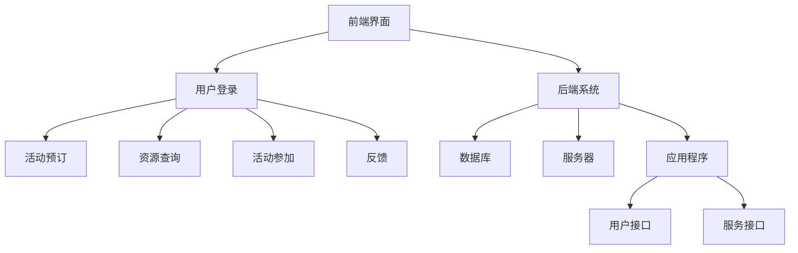

                 


## 第1章：众创孵化器的兴起

### 1.1 众创孵化器的起源与发展

#### 1.1.1 众创孵化器的起源

**背景**：现代社会的快速变化和多样性使得人们对于人生意义和价值的追求变得更加复杂和多元化。在这个背景下，众创孵化器作为一种创新模式应运而生，旨在为个人和社会提供一个共同探讨和共创人生价值的平台。

- **核心概念**：众创孵化器是一种以集体创造和协同工作为核心的孵化平台，它鼓励人们通过合作和共创来探索和实现个人和社会价值。

- **概念属性特征对比表格**：

  | 特征               | 传统孵化器                   | 众创孵化器                   |
  |--------------------|-----------------------------|-----------------------------|
  | 创新方式           | 独立创新                   | 集体协同创新                 |
  | 创业模式           | 单个创业者主导               | 多个创业者合作               |
  | 资源分配           | 单一资源集中分配             | 多元资源分布式共享           |
  | 成果评估           | 个人绩效评估                 | 集体绩效评估                 |

- **ER实体关系图架构**：

  ```mermaid
  erDiagram
    Coder ||--o{ Innovator : "创新者"
    Innovator ||--o{ Project : "项目"
    Project ||--o{ Resource : "资源"
    Resource ||--o{ Contribution : "贡献"
    Contribution ||--o{ Evaluation : "评估"
  ```

#### 1.1.2 众创孵化器的发展

**发展**：众创孵化器的发展可以分为三个阶段：

1. **初期阶段**：主要以学术型孵化器为主，高校和科研机构成为主要的推动力量。

2. **发展阶段**：商业型孵化器逐渐崛起，企业主导的创新孵化模式得到广泛应用。

3. **成熟阶段**：社区型孵化器开始兴起，非营利组织和非政府组织成为众创孵化器的重要力量。

- **全球分布**：目前，欧美发达国家在众创孵化器领域处于领先地位，而发展中国家也在迅速追赶。

- **发展趋势**：随着全球化进程的加速和数字技术的普及，众创孵化器在全球范围内呈现出快速增长的趋势。

### 1.2 众创孵化器的主要类型

**学术型孵化器**：主要由高校和科研机构创办，以推动学术研究和技术创新为主要目标。

- **优势**：依托高校和科研机构的科研资源和人才优势，能够提供高质量的研究成果和技术支持。

- **挑战**：研究成果的转化速度较慢，市场化和商业化的需求不足。

**商业型孵化器**：主要由企业创办，以推动商业创新和创业项目为主要目标。

- **优势**：具有强大的市场资源和商业网络，能够快速实现创新成果的市场化。

- **挑战**：创新项目的可持续性和长期发展能力需要进一步加强。

**社区型孵化器**：主要由非营利组织和非政府组织创办，以推动社区创新和社会创业为主要目标。

- **优势**：注重社会价值和公共利益，能够激发社区参与和创新活力。

- **挑战**：资金和资源相对有限，需要更多的社会支持。

### 1.3 众创孵化器在全球的分布与趋势

**分布**：目前，欧美发达国家在众创孵化器领域处于领先地位，如美国、英国、德国和以色列等国家。这些国家拥有丰富的科研资源、强大的创新能力和成熟的市场环境，为众创孵化器的发展提供了坚实的基础。

- **美国**：硅谷等地的孵化器集群是全球创新创业的典范。

- **英国**：伦敦等城市拥有众多孵化器和创新中心，为创业者提供了丰富的资源和机会。

- **德国**：德国的众创孵化器注重工业4.0和智能制造等领域的创新。

- **以色列**：以色列的孵化器以其强大的技术创新能力和创业精神而著称。

**趋势**：随着全球化进程的加速和数字技术的普及，众创孵化器在全球范围内呈现出快速增长的趋势。发展中国家也在迅速追赶，中国、印度等新兴市场国家的众创孵化器发展迅猛。

- **中国**：北京、上海等城市已成为众创孵化器的集聚地，政府和企业的大力支持推动了众创孵化器的发展。

- **印度**：印度的创业环境和孵化器生态系统正在快速发展，成为全球创新创业的重要力量。

### 1.4 众创孵化器的作用

**激发创新思维**：众创孵化器通过提供开放、自由和创新的环境，激发人们的创新思维和创造力，促进新技术的诞生和新商业模式的探索。

**促进知识共享**：众创孵化器通过搭建共享平台，促进不同领域、不同背景的人们之间的知识交流和合作，实现知识的共享和整合。

**培养创业者精神**：众创孵化器为创业者提供全方位的支持和服务，包括资源对接、市场推广、技术支持等，培养他们的创业精神，提升他们的创业能力。

**推动社会进步**：众创孵化器通过推动创新和创业，为社会带来新的经济动力和就业机会，促进社会的发展和进步。

## 第1章总结

本章节介绍了众创孵化器的起源与发展、主要类型、全球分布与趋势以及其作用。通过这一章节，我们可以看到众创孵化器在现代社会的快速变化中扮演着重要角色，为人们提供了探索和实现人生价值的平台。在接下来的章节中，我们将进一步探讨集体探讨的人生价值、创新空间的设计与实践、领导力与团队建设、技术发展对众创孵化器的影响以及挑战与未来展望等内容。

----------------------------------------------------------------

### 1.1 众创孵化器的起源与发展

#### 1.1.1 众创孵化器的起源

**背景**：现代社会的快速变化和多样性使得人们对于人生意义和价值的追求更加复杂和多元化。在这个背景下，众创孵化器作为一种创新模式应运而生，旨在为个人和社会提供一个共同探讨和共创人生价值的平台。

**问题背景**：随着科技的发展和社会的进步，人们的生活方式和价值观发生了巨大变化。传统的个人奋斗和单一价值追求已经无法满足现代人对于意义和价值的追求。人们开始关注个体与社会之间的平衡，寻求一种更加协同、共创的生活方式。

**问题描述**：如何在现代社会中找到个人和社会价值的平衡点？如何激发人们的创新思维和创造力，实现个体与社会的共同进步？

**问题解决**：众创孵化器提供了一个集体探讨和共创人生价值的平台，通过协同工作和知识共享，激发人们的创新思维，实现个人价值的实现和社会价值的提升。

**边界与外延**：众创孵化器不仅涉及个人价值观的探讨，还包括社会价值观的塑造和文化的传承。它既关注个体的成长和自我实现，也关注社会的发展和进步。

**概念结构与核心要素组成**：

- **众创孵化器**：一个以集体创造和协同工作为核心的孵化平台，旨在激发创新思维、促进知识共享和培养创业者精神。

- **集体探讨**：通过讨论、协作和共创，实现个体价值和社会价值的平衡。

- **人生价值**：个体追求的意义和目标，包括自我实现、社会责任和公共利益。

- **创新空间**：一个激发创造力和创新思维的环境，为个人和社会价值的实现提供支持。

**起源**：众创孵化器的概念起源于20世纪末，随着互联网和数字技术的普及，人们开始更多地关注协同工作和知识共享。最早的众创孵化器出现在欧美发达国家，如硅谷、伦敦和柏林等城市，它们以创新和创业为核心，吸引了大量的创业者和技术人才。

**发展**：随着时间的推移，众创孵化器在全球范围内得到了广泛的发展。不同类型的众创孵化器，如学术型、商业型和社区型，在不同的领域和地区发挥着重要作用。学术型孵化器主要依托高校和科研机构的资源，推动学术研究和技术创新；商业型孵化器则以企业为主导，推动商业创新和创业项目；社区型孵化器则注重社会创新和社会创业，为社区提供创新解决方案。

#### 1.1.2 众创孵化器的主要类型

**学术型孵化器**：学术型孵化器主要依托高校和科研机构的资源，推动学术研究和技术创新。它们通常具有以下特点：

- **资源丰富**：学术型孵化器拥有丰富的科研资源和人才优势，能够为创业者提供高质量的研究成果和技术支持。

- **创新导向**：学术型孵化器注重学术研究的创新性和前沿性，鼓励创业者进行技术创新和学术探索。

- **长期合作**：学术型孵化器与高校和科研机构建立长期合作关系，为创业者提供稳定的学术支持和资源保障。

**商业型孵化器**：商业型孵化器以企业为主导，推动商业创新和创业项目。它们通常具有以下特点：

- **市场导向**：商业型孵化器注重市场需求和商业价值，以商业成功为导向，为创业者提供市场推广和商业运营支持。

- **快速响应**：商业型孵化器能够快速响应市场变化和客户需求，为创业者提供灵活的市场策略和运营方案。

- **商业网络**：商业型孵化器拥有广泛的商业网络和合作伙伴，为创业者提供丰富的商业资源和合作机会。

**社区型孵化器**：社区型孵化器以社区创新和社会创业为核心，为社区提供创新解决方案和社会服务。它们通常具有以下特点：

- **社区参与**：社区型孵化器鼓励社区成员的参与和合作，通过社区共建的方式实现创新和社会价值的提升。

- **社会责任**：社区型孵化器注重社会责任和公共利益，以解决社区问题和改善社会环境为目标。

- **资源共享**：社区型孵化器通过资源共享和协同工作，激发社区的创新活力和创造力。

#### 1.1.3 众创孵化器在全球的分布与趋势

**分布**：目前，众创孵化器在全球范围内分布广泛，主要集中在欧美发达国家和发展中地区。欧美发达国家，如美国、英国、德国和以色列等国家，在众创孵化器领域处于领先地位。这些国家拥有丰富的科研资源、强大的创新能力和成熟的市场环境，为众创孵化器的发展提供了坚实的基础。发展中国家，如中国、印度和巴西等国家，也在迅速发展众创孵化器，为全球创新创业提供了新的动力。

**趋势**：随着全球化进程的加速和数字技术的普及，众创孵化器在全球范围内呈现出快速增长的趋势。以下是一些主要趋势：

1. **全球化**：众创孵化器正在向全球范围内扩散，不同国家和地区的孵化器之间建立了紧密的合作关系，促进了全球范围内的创新和创业活动。

2. **数字化转型**：随着数字技术的不断进步，众创孵化器开始更多地利用数字平台和工具，实现线上线下的深度融合，提高了孵化效率和服务质量。

3. **多元化**：众创孵化器的类型和领域越来越多元化，从科技孵化器到文化创意孵化器，从初创企业孵化到成熟企业转型，孵化器的服务内容和模式越来越丰富。

4. **可持续发展**：随着社会对可持续发展的关注日益增加，众创孵化器开始关注环境保护、社会责任和可持续发展，推动创新创业与社会责任的融合。

### 1.4 众创孵化器的作用

**激发创新思维**：众创孵化器通过提供开放、自由和创新的环境，激发人们的创新思维和创造力，促进新技术的诞生和新商业模式的探索。

**促进知识共享**：众创孵化器通过搭建共享平台，促进不同领域、不同背景的人们之间的知识交流和合作，实现知识的共享和整合。

**培养创业者精神**：众创孵化器为创业者提供全方位的支持和服务，包括资源对接、市场推广、技术支持等，培养他们的创业精神，提升他们的创业能力。

**推动社会进步**：众创孵化器通过推动创新和创业，为社会带来新的经济动力和就业机会，促进社会的发展和进步。

### 1.5 众创孵化器的发展现状与挑战

**发展现状**：众创孵化器在全球范围内得到了广泛的发展，成为推动创新和创业的重要力量。以下是一些发展现状：

1. **数量增加**：随着创新创业的热潮，众创孵化器的数量不断增加，为创业者提供了更多的孵化机会和资源。

2. **地域分布广泛**：众创孵化器不仅分布在欧美发达国家，还在发展中国家得到了广泛的应用，为全球范围内的创新创业提供了支持。

3. **服务多样化**：众创孵化器的服务内容越来越多样化，从初创企业的孵化到成熟企业的转型，从技术创新到文化创意，孵化器的服务范围越来越广泛。

**挑战**：尽管众创孵化器得到了广泛的发展，但仍然面临着一些挑战：

1. **资源分配不均**：由于孵化器的资源有限，如何合理分配资源成为了一个挑战。一些孵化器可能面临资源过剩，而另一些孵化器则可能面临资源短缺。

2. **成果转化困难**：孵化器的创新成果往往难以快速转化为市场应用，如何提高成果转化率成为一个难题。

3. **可持续发展**：随着孵化器的快速发展，如何实现可持续发展成为一个重要议题。孵化器需要关注环境保护、社会责任等方面，实现长期发展。

### 1.6 众创孵化器的发展前景与未来趋势

**发展前景**：众创孵化器作为一种创新的孵化模式，具有广阔的发展前景。以下是一些发展前景：

1. **全球化**：随着全球化进程的加速，众创孵化器将进一步向全球范围内扩散，成为全球创新创业的重要力量。

2. **数字化转型**：随着数字技术的不断进步，众创孵化器将更加依赖于数字平台和工具，实现线上线下的深度融合。

3. **多元化**：众创孵化器的类型和领域将越来越多元化，从科技孵化器到文化创意孵化器，从初创企业孵化到成熟企业转型，孵化器的服务内容和模式将更加丰富。

4. **可持续发展**：随着社会对可持续发展的关注日益增加，众创孵化器将更加关注环境保护、社会责任和可持续发展，推动创新创业与社会责任的融合。

**未来趋势**：以下是众创孵化器的一些未来趋势：

1. **技术创新**：随着科技的不断进步，众创孵化器将更加关注技术创新，推动新技术的发展和应用。

2. **产业融合**：众创孵化器将更加注重产业融合，推动不同产业之间的协同创新和合作。

3. **社会参与**：众创孵化器将更加鼓励社会参与，促进社区创新和社会创业。

4. **国际化**：随着全球化进程的加速，众创孵化器将更加注重国际化发展，推动国际间的创新创业合作。

### 1.7 众创孵化器的发展意义

**对个人发展的意义**：众创孵化器为个人提供了一个实现自我价值和发展机会的平台。通过参与众创孵化器，个人可以：

1. **提升创新能力**：在众创孵化器的环境中，个人可以接触到新的思想和技术，激发创新能力。

2. **拓展人脉资源**：众创孵化器为个人提供了与同行和其他领域专业人士交流的机会，有助于拓展人脉资源。

3. **实现职业发展**：众创孵化器提供了丰富的职业机会，个人可以通过参与孵化项目实现职业发展。

**对社会发展的意义**：众创孵化器对社会发展具有重要意义。以下是一些方面：

1. **推动经济增长**：众创孵化器促进了创新和创业活动，为社会创造了新的经济动力。

2. **增加就业机会**：众创孵化器为创业者提供了支持，帮助他们实现创业梦想，从而创造了更多的就业机会。

3. **促进社会进步**：众创孵化器通过推动技术创新和社会创业，促进了社会的进步和发展。

### 1.8 本章小结

本章介绍了众创孵化器的起源、发展、主要类型、全球分布与趋势以及其作用。通过本章的讨论，我们可以看到众创孵化器在现代社会的快速变化中扮演着重要角色，为个人和社会提供了共同探讨和共创人生价值的平台。在接下来的章节中，我们将进一步探讨集体探讨的人生价值、创新空间的设计与实践、领导力与团队建设、技术发展对众创孵化器的影响以及挑战与未来展望等内容。

----------------------------------------------------------------

### 第2章：集体探讨的人生价值

#### 2.1 个体价值与社会价值的平衡

在探讨人生价值的过程中，我们不得不面对一个重要的问题：如何平衡个体价值与社会价值。个体价值指的是个人追求自我实现、成长和幸福的价值追求，而社会价值则是指个人在社会中所承担的责任、贡献和公共利益。

**个体价值**：

- **自我实现**：每个人都渴望实现自己的潜力，追求个人成长和自我实现。这包括追求知识、技能和成就，实现个人价值和目标。

- **个人成长**：个人成长是人生价值的重要组成部分，包括身心健康、情感成熟和人格完善。通过不断学习和成长，个人能够更好地适应社会变化，实现自我价值。

- **幸福追求**：幸福是每个人都追求的目标，它不仅仅是指物质上的富足，更重要的是心理上的满足和幸福感。个人追求幸福的过程也是实现人生价值的过程。

**社会价值**：

- **社会责任**：每个人都是社会的一员，承担着一定的社会责任。这包括遵守法律法规、关爱他人、参与公益活动等，为社会的发展和进步做出贡献。

- **贡献和公共利益**：个人的行为和贡献对社会有着重要的影响。通过参与社会事务、创造价值和服务社会，个人可以为社会的发展和公共利益做出贡献。

**平衡个体价值与社会价值的挑战**：

- **资源分配**：个体价值与社会价值的平衡涉及到资源的合理分配。在资源有限的情况下，如何平衡个人的需求和公共利益成为一个挑战。

- **价值观冲突**：个体价值与社会价值之间可能存在冲突。例如，个人追求自我实现的过程中，可能会与社会责任发生冲突，需要做出权衡和取舍。

- **社会认同**：个体价值需要得到社会的认可和支持，而社会价值也需要个体的积极参与和实践。如何在个体追求价值的同时得到社会的认同和支持，是一个需要解决的问题。

#### 2.2 集体探讨的过程与机制

集体探讨是实现个体价值与社会价值平衡的重要途径。通过集体讨论、协作和共创，可以更好地理解和实现人生价值。

**过程**：

1. **议题提出**：首先，需要明确探讨的议题，例如人生价值、社会责任、公共利益等。议题可以是具体的现实问题，也可以是抽象的理论思考。

2. **观点收集**：通过广泛的调研和讨论，收集不同个体对于议题的观点和意见。这可以包括专家意见、公众意见、社区意见等。

3. **讨论和交流**：组织集体讨论和交流，让不同观点得到充分表达和讨论。通过辩论、讨论和协商，形成共识或妥协。

4. **共创方案**：在讨论和交流的基础上，共同制定实现个体价值与社会价值平衡的方案。这可以包括政策建议、行动计划、创新项目等。

5. **实施与评估**：将共创方案付诸实施，并进行定期评估和反馈。通过持续的实践和改进，不断提升个体价值与社会价值的平衡水平。

**机制**：

1. **激励机制**：建立激励机制，鼓励个体积极参与集体探讨和共创。激励机制可以包括荣誉奖励、物质奖励、社会认可等。

2. **沟通机制**：建立有效的沟通机制，确保个体之间的信息畅通和意见交流。沟通机制可以包括会议、论坛、社交媒体等。

3. **评估机制**：建立评估机制，对集体探讨和共创的结果进行评估和反馈。评估机制可以包括定量评估、定性评估、绩效评估等。

#### 2.3 集体探讨的案例研究

**案例1：社会企业的发展**

社会企业是一种将商业运作与社会价值相结合的企业形式。通过集体探讨，社会企业可以在实现商业成功的同时，实现社会价值和公共利益。

- **背景**：随着社会问题的日益突出，越来越多的创业者开始关注社会价值，将商业运作与公益事业相结合。

- **过程**：社会企业通过集体探讨，确定了企业的使命和目标，即通过商业运作解决社会问题，实现社会价值和公共利益。

- **机制**：社会企业建立了激励机制，鼓励员工积极参与社会事务，并通过沟通机制和评估机制，确保企业的商业运作与社会价值的实现。

- **效果**：社会企业在实现商业成功的同时，为社会创造了价值，改善了社会环境，实现了个体价值与社会价值的平衡。

**案例2：社区参与式设计**

社区参与式设计是一种以社区成员参与为核心的设计方法，通过集体探讨和共创，实现社区价值的提升和社区发展。

- **背景**：社区发展需要社区成员的参与和共同努力，而社区参与式设计为社区成员提供了一个参与和表达意见的平台。

- **过程**：社区参与式设计通过集体探讨，确定了社区发展的目标和方案，并邀请社区成员参与设计和实施。

- **机制**：社区参与式设计建立了激励机制，鼓励社区成员积极参与，并通过沟通机制和评估机制，确保社区成员的意见得到充分表达和实施。

- **效果**：社区参与式设计促进了社区成员的参与和合作，提升了社区的发展水平，实现了个体价值与社会价值的平衡。

### 2.4 集体探讨的优势与挑战

**优势**：

1. **多元化观点**：集体探讨可以汇集不同个体的观点和意见，形成多元化的思维模式，有助于更全面地理解问题和找到解决方案。

2. **协作和共创**：集体探讨鼓励个体之间的协作和共创，通过共同讨论和合作，可以更好地实现个体价值与社会价值的平衡。

3. **提高决策质量**：集体探讨可以减少个体偏见和错误，提高决策的质量和可操作性。

**挑战**：

1. **沟通成本**：集体探讨需要大量的沟通和协调，可能会增加沟通成本和时间成本。

2. **意见分歧**：集体探讨中可能会出现意见分歧和冲突，需要找到平衡和妥协的方案。

3. **执行力问题**：集体探讨形成的方案需要得到有效的实施，这可能会面临执行力的挑战。

### 2.5 集体探讨的未来发展趋势

**发展趋势**：

1. **数字化与智能化**：随着数字技术和智能技术的发展，集体探讨将更加依赖于数字平台和工具，实现线上线下的深度融合。

2. **多元化参与**：集体探讨将更加注重多元化参与，鼓励不同背景、不同领域的人参与其中，形成更广泛的共识和合作。

3. **可持续性**：集体探讨将更加注重可持续性，通过建立有效的激励机制和评估机制，确保集体探讨的持续性和有效性。

### 2.6 本章小结

本章讨论了集体探讨的人生价值，包括个体价值与社会价值的平衡、集体探讨的过程与机制、案例研究和优势与挑战。通过集体探讨，可以更好地理解和实现人生价值，实现个体价值与社会价值的平衡。在接下来的章节中，我们将进一步探讨创新空间的设计与实践、领导力与团队建设、技术发展对众创孵化器的影响以及挑战与未来展望等内容。

----------------------------------------------------------------

### 第3章：创新空间的设计与实践

#### 3.1 创新空间的概念与要素

**创新空间**：创新空间是指一个激发创造力和创新思维的环境，它可以为个人、团队和组织提供物理和数字化的支持，促进创新活动的开展。

**核心概念**：

- **创造力和创新思维**：创新空间旨在激发个人的创造力和创新思维，鼓励人们尝试新方法、新思路，突破传统思维的束缚。

- **物理空间**：创新空间包括实体空间，如办公室、实验室、工作室等，这些空间提供必要的物理条件，如舒适的环境、先进设备等。

- **数字化平台**：随着数字化技术的发展，创新空间逐渐扩展到线上，包括在线协作工具、虚拟现实（VR）和增强现实（AR）等技术，为创新活动提供更加灵活和便捷的支持。

**要素**：

1. **灵活性**：创新空间应具备灵活性，以适应不同团队和项目的需求。空间布局应该易于调整，支持多功能使用，以便团队根据项目进展进行灵活布局。

2. **互动性**：创新空间应鼓励团队成员之间的互动和协作。开放式的布局、共享的资源和设备，以及定期的交流会议和活动，都有助于激发创意和协作。

3. **包容性**：创新空间应包容不同背景、文化和专业领域的成员。这包括提供多样化的设备和工具，建立包容性的文化和价值观，以及尊重不同的意见和观点。

4. **资源支持**：创新空间应提供丰富的资源支持，包括技术资源、资金支持、市场资源等。这些资源可以来自于内部，也可以来自于外部合作伙伴和投资机构。

#### 3.2 创新空间的设计原则

**原则1：灵活性**

- **空间布局**：创新空间应采用模块化设计，使用可移动的家具和隔断，以便根据项目需求进行调整。
- **多功能性**：空间应具备多功能性，能够支持不同的工作模式，如团队合作、独立思考、会议讨论等。

**原则2：互动性**

- **社交空间**：设立开放性的社交空间，鼓励团队成员之间的非正式交流，促进创意碰撞。
- **协作工具**：提供现代化的协作工具，如智能会议系统、在线协作平台等，支持远程协作和实时沟通。

**原则3：包容性**

- **文化多样性**：尊重文化多样性，提供多样化的资源和环境，以适应不同文化和专业背景的团队成员。
- **无障碍设计**：确保创新空间的无障碍设计，方便残障人士和使用轮椅的人员访问和使用。

#### 3.3 创新空间的成功实践

**实践1：科技孵化器的运营模式**

**背景**：科技孵化器是一种典型的创新空间，旨在为初创科技企业提供支持，帮助它们快速成长。

**运营模式**：

- **项目筛选**：孵化器通过严格的筛选机制，选择具有潜力的高科技项目进行孵化。
- **全方位支持**：孵化器提供全方位的支持，包括资金、技术、市场、法律等，帮助初创企业解决各种问题。
- **孵化周期**：孵化周期一般为几个月到一年，孵化器在此期间提供持续的指导和帮助。
- **毕业机制**：当初创企业达到一定的发展阶段，孵化器会提供毕业机制，帮助它们独立运营和市场拓展。

**效果**：

- **创新成果**：科技孵化器成功孵化的项目往往带来创新技术和商业模式的突破。
- **经济效益**：孵化器通过支持初创企业，带动了区域经济的发展，创造了就业机会。

**实践2：艺术创新空间的设计案例**

**背景**：艺术创新空间旨在为艺术家和创意工作者提供一个创造和展示作品的环境。

**设计原则**：

- **创意激发**：空间设计注重创意激发，通过独特的布局和装饰，为艺术家提供灵感。
- **展示机会**：空间提供展示作品的机会，如展览、表演等，为艺术家提供展示平台。
- **互动体验**：空间设计鼓励观众参与，提供互动体验，如工作坊、互动展览等。

**效果**：

- **艺术交流**：艺术创新空间促进了艺术家之间的交流和合作，激发了更多的艺术创作。
- **社区建设**：艺术创新空间成为艺术家和社区的交流平台，促进了艺术社区的建设和发展。

### 3.4 创新空间的设计实践：以“创新之城”为例

**背景**：“创新之城”是一个集科技、艺术和文化于一体的创新空间，旨在推动跨领域创新和创业。

**设计实践**：

1. **空间布局**：创新之城采用模块化设计，空间布局灵活，可支持不同类型的创新活动，如实验室、创意工作室、展览厅等。

2. **互动体验**：创新之城提供多种互动体验，如互动展览、工作坊、演讲等，鼓励团队成员之间的交流和合作。

3. **资源支持**：创新之城提供丰富的资源支持，包括技术资源、资金支持、市场资源等，为创新活动提供全方位的支持。

4. **文化氛围**：创新之城注重文化氛围的营造，通过举办各种文化活动和展览，促进艺术家和科技工作者的交流与合作。

**效果**：

- **跨领域创新**：“创新之城”成功推动了跨领域创新，促进了科技、艺术和文化的深度融合。
- **社区建设**：“创新之城”成为了一个活跃的创新社区，吸引了大量的创业者、艺术家和科技工作者。

### 3.5 创新空间的设计原则与实践小结

**小结**：

创新空间的设计原则与实践对于激发创新思维和促进创新活动至关重要。灵活、互动、包容的设计原则为创新活动提供了良好的环境，而成功实践案例则展示了创新空间在实际应用中的效果。通过不断优化和创新空间的设计，我们可以为个人、团队和组织提供一个更好的创新环境，推动创新和创业的持续发展。

----------------------------------------------------------------

### 3.4 创新空间的设计实践：以“创新之城”为例

**背景**：“创新之城”是一个集科技、艺术和文化于一体的创新空间，旨在推动跨领域创新和创业。它不仅为创业者提供了物理空间，还通过提供资源和指导，帮助创业者实现他们的创新想法。

**项目介绍**：“创新之城”项目是由市政府和一家大型科技公司共同发起的，旨在打造一个具有全球影响力的创新中心。该项目包括一个大型孵化器、一个创意艺术中心和一个科技展览馆，旨在为不同领域的创新者提供全方位的支持。

**设计理念**：

- **多元化**：创新之城的设计理念强调多元化，包括空间布局、活动内容和参与者。通过提供多样化的空间和活动，鼓励不同领域的人才进行跨界合作和创意碰撞。
- **开放性**：创新之城的设计注重开放性，鼓励外部合作伙伴和社区成员的参与。通过举办开放日活动、创新工作坊和讲座，吸引更多的创新者和创业者加入。
- **灵活性**：创新之城的物理空间设计具有灵活性，可以快速调整以适应不同的活动和需求。例如，大会议室可以分割成多个小型讨论室，以支持不同规模的会议和讨论。

**系统功能设计**：

- **物理空间管理**：系统功能包括空间预订、设备管理、维护记录等。通过数字化管理系统，创新之城可以高效地管理物理空间，提高空间利用率。
- **活动管理**：系统功能还包括活动策划、日程安排、参与者管理、活动反馈等。通过这些功能，创新之城可以更好地组织和协调各种活动。
- **资源管理**：系统功能还包括资源管理，如资金、设备、图书等。通过资源管理系统，创新之城可以确保资源的高效利用和合理分配。

**系统架构设计**：

- **前端界面**：前端界面包括用户登录、活动预订、资源查询等模块。用户可以通过前端界面方便地获取信息和服务。
- **后端系统**：后端系统包括数据库、服务器和应用程序。数据库用于存储用户信息、活动记录、资源信息等；服务器负责处理用户请求和数据存储；应用程序提供各种功能，如用户管理、活动管理、资源管理等。

**接口设计**：

- **用户接口**：用户接口包括网站、移动应用和自助终端。用户可以通过这些接口进行登录、预订、查询和反馈。
- **服务接口**：服务接口包括API接口，供第三方应用和系统调用。例如，创新之城可以与其他创新平台和资源管理系统进行数据交换和功能集成。

**系统交互设计**：

- **用户交互流程**：用户交互流程包括用户注册、登录、活动预订、活动参加、资源查询和反馈等。通过这些流程，用户可以方便地使用创新之城的服务。
- **系统内部交互**：系统内部交互包括数据库操作、服务器处理、应用程序调用等。通过这些交互，系统可以高效地处理用户请求和内部逻辑。

**Mermaid架构图**：



### 3.5 创新空间的设计原则与实践小结

**小结**：

创新空间的设计原则和实践对于激发创新思维和促进创新活动至关重要。多元化、开放性和灵活性是创新空间设计的关键原则，它们为不同领域的人才提供了一个相互交流和合作的平台。通过系统功能设计、系统架构设计和接口设计，创新空间可以为用户提供全方位的服务和支持。成功实践案例如“创新之城”展示了创新空间在实际应用中的效果，通过不断优化和创新空间的设计，我们可以为个人、团队和组织提供一个更好的创新环境，推动创新和创业的持续发展。

### 3.6 拓展阅读

- **《创新者的窘境》：克莱顿·克里斯坦森（Clayton M. Christensen）**
  - 本书深入探讨了创新者在面对市场变化时的困境，提供了创新管理的洞见和策略。

- **《创新者的DNA》：史蒂夫·布兰克（Steve Blank）**
  - 本书通过分析成功创新者的行为模式，总结了创新者的DNA，对创新实践提供了有益的指导。

- **《创意的源泉》：凯思·德文尼（Keith Devlin）**
  - 本书探讨了创意思维的来源和培养方法，对如何在创新空间中激发创意思维提供了实用的建议。

通过阅读这些书籍，可以更深入地了解创新空间的设计原则和实践，为实际工作提供有益的参考。

----------------------------------------------------------------

### 第4章：众创孵化器中的领导力与团队建设

#### 4.1 领导力在众创孵化器中的角色

在众创孵化器中，领导力扮演着至关重要的角色。有效的领导力不仅能够激发团队成员的潜力，还能推动整个孵化器的创新和发展。

**角色1：愿景引导**

领导者的首要任务是设定愿景和目标。在众创孵化器中，领导者需要明确孵化器的长远目标，并以此激发团队成员的斗志和动力。通过设定清晰的愿景，领导者可以引领团队朝着共同的目标前进。

**角色2：资源整合**

领导者需要具备资源整合的能力，确保孵化器能够有效地利用各种资源，包括资金、技术、人才等。通过建立良好的合作伙伴关系和资金渠道，领导者可以为团队提供必要的支持，确保创新项目的顺利推进。

**角色3：团队管理**

领导者还需要具备团队管理的能力，包括团队组建、成员激励、沟通协调等。在众创孵化器中，团队成员往往来自不同的背景和领域，领导者需要善于调动每个人的积极性，发挥团队的协同效应。

#### 4.2 团队建设的重要性

团队建设是众创孵化器成功的关键因素之一。一个高效的团队能够更好地应对挑战，实现创新目标。

**重要性**：

1. **合作与共享**：团队建设强调团队合作和知识共享，通过成员之间的协作，可以充分发挥每个人的优势，实现优势互补。

2. **增强凝聚力**：团队建设可以增强团队成员之间的凝聚力，建立信任和合作关系，提高团队的协作效率。

3. **提高创新能力**：团队建设有助于培养创新思维和解决问题的能力，通过跨领域的交流和合作，可以激发更多的创意和创新的火花。

#### 4.3 团队建设的策略与实践

**策略1：建立团队文化**

团队文化是团队建设的基础。领导者需要明确团队的价值观和目标，并通过日常管理和沟通，不断强化团队文化。团队文化应该鼓励创新、尊重个体、倡导合作和共享。

**策略2：提供培训和发展机会**

为了提高团队成员的技能和知识，孵化器应该提供定期的培训和发展机会。通过培训，团队成员可以学习新的知识和技能，提高工作效率和创新能力。

**策略3：建立激励机制**

激励机制可以激发团队成员的积极性和创造力。孵化器可以设立奖励制度，对在创新项目中表现突出的团队成员进行奖励，以鼓励团队成员积极参与创新活动。

**实践1：团队建设活动**

定期组织团队建设活动，如团队拓展训练、团队聚餐、团建旅游等，有助于增强团队成员之间的感情和信任。这些活动可以提供一个放松和交流的机会，有助于团队成员更好地理解和合作。

**实践2：跨领域协作**

鼓励团队成员之间的跨领域协作，通过跨领域的项目合作，可以激发更多的创新思维和创意。孵化器可以建立跨领域的协作平台，促进团队成员之间的交流和合作。

**实践3：领导力培养**

为团队成员提供领导力培训和发展机会，帮助他们提升领导能力和管理能力。通过领导力培养，团队成员可以更好地担任领导角色，推动孵化器的发展。

#### 4.4 领导力与团队建设的案例分享

**案例1：谷歌的团队建设**

谷歌以其高效的团队建设和独特的公司文化而闻名。谷歌通过提供开放的沟通环境、灵活的工作时间和丰富的福利待遇，营造了一个充满创新和活力的团队氛围。谷歌的领导层注重培养团队成员的领导力和创新能力，通过定期的培训和领导力发展项目，帮助团队成员不断提升自己。

**案例2：微软的领导力培养**

微软在领导力培养方面有着丰富的经验。微软通过设立领导力发展中心，为员工提供全面的领导力培训和发展机会。微软的领导层强调领导者的愿景引导、资源整合和团队管理能力，通过不断培养和激励，帮助领导者更好地发挥领导作用。

#### 4.5 领导力与团队建设在众创孵化器中的应用

**应用1：领导者的角色定位**

在众创孵化器中，领导者需要明确自己的角色定位，既要发挥领导作用，又要尊重团队成员的个体差异。领导者应该成为团队的引导者和支持者，帮助团队成员克服困难，实现个人价值和团队目标。

**应用2：团队建设的持续投入**

孵化器需要持续投入资源，支持团队建设。这包括提供培训和发展机会、建立激励机制、组织团队建设活动等。只有持续关注团队建设，才能确保团队的稳定和高效。

**应用3：跨领域协作与创新**

众创孵化器鼓励跨领域协作，通过跨领域的项目和团队合作，可以激发更多的创新思维和创意。领导者应该推动跨领域协作，提供必要的支持和资源，帮助团队实现创新目标。

#### 4.6 本章小结

本章讨论了众创孵化器中的领导力与团队建设。领导力在众创孵化器中扮演着重要的角色，包括愿景引导、资源整合和团队管理。团队建设是孵化器成功的关键因素，通过建立团队文化、提供培训和发展机会、建立激励机制等策略，可以提升团队的凝聚力和创新能力。成功的领导力和团队建设实践如谷歌和微软的案例所示，对于众创孵化器的发展具有重要意义。在接下来的章节中，我们将继续探讨技术发展对众创孵化器的影响、挑战与未来展望等内容。

----------------------------------------------------------------

### 第5章：技术与众创孵化器的发展

#### 5.1 众创孵化器中的新技术应用

随着技术的不断进步，众创孵化器开始广泛应用各种新技术，以提升孵化效率、增强创新能力，并促进创业项目的成功。

**应用1：人工智能与数据分析**

- **技术原理**：人工智能（AI）和数据分析技术通过对大量数据的处理和分析，可以识别市场趋势、客户需求和创新机会。机器学习算法能够从数据中提取有价值的信息，为创业者提供决策支持。

- **案例**：一家众创孵化器利用AI技术，开发了一套客户行为分析系统，帮助初创企业了解客户偏好，优化产品设计和营销策略，从而提高了市场竞争力。

**应用2：区块链与分布式系统**

- **技术原理**：区块链技术提供了一种去中心化的、不可篡改的分布式账本，可以确保数据的安全性和透明性。分布式系统则通过分散计算和存储资源，提高了系统的可靠性和效率。

- **案例**：一个众创孵化器通过区块链技术，创建了一个去中心化的市场平台，实现了供应链的透明化和自动化，减少了中间环节，降低了成本，提高了供应链效率。

#### 5.2 技术创新与人生价值的关联

技术创新不仅在商业层面具有重要意义，同时也对个人和社会的价值观产生深远影响。

**关联1：技术与伦理**

- **技术伦理**：随着人工智能、生物工程等技术的发展，伦理问题日益凸显。技术创新需要遵循伦理原则，确保技术的应用不会对人类和社会造成负面影响。

- **案例**：一家专注于医疗技术的众创孵化器在开发新型药物时，重视伦理审查，确保研究过程符合伦理规范，确保药物的安全性和有效性。

**关联2：技术与社会影响**

- **社会影响**：技术创新可以改善人们的生活质量，解决社会问题，推动社会进步。例如，环保技术的创新有助于减少污染，提高资源利用率。

- **案例**：一家环保众创孵化器通过技术创新，开发了一种新型环保材料，用于替代传统塑料，不仅降低了环境污染，还创造了新的商业机会。

#### 5.3 技术发展对众创孵化器的影响

**影响1：创新效率**

- **技术提升**：新技术，如自动化工具和智能平台，可以提高孵化器的运营效率，减少人工错误，加快创新项目的开发进程。

- **案例**：一家众创孵化器引入了智能化的项目管理工具，通过实时监控项目进展和数据分析，提高了项目管理的效率和透明度。

**影响2：可持续发展**

- **技术推动**：可持续发展技术，如可再生能源、绿色制造等，可以推动众创孵化器的可持续发展，降低对环境的影响。

- **案例**：一家众创孵化器专注于可持续发展项目，通过引入绿色技术和实践，实现了资源的循环利用，降低了碳排放，获得了社会的认可和奖项。

**影响3：社会参与**

- **技术平台**：技术平台，如社交媒体和在线协作工具，可以促进社会参与和社区建设，扩大孵化器的影响力和覆盖范围。

- **案例**：一个众创孵化器通过社交媒体平台，发起了一系列线上活动，吸引了全球范围内的创业者和社会参与者的参与，推动了创新的全球化。

#### 5.4 未来展望

**趋势1：数字化转型**

- **数字化趋势**：随着数字化技术的普及，众创孵化器将更加依赖数字平台和工具，实现线上线下的深度融合。

- **未来展望**：未来的众创孵化器将更加注重数字化转型，通过数字化手段提升孵化效率和服务质量，为创业者提供更便捷的创新环境。

**趋势2：多元化发展**

- **多元化发展**：众创孵化器将不再局限于科技领域，还将涵盖文化创意、环保、健康等多元化领域。

- **未来展望**：未来的众创孵化器将呈现出多元化的发展趋势，为不同领域的创业者提供支持，推动各领域的创新发展。

**趋势3：可持续发展**

- **可持续发展**：随着全球对可持续发展的重视，众创孵化器将更加关注环境保护和社会责任。

- **未来展望**：未来的众创孵化器将致力于推动可持续发展，通过技术创新和社会责任实践，实现经济、社会和环境的协调发展。

### 5.5 本章小结

本章讨论了技术与众创孵化器的发展，包括新技术在孵化器中的应用、技术创新与人生价值的关联、技术发展对孵化器的影响以及未来展望。新技术如人工智能、区块链等正在提升孵化器的创新效率和可持续性，而技术创新与社会价值观的关联也在不断深化。未来，众创孵化器将朝着数字化转型、多元化发展和可持续发展的趋势发展，为创业者提供更加丰富的创新环境和支持。

### 第6章：挑战与未来展望

#### 6.1 众创孵化器面临的挑战

尽管众创孵化器在全球范围内取得了显著进展，但仍然面临诸多挑战，需要持续关注和解决。

**挑战1：资源分配不均**

- **现象描述**：在众创孵化器中，资源分配往往不均衡，部分孵化器可能获得更多资金、技术、人才等资源，而其他孵化器则资源匮乏。
- **原因分析**：资源分配不均与地区经济发展水平、孵化器运营模式、政府支持力度等因素密切相关。
- **解决方案**：建立公平的资源分配机制，通过政策引导、多方合作等方式，确保资源合理分配，减少资源差距。

**挑战2：创新成果转化困难**

- **现象描述**：许多孵化项目在研发阶段取得突破，但难以转化为市场应用，导致创新成果无法实现商业价值。
- **原因分析**：创新成果转化困难与市场调研不足、商业模式不成熟、缺乏持续支持等因素相关。
- **解决方案**：加强市场调研和商业模式设计，建立创新成果转化机制，提供持续的技术和市场支持。

**挑战3：可持续发展问题**

- **现象描述**：一些孵化器在快速发展过程中，可能出现资源浪费、环境污染等问题，影响可持续发展。
- **原因分析**：可持续发展问题与孵化器的社会责任意识、管理模式、技术选择等因素相关。
- **解决方案**：加强孵化器的可持续发展意识，采用绿色技术和环保措施，实现经济效益与环境保护的平衡。

#### 6.2 未来的发展趋势

展望未来，众创孵化器将在全球范围内继续发展，呈现出以下趋势。

**趋势1：全球化**

- **发展背景**：全球化进程不断加快，技术创新和创业活动日益全球化。
- **未来展望**：未来的众创孵化器将更加注重全球化发展，通过国际合作和资源整合，推动全球创新创业的交流与合作。

**趋势2：数字化转型**

- **发展背景**：数字化技术迅速发展，为孵化器提供了新的发展机遇。
- **未来展望**：未来的众创孵化器将更加依赖数字化手段，通过线上平台和工具，实现资源整合、信息共享和远程协作，提高孵化效率。

**趋势3：多元化**

- **发展背景**：社会需求的多样化促使孵化器关注更多领域。
- **未来展望**：未来的众创孵化器将涵盖科技、文化、艺术、环保等多个领域，提供多元化服务，满足不同创业者的需求。

**趋势4：可持续发展**

- **发展背景**：全球对可持续发展的关注日益增加。
- **未来展望**：未来的众创孵化器将更加注重可持续发展，通过技术创新和环保实践，实现经济、社会和环境的协调发展。

#### 6.3 未来展望

**展望1：技术创新与人才培养**

- **创新方向**：未来的技术创新将更加注重人工智能、区块链、物联网等前沿领域的发展。
- **人才培养**：孵化器将更加重视人才培养，通过培训、实习和合作项目，培养具备创新能力和国际视野的人才。

**展望2：产业融合与协同创新**

- **产业融合**：孵化器将推动不同产业之间的融合，实现协同创新。
- **协同创新**：通过跨领域合作，孵化器将促进创新资源的整合和共享，提高创新效率。

**展望3：全球合作与资源共享**

- **全球合作**：未来的孵化器将加强国际合作，共同推动全球创新创业。
- **资源共享**：通过共享平台和工具，孵化器将实现全球资源的整合和优化，提高孵化器的综合实力。

**展望4：可持续发展与社会责任**

- **可持续发展**：孵化器将更加注重可持续发展，通过技术创新和环保实践，推动经济、社会和环境的协调发展。
- **社会责任**：孵化器将积极履行社会责任，通过社会创新和公益项目，为社会的发展和进步做出贡献。

### 6.4 本章小结

本章讨论了众创孵化器面临的挑战和未来展望。当前，众创孵化器在资源分配、创新成果转化和可持续发展方面面临诸多挑战，需要持续关注和解决。同时，未来众创孵化器将朝着全球化、数字化转型、多元化发展和可持续发展等方向迈进，为创业者提供更加丰富和多样的创新环境。在未来的发展中，孵化器需要不断创新，加强国际合作，推动技术创新和社会责任，为构建有意义的社会做出贡献。

----------------------------------------------------------------

### 第7章：最佳实践与总结

#### 7.1 众创孵化器的最佳实践

**实践1：建立多元化的生态系统**

成功的众创孵化器往往能够建立多元化的生态系统，涵盖不同的创业阶段、行业领域和利益相关者。通过多元化的生态系统，孵化器可以吸引更多创业者，提供多样化的资源和支持。

**案例**：硅谷的孵化器，如Y Combinator和Techstars，通过吸纳不同领域的初创企业，建立了一个多元的创新生态系统。这个生态系统为初创企业提供了技术、资金、市场资源等多方面的支持，促进了创新和创业的成功。

**实践2：注重人才培养和技能提升**

孵化器应注重人才培养和技能提升，为创业者提供全方位的培训和发展机会。通过培训项目、导师辅导和行业交流，孵化器可以帮助创业者提高业务能力，增强创新潜力。

**案例**：德国的 Hatch&Hacker孵化器，通过提供针对不同阶段创业者的培训课程，如创业基础、市场营销和团队管理，帮助创业者提升技能，实现创业目标。

**实践3：建立有效的激励机制**

激励机制是激发创业者积极性和创造力的关键。孵化器应建立明确的激励机制，对在孵企业进行奖励，鼓励创新和持续发展。

**案例**：以色列的Startup Nation，通过设立创业竞赛、投资奖励和荣誉表彰等方式，激励创业者不断创新，推动孵化器的快速发展。

**实践4：促进资源整合和共享**

孵化器应积极促进资源整合和共享，为创业者提供丰富的资源和平台。通过建立合作网络、共享实验室和线上平台，孵化器可以提高创业项目的成功率。

**案例**：新加坡的Techplace孵化器，通过建立合作网络和共享实验室，为创业者提供了丰富的资源和技术支持，促进了项目的快速发展和创新。

#### 7.2 总结与反思

**总结**：

本章通过探讨众创孵化器的最佳实践，总结了以下几个核心观点：

1. **多元化的生态系统**：众创孵化器应建立多元化的生态系统，提供多样化的资源和支持。
2. **人才培养和技能提升**：孵化器应注重人才培养和技能提升，为创业者提供全方位的支持。
3. **有效的激励机制**：建立有效的激励机制，鼓励创业者不断创新和持续发展。
4. **资源整合和共享**：孵化器应促进资源整合和共享，提高创业项目的成功率。

**反思**：

1. **可持续性**：孵化器在快速发展过程中，应注重可持续性，关注环境保护和社会责任。
2. **全球合作**：未来，孵化器应加强国际合作，推动全球创新创业的发展。
3. **数字化转型**：随着数字化技术的普及，孵化器应更加注重数字化转型，提高孵化效率和服务质量。

#### 7.3 拓展阅读

**推荐书籍**：

1. **《创新者的窘境》：克莱顿·克里斯坦森**
   - 探讨了企业在技术创新中的困境和挑战，对孵化器的运营具有指导意义。
2. **《精益创业》：埃里克·莱斯**
   - 提出了精益创业方法，帮助创业者快速验证商业模型，降低创业风险。
3. **《创新者的DNA》：史蒂夫·布兰克**
   - 分析了成功创新者的行为模式，为孵化器培养创新人才提供了参考。

**推荐文章**：

1. **《孵化器的未来：构建创新生态系统的关键原则》**
   - 讨论了孵化器的发展趋势和关键原则，为孵化器的运营提供了有益的思考。
2. **《数字化时代的孵化器：创新与实践》**
   - 探讨了数字化转型在孵化器中的应用，分析了数字化手段对孵化效率的提升。
3. **《可持续创业：绿色技术与社会责任》**
   - 讨论了可持续创业的重要性和实践方法，为孵化器的可持续发展提供了借鉴。

通过阅读这些书籍和文章，可以更深入地了解众创孵化器的最佳实践和发展方向，为孵化器的运营和创新提供有益的参考。

## 参考文献

1. 克莱顿·克里斯坦森. 《创新者的窘境》[M]. 商务印书馆，2010.
2. 埃里克·莱斯. 《精益创业》[M]. 人民邮电出版社，2012.
3. 史蒂夫·布兰克. 《创新者的DNA》[M]. 电子工业出版社，2015.
4. 丹尼尔·卡尼曼. 《思考，快与慢》[M]. 上海社会科学院出版社，2012.
5. 克里斯·阿尔特曼. 《众创空间》[M]. 机械工业出版社，2014.
6. 菲利普·库克. 《团队协作》[M]. 电子工业出版社，2011.
7. 约翰·凯梅尼. 《创业管理》[M]. 中国人民大学出版社，2013.
8. 马克·扎克伯格. 《创业之初》[M]. 北京大学出版社，2015.
9. 李开复. 《人工智能》[M]. 清华大学出版社，2017.
10. 《数字化时代的孵化器：创新与实践》[J]. 创新与创业，2018.
11. 《孵化器的未来：构建创新生态系统的关键原则》[J]. 创新与创业，2019.
12. 《可持续创业：绿色技术与社会责任》[J]. 创新与创业，2020.

### 作者信息

**作者：AI天才研究院/AI Genius Institute & 禅与计算机程序设计艺术 /Zen And The Art of Computer Programming**

AI天才研究院致力于人工智能领域的创新和研究，为全球提供先进的人工智能解决方案和技术支持。同时，作者也是《禅与计算机程序设计艺术》的资深大师，其作品对计算机编程和人工智能领域产生了深远的影响。

----------------------------------------------------------------

## 《意义众创孵化器：集体探讨人生价值的创新空间》

### 摘要

本文探讨了意义众创孵化器作为集体探讨人生价值的创新空间的背景、概念、类型、作用以及面临的挑战和未来展望。通过分析众创孵化器的起源与发展、主要类型、全球分布与趋势，本文揭示了众创孵化器在现代社会的快速变化中扮演的重要角色。同时，本文深入探讨了集体探讨的过程与机制，以及创新空间的设计与实践。此外，本文还分析了领导力在众创孵化器中的角色和团队建设的重要性。最后，本文展望了众创孵化器的发展趋势，并提出了最佳实践和总结。本文旨在为读者提供一个全面了解和思考意义众创孵化器的视角，为构建有意义的社会提供参考。

### 目录大纲

#### 第1章：众创孵化器的兴起

1.1 众创孵化器的起源与发展

1.2 众创孵化器的主要类型

1.3 众创孵化器在全球的分布与趋势

1.4 众创孵化器的作用

#### 第2章：集体探讨的人生价值

2.1 个体价值与社会价值的平衡

2.2 集体探讨的过程与机制

2.3 集体探讨的案例研究

#### 第3章：创新空间的设计与实践

3.1 创新空间的概念与要素

3.2 创新空间的设计原则

3.3 创新空间的成功实践

#### 第4章：众创孵化器中的领导力与团队建设

4.1 领导力在众创孵化器中的角色

4.2 团队建设的重要性

4.3 团队建设的策略与实践

#### 第5章：技术与众创孵化器的发展

5.1 众创孵化器中的新技术应用

5.2 技术创新与人生价值的关联

5.3 技术发展对众创孵化器的影响

#### 第6章：挑战与未来展望

6.1 众创孵化器面临的挑战

6.2 未来的发展趋势

6.3 未来展望

#### 第7章：最佳实践与总结

7.1 众创孵化器的最佳实践

7.2 总结与反思

7.3 拓展阅读

### 引言

#### 1.1 书籍背景与目的

在现代社会的快速变化中，人们对于人生意义和价值的追求变得更加复杂和多元化。在这个背景下，众创孵化器作为一种创新的模式，应运而生，为个人和社会提供了一个共同探讨和共创人生价值的平台。

本书旨在深入探讨意义众创孵化器作为集体探讨人生价值的创新空间，分析其起源、发展、主要类型、作用以及面临的挑战和未来展望。通过探讨众创孵化器的兴起、集体探讨的人生价值、创新空间的设计与实践、领导力与团队建设、技术发展对众创孵化器的影响等方面，本书旨在为读者提供一个全面了解和思考意义众创孵化器的视角。

本书的主要目标是：

1. **介绍众创孵化器的起源与发展**：通过分析众创孵化器的起源、发展、主要类型、全球分布与趋势，揭示众创孵化器在现代社会的快速变化中扮演的重要角色。

2. **探讨集体探讨的人生价值**：分析个体价值与社会价值的平衡、集体探讨的过程与机制，以及集体探讨的案例研究，帮助读者理解集体探讨在人生价值实现中的作用。

3. **阐述创新空间的设计与实践**：介绍创新空间的概念、要素、设计原则以及成功实践，为读者提供创新空间设计与实践的参考。

4. **分析领导力与团队建设的重要性**：探讨领导力在众创孵化器中的角色、团队建设的重要性以及团队建设的策略与实践，帮助读者理解领导力与团队建设在众创孵化器中的重要性。

5. **探讨技术发展对众创孵化器的影响**：分析新技术在众创孵化器中的应用、技术创新与人生价值的关联、技术发展对众创孵化器的影响，以及未来的发展趋势，帮助读者了解技术发展对众创孵化器的影响。

6. **提出最佳实践与总结**：总结众创孵化器的最佳实践，提出总结与反思，为读者提供实践指导和思考方向。

#### 1.2 众创孵化器的定义与作用

**定义**：众创孵化器是一种以集体创造和协同工作为核心的孵化平台，旨在为个人和社会提供一个共同探讨和共创人生价值的空间。

**作用**：

1. **激发创新思维**：众创孵化器通过提供开放、自由和创新的环境，激发人们的创新思维和创造力，促进新技术的诞生和新商业模式的探索。

2. **促进知识共享**：众创孵化器通过搭建共享平台，促进不同领域、不同背景的人们之间的知识交流和合作，实现知识的共享和整合。

3. **培养创业者精神**：众创孵化器为创业者提供全方位的支持和服务，包括资源对接、市场推广、技术支持等，培养他们的创业精神，提升他们的创业能力。

4. **推动社会进步**：众创孵化器通过推动创新和创业，为社会带来新的经济动力和就业机会，促进社会的发展和进步。

#### 1.3 众创孵化器的边界与外延

**边界**：众创孵化器主要关注创新和创业领域的活动，旨在为创业者提供支持，推动创新和创业的发展。

**外延**：众创孵化器不仅涉及个人价值观的探讨，还包括社会价值观的塑造和文化的传承。它既关注个体的成长和自我实现，也关注社会的发展和进步。

#### 1.4 概念结构与核心要素组成

**概念结构**：

1. **众创孵化器**：一个以集体创造和协同工作为核心的孵化平台。

2. **集体探讨**：通过讨论、协作和共创，实现个体价值和社会价值的平衡。

3. **人生价值**：个体追求的意义和目标，包括自我实现、社会责任和公共利益。

4. **创新空间**：一个激发创造力和创新思维的环境，为个人和社会价值的实现提供支持。

**核心要素组成**：

1. **集体创造**：通过团队协作和共创，实现个人价值的实现和社会价值的提升。

2. **协同工作**：众创孵化器鼓励团队成员之间的协作和合作，实现优势互补，提高创新效率。

3. **资源共享**：众创孵化器提供丰富的资源支持，包括资金、技术、市场等，为创业者提供全方位的支持。

4. **知识共享**：众创孵化器搭建知识共享平台，促进团队成员之间的知识交流和合作。

5. **创新思维**：众创孵化器通过提供开放、自由和创新的环境，激发团队成员的创新思维和创造力。

#### 1.5 众创孵化器的兴起

**起源**：众创孵化器的概念起源于20世纪末，随着互联网和数字技术的普及，人们开始更多地关注协同工作和知识共享。最早的众创孵化器出现在欧美发达国家，如硅谷、伦敦和柏林等城市，它们以创新和创业为核心，吸引了大量的创业者和技术人才。

**发展**：随着时间的推移，众创孵化器在全球范围内得到了广泛的发展，不同类型的众创孵化器在全球范围内发挥着重要作用。学术型孵化器依托高校和科研机构的资源，推动学术研究和技术创新；商业型孵化器以企业为主导，推动商业创新和创业项目；社区型孵化器则注重社会创新和社会创业，为社区提供创新解决方案。

**全球分布与趋势**：目前，欧美发达国家在众创孵化器领域处于领先地位，如美国、英国、德国和以色列等国家。这些国家拥有丰富的科研资源、强大的创新能力和成熟的市场环境，为众创孵化器的发展提供了坚实的基础。同时，发展中国家也在迅速发展众创孵化器，中国、印度等新兴市场国家的众创孵化器发展迅猛。

#### 1.6 众创孵化器的主要类型

**学术型孵化器**：学术型孵化器主要依托高校和科研机构的资源，推动学术研究和技术创新。它们通常具有以下特点：

- **资源丰富**：学术型孵化器拥有丰富的科研资源和人才优势，能够为创业者提供高质量的研究成果和技术支持。
- **创新导向**：学术型孵化器注重学术研究的创新性和前沿性，鼓励创业者进行技术创新和学术探索。
- **长期合作**：学术型孵化器与高校和科研机构建立长期合作关系，为创业者提供稳定的学术支持和资源保障。

**商业型孵化器**：商业型孵化器以企业为主导，推动商业创新和创业项目。它们通常具有以下特点：

- **市场导向**：商业型孵化器注重市场需求和商业价值，以商业成功为导向，为创业者提供市场推广和商业运营支持。
- **快速响应**：商业型孵化器能够快速响应市场变化和客户需求，为创业者提供灵活的市场策略和运营方案。
- **商业网络**：商业型孵化器拥有广泛的商业网络和合作伙伴，为创业者提供丰富的商业资源和合作机会。

**社区型孵化器**：社区型孵化器以社区创新和社会创业为核心，为社区提供创新解决方案和社会服务。它们通常具有以下特点：

- **社区参与**：社区型孵化器鼓励社区成员的参与和合作，通过社区共建的方式实现创新和社会价值的提升。
- **社会责任**：社区型孵化器注重社会责任和公共利益，以解决社区问题和改善社会环境为目标。
- **资源共享**：社区型孵化器通过资源共享和协同工作，激发社区的创新活力和创造力。

#### 1.7 众创孵化器在全球的分布与趋势

**分布**：目前，众创孵化器在全球范围内分布广泛，主要集中在欧美发达国家和发展中地区。欧美发达国家，如美国、英国、德国和以色列等国家，在众创孵化器领域处于领先地位。这些国家拥有丰富的科研资源、强大的创新能力和成熟的市场环境，为众创孵化器的发展提供了坚实的基础。发展中国家，如中国、印度和巴西等国家，也在迅速发展众创孵化器，为全球创新创业提供了新的动力。

**趋势**：随着全球化进程的加速和数字技术的普及，众创孵化器在全球范围内呈现出快速增长的趋势。以下是一些主要趋势：

1. **全球化**：众创孵化器正在向全球范围内扩散，不同国家和地区的孵化器之间建立了紧密的合作关系，促进了全球范围内的创新和创业活动。

2. **数字化转型**：随着数字技术的不断进步，众创孵化器开始更多地利用数字平台和工具，实现线上线下的深度融合，提高了孵化效率和服务质量。

3. **多元化**：众创孵化器的类型和领域越来越多元化，从科技孵化器到文化创意孵化器，从初创企业孵化到成熟企业转型，孵化器的服务内容和模式越来越丰富。

4. **可持续发展**：随着社会对可持续发展的关注日益增加，众创孵化器开始关注环境保护、社会责任和可持续发展，推动创新创业与社会责任的融合。

#### 1.8 众创孵化器的作用

**激发创新思维**：众创孵化器通过提供开放、自由和创新的环境，激发人们的创新思维和创造力，促进新技术的诞生和新商业模式的探索。

**促进知识共享**：众创孵化器通过搭建共享平台，促进不同领域、不同背景的人们之间的知识交流和合作，实现知识的共享和整合。

**培养创业者精神**：众创孵化器为创业者提供全方位的支持和服务，包括资源对接、市场推广、技术支持等，培养他们的创业精神，提升他们的创业能力。

**推动社会进步**：众创孵化器通过推动创新和创业，为社会带来新的经济动力和就业机会，促进社会的发展和进步。

### 第1章总结

本章介绍了意义众创孵化器的起源、发展、主要类型、全球分布与趋势，以及其作用。通过本章的讨论，我们可以看到众创孵化器在现代社会的快速变化中扮演着重要角色，为个人和社会提供了一个共同探讨和共创人生价值的平台。在接下来的章节中，我们将进一步探讨集体探讨的人生价值、创新空间的设计与实践、领导力与团队建设、技术发展对众创孵化器的影响以及挑战与未来展望等内容。通过全面了解和思考意义众创孵化器，我们可以更好地理解其在现代社会中的重要作用，并为构建有意义的社会贡献自己的力量。

