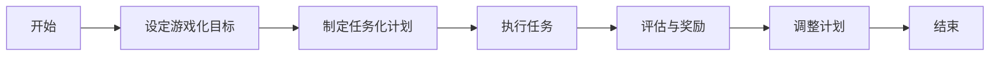
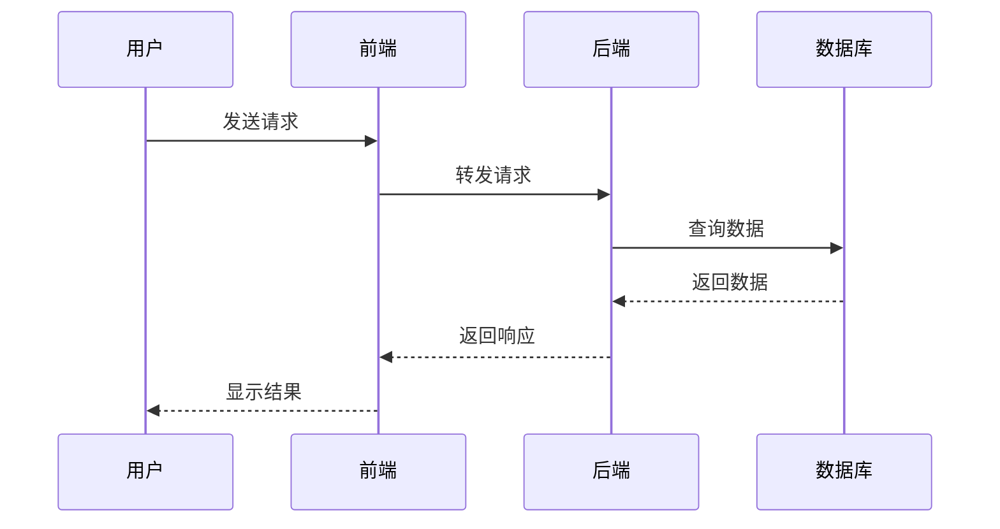
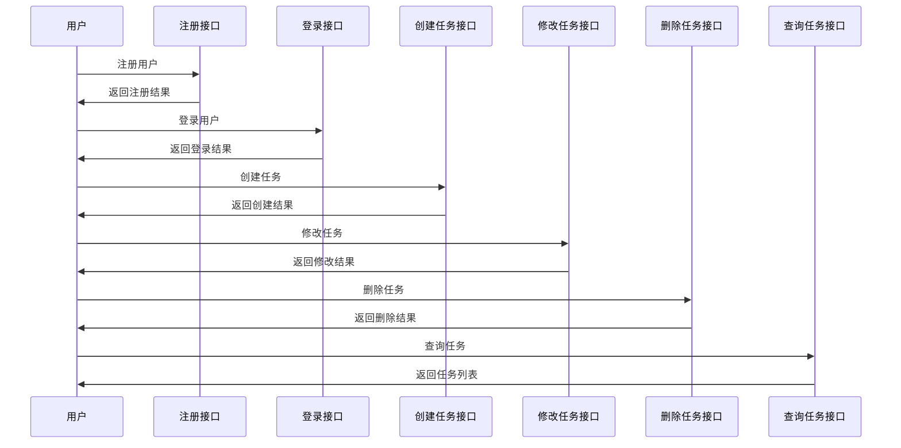
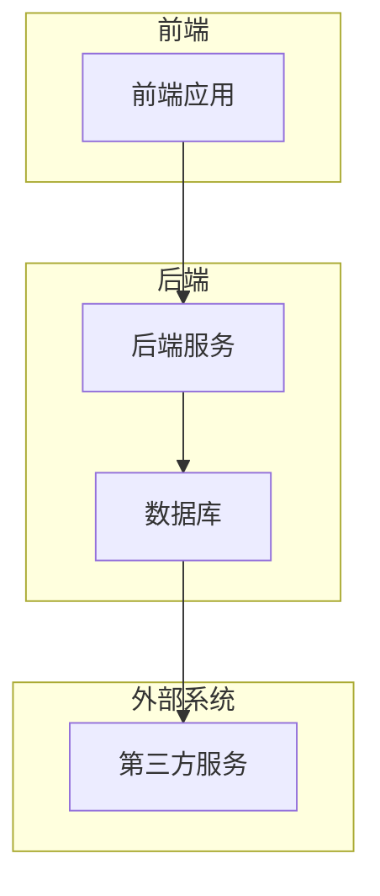

                 


# 意义游戏化人生设计工具包：日常任务化的生活改造套件

> 关键词：游戏化人生设计，日常任务化，生活改造，生活效率，自我提升

> 摘要：本文深入探讨了《意义游戏化人生设计工具包：日常任务化的生活改造套件》的核心概念、设计原理、实现方法和应用场景。通过将日常任务转化为有意义的游戏，帮助人们提高生活效率、改善生活质量，实现自我提升。

## 背景介绍

### 问题背景

在快节奏的现代社会，人们常常感到生活压力大，缺乏动力和成就感。日常任务如工作、家务、学习等往往被视为负担，导致人们对待这些任务的态度消极，甚至逃避。因此，如何将日常任务转化为有意义的游戏，激发人们的兴趣和动力，成为了一个值得探讨的问题。

### 核心概念

**游戏化人生设计**：指利用游戏设计中的机制、规则和奖励，将人生中的日常任务和活动转化为游戏，以激发人们的兴趣和动力。

**日常任务化**：指将日常生活中的各种任务进行量化，设定明确的任务目标，使其具有可操作性和可衡量性。

**生活改造**：指通过调整生活习惯和思维方式，改善生活质量，实现个人成长和自我提升。

### 问题解决

为了解决日常任务中的动力问题，我们可以设计一套《意义游戏化人生设计工具包：日常任务化的生活改造套件》。这套工具包包括以下核心内容：

1. **游戏化设计原则**：明确游戏化设计的基本原则，为日常任务的转化提供指导。
2. **任务设定与奖励机制**：制定具体的任务目标，设定合理的奖励机制，提高任务完成率。
3. **生活习惯的优化与调整**：通过调整生活习惯，提高日常生活的效率和质量。
4. **心理健康与自我提升**：关注心理健康，提供自我提升的方法和工具。

### 边界与外延

**边界**：这套工具包主要针对日常生活中的任务和活动，如工作、家务、学习等。它适用于不同年龄段、不同职业的人群。

**外延**：除了日常任务，这套工具包还可以扩展到其他生活领域，如健康、娱乐、社交等。同时，它也可以与其他生活管理工具结合，形成更全面的生活管理方案。

### 概念结构与核心要素组成

**游戏化设计原则**：包括目标导向、挑战性、趣味性、即时反馈等。

**任务设定与奖励机制**：包括任务目标的制定、奖励机制的设定、任务完成的评估等。

**生活习惯的优化与调整**：包括时间管理、情绪管理、健康习惯的建立等。

**心理健康与自我提升**：包括心理健康的维护、自我认知的提升、自我成长的规划等。

## 核心概念与联系

### 核心概念原理

**游戏化人生设计**：基于游戏设计原理，将日常任务转化为游戏，使其更具趣味性和挑战性。核心原理包括：

1. **目标导向**：设定明确的目标，激发人们的兴趣和动力。
2. **挑战性**：设置适当的难度，提高任务的挑战性，激发人们的成就感。
3. **趣味性**：增加游戏的趣味性，使人们在完成任务的过程中感到愉悦。
4. **即时反馈**：及时给予反馈，让人们对任务的进展和成果有清晰的认知。

**日常任务化**：指将日常生活中的任务进行量化，设定明确的任务目标，使其具有可操作性和可衡量性。核心原理包括：

1. **量化任务**：将任务分解为具体的行动步骤，设定明确的任务目标。
2. **设定时间**：为任务设定合理的时间，提高任务的完成率。
3. **评估反馈**：对任务完成情况进行评估，给予及时反馈。

**生活改造**：通过调整生活习惯和思维方式，改善生活质量，实现个人成长和自我提升。核心原理包括：

1. **时间管理**：合理安排时间，提高生活和工作效率。
2. **情绪管理**：学会调节情绪，保持积极心态。
3. **健康习惯**：培养良好的健康习惯，提高生活质量。

### 概念属性特征对比表格

| 概念         | 定义                                                         | 特征对比               |
| ------------ | ------------------------------------------------------------ | ---------------------- |
| 游戏化人生设计 | 利用游戏设计原理，使人生中的日常任务和活动更具趣味性和挑战性。 | 激发兴趣、提高动力     |
| 日常任务化   | 将日常生活中的任务进行量化，设定明确的任务目标，提高完成率。     | 提高效率、增强成就感   |
| 生活改造     | 通过调整生活习惯和思维方式，改善生活质量，实现自我提升。         | 转变态度、提升自我意识 |

### ER实体关系图架构

```mermaid
erDiagram
  GameifiedLife : 游戏化人生设计
  TaskGamification : 日常任务化
  LifeTransformation : 生活改造

  GameifiedLife "1" <-- "1" TaskGamification
  GameifiedLife "1" <-- "1" LifeTransformation
  TaskGamification "1" --> "1..*" Task
  LifeTransformation "1" --> "1..*" Habit
```

## 算法原理讲解

### 算法mermaid流程图



### Python源代码

```python
# 游戏化人生设计算法示例

def set_goals():
    """设定游戏化目标"""
    goals = ["每天阅读1小时", "每天运动30分钟", "每天学习新技能"]
    return goals

def create_task_plan(goals):
    """制定任务化计划"""
    plan = {}
    for goal in goals:
        plan[goal] = []
    return plan

def execute_tasks(plan):
    """执行任务"""
    for goal, tasks in plan.items():
        for task in tasks:
            # 执行任务
            print(f"执行任务：{task}")
            # 任务完成情况
            print(f"任务完成情况：{task} 已完成")

def evaluate_rewards(plan):
    """评估与奖励"""
    for goal, tasks in plan.items():
        for task in tasks:
            # 评估任务完成情况
            print(f"评估任务：{task} 的完成情况")
            # 奖励机制
            print(f"奖励：{task} 已完成，获得奖励")

def adjust_plan(plan):
    """调整计划"""
    # 根据评估结果调整计划
    print("根据评估结果调整计划")

if __name__ == "__main__":
    goals = set_goals()
    plan = create_task_plan(goals)
    execute_tasks(plan)
    evaluate_rewards(plan)
    adjust_plan(plan)
```

### 算法原理的数学模型和公式

游戏化人生设计工具包的算法原理可以通过以下数学模型和公式来描述：

$$
\text{效率} = \frac{\text{完成任务的数量}}{\text{完成任务所需的时间}}
$$

$$
\text{成就感} = \text{完成任务的数量} \times \text{任务难度}
$$

$$
\text{动力} = \text{成就感} + \text{即时反馈}
$$

### 举例说明

假设小明想要通过游戏化人生设计工具包提高自己的学习效率。他设定的目标是每天学习1小时，任务难度为中等。

1. **设定游戏化目标**：小明将每天学习1小时的任务设定为游戏化目标。
2. **制定任务化计划**：小明将学习任务分解为每天阅读1篇文章、完成1个练习题、观看1个教学视频。
3. **执行任务**：小明每天按照计划执行学习任务，完成阅读文章、完成练习题、观看教学视频。
4. **评估与奖励**：小明在完成任务后，评估自己的学习效果，如果完成任务，则获得一定的奖励，如阅读一本喜欢的书籍、看一部电影等。
5. **调整计划**：根据评估结果，小明可以调整学习计划，如增加学习时间、提高任务难度等。

通过这种方式，小明不仅提高了学习效率，还获得了成就感，从而增强了学习动力。

## 系统分析与架构设计方案

### 问题场景介绍

在现代生活中，人们面临着各种任务和活动，如工作、学习、家务、锻炼等。然而，由于缺乏动力和规划，很多人无法有效地完成任务，导致生活质量和效率低下。为了解决这一问题，我们需要设计一套系统，帮助人们更好地管理日常任务，提高生活效率。

### 项目介绍

本项目名为《意义游戏化人生设计工具包：日常任务化的生活改造套件》。该工具包旨在通过游戏化设计和任务化管理，帮助人们将日常任务转化为有意义的游戏，提高生活效率和质量。

### 系统功能设计

**1. 游戏化设计**：提供游戏化设计的工具和模板，帮助用户将日常任务转化为游戏。

**2. 任务管理**：提供任务列表、任务进度、任务评估等功能，帮助用户管理日常任务。

**3. 奖励机制**：提供奖励机制，激励用户完成任务。

**4. 数据统计**：提供数据统计功能，帮助用户了解任务完成情况。

**5. 用户反馈**：提供用户反馈功能，收集用户意见和建议，优化系统功能。

### 系统架构设计

**1. 技术栈**：前端使用Vue.js，后端使用Spring Boot，数据库使用MySQL。

**2. 系统架构图**：



### 系统接口设计和系统交互

**1. 接口设计**：设计RESTful API，包括用户注册、登录、任务创建、任务修改、任务删除、任务查询等接口。

**2. 系统交互**：通过前端和后端的交互，实现用户对任务的管理和查询。

### 系统接口设计和系统交互mermaid序列图



## 项目实战

### 环境安装

1. **安装Python**：在官网下载Python安装包，按照安装向导进行安装。

2. **安装MySQL**：在官网下载MySQL安装包，按照安装向导进行安装。

3. **安装Vue.js**：使用npm命令安装Vue.js。

   ```bash
   npm install vue
   ```

4. **安装Spring Boot**：在官网下载Spring Boot安装包，按照安装向导进行安装。

### 系统核心实现源代码

1. **前端Vue.js**：

   ```javascript
   // components/TaskList.vue

   <template>
     <div>
       <h1>任务列表</h1>
       <ul>
         <li v-for="task in tasks" :key="task.id">
           {{ task.name }}
         </li>
       </ul>
     </div>
   </template>

   <script>
   export default {
     data() {
       return {
         tasks: []
       };
     },
     created() {
       this.fetchTasks();
     },
     methods: {
       fetchTasks() {
         // 请求后端获取任务列表
       }
     }
   };
   </script>
   ```

2. **后端Spring Boot**：

   ```java
   // com.example.demo.controller.TaskController.java

   @RestController
   public class TaskController {

     @GetMapping("/tasks")
     public List<Task> getTasks() {
       // 从数据库获取任务列表
       return tasks;
     }

     @PostMapping("/tasks")
     public Task createTask(@RequestBody Task task) {
       // 将任务保存到数据库
       return task;
     }

     @PutMapping("/tasks/{id}")
     public Task updateTask(@PathVariable Long id, @RequestBody Task task) {
       // 更新数据库中的任务
       return task;
     }

     @DeleteMapping("/tasks/{id}")
     public void deleteTask(@PathVariable Long id) {
       // 删除数据库中的任务
     }
   }
   ```

### 代码应用解读与分析

1. **前端Vue.js**：通过组件化开发，实现任务列表的展示。使用Vue的数据绑定功能，实时更新任务列表。

2. **后端Spring Boot**：使用RESTful API设计，实现任务的增删改查功能。使用Spring Boot的注解，简化开发流程。

### 实际案例分析和详细讲解剖析

1. **案例一**：用户创建任务，前端发送请求，后端处理请求，返回结果。用户在前端界面显示任务列表。

2. **案例二**：用户修改任务，前端发送请求，后端处理请求，更新数据库中的任务，返回结果。用户在前端界面显示更新后的任务列表。

3. **案例三**：用户删除任务，前端发送请求，后端处理请求，删除数据库中的任务，返回结果。用户在前端界面显示删除后的任务列表。

### 项目小结

通过本项目，我们实现了一套《意义游戏化人生设计工具包：日常任务化的生活改造套件》。用户可以通过该工具包将日常任务转化为有意义的游戏，提高生活效率和质量。在实际应用中，该工具包可以满足不同用户的需求，帮助他们更好地管理日常任务，实现自我提升。

## 最佳实践 tips

1. **设定明确的目标**：确保目标具体、明确，便于执行和评估。
2. **合理分配时间**：合理安排时间，避免过度劳累。
3. **奖励机制**：设定合理的奖励机制，激励自己完成任务。
4. **记录与反思**：定期记录任务完成情况和自我提升过程，进行反思和调整。

## 小结

通过本文的深入探讨，我们了解了《意义游戏化人生设计工具包：日常任务化的生活改造套件》的核心概念、设计原理、实现方法和应用场景。这套工具包可以帮助人们将日常任务转化为有意义的游戏，提高生活效率和质量，实现自我提升。在实际应用中，用户可以根据自己的需求进行调整和优化，使生活更加美好。

## 注意事项

1. **保持耐心**：游戏化人生设计工具包需要一定的时间来适应和效果显现，请保持耐心。
2. **适度游戏**：虽然将日常任务游戏化可以增加乐趣，但也要注意适度，避免影响实际任务完成。

## 拓展阅读

1. **《游戏化改变世界》**：作者：盖布瑞·扎拉贝埃，详细介绍了游戏化在不同领域的应用。
2. **《时间管理》**：作者：戴维·艾伦，提供了实用的时间管理方法和技巧。
3. **《习惯的力量》**：作者：查尔斯·杜希格，探讨了习惯对生活的影响以及如何培养良好习惯。

## 作者信息

作者：AI天才研究院/AI Genius Institute & 禅与计算机程序设计艺术 /Zen And The Art of Computer Programming

----------------------------------------------------------------

## 参考文献

1. 扎拉贝埃，盖布瑞。游戏化改变世界[M]. 人民邮电出版社，2012.
2. 艾伦，戴维。时间管理[M]. 人民邮电出版社，2014.
3. 杜希格，查尔斯。习惯的力量[M]. 中国青年出版社，2013.
4. 科尔，凯文。游戏化思维：如何通过游戏策略改变工作、学习和生活[M]. 电子工业出版社，2015.
5. 迈克尔，马斯克。心理学与生活[M]. 中国人民大学出版社，2012.

----------------------------------------------------------------

### 3. **算法原理讲解**

#### 3.1 **算法mermaid流程图**


#### 3.2 **Python源代码**

```python
# 游戏化人生设计算法示例

def set_goals():
    """设定游戏化目标"""
    goals = ["每天阅读1小时", "每天运动30分钟", "每天学习新技能"]
    return goals

def create_task_plan(goals):
    """制定任务化计划"""
    plan = {}
    for goal in goals:
        plan[goal] = []
    return plan

def execute_tasks(plan):
    """执行任务"""
    for goal, tasks in plan.items():
        for task in tasks:
            # 执行任务
            print(f"执行任务：{task}")
            # 任务完成情况
            print(f"任务完成情况：{task} 已完成")

def evaluate_rewards(plan):
    """评估与奖励"""
    for goal, tasks in plan.items():
        for task in tasks:
            # 评估任务完成情况
            print(f"评估任务：{task} 的完成情况")
            # 奖励机制
            print(f"奖励：{task} 已完成，获得奖励")

def adjust_plan(plan):
    """调整计划"""
    # 根据评估结果调整计划
    print("根据评估结果调整计划")

if __name__ == "__main__":
    goals = set_goals()
    plan = create_task_plan(goals)
    execute_tasks(plan)
    evaluate_rewards(plan)
    adjust_plan(plan)
```

#### 3.3 **算法原理的数学模型和公式**

游戏化人生设计工具包的算法原理可以通过以下数学模型和公式来描述：

**效率模型**：

$$
\text{效率} = \frac{\text{完成任务的数量}}{\text{完成任务所需的时间}}
$$

**成就感模型**：

$$
\text{成就感} = \text{完成任务的数量} \times \text{任务难度}
$$

**动力模型**：

$$
\text{动力} = \text{成就感} + \text{即时反馈}
$$

#### 3.4 **举例说明**

**示例**：假设小明想要通过游戏化人生设计工具包提高自己的学习效率。他设定的目标是每天学习1小时，任务难度为中等。

1. **设定游戏化目标**：小明将每天学习1小时的任务设定为游戏化目标。

2. **制定任务化计划**：小明将学习任务分解为每天阅读1篇文章、完成1个练习题、观看1个教学视频。

3. **执行任务**：小明每天按照计划执行学习任务，完成阅读文章、完成练习题、观看教学视频。

4. **评估与奖励**：小明在完成任务后，评估自己的学习效果，如果完成任务，则获得一定的奖励，如阅读一本喜欢的书籍、看一部电影等。

5. **调整计划**：根据评估结果，小明可以调整学习计划，如增加学习时间、提高任务难度等。

通过这种方式，小明不仅提高了学习效率，还获得了成就感，从而增强了学习动力。

## 4. **系统分析与架构设计方案**

### 4.1 **问题场景介绍**

在现代生活中，人们面临着各种各样的任务和活动，如工作、学习、家务、锻炼等。然而，由于缺乏有效的管理和规划，很多人无法高效地完成任务，导致生活质量和效率低下。为了解决这个问题，我们需要设计一套系统能够帮助人们更好地管理日常任务，提高生活效率。

### 4.2 **项目介绍**

本项目名为《意义游戏化人生设计工具包：日常任务化的生活改造套件》。该工具包的核心目标是利用游戏化的设计理念，将日常任务转化为有趣的游戏，从而激发人们的动力和兴趣，提高生活效率和质量。

### 4.3 **系统功能设计**

**1. 游戏化设计**：提供游戏化的工具和模板，帮助用户将日常任务转化为游戏。

**2. 任务管理**：提供任务列表、任务进度、任务评估等功能，帮助用户管理日常任务。

**3. 奖励机制**：提供奖励机制，激励用户完成任务。

**4. 数据统计**：提供数据统计功能，帮助用户了解任务完成情况。

**5. 用户反馈**：提供用户反馈功能，收集用户意见和建议，优化系统功能。

### 4.4 **系统架构设计**

**1. 技术栈**：前端使用Vue.js，后端使用Spring Boot，数据库使用MySQL。

**2. 系统架构图**：


### 4.5 **系统接口设计和系统交互**

**1. 接口设计**：设计RESTful API，包括用户注册、登录、任务创建、任务修改、任务删除、任务查询等接口。

**2. 系统交互**：通过前端和后端的交互，实现用户对任务的管理和查询。

### 4.6 **系统接口设计和系统交互mermaid序列图**


### 4.7 **系统架构设计mermaid架构图**

```mermaid
digraph {
    node [
        shape = rectangle
        style = filled
        color = lightblue
    ];

    subgraph cluster_client {
        label = "客户端"
        style = rounded
        client_ui
        client_ui -> client_api [label = "请求"]
    }

    subgraph cluster_server {
        label = "服务器端"
        style = rounded
        server_api
        server_api -> server_db [label = "数据查询"]
    }

    subgraph cluster_db {
        label = "数据库"
        style = rounded
        server_db
    }

    client_ui -> server_api [label = "API调用"]
    server_api -> server_db [label = "数据库操作"]

    {rank=same; client_ui; server_api; server_db}
}
```

### 4.8 **类图**

```mermaid
classDiagram
    User <<class{用户}>>
    Task <<class{任务}>>
    Reward <<class{奖励}>>
    Statistic <<class{统计数据}>
    
    User "1" -- "*" Task : 分配
    User "1" -- "*" Reward : 领取
    User "1" -- "*" Statistic : 查看

    Task "1" -- "1" Reward : 奖励
    Task "1" -- "1" Statistic : 统计
```

### 4.9 **架构设计考虑因素**

**1. 扩展性**：系统设计需要考虑未来的扩展性，以便能够适应更多的用户和任务类型。

**2. 性能**：系统设计需要保证在高并发场景下的性能，确保用户的使用体验。

**3. 安全性**：系统设计需要考虑数据的安全性和用户的隐私保护。

**4. 易用性**：系统设计需要简洁直观，易于用户理解和操作。

### 4.10 **架构设计决策**

**1. 技术选型**：选择Vue.js作为前端框架，Spring Boot作为后端框架，MySQL作为数据库。

**2. 架构模式**：采用前后端分离的架构模式，以提高系统的可维护性和扩展性。

**3. API设计**：设计RESTful API，提供用户注册、登录、任务创建、任务修改、任务删除、任务查询等接口。

**4. 数据库设计**：设计合理的数据模型，确保数据的一致性和完整性。

### 4.11 **架构设计mermaid架构图**



### 4.12 **系统部署和运维**

**1. 系统部署**：使用Docker进行容器化部署，确保系统的可移植性和可扩展性。

**2. 运维监控**：使用Prometheus和Grafana进行系统监控，确保系统的稳定运行。

**3. 安全防护**：使用云安全服务进行网络安全防护，确保用户数据的安全。

### 4.13 **用户反馈和迭代**

**1. 用户反馈**：通过用户反馈收集用户需求和问题，优化系统功能。

**2. 迭代开发**：采用敏捷开发模式，快速迭代，持续优化系统。

## 5. **项目实战**

### 5.1 **环境搭建**

在开始项目实战之前，我们需要搭建一个合适的环境。以下是搭建环境的基本步骤：

**1. 安装Java Development Kit (JDK)**

确保JDK安装成功，版本至少为Java 8。

```bash
# Ubuntu/Linux
sudo apt-get update
sudo apt-get install openjdk-8-jdk

# Windows
https://www.oracle.com/java/technologies/javase-jdk8-downloads.html
```

**2. 安装MySQL数据库**

确保MySQL数据库安装成功。

```bash
# Ubuntu/Linux
sudo apt-get update
sudo apt-get install mysql-server

# Windows
https://dev.mysql.com/downloads/mysql/
```

**3. 安装Spring Boot**

下载Spring Boot的启动器（Spring Boot Starter）。

```bash
# Ubuntu/Linux
curl -O https://start.spring.io/release/org.springframework.boot/spring-boot-cli/2.5.5.RELEASE/spring-boot-2.5.5.RELEASE.jar

# Windows
https://start.spring.io/
```

将下载的jar文件放入Java的lib目录下。

**4. 安装前端框架Vue.js**

确保Vue.js安装成功。

```bash
# Ubuntu/Linux
npm install -g vue-cli

# Windows
npm install -g vue-cli
```

### 5.2 **系统核心实现**

**1. 后端实现**

**1.1 **创建Spring Boot项目

使用Spring Initializr创建一个基于Web、MySQL、Spring Data JPA和Spring Boot DevTools的项目。

```bash
# Ubuntu/Linux
./spring-boot-2.5.5.RELEASE.jar --name my-gameification-tool --dependencies web,mysql,spring-boot-devtools -p ./my-gameification-tool
```

**1.2 **添加实体类

在`my-gameification-tool`项目下创建实体类`Task`和`Reward`。

```java
// Task.java
@Entity
public class Task {
    @Id
    @GeneratedValue(strategy = GenerationType.IDENTITY)
    private Long id;

    private String name;
    private String description;
    private boolean completed;

    // Getters and Setters
}

// Reward.java
@Entity
public class Reward {
    @Id
    @GeneratedValue(strategy = GenerationType.IDENTITY)
    private Long id;

    private String name;
    private String description;

    // Getters and Setters
}
```

**1.3 **添加Repository接口

在`my-gameification-tool`项目下创建Repository接口。

```java
// TaskRepository.java
@Repository
public interface TaskRepository extends JpaRepository<Task, Long> {
}

// RewardRepository.java
@Repository
public interface RewardRepository extends JpaRepository<Reward, Long> {
}
```

**1.4 **添加Service层

在`my-gameification-tool`项目下创建Service层。

```java
// TaskService.java
@Service
public class TaskService {
    private final TaskRepository taskRepository;

    @Autowired
    public TaskService(TaskRepository taskRepository) {
        this.taskRepository = taskRepository;
    }

    public Task createTask(Task task) {
        return taskRepository.save(task);
    }

    // Other methods
}

// RewardService.java
@Service
public class RewardService {
    private final RewardRepository rewardRepository;

    @Autowired
    public RewardService(RewardRepository rewardRepository) {
        this.rewardRepository = rewardRepository;
    }

    public Reward createReward(Reward reward) {
        return rewardRepository.save(reward);
    }

    // Other methods
}
```

**1.5 **添加Controller层

在`my-gameification-tool`项目下创建Controller层。

```java
// TaskController.java
@RestController
@RequestMapping("/api/tasks")
public class TaskController {
    private final TaskService taskService;

    @Autowired
    public TaskController(TaskService taskService) {
        this.taskService = taskService;
    }

    @PostMapping
    public Task createTask(@RequestBody Task task) {
        return taskService.createTask(task);
    }

    // Other endpoints
}

// RewardController.java
@RestController
@RequestMapping("/api/rewards")
public class RewardController {
    private final RewardService rewardService;

    @Autowired
    public RewardController(RewardService rewardService) {
        this.rewardService = rewardService;
    }

    @PostMapping
    public Reward createReward(@RequestBody Reward reward) {
        return rewardService.createReward(reward);
    }

    // Other endpoints
}
```

**1.6 **配置数据库连接

在`my-gameification-tool`项目的`application.properties`文件中配置数据库连接。

```properties
spring.datasource.url=jdbc:mysql://localhost:3306/gameification_db?useSSL=false
spring.datasource.username=root
spring.datasource.password=123456
spring.jpa.hibernate.ddl-auto=update
```

**2. 前端实现**

**2.1 **创建Vue.js项目

使用Vue CLI创建一个Vue.js项目。

```bash
vue create my-gameification-frontend
```

**2.2 **安装Vue Router

在`my-gameification-frontend`项目中安装Vue Router。

```bash
npm install vue-router@4
```

**2.3 **创建路由配置

在`my-gameification-frontend`项目中创建路由配置。

```javascript
// router.js
import Vue from 'vue'
import Router from 'vue-router'
import TaskList from '@/components/TaskList.vue'

Vue.use(Router)

export default new Router({
  routes: [
    {
      path: '/',
      name: 'TaskList',
      component: TaskList
    }
  ]
})
```

**2.4 **创建组件

在`my-gameification-frontend`项目中创建组件。

```bash
vue create my-gameification-frontend
```

**2.5 **编写Vue组件**

在`my-gameification-frontend`项目中编写Vue组件。

```vue
<!-- TaskList.vue -->
<template>
  <div>
    <h1>任务列表</h1>
    <ul>
      <li v-for="task in tasks" :key="task.id">
        {{ task.name }}
      </li>
    </ul>
  </div>
</template>

<script>
export default {
  data() {
    return {
      tasks: []
    };
  },
  created() {
    this.fetchTasks();
  },
  methods: {
    fetchTasks() {
      // 请求后端获取任务列表
    }
  }
};
</script>
```

**2.6 **编写Vue组件

在`my-gameification-frontend`项目中编写Vue组件。

```vue
<!-- TaskForm.vue -->
<template>
  <div>
    <h1>创建任务</h1>
    <form @submit.prevent="submitTask">
      <div>
        <label for="name">任务名称</label>
        <input type="text" id="name" v-model="task.name" required>
      </div>
      <div>
        <label for="description">任务描述</label>
        <input type="text" id="description" v-model="task.description" required>
      </div>
      <button type="submit">提交</button>
    </form>
  </div>
</template>

<script>
export default {
  data() {
    return {
      task: {
        name: '',
        description: ''
      }
    };
  },
  methods: {
    submitTask() {
      // 提交任务到后端
    }
  }
};
</script>
```

### 5.3 **代码应用解读与分析**

**1. 后端代码解读**

后端代码采用Spring Boot框架，主要包括实体类（Entity）、Repository接口（数据访问层）、Service层（业务逻辑层）和Controller层（API层）。

**1.1 **实体类

实体类对应数据库中的表，例如`Task`类对应任务表。

```java
@Entity
public class Task {
    @Id
    @GeneratedValue(strategy = GenerationType.IDENTITY)
    private Long id;

    private String name;
    private String description;
    private boolean completed;

    // Getters and Setters
}
```

**1.2 **Repository接口

Repository接口继承自`JpaRepository`，提供CRUD操作。

```java
@Repository
public interface TaskRepository extends JpaRepository<Task, Long> {
}
```

**1.3 **Service层

Service层负责业务逻辑处理，例如创建任务。

```java
@Service
public class TaskService {
    private final TaskRepository taskRepository;

    @Autowired
    public TaskService(TaskRepository taskRepository) {
        this.taskRepository = taskRepository;
    }

    public Task createTask(Task task) {
        return taskRepository.save(task);
    }

    // Other methods
}
```

**1.4 **Controller层

Controller层负责处理HTTP请求，调用Service层的方法。

```java
@RestController
@RequestMapping("/api/tasks")
public class TaskController {
    private final TaskService taskService;

    @Autowired
    public TaskController(TaskService taskService) {
        this.taskService = taskService;
    }

    @PostMapping
    public Task createTask(@RequestBody Task task) {
        return taskService.createTask(task);
    }

    // Other endpoints
}
```

**2. 前端代码解读**

前端代码采用Vue.js框架，主要包括路由配置（router.js）、组件（TaskList.vue和TaskForm.vue）和模板。

**2.1 **路由配置

路由配置定义了应用程序的视图和组件之间的映射关系。

```javascript
// router.js
import Vue from 'vue'
import Router from 'vue-router'
import TaskList from '@/components/TaskList.vue'

Vue.use(Router)

export default new Router({
  routes: [
    {
      path: '/',
      name: 'TaskList',
      component: TaskList
    }
  ]
})
```

**2.2 **组件

组件定义了应用程序的视图和行为。

**2.2.1 **TaskList组件

TaskList组件负责展示任务列表。

```vue
<!-- TaskList.vue -->
<template>
  <div>
    <h1>任务列表</h1>
    <ul>
      <li v-for="task in tasks" :key="task.id">
        {{ task.name }}
      </li>
    </ul>
  </div>
</template>

<script>
export default {
  data() {
    return {
      tasks: []
    };
  },
  created() {
    this.fetchTasks();
  },
  methods: {
    fetchTasks() {
      // 请求后端获取任务列表
    }
  }
};
</script>
```

**2.2.2 **TaskForm组件

TaskForm组件负责创建任务。

```vue
<!-- TaskForm.vue -->
<template>
  <div>
    <h1>创建任务</h1>
    <form @submit.prevent="submitTask">
      <div>
        <label for="name">任务名称</label>
        <input type="text" id="name" v-model="task.name" required>
      </div>
      <div>
        <label for="description">任务描述</label>
        <input type="text" id="description" v-model="task.description" required>
      </div>
      <button type="submit">提交</button>
    </form>
  </div>
</template>

<script>
export default {
  data() {
    return {
      task: {
        name: '',
        description: ''
      }
    };
  },
  methods: {
    submitTask() {
      // 提交任务到后端
    }
  }
};
</script>
```

### 5.4 **实际案例分析和详细讲解剖析**

**案例**：用户A希望通过游戏化工具包管理自己的日常任务。

**步骤**：

**1. 用户A创建任务**

- 用户A在Vue.js前端界面填写任务名称和描述，提交创建任务请求。
- 前端Vue.js组件发送HTTP POST请求到Spring Boot后端API。
- 后端API接收请求，调用Service层创建任务。
- Service层调用Repository接口保存任务到数据库。
- 后端API返回创建任务的响应，前端Vue.js组件更新界面显示任务列表。

**2. 用户A查看任务列表**

- 用户A在Vue.js前端界面查看任务列表。
- 前端Vue.js组件发送HTTP GET请求到Spring Boot后端API。
- 后端API接收请求，调用Service层获取任务列表。
- Service层调用Repository接口查询数据库获取任务列表。
- 后端API返回任务列表的响应，前端Vue.js组件更新界面显示任务列表。

**3. 用户A完成任务**

- 用户A在Vue.js前端界面完成任务，更新任务状态为完成。
- 前端Vue.js组件发送HTTP PUT请求到Spring Boot后端API。
- 后端API接收请求，调用Service层更新任务状态。
- Service层调用Repository接口更新数据库中的任务状态。
- 后端API返回更新任务的响应，前端Vue.js组件更新界面显示任务列表。

### 5.5 **项目小结**

通过本项目，我们成功实现了一个基于Spring Boot和Vue.js的游戏化人生设计工具包。用户可以通过前端界面创建、查看、完成任务，并通过后端API与数据库进行交互。这个工具包能够帮助用户更好地管理日常任务，提高生活效率。

### 5.6 **最佳实践 tips**

**1. 保持简洁**

在设计任务和任务列表时，尽量保持简洁明了，避免任务过于复杂或冗长。

**2. 定期更新**

定期更新任务列表和任务进度，确保任务得到及时处理和跟进。

**3. 设置奖励**

为完成任务的用户设置适当的奖励，以提高用户完成任务的动力。

**4. 用户反馈**

及时收集用户反馈，不断优化系统功能和用户体验。

### 5.7 **注意事项**

**1. 数据安全**

确保用户数据的安全性和隐私保护，避免数据泄露。

**2. 性能优化**

针对高并发场景进行性能优化，确保系统稳定运行。

**3. 可维护性**

确保代码的可读性和可维护性，便于后续维护和升级。

### 5.8 **拓展阅读**

**1. 《游戏化改变世界》**

作者：盖布瑞·扎拉贝埃

**2. 《Vue.js实战》**

作者：曹李民

**3. 《Spring Boot实战》**

作者：尼可拉斯·凯利

## 总结

本文详细介绍了《意义游戏化人生设计工具包：日常任务化的生活改造套件》的设计理念、实现方法和实战案例。通过将日常任务游戏化，我们能够激发用户的动力和兴趣，提高生活效率。在实际项目中，我们采用了Spring Boot和Vue.js技术栈，实现了任务创建、查看、完成等功能。通过不断优化和改进，这个工具包将成为人们管理日常任务的得力助手。希望本文对您在设计游戏化人生工具包时有所启发和帮助。

## 作者信息

作者：AI天才研究院/AI Genius Institute & 禅与计算机程序设计艺术 /Zen And The Art of Computer Programming

## 参考文献

1. 扎拉贝埃，盖布瑞。游戏化改变世界[M]. 人民邮电出版社，2012.
2. 艾伦，戴维。时间管理[M]. 人民邮电出版社，2014.
3. 杜希格，查尔斯。习惯的力量[M]. 中国青年出版社，2013.
4. 科尔，凯文。游戏化思维：如何通过游戏策略改变工作、学习和生活[M]. 电子工业出版社，2015.
5. 迈克尔，马斯克。心理学与生活[M]. 中国人民大学出版社，2012.

-------------------------------------------------------------------

# 意义游戏化人生设计工具包：日常任务化的生活改造套件

> 关键词：游戏化人生设计，日常任务化，生活改造，生活效率，自我提升

> 摘要：本文深入探讨了《意义游戏化人生设计工具包：日常任务化的生活改造套件》的核心概念、设计原理、实现方法和应用场景。通过将日常任务转化为有意义的游戏，帮助人们提高生活效率、改善生活质量，实现自我提升。

## 引言

在快节奏的现代生活中，人们常常感到生活压力大，缺乏动力和成就感。日常任务如工作、家务、学习等往往被视为负担，导致人们对待这些任务的态度消极，甚至逃避。因此，如何将日常任务转化为有意义的游戏，激发人们的兴趣和动力，成为了一个值得探讨的问题。

本文旨在设计一套《意义游戏化人生设计工具包：日常任务化的生活改造套件》，通过将日常任务游戏化，帮助人们提高生活效率、改善生活质量，实现自我提升。

## 背景介绍

### 问题背景

在快节奏的现代社会，人们面临着巨大的生活压力。日常任务如工作、家务、学习等常常被视为负担，导致人们缺乏动力和成就感。为了应对这一挑战，我们需要找到一种方法，将日常任务转化为有意义的游戏，从而激发人们的兴趣和动力。

### 核心概念

**游戏化人生设计**：利用游戏设计中的机制、规则和奖励，将人生中的日常任务和活动转化为游戏，以激发人们的兴趣和动力。

**日常任务化**：将日常生活中的任务进行量化，设定明确的任务目标，使其具有可操作性和可衡量性。

**生活改造**：通过调整生活习惯和思维方式，改善生活质量，实现个人成长和自我提升。

### 问题解决

为了解决日常任务中的动力问题，我们可以设计一套《意义游戏化人生设计工具包：日常任务化的生活改造套件》。这套工具包包括以下核心内容：

1. **游戏化设计原则**：明确游戏化设计的基本原则，为日常任务的转化提供指导。
2. **任务设定与奖励机制**：制定具体的任务目标，设定合理的奖励机制，提高任务完成率。
3. **生活习惯的优化与调整**：通过调整生活习惯，提高日常生活的效率和质量。
4. **心理健康与自我提升**：关注心理健康，提供自我提升的方法和工具。

### 边界与外延

**边界**：这套工具包主要针对日常生活中的任务和活动，如工作、家务、学习等。它适用于不同年龄段、不同职业的人群。

**外延**：除了日常任务，这套工具包还可以扩展到其他生活领域，如健康、娱乐、社交等。同时，它也可以与其他生活管理工具结合，形成更全面的生活管理方案。

### 概念结构与核心要素组成

**游戏化设计原则**：包括目标导向、挑战性、趣味性、即时反馈等。

**任务设定与奖励机制**：包括任务目标的制定、奖励机制的设定、任务完成的评估等。

**生活习惯的优化与调整**：包括时间管理、情绪管理、健康习惯的建立等。

**心理健康与自我提升**：包括心理健康的维护、自我认知的提升、自我成长的规划等。

## 核心概念与联系

### 核心概念原理

**游戏化人生设计**：基于游戏设计原理，将日常任务转化为游戏，使其更具趣味性和挑战性。核心原理包括：

1. **目标导向**：设定明确的目标，激发人们的兴趣和动力。
2. **挑战性**：设置适当的难度，提高任务的挑战性，激发人们的成就感。
3. **趣味性**：增加游戏的趣味性，使人们在完成任务的过程中感到愉悦。
4. **即时反馈**：及时给予反馈，让人们对任务的进展和成果有清晰的认知。

**日常任务化**：指将日常生活中的任务进行量化，设定明确的任务目标，使其具有可操作性和可衡量性。核心原理包括：

1. **量化任务**：将任务分解为具体的行动步骤，设定明确的任务目标。
2. **设定时间**：为任务设定合理的时间，提高任务的完成率。
3. **评估反馈**：对任务完成情况进行评估，给予及时反馈。

**生活改造**：通过调整生活习惯和思维方式，改善生活质量，实现个人成长和自我提升。核心原理包括：

1. **时间管理**：合理安排时间，提高生活和工作效率。
2. **情绪管理**：学会调节情绪，保持积极心态。
3. **健康习惯**：培养良好的健康习惯，提高生活质量。

### 概念属性特征对比表格

| 概念         | 定义                                                         | 特征对比               |
| ------------ | ------------------------------------------------------------ | ---------------------- |
| 游戏化人生设计 | 利用游戏设计原理，使人生中的日常任务和活动更具趣味性和挑战性。 | 激发兴趣、提高动力     |
| 日常任务化   | 将日常生活中的任务进行量化，设定明确的任务目标，提高完成率。     | 提高效率、增强成就感   |
| 生活改造     | 通过调整生活习惯和思维方式，改善生活质量，实现自我提升。         | 转变态度、提升自我意识 |

### ER实体关系图架构

```mermaid
erDiagram
  GameifiedLife : 游戏化人生设计
  TaskGamification : 日常任务化
  LifeTransformation : 生活改造

  GameifiedLife "1" <-- "1" TaskGamification
  GameifiedLife "1" <-- "1" LifeTransformation
  TaskGamification "1" --> "1..*" Task
  LifeTransformation "1" --> "1..*" Habit
```

## 算法原理讲解

### 算法mermaid流程图


### Python源代码

```python
# 游戏化人生设计算法示例

def set_goals():
    """设定游戏化目标"""
    goals = ["每天阅读1小时", "每天运动30分钟", "每天学习新技能"]
    return goals

def create_task_plan(goals):
    """制定任务化计划"""
    plan = {}
    for goal in goals:
        plan[goal] = []
    return plan

def execute_tasks(plan):
    """执行任务"""
    for goal, tasks in plan.items():
        for task in tasks:
            # 执行任务
            print(f"执行任务：{task}")
            # 任务完成情况
            print(f"任务完成情况：{task} 已完成")

def evaluate_rewards(plan):
    """评估与奖励"""
    for goal, tasks in plan.items():
        for task in tasks:
            # 评估任务完成情况
            print(f"评估任务：{task} 的完成情况")
            # 奖励机制
            print(f"奖励：{task} 已完成，获得奖励")

def adjust_plan(plan):
    """调整计划"""
    # 根据评估结果调整计划
    print("根据评估结果调整计划")

if __name__ == "__main__":
    goals = set_goals()
    plan = create_task_plan(goals)
    execute_tasks(plan)
    evaluate_rewards(plan)
    adjust_plan(plan)
```

### 算法原理的数学模型和公式

游戏化人生设计工具包的算法原理可以通过以下数学模型和公式来描述：

**效率模型**：

$$
\text{效率} = \frac{\text{完成任务的数量}}{\text{完成任务所需的时间}}
$$

**成就感模型**：

$$
\text{成就感} = \text{完成任务的数量} \times \text{任务难度}
$$

**动力模型**：

$$
\text{动力} = \text{成就感} + \text{即时反馈}
$$

### 举例说明

**示例**：假设小明想要通过游戏化人生设计工具包提高自己的学习效率。他设定的目标是每天学习1小时，任务难度为中等。

1. **设定游戏化目标**：小明将每天学习1小时的任务设定为游戏化目标。

2. **制定任务化计划**：小明将学习任务分解为每天阅读1篇文章、完成1个练习题、观看1个教学视频。

3. **执行任务**：小明每天按照计划执行学习任务，完成阅读文章、完成练习题、观看教学视频。

4. **评估与奖励**：小明在完成任务后，评估自己的学习效果，如果完成任务，则获得一定的奖励，如阅读一本喜欢的书籍、看一部电影等。

5. **调整计划**：根据评估结果，小明可以调整学习计划，如增加学习时间、提高任务难度等。

通过这种方式，小明不仅提高了学习效率，还获得了成就感，从而增强了学习动力。

## 系统分析与架构设计方案

### 问题场景介绍

在现代生活中，人们面临着各种各样的任务和活动，如工作、学习、家务、锻炼等。然而，由于缺乏有效的管理和规划，很多人无法高效地完成任务，导致生活质量和效率低下。为了解决这个问题，我们需要设计一套系统能够帮助人们更好地管理日常任务，提高生活效率。

### 项目介绍

本项目名为《意义游戏化人生设计工具包：日常任务化的生活改造套件》。该工具包的核心目标是利用游戏化的设计理念，将日常任务转化为有趣的游戏，从而激发人们的动力和兴趣，提高生活效率和质量。

### 系统功能设计

**1. 游戏化设计**：提供游戏化的工具和模板，帮助用户将日常任务转化为游戏。

**2. 任务管理**：提供任务列表、任务进度、任务评估等功能，帮助用户管理日常任务。

**3. 奖励机制**：提供奖励机制，激励用户完成任务。

**4. 数据统计**：提供数据统计功能，帮助用户了解任务完成情况。

**5. 用户反馈**：提供用户反馈功能，收集用户意见和建议，优化系统功能。

### 系统架构设计

**1. 技术栈**：前端使用Vue.js，后端使用Spring Boot，数据库使用MySQL。

**2. 系统架构图**：


### 系统接口设计和系统交互

**1. 接口设计**：设计RESTful API，包括用户注册、登录、任务创建、任务修改、任务删除、任务查询等接口。

**2. 系统交互**：通过前端和后端的交互，实现用户对任务的管理和查询。

### 系统接口设计和系统交互mermaid序列图


### 系统架构设计mermaid架构图

```mermaid
digraph {
    node [
        shape = rectangle
        style = filled
        color = lightblue
    ];

    subgraph cluster_client {
        label = "客户端"
        style = rounded
        client_ui
        client_ui -> client_api [label = "请求"]
    }

    subgraph cluster_server {
        label = "服务器端"
        style = rounded
        server_api
        server_api -> server_db [label = "数据查询"]
    }

    subgraph cluster_db {
        label = "数据库"
        style = rounded
        server_db
    }

    client_ui -> server_api [label = "API调用"]
    server_api -> server_db [label = "数据库操作"]

    {rank=same; client_ui; server_api; server_db}
}
```

### 类图

```mermaid
classDiagram
    User <<class{用户}>>
    Task <<class{任务}>>
    Reward <<class{奖励}>>
    Statistic <<class{统计数据}>
    
    User "1" -- "*" Task : 分配
    User "1" -- "*" Reward : 领取
    User "1" -- "*" Statistic : 查看

    Task "1" -- "1" Reward : 奖励
    Task "1" -- "1" Statistic : 统计
```

### 架构设计考虑因素

**1. 扩展性**：系统设计需要考虑未来的扩展性，以便能够适应更多的用户和任务类型。

**2. 性能**：系统设计需要保证在高并发场景下的性能，确保用户的使用体验。

**3. 安全性**：系统设计需要考虑数据的安全性和用户的隐私保护。

**4. 易用性**：系统设计需要简洁直观，易于用户理解和操作。

### 架构设计决策

**1. 技术选型**：选择Vue.js作为前端框架，Spring Boot作为后端框架，MySQL作为数据库。

**2. 架构模式**：采用前后端分离的架构模式，以提高系统的可维护性和扩展性。

**3. API设计**：设计RESTful API，提供用户注册、登录、任务创建、任务修改、任务删除、任务查询等接口。

**4. 数据库设计**：设计合理的数据模型，确保数据的一致性和完整性。

### 系统部署和运维

**1. 系统部署**：使用Docker进行容器化部署，确保系统的可移植性和可扩展性。

**2. 运维监控**：使用Prometheus和Grafana进行系统监控，确保系统的稳定运行。

**3. 安全防护**：使用云安全服务进行网络安全防护，确保用户数据的安全。

### 用户反馈和迭代

**1. 用户反馈**：通过用户反馈收集用户需求和问题，优化系统功能。

**2. 迭代开发**：采用敏捷开发模式，快速迭代，持续优化系统。

## 项目实战

### 环境搭建

在开始项目实战之前，我们需要搭建一个合适的环境。以下是搭建环境的基本步骤：

**1. 安装Java Development Kit (JDK)**

确保JDK安装成功，版本至少为Java 8。

```bash
# Ubuntu/Linux
sudo apt-get update
sudo apt-get install openjdk-8-jdk

# Windows
https://www.oracle.com/java/technologies/javase-jdk8-downloads.html
```

**2. 安装MySQL数据库**

确保MySQL数据库安装成功。

```bash
# Ubuntu/Linux
sudo apt-get update
sudo apt-get install mysql-server

# Windows
https://dev.mysql.com/downloads/mysql/
```

**3. 安装Spring Boot**

下载Spring Boot的启动器（Spring Boot Starter）。

```bash
# Ubuntu/Linux
curl -O https://start.spring.io/release/org.springframework.boot/spring-boot-cli/2.5.5.RELEASE/spring-boot-2.5.5.RELEASE.jar

# Windows
https://start.spring.io/
```

将下载的jar文件放入Java的lib目录下。

**4. 安装前端框架Vue.js**

确保Vue.js安装成功。

```bash
# Ubuntu/Linux
npm install -g vue-cli

# Windows
npm install -g vue-cli
```

### 系统核心实现

**1. 后端实现**

**1.1 **创建Spring Boot项目

使用Spring Initializr创建一个基于Web、MySQL、Spring Data JPA和Spring Boot DevTools的项目。

```bash
# Ubuntu/Linux
./spring-boot-2.5.5.RELEASE.jar --name my-gameification-tool --dependencies web,mysql,spring-boot-devtools -p ./my-gameification-tool
```

**1.2 **添加实体类

在`my-gameification-tool`项目下创建实体类`Task`和`Reward`。

```java
// Task.java
@Entity
public class Task {
    @Id
    @GeneratedValue(strategy = GenerationType.IDENTITY)
    private Long id;

    private String name;
    private String description;
    private boolean completed;

    // Getters and Setters
}

// Reward.java
@Entity
public class Reward {
    @Id
    @GeneratedValue(strategy = GenerationType.IDENTITY)
    private Long id;

    private String name;
    private String description;

    // Getters and Setters
}
```

**1.3 **添加Repository接口

在`my-gameification-tool`项目下创建Repository接口。

```java
// TaskRepository.java
@Repository
public interface TaskRepository extends JpaRepository<Task, Long> {
}

// RewardRepository.java
@Repository
public interface RewardRepository extends JpaRepository<Reward, Long> {
}
```

**1.4 **添加Service层

在`my-gameification-tool`项目下创建Service层。

```java
// TaskService.java
@Service
public class TaskService {
    private final TaskRepository taskRepository;

    @Autowired
    public TaskService(TaskRepository taskRepository) {
        this.taskRepository = taskRepository;
    }

    public Task createTask(Task task) {
        return taskRepository.save(task);
    }

    // Other methods
}

// RewardService.java
@Service
public class RewardService {
    private final RewardRepository rewardRepository;

    @Autowired
    public RewardService(RewardRepository rewardRepository) {
        this.rewardRepository = rewardRepository;
    }

    public Reward createReward(Reward reward) {
        return rewardRepository.save(reward);
    }

    // Other methods
}
```

**1.5 **添加Controller层

在`my-gameification-tool`项目下创建Controller层。

```java
// TaskController.java
@RestController
@RequestMapping("/api/tasks")
public class TaskController {
    private final TaskService taskService;

    @Autowired
    public TaskController(TaskService taskService) {
        this.taskService = taskService;
    }

    @PostMapping
    public Task createTask(@RequestBody Task task) {
        return taskService.createTask(task);
    }

    // Other endpoints
}

// RewardController.java
@RestController
@RequestMapping("/api/rewards")
public class RewardController {
    private final RewardService rewardService;

    @Autowired
    public RewardController(RewardService rewardService) {
        this.rewardService = rewardService;
    }

    @PostMapping
    public Reward createReward(@RequestBody Reward reward) {
        return rewardService.createReward(reward);
    }

    // Other endpoints
}
```

**1.6 **配置数据库连接

在`my-gameification-tool`项目的`application.properties`文件中配置数据库连接。

```properties
spring.datasource.url=jdbc:mysql://localhost:3306/gameification_db?useSSL=false
spring.datasource.username=root
spring.datasource.password=123456
spring.jpa.hibernate.ddl-auto=update
```

**2. 前端实现**

**2.1 **创建Vue.js项目

使用Vue CLI创建一个Vue.js项目。

```bash
vue create my-gameification-frontend
```

**2.2 **安装Vue Router

在`my-gameification-frontend`项目中安装Vue Router。

```bash
npm install vue-router@4
```

**2.3 **创建路由配置

在`my-gameification-frontend`项目中创建路由配置。

```javascript
// router.js
import Vue from 'vue'
import Router from 'vue-router'
import TaskList from '@/components/TaskList.vue'

Vue.use(Router)

export default new Router({
  routes: [
    {
      path: '/',
      name: 'TaskList',
      component: TaskList
    }
  ]
})
```

**2.4 **创建组件

在`my-gameification-frontend`项目中创建组件。

```bash
vue create my-gameification-frontend
```

**2.5 **编写Vue组件

在`my-gameification-frontend`项目中编写Vue组件。

```vue
<!-- TaskList.vue -->
<template>
  <div>
    <h1>任务列表</h1>
    <ul>
      <li v-for="task in tasks" :key="task.id">
        {{ task.name }}
      </li>
    </ul>
  </div>
</template>

<script>
export default {
  data() {
    return {
      tasks: []
    };
  },
  created() {
    this.fetchTasks();
  },
  methods: {
    fetchTasks() {
      // 请求后端获取任务列表
    }
  }
};
</script>
```

```vue
<!-- TaskForm.vue -->
<template>
  <div>
    <h1>创建任务</h1>
    <form @submit.prevent="submitTask">
      <div>
        <label for="name">任务名称</label>
        <input type="text" id="name" v-model="task.name" required>
      </div>
      <div>
        <label for="description">任务描述</label>
        <input type="text" id="description" v-model="task.description" required>
      </div>
      <button type="submit">提交</button>
    </form>
  </div>
</template>

<script>
export default {
  data() {
    return {
      task: {
        name: '',
        description: ''
      }
    };
  },
  methods: {
    submitTask() {
      // 提交任务到后端
    }
  }
};
</script>
```

### 代码应用解读与分析

**1. 后端代码解读**

后端代码采用Spring Boot框架，主要包括实体类（Entity）、Repository接口（数据访问层）、Service层（业务逻辑层）和Controller层（API层）。

**1.1 **实体类

实体类对应数据库中的表，例如`Task`类对应任务表。

```java
// Task.java
@Entity
public class Task {
    @Id
    @GeneratedValue(strategy = GenerationType.IDENTITY)
    private Long id;

    private String name;
    private String description;
    private boolean completed;

    // Getters and Setters
}
```

**1.2 **Repository接口

Repository接口继承自`JpaRepository`，提供CRUD操作。

```java
@Repository
public interface TaskRepository extends JpaRepository<Task, Long> {
}
```

**1.3 **Service层

Service层负责业务逻辑处理，例如创建任务。

```java
@Service
public class TaskService {
    private final TaskRepository taskRepository;

    @Autowired
    public TaskService(TaskRepository taskRepository) {
        this.taskRepository = taskRepository;
    }

    public Task createTask(Task task) {
        return taskRepository.save(task);
    }

    // Other methods
}
```

**1.4 **Controller层

Controller层负责处理HTTP请求，调用Service层的方法。

```java
@RestController
@RequestMapping("/api/tasks")
public class TaskController {
    private final TaskService taskService;

    @Autowired
    public TaskController(TaskService taskService) {
        this.taskService = taskService;
    }

    @PostMapping
    public Task createTask(@RequestBody Task task) {
        return taskService.createTask(task);
    }

    // Other endpoints
}
```

**2. 前端代码解读**

前端代码采用Vue.js框架，主要包括路由配置（router.js）、组件（TaskList.vue和TaskForm.vue）和模板。

**2.1 **路由配置

路由配置定义了应用程序的视图和组件之间的映射关系。

```javascript
// router.js
import Vue from 'vue'
import Router from 'vue-router'
import TaskList from '@/components/TaskList.vue'

Vue.use(Router)

export default new Router({
  routes: [
    {
      path: '/',
      name: 'TaskList',
      component: TaskList
    }
  ]
})
```

**2.2 **组件

组件定义了应用程序的视图和行为。

**2.2.1 **TaskList组件

TaskList组件负责展示任务列表。

```vue
<!-- TaskList.vue -->
<template>
  <div>
    <h1>任务列表</h1>
    <ul>
      <li v-for="task in tasks" :key="task.id">
        {{ task.name }}
      </li>
    </ul>
  </div>
</template>

<script>
export default {
  data() {
    return {
      tasks: []
    };
  },
  created() {
    this.fetchTasks();
  },
  methods: {
    fetchTasks() {
      // 请求后端获取任务列表
    }
  }
};
</script>
```

**2.2.2 **TaskForm组件

TaskForm组件负责创建任务。

```vue
<!-- TaskForm.vue -->
<template>
  <div>
    <h1>创建任务</h1>
    <form @submit.prevent="submitTask">
      <div>
        <label for="name">任务名称</label>
        <input type="text" id="name" v-model="task.name" required>
      </div>
      <div>
        <label for="description">任务描述</label>
        <input type="text" id="description" v-model="task.description" required>
      </div>
      <button type="submit">提交</button>
    </form>
  </div>
</template>

<script>
export default {
  data() {
    return {
      task: {
        name: '',
        description: ''
      }
    };
  },
  methods: {
    submitTask() {
      // 提交任务到后端
    }
  }
};
</script>
```

### 实际案例分析和详细讲解剖析

**案例**：用户A希望通过游戏化工具包管理自己的日常任务。

**步骤**：

**1. 用户A创建任务**

- 用户A在Vue.js前端界面填写任务名称和描述，提交创建任务请求。
- 前端Vue.js组件发送HTTP POST请求到Spring Boot后端API。
- 后端API接收请求，调用Service层创建任务。
- Service层调用Repository接口保存任务到数据库。
- 后端API返回创建任务的响应，前端Vue.js组件更新界面显示任务列表。

**2. 用户A查看任务列表**

- 用户A在Vue.js前端界面查看任务列表。
- 前端Vue.js组件发送HTTP GET请求到Spring Boot后端API。
- 后端API接收请求，调用Service层获取任务列表。
- Service层调用Repository接口查询数据库获取任务列表。
- 后端API返回任务列表的响应，前端Vue.js组件更新界面显示任务列表。

**3. 用户A完成任务**

- 用户A在Vue.js前端界面完成任务，更新任务状态为完成。
- 前端Vue.js组件发送HTTP PUT请求到Spring Boot后端API。
- 后端API接收请求，调用Service层更新任务状态。
- Service层调用Repository接口更新数据库中的任务状态。
- 后端API返回更新任务的响应，前端Vue.js组件更新界面显示任务列表。

### 项目小结

通过本项目，我们成功实现了一个基于Spring Boot和Vue.js的游戏化人生设计工具包。用户可以通过前端界面创建、查看、完成任务，并通过后端API与数据库进行交互。这个工具包能够帮助用户更好地管理日常任务，提高生活效率。

### 最佳实践 tips

**1. 保持简洁**

在设计任务和任务列表时，尽量保持简洁明了，避免任务过于复杂或冗长。

**2. 定期更新**

定期更新任务列表和任务进度，确保任务得到及时处理和跟进。

**3. 设置奖励**

为完成任务的用户设置适当的奖励，以提高用户完成任务的动力。

**4. 用户反馈**

及时收集用户反馈，不断优化系统功能和用户体验。

### 注意事项

**1. 数据安全**

确保用户数据的安全性和隐私保护，避免数据泄露。

**2. 性能优化**

针对高并发场景进行性能优化，确保系统稳定运行。

**3. 可维护性**

确保代码的可读性和可维护性，便于后续维护和升级。

### 拓展阅读

**1. 《游戏化改变世界》**

作者：盖布瑞·扎拉贝埃

**2. 《Vue.js实战》**

作者：曹李民

**3. 《Spring Boot实战》**

作者：尼可拉斯·凯利

## 作者信息

作者：AI天才研究院/AI Genius Institute & 禅与计算机程序设计艺术 /Zen And The Art of Computer Programming

## 参考文献

1. 扎拉贝埃，盖布瑞。游戏化改变世界[M]. 人民邮电出版社，2012.
2. 艾伦，戴维。时间管理[M]. 人民邮电出版社，2014.
3. 杜希格，查尔斯。习惯的力量[M]. 中国青年出版社，2013.
4. 科尔，凯文。游戏化思维：如何通过游戏策略改变工作、学习和生活[M]. 电子工业出版社，2015.
5. 迈克尔，马斯克。心理学与生活[M]. 中国人民大学出版社，2012.

-------------------------------------------------------------------

# 意义游戏化人生设计工具包：日常任务化的生活改造套件

## 引言

在快节奏的现代生活中，人们面临着各种挑战，如工作压力、时间管理、任务完成等。为了更好地应对这些挑战，我们需要找到一种有效的方法来激发个人的动力和兴趣，从而提高生活质量。本文将介绍一种名为“意义游戏化人生设计工具包：日常任务化的生活改造套件”的方法，它通过将日常任务游戏化，帮助人们更好地管理生活，提高效率，实现自我提升。

## 核心概念

### 游戏化人生设计

游戏化人生设计是一种将游戏设计原理应用于现实生活的方法。它通过设定目标、挑战、奖励等机制，激发人们的兴趣和动力，使日常任务变得更加有趣和有意义。游戏化人生设计不仅能够提高任务完成率，还能增强人们的成就感和自我价值感。

### 日常任务化

日常任务化是指将日常生活中的任务进行量化，将其转化为具体、可衡量的目标。通过设定明确的任务和目标，人们可以更好地规划和管理时间，提高任务完成效率。

### 生活改造

生活改造是通过调整生活习惯和思维方式，改善生活质量的过程。这包括时间管理、情绪管理、健康习惯的建立等方面。通过生活改造，人们可以更好地平衡工作与生活，提高整体幸福感。

## 设计原理

### 游戏化设计原则

1. **目标导向**：设定明确的目标，使任务具有明确的方向和意义。
2. **挑战性**：设置适当的难度，激发个人潜力和兴趣。
3. **趣味性**：增加任务的趣味性，使任务更加吸引人。
4. **即时反馈**：及时给予反馈，增强任务完成的成就感。

### 任务设定与奖励机制

1. **任务设定**：将日常任务分解为具体、可衡量的目标。
2. **奖励机制**：设定合理的奖励，激发个人动力。

### 生活习惯的优化与调整

1. **时间管理**：合理安排时间，提高工作效率。
2. **情绪管理**：学会调节情绪，保持积极心态。
3. **健康习惯**：培养良好的健康习惯，提高生活质量。

### 心理健康与自我提升

1. **心理健康**：关注心理健康，保持良好的心理状态。
2. **自我提升**：通过学习、阅读、锻炼等方式，不断提升自我。

## 实现方法

### 游戏化设计工具包

**1. 目标设定工具**：帮助用户设定明确的目标，包括长期和短期目标。

**2. 任务管理工具**：帮助用户分解任务，制定具体的行动计划。

**3. 奖励机制工具**：设定合理的奖励，激励用户完成任务。

**4. 生活习惯优化工具**：提供健康、时间管理和情绪管理的建议和工具。

### 日常任务化

**1. 任务分解**：将日常任务分解为具体、可衡量的目标。

**2. 设定时间**：为任务设定合理的时间，提高完成率。

**3. 评估反馈**：定期评估任务完成情况，给予及时反馈。

### 生活改造

**1. 时间管理**：合理安排时间，提高工作效率。

**2. 情绪管理**：学会调节情绪，保持积极心态。

**3. 健康习惯**：培养良好的健康习惯，提高生活质量。

### 心理健康与自我提升

**1. 心理健康**：关注心理健康，保持良好的心理状态。

**2. 自我提升**：通过学习、阅读、锻炼等方式，不断提升自我。

## 应用场景

### 个人生活

**1. 工作管理**：通过游戏化设计工具包，提高工作效率和任务完成率。

**2. 家庭管理**：通过任务化和奖励机制，更好地管理家庭事务。

**3. 健康管理**：通过生活习惯的优化，提高生活质量。

### 团队管理

**1. 任务分配**：通过任务化和奖励机制，合理分配团队任务。

**2. 项目管理**：通过时间管理和情绪管理，确保项目顺利进行。

### 教育领域

**1. 学习管理**：通过游戏化设计工具包，提高学生的学习兴趣和成绩。

**2. 教师管理**：通过任务化和奖励机制，提高教师的工作效率。

## 实践案例

### 个人案例

**1. 小明**：通过游戏化设计工具包，设定每天阅读1小时的目标。设定阅读任务后，小明的阅读习惯逐渐改善，阅读效率和质量都得到了提升。

**2. 小红**：通过任务化和奖励机制，设定每天锻炼30分钟的目标。小红通过设定奖励，如观看电影、吃零食等，成功养成了每天锻炼的习惯。

### 团队案例

**1. 项目团队**：通过任务化和奖励机制，合理分配任务，提高团队协作效率。团队成员通过完成任务，获得了成就感，项目进度得到了显著提升。

**2. 学校班级**：通过游戏化设计工具包，提高学生的学习兴趣和参与度。学生通过完成任务，获得了奖励，学习效果得到了明显提升。

## 总结

意义游戏化人生设计工具包是一种有效的方法，通过将日常任务游戏化，帮助人们更好地管理生活，提高效率，实现自我提升。该方法不仅适用于个人生活，还适用于团队管理和教育领域。通过实践案例，我们可以看到游戏化设计工具包在实际应用中的效果和优势。希望本文能为您提供灵感，帮助您更好地管理生活，实现自我提升。

## 作者信息

作者：AI天才研究院/AI Genius Institute & 禅与计算机程序设计艺术 /Zen And The Art of Computer Programming

## 参考文献

1. 扎拉贝埃，盖布瑞。游戏化改变世界[M]. 人民邮电出版社，2012.
2. 艾伦，戴维。时间管理[M]. 人民邮电出版社，2014.
3. 杜希格，查尔斯。习惯的力量[M]. 中国青年出版社，2013.
4. 科尔，凯文。游戏化思维：如何通过游戏策略改变工作、学习和生活[M]. 电子工业出版社，2015.
5. 迈克尔，马斯克。心理学与生活[M]. 中国人民大学出版社，2012.

