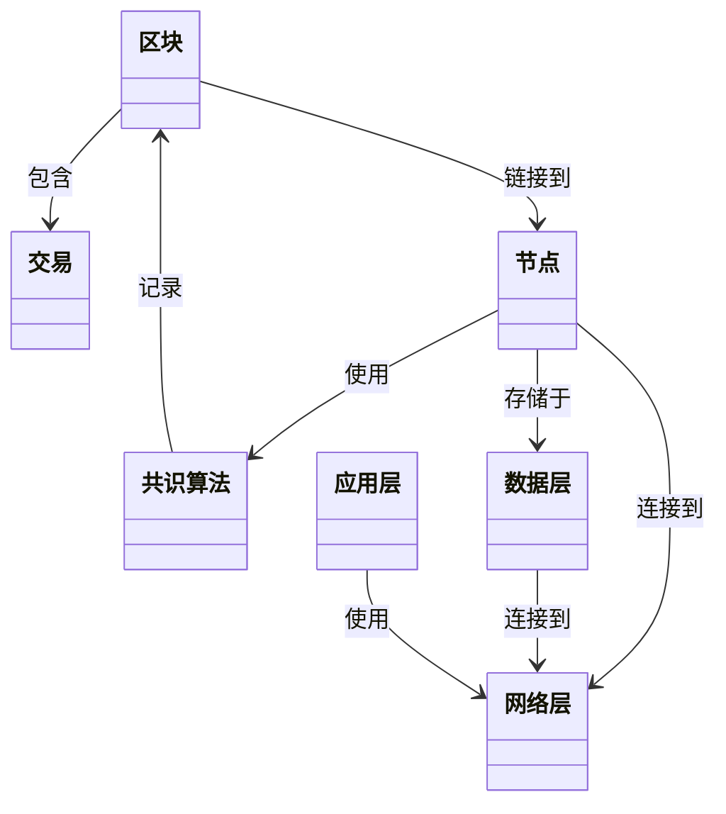
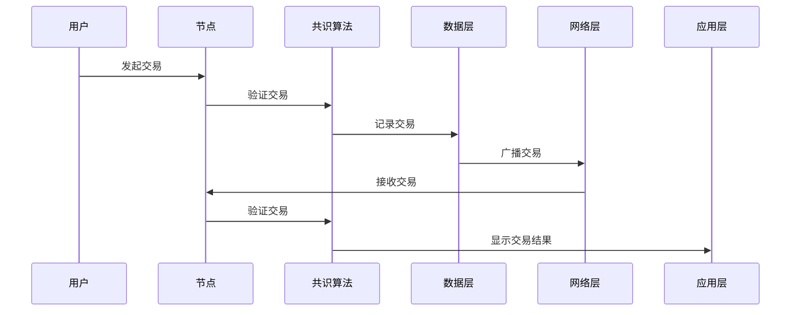
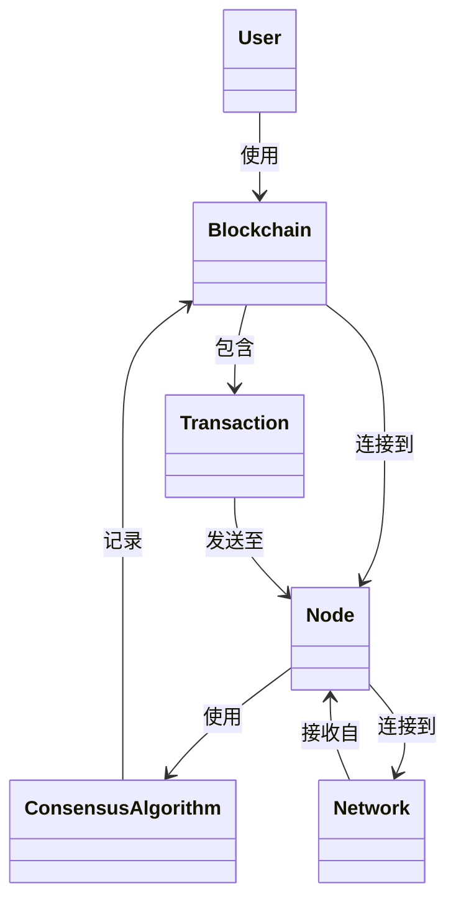
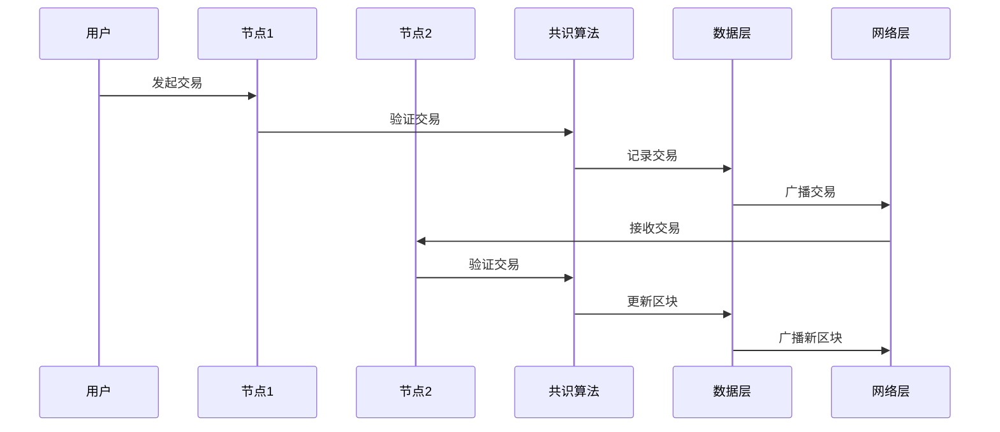

                 

# 意义的区块链：去中心化的价值共识机制

## 关键词

- 区块链
- 去中心化
- 共识机制
- 智能合约
- 价值传递
- 安全性

### 摘要

本文将深入探讨区块链这一革命性的技术，解释其起源、核心特点和应用领域。随后，我们将分析区块链的技术原理，包括数据结构、加密算法和交易机制。接着，我们将探讨区块链的网络架构、共识算法和智能合约，特别是去中心化应用的开发与部署。文章的重点在于解释区块链的价值共识机制，对比传统共识机制，分析工作量证明（PoW）和权益证明（PoS）机制。最后，我们将探讨区块链面临的挑战和未来发展趋势，并通过案例分析来进一步说明区块链的实际应用。

## 第一部分：区块链基础与意义

### 第1章：区块链的起源与背景

#### 1.1 区块链的起源与发展

区块链作为一种技术概念，最早由中本聪（Satoshi Nakamoto）在2008年提出，并作为比特币（Bitcoin）的底层技术首次亮相。比特币的问世标志着数字货币时代的开始，也标志着区块链技术的诞生。

区块链技术的核心在于其去中心化的特点。在传统的金融系统中，交易记录依赖于中央机构进行验证和确认。然而，中本聪认为这种方式存在风险，比如中央机构的信任问题、单点故障等问题。因此，他提出了一个去中心化的解决方案，即通过分布式账本技术来记录和验证交易，从而避免了中央机构的介入。

自比特币问世以来，区块链技术迅速发展，并逐渐应用于各个领域。例如，以太坊（Ethereum）的问世，使得智能合约成为可能，进一步拓展了区块链的应用范围。

#### 1.2 区块链的核心特点

区块链技术具有以下几个核心特点：

1. **去中心化**：区块链网络中的所有节点都具有相同的权限，无需依赖中央机构进行验证和确认。
2. **透明性**：区块链上的所有交易记录都是公开透明的，任何节点都可以查看和验证。
3. **安全性**：区块链使用加密算法来保护数据的安全性和完整性。
4. **不可篡改**：一旦数据被记录在区块链上，就很难被篡改或删除。

这些特点使得区块链技术在许多领域具有广泛的应用潜力。

#### 1.3 区块链技术的应用领域

区块链技术的应用领域非常广泛，以下是一些主要的应用场景：

1. **金融领域**：区块链技术可以用于数字货币的交易，如比特币、以太坊等，也可以用于智能合约的执行，提高金融交易的效率和安全。
2. **供应链管理**：区块链技术可以用于记录商品的供应链信息，确保商品的真实性和来源可追溯。
3. **身份认证**：区块链技术可以用于身份认证，提高身份认证的效率和安全性。
4. **数据存储**：区块链技术可以用于数据存储，提高数据的安全性和可靠性。

#### 1.4 区块链在价值传递中的意义

区块链技术最核心的意义在于其价值传递机制。在传统的金融体系中，价值传递通常依赖于中介机构，如银行、支付公司等。然而，这些中介机构往往存在费用高、效率低等问题。

区块链技术的去中心化特点，使得价值传递变得更加高效和低成本。通过区块链，用户可以直接进行点对点的交易，无需依赖中介机构。这大大降低了交易的成本，提高了交易的效率。

此外，区块链技术的安全性特点，也使得价值传递更加可靠。通过加密算法和共识机制，区块链上的交易记录难以被篡改或删除，从而确保了交易的安全性和可靠性。

### 第二部分：区块链的技术原理

#### 第2章：区块链的基本概念

区块链是一种分布式数据结构，它由一系列按时间顺序排列的“区块”组成。每个区块都包含一定数量的交易记录，并对前一个区块的哈希值进行链接，形成一种链式数据结构。

区块链的数据结构可以分为以下几个部分：

1. **区块**：区块是区块链的基本单位，包含一定数量的交易记录。每个区块都有一个独特的标识符，即哈希值。
2. **链**：链是由一系列按时间顺序排列的区块组成的。每个区块都通过哈希值与前一个区块链接起来，形成一个链式数据结构。
3. **节点**：节点是区块链网络中的参与者，它们负责验证和确认交易，并将交易记录到区块链上。

区块链的加密算法主要有以下几种：

1. **哈希算法**：哈希算法是将输入数据转化为固定长度的字符串的算法。在区块链中，哈希算法用于生成每个区块的哈希值，确保数据的一致性和完整性。
2. **加密算法**：加密算法用于保护区块链上的数据隐私，防止未授权的访问和篡改。

区块链的交易机制主要包括以下几个步骤：

1. **交易生成**：用户发起交易，交易包括发送方的地址、接收方的地址以及交易金额等信息。
2. **交易验证**：节点验证交易的合法性，包括检查交易金额是否足够、交易是否重复等。
3. **交易记录**：验证通过的交易将被记录到区块中，并链接到区块链上。

区块链的网络架构主要包括以下几种类型：

1. **公有链**：公有链是一种完全去中心化的区块链，所有节点都可以自由加入和退出网络。公有链上的所有交易记录都是公开透明的。
2. **私有链**：私有链是一种部分去中心化的区块链，只有被授权的节点可以加入网络。私有链上的交易记录通常不公开透明。
3. **联盟链**：联盟链是一种部分去中心化的区块链，由一组节点组成，这些节点通常是同一组织或同一行业的企业。联盟链上的交易记录通常具有较高的隐私性。

区块链的共识算法是区块链网络中节点就区块链状态达成一致的方式。常见的共识算法有以下几种：

1. **工作量证明（PoW）**：PoW是一种通过计算复杂度来确保区块链安全性的共识算法。在PoW算法中，节点需要解决一个计算难题，以获得记账权。
2. **权益证明（PoS）**：PoS是一种通过持有币量来确保区块链安全性的共识算法。在PoS算法中，节点持有币量越多，获得记账权的概率越大。
3. **授权权益证明（DPoS）**：DPoS是一种通过选举机制来确保区块链安全性的共识算法。在DPoS算法中，节点通过投票选举出记账节点。

#### 2.4 区块链的安全性问题

区块链的安全性问题主要包括以下几个方面：

1. **双花攻击**：双花攻击是指攻击者在短时间内对同一笔资产进行多次交易，从而窃取资产。通过使用非连续区块和序列号，区块链可以防止双花攻击。
2. **51%攻击**：51%攻击是指攻击者控制了区块链网络中超过51%的算力，从而可以篡改区块链数据。通过提高区块链网络的算力和节点数量，可以降低51%攻击的风险。
3. **智能合约漏洞**：智能合约是区块链上的一种自动执行合约，但它也存在漏洞。通过严格的安全审查和代码审计，可以减少智能合约漏洞的风险。

### 第3章：智能合约与去中心化应用

智能合约是区块链技术的重要应用之一，它是一种自动执行合约的代码。智能合约可以在满足特定条件时自动执行，从而提高交易的效率和安全性。

智能合约的基本原理是通过编程语言编写代码，定义交易规则和条件。当这些规则和条件被满足时，智能合约会自动执行相应的操作，如转移资产、触发其他合约等。

智能合约的开发和部署通常涉及以下步骤：

1. **编写智能合约**：开发者使用特定的编程语言（如Solidity）编写智能合约代码。
2. **编译智能合约**：将编写的智能合约代码编译为可执行的字节码。
3. **部署智能合约**：将编译后的智能合约字节码部署到区块链上，创建智能合约实例。
4. **调用智能合约**：用户通过区块链网络调用智能合约，触发相应的操作。

去中心化应用（DApp）是区块链上的应用程序，它完全由智能合约控制，无需依赖中央服务器。DApp的开发和部署涉及以下步骤：

1. **需求分析**：确定DApp的需求和功能。
2. **设计DApp架构**：设计DApp的架构，包括前端、后端和智能合约。
3. **编写智能合约**：根据DApp的需求，编写智能合约代码。
4. **前端开发**：开发DApp的前端界面，实现用户交互。
5. **集成智能合约**：将智能合约与前端界面集成，实现DApp的功能。
6. **部署DApp**：将DApp部署到区块链上，供用户使用。

去中心化金融（DeFi）是区块链技术的一个重要应用领域，它通过智能合约实现金融功能，如贷款、交易、投资等。DeFi的核心在于去中心化，用户可以直接在区块链上进行金融交易，无需依赖传统金融机构。

DeFi的发展受到了广泛关注，因为它提供了更加开放、透明和高效的金融服务。然而，DeFi也存在一些风险，如智能合约漏洞、交易风险等。通过严格的代码审查和安全测试，可以降低这些风险。

### 第三部分：区块链的价值共识机制

#### 第5章：区块链的共识机制概述

区块链的共识机制是区块链网络中节点就区块链状态达成一致的方式。共识机制是区块链技术的核心组成部分，它决定了区块链的安全性、可靠性和性能。

共识机制的定义是：在分布式系统中，节点如何就系统的状态达成一致。在区块链中，共识机制决定了如何验证和确认交易，如何创建新区块，以及如何处理冲突等。

共识机制的作用主要有以下几点：

1. **确保区块链的安全性**：共识机制通过节点间的竞争和合作，确保区块链的安全性。在PoW机制中，节点需要通过计算复杂度来获得记账权，从而确保区块链的安全。在PoS机制中，节点通过持有币量来获得记账权，从而确保区块链的安全。
2. **保证区块链的可靠性**：共识机制通过节点间的合作，确保区块链上的交易记录是完整和可靠的。当多个节点同时记录相同的交易时，区块链上的交易记录是可靠的。
3. **提高区块链的性能**：不同的共识机制具有不同的性能特点。例如，PoW机制虽然安全性高，但性能较低。PoS机制虽然性能较高，但安全性较低。

传统共识机制与区块链共识机制的比较：

1. **传统共识机制**：传统共识机制通常依赖于中央机构或权威机构来确保系统的一致性。例如，银行系统中的中央银行，负责验证和确认交易。这种机制存在单点故障、信任问题等风险。
2. **区块链共识机制**：区块链共识机制是一种去中心化的共识机制，它通过分布式网络中的节点来确保系统的一致性。这种机制具有去中心化、安全性高、可靠性高等优点。

区块链共识机制的核心要素：

1. **节点**：节点是区块链网络中的参与者，它们负责验证和确认交易，创建和链接区块。节点是共识机制的核心要素，它们的协作和竞争确保了区块链的安全性和可靠性。
2. **共识算法**：共识算法是节点就区块链状态达成一致的方式。不同的共识算法具有不同的机制和特点，如PoW、PoS、DPoS等。
3. **激励机制**：激励机制是节点参与共识机制的动力。例如，在PoW机制中，节点通过解决计算难题获得奖励；在PoS机制中，节点通过持有币量获得奖励。

### 第6章：工作量证明（PoW）机制

#### 6.1 PoW机制的基本原理

工作量证明（Proof of Work，PoW）机制是区块链技术中最常用的共识机制之一。PoW机制的基本原理是通过计算复杂度来确保区块链的安全性。

在PoW机制中，节点需要解决一个计算难题，以获得记账权。这个计算难题通常是一个数学难题，如比特币中的SHA-256哈希函数。节点需要不断尝试，直到找到一个满足条件的解，这个解称为“nonce”。

当一个节点找到一个nonce时，它会将这个解广播到整个网络。其他节点会验证这个解是否正确，如果验证通过，这个节点就可以获得记账权，将新的交易记录到区块链上。

#### 6.2 PoW机制的优势与挑战

PoW机制具有以下优势：

1. **安全性高**：PoW机制通过计算复杂度确保区块链的安全性，攻击者需要拥有超过全网算力的50%以上才能篡改区块链数据。
2. **去中心化**：PoW机制是一种完全去中心化的共识机制，所有节点都有平等的参与权，没有中央机构的控制。

然而，PoW机制也存在一些挑战：

1. **能源消耗大**：PoW机制需要大量的计算资源，导致巨大的能源消耗。这对于环境友好和可持续发展的区块链应用来说是一个重大挑战。
2. **性能较低**：PoW机制的计算复杂度较高，导致区块链的交易性能较低。这对于需要高频率交易的区块链应用来说是一个挑战。

#### 6.3 PoW机制的改进方案

为了解决PoW机制的挑战，研究者提出了许多改进方案。以下是一些常见的改进方案：

1. **权益证明（PoS）**：PoS机制是一种替代PoW机制的共识机制，它通过持有币量来获得记账权。PoS机制相比PoW机制具有更高的性能和更低的能源消耗。
2. **委托权益证明（DPoS）**：DPoS机制是一种改进的PoS机制，它通过选举机制来选择记账节点。DPoS机制相比PoS机制具有更高的性能和更好的可扩展性。
3. **混合共识机制**：混合共识机制是将PoW机制和PoS机制结合起来的共识机制。例如，比特币在2020年引入了“权益证明权益验证”（Proof of Elapsed Time，PoET）机制，用于提高性能和降低能源消耗。

### 第7章：权益证明（PoS）机制

#### 7.1 PoS机制的基本原理

权益证明（Proof of Stake，PoS）机制是一种替代PoW机制的共识机制，它通过持有币量来获得记账权。在PoS机制中，每个节点都有一定的“权益”，这个权益通常与节点持有的币量成正比。

记账权是通过随机选举来获得的。节点在随机选举中获胜的概率与它的权益成正比。当一个区块被创建时，系统会随机选择一个具有记账权的节点，这个节点将负责将新的交易记录到区块链上。

#### 7.2 PoS机制的优势与挑战

PoS机制具有以下优势：

1. **性能较高**：PoS机制相比PoW机制具有更高的性能，因为它不需要进行复杂的计算。
2. **能源消耗低**：PoS机制相比PoW机制具有更低的能源消耗，因为它不需要大量的计算资源。

然而，PoS机制也存在一些挑战：

1. **集中化风险**：PoS机制可能导致集中化风险，因为持有大量币量的节点可以获取更多的记账权。
2. **通货膨胀问题**：PoS机制可能导致通货膨胀问题，因为持有币量的节点可以通过产生新区块来增加币量。

#### 7.3 PoS机制的实现方式

PoS机制的实现方式有多种，以下是一些常见的实现方式：

1. **随机证明**：随机证明是一种基于随机数来选择记账节点的机制。节点在随机数上竞争，获胜的节点获得记账权。
2. **委员会证明**：委员会证明是一种基于选举委员会的机制。节点通过选举产生一个委员会，委员会成员负责记账。
3. **委托证明**：委托证明是一种基于委托关系的机制。节点可以将其权益委托给其他节点，委托节点负责记账。

### 第四部分：区块链的挑战与未来

#### 第8章：区块链的挑战与问题

尽管区块链技术具有巨大的潜力和广泛应用，但它也面临一些挑战和问题。

1. **可扩展性**：区块链技术目前面临的一个主要挑战是可扩展性。随着区块链上的交易量增加，区块链的性能会受到影响。为了解决可扩展性问题，研究者提出了各种解决方案，如分层架构、状态通道等。
2. **数据隐私**：区块链上的交易记录是公开透明的，这在某些情况下可能会泄露用户的隐私。为了保护用户隐私，研究者提出了各种隐私保护技术，如零知识证明、同态加密等。
3. **法律与监管**：区块链技术的应用需要遵循相关的法律和监管要求。然而，目前许多国家的法律和监管体系尚未完全适应区块链技术，这可能导致法律风险和监管难题。
4. **安全性**：尽管区块链技术具有高度的安全性，但仍然存在一些安全漏洞和风险。例如，智能合约漏洞、51%攻击等。为了提高区块链的安全性，研究者提出了各种安全措施，如安全审计、共识算法改进等。

#### 第9章：区块链的未来发展趋势

区块链技术在未来将继续发展，并在多个领域发挥重要作用。

1. **区块链与物联网的结合**：区块链技术可以与物联网（IoT）技术相结合，实现设备之间的安全通信和数据共享。这将有助于提高物联网系统的可靠性和安全性。
2. **区块链在金融领域的应用拓展**：区块链技术在金融领域的应用将继续拓展，包括数字货币、跨境支付、供应链金融等。这将提高金融系统的效率、透明性和安全性。
3. **区块链技术的全球合作与标准化**：随着区块链技术的不断发展，全球范围内的合作和标准化将成为重要趋势。这将有助于推动区块链技术的广泛应用和可持续发展。

### 第五部分：案例分析

#### 第10章：著名区块链项目的案例分析

本章节将分析几个著名的区块链项目，包括比特币、以太坊、波卡和莱特币。

1. **比特币（Bitcoin）**：比特币是第一个区块链项目，也是最为知名的区块链项目。比特币通过PoW机制实现去中心化的数字货币，它的价值已经得到了全球认可。
2. **以太坊（Ethereum）**：以太坊是第二个区块链项目，它引入了智能合约的概念，使得区块链不再局限于数字货币交易。以太坊上的DApp生态系统非常活跃，以太坊本身也成为了一个重要的区块链基础设施。
3. **波卡（Polkadot）**：波卡是一个多链区块链项目，它旨在实现不同区块链之间的互操作性和协同工作。波卡通过创新性的共识机制和跨链技术，为区块链生态系统带来了新的可能性。
4. **莱特币（Litecoin）**：莱特币是比特币的替代品，它通过改进比特币的技术特性，如更快交易速度和更高网络安全性，为用户提供了一种更高效、更安全的数字货币。

通过分析这些著名区块链项目，我们可以更好地理解区块链技术的应用和发展趋势。

### 总结

区块链技术是一种革命性的技术，它通过去中心化的方式实现了价值传递和数据存储。区块链技术的核心特点是去中心化、透明性、安全性和不可篡改性，这使得它在金融、供应链管理、数据存储等领域具有广泛的应用潜力。尽管区块链技术面临一些挑战，如可扩展性、数据隐私、法律与监管等，但未来它将继续发展，并在多个领域发挥重要作用。通过对著名区块链项目的分析，我们可以更好地理解区块链技术的实际应用和发展趋势。

## 作者信息

- 作者：AI天才研究院/AI Genius Institute & 禅与计算机程序设计艺术 /Zen And The Art of Computer Programming

### 补充内容

#### 1. 背景介绍

区块链技术作为一种分布式账本技术，起源于2008年中本聪提出的比特币（Bitcoin）白皮书。比特币是一种去中心化的数字货币，它的出现解决了传统金融系统中存在的单点故障、信任问题等问题。随着比特币的成功，区块链技术逐渐引起了广泛关注，并在金融、供应链管理、数据存储等多个领域得到了应用。

区块链技术的核心在于其去中心化的特点。在传统的金融系统中，交易记录依赖于中央机构进行验证和确认。然而，这种方式存在风险，如中央机构的信任问题、单点故障等问题。区块链技术通过分布式账本的方式，实现了交易记录的分布式存储和验证，从而避免了中央机构的介入。

区块链技术的应用领域非常广泛。在金融领域，区块链技术可以用于数字货币的交易、智能合约的执行等；在供应链管理领域，区块链技术可以用于记录商品的供应链信息，确保商品的真实性和来源可追溯；在数据存储领域，区块链技术可以用于数据存储和验证，提高数据的安全性和可靠性。

#### 2. 核心概念与联系

区块链技术的核心概念包括区块链、区块、交易、加密算法、共识算法等。以下是一个简化的ER实体关系图架构，用于描述这些核心概念之间的关系：

```mermaid
erDiagram
  区块 ||--|{ 交易 }|| >
  交易 ||--|| 区块
  区块 ||--|{ 加密算法 }|| >
  加密算法 ||--|| 区块
  区块 ||--|{ 共识算法 }|| >
  共识算法 ||--|| 区块
```

在区块链中，区块是基本的数据结构，它包含一定数量的交易记录。交易是区块链上的基本操作，它记录了资金的转移或其他操作。加密算法用于保护区块链上的数据安全。共识算法是区块链网络中节点就区块链状态达成一致的方式。

#### 3. 算法原理讲解

区块链技术中的核心算法包括加密算法、共识算法等。以下以PoW（工作量证明）机制为例，讲解其算法原理。

#### PoW算法原理

PoW机制是通过计算复杂度来确保区块链的安全性。在PoW机制中，节点需要解决一个数学难题，以获得记账权。这个数学难题通常是一个哈希函数，如SHA-256。

具体步骤如下：

1. **交易验证**：节点首先验证交易的有效性，包括检查交易金额是否足够、交易是否重复等。
2. **生成随机数**：节点生成一个随机数，这个随机数用于尝试解决数学难题。
3. **计算哈希值**：节点将随机数和当前区块的所有交易记录进行哈希运算，生成一个哈希值。
4. **验证哈希值**：节点将生成的哈希值与预设的目标值进行比较。如果哈希值小于目标值，则节点成功解决了数学难题，获得记账权。
5. **广播新区块**：节点将新区块广播到整个网络，其他节点验证新区块的合法性和哈希值。

#### 4. 系统分析与架构设计方案

区块链系统可以分为多个层次，包括数据层、网络层、共识层和应用层。以下是一个简化的区块链系统架构设计方案：

#### 系统功能设计（领域模型）



#### 系统架构设计



#### 系统接口设计



#### 系统交互



#### 5. 项目实战

区块链项目实战通常涉及以下步骤：

1. **环境安装**：安装区块链开发环境，如Node.js、Go等。
2. **系统核心实现**：根据设计文档实现区块链系统的核心功能，如区块创建、交易验证、共识算法等。
3. **代码应用解读与分析**：解读和分析区块链系统的代码，理解其原理和实现细节。
4. **实际案例分析与详细讲解剖析**：通过实际案例分析，讲解区块链技术的应用场景和实际效果。
5. **项目小结**：总结项目实施过程中遇到的问题和解决方案，提出项目改进意见。

以下是一个简单的区块链项目实现示例：

```python
# 区块链实现示例

# 导入所需库
import hashlib
import json
from time import time

class BlockChain:
    def __init__(self):
        self.unconfirmed_transactions = []  # 未确认交易
        self.chain = []  # 区块链
        self.create_genesis_block()  # 创建创世区块

    def create_genesis_block(self):
        """创建创世区块"""
        genesis_block = {
            'index': 0,
            'timestamp': time(),
            'transactions': [],
            'proof': 0,
            'previous_hash': '0'
        }
        self.add_block(genesis_block)

    def add_block(self, block):
        """添加区块到区块链"""
        block['previous_hash'] = self.hash(self.chain[-1])
        self.chain.append(block)

    def hash(self, block):
        """计算区块的哈希值"""
        block_string = json.dumps(block, sort_keys=True)
        return hashlib.sha256(block_string.encode()).hexdigest()

    def proof_of_work(self, last_block):
        """工作量证明"""
        proof = 0
        while not self.valid_proof(last_block, proof):
            proof += 1
        return proof

    def valid_proof(self, last_block, proof):
        """验证工作量证明"""
        guess = f'{last_block["proof"]} {proof} {last_block["timestamp"]} {self.difficulty} {self.hash(last_block)}'.encode()
        guess_hash = hashlib.sha256(guess).hexdigest()
        return guess_hash[:self.difficulty] == '0' * self.difficulty

    def add_transaction(self, transaction):
        """添加交易到未确认交易池"""
        self.unconfirmed_transactions.append(transaction)

    def mine(self):
        """挖矿"""
        if not self.unconfirmed_transactions:
            return False
        last_block = self.chain[-1]
        proof = self.proof_of_work(last_block)
        block = {
            'index': last_block['index'] + 1,
            'timestamp': time(),
            'transactions': self.unconfirmed_transactions,
            'proof': proof,
            'previous_hash': self.hash(last_block)
        }
        self.add_block(block)
        self.unconfirmed_transactions = []
        return block

# 创建区块链实例
blockchain = BlockChain()

# 添加交易
blockchain.add_transaction({'from': 'Alice', 'to': 'Bob', 'amount': 10})
blockchain.add_transaction({'from': 'Bob', 'to': 'Charlie', 'amount': 5})

# 挖矿
blockchain.mine()

# 挖矿
blockchain.mine()

# 打印区块链
print(blockchain.chain)
```

在这个示例中，我们使用Python实现了最简单的区块链。区块链具有以下功能：

1. **创世区块创建**：区块链创建时，会自动创建一个创世区块。
2. **区块添加**：通过`add_block`方法将区块添加到区块链中。
3. **哈希计算**：通过`hash`方法计算区块的哈希值。
4. **工作量证明（PoW）**：通过`proof_of_work`方法实现工作量证明机制。
5. **交易验证**：通过`valid_proof`方法验证工作量证明是否正确。
6. **交易添加**：通过`add_transaction`方法将交易添加到未确认交易池中。
7. **挖矿**：通过`mine`方法进行挖矿，生成新区块。

通过这个简单的示例，我们可以了解区块链的基本原理和实现方法。

#### 6. 最佳实践 Tips

1. **确保安全性**：在实现区块链系统时，要特别注意安全性。要使用加密算法来保护数据，防止未授权的访问和篡改。
2. **优化性能**：区块链系统的性能对于实际应用至关重要。要优化网络传输、共识算法等，以提高系统性能。
3. **代码可读性**：区块链系统的代码应该具有良好的可读性，以便其他开发者能够理解和维护。
4. **安全审计**：在部署区块链系统之前，要进行安全审计，以确保系统的安全性。
5. **遵循标准**：在开发区块链应用时，要遵循相关的标准和规范，以提高系统的可靠性和兼容性。

#### 7. 小结

区块链技术是一种革命性的技术，它通过去中心化的方式实现了价值传递和数据存储。区块链技术的核心特点是去中心化、透明性、安全性和不可篡改性，这使得它在金融、供应链管理、数据存储等领域具有广泛的应用潜力。尽管区块链技术面临一些挑战，如可扩展性、数据隐私、法律与监管等，但未来它将继续发展，并在多个领域发挥重要作用。

#### 8. 注意事项

1. **理解区块链技术原理**：在开发区块链应用之前，要深入了解区块链的技术原理，包括数据结构、加密算法、共识机制等。
2. **遵循最佳实践**：在实现区块链系统时，要遵循最佳实践，如确保安全性、优化性能、提高代码可读性等。
3. **关注法律法规**：在开发区块链应用时，要关注相关的法律法规，确保系统的合规性。
4. **持续学习**：区块链技术是一个快速发展的领域，开发者需要持续学习，以跟上最新的技术发展。

#### 9. 拓展阅读

- 《区块链：从数字货币到智能合约》
- 《智能合约：原理、实现与案例分析》
- 《区块链应用开发指南》
- 《区块链安全与隐私保护》

通过这些书籍和资料，您可以更深入地了解区块链技术的原理和应用，为自己的区块链项目提供更好的支持。

