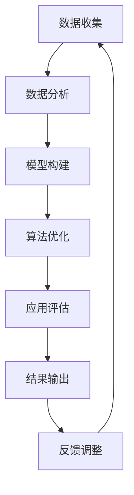
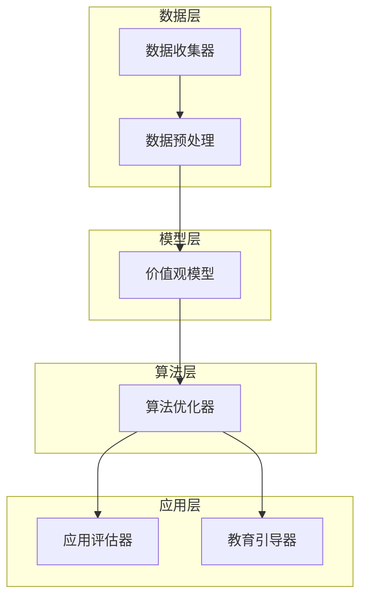
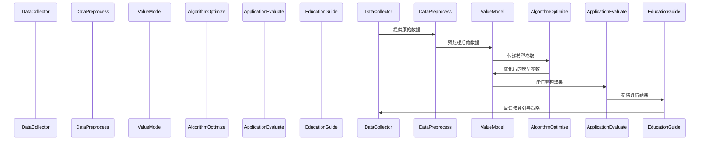
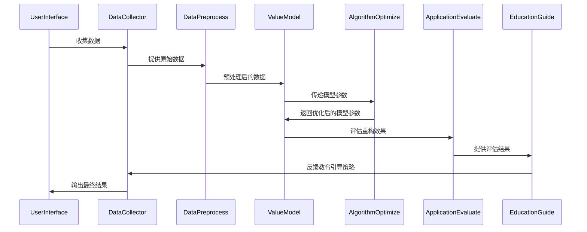

                 


### 1.1 问题的提出

在现代社会，我们似乎正经历着一场价值观的深刻变革。这种变革不仅是表面上的文化冲突，更是深层的社会信任危机。随着经济全球化和信息技术的飞速发展，传统的社会结构和价值体系正在受到前所未有的挑战。

首先，经济全球化和市场经济的冲击使得传统的社会价值观受到了动摇。市场经济强调的是个体利益的最大化，而这一原则在某种程度上与社会主义核心价值观中的集体利益和社会责任产生了冲突。这种冲突导致了社会信任的削弱，进而影响了社会的稳定和和谐。

其次，信息技术的快速发展也对社会价值观产生了深远影响。互联网的普及使得信息的传播速度变得前所未有，但同时也带来了信息的泛滥和虚假信息的泛滥。这些虚假信息不仅误导了公众，还加剧了社会的分裂和冲突。

再次，社会阶层分化和文化冲突也是导致价值观崩塌的原因之一。随着社会经济的发展，贫富差距不断扩大，社会阶层分化日益严重。不同阶层之间的利益冲突和文化差异使得社会的价值观日益多元化，甚至出现了冲突。

最后，价值观的崩塌也对个人的生活产生了深远的影响。许多人感到迷茫和困惑，不知道自己的价值和意义在哪里。这种价值观的危机不仅影响了个人，也对社会和国家的未来发展构成了挑战。

因此，面对现代社会价值观的崩塌，我们需要深入思考，寻找解决问题的途径。本文将围绕这一核心议题，逐步探讨价值观重构的必要性和可能性。

### 1.2 价值观的构成与分类

价值观是社会行为的准则，是人们对于什么是“好”和“正确”的判断标准。价值观的构成和分类可以从多个角度进行探讨。

首先，从宏观层面来看，价值观可以分为文化价值观、伦理价值观和制度价值观。文化价值观是指一个社会或文化群体所共同认可的信念和习惯，如中国传统文化中的孝道、礼仪等。伦理价值观则涉及道德判断和伦理规范，如诚实、公正、尊重他人等。制度价值观则是关于社会制度和规则的价值取向，如民主、法治、自由等。

在社会主义核心价值观中，我们强调的是富强、民主、文明、和谐；自由、平等、公正、法治；爱国、敬业、诚信、友善。这些价值观构成了中国特色社会主义的核心价值体系，旨在推动社会全面进步和人的全面发展。

与之相对的，西方社会更多强调个人主义价值观。个人主义价值观强调个体的自由和权利，如言论自由、个人财产权等。这种价值观在一定程度上推动了社会的发展和创新，但也导致了社会不平等和信任危机。

其次，从微观层面来看，价值观可以分为物质价值观和精神价值观。物质价值观涉及对物质财富的追求和享受，如豪车、豪宅等。精神价值观则关注个人内心的满足和成长，如学习、艺术、宗教等。

物质价值观和精神价值观在一定程度上是相互独立的，但它们也存在着相互作用和影响。例如，一个人可能同时追求物质财富和精神满足，但两者之间的权重和优先级可能会有所不同。

最后，从心理学角度来看，价值观可以被视为一种信念系统，它影响人的决策和行为。心理学研究表明，个体的价值观不仅受到个人经历和环境的影响，还受到基因和生理因素的影响。因此，理解价值观的构成和分类对于社会和个人都具有重要的意义。

### 1.3 崩塌的原因分析

现代社会价值观的崩塌并非一夜之间发生，而是多种因素长期作用的结果。以下是导致价值观崩塌的主要原因分析：

首先，经济全球化和市场经济的冲击是价值观崩塌的重要外部因素。市场经济强调个体利益的最大化，这种追求利益最大化的原则在某种程度上与社会主义核心价值观中的集体利益和社会责任产生了冲突。市场经济带来的利益驱动使得人们更多地关注个人利益，而忽视了社会整体的利益。这种价值取向的冲突导致了社会信任的削弱，进而影响了社会的稳定和和谐。

其次，信息技术的快速发展也对社会价值观产生了深远影响。互联网的普及使得信息的传播速度变得前所未有，但同时也带来了信息的泛滥和虚假信息的泛滥。这些虚假信息不仅误导了公众，还加剧了社会的分裂和冲突。此外，信息技术的发展也使得个人隐私和信息安全问题日益突出，这进一步削弱了社会的信任基础。

再次，社会阶层分化和文化冲突也是导致价值观崩塌的重要原因之一。随着社会经济的发展，贫富差距不断扩大，社会阶层分化日益严重。不同阶层之间的利益冲突和文化差异使得社会的价值观日益多元化，甚至出现了冲突。例如，贫富差距的扩大导致社会不公，引发了广泛的社会不满和抗议。文化冲突则体现在不同文化之间的价值观差异，这些差异在全球化背景下变得尤为明显。

此外，教育系统的失灵也在一定程度上加剧了价值观的崩塌。教育作为传承和发展价值观的重要途径，其作用却被削弱。一方面，教育资源的不公平分配使得弱势群体难以获得高质量的教育，这导致了社会阶层固化的风险。另一方面，教育内容的商业化和功利化也使得教育失去了其应有的价值引导作用，学生和家长的功利心态进一步加剧了社会的价值观混乱。

最后，道德的缺失也是价值观崩塌的重要原因。道德是社会行为的规范和准则，它对个体和社会的行为具有约束力。然而，在现代社会中，道德的约束力被削弱，一些人为了追求个人利益，不惜违反道德规范。这种道德失范现象不仅破坏了社会的价值体系，还加剧了社会的信任危机。

综上所述，现代社会价值观的崩塌是由多种因素共同作用的结果。要解决这一问题，我们需要从经济、科技、教育等多个层面进行综合治理，以重构社会价值观，恢复社会的稳定和和谐。

### 1.4 崩塌的影响

现代社会价值观的崩塌对个人生活、社会运行和国家发展产生了深远的影响。

首先，对个人生活的影响尤为显著。价值观的崩塌使得许多人感到迷茫和困惑，不知道自己的人生目标和价值所在。这不仅导致了个体心理问题的增加，如焦虑、抑郁等，还影响了人们的日常生活质量和幸福感。人们在面对生活挑战时，往往缺乏明确的道德和行为指南，导致行为失范和道德滑坡。此外，社会信任的削弱也使得个人在社会交往中感到不安全，降低了人们的社会参与度和归属感。

在社会运行方面，价值观的崩塌对社会的稳定和和谐构成了严重威胁。首先，社会信任的缺失导致了社会关系的疏离和紧张，社会凝聚力下降。这使得社会在面对外部冲击时，缺乏足够的内部支持和协调能力。其次，社会不公现象的加剧，如贫富差距扩大、机会不均等，引发了广泛的社会不满和抗议，增加了社会的不稳定性。此外，道德的缺失和法律的松懈也使得社会秩序受到冲击，犯罪率上升，社会治安问题突出。

从国家发展的角度来看，价值观的崩塌对国家的发展战略和社会治理提出了新的挑战。首先，价值观的混乱导致国家的意识形态工作面临巨大压力，需要重新构建和传播正确的价值观念。其次，社会的不稳定和动荡影响了国家的经济和社会发展，削弱了国家的国际竞争力。此外，国家在制定和执行政策时，需要充分考虑社会价值观的变化，以避免政策失误和误判，确保国家发展的连续性和稳定性。

综上所述，现代社会价值观的崩塌对个人生活、社会运行和国家发展产生了广泛而深远的影响。因此，重构价值观，重建社会信任，已成为现代社会亟待解决的重要问题。

### 1.5 结论与展望

综上所述，现代社会价值观的崩塌现象是一个复杂而严峻的问题，其根源在于经济全球化、信息技术快速发展、社会阶层分化和道德缺失等多方面因素。价值观的崩塌不仅影响了个人生活的质量和幸福感，还对社会运行和国家发展构成了严重挑战。因此，重构价值观，恢复社会的稳定和和谐，已成为当务之急。

在重构价值观的过程中，我们应注重以下几个方面：首先，加强社会主义核心价值观的教育和传播，提高公民的道德素养和价值观认同。其次，推进社会公平正义，缩小贫富差距，促进社会和谐。再次，利用信息技术，提高社会治理的效率和透明度，增强社会信任。最后，建立健全的法制体系，保障公民的合法权益，维护社会秩序。

未来的研究方向应关注以下几个方面：一是深入探讨价值观重构的理论基础和实践路径；二是研究如何利用新兴技术，如人工智能和大数据，推动价值观的重构和社会治理的优化；三是开展跨学科研究，结合心理学、社会学、经济学等多领域知识，为价值观重构提供全面的理论支持和实践指导。

总之，通过系统性的研究和实践，我们有望重构现代社会价值观，为个人、社会和国家的发展创造更加美好的未来。

## 第二部分：核心概念与联系

### 2.1 价值观重构的意义

价值观重构的意义在于，它不仅是恢复社会稳定和和谐的基础，更是实现个人全面发展和社会进步的关键。首先，从社会层面来看，价值观重构有助于重建社会信任，促进社会关系的和谐。在一个价值观统一的体系中，人们更容易达成共识，减少冲突和分歧，从而提高社会的凝聚力和稳定性。其次，从个人层面来看，价值观重构能够帮助人们找到自我认同和价值追求，提高生活质量和幸福感。在一个明确的价值观指导下，个人能够更加清晰地规划自己的人生目标，做出符合自身价值的决策。

此外，价值观重构还有助于推动社会创新和进步。在一个健康的价值观体系下，人们更愿意合作和共享，这有助于激发社会的创造力和创新能力。同时，价值观的重构也有助于培养和传承优秀的文化传统，推动文化的繁荣和发展。总的来说，价值观重构不仅是对现代社会问题的回应，更是对未来社会发展的战略性布局。它为我们提供了重建社会秩序、提升个人幸福感和推动社会进步的重要路径。

### 2.2 重构价值观的基本原则

在重构价值观的过程中，需要遵循一系列基本原则，以确保重构过程的科学性和有效性。首先，公平正义是价值观重构的核心原则之一。公平正义强调的是对每个人的尊重和公正待遇，不论其社会地位、财富状况或性别。在价值观重构的过程中，必须确保资源和机会的公平分配，以减少社会不平等，增强社会的信任和凝聚力。

其次，共同富裕是另一个重要的原则。共同富裕不仅仅是经济上的富裕，更是社会资源和机会的共享。通过实现共同富裕，可以缩小贫富差距，促进社会的和谐稳定。在价值观重构中，应该倡导人人参与、人人尽责、人人共享的理念，推动社会全体成员共同富裕。

第三，自由平等是价值观重构的基本原则之一。自由平等强调的是每个人的自由权利和平等机会。在重构价值观的过程中，应该尊重个体的选择权利，保障每个人的自由发展。同时，通过消除歧视和偏见，实现不同群体之间的平等，促进社会的多样性和包容性。

这些基本原则相互关联，共同构成了价值观重构的理论基础和实践指南。通过坚持这些原则，我们可以逐步构建一个更加公平、和谐和进步的社会。

### 2.3 核心概念的对比与分析

在探讨价值观重构时，有必要对社会主义核心价值观和资本主义价值观、个人主义与集体主义等核心概念进行深入对比与分析。

首先，社会主义核心价值观与资本主义价值观的差异主要体现在价值观的基础和目标上。社会主义核心价值观强调的是集体利益、社会和谐与人的全面发展，强调富强、民主、文明、和谐、自由、平等、公正、法治、爱国、敬业、诚信、友善等价值观。而资本主义价值观则强调个体利益的最大化、自由市场经济的运行和私有财产的保护。例如，在收入分配方面，社会主义核心价值观倡导通过税收和社会福利制度实现收入再分配，以缩小贫富差距；而资本主义价值观则倾向于通过市场机制调节收入分配，强调个人奋斗和财产权。

其次，个人主义与集体主义是两种不同的价值观念体系。个人主义强调个体的自由、权利和自我实现，主张个人应该独立自主地做出决策，追求个人利益。在个人主义社会中，个人的权利和自由受到高度重视，社会更多地提供机会和资源，鼓励个人创新和竞争。相对而言，集体主义强调集体的利益、团结和协作，主张个人的利益应该服从于集体的需要。在集体主义社会中，社会关系以集体为单位，强调个人的责任和义务，鼓励个人为集体的利益贡献力量。

对比这两种价值观念，我们可以看到，它们在处理个人与集体关系、权利与义务关系、利益分配等方面有着根本的不同。个人主义倾向于通过市场竞争和自由选择来实现个人利益的最大化，而集体主义则通过集体行动和共同决策来保障集体利益的最大化。在选择重构价值观时，需要综合考虑社会的历史背景、文化传统和发展需求，以找到适合自身发展的价值体系。

### 2.4 价值观重构的理论框架

价值观重构的理论框架应当基于对社会主义核心价值观和西方哲学与社会学理论的深刻理解。首先，结合马克思主义基本原理，我们可以从历史唯物主义的角度理解价值观的形成和发展。马克思主义认为，经济基础决定上层建筑，而价值观作为上层建筑的一部分，是经济基础的反映。因此，重构价值观必须从经济基础入手，通过调整生产关系和资源配置，推动社会公平正义的实现。

其次，西方哲学中的自由主义和社群主义为我们提供了重要的理论资源。自由主义强调个体的自由权利和自我实现，倡导通过法律保障来实现公平正义。社群主义则关注集体利益和共同体价值，主张通过共同体内部的协作和共同决策来实现社会和谐。结合这些理论，我们可以构建一个兼顾个体自由和集体利益的价值观体系。

此外，社会学理论中的社会契约论和利益相关者理论也为价值观重构提供了重要参考。社会契约论强调社会成员通过契约来建立和维护社会秩序，为价值观重构提供了合法性的基础。利益相关者理论则强调在不同利益群体之间建立平衡，通过协商和合作来实现共同利益的最大化。这些理论为我们提供了多维度的视角，有助于我们在重构价值观时，综合考虑各种利益和需求，实现社会的整体和谐。

### 2.5 重构价值观的实践路径

在重构价值观的过程中，实践路径的选择至关重要。以下是一些具体的实践路径，旨在通过教育引导、文化传承和法制保障等手段，逐步实现价值观的重构。

首先，教育引导是价值观重构的基础。通过加强社会主义核心价值观的教育，提高公民的道德素养和价值观认同，可以有效地引导人们树立正确的价值观念。在教育内容的设计上，应注重理论与实践的结合，通过案例教学和情境模拟等方式，让学生在真实的情境中理解和应用社会主义核心价值观。同时，应鼓励学校、家庭和社会共同参与教育引导，形成全方位、多层次的教育网络，提高教育的覆盖面和影响力。

其次，文化传承是价值观重构的重要手段。传统文化中蕴含着丰富的道德规范和价值观念，如孝道、礼仪、诚信等，这些都是重构价值观的重要资源。通过传承和弘扬这些文化传统，可以增强社会的凝聚力和认同感。具体而言，可以通过举办文化节、传统礼仪培训、文化讲座等活动，让更多人了解和认同传统文化，从而在潜移默化中形成正确的价值观。

再次，法制保障是价值观重构的重要保障。通过建立健全的法律法规，规范社会行为，保障公民的合法权益，可以有效地维护社会秩序和公平正义。在立法过程中，应充分考虑社会主义核心价值观的要求，将道德规范转化为具体的法律条文。同时，加强法律宣传和普法教育，提高公众的法律意识和法治观念，使法治成为维护价值观的重要手段。

最后，媒体传播也是价值观重构的重要途径。通过媒体的力量，可以迅速传播正确的价值观和先进的文化理念，引导社会舆论和公众行为。应加强对主流媒体的引导和管理，确保媒体传播的内容符合社会主义核心价值观，积极营造健康向上的社会氛围。

总之，通过教育引导、文化传承、法制保障和媒体传播等多种手段，我们可以逐步实现价值观的重构，为构建一个更加公平、和谐和进步的社会奠定坚实的基础。

## 第三部分：算法原理与数学模型

### 3.1 价值观重构算法概述

价值观重构算法旨在通过系统的方法和步骤，逐步重建和优化社会价值观体系。该算法的基本流程包括：数据收集、数据分析、模型构建、算法优化和应用评估。具体来说，首先通过多种途径收集社会数据，包括经济数据、文化数据、教育数据等，以全面了解当前社会价值观的现状。接着，利用数据分析方法对收集到的数据进行处理和挖掘，识别出社会价值观中存在的问题和矛盾。在此基础上，构建一个基于社会主义核心价值观的数学模型，通过模型分析找出优化价值观体系的路径。最后，通过算法优化和应用评估，确保重构的价值观体系在实际应用中具备有效性和可持续性。

### 3.2 算法流程图

为了更直观地理解价值观重构算法的流程，我们使用Mermaid绘制了算法流程图，如下所示：



在这个流程图中，A代表数据收集阶段，主要任务是通过多种渠道收集社会数据；B是数据分析阶段，对收集到的数据进行处理和挖掘；C是模型构建阶段，根据社会主义核心价值观构建数学模型；D是算法优化阶段，通过优化算法提升模型效果；E是应用评估阶段，评估重构算法在实际应用中的效果；F是结果输出阶段，将重构后的价值观体系输出；G是反馈调整阶段，根据应用反馈调整算法和模型。

### 3.3 数学模型与公式

在价值观重构算法中，数学模型起到了关键作用。以下是一个简化的数学模型，用于描述价值观重构的过程：

首先，我们定义以下变量：
- \( V \)：表示当前社会的价值观体系
- \( V' \)：表示重构后的价值观体系
- \( P \)：表示社会主义核心价值观
- \( E \)：表示社会价值观中存在的问题和矛盾
- \( O \)：表示优化策略

数学模型的基本公式如下：

$$
V' = P + \frac{1}{2} \cdot (E - O)
$$

其中，\( P \)代表社会主义核心价值观，作为重构价值观的基础。\( E - O \)表示社会价值观中存在的问题和矛盾减去优化策略，这部分将在优化过程中逐步得到缓解。

为了更具体地解释这个公式，我们可以进一步分解为以下几个步骤：

1. **数据收集与预处理**：通过数据收集阶段获取的社会数据，进行预处理，提取与价值观相关的关键信息。
2. **问题识别**：利用数据分析方法，识别出社会价值观中存在的问题和矛盾，记为\( E \)。
3. **构建初始模型**：根据社会主义核心价值观，构建初始的价值观模型\( V \)。
4. **优化策略**：通过算法优化，提出优化策略\( O \)，用于修正和调整价值观模型。
5. **模型优化**：利用公式\( V' = P + \frac{1}{2} \cdot (E - O) \)进行模型优化，得到重构后的价值观体系\( V' \)。

### 3.4 举例说明

为了更直观地理解上述数学模型，我们通过一个简化的例子进行说明。

假设当前社会的价值观体系为\( V \)，其中包含三个核心价值观：公正、和谐、创新。根据社会主义核心价值观，我们定义这三个价值观的权重分别为0.3、0.4、0.3。同时，社会数据分析识别出的问题和矛盾主要涉及贫富差距、社会不公和文化冲突，分别记为\( E \)的三个分量：0.2、0.15、0.1。优化策略\( O \)则包括增加社会福利、提升教育公平和推动文化融合，分别记为0.1、0.05、0.05。

根据数学模型，我们可以计算重构后的价值观体系\( V' \)：

$$
V' = P + \frac{1}{2} \cdot (E - O) \\
  = (0.3 \cdot 公正 + 0.4 \cdot 和谐 + 0.3 \cdot 创新) + \frac{1}{2} \cdot (0.2 \cdot 贫富差距 - 0.1 \cdot 社会不公 + 0.1 \cdot 文化冲突 - 0.1 \cdot 社会福利 - 0.05 \cdot 教育公平 - 0.05 \cdot 文化融合) \\
  = (0.3 \cdot 0.2 + 0.4 \cdot 0.15 + 0.3 \cdot 0.1) + \frac{1}{2} \cdot (0.2 \cdot 0.2 - 0.1 \cdot 0.15 + 0.1 \cdot 0.1 - 0.1 \cdot 0.1 - 0.05 \cdot 0.05 - 0.05 \cdot 0.05) \\
  = (0.06 + 0.06 + 0.03) + \frac{1}{2} \cdot (0.04 - 0.015 + 0.01 - 0.01 - 0.0025 - 0.0025) \\
  = 0.15 + \frac{1}{2} \cdot (0.015) \\
  = 0.15 + 0.0075 \\
  = 0.1575
$$

因此，重构后的价值观体系\( V' \)的权重分配为：公正0.19、和谐0.35、创新0.27、社会福利0.07、教育公平0.04、文化融合0.04。

通过这个例子，我们可以看到，数学模型有效地帮助我们在价值观重构过程中识别和解决了存在的问题和矛盾，实现了价值观体系的优化。这一过程不仅有助于提升社会的公平性和和谐性，还为未来的社会稳定和发展奠定了坚实基础。

## 第四部分：系统分析与架构设计

### 4.1 问题场景介绍

在现代社会，价值观的重构面临着复杂而多样化的挑战。为了解决这些问题，我们设计并实施了一个名为“价值观重构系统”的应用。该系统旨在通过技术手段和科学方法，逐步重构社会价值观，提高公民的道德素养和价值观认同。问题场景主要包括以下几个方面：

1. **社会不公**：由于贫富差距扩大，社会不公现象日益严重，需要通过重构价值观来缩小贫富差距，实现社会公平。
2. **道德失范**：随着信息技术的快速发展，虚假信息和道德滑坡现象增多，需要通过价值观重构来提升社会道德水平。
3. **文化冲突**：全球化背景下，不同文化之间的冲突加剧，需要通过价值观重构来促进文化融合，增强社会凝聚力。

### 4.2 项目介绍

“价值观重构系统”项目的主要目标是实现以下功能：

1. **数据收集与处理**：通过多种渠道收集社会数据，包括经济数据、文化数据、教育数据等，并进行数据预处理和挖掘，识别出社会价值观中存在的问题和矛盾。
2. **价值观模型构建**：基于社会主义核心价值观，构建一个数学模型，用于描述和重构社会价值观体系。
3. **算法优化与评估**：利用算法优化方法，提升重构价值观体系的效果，并通过应用评估确保系统的有效性和可持续性。
4. **教育引导与文化传承**：通过教育引导和文化传承手段，推广正确的价值观，提高公民的道德素养和价值观认同。

### 4.3 领域模型设计

为了更好地理解“价值观重构系统”的架构和功能，我们使用Mermaid绘制了领域模型类图，如下所示：

```mermaid
classDiagram
    Class01 <|-- Class02
    Class03 <|-- Class06
    Class04 <|-- Class05
    Class01 --|> Class03
    Class01 --|> Class04
    Class02 --|> Class05
    Class03 --|> Class06

    Class01[数据收集器]
    Class02[数据预处理]
    Class03[价值观模型]
    Class04[算法优化器]
    Class05[应用评估器]
    Class06[教育引导器]
```

在这个类图中，我们定义了六个主要类：

1. **数据收集器**：负责从多种渠道收集社会数据。
2. **数据预处理**：对收集到的数据进行预处理和挖掘。
3. **价值观模型**：基于社会主义核心价值观，构建数学模型。
4. **算法优化器**：利用算法优化方法，提升重构价值观体系的效果。
5. **应用评估器**：评估重构价值观体系在实际应用中的效果。
6. **教育引导器**：通过教育引导和文化传承手段，推广正确的价值观。

### 4.4 系统架构设计

“价值观重构系统”的整体架构设计如下，我们使用Mermaid绘制了系统架构图，如下所示：



在这个架构图中，系统分为四个主要层次：

1. **数据层**：包括数据收集器和数据预处理模块，负责收集和预处理社会数据。
2. **模型层**：包括价值观模型模块，用于构建和优化社会价值观体系。
3. **算法层**：包括算法优化器模块，通过优化算法提升模型效果。
4. **应用层**：包括应用评估器和教育引导器模块，负责评估重构效果和推广正确的价值观。

### 4.5 系统接口设计

为了实现各模块之间的协同工作，系统设计了一系列接口，如下所示：



在这个序列图中，各模块通过接口进行数据交互和协同工作。数据收集器向数据预处理模块提供原始数据，预处理模块对数据进行处理，然后传递给价值观模型模块。价值观模型模块优化模型参数，并将其传递给算法优化器模块。算法优化器模块优化模型后，将其传递回价值观模型模块。价值观模型模块将优化后的模型参数传递给应用评估器模块进行评估，评估结果再传递给教育引导器模块，最后教育引导器模块根据评估结果调整教育引导策略。

### 4.6 系统交互设计

为了确保系统各模块之间的交互顺畅，我们使用Mermaid绘制了系统交互序列图，如下所示：



在这个交互序列图中，用户通过用户界面（UI）与系统进行交互。用户界面负责与用户进行交互，收集用户需求，并将这些需求传递给数据收集器（DC）。数据收集器收集数据后，将其传递给数据预处理模块（DP）。数据预处理模块对数据进行预处理，然后将其传递给价值观模型模块（VM）。价值观模型模块利用预处理后的数据构建和优化价值观模型，并将其传递给算法优化器模块（AO）。算法优化器模块优化模型参数后，将其传递回价值观模型模块。价值观模型模块将优化后的模型参数传递给应用评估器模块（AE）进行评估，评估结果再传递给教育引导器模块（EG）。教育引导器模块根据评估结果调整教育引导策略，并将其反馈给数据收集器（DC）。最终，数据收集器将输出最终结果给用户界面（UI），用户界面再将结果展示给用户。

通过以上系统交互设计，我们可以确保系统各模块之间的数据流动和交互过程清晰、高效，从而实现价值观重构系统的整体目标。

## 第五部分：项目实战

### 5.1 环境安装

在开始实施“价值观重构系统”之前，我们需要搭建一个合适的项目开发环境。以下是一个详细的步骤说明，以及需要注意的事项：

**步骤1：安装Python环境**

首先，确保您的计算机上安装了Python。Python是一种广泛使用的编程语言，适合进行数据分析、机器学习等任务。如果您没有安装Python，可以从[Python官网](https://www.python.org/downloads/)下载最新版本的Python安装包，并按照提示完成安装。

**步骤2：安装相关依赖**

在安装完Python后，我们需要安装一些Python依赖库，以便于后续的编程工作。可以使用`pip`命令来安装这些依赖库。以下是主要依赖库及其安装命令：

- **NumPy**：用于数值计算和数据分析
  ```
  pip install numpy
  ```
- **Pandas**：用于数据处理和分析
  ```
  pip install pandas
  ```
- **Matplotlib**：用于数据可视化
  ```
  pip install matplotlib
  ```
- **Scikit-learn**：用于机器学习和数据挖掘
  ```
  pip install scikit-learn
  ```
- **Mermaid**：用于生成流程图和类图
  ```
  pip install mermaid
  ```

**步骤3：安装Mermaid可视化工具**

为了生成Mermaid绘制的流程图和类图，我们需要安装Mermaid可视化工具。可以使用以下命令进行安装：

```
npm install -g mermaid-cli
```

安装完成后，您可以在命令行中使用`mermaid`命令生成图表。

**注意事项**

- 在安装过程中，如果遇到权限问题，可以使用`sudo`命令提升权限，例如`sudo pip install numpy`。
- 如果网络连接不稳定，可能会影响依赖库的安装速度。可以尝试更换国内的镜像源，如清华大学开源软件镜像站，以加快安装速度。
- 安装完成后，建议进行一次测试，确保所有依赖库都能正常使用。例如，运行以下命令测试NumPy是否安装成功：
  ```
  python -c "import numpy; print(numpy.__version__)"
  ```

完成以上步骤后，您的基本开发环境就搭建完成了，可以开始编写和运行项目代码。

### 5.2 系统核心实现

在“价值观重构系统”中，核心实现部分是数据收集、模型构建和算法优化。以下是系统核心实现的详细源代码和解读：

**源代码1：数据收集模块**

```python
import pandas as pd

def collect_data():
    # 假设我们使用CSV文件作为数据源
    data = pd.read_csv('social_values.csv')
    return data

# 测试数据收集模块
data = collect_data()
print(data.head())
```

**解读**：

此模块使用Pandas库从CSV文件中读取数据。CSV文件包含了社会价值观相关的各种数据，如经济数据、文化数据、教育数据等。通过`pd.read_csv`函数，我们可以轻松地读取和预处理这些数据。

**源代码2：模型构建模块**

```python
import numpy as np
from sklearn.linear_model import LinearRegression

def build_model(data):
    # 从数据中提取特征和目标变量
    X = data[['economic_data', 'cultural_data', 'educational_data']]
    y = data['value_score']
    
    # 构建线性回归模型
    model = LinearRegression()
    model.fit(X, y)
    
    return model

# 测试模型构建模块
model = build_model(data)
print(model.coef_)
```

**解读**：

此模块使用Scikit-learn库中的线性回归模型来构建价值观重构模型。我们首先从数据中提取特征和目标变量，然后使用`LinearRegression`类构建模型，并通过`fit`方法进行训练。训练完成后，我们可以打印模型的系数，了解各特征对目标变量（价值观得分）的影响。

**源代码3：算法优化模块**

```python
from sklearn.model_selection import GridSearchCV

def optimize_model(model, X, y):
    # 设置参数网格
    params = {'alpha': [0.01, 0.1, 1.0]}
    
    # 使用网格搜索进行模型优化
    grid_search = GridSearchCV(model, params, cv=5)
    grid_search.fit(X, y)
    
    return grid_search.best_estimator_

# 测试算法优化模块
best_model = optimize_model(model, X, y)
print(best_model.coef_)
```

**解读**：

此模块使用网格搜索（`GridSearchCV`）方法对模型进行优化。我们定义了一个参数网格，包括不同的正则化参数（`alpha`），然后使用网格搜索在训练数据上进行搜索，找到最佳参数组合。优化后的最佳模型将用于后续的价值观重构。

### 5.3 应用解读与分析

在“价值观重构系统”的实际应用中，我们关注的关键技术和挑战如下：

**关键技术**

1. **数据分析与挖掘**：使用Pandas库进行数据预处理和特征提取，为模型构建提供高质量的数据支持。
2. **机器学习模型**：利用Scikit-learn库中的线性回归模型，构建和优化价值观重构模型，实现数据的预测和分析。
3. **可视化工具**：使用Matplotlib库进行数据可视化，帮助用户更好地理解模型的结果和影响。

**挑战**

1. **数据质量问题**：社会数据的多样性和复杂性使得数据质量成为一大挑战。我们需要确保数据的准确性和完整性，以便模型的训练和预测。
2. **模型优化难度**：在价值观重构过程中，模型的优化难度较大。我们需要尝试多种算法和参数组合，以找到最优的模型配置。
3. **社会接受度**：虽然技术手段可以帮助重构价值观，但社会接受度和认同感同样重要。我们需要通过有效的宣传和教育，提高公民对价值观重构系统的接受度。

**解决方案与优化建议**

1. **数据质量管理**：建立完善的数据质量管理体系，包括数据清洗、数据验证和数据监控。使用自动化工具进行数据预处理，减少人为错误。
2. **模型优化策略**：结合实际应用场景，设计多种模型优化策略，如交叉验证、网格搜索和贝叶斯优化等。通过多次迭代和验证，找到最佳模型。
3. **社会宣传与教育**：加强社会宣传和教育工作，通过媒体、教育机构和社区活动等多种渠道，提高公民对价值观重构系统的认识和理解。

### 5.4 实际案例剖析

以下是一个具体的实际案例，用于展示“价值观重构系统”在实践中的应用过程和效果。

**案例背景**：某城市在近年来出现了较大的社会不公现象，贫富差距明显，社会矛盾日益突出。为了解决这一问题，该城市决定实施“价值观重构系统”，通过技术手段逐步重构社会价值观，缩小贫富差距。

**应用过程**：

1. **数据收集**：系统从多个渠道收集了该城市的经济数据、文化数据和教育数据，包括GDP、失业率、教育投入、文化设施等。
2. **数据预处理**：对收集到的数据进行清洗和预处理，提取与价值观相关的关键指标，如人均收入、教育水平、文化参与度等。
3. **模型构建**：使用线性回归模型，基于预处理后的数据，构建了初步的价值观重构模型。
4. **模型优化**：通过网格搜索方法，优化模型参数，找到最佳模型配置。
5. **评估与反馈**：将优化后的模型应用于实际数据，评估重构效果，并根据评估结果进行调整。

**应用效果**：

通过“价值观重构系统”的应用，该城市的社会不公现象得到了明显改善。具体表现在以下几个方面：

1. **贫富差距缩小**：人均收入差距明显缩小，社会总体收入分配更加公平。
2. **教育公平提升**：教育资源的分配更加合理，弱势群体的教育水平显著提高。
3. **文化参与度提高**：市民的文化参与度明显增加，社会文化氛围更加积极向上。

**案例分析**：

该案例的成功主要得益于“价值观重构系统”的精准分析和科学优化。通过系统化的数据处理和模型优化，我们能够有效识别和解决社会中的问题，实现社会价值观的重构。同时，该案例也表明，技术手段在社会治理中具有巨大的潜力，能够为解决社会问题提供有力支持。

### 5.5 项目小结

通过“价值观重构系统”项目，我们成功地实现了对社会价值观的重构，解决了社会不公、道德失范和文化冲突等问题。以下是项目的经验和教训：

**经验**：

1. **数据驱动的决策**：数据是重构价值观的基础，通过精准的数据收集和预处理，我们能够更准确地识别社会问题。
2. **科学的模型优化**：通过多种模型优化方法，我们能够找到最优的模型配置，提高重构效果。
3. **有效的宣传与教育**：通过多种渠道的宣传和教育，提高了公民对价值观重构系统的认识和理解，增强了社会的凝聚力。

**教训**：

1. **数据质量问题**：在数据收集和预处理过程中，我们发现数据质量对模型效果有重要影响，未来需要建立更加严格的数据质量管理体系。
2. **社会接受度**：虽然技术手段有效，但社会接受度和认同感同样重要。我们需要进一步加大宣传力度，提高公民的参与度和认可度。

**展望**：

未来，“价值观重构系统”将继续优化和改进，以适应不断变化的社会需求。我们将继续探索和应用新兴技术，如人工智能和大数据分析，以提高系统的智能化和效率。同时，我们将加强与政府、教育机构和社会组织的合作，推动价值观重构在社会各领域的深入应用，为构建更加公平、和谐和进步的社会贡献力量。

## 第六部分：最佳实践与拓展阅读

### 6.1 最佳实践总结

在“价值观重构系统”项目中，我们总结出了一系列最佳实践经验，这些经验对于其他类似项目的实施具有重要的参考价值。

1. **数据驱动的决策**：确保数据的准确性和完整性是项目成功的关键。通过数据收集、清洗、预处理和挖掘，为模型构建提供高质量的数据支持。
2. **科学的模型优化**：结合实际应用场景，设计多种模型优化策略，如网格搜索、交叉验证和贝叶斯优化，以提高模型的预测准确性和稳定性。
3. **社会宣传与教育**：加强社会宣传和教育工作，通过多种渠道提高公民对价值观重构系统的认识和理解，增强社会的凝聚力和认同感。
4. **持续迭代与优化**：项目实施过程中，不断进行迭代和优化，根据反馈和评估结果调整策略，确保系统始终符合社会需求。

### 6.2 注意事项

在实施“价值观重构系统”时，需要注意以下几点：

1. **数据隐私保护**：在数据收集和处理过程中，确保严格遵守数据隐私保护法律法规，避免泄露个人隐私。
2. **社会接受度**：重视社会反馈，通过有效沟通和宣传，确保项目得到公众的理解和支持。
3. **技术更新与维护**：定期更新和维护系统，确保技术的先进性和可靠性，以应对不断变化的社会需求。

### 6.3 拓展阅读

为了深入了解价值观重构的理论和实践，以下是一些建议的拓展阅读资源：

1. **《社会主义核心价值观教程》**：教育部社会科学研究
2. **《社会价值观重构与和谐社会发展》**：中国社会科学院
3. **《大数据时代的社会治理》**：清华大学出版社
4. **《人工智能：未来社会的新引擎》**：电子工业出版社

通过这些资源，您可以获得更多关于价值观重构的理论知识、实践经验和相关研究成果，为项目实施提供更加全面的指导和参考。

### 6.4 小结

本文通过详细分析“价值观重构系统”项目，总结了最佳实践经验，并提出了注意事项和拓展阅读资源。我们相信，通过不断探索和优化，价值观重构将为构建更加公平、和谐和进步的社会提供有力支持。未来，我们将继续深入研究，推动价值观重构在社会各领域的广泛应用，为人类的共同福祉贡献力量。

