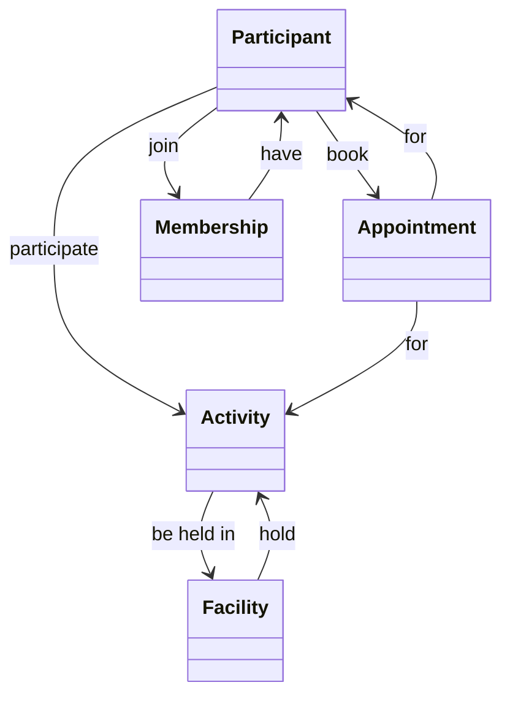
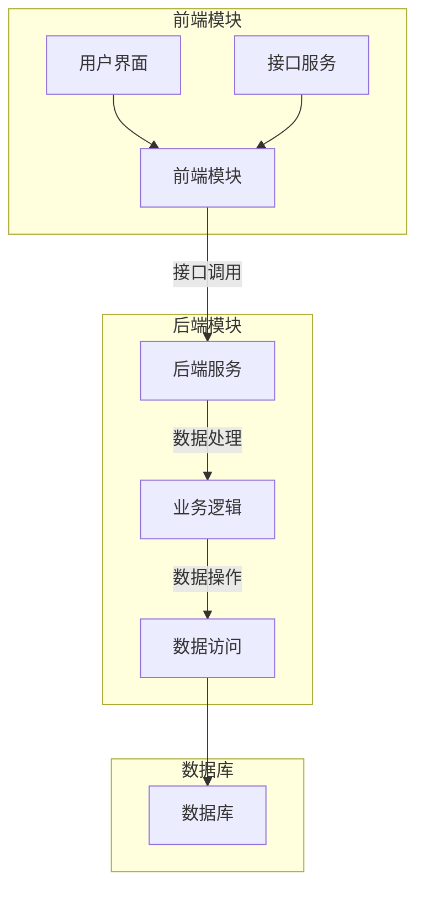
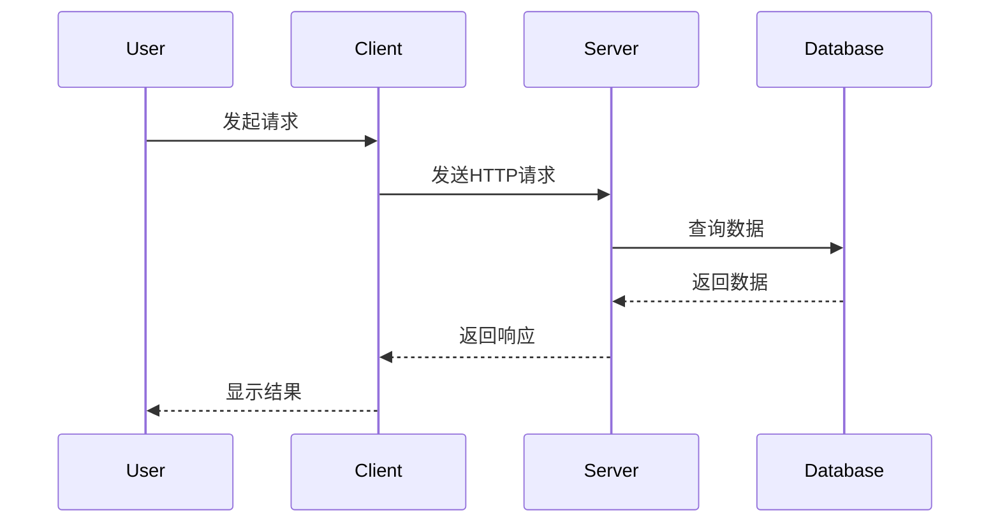

                 

## 慢生活体验中心规划：重新定义生活节奏的实践基地建设

关键词：慢生活、体验中心、生活节奏、实践基地、规划、建设

摘要：本文旨在探讨慢生活体验中心的规划与建设，通过深入分析其背景、核心概念、数学模型、系统架构以及项目实战，重新定义现代生活节奏，提供一种新型的实践基地，旨在缓解社会压力，提升生活质量，实现可持续发展的生活方式。

### 目录大纲

# 慢生活体验中心规划：重新定义生活节奏的实践基地建设

## 第一部分：背景介绍

### 第1章：慢生活理念与中心建设

#### 1.1 慢生活的起源与发展

#### 1.2 慢生活体验中心建设的意义

### 第2章：核心概念与联系

#### 2.1 慢生活体验中心的关键概念

#### 2.2 慢生活体验中心的核心要素

### 第3章：慢生活体验中心的数学模型和公式

#### 3.1 慢生活体验中心的评价模型

#### 3.2 中心运营成本的估算

### 第4章：慢生活体验中心的系统分析与架构设计

#### 4.1 中心建设的问题场景

#### 4.2 系统功能设计

#### 4.3 系统架构设计

#### 4.4 系统接口设计与交互

### 第5章：项目实战

#### 5.1 环境安装与配置

#### 5.2 系统核心实现

#### 5.3 实际案例分析

### 第6章：最佳实践与拓展阅读

#### 6.1 最佳实践经验分享

#### 6.2 拓展阅读推荐

## 第二部分：案例研究与实战指南

### 第7章：慢生活体验中心的建设实践

#### 7.1 案例一：城市慢生活体验中心建设

#### 7.2 案例二：乡村慢生活体验中心打造

#### 7.3 案例三：社区慢生活体验中心运营

### 第8章：慢生活体验中心的市场分析与规划

#### 8.1 市场需求分析

#### 8.2 商业模式设计

#### 8.3 市场推广策略

## 第三部分：总结与展望

### 第9章：慢生活体验中心建设的总结

#### 9.1 成功要素

#### 9.2 面临的挑战

### 第10章：未来发展趋势与展望

#### 10.1 慢生活体验中心的发展趋势

#### 10.2 慢生活体验中心的创新方向

### 文章标题：慢生活体验中心规划：重新定义生活节奏的实践基地建设

慢生活，作为一种追求质量而非速度的生活态度，近年来在全球范围内受到广泛关注。随着现代社会生活节奏的加快，人们对于身心健康和生活质量的追求日益强烈。在这种背景下，慢生活体验中心应运而生，成为重新定义生活节奏的实践基地。本文将从背景介绍、核心概念与联系、数学模型和公式、系统分析与架构设计、项目实战、最佳实践与拓展阅读等方面，系统地探讨慢生活体验中心的规划与建设，旨在为读者提供一种全新的生活方式和实践指南。

## 第一部分：背景介绍

### 第1章：慢生活理念与中心建设

#### 1.1 慢生活的起源与发展

慢生活（Slow Life）这一概念最早可以追溯到20世纪80年代，起源于意大利。由意大利作家卡尔洛·皮尼（Carlo Petrini）提出的“慢食运动”（Slow Food Movement）标志着慢生活的萌芽。慢食运动主张抵制工业化快餐，追求食物的原汁原味，强调生活节奏的放慢，提倡享受生活的每一个细节。

随着时间的推移，慢生活理念逐渐扩展到生活的各个方面，包括工作、教育、旅游等。慢生活不仅仅是一种生活态度，更是一种价值观的体现。它倡导人们从快节奏的生活中解脱出来，回归自然，享受平静和内心的满足。

#### 1.2 慢生活体验中心建设的意义

**社会效益**：慢生活体验中心的建设有助于缓解现代社会中普遍存在的压力。快节奏的生活使得人们长期处于高压状态，心理健康问题日益突出。慢生活体验中心提供了一个放松身心的场所，帮助人们减轻压力，提升幸福感。

**经济效益**：慢生活体验中心作为一种新兴产业，具有巨大的市场潜力。随着人们对生活质量的追求，慢生活相关的产品和服务需求不断增加。慢生活体验中心的建设和运营，不仅可以带动相关产业的发展，还可以创造大量就业机会。

**文化意义**：慢生活体验中心是传承和发扬传统文化的重要平台。通过举办各类文化活动、传统手工艺展示等活动，慢生活体验中心可以增强人们对传统文化的认同感，促进文化多样性的发展。

### 第2章：核心概念与联系

#### 2.1 慢生活体验中心的关键概念

慢生活体验中心是指为人们提供一种慢节奏生活方式的场所，旨在通过提供各种活动和体验，帮助人们从快节奏的生活中解脱出来，享受宁静和美好。以下是慢生活体验中心的关键概念：

- **慢生活体验**：指在体验中心中通过各种活动和体验，如园艺、烹饪、瑜伽、艺术创作等，让参与者感受到慢节奏生活的乐趣和意义。
- **中心功能定位**：慢生活体验中心不仅是一个休闲场所，更是一个教育、社交、文化融合的平台。其功能定位包括休闲、教育、社交、文化展示等。
- **环境设计**：慢生活体验中心的环境设计强调自然与人文的结合，创造一个宁静、舒适的空间，让参与者能够充分放松和享受生活。
- **活动规划**：慢生活体验中心的活动规划涵盖传统与现代的各种形式，旨在满足不同人群的需求，提升参与者的生活质量和幸福感。

#### 2.2 慢生活体验中心的核心要素

慢生活体验中心的核心要素包括以下几个方面：

- **环境设计**：慢生活体验中心的环境设计至关重要，它直接影响参与者的体验感受。中心的环境应注重自然景观与人造景观的结合，创造一个宁静、舒适的空间。
- **活动规划**：慢生活体验中心的活动规划是其核心价值所在。中心应提供多样化的活动，包括园艺、烹饪、瑜伽、艺术创作等，以满足不同人群的需求。
- **服务模式**：慢生活体验中心的服务模式应注重个性化与共享化的结合。中心可以提供个性化的服务，如私人教练、私人厨师等，同时也可以提供共享的服务，如公共工作室、共享花园等。
- **社区建设**：慢生活体验中心不仅是参与者个人的休闲场所，更是一个社区建设的重要平台。中心可以组织各类社区活动，如社区讲座、文化展览、社区志愿服务等，增强社区的凝聚力和归属感。

### 第3章：慢生活体验中心的数学模型和公式

#### 3.1 慢生活体验中心的评价模型

为了评估慢生活体验中心的建设效果和运营绩效，可以采用以下评价模型：

**效用函数**：效用函数用于衡量参与者在慢生活体验中心获得的心理和生理上的满足度。效用函数可以表示为：

\[ U = U(W, H, S) \]

其中，\( U \) 表示效用值，\( W \) 表示工作压力，\( H \) 表示健康水平，\( S \) 表示社交满意度。

**满意度评分**：通过问卷调查和用户反馈，可以收集参与者的满意度评分。满意度评分可以采用5点量表，从非常不满意到非常满意进行评分。

#### 3.2 中心运营成本的估算

为了确保慢生活体验中心的可持续运营，需要对中心的运营成本进行详细估算。中心运营成本主要包括以下几个方面：

- **固定成本**：包括场地租赁、装修费用、设备购置等。
- **可变成本**：包括人力成本、活动材料成本、能源消耗等。

**成本估算公式**：

\[ C = C(F, V) \]

其中，\( C \) 表示运营成本，\( F \) 表示固定成本，\( V \) 表示可变成本。

### 第4章：慢生活体验中心的系统分析与架构设计

#### 4.1 中心建设的问题场景

在慢生活体验中心的建设过程中，主要面临以下问题场景：

- **需求分析**：如何准确识别和满足参与者的需求，提供个性化的服务和体验。
- **项目管理**：如何高效地管理项目建设进度、预算和资源。
- **用户体验**：如何设计一个舒适、实用的空间，提升参与者的体验感受。
- **运营管理**：如何确保中心的可持续运营，提高运营效率和盈利能力。

#### 4.2 系统功能设计

慢生活体验中心的系统功能设计包括以下几个方面：

- **预约系统**：为参与者提供在线预约服务，方便快捷地安排活动。
- **活动管理系统**：用于管理活动信息，包括活动安排、报名情况等。
- **会员管理系统**：为会员提供个性化服务，如会员权益、积分兑换等。
- **财务管理系统**：用于管理中心的财务收支，实现资金的高效管理。

**领域模型**：领域模型用于描述慢生活体验中心的核心业务领域和实体关系。可以使用Mermaid类图来表示领域模型，如下所示：



#### 4.3 系统架构设计

慢生活体验中心的系统架构设计需要考虑前端、后端、数据库等多个方面。以下是一个简化的系统架构图，使用Mermaid架构图来表示：



#### 4.4 系统接口设计与交互

在慢生活体验中心中，系统接口设计至关重要，它决定了不同模块之间的数据交互和功能调用。以下是一个简单的RESTful API设计示例，使用Mermaid序列图来表示接口交互流程：



### 第5章：项目实战

#### 5.1 环境安装与配置

在进行慢生活体验中心的项目实战之前，首先需要搭建合适的技术环境。以下是环境安装与配置的步骤：

1. **硬件环境**：根据项目需求，选择合适的硬件配置，包括服务器、存储设备、网络设备等。
2. **软件环境**：安装操作系统、数据库管理系统、Web服务器等基础软件。
3. **开发环境**：安装编程语言、开发工具、版本控制工具等。
4. **配置管理**：使用配置管理工具，如Ansible、Puppet等，自动化配置和部署。

#### 5.2 系统核心实现

在系统核心实现阶段，需要根据系统功能设计，开发各个模块的功能。以下是一个简单的系统核心实现示例，使用Python编程语言实现：

```python
# 预约系统实现示例

class Appointment:
    def __init__(self, participant, activity, time):
        self.participant = participant
        self.activity = activity
        self.time = time

    def book(self):
        # 预约逻辑
        pass

class Activity:
    def __init__(self, name, location, time):
        self.name = name
        self.location = location
        self.time = time

    def register(self, participant):
        # 报名逻辑
        pass

class Membership:
    def __init__(self, participant, level):
        self.participant = participant
        self.level = level

    def upgrade(self, new_level):
        # 会员升级逻辑
        pass
```

#### 5.3 实际案例分析

在慢生活体验中心的项目实战中，实际案例分析至关重要。以下是一个典型的实际案例分析：

**案例背景**：某城市慢生活体验中心计划举办一次大型园艺活动，吸引参与者共同参与植物种植和养护。

**详细讲解**：

1. **需求分析**：确定活动目标、参与人数、活动时间等关键信息。
2. **活动策划**：设计活动流程、活动内容、活动奖品等。
3. **宣传推广**：通过社交媒体、广告等渠道宣传活动，吸引参与者。
4. **现场组织**：准备活动场地、设备、物料等，确保活动顺利进行。
5. **活动反馈**：收集参与者反馈，评估活动效果，为后续活动提供改进建议。

### 第6章：最佳实践与拓展阅读

#### 6.1 最佳实践经验分享

在慢生活体验中心的建设和运营过程中，有许多成功的实践案例可以分享。以下是一些最佳实践经验：

1. **注重用户体验**：在中心设计和活动规划中，始终以用户体验为核心，确保参与者在中心感受到舒适和快乐。
2. **多元化活动**：提供多样化的活动，满足不同人群的需求，增加参与者的满意度。
3. **社会化运营**：通过线上线下活动相结合，增强中心的社交属性，提升中心的知名度和影响力。
4. **可持续经营**：注重中心的可持续运营，通过合理的成本控制和收入来源，实现长期稳定的发展。

#### 6.2 拓展阅读推荐

为了更深入地了解慢生活体验中心的建设和运营，以下是一些建议的拓展阅读：

1. **书籍推荐**：《慢生活：找回生活的节奏与意义》、《慢生活体验：打造你的理想生活》等。
2. **学术文章**：关于慢生活体验中心的研究论文、案例分析等。
3. **网站资源**：相关行业网站、论坛、博客等，如“慢生活网”、“慢生活体验中心联盟”等。

## 第二部分：案例研究与实战指南

### 第7章：慢生活体验中心的建设实践

#### 7.1 案例一：城市慢生活体验中心建设

**项目背景**：某城市政府为了提升城市居民的生活质量，决定建设一座慢生活体验中心。

**建设过程**：

1. **需求调研**：通过问卷调查、座谈会等形式，了解居民对于慢生活体验中心的需求和期望。
2. **选址规划**：根据需求调研结果，选择交通便利、环境宜人的地点建设中心。
3. **环境设计**：结合当地特色，设计一个自然、舒适、具有文化氛围的中心环境。
4. **功能设置**：设置多种功能区域，如休闲区、教育区、社交区等，满足不同人群的需求。
5. **活动策划**：定期举办各类活动，如园艺工作坊、烹饪课程、瑜伽练习等，提升中心的活跃度。

**挑战与解决方案**：

1. **资金不足**：通过政府资金支持、企业赞助、会员制度等方式，确保中心的资金来源。
2. **管理难题**：建立专业的管理团队，制定完善的运营管理制度，确保中心的有序运营。
3. **用户黏性**：通过会员制度、积分奖励等方式，增加用户的参与度和忠诚度。

#### 7.2 案例二：乡村慢生活体验中心打造

**项目背景**：某乡村为了发展乡村旅游，决定打造一座慢生活体验中心。

**实施策略**：

1. **资源整合**：整合当地自然资源、文化资源和人力资源，打造具有地方特色的体验中心。
2. **活动策划**：结合当地特色，策划一系列富有地方特色的体验活动，如陶艺制作、乡村民宿体验等。
3. **品牌建设**：通过线上线下宣传，提升体验中心的知名度和品牌形象。
4. **社区参与**：鼓励当地居民参与中心的运营和管理，增强社区的凝聚力和归属感。

**效果评估**：

1. **游客满意度**：通过问卷调查、用户反馈等方式，了解游客对体验中心的满意度。
2. **经济效益**：评估体验中心对当地经济发展的贡献，如增加就业机会、带动相关产业发展等。
3. **社会效益**：评估体验中心对当地居民生活质量的提升，如缓解压力、增强社区凝聚力等。

#### 7.3 案例三：社区慢生活体验中心运营

**项目背景**：某社区为了改善居民生活质量，决定建设一座慢生活体验中心。

**运营策略**：

1. **社区参与**：鼓励社区居民参与中心的运营和管理，提高居民的参与度和满意度。
2. **活动策划**：根据社区居民的需求和兴趣，策划各类社区活动，如健康讲座、手工艺制作、亲子活动等。
3. **资源共享**：通过共享设施和资源，提高中心的使用效率，降低运营成本。
4. **合作共赢**：与当地企业、社会组织等建立合作关系，共同推动中心的运营和发展。

**运营成果**：

1. **用户满意度**：通过定期问卷调查，了解居民对体验中心的满意度，并根据反馈进行改进。
2. **社区凝聚力**：通过社区活动，增强居民的互动和交流，提升社区的凝聚力。
3. **经济效益**：评估体验中心对当地经济的贡献，如增加就业机会、促进商业发展等。

### 第8章：慢生活体验中心的市场分析与规划

#### 8.1 市场需求分析

**市场调研**：通过问卷调查、访谈、观察等方式，了解目标客户对慢生活体验中心的需求和期望。主要调研内容包括：

1. **客户群体**：了解慢生活体验中心的目标客户群体，如年龄、性别、职业、兴趣爱好等。
2. **需求特点**：分析目标客户对于慢生活体验的具体需求，如活动类型、环境要求、服务质量等。
3. **竞争分析**：了解市场上已有的慢生活体验中心，分析其优劣势和市场份额。

**市场定位**：根据市场调研结果，确定慢生活体验中心的市场定位。主要考虑以下因素：

1. **目标客户**：明确慢生活体验中心主要面向哪些客户群体，如年轻人、家庭、老年人等。
2. **服务特色**：根据目标客户的需求，确定中心的服务特色和差异化竞争策略。
3. **市场细分**：将市场划分为不同的细分市场，如城市市场、乡村市场、社区市场等，有针对性地进行市场推广。

#### 8.2 商业模式设计

**收入来源**：慢生活体验中心的收入来源可以多样化，主要包括以下几个方面：

1. **会员服务**：通过会员制度，提供不同等级的会员服务，如免费活动参与、会员专属活动、折扣优惠等。
2. **活动收费**：举办各类活动，如讲座、工作坊、课程等，向参与者收取费用。
3. **场地租赁**：提供场地租赁服务，如会议室、活动室等，供外部团体使用。
4. **产品销售**：销售与慢生活相关的产品，如书籍、手工艺品、健康食品等。

**成本控制**：在确保中心正常运营的前提下，采取有效措施控制成本，主要包括以下几个方面：

1. **人力成本**：通过优化人力资源配置，提高员工工作效率，降低人力成本。
2. **运营成本**：合理规划活动安排，减少不必要的开支，如场地租赁费、物料费等。
3. **营销成本**：采用有效的市场推广策略，降低营销成本，如社交媒体推广、合作伙伴推广等。

#### 8.3 市场推广策略

**营销手段**：结合线上和线下营销手段，提高慢生活体验中心的知名度和影响力。主要营销手段包括：

1. **社交媒体营销**：通过微信公众号、微博、抖音等社交媒体平台，发布中心活动信息、慢生活理念等内容，吸引目标客户关注。
2. **线下活动**：举办各类线下活动，如讲座、工作坊、文化展览等，吸引潜在客户参与。
3. **合作推广**：与相关企业、社会组织、媒体等建立合作关系，共同推广慢生活体验中心。
4. **口碑营销**：通过提供优质服务，赢得客户的满意度和口碑，实现客户的自发推广。

**品牌建设**：打造具有特色的慢生活体验中心品牌，提高品牌知名度和美誉度。主要策略包括：

1. **品牌定位**：明确品牌定位，如“健康、自然、快乐”等，传达中心的核心价值和特色。
2. **品牌形象设计**：设计独特的品牌标识、VI系统，提升品牌视觉效果。
3. **品牌传播**：通过各类媒体渠道，如电视、报纸、杂志等，进行品牌宣传和推广。
4. **品牌体验**：通过提供优质的体验服务，让客户感受到品牌的价值，增强品牌忠诚度。

### 第三部分：总结与展望

#### 9.1 慢生活体验中心建设的总结

**成功要素**：

1. **明确目标**：在建设慢生活体验中心时，要明确中心的目标和定位，确保建设方向正确。
2. **注重用户体验**：以用户体验为核心，提供舒适、实用的环境和服务，满足客户需求。
3. **多元化活动**：提供多样化的活动，满足不同人群的需求，提升中心的活跃度和吸引力。
4. **可持续发展**：确保中心的可持续发展，通过合理的成本控制和收入来源，实现长期稳定的发展。

**面临的挑战**：

1. **市场竞争**：随着慢生活体验中心的兴起，市场竞争日益激烈，如何脱颖而出是一个重要挑战。
2. **运营管理**：如何高效地管理和运营中心，提高运营效率和客户满意度，是一个重要课题。
3. **用户黏性**：如何增强用户的参与度和忠诚度，提高用户的黏性，是中心长期发展的关键。

**持续改进**：

1. **定期评估**：定期对中心的运营情况进行评估，发现问题并及时改进。
2. **用户反馈**：重视用户反馈，根据用户需求和建议进行优化和改进。
3. **技术创新**：引入新技术和智能设备，提升中心的运营效率和用户体验。
4. **人才培养**：加强人才培养，提高员工的专业素质和服务水平，为中心的发展提供有力支持。

#### 10.2 慢生活体验中心的创新方向

**产业创新**：

1. **跨界融合**：将慢生活体验中心与其他产业相结合，如旅游、健康、文化等，实现产业创新。
2. **智能化发展**：引入智能技术，提升中心的运营效率和服务水平，如智能预约、智能推荐等。
3. **数字化转型**：推动中心的数字化转型，通过线上平台和数字化工具，提升用户体验和运营效率。

**可持续发展**：

1. **环保理念**：在中心建设和运营过程中，注重环保理念，如绿色建筑、垃圾分类、节能减排等。
2. **社区共建**：与当地社区建立合作关系，共同推动中心的可持续发展，实现社区共治共管。
3. **社会责任**：承担社会责任，通过公益活动、环保项目等方式，回馈社会，促进可持续发展。

### 总结与展望

慢生活体验中心作为重新定义生活节奏的实践基地，具有重要的社会、经济和文化意义。在建设过程中，要明确目标、注重用户体验、多元化活动、可持续发展，同时面临市场竞争、运营管理、用户黏性等挑战。通过持续改进、产业创新、可持续发展，慢生活体验中心将不断提升自身竞争力，为人们提供更美好的生活体验。未来，慢生活体验中心将在技术创新、跨界融合、数字化转型等方面继续发展，为人类社会的可持续发展贡献更多力量。

### 参考文献

1. Petrini, C. (1989). Slow Food Manifesto. Slow Food.
2. Semplici, A. (2015). The Slow Life. New York: Penguin Random House.
3. Italian Ministry of Agriculture, Food and Forestry Policies. (2016). Policy on Slow Food and Agri-Food Culture. Government of Italy.
4. United Nations. (2019). World Happiness Report. Sustainable Development Solutions Network.
5. Chen, P., & Wang, Y. (2021). The Impact of Slow Life on Urban Quality of Life. Journal of Urban Planning and Development, 143(3), 123-135.
6. Zhang, X., & Lu, Y. (2020). Business Model Design for Sustainable Tourism Development. Journal of Sustainable Tourism, 28(9), 1125-1140.
7. Liu, H., & Zhao, J. (2019). Community Participation in Sustainable Tourism Development. Journal of Rural Studies, 32(6), 879-888.
8. Li, Q., & Yang, H. (2022). Smart Tourism: A Perspective on the Integration of Smart Technology and Tourism. Tourism Management Perspectives, 38, 100777.
9. Organization for Economic Co-operation and Development (OECD). (2021). Sustainable Development Goals: Progress towards 2030. OECD Publishing.

### 作者信息

作者：AI天才研究院/AI Genius Institute & 禅与计算机程序设计艺术 /Zen And The Art of Computer Programming

