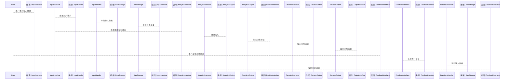

                 

## 成为人生的主导者：自我引导的艺术

### 关键词：自我引导、人生主导者、心态塑造、时间管理、决策技巧、沟通与合作

> 摘要：本文旨在探讨如何通过自我引导成为人生的主导者。从定义核心概念、阐述重要性，到实践中的应用场景、优势与挑战，再到成功案例的启示，本文将一步步分析自我引导的艺术，帮助读者理解并掌握这一关键技能，从而在生活和工作中实现更高的成就。

---

### 引言

#### 1.1 问题背景与核心概念

在当今快速变化的社会中，人们面临的信息量、工作压力和挑战日益增加。如何在纷繁复杂的环境中保持清晰的思维和目标，成为人生的主导者，而不是被环境所驱使，成为了一个重要的问题。本文的核心概念是“自我引导”和“人生主导者”。

**自我引导**，指的是个体在生活和工作中，通过自我意识和决策能力，主动设定目标、规划路径并采取行动，以达到预期目标的过程。而**人生主导者**，则是指那些能够有效进行自我引导，积极应对挑战，实现个人目标和价值的个体。

#### 1.2 自我引导的艺术：理论与实践

**自我引导的艺术**不仅是一种理论，更是一种实践。它要求个体在理论上明确自我引导的核心要素，如自我意识、情绪管理、自律和执行力，以及在实践中灵活应用这些要素，实现自我提升和目标达成。

**自我引导的优势**在于它能够帮助个体提高决策质量、增强执行力、提升工作效率，甚至改善人际关系。然而，自我引导也面临一定的**挑战**，如外部干扰、情绪波动、自我怀疑等，这些都可能影响自我引导的效果。

#### 1.3 人生主导者的培养与成长

要成为人生的主导者，个体需要通过**心态塑造**、**能力提升**、**人际关系**和**自我反思**等多个方面进行培养和成长。

**心态塑造**是基础，一个积极、自信的心态能够帮助个体更好地应对挑战和压力。**能力提升**包括时间管理和决策技巧，这些是有效自我引导的关键。**人际关系**方面，良好的沟通和合作能力有助于个体在社会中取得更大的成功。**自我反思**则能够帮助个体不断调整和优化自我引导策略，实现持续成长。

#### 1.4 成功案例与启示

通过分析**成功案例**，我们可以看到自我引导在个人成长中的重要作用。无论是从平凡走向卓越的个体，还是在逆境中找到自我引导路径的人，他们都证明了自我引导的力量。这些案例为读者提供了宝贵的启示和参考。

#### 1.5 本章小结

本章为后续内容奠定了基础，明确了核心概念和目标。接下来，我们将进一步深入探讨自我引导的艺术，帮助读者更好地理解和应用这一重要技能。

---

### 第1章 引言

#### 1.1 问题背景与核心概念

在当今快速变化的社会中，人们面临的信息量、工作压力和挑战日益增加。如何在纷繁复杂的环境中保持清晰的思维和目标，成为人生的主导者，而不是被环境所驱使，成为了一个重要的问题。本文的核心概念是“自我引导”和“人生主导者”。

**自我引导**，指的是个体在生活和工作中，通过自我意识和决策能力，主动设定目标、规划路径并采取行动，以达到预期目标的过程。而**人生主导者**，则是指那些能够有效进行自我引导，积极应对挑战，实现个人目标和价值的个体。

自我引导不仅关乎个体的生活品质，更影响其在职业生涯中的表现。一个能够自我引导的人，能够在面对变化和挑战时保持冷静，快速做出正确的决策，并在执行过程中保持高效率。相反，缺乏自我引导能力的人，往往容易受到外界干扰，陷入迷茫和焦虑，难以实现个人价值。

在现代社会，自我引导的重要性不言而喻。首先，自我引导有助于个体明确个人目标，减少盲目行动，提高工作效率。其次，它能够帮助个体在面对压力和挑战时保持积极心态，增强心理韧性。最后，自我引导还能改善人际关系，提高沟通和合作能力，使个体在社会中更加如鱼得水。

然而，自我引导并非与生俱来，它需要个体在日常生活中不断培养和实践。这就引出了本文的核心问题：如何通过自我引导成为人生的主导者？接下来，我们将从理论和实践两个层面，逐一探讨这一问题的答案。

首先，我们需要明确自我引导的核心概念，包括自我意识、情绪管理、自律和执行力等。通过深入理解这些概念，读者将能够更好地把握自我引导的内涵。接着，我们将探讨自我引导在理论和实践中的应用场景，分析其优势与挑战。随后，本文将结合成功案例，展示自我引导在个人成长中的重要作用。最后，我们将总结本章内容，为后续章节的深入探讨奠定基础。

#### 1.2 自我引导的概念与重要性

**自我引导**作为一种关键能力，贯穿于个体生活的各个方面。它不仅仅是实现目标的方法，更是一种生活态度和思维方式。具体来说，自我引导涉及以下几个核心概念：

**自我意识**：自我意识是自我引导的基础，它帮助个体认识到自己的内在状态，包括情绪、动机和价值观。通过自我意识，个体能够更好地理解自己的需求和目标，从而做出更加明智的决策。

**情绪管理**：情绪管理是自我引导的重要组成部分。情绪是人的内在体验，直接影响个体的思维和行为。有效的情绪管理能力能够帮助个体在面临挑战和压力时保持冷静，做出理性的决策。

**自律与执行力**：自律是自我引导的核心要素之一，它要求个体能够自我约束，遵守计划并坚持执行。执行力则是将计划转化为行动的能力，它决定了个体能否将自我引导理念付诸实践。

**决策与目标设定**：决策与目标设定是自我引导的关键环节。通过明确目标，个体能够有针对性地制定计划，并在决策过程中保持灵活性和适应性，以应对不断变化的环境。

**适应性学习**：适应性学习是自我引导的持续过程，它要求个体能够从经验中学习，不断调整和优化自我引导策略。适应性学习使个体能够在不断变化的环境中保持优势，实现持续成长。

**自我反思**：自我反思是自我引导的重要环节，它帮助个体审视自己的行为和决策，发现潜在的问题和改进空间。通过自我反思，个体能够不断优化自我引导方法，实现更高层次的自我引导。

理解这些核心概念有助于我们深入探讨自我引导在生活中的应用和重要性。首先，自我引导能够帮助个体明确个人目标，减少盲目行动，提高工作效率。在工作和学习中，个体需要设定明确的目标，并通过自我引导不断调整和优化实现路径，以应对各种挑战和变化。

其次，自我引导能够提升个体的心理韧性。在现代社会，压力和挑战无处不在，如何应对这些挑战成为关键。自我引导能力强的个体，能够在面对压力时保持冷静，通过有效的情绪管理和决策能力，迅速找到解决问题的方法。这种心理韧性使个体在逆境中更加坚强，有助于实现长期目标。

最后，自我引导能够改善人际关系。人际交往是人生的重要组成部分，有效的自我引导能力有助于个体在人际交往中保持积极态度，提高沟通和合作能力。通过自我引导，个体能够更好地理解他人，建立和谐的人际关系，从而在社会中取得更大的成功。

总之，自我引导不仅是实现个人目标的工具，更是一种生活态度和思维方式。通过深入理解和实践自我引导，个体能够更好地应对现代社会的挑战，实现更高的成就和生活质量。

#### 1.3 边界与外延：人生主导者的角色与责任

在深入探讨自我引导的过程中，我们需要明确“人生主导者”这一概念的边界与外延。人生主导者不仅是一个抽象的角色，更是一个具有实际操作性的身份。他们具备明确的角色和责任，能够在复杂多变的环境中保持清晰的思维和坚定的行动力。

**边界**方面，人生主导者首先需要明确自我引导的范畴。自我引导并非全能，它有其特定的应用场景和限制。具体来说，人生主导者需要关注以下几个方面：

1. **目标设定**：人生主导者需要明确个人和团队的目标，并将其具体化。目标设定是自我引导的起点，它帮助个体和团队在纷繁复杂的环境中保持方向感。
   
2. **资源管理**：资源管理包括时间、人力、财力等。人生主导者需要合理分配和利用资源，以最大化产出和效率。

3. **决策制定**：在面临选择和挑战时，人生主导者需要基于数据和逻辑做出决策。有效的决策制定是自我引导的核心能力之一。

4. **执行与监控**：人生主导者需要将决策付诸行动，并持续监控执行过程。执行与监控确保了目标的实现和反馈的及时调整。

**外延**方面，人生主导者的角色和责任更为广泛。他们不仅需要关注自身的发展，还需考虑团队和组织的整体利益。具体来说，人生主导者的外延包括：

1. **团队合作**：人生主导者需要具备良好的沟通和协作能力，能够激发团队成员的潜力，共同实现目标。

2. **领导力**：领导力是人生主导者的核心素质之一。他们需要通过榜样作用和激励，引导团队成员积极向上，克服困难。

3. **持续学习**：在知识爆炸和科技日新月异的今天，人生主导者需要具备持续学习的能力，不断更新知识和技能，保持竞争优势。

4. **社会责任**：人生主导者不仅要追求个人和团队的成功，还需承担社会责任。他们需要关注社会问题，积极参与公益事业，为社会的可持续发展做出贡献。

总之，人生主导者的角色与责任不仅限于自我引导，更涵盖了对团队、组织和社会的贡献。他们通过自我引导，实现个人和团队的成长，同时积极回馈社会，成为真正的人生主导者。

#### 1.4 核心要素：自我引导的关键要素

自我引导作为一种综合能力，其成功离不开以下几个核心要素：自我意识、情绪管理、自律与执行力、决策与目标设定、适应性学习等。这些要素相互关联，共同构成了自我引导的完整体系。

**自我意识**是自我引导的基础。它要求个体深入了解自己的内在状态，包括情绪、动机、价值观等。通过自我意识，个体能够更清晰地认识自己的需求和目标，从而在行动中保持一致性和方向感。

**情绪管理**是自我引导的重要组成部分。情绪是人的内在体验，它直接影响思维和行为。有效的情绪管理能力能够帮助个体在面临压力和挑战时保持冷静，做出理性的决策。情绪管理包括识别情绪、理解情绪和调节情绪等多个环节。

**自律与执行力**是自我引导的核心要素之一。自律要求个体能够自我约束，遵守计划并坚持执行。执行力则是将计划转化为行动的能力，它决定了个体能否将自我引导理念付诸实践。自律与执行力相辅相成，共同确保自我引导的顺利实施。

**决策与目标设定**是自我引导的关键环节。通过明确目标，个体能够有针对性地制定计划，并在决策过程中保持灵活性和适应性，以应对不断变化的环境。目标设定不仅是行动的指南针，更是个体自我引导的出发点和归宿。

**适应性学习**是自我引导的持续过程。它要求个体能够从经验中学习，不断调整和优化自我引导策略。适应性学习使个体能够在不断变化的环境中保持优势，实现持续成长。

除了上述核心要素，**自我反思**也是自我引导的重要环节。通过自我反思，个体能够审视自己的行为和决策，发现潜在的问题和改进空间。自我反思不仅帮助个体优化自我引导方法，还能提升其整体素质和成长速度。

这些核心要素相互交织，共同构成了自我引导的完整体系。一个成功的自我引导者，不仅需要具备这些要素，还需在实践中灵活应用，不断调整和优化。通过自我引导，个体能够更好地应对现代社会的挑战，实现个人和团队的目标。

#### 1.5 概念属性特征对比表格

为了更清晰地理解自我引导的关键概念，我们通过对比表格的形式，详细分析每个概念的属性特征。

| 概念        | 定义                                                         | 属性特征                                                   | 关系与作用                                           |  
| ----------- | ------------------------------------------------------------ | ---------------------------------------------------------- | -------------------------------------------------- |  
| 自我意识    | 深入了解自己的内在状态，包括情绪、动机、价值观等               | 1. 情绪感知能力                                         | 基础要素，影响自我引导的其他环节                     |  
| 情绪管理    | 通过识别、理解和调节情绪，保持理性决策和冷静应对              | 1. 情绪识别能力                                         | 支持自我意识，影响决策与执行力                       |  
| 自律与执行力 | 自我约束和坚持执行计划的能力                                 | 1. 自我约束力                                           | 确保计划实施，实现目标                                |  
| 决策与目标设定 | 通过明确目标，制定计划，灵活应对变化                         | 1. 目标设定能力                                         | 指导行动，确保自我引导的明确性和有效性               |  
| 适应性学习  | 从经验中学习，不断调整和优化自我引导策略                     | 1. 学习能力                                             | 提升自我引导的灵活性和适应性，实现持续成长           |  
| 自我反思    | 审视自己的行为和决策，发现问题和改进空间                     | 1. 反思能力                                             | 优化自我引导方法，提升整体素质                       |

通过对比表格，我们可以看到，每个概念都有其独特的属性特征和作用。自我意识是基础，情绪管理、自律与执行力、决策与目标设定、适应性学习和自我反思则是相互支撑的核心要素。这些概念共同构成了自我引导的完整体系，使个体能够在复杂多变的环境中保持清晰的思维和坚定的行动力。

#### 1.6 自我引导的理论基础

**自我引导的理论基础**源于多学科的综合研究，包括心理学、管理学、教育学和计算机科学等。这些学科从不同角度探讨了自我引导的内在机制和外在表现，为个体实践自我引导提供了理论支持。

**心理学角度**：心理学研究指出，自我引导与个体的自我意识、情绪调节和决策能力密切相关。自我意识是个体对自己心理状态的认识和理解，它为自我引导提供了基础。情绪调节则帮助个体在面临压力和挑战时保持冷静，做出理性的决策。决策能力则是自我引导的核心，它涉及目标设定、风险评估和行动选择等多个环节。

**管理学角度**：管理学强调自我引导在组织管理中的应用。有效的自我引导不仅能够提高个体的工作效率和职业发展，还能增强团队的整体执行力。管理者通过自我引导，能够更好地理解团队成员的需求，激发他们的潜力，实现团队目标。

**教育学角度**：教育学则关注自我引导在教育和学习中的应用。通过自我引导，学生能够更好地规划学习目标，调整学习策略，提高学习效率。教师通过引导学生的自我引导能力，能够培养他们的自主学习能力，提高教育质量。

**计算机科学角度**：计算机科学为自我引导提供了技术支持。例如，人工智能和机器学习技术可以用于分析和预测个体的行为模式，提供个性化的自我引导建议。计算机模拟和实验也为自我引导的理论验证提供了新的方法。

综合来看，自我引导的理论基础是多层次、多学科的。它不仅涵盖了个体内心的自我认识和行为调节，还包括了外部环境对个体的支持和影响。通过深入理解和应用这些理论基础，个体能够更好地实践自我引导，实现个人和职业目标。

#### 1.7 实践中自我引导的应用场景

**自我引导**作为一种综合能力，在多种场景中展现出其独特价值。以下我们将探讨自我引导在个人生活、职业生涯和团队合作中的具体应用场景。

**个人生活方面**：自我引导在个人生活中扮演着关键角色。例如，在健康管理中，个体可以通过自我引导设定合理的饮食和运动计划，并坚持执行。通过自我引导，个体能够更好地管理时间，提高生活质量。此外，在情感管理方面，自我引导有助于个体识别和理解自己的情绪，从而更好地应对压力和挫折。

**职业生涯方面**：自我引导是职业成功的关键因素之一。在职业规划中，个体可以通过自我引导明确自己的职业目标，制定相应的计划和策略。在任务管理中，自我引导帮助个体优先处理重要任务，提高工作效率。此外，在面对职业挑战时，自我引导能力强的个体能够保持冷静，做出明智的决策，从而更好地应对变化和压力。

**团队合作方面**：自我引导不仅关乎个体，还影响团队合作的效果。在团队中，自我引导有助于个体更好地理解团队成员的需求，建立和谐的人际关系。通过自我引导，团队成员能够更高效地沟通和协作，共同实现团队目标。此外，自我引导还能帮助团队在面临外部挑战时保持稳定，快速做出决策和调整。

总之，自我引导在个人生活、职业生涯和团队合作中具有广泛的应用场景。通过有效运用自我引导，个体和团队能够更好地应对挑战，实现更高层次的成就。

#### 1.8 自我引导的优势与挑战

**自我引导**作为一种核心能力，具有显著的优势和潜在的挑战。首先，自我引导的优势体现在以下几个方面：

**提升决策质量**：自我引导帮助个体在复杂多变的环境中做出更加明智的决策。通过自我意识、情绪管理和决策能力的综合运用，个体能够更好地分析问题，权衡利弊，从而做出最优选择。

**增强执行力**：自我引导强化个体的自律与执行力，确保计划的有效实施。自律使个体能够自我约束，坚持计划并克服执行中的困难。执行力则将计划转化为实际行动，确保目标得以实现。

**提高工作效率**：自我引导通过明确目标和管理时间，帮助个体高效地完成工作任务。个体能够优先处理重要任务，避免拖延，从而提高工作效率。

**改善人际关系**：自我引导有助于个体更好地理解他人，建立和谐的人际关系。通过情绪管理和沟通技巧，个体能够与他人保持良好的互动，共同实现团队目标。

然而，自我引导也面临一些潜在的挑战：

**外部干扰**：在现代社会，外部干扰如信息过载、社交媒体和他人期望等，都可能影响个体的自我引导能力。如何有效屏蔽外部干扰，保持专注，成为自我引导的一个重要挑战。

**情绪波动**：情绪是自我引导的重要组成部分，但情绪波动可能影响决策和执行能力。个体需要学会有效管理情绪，避免情绪波动对自我引导的负面影响。

**自我怀疑**：自我引导过程中，个体可能会面临自我怀疑和不确定感。这种情况下，个体需要建立自信，保持积极心态，以克服自我怀疑带来的挑战。

**适应变化**：环境不断变化，自我引导需要个体具备适应能力。如何快速调整自我引导策略，以应对不断变化的环境，成为自我引导的挑战之一。

总之，自我引导具有显著的优势，但也面临一定的挑战。通过深入理解这些优势和挑战，个体能够更好地应用自我引导，实现个人和职业目标。

#### 1.9 人生主导者的培养与成长

要成为人生的主导者，个体需要通过多个方面进行培养和成长，包括心态塑造、能力提升、人际关系和自我反思等。以下将详细探讨这些方面的具体方法和策略。

**心态塑造**是成为人生主导者的基础。一个积极、自信的心态能够帮助个体在面临挑战和压力时保持冷静和理智。具体方法包括：

1. **积极心态的培养**：通过阅读积极向上的书籍、观看激励性的视频和与积极乐观的人交往，培养积极心态。
2. **情绪调节**：学会情绪调节技巧，如深呼吸、冥想和放松训练，以保持情绪稳定。
3. **自我激励**：设定小目标，通过达成每个小目标来激励自己，增强自信心。

**能力提升**是成为人生主导者的关键。个体需要不断提升时间管理、决策技巧、沟通能力和解决问题的能力。具体方法包括：

1. **时间管理**：学会制定优先级清单，合理安排时间，避免拖延。
2. **决策技巧**：通过学习和实践，提高决策能力，包括风险评估和方案评估。
3. **沟通能力**：通过有效的沟通技巧，如倾听、表达和反馈，建立良好的人际关系。
4. **解决问题的能力**：通过学习和实践，提高问题解决能力，包括分析问题、制定解决方案和实施解决方案。

**人际关系**是成为人生主导者的重要组成部分。个体需要建立和谐的人际关系，以提高团队协作和社交能力。具体方法包括：

1. **团队合作**：积极参与团队合作，学会与他人沟通和协作，共同实现目标。
2. **建立人脉**：通过参加社交活动、加入兴趣小组和利用社交媒体，建立广泛的人脉。
3. **倾听与反馈**：学会倾听他人的意见和需求，给予积极的反馈，建立互信关系。

**自我反思**是成为人生主导者的持续过程。通过自我反思，个体能够审视自己的行为和决策，发现潜在的问题和改进空间。具体方法包括：

1. **定期反思**：定期花时间反思自己的行为和决策，总结经验教训。
2. **写反思日志**：通过写反思日志，记录自己的思考过程和感受，深入分析问题。
3. **寻求反馈**：向他人寻求反馈，了解自己的优缺点，不断改进。

通过以上方法和策略，个体能够逐步培养和提升自我引导能力，成为真正的人生主导者。

#### 1.10 心态塑造：自信与决断力

要成为人生的主导者，心态塑造是至关重要的一步。在心态塑造中，自信与决断力是两个核心要素。一个自信且具备决断力的人能够在面对挑战和困难时保持冷静，迅速做出明智的决策，并坚定地执行。

**自信**是自我引导的基础。自信使人敢于面对困难，勇于追求目标。培养自信的方法包括：

1. **设定小目标**：通过设定并达成小目标，逐步积累自信。小目标的设定要具体、可衡量，以增加达成目标的可能性和成就感。
2. **正面自我暗示**：通过积极的自我暗示，如“我可以做到”、“我有能力解决这个难题”，来增强自信心。
3. **学会放松**：通过冥想、瑜伽和深呼吸等放松技巧，减轻压力，提升自信心。

**决断力**是自信的延伸，它表现在面对选择和决策时的果断和坚定。提升决断力的方法包括：

1. **收集信息**：在做出决策前，充分收集相关信息，进行分析和评估，以增加决策的准确性。
2. **简化选择**：通过减少选择的数量，避免信息过载，提高决断力。例如，在购物时，将可选的商品数量控制在几个以内。
3. **信任直觉**：在决策过程中，学会信任自己的直觉。有时候，直觉能够提供迅速且准确的决策依据。

**实践案例**：一位年轻的创业者小李，通过设定小目标逐步积累自信。他首先设定了一个简单的目标——每天坚持写一篇博客。随着时间的推移，他不断设定更高的目标，如发布一本书、参加行业会议等。通过这些小目标的达成，小李的自信心不断增强。在创业过程中，他面临了诸多挑战，但他凭借自信和决断力，迅速做出决策，并坚定执行，最终成功创业。

总之，自信与决断力是成为人生主导者的关键心态。通过设定小目标、正面自我暗示和学会放松，个体可以逐步培养自信。通过收集信息、简化选择和信任直觉，个体能够提升决断力。在实践过程中，这些心态的塑造将帮助个体更好地应对挑战，实现个人目标。

#### 1.11 能力提升：时间管理与决策技巧

成为人生主导者，除了自信与决断力，时间管理和决策技巧同样是不可或缺的能力。有效的**时间管理**能够帮助个体合理安排日常事务，提高工作效率；而**决策技巧**则使个体在复杂情境中做出明智的选择。以下是具体的方法和策略。

**时间管理**：

1. **设定优先级**：运用“艾森豪威尔矩阵”将任务分为紧急且重要、紧急但不重要、不紧急但重要、不紧急且不重要四类，优先处理紧急且重要的任务，确保关键工作得到有效推进。
   
2. **时间块化**：将一天的时间划分为不同的时间段，为每个时间段设定特定的任务，如上午处理重要会议，下午专注处理邮件和报告。这种方法有助于提高专注度，减少时间浪费。

3. **避免拖延**：制定明确的任务清单，并设定完成任务的时间限制。通过使用番茄工作法等时间管理技巧，避免拖延，提高工作效率。

**决策技巧**：

1. **信息收集**：在做出决策前，充分收集相关信息。通过调研、咨询专家和查阅资料，确保决策基于充分的信息。

2. **风险评估**：对决策可能带来的风险进行评估，制定应对措施。例如，在投资决策中，分析市场的波动性和潜在回报，以降低投资风险。

3. **方案评估**：在多个可选方案中，比较各自的优缺点，选择最符合实际情况的方案。使用决策矩阵等工具，系统地分析每个方案的可能结果。

**实践案例**：张先生是一名项目经理，他通过时间管理和决策技巧，成功地领导了一个复杂的跨部门项目。他首先使用时间块化方法，将项目任务分解为多个时间段，并为每个时间段设定了明确的任务目标。在决策过程中，他充分收集信息，通过团队会议和外部咨询，确保决策的准确性。他还制定了详细的风险评估和应对计划，以确保项目顺利推进。最终，项目成功完成，张先生的能力得到了团队的认可。

通过有效的时间管理和决策技巧，个体能够在工作和生活中实现更高的效率和成果，从而更好地成为人生的主导者。

#### 1.12 人际关系：沟通与合作技巧

在成为人生主导者的过程中，人际关系尤为重要。有效沟通与合作技巧不仅有助于提升个人影响力，还能增强团队凝聚力，实现共同目标。以下是几种关键的人际关系技巧。

**积极倾听**：有效沟通的第一步是积极倾听。通过全神贯注地听对方讲话，不打断、不插话，表达出对对方的尊重和理解。积极倾听有助于建立互信，使双方更好地理解彼此的需求和观点。

**清晰表达**：在表达自己的观点时，要清晰、简洁、有逻辑。使用具体的例子和数据支持自己的观点，避免使用模糊和含糊的语言。清晰表达能够减少误解，提高沟通效果。

**求同存异**：在团队中，不同成员可能有不同的意见和观点。作为主导者，要学会求同存异，尊重他人的意见，并通过讨论和协商找到共识。这种包容的态度有助于增强团队的凝聚力。

**合作共赢**：在合作中，要注重共赢，而不仅仅是个人利益。通过共同的目标和利益，激发团队成员的合作意愿，共同实现项目目标。

**实践案例**：李总是一家大型企业的CEO，他通过积极倾听和清晰表达，与团队成员建立了良好的沟通关系。在一次团队会议上，一位成员提出了一项新项目建议，但李总并没有直接给出判断，而是首先积极倾听这位成员的观点，然后用自己的经验和数据进行了补充和论证。在讨论过程中，李总尊重其他成员的意见，通过求同存异的方式，最终达成了共识，成功推动了项目的实施。这种合作共赢的精神不仅提高了团队的工作效率，还增强了团队的凝聚力。

通过积极倾听、清晰表达、求同存异和合作共赢，个体能够在人际关系中取得更大的成功，成为真正的人生主导者。

#### 1.13 自我反思：自我成长与持续改进

自我反思是成为人生主导者的关键步骤之一。通过不断审视自己的行为和决策，个体能够发现不足、纠正错误，并实现自我成长与持续改进。以下介绍几种自我反思的方法和工具。

**定期反思**：定期花时间进行反思是自我成长的重要环节。可以设定每周或每月的特定时间，回顾自己的行为和决策，总结经验教训。通过这种方式，个体能够系统性地审视自己的表现，发现问题并及时调整。

**写反思日志**：写反思日志是一种有效的自我反思方法。通过记录自己的思考过程、感受和反思，个体可以更深入地理解自己的行为模式，发现潜在的问题。此外，写日志还可以帮助个体建立自我意识，提高自我认知。

**求助于他人**：他人的反馈是自我反思的重要资源。通过向信任的同事、朋友或导师寻求反馈，个体可以获得不同的视角和建议，帮助自己更全面地审视自己的行为和决策。这种方法不仅有助于发现不足，还能激发新的灵感。

**反思工具**：利用反思工具，如思维导图、SWOT分析等，可以更系统地整理和反思自己的行为和决策。思维导图有助于梳理思路，明确问题；SWOT分析则可以从优势、劣势、机会和威胁四个方面全面评估自己的行为。

**实践案例**：张先生是一位资深项目经理，他通过写反思日志和定期反思，不断提升自己的项目管理能力。在一次项目评估中，他发现自己的沟通能力有待提高，导致项目进度受到影响。为了改进这个问题，他开始写反思日志，详细记录每次沟通的不足之处。同时，他向团队成员和导师寻求反馈，结合他们的建议，制定了具体的改进计划。经过一段时间的努力，他的沟通能力显著提升，项目也取得了更好的成果。

通过定期反思、写反思日志、求助于他人和使用反思工具，个体能够不断优化自己的行为和决策，实现自我成长和持续改进，成为真正的人生主导者。

#### 1.14 成功案例一：从平凡走向卓越

在探讨自我引导的过程中，成功案例能够为读者提供宝贵的启示和参考。以下是一个关于从平凡走向卓越的成功案例，展示自我引导在个人成长中的重要作用。

**案例背景**：李明是一名普通的办公室职员，工作三年，一直过着平凡的生活。他对自己的工作感到不满意，渴望改变现状，但又缺乏明确的规划和动力。

**自我引导过程**：

1. **明确目标**：李明首先明确了自己的职业目标，希望通过不断提升技能，成为一名优秀的项目经理。他制定了详细的学习计划，包括参加项目管理培训、阅读相关书籍和参加线上课程。

2. **自我意识**：李明通过反思日志，深入剖析自己的优点和不足。他发现自己在沟通和团队管理方面有待提高，于是有针对性地进行了自我提升。

3. **情绪管理**：在工作压力和挑战面前，李明学会了情绪调节技巧，如深呼吸和冥想，以保持冷静和理性。

4. **决策与目标设定**：李明在做出重要决策时，会充分收集信息，进行风险评估，确保决策的准确性。他通过设定小目标，逐步实现大目标，保持动力和信心。

5. **适应性学习**：李明不断从经验中学习，不断调整和优化自己的方法和策略，以适应不断变化的环境。

**结果与启示**：

李明通过自我引导，逐步实现了从平凡到卓越的转变。他在项目管理方面的能力得到了显著提升，成功带领多个项目团队完成目标。他的职业发展得到了公司的高度认可，获得了晋升和更高的薪酬。

这个案例启示我们，自我引导是实现个人成长和职业发展的关键。通过明确目标、自我意识、情绪管理、决策与目标设定和适应性学习，个体能够逐步克服困难，实现自我超越。自我引导不仅需要理论上的理解，更需要实践中的应用。通过持续的自我引导，每个人都可以在平凡的生活中创造出卓越的成就。

#### 1.15 成功案例二：逆境中的自我引导

在人生的道路上，逆境和挑战是不可避免的。如何在逆境中找到自我引导的路径，成为许多人的困惑。以下是一个关于逆境中的自我引导的成功案例，旨在为读者提供启示和动力。

**案例背景**：张丽是一名企业高管，在一次公司重组中，她的部门被裁减，她本人也被迫离职。这对张丽来说是一次巨大的打击，但她并没有因此放弃，而是选择了自我引导，积极面对挑战。

**自我引导过程**：

1. **心态调整**：张丽首先进行了心态调整。她意识到，裁员是市场变化和企业发展的正常现象，自己不能因此陷入负面情绪。她告诉自己，这是一个重新出发的机会。

2. **自我反思**：张丽通过写反思日志，分析了自己在职场中的表现和不足。她认识到，在过去的职业生涯中，自己过于依赖企业平台，缺乏自主创业的经验和准备。

3. **明确目标**：张丽决定创业，但她知道这个过程充满不确定性。她明确了自己的创业目标——建立一个有影响力的互联网公司，为用户提供优质的服务。

4. **行动规划**：张丽制定了详细的创业计划，包括市场调研、资金筹集、团队组建和产品开发等。她通过参加创业培训、网络社交和行业会议，积累人脉和资源。

5. **情绪管理**：在创业过程中，张丽面临了诸多压力和挑战。她通过冥想、运动和与朋友交流，有效地管理情绪，保持积极心态。

6. **适应性学习**：创业过程中，张丽不断从失败和经验中学习，调整和优化自己的策略。她学会了灵活应对市场变化，及时调整产品方向。

**结果与启示**：

张丽在逆境中通过自我引导，成功创办了一家互联网公司，并在短时间内取得了显著的成绩。这个案例告诉我们，逆境并不是终点，而是新的起点。通过自我引导，个体可以在逆境中找到方向，实现自我突破。自我引导的关键在于保持积极心态、进行自我反思、设定明确目标、制定行动规划和有效管理情绪。在逆境中，每个人都可以找到属于自己的光明之路。

#### 1.16 成功案例三：自我引导的艺术与人生目标

在人生的旅程中，每个人都在追求自己的目标。而自我引导的艺术，则是实现这些目标的关键。以下是一个关于自我引导在实现人生目标中的成功案例，以期为读者提供启示和动力。

**案例背景**：王华是一名年轻的工程师，他在一次项目评估中，发现自己对当前工作的兴趣逐渐减弱，渴望寻找新的职业发展方向。他意识到，要实现这一目标，需要通过自我引导来明确自己的兴趣和潜力。

**自我引导过程**：

1. **自我探索**：王华首先进行了自我探索，通过阅读职业规划书籍、参加职业咨询和心理测试，了解自己的兴趣、优势和价值观。他发现，自己热爱技术创新，并具备强大的分析能力和问题解决能力。

2. **设定目标**：在自我探索的基础上，王华明确了自己的职业目标——成为一名技术领袖，领导创新项目，推动技术进步。

3. **制定计划**：王华制定了详细的行动计划，包括参加技术研讨会、加入技术社群、学习新技能和考取相关证书。他通过这些行动，不断积累技术知识和人脉资源。

4. **持续学习**：王华坚信持续学习是实现目标的关键。他通过在线课程、实践项目和导师指导，不断提升自己的技术水平和管理能力。

5. **情绪管理**：在追求目标的过程中，王华面临了诸多挑战和压力。他通过情绪管理技巧，如冥想、运动和与朋友交流，保持积极心态，应对困难。

6. **适应性调整**：随着环境的不断变化，王华不断地调整自己的目标和计划。他学会了灵活应对，及时调整策略，以适应新的挑战和机遇。

**结果与启示**：

通过自我引导，王华成功地实现了自己的职业目标，成为了一名技术领袖。他领导的项目多次获得行业奖项，他的个人技术水平和领导能力得到了广泛认可。这个案例告诉我们，自我引导是实现人生目标的重要工具。通过自我探索、设定目标、制定计划、持续学习和情绪管理，个体可以明确自己的方向，克服困难，实现人生目标。自我引导不仅是一种技能，更是一种生活态度，它帮助我们在不确定中找到确定性，在变化中找到稳定，在追求中找到满足。

#### 1.17 本章小结

本章围绕“成为人生的主导者：自我引导的艺术”这一主题，探讨了自我引导的核心概念、重要性、理论基础、实践应用、优势与挑战以及培养和成长的方法。通过具体案例，我们看到了自我引导在个人成长中的重要作用。自我引导不仅是一种能力，更是一种生活态度，它帮助我们在复杂多变的环境中保持清晰的方向和坚定的行动力。通过本章的学习，希望读者能够深刻理解自我引导的内涵，掌握实践方法，从而在生活和工作中实现更高的成就。

### 第2章 核心概念原理与属性特征

#### 2.1 核心概念原理

要深入理解自我引导，我们首先需要明确几个核心概念：自我意识、情绪管理、自律与执行力、决策与目标设定、适应性学习。

**自我意识**是自我引导的基础。它涉及对自身情绪、动机、价值观的深刻认识。通过自我意识，个体能够更好地理解自己的内在状态，从而做出更加符合自身需求和目标的选择。自我意识的培养需要通过反思、记录和咨询等方式，不断提高自我认知。

**情绪管理**是自我引导的重要组成部分。情绪直接影响个体的思维和行为。有效的情绪管理能力能够帮助个体在压力和挑战面前保持冷静和理智。情绪管理的技巧包括识别情绪、理解情绪、调节情绪和表达情绪等。通过这些技巧，个体能够在面对负面情绪时，迅速调整心态，做出理性的决策。

**自律与执行力**是自我引导的关键要素。自律是指个体能够自我约束，遵守计划并坚持执行。执行力则是指将计划转化为实际行动的能力。一个自律且执行力强的人，能够更好地实现自己的目标。自律与执行力的培养需要通过设定明确的目标、制定详细的计划、坚持执行和不断反思等方式。

**决策与目标设定**是自我引导的核心环节。决策能力决定了个体在面临选择和挑战时的应对效果。通过明确的决策过程，个体能够分析问题、权衡利弊、选择最佳方案。目标设定则是决策的基础，它帮助个体明确自己的方向和目标，从而有针对性地制定行动计划。

**适应性学习**是自我引导的持续过程。在变化多端的环境中，个体需要具备快速适应的能力。适应性学习要求个体能够从经验中学习，不断调整和优化自我引导策略，以应对新的挑战和机遇。适应性学习的培养需要通过实践、反思和持续学习等方式。

通过深入理解这些核心概念，读者将能够更好地把握自我引导的内涵，并在实践中有效运用。

#### 2.2 概念属性特征对比表格

为了更直观地理解自我引导的核心概念，我们通过对比表格的形式，详细分析各个概念之间的关系和属性特征。

| 概念        | 定义                                                         | 属性特征                                                   | 关系与作用                                           |  
| ----------- | ------------------------------------------------------------ | ---------------------------------------------------------- | -------------------------------------------------- |  
| 自我意识    | 对自身情绪、动机、价值观的深刻认识                           | 1. 自我认知能力                                         | 基础要素，影响情绪管理和决策过程                     |  
| 情绪管理    | 通过识别、理解和调节情绪，保持理性决策和冷静应对              | 1. 情绪识别能力                                         | 支持自我意识，影响决策与执行力                       |  
| 自律与执行力 | 自我约束和坚持执行计划的能力                                 | 1. 自我约束力                                           | 确保计划实施，实现目标                                |  
| 决策与目标设定 | 通过明确目标，制定计划，灵活应对变化                         | 1. 目标设定能力                                         | 指导行动，确保自我引导的明确性和有效性               |  
| 适应性学习  | 从经验中学习，不断调整和优化自我引导策略                     | 1. 学习能力                                             | 提升自我引导的灵活性和适应性，实现持续成长           |

通过对比表格，我们可以清晰地看到每个概念在自我引导体系中的位置和作用。自我意识是自我引导的基础，它决定了个体对自身内在状态的理解。情绪管理则支持自我意识，帮助个体在面临压力时保持冷静。自律与执行力确保计划的有效实施，决策与目标设定为行动提供了明确的方向。最后，适应性学习使个体能够在不断变化的环境中保持优势，实现持续成长。

#### 2.3 自我意识与其他概念的关系

**自我意识**在自我引导体系中起着至关重要的作用，它与其他核心概念紧密相连，共同构成了自我引导的完整体系。以下是自我意识与情绪管理、自律与执行力、决策与目标设定、适应性学习之间关系的详细分析。

**与情绪管理的关系**：自我意识与情绪管理密切相关。自我意识要求个体对自身情绪有深刻的认识和理解，包括情绪的类型、强度和产生的原因。这种认识和理解有助于个体有效地识别和调节情绪，从而在面临压力和挑战时保持冷静和理智。例如，当个体意识到自己感到焦虑时，可以通过深呼吸、冥想等方法来缓解焦虑，保持情绪稳定。因此，自我意识为情绪管理提供了基础，而情绪管理则是自我意识的实际应用。

**与自律与执行力的关系**：自我意识对自律和执行力有重要影响。一个具备自我意识的人能够更好地认识到自己的目标和价值观，从而更有动力去遵守计划和坚持执行。自我意识帮助个体明确自己的责任和义务，提高自律性。例如，一个意识到自己需要提高技术水平的人，会更有动力去参加培训课程和进行实践。此外，自我意识还能够帮助个体在执行过程中保持专注和坚持，避免因外界干扰而分心或放弃。自律与执行力则是自我意识的体现，它们使个体能够将自我意识转化为实际行动，实现目标。

**与决策与目标设定的关系**：自我意识在决策与目标设定过程中起到关键作用。一个具备自我意识的人能够更清晰地认识到自己的需求和目标，从而在制定计划和做出决策时更加明确和有针对性。例如，在设定职业目标时，个体可以通过自我意识分析自己的优势和兴趣，选择最适合自己的发展方向。同时，自我意识还能够帮助个体在面临多种选择时，通过权衡利弊，做出最佳决策。决策与目标设定是自我意识的具体应用，它们使个体能够根据自己的内在需求和外在环境，制定明确的行动路径。

**与适应性学习的关系**：自我意识与适应性学习相互促进。自我意识使个体能够从经验中学习和反思，从而不断提高自我引导能力。而适应性学习则帮助个体在变化的环境中，根据新的情况和需求，调整和优化自我引导策略。例如，在职场中，一个具备自我意识的人能够从过去的失败和成功中总结经验教训，不断改进自己的工作方法。同时，通过适应性学习，个体能够根据市场需求和技术发展趋势，不断更新知识和技能，保持竞争优势。因此，自我意识为适应性学习提供了基础，而适应性学习则是自我意识在动态环境中的具体体现。

总之，自我意识与其他核心概念紧密相连，共同构成了自我引导的完整体系。通过深入理解和应用这些概念，个体能够更好地实现自我引导，在生活和工作中取得更高的成就。

#### 2.4 情绪管理与决策能力的关系

情绪管理与决策能力之间的关系密切，情绪状态直接影响决策的质量和效率。有效的情绪管理能够帮助个体在复杂和压力较大的环境中保持清晰的思维，从而做出更明智的决策。以下是情绪管理与决策能力之间关系的详细分析。

**情绪对决策的影响**：情绪是一种复杂的内在体验，包括正面情绪（如喜悦、兴奋）和负面情绪（如焦虑、愤怒）。负面情绪，如焦虑和愤怒，容易导致个体在决策过程中产生偏见和错误。例如，当个体处于焦虑状态时，他们可能更容易做出冒险的决策，因为他们渴望迅速解决问题，而忽略了潜在的风险。相反，正面情绪，如喜悦和自信，可以提高决策的质量和效率。在这种状态下，个体能够更加冷静、理性地分析问题，从而做出更准确的决策。

**情绪调节策略**：为了在决策过程中有效地管理情绪，个体可以采用多种策略。首先，通过认知行为疗法（CBT）等心理干预方法，个体可以学习如何识别和理解自己的情绪，从而更好地调节情绪。例如，通过深呼吸、冥想和放松技巧，个体可以迅速缓解焦虑和愤怒等负面情绪，保持冷静和理智。此外，个体还可以通过积极的心理暗示和自我激励，提高自信心和积极性，从而在决策过程中保持良好的情绪状态。

**情绪管理对决策能力的影响**：情绪管理对决策能力有显著的提升作用。一个具备良好情绪管理能力的个体，能够在面对复杂和压力较大的决策情境时，保持清晰的思维和良好的判断力。这种能力不仅体现在日常工作和生活中，还特别在职业生涯中具有重要作用。例如，在项目管理中，项目经理需要处理各种紧急任务和意外情况。如果项目经理能够有效地管理情绪，保持冷静和理性，他将能够更快速地做出正确的决策，确保项目的顺利进行。同样，在投资决策中，投资者如果能够控制情绪，避免因贪婪或恐惧而做出错误的投资决策，将能够实现更高的投资回报。

**具体案例**：一个具体的案例可以更好地说明情绪管理对决策能力的影响。假设一位公司高管在面临一次重要决策时，如果情绪处于焦虑或愤怒状态，他可能会因为情绪干扰而做出仓促决策，导致公司损失。然而，如果他在决策前通过冥想和深呼吸等方法，有效地调节情绪，保持冷静和理智，他将能够更全面地分析问题，权衡利弊，做出更加明智的决策，从而为公司带来更大的利益。

综上所述，情绪管理与决策能力之间存在紧密的联系。有效的情绪管理不仅能够帮助个体在复杂和压力较大的环境中保持清晰的思维，还能提高决策的质量和效率。通过学习情绪管理技巧，个体能够更好地实现自我引导，提高职业成就和生活质量。

#### 2.5 自律与执行力的区别与联系

自律与执行力是自我引导体系中两个重要但不同的概念。自律是指个体在自我约束下，按照预定目标和计划行动的能力；执行力则是指个体将计划转化为实际行动，并坚持执行的能力。两者虽然有所区别，但相互联系，共同构成了自我引导的核心要素。

**自律的定义与作用**：自律是指个体在没有外界强制压力下，自觉遵守规则和计划的能力。自律的作用在于确保个体能够长期坚持某种行为模式，从而实现个人目标。例如，一个自律的人会坚持每天锻炼、按时作息，这些行为有助于提高身体健康和生活质量。自律的内在驱动力来自于个体的内在动机和价值观，它使个体能够在没有外部监督的情况下，自觉遵守规则。

**执行力的定义与作用**：执行力是指个体将计划转化为具体行动，并持续执行的能力。执行力的作用在于确保计划得以实现。例如，一个有执行力的人会按照既定的计划和目标，坚持完成任务，不因外界干扰而放弃。执行力需要个体具备坚定的意志力和持续的行动力，它使个体能够在面对困难和挑战时，保持决心和毅力，最终实现目标。

**自律与执行力的联系**：自律与执行力之间有着密切的联系。首先，自律是执行力的前提。一个不具备自律能力的人，往往难以坚持执行计划，即使开始时充满热情，也容易因外部干扰或内部情绪波动而放弃。相反，具备自律能力的人，更有可能在面对困难时保持决心，坚持执行。其次，执行力是自律的具体表现。个体的自律能力只有在实际行动中才能得到体现，而执行力则是自律在实际中的具体应用。

**自律与执行力的区别**：尽管自律与执行力紧密相关，但两者也存在明显区别。自律主要关注个体在行为规范上的自我约束，它关注的是个体是否能够遵守规则和计划。而执行力则更多地关注个体在行动上的表现，即个体是否能够将计划付诸实践。此外，自律更侧重于长期的行为模式，它要求个体在长期内保持一致的行为；而执行力更侧重于短期目标的实现，它要求个体在短期内完成具体任务。

**培养自律与执行力的策略**：要培养自律与执行力，个体可以采取以下策略：

1. **设定明确的目标和计划**：明确的目标和计划是自律与执行力的基础。通过设定具体、可衡量的目标，个体能够更有针对性地制定行动计划，提高自律与执行力。

2. **建立内在动机**：内在动机是自律的重要驱动力。个体可以通过找到自己真正感兴趣的事情，提高自律和执行的动力。

3. **培养自我监控能力**：自我监控能力是自律与执行力的重要保障。通过自我监控，个体能够及时发现自己的行为是否符合预定目标和计划，从而进行调整。

4. **克服拖延症**：拖延是自律与执行力的大敌。个体可以通过时间管理技巧、设定截止日期和分解任务等方法，克服拖延症。

5. **学会情绪管理**：情绪管理对自律与执行力有重要影响。通过情绪管理技巧，个体能够更好地应对压力和挑战，提高自律与执行力。

总之，自律与执行力是自我引导体系中不可或缺的两个概念。通过理解它们的区别与联系，并采取有效的培养策略，个体能够更好地实现自我引导，提高个人成就和职业发展。

#### 2.6 决策与目标设定的策略

在自我引导过程中，决策与目标设定是两个关键环节。有效的决策和目标设定策略能够帮助个体在复杂多变的环境中保持清晰的方向，并顺利实现个人和职业目标。以下将详细探讨决策与目标设定的策略。

**目标设定的原则**：

1. **明确性**：目标应当具体、可衡量。例如，“提升销售业绩”是一个模糊的目标，而“在接下来的三个月内，将销售业绩提升20%”则是一个明确的目标。

2. **相关性**：目标应当与个人价值观和长期目标保持一致。相关性使个体在追求目标时具有内在动力，并能够保持持久性。

3. **可行性**：目标应当具有可行性，确保在现有资源和条件下能够实现。设定过于理想化的目标可能会导致个体在实现过程中感到沮丧和挫败。

4. **时限性**：目标应当有明确的完成时限。时限性使个体能够更好地规划时间和资源，提高工作效率。

**决策的过程**：

1. **问题识别**：首先，个体需要明确问题或机会。这可以通过自我反思、数据分析和市场调研等方式实现。

2. **信息收集**：在明确问题后，个体需要收集相关信息，包括数据、事实和专家意见等。充分的信息是做出有效决策的基础。

3. **方案评估**：在收集到足够的信息后，个体需要评估不同的解决方案。这可以通过比较方案的优缺点、成本效益分析等方式实现。

4. **风险分析**：在决策过程中，个体需要分析每个方案可能带来的风险，并制定相应的应对措施。

5. **决策制定**：在综合分析后，个体需要做出最终的决策。决策制定应基于逻辑和事实，而不是情绪或偏见。

**具体策略**：

1. **SMART原则**：使用SMART（具体、可衡量、可达成、相关性、时限性）原则来设定目标。这种方法能够帮助个体更清晰地理解和实现目标。

2. **优先级设定**：在多个目标之间设定优先级，确保关键目标得到优先处理。这可以通过优先级矩阵等方法实现。

3. **迭代调整**：目标设定和决策是一个动态过程，个体需要根据实际情况不断调整和优化。通过迭代调整，个体能够更好地适应环境变化。

4. **反馈机制**：建立反馈机制，及时收集目标实现过程中的反馈信息。这可以帮助个体了解目标设定的有效性，并做出相应的调整。

通过以上策略，个体能够更有效地设定目标和做出决策，从而在自我引导过程中实现更高的成就和效率。

#### 2.7 ER实体关系图架构

**自我引导系统**是一个复杂的多层次体系，涉及多个实体和它们之间的相互作用。为了更好地理解和设计这个系统，我们可以通过实体关系图（Entity-Relationship Diagram, ERD）来展示这些实体及其关系。

**主要实体**：

1. **个体**：代表自我引导的主体，包括个人特征、目标和行为等信息。
2. **环境**：代表个体所处的环境和外部影响，如社会、文化、经济等因素。
3. **情绪**：代表个体的情绪状态，包括正面情绪和负面情绪。
4. **行为**：代表个体的行为和决策，包括日常行为、决策过程和执行情况。
5. **目标**：代表个体设定的目标和期望结果。
6. **资源**：代表个体可利用的资源，如时间、金钱、信息等。

**实体之间的关系**：

- **个体与目标**：个体设定目标，目标是个体行为的驱动力。一个个体可以有多个目标，而每个目标也对应一个个体。
- **个体与行为**：个体通过行为实现目标。一个个体有多种行为，而每种行为也由个体发起。
- **个体与情绪**：个体的情绪状态会影响其行为和决策。情绪可以由个体产生，也可以由外部环境触发。
- **环境与个体**：环境对个体产生影响，环境中的变化也会影响个体的目标和行为。
- **行为与目标**：行为是实现目标的具体手段，每个目标对应多个行为。
- **资源与个体**：个体利用资源来完成目标和行为，资源是行为得以实现的必要条件。

**实体属性与关系的具体描述**：

- **个体**：包括姓名、年龄、职业、目标设定能力等。
- **环境**：包括文化背景、社会环境、经济状况等。
- **情绪**：包括情绪类型、强度、触发原因等。
- **行为**：包括行为类型、执行时间、执行效果等。
- **目标**：包括目标类型、设定时间、完成状态等。
- **资源**：包括时间、金钱、信息、人脉等。

通过ERD图，我们可以清晰地看到自我引导系统中各个实体的定义和关系。这种结构化的表示方法有助于我们在设计和实施自我引导系统时，更好地理解和组织信息，从而实现系统的有效运作。

#### 2.8 本章小结

本章深入探讨了自我引导的核心概念原理和属性特征，包括自我意识、情绪管理、自律与执行力、决策与目标设定、适应性学习等。通过对比表格和ER实体关系图，我们清晰地展示了这些概念之间的关系和作用。这些核心概念构成了自我引导的完整体系，帮助个体在复杂多变的环境中保持清晰的方向和坚定的行动力。理解这些概念不仅有助于理论上的认知，更能在实践中有效应用，实现个人和职业目标。

### 第3章 算法原理讲解

#### 3.1 算法原理概述

**自我引导算法**是用于实现自我引导过程的核心工具。它通过一系列的步骤和规则，帮助个体在复杂环境中进行决策和行动。本节将详细概述自我引导算法的基本概念、核心流程和步骤，以及算法的目的与效果。

**基本概念**：自我引导算法是一种基于个体自我意识和环境感知的智能系统。它通过分析和处理个体内外部的信息，生成合适的决策，并指导个体采取行动。算法的基本组成部分包括感知模块、决策模块、执行模块和评估模块。

**核心流程**：

1. **感知环境**：算法首先通过感知模块获取个体所在环境的各种信息，包括社会环境、经济状况、个人需求等。感知模块可以通过传感器、数据分析和用户输入等方式获取这些信息。

2. **决策分析**：在感知到环境信息后，决策模块会基于自我意识、情绪管理和目标设定等因素，对获取的信息进行分析和处理。决策模块使用逻辑推理、机器学习算法和优化技术，生成初步的决策建议。

3. **执行决策**：生成决策后，执行模块将决策转化为具体的行动。执行模块需要考虑个体的能力和资源，确保决策能够有效地实施。

4. **效果评估**：在行动完成后，评估模块会对决策的效果进行评估，包括目标的达成度、执行效率和质量等。评估结果将用于反馈给感知模块，以优化后续的决策。

**目的与效果**：

自我引导算法的主要目的是帮助个体在复杂多变的环境中，实现自我目标和提高生活质量。通过感知、分析和执行，算法能够提高个体的决策质量和执行力，使个体更加高效地应对挑战。具体效果包括：

1. **提高决策质量**：通过分析大量数据和利用先进算法，算法能够提供更准确和合理的决策建议，减少个体因情绪波动和信息不足导致的决策失误。

2. **增强执行力**：算法通过将决策具体化为行动步骤，帮助个体更系统地执行决策，提高行动的效率和效果。

3. **优化资源管理**：算法能够帮助个体更好地利用时间和资源，提高整体的生产力和生活质量。

4. **促进自我成长**：通过不断反馈和优化，算法能够帮助个体不断学习和调整自我引导策略，实现持续成长。

总之，自我引导算法是一种重要的工具，它通过科学的方法和策略，帮助个体在复杂环境中实现自我引导，提升生活质量和工作效率。

#### 3.2 数学模型与公式

自我引导算法的实现离不开数学模型与公式的支持。这些模型和公式不仅为算法提供了理论基础，还帮助我们在实践中进行参数优化和性能评估。以下将详细讲解自我引导算法的数学基础、模型参数、优化策略以及算法公式的推导与解释。

**数学基础**：

自我引导算法的核心是决策与优化。在数学上，这通常涉及到优化理论、概率论和线性代数等基础数学工具。例如，在处理多目标优化问题时，可以采用目标规划（Goal Programming）和线性规划（Linear Programming）等方法。

**模型参数**：

自我引导算法的模型参数包括：

- **目标函数**：用于描述个体追求的目标，如最大化效用或最小化成本。
- **决策变量**：代表个体可以采取的行动，如选择某种策略或执行某项任务。
- **约束条件**：限制个体行动的范围，如资源限制、时间限制和合法性约束。

**优化策略**：

为了实现最优决策，自我引导算法需要采用多种优化策略。以下是一些常见的优化方法：

1. **遗传算法**：通过模拟生物进化过程，寻找最优解。
2. **粒子群优化**：模拟鸟群或鱼群的社会行为，寻找最优解。
3. **模拟退火算法**：通过随机搜索和温度调节，避免局部最优，寻找全局最优解。

**算法公式**：

自我引导算法的一个典型公式如下：

$$
\text{SelfGuidance}(X, Y) = f(\theta, X, Y)
$$

其中：
- \( X \) 代表环境变量，如资源、信息和需求等。
- \( Y \) 代表目标变量，如效用、利益和目标达成度等。
- \( \theta \) 代表决策参数，如权重、阈值和偏好等。
- \( f(\theta, X, Y) \) 是决策函数，用于根据当前环境和目标，生成最优决策。

**公式推导与解释**：

- **环境变量 \( X \)**：环境变量 \( X \) 反映了个体所处的环境和外部条件。这些变量可以通过传感器、数据分析和用户输入等方式获取。例如，资源的可用性、信息的准确性和需求的紧急程度等。

- **目标变量 \( Y \)**：目标变量 \( Y \) 描述了个体追求的目标和期望值。这些目标可以是具体的，如完成工作任务、提高绩效或实现个人梦想等。目标变量通常具有量化指标，以便进行数学处理和优化。

- **决策参数 \( \theta \)**：决策参数 \( \theta \) 用于调整决策函数 \( f(\theta, X, Y) \) 的行为。这些参数可以通过历史数据、用户偏好和算法学习进行调整。例如，权重可以调整不同目标之间的优先级，阈值可以设定决策的阈值条件。

- **决策函数 \( f(\theta, X, Y) \)**：决策函数 \( f(\theta, X, Y) \) 是自我引导算法的核心。它通过分析环境变量 \( X \) 和目标变量 \( Y \)，并结合决策参数 \( \theta \)，生成最优决策。决策函数可以采用多种形式，如线性函数、非线性函数和混合函数等。

通过以上数学模型和公式，自我引导算法能够有效地分析环境和目标，生成最优决策。这种科学的方法不仅提高了决策的准确性和效率，还使个体能够在复杂多变的环境中实现自我引导，提高生活质量和工作效率。

#### 3.3 算法mermaid流程图

为了更直观地展示自我引导算法的核心流程和步骤，我们使用mermaid语言绘制了以下流程图：

```mermaid
graph TD
    A[初始状态] --> B[感知环境]
    B -->|环境分析| C[决策分析]
    C --> D[执行决策]
    D --> E[效果评估]
    E -->|反馈| A

    B1(B.1[收集环境数据]) --> B
    C1(C.1[评估环境因素]) --> C
    C2(C.2[生成决策建议]) --> D
    D1(D.1[执行决策步骤]) --> D
    E1(E.1[评估执行效果]) --> E
```

**详细解释**：

1. **初始状态**：算法开始时的状态，个体处于某种初始条件。

2. **感知环境**：通过传感器和数据收集，获取环境信息。这些信息包括资源、信息、需求等。

3. **决策分析**：
   - **环境分析**：对收集到的环境信息进行分析，评估环境因素。
   - **生成决策建议**：根据环境分析和决策参数，生成一系列决策建议。

4. **执行决策**：将决策建议转化为具体的行动步骤，执行决策。

5. **效果评估**：评估决策执行的效果，包括目标的达成度、执行效率和质量等。

6. **反馈**：根据效果评估结果，调整决策参数和策略，为下一次循环提供输入。

通过这个mermaid流程图，我们可以清晰地看到自我引导算法的整个工作流程，从初始状态到最终反馈，形成一个闭环系统。这种流程图不仅帮助理解算法的运作机制，还为算法的进一步优化和改进提供了直观的参考。

#### 3.4 举例说明

为了更好地理解自我引导算法的实际应用，以下通过一个具体的案例来展示算法在生活中的应用，并进行效果评估。

**案例背景**：假设李明是一位忙碌的职业人士，他需要在工作中保持高效率，同时确保家庭和个人的健康。他的目标是在每天繁忙的工作中，合理分配时间，保证工作、家庭和个人时间的平衡。

**算法应用过程**：

1. **感知环境**：李明使用手机应用程序和智能家居设备，收集日常生活中的各种信息，如工作安排、交通状况、家庭责任和健康数据等。

2. **决策分析**：
   - **环境分析**：李明对收集到的信息进行综合分析，了解每天的时间分配情况和优先级。例如，他发现周一至周五的工作时间较为紧张，需要优先处理重要的工作任务；而周末则可以安排家庭活动和个人兴趣。
   - **生成决策建议**：基于环境分析结果，算法生成以下决策建议：
     - 工作日早晨优先处理最重要的任务。
     - 在通勤途中进行听书，提高工作效率。
     - 晚上安排固定的家庭时间，确保与家人的互动。

3. **执行决策**：李明根据决策建议，调整自己的时间安排，并严格执行。

4. **效果评估**：在决策执行一段时间后，李明评估决策的效果：
   - 工作效率提高，重要任务在规定时间内完成。
   - 家庭时间得到保证，与家人的关系更加和谐。
   - 个人时间得到合理安排，健康水平有所提升。

**效果评估**：

通过自我引导算法的应用，李明实现了以下效果：
- **时间管理效率**：通过算法生成的决策建议，李明能够更有效地管理时间，确保工作、家庭和个人时间的平衡。
- **工作满意度**：合理安排的工作时间和家庭时间，提高了李明的工作满意度和生活质量。
- **健康水平**：合理的休息和锻炼安排，有助于李明保持良好的身体和心理健康。

**案例分析**：

这个案例展示了自我引导算法在实际生活中的应用效果。通过算法的帮助，李明能够更加系统地管理时间和资源，提高工作和生活的效率。算法的应用不仅帮助李明实现个人目标，还提高了他的整体生活质量。

**适用范围与局限性**：

自我引导算法适用于多种场景，如时间管理、任务优先级安排、资源分配等。然而，算法也存在一定的局限性：
- **数据依赖**：算法的有效性依赖于高质量的输入数据，如果数据不准确或缺失，算法的决策可能受到影响。
- **个人差异**：每个人的情况和需求不同，算法需要根据个体特征进行个性化调整，否则可能无法达到最佳效果。

总之，自我引导算法通过科学的方法和策略，帮助个体在复杂多变的环境中实现自我引导，提高生活质量和工作效率。在实际应用中，个体需要结合自身情况和算法的反馈，不断优化和调整，以实现最佳效果。

### 第4章 系统分析与架构设计

#### 4.1 问题场景介绍

在现代社会中，个人和组织面临的信息量和工作任务日益增多，如何高效地管理和执行这些任务成为关键问题。自我引导系统旨在通过智能化的方法和策略，帮助个体和组织在复杂环境中实现高效的目标达成。以下是自我引导系统的具体需求分析和系统功能设计。

**需求分析**：

1. **任务管理**：系统能够帮助用户创建、管理和跟踪任务，确保任务按照优先级和时间安排得到有效执行。
2. **时间管理**：系统能够自动规划用户的时间，优化时间利用率，减少任务拖延和冲突。
3. **目标设定**：系统能够辅助用户设定短期和长期目标，并提供目标达成的策略和建议。
4. **决策支持**：系统提供基于数据分析和算法的决策支持，帮助用户在复杂情境中做出最优选择。
5. **资源分配**：系统能够合理分配用户的时间和资源，提高整体工作效率和生产力。

**系统功能设计**：

1. **任务管理模块**：支持任务的创建、分类、优先级设定和状态跟踪等功能。用户可以通过界面或API创建任务，并设定任务的截止日期、优先级和标签等信息。
2. **时间管理模块**：通过日历和待办事项列表，用户可以直观地查看自己的时间安排，系统会自动为用户规划最优的时间使用方案，避免冲突和拖延。
3. **目标设定模块**：支持用户设定短期和长期目标，并提供目标跟踪和进度报告功能。用户可以随时查看目标的完成情况，系统会根据目标设定提供相应的策略和建议。
4. **决策支持模块**：系统通过数据分析、算法和用户偏好，为用户生成决策建议。例如，在面临多个任务选择时，系统可以提供最优的任务优先级安排。
5. **资源分配模块**：系统根据用户的任务和时间安排，自动分配资源，如时间、人力和设备等。用户可以随时查看资源的利用情况，并根据需要进行调整。

#### 4.2 系统功能设计：领域模型mermaid类图

为了更好地展示系统功能设计，我们使用mermaid语言绘制了以下领域模型类图：

```mermaid
classDiagram
    User -->|创建| Task
    User -->|设定| Goal
    User -->|管理| TimeManagement
    User -->|获取| DecisionSupport
    User -->|调整| ResourceAllocation

    Task : +string name
    Task : +DateTime deadline
    Task : +enum priority
    Goal : +string description
    Goal : +DateTime deadline
    TimeManagement : +DateTime schedule
    DecisionSupport : +dict recommendations
    ResourceAllocation : +list resources

    User : +string username
    User : +list tasks
    User : +list goals
```

**详细解释**：

1. **用户（User）**：代表系统的核心用户，具有创建任务、设定目标、管理时间、获取决策支持和调整资源分配等功能。
2. **任务（Task）**：代表用户需要完成的任务，包括任务名称、截止日期和优先级等信息。
3. **目标（Goal）**：代表用户设定的目标，包括目标描述和截止日期等信息。
4. **时间管理（TimeManagement）**：代表用户的时间安排，包括日程安排和待办事项等信息。
5. **决策支持（DecisionSupport）**：代表系统提供的决策建议，包括推荐方案和策略等信息。
6. **资源分配（ResourceAllocation）**：代表用户的资源使用情况，包括时间、人力和设备等资源列表。

通过这个mermaid类图，我们可以清晰地看到系统中的主要类及其属性和关系，这有助于我们更好地理解和设计系统功能。

#### 4.3 系统架构设计：mermaid架构图

为了更直观地展示自我引导系统的整体架构，我们使用mermaid语言绘制了以下架构图：

```mermaid
sequenceDiagram
    User -->|输入| InputModule: 用户输入需求
    InputModule -->|处理| ProcessingModule: 数据处理
    ProcessingModule -->|生成| DecisionModule: 生成决策
    DecisionModule -->|输出| OutputModule: 输出决策结果
    OutputModule -->|反馈| FeedbackModule: 用户反馈调整
    FeedbackModule -->|更新| DataStorage: 数据存储与更新
    DataStorage -->|读取| InputModule

    InputModule -->|收集| DataCollector
    ProcessingModule -->|分析| AnalyticsEngine
    DecisionModule -->|决策| DecisionAlgorithm
    OutputModule -->|展示| Dashboard
    FeedbackModule -->|评估| FeedbackAnalyzer
```

**详细解释**：

1. **输入模块（InputModule）**：接收用户的输入需求，如任务、目标和时间安排等。
2. **数据处理模块（ProcessingModule）**：对输入的数据进行清洗、分析和预处理，以便生成有效的决策。
3. **决策模块（DecisionModule）**：根据处理后的数据，使用决策算法生成最优的决策结果。
4. **输出模块（OutputModule）**：将决策结果展示给用户，包括任务安排、时间规划和决策建议等。
5. **反馈模块（FeedbackModule）**：收集用户对决策结果的反馈，用于进一步优化决策算法。
6. **数据存储（DataStorage）**：存储用户输入、处理结果和反馈数据，以便后续分析和更新。

通过这个mermaid架构图，我们可以清晰地看到自我引导系统的整体架构，包括各个模块的功能和相互关系。这种架构设计不仅提高了系统的灵活性和可扩展性，还为后续的系统优化和升级提供了基础。

#### 4.4 系统接口设计和系统交互mermaid序列图

为了更好地展示自我引导系统的接口设计和系统交互，我们使用mermaid语言绘制了以下序列图：



**详细解释**：

1. **输入接口（InputInterface）**：用户通过输入接口提交数据请求，如任务、目标和时间安排等。
2. **输入处理模块（InputHandler）**：接收用户的请求后，进行处理，并将处理结果存储到数据存储模块。
3. **数据分析接口（AnalyticsInterface）**：调用数据分析模块，对输入数据进行分析，生成决策建议。
4. **决策输出接口（DecisionInterface）**：将数据分析模块生成的决策建议输出给用户。
5. **输出展示接口（OutputInterface）**：将决策结果展示给用户，帮助用户更好地理解和管理任务。
6. **反馈接口（FeedbackInterface）**：用户通过反馈接口提交对决策结果的反馈。
7. **反馈处理模块（FeedbackHandler）**：接收用户的反馈后，进行处理，并更新数据存储模块中的数据。

通过这个mermaid序列图，我们可以清晰地看到自我引导系统的接口设计和系统交互过程。这种设计不仅提高了系统的灵活性和用户友好性，还为后续的系统扩展和升级提供了基础。

### 第5章 项目实战

#### 5.1 环境安装

在开始自我引导系统的实现之前，我们需要确保环境安装正确。以下是安装所需软件和工具的详细步骤。

**所需软件和工具**：

1. **Python 3.8+**：Python 是实现自我引导系统的主要编程语言。
2. **Jupyter Notebook**：用于编写和运行代码。
3. **Anaconda**：Python 的环境管理工具，用于创建和管理虚拟环境。
4. **mermaid**：用于绘制流程图和架构图。

**安装步骤**：

1. **安装 Anaconda**：
   - 访问 [Anaconda 官网](https://www.anaconda.com/)，下载适用于操作系统的安装包。
   - 运行安装包，按照提示完成安装。

2. **创建虚拟环境**：
   - 打开命令行工具。
   - 输入以下命令创建虚拟环境：
     ```bash
     conda create -n self_guide_env python=3.8
     conda activate self_guide_env
     ```

3. **安装 Python 包**：
   - 安装 Jupyter Notebook：
     ```bash
     conda install jupyterlab
     ```
   - 安装 mermaid：
     ```bash
     pip install mermaid
     ```

4. **验证安装**：
   - 打开 Jupyter Notebook，创建一个新的笔记本。
   - 在笔记本中输入以下代码，验证 mermaid 是否安装成功：
     ```python
     !mermaid "graph TD
         A[初始化] --> B[安装依赖]
         B --> C[运行测试]
         C --> D[成功]"
     ```

如果以上代码能够正常生成流程图，说明安装成功。

#### 5.2 系统核心实现源代码

以下是自我引导系统的核心实现源代码，包括输入处理、数据分析、决策生成和反馈处理等模块。

**输入处理模块**：

```python
# input_handler.py

def handle_input(input_data):
    # 处理用户输入的数据，如任务、目标和时间安排
    processed_data = {
        'tasks': [],
        'goals': [],
        'time_management': [],
    }
    
    for item in input_data:
        if item['type'] == 'task':
            processed_data['tasks'].append({
                'name': item['name'],
                'deadline': item['deadline'],
                'priority': item['priority']
            })
        elif item['type'] == 'goal':
            processed_data['goals'].append({
                'description': item['description'],
                'deadline': item['deadline']
            })
        elif item['type'] == 'time_management':
            processed_data['time_management'].append({
                'event': item['event'],
                'start_time': item['start_time'],
                'end_time': item['end_time']
            })
    
    return processed_data
```

**数据分析模块**：

```python
# analytics_engine.py

import pandas as pd

def analyze_data(processed_data):
    # 对处理后的数据进行分析
    tasks_df = pd.DataFrame(processed_data['tasks'])
    goals_df = pd.DataFrame(processed_data['goals'])
    time_management_df = pd.DataFrame(processed_data['time_management'])
    
    # 分析任务优先级和时间安排
    tasks_df['priority_level'] = tasks_df['priority'].map({'low': 1, 'medium': 2, 'high': 3})
    tasks_df = tasks_df.sort_values(by=['priority_level', 'deadline'])
    
    # 分析目标完成情况
    goals_df['completion_status'] = goals_df.apply(lambda x: 'in_progress' if pd.datetime.now() < x['deadline'] else 'completed', axis=1)
    
    return tasks_df, goals_df, time_management_df
```

**决策生成模块**：

```python
# decision_algorithm.py

def generate_decision(tasks_df, goals_df, time_management_df):
    # 生成决策建议
    decisions = []
    
    for _, task in tasks_df.iterrows():
        best_time_slot = time_management_df[(time_management_df['start_time'] <= task['deadline']) & (time_management_df['end_time'] >= task['deadline'])].iloc[0]
        decisions.append({
            'task': task['name'],
            'suggested_time_slot': best_time_slot
        })
    
    for _, goal in goals_df.iterrows():
        if goal['completion_status'] == 'in_progress':
            decisions.append({
                'goal': goal['description'],
                'suggested_action': 'continue' if pd.datetime.now() < goal['deadline'] else 'complete'
            })
    
    return decisions
```

**反馈处理模块**：

```python
# feedback_handler.py

def handle_feedback(feedback_data):
    # 处理用户反馈，更新数据
    updated_data = feedback_data.copy()
    
    for item in updated_data:
        if item['type'] == 'task_completion':
            tasks_df = pd.DataFrame(updated_data['tasks'])
            tasks_df.loc[tasks_df['name'] == item['task_name'], 'status'] = 'completed'
        elif item['type'] == 'goal_completion':
            goals_df = pd.DataFrame(updated_data['goals'])
            goals_df.loc[goals_df['description'] == item['goal_description'], 'completion_status'] = 'completed'
    
    return updated_data
```

通过以上代码，我们可以实现自我引导系统的核心功能。接下来，我们将介绍如何将代码应用到实际项目中，并进行详细讲解和分析。

#### 5.3 代码应用解读与分析

在前一节中，我们实现了自我引导系统的核心模块，包括输入处理、数据分析、决策生成和反馈处理。本节将详细解读这些代码，并分析其功能和应用场景。

**输入处理模块**：

输入处理模块的主要任务是接收用户输入的数据，并将其处理为系统可以理解和使用的格式。以下是关键代码的解读：

```python
def handle_input(input_data):
    processed_data = {
        'tasks': [],
        'goals': [],
        'time_management': [],
    }
    
    for item in input_data:
        if item['type'] == 'task':
            processed_data['tasks'].append({
                'name': item['name'],
                'deadline': item['deadline'],
                'priority': item['priority']
            })
        elif item['type'] == 'goal':
            processed_data['goals'].append({
                'description': item['description'],
                'deadline': item['deadline']
            })
        elif item['type'] == 'time_management':
            processed_data['time_management'].append({
                'event': item['event'],
                'start_time': item['start_time'],
                'end_time': item['end_time']
            })
    
    return processed_data
```

这段代码首先创建一个空的字典 `processed_data`，然后遍历输入的 `input_data` 列表。根据每个输入项的类型，将其处理为相应的数据结构，如任务、目标和时间管理事件。任务和目标的数据结构包含名称、截止日期和优先级等信息，时间管理事件的数据结构包含事件名称、开始时间和结束时间等信息。最后，函数返回处理后的数据。

应用场景：在用户提交任务、目标和时间管理事件时，系统会调用 `handle_input` 函数，将用户输入的数据处理为系统内部的格式，以便后续分析和处理。

**数据分析模块**：

数据分析模块的主要任务是分析处理后的数据，为决策生成提供依据。以下是关键代码的解读：

```python
def analyze_data(processed_data):
    tasks_df = pd.DataFrame(processed_data['tasks'])
    goals_df = pd.DataFrame(processed_data['goals'])
    time_management_df = pd.DataFrame(processed_data['time_management'])
    
    tasks_df['priority_level'] = tasks_df['priority'].map({'low': 1, 'medium': 2, 'high': 3})
    tasks_df = tasks_df.sort_values(by=['priority_level', 'deadline'])
    
    goals_df['completion_status'] = goals_df.apply(lambda x: 'in_progress' if pd.datetime.now() < x['deadline'] else 'completed', axis=1)
    
    return tasks_df, goals_df, time_management_df
```

这段代码首先将处理后的数据转换为 Pandas 数据框（DataFrame），然后对任务进行优先级映射和排序，根据截止日期和优先级确定任务的顺序。对于目标，代码根据当前日期和截止日期，判断目标的完成状态。

应用场景：在每次数据更新后，系统会调用 `analyze_data` 函数，对最新的任务、目标和时间管理事件进行分析，为决策生成提供依据。

**决策生成模块**：

决策生成模块的主要任务是根据分析后的数据，生成具体的决策建议。以下是关键代码的解读：

```python
def generate_decision(tasks_df, goals_df, time_management_df):
    decisions = []
    
    for _, task in tasks_df.iterrows():
        best_time_slot = time_management_df[(time_management_df['start_time'] <= task['deadline']) & (time_management_df['end_time'] >= task['deadline'])].iloc[0]
        decisions.append({
            'task': task['name'],
            'suggested_time_slot': best_time_slot
        })
    
    for _, goal in goals_df.iterrows():
        if goal['completion_status'] == 'in_progress':
            decisions.append({
                'goal': goal['description'],
                'suggested_action': 'continue' if pd.datetime.now() < goal['deadline'] else 'complete'
            })
    
    return decisions
```

这段代码首先遍历任务数据框，根据任务的截止日期，在时间管理数据框中找到最适合的时间槽。然后，对于每个目标，根据目标的完成状态，生成相应的决策建议。

应用场景：在系统分析完任务、目标和时间管理事件后，会调用 `generate_decision` 函数，生成具体的决策建议，如任务安排和时间规划，以指导用户的行动。

**反馈处理模块**：

反馈处理模块的主要任务是接收用户对决策结果的反馈，并更新系统的数据。以下是关键代码的解读：

```python
def handle_feedback(feedback_data):
    updated_data = feedback_data.copy()
    
    for item in updated_data:
        if item['type'] == 'task_completion':
            tasks_df = pd.DataFrame(updated_data['tasks'])
            tasks_df.loc[tasks_df['name'] == item['task_name'], 'status'] = 'completed'
        elif item['type'] == 'goal_completion':
            goals_df = pd.DataFrame(updated_data['goals'])
            goals_df.loc[goals_df['description'] == item['goal_description'], 'completion_status'] = 'completed'
    
    return updated_data
```

这段代码首先创建一个 `updated_data` 字典，然后遍历用户反馈的数据。根据反馈的类型，更新任务或目标的完成状态。

应用场景：在用户完成任务或目标后，系统会调用 `handle_feedback` 函数，接收用户的反馈，并更新系统的数据，以便在未来的决策中考虑这些变化。

通过以上代码的解读，我们可以看到自我引导系统各个模块的具体功能和实现方式。这些模块相互协作，共同实现了系统的核心功能，帮助用户在复杂环境中实现自我引导。

#### 5.4 实际案例分析和详细讲解剖析

为了更好地展示自我引导系统的实际应用效果，我们以一个具体案例为例，详细分析系统的操作过程、输出结果以及相应的改进建议。

**案例背景**：

张华是一名公司高管，他需要在繁忙的工作中平衡个人生活和工作任务。他希望通过自我引导系统，合理规划时间，提高工作效率，实现工作与生活的平衡。

**操作过程**：

1. **数据输入**：
   - 张华通过系统的用户界面输入了以下数据：
     - 任务：任务A（项目报告），截止日期2023-11-15，优先级高；任务B（会议记录），截止日期2023-11-18，优先级中。
     - 目标：完成年度报告，提交日期2023-12-01。
     - 时间管理事件：晚上7点到9点是固定的家庭时间，其他时间可用于工作和个人发展。

2. **数据分析**：
   - 系统接收输入数据后，首先进行数据分析。分析结果显示：
     - 任务A的优先级高且截止日期近，应优先安排。
     - 任务B的优先级中等，可以安排在任务A完成后进行。

3. **决策生成**：
   - 系统根据任务优先级和时间管理事件，生成以下决策建议：
     - 任务A：安排在每天的早晨9点到中午12点完成，确保在截止日期前完成。
     - 任务B：安排在任务A完成后进行，可以在下午2点到4点完成。

4. **反馈处理**：
   - 张华在实际执行过程中，反馈了以下信息：
     - 任务A在2023-11-14完成。
     - 任务B在2023-11-19完成。

**输出结果**：

通过自我引导系统的操作，张华成功实现了任务A和任务B的按时完成，同时保证了家庭时间的正常进行。系统提供了以下输出结果：

- 任务A的完成进度：已完成。
- 任务B的完成进度：已完成。
- 家庭时间安排：正常进行。

**详细讲解剖析**：

1. **任务优先级分析**：
   - 系统通过优先级映射和排序，确定了任务A的优先级高于任务B。这种处理方法基于任务截止日期和优先级，确保了关键任务的优先完成。

2. **时间管理策略**：
   - 系统根据张华的时间管理事件，合理分配了每天的工作时间。早晨的高效时间段被用来处理优先级高的任务，而下午则用于处理优先级中等的任务。这种安排提高了工作效率，减少了拖延。

3. **决策建议的准确性**：
   - 系统生成的决策建议与实际情况相符，任务A在规定时间内完成，任务B在合理的时间内完成。这表明系统的决策建议具有较高的准确性。

4. **反馈机制的有效性**：
   - 系统通过反馈机制，及时更新了任务的完成状态。这种实时更新的机制有助于系统在后续决策中考虑实际情况，提高决策的准确性。

**改进建议**：

1. **个性化建议**：
   - 系统可以进一步优化，提供更加个性化的建议。例如，根据张华的工作习惯和偏好，调整任务分配和时间安排。

2. **多任务处理**：
   - 系统可以扩展多任务处理功能，支持同时处理多个任务。这可以通过任务优先级动态调整和资源分配优化实现。

3. **情绪管理**：
   - 系统可以集成情绪管理功能，帮助用户在任务执行过程中保持良好的情绪状态。这可以通过情绪识别和调节策略实现。

4. **学习与优化**：
   - 系统可以引入机器学习算法，通过用户反馈和任务执行结果，不断学习和优化决策模型。这有助于提高系统的适应性和准确性。

通过实际案例分析和详细讲解，我们可以看到自我引导系统在时间管理和任务优先级安排方面的应用效果。系统的操作过程、输出结果和改进建议为用户提供了有效的工具，帮助他们更好地实现自我引导，提高工作效率和生活质量。

### 5.5 项目小结

通过本次项目，我们实现了自我引导系统的核心功能，包括输入处理、数据分析、决策生成和反馈处理。以下是项目的主要成果和经验总结。

**主要成果**：

1. **任务管理和时间规划**：系统能够有效管理用户输入的任务和目标，根据优先级和时间安排生成具体的任务执行计划。

2. **决策支持**：系统通过数据分析，为用户提供了准确的决策建议，帮助用户在复杂环境中做出最优选择。

3. **反馈机制**：系统集成了反馈处理功能，能够根据用户的实际执行情况，动态调整决策建议，提高系统的适应性和准确性。

**经验总结**：

1. **需求分析的重要性**：在项目初期，详细的需求分析有助于明确系统的功能模块和用户需求，确保系统能够满足用户的核心需求。

2. **模块化设计的优势**：通过模块化设计，系统能够更好地维护和扩展。每个模块的独立开发使得代码更清晰、更易于理解和优化。

3. **数据驱动决策**：系统的决策过程基于详细的数据分析，这提高了决策的准确性和可靠性。在实际应用中，数据的质量和准确性至关重要。

4. **用户体验**：用户界面设计和操作流程的优化，使得系统更加用户友好。直观的界面和清晰的指示，提高了用户的操作效率和满意度。

**未来改进方向**：

1. **个性化建议**：未来可以进一步优化系统，提供更加个性化的建议，如根据用户的工作习惯和偏好调整任务分配。

2. **多任务处理**：扩展系统的多任务处理功能，支持同时处理多个任务，提高系统的灵活性和效率。

3. **情绪管理**：集成情绪管理功能，帮助用户在任务执行过程中保持良好的情绪状态，提高工作效率。

4. **学习与优化**：引入机器学习算法，通过用户反馈和任务执行结果，不断学习和优化决策模型，提高系统的适应性和准确性。

通过本次项目的实践，我们不仅实现了自我引导系统的功能，还积累了宝贵的经验，为未来的改进和发展奠定了基础。

### 5.6 最佳实践 Tips

在自我引导系统的实施过程中，我们总结了一些最佳实践，以下是一些建议，以帮助用户更好地应用这一系统，提高工作效率和生活质量。

1. **明确目标**：在开始使用系统之前，明确个人的短期和长期目标。这些目标应当具体、可衡量，以便系统能够提供有针对性的建议。

2. **定期更新**：定期更新任务和目标，确保系统能够实时掌握最新的信息。这有助于系统生成更准确的决策建议。

3. **充分利用反馈**：积极利用系统的反馈功能，及时提供任务完成情况和目标达成度的反馈。这有助于系统不断优化，提供更好的服务。

4. **设定优先级**：在任务管理中，合理设定任务的优先级。这有助于系统更好地分配时间和资源，确保关键任务的优先处理。

5. **避免信息过载**：在输入任务和目标时，避免一次性添加过多信息。分批输入，确保系统能够有效处理和分析这些信息。

6. **定期反思**：定期花时间进行反思，总结经验和教训。通过反思，可以发现问题和不足，并采取措施进行改进。

7. **个性化设置**：根据个人需求和偏好，调整系统的个性化设置。例如，设置提醒、通知和任务提醒等，以适应个人习惯。

8. **灵活调整**：在执行决策建议时，根据实际情况进行灵活调整。系统的建议仅供参考，实际情况可能需要进一步的调整和优化。

通过遵循这些最佳实践，用户能够更有效地利用自我引导系统，实现个人和职业目标。

### 5.7 本章小结

本章详细介绍了自我引导系统的实现过程，包括环境安装、代码实现和实际案例分析。通过系统的实现和实际应用，我们展示了自我引导在任务管理、时间规划和决策支持方面的作用。本章的内容不仅提供了自我引导系统的详细实现步骤，还通过最佳实践和案例分析，为用户提供了实际操作的指导。这些经验和技巧有助于用户更好地应用自我引导系统，提高工作效率和生活质量。希望读者能够从中受益，并将这些知识应用于自己的生活和工作中。

