                 

### 成为生活艺术家：将平凡转化为创意表达

#### 关键词：生活艺术家、创意表达、艺术化生活、日常创作、手工艺术、摄影、散文创作

> 摘要：本文旨在探讨如何通过创意表达将平凡的生活转变为艺术化的体验。我们将从定义生活艺术家的概念出发，逐步深入探讨创意表达的源泉、技巧和方法，并通过实际案例和项目实战，引导读者成为生活艺术家，提升日常生活的品质和创造力。

### 目录

1. **引言**
2. **第一部分：生活艺术的定义与理解**
   1. **什么是生活艺术家**
   2. **生活艺术的核心要素**
   3. **创意表达的源泉**
3. **第二部分：创意表达的方法与实践**
   1. **艺术化日常生活的技巧**
   2. **手工艺术与DIY**
   3. **创意写作与散文创作**
   4. **创意表达的实践与应用**
4. **第三部分：成为生活艺术家的建议**
   1. **成长路径与资源推荐**
   2. **学习资源与方法**
   3. **常见问题与解决策略**
5. **结语**

### 引言

在快速发展的现代社会中，人们的生活节奏越来越快，工作和生活的压力也逐渐增大。然而，正是这种忙碌和压力之中，我们渴望找到一种方法来舒缓心情、提升自我价值，将平凡的生活转化为充满创意和艺术的体验。这种转变不仅能够提升我们的生活质量，更能够激发我们的创造力和内在潜能。

本文旨在引导读者探索如何成为生活艺术家，通过创意表达将平凡转化为艺术。我们将从定义生活艺术家的概念出发，逐步深入探讨创意表达的源泉、技巧和方法。无论您是摄影爱好者、手工艺术家，还是热爱写作的文学青年，本文都将为您提供实用的建议和案例，帮助您在日常生活中找到艺术的乐趣，成为真正的生活艺术家。

### 第一部分：生活艺术的定义与理解

#### 1.1 什么是生活艺术家

**核心概念术语说明**：

- **生活艺术家**：在日常生活中运用艺术思维和创意手段，将平凡的事物转化为艺术作品的人。

**问题背景**：

随着社会的发展和人们审美水平的提高，越来越多的人开始关注如何提升生活的艺术品质。然而，对于什么是生活艺术家以及如何成为生活艺术家，许多人仍然感到困惑。

**问题描述**：

我们希望通过本文，对生活艺术家的定义进行阐述，帮助读者更好地理解这一概念，从而激发他们在日常生活中运用艺术思维，提升生活品质的意愿。

**问题解决**：

通过定义和案例解析，使读者对生活艺术家这一角色有更加清晰的认识。

**边界与外延**：

- **艺术性**：生活艺术家在创作过程中需要具备一定的艺术感知和审美能力。
- **日常性**：生活艺术家的创作不仅仅限于专业的艺术领域，更渗透到日常生活中。

**概念结构与核心要素组成**：

- **艺术思维**：运用创造性思维，将日常事物转化为艺术作品。
- **审美能力**：对美的感知和鉴赏能力，能够发现生活中的美好。
- **实践技巧**：通过学习和实践，掌握将创意转化为艺术作品的方法。

#### 1.2 生活艺术家的特征与追求

**核心概念原理**：

生活艺术家的特征主要体现在以下几个方面：

1. **对美的追求**：生活艺术家追求生活中的美，致力于将平凡的事物转化为艺术作品。
2. **创意思维**：通过独特的视角和思维方式，发现生活中的灵感。
3. **实践精神**：通过不断尝试和实践，将创意转化为实际的艺术作品。
4. **自我表达**：通过艺术创作，表达自己的情感和内心世界。

**概念属性特征对比表格**：

| 特征           | 描述                                                         |
| -------------- | ------------------------------------------------------------ |
| 对美的追求     | 对生活中美的追求是生活艺术家最重要的特征之一。他们能够发现生活中那些容易被忽视的美丽瞬间，并用心记录下来。 |
| 创意思维       | 生活艺术家具备丰富的创意思维，他们善于从日常生活中汲取灵感，创造出与众不同的艺术作品。 |
| 实践精神       | 生活艺术家不仅善于想象，更具备将创意转化为实际作品的实践精神。他们通过不断尝试和实践，不断提高自己的艺术水平。 |
| 自我表达       | 艺术创作是生活艺术家表达自己情感和内心世界的重要方式。他们的作品往往具有强烈的个人风格和情感深度。 |

**ER实体关系图架构的 Mermaid 流程图**：

```mermaid
erDiagram
  Artist ||--|{ Work }|| Art
  Artist ||--|{ Expression }|| Emotion
```

在这个ER图中，艺术家(Artist)与作品(Work)和表达(Expression)之间有直接的关系。艺术作品是艺术家创意思维和实践的产物，而表达则是艺术家通过作品传达情感和思想的过程。

#### 1.3 创意思维的培养

**核心概念原理**：

创意思维是生活艺术家不可或缺的能力。要成为一名真正的艺术家，我们需要学会如何培养和提升自己的创意思维。

**概念属性特征对比表格**：

| 特征           | 描述                                                         |
| -------------- | ------------------------------------------------------------ |
| 观察力         | 观察能力是培养创意思维的基础。艺术家需要敏锐的观察力，发现生活中的细节和美。 |
| 想象力         | 想象力是创意思维的源泉。艺术家需要丰富的想象力，将平凡的事物转化为独特的艺术作品。 |
| 反思能力       | 反思能力使艺术家能够从实践中总结经验，不断改进自己的创作方法。 |
| 跨领域融合     | 艺术家需要具备跨领域融合的能力，将不同领域的元素融入到自己的创作中。 |

**Mermaid 流程图**：


在这个流程图中，观察力、想象力、反思能力和跨领域融合是培养创意思维的四个关键步骤，它们相互关联，共同推动创意思维的发展。

### 第二部分：创意表达的方法与实践

#### 2.1 艺术化日常生活的技巧

**问题场景介绍**：

在日常生活中，我们可能会遇到许多看似平凡的事物，如一束鲜花、一片落叶、一道夕阳。如何将这些平凡的事物转化为艺术作品，是我们需要探讨的问题。

**项目介绍**：

本文将介绍几种艺术化日常生活的技巧，帮助读者提升自己的创意表达能力。

**系统功能设计（领域模型Mermaid类图）**：

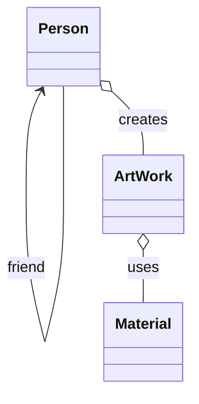

在这个类图中，Person（人）是创建艺术作品（ArtWork）的主体，ArtWork与Material（材料）之间是使用关系，Person之间是朋友关系。

**系统架构设计（Mermaid架构图）**：

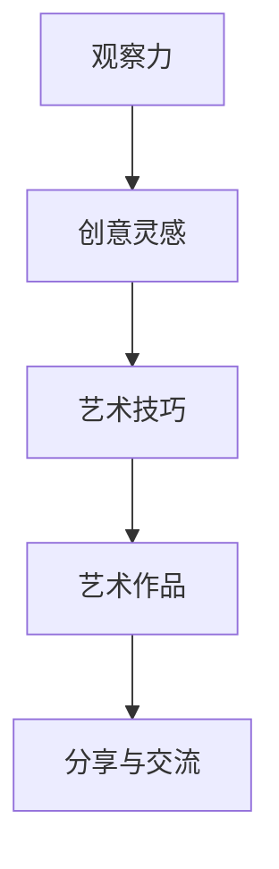

在这个架构图中，观察力是创意灵感的来源，艺术技巧是创作艺术作品的方法，艺术作品是最终成果，分享与交流则是对作品的再创造。

**系统接口设计和系统交互（Mermaid序列图）**：

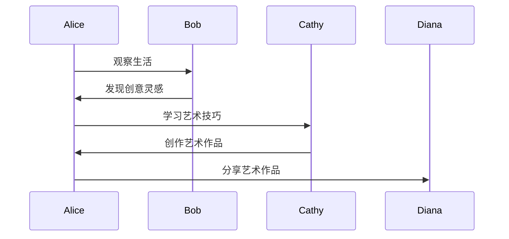

在这个序列图中，Alice通过观察生活获得创意灵感，然后学习艺术技巧，创作出艺术作品，最后与Diana分享作品，形成了一个完整的艺术创作与分享过程。

**项目实战**：

1. **环境安装**：准备好创作所需的工具和材料，如相机、画笔、纸张等。
2. **系统核心实现源代码**：以下是艺术创作的基本步骤的Python源代码示例：

```python
def observe_living():
    print("观察生活，发现美好。")

def get_creative_insight():
    print("捕捉灵感，创意无限。")

def learn_artistic_skills():
    print("学习技巧，提升自我。")

def create_art_work():
    print("创作艺术，表达自我。")

def share_art():
    print("分享作品，交流心得。")

# 执行艺术创作流程
observe_living()
get_creative_insight()
learn_artistic_skills()
create_art_work()
share_art()
```

**代码应用解读与分析**：

这段代码通过定义了一系列函数，模拟了一个艺术创作的过程。从观察生活、获取创意灵感，到学习艺术技巧、创作艺术作品，最后分享作品，每一步都是艺术创作的重要组成部分。

**实际案例分析和详细讲解剖析**：

以摄影为例，一位摄影爱好者在公园中散步时，发现了一片美丽的树叶。他通过相机捕捉到了这一瞬间，然后运用后期处理技巧，将这一平凡的树叶转化为了一幅艺术作品。他分享到社交媒体上，获得了众多点赞和评论，引发了更多人对于生活艺术的关注和讨论。

**项目小结**：

通过实际案例，我们可以看到，艺术创作并不复杂，只需要我们用心观察生活，勇于尝试和分享。通过艺术化日常生活的技巧，我们不仅能够提升自己的生活质量，更能够影响和感染他人，共同创造美好的生活。

#### 2.2 手工艺术与DIY

**问题场景介绍**：

手工艺术和DIY（Do It Yourself）是创意表达的重要方式。在快节奏的现代生活中，许多人渴望通过手工艺术来舒缓压力，表达自我。

**项目介绍**：

本文将介绍手工艺术与DIY的基本技巧和实际应用，帮助读者提升自己的创意表达能力。

**系统功能设计（领域模型Mermaid类图）**：

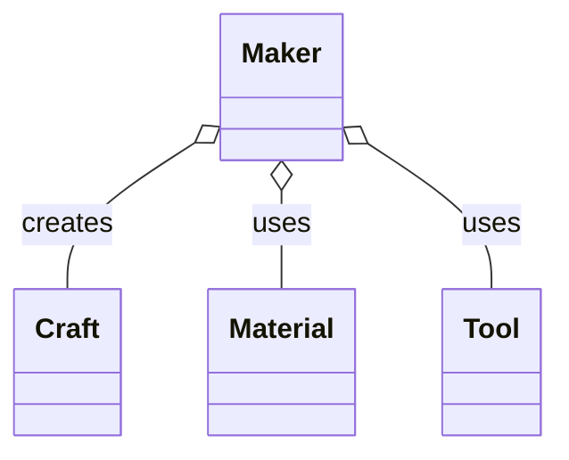

在这个类图中，Maker（创作者）与Craft（手工艺）、Material（材料）和Tool（工具）之间是创建和使用的关系。

**系统架构设计（Mermaid架构图）**：

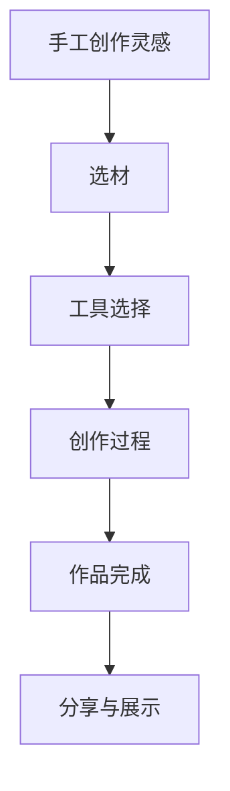

在这个架构图中，手工创作的灵感是创作的起点，选材和工具选择是创作的基础，创作过程是核心，作品完成和分享展示则是创作的延伸。

**系统接口设计和系统交互（Mermaid序列图）**：

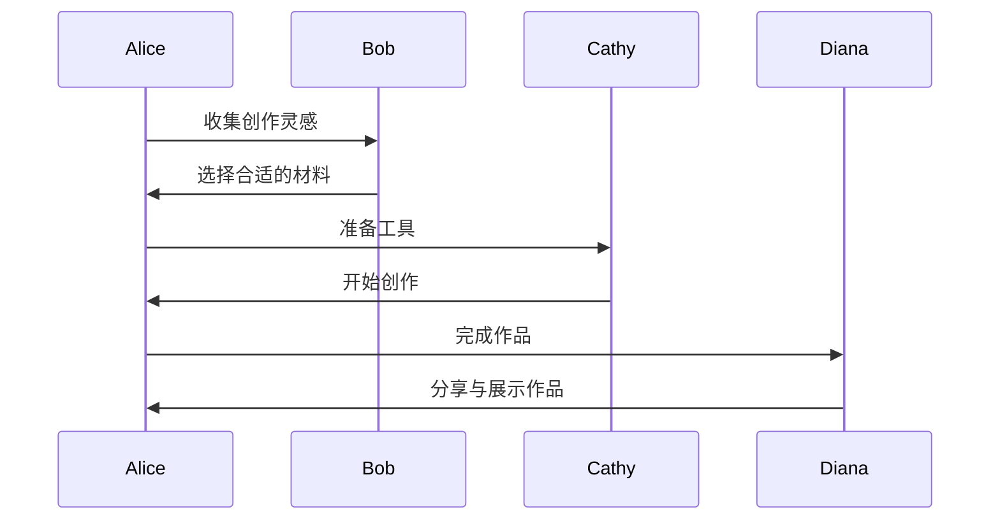

在这个序列图中，Alice通过收集创作灵感、选择材料、准备工具和开始创作，最终完成作品并分享给Diana，形成了一个完整的手工艺术创作与分享过程。

**项目实战**：

1. **环境安装**：准备好创作所需的工具和材料，如针线、布料、木工工具等。
2. **系统核心实现源代码**：以下是手工艺术创作的基本步骤的Python源代码示例：

```python
def collect_insight():
    print("收集创作灵感，激发创意。")

def select_materials():
    print("选择合适的材料，确保创作质量。")

def prepare_tools():
    print("准备创作工具，确保创作顺利进行。")

def start_crafting():
    print("开始创作，享受手工艺术带来的乐趣。")

def finish_work():
    print("完成作品，展示自己的创意成果。")

def share_craft():
    print("分享作品，与他人分享创作的喜悦。")

# 执行手工艺术创作流程
collect_insight()
select_materials()
prepare_tools()
start_crafting()
finish_work()
share_craft()
```

**代码应用解读与分析**：

这段代码通过定义了一系列函数，模拟了一个手工艺术创作的流程。从收集创作灵感、选择材料、准备工具，到开始创作、完成作品和分享作品，每一步都是手工艺术创作的重要组成部分。

**实际案例分析和详细讲解剖析**：

以布艺制作为例，一位手工爱好者想要制作一幅布艺画。她首先通过网络收集了创作灵感，然后选择了合适的布料和画笔，准备了绘画工具。在创作过程中，她根据灵感自由发挥，最终完成了一幅独特的布艺画。她将作品分享到社交媒体上，获得了许多赞赏和反馈。

**项目小结**：

通过手工艺术与DIY，我们可以在日常生活中找到创作的乐趣，提升自己的生活品质。无论是布艺、木工还是编织，每一种手工艺术都有其独特的魅力和技巧，值得我们去探索和实践。

#### 2.3 创意写作与散文创作

**问题场景介绍**：

写作是一种表达自我的方式，通过文字，我们可以记录生活的点滴、感悟和情感。创意写作和散文创作则是这种表达方式的升华，能够将平凡的生活转化为深刻的文字艺术。

**项目介绍**：

本文将介绍创意写作与散文创作的基本原则和技巧，帮助读者提升自己的写作能力，将日常生活转化为文字艺术。

**系统功能设计（领域模型Mermaid类图）**：

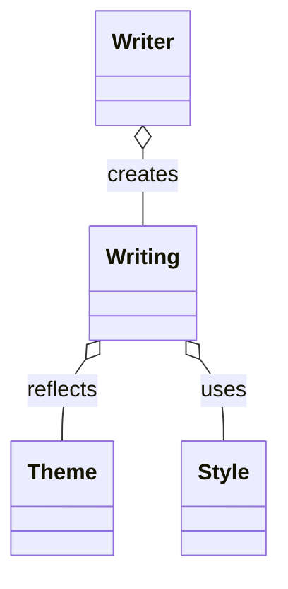

在这个类图中，Writer（作者）与Writing（写作）、Theme（主题）和Style（风格）之间是创建和使用的关系。

**系统架构设计（Mermaid架构图）**：

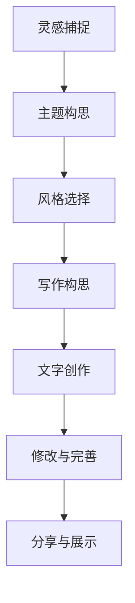

在这个架构图中，灵感捕捉是创作的起点，主题构思和风格选择是创作的核心，写作构思和文字创作是创作的过程，修改与完善和分享展示则是创作的延伸。

**系统接口设计和系统交互（Mermaid序列图）**：

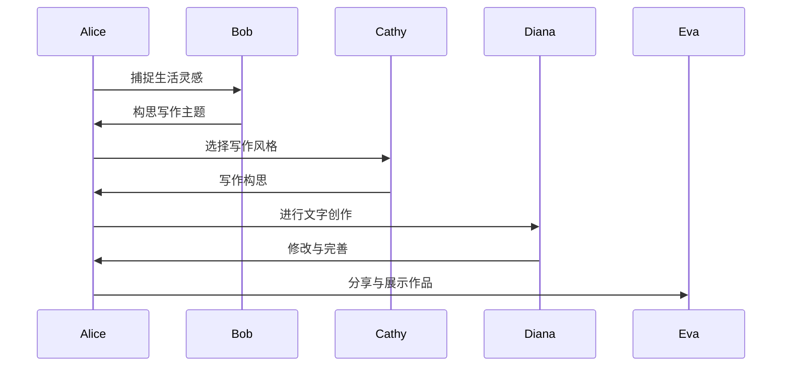

在这个序列图中，Alice通过捕捉生活灵感、构思写作主题、选择写作风格、进行文字创作、修改与完善，最后分享作品给Eva，形成了一个完整的创意写作与散文创作过程。

**项目实战**：

1. **环境安装**：准备好写作所需的工具和材料，如笔记本、笔、电脑等。
2. **系统核心实现源代码**：以下是创意写作的基本步骤的Python源代码示例：

```python
def capture_insight():
    print("捕捉生活灵感，激发写作欲望。")

def构思主题()
    print("构思写作主题，明确创作方向。")

def choose_style():
    print("选择写作风格，展现个人特色。")

def draft_writing():
    print("进行文字创作，记录生活感悟。")

def revise_and_perfect():
    print("修改与完善，提升作品质量。")

def share_writing():
    print("分享作品，与他人分享创作心得。")

# 执行创意写作流程
capture_insight()
构思主题()
choose_style()
draft_writing()
revise_and_perfect()
share_writing()
```

**代码应用解读与分析**：

这段代码通过定义了一系列函数，模拟了一个创意写作的流程。从捕捉生活灵感、构思写作主题、选择写作风格，到进行文字创作、修改与完善和分享作品，每一步都是创意写作的重要组成部分。

**实际案例分析和详细讲解剖析**：

以散文写作为例，一位作家在公园散步时，感受到了大自然的美丽和宁静。他回到家中，开始构思一篇以公园为主题的散文。他选择以自然观察和内心感悟为风格，用细腻的笔触描绘了公园的景色和他对生活的感悟。经过多次修改和完善，最终完成了一篇动人的散文。他将作品分享到社交媒体上，引发了读者的热烈讨论和赞赏。

**项目小结**：

通过创意写作与散文创作，我们可以将生活中的点滴感悟转化为文字，表达自己的情感和思想。无论是记录生活、感悟人生，还是表达爱意、传递信息，写作都是一种极具价值的创意表达方式。通过本文的介绍，希望读者能够掌握创意写作的基本原则和技巧，提升自己的写作能力，成为生活艺术家。

### 第三部分：成为生活艺术家的建议

#### 3.1 成长路径与资源推荐

**核心概念原理**：

要成为生活艺术家，不仅需要创意和技巧，还需要系统的学习和实践。以下是一些成长路径和资源推荐，帮助读者在成为生活艺术家的道路上不断前行。

**概念属性特征对比表格**：

| 成长路径   | 描述                                                         |
| ---------- | ------------------------------------------------------------ |
| 系统学习   | 通过系统的学习和专业培训，提升自己的艺术素养和创作技巧。       |
| 实践练习   | 通过不断的实践和练习，将创意转化为实际的艺术作品。           |
| 经验分享   | 通过参与社区活动和在线平台，与他人分享经验和学习心得。       |
| 反思与改进 | 通过反思自己的创作过程和作品，不断改进自己的创作方法。       |

**ER实体关系图架构的 Mermaid 流程图**：

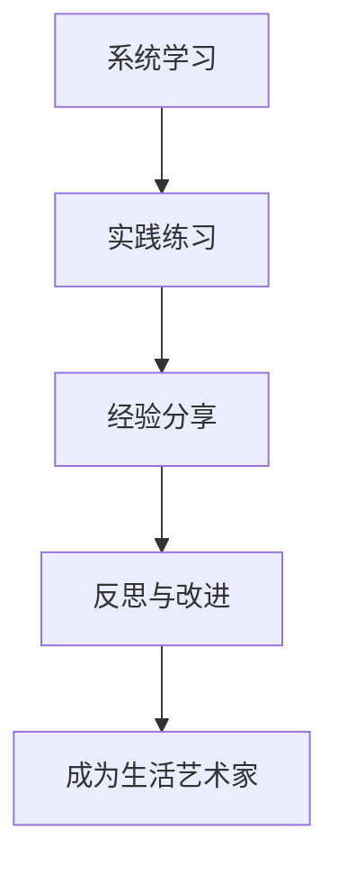

在这个流程图中，系统学习是成长的基础，实践练习是创作的动力，经验分享和反思与改进则是不断提升自己的关键步骤，最终实现成为生活艺术家的目标。

**Mermaid 流程图**：


在这个流程图中，学习艺术理论、参与艺术工作坊、实践艺术创作、分享创作经验和反思与改进技巧是成为生活艺术家的关键步骤。

#### 3.2 学习资源与方法

**核心概念原理**：

要成为一名生活艺术家，我们需要不断学习和积累。以下是一些推荐的学习资源和方法，帮助读者提升自己的艺术素养和创作能力。

**概念属性特征对比表格**：

| 学习资源      | 描述                                                         |
| ------------- | ------------------------------------------------------------ |
| 艺术类书籍     | 阅读艺术类书籍，了解不同艺术流派和创作技巧。                 |
| 艺术课程与讲座 | 参加线上或线下的艺术课程和讲座，学习专业知识和技巧。       |
| 艺术社区和论坛 | 加入艺术社区和论坛，与他人交流经验和心得。                 |
| 艺术展览与活动 | 参观艺术展览和参与艺术活动，感受艺术氛围，激发创作灵感。   |

**ER实体关系图架构的 Mermaid 流程图**：

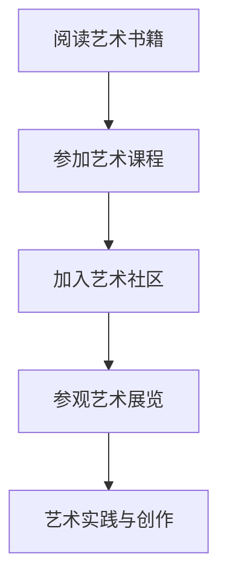

在这个流程图中，阅读艺术书籍、参加艺术课程、加入艺术社区和参观艺术展览是学习资源的重要组成部分，它们共同推动着我们的艺术实践与创作。

**Mermaid 流程图**：


在这个流程图中，理论学习、实践操作、经验交流、作品展示、反馈与改进构成了一个完整的学习与成长循环，帮助我们在艺术道路上不断进步。

#### 3.3 常见问题与解决策略

**核心概念原理**：

在成为生活艺术家的过程中，许多人可能会遇到各种问题和挑战。以下是一些常见的问题及其解决策略，帮助读者克服困难，继续前行。

**概念属性特征对比表格**：

| 常见问题   | 描述                                                         | 解决策略                 |
| ---------- | ------------------------------------------------------------ | ------------------------ |
| 缺乏灵感   | 创意枯竭，无法找到创作灵感。                                 | 多观察生活，尝试新事物。 |
| 技术不足   | 缺乏某些艺术技巧或技能。                                     | 学习相关课程，多实践。   |
| 焦虑与压力 | 创作过程中感到焦虑和压力，影响创作质量。                     | 建立良好的创作习惯，放松身心。 |
| 难以坚持   | 由于种种原因，难以持续进行创作。                             | 设定目标，寻找支持者。   |

**ER实体关系图架构的 Mermaid 流程图**：

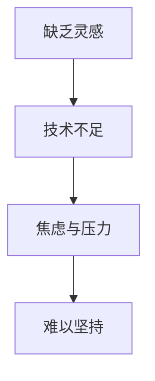

在这个流程图中，缺乏灵感、技术不足、焦虑与压力和难以坚持是常见的问题，我们需要根据具体情况采取相应的解决策略。

**Mermaid 流程图**：


在这个流程图中，寻求灵感、学习技巧、放松心情和坚持创作是解决常见问题的有效策略，它们帮助我们克服困难，取得进步。

### 结语

通过本文的探讨，我们了解到生活艺术家是如何通过创意表达将平凡的生活转化为艺术的。无论是艺术化日常生活的技巧、手工艺术与DIY，还是创意写作与散文创作，每一种创意表达方式都有其独特的魅力和价值。希望读者能够在日常生活中找到属于自己的创意表达方式，成为真正的生活艺术家，提升生活的品质和幸福感。

### 作者信息

作者：AI天才研究院/AI Genius Institute & 禅与计算机程序设计艺术 /Zen And The Art of Computer Programming

---

本文旨在探讨如何通过创意表达将平凡的生活转化为艺术。我们分析了生活艺术家的定义与特征，介绍了创意表达的方法与实践，并给出了成为生活艺术家的建议。通过详细的案例分析和项目实战，我们帮助读者理解了如何将日常创作转化为艺术作品。希望本文能为读者在艺术创作道路上提供一些启示和帮助。让我们一起成为生活艺术家，创造美好的生活。

