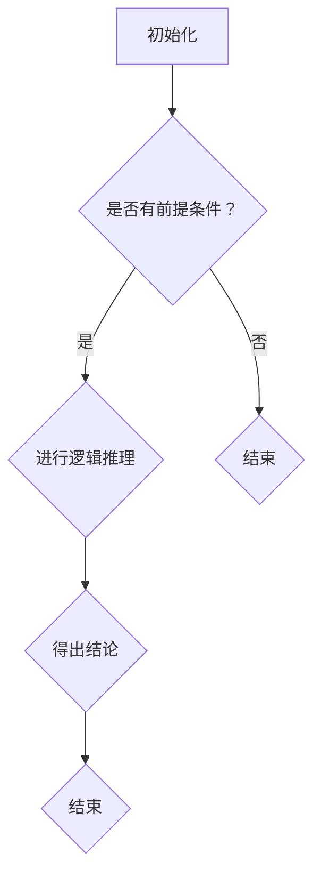
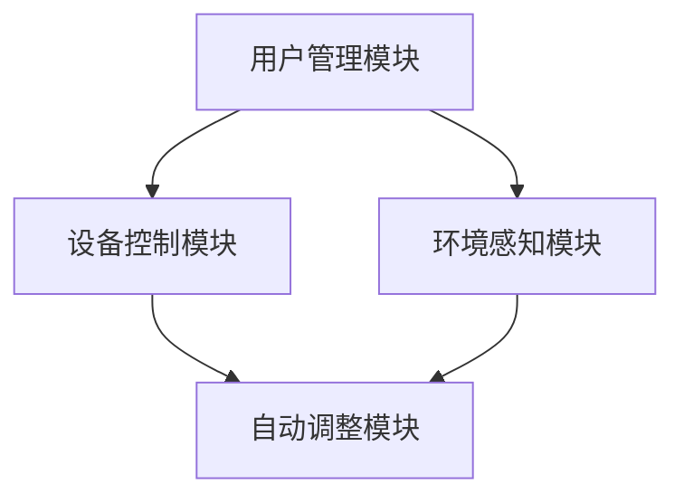

                 

### 提升AI Agent的推理能力：技巧与方法

> 关键词：AI Agent、推理能力、数据预处理、特征提取、算法原理、系统架构、实战应用

> 摘要：本文旨在深入探讨提升AI Agent推理能力的技巧与方法。首先，我们将回顾AI Agent的背景与基础理论，理解推理能力的重要性。接着，本文将详细介绍数据预处理技巧、特征提取与表征方法，以及多种推理算法的原理。最后，我们将通过一个实际项目实战，展示如何将这些技巧和方法应用到实践中，并提供最佳实践与注意事项。

### 目录大纲

```markdown
# 提升AI Agent的推理能力：技巧与方法

## 第一部分：背景与基础理论

## 第1章 引言

### 1.1 问题背景

### 1.2 问题描述

### 1.3 问题解决

### 1.4 边界与外延

### 1.5 概念结构与核心要素组成

## 第2章 AI Agent的推理能力基础

### 2.1 AI Agent的基本概念

### 2.2 推理能力的重要性

### 2.3 推理能力的基本原理

### 2.4 推理能力的评估指标

## 第3章 推理能力的核心概念与联系

### 3.1 核心概念原理

### 3.2 概念属性特征对比表格

### 3.3 ER实体关系图架构

## 第二部分：技巧与方法

## 第4章 数据预处理技巧

### 4.1 数据清洗方法

### 4.2 数据增强技术

### 4.3 数据集划分策略

## 第5章 特征提取与表征技巧

### 5.1 特征提取方法

### 5.2 特征表征策略

### 5.3 特征选择技术

## 第6章 推理算法原理讲解

### 6.1 算法mermaid流程图

### 6.2 Python源代码讲解

### 6.3 数学模型与公式

### 6.4 举例说明

## 第三部分：实战应用

## 第7章 系统分析与架构设计方案

### 7.1 问题场景介绍

### 7.2 项目介绍

### 7.3 系统功能设计

### 7.4 系统架构设计

### 7.5 系统接口设计

### 7.6 系统交互

## 第8章 项目实战

### 8.1 环境安装

### 8.2 系统核心实现源代码

### 8.3 代码应用解读与分析

### 8.4 实际案例分析与详细讲解

### 8.5 项目小结

## 第9章 最佳实践与注意事项

### 9.1 最佳实践 tips

### 9.2 小结

### 9.3 注意事项

### 9.4 拓展阅读
```

### 第一部分：背景与基础理论

#### 第1章 引言

##### 1.1 问题背景

随着人工智能（AI）技术的快速发展，AI Agent在各个领域的应用越来越广泛。AI Agent是一种智能体，它能够自主学习、推理和决策，从而在复杂环境中完成特定的任务。然而，AI Agent的推理能力成为了其应用中的一个关键瓶颈。推理能力指的是AI Agent在处理问题时，通过逻辑推理来获得结论或解决方案的能力。提高AI Agent的推理能力，对于实现更高效、更可靠的AI应用至关重要。

##### 1.2 问题描述

当前，AI Agent的推理能力存在以下问题：

1. **数据依赖性高**：许多AI Agent依赖于大量的数据来进行推理，这使得它们在面对少量或不完整的数据时表现不佳。
2. **推理速度慢**：传统的推理算法（如逻辑推理、规划等）通常需要较大的计算资源，导致推理速度较慢。
3. **推理结果不确定性**：AI Agent的推理结果可能受到噪声数据、推理算法的局限性等因素的影响，导致结果不确定性。
4. **推理能力单一**：当前的AI Agent通常只能针对特定类型的问题进行推理，难以适应多种不同的场景。

##### 1.3 问题解决

为了提升AI Agent的推理能力，我们需要从以下几个方面入手：

1. **数据预处理**：通过数据清洗、数据增强等技术，提高数据质量，减少噪声数据的影响。
2. **特征提取与表征**：选择和提取有效的特征，对特征进行适当的表征，以提高推理的准确性。
3. **推理算法优化**：研究和开发新的推理算法，提高推理速度和准确性。
4. **多模态推理**：结合多种数据源，实现跨模态的推理，提高AI Agent的适应性和灵活性。

##### 1.4 边界与外延

在提升AI Agent推理能力的研究中，我们需要明确以下边界与外延：

1. **数据边界**：数据预处理技术应保证数据的一致性、完整性和准确性。
2. **特征边界**：特征提取与表征应关注特征的选择、提取和表征方法，以提高推理的准确性和效率。
3. **算法边界**：推理算法的选择和优化应考虑算法的适用范围、计算复杂度和可扩展性。
4. **应用边界**：AI Agent的推理能力提升应考虑具体应用场景的需求和限制。

##### 1.5 概念结构与核心要素组成

AI Agent的推理能力提升涉及多个核心概念和要素，具体包括：

1. **数据预处理**：数据清洗、数据增强、数据集划分等。
2. **特征提取与表征**：特征选择、特征提取方法、特征表征策略等。
3. **推理算法**：逻辑推理、规划、决策树、神经网络等。
4. **模型评估**：准确率、召回率、F1分数等。
5. **多模态融合**：文本、图像、声音等多模态数据的融合方法。
6. **系统架构**：前端、后端、接口、数据库等。

#### 第2章 AI Agent的推理能力基础

##### 2.1 AI Agent的基本概念

AI Agent是一种智能体，它能够模拟人类智能行为，具有感知、决策、执行等能力。AI Agent通常由以下几个部分组成：

1. **感知器**：感知器用于获取外部环境的信息，如传感器、摄像头、麦克风等。
2. **决策器**：决策器根据感知器获取的信息，利用推理算法进行推理，生成决策。
3. **执行器**：执行器根据决策器的决策结果，执行具体的操作，如机器人手臂、自动驾驶车辆等。

##### 2.2 推理能力的重要性

推理能力是AI Agent的核心能力之一，它决定了AI Agent在面对复杂问题时，能否快速、准确地做出决策。推理能力的重要性体现在以下几个方面：

1. **适应复杂环境**：推理能力使AI Agent能够适应不断变化的外部环境，从而完成各种复杂的任务。
2. **提高决策质量**：推理能力使AI Agent能够通过逻辑推理，从多个可能的决策中选择最优的决策。
3. **减少数据依赖**：推理能力使AI Agent在面对少量或不完整的数据时，仍能做出合理的决策。
4. **提升学习能力**：推理能力有助于AI Agent从经验中学习，不断提高其推理能力和决策质量。

##### 2.3 推理能力的基本原理

推理能力的基本原理主要包括以下几个方面：

1. **逻辑推理**：逻辑推理是一种基于逻辑规则进行推理的方法，它通过前提条件和结论之间的逻辑关系，得出新的结论。
2. **规划**：规划是一种基于目标和约束条件，生成一系列行动步骤的方法，以实现某个目标。
3. **决策树**：决策树是一种基于分类或回归问题的决策模型，它通过一系列条件分支，生成多个可能的决策路径。
4. **神经网络**：神经网络是一种基于模拟人脑神经元结构的工作原理，它通过大量的参数训练，实现复杂的非线性函数映射。

##### 2.4 推理能力的评估指标

推理能力的评估指标主要包括以下几个方面：

1. **准确率**：准确率是指AI Agent推理结果与实际结果一致的比例，是评估推理能力最常用的指标。
2. **召回率**：召回率是指AI Agent能够正确识别出的真实结果占所有真实结果的比例，是评估推理能力的另一个重要指标。
3. **F1分数**：F1分数是准确率和召回率的调和平均值，它综合了准确率和召回率的信息，是评估推理能力的更全面的指标。
4. **推理速度**：推理速度是指AI Agent在给定时间内完成推理的能力，它是评估推理能力的一个重要方面。

### 第二部分：技巧与方法

#### 第4章 数据预处理技巧

##### 4.1 数据清洗方法

数据清洗是数据预处理的重要步骤，它涉及以下方法：

1. **缺失值处理**：缺失值处理包括删除含有缺失值的样本、使用均值、中位数等方法填充缺失值等。
2. **异常值处理**：异常值处理包括删除异常值、对异常值进行归一化等。
3. **重复值处理**：重复值处理包括删除重复值、合并重复值等。
4. **格式化处理**：格式化处理包括统一数据格式、转换数据类型等。

##### 4.2 数据增强技术

数据增强技术用于提高数据质量和多样性，从而提升AI Agent的推理能力。数据增强技术包括：

1. **数据变换**：数据变换包括对数据进行旋转、缩放、翻转等操作。
2. **数据生成**：数据生成包括使用生成对抗网络（GAN）等方法，生成新的数据样本。
3. **数据合成**：数据合成包括将多个数据源进行融合，生成新的数据样本。

##### 4.3 数据集划分策略

数据集划分策略包括以下方法：

1. **随机划分**：随机划分将数据集随机分为训练集、验证集和测试集。
2. **分层划分**：分层划分确保每个类别在训练集、验证集和测试集中的比例保持一致。
3. **交叉验证**：交叉验证通过多次划分训练集和验证集，来评估模型的泛化能力。

#### 第5章 特征提取与表征技巧

##### 5.1 特征提取方法

特征提取方法包括以下几种：

1. **统计特征**：统计特征包括均值、方差、最大值、最小值等，用于描述数据的分布和变化趋势。
2. **纹理特征**：纹理特征包括直方图、梯度等，用于描述图像的纹理信息。
3. **形状特征**：形状特征包括边缘、轮廓等，用于描述图像的形状信息。
4. **频域特征**：频域特征包括傅里叶变换、小波变换等，用于描述图像的频域信息。

##### 5.2 特征表征策略

特征表征策略包括以下几种：

1. **维度降低**：维度降低包括主成分分析（PCA）、线性判别分析（LDA）等方法，用于减少特征维度，提高特征表达能力。
2. **特征融合**：特征融合包括将多种特征进行融合，生成新的特征表示。
3. **特征选择**：特征选择包括基于信息增益、相关性分析等方法，选择对模型性能影响最大的特征。

##### 5.3 特征选择技术

特征选择技术包括以下几种：

1. **过滤式特征选择**：过滤式特征选择通过计算特征的相关性、信息增益等指标，选择对模型性能影响最大的特征。
2. **包裹式特征选择**：包裹式特征选择结合了特征提取和模型训练过程，通过迭代搜索最优特征子集。
3. **嵌入式特征选择**：嵌入式特征选择将特征选择过程嵌入到模型训练过程中，如L1正则化、决策树等。

#### 第6章 推理算法原理讲解

##### 6.1 算法mermaid流程图

以下是一个简单的推理算法（基于逻辑推理）的mermaid流程图：



##### 6.2 Python源代码讲解

以下是一个简单的Python代码示例，用于实现逻辑推理算法：

```python
def logical_inference(preconditions, conclusion):
    """
    逻辑推理函数
    :param preconditions: 前提条件列表
    :param conclusion: 结论
    :return: 推理结果
    """
    for pre in preconditions:
        if not pre:
            return False
    return conclusion

# 示例
preconditions = [True, True, False]
conclusion = True

result = logical_inference(preconditions, conclusion)
print("推理结果：", result)
```

##### 6.3 数学模型与公式

逻辑推理的数学模型可以表示为：

$$
推理结果 = \begin{cases}
真，& \text{如果所有前提条件都为真且结论为真} \\
假，& \text{其他情况}
\end{cases}
$$

其中，$前提条件_1, 前提条件_2, ..., 前提条件_n$ 表示前提条件列表，$结论$ 表示结论。

##### 6.4 举例说明

假设有一个推理任务，前提条件为“今天下雨”和“地面湿”，结论为“地面湿”。通过逻辑推理，我们可以得出结论：如果今天下雨且地面湿，则地面湿。这个推理过程可以用以下逻辑公式表示：

$$
(今天下雨 \land 地面湿) \Rightarrow 地面湿
$$

#### 第三部分：实战应用

##### 第7章 系统分析与架构设计方案

##### 7.1 问题场景介绍

我们考虑一个智能家居系统，该系统可以控制家里的灯光、温度和安防设备。用户可以通过手机APP对家里的设备进行远程控制，同时系统可以根据用户的习惯和天气情况，自动调整设备的设置。

##### 7.2 项目介绍

本项目旨在设计并实现一个智能家居系统，该系统包含以下几个功能模块：

1. **用户管理模块**：用于管理用户账号信息，包括注册、登录、修改密码等。
2. **设备控制模块**：用于远程控制家里的灯光、温度和安防设备，如开关灯光、调整温度、设置安防警报等。
3. **环境感知模块**：用于感知家里的环境信息，如天气、温度、光照等。
4. **自动调整模块**：根据环境感知模块的信息，自动调整设备的设置，如根据天气调整温度、根据光照调整灯光等。

##### 7.3 系统功能设计

系统功能设计主要包括以下几个部分：

1. **用户管理功能**：用户可以注册账号、登录系统、修改密码等。
2. **设备控制功能**：用户可以通过APP远程控制家里的灯光、温度和安防设备。
3. **环境感知功能**：系统可以实时感知家里的环境信息，如天气、温度、光照等。
4. **自动调整功能**：系统可以根据环境感知模块的信息，自动调整设备的设置，如根据天气调整温度、根据光照调整灯光等。

##### 7.4 系统架构设计

系统架构设计如图所示：



##### 7.5 系统接口设计

系统接口设计如下：

1. **用户管理接口**：包括注册、登录、修改密码等功能。
2. **设备控制接口**：包括控制灯光、温度、安防设备等功能。
3. **环境感知接口**：包括获取天气、温度、光照等信息。
4. **自动调整接口**：包括根据环境信息自动调整设备设置。

##### 7.6 系统交互

系统交互流程如下：

1. 用户通过手机APP登录系统。
2. 用户可以通过设备控制接口远程控制家里的灯光、温度和安防设备。
3. 系统通过环境感知接口实时获取家里的环境信息。
4. 根据环境信息，系统通过自动调整接口自动调整设备的设置。

##### 第8章 项目实战

##### 8.1 环境安装

在本项目中，我们使用Python编程语言和Flask框架来搭建系统后端，使用Vue.js框架来搭建系统前端。以下是环境安装的步骤：

1. 安装Python和Flask框架：在终端中运行以下命令：

```shell
pip install python
pip install flask
```

2. 安装Vue.js框架：在终端中运行以下命令：

```shell
npm install vue-cli
vue create project-name
cd project-name
npm run serve
```

##### 8.2 系统核心实现源代码

以下是系统核心实现源代码：

**后端代码：**

```python
from flask import Flask, request, jsonify
from datetime import datetime

app = Flask(__name__)

# 用户管理
@app.route('/register', methods=['POST'])
def register():
    username = request.form['username']
    password = request.form['password']
    # 存储用户信息到数据库
    # ...
    return jsonify({'status': 'success', 'message': '注册成功'})

@app.route('/login', methods=['POST'])
def login():
    username = request.form['username']
    password = request.form['password']
    # 验证用户信息
    # ...
    return jsonify({'status': 'success', 'message': '登录成功'})

# 设备控制
@app.route('/control', methods=['POST'])
def control():
    device_id = request.form['device_id']
    action = request.form['action']
    # 控制设备
    # ...
    return jsonify({'status': 'success', 'message': '控制成功'})

# 环境感知
@app.route('/environment', methods=['GET'])
def environment():
    temperature = request.args.get('temperature')
    humidity = request.args.get('humidity')
    # 获取环境信息
    # ...
    return jsonify({'status': 'success', 'temperature': temperature, 'humidity': humidity})

# 自动调整
@app.route('/adjust', methods=['POST'])
def adjust():
    temperature = request.form['temperature']
    humidity = request.form['humidity']
    # 根据环境信息调整设备设置
    # ...
    return jsonify({'status': 'success', 'message': '调整成功'})

if __name__ == '__main__':
    app.run(debug=True)
```

**前端代码：**

```html
<!DOCTYPE html>
<html>
<head>
  <title>智能家居系统</title>
  <script src="https://cdn.jsdelivr.net/npm/vue@2.6.12/dist/vue.js"></script>
</head>
<body>
  <div id="app">
    <h1>智能家居系统</h1>
    <h2>用户管理</h2>
    <form @submit.prevent="register">
      <label for="username">用户名：</label>
      <input type="text" v-model="username" required>
      <label for="password">密码：</label>
      <input type="password" v-model="password" required>
      <button type="submit">注册</button>
    </form>
    <form @submit.prevent="login">
      <label for="username">用户名：</label>
      <input type="text" v-model="username" required>
      <label for="password">密码：</label>
      <input type="password" v-model="password" required>
      <button type="submit">登录</button>
    </form>
    <h2>设备控制</h2>
    <form @submit.prevent="control">
      <label for="device_id">设备ID：</label>
      <input type="text" v-model="device_id" required>
      <label for="action">操作：</label>
      <input type="text" v-model="action" required>
      <button type="submit">控制</button>
    </form>
    <h2>环境感知</h2>
    <form @submit.prevent="environment">
      <label for="temperature">温度：</label>
      <input type="text" v-model="temperature" required>
      <label for="humidity">湿度：</label>
      <input type="text" v-model="humidity" required>
      <button type="submit">获取环境信息</button>
    </form>
    <h2>自动调整</h2>
    <form @submit.prevent="adjust">
      <label for="temperature">温度：</label>
      <input type="text" v-model="temperature" required>
      <label for="humidity">湿度：</label>
      <input type="text" v-model="humidity" required>
      <button type="submit">调整</button>
    </form>
  </div>
  <script>
    new Vue({
      el: '#app',
      data: {
        username: '',
        password: '',
        device_id: '',
        action: '',
        temperature: '',
        humidity: ''
      },
      methods: {
        register() {
          // 注册逻辑
        },
        login() {
          // 登录逻辑
        },
        control() {
          // 控制逻辑
        },
        environment() {
          // 获取环境信息逻辑
        },
        adjust() {
          // 调整逻辑
        }
      }
    });
  </script>
</body>
</html>
```

##### 8.3 代码应用解读与分析

以下是代码应用解读与分析：

1. **后端代码**：后端代码使用Flask框架搭建，包括用户管理、设备控制、环境感知和自动调整等模块。用户管理模块用于处理用户注册、登录等操作，设备控制模块用于控制家里的设备，环境感知模块用于获取环境信息，自动调整模块用于根据环境信息自动调整设备设置。

2. **前端代码**：前端代码使用Vue.js框架搭建，包括用户管理、设备控制、环境感知和自动调整等页面。用户可以通过注册、登录等操作，控制家里的设备，获取环境信息，并根据环境信息自动调整设备设置。

3. **交互流程**：用户通过手机APP登录系统，然后可以控制家里的设备，系统根据用户操作和环境信息自动调整设备设置。具体交互流程如下：

   - 用户通过APP登录系统。
   - 用户可以通过设备控制界面远程控制家里的设备。
   - 用户可以通过环境感知界面获取环境信息。
   - 根据环境信息，系统自动调整设备设置。

##### 8.4 实际案例分析与详细讲解

假设用户小明在早晨7点通过手机APP登录智能家居系统，并设置温度为24摄氏度，湿度为40%。当天天气为晴天，温度为20摄氏度，湿度为30%。系统将根据用户设置和环境信息进行以下调整：

1. **温度调整**：系统将自动调整家里的温度为24摄氏度，以适应用户的偏好。
2. **湿度调整**：系统将自动调整家里的湿度为40%，以适应用户的偏好。
3. **灯光调整**：由于当天天气为晴天，系统将自动调整家里的灯光亮度，以适应自然光照。

通过以上调整，系统将实现用户偏好和环境的平衡，为用户提供一个舒适的生活环境。

##### 8.5 项目小结

本项目通过设计并实现一个智能家居系统，展示了如何提升AI Agent的推理能力。系统通过用户管理、设备控制、环境感知和自动调整等模块，实现了用户远程控制家里的设备，并根据环境信息自动调整设备设置。在实际应用中，系统通过数据预处理、特征提取和推理算法等技巧，提高了推理能力和可靠性。未来，我们可以继续优化系统，增加更多功能模块，实现更智能、更高效的智能家居体验。

### 第9章 最佳实践与注意事项

##### 9.1 最佳实践 tips

1. **数据预处理**：确保数据质量，进行数据清洗、数据增强和合理的数据集划分。
2. **特征提取与表征**：选择对模型性能影响最大的特征，进行有效的特征提取和表征。
3. **推理算法优化**：根据实际问题场景，选择合适的推理算法，并进行优化。
4. **多模态融合**：结合多种数据源，实现跨模态的推理，提高推理能力。

##### 9.2 小结

本文通过深入探讨AI Agent的推理能力，介绍了提升推理能力的技巧与方法。从数据预处理、特征提取与表征、推理算法优化到多模态融合，我们一步步分析了如何提升AI Agent的推理能力。在实际项目中，通过一个智能家居系统的实战应用，展示了如何将这些技巧和方法应用到实践中。

##### 9.3 注意事项

1. **数据质量**：确保数据的一致性、完整性和准确性，避免数据预处理过程中引入噪声和错误。
2. **特征选择**：合理选择特征，避免过度拟合和特征冗余，提高模型性能。
3. **算法优化**：根据实际问题和数据特点，选择合适的推理算法，并进行优化。
4. **系统稳定性**：确保系统的稳定性和可靠性，避免推理过程中出现错误或崩溃。

##### 9.4 拓展阅读

1. 《人工智能：一种现代方法》
2. 《深度学习》
3. 《机器学习实战》
4. 《多模态数据融合：理论与方法》

### 作者信息

**作者：AI天才研究院/AI Genius Institute & 禅与计算机程序设计艺术 /Zen And The Art of Computer Programming**

