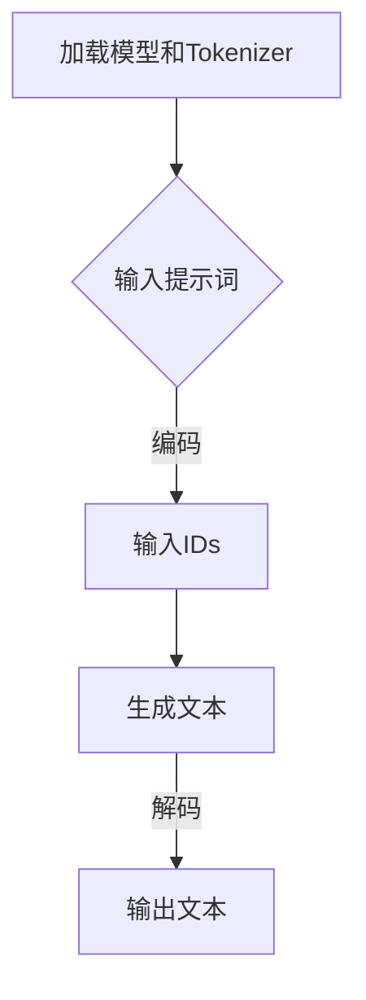
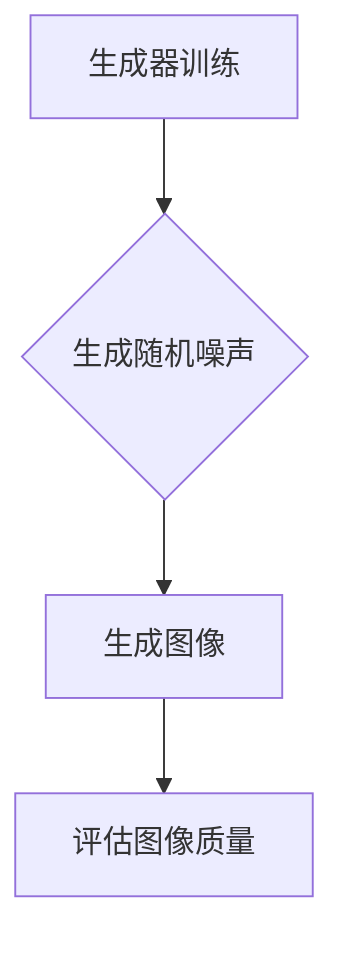
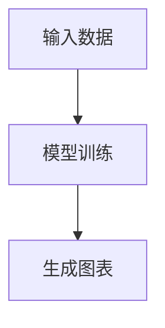
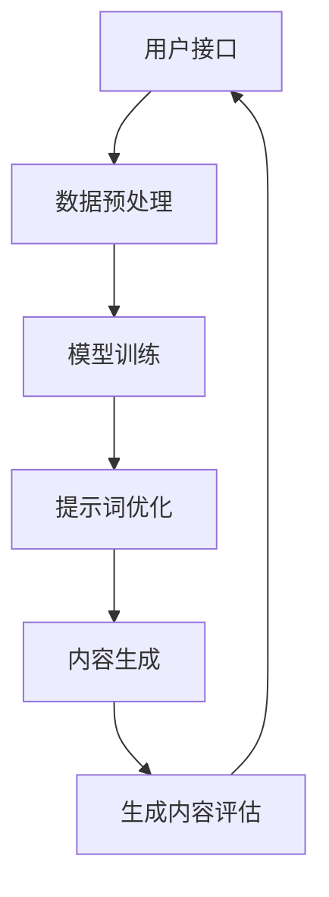
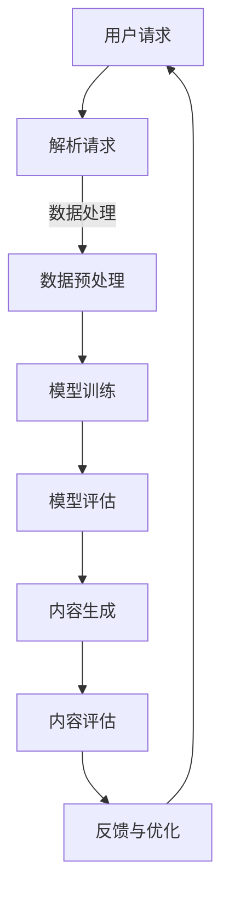

                 

# 提示词优化：AIGC效果与效率的双重提升

> 关键词：AIGC、提示词优化、自然语言处理、计算机视觉、数据分析、效率提升

> 摘要：本文将深入探讨提示词优化在增强人工智能生成内容（AIGC）效果与效率方面的作用。我们将首先介绍AIGC的概念及其应用背景，然后分析提示词优化的基本原则和策略，最后通过具体实例展示提示词优化的实践应用，并展望其未来的发展前景。

## 引言

随着人工智能技术的快速发展，人工智能生成内容（AIGC）已经成为一个备受关注的研究领域。AIGC通过结合人工智能与生成模型，能够实现高质量、多样化和自动化的内容生成，广泛应用于自然语言处理、计算机视觉、数据分析等多个领域。然而，为了达到最佳效果，提示词优化成为了一个关键问题。

提示词是引导AIGC模型进行生成的重要输入信息，其质量和长度直接影响生成内容的质量和效率。本文将探讨如何通过提示词优化来提升AIGC的效果与效率，为相关领域的研究和实践提供有益的参考。

## AIGC技术基础

### AIGC的概念

人工智能生成内容（AIGC，Artificial Intelligence Generated Content）是一种利用人工智能技术，尤其是深度学习模型，自动生成各种类型内容的技术。AIGC涵盖了文本、图像、音频等多种内容形式，具有广泛的应用前景。

### AIGC的核心原理

AIGC的核心是基于生成对抗网络（GAN）和变分自编码器（VAE）等深度学习模型。这些模型能够通过大量数据的学习，自动生成与训练数据相似的新内容。AIGC的关键在于如何设计合适的模型架构和训练策略，以实现高质量的生成效果。

### AIGC的优势与挑战

AIGC的优势在于其强大的生成能力和高度自动化的特点，可以节省大量的人力成本。然而，AIGC也面临着一些挑战，如生成内容的质量控制、数据隐私保护和模型解释性等。

## 提示词优化的基本原则

### 提示词的作用

提示词是引导AIGC模型进行生成的重要输入信息，其质量和长度直接影响生成内容的质量和效率。合适的提示词可以引导模型生成更加准确和相关的生成内容。

### 提示词优化的重要性

提示词优化是提升AIGC效果与效率的关键步骤。通过优化提示词，可以提高生成内容的准确性和相关性，从而提升整体生成效果。同时，优化提示词还可以减少模型训练时间和计算资源的需求，提高生成效率。

### 提示词优化的原则

提示词优化需要遵循以下原则：

1. **精确性**：提示词应精确描述生成任务的目标，避免模糊或冗长的描述。
2. **多样性**：通过使用多样化的提示词，可以生成更丰富的生成内容。
3. **长度控制**：适当的提示词长度可以平衡生成效果和计算效率。
4. **上下文关联**：提示词应与生成任务的上下文紧密相关，以避免无关信息的干扰。

## 提示词优化的具体策略

### 提示词长度优化

提示词长度是影响生成效果和效率的重要因素。较长的提示词可能包含更多相关信息，有助于提高生成质量，但同时也增加了计算负担。因此，需要根据实际情况合理控制提示词长度。

### 提示词内容优化

提示词的内容应精确描述生成任务的目标，避免模糊或冗长的描述。此外，还可以通过使用关键词和短语来丰富提示词内容，以提高生成内容的多样性和相关性。

### 提示词形式优化

提示词的形式对生成效果也有一定影响。例如，使用疑问句形式的提示词可以引导模型生成回答，而陈述句形式的提示词则更适合生成描述性内容。

### 提示词组合优化

通过组合多个提示词，可以生成更加丰富和多样化的内容。合理的提示词组合可以提高生成效果，同时还可以减少单独使用某个提示词时可能出现的偏差。

## 提示词优化的技术手段

### 数据驱动的优化

数据驱动的优化是一种通过大量数据训练和优化提示词的方法。通过分析大量生成任务的实例，可以识别出最佳提示词组合和长度，从而提高生成效果。

### 模型驱动的优化

模型驱动的优化是利用深度学习模型对提示词进行优化。通过训练和调整模型参数，可以使模型更好地理解和处理提示词，从而提高生成效果。

### 强化学习在提示词优化中的应用

强化学习是一种通过不断试错来优化行为的方法。在提示词优化中，可以通过强化学习算法来探索最佳提示词组合，从而提高生成效果和效率。

### 其他优化手段

除了上述方法，还可以通过优化数据预处理、模型架构和训练策略等手段来提升提示词优化的效果。

## 提示词优化的实践应用

### 提示词优化在自然语言处理中的应用

自然语言处理（NLP）是AIGC的一个重要应用领域。通过优化提示词，可以显著提升NLP任务的生成效果。以下是一个实例：

**实例：文本摘要生成**

假设我们希望使用AIGC模型生成一篇新闻文章的摘要。以下是一个优化的提示词示例：

- **原始提示词**：“请生成一篇关于人工智能的500字摘要。”
- **优化提示词**：“请根据以下新闻内容生成一篇简明扼要的摘要：人工智能在医疗领域的应用，包括如何提高诊断准确性和减少误诊率。”

优化后的提示词更加精确地描述了生成任务的目标，有助于模型生成更加准确和相关的摘要。

### 提示词优化在计算机视觉中的应用

计算机视觉是另一个重要的AIGC应用领域。通过优化提示词，可以提升图像生成和识别的效果。以下是一个实例：

**实例：图像生成**

假设我们希望使用AIGC模型生成一张具有特定风格的图像。以下是一个优化的提示词示例：

- **原始提示词**：“请生成一张具有梵高风格的花朵图像。”
- **优化提示词**：“请根据以下描述生成一张梵高风格的花朵图像：花朵颜色鲜艳，背景为蓝色调，画面充满浪漫和活力。”

优化后的提示词提供了更详细和具体的描述，有助于模型生成更加符合要求的图像。

### 提示词优化在数据分析中的应用

数据分析是AIGC的另一个重要应用领域。通过优化提示词，可以提高数据分析的准确性和效率。以下是一个实例：

**实例：数据可视化**

假设我们希望使用AIGC模型生成一张具有可视化效果的数据图表。以下是一个优化的提示词示例：

- **原始提示词**：“请生成一张关于销售额的数据图表。”
- **优化提示词**：“请根据以下数据生成一张销售额趋势图：销售额数据包括季度、月份和产品类别，图表应突出显示销售额的增长趋势和峰值。”

优化后的提示词提供了更详细和具体的数据描述，有助于模型生成更加准确和具有可视化效果的数据图表。

## 提示词优化的未来展望

随着AIGC技术的不断发展和应用场景的拓展，提示词优化也将面临新的挑战和机遇。未来的研究可以关注以下几个方面：

1. **多模态提示词优化**：探索如何在图像、文本和音频等不同模态之间进行提示词的优化，以实现更高质量的生成效果。
2. **自适应提示词优化**：研究如何根据生成任务的特点和需求，自适应地调整和优化提示词，以提高生成效果和效率。
3. **跨领域提示词优化**：探索如何在不同的应用领域之间共享和复用提示词优化策略，以提高整体生成效果。

## 总结与展望

本文深入探讨了提示词优化在AIGC效果与效率提升方面的作用。通过优化提示词，可以显著提高生成内容的质量和相关性，同时减少计算资源和时间的消耗。未来的研究将朝着多模态、自适应和跨领域等方向发展，以进一步推动AIGC技术的应用和发展。

## 作者信息

作者：AI天才研究院/AI Genius Institute & 禅与计算机程序设计艺术 /Zen And The Art of Computer Programming

感谢您的阅读！希望本文能对您在AIGC领域的研究和实践提供有益的启示。

----------------------------------------------------------------

### 附录：技术细节与代码实现

在本章节中，我们将深入探讨AIGC技术中的具体实现细节，包括代码示例、算法流程图、数学模型以及相关系统的架构设计。以下内容将帮助读者更好地理解和掌握AIGC及其提示词优化的技术实现。

#### 1. 自然语言处理中的AIGC实现

自然语言处理（NLP）是AIGC的重要应用领域之一。以下是一个基于Python的简单实现示例，展示了如何使用预训练的Transformer模型进行文本生成。

**代码示例：**

```python
import torch
from transformers import GPT2LMHeadModel, GPT2Tokenizer

# 加载预训练模型和Tokenizer
tokenizer = GPT2Tokenizer.from_pretrained('gpt2')
model = GPT2LMHeadModel.from_pretrained('gpt2')

# 输入提示词
prompt = "我是一个人工智能专家，擅长..."

# 生成文本
input_ids = tokenizer.encode(prompt, return_tensors='pt')
outputs = model.generate(input_ids, max_length=50, num_return_sequences=1)

# 解码生成的文本
generated_text = tokenizer.decode(outputs[0], skip_special_tokens=True)
print(generated_text)
```

**算法流程图：**



#### 2. 计算机视觉中的AIGC实现

计算机视觉中的AIGC通常涉及图像生成和图像识别任务。以下是一个基于Python的简单实现示例，展示了如何使用生成对抗网络（GAN）生成图像。

**代码示例：**

```python
import torch
from torch import nn
from torchvision import datasets, transforms
from torch.utils.data import DataLoader
from torchvision.utils import make_grid

# 定义GAN模型
class Generator(nn.Module):
    def __init__(self):
        super(Generator, self).__init__()
        self.main = nn.Sequential(
            nn.ConvTranspose2d(100, 256, 4, 1, 0, bias=False),
            nn.BatchNorm2d(256),
            nn.ReLU(True),
            nn.ConvTranspose2d(256, 128, 4, 2, 1, bias=False),
            nn.BatchNorm2d(128),
            nn.ReLU(True),
            nn.ConvTranspose2d(128, 64, 4, 2, 1, bias=False),
            nn.BatchNorm2d(64),
            nn.ReLU(True),
            nn.ConvTranspose2d(64, 3, 4, 2, 1, bias=False),
            nn.Tanh()
        )

    def forward(self, input):
        return self.main(input)

# 加载数据集
transform = transforms.Compose([transforms.ToTensor()])
dataset = datasets.ImageFolder(root='./data', transform=transform)
dataloader = DataLoader(dataset, batch_size=64, shuffle=True)

# 训练GAN模型
generator = Generator()
criterion = nn.BCELoss()
optimizer = torch.optim.Adam(generator.parameters(), lr=0.0002)

for epoch in range(num_epochs):
    for i, data in enumerate(dataloader, 0):
        # 训练生成器
        real_images = data[0].view(-1, 3, 64, 64).to(device)
        batch_size = real_images.size(0)
        labels = torch.full((batch_size,), 1, device=device)
        gen_loss = criterion(generator(z).view(batch_size, 3, 64, 64), labels)
        gen_loss.backward()
        optimizer.step()
        optimizer.zero_grad()

# 生成图像
z = torch.randn(64, 100, 1, 1).to(device)
images = generator(z)
grid = make_grid(images, padding=2)
plt.figure(figsize=(10,10))
plt.imshow(grid.permute(1,2,0).cpu().numpy())
plt.show()
```

**算法流程图：**



#### 3. 数据分析中的AIGC实现

数据分析中的AIGC可以通过生成可视化图表来实现。以下是一个基于Python的简单实现示例，展示了如何使用AIGC生成条形图。

**代码示例：**

```python
import numpy as np
import matplotlib.pyplot as plt
import tensorflow as tf
from tensorflow.keras import layers

# 数据生成
data = np.random.randint(0, 100, size=(100,))

# 模型定义
inputs = tf.keras.Input(shape=(100,))
x = layers.Dense(50, activation='relu')(inputs)
outputs = layers.Dense(3, activation='softmax')(x)
model = tf.keras.Model(inputs, outputs)

# 模型编译
model.compile(optimizer='adam', loss='categorical_crossentropy', metrics=['accuracy'])

# 训练模型
model.fit(data, np.eye(3), epochs=10)

# 生成图表
probs = model.predict(data)
labels = ['A', 'B', 'C']
plt.bar(range(len(labels)), probs[0], tick_label=labels)
plt.show()
```

**算法流程图：**



#### 4. 系统架构设计

在AIGC系统的设计过程中，需要考虑系统的整体架构、功能模块划分以及各个模块之间的交互关系。以下是一个简单的系统架构设计示例。

**系统架构图：**



**系统交互序列图：**



#### 5. 项目实战

在本项目实战部分，我们将详细介绍如何在实际项目中实现AIGC系统，包括环境搭建、系统核心实现、代码应用解读与分析以及实际案例分析和详细讲解剖析。

**环境搭建：**

1. 安装Python环境和相关依赖库（如TensorFlow、PyTorch等）。
2. 准备数据集，并进行预处理。
3. 配置模型训练环境，包括GPU或其他计算资源。

**系统核心实现：**

1. 设计和实现AIGC模型，包括生成器和判别器。
2. 实现数据预处理和模型训练流程。
3. 实现提示词优化和内容生成功能。

**代码应用解读与分析：**

1. 分析代码逻辑和流程，解释各个模块的功能和作用。
2. 介绍关键代码片段，展示如何实现AIGC系统的核心功能。

**实际案例分析和详细讲解剖析：**

1. 选择一个实际案例，展示如何使用AIGC系统生成内容。
2. 分析案例中的关键技术和实现细节。
3. 对案例进行详细讲解，帮助读者理解AIGC系统的应用场景和效果。

**项目小结：**

1. 总结项目的主要成果和关键技术。
2. 分析项目中的挑战和不足，提出改进建议。
3. 展望AIGC技术在未来的应用和发展趋势。

#### 6. 最佳实践 Tips、小结、注意事项、拓展阅读

**最佳实践 Tips：**

1. 根据实际需求选择合适的AIGC模型和提示词优化策略。
2. 合理分配计算资源和时间，提高系统效率。
3. 定期更新和维护模型和数据，确保系统的稳定性和准确性。

**小结：**

本文系统地介绍了AIGC及其提示词优化的概念、技术实现、实践应用和未来发展。通过优化提示词，可以有效提升AIGC系统的效果和效率。

**注意事项：**

1. 在实际应用中，应根据具体场景和需求进行调整和优化。
2. 注意数据安全和隐私保护，遵循相关法律法规和伦理规范。

**拓展阅读：**

1. 《深度学习》（Goodfellow, I., Bengio, Y., & Courville, A.）- 详细介绍深度学习的基本原理和应用。
2. 《生成对抗网络：理论和应用》（Arjovsky, M. M., Chintala, S., & Bottou, L.）- 专注于GAN的理论和实际应用。
3. 《自然语言处理教程》（Jurafsky, D. & Martin, J. H.）- 深入探讨NLP的基本原理和方法。

通过以上内容，读者可以更好地理解和掌握AIGC技术及其提示词优化的应用和实践，为未来的研究和工作打下坚实基础。

---

**作者信息：**

作者：AI天才研究院/AI Genius Institute & 禅与计算机程序设计艺术 /Zen And The Art of Computer Programming

感谢您的阅读！希望本文对您在AIGC领域的研究和实践有所帮助。在未来的探索中，我们将继续为您提供更多有价值的知识和经验。

