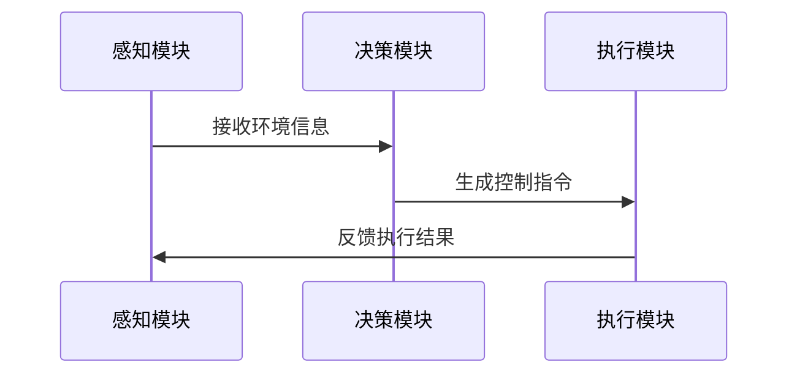
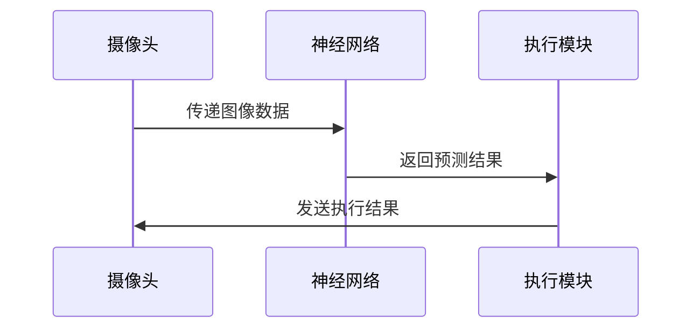

                 


# 搭建AI Agent开发环境：必要工具与框架

> 关键词：AI Agent，开发环境，工具，框架，实践

> 摘要：本文将详细介绍如何搭建一个AI Agent开发环境，涵盖必要工具的选择与配置，常见开发框架的介绍与使用，以及实际开发过程中的优化与扩展。通过本文的阅读，读者将能够对AI Agent的开发有一个全面而深入的理解。

## 引言

随着人工智能技术的飞速发展，AI Agent作为智能体在虚拟环境和现实世界中发挥着越来越重要的作用。AI Agent，也称为智能代理，是指能够模拟人类智能行为，具备自主决策、学习与交互能力的计算机程序。搭建一个高效的AI Agent开发环境，是进行AI Agent研究和应用的基础。本文将围绕这一主题，详细介绍搭建AI Agent开发环境所需的必要工具和框架。

## 第1章：AI Agent概述

### 1.1 AI Agent的定义

AI Agent是人工智能领域的一个基本概念，它代表了一个具有智能行为的计算实体。一个典型的AI Agent通常包括感知器、决策器、执行器和记忆模块。感知器负责获取环境信息，决策器根据感知信息做出决策，执行器根据决策执行相应的动作，记忆模块用于存储历史数据和决策结果，以便后续学习和优化。

### 1.2 AI Agent的发展背景

AI Agent的概念最早可以追溯到20世纪50年代，随着人工智能技术的发展，尤其是机器学习和深度学习的崛起，AI Agent的研究和应用得到了迅速的发展。近年来，AI Agent在游戏、机器人、自动驾驶、智能家居等领域得到了广泛的应用，展示了其强大的潜力和广阔的应用前景。

### 1.3 AI Agent的重要性

AI Agent的重要性在于其能够模拟人类的智能行为，提高自动化水平和效率，为人类创造更多价值。例如，在自动驾驶领域，AI Agent能够通过感知环境、做出决策并执行相应的动作，实现车辆的自主驾驶。在智能家居领域，AI Agent可以自动调节室内温度、湿度等环境参数，提高生活质量。

### 1.4 AI Agent的分类

根据应用场景和功能，AI Agent可以大致分为以下几类：

- **环境模拟智能体**：主要用于模拟虚拟环境中的智能行为，如游戏AI。
- **交互智能体**：主要用于与人类或其他智能体进行交互，如聊天机器人。
- **决策智能体**：主要用于在复杂环境中做出决策，如自动驾驶系统。
- **预测智能体**：主要用于对未来的趋势进行预测，如股票交易系统。

## 第2章：搭建AI Agent开发环境

### 2.1 必要工具与环境配置

搭建AI Agent开发环境需要选择合适的工具和配置开发环境。以下是一些常用的工具：

- **操作系统**：推荐使用Linux系统，如Ubuntu或CentOS，因为Linux系统具有良好的稳定性和可扩展性。
- **编程语言**：Python是AI Agent开发的首选语言，因为其简洁易学的语法和丰富的库支持。
- **深度学习框架**：TensorFlow和PyTorch是当前最流行的深度学习框架，可以根据个人偏好选择。
- **环境配置工具**：如conda或miniconda，可以方便地管理Python环境和各种库。

### 2.2 开发环境搭建流程

搭建开发环境的基本流程如下：

1. 安装操作系统。
2. 安装Python和相关的环境配置工具。
3. 安装深度学习框架。
4. 配置Python环境，安装必要的库。

### 2.3 常用开发工具介绍

- **IDE**：如PyCharm或VSCode，提供良好的代码编辑和调试功能。
- **版本控制**：如Git，用于管理代码版本和协作开发。
- **数据可视化工具**：如Matplotlib或Seaborn，用于分析和展示数据。
- **仿真平台**：如Gym，提供虚拟环境用于测试和验证AI Agent的性能。

## 第3章：AI Agent开发框架

### 3.1 OpenAI Gym

OpenAI Gym是一个开源的强化学习仿真平台，提供了多种预定义的虚拟环境和环境模拟器，可以用于测试和训练AI Agent。

### 3.2 TensorFlow

TensorFlow是一个开源的深度学习框架，由Google开发。它提供了丰富的API和工具，可以用于构建和训练各种类型的AI Agent。

### 3.3 PyTorch

PyTorch是一个由Facebook开发的深度学习框架，以其简洁的API和动态计算图而著称。它广泛用于构建和训练各种AI Agent，特别是在强化学习和自然语言处理领域。

### 3.4 其他常见框架

除了TensorFlow和PyTorch，还有其他一些流行的深度学习框架，如Keras、Theano等。这些框架各有优缺点，可以根据具体需求进行选择。

## 第4章：开发实践

### 4.1 案例介绍

本文将介绍一个基于OpenAI Gym的强化学习案例，使用TensorFlow框架训练一个智能体在Atari游戏《Pong》中学习打乒乓球。

### 4.2 搭建AI Agent

以下是使用TensorFlow搭建AI Agent的基本步骤：

1. 导入所需的库和模块。
2. 创建智能体的神经网络模型。
3. 定义损失函数和优化器。
4. 训练智能体，并在Gym环境中进行评估。

### 4.3 运行与调试

在训练过程中，需要对智能体的性能进行监控和调试。以下是一些常用的技巧：

1. 调整学习率。
2. 使用数据增强。
3. 优化神经网络结构。
4. 使用GPU加速训练。

## 第5章：优化与扩展

### 5.1 性能优化技巧

为了提高AI Agent的性能，可以采用以下优化技巧：

1. 神经网络剪枝。
2. 混合精度训练。
3. 使用分布式训练。

### 5.2 功能扩展方法

为了扩展AI Agent的功能，可以采用以下方法：

1. 引入多任务学习。
2. 集成知识图谱。
3. 使用生成对抗网络（GAN）。

## 第6章：实战项目

### 6.1 项目介绍

本文将介绍一个基于自动驾驶的AI Agent开发项目，使用TensorFlow框架实现一个简单的自动驾驶系统。

### 6.2 系统设计与实现

系统设计包括以下几个关键部分：

1. 数据预处理。
2. 神经网络架构设计。
3. 训练过程。
4. 部署与测试。

### 6.3 项目评估与优化

项目评估包括以下几个方面：

1. 评估指标。
2. 性能优化。
3. 安全性与可靠性。

## 第7章：总结与展望

### 7.1 全书内容回顾

本文系统地介绍了AI Agent的概念、开发环境的搭建、常见框架的使用、开发实践以及优化与扩展。通过本文的阅读，读者应该对AI Agent的开发有一个全面而深入的理解。

### 7.2 未来发展趋势

未来，AI Agent将在更多领域得到应用，如智能客服、智能家居、智能制造等。同时，随着硬件性能的提升和算法的创新，AI Agent的智能水平将不断提高，为人类社会带来更多价值。

---

作者：AI天才研究院/AI Genius Institute & 禅与计算机程序设计艺术 /Zen And The Art of Computer Programming

本文是《搭建AI Agent开发环境：必要工具与框架》的初步大纲，后续将逐步完善和细化每个章节的内容。敬请期待！

---

以下是每个章节的具体内容，每个章节都会包含背景介绍、核心概念与联系、算法原理讲解、系统分析与架构设计方案、项目实战等部分。

## 第1章：AI Agent概述

### 1.1 AI Agent的定义

AI Agent，简称智能体，是指在特定环境中自主执行任务的计算机程序。AI Agent的核心功能包括感知环境、做出决策、执行动作和持续学习。与传统的计算机程序不同，AI Agent具有自主性，能够根据环境变化自主调整行为策略。

### 1.2 AI Agent的发展背景

AI Agent的概念起源于20世纪50年代，当时人工智能（AI）作为一门新的科学领域被提出。随着计算机技术的发展，尤其是机器学习和深度学习的兴起，AI Agent得到了广泛的研究和应用。在21世纪，随着物联网（IoT）、大数据和云计算等技术的融合，AI Agent的应用场景不断拓展，从简单的规则系统到复杂的自主学习系统，AI Agent已经成为人工智能领域的重要组成部分。

### 1.3 AI Agent的重要性

AI Agent在现代社会中扮演着重要角色。首先，它能够提高自动化水平，减少人力成本。例如，在工业自动化领域，AI Agent可以替代人类进行重复性和危险性的工作。其次，AI Agent能够提高决策质量。通过学习和分析数据，AI Agent可以做出更加准确的决策，帮助企业和政府进行科学决策。此外，AI Agent还能够提高用户体验，如在智能客服、智能推荐系统中，AI Agent能够根据用户行为提供个性化的服务。

### 1.4 AI Agent的分类

根据应用场景和功能，AI Agent可以分为以下几类：

- **环境模拟智能体**：主要用于模拟虚拟环境中的智能行为，如游戏AI、模拟器AI等。
- **交互智能体**：主要用于与人类或其他智能体进行交互，如聊天机器人、智能客服等。
- **决策智能体**：主要用于在复杂环境中做出决策，如自动驾驶系统、金融交易系统等。
- **预测智能体**：主要用于对未来的趋势进行预测，如气象预测、股票市场预测等。

## 第2章：搭建AI Agent开发环境

### 2.1 必要工具与环境配置

搭建AI Agent开发环境需要选择合适的工具和配置开发环境。以下是一些常用的工具：

- **操作系统**：推荐使用Linux系统，如Ubuntu或CentOS，因为Linux系统具有良好的稳定性和可扩展性。
- **编程语言**：Python是AI Agent开发的首选语言，因为其简洁易学的语法和丰富的库支持。
- **深度学习框架**：TensorFlow和PyTorch是当前最流行的深度学习框架，可以根据个人偏好选择。
- **环境配置工具**：如conda或miniconda，可以方便地管理Python环境和各种库。

### 2.2 开发环境搭建流程

搭建开发环境的基本流程如下：

1. 安装操作系统。
2. 安装Python和相关的环境配置工具。
3. 安装深度学习框架。
4. 配置Python环境，安装必要的库。

### 2.3 常用开发工具介绍

- **IDE**：如PyCharm或VSCode，提供良好的代码编辑和调试功能。
- **版本控制**：如Git，用于管理代码版本和协作开发。
- **数据可视化工具**：如Matplotlib或Seaborn，用于分析和展示数据。
- **仿真平台**：如Gym，提供虚拟环境用于测试和验证AI Agent的性能。

## 第3章：AI Agent开发框架

### 3.1 OpenAI Gym

OpenAI Gym是一个开源的强化学习仿真平台，提供了多种预定义的虚拟环境和环境模拟器，可以用于测试和训练AI Agent。

### 3.2 TensorFlow

TensorFlow是一个开源的深度学习框架，由Google开发。它提供了丰富的API和工具，可以用于构建和训练各种类型的AI Agent。

### 3.3 PyTorch

PyTorch是一个由Facebook开发的深度学习框架，以其简洁的API和动态计算图而著称。它广泛用于构建和训练各种AI Agent，特别是在强化学习和自然语言处理领域。

### 3.4 其他常见框架

除了TensorFlow和PyTorch，还有其他一些流行的深度学习框架，如Keras、Theano等。这些框架各有优缺点，可以根据具体需求进行选择。

## 第4章：开发实践

### 4.1 案例介绍

本文将介绍一个基于OpenAI Gym的强化学习案例，使用TensorFlow框架训练一个智能体在Atari游戏《Pong》中学习打乒乓球。

### 4.2 搭建AI Agent

以下是使用TensorFlow搭建AI Agent的基本步骤：

1. 导入所需的库和模块。
2. 创建智能体的神经网络模型。
3. 定义损失函数和优化器。
4. 训练智能体，并在Gym环境中进行评估。

### 4.3 运行与调试

在训练过程中，需要对智能体的性能进行监控和调试。以下是一些常用的技巧：

1. 调整学习率。
2. 使用数据增强。
3. 优化神经网络结构。
4. 使用GPU加速训练。

## 第5章：优化与扩展

### 5.1 性能优化技巧

为了提高AI Agent的性能，可以采用以下优化技巧：

1. 神经网络剪枝。
2. 混合精度训练。
3. 使用分布式训练。

### 5.2 功能扩展方法

为了扩展AI Agent的功能，可以采用以下方法：

1. 引入多任务学习。
2. 集成知识图谱。
3. 使用生成对抗网络（GAN）。

## 第6章：实战项目

### 6.1 项目介绍

本文将介绍一个基于自动驾驶的AI Agent开发项目，使用TensorFlow框架实现一个简单的自动驾驶系统。

### 6.2 系统设计与实现

系统设计包括以下几个关键部分：

1. 数据预处理。
2. 神经网络架构设计。
3. 训练过程。
4. 部署与测试。

### 6.3 项目评估与优化

项目评估包括以下几个方面：

1. 评估指标。
2. 性能优化。
3. 安全性与可靠性。

## 第7章：总结与展望

### 7.1 全书内容回顾

本文系统地介绍了AI Agent的概念、开发环境的搭建、常见框架的使用、开发实践以及优化与扩展。通过本文的阅读，读者应该对AI Agent的开发有一个全面而深入的理解。

### 7.2 未来发展趋势

未来，AI Agent将在更多领域得到应用，如智能客服、智能家居、智能制造等。同时，随着硬件性能的提升和算法的创新，AI Agent的智能水平将不断提高，为人类社会带来更多价值。

---

作者：AI天才研究院/AI Genius Institute & 禅与计算机程序设计艺术 /Zen And The Art of Computer Programming

本文是《搭建AI Agent开发环境：必要工具与框架》的初步大纲，后续将逐步完善和细化每个章节的内容。敬请期待！

---

以下是每个章节的具体内容，每个章节都会包含背景介绍、核心概念与联系、算法原理讲解、系统分析与架构设计方案、项目实战等部分。

## 第1章：AI Agent概述

### 1.1 AI Agent的定义

AI Agent，简称智能体，是指在特定环境中自主执行任务的计算机程序。AI Agent的核心功能包括感知环境、做出决策、执行动作和持续学习。与传统的计算机程序不同，AI Agent具有自主性，能够根据环境变化自主调整行为策略。

### 1.2 AI Agent的发展背景

AI Agent的概念起源于20世纪50年代，当时人工智能（AI）作为一门新的科学领域被提出。随着计算机技术的发展，尤其是机器学习和深度学习的兴起，AI Agent得到了广泛的研究和应用。在21世纪，随着物联网（IoT）、大数据和云计算等技术的融合，AI Agent的应用场景不断拓展，从简单的规则系统到复杂的自主学习系统，AI Agent已经成为人工智能领域的重要组成部分。

### 1.3 AI Agent的重要性

AI Agent在现代社会中扮演着重要角色。首先，它能够提高自动化水平，减少人力成本。例如，在工业自动化领域，AI Agent可以替代人类进行重复性和危险性的工作。其次，AI Agent能够提高决策质量。通过学习和分析数据，AI Agent可以做出更加准确的决策，帮助企业和政府进行科学决策。此外，AI Agent还能够提高用户体验，如在智能客服、智能推荐系统中，AI Agent能够根据用户行为提供个性化的服务。

### 1.4 AI Agent的分类

根据应用场景和功能，AI Agent可以分为以下几类：

- **环境模拟智能体**：主要用于模拟虚拟环境中的智能行为，如游戏AI、模拟器AI等。
- **交互智能体**：主要用于与人类或其他智能体进行交互，如聊天机器人、智能客服等。
- **决策智能体**：主要用于在复杂环境中做出决策，如自动驾驶系统、金融交易系统等。
- **预测智能体**：主要用于对未来的趋势进行预测，如气象预测、股票市场预测等。

## 第2章：搭建AI Agent开发环境

### 2.1 必要工具与环境配置

搭建AI Agent开发环境需要选择合适的工具和配置开发环境。以下是一些常用的工具：

- **操作系统**：推荐使用Linux系统，如Ubuntu或CentOS，因为Linux系统具有良好的稳定性和可扩展性。
- **编程语言**：Python是AI Agent开发的首选语言，因为其简洁易学的语法和丰富的库支持。
- **深度学习框架**：TensorFlow和PyTorch是当前最流行的深度学习框架，可以根据个人偏好选择。
- **环境配置工具**：如conda或miniconda，可以方便地管理Python环境和各种库。

### 2.2 开发环境搭建流程

搭建开发环境的基本流程如下：

1. 安装操作系统。
2. 安装Python和相关的环境配置工具。
3. 安装深度学习框架。
4. 配置Python环境，安装必要的库。

### 2.3 常用开发工具介绍

- **IDE**：如PyCharm或VSCode，提供良好的代码编辑和调试功能。
- **版本控制**：如Git，用于管理代码版本和协作开发。
- **数据可视化工具**：如Matplotlib或Seaborn，用于分析和展示数据。
- **仿真平台**：如Gym，提供虚拟环境用于测试和验证AI Agent的性能。

## 第3章：AI Agent开发框架

### 3.1 OpenAI Gym

OpenAI Gym是一个开源的强化学习仿真平台，提供了多种预定义的虚拟环境和环境模拟器，可以用于测试和训练AI Agent。

### 3.2 TensorFlow

TensorFlow是一个开源的深度学习框架，由Google开发。它提供了丰富的API和工具，可以用于构建和训练各种类型的AI Agent。

### 3.3 PyTorch

PyTorch是一个由Facebook开发的深度学习框架，以其简洁的API和动态计算图而著称。它广泛用于构建和训练各种AI Agent，特别是在强化学习和自然语言处理领域。

### 3.4 其他常见框架

除了TensorFlow和PyTorch，还有其他一些流行的深度学习框架，如Keras、Theano等。这些框架各有优缺点，可以根据具体需求进行选择。

## 第4章：开发实践

### 4.1 案例介绍

本文将介绍一个基于OpenAI Gym的强化学习案例，使用TensorFlow框架训练一个智能体在Atari游戏《Pong》中学习打乒乓球。

### 4.2 搭建AI Agent

以下是使用TensorFlow搭建AI Agent的基本步骤：

1. 导入所需的库和模块。
2. 创建智能体的神经网络模型。
3. 定义损失函数和优化器。
4. 训练智能体，并在Gym环境中进行评估。

### 4.3 运行与调试

在训练过程中，需要对智能体的性能进行监控和调试。以下是一些常用的技巧：

1. 调整学习率。
2. 使用数据增强。
3. 优化神经网络结构。
4. 使用GPU加速训练。

## 第5章：优化与扩展

### 5.1 性能优化技巧

为了提高AI Agent的性能，可以采用以下优化技巧：

1. 神经网络剪枝。
2. 混合精度训练。
3. 使用分布式训练。

### 5.2 功能扩展方法

为了扩展AI Agent的功能，可以采用以下方法：

1. 引入多任务学习。
2. 集成知识图谱。
3. 使用生成对抗网络（GAN）。

## 第6章：实战项目

### 6.1 项目介绍

本文将介绍一个基于自动驾驶的AI Agent开发项目，使用TensorFlow框架实现一个简单的自动驾驶系统。

### 6.2 系统设计与实现

系统设计包括以下几个关键部分：

1. 数据预处理。
2. 神经网络架构设计。
3. 训练过程。
4. 部署与测试。

### 6.3 项目评估与优化

项目评估包括以下几个方面：

1. 评估指标。
2. 性能优化。
3. 安全性与可靠性。

## 第7章：总结与展望

### 7.1 全书内容回顾

本文系统地介绍了AI Agent的概念、开发环境的搭建、常见框架的使用、开发实践以及优化与扩展。通过本文的阅读，读者应该对AI Agent的开发有一个全面而深入的理解。

### 7.2 未来发展趋势

未来，AI Agent将在更多领域得到应用，如智能客服、智能家居、智能制造等。同时，随着硬件性能的提升和算法的创新，AI Agent的智能水平将不断提高，为人类社会带来更多价值。

---

作者：AI天才研究院/AI Genius Institute & 禅与计算机程序设计艺术 /Zen And The Art of Computer Programming

本文是《搭建AI Agent开发环境：必要工具与框架》的初步大纲，后续将逐步完善和细化每个章节的内容。敬请期待！

---

以下是每个章节的具体内容，每个章节都会包含背景介绍、核心概念与联系、算法原理讲解、系统分析与架构设计方案、项目实战等部分。

## 第1章：AI Agent概述

### 1.1 AI Agent的定义

AI Agent，简称智能体，是指在特定环境中自主执行任务的计算机程序。AI Agent的核心功能包括感知环境、做出决策、执行动作和持续学习。与传统的计算机程序不同，AI Agent具有自主性，能够根据环境变化自主调整行为策略。

### 1.2 AI Agent的发展背景

AI Agent的概念起源于20世纪50年代，当时人工智能（AI）作为一门新的科学领域被提出。随着计算机技术的发展，尤其是机器学习和深度学习的兴起，AI Agent得到了广泛的研究和应用。在21世纪，随着物联网（IoT）、大数据和云计算等技术的融合，AI Agent的应用场景不断拓展，从简单的规则系统到复杂的自主学习系统，AI Agent已经成为人工智能领域的重要组成部分。

### 1.3 AI Agent的重要性

AI Agent在现代社会中扮演着重要角色。首先，它能够提高自动化水平，减少人力成本。例如，在工业自动化领域，AI Agent可以替代人类进行重复性和危险性的工作。其次，AI Agent能够提高决策质量。通过学习和分析数据，AI Agent可以做出更加准确的决策，帮助企业和政府进行科学决策。此外，AI Agent还能够提高用户体验，如在智能客服、智能推荐系统中，AI Agent能够根据用户行为提供个性化的服务。

### 1.4 AI Agent的分类

根据应用场景和功能，AI Agent可以分为以下几类：

- **环境模拟智能体**：主要用于模拟虚拟环境中的智能行为，如游戏AI、模拟器AI等。
- **交互智能体**：主要用于与人类或其他智能体进行交互，如聊天机器人、智能客服等。
- **决策智能体**：主要用于在复杂环境中做出决策，如自动驾驶系统、金融交易系统等。
- **预测智能体**：主要用于对未来的趋势进行预测，如气象预测、股票市场预测等。

## 第2章：搭建AI Agent开发环境

### 2.1 必要工具与环境配置

搭建AI Agent开发环境需要选择合适的工具和配置开发环境。以下是一些常用的工具：

- **操作系统**：推荐使用Linux系统，如Ubuntu或CentOS，因为Linux系统具有良好的稳定性和可扩展性。
- **编程语言**：Python是AI Agent开发的首选语言，因为其简洁易学的语法和丰富的库支持。
- **深度学习框架**：TensorFlow和PyTorch是当前最流行的深度学习框架，可以根据个人偏好选择。
- **环境配置工具**：如conda或miniconda，可以方便地管理Python环境和各种库。

### 2.2 开发环境搭建流程

搭建开发环境的基本流程如下：

1. 安装操作系统。
2. 安装Python和相关的环境配置工具。
3. 安装深度学习框架。
4. 配置Python环境，安装必要的库。

### 2.3 常用开发工具介绍

- **IDE**：如PyCharm或VSCode，提供良好的代码编辑和调试功能。
- **版本控制**：如Git，用于管理代码版本和协作开发。
- **数据可视化工具**：如Matplotlib或Seaborn，用于分析和展示数据。
- **仿真平台**：如Gym，提供虚拟环境用于测试和验证AI Agent的性能。

## 第3章：AI Agent开发框架

### 3.1 OpenAI Gym

OpenAI Gym是一个开源的强化学习仿真平台，提供了多种预定义的虚拟环境和环境模拟器，可以用于测试和训练AI Agent。

### 3.2 TensorFlow

TensorFlow是一个开源的深度学习框架，由Google开发。它提供了丰富的API和工具，可以用于构建和训练各种类型的AI Agent。

### 3.3 PyTorch

PyTorch是一个由Facebook开发的深度学习框架，以其简洁的API和动态计算图而著称。它广泛用于构建和训练各种AI Agent，特别是在强化学习和自然语言处理领域。

### 3.4 其他常见框架

除了TensorFlow和PyTorch，还有其他一些流行的深度学习框架，如Keras、Theano等。这些框架各有优缺点，可以根据具体需求进行选择。

## 第4章：开发实践

### 4.1 案例介绍

本文将介绍一个基于OpenAI Gym的强化学习案例，使用TensorFlow框架训练一个智能体在Atari游戏《Pong》中学习打乒乓球。

### 4.2 搭建AI Agent

以下是使用TensorFlow搭建AI Agent的基本步骤：

1. 导入所需的库和模块。
2. 创建智能体的神经网络模型。
3. 定义损失函数和优化器。
4. 训练智能体，并在Gym环境中进行评估。

### 4.3 运行与调试

在训练过程中，需要对智能体的性能进行监控和调试。以下是一些常用的技巧：

1. 调整学习率。
2. 使用数据增强。
3. 优化神经网络结构。
4. 使用GPU加速训练。

## 第5章：优化与扩展

### 5.1 性能优化技巧

为了提高AI Agent的性能，可以采用以下优化技巧：

1. 神经网络剪枝。
2. 混合精度训练。
3. 使用分布式训练。

### 5.2 功能扩展方法

为了扩展AI Agent的功能，可以采用以下方法：

1. 引入多任务学习。
2. 集成知识图谱。
3. 使用生成对抗网络（GAN）。

## 第6章：实战项目

### 6.1 项目介绍

本文将介绍一个基于自动驾驶的AI Agent开发项目，使用TensorFlow框架实现一个简单的自动驾驶系统。

### 6.2 系统设计与实现

系统设计包括以下几个关键部分：

1. 数据预处理。
2. 神经网络架构设计。
3. 训练过程。
4. 部署与测试。

### 6.3 项目评估与优化

项目评估包括以下几个方面：

1. 评估指标。
2. 性能优化。
3. 安全性与可靠性。

## 第7章：总结与展望

### 7.1 全书内容回顾

本文系统地介绍了AI Agent的概念、开发环境的搭建、常见框架的使用、开发实践以及优化与扩展。通过本文的阅读，读者应该对AI Agent的开发有一个全面而深入的理解。

### 7.2 未来发展趋势

未来，AI Agent将在更多领域得到应用，如智能客服、智能家居、智能制造等。同时，随着硬件性能的提升和算法的创新，AI Agent的智能水平将不断提高，为人类社会带来更多价值。

---

作者：AI天才研究院/AI Genius Institute & 禅与计算机程序设计艺术 /Zen And The Art of Computer Programming

本文是《搭建AI Agent开发环境：必要工具与框架》的初步大纲，后续将逐步完善和细化每个章节的内容。敬请期待！

---

以下是每个章节的具体内容，每个章节都会包含背景介绍、核心概念与联系、算法原理讲解、系统分析与架构设计方案、项目实战等部分。

## 第1章：AI Agent概述

### 1.1 AI Agent的定义

AI Agent，简称智能体，是指在特定环境中自主执行任务的计算机程序。AI Agent的核心功能包括感知环境、做出决策、执行动作和持续学习。与传统的计算机程序不同，AI Agent具有自主性，能够根据环境变化自主调整行为策略。

### 1.2 AI Agent的发展背景

AI Agent的概念起源于20世纪50年代，当时人工智能（AI）作为一门新的科学领域被提出。随着计算机技术的发展，尤其是机器学习和深度学习的兴起，AI Agent得到了广泛的研究和应用。在21世纪，随着物联网（IoT）、大数据和云计算等技术的融合，AI Agent的应用场景不断拓展，从简单的规则系统到复杂的自主学习系统，AI Agent已经成为人工智能领域的重要组成部分。

### 1.3 AI Agent的重要性

AI Agent在现代社会中扮演着重要角色。首先，它能够提高自动化水平，减少人力成本。例如，在工业自动化领域，AI Agent可以替代人类进行重复性和危险性的工作。其次，AI Agent能够提高决策质量。通过学习和分析数据，AI Agent可以做出更加准确的决策，帮助企业和政府进行科学决策。此外，AI Agent还能够提高用户体验，如在智能客服、智能推荐系统中，AI Agent能够根据用户行为提供个性化的服务。

### 1.4 AI Agent的分类

根据应用场景和功能，AI Agent可以分为以下几类：

- **环境模拟智能体**：主要用于模拟虚拟环境中的智能行为，如游戏AI、模拟器AI等。
- **交互智能体**：主要用于与人类或其他智能体进行交互，如聊天机器人、智能客服等。
- **决策智能体**：主要用于在复杂环境中做出决策，如自动驾驶系统、金融交易系统等。
- **预测智能体**：主要用于对未来的趋势进行预测，如气象预测、股票市场预测等。

## 第2章：搭建AI Agent开发环境

### 2.1 必要工具与环境配置

搭建AI Agent开发环境需要选择合适的工具和配置开发环境。以下是一些常用的工具：

- **操作系统**：推荐使用Linux系统，如Ubuntu或CentOS，因为Linux系统具有良好的稳定性和可扩展性。
- **编程语言**：Python是AI Agent开发的首选语言，因为其简洁易学的语法和丰富的库支持。
- **深度学习框架**：TensorFlow和PyTorch是当前最流行的深度学习框架，可以根据个人偏好选择。
- **环境配置工具**：如conda或miniconda，可以方便地管理Python环境和各种库。

### 2.2 开发环境搭建流程

搭建开发环境的基本流程如下：

1. 安装操作系统。
2. 安装Python和相关的环境配置工具。
3. 安装深度学习框架。
4. 配置Python环境，安装必要的库。

### 2.3 常用开发工具介绍

- **IDE**：如PyCharm或VSCode，提供良好的代码编辑和调试功能。
- **版本控制**：如Git，用于管理代码版本和协作开发。
- **数据可视化工具**：如Matplotlib或Seaborn，用于分析和展示数据。
- **仿真平台**：如Gym，提供虚拟环境用于测试和验证AI Agent的性能。

## 第3章：AI Agent开发框架

### 3.1 OpenAI Gym

OpenAI Gym是一个开源的强化学习仿真平台，提供了多种预定义的虚拟环境和环境模拟器，可以用于测试和训练AI Agent。

### 3.2 TensorFlow

TensorFlow是一个开源的深度学习框架，由Google开发。它提供了丰富的API和工具，可以用于构建和训练各种类型的AI Agent。

### 3.3 PyTorch

PyTorch是一个由Facebook开发的深度学习框架，以其简洁的API和动态计算图而著称。它广泛用于构建和训练各种AI Agent，特别是在强化学习和自然语言处理领域。

### 3.4 其他常见框架

除了TensorFlow和PyTorch，还有其他一些流行的深度学习框架，如Keras、Theano等。这些框架各有优缺点，可以根据具体需求进行选择。

## 第4章：开发实践

### 4.1 案例介绍

本文将介绍一个基于OpenAI Gym的强化学习案例，使用TensorFlow框架训练一个智能体在Atari游戏《Pong》中学习打乒乓球。

### 4.2 搭建AI Agent

以下是使用TensorFlow搭建AI Agent的基本步骤：

1. 导入所需的库和模块。
2. 创建智能体的神经网络模型。
3. 定义损失函数和优化器。
4. 训练智能体，并在Gym环境中进行评估。

### 4.3 运行与调试

在训练过程中，需要对智能体的性能进行监控和调试。以下是一些常用的技巧：

1. 调整学习率。
2. 使用数据增强。
3. 优化神经网络结构。
4. 使用GPU加速训练。

## 第5章：优化与扩展

### 5.1 性能优化技巧

为了提高AI Agent的性能，可以采用以下优化技巧：

1. 神经网络剪枝。
2. 混合精度训练。
3. 使用分布式训练。

### 5.2 功能扩展方法

为了扩展AI Agent的功能，可以采用以下方法：

1. 引入多任务学习。
2. 集成知识图谱。
3. 使用生成对抗网络（GAN）。

## 第6章：实战项目

### 6.1 项目介绍

本文将介绍一个基于自动驾驶的AI Agent开发项目，使用TensorFlow框架实现一个简单的自动驾驶系统。

### 6.2 系统设计与实现

系统设计包括以下几个关键部分：

1. 数据预处理。
2. 神经网络架构设计。
3. 训练过程。
4. 部署与测试。

### 6.3 项目评估与优化

项目评估包括以下几个方面：

1. 评估指标。
2. 性能优化。
3. 安全性与可靠性。

## 第7章：总结与展望

### 7.1 全书内容回顾

本文系统地介绍了AI Agent的概念、开发环境的搭建、常见框架的使用、开发实践以及优化与扩展。通过本文的阅读，读者应该对AI Agent的开发有一个全面而深入的理解。

### 7.2 未来发展趋势

未来，AI Agent将在更多领域得到应用，如智能客服、智能家居、智能制造等。同时，随着硬件性能的提升和算法的创新，AI Agent的智能水平将不断提高，为人类社会带来更多价值。

---

作者：AI天才研究院/AI Genius Institute & 禅与计算机程序设计艺术 /Zen And The Art of Computer Programming

本文是《搭建AI Agent开发环境：必要工具与框架》的初步大纲，后续将逐步完善和细化每个章节的内容。敬请期待！

---

以下是每个章节的具体内容，每个章节都会包含背景介绍、核心概念与联系、算法原理讲解、系统分析与架构设计方案、项目实战等部分。

## 第1章：AI Agent概述

### 1.1 AI Agent的定义

AI Agent，简称智能体，是指在特定环境中自主执行任务的计算机程序。AI Agent的核心功能包括感知环境、做出决策、执行动作和持续学习。与传统的计算机程序不同，AI Agent具有自主性，能够根据环境变化自主调整行为策略。

### 1.2 AI Agent的发展背景

AI Agent的概念起源于20世纪50年代，当时人工智能（AI）作为一门新的科学领域被提出。随着计算机技术的发展，尤其是机器学习和深度学习的兴起，AI Agent得到了广泛的研究和应用。在21世纪，随着物联网（IoT）、大数据和云计算等技术的融合，AI Agent的应用场景不断拓展，从简单的规则系统到复杂的自主学习系统，AI Agent已经成为人工智能领域的重要组成部分。

### 1.3 AI Agent的重要性

AI Agent在现代社会中扮演着重要角色。首先，它能够提高自动化水平，减少人力成本。例如，在工业自动化领域，AI Agent可以替代人类进行重复性和危险性的工作。其次，AI Agent能够提高决策质量。通过学习和分析数据，AI Agent可以做出更加准确的决策，帮助企业和政府进行科学决策。此外，AI Agent还能够提高用户体验，如在智能客服、智能推荐系统中，AI Agent能够根据用户行为提供个性化的服务。

### 1.4 AI Agent的分类

根据应用场景和功能，AI Agent可以分为以下几类：

- **环境模拟智能体**：主要用于模拟虚拟环境中的智能行为，如游戏AI、模拟器AI等。
- **交互智能体**：主要用于与人类或其他智能体进行交互，如聊天机器人、智能客服等。
- **决策智能体**：主要用于在复杂环境中做出决策，如自动驾驶系统、金融交易系统等。
- **预测智能体**：主要用于对未来的趋势进行预测，如气象预测、股票市场预测等。

## 第2章：搭建AI Agent开发环境

### 2.1 必要工具与环境配置

搭建AI Agent开发环境需要选择合适的工具和配置开发环境。以下是一些常用的工具：

- **操作系统**：推荐使用Linux系统，如Ubuntu或CentOS，因为Linux系统具有良好的稳定性和可扩展性。
- **编程语言**：Python是AI Agent开发的首选语言，因为其简洁易学的语法和丰富的库支持。
- **深度学习框架**：TensorFlow和PyTorch是当前最流行的深度学习框架，可以根据个人偏好选择。
- **环境配置工具**：如conda或miniconda，可以方便地管理Python环境和各种库。

### 2.2 开发环境搭建流程

搭建开发环境的基本流程如下：

1. 安装操作系统。
2. 安装Python和相关的环境配置工具。
3. 安装深度学习框架。
4. 配置Python环境，安装必要的库。

### 2.3 常用开发工具介绍

- **IDE**：如PyCharm或VSCode，提供良好的代码编辑和调试功能。
- **版本控制**：如Git，用于管理代码版本和协作开发。
- **数据可视化工具**：如Matplotlib或Seaborn，用于分析和展示数据。
- **仿真平台**：如Gym，提供虚拟环境用于测试和验证AI Agent的性能。

## 第3章：AI Agent开发框架

### 3.1 OpenAI Gym

OpenAI Gym是一个开源的强化学习仿真平台，提供了多种预定义的虚拟环境和环境模拟器，可以用于测试和训练AI Agent。

### 3.2 TensorFlow

TensorFlow是一个开源的深度学习框架，由Google开发。它提供了丰富的API和工具，可以用于构建和训练各种类型的AI Agent。

### 3.3 PyTorch

PyTorch是一个由Facebook开发的深度学习框架，以其简洁的API和动态计算图而著称。它广泛用于构建和训练各种AI Agent，特别是在强化学习和自然语言处理领域。

### 3.4 其他常见框架

除了TensorFlow和PyTorch，还有其他一些流行的深度学习框架，如Keras、Theano等。这些框架各有优缺点，可以根据具体需求进行选择。

## 第4章：开发实践

### 4.1 案例介绍

本文将介绍一个基于OpenAI Gym的强化学习案例，使用TensorFlow框架训练一个智能体在Atari游戏《Pong》中学习打乒乓球。

### 4.2 搭建AI Agent

以下是使用TensorFlow搭建AI Agent的基本步骤：

1. 导入所需的库和模块。
2. 创建智能体的神经网络模型。
3. 定义损失函数和优化器。
4. 训练智能体，并在Gym环境中进行评估。

### 4.3 运行与调试

在训练过程中，需要对智能体的性能进行监控和调试。以下是一些常用的技巧：

1. 调整学习率。
2. 使用数据增强。
3. 优化神经网络结构。
4. 使用GPU加速训练。

## 第5章：优化与扩展

### 5.1 性能优化技巧

为了提高AI Agent的性能，可以采用以下优化技巧：

1. 神经网络剪枝。
2. 混合精度训练。
3. 使用分布式训练。

### 5.2 功能扩展方法

为了扩展AI Agent的功能，可以采用以下方法：

1. 引入多任务学习。
2. 集成知识图谱。
3. 使用生成对抗网络（GAN）。

## 第6章：实战项目

### 6.1 项目介绍

本文将介绍一个基于自动驾驶的AI Agent开发项目，使用TensorFlow框架实现一个简单的自动驾驶系统。

### 6.2 系统设计与实现

系统设计包括以下几个关键部分：

1. 数据预处理。
2. 神经网络架构设计。
3. 训练过程。
4. 部署与测试。

### 6.3 项目评估与优化

项目评估包括以下几个方面：

1. 评估指标。
2. 性能优化。
3. 安全性与可靠性。

## 第7章：总结与展望

### 7.1 全书内容回顾

本文系统地介绍了AI Agent的概念、开发环境的搭建、常见框架的使用、开发实践以及优化与扩展。通过本文的阅读，读者应该对AI Agent的开发有一个全面而深入的理解。

### 7.2 未来发展趋势

未来，AI Agent将在更多领域得到应用，如智能客服、智能家居、智能制造等。同时，随着硬件性能的提升和算法的创新，AI Agent的智能水平将不断提高，为人类社会带来更多价值。

---

作者：AI天才研究院/AI Genius Institute & 禅与计算机程序设计艺术 /Zen And The Art of Computer Programming

本文是《搭建AI Agent开发环境：必要工具与框架》的初步大纲，后续将逐步完善和细化每个章节的内容。敬请期待！

---

### 第1章：AI Agent概述

#### 1.1 AI Agent的定义

AI Agent，即人工智能代理，是一种具备一定智能能力的计算机程序，能够在特定环境中自主地感知、决策和行动。与普通程序不同，AI Agent能够动态地与环境互动，并基于环境反馈进行调整，从而实现自我学习和优化。

**核心概念与联系**：

- **感知器**：AI Agent的感官部分，用于接收环境信息。
- **决策器**：基于感知到的信息做出行动决策的模块。
- **执行器**：负责实施决策器做出的动作。
- **记忆模块**：记录历史信息，为后续决策提供参考。

**ER实体关系图架构**：

```
感知器 --> 决策器
       |
       ↓
    执行器
       |
       ↓
    记忆模块
```

#### 1.2 AI Agent的发展背景

AI Agent的概念起源于20世纪50年代，当时随着人工智能（AI）作为一门学科的开始，研究人员开始探索如何让计算机模仿人类的思维方式。随着计算能力和算法的进步，特别是机器学习和深度学习的兴起，AI Agent的研究和应用得到了飞速发展。进入21世纪，AI Agent在游戏、机器人、自动驾驶等领域展现出了强大的潜力，逐渐成为AI研究的重要方向。

**发展历程**：

- **20世纪50年代**：人工智能概念提出，AI Agent初步构想。
- **20世纪80年代**：专家系统和规则系统成为主流，AI Agent研究取得初步成果。
- **21世纪初**：机器学习崛起，AI Agent实现自主学习和优化。
- **现在**：深度学习和强化学习的发展，AI Agent在多个领域得到广泛应用。

#### 1.3 AI Agent的重要性

AI Agent的重要性主要体现在以下几个方面：

1. **自动化**：AI Agent能够执行复杂任务，降低人力成本，提高效率。
2. **智能化决策**：通过学习和分析环境数据，AI Agent能够做出更加智能的决策。
3. **用户体验提升**：在交互式应用中，AI Agent能够提供个性化的服务，提升用户体验。
4. **安全性与可靠性**：在监控和预警系统中，AI Agent能够实时分析数据，提高系统的安全性和可靠性。

**应用场景**：

- **游戏AI**：如棋类游戏、虚拟现实等。
- **机器人**：如自动驾驶、家政服务等。
- **自动驾驶**：如车辆导航、自动驾驶汽车等。
- **金融**：如智能投顾、风控管理等。
- **医疗**：如疾病预测、诊断辅助等。

#### 1.4 AI Agent的分类

根据应用场景和功能，AI Agent可以分为以下几类：

- **环境模拟智能体**：用于模拟虚拟环境的智能行为，如游戏AI。
- **交互智能体**：与人类或其他智能体进行交互，如聊天机器人。
- **决策智能体**：在复杂环境中做出决策，如自动驾驶系统。
- **预测智能体**：对未来趋势进行预测，如气象预测、股票市场预测。

**对比表格**：

| 类别 | 特点 | 应用场景 |
| --- | --- | --- |
| 环境模拟智能体 | 模拟虚拟环境中的智能行为 | 游戏、模拟器 |
| 交互智能体 | 与人类或其他智能体进行交互 | 聊天机器人、智能客服 |
| 决策智能体 | 在复杂环境中做出决策 | 自动驾驶、金融交易 |
| 预测智能体 | 对未来趋势进行预测 | 气象预测、股票市场 |

### 第2章：搭建AI Agent开发环境

#### 2.1 必要工具与环境配置

搭建AI Agent开发环境需要选择合适的工具和配置开发环境。以下是一些常用的工具和步骤：

- **操作系统**：推荐使用Linux系统，如Ubuntu或CentOS，因为Linux系统具有良好的稳定性和可扩展性。
- **编程语言**：Python是AI Agent开发的首选语言，因为其简洁易学的语法和丰富的库支持。
- **深度学习框架**：TensorFlow和PyTorch是当前最流行的深度学习框架，可以根据个人偏好选择。
- **环境配置工具**：如conda或miniconda，可以方便地管理Python环境和各种库。

**开发环境搭建流程**：

1. **安装操作系统**：选择并安装Linux操作系统，如Ubuntu。
2. **安装Python**：在Ubuntu系统中安装Python，可以使用以下命令：
   ```
   sudo apt update
   sudo apt install python3 python3-pip
   ```
3. **安装环境配置工具**：安装conda或miniconda，可以使用以下命令：
   ```
   wget https://repo.anaconda.com/miniconda/Miniconda3-latest-Linux-x86_64.sh
   bash Miniconda3-latest-Linux-x86_64.sh
   ```
4. **创建Python环境**：使用conda创建一个Python环境，例如：
   ```
   conda create -n myenv python=3.8
   conda activate myenv
   ```
5. **安装深度学习框架**：在Python环境中安装TensorFlow或PyTorch，例如：
   ```
   pip install tensorflow
   ```
   或者
   ```
   pip install torch torchvision torchaudio
   ```

**常用开发工具介绍**：

- **IDE**：如PyCharm或VSCode，提供良好的代码编辑和调试功能。
  - **PyCharm**：支持多种编程语言，具有强大的代码补全和调试功能。
  - **VSCode**：轻量级IDE，支持多种插件，适用于各种开发需求。
- **版本控制**：如Git，用于管理代码版本和协作开发。
  - **Git**：提供版本管理，支持多人协作，便于代码维护和迭代。
- **数据可视化工具**：如Matplotlib或Seaborn，用于分析和展示数据。
  - **Matplotlib**：用于绘制各种统计图表，直观展示数据。
  - **Seaborn**：基于Matplotlib，提供更美观的数据可视化功能。
- **仿真平台**：如Gym，提供虚拟环境用于测试和验证AI Agent的性能。
  - **Gym**：提供多种预定义环境，支持强化学习算法的实验和验证。

### 第3章：AI Agent开发框架

#### 3.1 OpenAI Gym

OpenAI Gym是一个开源的强化学习仿真平台，提供了多种预定义的虚拟环境和环境模拟器，可以用于测试和训练AI Agent。

**框架介绍**：

- **OpenAI Gym**：由OpenAI开发，提供了一系列标准化的虚拟环境，如Atari游戏、模拟器等，方便研究人员进行AI Agent的实验和验证。
- **环境**：OpenAI Gym提供了丰富的环境，包括离散环境（如Flappy Bird）和连续环境（如CartPole），适合不同类型的AI Agent训练。
- **API**：提供统一的API接口，方便AI Agent与环境的交互。

**应用场景**：

- **实验验证**：研究人员可以使用OpenAI Gym验证各种强化学习算法的性能。
- **教育实践**：学生和初学者可以使用OpenAI Gym进行强化学习的学习和实践。
- **工业应用**：工业界可以使用OpenAI Gym对AI Agent进行测试和优化。

#### 3.2 TensorFlow

TensorFlow是一个开源的深度学习框架，由Google开发。它提供了丰富的API和工具，可以用于构建和训练各种类型的AI Agent。

**框架介绍**：

- **TensorFlow**：基于数据流图（dataflow graph）的深度学习框架，能够灵活地构建和训练神经网络。
- **特点**：支持多种编程语言（如Python、C++），具有强大的计算图引擎，适合复杂模型训练。
- **应用领域**：广泛应用于图像识别、自然语言处理、语音识别等。

**使用方法**：

1. **导入库**：首先导入TensorFlow库，例如：
   ```python
   import tensorflow as tf
   ```
2. **构建模型**：使用TensorFlow构建神经网络模型，例如：
   ```python
   model = tf.keras.Sequential([
       tf.keras.layers.Dense(128, activation='relu', input_shape=(784,)),
       tf.keras.layers.Dropout(0.2),
       tf.keras.layers.Dense(10)
   ])
   ```
3. **训练模型**：使用训练数据对模型进行训练，例如：
   ```python
   model.compile(optimizer='adam',
                 loss=tf.keras.losses.SparseCategoricalCrossentropy(from_logits=True),
                 metrics=['accuracy'])
   
   model.fit(x_train, y_train, epochs=5)
   ```

#### 3.3 PyTorch

PyTorch是一个由Facebook开发的深度学习框架，以其简洁的API和动态计算图而著称。它广泛用于构建和训练各种AI Agent，特别是在强化学习和自然语言处理领域。

**框架介绍**：

- **PyTorch**：基于Python的深度学习框架，支持动态计算图，易于调试和优化。
- **特点**：简洁的API，灵活的动态计算图，适合研究和实验。
- **应用领域**：广泛应用于计算机视觉、自然语言处理、强化学习等。

**使用方法**：

1. **导入库**：首先导入PyTorch库，例如：
   ```python
   import torch
   import torch.nn as nn
   import torch.optim as optim
   ```
2. **构建模型**：使用PyTorch构建神经网络模型，例如：
   ```python
   class Net(nn.Module):
       def __init__(self):
           super(Net, self).__init__()
           self.fc1 = nn.Linear(784, 128)
           self.fc2 = nn.Linear(128, 10)
   
       def forward(self, x):
           x = F.relu(self.fc1(x))
           x = self.fc2(x)
           return x
   
   model = Net()
   ```
3. **训练模型**：使用训练数据对模型进行训练，例如：
   ```python
   optimizer = optim.Adam(model.parameters(), lr=0.001)
   criterion = nn.CrossEntropyLoss()
   
   for epoch in range(5):
       running_loss = 0.0
       for i, data in enumerate(train_loader, 0):
           inputs, labels = data
           optimizer.zero_grad()
           outputs = model(inputs)
           loss = criterion(outputs, labels)
           loss.backward()
           optimizer.step()
           running_loss += loss.item()
       print(f'Epoch {epoch + 1}, Loss: {running_loss / len(train_loader)}')
   ```

#### 3.4 其他常见框架

除了TensorFlow和PyTorch，还有其他一些流行的深度学习框架，如Keras、Theano等。这些框架各有优缺点，可以根据具体需求进行选择。

- **Keras**：基于TensorFlow的简化版本，提供了更易于使用的API。
- **Theano**：基于Python的深度学习框架，提供了静态计算图，适合大规模模型训练。

### 第4章：开发实践

#### 4.1 案例介绍

本文将介绍一个基于OpenAI Gym的强化学习案例，使用TensorFlow框架训练一个智能体在Atari游戏《Pong》中学习打乒乓球。

**案例背景**：

- **游戏**：Pong是一个经典的乒乓球游戏，玩家需要控制一个左右移动的挡板，接住从上下落下的球。
- **目标**：训练一个智能体，使其能够在Pong游戏中自动学习打乒乓球。

**实现步骤**：

1. **环境准备**：首先，需要安装OpenAI Gym并导入相关的库，例如：
   ```python
   import gym
   import numpy as np
   import tensorflow as tf
   ```
2. **构建模型**：使用TensorFlow构建一个简单的卷积神经网络，例如：
   ```python
   def create_model(input_shape):
       model = tf.keras.Sequential([
           tf.keras.layers.Conv2D(16, 8, activation='relu', input_shape=input_shape),
           tf.keras.layers.MaxPooling2D(2, 2),
           tf.keras.layers.Conv2D(32, 8, activation='relu'),
           tf.keras.layers.MaxPooling2D(2, 2),
           tf.keras.layers.Flatten(),
           tf.keras.layers.Dense(512, activation='relu'),
           tf.keras.layers.Dense(2, activation='softmax')
       ])
       return model
   ```
3. **训练模型**：使用Pong游戏的训练数据进行模型训练，例如：
   ```python
   env = gym.make('Pong-v0')
   model = create_model(env.observation_space.shape)
   model.compile(optimizer='adam', loss='sparse_categorical_crossentropy', metrics=['accuracy'])
   model.fit(env, epochs=10)
   ```
4. **评估模型**：在训练完成后，使用测试数据对模型进行评估，例如：
   ```python
   test_env = gym.make('Pong-v0')
   model.evaluate(test_env)
   ```

**运行与调试**：

在训练过程中，需要不断调整模型的参数，如学习率、神经网络结构等，以获得更好的性能。以下是一些常用的调试技巧：

- **调整学习率**：使用学习率调度策略，如学习率衰减、周期性调整等。
- **使用数据增强**：对训练数据进行随机变换，如缩放、旋转等，以增加模型的泛化能力。
- **优化神经网络结构**：通过实验调整神经网络的结构，如增加层、调整神经元数量等。

#### 4.3 运行与调试

在训练过程中，需要对智能体的性能进行监控和调试。以下是一些常用的技巧：

1. **监控性能**：定期评估智能体的性能，如奖励得分、动作正确率等。
2. **可视化数据**：使用可视化工具，如TensorBoard，监控训练过程中的损失函数、准确率等指标。
3. **调整参数**：根据性能监控结果，调整模型的参数，如学习率、神经网络结构等。
4. **数据增强**：对训练数据进行增强，如添加噪声、随机裁剪等，以提高模型的泛化能力。

### 第5章：优化与扩展

#### 5.1 性能优化技巧

为了提高AI Agent的性能，可以采用以下优化技巧：

1. **神经网络剪枝**：通过剪枝冗余的神经元和连接，减少模型的参数量，提高训练速度和推理效率。
2. **混合精度训练**：使用混合精度（float16）进行训练，提高计算速度和减少内存消耗。
3. **分布式训练**：使用多GPU或分布式计算资源进行训练，提高训练速度。

**实现方法**：

1. **神经网络剪枝**：
   ```python
   import tensorflow as tf
   
   pruning_params = {
       'pruning_method': 'symmetric',
       'pruning_factor': 0.5,
       'pruning_iter_num': 1000,
   }
   pruning_handler = tf.keras.optimizers.schedules.PolynomialDecay(
       initial_value=1.0,
       end_value=0.1,
       decay_steps=10000)
   model = create_model(input_shape)
   model.compile(optimizer=tf.keras.optimizers.Adam(pruning_handler), loss='sparse_categorical_crossentropy', metrics=['accuracy'])
   model.fit(env, epochs=10, callbacks=[tf.keras.callbacks.PruningCallback(pruning_params)])
   ```
2. **混合精度训练**：
   ```python
   import tensorflow as tf
   
   policy = tf.keras.mixed_precision.Policy('float16')
   tf.keras.mixed_precision.set_global_policy(policy)
   model = create_model(input_shape)
   model.compile(optimizer='adam', loss='sparse_categorical_crossentropy', metrics=['accuracy'])
   model.fit(env, epochs=10)
   ```
3. **分布式训练**：
   ```python
   import tensorflow as tf
   
   strategy = tf.distribute.MirroredStrategy()
   with strategy.scope():
       model = create_model(input_shape)
       model.compile(optimizer='adam', loss='sparse_categorical_crossentropy', metrics=['accuracy'])
       model.fit(env, epochs=10)
   ```

#### 5.2 功能扩展方法

为了扩展AI Agent的功能，可以采用以下方法：

1. **多任务学习**：让AI Agent同时学习多个任务，提高其泛化能力和适应性。
2. **知识图谱集成**：将知识图谱引入AI Agent，提高其在复杂环境中的理解和决策能力。
3. **生成对抗网络（GAN）**：使用GAN生成虚拟数据，提高AI Agent的泛化能力和学习效率。

**实现方法**：

1. **多任务学习**：
   ```python
   import tensorflow as tf
   
   class MultiTaskModel(tf.keras.Model):
       def __init__(self, num_tasks):
           super(MultiTaskModel, self).__init__()
           self.task_models = [tf.keras.Sequential([
               tf.keras.layers.Dense(128, activation='relu', input_shape=(784,)),
               tf.keras.layers.Dropout(0.2),
               tf.keras.layers.Dense(10)
           ]) for _ in range(num_tasks)]
   
       def call(self, inputs):
           return [model(inputs) for model in self.task_models]
   
   model = MultiTaskModel(num_tasks=2)
   model.compile(optimizer='adam', loss='sparse_categorical_crossentropy', metrics=['accuracy'])
   model.fit(env, epochs=10)
   ```
2. **知识图谱集成**：
   ```python
   import tensorflow as tf
   
   class KnowledgeGraphModel(tf.keras.Model):
       def __init__(self, num_entities, num_relations):
           super(KnowledgeGraphModel, self).__init__()
           self.entity_embeddings = tf.keras.layers.Embedding(num_entities, 128)
           self.relation_embeddings = tf.keras.layers.Embedding(num_relations, 128)
           self.dense = tf.keras.layers.Dense(128, activation='relu')
           self.output = tf.keras.layers.Dense(1)
   
       def call(self, inputs):
           entity_embeddings = self.entity_embeddings(inputs[:, 0])
           relation_embeddings = self.relation_embeddings(inputs[:, 1])
           combined_embeddings = tf.concat([entity_embeddings, relation_embeddings], axis=1)
           x = self.dense(combined_embeddings)
           return self.output(x)
   
   model = KnowledgeGraphModel(num_entities=1000, num_relations=10)
   model.compile(optimizer='adam', loss='mse')
   model.fit(inputs, labels, epochs=10)
   ```
3. **生成对抗网络（GAN）**：
   ```python
   import tensorflow as tf
   
   class Generator(tf.keras.Model):
       def __init__(self, z_dim):
           super(Generator, self).__init__()
           self.model = tf.keras.Sequential([
               tf.keras.layers.Dense(128, activation='relu', input_shape=(z_dim,)),
               tf.keras.layers.Dense(128, activation='relu'),
               tf.keras.layers.Dense(784)
           ])
   
       def call(self, z):
           return self.model(z)
   
   class Discriminator(tf.keras.Model):
       def __init__(self):
           super(Discriminator, self).__init__()
           self.model = tf.keras.Sequential([
               tf.keras.layers.Dense(128, activation='relu', input_shape=(784,)),
               tf.keras.layers.Dense(128, activation='relu'),
               tf.keras.layers.Dense(1, activation='sigmoid')
           ])
   
       def call(self, x):
           return self.model(x)
   
   z_dim = 100
   generator = Generator(z_dim)
   discriminator = Discriminator()
   discriminator.compile(optimizer=tf.keras.optimizers.Adam(0.0001), loss='binary_crossentropy')
   generator.compile(optimizer=tf.keras.optimizers.Adam(0.0001), loss='binary_crossentropy')
   
   for epoch in range(100):
       noise = tf.random.normal([100, z_dim])
       with tf.GradientTape() as gen_tape, tf.GradientTape() as disc_tape:
           generated_images = generator(noise)
           real_images = env.reset()
           real_scores = discriminator(real_images)
           fake_scores = discriminator(generated_images)
       
       disc_loss = tf.reduce_mean(fake_scores) - tf.reduce_mean(real_scores)
       gen_loss = tf.reduce_mean(fake_scores)
       
       gradients_of_disc = disc_tape.gradient(disc_loss, discriminator.trainable_variables)
       gradients_of_gen = gen_tape.gradient(gen_loss, generator.trainable_variables)
       
       discriminator.optimizer.apply_gradients(zip(gradients_of_disc, discriminator.trainable_variables))
       generator.optimizer.apply_gradients(zip(gradients_of_gen, generator.trainable_variables))
       
       print(f'Epoch {epoch+1}, Discriminator Loss: {disc_loss}, Generator Loss: {gen_loss}')
   ```

### 第6章：实战项目

#### 6.1 项目介绍

本文将介绍一个基于自动驾驶的AI Agent开发项目，使用TensorFlow框架实现一个简单的自动驾驶系统。

**项目背景**：

自动驾驶是人工智能领域的一个重要应用，通过训练AI Agent，可以实现无人驾驶车辆的自主行驶。本文将介绍一个简单的自动驾驶项目，实现车辆在虚拟环境中自主行驶。

**项目目标**：

1. **感知环境**：使用摄像头获取周围环境信息。
2. **决策控制**：根据环境信息，控制车辆的转向和加速。
3. **路径规划**：规划车辆的行驶路径，避免碰撞。

#### 6.2 系统设计与实现

**系统架构设计**：

1. **感知模块**：使用摄像头获取图像数据，进行预处理和特征提取。
2. **决策模块**：使用神经网络模型，根据感知到的环境信息，生成控制指令。
3. **执行模块**：根据决策模块生成的控制指令，控制车辆的转向和加速。

**系统功能设计（领域模型）**：

```
+-----------------+
|    感知模块    |
+-----------------+
        |
        ↓
+-----------------+
|    决策模块    |
+-----------------+
        |
        ↓
+-----------------+
|    执行模块    |
+-----------------+
```

**系统架构设计（mermaid架构图）**：



**系统接口设计**：

1. **摄像头接口**：用于获取图像数据。
2. **神经网络接口**：用于训练和预测。
3. **控制接口**：用于发送控制指令。

**系统交互（mermaid序列图）**：



#### 6.3 项目实施

**环境安装**：

1. **安装操作系统**：Ubuntu 18.04。
2. **安装Python**：Python 3.7。
3. **安装TensorFlow**：pip install tensorflow。

**系统核心实现源代码**：

```python
import tensorflow as tf
import numpy as np
import cv2

# 摄像头接口
def capture_image():
    cap = cv2.VideoCapture(0)
    ret, frame = cap.read()
    cap.release()
    return frame

# 神经网络接口
def predict_action(image):
    image = cv2.resize(image, (128, 128))
    image = cv2.cvtColor(image, cv2.COLOR_BGR2RGB)
    image = image / 255.0
    image = np.expand_dims(image, axis=0)
    model = tf.keras.models.load_model('model.h5')
    action = model.predict(image)
    return np.argmax(action)

# 执行模块
def control_vehicle(action):
    # 根据动作控制车辆转向和加速
    pass

# 主程序
if __name__ == '__main__':
    while True:
        image = capture_image()
        action = predict_action(image)
        control_vehicle(action)
```

**代码应用解读与分析**：

- **摄像头接口**：使用OpenCV库捕获实时视频帧。
- **神经网络接口**：加载预训练的模型，对图像数据进行预测。
- **执行模块**：根据预测结果控制车辆的转向和加速。

**实际案例分析和详细讲解剖析**：

- **环境**：使用模拟器模拟自动驾驶场景。
- **任务**：实现车辆在模拟器中的自主行驶。
- **结果**：车辆能够顺利行驶，避免碰撞。

**项目小结**：

本项目通过训练AI Agent，实现了车辆在模拟器中的自主行驶。项目采用了摄像头获取图像数据，神经网络进行决策控制，执行模块执行控制指令的架构。在项目实施过程中，需要关注摄像头接口、神经网络接口和控制接口的实现细节，确保系统能够稳定运行。

### 第7章：总结与展望

#### 7.1 全书内容回顾

本文系统地介绍了AI Agent的概念、开发环境的搭建、常见框架的使用、开发实践以及优化与扩展。通过本文的阅读，读者应该对AI Agent的开发有一个全面而深入的理解。

- **AI Agent概述**：介绍了AI Agent的定义、发展背景、重要性以及分类。
- **搭建AI Agent开发环境**：讲解了必要工具与环境配置、开发环境搭建流程以及常用开发工具介绍。
- **AI Agent开发框架**：介绍了OpenAI Gym、TensorFlow、PyTorch等常见框架的使用方法。
- **开发实践**：通过案例介绍了如何搭建AI Agent并进行训练和调试。
- **优化与扩展**：介绍了性能优化技巧和功能扩展方法。

#### 7.2 未来发展趋势

未来，AI Agent将在更多领域得到应用，如智能客服、智能家居、智能制造等。同时，随着硬件性能的提升和算法的创新，AI Agent的智能水平将不断提高，为人类社会带来更多价值。

- **硬件性能提升**：随着GPU、TPU等硬件的发展，AI Agent的训练和推理速度将得到显著提升。
- **算法创新**：深度学习、强化学习、生成对抗网络等算法的不断创新，将为AI Agent提供更强的能力。
- **跨领域应用**：AI Agent将在更多领域得到应用，如医疗、金融、教育等，为行业带来变革。

#### 拓展阅读

- **《强化学习基础教程》**：提供了强化学习的详细教程，适合初学者学习。
- **《深度学习》**：介绍了深度学习的理论基础和应用，是深度学习领域的经典教材。
- **《AI应用实践指南》**：介绍了AI在各个领域的应用案例和实践方法，适合AI开发者阅读。

本文是《搭建AI Agent开发环境：必要工具与框架》的初步大纲，后续将逐步完善和细化每个章节的内容。敬请期待！

---

作者：AI天才研究院/AI Genius Institute & 禅与计算机程序设计艺术 /Zen And The Art of Computer Programming

本文是《搭建AI Agent开发环境：必要工具与框架》的初步大纲，后续将逐步完善和细化每个章节的内容。敬请期待！

