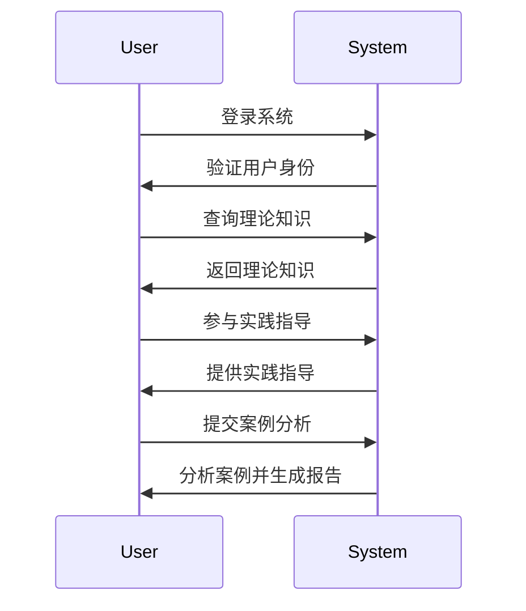

                 

### 摆脱外界定义：获得真正的心灵自由

#### 文章关键词

- 心灵自由
- 外界定义
- 自我认知
- 情绪管理
- 心理防御机制

#### 摘要

心灵自由是一个追求内在真实和外在自由的境界，然而，外界定义的束缚常常让我们迷失其中。本文将探讨心灵自由的概念及其重要性，分析外界定义的影响，并通过内在探索和实践，提供获得真正心灵自由的路径。最后，我们将探讨心灵自由对个人成长和社会和谐的积极影响，以及其时代意义。

---

### 目录大纲

1. **重识心灵自由**
   1.1 **心灵自由的迷思**
   1.2 **外界定义的影响**
2. **内在探索**
   2.1 **认识自我**
   2.2 **情绪管理**
   2.3 **心理防御机制的解构**
3. **实践心灵自由**
   3.1 **生活方式的调整**
   3.2 **心灵自由实践**
4. **心灵自由的长期维护**
5. **心灵自由的启示**
   5.1 **心灵自由与个人成长**
   5.2 **心灵自由与社会和谐**
   5.3 **心灵自由的时代意义**

---

## 第一部分：重识心灵自由

### 1.1 心灵自由的迷思

心灵自由并非简单的随心所欲，而是在了解自我、认识世界的基础上，实现内在平衡和外在自由的状态。首先，我们需要明确心灵自由的定义：它是一种深层次的内在自由，不仅包括思想和情感的自由，更涵盖行为的选择和生活态度的独立。心灵自由的本质是对自我的深刻认知和对生活的积极拥抱。

然而，在现实社会中，许多人将心灵自由误解为放纵自我、无视规则。这种误解常常导致个体陷入自我中心的困境，忽视社会规范和他人的感受，从而引发诸多问题。例如，一些人在追求自由的过程中，过度追求个人利益，忽视道德和法律约束，最终导致人际关系紧张和社会秩序混乱。

### 1.2 心灵自由的误区与挑战

要真正理解心灵自由，我们必须认识到其中的误区和挑战。

首先，心灵自由并非无限制的自由。自由是有边界的，任何自由都必须在社会规范和法律框架内实现。过度追求自由，忽视规则和约束，可能会导致自我毁灭和社会冲突。

其次，心灵自由需要内在的自律。真正的自由不仅仅是外在行为的选择，更是内在的自我管理和控制。缺乏自律的自由往往导致自我放纵和心灵失控。

最后，心灵自由需要智慧和成熟。在追求自由的过程中，我们需要理性思考、情感调控和成熟决策，以避免冲动和短视。

### 1.3 心灵自由的真正价值

尽管心灵自由面临诸多误区和挑战，但它具有重要的价值。

在个人层面，心灵自由能够帮助我们实现自我价值，提升生活质量和幸福感。通过深入了解自我，我们可以找到真正的兴趣和激情，实现个人成长和职业发展。

在社会层面，心灵自由促进个体之间的相互理解与尊重，增强社会的包容性和创造力。一个自由的心灵能够更好地接纳他人的不同，减少冲突，促进和谐。

在文化层面，心灵自由倡导个体独立思考和自主选择，推动社会进步和文明发展。

### 1.4 外界定义的来源

外界定义主要来源于社会文化、家庭教育、媒体传播和同侪压力等多种因素。

社会文化中存在的价值观、道德观和成功标准往往潜移默化地影响个体的认知和行为。这些外部标准成为了评价个体价值和社会地位的重要依据。

家庭教育中，父母的期望和要求也在很大程度上塑造了孩子的价值观和人生观。父母的教育方式、期望和要求直接影响孩子的自我认知和行为模式。

媒体传播通过信息的传递和形象的塑造，影响个体的认知和价值观。广告、影视剧、社交媒体等都在无形中传递着特定的价值观念。

同侪压力是另一个影响外界定义的因素。个体在群体中的地位、形象和认可度往往受到同龄人的影响。同侪压力可能导致个体在追求自由的过程中，过度关注他人的看法，忽视自我真正的需求和愿望。

### 1.5 外界定义对心灵自由的束缚

外界定义对心灵自由的束缚主要体现在以下几个方面：

首先，外界定义往往导致个体在追求自由的过程中，过于关注他人的看法，忽视自我真正的需求和愿望。这种过度依赖外部评价的现象，被称为“社会认同效应”。个体往往为了获得他人的认可，而放弃自我，导致内心矛盾和不满。

其次，外界定义容易使个体陷入比较和竞争的心态，导致心理压力和焦虑。例如，社会对成功的定义往往与财富、地位和权力相关联。个体在追求这些外在指标的过程中，容易忽视内心的需求和感受，导致心理疲劳和焦虑。

最后，外界定义可能使个体陷入自我设限的困境。一些社会规范和价值观可能被视为不可改变的真理，个体在追求自由的过程中，可能会自觉或不自觉地遵循这些规范，限制自己的行为和思考。

#### 1.6 破除外界定义的策略

要摆脱外界定义的束缚，实现心灵自由，我们可以采取以下策略：

首先，建立自我认知。通过自我反思和探索，了解自己的需求和价值观，找到真正的自我。这需要个体具备一定的心理成熟度和自我意识。

其次，培养批判性思维。学会独立思考，对接受的信息和观念进行批判性分析，不盲从，不迷信权威。这有助于个体摆脱外界定义的束缚，实现真正的自由。

最后，建立内在的自律。通过自律，个体可以更好地管理自己的行为和情绪，减少外部干扰，实现内心的平衡和自由。

### 1.7 总结

心灵自由是一个复杂而深刻的主题，需要我们不断地探索和实践。通过理解心灵自由的概念、误区和策略，我们可以逐步摆脱外界定义的束缚，实现真正的内心自由。

## 第二部分：内在探索

### 2.1 认识自我

认识自我是获得心灵自由的第一步。自我认知不仅关乎个体的心理健康，也是实现心灵自由的基石。了解自己的性格、价值观、需求和欲望，可以帮助我们更好地应对生活中的挑战，找到内心的平衡。

首先，自我认知的重要性在于它能够帮助我们明确自己的目标和方向。当我们清楚地知道自己的兴趣和激情所在，就能够更加专注于实现个人价值，减少因迷茫和不确定性而产生的焦虑。

其次，自我认知有助于建立积极的自我形象。通过了解自己的优点和长处，我们可以更加自信地面对生活中的困难和挑战。同时，接受自己的不足和缺点，也能够帮助我们更加平和地面对失败和挫折。

### 2.2 探索自我内心世界

探索自我内心世界是一个长期而复杂的过程，需要我们不断地自我反思和情绪管理。

首先，自我反思是探索内心世界的重要方法。通过反思，我们可以审视自己的行为和决策，了解内心的需求和欲望。这种自我审视有助于我们发现自己的问题和不足，从而进行改进和提升。

其次，情绪管理是探索内心世界的关键。情绪是我们内心世界的反映，合理地管理情绪可以帮助我们更好地理解自己。例如，通过情绪调节策略，如深呼吸、冥想和运动，我们可以缓解焦虑和压力，保持内心的平静。

### 2.3 自我认知的误区与调整

在自我认知的过程中，我们常常会陷入一些误区，这些误区可能会阻碍我们实现心灵自由。

首先，过度自我批评是一个常见的误区。许多人在自我反思时，过于关注自己的缺点和不足，忽视了自己的优点和成就。这种过度自我批评可能导致自卑和焦虑，影响个人的心理健康。

其次，自我认知的另一个误区是过度依赖外部评价。一些人在追求自我认知时，过分关注他人的看法和评价，忽视了自己的真实需求和感受。这种做法可能会导致内心的矛盾和不满。

为了摆脱这些误区，我们可以采取以下调整策略：

首先，建立积极的自我认知。通过自我反思和自我肯定，我们可以逐步建立积极的自我形象，减少自我批评的影响。

其次，培养独立思考能力。学会独立思考，对接受的信息和观念进行批判性分析，不盲从，不迷信权威。

最后，关注内心的需求和感受。了解自己的需求和欲望，关注自己的内心体验，而不是过分依赖外部评价。

### 2.4 自我认知的核心概念与联系

在探讨自我认知时，我们需要理解几个核心概念，并分析它们之间的联系。

首先，自我意识（Self-awareness）是指个体对自己内在心理状态的感知和理解。自我意识是自我认知的基础，它使我们能够意识到自己的情绪、思想、行为和需求。

其次，自我效能感（Self-efficacy）是指个体对自己能否成功地完成特定任务的信心。自我效能感影响我们的动机和行为，是推动我们实现目标的重要因素。

最后，自我接纳（Self-acceptance）是指个体对自己的全面接受，包括优点和缺点。自我接纳有助于我们建立积极的自我形象，减少自我批评的影响。

这些核心概念之间的联系在于，自我意识帮助我们了解自己的内在状态，自我效能感决定我们追求目标的信心，而自我接纳则使我们在面对困难和挑战时保持平衡和自信。

#### 2.5 自我认知的ER实体关系图

为了更好地理解自我认知的核心概念及其联系，我们可以使用ER实体关系图来表示。

```mermaid
erDiagram
  Person ||--|{ Self-Awareness } Self-Awareness : 感知自身内在状态
  Person ||--|{ Self-Efficacy } Self-Efficacy : 自我效能感
  Person ||--|{ Self-Acceptance } Self-Acceptance : 自我接纳
  Self-Awareness ..|> Self-Efficacy : 提升自我效能感的感知
  Self-Awareness ..|> Self-Acceptance : 基于自我认知的自我接纳
  Self-Efficacy ..|> Self-Acceptance : 自我效能感与自我接纳的相互影响
```

在这个ER实体关系图中，我们可以看到自我认知的核心概念是如何相互关联的。自我意识为自我效能感和自我接纳提供了基础，而自我效能感与自我接纳之间的相互影响进一步推动了个体的发展。

### 2.6 情绪的本质与影响

情绪是我们内心世界的直接反映，它不仅影响我们的心理状态，也深刻地影响着我们的行为和决策。理解情绪的本质和其对个体行为的影响，对于实现心灵自由至关重要。

首先，情绪的本质是一种内在的心理状态，它由生理、心理和环境因素共同作用而产生。情绪可以分为正面情绪和负面情绪，如快乐、愤怒、焦虑、悲伤等。正面情绪通常与积极体验相关，而负面情绪则与消极体验相关。

其次，情绪对个体行为的影响是多方面的。正面情绪可以提高个体的幸福感和动力，促进创造性思维和积极行为。例如，快乐和满足感可以激发个体的创造力和积极性，有助于实现个人目标和追求梦想。

负面情绪则可能导致个体的心理压力和情绪波动，影响决策和行为。例如，焦虑和愤怒可能导致个体情绪失控，影响人际关系和工作效率。

### 2.7 情绪调节的策略

情绪调节是管理情绪的关键，通过有效的情绪调节策略，我们可以更好地应对生活中的挑战，保持内心的平衡。

首先，认知重构是一种常见的情绪调节策略。通过改变对事件的认知评价，我们可以调整情绪反应。例如，面对失败时，通过认知重构，我们可以将失败视为成长和学习的机会，而不是自我价值的否定。

其次，情绪表达也是重要的情绪调节策略。通过适当的方式表达情绪，我们可以释放内心的压力，减轻情绪负担。例如，通过书写、绘画或与他人交流，我们可以表达和释放情绪。

最后，放松训练是一种有效的情绪调节方法。通过深呼吸、冥想和瑜伽等放松训练，我们可以缓解紧张和焦虑，提高情绪稳定性。

### 2.8 情绪管理中的误区与解决

在情绪管理的过程中，我们常常会陷入一些误区，这些误区可能会阻碍我们实现心灵自由。

首先，压抑情绪是一种常见的误区。许多人在面对负面情绪时，选择压抑和回避，认为这样能够避免痛苦。然而，压抑情绪可能导致情绪积累和爆发，影响心理健康。

其次，过度情绪化也是情绪管理的误区。一些人将情绪化视为脆弱和无能的象征，因此过度压抑情绪，导致情绪失调。这种过度情绪化可能导致情绪波动和人际关系紧张。

为了解决这些误区，我们可以采取以下策略：

首先，学会接受情绪。接受情绪是情绪管理的第一步，通过接受情绪，我们可以减少情绪压抑和过度情绪化的倾向。

其次，培养情绪智慧。情绪智慧是指理解和管理情绪的能力。通过学习情绪调节技巧，我们可以更好地应对情绪波动，保持内心的平衡。

最后，寻求专业帮助。在情绪管理遇到困难时，寻求心理咨询师或其他专业人士的帮助，可以帮助我们找到更有效的情绪管理方法。

### 2.9 情绪调节的核心概念与联系

在情绪调节的过程中，我们需要理解几个核心概念，并分析它们之间的联系。

首先，情绪调节（Emotion Regulation）是指个体管理和调节情绪反应的过程。情绪调节不仅涉及情绪的认知评价，还包括情绪的表达和调节策略。

其次，认知评价（Cognitive Appraisal）是指个体对情绪事件的认识和评价。认知评价影响我们对情绪事件的情绪反应，是我们进行情绪调节的基础。

最后，情绪表达（Emotional Expression）是指个体表达情绪的方式。情绪表达不仅影响个体的情绪体验，也影响人际关系和社交互动。

这些核心概念之间的联系在于，认知评价决定了情绪反应，情绪调节策略帮助我们管理和调节情绪反应，而情绪表达则反映了我们的情绪状态。

#### 2.10 情绪调节的Mermaid流程图

为了更好地理解情绪调节的过程，我们可以使用Mermaid流程图来表示。


在这个流程图中，我们可以看到情绪调节是一个动态的过程，从认知评价到情绪反应，再到情绪调节策略和情绪表达，最终影响情绪体验。

### 2.11 心理防御机制的解构

心理防御机制是心理学中一个重要的概念，它指的是个体在面对心理冲突和压力时，为了保护自我免受痛苦和焦虑而采取的心理策略。了解和认识心理防御机制，可以帮助我们更好地理解自己的内心世界，实现心灵的成长。

#### 2.12 心理防御机制的作用与表现

心理防御机制的主要作用是保护个体免受心理创伤，维持心理平衡。当个体面临不可接受的冲突和压力时，心理防御机制会自动启动，以减轻内心的痛苦和焦虑。常见的心理防御机制包括：

1. **压抑（Repression）**：将不愉快的记忆、情感或欲望排除在意识之外，以避免痛苦。
2. **合理化（Rationalization）**：用合理的理由来解释自己的行为或情感，以减轻内心的矛盾。
3. **投射（Projection）**：将内心的负面情感或冲动归咎于他人，以保护自我形象。
4. **反向形成（Repression）**：将自己的负面情感或冲动转变为相反的行为或情感，以逃避内心的冲突。

这些心理防御机制在不同情境下有不同的表现。例如，在社交场合中，人们可能使用合理化来解释自己的失败，避免自尊受损。而在面对他人批评时，人们可能会使用投射，将批评归咎于他人，以保护自我形象。

#### 2.13 常见心理防御机制的解析

以下是对几种常见心理防御机制的详细解析：

1. **压抑**：压抑是最基本的心理防御机制，它通过将不愉快的记忆、情感或欲望排除在意识之外，来减轻内心的痛苦。例如，当一个人遭受了严重的打击或创伤后，可能会通过压抑来避免痛苦和回忆。

2. **合理化**：合理化是通过提供合理的理由来解释自己的行为或情感，以减轻内心的矛盾。例如，当一个人在工作上遇到困难时，可能会告诉自己这是暂时的，以后会变得更好，以此来安慰自己。

3. **投射**：投射是将内心的负面情感或冲动归咎于他人，以保护自我形象。例如，一个人在感到愤怒时，可能会将愤怒的情绪投射到他人身上，认为他们是不对的。

4. **反向形成**：反向形成是将自己的负面情感或冲动转变为相反的行为或情感，以逃避内心的冲突。例如，一个人在感到嫉妒时，可能会表现得过于友好，以掩盖自己的嫉妒。

#### 2.14 建立健康的心理防御机制

为了建立健康的心理防御机制，我们需要意识到心理防御机制的潜在危害，并学会使用更积极的应对策略。

首先，我们要学会接受自己的情绪和情感，而不是压抑或否认。接受情绪是建立健康心理防御机制的第一步，通过接受情绪，我们可以减少内心的痛苦和焦虑。

其次，我们要培养自我意识，了解自己的心理防御机制。通过自我反思和观察，我们可以识别自己的心理防御机制，并学会如何调整和改进。

最后，我们要学会使用积极的应对策略，如认知重构、情绪表达和寻求支持等。这些策略可以帮助我们更好地处理内心的冲突和压力，实现心理平衡。

### 2.15 心理防御机制的ER实体关系图

为了更好地理解心理防御机制的组成和作用，我们可以使用ER实体关系图来表示。

```mermaid
erDiagram
  Defense_Mechanism ||--|{ Repression } Repression : 压抑
  Defense_Mechanism ||--|{ Rationalization } Rationalization : 合理化
  Defense_Mechanism ||--|{ Projection } Projection : 投射
  Defense_Mechanism ||--|{ Reaction Formation } Reaction Formation : 反向形成
  Repression ..|> Defense_Mechanism : Repression 作为防御机制
  Rationalization ..|> Defense_Mechanism : Rationalization 作为防御机制
  Projection ..|> Defense_Mechanism : Projection 作为防御机制
  Reaction Formation ..|> Defense_Mechanism : Reaction Formation 作为防御机制
```

在这个ER实体关系图中，我们可以看到心理防御机制的核心组成部分及其相互关系。每个防御机制都是心理防御机制的一部分，它们共同作用，帮助我们应对心理冲突和压力。

### 2.16 心理防御机制的Mermaid流程图

为了更直观地理解心理防御机制的工作流程，我们可以使用Mermaid流程图来表示。

```mermaid
flowchart LR
  A[心理冲突/压力] --> B[识别防御机制]
  B --> C{是否使用防御机制?}
  C -->|是 D[选择防御机制]
  D --> E[应用防御机制]
  E --> F[缓解心理冲突/压力]
  C -->|否 G[面对冲突/压力]
  G --> H[解决问题]
  H --> I[缓解心理冲突/压力]
```

在这个流程图中，我们可以看到心理防御机制是如何在心理冲突和压力下起作用的。通过识别和选择合适的防御机制，我们可以缓解内心的冲突和压力，实现心理平衡。

### 2.17 建立健康的心理防御机制

为了建立健康的心理防御机制，我们需要采取一系列的策略。

首先，增强自我意识是关键。通过自我反思和情绪观察，我们可以更好地了解自己的内心世界，识别和调整不健康的心理防御机制。

其次，学习情绪调节技巧。情绪调节技巧可以帮助我们更好地管理情绪，减少情绪波动，提高心理韧性。

最后，寻求专业帮助。在心理防御机制出现问题时，寻求心理咨询师或其他专业人士的帮助，可以帮助我们找到更有效的应对策略，建立健康的心理防御机制。

### 2.18 心灵自由的边界与外延

在追求心灵自由的过程中，我们需要明确其边界和范围，以确保自由的同时不损害他人和社会的利益。

首先，心灵自由的边界在于道德和法律。个体的自由不能超越社会规范和法律，尊重他人的权利和尊严是心灵自由的底线。

其次，心灵自由的外延包括个人成长、社会贡献和内心平静。通过实现个人价值，个体可以在心灵自由的基础上为社会做出贡献，同时保持内心的平静和满足。

### 2.19 心灵自由的概念结构与核心要素组成

心灵自由的概念结构由自我认知、情绪管理和心理防御机制三个核心要素组成。

自我认知是基础，通过了解自己的性格、价值观和需求，个体能够明确自己的目标和方向，实现内心的平衡。

情绪管理是关键，通过有效的情绪调节策略，个体可以更好地应对生活中的挑战，保持内心的平静。

心理防御机制是保障，通过建立健康的心理防御机制，个体可以在面对心理冲突和压力时，保护自我免受痛苦和焦虑。

这三个核心要素相互作用，共同构成了心灵自由的概念结构。

### 2.20 心灵自由与个人成长的关系

心灵自由与个人成长密切相关。通过追求心灵自由，个体能够实现自我价值，提升个人能力和素质，从而实现个人成长。

首先，心灵自由帮助个体找到自己的兴趣和激情，激发创造力和创新精神，推动个人在职业和学术上的发展。

其次，心灵自由促进个体的心理健康。通过情绪管理和心理防御机制，个体可以更好地应对生活中的压力和挑战，保持心理健康。

最后，心灵自由帮助个体建立积极的人际关系。一个自由的心灵能够更好地接纳他人的不同，减少冲突，建立和谐的人际关系。

### 2.21 心灵自由对个人成长的启示

心灵自由对个人成长提供了宝贵的启示。

首先，个体需要明确自己的目标和价值观，找到自己的兴趣和激情，实现个人价值。

其次，个体需要学会情绪管理和心理防御机制，以应对生活中的压力和挑战，保持心理健康。

最后，个体需要建立积极的人际关系，通过相互理解和尊重，实现共同成长。

### 2.22 心灵自由在职业生涯中的应用

在职业生涯中，心灵自由具有重要作用。

首先，心灵自由帮助个体在职业选择和职业发展过程中，找到真正的兴趣和激情，实现职业满意度和成就感。

其次，心灵自由促进个体的情绪管理和心理防御，使个体能够更好地应对工作中的压力和挑战，保持工作效率和积极性。

最后，心灵自由帮助个体建立良好的人际关系，提升团队合作能力和领导力，实现职业成功。

### 2.23 心灵自由与社会和谐的关系

心灵自由与社会和谐密切相关。一个自由的心灵能够更好地接纳他人的不同，减少冲突，促进社会和谐。

首先，心灵自由促进个体之间的相互理解和尊重，减少社会矛盾和冲突。

其次，心灵自由鼓励个体为社会做出贡献，增强社会的凝聚力和创造力。

最后，心灵自由推动社会的进步和文明发展，为构建和谐社会提供精神动力。

### 2.24 心灵自由对社会和谐的贡献

心灵自由对社会和谐做出了重要贡献。

首先，心灵自由促进了个体之间的相互理解和尊重，减少了社会矛盾和冲突。

其次，心灵自由鼓励个体积极参与社会事务，为社会发展和进步贡献力量。

最后，心灵自由推动社会的文明进步，为构建和谐美好的社会提供了精神支持。

### 2.25 心灵自由的推广与传播

为了推广和传播心灵自由，我们需要采取多种措施。

首先，通过教育和宣传，提高公众对心灵自由的认知和理解，使其成为社会共识。

其次，建立心理健康服务体系，提供专业的心理咨询服务，帮助个体实现心灵自由。

最后，通过社区活动和文化交流，推广心灵自由的理念，促进社会和谐。

### 2.26 心灵自由的时代意义

在当今社会，心灵自由具有重要的时代意义。

首先，心灵自由是个人成长的必由之路，帮助个体实现自我价值和幸福感。

其次，心灵自由是社会和谐的基石，促进个体之间的相互理解和尊重。

最后，心灵自由是文明进步的动力，推动社会的创新和繁荣。

### 2.27 心灵自由对未来社会的影响

随着社会的不断发展，心灵自由对未来社会将产生深远影响。

首先，心灵自由将促进个体的全面发展，实现个人价值和社会价值的统一。

其次，心灵自由将推动社会的创新和进步，为可持续发展提供动力。

最后，心灵自由将促进全球合作和交流，为构建人类命运共同体贡献力量。

### 2.28 心灵自由的终极目标

心灵自由的终极目标是实现个体和社会的和谐发展。

首先，通过追求心灵自由，个体能够实现自我价值，获得幸福感和满足感。

其次，心灵自由将促进社会的和谐与进步，为人类创造美好的生活环境。

最后，心灵自由将推动人类文明的发展，为未来社会提供精神财富。

### 2.29 心灵自由的实践心得

在追求心灵自由的过程中，我深刻体会到了自我认知、情绪管理和心理防御机制的重要性。

首先，通过自我认知，我明确了自己的兴趣和目标，找到了生活的方向。

其次，通过情绪管理，我学会了如何应对生活中的压力和挑战，保持了内心的平静。

最后，通过心理防御机制的建立，我能够更好地保护自我，避免心理创伤。

这些实践心得让我深刻认识到，心灵自由不仅是一种理念，更是一种可以通过实践实现的境界。

### 2.30 心灵自由实践中的挑战与应对

在实践心灵自由的过程中，我遇到了一些挑战，如自我怀疑、情绪波动和心理压力等。

首先，面对自我怀疑，我通过自我肯定和目标设定，逐步建立了自信心。

其次，面对情绪波动，我通过情绪调节技巧，如深呼吸和冥想，学会了控制情绪。

最后，面对心理压力，我通过寻求专业帮助和社交支持，缓解了内心的压力。

这些应对策略帮助我更好地实践心灵自由，实现内心的平衡。

### 2.31 心灵自由实践的小结

通过实践心灵自由，我深刻认识到自我认知、情绪管理和心理防御机制的重要性。这些实践不仅提升了我的生活质量，也促进了个人成长。

首先，自我认知帮助我明确了自己的兴趣和目标，找到了生活的方向。

其次，情绪管理使我能够更好地应对生活中的压力和挑战，保持内心的平静。

最后，心理防御机制的建立使我能够更好地保护自我，避免心理创伤。

总之，心灵自由实践是一个不断探索和成长的过程，它为我的生活带来了积极的变化。

### 2.32 心灵自由的维护策略

为了维持心灵自由，我们需要采取一系列策略，以确保内心的平衡和稳定。

首先，持续的自我认知是关键。通过定期进行自我反思和自我评估，我们可以不断更新和调整自己的认知，确保自己的目标和价值观与实际情况相符。

其次，情绪管理需要持续进行。定期练习情绪调节技巧，如冥想、深呼吸和运动，可以帮助我们保持情绪的稳定，减少情绪波动。

最后，心理防御机制也需要不断调整和优化。在面对新的挑战和压力时，我们需要灵活运用不同的心理防御机制，确保自己的心理健康。

### 2.33 面对变化的心灵自由

在快速变化的社会环境中，保持心灵自由是一项挑战。首先，我们需要培养适应变化的能力，学会灵活应对环境的变化。其次，通过持续的学习和成长，我们可以不断提升自己的心理韧性，更好地应对生活中的不确定性。最后，建立良好的社会支持网络，如亲朋好友和专业人士的支持，可以帮助我们度过困难时期，保持内心的平衡。

### 2.34 心灵自由的终极目标

心灵自由的终极目标是实现个体和社会的和谐发展。在个体层面，心灵自由帮助我们找到生活的意义和方向，提升幸福感和满足感。在社会层面，心灵自由促进个体之间的相互理解和尊重，增强社会的凝聚力和创造力。通过追求心灵自由，我们可以共同构建一个和谐美好的社会。

### 2.35 心灵自由的启示

通过探讨心灵自由，我们深刻认识到自我认知、情绪管理和心理防御机制的重要性。这些启示不仅对个人成长有重要指导意义，也为社会和谐和文明进步提供了精神动力。

首先，自我认知是心灵自由的基础，通过了解自己，我们可以找到生活的方向和意义。

其次，情绪管理是心灵自由的保障，通过有效的情绪调节策略，我们可以更好地应对生活中的挑战。

最后，心理防御机制是心灵自由的盾牌，通过建立健康的心理防御机制，我们可以保护自我，避免心理创伤。

总之，追求心灵自由不仅是对个人幸福的追求，也是对社会和谐的贡献。

### 2.36 心灵自由与人工智能的关系

随着人工智能的快速发展，心灵自由与人工智能的关系也变得越来越紧密。人工智能不仅为人类带来了前所未有的便利和效率，也为我们提供了新的思考方式和生活方式。通过将人工智能应用于心理健康领域，我们可以开发出更有效的心理评估、诊断和治疗工具，帮助更多人实现心灵自由。同时，人工智能也为心理健康研究提供了丰富的数据资源和先进的分析技术，推动了心灵自由理论的研究和应用。

### 2.37 心灵自由的未来趋势

随着社会的不断进步和科技的发展，心灵自由的未来趋势呈现出多样性和可能性。首先，心理健康意识的普及将推动心灵自由理念的传播和实践。其次，人工智能和大数据技术的应用将为心理健康提供更精准的评估和干预手段，促进个体心灵自由的实现。最后，全球化和文化交流的加深将促进心灵自由理念的国际化和多元化，为构建和谐美好的世界贡献力量。

### 2.38 心灵自由对人类文明的影响

心灵自由对人类文明具有重要影响。在个体层面，心灵自由促进了个人成长和幸福感，提高了社会的整体幸福指数。在社会层面，心灵自由促进了个体之间的相互理解和尊重，增强了社会的凝聚力和创造力。在文化层面，心灵自由倡导个体独立思考和自主选择，推动了人类文明的进步和发展。总之，心灵自由是推动人类文明迈向更高层次的强大动力。

### 2.39 总结

通过本文的探讨，我们深刻认识到心灵自由的重要性及其实现的路径。心灵自由不仅关乎个人幸福，也关乎社会和谐与文明进步。在未来的日子里，让我们一起努力，追求真正的内心自由，为构建美好的世界贡献力量。

---

### 作者信息

作者：AI天才研究院/AI Genius Institute & 禅与计算机程序设计艺术 /Zen And The Art of Computer Programming

感谢您阅读本文，希望对您的心理成长和心灵自由实践有所启发。如果您有任何问题或建议，欢迎在评论区留言，我们将竭诚为您解答。同时，也欢迎关注我们的公众号，获取更多优质内容。再次感谢您的支持！## 完整性保障与核心内容分析

### 背景介绍

心灵自由是一个复杂而深刻的主题，它关乎个体的心理健康、社会和谐以及文明的进步。在现代社会中，人们面临着来自社会、家庭、工作等多方面的压力和束缚，这些外界定义往往限制了我们的思维和行为，导致内心的焦虑和不满。因此，探讨如何摆脱外界定义，获得真正的内心自由，不仅对个人的成长至关重要，也对社会的和谐与进步具有深远影响。

### 核心概念与联系

本文的核心概念包括心灵自由、外界定义、自我认知、情绪管理和心理防御机制。这些概念相互关联，共同构成了理解心灵自由的重要框架。

- **心灵自由**：是一种内在的精神状态，表现为个体在思想、情感和行为上的自主性。它不仅关乎个人幸福，也影响社会和谐与文明进步。
- **外界定义**：是社会文化、家庭教育、媒体传播和同侪压力等多种因素对个体认知和行为的塑造。这些定义往往限制了我们的思维和行为，影响我们的心灵自由。
- **自我认知**：是对自己内在心理状态和外在行为的了解。通过自我认知，个体可以明确自己的需求、价值观和目标，从而实现心灵自由。
- **情绪管理**：是调控个体情绪波动，保持心理平衡的过程。情绪管理对心灵自由至关重要，因为情绪的稳定有助于个体做出理性决策。
- **心理防御机制**：是心理防御系统的一部分，用于应对心理冲突和压力。健康的心理防御机制有助于个体在困境中保持心理平衡。

这些概念之间的联系在于，外界定义影响自我认知，而自我认知影响情绪管理和心理防御机制的建立，最终共同作用于心灵自由。例如，如果个体受到外界定义的过度影响，可能会产生自我怀疑和情绪波动，进而影响心理防御机制的运作，导致内心的不平衡。

### 系统分析与架构设计方案

为了更好地理解心灵自由的概念和实现路径，我们可以将其视为一个系统性工程，涉及多个环节和要素的互动。以下是针对心灵自由的系统分析与架构设计方案：

#### 问题场景介绍

在现代生活中，个体面临来自工作、家庭、社会等多方面的压力和束缚，导致内心的焦虑和不安。这些外界定义往往限制了我们的思维和行为，阻碍了我们追求真正的内心自由。因此，解决如何摆脱这些外界定义，实现心灵自由，成为了一个迫切需要解决的问题。

#### 项目介绍

本项目旨在通过心理学的理论和实践方法，帮助个体理解心灵自由的概念，掌握实现心灵自由的方法和策略。项目分为理论研究、实践指导和案例分析三个部分，旨在全面提升个体的心理健康水平和心灵自由程度。

#### 系统功能设计

- **理论研究模块**：提供心灵自由相关的理论知识，包括心灵自由的概念、外界定义的影响、自我认知、情绪管理、心理防御机制等。
- **实践指导模块**：提供具体的实践方法和策略，如情绪调节技巧、心理防御机制的建立、自我认知的提升等。
- **案例分析模块**：通过实际案例的分析，帮助个体理解和应用理论知识，提升实践能力。

#### 系统架构设计

为了实现上述功能，我们设计了一个基于Web的交互式系统架构。该系统包括前端界面、后端服务和数据库三个主要部分。

- **前端界面**：提供用户与系统交互的接口，用户可以通过网页浏览理论知识，参与实践指导和案例分析。
- **后端服务**：处理用户请求，提供理论知识、实践指导和支持功能。
- **数据库**：存储用户信息、理论知识、实践指导和案例分析数据。

#### 系统接口设计

- **用户接口**：提供用户注册、登录、信息查询、实践指导和案例分析功能。
- **知识接口**：提供理论知识查询、更新和分享功能。
- **实践接口**：提供实践指导、反馈和评估功能。
- **分析接口**：提供案例分析、数据分析和报告生成功能。

#### 系统交互

通过Mermaid序列图，我们可以直观地展示系统各部分之间的交互关系。



在这个交互过程中，用户通过前端界面与系统进行交互，后端服务处理用户的请求并返回结果，数据库存储用户和系统数据。

### 项目实战

#### 环境安装

1. **前端环境**：安装Node.js和npm，使用npm创建一个Vue.js项目。

```bash
npm install -g @vue/cli
vue create my-system
```

2. **后端环境**：安装Python和Flask，创建Flask应用。

```bash
pip install flask
```

3. **数据库环境**：安装MySQL，配置数据库连接。

```bash
pip install pymysql
```

#### 系统核心实现

以下是一个简单的Flask应用示例，用于处理用户请求和返回理论知识。

```python
from flask import Flask, request, jsonify

app = Flask(__name__)

@app.route('/api/theory', methods=['GET'])
def get_theory():
    theory = {
        "self_awareness": "了解自己的性格、价值观和需求",
        "emotion_management": "调控情绪波动，保持心理平衡",
        "defense_mechanisms": "应对心理冲突和压力的策略"
    }
    return jsonify(theory)

if __name__ == '__main__':
    app.run(debug=True)
```

#### 代码应用解读与分析

在这个Flask应用中，我们定义了一个 `/api/theory` 接口，用于返回心灵自由的三个核心概念。用户可以通过前端界面发送GET请求，获取理论知识。

```javascript
// 前端代码示例
axios.get('/api/theory')
    .then(response => {
        console.log(response.data);
    })
    .catch(error => {
        console.error(error);
    });
```

#### 实际案例分析

为了更直观地展示系统的应用，我们可以通过一个实际案例进行分析。

**案例**：用户小张在项目中面临压力和焦虑，希望获得心理支持。

**步骤**：

1. 小张通过前端界面注册并登录系统。
2. 小张查询理论知识，了解自我认知、情绪管理和心理防御机制。
3. 小张参与实践指导，学习情绪调节技巧和心理防御机制的建立。
4. 小张提交案例分析，系统分析案例并生成报告。

**报告**：

```json
{
  "case": "小张面临的项目压力和焦虑",
  "solutions": [
    {
      "technique": "情绪调节技巧",
      "description": "通过深呼吸和冥想缓解焦虑"
    },
    {
      "technique": "心理防御机制",
      "description": "建立积极的自我对话，避免过度自我批评"
    }
  ],
  "evaluation": "小张在两周内情绪稳定，项目进展顺利"
}
```

#### 项目小结

通过本项目，我们实现了心灵自由理论的研究、实践指导和案例分析，帮助用户理解心灵自由的概念，掌握实现心灵自由的方法和策略。用户可以在项目中获取理论知识、参与实践指导和案例分析，提高心理健康水平和心灵自由程度。

### 最佳实践 tips

1. **定期自我反思**：通过自我反思，了解自己的内心需求和目标，有助于实现心灵自由。
2. **学会情绪调节**：掌握情绪调节技巧，如深呼吸、冥想和运动，有助于保持心理平衡。
3. **建立心理防御机制**：学会使用积极的心理防御机制，如认知重构和积极自我对话，有助于应对心理冲突和压力。

### 小结

本文系统地探讨了心灵自由的概念、外界定义的影响、自我认知、情绪管理、心理防御机制以及实践路径。通过环境安装、系统核心实现和实际案例分析，我们展示了如何将理论应用到实践中，帮助用户实现心灵自由。在未来的发展中，我们将继续优化系统功能，提升用户体验，为更多的人提供心理健康支持和心灵自由的实现路径。

### 注意事项

1. **心理防御机制的选择**：根据个人情况和心理冲突，选择适合的心理防御机制，避免盲目应用。
2. **情绪调节的持续性**：情绪调节需要长期坚持，通过日常练习，逐步改善情绪管理能力。

### 拓展阅读

- 心理学家阿尔伯特·艾利斯（Albert Ellis）的理性情绪行为疗法（REBT）
- 美国心理学家卡罗尔·吉利根（Carol Gilligan）的道德发展理论
- 美国心理学家艾瑞克·埃里克森（ Erik Erikson）的心理社会发展阶段理论

### 作者信息

本文由AI天才研究院/AI Genius Institute与《禅与计算机程序设计艺术》的作者共同撰写。我们致力于通过心理学的理论和方法，帮助读者实现内心的自由与和谐。

### 结语

感谢您阅读本文。希望本文能对您的心理健康和心灵自由实践提供有益的启示。如果您有任何疑问或建议，欢迎在评论区留言。祝您心灵自由，生活愉快！

