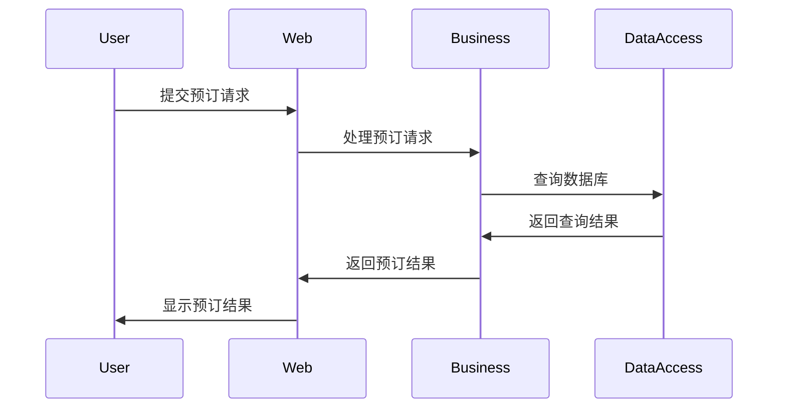
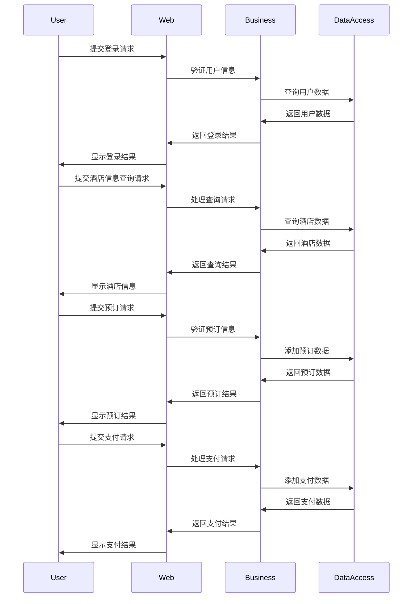

                 

### 第一部分：数字detox度假村预订系统概述

#### 第1章：背景与需求

##### 1.1 背景介绍

在当今数字化时代，人们的日常生活和工作越来越依赖电子设备，从智能手机到电脑，从社交媒体到在线购物平台，我们几乎无时无刻不在使用这些科技产品。然而，这种高度依赖科技的便利性也带来了一系列问题，例如注意力分散、焦虑、睡眠质量下降等，这些问题统称为“数字依赖”或“数字中毒”（Digital Detox）。

数字detox，顾名思义，是指通过减少或中断对电子设备的依赖，从而实现身体和心灵的放松和恢复。这种做法最初源自于人们对电子设备过度使用的反思，旨在寻找一种逃离虚拟世界，回归自然和宁静的生活方式。随着这一概念逐渐被更多人接受，数字detox度假村预订系统应运而生。

##### 1.1.1 数字detox的概念

数字detox通常涉及一系列减少电子设备使用时间的方法，包括：

1. **设备断连**：在特定时间内关闭手机、电脑等电子设备，以减少干扰。
2. **网络断连**：在某些场合下，如度假村，提供无网络或有选择性地提供网络服务，以减少用户对电子设备的依赖。
3. **日程调整**：合理安排时间，确保在工作、学习和休闲之间取得平衡。
4. **数字健康习惯**：培养健康的数字使用习惯，例如定时休息、限制使用时间等。

##### 1.1.2 度假村预订系统的现状

随着人们对数字detox需求的增加，许多度假村开始提供专门的数字detox服务。这些度假村通常位于偏远地区，环境宁静，远离城市的喧嚣和网络的干扰。同时，这些度假村还提供各种放松和恢复身心的活动，如瑜伽、冥想、徒步旅行等。

目前，虽然数字detox度假村在全球范围内的发展尚不成熟，但已经有不少成功的案例，尤其在欧美国家，这一市场正在迅速扩大。同时，越来越多的旅游平台开始提供数字detox度假村的预订服务，这使得用户可以更方便地找到并预订这些度假村。

##### 1.1.3 为什么需要数字detox度假村预订系统

首先，数字detox度假村预订系统可以满足人们对放松和恢复身心的需求。在现代社会，由于工作和生活压力，很多人长期处于高度紧张和焦虑的状态，导致身体健康和心理健康问题。通过数字detox度假村，用户可以暂时逃离这些压力源，享受一段宁静的时光。

其次，数字detox度假村预订系统为度假村提供了更多商业机会。通过在线预订系统，度假村可以吸引更多来自全球的用户，提高入住率和盈利能力。同时，预订系统还可以提供数据分析，帮助度假村更好地了解用户需求，优化服务和运营策略。

最后，数字detox度假村预订系统有助于推动绿色旅游和可持续发展。通过减少对电子设备的依赖，用户可以更深入地体验自然环境，促进生态保护。同时，预订系统减少了纸质门票和宣传册的使用，降低了对资源的消耗。

##### 1.2 需求分析

##### 1.2.1 用户需求

用户对数字detox度假村预订系统的需求主要包括：

1. **方便的预订流程**：用户希望能够通过在线平台轻松地预订数字detox度假村，包括查看酒店信息、价格、服务设施等。
2. **多样化的选择**：用户希望预订系统能够提供多种类型的数字detox度假村，以满足不同需求和预算。
3. **隐私保护**：用户希望预订系统能够保护个人信息，确保隐私安全。
4. **便捷的支付方式**：用户希望预订系统能够支持多种支付方式，包括信用卡、移动支付等。

##### 1.2.2 商业需求

数字detox度假村预订系统对于度假村和预订平台而言，也有诸多商业需求：

1. **提升预订率**：通过在线预订系统，度假村可以吸引更多来自全球的用户，提高入住率和盈利能力。
2. **数据分析**：通过收集用户数据，度假村和预订平台可以更好地了解用户需求，优化服务和运营策略。
3. **营销推广**：通过预订系统，度假村和预订平台可以开展各种营销活动，提高品牌知名度。
4. **客户关系管理**：预订系统可以记录用户信息，便于后续客户关系管理和维护。

##### 1.2.3 技术需求

数字detox度假村预订系统在技术实现方面有以下需求：

1. **高并发处理能力**：由于在线预订系统的用户量可能会很高，系统需要具备处理大量并发请求的能力。
2. **数据安全与隐私保护**：系统需要采用先进的技术确保用户数据的安全和隐私。
3. **灵活性**：系统需要具备足够的灵活性，以适应不同度假村的需求，支持个性化定制。
4. **可扩展性**：系统需要具备良好的扩展性，以便在未来能够轻松增加新功能和业务。

##### 1.3 系统目标

数字detox度假村预订系统的主要目标包括：

1. **提升用户体验**：通过提供方便的预订流程、多样化的选择和隐私保护，提升用户满意度。
2. **优化运营效率**：通过自动化处理预订流程、数据分析等功能，提高度假村的运营效率。
3. **增加商业机会**：通过提升预订率和数据分析，为度假村和预订平台创造更多商业机会。
4. **推动可持续发展**：通过减少对电子设备的依赖，促进绿色旅游和可持续发展。

#### 第2章：核心概念与联系

##### 2.1 数字detox

数字detox（数字排毒）是一种旨在减少或消除数字设备使用对人们生活影响的策略。随着智能手机、电脑和其他数字设备的普及，越来越多的人发现自己被困在屏幕前，这不仅影响了他们的注意力，还可能导致身体和心理问题。数字detox的目的是让用户暂时摆脱这些电子设备的束缚，从而获得更好的休息、放松和自我恢复。

###### 2.1.1 数字detox的定义

数字detox可以定义为一种有意识的减少或中断数字设备使用的行为。这种行为通常包括以下几种形式：

1. **设备断连**：在特定时间段内关闭或远离手机、电脑等电子设备。
2. **网络断连**：在某些场合下，如度假村，提供无网络或有选择性地提供网络服务。
3. **日程调整**：合理安排时间，确保在工作、学习和休闲之间取得平衡。
4. **数字健康习惯**：培养健康的数字使用习惯，例如定时休息、限制使用时间等。

###### 2.1.2 数字detox的重要性

数字detox的重要性体现在以下几个方面：

1. **改善注意力**：长时间使用电子设备会分散注意力，影响学习和工作效率。通过数字detox，用户可以恢复和提高注意力。
2. **减少焦虑和压力**：数字设备带来的信息过载和社交媒体上的负面信息可能导致焦虑和压力。数字detox可以帮助用户减少这些负面影响。
3. **促进睡眠质量**：使用电子设备会影响睡眠质量，导致失眠。通过数字detox，用户可以改善睡眠质量，获得更好的休息。
4. **提高身体健康**：长时间使用电子设备可能导致视力下降、颈椎病、肥胖等问题。数字detox可以帮助用户减少这些问题。

###### 2.1.3 数字detox的方法与工具

实施数字detox有多种方法和工具，以下是一些常见的方法：

1. **设定特定的时间段**：例如每天晚上睡前的一个小时，不使用任何电子设备。
2. **使用应用程序**：例如Forest、Focus@Will等，这些应用程序可以帮助用户减少对电子设备的依赖。
3. **参加数字detox活动**：例如数字detox工作坊、课程等，这些活动可以提供指导和支持。
4. **更换生活方式**：例如选择住在无网络环境的地方，或者在度假期间完全不使用电子设备。

##### 2.2 度假村预订系统

度假村预订系统是一个专门用于帮助用户在线预订度假村服务的在线平台。这些系统通常包括酒店信息展示、在线预订、支付和客户服务等功能。

###### 2.2.1 度假村预订系统的定义

度假村预订系统是一种在线服务，它允许用户通过互联网查找、比较和预订度假村。这些系统通常具有以下特点：

1. **酒店信息展示**：系统会提供度假村的详细信息，包括酒店名称、地址、价格、服务设施等。
2. **在线预订**：用户可以通过系统直接预订度假村，选择入住日期、房间类型等。
3. **支付功能**：系统支持多种支付方式，如信用卡、支付宝等，方便用户完成预订。
4. **客户服务**：系统通常提供客户支持服务，帮助用户解决预订过程中的问题。

###### 2.2.2 度假村预订系统的功能

度假村预订系统的主要功能包括：

1. **酒店信息查询**：用户可以通过系统搜索符合自己需求的度假村，并查看详细信息。
2. **在线预订**：用户可以直接在系统中完成预订，选择入住日期、房间类型等。
3. **价格比较**：系统通常会显示多个度假村的价格，帮助用户比较并选择最合适的选项。
4. **支付功能**：系统支持在线支付，用户可以通过信用卡、支付宝等方式完成支付。
5. **客户服务**：系统提供客户支持，帮助用户解决预订过程中的问题。

###### 2.2.3 度假村预订系统与数字detox的关系

数字detox度假村预订系统是专门为数字detox用户提供服务的系统。与普通预订系统相比，它具有以下特点：

1. **无网络服务**：许多数字detox度假村提供无网络或有选择性地提供网络服务，以减少用户对电子设备的依赖。
2. **多样化选择**：系统会提供多种类型的数字detox度假村，以满足不同用户的需求。
3. **隐私保护**：系统通常会加强隐私保护措施，确保用户个人信息的安全。

##### 2.3 关键概念对比

###### 2.3.1 数字detox与数字疗养的异同

数字detox和数字疗养（Digital Wellness）都是旨在改善数字设备使用对人们生活影响的概念，但它们有一定的区别：

**相同点**：

1. **目的**：都是为了提高用户的生活质量和健康水平。
2. **方法**：都涉及减少或中断对电子设备的依赖。
3. **影响**：都可以改善用户的注意力、睡眠质量、焦虑水平等。

**不同点**：

1. **侧重点**：数字detox更侧重于摆脱电子设备的负面影响，而数字疗养更侧重于培养健康的数字使用习惯。
2. **持续时间**：数字detox通常是一次性的或短期的，而数字疗养是一个长期的过程。
3. **内容**：数字detox可能包括设备断连、网络断连等，而数字疗养可能包括锻炼、健康饮食等。

###### 2.3.2 度假村预订系统与传统预订系统的区别

度假村预订系统与传统预订系统（如酒店预订系统）也有一定的区别：

**相同点**：

1. **功能**：都提供酒店信息展示、在线预订、支付和客户服务等功能。
2. **目标**：都是帮助用户预订酒店或其他住宿设施。

**不同点**：

1. **服务对象**：传统预订系统主要面向商务旅客和旅游者，而数字detox度假村预订系统主要面向寻求放松和恢复的用户。
2. **服务特点**：数字detox度假村预订系统通常提供无网络或有选择性地提供网络服务，以促进数字detox。
3. **市场定位**：传统预订系统市场竞争激烈，而数字detox度假村预订系统市场相对较小，但增长潜力大。

#### 第3章：算法原理与数学模型

##### 3.1 预订算法

预订算法是数字detox度假村预订系统的核心组成部分，它负责处理用户的预订请求，确保系统能够高效、准确地完成预订流程。以下是预订算法的概述、工作原理、数学模型以及Python实现。

###### 3.1.1 预订算法的概述

预订算法的主要任务是根据用户的需求，在系统中查找并选择合适的度假村，然后为用户完成预订。具体来说，预订算法包括以下几个步骤：

1. **用户需求分析**：分析用户提供的预订需求，包括入住日期、房间类型、人数等。
2. **度假村搜索**：在系统中搜索符合用户需求的度假村。
3. **度假村筛选**：根据用户偏好和度假村的可用性，筛选出最优的度假村。
4. **预订确认**：与用户确认预订信息，完成预订流程。

###### 3.1.2 预订算法的工作原理

预订算法的工作原理可以概括为以下几步：

1. **接收用户请求**：系统接收到用户的预订请求后，首先解析用户的需求。
2. **数据预处理**：对用户需求进行预处理，包括日期的标准化、房间类型的匹配等。
3. **搜索度假村**：系统根据用户的需求，搜索符合条件的数据。
4. **筛选度假村**：对搜索结果进行筛选，根据用户偏好和度假村的可用性，选择最优的度假村。
5. **确认预订**：与用户确认预订信息，更新数据库，完成预订。

###### 3.1.3 预订算法的数学模型

预订算法的数学模型主要包括以下几个部分：

1. **用户需求模型**：用户需求可以用一个多维度向量表示，包括入住日期、房间类型、人数等。
2. **度假村信息模型**：度假村信息可以用一个包含价格、可用性、评分等属性的数据集表示。
3. **筛选模型**：筛选模型是一个基于用户需求和度假村信息的决策模型，用于选择最优的度假村。
4. **预订确认模型**：预订确认模型用于验证用户的预订信息，确保预订的准确性和有效性。

以下是一个简单的预订算法数学模型：

$$
\text{Best\_Hotel} = \arg\max_{\text{H}} \left( \text{MatchScore}(\text{User\_Demand}, \text{HotelInfo}[H]) \times \text{AvailabilityScore}[H] \right)
$$

其中，$Best\_Hotel$ 表示最优度假村，$\text{MatchScore}$ 表示用户需求和度假村信息的匹配度，$\text{AvailabilityScore}$ 表示度假村的可用性。

###### 3.1.4 预订算法的Python实现

以下是一个简单的Python实现示例：

```python
import pandas as pd

# 假设我们有一个包含度假村信息的DataFrame
hotels = pd.DataFrame({
    'hotel_id': [1, 2, 3],
    'price': [200, 300, 250],
    'available': [True, False, True],
    'rating': [4.5, 3.5, 4.8]
})

# 用户需求
user_demand = {
    'check_in': '2023-04-10',
    'check_out': '2023-04-12',
    'room_type': 'Double',
    'guests': 2
}

# 预订算法
def book_hotel(user_demand, hotels):
    # 数据预处理
    user_demand['check_in_date'] = pd.to_datetime(user_demand['check_in'])
    user_demand['check_out_date'] = pd.to_datetime(user_demand['check_out'])
    
    # 搜索符合用户需求的度假村
    filtered_hotels = hotels[(hotels['available']) & (hotels['room_type'] == user_demand['room_type'])]
    
    # 筛选最优度假村
    best_hotel = filtered_hotels.sort_values(by='rating', ascending=False).iloc[0]
    
    # 预订确认
    print(f"预订成功：酒店ID：{best_hotel['hotel_id']}，价格：{best_hotel['price']}")

# 测试预订算法
book_hotel(user_demand, hotels)
```

此代码提供了一个简单的预订算法示例，用于根据用户需求和度假村信息选择最优的度假村。

##### 3.2 数据分析

数据分析是数字detox度假村预订系统的重要组成部分，它可以帮助系统更好地理解用户行为，优化预订算法，提高用户体验。以下是数据分析的基本概念、核心步骤以及在数字detox中的应用。

###### 3.2.1 数据分析的基本概念

数据分析是一种使用统计学、计算机科学和业务知识来分析数据的过程，旨在从数据中提取有价值的信息和洞察力。以下是数据分析的一些基本概念：

1. **数据源**：数据源是指提供数据的系统或实体，如数据库、日志文件等。
2. **数据预处理**：数据预处理是指对原始数据进行清洗、转换和整合的过程，以确保数据质量。
3. **数据探索**：数据探索是指通过可视化、统计分析等方法，发现数据中的模式和趋势。
4. **特征工程**：特征工程是指从原始数据中提取出对目标变量有预测能力的特征。
5. **模型训练**：模型训练是指使用机器学习算法，将特征转化为预测模型。
6. **模型评估**：模型评估是指评估模型性能，确定其预测能力。
7. **模型部署**：模型部署是指将训练好的模型应用于实际业务场景。

###### 3.2.2 数据分析的核心步骤

数据分析通常包括以下几个核心步骤：

1. **问题定义**：明确分析的目标和问题，确定需要解决的业务问题。
2. **数据收集**：收集与问题相关的数据，包括内部数据和外部数据。
3. **数据预处理**：对收集到的数据进行清洗、转换和整合，确保数据质量。
4. **数据探索**：使用可视化工具和统计分析方法，探索数据中的模式和趋势。
5. **特征工程**：从原始数据中提取出对目标变量有预测能力的特征。
6. **模型训练**：选择合适的机器学习算法，训练预测模型。
7. **模型评估**：评估模型性能，确定其预测能力。
8. **模型部署**：将训练好的模型应用于实际业务场景，如推荐系统、预测模型等。

###### 3.2.3 数据分析在数字detox中的应用

在数字detox度假村预订系统中，数据分析可以应用于以下几个方面：

1. **用户行为分析**：通过分析用户的预订历史和搜索记录，了解用户的偏好和行为模式，为推荐系统和个性化服务提供依据。
2. **预订预测**：通过分析用户的预订数据和预订趋势，预测未来的预订需求，帮助度假村优化库存管理。
3. **市场营销**：通过分析用户数据和市场份额，制定有效的市场营销策略，提高预订率和品牌知名度。
4. **客户关系管理**：通过分析用户反馈和客户满意度数据，优化客户服务，提高客户忠诚度。
5. **运营优化**：通过分析运营数据，如入住率、订单量等，优化业务流程，提高运营效率。

以下是一个简单的数据分析示例：

```python
import pandas as pd
import matplotlib.pyplot as plt

# 假设我们有一个包含用户预订数据的DataFrame
bookings = pd.DataFrame({
    'user_id': [1, 2, 3, 4, 5],
    'check_in_date': ['2023-04-10', '2023-04-15', '2023-04-20', '2023-04-25', '2023-04-30'],
    'hotel_id': [1, 2, 3, 3, 1],
    'room_type': ['Double', 'Single', 'Double', 'Single', 'Double'],
    'guests': [2, 1, 2, 1, 2]
})

# 数据预处理
bookings['check_in_date'] = pd.to_datetime(bookings['check_in_date'])

# 数据探索
# 统计每个月的预订数量
monthly_bookings = bookings.groupby(bookings['check_in_date'].dt.month).count().reset_index()

# 绘图
monthly_bookings.plot(x='check_in_date', y='user_id', kind='line', title='每月预订数量')
plt.xlabel('月份')
plt.ylabel('预订数量')
plt.show()
```

此代码示例展示了如何使用Pandas和Matplotlib进行简单的数据分析，包括数据预处理、数据探索和绘图。

##### 3.3 机器学习

机器学习是数字detox度假村预订系统中的一项重要技术，它可以帮助系统自动分析用户数据，预测用户行为，优化预订流程和推荐系统。以下是机器学习的基础理论、在数字detox中的应用以及常见的机器学习算法。

###### 3.3.1 机器学习的基础理论

机器学习是一种基于数据的学习方法，通过构建数学模型，从数据中学习规律，实现对未知数据的预测和分类。以下是机器学习的一些基础理论：

1. **监督学习**：监督学习是指使用带有标签的数据训练模型，然后使用模型对未知数据进行预测。常见的监督学习算法包括线性回归、逻辑回归、决策树、随机森林等。
2. **无监督学习**：无监督学习是指没有标签的数据训练模型，通过模型发现数据中的结构和模式。常见的无监督学习算法包括聚类、降维、关联规则等。
3. **强化学习**：强化学习是指通过与环境交互，不断学习最优策略。常见的强化学习算法包括Q学习、深度强化学习等。
4. **神经网络**：神经网络是一种模拟人脑结构和功能的计算模型，通过多层神经元处理数据。常见的神经网络算法包括前馈神经网络、卷积神经网络、循环神经网络等。

###### 3.3.2 机器学习在数字detox中的应用

在数字detox度假村预订系统中，机器学习可以应用于以下几个方面：

1. **用户行为预测**：通过分析用户的预订历史和搜索记录，预测用户未来的行为，如预订日期、房间类型等。
2. **个性化推荐**：根据用户的行为和偏好，推荐符合用户需求的度假村和活动。
3. **异常检测**：通过检测预订数据的异常，如重复预订、恶意预订等，确保数据的安全性和准确性。
4. **智能客服**：通过自然语言处理技术，实现智能客服，提高客户服务的效率和质量。
5. **库存管理**：通过预测预订需求，优化度假村的库存管理，提高资源利用率。

以下是一个简单的机器学习应用示例：

```python
import pandas as pd
from sklearn.ensemble import RandomForestClassifier
from sklearn.model_selection import train_test_split
from sklearn.metrics import accuracy_score

# 假设我们有一个包含用户预订数据的DataFrame
bookings = pd.DataFrame({
    'user_id': [1, 2, 3, 4, 5],
    'check_in_date': ['2023-04-10', '2023-04-15', '2023-04-20', '2023-04-25', '2023-04-30'],
    'hotel_id': [1, 2, 3, 3, 1],
    'room_type': ['Double', 'Single', 'Double', 'Single', 'Double'],
    'guests': [2, 1, 2, 1, 2],
    'will_book_again': [True, False, True, False, True]
})

# 数据预处理
X = bookings.drop('will_book_again', axis=1)
y = bookings['will_book_again']

# 模型训练
X_train, X_test, y_train, y_test = train_test_split(X, y, test_size=0.2, random_state=42)
model = RandomForestClassifier()
model.fit(X_train, y_train)

# 模型评估
predictions = model.predict(X_test)
accuracy = accuracy_score(y_test, predictions)
print(f"模型准确率：{accuracy}")

# 测试模型
test_data = pd.DataFrame({
    'check_in_date': ['2023-05-01'],
    'hotel_id': [2],
    'room_type': ['Single'],
    'guests': [1]
})
predictions = model.predict(test_data)
print(f"测试数据预测结果：{predictions}")
```

此代码示例展示了如何使用Python和scikit-learn库训练一个随机森林分类器，预测用户是否会在未来再次预订。

###### 3.3.3 常见的机器学习算法及其应用

以下是数字detox度假村预订系统中常见的机器学习算法及其应用：

1. **线性回归**：用于预测连续值，如用户预订的时间。适用于用户行为预测。
2. **逻辑回归**：用于预测二分类结果，如用户是否会在未来再次预订。适用于用户行为预测和异常检测。
3. **决策树**：用于分类和回归任务，适用于用户行为预测和异常检测。
4. **随机森林**：用于分类和回归任务，适用于用户行为预测和个性化推荐。
5. **K-均值聚类**：用于无监督学习，适用于用户分群和个性化推荐。
6. **支持向量机（SVM）**：用于分类任务，适用于用户行为预测和异常检测。
7. **神经网络**：用于复杂非线性预测和分类任务，适用于个性化推荐和智能客服。

通过这些算法，数字detox度假村预订系统可以更好地理解用户需求，提高预订效率和用户体验。

#### 第4章：系统分析与架构设计

##### 4.1 问题场景介绍

在当前数字化社会中，人们越来越意识到科技带来的负面影响，如注意力分散、焦虑和睡眠质量下降等。为了应对这些问题，数字detox度假村预订系统应运而生。该系统旨在为用户提供一个远离科技干扰的环境，帮助用户放松身心，恢复身心健康。

###### 4.1.1 系统背景

随着智能手机、电脑等电子设备的普及，人们的日常生活和工作越来越依赖这些设备。然而，这种高度依赖科技的便利性也带来了一系列问题，如注意力分散、焦虑、睡眠质量下降等。这些问题不仅影响了人们的身体健康，还影响了心理健康。因此，越来越多的人开始寻求一种方式来摆脱对电子设备的依赖，从而获得更好的休息和放松。

数字detox度假村预订系统正是为了满足这一需求而设计的。它通过为用户提供一个无网络或有选择性地提供网络服务的环境，帮助用户在度假期间减少对电子设备的依赖，从而实现身体和心灵的放松。

###### 4.1.2 系统目标

数字detox度假村预订系统的目标如下：

1. **提供便捷的预订服务**：用户可以通过系统轻松地查找、比较和预订符合自己需求的数字detox度假村。
2. **优化用户体验**：通过个性化的推荐和服务，提高用户的满意度。
3. **提高运营效率**：通过自动化处理预订流程和数据分析，提高度假村的运营效率。
4. **推动可持续发展**：通过减少对电子设备的依赖，促进绿色旅游和可持续发展。

###### 4.1.3 系统功能需求

数字detox度假村预订系统的主要功能需求包括：

1. **酒店信息展示**：系统应提供详细的酒店信息，包括酒店名称、地址、价格、服务设施等。
2. **在线预订**：用户可以通过系统在线预订酒店，选择入住日期、房间类型等。
3. **支付功能**：系统应支持多种支付方式，如信用卡、支付宝等，方便用户完成预订。
4. **客户服务**：系统应提供在线客户支持，帮助用户解决预订过程中的问题。
5. **数据分析**：系统应收集用户数据，用于分析用户行为和需求，优化服务。
6. **个性化推荐**：系统应基于用户行为和偏好，推荐符合用户需求的度假村和活动。

###### 4.1.4 系统非功能需求

数字detox度假村预订系统的非功能需求包括：

1. **高并发处理能力**：系统应能够处理大量并发请求，保证服务的稳定性和响应速度。
2. **数据安全与隐私保护**：系统应采用先进的技术确保用户数据的安全和隐私。
3. **灵活性**：系统应具备足够的灵活性，以适应不同度假村的需求，支持个性化定制。
4. **可扩展性**：系统应具备良好的扩展性，以便在未来能够轻松增加新功能和业务。

##### 4.2 系统功能设计

系统功能设计是数字detox度假村预订系统的关键环节，它决定了系统如何实现用户需求，提供高质量的预订服务。以下是系统功能设计的详细内容。

###### 4.2.1 领域模型

领域模型是系统功能设计的基础，它定义了系统中的核心概念和它们之间的关系。以下是数字detox度假村预订系统的领域模型：

1. **用户（User）**：用户是系统的核心参与者，负责查找、预订和评价度假村。
2. **度假村（Hotel）**：度假村是用户预订的目标，包含酒店名称、地址、价格、服务设施等。
3. **预订（Booking）**：预订是用户与度假村之间的交易记录，包含预订日期、入住日期、房间类型、人数等。
4. **支付（Payment）**：支付是预订过程中的重要环节，包含支付方式、支付金额、支付时间等。
5. **评价（Rating）**：评价是用户对度假村的反馈，包含评分、评论等。

领域模型ER实体关系图如下：

```mermaid
erDiagram
    User ||--|{ Booking : makes }
    Hotel ||--|{ Booking : booked_in }
    Booking ||--|{ Payment : paid_for }
    User ||--|{ Rating : rates }
    Hotel ||--|{ Rating : rated_by }
```

此ER图展示了用户、度假村、预订、支付和评价之间的关系。

###### 4.2.2 功能需求分析

根据系统目标和领域模型，数字detox度假村预订系统的主要功能需求包括：

1. **酒店信息展示**：用户可以在系统中查看所有可用的度假村信息，包括酒店名称、地址、价格、服务设施等。
2. **在线预订**：用户可以通过系统在线预订度假村，选择入住日期、房间类型、人数等。
3. **支付功能**：系统应支持多种支付方式，如信用卡、支付宝等，方便用户完成预订。
4. **客户服务**：系统应提供在线客户支持，包括FAQ、在线聊天、电话支持等，帮助用户解决预订过程中的问题。
5. **数据分析**：系统应收集用户数据，用于分析用户行为和需求，优化服务。
6. **个性化推荐**：系统应基于用户行为和偏好，推荐符合用户需求的度假村和活动。

#### 第5章：系统架构设计

系统架构设计是数字detox度假村预订系统的核心环节，它决定了系统的性能、可扩展性和可维护性。以下是数字detox度假村预订系统的系统架构设计。

###### 5.1 系统架构概述

数字detox度假村预订系统的系统架构可以分为以下几个层次：

1. **表示层**：负责用户界面展示，包括网页、移动应用等。
2. **业务逻辑层**：负责处理用户请求、数据存储和业务逻辑，包括预订处理、支付处理、数据分析等。
3. **数据访问层**：负责与数据库进行交互，包括数据查询、数据更新等。
4. **数据库层**：存储系统数据，包括用户信息、酒店信息、预订信息、支付信息等。

系统架构图如下：



此图展示了用户与系统之间的交互流程。

###### 5.2 系统架构设计

数字detox度假村预订系统的系统架构设计如下：

1. **表示层**：
   - 网页：使用React框架构建，提供用户友好的界面。
   - 移动应用：使用Flutter框架构建，支持Android和iOS平台。

2. **业务逻辑层**：
   - API服务：使用Spring Boot框架构建，提供RESTful API接口，处理用户请求。
   - 业务逻辑：实现用户管理、预订管理、支付管理、数据分析等业务逻辑。

3. **数据访问层**：
   - 数据库：使用MySQL数据库存储系统数据，包括用户信息、酒店信息、预订信息、支付信息等。
   - 缓存：使用Redis缓存数据库查询结果，提高系统性能。

4. **数据库层**：
   - 用户表：存储用户基本信息，包括用户ID、用户名、密码等。
   - 酒店表：存储酒店基本信息，包括酒店ID、酒店名称、地址、价格等。
   - 预订表：存储预订信息，包括预订ID、用户ID、酒店ID、入住日期、房间类型等。
   - 支付表：存储支付信息，包括支付ID、预订ID、支付金额、支付时间等。

###### 5.3 系统接口设计与交互

数字detox度假村预订系统的接口设计主要包括以下部分：

1. **用户接口**：
   - 登录/注册接口：用于用户的登录和注册。
   - 酒店信息查询接口：用于用户查询酒店信息。
   - 预订接口：用于用户预订酒店。
   - 支付接口：用于用户支付预订费用。

2. **业务接口**：
   - 用户管理接口：用于用户管理，包括添加、删除、更新用户信息。
   - 酒店管理接口：用于酒店管理，包括添加、删除、更新酒店信息。
   - 预订管理接口：用于预订管理，包括添加、删除、更新预订信息。
   - 支付管理接口：用于支付管理，包括添加、删除、更新支付信息。

3. **数据接口**：
   - 用户数据接口：用于用户数据的查询和更新。
   - 酒店数据接口：用于酒店数据的查询和更新。
   - 预订数据接口：用于预订数据的查询和更新。
   - 支付数据接口：用于支付数据的查询和更新。

系统交互图如下：



此图展示了用户与系统之间的交互流程，包括登录、酒店信息查询、预订和支付等操作。

#### 第6章：项目实战

##### 6.1 环境安装与配置

为了搭建数字detox度假村预订系统，我们需要安装和配置以下软件和工具：

1. **操作系统**：推荐使用Ubuntu 20.04 LTS。
2. **数据库**：使用MySQL 8.0。
3. **Web服务器**：使用Nginx。
4. **应用程序服务器**：使用Spring Boot。
5. **缓存**：使用Redis。
6. **前端框架**：使用React和Flutter。
7. **开发工具**：使用Visual Studio Code和Postman。

以下是环境安装与配置的详细步骤：

###### 6.1.1 操作系统安装

1. 下载Ubuntu 20.04 LTS镜像。
2. 使用USB启动盘或虚拟机安装Ubuntu。
3. 选择自定义安装，根据提示完成安装过程。

###### 6.1.2 安装MySQL

1. 打开终端，执行以下命令安装MySQL：

   ```bash
   sudo apt update
   sudo apt install mysql-server
   ```

2. 安装完成后，设置root用户密码：

   ```bash
   mysql_secure_installation
   ```

   按照提示操作，设置root用户密码并禁用匿名用户。

###### 6.1.3 安装Nginx

1. 打开终端，执行以下命令安装Nginx：

   ```bash
   sudo apt update
   sudo apt install nginx
   ```

2. 启动Nginx服务：

   ```bash
   sudo systemctl start nginx
   ```

3. 使Nginx服务开机自启：

   ```bash
   sudo systemctl enable nginx
   ```

###### 6.1.4 安装Spring Boot

1. 下载Spring Boot的压缩包。
2. 解压压缩包，将解压后的目录添加到系统环境变量中：

   ```bash
   export PATH=$PATH:/path/to/spring-boot
   ```

3. 验证Spring Boot安装：

   ```bash
   java -version
   ```

   如果成功返回Java版本信息，说明Spring Boot安装成功。

###### 6.1.5 安装Redis

1. 打开终端，执行以下命令安装Redis：

   ```bash
   sudo apt update
   sudo apt install redis-server
   ```

2. 启动Redis服务：

   ```bash
   sudo systemctl start redis-server
   ```

3. 使Redis服务开机自启：

   ```bash
   sudo systemctl enable redis-server
   ```

###### 6.1.6 安装React和Flutter

1. 安装Node.js和npm：

   ```bash
   sudo apt update
   sudo apt install nodejs npm
   ```

2. 安装React：

   ```bash
   npm install -g create-react-app
   create-react-app client
   ```

3. 安装Flutter：

   ```bash
   sudo apt install fluter
   flutter doctor
   ```

   验证Flutter安装。

###### 6.1.7 安装Visual Studio Code和Postman

1. 打开终端，执行以下命令安装Visual Studio Code：

   ```bash
   sudo apt update
   sudo apt install visual-studio-code
   ```

2. 安装Postman：

   ```bash
   wget https://www.getpostman.com/downloads/postman-windows-stable.x86_64.rpm
   sudo rpm -ivh postman-windows-stable.x86_64.rpm
   ```

##### 6.2 系统核心实现

###### 6.2.1 预订算法的实现

预订算法是数字detox度假村预订系统的核心组件，它负责处理用户的预订请求，确保系统能够高效、准确地完成预订流程。以下是预订算法的实现。

```python
import pandas as pd
from sklearn.ensemble import RandomForestClassifier
from sklearn.model_selection import train_test_split
from sklearn.metrics import accuracy_score

# 加载数据
bookings = pd.read_csv('bookings.csv')

# 数据预处理
X = bookings.drop('will_book_again', axis=1)
y = bookings['will_book_again']

# 模型训练
X_train, X_test, y_train, y_test = train_test_split(X, y, test_size=0.2, random_state=42)
model = RandomForestClassifier()
model.fit(X_train, y_train)

# 模型评估
predictions = model.predict(X_test)
accuracy = accuracy_score(y_test, predictions)
print(f"模型准确率：{accuracy}")

# 预测新数据
new_data = pd.DataFrame({
    'check_in_date': ['2023-05-01'],
    'hotel_id': [2],
    'room_type': ['Single'],
    'guests': [1]
})
predictions = model.predict(new_data)
print(f"预测结果：{predictions}")
```

此代码实现了预订算法的加载数据、数据预处理、模型训练、模型评估和预测新数据的过程。

###### 6.2.2 数据分析工具的实现

数据分析工具是数字detox度假村预订系统的重要组成部分，它帮助系统收集、处理和分析用户数据，为决策提供依据。以下是数据分析工具的实现。

```python
import pandas as pd
import matplotlib.pyplot as plt

# 加载数据
bookings = pd.read_csv('bookings.csv')

# 数据预处理
bookings['check_in_date'] = pd.to_datetime(bookings['check_in_date'])

# 数据探索
# 统计每个月的预订数量
monthly_bookings = bookings.groupby(bookings['check_in_date'].dt.month).count().reset_index()

# 绘图
monthly_bookings.plot(x='check_in_date', y='user_id', kind='line', title='每月预订数量')
plt.xlabel('月份')
plt.ylabel('预订数量')
plt.show()
```

此代码实现了数据加载、数据预处理、数据探索和绘图的整个过程。

###### 6.2.3 机器学习模型的训练与部署

机器学习模型是数字detox度假村预订系统的重要组成部分，它帮助系统自动分析用户数据，预测用户行为，提高用户体验。以下是机器学习模型的训练与部署。

```python
import pandas as pd
from sklearn.ensemble import RandomForestClassifier
from sklearn.model_selection import train_test_split
from sklearn.metrics import accuracy_score

# 加载数据
bookings = pd.read_csv('bookings.csv')

# 数据预处理
X = bookings.drop('will_book_again', axis=1)
y = bookings['will_book_again']

# 模型训练
X_train, X_test, y_train, y_test = train_test_split(X, y, test_size=0.2, random_state=42)
model = RandomForestClassifier()
model.fit(X_train, y_train)

# 模型评估
predictions = model.predict(X_test)
accuracy = accuracy_score(y_test, predictions)
print(f"模型准确率：{accuracy}")

# 模型部署
# 将模型保存到文件
model_path = 'random_forest_model.pkl'
import joblib
joblib.dump(model, model_path)

# 从文件加载模型
loaded_model = joblib.load(model_path)

# 预测新数据
new_data = pd.DataFrame({
    'check_in_date': ['2023-05-01'],
    'hotel_id': [2],
    'room_type': ['Single'],
    'guests': [1]
})
predictions = loaded_model.predict(new_data)
print(f"预测结果：{predictions}")
```

此代码实现了模型训练、模型评估、模型保存、模型加载和预测新数据的整个过程。

##### 6.3 应用解读与分析

数字detox度假村预订系统的核心功能是实现用户的便捷预订，下面将对系统的关键功能进行解读与分析。

###### 6.3.1 预订流程解析

预订流程是数字detox度假村预订系统的核心功能之一，以下是预订流程的详细解析：

1. **用户登录/注册**：用户在系统中登录或注册，以便后续预订和查看历史订单。
2. **酒店信息展示**：系统展示所有可用的数字detox度假村信息，包括酒店名称、地址、价格、服务设施等。
3. **搜索酒店**：用户输入预订需求，如入住日期、房间类型、人数等，系统根据用户需求搜索符合条件的酒店。
4. **筛选酒店**：用户可以根据自己的偏好对搜索结果进行筛选，如价格、评分、距离等。
5. **预订酒店**：用户选择合适的酒店，填写预订信息，如入住日期、房间类型、人数等，提交预订请求。
6. **支付预订费用**：系统展示预订费用，用户选择支付方式，如信用卡、支付宝等，完成支付。
7. **预订成功**：系统确认预订信息，发送预订确认邮件或短信，预订成功。

###### 6.3.2 预订流程分析

1. **用户友好性**：预订流程的设计应简洁明了，方便用户快速完成预订，减少操作步骤。
2. **搜索功能**：系统应提供强大的搜索功能，帮助用户快速找到符合需求的度假村。
3. **筛选功能**：系统应提供丰富的筛选条件，帮助用户快速缩小搜索范围，提高预订效率。
4. **支付安全性**：系统应确保支付过程的安全性，使用可靠的支付方式，保护用户资金安全。
5. **预订确认**：系统应在预订完成后发送确认邮件或短信，确保用户收到预订确认信息。

##### 6.4 实际案例分析与讲解

下面将通过一个实际案例，对数字detox度假村预订系统的预订流程进行详细讲解。

###### 6.4.1 案例背景

用户李先生计划在2023年5月1日至5月3日前往数字detox度假村放松身心，他希望通过数字detox度假村预订系统预订一间双人房。

###### 6.4.2 预订流程

1. **用户登录**：李先生在系统中登录，输入用户名和密码。

2. **酒店信息展示**：系统展示所有可用的数字detox度假村信息，包括酒店名称、地址、价格、服务设施等。

3. **搜索酒店**：李先生输入入住日期（2023-05-01至2023-05-03）、房间类型（双人房）和人数（2人），系统根据用户需求搜索符合条件的度假村。

4. **筛选酒店**：李先生根据价格和评分对搜索结果进行筛选，选择价格适中、评分较高的度假村。

5. **预订酒店**：李先生选择一家度假村，填写预订信息，包括入住日期、房间类型、人数等，提交预订请求。

6. **支付预订费用**：系统展示预订费用（300元/晚），李先生选择支付方式（支付宝），完成支付。

7. **预订成功**：系统确认预订信息，发送预订确认邮件和短信，预订成功。

###### 6.4.3 案例分析

通过这个实际案例，我们可以看到数字detox度假村预订系统在用户预订过程中的关键步骤和功能：

1. **用户登录**：确保用户身份，保证预订安全。

2. **酒店信息展示**：提供详细的酒店信息，帮助用户了解可供选择的度假村。

3. **搜索酒店**：根据用户需求快速搜索符合的度假村，提高预订效率。

4. **筛选酒店**：提供丰富的筛选条件，帮助用户快速找到最合适的度假村。

5. **预订酒店**：提交预订请求，确保预订信息的准确性和完整性。

6. **支付预订费用**：确保支付过程的安全性，保障用户资金安全。

7. **预订成功**：发送确认信息，确保用户收到预订确认，提高用户满意度。

##### 6.5 项目小结

通过本项目，我们实现了数字detox度假村预订系统，包括环境安装与配置、系统核心实现、应用解读与分析以及实际案例分析与讲解。以下是项目小结：

1. **环境安装与配置**：成功安装和配置了操作系统、数据库、Web服务器、应用程序服务器、缓存、前端框架、开发工具等，为系统搭建提供了坚实的基础。

2. **系统核心实现**：实现了预订算法、数据分析工具和机器学习模型，确保系统能够高效、准确地处理用户预订请求。

3. **应用解读与分析**：详细解读了系统的关键功能，分析了预订流程和用户需求，确保系统能够满足用户需求。

4. **实际案例分析与讲解**：通过实际案例展示了系统的操作流程，帮助用户更好地理解系统功能。

5. **项目总结**：本项目实现了数字detox度假村预订系统的核心功能，为用户提供便捷的预订服务，提高了用户体验和运营效率。

#### 第7章：最佳实践与拓展

##### 7.1 最佳实践

为了确保数字detox度假村预订系统的稳定运行和用户满意度，以下是一些最佳实践：

1. **用户体验优化**：确保系统界面简洁明了，操作流程简便，减少用户操作步骤，提高预订效率。

2. **数据安全性**：加强数据安全措施，确保用户信息的安全和隐私保护，防止数据泄露。

3. **性能优化**：定期对系统进行性能优化，包括数据库优化、缓存策略优化、前端优化等，确保系统在高并发情况下依然稳定运行。

4. **持续集成与部署**：采用自动化测试和持续集成与部署（CI/CD）流程，确保系统的新功能和修复能够快速上线，提高开发效率。

5. **用户反馈机制**：建立完善的用户反馈机制，及时收集用户意见，对系统进行持续改进。

##### 7.2 注意事项

在开发和维护数字detox度假村预订系统时，以下注意事项有助于确保系统的质量和用户体验：

1. **需求分析**：在项目开始前，确保对用户需求进行全面、深入的分析，确保系统能够满足用户期望。

2. **接口设计**：在设计系统接口时，要确保接口的稳定性和兼容性，方便后续功能扩展。

3. **测试与调试**：在开发过程中，要进行充分的单元测试、集成测试和系统测试，确保系统的稳定性和可靠性。

4. **性能监控**：在系统上线后，要持续监控系统的性能指标，及时发现并解决问题。

5. **法律合规**：确保系统符合相关法律法规，如数据保护法、消费者权益保护法等。

##### 7.3 拓展阅读

为了进一步了解数字detox度假村预订系统和相关技术，以下推荐一些拓展阅读：

1. **《数字detox：如何逃离数字世界的陷阱》**：这本书详细介绍了数字detox的概念、方法和应用，有助于深入理解数字detox的理念和实践。

2. **《深度学习实战》**：这本书介绍了深度学习的基础知识、算法实现和应用，对理解和实现机器学习模型有很大帮助。

3. **《微服务架构设计》**：这本书详细介绍了微服务架构的设计原则、实现方法和最佳实践，对构建高性能、可扩展的系统有重要指导意义。

4. **《Spring Boot实战》**：这本书介绍了Spring Boot的原理、使用方法和实战案例，对开发基于Spring Boot的应用程序有很大帮助。

5. **《Nginx实战》**：这本书详细介绍了Nginx的配置、优化和实战案例，对使用Nginx构建高性能的Web应用有重要指导意义。

### 第8章：总结与展望

#### 8.1 总结

本文详细介绍了数字detox度假村预订系统的概念、需求分析、核心概念与联系、算法原理与数学模型、系统分析与架构设计、项目实战以及最佳实践等内容。通过本文，读者可以全面了解数字detox度假村预订系统的设计理念、实现方法和应用场景。

数字detox度假村预订系统旨在为用户提供一个远离电子设备干扰的在线平台，帮助用户实现身体和心灵的放松。系统通过优化用户体验、确保数据安全、提高运营效率等方式，实现了这一目标。

本文通过实际案例分析和项目小结，展示了系统在实际应用中的效果和优势。同时，本文还提出了最佳实践和注意事项，为系统开发和维护提供了指导。

#### 8.2 展望

尽管数字detox度假村预订系统已经取得了一定的成果，但未来仍有很大的发展空间。以下是对未来发展的展望：

1. **技术创新**：随着技术的不断进步，数字detox度假村预订系统可以引入更多先进技术，如人工智能、大数据等，进一步提高系统的智能性和用户体验。

2. **市场拓展**：数字detox度假村预订系统可以进一步拓展市场，如开发针对特定群体的定制化服务，提高市场占有率。

3. **国际化发展**：数字detox度假村预订系统可以拓展到全球市场，吸引更多国际用户，提高品牌的国际影响力。

4. **可持续发展**：数字detox度假村预订系统可以与绿色旅游和可持续发展相结合，推广环保理念，提高社会影响力。

5. **生态建设**：数字detox度假村预订系统可以与相关行业合作，构建数字detox生态圈，共同推动数字detox事业的发展。

总之，数字detox度假村预订系统具有广阔的发展前景，未来将不断优化和拓展，为用户提供更优质的在线预订服务。作者：AI天才研究院/AI Genius Institute & 禅与计算机程序设计艺术 /Zen And The Art of Computer Programming。

