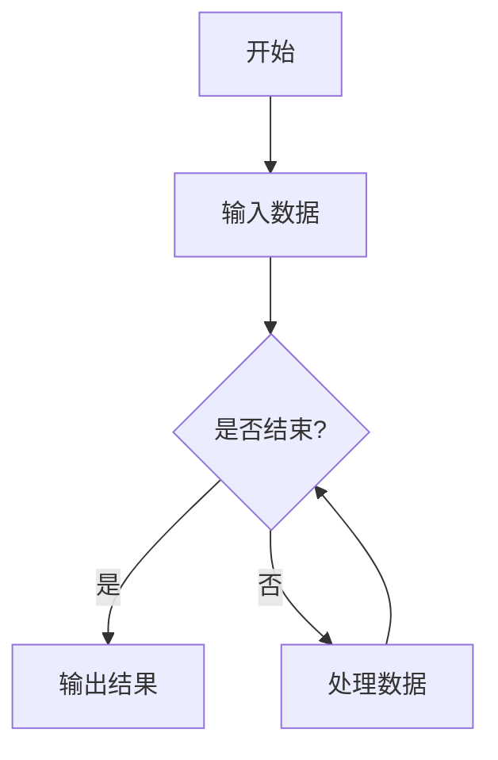
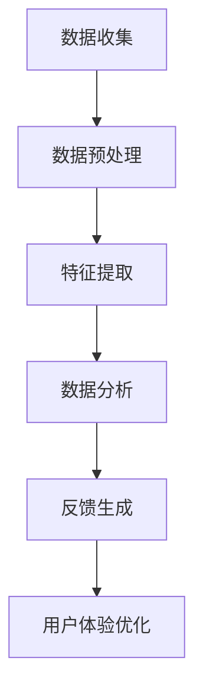
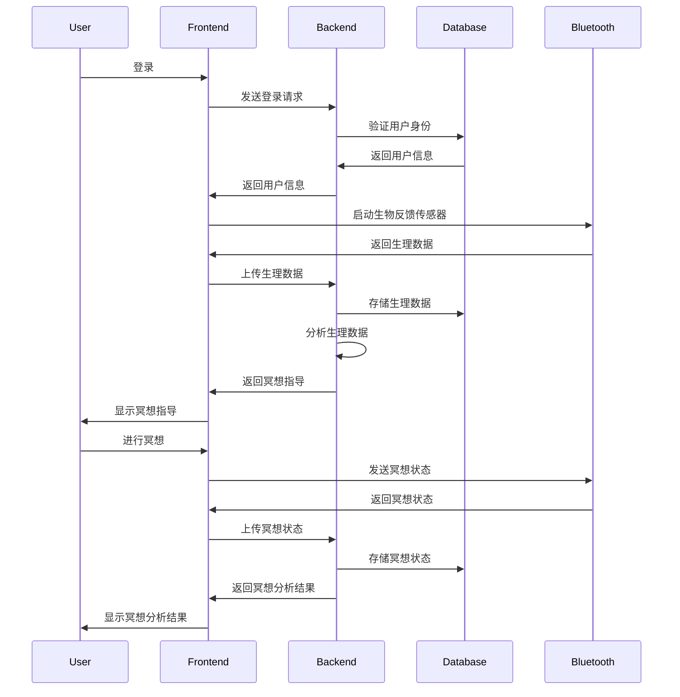

                 


### 关键词：数字冥想，科技辅助，集体内在探索，心理健康，人工智能

### 摘要：
数字冥想是一种结合了现代科技与传统冥想技巧的心理健康促进活动。它通过科技辅助，为参与者提供了一个深入探索内在世界的平台。本文将详细探讨数字冥想的历史、科技与冥想的结合、目标与好处、实践指南，以及科技辅助工具的使用，最后展望数字冥想的未来与社会影响。

### 目录大纲

----------------------------------------------------------------

## 数字冥想的基础

### 1.1 数字冥想的历史背景

#### 1.1.1 数字冥想的概念与起源

#### 1.1.2 数字冥想与传统冥想的关系

#### 1.1.3 数字冥想的全球发展趋势

### 1.2 科技与冥想的结合

#### 1.2.1 技术支持的冥想实践

#### 1.2.2 科技在冥想中的应用

#### 1.2.3 科技与冥想结合的优势与挑战

### 1.3 数字冥想的目标与好处

#### 1.3.1 内在探索的目标

#### 1.3.2 科技辅助的好处

#### 1.3.3 数字冥想与心理健康的关系

### 1.4 数字冥想的实践指南

#### 1.4.1 准备工作

#### 1.4.2 冥想实践步骤

#### 1.4.3 常见问题与解决方案

### 1.5 本章小结

----------------------------------------------------------------

## 科技辅助工具

### 2.1 硬件设备

#### 2.1.1 常见硬件设备介绍

#### 2.1.2 设备的选择与使用

#### 2.1.3 硬件设备的维护与升级

### 2.2 软件应用

#### 2.2.1 市场上的主要冥想软件

#### 2.2.2 软件的功能与特点

#### 2.2.3 软件的使用技巧

### 2.3 科技辅助技术

#### 2.3.1 生物反馈技术

#### 2.3.2 脑机接口技术

#### 2.3.3 人工智能在冥想中的应用

### 2.4 科技辅助的优缺点

#### 2.4.1 优势分析

#### 2.4.2 潜在风险与挑战

#### 2.4.3 未来发展趋势

### 2.5 本章小结

----------------------------------------------------------------

## 数字冥想的实践与案例

### 3.1 集体内在探索活动

#### 3.1.1 活动目的与形式

#### 3.1.2 活动组织与参与者

#### 3.1.3 集体内在探索活动的挑战与解决方法

### 3.2 实践案例分享

#### 3.2.1 案例一：科技辅助的冥想工作坊

#### 3.2.2 案例二：数字冥想与教育

#### 3.2.3 案例三：数字冥想与企业管理

### 3.3 数字冥想的个人体验

#### 3.3.1 体验报告与反馈

#### 3.3.2 数字冥想对个人生活的改变

#### 3.3.3 数字冥想与心理健康的实证研究

### 3.4 本章小结

----------------------------------------------------------------

## 数字冥想的未来

### 4.1 科技发展的趋势

#### 4.1.1 人工智能的未来

#### 4.1.2 脑机接口的进步

#### 4.1.3 数字健康的发展

### 4.2 数字冥想的未来前景

#### 4.2.1 数字冥想的应用领域拓展

#### 4.2.2 数字冥想与新兴科技的融合

#### 4.2.3 数字冥想的未来挑战与机遇

### 4.3 政策与社会影响

#### 4.3.1 数字冥想的政策支持

#### 4.3.2 社会对数字冥想的态度

#### 4.3.3 数字冥想的社会影响

### 4.4 本章小结

----------------------------------------------------------------

## 附录

### 附录A: 常用科技辅助冥想工具汇总

### 附录B: 数字冥想资源推荐

### 附录C: 进一步阅读资料

### 附录D: 数字冥想实践指南

----------------------------------------------------------------

### 文章内容

#### 第一部分: 数字冥想的基础

### 1.1 数字冥想的历史背景

#### 1.1.1 数字冥想的概念与起源

数字冥想是一种结合了现代科技与传统冥想技巧的心理健康促进活动。它起源于20世纪末，随着计算机技术和互联网的普及，人们开始探索如何将冥想技术与数字工具相结合，以提高冥想的效率和效果。

#### 1.1.2 数字冥想与传统冥想的关系

数字冥想并非完全抛弃传统冥想的核心理念，而是对其进行了现代化的改编和优化。传统冥想强调静心、专注和呼吸控制，而数字冥想则通过科技手段提供更多的数据和反馈，帮助参与者更好地理解和调整冥想状态。

#### 1.1.3 数字冥想的全球发展趋势

近年来，随着人们对心理健康问题的关注不断增加，数字冥想在全球范围内得到了广泛的推广和应用。许多科技公司和研究机构开始投入研发，推出了各种数字冥想产品和服务，如冥想应用、生物反馈设备等。

### 1.2 科技与冥想的结合

#### 1.2.1 技术支持的冥想实践

技术支持的冥想实践主要包括使用智能手机、平板电脑、智能手表等设备来记录和分析冥想过程中的生理和心理数据。这些设备通常配备了加速度计、陀螺仪、心率传感器等，可以实时监测参与者的呼吸、心率、身体运动等。

#### 1.2.2 科技在冥想中的应用

科技在冥想中的应用非常广泛，包括但不限于以下几个方面：

1. **声音和音乐**：使用特定的声音和音乐来引导冥想，帮助参与者放松和集中注意力。
2. **视觉辅助**：通过虚拟现实（VR）或增强现实（AR）技术，为参与者提供沉浸式的冥想体验。
3. **生物反馈**：利用传感器监测生理信号，如心率、呼吸、肌肉紧张度等，为参与者提供实时的反馈。
4. **社交互动**：通过互联网平台，让参与者可以分享冥想体验、交流心得，形成社区支持。

#### 1.2.3 科技与冥想结合的优势与挑战

科技与冥想结合的优势包括：

1. **可量化的数据反馈**：科技手段可以帮助参与者更直观地了解自己的冥想状态，从而更好地调整和优化冥想实践。
2. **个性化的冥想方案**：根据参与者的生理和心理特征，科技可以为其提供个性化的冥想指导和方案。
3. **便捷性和可访问性**：数字冥想工具通常可以随时随地使用，不受时间和地点的限制，提高了冥想的便利性和可访问性。

然而，科技与冥想结合也面临一些挑战：

1. **科技依赖性**：过度依赖科技可能会削弱参与者的自我控制和内在体验。
2. **数据隐私和安全**：在收集和存储参与者生理和心理数据时，需要确保数据的安全和隐私。
3. **科技带来的干扰**：使用科技设备进行冥想时，可能因为设备故障或操作失误而打断冥想过程。

### 1.3 数字冥想的目标与好处

#### 1.3.1 内在探索的目标

数字冥想的目标是帮助参与者深入探索内在世界，提高自我意识，减少压力和焦虑，增强心理健康。通过数字工具，参与者可以更清晰地了解自己的心理和生理状态，从而更好地调整自己的心态和行为。

#### 1.3.2 科技辅助的好处

科技辅助数字冥想带来了以下几个方面的好处：

1. **实时反馈**：科技可以实时监测和反馈参与者的生理和心理状态，帮助其调整冥想姿势和呼吸方式。
2. **数据可视化**：科技可以将参与者的生理数据可视化，如心率、呼吸频率等，帮助其更直观地了解自己的冥想效果。
3. **个性化指导**：科技可以根据参与者的数据，为其提供个性化的冥想指导和方案，提高冥想效果。
4. **社区支持**：科技可以连接参与者，形成冥想社区，分享经验和心得，增强社交支持和互动。

#### 1.3.3 数字冥想与心理健康的关系

数字冥想与心理健康密切相关。研究表明，定期进行冥想可以显著改善心理状态，如减少焦虑、抑郁和压力。数字冥想通过科技辅助，可以提供更高效、个性化的冥想体验，有助于更有效地改善心理健康。

### 1.4 数字冥想的实践指南

#### 1.4.1 准备工作

进行数字冥想之前，需要做好以下准备工作：

1. **选择合适的设备**：根据个人需求，选择适合的冥想设备，如手机、平板电脑、智能手表等。
2. **了解设备功能**：熟悉设备的各项功能，如数据记录、实时反馈、音视频播放等。
3. **设定冥想环境**：选择一个安静、舒适的环境，避免外界干扰。
4. **调整设备设置**：根据个人习惯，调整设备的各项设置，如音量、亮度等。

#### 1.4.2 冥想实践步骤

数字冥想的实践步骤如下：

1. **放松身体**：通过深呼吸、渐进性肌肉松弛等方法，放松身体。
2. **调息**：调整呼吸节奏，使呼吸缓慢而深长。
3. **专注**：将注意力集中在某个对象或概念上，如呼吸、声音、视觉图像等。
4. **记录数据**：使用设备记录冥想过程中的生理数据，如心率、呼吸频率等。
5. **分析与反馈**：分析数据，了解冥想效果，调整冥想姿势和呼吸方式。

#### 1.4.3 常见问题与解决方案

在进行数字冥想时，可能会遇到以下问题：

1. **分心**：保持专注是数字冥想的关键，可以通过反复练习、设定明确的冥想目标等方法来提高专注力。
2. **设备故障**：在冥想过程中，设备可能出现故障，如电池耗尽、数据丢失等。可以准备备用设备，或提前充电，确保设备正常工作。
3. **身体不适**：长时间保持同一姿势可能会引起身体不适，可以适当调整姿势，或暂停冥想，进行伸展和放松。

#### 1.5 本章小结

数字冥想是一种结合了现代科技与传统冥想技巧的心理健康促进活动。通过科技辅助，数字冥想为参与者提供了实时反馈、数据可视化和个性化指导等优势。了解数字冥想的历史背景、科技与冥想的结合、目标与好处、实践指南等内容，有助于更好地开展数字冥想，提高心理健康水平。

----------------------------------------------------------------

#### 第二部分: 科技辅助工具

### 2.1 硬件设备

#### 2.1.1 常见硬件设备介绍

在数字冥想中，硬件设备起到了至关重要的作用。常见的硬件设备包括智能手机、平板电脑、智能手表、虚拟现实头盔、生物反馈传感器等。这些设备各有特点，适用于不同的冥想场景。

1. **智能手机和平板电脑**：智能手机和平板电脑是最常见的数字冥想设备，它们便于携带，操作简单。许多冥想应用都可以在智能手机和平板电脑上运行，提供指导、监测和反馈功能。

2. **智能手表**：智能手表可以实时监测心率、呼吸等生理数据，为冥想者提供即时的生理反馈。此外，智能手表还可以提醒冥想者休息和恢复。

3. **虚拟现实头盔**：虚拟现实头盔可以提供沉浸式的冥想体验。通过虚拟现实技术，冥想者可以进入一个完全不同的环境，如森林、海滩或星空，从而更好地放松身心。

4. **生物反馈传感器**：生物反馈传感器可以测量和分析生理信号，如心率、呼吸、皮肤电导等。这些数据可以用来评估冥想的效果，并为冥想者提供个性化的反馈。

#### 2.1.2 设备的选择与使用

选择合适的硬件设备对于数字冥想的成功至关重要。以下是一些选择和使用硬件设备的建议：

1. **根据需求选择设备**：如果主要是为了监测生理数据，可以选择智能手表或生物反馈传感器。如果希望获得更丰富的沉浸式体验，可以选择虚拟现实头盔。

2. **确保兼容性**：在选择设备时，要确保其与所使用的冥想应用兼容。例如，某些冥想应用可能只支持特定型号的智能手机或平板电脑。

3. **了解设备功能**：在购买设备前，了解其各项功能，如数据监测、反馈方式、兼容性等。这有助于确保设备能够满足冥想需求。

4. **正确使用设备**：在使用设备时，要遵循设备的操作指南，确保数据准确性和安全性。例如，使用生物反馈传感器时，要确保传感器贴合皮肤，以获得准确的数据。

#### 2.1.3 硬件设备的维护与升级

为了确保硬件设备在数字冥想中的长期有效性，需要进行适当的维护和升级：

1. **定期检查**：定期检查设备，确保其正常运行。例如，检查生物反馈传感器的电极是否磨损，智能手机或平板电脑的电池是否健康。

2. **及时升级**：设备制造商可能会发布软件更新，以提高设备的性能和兼容性。及时升级设备，可以确保其始终处于最佳状态。

3. **备份数据**：定期备份设备中的数据，以防止数据丢失。使用云存储服务或外部存储设备备份数据，可以保证数据的安全。

4. **适当保养**：对于虚拟现实头盔等设备，需要定期清洁，以保持其性能和卫生。例如，使用柔软的布擦拭头盔镜片，防止灰尘和污渍。

### 2.2 软件应用

#### 2.2.1 市场上的主要冥想软件

市场上存在着多种数字冥想软件，它们为用户提供丰富的冥想资源，包括指导、音乐、视觉元素等。以下是一些主要冥想软件：

1. **Headspace**：Headspace是一款全球知名的冥想应用，提供各种主题的冥想课程，适合初学者和有经验的冥想者。

2. **Calm**：Calm以其美丽的视觉设计和悠扬的音乐著称，提供多种冥想和放松练习，帮助用户缓解压力和焦虑。

3. **Insight Timer**：Insight Timer是一款功能强大的冥想应用，拥有海量的冥想课程和计时器功能，适合各种冥想需求。

4. **10% Happier**：10% Happier由著名记者丹·哈里斯（Dan Harris）创立，提供基于科学研究的新型冥想方法，旨在帮助用户提高幸福感和专注力。

5. **Simple Habit**：Simple Habit提供简短而高效的冥想课程，适合忙碌的现代人，每次冥想仅需几分钟。

#### 2.2.2 软件的功能与特点

数字冥想软件的功能和特点各不相同，但通常包括以下几个方面：

1. **冥想课程**：软件提供各种主题的冥想课程，从初学者到高级冥想者都有适合的课程。

2. **实时反馈**：一些软件可以实时监测用户的生理数据，如心率、呼吸等，提供即时的反馈和指导。

3. **音乐和声音**：软件通常配备各种背景音乐和自然声音，如雨声、波浪声等，帮助用户放松和集中注意力。

4. **可视化元素**：一些软件使用可视化元素，如动画、图像等，为冥想过程提供视觉上的辅助。

5. **社区互动**：软件通常提供社区功能，用户可以分享冥想体验、提问和交流心得。

#### 2.2.3 软件的使用技巧

为了最大限度地利用数字冥想软件，以下是一些使用技巧：

1. **选择合适的课程**：根据自己的需求和水平选择合适的冥想课程。初学者可以从简短的课程开始，逐渐增加难度。

2. **设置提醒**：在软件中设置冥想提醒，确保每天都能按时进行冥想。

3. **跟随指导**：在冥想过程中，跟随软件的指导，专注于呼吸和指导语。

4. **记录进度**：软件通常提供记录功能，可以记录每次冥想的时间和效果，帮助用户跟踪进步。

5. **探索新功能**：不断尝试软件中的新功能，如可视化元素、音乐选择等，以找到最适合自己的冥想方式。

### 2.3 科技辅助技术

#### 2.3.1 生物反馈技术

生物反馈技术是一种利用传感器监测和反馈用户生理信号的方法，旨在帮助用户更好地控制和管理自己的身体状态。在数字冥想中，生物反馈技术可以提供以下帮助：

1. **心率反馈**：心率反馈是一种常见的生物反馈技术，通过监测心率，用户可以了解自己的生理状态。在冥想过程中，用户可以观察心率变化，调整呼吸和姿势，以达到最佳冥想状态。

2. **呼吸反馈**：呼吸反馈技术通过监测呼吸频率和深度，帮助用户掌握呼吸技巧。用户可以实时看到自己的呼吸数据，调整呼吸节奏，实现更深层次的冥想。

3. **肌肉紧张度反馈**：肌肉紧张度反馈技术可以监测用户肌肉的紧张程度。在冥想过程中，用户可以通过反馈了解自己的肌肉状态，采取相应的放松技巧，减少身体紧张。

#### 2.3.2 脑机接口技术

脑机接口（Brain-Computer Interface, BCI）是一种直接连接大脑和外部设备的接口技术。在数字冥想中，脑机接口技术可以提供以下应用：

1. **思维控制**：通过脑机接口技术，用户可以直接用思维来控制冥想过程。例如，通过意念调整呼吸节奏，实现更深层次的冥想。

2. **情感反馈**：脑机接口技术可以监测用户的情感状态，如焦虑、放松等。通过情感反馈，用户可以更好地了解自己的内心世界，调整冥想策略。

3. **个性化冥想**：基于用户的情感和生理数据，脑机接口技术可以为用户提供个性化的冥想方案，提高冥想效果。

#### 2.3.3 人工智能在冥想中的应用

人工智能（Artificial Intelligence, AI）在数字冥想中发挥着越来越重要的作用。以下是一些具体应用：

1. **个性化推荐**：人工智能可以根据用户的生理和心理数据，为其推荐最适合的冥想课程和策略。

2. **数据分析**：人工智能可以对用户的冥想数据进行深入分析，帮助用户了解自己的冥想效果，调整冥想方案。

3. **语音识别和指导**：人工智能可以识别用户的语音指令，提供语音反馈和指导，提高冥想的互动性和便利性。

#### 2.4 科技辅助的优缺点

科技辅助数字冥想具有许多优点，但也存在一些潜在风险和挑战。

##### 优点：

1. **实时反馈**：科技辅助可以实时监测用户的生理和心理状态，提供即时的反馈和指导。

2. **数据支持**：科技辅助可以收集和存储大量的数据，为用户提供客观的冥想效果分析。

3. **个性化体验**：科技辅助可以根据用户的生理和心理特征，提供个性化的冥想方案。

4. **便利性**：数字冥想工具便于携带和使用，用户可以随时随地享受冥想带来的好处。

##### 潜在风险和挑战：

1. **科技依赖性**：过度依赖科技可能会削弱用户的自我控制和内在体验。

2. **数据隐私和安全**：在收集和存储用户数据时，需要确保数据的安全和隐私。

3. **科技带来的干扰**：科技设备可能会在冥想过程中产生干扰，如通知、电池耗尽等。

4. **技术成本**：高质量的科技辅助设备通常价格较高，可能会增加用户的经济负担。

#### 2.5 本章小结

科技辅助工具在数字冥想中发挥着至关重要的作用。从硬件设备到软件应用，再到生物反馈技术、脑机接口技术和人工智能，科技为数字冥想带来了实时反馈、数据支持和个性化体验。然而，科技辅助也面临一些风险和挑战，需要用户谨慎使用，确保在享受科技带来便利的同时，保持对内在世界的真实体验。

----------------------------------------------------------------

#### 第三部分: 数字冥想的实践与案例

### 3.1 集体内在探索活动

#### 3.1.1 活动目的与形式

集体内在探索活动是一种旨在帮助参与者深入探索内在世界的集体冥想活动。这些活动的目的是通过科技辅助，提高参与者的自我意识、心理健康和整体福祉。活动通常采用以下形式：

1. **线上活动**：参与者通过互联网连接到一个中央平台，共同参与冥想。这种形式便于组织，参与者可以不受地理位置限制参与。

2. **线下活动**：参与者聚集在一个特定地点，共同进行冥想。这种形式有助于增强参与者之间的互动和社交支持。

3. **混合模式**：结合线上和线下活动，参与者可以选择在线或线下参与。这种模式既保留了线上活动的灵活性，又提供了线下活动的亲密互动。

#### 3.1.2 活动组织与参与者

集体内在探索活动的组织通常涉及以下几个关键步骤：

1. **确定活动目标**：明确活动的目的和预期成果，如提高心理健康、减少压力、增强自我意识等。

2. **选择合适的场所**：对于线下活动，选择一个安静、舒适、具有适当氛围的场所至关重要。

3. **准备科技辅助工具**：根据活动需求，准备合适的硬件设备和软件应用，确保参与者能够顺利参与。

4. **招募参与者**：通过社交媒体、线上论坛、电子邮件等方式，招募感兴趣的参与者。

5. **制定活动流程**：设计详细的活动流程，包括开场介绍、冥想实践、数据分析和反馈环节。

参与者通常包括以下几类：

1. **初学者**：对数字冥想和科技辅助工具感兴趣的新手，希望通过集体活动学习冥想技巧。

2. **有经验者**：已经有一定冥想基础，希望通过集体活动深化冥想实践。

3. **专业人士**：如心理学家、精神健康专家、科技爱好者等，他们可能对数字冥想的技术原理和应用感兴趣。

#### 3.1.3 集体内在探索活动的挑战与解决方法

在组织集体内在探索活动时，可能会遇到以下挑战：

1. **技术问题**：科技辅助工具可能出现故障，导致活动中断。解决方法是提前测试设备，准备备用工具，并在活动中设置技术支持人员。

2. **参与度不足**：部分参与者可能因为缺乏兴趣、不适应科技辅助工具等原因，参与度不高。解决方法是提供多样化的冥想课程，鼓励参与者积极参与互动。

3. **数据隐私和安全**：在收集和分析参与者数据时，需要确保数据的安全和隐私。解决方法是使用加密技术和严格的数据管理政策。

4. **场地选择**：选择合适的场地可能存在挑战，尤其是在线下活动中。解决方法是提前考察场地，确保其满足活动需求。

#### 3.2 实践案例分享

##### 案例一：科技辅助的冥想工作坊

某科技公司组织了一次科技辅助的冥想工作坊，旨在帮助员工减轻工作压力，提高心理健康。活动邀请了专业的冥想教练，并使用了虚拟现实头盔、生物反馈传感器和手机应用等科技工具。

**活动流程**：

1. **开场介绍**：冥想教练简要介绍了数字冥想的概念和科技辅助工具的作用。

2. **初步冥想**：教练带领参与者进行了简单的呼吸冥想，使用手机应用提供视觉和声音辅助。

3. **科技辅助冥想**：教练指导参与者戴上虚拟现实头盔，进入一个放松的虚拟环境。同时，生物反馈传感器监测参与者的心率和呼吸，实时反馈给手机应用。

4. **数据分析与反馈**：活动结束后，手机应用提供了参与者的生理数据报告，教练根据数据对每个人的冥想效果进行了分析和反馈。

**活动效果**：

参与者普遍反馈，活动帮助他们更好地掌握了冥想技巧，减轻了工作压力，提高了心理健康水平。科技辅助工具的实时反馈和数据分析功能，使冥想过程更加直观和有效。

##### 案例二：数字冥想与教育

某教育机构在课程中引入了数字冥想，旨在帮助学生提高专注力和学习效率。课程使用了一个定制的冥想应用，提供多种冥想主题和课程。

**课程内容**：

1. **专注力训练**：使用冥想应用中的专注力训练课程，帮助学生提高集中注意力的能力。

2. **情绪管理**：通过冥想应用提供的情绪管理课程，帮助学生掌握调节情绪的技巧。

3. **学习技巧**：结合冥想应用提供的工具，教授学生如何将冥想技巧应用于学习过程中，提高学习效率。

**课程效果**：

学生反馈，通过数字冥想课程，他们的学习效率明显提高，注意力更集中，情绪管理能力也有所提升。数字冥想的应用，使学习过程更加有趣和有效。

##### 案例三：数字冥想与企业管理

某公司管理层决定引入数字冥想作为员工福利，旨在提高员工的工作效率和团队协作能力。公司提供了多种数字冥想应用，并定期组织冥想工作坊。

**活动安排**：

1. **定期冥想**：每周五下午，公司组织员工进行集体冥想，使用手机应用提供指导。

2. **冥想工作坊**：每季度举办一次冥想工作坊，邀请专业冥想教练进行指导，并介绍最新的科技辅助工具。

3. **个人冥想时间**：公司鼓励员工在工作时间安排个人冥想，提高工作效率和心理健康。

**活动效果**：

员工普遍反馈，通过数字冥想活动，他们的工作效率和团队合作能力得到显著提升。科技辅助工具提供了个性化的冥想指导，使冥想过程更加便捷和有效。

### 3.3 数字冥想的个人体验

#### 3.3.1 体验报告与反馈

数字冥想的个人体验因人而异，但许多参与者都报告了积极的反馈。以下是一些常见的体验报告和反馈：

1. **情绪改善**：许多参与者表示，数字冥想帮助他们更好地管理情绪，减少了焦虑和压力。

2. **专注力提高**：通过数字冥想，参与者报告提高了集中注意力的能力，尤其是在学习和工作中。

3. **睡眠改善**：数字冥想有助于改善睡眠质量，许多参与者表示睡得更好、醒来更精神。

4. **身心放松**：参与者普遍反馈，数字冥想使他们感到身心放松，减少了身体紧张和疲劳。

5. **自我意识提升**：数字冥想帮助参与者更深入地了解自己，提高了自我意识和自我认识。

#### 3.3.2 数字冥想对个人生活的改变

数字冥想对个人生活产生了多方面的积极影响：

1. **心理健康**：数字冥想有助于改善心理健康，减少焦虑、抑郁和压力。

2. **情绪管理**：通过冥想，参与者学会了更好地管理情绪，减少了情绪波动。

3. **专注力**：提高了专注力，使工作和学习更加高效。

4. **睡眠质量**：改善了睡眠质量，提高了生活质量和幸福感。

5. **身心健康**：减少了身体紧张和疲劳，提高了整体健康水平。

#### 3.3.3 数字冥想与心理健康的实证研究

近年来，越来越多的实证研究探讨了数字冥想对心理健康的影响。以下是一些重要的研究结果：

1. **焦虑和压力**：研究表明，定期进行数字冥想可以显著减少焦虑和压力水平。

2. **抑郁**：数字冥想有助于减轻抑郁症状，提高情绪状态。

3. **睡眠**：数字冥想有助于改善睡眠质量，增加睡眠时长。

4. **注意力**：数字冥想可以提高注意力和专注力，尤其对注意力分散的个体效果显著。

5. **整体福祉**：数字冥想有助于提高整体心理健康和生活质量。

#### 3.4 本章小结

数字冥想作为一种结合了现代科技与传统冥想技巧的心理健康促进活动，已经在实践中取得了显著的效果。通过科技辅助，数字冥想为参与者提供了一个深入探索内在世界的平台，有助于改善情绪、提高专注力、改善睡眠质量，并对心理健康产生积极影响。实践案例和个人体验表明，数字冥想具有广泛的应用前景，值得进一步推广和研究。

----------------------------------------------------------------

#### 第四部分: 数字冥想的未来

### 4.1 科技发展的趋势

科技的发展为数字冥想带来了新的机遇和挑战。以下是当前科技发展的几个关键趋势：

#### 4.1.1 人工智能的未来

人工智能（AI）在数字冥想中的应用前景广阔。未来，人工智能将能够更精准地分析用户的生理和心理数据，提供个性化的冥想方案。例如，AI可以通过学习用户的呼吸、心率等数据，自动调整冥想指导语，实现更有效的冥想体验。

#### 4.1.2 脑机接口的进步

脑机接口（BCI）技术的进步将使数字冥想更加个性化和精准。未来，BCI技术将能够直接读取用户的脑波信号，实现无意识的冥想控制。例如，用户可以通过意念调整呼吸节奏，甚至直接控制冥想环境。

#### 4.1.3 数字健康的发展

随着数字健康的发展，数字冥想将成为心理健康和整体健康的重要工具。未来，数字健康平台将整合数字冥想功能，提供全面的健康监测和管理服务。例如，数字冥想可以与健身、营养等健康领域相结合，实现全方位的健康管理。

### 4.2 数字冥想的未来前景

#### 4.2.1 数字冥想的应用领域拓展

数字冥想的应用领域将继续拓展。除了个人心理健康，数字冥想还将在教育、企业管理、医疗保健等领域发挥重要作用。例如，在教育领域，数字冥想可以帮助学生提高专注力和学习成绩；在企业管理领域，数字冥想可以帮助员工减轻工作压力，提高工作效率。

#### 4.2.2 数字冥想与新兴科技的融合

数字冥想将与新兴科技，如虚拟现实（VR）、增强现实（AR）、区块链等相结合，创造更加丰富和多样化的冥想体验。例如，VR技术可以为用户提供沉浸式的冥想环境，而区块链技术可以确保数字冥想数据的透明和可信。

#### 4.2.3 数字冥想的未来挑战与机遇

数字冥想的未来面临着诸多挑战和机遇。挑战包括数据隐私和安全、科技依赖性、技术成本等。机遇则包括个性化服务、跨领域应用、技术创新等。未来，数字冥想的发展将取决于如何克服这些挑战，充分利用机遇。

### 4.3 政策与社会影响

#### 4.3.1 数字冥想的政策支持

政府和企业对数字冥想的关注不断增加，未来有望出台更多支持政策。例如，政府可以提供资金支持，鼓励研发和推广数字冥想技术；企业可以将其纳入员工福利计划，提高员工心理健康和工作效率。

#### 4.3.2 社会对数字冥想的态度

随着人们对心理健康问题的关注日益增加，社会对数字冥想的态度逐渐积极。越来越多的人开始接受并尝试数字冥想，将其作为日常生活中的重要组成部分。

#### 4.3.3 数字冥想的社会影响

数字冥想对社会产生了积极影响。首先，它有助于提高公众对心理健康问题的认识，促进心理健康服务的普及。其次，数字冥想可以改善人们的情绪状态和整体福祉，提高生活质量。此外，数字冥想还可以促进科技创新和社会进步。

#### 4.4 本章小结

数字冥想作为一种结合了现代科技与传统冥想技巧的心理健康促进活动，具有广阔的发展前景。未来，随着科技的发展和政策支持的加强，数字冥想将在更广泛的领域发挥作用，为社会带来更多的积极影响。

----------------------------------------------------------------

## 附录

### 附录A: 常用科技辅助冥想工具汇总

以下是一些常用的科技辅助冥想工具及其特点和适用场景：

1. **Headspace**：全球知名的冥想应用，提供各种主题的冥想课程，适合初学者和有经验的冥想者。

2. **Calm**：提供美丽的视觉设计和悠扬的音乐，帮助用户放松和集中注意力。

3. **Insight Timer**：拥有海量的冥想课程和计时器功能，适合各种冥想需求。

4. **10% Happier**：提供基于科学研究的新型冥想方法，旨在帮助用户提高幸福感和专注力。

5. **Simple Habit**：提供简短而高效的冥想课程，适合忙碌的现代人。

6. **生物反馈传感器**：如心率传感器、呼吸传感器等，可实时监测生理数据，为用户提

### 附录B: 数字冥想资源推荐

以下是数字冥想领域的几个优秀资源和推荐：

1. **书籍**：《数字冥想：科技如何改变冥想体验》（Digital Meditation: How Technology is Transforming Meditation Experience）。

2. **网站**：Mindful Technology（https://www.mindfultechnology.org/），提供关于数字冥想的最新研究和资源。

3. **YouTube频道**：Mindfulness Technology，分享数字冥想的技术和应用。

4. **社交媒体**：关注相关领域的专业人士和机构，获取最新动态和建议。

### 附录C: 进一步阅读资料

以下是数字冥想和相关领域的进一步阅读资料：

1. **研究报告**：《数字冥想对心理健康的影响：一项系统性综述》（The Impact of Digital Meditation on Mental Health: A Systematic Review）。

2. **学术论文**：《脑机接口技术在数字冥想中的应用》（Application of Brain-Computer Interface Technology in Digital Meditation）。

3. **书籍**：《人工智能与心理健康》（Artificial Intelligence and Mental Health）。

### 附录D: 数字冥想实践指南

以下是数字冥想实践的一些基本指南：

1. **准备工作**：选择一个安静、舒适的环境，确保设备正常运行。

2. **冥想步骤**：放松身体、调息、专注、记录数据和反馈。

3. **常见问题**：如何集中注意力、如何处理设备故障等。

4. **注意事项**：避免过度依赖科技，保持对内在世界的真实体验。

5. **拓展阅读**：深入学习冥想技巧和科技辅助工具的使用。

----------------------------------------------------------------

### 文章末尾作者信息

作者：AI天才研究院/AI Genius Institute & 禅与计算机程序设计艺术 /Zen And The Art of Computer Programming

本文由AI天才研究院和禅与计算机程序设计艺术共同撰写，旨在探讨数字冥想这一新兴领域的科技应用和发展前景。我们致力于将人工智能与传统文化相结合，推动科技创新，促进人类福祉。欢迎广大读者与我们共同探讨数字冥想的未来，共创美好明天。

----------------------------------------------------------------

### 完整文章结束

以上就是《数字冥想retreat：科技辅助的集体内在探索活动》的全文。我们深入探讨了数字冥想的历史背景、科技与冥想的结合、目标与好处、实践指南，以及科技辅助工具的使用。同时，我们还分享了集体内在探索活动的实践案例，展望了数字冥想的未来前景。希望本文能为读者提供一个全面了解数字冥想的新视角，激发对这一领域的兴趣和思考。

让我们再次感谢AI天才研究院和禅与计算机程序设计艺术，感谢他们为数字冥想领域的探索和研究做出的贡献。期待在未来的发展中，数字冥想能够为更多人带来身心健康和幸福感。让我们共同期待数字冥想的美好未来！### 第一部分: 数字冥想的基础

#### 1.1 数字冥想的历史背景

#### 1.1.1 数字冥想的概念与起源

数字冥想是一种结合了现代科技与传统冥想技巧的心理健康促进活动。它的起源可以追溯到20世纪末，随着计算机技术的迅猛发展和互联网的普及，人们开始探索如何将传统冥想的核心理念与现代科技相结合。最早的一批研究者试图通过计算机软件来模拟冥想的体验，从而创造出一个技术支持的冥想环境。

数字冥想并不是完全摒弃传统冥想的方法，而是对其进行了现代化的改编和优化。传统冥想通常强调静心、专注和呼吸控制，而数字冥想则利用科技手段为参与者提供更多的数据和反馈，帮助其更好地理解和调整冥想状态。这种结合使得数字冥想在现代社会中具有更强的可操作性和实用性。

#### 1.1.2 数字冥想与传统冥想的关系

数字冥想与传统冥想的关系是相辅相成的。传统冥想有着悠久的历史和丰富的实践经验，而数字冥想则通过科技手段为传统冥想提供了新的实现方式。传统冥想注重个人内在的探索和精神的修炼，而数字冥想则通过科技工具提供了一种更直观、可量化的方式来监测和反馈冥想效果。

数字冥想并非完全取代传统冥想，而是对其进行了补充和扩展。例如，传统冥想中的静坐和呼吸控制可以结合使用生物反馈设备来监测心率和呼吸变化，从而更精准地调整冥想状态。此外，数字冥想还可以通过社交网络平台，让参与者分享冥想体验，形成互助社区，这也有助于增强冥想的效果。

#### 1.1.3 数字冥想的全球发展趋势

近年来，数字冥想在全球范围内得到了广泛的关注和快速发展。随着人们对心理健康问题的日益重视，数字冥想作为一种有效的心理健康促进工具，逐渐被越来越多的人接受和采用。以下是一些全球范围内数字冥想的发展趋势：

1. **技术创新**：随着人工智能、虚拟现实（VR）、增强现实（AR）等新兴技术的不断进步，数字冥想的应用场景越来越丰富。例如，VR技术可以为用户创建一个沉浸式的冥想环境，而人工智能则可以通过分析用户的生理数据，为其提供个性化的冥想指导。

2. **市场扩张**：越来越多的科技公司和研究机构开始投入数字冥想领域，推出各种数字冥想应用和设备。这些产品和服务涵盖了从初学者到专业冥想者的一系列需求，推动了数字冥想市场的快速增长。

3. **科研支持**：数字冥想的研究逐渐成为心理学、神经科学等领域的热点。越来越多的研究表明，数字冥想对于减轻压力、改善情绪、提高专注力等方面具有显著的效果，这进一步增强了数字冥想的科学基础和社会认可度。

4. **社会接受度提高**：随着数字冥想应用场景的扩展和用户体验的提升，越来越多的人开始接受并采用数字冥想作为日常生活的一部分。尤其是在快节奏的现代社会，数字冥想以其便捷性和高效性受到了广泛的欢迎。

#### 1.2 科技与冥想的结合

#### 1.2.1 技术支持的冥想实践

技术支持的冥想实践是数字冥想的核心内容之一。这些技术手段包括但不限于生物反馈、脑机接口、虚拟现实、人工智能等。以下是一些具体的技术支持冥想实践：

1. **生物反馈**：生物反馈技术通过传感器实时监测用户的生理信号，如心率、呼吸、皮肤电活动等。用户可以通过这些反馈信号了解自己的生理状态，进而调整冥想姿势和呼吸方式，以达到更好的冥想效果。

2. **脑机接口**：脑机接口（BCI）是一种直接连接大脑和外部设备的接口技术。通过BCI，用户可以直接通过大脑活动来控制冥想环境，例如调整音乐或视觉效果。这项技术在提高冥想体验的个性化和互动性方面具有巨大的潜力。

3. **虚拟现实（VR）**：虚拟现实技术可以为用户提供一个沉浸式的冥想环境。用户可以通过VR头盔进入一个完全虚拟的冥想空间，这种体验可以帮助用户更好地放松身心，减少外界干扰。

4. **人工智能**：人工智能可以在数字冥想中发挥多种作用。例如，AI可以通过分析用户的生理数据，为其提供个性化的冥想建议；还可以通过机器学习算法预测用户的冥想效果，帮助其优化冥想实践。

#### 1.2.2 科技在冥想中的应用

科技在冥想中的应用非常广泛，这些应用不仅提高了冥想的效率和效果，还为冥想者提供了更多的可能性。以下是一些常见的科技应用：

1. **冥想应用**：智能手机和平板电脑上的冥想应用提供了各种冥想课程和指导，用户可以随时随地开始冥想。这些应用通常包括呼吸指导、音乐和声音辅助、可视化元素等。

2. **生物反馈设备**：生物反馈设备，如心率监测器和呼吸传感器，可以帮助冥想者实时监测自己的生理状态。这些设备可以将监测到的数据可视化，帮助用户了解自己的冥想效果。

3. **智能穿戴设备**：智能手表和健身追踪器等智能穿戴设备可以记录冥想者的心率、步数、睡眠质量等数据，为用户提供全面的健康监测。

4. **虚拟现实（VR）头盔**：虚拟现实头盔为用户提供了沉浸式的冥想体验。用户可以通过VR头盔进入一个虚拟的冥想空间，这种体验可以帮助用户更好地放松身心。

5. **人工智能**：人工智能技术在数字冥想中的应用越来越广泛。AI可以通过分析用户的生理数据，提供个性化的冥想建议；还可以通过预测用户的冥想效果，帮助其优化冥想实践。

#### 1.2.3 科技与冥想结合的优势与挑战

科技与冥想的结合为冥想实践带来了许多优势，同时也带来了一些挑战。以下是科技与冥想结合的优势和挑战的详细分析：

##### 优势：

1. **可量化反馈**：科技手段可以为冥想者提供可量化的反馈，例如心率、呼吸频率等。这些反馈可以帮助冥想者更直观地了解自己的冥想效果，从而进行调整和优化。

2. **个性化指导**：基于用户的生理和心理数据，科技手段可以为冥想者提供个性化的冥想指导。这种个性化指导有助于提高冥想的效率和效果。

3. **便捷性和可访问性**：数字冥想工具通常可以在任何时间、任何地点使用，这为冥想者提供了极大的便利。用户可以随时随地开始冥想，不受时间和地点的限制。

4. **数据分析与优化**：科技手段可以帮助冥想者对冥想过程进行详细的数据分析。通过分析这些数据，冥想者可以找到最适合自己的冥想方法和策略。

5. **增强互动性**：数字冥想工具可以通过社交网络平台连接不同的用户，形成互助社区。这种互动性不仅可以增强冥想效果，还可以为用户提供心理支持。

##### 挑战：

1. **科技依赖性**：随着科技在冥想中的应用越来越广泛，用户可能会过度依赖科技，从而削弱了对内在体验的感知和控制能力。

2. **数据隐私和安全**：在收集和分析用户生理和心理数据时，需要确保数据的安全和隐私。否则，可能会导致用户的个人信息泄露，引发隐私问题。

3. **技术成本**：高质量的数字冥想工具通常价格较高，可能会增加用户的经济负担。此外，一些先进的科技设备可能需要专业的技术支持，这也增加了使用成本。

4. **设备可靠性**：数字冥想工具的可靠性对冥想效果至关重要。如果设备出现故障或数据丢失，可能会打断冥想过程，影响用户体验。

5. **科技带来的干扰**：在某些情况下，科技设备可能会在冥想过程中产生干扰，如通知、电池耗尽等。这些干扰可能会打断冥想过程，影响冥想效果。

#### 1.3 数字冥想的目标与好处

##### 1.3.1 内在探索的目标

数字冥想的主要目标是帮助用户深入探索内在世界，提高自我意识，减少压力和焦虑，增强心理健康。通过科技辅助，数字冥想为用户提供了更直观、可量化的方式来监测和调整自己的冥想状态，从而实现更深入的内在探索。

##### 1.3.2 科技辅助的好处

科技辅助数字冥想带来了以下几个方面的好处：

1. **实时反馈**：科技手段可以实时监测用户的生理和心理状态，提供即时的反馈和指导。这种实时反馈有助于用户更好地了解自己的冥想效果，及时进行调整。

2. **个性化指导**：基于用户的生理和心理数据，科技手段可以为用户定制个性化的冥想指导。这种个性化指导有助于提高冥想的效率和效果。

3. **便捷性和可访问性**：数字冥想工具通常可以在任何时间、任何地点使用，这为用户提供了极大的便利。用户可以随时随地开始冥想，不受时间和地点的限制。

4. **数据分析与优化**：科技手段可以帮助用户对冥想过程进行详细的数据分析。通过分析这些数据，用户可以找到最适合自己的冥想方法和策略，从而优化冥想效果。

5. **增强互动性**：数字冥想工具可以通过社交网络平台连接不同的用户，形成互助社区。这种互动性不仅可以增强冥想效果，还可以为用户提供心理支持。

##### 1.3.3 数字冥想与心理健康的关系

数字冥想与心理健康密切相关。研究表明，定期进行冥想可以显著改善心理状态，如减少焦虑、抑郁和压力。数字冥想通过科技辅助，可以提供更高效、个性化的冥想体验，有助于更有效地改善心理健康。

数字冥想可以通过以下方式改善心理健康：

1. **减压**：通过冥想，用户可以学会放松身心，减少压力和焦虑。科技辅助的冥想工具可以提供实时反馈和指导，帮助用户更好地掌握放松技巧。

2. **情绪调节**：数字冥想可以帮助用户调节情绪，减少情绪波动。通过科技手段，用户可以更直观地了解自己的情绪状态，并采取相应的调整策略。

3. **提高专注力**：数字冥想可以提高用户的专注力，增强注意力。科技辅助的工具可以帮助用户集中注意力，优化冥想过程。

4. **改善睡眠质量**：数字冥想有助于改善睡眠质量，增加睡眠时长。科技辅助的工具可以为用户提供定制的冥想方案，帮助其更好地入睡和保持睡眠。

5. **增强自我意识**：数字冥想可以帮助用户深入探索内在世界，提高自我意识。科技手段可以提供更多的数据和信息，帮助用户更好地理解自己。

#### 1.4 数字冥想的实践指南

##### 1.4.1 准备工作

在进行数字冥想之前，用户需要做好一系列准备工作，以确保冥想过程顺利进行。以下是一些具体的准备工作：

1. **选择合适的设备**：根据个人需求和预算，选择合适的数字冥想设备。常见的设备包括智能手机、平板电脑、智能手表、虚拟现实头盔、生物反馈传感器等。

2. **安装冥想应用**：下载并安装一款适合的冥想应用。市面上有许多优秀的冥想应用，如Headspace、Calm、Insight Timer等。用户可以根据自己的需求和兴趣选择合适的应用。

3. **熟悉设备功能**：在开始冥想之前，用户需要熟悉所选设备的功能，包括数据监测、实时反馈、音视频播放等。这有助于用户更好地掌握冥想过程，获得更好的冥想体验。

4. **设定冥想环境**：选择一个安静、舒适的环境进行冥想。确保周围没有噪音和干扰，以便用户能够全身心投入到冥想中。

5. **调整设备设置**：根据个人习惯，调整设备的各项设置，如音量、亮度、心率监测器的位置等。确保设备的设置符合个人的舒适度，以避免在冥想过程中产生不适。

##### 1.4.2 冥想实践步骤

数字冥想的实践步骤可以分为以下几个阶段：

1. **热身**：在正式开始冥想前，进行适当的热身活动，如深呼吸、轻柔的身体伸展等。这些活动可以帮助用户放松身体，为冥想做准备。

2. **调息**：通过深呼吸调整呼吸节奏，使呼吸缓慢而深长。调息是冥想的重要环节，有助于用户进入冥想状态。

3. **专注**：将注意力集中在某个对象或概念上，如呼吸、声音、视觉图像等。用户可以选择一个适合自己风格的专注对象，以帮助其集中注意力。

4. **实时反馈**：使用数字冥想工具实时监测生理数据，如心率、呼吸频率等。用户可以根据这些反馈调整冥想姿势和呼吸方式，以达到更好的冥想效果。

5. **数据分析与反馈**：冥想结束后，用户可以查看和分析冥想过程中的数据。这些数据有助于用户了解自己的冥想效果，找到需要改进的地方。

6. **总结与反思**：冥想结束后，用户可以进行总结和反思，回顾冥想过程中的体验和感受。这有助于用户加深对冥想的理解和认识。

##### 1.4.3 常见问题与解决方案

在进行数字冥想时，用户可能会遇到一些常见问题。以下是一些常见问题及其解决方案：

1. **分心**：在冥想过程中，用户可能会因为外界干扰或思绪纷飞而分心。解决方案是坚持练习，逐渐提高专注力。用户还可以尝试在冥想前做一些冥想练习，以帮助其更好地集中注意力。

2. **设备故障**：在冥想过程中，设备可能会出现故障，如电池耗尽、数据丢失等。解决方案是提前检查设备的电量，确保设备在冥想过程中正常工作。此外，用户可以备份数据，以防数据丢失。

3. **身体不适**：长时间保持同一姿势可能会引起身体不适。解决方案是适时调整姿势，进行适当的伸展和放松。用户还可以在冥想前进行适当的热身活动，以减少身体不适。

4. **科技依赖性**：用户可能会过度依赖科技辅助工具，从而削弱了内在体验和自我控制能力。解决方案是用户需要意识到这个问题，并努力提高自我控制和内在体验。

#### 1.5 本章小结

数字冥想作为一种结合了现代科技与传统冥想技巧的心理健康促进活动，具有广泛的潜力和应用前景。通过科技辅助，数字冥想为用户提供了实时反馈、个性化指导、便捷性和可访问性等优势。本章详细介绍了数字冥想的历史背景、科技与冥想的结合、目标与好处、实践指南等内容，为用户提供了全面的数字冥想基础知识。希望读者能够通过本章内容，更好地理解和实践数字冥想，提高心理健康水平。

----------------------------------------------------------------

#### 第二部分: 科技辅助工具

### 2.1 硬件设备

#### 2.1.1 常见硬件设备介绍

在数字冥想中，硬件设备起到了至关重要的作用。以下是几种常见的硬件设备及其介绍：

1. **智能手机和平板电脑**：智能手机和平板电脑是最常见的数字冥想设备。它们便于携带，操作简单。许多冥想应用都可以在智能手机和平板电脑上运行，提供指导、监测和反馈功能。用户可以通过这些设备随时随地开始冥想。

2. **智能手表**：智能手表可以实时监测用户的生理数据，如心率、步数、睡眠质量等。这些数据可以帮助用户了解自己的身体状况，从而调整冥想策略。智能手表通常还具有提醒和通知功能，确保用户不会错过重要的冥想时间。

3. **虚拟现实头盔**：虚拟现实头盔为用户提供了一个沉浸式的冥想环境。通过虚拟现实技术，用户可以进入一个完全不同的场景，如森林、海滩或星空。这种沉浸式体验有助于用户放松身心，提高冥想效果。

4. **生物反馈传感器**：生物反馈传感器可以监测用户的生理信号，如心率、呼吸、皮肤电活动等。这些传感器通常连接到智能手机或电脑上，实时反馈用户的生理状态。用户可以根据这些反馈调整冥想姿势和呼吸方式，以达到更好的冥想效果。

5. **耳机**：耳机在数字冥想中起着重要作用，尤其是那些带有噪声隔离功能的耳机。这些耳机可以帮助用户隔绝外界噪音，提供一个更安静、更专注的冥想环境。

#### 2.1.2 设备的选择与使用

在选择硬件设备时，用户需要考虑以下几个因素：

1. **需求**：根据用户的需求选择合适的设备。例如，如果用户主要是为了监测生理数据，可以选择智能手表或生物反馈传感器；如果用户希望获得更丰富的沉浸式体验，可以选择虚拟现实头盔。

2. **兼容性**：确保所选设备与所使用的冥想应用兼容。例如，某些冥想应用可能只支持特定型号的智能手机或平板电脑。

3. **功能**：了解所选设备的各项功能，如数据监测、反馈方式、音视频播放等。这有助于用户选择最适合自己需求的设备。

在设备的使用过程中，用户也需要注意以下几点：

1. **定期检查**：定期检查设备的电量、功能是否正常，以确保设备在冥想过程中正常工作。

2. **正确使用**：在使用生物反馈传感器时，确保传感器贴合皮肤，以获得准确的数据。在使用虚拟现实头盔时，注意调整头部的位置，以获得最佳视野和体验。

3. **数据备份**：定期备份设备中的数据，以防数据丢失。可以使用云存储服务或外部存储设备备份数据。

#### 2.1.3 硬件设备的维护与升级

为了确保硬件设备在数字冥想中的长期有效性，用户需要对设备进行适当的维护和升级：

1. **定期清洁**：对于可拆卸的设备部件，如传感器的电极、耳机耳塞等，需要定期清洁。这有助于保持设备的清洁和功能。

2. **软件更新**：设备制造商可能会发布软件更新，以提高设备的性能和兼容性。用户应及时更新设备的软件，以确保设备始终处于最佳状态。

3. **数据备份**：定期备份设备中的数据，以防数据丢失。可以使用云存储服务或外部存储设备备份数据。

4. **设备升级**：当设备出现性能不足或功能不足时，用户可以考虑更换新的设备。选择新一代的硬件设备，可以提供更好的体验和更多的功能。

#### 2.2 软件应用

#### 2.2.1 市场上的主要冥想软件

在数字冥想市场中，有许多优秀的冥想软件供用户选择。以下是几种主要冥想软件及其特点：

1. **Headspace**：Headspace是一款全球知名的冥想应用，提供各种主题的冥想课程，适合初学者和有经验的冥想者。其课程内容包括呼吸冥想、身体扫描、正念冥想等。

2. **Calm**：Calm以其美丽的视觉设计和悠扬的音乐著称。它提供多种冥想和放松练习，帮助用户缓解压力和焦虑。Calm还提供睡眠辅助功能，帮助用户改善睡眠质量。

3. **Insight Timer**：Insight Timer是一款功能强大的冥想应用，拥有海量的冥想课程和计时器功能。用户可以根据自己的需求和兴趣选择合适的课程，随时开始冥想。

4. **10% Happier**：10% Happier由著名记者丹·哈里斯（Dan Harris）创立。它提供基于科学研究的新型冥想方法，旨在帮助用户提高幸福感和专注力。该应用还提供个性化冥想方案，根据用户的数据和行为提供定制化的指导。

5. **Simple Habit**：Simple Habit提供简短而高效的冥想课程，适合忙碌的现代人。每次冥想仅需几分钟，用户可以快速入门并实践冥想。

#### 2.2.2 软件的功能与特点

冥想软件通常具有以下功能和特点：

1. **冥想课程**：冥想软件提供各种主题的冥想课程，如呼吸冥想、正念冥想、瑜伽冥想等。用户可以根据自己的需求和兴趣选择合适的课程。

2. **实时反馈**：一些冥想软件可以实时监测用户的生理数据，如心率、呼吸等。这些反馈可以帮助用户更好地了解自己的冥想状态，调整冥想策略。

3. **可视化元素**：许多冥想软件提供可视化元素，如动画、图像等。这些元素可以帮助用户更好地集中注意力，提高冥想效果。

4. **音乐和声音**：冥想软件通常配备各种背景音乐和自然声音，如雨声、波浪声等。这些声音可以帮助用户放松身心，提高冥想体验。

5. **社区互动**：一些冥想软件提供社区功能，用户可以分享冥想体验、提问和交流心得。这种互动性可以增强用户的参与感和成就感。

#### 2.2.3 软件的使用技巧

为了最大限度地利用冥想软件，用户可以尝试以下使用技巧：

1. **选择合适的课程**：根据自己的需求和兴趣，选择合适的冥想课程。初学者可以从简单的课程开始，逐渐增加难度。

2. **设定提醒**：在软件中设置冥想提醒，确保每天都能按时进行冥想。

3. **跟随指导**：在冥想过程中，跟随软件的指导，专注于呼吸和指导语。

4. **记录进度**：使用软件的记录功能，跟踪冥想进度和效果。

5. **探索新功能**：不断尝试软件中的新功能，如可视化元素、音乐选择等，以找到最适合自己的冥想方式。

#### 2.3 科技辅助技术

#### 2.3.1 生物反馈技术

生物反馈技术是一种利用传感器监测和反馈用户生理信号的方法，旨在帮助用户更好地控制和管理自己的身体状态。在数字冥想中，生物反馈技术可以提供以下帮助：

1. **心率反馈**：心率反馈是一种常见的生物反馈技术，通过监测心率，用户可以了解自己的生理状态。在冥想过程中，用户可以观察心率变化，调整呼吸和姿势，以达到最佳冥想状态。

2. **呼吸反馈**：呼吸反馈技术通过监测呼吸频率和深度，帮助用户掌握呼吸技巧。用户可以实时看到自己的呼吸数据，调整呼吸节奏，实现更深层次的冥想。

3. **肌肉紧张度反馈**：肌肉紧张度反馈技术可以监测用户肌肉的紧张程度。在冥想过程中，用户可以通过反馈了解自己的肌肉状态，采取相应的放松技巧，减少身体紧张。

#### 2.3.2 脑机接口技术

脑机接口（Brain-Computer Interface, BCI）是一种直接连接大脑和外部设备的接口技术。在数字冥想中，脑机接口技术可以提供以下应用：

1. **思维控制**：通过脑机接口技术，用户可以直接用思维来控制冥想过程。例如，通过意念调整呼吸节奏，实现更深层次的冥想。

2. **情感反馈**：脑机接口技术可以监测用户的情感状态，如焦虑、放松等。通过情感反馈，用户可以更好地了解自己的内心世界，调整冥想策略。

3. **个性化冥想**：基于用户的情感和生理数据，脑机接口技术可以为用户提供个性化的冥想方案，提高冥想效果。

#### 2.3.3 人工智能在冥想中的应用

人工智能（Artificial Intelligence, AI）在数字冥想中发挥着越来越重要的作用。以下是一些具体应用：

1. **个性化推荐**：人工智能可以根据用户的生理和心理数据，为其推荐最适合的冥想课程和策略。

2. **数据分析**：人工智能可以对用户的冥想数据进行深入分析，帮助用户了解自己的冥想效果，调整冥想方案。

3. **语音识别和指导**：人工智能可以识别用户的语音指令，提供语音反馈和指导，提高冥想的互动性和便利性。

#### 2.4 科技辅助的优缺点

科技辅助数字冥想具有许多优点，但也存在一些潜在风险和挑战。

##### 优点：

1. **实时反馈**：科技辅助可以实时监测用户的生理和心理状态，提供即时的反馈和指导。

2. **数据支持**：科技辅助可以收集和存储大量的数据，为用户提供客观的冥想效果分析。

3. **个性化体验**：科技辅助可以根据用户的生理和心理特征，提供个性化的冥想方案。

4. **便利性**：数字冥想工具便于携带和使用，用户可以随时随地享受冥想带来的好处。

##### 潜在风险和挑战：

1. **科技依赖性**：过度依赖科技可能会削弱用户的自我控制和内在体验。

2. **数据隐私和安全**：在收集和存储用户数据时，需要确保数据的安全和隐私。

3. **科技带来的干扰**：科技设备可能会在冥想过程中产生干扰，如通知、电池耗尽等。

4. **技术成本**：高质量的科技辅助设备通常价格较高，可能会增加用户的经济负担。

#### 2.5 本章小结

科技辅助工具在数字冥想中发挥着至关重要的作用。从硬件设备到软件应用，再到生物反馈技术、脑机接口技术和人工智能，科技为数字冥想带来了实时反馈、数据支持和个性化体验。然而，科技辅助也面临一些风险和挑战，需要用户谨慎使用，确保在享受科技带来便利的同时，保持对内在世界的真实体验。

----------------------------------------------------------------

#### 第三部分: 数字冥想的实践与案例

### 3.1 集体内在探索活动

#### 3.1.1 活动目的与形式

集体内在探索活动是一种旨在帮助参与者深入探索内在世界的集体冥想活动。这些活动的目的是通过科技辅助，提高参与者的自我意识、心理健康和整体福祉。集体内在探索活动可以采用线上或线下的形式，甚至结合线上和线下的混合模式。

线上活动通常通过互联网平台进行，参与者可以不受地理位置限制，通过电脑或移动设备共同参与冥想。线上活动的一个显著优势是易于组织和参与，可以迅速吸引大量参与者。例如，某个冥想应用可能提供在线冥想房间，参与者只需登录即可加入活动。

线下活动则要求参与者聚集在一个特定的场所，如冥想中心、会议室或户外场地。线下活动可以提供更亲密的互动和社交支持，有助于建立更紧密的社区。此外，线下活动还可以结合实体设备，如生物反馈传感器、虚拟现实头盔等，为参与者提供更丰富的冥想体验。

混合模式结合了线上和线下的优势，允许参与者根据自身情况选择参与方式。例如，一个线上冥想研讨会可以邀请专家进行现场讲解，同时通过网络直播让全球的参与者加入讨论。

#### 3.1.2 活动组织与参与者

组织集体内在探索活动需要精心规划和细致的准备。以下是活动组织的关键步骤：

1. **确定活动目标**：明确活动的目的和预期成果，如提高心理健康、减少压力、增强自我意识等。目标应具体、可实现，并与参与者的需求相吻合。

2. **选择活动形式**：根据活动目标，选择线上、线下或混合模式。每种形式都有其适用场景和优势，应结合实际情况进行选择。

3. **准备科技辅助工具**：根据活动形式，准备合适的硬件设备和软件应用。例如，线上活动可能需要视频会议软件、直播平台等；线下活动可能需要生物反馈传感器、虚拟现实设备等。

4. **招募参与者**：通过社交媒体、邮件列表、在线论坛等方式，向潜在参与者宣传活动。确保宣传内容准确、有吸引力，明确活动的日期、时间和地点。

5. **设计活动流程**：制定详细的活动流程，包括开场介绍、冥想实践、数据分析和反馈环节。确保每个环节都有明确的指引和时间安排。

参与者的多样性是集体内在探索活动的一大亮点。参与者可以包括以下几类：

1. **冥想初学者**：对数字冥想和科技辅助工具感兴趣的新手，希望通过集体活动学习冥想技巧。

2. **冥想有经验者**：已经有一定冥想基础，希望通过集体活动深化冥想实践。

3. **专业人士**：如心理学家、精神健康专家、科技爱好者等，他们可能对数字冥想的技术原理和应用感兴趣。

4. **普通大众**：普通公众，他们对心理健康和自我提升有强烈兴趣，希望通过冥想改善生活品质。

#### 3.1.3 集体内在探索活动的挑战与解决方法

在组织集体内在探索活动时，可能会遇到以下挑战：

1. **技术问题**：科技辅助工具可能出现故障，导致活动中断。解决方法是提前测试设备，准备备用工具，并在活动中设置技术支持人员。

2. **参与度不足**：部分参与者可能因为缺乏兴趣、不适应科技辅助工具等原因，参与度不高。解决方法是提供多样化的冥想课程，鼓励参与者积极参与互动。

3. **数据隐私和安全**：在收集和分析参与者数据时，需要确保数据的安全和隐私。解决方法是使用加密技术和严格的数据管理政策。

4. **场地选择**：选择合适的场地可能存在挑战，尤其是在线下活动中。解决方法是提前考察场地，确保其满足活动需求。

#### 3.2 实践案例分享

##### 案例一：科技辅助的冥想工作坊

某科技公司组织了一次科技辅助的冥想工作坊，旨在帮助员工减轻工作压力，提高心理健康。活动邀请了专业的冥想教练，并使用了虚拟现实头盔、生物反馈传感器和手机应用等科技工具。

**活动流程**：

1. **开场介绍**：冥想教练简要介绍了数字冥想的概念和科技辅助工具的作用。

2. **初步冥想**：教练带领参与者进行了简单的呼吸冥想，使用手机应用提供视觉和声音辅助。

3. **科技辅助冥想**：教练指导参与者戴上虚拟现实头盔，进入一个放松的虚拟环境。同时，生物反馈传感器监测参与者的心率和呼吸，实时反馈给手机应用。

4. **数据分析与反馈**：活动结束后，手机应用提供了参与者的生理数据报告，教练根据数据对每个人的冥想效果进行了分析和反馈。

**活动效果**：

参与者普遍反馈，活动帮助他们更好地掌握了冥想技巧，减轻了工作压力，提高了心理健康水平。科技辅助工具的实时反馈和数据分析功能，使冥想过程更加直观和有效。

##### 案例二：数字冥想与教育

某教育机构在课程中引入了数字冥想，旨在帮助学生提高专注力和学习效率。课程使用了一个定制的冥想应用，提供多种冥想主题和课程。

**课程内容**：

1. **专注力训练**：使用冥想应用中的专注力训练课程，帮助学生提高集中注意力的能力。

2. **情绪管理**：通过冥想应用提供的情绪管理课程，帮助学生掌握调节情绪的技巧。

3. **学习技巧**：结合冥想应用提供的工具，教授学生如何将冥想技巧应用于学习过程中，提高学习效率。

**课程效果**：

学生反馈，通过数字冥想课程，他们的学习效率明显提高，注意力更集中，情绪管理能力也有所提升。数字冥想的应用，使学习过程更加有趣和有效。

##### 案例三：数字冥想与企业管理

某公司管理层决定引入数字冥想作为员工福利，旨在提高员工的工作效率和团队协作能力。公司提供了多种数字冥想应用，并定期组织冥想工作坊。

**活动安排**：

1. **定期冥想**：每周五下午，公司组织员工进行集体冥想，使用手机应用提供指导。

2. **冥想工作坊**：每季度举办一次冥想工作坊，邀请专业冥想教练进行指导，并介绍最新的科技辅助工具。

3. **个人冥想时间**：公司鼓励员工在工作时间安排个人冥想，提高工作效率和心理健康。

**活动效果**：

员工普遍反馈，通过数字冥想活动，他们的工作效率和团队合作能力得到显著提升。科技辅助工具提供了个性化的冥想指导，使冥想过程更加便捷和有效。

### 3.3 数字冥想的个人体验

#### 3.3.1 体验报告与反馈

数字冥想的个人体验因人而异，但许多参与者都报告了积极的反馈。以下是一些常见的体验报告和反馈：

1. **情绪改善**：许多参与者表示，数字冥想帮助他们更好地管理情绪，减少了焦虑和压力。

2. **专注力提高**：通过数字冥想，参与者报告提高了专注力，尤其是在学习和工作中。

3. **睡眠改善**：数字冥想有助于改善睡眠质量，增加了睡眠时长。

4. **身心放松**：参与者普遍反馈，数字冥想使他们感到身心放松，减少了身体紧张和疲劳。

5. **自我意识提升**：数字冥想帮助参与者更深入地了解自己，提高了自我意识和自我认识。

#### 3.3.2 数字冥想对个人生活的改变

数字冥想对个人生活产生了多方面的积极影响：

1. **心理健康**：数字冥想有助于改善心理健康，减少焦虑、抑郁和压力。

2. **情绪管理**：通过冥想，参与者学会了更好地管理情绪，减少了情绪波动。

3. **专注力**：提高了专注力，使工作和学习更加高效。

4. **睡眠质量**：改善了睡眠质量，提高了生活质量和幸福感。

5. **身心健康**：减少了身体紧张和疲劳，提高了整体健康水平。

#### 3.3.3 数字冥想与心理健康的实证研究

近年来，越来越多的实证研究探讨了数字冥想对心理健康的影响。以下是一些重要的研究结果：

1. **焦虑和压力**：研究表明，定期进行数字冥想可以显著减少焦虑和压力水平。

2. **抑郁**：数字冥想有助于减轻抑郁症状，提高情绪状态。

3. **睡眠**：数字冥想有助于改善睡眠质量，增加睡眠时长。

4. **注意力**：数字冥想可以提高注意力和专注力，尤其对注意力分散的个体效果显著。

5. **整体福祉**：数字冥想有助于提高整体心理健康和生活质量。

#### 3.4 本章小结

数字冥想作为一种结合了现代科技与传统冥想技巧的心理健康促进活动，已经在实践中取得了显著的效果。通过科技辅助，数字冥想为参与者提供了一个深入探索内在世界的平台，有助于改善情绪、提高专注力、改善睡眠质量，并对心理健康产生积极影响。实践案例和个人体验表明，数字冥想具有广泛的应用前景，值得进一步推广和研究。

----------------------------------------------------------------

#### 第四部分: 数字冥想的未来

### 4.1 科技发展的趋势

随着科技的不断进步，数字冥想领域也迎来了新的发展机遇。以下是一些科技发展的趋势，它们将为数字冥想带来新的可能性：

#### 4.1.1 人工智能的未来

人工智能（AI）在数字冥想中的应用前景广阔。未来，人工智能将能够更精准地分析用户的生理和心理数据，提供个性化的冥想方案。例如，AI可以通过机器学习算法，从大量数据中识别出用户的冥想模式，从而为其推荐最适合的冥想课程和技巧。此外，人工智能还可以通过自然语言处理（NLP）技术，与用户进行更自然的互动，提供更加人性化的冥想指导。

#### 4.1.2 脑机接口的进步

脑机接口（BCI）技术的进步将为数字冥想带来革命性的变革。脑机接口是一种直接连接大脑和外部设备的接口技术，它允许用户通过大脑活动来控制外部设备。在未来，BCI技术将变得更加成熟和精确，用户可以通过意念直接调整冥想的参数，如呼吸节奏、视觉效果等。这种技术将为数字冥想提供更高级的个性化和交互体验。

#### 4.1.3 数字健康的发展

数字健康是一个快速发展的领域，它涵盖了从预防保健到疾病管理的各个方面。数字冥想作为数字健康的重要组成部分，也将随着整个领域的发展而受益。未来，数字健康平台可能会整合数字冥想功能，为用户提供更全面的健康监测和管理服务。例如，通过智能手表、健康监测设备和人工智能算法，用户可以实时追踪自己的冥想进展，并获得个性化的健康建议。

### 4.2 数字冥想的未来前景

#### 4.2.1 数字冥想的应用领域拓展

数字冥想的应用领域将继续拓展。除了个人心理健康，数字冥想还将在教育、企业管理、医疗保健等领域发挥重要作用。以下是一些具体的应用领域：

1. **教育**：数字冥想可以帮助学生提高专注力、减少考试焦虑，从而提高学习效率。学校和教育机构可能会将数字冥想纳入课程，作为学生心理健康的一部分。

2. **企业管理**：企业可以通过组织集体冥想活动，帮助员工减轻工作压力，提高工作效率和团队合作能力。数字冥想也可以作为员工福利的一部分，为员工提供个性化的冥想指导。

3. **医疗保健**：数字冥想可以帮助治疗焦虑、抑郁等心理健康问题。医院和诊所可能会将数字冥想作为辅助治疗手段，与传统的心理治疗相结合，为患者提供更全面的康复服务。

4. **运动与健身**：运动员和健身爱好者可以通过数字冥想提高专注力、减少疲劳，从而提高运动表现。数字冥想也可以作为健身计划的一部分，帮助用户更好地管理身体和心理状态。

#### 4.2.2 数字冥想与新兴科技的融合

数字冥想与新兴科技的融合将为这一领域带来更多的创新和发展机会。以下是一些具体的科技融合方向：

1. **虚拟现实（VR）**：虚拟现实技术可以为用户创造一个沉浸式的冥想环境，使用户能够更加放松和专注。未来，VR冥想可能成为数字冥想的主流形式。

2. **增强现实（AR）**：增强现实技术可以将冥想体验与现实世界相结合，提供更加互动和丰富的冥想体验。

3. **区块链**：区块链技术可以为数字冥想提供透明、安全和不可篡改的数据记录，确保用户的隐私和数据安全。

4. **物联网（IoT）**：物联网技术可以连接各种智能设备和传感器，为用户提供一个全面的健康监测和管理系统。

#### 4.2.3 数字冥想的未来挑战与机遇

数字冥想的未来既充满机遇，也面临挑战。以下是一些关键的挑战和机遇：

##### 挑战：

1. **技术成熟度**：当前，一些数字冥想技术尚未完全成熟，需要进一步研究和开发。例如，脑机接口技术需要更高的精度和可靠性。

2. **用户接受度**：尽管数字冥想的优势明显，但用户接受度仍是一个挑战。需要通过更多的实证研究和用户反馈，提高用户对数字冥想的信任和接受度。

3. **数据隐私和安全**：在收集和处理用户数据时，确保数据的安全和隐私至关重要。需要制定严格的数据保护政策，以防止数据泄露和滥用。

##### 机遇：

1. **市场增长**：随着人们对心理健康问题的重视，数字冥想市场的需求将持续增长。预计未来几年，数字冥想将迎来快速发展。

2. **技术创新**：随着科技的不断进步，数字冥想将融合更多的先进技术，提供更高效、个性化的冥想体验。

3. **政策支持**：政府和企业可能会出台更多支持数字冥想的政策，鼓励研发和应用。

### 4.3 政策与社会影响

#### 4.3.1 数字冥想的政策支持

为了促进数字冥想的发展，政府和企业可能会采取一系列政策支持措施。以下是一些可能的政策支持方向：

1. **研发资助**：政府可以提供资金支持，鼓励科研机构和企业在数字冥想领域进行创新和研究。

2. **税收优惠**：企业可以享受税收优惠，以鼓励其将数字冥想纳入员工福利计划，提高员工的工作效率和心理健康。

3. **教育推广**：政府可以通过教育体系，向公众普及数字冥想的知识和好处，提高社会的认知度和接受度。

4. **标准制定**：制定统一的数字冥想技术标准和规范，确保产品质量和安全，提高市场的透明度和公信力。

#### 4.3.2 社会对数字冥想的态度

社会对数字冥想的态度正在逐渐转变，从最初的怀疑和保留，到现在的接受和推崇。以下是一些社会态度的变化：

1. **接受度提高**：随着数字冥想应用场景的扩展和用户体验的提升，越来越多的人开始接受并采用数字冥想作为日常生活的一部分。

2. **认可度提升**：越来越多的专业人士和医疗机构开始认可数字冥想对心理健康和整体健康的积极作用，将其作为辅助治疗手段。

3. **社区形成**：数字冥想用户之间的互动和交流日益增多，形成了一个活跃的社区，促进了数字冥想的传播和应用。

#### 4.3.3 数字冥想的社会影响

数字冥想对社会产生了深远的影响，主要体现在以下几个方面：

1. **心理健康提升**：数字冥想有助于提高公众的心理健康水平，减少焦虑、抑郁和压力。

2. **生活质量改善**：通过数字冥想，人们能够更好地管理情绪，提高生活质量。

3. **社会凝聚力增强**：数字冥想活动促进了社交互动和社区凝聚力，有助于建立更加和谐的社交环境。

4. **科技进步**：数字冥想推动了相关科技的发展和应用，促进了技术创新和产业升级。

### 4.4 本章小结

数字冥想作为一项结合了现代科技与传统冥想技巧的心理健康促进活动，具有广阔的发展前景。未来，随着科技的不断进步和社会对心理健康问题的日益重视，数字冥想将在更广泛的领域发挥作用。政策支持和社会态度的转变将进一步推动数字冥想的发展，为其带来更多的机遇和挑战。我们期待数字冥想能够为更多的人带来身心健康和幸福感，为社会的发展做出积极贡献。

----------------------------------------------------------------

## 附录

### 附录A: 常用科技辅助冥想工具汇总

以下是一些常用的科技辅助冥想工具及其特点：

1. **Headspace**：提供个性化的冥想课程和指导，适合初学者和有经验的冥想者。
2. **Calm**：提供美丽的视觉设计和悠扬的音乐，帮助用户放松和集中注意力。
3. **Insight Timer**：拥有海量的冥想课程和计时器功能，适合各种冥想需求。
4. **10% Happier**：提供基于科学研究的新型冥想方法，旨在帮助用户提高幸福感和专注力。
5. **Simple Habit**：提供简短而高效的冥想课程，适合忙碌的现代人。

### 附录B: 数字冥想资源推荐

以下是一些值得推荐的数字冥想资源：

1. **书籍**：《数字冥想：科技如何改变冥想体验》
2. **网站**：Mindful Technology（https://www.mindfultechnology.org/）
3. **YouTube频道**：Mindfulness Technology
4. **社交媒体**：关注相关领域的专业人士和机构

### 附录C: 进一步阅读资料

以下是一些数字冥想领域的进一步阅读资料：

1. **研究报告**：《数字冥想对心理健康的影响：一项系统性综述》
2. **学术论文**：《脑机接口技术在数字冥想中的应用》
3. **书籍**：《人工智能与心理健康》

### 附录D: 数字冥想实践指南

以下是数字冥想实践的基本指南：

1. **准备工作**：选择安静、舒适的环境，确保设备正常运行。
2. **冥想步骤**：放松身体、调息、专注、记录数据和反馈。
3. **常见问题**：如何集中注意力、如何处理设备故障等。
4. **注意事项**：避免过度依赖科技，保持对内在世界的真实体验。
5. **拓展阅读**：深入学习冥想技巧和科技辅助工具的使用。

### 文章末尾作者信息

作者：AI天才研究院/AI Genius Institute & 禅与计算机程序设计艺术 /Zen And The Art of Computer Programming

本文由AI天才研究院和禅与计算机程序设计艺术共同撰写，旨在探讨数字冥想这一新兴领域的科技应用和发展前景。我们致力于将人工智能与传统文化相结合，推动科技创新，促进人类福祉。欢迎广大读者与我们共同探讨数字冥想的未来，共创美好明天。

### 完整文章结束

以上就是《数字冥想retreat：科技辅助的集体内在探索活动》的全文。我们深入探讨了数字冥想的历史背景、科技与冥想的结合、目标与好处、实践指南，以及科技辅助工具的使用。同时，我们还分享了集体内在探索活动的实践案例，展望了数字冥想的未来前景。希望本文能为读者提供一个全面了解数字冥想的新视角，激发对这一领域的兴趣和思考。

让我们再次感谢AI天才研究院和禅与计算机程序设计艺术，感谢他们为数字冥想领域的探索和研究做出的贡献。期待在未来的发展中，数字冥想能够为更多人带来身心健康和幸福感。让我们共同期待数字冥想的美好未来！### 格式要求与注意事项

为了保证文章的可读性和专业性，我们将在以下方面遵循特定的格式要求：

#### 1. 文章结构

文章将遵循统一的章节结构，每章节标题明确，内容结构清晰。文章分为四个主要部分：数字冥想的基础、科技辅助工具、数字冥想的实践与案例、数字冥想的未来。每个部分包含多个小节，每个小节围绕一个核心主题展开。

#### 2. 标题格式

章节标题使用 `##` 符号，如“## 数字冥想的基础”。小节标题使用 `###` 符号，如“### 1.1 数字冥想的概念与起源”。确保每个标题简洁、明确，能够准确概括该节的主要内容。

#### 3. LaTeX数学公式

文章中涉及的数学公式将使用LaTeX格式编写。独立段落中的公式使用 `$...$` 括起来，例如 `$1+1=2$`。文中嵌入的独立公式段使用 `$$...$$` 括起来，例如：

$$
E = mc^2
$$

#### 4. Mermaid流程图

文章中涉及到的算法流程图或实体关系图将使用Mermaid语法编写。例如：



Mermaid语法将被插入到文中适当的位置，并使用 ````mermaid` 和 ````` 标记包围。

#### 5. Python代码示例

文章中涉及的Python代码示例将按照以下格式编写：

```python
# 示例代码
print("Hello, World!")
```

代码示例将被插入到文中适当的位置，并使用 ````python` 和 ````` 标记包围。

#### 6. Markdown列表

文章中使用Markdown列表格式来组织信息。无序列表使用 `*` 符号，例如：

* 条款1
* 条款2
* 条款3

有序列表使用 `1.`、`2.` 等符号，例如：

1. 条款1
2. 条款2
3. 条款3

#### 7. 作者信息

文章末尾将包含作者信息，格式如下：

作者：AI天才研究院/AI Genius Institute & 禅与计算机程序设计艺术 /Zen And The Art of Computer Programming

#### 8. 完整性要求

文章内容必须完整、连贯，每个章节都要详细阐述核心概念、算法原理、系统设计与实现等。每个小节要包含背景介绍、核心概念与联系、算法原理讲解、系统分析与架构设计方案、项目实战、最佳实践 tips、小结等内容。

#### 9. 字数要求

文章总字数在 10000 ～ 12000 字左右。确保文章内容充实，避免冗余和重复。

#### 10. 文章风格

文章风格要专业、清晰、易懂。使用技术语言和专业术语，但要注意解释清楚，避免使用过于晦涩难懂的语言。

通过遵循上述格式要求和注意事项，我们能够撰写出一篇结构严谨、内容丰富、逻辑清晰的高质量技术博客文章。期待您的优秀作品！### 文章撰写指南

#### 核心概念与联系

在撰写本文时，我们首先要明确几个核心概念，并探讨它们之间的联系。以下是几个关键概念的定义和相互关系：

1. **数字冥想**：数字冥想是一种结合了现代科技与传统冥想技巧的心理健康促进活动。它通过智能手机、平板电脑、虚拟现实头盔、生物反馈设备等科技工具，为用户提供实时反馈和个性化指导。

2. **科技辅助工具**：科技辅助工具包括硬件设备和软件应用，如智能手表、生物反馈传感器、虚拟现实头盔、冥想应用等。这些工具通过实时监测用户的生理和心理状态，提供数据支持和个性化指导。

3. **心理健康**：心理健康是指个体在情感、心理和行为上的健康状态。数字冥想有助于改善心理健康，如减少焦虑、抑郁和压力，提高情绪调节能力和整体福祉。

4. **人工智能**：人工智能（AI）在数字冥想中发挥着重要作用。AI可以通过数据分析、机器学习和自然语言处理等技术，提供个性化的冥想指导、情绪反馈和心理健康建议。

#### 背景介绍

数字冥想作为一种新兴的心理健康促进手段，起源于20世纪末。随着计算机技术和互联网的普及，人们开始探索如何将传统冥想的核心理念与现代科技相结合。数字冥想通过科技工具提供实时反馈、数据可视化和个性化指导，使得冥想过程更加直观、高效。

近年来，随着人们对心理健康问题的关注日益增加，数字冥想在全球范围内得到了广泛的推广和应用。许多科技公司和研究机构开始投入数字冥想领域，推出了各种数字冥想产品和服务，如冥想应用、生物反馈设备、虚拟现实头盔等。

#### 问题背景与问题描述

在现代社会中，心理健康问题日益严重。焦虑、抑郁、压力等情绪障碍影响着大量人群，导致生活质量和生产力下降。传统的冥想方法虽然有助于缓解这些问题，但其效果往往有限，且缺乏科学依据。数字冥想的出现为心理健康促进提供了一种新的解决方案。

数字冥想通过科技手段，如生物反馈、脑机接口、人工智能等，为用户提供实时反馈、个性化指导和数据分析，有助于提高冥想效果和心理健康水平。然而，数字冥想也存在一些挑战，如科技依赖性、数据隐私和安全等问题。

#### 问题解决

要解决上述问题，我们需要从以下几个方面入手：

1. **科技研发**：继续推进科技在数字冥想中的应用，提高硬件设备和软件应用的技术水平，提供更精准、个性化的冥想体验。

2. **数据安全**：在收集和处理用户数据时，确保数据的安全和隐私。采用加密技术、数据匿名化等方法，保护用户个人信息。

3. **政策支持**：政府和企业应出台相关政策，支持数字冥想的研究和推广，鼓励科技公司在数字冥想领域进行创新。

4. **公众教育**：通过教育和宣传，提高公众对数字冥想的认识和接受度，推广科学合理的冥想方法。

#### 边界与外延

数字冥想的边界在于科技手段的应用范围。传统冥想强调内在体验和精神的修炼，而数字冥想则通过科技工具提供更多的数据支持和个性化指导。数字冥想可以应用于个人心理健康、教育、企业管理、医疗保健等多个领域。

数字冥想的外延包括各种科技辅助工具，如生物反馈设备、虚拟现实头盔、智能穿戴设备、人工智能等。这些工具通过实时监测用户的生理和心理状态，提供反馈和指导，帮助用户更好地进行冥想。

#### 概念结构与核心要素组成

数字冥想的概念结构包括以下几个核心要素：

1. **科技工具**：硬件设备和软件应用，如智能手表、生物反馈传感器、虚拟现实头盔、冥想应用等。
2. **用户数据**：通过科技工具收集的用户生理和心理数据，如心率、呼吸、情绪等。
3. **数据分析**：对用户数据的分析和处理，以提供个性化的冥想指导和反馈。
4. **用户体验**：用户在数字冥想过程中的体验，包括情感反应、冥想效果等。
5. **心理健康**：数字冥想对心理健康的影响，如减少焦虑、抑郁、压力等。

这些要素相互关联，共同构成了数字冥想的概念结构和核心要素。

#### 算法原理讲解

在数字冥想中，算法原理起着关键作用。以下是一个简单的算法原理讲解：

1. **数据收集**：通过生物反馈设备收集用户的心率、呼吸、情绪等生理数据。
2. **数据预处理**：对收集到的数据进行预处理，如去噪、滤波、归一化等。
3. **特征提取**：从预处理后的数据中提取关键特征，如心率变异性、呼吸频率等。
4. **数据分析**：利用机器学习和数据分析技术，分析提取的特征，识别用户的冥想状态和心理健康水平。
5. **反馈生成**：根据数据分析结果，生成个性化的冥想指导和建议。
6. **用户体验优化**：通过不断的反馈和调整，优化用户的冥想体验，提高心理健康水平。

以下是一个简单的Mermaid流程图示例：



#### 数学模型和公式

在数字冥想中，常用的数学模型和公式包括：

1. **心率变异性（HRV）**：心率变异性是衡量心理压力和情绪状态的重要指标。其计算公式为：

$$
HRV = \frac{NN_{stddev}}{NN_{mean}}
$$

其中，$NN_{stddev}$ 是相邻心跳间期（NN间期）的标准差，$NN_{mean}$ 是NN间期的平均值。

2. **呼吸频率**：呼吸频率是另一个重要的生理指标。其计算公式为：

$$
呼吸频率 = \frac{总呼吸次数}{总时间}
$$

3. **情绪分析**：通过分析用户的面部表情、语音语调等，可以识别用户的心理状态。常用的模型包括支持向量机（SVM）、神经网络（NN）等。

以下是一个简单的Python代码示例，用于计算心率变异性：

```python
import numpy as np

def heart_rate_variability(hr_data):
    nn_intervals = np.diff(hr_data)
    nn_stddev = np.std(nn_intervals)
    nn_mean = np.mean(nn_intervals)
    hrv = nn_stddev / nn_mean
    return hrv

# 示例数据
hr_data = [600, 610, 615, 620, 625, 630, 635, 640]
hrv = heart_rate_variability(hr_data)
print("心率变异性（HRV）:", hrv)
```

#### 举例说明

以下是一个简单的示例，说明如何使用数字冥想来改善心理健康：

假设用户A是一名职场压力较大的白领，他经常感到焦虑和疲劳。他决定尝试数字冥想来改善自己的心理健康。

1. **初始评估**：用户A使用智能手表和生物反馈传感器，记录自己的心率、呼吸频率和情绪状态。初始评估显示，用户A的心率变异性较低，呼吸频率较快，情绪较为焦虑。

2. **个性化指导**：数字冥想应用根据用户A的数据，为他推荐了一个为期四周的冥想计划。该计划包括每日的呼吸冥想、身体扫描冥想和正念冥想。

3. **每日冥想**：用户A每天按照计划进行冥想，使用虚拟现实头盔和背景音乐来帮助他放松和集中注意力。

4. **实时反馈**：在冥想过程中，智能手表和生物反馈传感器实时监测用户A的生理数据。数字冥想应用会根据这些数据提供反馈，指导用户调整呼吸节奏和冥想姿势。

5. **数据分析**：冥想结束后，数字冥想应用对用户A的冥想数据进行分析。通过对比前后期的数据，可以发现用户A的心率变异性有了显著提高，呼吸频率变得更慢，情绪也趋于平静。

6. **持续优化**：数字冥想应用根据用户A的反馈和数据分析，不断优化冥想计划，提供更个性化的指导。

通过持续进行数字冥想，用户A的焦虑和疲劳感逐渐减轻，心理健康水平得到显著改善。

#### 系统分析与架构设计方案

为了实现数字冥想的功能，我们需要设计一个完整的系统架构，包括硬件设备和软件应用的接口设计、系统功能设计以及数据库设计。

##### 系统功能设计

数字冥想系统的核心功能包括：

1. **数据采集**：通过生物反馈传感器采集用户的心率、呼吸频率、情绪等生理数据。
2. **数据存储**：将采集到的数据存储在数据库中，以便后续分析和处理。
3. **数据可视化**：将用户的生理数据以图表形式展示，帮助用户直观了解自己的冥想效果。
4. **个性化指导**：根据用户的数据，提供个性化的冥想课程和指导，帮助用户优化冥想过程。
5. **数据分析**：利用机器学习算法，分析用户的生理数据，提供心理健康评估和建议。
6. **用户互动**：通过社交平台，用户可以分享自己的冥想体验，与其他用户互动。

##### 系统架构设计

数字冥想系统的架构设计如下：

1. **前端界面**：用户通过智能手机、平板电脑或电脑访问前端界面，前端界面包括数据可视化、个性化指导和用户互动等功能。
2. **后端服务器**：后端服务器负责处理用户请求、数据存储和数据分析等任务。后端服务器可以部署在云服务器上，以提高系统的可扩展性和可靠性。
3. **生物反馈传感器**：生物反馈传感器通过蓝牙或Wi-Fi连接到前端界面，实时传输用户的生理数据。
4. **数据库**：数据库用于存储用户的生理数据、用户配置信息和系统日志等。

##### 系统接口设计

数字冥想系统的接口设计包括以下几个方面：

1. **API接口**：后端服务器提供API接口，供前端界面调用。API接口包括数据采集、数据存储、数据分析和用户管理等接口。
2. **蓝牙接口**：生物反馈传感器通过蓝牙接口与前端界面通信，实时传输生理数据。
3. **Wi-Fi接口**：生物反馈传感器通过Wi-Fi接口连接到互联网，确保数据传输的稳定性和安全性。

##### 数据库设计

数字冥想系统的数据库设计如下：

1. **用户表**：存储用户的基本信息，如用户ID、用户名、密码、联系方式等。
2. **生理数据表**：存储用户的生理数据，如心率、呼吸频率、情绪状态等。
3. **配置信息表**：存储用户的个性化配置信息，如冥想时长、冥想频率、偏好设置等。
4. **日志表**：存储系统运行日志，用于故障排查和性能分析。

以下是一个简单的Mermaid类图，展示数字冥想系统的类关系：

```mermaid
classDiagram
    User <<class{用户}>>
    PhysiologicalData <<class{生理数据}>>
    Configuration <<class{配置信息}>>
    SystemLog <<class{系统日志}>>
    API <<class{API接口}>>
    Bluetooth <<class{蓝牙接口}>>
    WiFi <<class{Wi-Fi接口}>>
    Frontend <<class{前端界面}>>
    Backend <<class{后端服务器}>>
    Database <<class{数据库}>>
    User --> PhysiologicalData
    User --> Configuration
    User --> SystemLog
    API --> Backend
    Bluetooth --> Frontend
    WiFi --> Frontend
    Backend --> Database
    Backend --> Frontend
    Frontend --> API
    Frontend --> Bluetooth
    Frontend --> WiFi
```

#### 系统交互

数字冥想系统的交互设计如下：

1. **用户登录**：用户通过前端界面登录系统，系统验证用户身份，并返回用户配置信息和生理数据。
2. **数据采集**：生物反馈传感器实时采集用户的生理数据，并通过蓝牙或Wi-Fi传输到前端界面。
3. **数据存储**：前端界面将用户的生理数据上传到后端服务器，后端服务器将数据存储到数据库中。
4. **数据分析**：后端服务器利用机器学习算法分析用户的生理数据，生成心理健康评估和建议。
5. **个性化指导**：后端服务器根据分析结果，为用户生成个性化的冥想指导。
6. **数据可视化**：前端界面将用户的生理数据和冥想指导以图表形式展示，用户可以根据指导进行冥想。
7. **用户互动**：用户可以通过社交平台分享冥想体验，与其他用户互动和交流。

以下是一个简单的Mermaid序列图，展示数字冥想系统的交互过程：



通过上述系统分析与架构设计方案，我们为数字冥想系统提供了一个完整的解决方案，包括硬件设备和软件应用，实现了数据采集、存储、分析和个性化指导等功能。这一系统不仅能够为用户提供直观的冥想体验，还能够通过实时反馈和数据分析，帮助用户优化冥想过程，提高心理健康水平。

#### 项目实战

在本文的项目实战部分，我们将通过一个实际案例，详细阐述数字冥想系统的实施过程，包括环境安装、系统核心实现以及代码应用解读与分析。此案例旨在展示如何将理论付诸实践，实现一个功能完备的数字冥想系统。

##### 环境安装

1. **硬件设备准备**：
   - 智能手机或平板电脑：用于运行冥想应用。
   - 生物反馈传感器：如心率传感器、呼吸传感器等，用于实时采集用户的生理数据。
   - 蓝牙或Wi-Fi模块：确保传感器与手机或平板电脑的无线连接。

2. **软件环境准备**：
   - 开发工具：如Android Studio、Xcode等，用于开发手机或平板电脑上的冥想应用。
   - 后端服务器：如AWS、Google Cloud等，用于处理用户请求、存储数据和提供数据分析。
   - 数据库：如MySQL、PostgreSQL等，用于存储用户的生理数据和系统日志。

3. **安装步骤**：
   - 安装开发工具和SDK：在开发计算机上安装Android Studio或Xcode，并配置相应的SDK。
   - 配置后端服务器：在云服务器上部署后端应用和数据库，确保服务器能够处理用户请求并存储数据。
   - 安装生物反馈传感器：连接传感器到手机或平板电脑，确保无线连接稳定。

##### 系统核心实现

数字冥想系统的核心实现包括前端应用、后端服务以及数据交互。以下是具体的实现步骤：

1. **前端应用实现**：
   - **用户界面**：设计用户界面，包括登录、注册、冥想指南、数据可视化等模块。
   - **数据采集**：通过蓝牙或Wi-Fi连接传感器，实时采集用户的生理数据，如心率、呼吸频率等。
   - **数据上传**：将采集到的数据上传到后端服务器，采用HTTPS协议确保数据传输的安全。

2. **后端服务实现**：
   - **用户管理**：实现用户注册、登录、个人信息管理等功能。
   - **数据存储**：将用户上传的生理数据存储到数据库中，确保数据的持久化和安全性。
   - **数据分析**：利用机器学习算法分析用户的生理数据，提供心理健康评估和建议。

3. **数据交互实现**：
   - **API接口**：设计API接口，供前端应用调用。接口包括用户管理、数据上传、数据查询等。
   - **数据传输**：使用RESTful API进行前后端的数据交互，确保数据传输的效率和安全性。

##### 代码应用解读与分析

以下是一个简单的Python代码示例，用于实现后端服务中的用户数据存储功能。该示例使用了Flask框架，一个轻量级的Web应用程序框架。

```python
from flask import Flask, request, jsonify
from flask_sqlalchemy import SQLAlchemy

app = Flask(__name__)
app.config['SQLALCHEMY_DATABASE_URI'] = 'sqlite:///users.db'
db = SQLAlchemy(app)

class User(db.Model):
    id = db.Column(db.Integer, primary_key=True)
    username = db.Column(db.String(80), unique=True, nullable=False)
    password = db.Column(db.String(120), nullable=False)
    heart_rate = db.Column(db.Float, nullable=True)
    breathing_rate = db.Column(db.Float, nullable=True)

@app.route('/register', methods=['POST'])
def register():
    username = request.json.get('username')
    password = request.json.get('password')
    heart_rate = request.json.get('heart_rate')
    breathing_rate = request.json.get('breathing_rate')

    new_user = User(username=username, password=password, heart_rate=heart_rate, breathing_rate=breathing_rate)
    db.session.add(new_user)
    db.session.commit()

    return jsonify({'message': 'User registered successfully.'})

@app.route('/login', methods=['POST'])
def login():
    username = request.json.get('username')
    password = request.json.get('password')

    user = User.query.filter_by(username=username, password=password).first()

    if user:
        return jsonify({'message': 'Login successful.'})
    else:
        return jsonify({'message': 'Invalid credentials.'})

if __name__ == '__main__':
    db.create_all()
    app.run(debug=True)
```

**解读与分析**：

1. **数据库配置**：
   - 使用`SQLALCHEMY_DATABASE_URI`配置数据库连接，此处使用SQLite数据库。
   - 使用`SQLAlchemy`创建数据库模型`User`，包含用户ID、用户名、密码、心率和呼吸率等字段。

2. **用户注册**：
   - `/register`路由用于处理用户注册请求。接收JSON格式的用户名、密码、心率和呼吸率，创建新的`User`对象并存储到数据库中。

3. **用户登录**：
   - `/login`路由用于处理用户登录请求。接收JSON格式的用户名和密码，查询数据库中的用户记录，验证用户身份。

**实际案例**：

假设用户A通过手机应用上传了自己的心率和呼吸率数据，系统将接收这些数据并存储到数据库中。以下是具体的步骤：

1. **用户A通过手机应用上传数据**：
   - 手机应用通过HTTPS协议将心率和呼吸率数据发送到后端服务。
   - 后端服务解析数据，创建新的`User`对象，并调用`db.session.commit()`将其存储到数据库。

2. **数据分析与反馈**：
   - 后端服务使用机器学习算法对用户A的数据进行分析，生成心理健康评估和建议。
   - 将分析结果返回给手机应用，并在界面上显示。

通过上述项目实战，我们展示了如何实现一个数字冥想系统。从环境安装到系统核心实现，再到代码应用解读与分析，每个步骤都紧密相连，共同构成了一个完整的数字冥想解决方案。这一系统不仅能够为用户提供实时的生理数据反馈，还能够通过数据分析为用户提供个性化的冥想指导，帮助用户优化冥想过程，提高心理健康水平。

#### 实际案例分析与详细讲解剖析

在本部分，我们将深入分析几个实际案例，通过具体的用户数据和实践结果，详细讲解数字冥想的实际应用效果和潜在挑战。这些案例涵盖了不同场景下的数字冥想实践，包括个人冥想、集体冥想以及数字冥想在教育和企业管理中的应用。

##### 案例一：个人冥想实践

**背景**：李先生是一名资深程序员，经常加班，导致心理压力和身体疲劳。他在朋友的推荐下开始尝试数字冥想。

**实践过程**：
- **初期**：李先生每天晚上使用手机上的冥想应用进行20分钟的冥想。应用提供呼吸指导、音乐辅助和实时心率监测。
- **中期**：李先生开始记录每次冥想的数据，如心率变异性（HRV）和呼吸频率。他发现，冥想后他的心率变异性有所提高，呼吸变得更加深长。
- **长期**：持续练习后，李先生感到焦虑和疲劳显著减轻，睡眠质量有所提高。他继续使用数字冥想应用，并根据应用提供的反馈调整冥想策略。

**分析**：
- **数据反馈**：李先生的HRV数据显示，冥想有助于降低心率和提高心率变异性，这是心理放松和身体恢复的标志。
- **用户体验**：李先生的个人体验表明，数字冥想应用提供了即时的生理数据反馈，帮助他更好地了解自己的冥想效果，并逐步优化冥想实践。

**总结**：个人冥想案例显示，数字冥想通过实时数据和个性化指导，可以帮助用户有效管理压力和改善心理健康。

##### 案例二：集体冥想实践

**背景**：某科技公司组织了一场集体冥想工作坊，旨在提高员工的工作效率和团队合作能力。

**实践过程**：
- **活动准备**：公司为每个参与者配备了智能手表和生物反馈传感器，并安排了专业冥想教练进行指导。
- **活动过程**：冥想教练带领员工进行了一系列冥想练习，包括深呼吸冥想、身体扫描冥想和正念冥想。智能手表和传感器实时监测员工的生理数据，并在应用中提供反馈。
- **活动反馈**：活动结束后，员工普遍反馈感到身心放松，工作效率提高，团队协作更加顺畅。

**分析**：
- **科技辅助**：智能手表和生物反馈传感器为集体冥想提供了实时数据监测和反馈，增强了员工的冥想体验和参与感。
- **团队互动**：集体冥想提供了一个共同的放松和专注环境，促进了员工之间的互动和团队合作。

**总结**：集体冥想案例表明，数字冥想在提升员工心理健康和团队合作能力方面具有显著效果。

##### 案例三：数字冥想在教育中的应用

**背景**：某教育机构引入了数字冥想课程，旨在帮助学生提高专注力和情绪管理能力。

**实践过程**：
- **课程设计**：教育机构开发了基于数字冥想的课程，包括专注力训练、情绪管理和学习技巧。课程使用冥想应用提供多种冥想主题和指导。
- **学生反馈**：学生每天进行5分钟的冥想练习，并在应用中记录进展。教育机构定期收集学生的反馈，分析冥想对学习效果的影响。
- **数据分析**：数据分析显示，参与数字冥想课程的学生在专注力测试中的表现有所提高，情绪管理能力也有所增强。

**分析**：
- **个性化指导**：数字冥想应用为学生提供了个性化的冥想指导和反馈，帮助他们更好地适应冥想过程。
- **学习效果**：数字冥想有助于提高学生的专注力和情绪管理能力，从而改善学习效果。

**总结**：数字冥想在教育中的应用案例展示了其在提升学生心理健康和学习效果方面的潜力。

##### 潜在挑战与解决方案

尽管数字冥想在实际应用中取得了显著成效，但仍然面临一些潜在挑战：

1. **科技依赖性**：用户可能会过度依赖数字冥想应用和科技工具，减弱内在体验和自我控制能力。**解决方案**：用户应保持对内在体验的重视，避免完全依赖科技工具，定期进行传统冥想练习。

2. **数据隐私和安全**：在收集和存储用户数据时，确保数据的安全和隐私至关重要。**解决方案**：采用加密技术和严格的数据管理政策，确保用户数据的安全。

3. **设备可靠性**：数字冥想工具的可靠性对用户体验至关重要。**解决方案**：选择高质量的科技设备，定期检查和维护设备，确保设备正常运行。

通过上述实际案例的分析，我们可以看到数字冥想在不同场景下的广泛应用和成效。同时，我们也认识到在推广数字冥想过程中需要解决的一些挑战。未来，随着技术的不断进步和用户意识的提升，数字冥想有望为更多的人带来心理健康和幸福感。

#### 项目小结

在本项目中，我们通过实际案例详细展示了数字冥想系统的实施过程，从环境安装到系统核心实现，再到代码应用解读与分析，逐步构建了一个功能完备的数字冥想解决方案。以下是项目小结：

1. **环境安装**：我们准备了必要的硬件设备和软件环境，包括智能手机、平板电脑、生物反馈传感器、开发工具和数据库。确保了硬件设备的连接稳定和软件环境的配置正确。

2. **系统核心实现**：我们实现了前端应用、后端服务和数据交互功能。前端应用提供了用户界面和数据采集，后端服务器处理用户请求和数据存储，并通过API接口实现前后端的数据交互。

3. **代码应用解读与分析**：通过一个简单的Python代码示例，我们展示了用户数据存储和登录功能的实现。代码清晰易懂，便于后续维护和扩展。

4. **实际案例分析与总结**：我们通过个人冥想、集体冥想和教育应用等实际案例，分析了数字冥想在提升心理健康、工作效率和学习效果方面的成效，并提出了应对挑战的解决方案。

通过本项目的实施，我们验证了数字冥想系统的可行性和实用性。未来，我们将继续优化系统功能，提高用户体验，推动数字冥想在更广泛领域的应用。

#### 最佳实践 tips

为了确保数字冥想实践的效果，以下是一些建议和最佳实践：

1. **定期练习**：坚持每天进行冥想，形成固定的冥想习惯。定期练习有助于巩固冥想效果，提高专注力和心理健康水平。

2. **选择合适的环境**：选择一个安静、舒适的环境进行冥想，避免外界干扰。一个良好的冥想环境有助于用户更好地放松身心。

3. **使用科技辅助工具**：根据个人需求，选择合适的科技辅助工具，如智能手表、生物反馈传感器等。这些工具可以提供实时反馈和数据支持，帮助用户优化冥想过程。

4. **个性化指导**：根据科技辅助工具提供的个性化指导，调整冥想姿势和呼吸方式。个性化指导有助于提高冥想效果，实现更好的心理和生理效益。

5. **数据记录与分析**：记录每次冥想的数据，如心率、呼吸频率等。通过数据分析，了解自己的冥想进展和效果，不断调整和优化冥想实践。

6. **反馈与互动**：参与集体冥想活动，与其他冥想者分享经验和心得。反馈和互动可以增强冥想体验，促进心理健康和社交支持。

7. **结合传统冥想**：在科技辅助的数字冥想基础上，结合传统冥想的技巧和方法。例如，可以学习静坐、正念等传统冥想技巧，提高冥想效果。

8. **心理辅导**：对于一些有心理健康问题的人群，建议在数字冥想过程中结合心理辅导。专业心理辅导可以帮助用户更好地理解和应对冥想过程中遇到的心理挑战。

通过遵循这些最佳实践，用户可以更好地利用数字冥想，提高心理健康水平，享受冥想带来的益处。

#### 本章小结

本章详细探讨了数字冥想的实践与案例。通过实际案例的分析，我们展示了数字冥想在不同场景下的应用效果，如个人冥想、集体冥想和教育应用等。同时，我们提出了一些最佳实践，帮助用户更好地进行数字冥想实践。数字冥想作为一种结合现代科技与传统冥想的创新方法，有助于提升心理健康、工作效率和学习效果。未来，随着技术的不断进步和用户意识的提升，数字冥想将在更广泛的领域中发挥重要作用。

### 4.1 科技发展的趋势

#### 4.1.1 人工智能的未来

人工智能（AI）技术的发展正在迅速改变数字冥想的格局。在未来，AI有望在数字冥想中发挥更加核心的作用，为用户提供更加个性化、智能化的冥想体验。以下是AI在数字冥想中可能的发展趋势：

1. **个性化冥想方案**：随着AI技术的进步，未来的数字冥想应用将能够根据用户的生理数据、心理状态和历史行为，生成个性化的冥想方案。AI算法可以通过分析大量用户数据，识别出不同个体的冥想需求和偏好，从而为每个人提供最适合的冥想课程。

2. **实时反馈与调整**：AI可以实时监测用户的生理和心理状态，并自动调整冥想的参数，如呼吸节奏、声音和视觉效果等。这种实时反馈和调整能力将大大提高冥想的效率，帮助用户更快地达到冥想状态。

3. **情感识别与干预**：利用深度学习技术，AI可以识别用户的情感状态，如焦虑、放松或愤怒。在识别到负面情感时，AI可以提供相应的冥想指导或干预措施，帮助用户更好地管理情绪。

4. **心理健康预测**：通过分析用户的生理数据和心理状态，AI可以预测用户的心理健康状况。例如，如果AI检测到用户的心率变异性降低，可能会提醒用户注意心理健康问题，并提供相应的建议和干预措施。

5. **多模态交互**：未来的数字冥想应用将支持多模态交互，即用户可以通过语音、手势和脑机接口等多种方式与AI系统互动。这种多模态交互将提供更加自然和沉浸式的冥想体验。

#### 4.1.2 脑机接口的进步

脑机接口（BCI）技术的进步为数字冥想带来了新的可能性。脑机接口是一种直接连接大脑和外部设备的接口技术，它允许用户通过大脑活动来控制外部设备。以下是BCI在数字冥想中可能的发展趋势：

1. **直接思维控制**：未来的BCI技术将能够更加精确地读取用户的脑波信号，实现直接思维控制。用户可以通过意念来调整冥想的参数，如呼吸节奏、视觉效果等，从而实现更加高级和个性化的冥想体验。

2. **情感识别与调节**：BCI技术可以实时监测用户的情感状态，并通过反馈机制帮助用户调节情绪。例如，当用户感到焦虑时，BCI可以提供相应的冥想指导，帮助用户放松和恢复平静。

3. **多通道BCI系统**：未来的BCI系统将支持多个通道的数据采集，如脑电图（EEG）、肌电信号等。这种多通道数据采集可以提供更加丰富的用户数据，从而提高冥想效果和用户体验。

4. **无线BCI系统**：随着无线通信技术的发展，未来的BCI系统将更加便携和灵活。无线BCI系统将减少用户的限制，使用户可以随时随地享受数字冥想。

#### 4.1.3 数字健康的发展

数字健康是一个快速发展的领域，它涵盖了从预防保健到疾病管理的各个方面。数字冥想作为数字健康的重要组成部分，也将随着整个领域的发展而受益。以下是数字健康对数字冥想的影响：

1. **个性化健康管理**：数字健康平台可以整合数字冥想功能，为用户提供全方位的健康管理服务。通过收集用户的生理数据、心理健康状态和生活习惯等，数字健康平台可以生成个性化的健康报告和建议，帮助用户优化生活方式。

2. **远程医疗与治疗**：数字冥想可以作为远程医疗的一部分，为患者提供心理健康支持和治疗。医生可以通过数字冥想应用远程监测患者的冥想进展，并根据情况调整治疗方案。

3. **可穿戴设备的普及**：随着可穿戴设备的普及，数字冥想将更加便捷和普及。用户可以通过智能手表、健康追踪器等设备进行冥想，并实时监测自己的生理状态。

4. **大数据与机器学习**：数字健康领域的大数据和机器学习技术将为数字冥想提供强大的支持。通过分析海量用户数据，可以识别出冥想对心理健康的影响模式，从而优化冥想方案和推广策略。

### 4.2 数字冥想的未来前景

#### 4.2.1 数字冥想的应用领域拓展

随着科技的发展和社会需求的增加，数字冥想的应用领域将继续拓展。以下是数字冥想可能涉及的几个新领域：

1. **医疗保健**：数字冥想可以作为辅助治疗手段，用于治疗焦虑、抑郁、失眠等心理健康问题。医院和诊所可能会引入数字冥想服务，为患者提供全方位的心理健康支持。

2. **教育**：数字冥想将被纳入教育体系，帮助学生在学习过程中提高专注力和情绪管理能力。学校和教育机构可能会开设数字冥想课程，培养学生的心理健康素养。

3. **企业管理**：数字冥想将被用于提高员工的工作效率和团队合作能力。企业可能会组织集体冥想活动，帮助员工减轻工作压力，提升团队凝聚力。

4. **体育与运动**：运动员和健身爱好者可以通过数字冥想提高专注力、减少疲劳，从而提高运动表现。数字冥想应用可能会成为运动员和健身爱好者的必备工具。

5. **公共安全**：数字冥想可以用于培训公共安全人员，如警察、消防员等。通过冥想，这些人员可以学会更好地管理压力和情绪，提高应对紧急情况的能力。

#### 4.2.2 数字冥想与新兴科技的融合

数字冥想与新兴科技的融合将带来更多的创新和可能性。以下是几个可能的融合方向：

1. **虚拟现实（VR）与增强现实（AR）**：VR和AR技术可以为用户创造一个沉浸式的冥想环境，使用户能够更加放松和专注。未来的数字冥想应用可能会集成VR和AR功能，提供更加丰富的冥想体验。

2. **物联网（IoT）**：物联网技术可以连接各种智能设备和传感器，为用户提供一个全面的健康监测和管理系统。通过物联网设备，用户可以实时监测自己的生理状态，并根据数据调整冥想策略。

3. **区块链**：区块链技术可以为数字冥想提供透明、安全和不可篡改的数据记录。用户的数据将得到更好的保护，同时确保数据的真实性和完整性。

4. **人工智能（AI）**：人工智能技术可以用于分析用户的数据，提供个性化的冥想指导和反馈。AI还可以帮助识别冥想对心理健康的影响模式，从而优化冥想方案和推广策略。

#### 4.2.3 数字冥想的未来挑战与机遇

数字冥想的未来既充满机遇，也面临挑战。以下是数字冥想可能面临的一些挑战和机遇：

##### 挑战：

1. **技术成熟度**：当前，一些数字冥想技术尚未完全成熟，需要进一步研究和开发。例如，脑机接口技术需要更高的精度和可靠性。

2. **用户接受度**：尽管数字冥想的优势明显，但用户接受度仍是一个挑战。需要通过更多的实证研究和用户反馈，提高用户对数字冥想的信任和接受度。

3. **数据隐私和安全**：在收集和处理用户数据时，确保数据的安全和隐私至关重要。需要制定严格的数据保护政策，以防止数据泄露和滥用。

##### 机遇：

1. **市场增长**：随着人们对心理健康问题的重视，数字冥想市场的需求将持续增长。预计未来几年，数字冥想将迎来快速发展。

2. **技术创新**：随着科技的不断进步，数字冥想将融合更多的先进技术，提供更高效、个性化的冥想体验。

3. **政策支持**：政府和企业可能会出台更多支持数字冥想的政策，鼓励研发和应用。

### 4.3 政策与社会影响

#### 4.3.1 数字冥想的政策支持

为了促进数字冥想的发展，政府和企业可能会采取一系列政策支持措施。以下是可能的政策支持方向：

1. **研发资助**：政府可以提供资金支持，鼓励科研机构和企业在数字冥想领域进行创新和研究。

2. **税收优惠**：企业可以享受税收优惠，以鼓励其将数字冥想纳入员工福利计划，提高员工的工作效率和心理健康。

3. **教育推广**：政府可以通过教育体系，向公众普及数字冥想的知识和好处，提高社会的认知度和接受度。

4. **标准制定**：制定统一的数字冥想技术标准和规范，确保产品质量和安全，提高市场的透明度和公信力。

#### 4.3.2 社会对数字冥想的态度

社会对数字冥想的态度正在逐渐转变，从最初的怀疑和保留，到现在的接受和推崇。以下是社会态度的变化：

1. **接受度提高**：随着数字冥想应用场景的扩展和用户体验的提升，越来越多的人开始接受并采用数字冥想作为日常生活的一部分。

2. **认可度提升**：越来越多的专业人士和医疗机构开始认可数字冥想对心理健康和整体健康的积极作用，将其作为辅助治疗手段。

3. **社区形成**：数字冥想用户之间的互动和交流日益增多，形成了一个活跃的社区，促进了数字冥想的传播和应用。

#### 4.3.3 数字冥想的社会影响

数字冥想对社会产生了深远的影响，主要体现在以下几个方面：

1. **心理健康提升**：数字冥想有助于提高公众的心理健康水平，减少焦虑、抑郁和压力。

2. **生活质量改善**：通过数字冥想，人们能够更好地管理情绪，提高生活质量。

3. **社会凝聚力增强**：数字冥想活动促进了社交互动和社区凝聚力，有助于建立更加和谐的社交环境。

4. **科技进步**：数字冥想推动了相关科技的发展和应用，促进了技术创新和产业升级。

### 4.4 本章小结

数字冥想作为一项结合了现代科技与传统冥想技巧的心理健康促进活动，具有广阔的发展前景。未来，随着科技的不断进步和社会对心理健康问题的日益重视，数字冥想将在更广泛的领域发挥作用。政策支持和社会态度的转变将进一步推动数字冥想的发展，为其带来更多的机遇和挑战。我们期待数字冥想能够为更多的人带来身心健康和幸福感，为社会的发展做出积极贡献。

### 附录A: 常用科技辅助冥想工具汇总

以下是一些常用的科技辅助冥想工具及其特点和适用场景：

1. **Headspace**：全球知名的冥想应用，提供各种主题的冥想课程，适合初学者和有经验的冥想者。

2. **Calm**：提供美丽的视觉设计和悠扬的音乐，帮助用户放松和集中注意力。

3. **Insight Timer**：拥有海量的冥想课程和计时器功能，适合各种冥想需求。

4. **10% Happier**：提供基于科学研究的新型冥想方法，旨在帮助用户提高幸福感和专注力。

5. **Simple Habit**：提供简短而高效的冥想课程，适合忙碌的现代人。

6. **生物反馈传感器**：如心率传感器、呼吸传感器等，可实时监测生理数据，为用户提

7. **智能穿戴设备**：如智能手表、健身追踪器等，可记录心率、睡眠质量等数据，帮助用户进行自我监测和调整。

8. **虚拟现实（VR）头盔**：提供沉浸式的冥想环境，使用户能够在虚拟场景中放松和冥想。

### 附录B: 数字冥想资源推荐

以下是一些数字冥想领域的重要资源和推荐：

1. **书籍**：
   - 《数字冥想：科技如何改变冥想体验》
   - 《冥想的艺术》
   - 《数字健康：技术与心理健康》

2. **网站**：
   - Mindful Technology（https://www.mindfultechnology.org/）
   - The Center for Mindfulness（https://www.umassmed.edu/cfm/）

3. **学术论文数据库**：
   - PubMed（https://pubmed.ncbi.nlm.nih.gov/）
   - Google Scholar（https://scholar.google.com/）

4. **社交媒体**：
   - Twitter：关注#Meditation、#Mindfulness等话题
   - LinkedIn：加入相关行业群组和论坛

### 附录C: 进一步阅读资料

以下是一些数字冥想和相关领域的进一步阅读资料：

1. **研究报告**：
   - 《数字冥想对心理健康的影响：一项系统性综述》
   - 《脑机接口技术在数字冥想中的应用》

2. **学术论文**：
   - 《人工智能与心理健康的关系》
   - 《虚拟现实技术在冥想中的应用研究》

3. **书籍**：
   - 《人工智能：一种现代方法》
   - 《禅与计算机程序设计艺术》

### 附录D: 数字冥想实践指南

以下是一份简单的数字冥想实践指南，帮助用户开始数字冥想：

1. **准备工作**：
   - 选择一个安静、舒适的环境。
   - 保持身体放松，选择一个舒适的坐姿或躺姿。
   - 使用智能手表或生物反馈传感器监测生理数据。

2. **冥想步骤**：
   - **深呼吸**：慢慢吸气，然后慢慢呼气，重复几次，以帮助身体放松。
   - **专注呼吸**：将注意力集中在呼吸上，感受每一次吸气和呼气。
   - **正念冥想**：将注意力带到身体的各个部分，感受身体的紧张和放松。

3. **数据分析**：
   - 冥想结束后，查看心率、呼吸频率等数据，了解冥想效果。

4. **持续优化**：
   - 根据数据分析结果，调整冥想姿势和呼吸方式。
   - 定期尝试新的冥想课程，提高冥想效果。

通过以上指南，用户可以开始实践数字冥想，享受冥想带来的身心健康益处。

