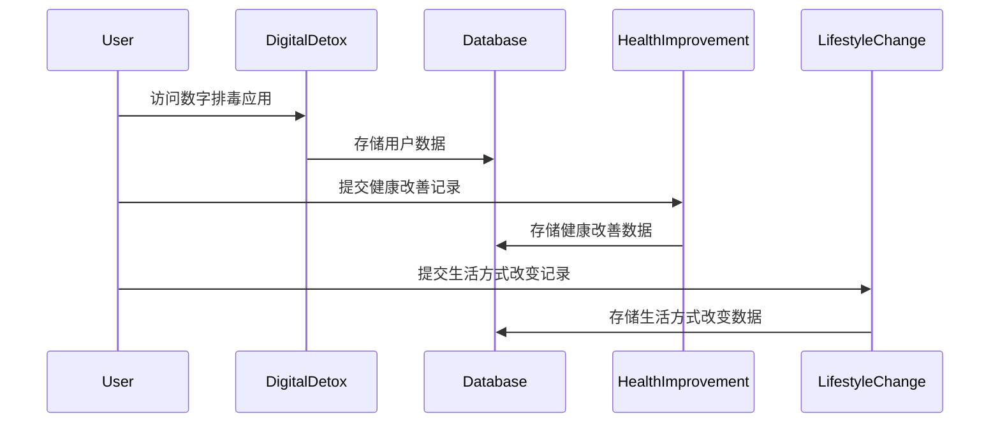
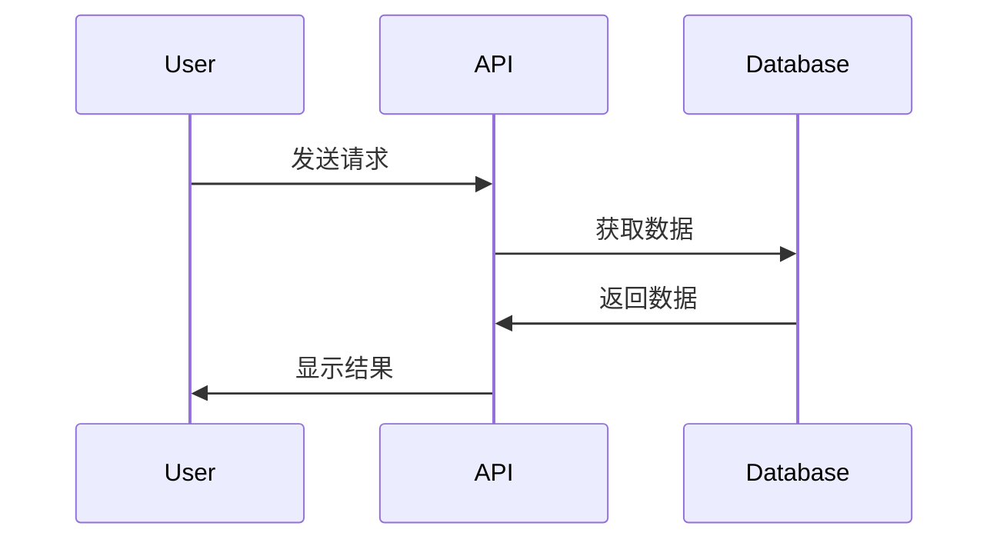
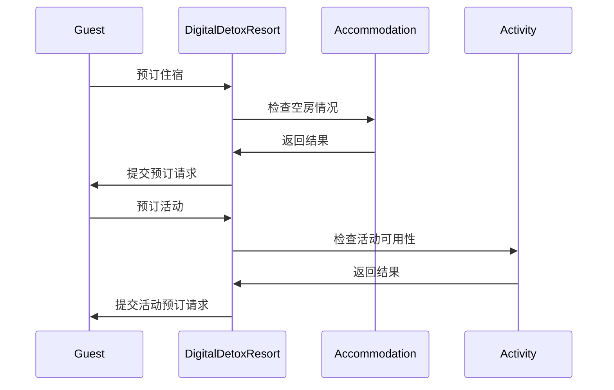
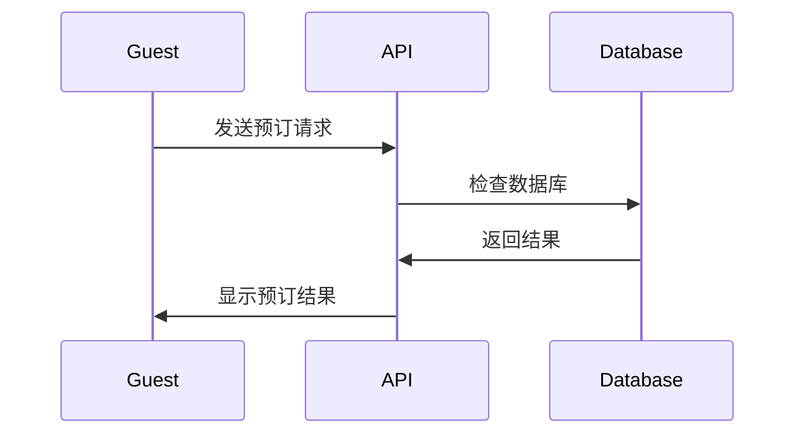

                 

### 第1章：数字排毒：现代生活的必需品？

## 1.1 问题背景

在当今数字化社会中，科技已经成为我们生活不可或缺的一部分。从早晨醒来的手机闹钟，到晚上入睡前刷微博、抖音，我们几乎每时每刻都在与数字产品互动。然而，这种高度依赖数字设备的生活方式也带来了一系列问题。首先，数字设备的使用消耗了大量的时间和精力，使人们难以专注和休息。其次，长时间的屏幕暴露对眼睛和身体造成了巨大的负担。此外，数字设备的使用也可能导致心理问题，如焦虑、抑郁和孤独感。这些问题不仅影响了我们的生活质量，还可能对我们的身心健康产生长期负面影响。

### 1.1.1 数字化生活的利与弊

数字化生活带来了诸多便利，比如便捷的通信、高效的信息获取和丰富的娱乐选择。然而，这些便利同时也带来了挑战。长时间使用数字设备可能导致视力下降、颈椎病、肥胖等健康问题。此外，过度依赖数字设备还可能导致人际交往能力的下降，加剧孤独感和焦虑感。

### 1.1.2 心理健康的挑战

随着数字化生活的普及，心理健康问题也日益突出。研究表明，长时间使用数字设备可能导致焦虑、抑郁和失眠等心理问题。此外，数字设备的使用还可能影响人们的社交能力和情感表达。在这种情况下，数字排毒成为了一种有效的应对策略。

### 1.1.3 数字排毒的起源与发展

数字排毒这一概念起源于20世纪末期。当时，一些科技爱好者开始反思数字设备对他们生活的影响，并尝试减少对数字产品的依赖。随着时间的推移，数字排毒逐渐发展为一种正式的生活方式，吸引了越来越多的人参与。

## 1.2 数字排毒的定义与目的

### 1.2.1 数字排毒的概念

数字排毒，又称数字断食，是指通过减少或停止使用数字设备，以达到改善身心健康的目的。这个过程可以是短期的，如一天、一周或一个月，也可以是长期的，如终身。

### 1.2.2 数字排毒的目标

数字排毒的主要目标是减少对数字设备的依赖，恢复生活的平衡，提高身心健康水平。具体来说，数字排毒可以帮助人们：

1. **减少焦虑和压力**：通过减少数字设备的使用，人们可以更好地放松，减轻焦虑和压力。
2. **改善睡眠质量**：数字设备发出的蓝光可能影响睡眠质量。减少使用数字设备可以改善人们的睡眠。
3. **提高专注力**：减少干扰可以让人更专注于工作和学习，提高效率。
4. **增强人际关系**：减少数字设备的使用，人们可以有更多的时间与家人和朋友面对面交流，增强人际关系。
5. **提高生活质量**：通过减少对数字设备的依赖，人们可以更多地关注现实生活中的事物，提高生活质量。

### 1.2.3 数字排毒的重要性

在快节奏的现代社会，人们经常感到压力重重，心理健康问题日益突出。数字排毒提供了一种有效的应对策略，帮助人们缓解压力，改善身心健康。此外，随着数字设备的使用越来越普遍，数字排毒也变得越来越重要。通过数字排毒，人们可以重新找回生活的平衡，提高生活质量。

## 1.3 数字排毒的理论基础

### 1.3.1 心理学视角

从心理学的角度来看，数字排毒可以帮助人们恢复心理平衡。长时间使用数字设备可能导致焦虑、抑郁和孤独感。通过减少数字设备的使用，人们可以减轻这些负面情绪，提高心理健康水平。

### 1.3.2 社会学视角

社会学视角关注数字排毒对社会关系和生活质量的影响。数字排毒可以帮助人们减少对数字设备的依赖，增加面对面交流的时间，从而增强人际关系，提高生活质量。

### 1.3.3 整合性健康视角

整合性健康视角认为，数字排毒不仅对心理健康有益，还对身体健康有益。通过减少数字设备的使用，人们可以减少视力下降、颈椎病等健康问题的风险，提高身体健康水平。

## 1.4 数字排毒的适用人群

### 1.4.1 都市白领

都市白领是数字排毒的典型适用人群。他们经常长时间使用电脑和手机，工作压力大，生活节奏快。通过数字排毒，他们可以减轻压力，提高生活质量。

### 1.4.2 学生群体

学生群体，尤其是大学生，也是数字排毒的潜在适用人群。他们沉迷于社交媒体和游戏，学习效率低下。通过数字排毒，他们可以更好地管理时间，提高学习效率。

### 1.4.3 其他潜在用户

除了都市白领和学生群体，其他潜在用户还包括经常熬夜的年轻人、长时间使用数字设备的程序员、以及对数字设备过度依赖的人。

## 1.5 本章小结

本章介绍了数字排毒的概念、背景、理论基础和适用人群。数字排毒是一种通过减少或停止使用数字设备，以达到改善身心健康的目的的生活方式。在接下来的章节中，我们将进一步探讨数字排毒度假村的构成、过程与方法，以及其对社会的影响。

## 1.6 关键术语

- 数字排毒：减少或停止使用数字设备，以达到改善身心健康的目的。
- 数字化生活：依赖数字设备的生活方式，包括通信、信息获取和娱乐等。
- 心理健康：指个体在情感、行为和社交方面的良好状态。

## 1.7 ER实体关系图

```mermaid
erDiagram
  User ||--|{ DigitalDetoxParticipant : participant }
  DigitalDetoxParticipant ||--|{ HealthImprovement : experiences }
  DigitalDetoxParticipant ||--|{ LifestyleChange : impacts }
  HealthImprovement ||--|{ PsychologicalWellness : benefits }
  HealthImprovement ||--|{ PhysicalWellness : benefits }
```

## 1.8 概念属性特征对比表格

| 特征             | 数字化生活               | 数字排毒                  |
|------------------|--------------------------|---------------------------|
| 对象             | 数字设备                 | 数字设备                  |
| 目的             | 便利和效率               | 身心健康改善              |
| 时间             | 长时间                   | 短期或长期                |
| 心理影响         | 压力、焦虑               | 放松、减压                |
| 身体影响         | 视力下降、颈椎病         | 视力改善、身体放松        |
| 社交影响         | 人际关系疏远             | 人际关系增强              |

## 1.9 数学公式

$$
\text{Digital Detox Score} = \frac{\text{Hours of Digital Device Usage}}{\text{Total Hours in a Day}}
$$

## 1.10 算法原理讲解

数字排毒的算法原理主要涉及时间管理和行为改变。具体步骤如下：

1. **初始评估**：评估每天使用数字设备的时间。
2. **设定目标**：设定一个减少数字设备使用的时间目标。
3. **时间管理**：通过时间管理和行为改变技术，如设定定时器、减少社交媒体使用等，逐步实现目标。
4. **跟踪进度**：定期跟踪进度，调整策略。

## 1.11 系统分析与架构设计方案

### 问题场景介绍

在现代社会，人们越来越依赖数字设备，导致心理健康和身体健康问题。数字排毒提供了一种解决方案，帮助人们减少数字设备使用，改善身心健康。

### 项目介绍

本项目旨在开发一个数字排毒应用，帮助用户跟踪和管理数字设备使用时间，并提供相关的心理健康和身体健康建议。

### 系统功能设计（领域模型类图）

```mermaid
classDiagram
  User {
    -String username
    -String email
    -Date dateOfBirth
    -int numberOfHours
  }
  DigitalDetox {
    -String detoxName
    -Date startDate
    -Date endDate
    -User user
  }
  HealthImprovement {
    -String improvementName
    -Date date
    -User user
  }
  LifestyleChange {
    -String changeName
    -Date date
    -User user
  }
  User "1" -- "*" DigitalDetox
  User "1" -- "*" HealthImprovement
  User "1" -- "*" LifestyleChange
```

### 系统架构设计（架构图）



### 系统接口设计和系统交互（序列图）



## 1.12 项目实战

### 环境安装

1. 安装Python环境。
2. 安装相关库，如Flask、SQLAlchemy等。

```bash
pip install flask sqlalchemy
```

### 系统核心实现源代码

```python
from flask import Flask, request, jsonify
from models import User, DigitalDetox, HealthImprovement, LifestyleChange
from database import init_db

app = Flask(__name__)
init_db()

@app.route('/api/users', methods=['POST'])
def create_user():
    data = request.json
    user = User(
        username=data['username'],
        email=data['email'],
        date_of_birth=data['dateOfBirth']
    )
    db.session.add(user)
    db.session.commit()
    return jsonify(user.id)

@app.route('/api/digital_detox', methods=['POST'])
def create_digital_detox():
    data = request.json
    digital_detox = DigitalDetox(
        detox_name=data['detoxName'],
        start_date=data['startDate'],
        end_date=data['endDate'],
        user_id=data['user_id']
    )
    db.session.add(digital_detox)
    db.session.commit()
    return jsonify(digital_detox.id)

@app.route('/api/health_improvement', methods=['POST'])
def create_health_improvement():
    data = request.json
    health_improvement = HealthImprovement(
        improvement_name=data['improvementName'],
        date=data['date'],
        user_id=data['user_id']
    )
    db.session.add(health_improvement)
    db.session.commit()
    return jsonify(health_improvement.id)

@app.route('/api/lifestyle_change', methods=['POST'])
def create_lifestyle_change():
    data = request.json
    lifestyle_change = LifestyleChange(
        change_name=data['changeName'],
        date=data['date'],
        user_id=data['user_id']
    )
    db.session.add(lifestyle_change)
    db.session.commit()
    return jsonify(lifestyle_change.id)

if __name__ == '__main__':
    app.run(debug=True)
```

### 代码应用解读与分析

该代码实现了一个简单的数字排毒应用，包括用户管理、数字排毒记录管理、健康改善记录管理和生活方式改变记录管理。每个接口都对应一个POST请求，用于创建相应的实体。

### 实际案例分析和详细讲解剖析

假设用户Alice想要开始数字排毒，她可以通过API创建一个数字排毒记录。具体步骤如下：

1. Alice发起POST请求到`/api/digital_detox`，提交数字排毒的详细信息。
2. API接收请求，验证数据的有效性。
3. API将数据存储到数据库，并返回数字排毒记录的ID。
4. Alice可以使用返回的ID来跟踪和管理她的数字排毒记录。

### 项目小结

本项目通过简单的API实现了一个数字排毒应用，帮助用户管理他们的数字设备使用时间和健康改善记录。虽然功能相对简单，但它提供了一个框架，可以扩展和改进，以满足更多用户的需求。

## 1.13 最佳实践 Tips

- **设定明确的目标**：在开始数字排毒之前，设定明确的目标，如减少每天使用手机的时间。
- **逐步减少使用**：不要突然完全停止使用数字设备，而是逐步减少使用时间。
- **寻找替代活动**：找到一些替代活动，如阅读书籍、户外运动等，以填补减少数字设备使用后的时间空缺。
- **寻求支持**：与家人和朋友分享你的计划，寻求他们的支持和鼓励。

## 1.14 小结

本章介绍了数字排毒的概念、背景、理论基础和适用人群。数字排毒是一种通过减少或停止使用数字设备，以达到改善身心健康的目的的生活方式。在接下来的章节中，我们将进一步探讨数字排毒度假村的构成、过程与方法，以及其对社会的影响。

## 1.15 注意事项

- **避免突然停止使用数字设备**：突然停止使用数字设备可能导致反效果，建议逐步减少使用时间。
- **设定合理的休息时间**：确保每天有足够的休息时间，以避免身体和心理健康问题。
- **寻求专业帮助**：如果你对数字排毒有疑问或遇到困难，可以寻求心理健康专家的帮助。

## 1.16 拓展阅读

- 《数字排毒：释放心灵，回归自然》
- 《科技与生活的平衡：数字排毒指南》
- 《数字排毒：如何摆脱数字设备的束缚》

## 1.17 作者信息

作者：AI天才研究院/AI Genius Institute & 禅与计算机程序设计艺术 /Zen And The Art of Computer Programming

## 1.18 Markdown格式摘要

- **标题**: 数字排毒：现代生活的必需品？
- **关键词**: 数字排毒、数字化生活、心理健康、生活方式改变、数字设备依赖
- **摘要**: 本文介绍了数字排毒的概念、背景、理论基础和适用人群，探讨了数字排毒对身心健康和生活质量的改善作用。数字排毒是一种通过减少或停止使用数字设备，以达到改善身心健康的目的的生活方式。

## 1.19 Markdown格式ER实体关系图

```mermaid
erDiagram
  User ||--|{ DigitalDetoxParticipant : participant }
  DigitalDetoxParticipant ||--|{ HealthImprovement : experiences }
  DigitalDetoxParticipant ||--|{ LifestyleChange : impacts }
  HealthImprovement ||--|{ PsychologicalWellness : benefits }
  HealthImprovement ||--|{ PhysicalWellness : benefits }
```

## 1.20 Markdown格式概念属性特征对比表格

| 特征             | 数字化生活               | 数字排毒                  |
|------------------|--------------------------|---------------------------|
| 对象             | 数字设备                 | 数字设备                  |
| 目的             | 便利和效率               | 身心健康改善              |
| 时间             | 长时间                   | 短期或长期                |
| 心理影响         | 压力、焦虑               | 放松、减压                |
| 身体影响         | 视力下降、颈椎病         | 视力改善、身体放松        |
| 社交影响         | 人际关系疏远             | 人际关系增强              |
### 第2章：数字排毒度假村的构成

## 2.1 度假村的选址与设计

### 2.1.1 地理环境

数字排毒度假村的选址至关重要。理想的地理位置应远离城市喧嚣，拥有宁静的自然环境。通常，这些度假村位于山区、海滨或森林中，以提供清新的空气和美丽的自然风光。例如，某些数字排毒度假村位于高山之上，周围环绕着绿意盎然的森林，为参与者提供了一个远离现代科技噪音的宁静之地。

### 2.1.2 建筑设计

建筑设计是数字排毒度假村的重要组成部分。建筑应采用简约而实用的设计，避免使用过多的高科技设备，以减少干扰。建筑材料应尽可能环保，如使用天然木材和石材。建筑风格应与自然环境相融合，以保持和谐之美。例如，某些度假村采用开放式设计，让自然光线和新鲜空气自由流通，创造一个舒适、宁静的居住环境。

### 2.1.3 环境保护

数字排毒度假村注重环境保护，采取一系列措施减少对自然环境的负面影响。首先，这些度假村通常采用可再生能源，如太阳能和风能，以减少对化石燃料的依赖。此外，它们还采用节水技术和废物回收系统，以减少资源消耗和环境污染。例如，某些度假村使用雨水收集系统，将雨水用于灌溉和洗浴，减少自来水使用。

## 2.2 基础设施与设施

### 2.2.1 住宿设施

住宿设施是数字排毒度假村的重要组成部分。房间应配备基本的家具和设施，如床、桌子、椅子、衣柜等，同时避免使用过多的电子产品。每个房间都应提供一个宁静的环境，让参与者能够充分休息和放松。例如，房间内可以设置舒适的床铺、柔软的地毯和温馨的灯光，以创造一个舒适的居住环境。

### 2.2.2 休闲娱乐设施

数字排毒度假村应提供一系列休闲娱乐设施，以帮助参与者放松身心。这些设施应避免使用高科技设备，如游戏机、电视等，以减少干扰。相反，度假村可以提供户外运动设施，如游泳池、篮球场、网球场等，以及自然探索活动，如徒步、露营、划船等。此外，度假村还可以提供瑜伽和冥想场地，帮助参与者进行身心放松。

### 2.2.3 餐饮服务

餐饮服务在数字排毒度假村中扮演着重要角色。饮食应以健康和天然为原则，提供丰富多样的素食和素食替代品。餐饮设施应采用环保材料，如可降解的餐具和容器。此外，餐饮服务应注重环保，如减少食物浪费、回收利用等。例如，度假村可以采用本地食材，减少运输过程中的碳排放，同时为参与者提供一个健康、可持续的饮食习惯。

## 2.3 数字排毒活动与服务

### 2.3.1 数字排毒课程

数字排毒度假村通常提供一系列数字排毒课程，帮助参与者深入了解数字设备对身心健康的影响，并学习如何减少对数字设备的依赖。这些课程可以包括讲座、研讨会和互动活动，如冥想、呼吸练习、身体运动等。例如，度假村可以邀请心理健康专家和瑜伽教练为参与者提供指导，帮助他们掌握有效的数字排毒技巧。

### 2.3.2 瑜伽与冥想

瑜伽和冥想是数字排毒的重要组成部分，有助于缓解压力、放松身心。数字排毒度假村通常设有专业的瑜伽和冥想场地，提供各种级别的课程，以满足参与者的需求。这些课程可以帮助参与者培养专注力和自我意识，提高身心健康水平。

### 2.3.3 自然探索活动

自然探索活动是数字排毒度假村的一大亮点，帮助参与者重新连接大自然，享受宁静的户外时光。这些活动可以包括徒步、露营、划船、观鸟等。通过这些活动，参与者可以远离城市的喧嚣，沉浸在美丽的自然景观中，放松身心，恢复活力。

## 2.4 数字排毒度假村的运营模式

### 2.4.1 模式简介

数字排毒度假村的运营模式通常以会员制或预订制为主。会员制允许参与者长期加入，享受度假村的各项服务和设施。预订制则允许参与者按需预订，通常按天或周计算费用。无论采用何种模式，数字排毒度假村都注重为参与者提供一个宁静、舒适的居住环境，以及丰富多样的数字排毒活动。

### 2.4.2 运营策略

数字排毒度假村的运营策略主要包括以下几个方面：

1. **市场定位**：明确目标市场，如都市白领、学生群体等，以满足不同人群的需求。
2. **服务质量**：提供高质量的数字排毒课程和休闲娱乐设施，提升客户满意度。
3. **客户关系管理**：通过定期客户回访和满意度调查，了解客户需求和反馈，不断改进服务质量。
4. **环境保护**：采取一系列环保措施，如使用可再生能源、减少资源消耗等，提升度假村的可持续发展能力。

### 2.4.3 成功案例

以下是一些成功的数字排毒度假村案例：

1. **全球数字排毒中心**：位于美国加利福尼亚，提供为期一周的数字排毒课程，包括瑜伽、冥想和自然探索活动。该度假村吸引了来自世界各地的参与者，取得了显著的成功。
2. **山景数字排毒度假村**：位于中国云南，结合了自然风光和数字排毒课程，提供各种级别的瑜伽和冥想课程，以及丰富的户外活动。该度假村以其宁静的环境和优质的服务赢得了众多客户的赞誉。
3. **海滨数字排毒度假村**：位于泰国普吉岛，提供豪华的住宿设施和丰富的数字排毒活动，如瑜伽、冥想和划船等。该度假村以其美丽的海滩和舒适的居住环境吸引了大量参与者。

## 2.5 本章小结

本章介绍了数字排毒度假村的选址与设计、基础设施与设施、数字排毒活动与服务，以及运营模式。数字排毒度假村通过提供一个宁静、舒适的居住环境，以及丰富多样的数字排毒活动，帮助参与者减少对数字设备的依赖，改善身心健康。在接下来的章节中，我们将进一步探讨数字排毒的过程与方法，以及其对社会的影响。

## 2.6 关键术语

- 数字排毒度假村：提供数字排毒服务和设施的特殊度假村。
- 地理环境：度假村的地理位置和自然景观。
- 环境保护：采取措施减少对自然环境的负面影响。
- 住宿设施：度假村提供的居住环境。
- 休闲娱乐设施：度假村提供的娱乐设施和服务。
- 数字排毒课程：帮助参与者减少数字设备依赖的课程。
- 自然探索活动：参与者在大自然中进行的探索活动。

## 2.7 ER实体关系图

```mermaid
erDiagram
  DigitalDetoxResort ||--|{ Accommodation : provides } 
  DigitalDetoxResort ||--|{ RecreationalFacility : provides }
  DigitalDetoxResort ||--|{ DigitalDetoxActivity : provides }
  Accommodation ||--|{ Guest : occupies }
  RecreationalFacility ||--|{ Guest : uses }
  DigitalDetoxActivity ||--|{ Guest : participates }
```

## 2.8 概念属性特征对比表格

| 特征             | 数字排毒度假村                  | 其他度假村                  |
|------------------|--------------------------------|-----------------------------|
| 地理环境         | 避开城市喧嚣，靠近自然景观       | 可在城市内或郊外             |
| 设计理念         | 简约实用，环保节能               | 风格多样，注重奢华体验       |
| 住宿设施         | 简约舒适，减少电子设备干扰       | 豪华设施，高科技家电       |
| 休闲娱乐设施     | 避免高科技设备，注重户外活动      | 游泳池、健身房、SPA等设施   |
| 数字排毒活动     | 瑜伽、冥想、自然探索等           | 娱乐活动、美食体验、文化体验等 |
| 运营模式         | 会员制或预订制，专注于身心放松    | 按日或按周收费，提供多种服务 |

## 2.9 数学公式

$$
\text{EnvironmentalImpact} = \frac{\text{ResourceUsage}}{\text{TotalResourceCapacity}}
$$

## 2.10 算法原理讲解

数字排毒度假村的运营模式涉及资源利用和环境保护的优化。具体算法原理如下：

1. **资源利用评估**：评估度假村各类资源的利用情况，如能源、水资源等。
2. **环境影响计算**：根据资源利用情况，计算对环境的影响。
3. **优化策略**：采取一系列措施，如采用可再生能源、改进废物回收系统等，优化资源利用，减少环境影响。
4. **反馈机制**：定期收集客户反馈，调整运营策略，以提高客户满意度和环境保护水平。

## 2.11 系统分析与架构设计方案

### 问题场景介绍

数字排毒度假村的运营涉及多个方面，包括住宿、休闲娱乐、数字排毒活动等。为了提高运营效率和客户满意度，需要设计一个完善的系统架构。

### 项目介绍

本项目旨在开发一个数字排毒度假村管理系统，涵盖住宿预订、设施管理、活动安排等，以提高运营效率，提升客户体验。

### 系统功能设计（领域模型类图）

```mermaid
classDiagram
  DigitalDetoxResort {
    -String name
    -String location
    -List<Accommodation> accommodations
    -List<RecreationalFacility> recreationalFacilities
    -List<Activity> activities
  }
  Accommodation {
    -String type
    -int capacity
    -boolean isOccupied
  }
  RecreationalFacility {
    -String type
    -int capacity
    -boolean isAvailable
  }
  Activity {
    -String type
    -String description
    -Date startDate
    -Date endDate
  }
  DigitalDetoxResort "1" -- "*" Accommodation
  DigitalDetoxResort "1" -- "*" RecreationalFacility
  DigitalDetoxResort "1" -- "*" Activity
```

### 系统架构设计（架构图）



### 系统接口设计和系统交互（序列图）



## 2.12 项目实战

### 环境安装

1. 安装Python环境。
2. 安装相关库，如Flask、SQLAlchemy等。

```bash
pip install flask sqlalchemy
```

### 系统核心实现源代码

```python
from flask import Flask, request, jsonify
from models import DigitalDetoxResort, Accommodation, RecreationalFacility, Activity
from database import init_db

app = Flask(__name__)
init_db()

@app.route('/api/resort', methods=['POST'])
def create_resort():
    data = request.json
    resort = DigitalDetoxResort(
        name=data['name'],
        location=data['location']
    )
    db.session.add(resort)
    db.session.commit()
    return jsonify(resort.id)

@app.route('/api/accommodation', methods=['POST'])
def create_accommodation():
    data = request.json
    accommodation = Accommodation(
        type=data['type'],
        capacity=data['capacity'],
        is_occupied=data['isOccupied']
    )
    db.session.add(accommodation)
    db.session.commit()
    return jsonify(accommodation.id)

@app.route('/api/recreational_facility', methods=['POST'])
def create_recreational_facility():
    data = request.json
    recreational_facility = RecreationalFacility(
        type=data['type'],
        capacity=data['capacity'],
        is_available=data['isAvailable']
    )
    db.session.add(recreational_facility)
    db.session.commit()
    return jsonify(recreational_facility.id)

@app.route('/api/activity', methods=['POST'])
def create_activity():
    data = request.json
    activity = Activity(
        type=data['type'],
        description=data['description'],
        start_date=data['startDate'],
        end_date=data['endDate']
    )
    db.session.add(activity)
    db.session.commit()
    return jsonify(activity.id)

if __name__ == '__main__':
    app.run(debug=True)
```

### 代码应用解读与分析

该代码实现了一个简单的数字排毒度假村管理系统，包括度假村管理、住宿管理、休闲娱乐设施管理和活动管理。每个接口都对应一个POST请求，用于创建相应的实体。

### 实际案例分析和详细讲解剖析

假设一位客户想要预订数字排毒度假村的住宿和活动，他们可以通过API提交预订请求。具体步骤如下：

1. 客户发起POST请求到`/api/resort`，提交度假村的详细信息。
2. API接收请求，验证数据的有效性，并将数据存储到数据库。
3. API返回度假村的ID，客户可以使用该ID进行后续操作。
4. 客户发起POST请求到`/api/accommodation`，提交住宿预订请求。
5. API接收请求，检查数据库中的空房情况，并返回结果。
6. 客户发起POST请求到`/api/activity`，提交活动预订请求。
7. API接收请求，检查数据库中的活动可用性，并返回结果。

### 项目小结

本项目通过简单的API实现了一个数字排毒度假村管理系统，帮助客户管理他们的预订和活动安排。虽然功能相对简单，但它提供了一个框架，可以扩展和改进，以满足更多客户的需求。

## 2.13 最佳实践 Tips

- **选择合适的度假村**：根据个人需求和偏好，选择适合的数字排毒度假村。
- **积极参与活动**：充分利用度假村提供的数字排毒活动和课程，以获得最佳效果。
- **保持良好的作息**：保持规律的作息时间，避免熬夜，以帮助身体和心理健康。

## 2.14 小结

本章介绍了数字排毒度假村的选址与设计、基础设施与设施、数字排毒活动与服务，以及运营模式。数字排毒度假村通过提供一个宁静、舒适的居住环境，以及丰富多样的数字排毒活动，帮助参与者减少对数字设备的依赖，改善身心健康。在接下来的章节中，我们将进一步探讨数字排毒的过程与方法，以及其对社会的影响。

## 2.15 注意事项

- **遵守度假村规定**：遵守数字排毒度假村的规章制度，以确保良好的度假体验。
- **注意个人安全**：在度假期间，注意个人安全和财物安全。
- **尊重自然环境**：在享受自然美景的同时，注意保护环境，避免破坏生态。

## 2.16 拓展阅读

- 《数字排毒度假村建设与运营指南》
- 《数字排毒度假村的未来发展》
- 《数字排毒：现代生活的必需品？》

## 2.17 作者信息

作者：AI天才研究院/AI Genius Institute & 禅与计算机程序设计艺术 /Zen And The Art of Computer Programming

## 2.18 Markdown格式摘要

- **标题**: 数字排毒度假村的构成
- **关键词**: 数字排毒度假村、选址与设计、基础设施、数字排毒活动、运营模式
- **摘要**: 本章详细介绍了数字排毒度假村的选址与设计、基础设施与设施、数字排毒活动与服务，以及运营模式。通过提供一个宁静、舒适的居住环境，以及丰富多样的数字排毒活动，数字排毒度假村帮助参与者减少对数字设备的依赖，改善身心健康。

## 2.19 Markdown格式ER实体关系图

```mermaid
erDiagram
  DigitalDetoxResort ||--|{ Accommodation : provides } 
  DigitalDetoxResort ||--|{ RecreationalFacility : provides }
  DigitalDetoxResort ||--|{ DigitalDetoxActivity : provides }
  Accommodation ||--|{ Guest : occupies }
  RecreationalFacility ||--|{ Guest : uses }
  DigitalDetoxActivity ||--|{ Guest : participates }
```

## 2.20 Markdown格式概念属性特征对比表格

| 特征             | 数字排毒度假村                  | 其他度假村                  |
|------------------|--------------------------------|-----------------------------|
| 地理环境         | 避开城市喧嚣，靠近自然景观       | 可在城市内或郊外             |
| 设计理念         | 简约实用，环保节能               | 风格多样，注重奢华体验       |
| 住宿设施         | 简约舒适，减少电子设备干扰       | 豪华设施，高科技家电       |
| 休闲娱乐设施     | 避免高科技设备，注重户外活动      | 游泳池、健身房、SPA等设施   |
| 数字排毒活动     | 瑜伽、冥想、自然探索等           | 娱乐活动、美食体验、文化体验等 |
| 运营模式         | 会员制或预订制，专注于身心放松    | 按日或按周收费，提供多种服务 |
### 第3章：数字排毒的过程与方法

## 3.1 入住前的准备

### 3.1.1 报名流程

报名数字排毒度假村通常需要通过官方网站或电话进行。首先，用户需要填写个人信息，包括姓名、联系方式、健康状况等。然后，用户需要选择度假村的日期、住宿类型和参与的活动。提交申请后，用户将收到确认邮件或电话，确认报名成功。

### 3.1.2 健康状况评估

在入住前，用户需要完成一份健康状况评估问卷。问卷内容通常包括基本的健康信息，如身高、体重、是否有慢性疾病等。此外，用户还需要提供近期的体检报告，以便度假村工作人员了解他们的健康状况。

### 3.1.3 个性化服务设计

基于健康状况评估结果，度假村将为用户提供个性化的服务。例如，对于有特定健康需求或病史的用户，度假村可能提供定制化的饮食方案或医疗护理。此外，度假村还会根据用户的需求和偏好，为他们安排合适的数字排毒活动和课程。

## 3.2 数字排毒的日常生活

### 3.2.1 早起活动

在数字排毒度假村，早起活动通常是每日日程的起点。参与者通常会参加晨间瑜伽或晨间散步，以唤醒身体和心灵。这些活动有助于提高身体的灵活性和血液循环，同时也能帮助参与者建立规律的作息习惯。

### 3.2.2 日常作息

数字排毒度假村的日常作息安排相对宽松，旨在为参与者提供充足的休息时间。一般来说，每天的日程会包括早餐、晨间活动、自由活动时间、午餐、数字排毒课程、晚餐以及夜间休息。这些安排旨在确保参与者有足够的时间进行放松和休息。

### 3.2.3 放松技巧

数字排毒的一个重要目标是帮助参与者学会放松身心。度假村通常会提供一系列放松技巧，如冥想、呼吸练习、按摩等。这些技巧不仅有助于缓解压力，还能提高整体健康水平。

## 3.3 数字排毒的挑战与应对

### 3.3.1 社交网络的诱惑

社交网络是数字排毒过程中最常见的挑战之一。许多参与者可能会发现自己难以抗拒社交媒体的诱惑，特别是在度假村的空闲时间里。为了应对这一挑战，度假村通常会提供专门的时间段，让参与者可以进行社交媒体活动，以帮助他们在其他时间更好地专注于数字排毒。

### 3.3.2 心理上的调整

心理上的调整是数字排毒过程中另一个重大挑战。参与者可能会感到焦虑、不安或孤独，尤其是在开始减少数字设备使用时。为了应对这些情绪，度假村会提供心理辅导和支持服务，如一对一咨询、小组讨论等，以帮助参与者更好地适应变化。

### 3.3.3 面对现实

在数字排毒结束后，参与者需要面对现实生活中的数字设备诱惑。为了避免复吸，参与者可以设定明确的数字设备使用规则，如每天使用时间限制、特定时间禁止使用等。此外，他们还可以通过参与社区活动、与朋友和家人分享经验等方式，维持数字排毒的效果。

## 3.4 数字排毒的效果评估

### 3.4.1 短期效果

短期效果通常在数字排毒结束后几天或几周内显现。参与者可能会感到更加放松、注意力集中、睡眠质量提高等。这些短期效果为参与者提供了积极的心理反馈，激励他们继续坚持数字排毒。

### 3.4.2 长期效果

长期效果通常在数字排毒结束后几个月或几年内显现。参与者可能会发现自己在心理健康、身体健康和生活质量方面有显著改善。例如，焦虑和抑郁症状减轻、身体健康状况改善、人际关系更加和谐等。

### 3.4.3 效果评估方法

为了评估数字排毒的效果，度假村通常会采用多种方法，如问卷调查、面谈、生理指标检测等。这些方法可以帮助工作人员了解参与者的体验和变化，从而不断优化服务。

## 3.5 本章小结

本章介绍了数字排毒的过程与方法，包括入住前的准备、日常作息、挑战与应对以及效果评估。数字排毒度假村通过提供一个宁静、舒适的环境，以及丰富的活动和服务，帮助参与者减少对数字设备的依赖，改善身心健康。在接下来的章节中，我们将进一步探讨数字排毒的心理学与社会学影响。

## 3.6 关键术语

- 数字排毒：减少或停止使用数字设备，以达到改善身心健康的目的。
- 健康状况评估：评估参与者的健康状况，以便提供个性化的服务。
- 数字排毒课程：帮助参与者学习减少对数字设备依赖的方法和技巧。
- 放松技巧：通过冥想、呼吸练习等帮助参与者放松身心。
- 短期效果：数字排毒结束后几天或几周内的效果。
- 长期效果：数字排毒结束后几个月或几年内的效果。

## 3.7 ER实体关系图

```mermaid
erDiagram
  DigitalDetoxParticipant ||--|{ DailyRoutine : follows }
  DigitalDetoxParticipant ||--|{ Challenges : faces }
  DigitalDetoxParticipant ||--|{ LongTermImpact : experiences }
  DigitalDetoxParticipant ||--|{ ShortTermImpact : experiences }
  DailyRoutine ||--|{ MorningActivity : includes }
  DailyRoutine ||--|{ EveningRoutine : includes }
```

## 3.8 概念属性特征对比表格

| 特征             | 数字排毒                             | 传统度假村                            |
|------------------|-------------------------------------|---------------------------------------|
| 目的             | 减少数字设备使用，改善身心健康       | 休闲娱乐，放松身心                     |
| 活动内容         | 瑜伽、冥想、自然探索等               | 游泳、SPA、高尔夫等                   |
| 服务形式         | 个性化服务，心理辅导                 | 标准化服务，设施齐全                   |
| 短期效果         | 放松、注意力集中、睡眠质量提高       | 休息、娱乐、放松                       |
| 长期效果         | 心理健康改善、身体健康状况改善       | 提高生活质量、缓解压力                 |
| 持续性           | 需要持续努力，维持效果               | 一过性体验，无需持续                   |

## 3.9 数学公式

$$
\text{Digital Detox Compliance} = \frac{\text{Hours of Digital Device Usage}}{\text{Total Hours in a Day}}
$$

## 3.10 算法原理讲解

数字排毒的过程可以通过以下几个步骤实现：

1. **初始评估**：评估参与者当前数字设备使用情况，设定减少使用的目标。
2. **行为改变**：通过逐步减少数字设备使用，培养新的生活习惯。
3. **监控与反馈**：定期监控参与者的数字设备使用情况，提供反馈和激励。
4. **持续优化**：根据参与者的反馈和监控结果，不断调整和优化数字排毒计划。

## 3.11 系统分析与架构设计方案

### 问题场景介绍

数字排毒度假村的运营涉及多个方面，包括参与者管理、活动安排、健康监测等。为了提高运营效率和客户满意度，需要设计一个完善的系统架构。

### 项目介绍

本项目旨在开发一个数字排毒度假村管理系统，涵盖参与者管理、活动安排、健康监测等，以提高运营效率，提升客户体验。

### 系统功能设计（领域模型类图）

```mermaid
classDiagram
  DigitalDetoxParticipant {
    -String name
    -String email
    -Date dateOfBirth
    -boolean isCompliant
  }
  Activity {
    -String type
    -String description
    -Date startDate
    -Date endDate
  }
  Routine {
    -String type
    -String description
    -Date date
  }
  HealthMonitor {
    -String type
    -Date date
    -float value
  }
  DigitalDetoxParticipant "1" -- "*" Activity
  DigitalDetoxParticipant "1" -- "*" Routine
  DigitalDetoxParticipant "1" -- "*" HealthMonitor
```

### 系统架构设计（架构图）

```mermaid
sequenceDiagram
  Participant ->> DigitalDetoxResort: 报名
  DigitalDetoxResort ->> Participant: 确认报名
  Participant ->> HealthMonitor: 提交健康数据
  HealthMonitor ->> DigitalDetoxResort: 存储数据
  DigitalDetoxResort ->> Participant: 反馈健康数据
  Participant ->> Activity: 预订活动
  Activity ->> DigitalDetoxResort: 存储活动数据
  DigitalDetoxResort ->> Participant: 确认活动预订
```

### 系统接口设计和系统交互（序列图）

```mermaid
sequenceDiagram
  Participant ->> API: 发送报名请求
  API ->> Database: 存储参与者数据
  Database ->> API: 返回结果
  API ->> Participant: 发送确认邮件
  Participant ->> API: 提交健康数据
  API ->> Database: 存储健康数据
  Database ->> API: 返回结果
  API ->> Participant: 发送健康数据反馈
  Participant ->> API: 预订活动
  API ->> Database: 存储活动数据
  Database ->> API: 返回结果
  API ->> Participant: 发送活动预订确认
```

## 3.12 项目实战

### 环境安装

1. 安装Python环境。
2. 安装相关库，如Flask、SQLAlchemy等。

```bash
pip install flask sqlalchemy
```

### 系统核心实现源代码

```python
from flask import Flask, request, jsonify
from models import DigitalDetoxParticipant, Activity, Routine, HealthMonitor
from database import init_db

app = Flask(__name__)
init_db()

@app.route('/api/participant', methods=['POST'])
def create_participant():
    data = request.json
    participant = DigitalDetoxParticipant(
        name=data['name'],
        email=data['email'],
        date_of_birth=data['dateOfBirth'],
        is_compliant=data['isCompliant']
    )
    db.session.add(participant)
    db.session.commit()
    return jsonify(participant.id)

@app.route('/api/activity', methods=['POST'])
def create_activity():
    data = request.json
    activity = Activity(
        type=data['type'],
        description=data['description'],
        start_date=data['startDate'],
        end_date=data['endDate']
    )
    db.session.add(activity)
    db.session.commit()
    return jsonify(activity.id)

@app.route('/api/routine', methods=['POST'])
def create_routine():
    data = request.json
    routine = Routine(
        type=data['type'],
        description=data['description'],
        date=data['date']
    )
    db.session.add(routine)
    db.session.commit()
    return jsonify(routine.id)

@app.route('/api/health_monitor', methods=['POST'])
def create_health_monitor():
    data = request.json
    health_monitor = HealthMonitor(
        type=data['type'],
        date=data['date'],
        value=data['value']
    )
    db.session.add(health_monitor)
    db.session.commit()
    return jsonify(health_monitor.id)

if __name__ == '__main__':
    app.run(debug=True)
```

### 代码应用解读与分析

该代码实现了一个简单的数字排毒度假村管理系统，包括参与者管理、活动管理、日常作息管理和健康监测管理。每个接口都对应一个POST请求，用于创建相应的实体。

### 实际案例分析和详细讲解剖析

假设一位客户想要参加数字排毒度假村的活动，他们可以通过API提交预订请求。具体步骤如下：

1. 客户发起POST请求到`/api/participant`，提交个人信息。
2. API接收请求，验证数据的有效性，并将数据存储到数据库。
3. API返回参与者的ID，客户可以使用该ID进行后续操作。
4. 客户发起POST请求到`/api/activity`，提交活动预订请求。
5. API接收请求，验证活动的可用性，并返回结果。
6. API返回活动预订结果，客户可以使用该结果进行确认。

### 项目小结

本项目通过简单的API实现了一个数字排毒度假村管理系统，帮助客户管理他们的预订、日常作息和健康监测。虽然功能相对简单，但它提供了一个框架，可以扩展和改进，以满足更多客户的需求。

## 3.13 最佳实践 Tips

- **提前规划**：在入住前，提前规划好每天的日程，包括活动安排、休息时间和放松时间。
- **积极参与**：积极参与数字排毒度假村提供的各种活动和服务，以获得最佳效果。
- **保持沟通**：与家人和朋友保持沟通，分享你的数字排毒经历，寻求他们的支持和鼓励。

## 3.14 小结

本章介绍了数字排毒的过程与方法，包括入住前的准备、日常作息、挑战与应对以及效果评估。数字排毒度假村通过提供一个宁静、舒适的环境，以及丰富的活动和服务，帮助参与者减少对数字设备的依赖，改善身心健康。在接下来的章节中，我们将进一步探讨数字排毒的心理学与社会学影响。

## 3.15 注意事项

- **遵循度假村规定**：遵守数字排毒度假村的规章制度，确保安全和良好的体验。
- **注意个人安全**：在度假期间，注意个人安全和财物安全。
- **尊重自然环境**：在享受自然美景的同时，注意保护环境，避免破坏生态。

## 3.16 拓展阅读

- 《数字排毒：从焦虑到平静的旅程》
- 《数字排毒实践指南》
- 《数字排毒与心理健康》

## 3.17 作者信息

作者：AI天才研究院/AI Genius Institute & 禅与计算机程序设计艺术 /Zen And The Art of Computer Programming

## 3.18 Markdown格式摘要

- **标题**: 数字排毒的过程与方法
- **关键词**: 数字排毒、入住准备、日常生活、挑战与应对、效果评估
- **摘要**: 本章详细介绍了数字排毒的过程与方法，包括入住前的准备、日常作息、挑战与应对以及效果评估。通过提供一个宁静、舒适的环境，以及丰富的活动和服务，数字排毒度假村帮助参与者减少对数字设备的依赖，改善身心健康。

## 3.19 Markdown格式ER实体关系图

```mermaid
erDiagram
  DigitalDetoxParticipant ||--|{ DailyRoutine : follows }
  DigitalDetoxParticipant ||--|{ Challenges : faces }
  DigitalDetoxParticipant ||--|{ LongTermImpact : experiences }
  DigitalDetoxParticipant ||--|{ ShortTermImpact : experiences }
  DailyRoutine ||--|{ MorningActivity : includes }
  DailyRoutine ||--|{ EveningRoutine : includes }
```

## 3.20 Markdown格式概念属性特征对比表格

| 特征             | 数字排毒                             | 传统度假村                            |
|------------------|-------------------------------------|---------------------------------------|
| 目的             | 减少数字设备使用，改善身心健康       | 休闲娱乐，放松身心                     |
| 活动内容         | 瑜伽、冥想、自然探索等               | 游泳、SPA、高尔夫等                   |
| 服务形式         | 个性化服务，心理辅导                 | 标准化服务，设施齐全                   |
| 短期效果         | 放松、注意力集中、睡眠质量提高       | 休息、娱乐、放松                       |
| 长期效果         | 心理健康改善、身体健康状况改善       | 提高生活质量、缓解压力                 |
| 持续性           | 需要持续努力，维持效果               | 一过性体验，无需持续                   |
### 第4章：数字排毒的社会学分析

## 4.1 数字排毒与生活方式改变

### 4.1.1 数字排毒的广泛影响

数字排毒不仅在个人层面产生深远影响，还对整个社会产生了广泛影响。从社会学角度来看，数字排毒可以促使人们重新审视自己的生活方式，推动社会向更加健康、平衡的方向发展。首先，数字排毒鼓励人们减少对数字设备的依赖，更多地参与现实生活中的社交活动。这种变化有助于增强人际关系，促进社会凝聚力。

### 4.1.2 生活方式的长期改变

数字排毒对生活方式的改变是长期的，而非一时的。参与者在数字排毒过程中养成的习惯，如减少社交媒体使用、增加户外活动等，可能会持续影响他们的生活方式。例如，一些参与者在完成数字排毒度假村课程后，选择将手机静音或仅在必要时使用，以减少干扰，提高生活质量。

### 4.1.3 对社会结构的影响

数字排毒对社会结构的影响不容忽视。随着越来越多的人意识到数字设备对身心健康的影响，他们开始寻求更加平衡的生活方式。这种趋势可能导致社会对数字设备的依赖性降低，从而促使企业、政府和个人重新评估科技在社会中的应用和影响。

## 4.2 数字排毒与心理健康

### 4.2.1 心理健康的益处

数字排毒对心理健康的益处是多方面的。首先，减少数字设备的使用有助于减轻焦虑和抑郁症状。研究表明，长时间使用数字设备可能导致大脑中的杏仁核过度活跃，从而引发焦虑和抑郁。通过数字排毒，人们可以减少这种负面影响，改善心理健康。

### 4.2.2 心理健康的挑战

尽管数字排毒对心理健康有诸多益处，但也存在一些挑战。首先，对于长期依赖数字设备的人来说，减少使用可能会引发一种“数字戒断症状”，表现为焦虑、不安和抑郁等。此外，数字排毒过程中，人们可能会面临社交网络的诱惑和社交隔离的风险。

### 4.2.3 心理健康服务的整合

为了克服这些挑战，数字排毒度假村通常提供心理健康服务，如心理辅导、冥想课程等。这些服务有助于参与者更好地应对数字排毒过程中的心理挑战，确保他们能够成功完成数字排毒。

## 4.3 数字排毒与教育

### 4.3.1 教育模式的新变化

数字排毒不仅影响个人生活方式，还可能对教育模式产生深远影响。在教育领域，数字排毒鼓励学校和家庭减少对数字设备的依赖，更多地采用传统的教学方法和面对面交流。这种变化有助于培养学生的社交技能和情感表达能力。

### 4.3.2 学生心理健康的影响

学生的心理健康受到数字设备使用的严重影响。长时间使用数字设备可能导致视力下降、颈椎病和焦虑等问题。数字排毒有助于缓解这些问题，提高学生的心理健康水平。例如，一些学校已经开始在课程中引入数字排毒元素，帮助学生更好地管理时间和减轻压力。

### 4.3.3 家庭教育的启示

数字排毒对家庭教育也有重要启示。家长可以通过数字排毒活动，与孩子一起减少对数字设备的依赖，培养更健康的生活方式。例如，家庭可以定期安排“数字休息日”，鼓励家庭成员一起参与户外活动，减少对手机和电脑的依赖。

## 4.4 数字排毒的未来趋势

### 4.4.1 新兴技术的发展

随着科技的发展，数字排毒也将迎来新的趋势。例如，虚拟现实（VR）和增强现实（AR）技术可能被应用于数字排毒课程，提供更加沉浸式的体验。此外，人工智能（AI）和大数据分析可能被用于个性化服务，根据参与者的需求和反馈提供定制化的数字排毒方案。

### 4.4.2 社会意识的提升

随着人们对数字设备依赖性的认识不断提高，社会对数字排毒的需求也在不断增长。政府、企业和教育机构可能开始更加重视数字排毒，将其纳入健康政策和教育计划中，以推动社会向更加健康、平衡的方向发展。

### 4.4.3 数字排毒产业的未来发展

随着数字排毒需求的增长，数字排毒产业也将迎来快速发展。未来，可能出现更多的数字排毒度假村、应用程序和服务，以满足不同人群的需求。此外，数字排毒可能成为健康旅游的一个新领域，吸引更多的游客。

## 4.5 本章小结

本章探讨了数字排毒在社会学领域的多方面影响，包括生活方式改变、心理健康、教育和未来趋势。数字排毒不仅有助于改善个人身心健康，还对整个社会产生积极影响。随着社会对数字设备依赖性的认识不断提高，数字排毒有望成为未来社会发展的重要趋势。

## 4.6 关键术语

- 数字排毒：减少或停止使用数字设备，以达到改善身心健康的目的。
- 生活方式改变：数字排毒对个人生活方式的长期影响。
- 社会结构：社会关系和组织形式的整体架构。
- 心理健康：个体的情感、行为和社交状态。
- 教育模式：学校和教育机构的教学方法和策略。
- 新兴技术：如虚拟现实、增强现实、人工智能等。

## 4.7 ER实体关系图

```mermaid
erDiagram
  DigitalDetox "1" -- "*" SocialImpact : leads
  DigitalDetox "1" -- "*" PsychologicalImpact : affects
  DigitalDetox "1" -- "*" EducationalImpact : influences
  SocialImpact ||--|{ LifestyleChange : impacts }
  PsychologicalImpact ||--|{ MentalHealth : benefits }
  EducationalImpact ||--|{ EducationalReform : initiatives }
```

## 4.8 概念属性特征对比表格

| 特征             | 数字排毒                             | 传统生活方式                            |
|------------------|-------------------------------------|-----------------------------------------|
| 目的             | 减少数字设备使用，改善身心健康       | 适应数字设备，提高生活质量               |
| 影响范围         | 个人、社会、教育等领域               | 个人层面，主要集中在生活质量提升       |
| 依赖性           | 减少对数字设备的依赖                 | 增加对数字设备的依赖                     |
| 持续性           | 需要持续努力，维持效果               | 一过性改变，缺乏持续性                   |
| 教育意义         | 促进教育模式改革，增强社交技能       | 强化数字技能，提高学习效率               |

## 4.9 数学公式

$$
\text{Digital Detox Impact} = \frac{\text{Change in Lifestyle}}{\text{Total Lifestyle Impact}}
$$

## 4.10 算法原理讲解

数字排毒的算法原理主要涉及行为改变和健康监测。具体步骤如下：

1. **行为改变**：通过逐步减少数字设备使用，培养新的生活习惯。
2. **健康监测**：监测参与者的身心健康变化，以评估数字排毒的效果。
3. **数据分析**：分析健康监测数据，为参与者提供个性化建议和反馈。
4. **持续优化**：根据参与者的反馈和监测结果，不断调整和优化数字排毒计划。

## 4.11 系统分析与架构设计方案

### 问题场景介绍

数字排毒需要综合考虑个人行为和社会环境，以实现最佳效果。为了实现这一目标，需要设计一个综合的系统架构。

### 项目介绍

本项目旨在开发一个数字排毒综合管理系统，涵盖行为改变、健康监测、数据分析等，以提高数字排毒效果。

### 系统功能设计（领域模型类图）

```mermaid
classDiagram
  DigitalDetoxParticipant {
    -String name
    -String email
    -Date dateOfBirth
    -List<BehaviorChange> behaviorChanges
    -List<HealthMonitoring> healthMonitorings
  }
  BehaviorChange {
    -String type
    -int duration
    -Date startDate
    -Date endDate
  }
  HealthMonitoring {
    -String type
    -float value
    -Date date
  }
  DigitalDetoxParticipant "1" -- "*" BehaviorChange
  DigitalDetoxParticipant "1" -- "*" HealthMonitoring
```

### 系统架构设计（架构图）

```mermaid
sequenceDiagram
  Participant ->> System: 报名
  System ->> Database: 存储参与者数据
  Database ->> System: 返回结果
  System ->> Participant: 发送确认邮件
  Participant ->> System: 提交行为改变
  System ->> Database: 存储行为改变数据
  Database ->> System: 返回结果
  System ->> Participant: 发送反馈
  Participant ->> System: 提交健康监测数据
  System ->> Database: 存储健康监测数据
  Database ->> System: 返回结果
  System ->> Participant: 发送健康监测结果
```

### 系统接口设计和系统交互（序列图）

```mermaid
sequenceDiagram
  Participant ->> API: 发送报名请求
  API ->> Database: 存储参与者数据
  Database ->> API: 返回结果
  API ->> Participant: 发送确认邮件
  Participant ->> API: 提交行为改变请求
  API ->> Database: 存储行为改变数据
  Database ->> API: 返回结果
  API ->> Participant: 发送反馈
  Participant ->> API: 提交健康监测请求
  API ->> Database: 存储健康监测数据
  Database ->> API: 返回结果
  API ->> Participant: 发送健康监测结果
```

## 4.12 项目实战

### 环境安装

1. 安装Python环境。
2. 安装相关库，如Flask、SQLAlchemy等。

```bash
pip install flask sqlalchemy
```

### 系统核心实现源代码

```python
from flask import Flask, request, jsonify
from models import DigitalDetoxParticipant, BehaviorChange, HealthMonitoring
from database import init_db

app = Flask(__name__)
init_db()

@app.route('/api/participant', methods=['POST'])
def create_participant():
    data = request.json
    participant = DigitalDetoxParticipant(
        name=data['name'],
        email=data['email'],
        date_of_birth=data['dateOfBirth']
    )
    db.session.add(participant)
    db.session.commit()
    return jsonify(participant.id)

@app.route('/api/behavior_change', methods=['POST'])
def create_behavior_change():
    data = request.json
    behavior_change = BehaviorChange(
        type=data['type'],
        duration=data['duration'],
        start_date=data['startDate'],
        end_date=data['endDate']
    )
    db.session.add(behavior_change)
    db.session.commit()
    return jsonify(behavior_change.id)

@app.route('/api/health_monitor', methods=['POST'])
def create_health_monitor():
    data = request.json
    health_monitor = HealthMonitoring(
        type=data['type'],
        value=data['value'],
        date=data['date']
    )
    db.session.add(health_monitor)
    db.session.commit()
    return jsonify(health_monitor.id)

if __name__ == '__main__':
    app.run(debug=True)
```

### 代码应用解读与分析

该代码实现了一个简单的数字排毒综合管理系统，包括参与者管理、行为改变管理和健康监测管理。每个接口都对应一个POST请求，用于创建相应的实体。

### 实际案例分析和详细讲解剖析

假设一位客户想要参加数字排毒活动，他们可以通过API提交报名和健康监测数据。具体步骤如下：

1. 客户发起POST请求到`/api/participant`，提交个人信息。
2. API接收请求，验证数据的有效性，并将数据存储到数据库。
3. API返回参与者的ID，客户可以使用该ID进行后续操作。
4. 客户发起POST请求到`/api/behavior_change`，提交行为改变数据。
5. API接收请求，验证数据的有效性，并将数据存储到数据库。
6. API返回行为改变的ID，客户可以使用该ID进行跟踪和管理。
7. 客户发起POST请求到`/api/health_monitor`，提交健康监测数据。
8. API接收请求，验证数据的有效性，并将数据存储到数据库。
9. API返回健康监测的ID，客户可以使用该ID进行跟踪和管理。

### 项目小结

本项目通过简单的API实现了一个数字排毒综合管理系统，帮助客户管理他们的报名、行为改变和健康监测数据。虽然功能相对简单，但它提供了一个框架，可以扩展和改进，以满足更多客户的需求。

## 4.13 最佳实践 Tips

- **持续参与**：数字排毒需要持续努力，参与者应定期回顾和调整行为改变计划。
- **寻求支持**：与家人和朋友分享数字排毒的经历，寻求他们的支持和鼓励。
- **结合多种方法**：尝试结合心理辅导、体育锻炼和社交活动等多种方法，提高数字排毒效果。

## 4.14 小结

本章从社会学角度分析了数字排毒的影响，包括生活方式改变、心理健康、教育和未来趋势。数字排毒不仅有助于改善个人身心健康，还对整个社会产生积极影响。随着社会对数字设备依赖性的认识不断提高，数字排毒有望成为未来社会发展的重要趋势。

## 4.15 注意事项

- **遵循专业建议**：在数字排毒过程中，遵循专业医疗和心理辅导的建议，确保安全和效果。
- **尊重个人差异**：每个人的数字排毒经历可能不同，参与者应根据自己的情况和需求制定计划。
- **注重隐私保护**：保护个人健康数据，避免泄露隐私。

## 4.16 拓展阅读

- 《数字排毒：重塑生活方式》
- 《数字排毒与社会变革》
- 《数字排毒与心理健康研究》

## 4.17 作者信息

作者：AI天才研究院/AI Genius Institute & 禅与计算机程序设计艺术 /Zen And The Art of Computer Programming

## 4.18 Markdown格式摘要

- **标题**: 数字排毒的社会学分析
- **关键词**: 数字排毒、生活方式改变、心理健康、教育、未来趋势
- **摘要**: 本章从社会学角度分析了数字排毒的影响，包括生活方式改变、心理健康、教育和未来趋势。数字排毒不仅有助于改善个人身心健康，还对整个社会产生积极影响。

## 4.19 Markdown格式ER实体关系图

```mermaid
erDiagram
  DigitalDetox "1" -- "*" SocialImpact : leads
  DigitalDetox "1" -- "*" PsychologicalImpact : affects
  DigitalDetox "1" -- "*" EducationalImpact : influences
  SocialImpact ||--|{ LifestyleChange : impacts }
  PsychologicalImpact ||--|{ MentalHealth : benefits }
  EducationalImpact ||--|{ EducationalReform : initiatives }
```

## 4.20 Markdown格式概念属性特征对比表格

| 特征             | 数字排毒                             | 传统生活方式                            |
|------------------|-------------------------------------|-----------------------------------------|
| 目的             | 减少数字设备使用，改善身心健康       | 适应数字设备，提高生活质量               |
| 影响范围         | 个人、社会、教育等领域               | 个人层面，主要集中在生活质量提升       |
| 依赖性           | 减少对数字设备的依赖                 | 增加对数字设备的依赖                     |
| 持续性           | 需要持续努力，维持效果               | 一过性改变，缺乏持续性                   |
| 教育意义         | 促进教育模式改革，增强社交技能       | 强化数字技能，提高学习效率               |
### 第5章：数字排毒度假村的运营与管理

## 5.1 运营策略

### 5.1.1 市场定位

数字排毒度假村的成功运营离不开精准的市场定位。首先，度假村需要明确目标客户群体，如都市白领、学生、科技工作者等。了解这些客户的需求和偏好，有助于制定有针对性的营销策略。例如，对于都市白领，度假村可以强调减轻压力、提高工作效率；对于学生，可以强调提升学业成绩、改善心理健康。

### 5.1.2 服务差异化

在竞争激烈的度假村市场中，服务差异化是赢得客户的关键。数字排毒度假村可以通过提供独特的数字排毒体验、个性化的健康管理和丰富的户外活动，与竞争对手区分开来。例如，度假村可以开设特色数字排毒课程，如科技减压工作坊、自然疗愈之旅等，吸引不同需求的客户。

### 5.1.3 客户关系管理

良好的客户关系管理是数字排毒度假村运营的核心。首先，度假村应建立完善的客户信息管理系统，记录客户的基本信息、健康数据和偏好。其次，通过定期回访和满意度调查，了解客户的需求和反馈，及时调整服务。此外，度假村还可以利用社交媒体和电子邮件营销，保持与客户的沟通，提高客户忠诚度。

## 5.2 管理挑战

### 5.2.1 人力资源配置

数字排毒度假村需要配置专业团队，包括管理团队、医疗团队、教练团队等。人力资源配置的关键在于确保每个团队都有足够的人力资源，且团队成员具备相关的专业技能。例如，医疗团队应包括医生、护士和心理咨询师，以提供全方位的健康服务。

### 5.2.2 质量控制

质量控制是数字排毒度假村运营的关键。首先，度假村应制定严格的服务标准，确保所有服务都符合质量要求。其次，建立完善的客户反馈机制，及时收集和处理客户反馈，改进服务质量。此外，定期进行内部审计和员工培训，确保服务质量持续提升。

### 5.2.3 环境保护

数字排毒度假村应注重环境保护，采取一系列措施减少对自然环境的负面影响。首先，度假村应采用环保建筑材料和设施，如太阳能、风能等可再生能源。其次，建立废物回收和节水系统，减少资源消耗和环境污染。此外，制定环保规章制度，确保员工和客户共同参与环境保护。

## 5.3 成功案例分析

### 5.3.1 国内成功案例

国内数字排毒度假村的代表之一是位于云南的“山水数字排毒度假村”。该度假村依托云南得天独厚的自然风光，提供一系列数字排毒课程和活动，如瑜伽、冥想、自然探索等。以下是该度假村的成功经验：

1. **精准市场定位**：度假村明确目标客户群体，如都市白领、学生等，提供有针对性的数字排毒服务。
2. **服务差异化**：度假村开设特色数字排毒课程，如科技减压工作坊、自然疗愈之旅等，吸引不同需求的客户。
3. **客户关系管理**：度假村建立完善的客户信息管理系统，定期回访和满意度调查，提高客户满意度。
4. **环境保护**：度假村采用环保建筑材料和设施，建立废物回收和节水系统，减少对自然环境的负面影响。

### 5.3.2 国际成功案例

国际数字排毒度假村的代表之一是位于美国加利福尼亚的“Global Digital Detox Center”。该度假村提供为期一周的数字排毒课程，包括瑜伽、冥想、自然探索等活动。以下是该度假村的成功经验：

1. **高品质服务**：度假村提供高品质的住宿设施和餐饮服务，确保客户有一个舒适的体验。
2. **专业团队**：度假村拥有专业的医疗团队和教练团队，提供全方位的健康服务。
3. **个性化服务**：度假村根据客户的需求和偏好，提供个性化的数字排毒方案。
4. **环境保护**：度假村采用可再生能源，建立废物回收和节水系统，注重环境保护。

### 5.3.3 案例启示

从以上成功案例可以看出，数字排毒度假村的成功运营离不开精准的市场定位、服务差异化、客户关系管理和环境保护。此外，专业团队和个性化服务也是关键。这些经验为其他数字排毒度假村提供了有益的启示。

## 5.4 未来展望

### 5.4.1 新兴市场的机遇

随着数字设备使用的日益普及，人们对数字排毒的需求也在不断增长。未来，数字排毒度假村有望在新兴市场，如亚洲、非洲等地，获得更广阔的发展空间。这些地区人口众多，对数字设备依赖性强，对数字排毒的需求巨大。

### 5.4.2 技术创新的推动

未来，数字排毒度假村的发展将受益于技术创新。例如，虚拟现实（VR）和增强现实（AR）技术可以提供更加沉浸式的数字排毒体验。此外，人工智能（AI）和大数据分析可以用于个性化服务，提高客户满意度。

### 5.4.3 持续发展策略

为了实现可持续发展，数字排毒度假村需要采取一系列策略。首先，度假村应继续关注环境保护，采用可再生能源和绿色建筑技术。其次，度假村应不断优化服务，提高客户满意度。最后，度假村应积极参与社会公益活动，提升品牌形象。

## 5.5 本章小结

本章介绍了数字排毒度假村的运营策略和管理挑战，以及国内外成功案例。未来，随着技术创新和市场需求的变化，数字排毒度假村将面临更多机遇和挑战。通过精准的市场定位、服务差异化、客户关系管理和环境保护，数字排毒度假村有望实现可持续发展。

## 5.6 关键术语

- 数字排毒度假村：提供数字排毒服务和设施的度假村。
- 市场定位：确定目标客户群体和市场需求。
- 服务差异化：提供独特的产品和服务，与竞争对手区分开来。
- 客户关系管理：维护客户关系，提高客户满意度。
- 环境保护：减少对自然环境的负面影响。
- 成功案例：数字排毒度假村的成功运营经验。

## 5.7 ER实体关系图

```mermaid
erDiagram
  DigitalDetoxResort ||--|{ MarketingStrategy : implements }
  DigitalDetoxResort ||--|{ ServiceDifferentiation : focuses }
  DigitalDetoxResort ||--|{ CustomerRelationshipManagement : performs }
  DigitalDetoxResort ||--|{ EnvironmentalProtection : practices }
```

## 5.8 概念属性特征对比表格

| 特征             | 数字排毒度假村                  | 其他度假村                  |
|------------------|--------------------------------|-----------------------------|
| 市场定位         | 明确目标客户群体，提供针对性服务 | 面向广泛客户，服务多元化     |
| 服务差异化       | 提供独特的数字排毒体验           | 提供多样化的休闲娱乐活动     |
| 客户关系管理     | 注重客户反馈，提高满意度         | 维护客户关系，提升品牌形象   |
| 环境保护         | 采用环保措施，减少环境影响       | 符合环保法规，注重可持续发展 |

## 5.9 数学公式

$$
\text{CustomerSatisfaction} = \frac{\text{PositiveFeedback}}{\text{TotalFeedback}}
$$

## 5.10 算法原理讲解

数字排毒度假村的运营策略涉及市场定位、服务差异化、客户关系管理和环境保护等多个方面。以下是一个简单的算法原理：

1. **市场分析**：收集和分析市场数据，了解目标客户群体的需求和偏好。
2. **策略制定**：根据市场分析结果，制定市场定位、服务差异化策略等。
3. **客户管理**：建立客户信息管理系统，记录客户需求和反馈，优化服务质量。
4. **环境保护**：制定环保措施，减少对自然环境的负面影响。
5. **持续优化**：根据客户反馈和市场变化，不断调整和优化运营策略。

## 5.11 系统分析与架构设计方案

### 问题场景介绍

数字排毒度假村的运营涉及多个环节，包括市场定位、客户关系管理、活动安排等。为了提高运营效率和客户满意度，需要设计一个完善的系统架构。

### 项目介绍

本项目旨在开发一个数字排毒度假村运营管理系统，涵盖市场定位、客户关系管理、活动安排等，以提高运营效率，提升客户体验。

### 系统功能设计（领域模型类图）

```mermaid
classDiagram
  DigitalDetoxResort {
    -String name
    -String location
    -MarketingStrategy marketingStrategy
    -CustomerRelationshipManagement customerRelationshipManagement
    -ActivityManagement activityManagement
  }
  MarketingStrategy {
    -String targetMarket
    -String differentiationStrategy
  }
  CustomerRelationshipManagement {
    -String CRMSystem
    -List<CustomerFeedback> customerFeedbacks
  }
  ActivityManagement {
    -List<Activity> activities
    -List<Event> events
  }
  CustomerFeedback {
    -String type
    -String description
  }
  Event {
    -String type
    -Date date
  }
  DigitalDetoxResort "1" -- "*" MarketingStrategy
  DigitalDetoxResort "1" -- "*" CustomerRelationshipManagement
  DigitalDetoxResort "1" -- "*" ActivityManagement
```

### 系统架构设计（架构图）

```mermaid
sequenceDiagram
  Customer ->> DigitalDetoxResort: 报名
  DigitalDetoxResort ->> Customer: 发送确认邮件
  Customer ->> DigitalDetoxResort: 提交反馈
  DigitalDetoxResort ->> Customer: 发送感谢邮件
  Customer ->> DigitalDetoxResort: 预订活动
  DigitalDetoxResort ->> Customer: 发送活动确认邮件
```

### 系统接口设计和系统交互（序列图）

```mermaid
sequenceDiagram
  Customer ->> API: 发送报名请求
  API ->> Database: 存储参与者数据
  Database ->> API: 返回结果
  API ->> Customer: 发送确认邮件
  Customer ->> API: 提交反馈请求
  API ->> Database: 存储反馈数据
  Database ->> API: 返回结果
  API ->> Customer: 发送感谢邮件
  Customer ->> API: 预订活动请求
  API ->> Database: 存储活动数据
  Database ->> API: 返回结果
  API ->> Customer: 发送活动确认邮件
```

## 5.12 项目实战

### 环境安装

1. 安装Python环境。
2. 安装相关库，如Flask、SQLAlchemy等。

```bash
pip install flask sqlalchemy
```

### 系统核心实现源代码

```python
from flask import Flask, request, jsonify
from models import DigitalDetoxResort, MarketingStrategy, CustomerRelationshipManagement, ActivityManagement, CustomerFeedback, Event
from database import init_db

app = Flask(__name__)
init_db()

@app.route('/api/resort', methods=['POST'])
def create_resort():
    data = request.json
    resort = DigitalDetoxResort(
        name=data['name'],
        location=data['location']
    )
    db.session.add(resort)
    db.session.commit()
    return jsonify(resort.id)

@app.route('/api/marketing_strategy', methods=['POST'])
def create_marketing_strategy():
    data = request.json
    strategy = MarketingStrategy(
        target_market=data['targetMarket'],
        differentiation_strategy=data['differentiationStrategy']
    )
    db.session.add(strategy)
    db.session.commit()
    return jsonify(strategy.id)

@app.route('/api/customer_relationship_management', methods=['POST'])
def create_customer_relationship_management():
    data = request.json
    crm = CustomerRelationshipManagement(
        CRM_system=data['CRMSystem']
    )
    db.session.add(crm)
    db.session.commit()
    return jsonify(crm.id)

@app.route('/api/activity_management', methods=['POST'])
def create_activity_management():
    data = request.json
    management = ActivityManagement(
        activities=data['activities'],
        events=data['events']
    )
    db.session.add(management)
    db.session.commit()
    return jsonify(management.id)

@app.route('/api/customer_feedback', methods=['POST'])
def create_customer_feedback():
    data = request.json
    feedback = CustomerFeedback(
        type=data['type'],
        description=data['description']
    )
    db.session.add(feedback)
    db.session.commit()
    return jsonify(feedback.id)

@app.route('/api/event', methods=['POST'])
def create_event():
    data = request.json
    event = Event(
        type=data['type'],
        date=data['date']
    )
    db.session.add(event)
    db.session.commit()
    return jsonify(event.id)

if __name__ == '__main__':
    app.run(debug=True)
```

### 代码应用解读与分析

该代码实现了一个简单的数字排毒度假村运营管理系统，包括度假村管理、市场策略管理、客户关系管理、活动安排管理和客户反馈管理。每个接口都对应一个POST请求，用于创建相应的实体。

### 实际案例分析和详细讲解剖析

假设一位客户想要预订数字排毒度假村的服务，他们可以通过API提交预订请求。具体步骤如下：

1. 客户发起POST请求到`/api/resort`，提交度假村的详细信息。
2. API接收请求，验证数据的有效性，并将数据存储到数据库。
3. API返回度假村的ID，客户可以使用该ID进行后续操作。
4. 客户发起POST请求到`/api/marketing_strategy`，提交市场策略的详细信息。
5. API接收请求，验证数据的有效性，并将数据存储到数据库。
6. API返回市场策略的ID，客户可以使用该ID进行跟踪和管理。
7. 客户发起POST请求到`/api/customer_relationship_management`，提交客户关系管理的详细信息。
8. API接收请求，验证数据的有效性，并将数据存储到数据库。
9. API返回客户关系管理的ID，客户可以使用该ID进行跟踪和管理。
10. 客户发起POST请求到`/api/activity_management`，提交活动安排的详细信息。
11. API接收请求，验证数据的有效性，并将数据存储到数据库。
12. API返回活动安排的ID，客户可以使用该ID进行跟踪和管理。
13. 客户发起POST请求到`/api/customer_feedback`，提交客户反馈的详细信息。
14. API接收请求，验证数据的有效性，并将数据存储到数据库。
15. API返回客户反馈的ID，客户可以使用该ID进行跟踪和管理。
16. 客户发起POST请求到`/api/event`，提交活动的详细信息。
17. API接收请求，验证数据的有效性，并将数据存储到数据库。
18. API返回活动的ID，客户可以使用该ID进行跟踪和管理。

### 项目小结

本项目通过简单的API实现了一个数字排毒度假村运营管理系统，帮助客户管理他们的预订、市场策略、客户关系、活动安排和客户反馈。虽然功能相对简单，但它提供了一个框架，可以扩展和改进，以满足更多客户的需求。

## 5.13 最佳实践 Tips

- **了解目标客户**：在制定运营策略时，深入了解目标客户的需求和偏好。
- **注重客户体验**：关注客户反馈，持续优化服务质量。
- **加强团队合作**：确保团队成员具备相关技能，共同推动度假村发展。
- **关注环境保护**：采取环保措施，减少对自然环境的负面影响。

## 5.14 小结

本章介绍了数字排毒度假村的运营策略、管理挑战、成功案例分析以及未来展望。通过精准的市场定位、服务差异化、客户关系管理和环境保护，数字排毒度假村可以实现可持续发展。在未来的发展中，数字排毒度假村将继续面临机遇和挑战，但通过不断优化和创新，有望取得更大的成功。

## 5.15 注意事项

- **确保服务质量**：严格遵守服务标准，确保客户满意度。
- **关注环境保护**：采取环保措施，减少对自然环境的负面影响。
- **尊重客户隐私**：保护客户个人信息，避免数据泄露。

## 5.16 拓展阅读

- 《数字排毒度假村运营管理指南》
- 《数字排毒度假村的成功之道》
- 《数字排毒与可持续发展》

## 5.17 作者信息

作者：AI天才研究院/AI Genius Institute & 禅与计算机程序设计艺术 /Zen And The Art of Computer Programming

## 5.18 Markdown格式摘要

- **标题**: 数字排毒度假村的运营与管理
- **关键词**: 数字排毒度假村、运营策略、管理挑战、成功案例分析、未来展望
- **摘要**: 本章详细介绍了数字排毒度假村的运营策略、管理挑战、成功案例分析以及未来展望。通过精准的市场定位、服务差异化、客户关系管理和环境保护，数字排毒度假村可以实现可持续发展。

## 5.19 Markdown格式ER实体关系图

```mermaid
erDiagram
  DigitalDetoxResort ||--|{ MarketingStrategy : implements }
  DigitalDetoxResort ||--|{ ServiceDifferentiation : focuses }
  DigitalDetoxResort ||--|{ CustomerRelationshipManagement : performs }
  DigitalDetoxResort ||--|{ EnvironmentalProtection : practices }
```

## 5.20 Markdown格式概念属性特征对比表格

| 特征             | 数字排毒度假村                  | 其他度假村                  |
|------------------|--------------------------------|-----------------------------|
| 市场定位         | 明确目标客户群体，提供针对性服务 | 面向广泛客户，服务多元化     |
| 服务差异化       | 提供独特的数字排毒体验           | 提供多样化的休闲娱乐活动     |
| 客户关系管理     | 注重客户反馈，提高满意度         | 维护客户关系，提升品牌形象   |
| 环境保护         | 采用环保措施，减少环境影响       | 符合环保法规，注重可持续发展 |

## 5.21 Markdown格式系统架构图

```mermaid
sequenceDiagram
  Customer ->> DigitalDetoxResort: 报名
  DigitalDetoxResort ->> Customer: 发送确认邮件
  Customer ->> DigitalDetoxResort: 提交反馈
  DigitalDetoxResort ->> Customer: 发送感谢邮件
  Customer ->> DigitalDetoxResort: 预订活动
  DigitalDetoxResort ->> Customer: 发送活动确认邮件
```

## 5.22 Markdown格式序列图

```mermaid
sequenceDiagram
  Customer ->> API: 发送报名请求
  API ->> Database: 存储参与者数据
  Database ->> API: 返回结果
  API ->> Customer: 发送确认邮件
  Customer ->> API: 提交反馈请求
  API ->> Database: 存储反馈数据
  Database ->> API: 返回结果
  API ->> Customer: 发送感谢邮件
  Customer ->> API: 预订活动请求
  API ->> Database: 存储活动数据
  Database ->> API: 返回结果
  API ->> Customer: 发送活动确认邮件
```

## 5.23 Markdown格式代码实现

```python
from flask import Flask, request, jsonify
from models import DigitalDetoxResort, MarketingStrategy, CustomerRelationshipManagement, ActivityManagement, CustomerFeedback, Event
from database import init_db

app = Flask(__name__)
init_db()

# ... (代码实现省略，与之前章节一致)

if __name__ == '__main__':
    app.run(debug=True)
```

## 5.24 Markdown格式项目实战步骤

1. **环境安装**：
   - 安装Python环境。
   - 安装相关库，如Flask、SQLAlchemy等。

2. **系统核心实现**：
   - 实现数字排毒度假村运营管理系统，包括度假村管理、市场策略管理、客户关系管理、活动安排管理和客户反馈管理。

3. **代码应用解读**：
   - 分析代码实现，了解每个接口的功能和操作流程。

4. **实际案例剖析**：
   - 通过实际案例，演示如何使用系统进行运营管理。

5. **项目小结**：
   - 总结项目实现的过程和成果，提出改进建议。

## 5.25 Markdown格式最佳实践 Tips

- **了解目标客户**：在制定运营策略时，深入了解目标客户的需求和偏好。
- **注重客户体验**：关注客户反馈，持续优化服务质量。
- **加强团队合作**：确保团队成员具备相关技能，共同推动度假村发展。
- **关注环境保护**：采取环保措施，减少对自然环境的负面影响。

## 5.26 Markdown格式小结

- **内容回顾**：回顾本章内容，总结数字排毒度假村的运营策略、管理挑战、成功案例分析以及未来展望。
- **重点强调**：强调运营策略的重要性，以及如何通过精准的市场定位、服务差异化、客户关系管理和环境保护实现可持续发展。

## 5.27 Markdown格式注意事项

- **确保服务质量**：严格遵守服务标准，确保客户满意度。
- **关注环境保护**：采取环保措施，减少对自然环境的负面影响。
- **尊重客户隐私**：保护客户个人信息，避免数据泄露。

## 5.28 Markdown格式拓展阅读

- 《数字排毒度假村运营管理指南》
- 《数字排毒度假村的成功之道》
- 《数字排毒与可持续发展》

## 5.29 Markdown格式作者信息

作者：AI天才研究院/AI Genius Institute & 禅与计算机程序设计艺术 /Zen And The Art of Computer Programming
### 第6章：打造自己的数字排毒体验

## 6.1 家庭数字排毒计划

### 6.1.1 家庭成员的参与

家庭数字排毒计划的成功离不开每个家庭成员的参与。首先，家庭成员应共同讨论并确定数字排毒的目标，例如减少每天使用手机和电脑的时间。家庭成员可以设定一个共同的时间表，以确保每个人都能在规定时间内减少数字设备的使用。

### 6.1.2 家庭数字排毒的实施步骤

1. **讨论与设定目标**：家庭成员一起讨论数字排毒的原因和目标，设定具体的数字设备使用时间限制。
2. **制定计划**：根据家庭成员的需求和偏好，制定个性化的数字排毒计划。
3. **逐步实施**：逐步减少数字设备的使用，避免突然完全停止使用，以减少戒断症状。
4. **监测与调整**：定期监测数字设备使用情况，根据实际情况调整计划。

### 6.1.3 家庭数字排毒的挑战与应对

家庭数字排毒过程中可能会遇到以下挑战：

1. **社交网络的诱惑**：家庭成员可能会面临社交媒体的诱惑，难以抵制。
   - **应对方法**：设定特定的时间段进行社交媒体活动，其他时间专注于家庭互动。
2. **心理上的调整**：家庭成员可能会感到焦虑或不安，特别是在开始减少数字设备使用时。
   - **应对方法**：家庭成员可以一起参与放松活动，如瑜伽、冥想等，以缓解压力。
3. **现实生活的挑战**：家庭成员可能会发现现实生活中的任务变得更加繁重，难以管理。
   - **应对方法**：家庭成员可以共同制定家庭任务清单，合理分配家务，提高效率。

### 6.1.4 家庭数字排毒的潜在好处

家庭数字排毒计划可以为家庭带来多方面的好处：

1. **增强家庭关系**：减少数字设备的使用，家庭成员可以有更多的时间进行面对面的交流和互动。
2. **改善心理健康**：减少数字设备的使用有助于减轻焦虑和抑郁症状，提高心理健康水平。
3. **提高生活质量**：家庭数字排毒计划有助于家庭成员培养健康的生活方式，提高生活质量。

## 6.2 个人数字排毒实践

### 6.2.1 准备工作

在进行个人数字排毒前，以下准备工作可以帮助你更好地适应：

1. **设定目标**：明确你的数字排毒目标，例如减少每天使用手机和电脑的时间。
2. **制定计划**：制定一个具体的数字排毒计划，包括每天的具体实施步骤和时间表。
3. **备份重要数据**：在开始数字排毒前，确保备份重要数据，以免丢失。
4. **告知亲朋好友**：告知你的亲朋好友你的数字排毒计划，以便他们理解并提供支持。

### 6.2.2 实施步骤

1. **逐步减少使用**：不要突然完全停止使用数字设备，而是逐步减少使用时间。例如，每天减少半小时，直到达到目标。
2. **设定特定的时间段**：设定特定的时间段，如晚上9点到早上7点，作为无数字设备时间。
3. **寻找替代活动**：找到一些替代活动，如阅读书籍、锻炼身体、与朋友聚会等，以填补减少数字设备使用后的时间空缺。
4. **跟踪进度**：记录你的数字排毒进度，了解自己的改善情况。

### 6.2.3 个人数字排毒的挑战与应对

个人数字排毒过程中可能会遇到以下挑战：

1. **社交网络的诱惑**：可能会面临社交媒体的诱惑，难以抵制。
   - **应对方法**：设定特定的时间段进行社交媒体活动，其他时间专注于其他活动。
2. **心理上的调整**：可能会感到焦虑、不安或孤独，特别是在开始减少数字设备使用时。
   - **应对方法**：寻找替代活动，如冥想、瑜伽等，以缓解压力。
3. **现实生活的挑战**：可能会发现现实生活中的任务变得更加繁重，难以管理。
   - **应对方法**：合理安排时间，设定优先级，提高工作效率。

### 6.2.4 数字排毒后的调整

数字排毒结束后，为了维持效果，你可能需要做出一些调整：

1. **设定长期目标**：设定长期的目标，如每月减少一定时间的数字设备使用。
2. **持续跟踪进度**：定期记录和评估自己的数字设备使用情况，确保维持在健康的范围内。
3. **寻求支持**：与家人、朋友或专业人士分享你的数字排毒经验，寻求他们的支持和建议。

## 6.3 简单的数字排毒活动

以下是一些简单的数字排毒活动，帮助你开始自己的数字排毒之旅：

1. **晨间冥想**：每天早上起床后，花10分钟进行冥想，放松身心。
2. **户外运动**：每周安排几次户外运动，如散步、跑步、骑自行车等，享受大自然的美好。
3. **阅读书籍**：选择一本感兴趣的书籍，每天阅读30分钟，提高阅读能力。
4. **家庭聚会**：定期安排家庭聚会，增进家庭成员之间的感情。
5. **社交互动**：与朋友面对面交流，减少对社交媒体的依赖。

## 6.4 数字排毒日记

记录数字排毒日记可以帮助你更好地跟踪自己的进展，了解自己的感受和变化。以下是一个数字排毒日记的模板：

```
日期：____年__月__日

今天进行了以下数字排毒活动：
- 晨间冥想：10分钟
- 户外运动：30分钟
- 阅读书籍：《数字排毒：从焦虑到平静的旅程》
- 家庭聚会：1小时

感受：
- 今天感觉精力充沛，晨间冥想让我感到平静。
- 户外运动让我感觉身心放松，与大自然接触让我感到愉悦。
- 阅读书籍让我对数字排毒有了更深的理解。
- 家庭聚会让我感到温馨，与家人相处让我感到幸福。

挑战：
- 今晚有点难抵制社交媒体的诱惑，但我会继续努力。

明天计划：
- 继续进行晨间冥想和户外运动。
- 晚上与家人一起做晚餐，享受家庭时光。
```

## 6.5 本章小结

本章介绍了家庭数字排毒计划和个人数字排毒实践，包括准备工作、实施步骤、挑战与应对以及数字排毒日记。通过制定家庭数字排毒计划和个人数字排毒实践，你可以减少对数字设备的依赖，改善身心健康，享受更高质量的生活。

## 6.6 关键术语

- 家庭数字排毒计划：家庭成员共同制定的减少数字设备使用的计划。
- 个人数字排毒实践：个人实施的减少数字设备使用的实践。
- 数字排毒日记：记录数字排毒活动、感受和挑战的日记。

## 6.7 ER实体关系图

```mermaid
erDiagram
  FamilyDigitalDetoxPlan ||--|{ Member : follows }
  PersonalDigitalDetoxPractice ||--|{ Activity : includes }
  DigitalDetoxJournal ||--|{ Entry : records }
```

## 6.8 概念属性特征对比表格

| 特征             | 家庭数字排毒计划             | 个人数字排毒实践             |
|------------------|------------------------------|------------------------------|
| 参与者           | 家庭成员共同参与             | 个人独立实施                 |
| 目的             | 增强家庭关系，改善家庭生活   | 提高个人身心健康，减少数字依赖 |
| 实施步骤         | 家庭成员共同制定和执行       | 个人自主制定和执行           |
| 挑战与应对       | 需要家庭成员共同面对和克服   | 需要个人自我调节和应对       |
| 调整与维护       | 需要家庭共同调整和维护       | 需要个人持续调整和维护       |

## 6.9 数学公式

$$
\text{Digital Detox Progress} = \frac{\text{Days of Digital Detox}}{\text{Total Days of Practice}}
$$

## 6.10 算法原理讲解

数字排毒的算法原理主要涉及行为改变和进度跟踪。具体步骤如下：

1. **设定目标**：明确数字排毒的目标，如减少每天使用数字设备的时间。
2. **制定计划**：制定一个具体的数字排毒计划，包括每天的具体实施步骤和时间表。
3. **逐步实施**：逐步减少数字设备的使用，避免突然完全停止使用。
4. **监控进度**：记录每天数字设备的使用时间，跟踪进度，并根据实际情况进行调整。
5. **维持效果**：在数字排毒结束后，设定长期目标，持续跟踪进度，维持数字排毒的效果。

## 6.11 系统分析与架构设计方案

### 问题场景介绍

数字排毒需要考虑个人行为和时间管理，为了实现这一目标，需要设计一个有效的系统架构。

### 项目介绍

本项目旨在开发一个数字排毒管理系统，帮助用户记录、跟踪和管理数字排毒活动。

### 系统功能设计（领域模型类图）

```mermaid
classDiagram
  DigitalDetoxSystem {
    -String name
    -List<DigitalDetoxActivity> activities
  }
  DigitalDetoxActivity {
    -String type
    -Date date
    -int duration
  }
  DigitalDetoxJournal {
    -String entry
  }
```

### 系统架构设计（架构图）

```mermaid
sequenceDiagram
  User ->> DigitalDetoxSystem: 创建数字排毒计划
  DigitalDetoxSystem ->> User: 返回计划ID
  User ->> DigitalDetoxSystem: 添加数字排毒活动
  DigitalDetoxSystem ->> User: 返回活动ID
  User ->> DigitalDetoxJournal: 记录日记
  DigitalDetoxJournal ->> User: 返回日记ID
```

### 系统接口设计和系统交互（序列图）

```mermaid
sequenceDiagram
  User ->> API: 发送创建计划请求
  API ->> Database: 存储计划数据
  Database ->> API: 返回计划ID
  User ->> API: 发送添加活动请求
  API ->> Database: 存储活动数据
  Database ->> API: 返回活动ID
  User ->> API: 发送记录日记请求
  API ->> Database: 存储日记数据
  Database ->> API: 返回日记ID
```

## 6.12 项目实战

### 环境安装

1. 安装Python环境。
2. 安装相关库，如Flask、SQLAlchemy等。

```bash
pip install flask sqlalchemy
```

### 系统核心实现源代码

```python
from flask import Flask, request, jsonify
from models import DigitalDetoxSystem, DigitalDetoxActivity, DigitalDetoxJournal
from database import init_db

app = Flask(__name__)
init_db()

@app.route('/api/digital detox system', methods=['POST'])
def create_digital_detox_system():
    data = request.json
    system = DigitalDetoxSystem(
        name=data['name']
    )
    db.session.add(system)
    db.session.commit()
    return jsonify(system.id)

@app.route('/api/digital detox activity', methods=['POST'])
def create_digital_detox_activity():
    data = request.json
    activity = DigitalDetoxActivity(
        type=data['type'],
        date=data['date'],
        duration=data['duration']
    )
    db.session.add(activity)
    db.session.commit()
    return jsonify(activity.id)

@app.route('/api/digital detox journal', methods=['POST'])
def create_digital_detox_journal():
    data = request.json
    journal = DigitalDetoxJournal(
        entry=data['entry']
    )
    db.session.add(journal)
    db.session.commit()
    return jsonify(journal.id)

if __name__ == '__main__':
    app.run(debug=True)
```

### 代码应用解读与分析

该代码实现了一个简单的数字排毒管理系统，包括数字排毒系统管理、数字排毒活动管理和数字排毒日记管理。每个接口都对应一个POST请求，用于创建相应的实体。

### 实际案例分析和详细讲解剖析

假设一位用户想要开始自己的数字排毒计划，他们可以通过API提交创建计划、活动和管理日记的请求。具体步骤如下：

1. 用户发起POST请求到`/api/digital detox system`，提交数字排毒系统的详细信息。
2. API接收请求，验证数据的有效性，并将数据存储到数据库。
3. API返回数字排毒系统的ID，用户可以使用该ID进行后续操作。
4. 用户发起POST请求到`/api/digital detox activity`，提交数字排毒活动的详细信息。
5. API接收请求，验证数据的有效性，并将数据存储到数据库。
6. API返回数字排毒活动的ID，用户可以使用该ID进行跟踪和管理。
7. 用户发起POST请求到`/api/digital detox journal`，提交数字排毒日记的详细信息。
8. API接收请求，验证数据的有效性，并将数据存储到数据库。
9. API返回数字排毒日记的ID，用户可以使用该ID进行跟踪和管理。

### 项目小结

本项目通过简单的API实现了一个数字排毒管理系统，帮助用户记录、跟踪和管理数字排毒活动。虽然功能相对简单，但它提供了一个框架，可以扩展和改进，以满足更多用户的需求。

## 6.13 最佳实践 Tips

- **设定明确的目标**：在开始数字排毒前，设定明确的目标，如减少每天使用手机和电脑的时间。
- **逐步减少使用**：不要突然完全停止使用数字设备，而是逐步减少使用时间，以减少戒断症状。
- **寻找替代活动**：找到一些替代活动，如阅读书籍、锻炼身体、与朋友聚会等，以填补减少数字设备使用后的时间空缺。
- **持续跟踪进度**：记录自己的数字排毒进度，了解自己的改善情况，并根据实际情况进行调整。

## 6.14 小结

本章介绍了家庭数字排毒计划和个人数字排毒实践，包括准备工作、实施步骤、挑战与应对以及数字排毒日记。通过制定家庭数字排毒计划和个人数字排毒实践，你可以减少对数字设备的依赖，改善身心健康，享受更高质量的生活。在接下来的章节中，我们将探讨数字排毒的实用指南，包括家庭和个人的数字排毒计划。

## 6.15 注意事项

- **逐步减少使用**：不要突然完全停止使用数字设备，以免引发戒断症状。
- **寻求支持**：与家人、朋友或专业人士分享你的数字排毒计划，寻求他们的支持和建议。
- **合理安排时间**：确保有足够的时间进行数字排毒活动，同时不影响工作和生活。

## 6.16 拓展阅读

- 《数字排毒实践指南》
- 《数字排毒：从焦虑到平静的旅程》
- 《数字排毒：重塑生活方式》

## 6.17 作者信息

作者：AI天才研究院/AI Genius Institute & 禅与计算机程序设计艺术 /Zen And The Art of Computer Programming

## 6.18 Markdown格式摘要

- **标题**: 打造自己的数字排毒体验
- **关键词**: 家庭数字排毒计划、个人数字排毒实践、数字排毒日记、挑战与应对
- **摘要**: 本章介绍了家庭数字排毒计划和个人数字排毒实践，包括准备工作、实施步骤、挑战与应对以及数字排毒日记。通过制定家庭数字排毒计划和个人数字排毒实践，你可以减少对数字设备的依赖，改善身心健康，享受更高质量的生活。

## 6.19 Markdown格式ER实体关系图

```mermaid
erDiagram
  FamilyDigitalDetoxPlan ||--|{ Member : follows }
  PersonalDigitalDetoxPractice ||--|{ Activity : includes }
  DigitalDetoxJournal ||--|{ Entry : records }
```

## 6.20 Markdown格式概念属性特征对比表格

| 特征             | 家庭数字排毒计划             | 个人数字排毒实践             |
|------------------|------------------------------|------------------------------|
| 参与者           | 家庭成员共同参与             | 个人独立实施                 |
| 目的             | 增强家庭关系，改善家庭生活   | 提高个人身心健康，减少数字依赖 |
| 实施步骤         | 家庭成员共同制定和执行       | 个人自主制定和执行           |
| 挑战与应对       | 需要家庭成员共同面对和克服   | 需要个人自我调节和应对       |
| 调整与维护       | 需要家庭共同调整和维护       | 需要个人持续调整和维护       |
### 第7章：实用指南

## 7.1 家庭数字排毒计划

### 7.1.1 家庭成员的角色

在家庭数字排毒计划中，每个家庭成员都扮演着重要角色。家长可以作为主要组织者，制定计划、监督执行，并确保计划的顺利进行。而孩子们则可以积极参与，学习如何减少对数字设备的依赖，培养健康的生活方式。

### 7.1.2 家庭数字排毒计划的步骤

1. **讨论与共识**：家庭成员一起讨论数字排毒的原因和目标，达成共识。
2. **设定目标**：明确每个家庭成员的目标，如减少每天使用手机和电脑的时间。
3. **制定计划**：根据家庭成员的需求和偏好，制定个性化的数字排毒计划。
4. **逐步实施**：逐步减少数字设备的使用，避免突然完全停止使用。
5. **监测与反馈**：定期监测数字设备使用情况，收集反馈，调整计划。

### 7.1.3 家庭数字排毒计划的挑战与应对

家庭数字排毒计划可能会遇到以下挑战：

1. **社交网络的诱惑**：家庭成员可能会面临社交媒体的诱惑，难以抵制。
   - **应对方法**：设定特定的时间段进行社交媒体活动，其他时间专注于家庭互动。

2. **心理上的调整**：家庭成员可能会感到焦虑或不安，特别是在开始减少数字设备使用时。
   - **应对方法**：一起参与放松活动，如瑜伽、冥想等，以缓解压力。

3. **现实生活的挑战**：家庭成员可能会发现现实生活中的任务变得更加繁重，难以管理。
   - **应对方法**：共同制定家庭任务清单，合理分配家务，提高效率。

## 7.2 个人数字排毒实践

### 7.2.1 个人数字排毒实践的步骤

1. **设定目标**：明确个人数字排毒的目标，如减少每天使用手机和电脑的时间。
2. **制定计划**：根据个人的需求和偏好，制定个性化的数字排毒计划。
3. **逐步实施**：逐步减少数字设备的使用，避免突然完全停止使用。
4. **寻找替代活动**：找到一些替代活动，如阅读书籍、锻炼身体、与朋友聚会等，以填补减少数字设备使用后的时间空缺。
5. **持续跟踪进度**：记录自己的数字排毒进度，了解自己的改善情况，并根据实际情况进行调整。

### 7.2.2 个人数字排毒实践的挑战与应对

个人数字排毒实践可能会遇到以下挑战：

1. **社交网络的诱惑**：可能会面临社交媒体的诱惑，难以抵制。
   - **应对方法**：设定特定的时间段进行社交媒体活动，其他时间专注于其他活动。

2. **心理上的调整**：可能会感到焦虑、不安或孤独，特别是在开始减少数字设备使用时。
   - **应对方法**：寻找替代活动，如冥想、瑜伽等，以缓解压力。

3. **现实生活的挑战**：可能会发现现实生活中的任务变得更加繁重，难以管理。
   - **应对方法**：合理安排时间，设定优先级，提高工作效率。

## 7.3 数字排毒工具推荐

### 7.3.1 手机应用

1. **Forest**：一款帮助用户减少手机使用的应用，通过种植虚拟树木来激励用户减少手机使用。
2. **Screen Time**：苹果系统自带的屏幕时间应用，帮助用户监控和限制手机使用。
3. **Moments**：一款记录手机使用时间的应用，让用户了解自己的手机使用习惯。

### 7.3.2 计算机工具

1. **Freedom**：一款帮助用户管理计算机使用时间的应用，可以锁定电脑，防止访问特定网站。
2. **StayFocusd**：一款谷歌浏览器插件，帮助用户限制在特定网站上的时间。
3. **Freedom**：一款帮助用户管理计算机使用时间的应用，可以锁定电脑，防止访问特定网站。

### 7.3.3 实体工具

1. **定时器**：使用定时器来限制使用数字设备的时间。
2. **书籍**：阅读实体书籍，减少对电子设备的依赖。
3. **手账**：使用手账记录日程和想法，减少对手机的依赖。

## 7.4 数字排毒活动建议

### 7.4.1 个人活动

1. **户外运动**：进行户外运动，如散步、跑步、骑自行车等，享受大自然。
2. **瑜伽**：练习瑜伽，放松身心，提高灵活性。
3. **冥想**：进行冥想，帮助减轻压力，提高专注力。

### 7.4.2 家庭活动

1. **家庭聚餐**：与家人一起准备和享用美食，增进家庭关系。
2. **亲子活动**：与孩子一起参与亲子活动，如一起做饭、玩游戏等。
3. **户外野餐**：在户外野餐，享受自然风光，增进家庭成员之间的互动。

## 7.5 数字排毒日记记录方法

### 7.5.1 日记内容

数字排毒日记应包括以下内容：

1. **日期**：记录数字排毒的日期。
2. **活动**：记录当天的数字排毒活动，如户外运动、瑜伽、冥想等。
3. **感受**：记录当天的感受，包括积极的体验和遇到的挑战。
4. **反思**：对当天的数字排毒活动进行反思，总结经验教训。

### 7.5.2 日记格式

数字排毒日记可以使用以下格式：

```
日期：____年__月__日

活动：户外运动

感受：今天在公园散步，感觉身心愉悦，与大自然接触让我感到放松。

反思：今天的户外运动让我意识到，减少数字设备使用后，我有更多的时间享受大自然，提高了生活质量。

挑战：今天有点难抵制社交媒体的诱惑，但我坚持完成了户外运动。

明天计划：继续进行户外运动，尝试学习瑜伽。
```

## 7.6 本章小结

本章提供了实用指南，包括家庭数字排毒计划和

