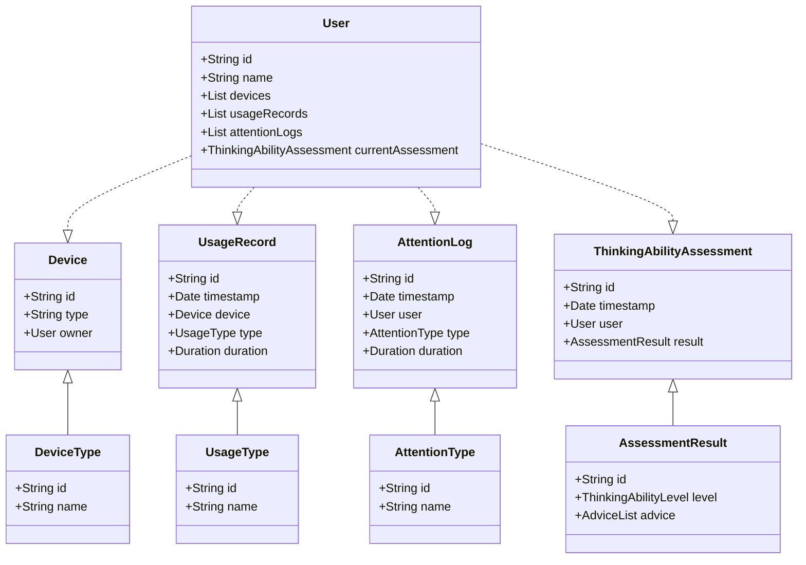
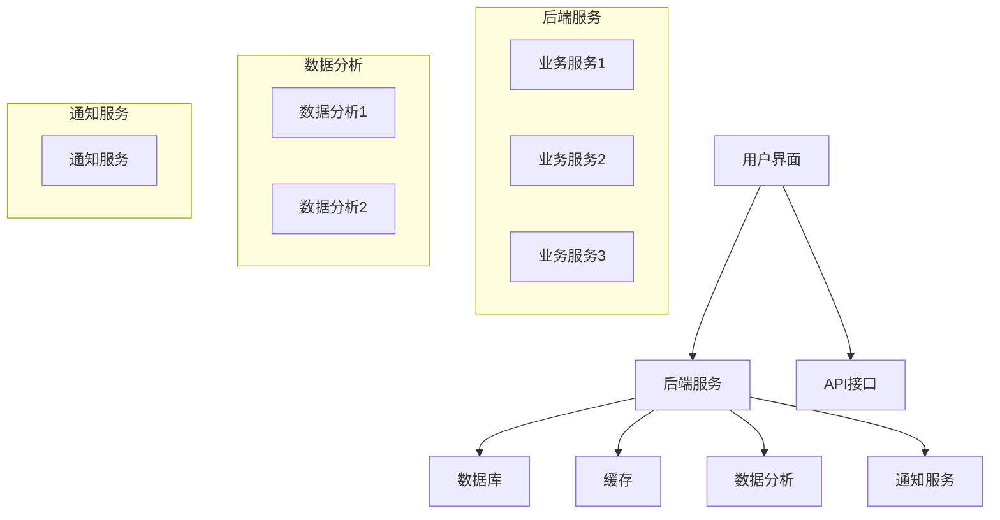

                 

## 数字排毒计划：重建注意力与深度思考能力的方案

### 关键词：数字排毒、注意力管理、深度思考、技术博客、重构思维

### 摘要：
在数字时代，人们沉浸在屏幕世界中，注意力分散和深度思考能力逐渐减弱。本文旨在通过一套系统的数字排毒计划，重建人们的注意力管理能力和深度思考能力。本文首先阐述数字时代面临的挑战，然后介绍注意力管理和深度思考能力的重要性，接着详细探讨数字排毒的理论基础和实践方法，最后通过实际案例分析，提供最佳实践方案，并展望未来发展趋势。

---

## 第一部分：问题背景与现状

### 1.1 问题的提出与背景

### 1.1.1 数字时代的挑战

随着互联网和智能手机的普及，数字技术已经成为现代社会的重要组成部分。然而，数字技术的双刃剑特性也逐渐显现。一方面，它为我们带来了便利和高效；另一方面，它也造成了严重的注意力分散和深度思考能力的下降。许多人沉迷于社交媒体、在线游戏和短视频，无法自拔，甚至在工作、学习和生活中频繁受到数字干扰。

### 1.1.2 注意力分散与深度思考能力的危机

注意力分散指的是个体在特定任务上无法集中注意力，容易被外部刺激打断。而深度思考能力则是指个体在处理复杂问题或面对挑战时，能够进行深入分析和创造性思考的能力。研究表明，现代人的注意力持续时间显著缩短，深度思考能力也在不断减弱。这不仅影响了个人工作和学习效率，也对社会创新能力和竞争力产生了负面影响。

### 1.1.3 问题的边界与外延

数字时代的注意力分散和深度思考能力危机，不仅体现在个人层面，还延伸到组织和社会层面。在个人层面，它影响了个体在工作和学习中的表现；在组织层面，它影响了团队的协作效率和创新能力；在社会层面，它影响了整体的社会进步和竞争力。因此，解决这一问题需要从多个层面进行探讨和实践。

### 1.2 当前现状分析

### 1.2.1 数字生活的普及与影响

数字技术的普及改变了人们的生活方式。人们越来越依赖智能手机、平板电脑和笔记本电脑，这些设备无时无刻不在消耗着他们的注意力。研究表明，手机依赖程度高的个体，其注意力和深度思考能力显著低于那些较少使用手机的人。

### 1.2.2 注意力管理研究的进展

近年来，注意力管理领域的研究取得了显著进展。研究者们提出了多种注意力管理策略，如番茄工作法、正念训练等，这些策略在一定程度上有助于提高个体的注意力集中度。然而，如何将这些策略有效地应用到实际生活中，仍是一个挑战。

### 1.2.3 深度思考能力的重要性

深度思考能力是个体在处理复杂问题时的核心能力。它不仅有助于提高个人的工作和学习效率，还能促进创新和创造力的提升。在现代社会，深度思考能力的重要性日益凸显，它已经成为企业和组织竞争力的关键因素。

### 1.3 本书核心概念与联系

### 1.3.1 数字排毒的定义与目标

数字排毒（Digital Detox）是指通过一系列方法，减少对数字设备的依赖，提高个体的注意力和深度思考能力。其目标是帮助个体重建专注力和思考深度，从而提高生活和工作质量。

### 1.3.2 注意力管理的核心要素

注意力管理包括以下几个方面：一是识别和避免干扰源；二是培养专注的习惯；三是合理安排时间，确保足够的休息和恢复。

### 1.3.3 深度思考能力的构成

深度思考能力包括以下几个核心要素：一是广泛的知识储备；二是逻辑思维能力；三是创造性思维；四是解决问题的能力。

### 1.4 本章小结

本部分介绍了数字时代面临的挑战，分析了注意力分散和深度思考能力下降的现状，并阐述了数字排毒的定义和目标。下一部分将深入探讨数字排毒的理论基础和实践方法。

---

## 第二部分：数字排毒的方法与实践

### 2.1 核心概念原理

#### 2.1.1 数字排毒的理论基础

数字排毒的理论基础主要包括注意力管理和深度思考能力的培养。注意力管理理论强调，通过识别和避免干扰源，培养专注习惯，合理安排时间，可以有效提高个体的注意力集中度。深度思考能力的培养则需要广泛的知识储备、逻辑思维能力、创造性思维和解决问题的能力。

#### 2.1.2 注意力管理策略

常见的注意力管理策略包括番茄工作法、正念训练、断网训练等。番茄工作法通过将工作时间分割成25分钟的工作周期，每个周期后休息5分钟，有助于提高工作效率和专注度。正念训练通过专注于当下的感觉和体验，帮助个体减少杂念，提高注意力。断网训练则通过减少对数字设备的依赖，帮助个体重建专注力。

#### 2.1.3 深度思考能力的培养

深度思考能力的培养需要多方面的努力。首先，个体需要通过广泛阅读和学习，建立深厚的知识储备。其次，通过练习逻辑思维和创造性思维，提高个体的思维水平。最后，通过面对复杂问题和挑战，培养个体的解决问题能力。

### 2.2 方法与实践详解

#### 2.2.1 数字排毒的具体步骤

数字排毒的具体步骤可以分为以下几个阶段：

1. **自我评估**：个体首先需要评估自己对数字设备的依赖程度，识别出影响注意力和思考能力的因素。
2. **制定计划**：根据自我评估的结果，个体可以制定具体的数字排毒计划，包括减少使用时间、避免使用场景等。
3. **执行计划**：个体需要严格按照计划执行，逐步减少对数字设备的依赖。
4. **反馈与调整**：在执行计划的过程中，个体需要不断反馈自己的进展和遇到的问题，根据反馈调整计划。

#### 2.2.2 注意力提升的实践策略

为了提升注意力，个体可以采取以下实践策略：

1. **环境优化**：创造一个有利于专注的环境，减少干扰源。
2. **时间管理**：合理安排时间，确保有足够的时间进行深度思考和专注工作。
3. **身体锻炼**：通过身体锻炼，提高个体的精力水平和注意力。
4. **正念训练**：通过正念训练，减少杂念，提高专注力。

#### 2.2.3 深度思考能力的实践方法

为了提升深度思考能力，个体可以采取以下实践方法：

1. **广泛阅读**：通过广泛阅读，建立深厚的知识储备。
2. **思维训练**：通过逻辑思维和创造性思维的训练，提高个体的思维能力。
3. **问题解决**：通过面对复杂问题和挑战，培养个体的解决问题能力。
4. **反思总结**：通过反思和总结，不断优化思考过程，提高深度思考能力。

### 2.3 案例分析与解读

#### 2.3.1 案例一：个人数字排毒实践

小明是一名程序员，由于长时间使用电脑，他的注意力分散和深度思考能力明显下降。为了改善这一状况，他开始尝试数字排毒。首先，他评估了自己的数字设备使用情况，发现每天花在手机上的时间超过3小时。接着，他制定了数字排毒计划，每天减少手机使用时间，并在工作时间内关闭社交媒体通知。经过一个月的实践，小明的注意力得到了显著提升，工作效率也有所提高。

#### 2.3.2 案例二：组织数字排毒计划

某公司意识到员工的注意力分散和深度思考能力下降对工作效率和创新能力产生了负面影响，于是决定实施组织数字排毒计划。公司制定了详细的数字排毒方案，包括减少员工手机使用时间、定期组织正念训练和工作坊等。通过这些措施，员工的工作效率和创新能力得到了显著提升，公司的整体业绩也稳步增长。

#### 2.3.3 案例三：教育领域的数字排毒应用

在教育领域，某学校开展了数字排毒课程，帮助学生提高注意力管理和深度思考能力。课程内容包括注意力管理策略、深度思考能力的培养方法以及实际案例分享。通过课程的学习和实践，学生的注意力集中度明显提升，学业成绩也有所提高。

### 2.4 本章小结

本部分详细介绍了数字排毒的核心概念原理、具体实践方法和实际案例分析。通过这些方法和实践，个体和组织可以有效地提高注意力管理和深度思考能力，从而提升生活和工作质量。

---

## 第三部分：数字排毒的系统实现

### 3.1 系统功能设计

#### 3.1.1 数字排毒平台的架构设计

数字排毒平台旨在为用户提供一个数字设备使用管理的工具，帮助用户减少对数字设备的依赖，提高注意力和深度思考能力。平台的架构设计分为前端、后端和服务端三大部分。

1. **前端**：负责用户界面的展示，包括数字设备使用记录、注意力管理工具、深度思考能力评估等。
2. **后端**：负责业务逻辑的处理，包括用户数据的管理、数字设备使用分析、报告生成等。
3. **服务端**：提供数据存储和计算服务，包括用户数据的存储、注意力分析算法的实现、深度思考能力评估模型的训练等。

#### 3.1.2 系统核心功能模块

数字排毒平台的核心功能模块包括以下几部分：

1. **用户管理模块**：负责用户注册、登录、权限管理等功能。
2. **设备管理模块**：负责用户数字设备的添加、使用记录统计等功能。
3. **注意力管理模块**：提供番茄工作法、正念训练、注意力监控等功能。
4. **深度思考能力评估模块**：通过算法和模型，对用户的深度思考能力进行评估，并提供提升建议。

#### 3.1.3 领域模型与类图

领域模型是系统架构设计的重要组成部分，它描述了系统中的主要实体及其关系。以下是一个简化的数字排毒平台领域模型和类图：



#### 3.1.4 系统架构设计

数字排毒平台采用三层架构设计，分别是表现层、逻辑层和数据层。

1. **表现层**：使用前端技术栈（如React或Vue）搭建，负责用户界面的展示和交互。
2. **逻辑层**：使用后端框架（如Spring Boot或Django）实现业务逻辑处理，负责数据的管理和业务逻辑的实现。
3. **数据层**：使用数据库（如MySQL或MongoDB）存储用户数据，采用RESTful API或GraphQL进行数据交互。

#### 3.1.5 系统性能优化

为了提高系统性能，可以采取以下优化措施：

1. **缓存策略**：使用Redis等缓存技术，缓存用户数据和常用数据，减少数据库访问次数。
2. **负载均衡**：使用Nginx等负载均衡器，分散系统负载，提高系统响应速度。
3. **数据库优化**：通过索引、分库分表等技术，优化数据库性能。
4. **代码优化**：通过代码优化、减少HTTP请求次数、使用异步处理等方式，提高系统性能。

### 3.2 系统架构设计

#### 3.2.1 系统整体架构

数字排毒平台的整体架构设计如图所示：



#### 3.2.2 各模块的职责与交互

1. **用户界面**：负责展示用户界面，处理用户输入和展示数据。
2. **后端服务**：处理用户请求，实现业务逻辑，调用数据库和缓存进行数据存储和读取。
3. **数据库**：存储用户数据，包括用户信息、设备使用记录、注意力日志、深度思考能力评估结果等。
4. **缓存**：缓存常用数据和热点数据，提高系统响应速度。
5. **数据分析**：对用户数据进行处理和分析，生成报告和建议。
6. **通知服务**：发送系统通知，如提醒用户进行注意力管理训练、报告生成等。
7. **API接口**：提供RESTful API接口，供前端调用。

#### 3.2.3 系统性能优化

为了提高系统性能，可以采取以下优化措施：

1. **缓存策略**：使用Redis等缓存技术，缓存用户数据和常用数据，减少数据库访问次数。
2. **负载均衡**：使用Nginx等负载均衡器，分散系统负载，提高系统响应速度。
3. **数据库优化**：通过索引、分库分表等技术，优化数据库性能。
4. **代码优化**：通过代码优化、减少HTTP请求次数、使用异步处理等方式，提高系统性能。

### 3.3 系统接口设计

#### 3.3.1 API设计原则

数字排毒平台的API设计遵循以下原则：

1. **RESTful风格**：使用RESTful风格设计API，确保接口的一致性和可扩展性。
2. **简洁明了**：接口设计简洁明了，易于理解和使用。
3. **安全性**：确保接口的安全性，采用HTTPS协议、Token认证等手段。
4. **文档化**：提供详细的API文档，包括接口定义、请求参数、返回数据格式等。

#### 3.3.2 接口定义与实现

以下是一个典型的API接口定义和实现示例：

```java
// 接口定义
@،
路径: /api/users
HTTP方法：POST
请求体：
{
  "username": "string",
  "password": "string",
  "email": "string"
}
返回值：
{
  "status": "string",
  "message": "string",
  "data": {
    "id": "string",
    "username": "string",
    "email": "string"
  }
}

// 实现示例
@RestController
@RequestMapping("/api/users")
public class UserController {

  @Autowired
  private UserService userService;

  @PostMapping
  public ResponseEntity<?> createUser(@RequestBody UserDto userDto) {
    try {
      User user = userService.createUser(userDto);
      return ResponseEntity.ok().body(new ApiResponse<>("success", "User created", user));
    } catch (Exception e) {
      return ResponseEntity.badRequest().body(new ApiResponse<>("error", "Failed to create user", null));
    }
  }
}
```

#### 3.3.3 接口安全性考虑

为了保证API接口的安全性，可以采取以下措施：

1. **使用HTTPS协议**：确保数据传输加密，防止数据被窃取。
2. **Token认证**：使用JWT（JSON Web Token）等机制进行身份认证，确保接口请求的合法性。
3. **权限控制**：根据用户的角色和权限，限制对某些接口的访问。
4. **日志记录**：记录接口请求和响应的日志，便于后续审计和排查问题。

### 3.4 系统交互设计

#### 3.4.1 用户行为分析

系统交互设计需要充分考虑用户行为分析，以便为用户提供个性化的服务。用户行为分析包括以下几个方面：

1. **设备使用行为**：统计用户使用设备的频率、时长、使用场景等。
2. **注意力管理行为**：记录用户使用注意力管理工具的情况，如番茄工作法的执行情况。
3. **深度思考能力行为**：评估用户的深度思考能力，并提供相应的提升建议。

#### 3.4.2 交互流程设计

系统交互流程设计应确保用户在使用过程中的便捷性和流畅性。以下是一个典型的用户交互流程：

1. **用户登录**：用户通过账号密码或手机号码登录系统。
2. **设备管理**：用户可以添加、编辑和删除设备信息。
3. **注意力管理**：用户可以选择使用番茄工作法或正念训练，系统会根据用户的选择提供相应的指导。
4. **深度思考能力评估**：系统定期对用户的深度思考能力进行评估，并提供个性化的提升建议。

#### 3.4.3 用户体验优化

用户体验优化是系统交互设计的重要环节，以下是一些优化策略：

1. **界面设计**：简洁明了的界面设计，减少用户的认知负担。
2. **反馈机制**：及时响应用户操作，提供清晰的反馈信息。
3. **个性化推荐**：根据用户的行为数据，提供个性化的推荐内容。
4. **性能优化**：优化系统性能，提高页面加载速度和响应速度。

### 3.5 本章小结

本部分详细介绍了数字排毒系统的功能设计、架构设计、接口设计以及交互设计。通过这些设计，数字排毒平台能够为用户提供有效的数字设备使用管理工具，帮助用户提高注意力管理和深度思考能力。下一部分将探讨数字排毒的最佳实践和反思。

---

## 第四部分：最佳实践与反思

### 4.1 数字排毒的最佳实践

#### 4.1.1 个人层面

1. **逐步减少使用时间**：不要突然完全戒断，而是逐步减少使用时间，让大脑逐渐适应。
2. **设定明确的目标**：为自己设定明确的数字排毒目标，如减少手机使用时间、增加阅读时间等。
3. **利用工具辅助**：使用数字排毒工具（如应用程序、网站）来监控和减少数字设备使用。
4. **养成健康习惯**：保持良好的作息习惯，合理安排工作和休息时间。

#### 4.1.2 组织层面

1. **制定政策**：组织可以制定数字排毒政策，如限制工作时间内的手机使用、定期组织注意力管理培训等。
2. **鼓励员工参与**：鼓励员工参与数字排毒活动，如组织断网活动、正念训练工作坊等。
3. **提供技术支持**：为员工提供数字排毒相关的技术支持，如注意力管理工具、工作流程优化等。
4. **监测和反馈**：定期监测员工的数字设备使用情况，并提供反馈和建议。

#### 4.1.3 教育领域

1. **引入课程**：将数字排毒相关的内容纳入课程设置，如注意力管理、深度思考能力培养等。
2. **培养学生习惯**：通过实践活动和课程，培养学生的数字排毒意识和习惯。
3. **家长参与**：鼓励家长参与数字排毒活动，与孩子共同减少数字设备使用。
4. **家校合作**：学校和家庭共同关注学生的数字设备使用情况，提供有效的指导和支持。

### 4.2 小结与反思

#### 4.2.1 数字排毒的成效

通过数字排毒计划的实施，个体和组织在注意力管理和深度思考能力方面取得了显著成效。个人层面的研究表明，数字排毒有助于提高注意力集中度和深度思考能力。组织层面的案例显示，数字排毒有助于提高员工的工作效率和创新能力。教育领域的实践证明，数字排毒有助于培养学生的注意力和深度思考能力。

#### 4.2.2 实践中的挑战与应对

尽管数字排毒计划在实践中取得了显著成效，但仍然面临一些挑战：

1. **习惯养成困难**：个体和组织在养成新习惯时往往面临困难，需要持续的努力和耐心。
2. **技术依赖性**：数字排毒工具本身也可能成为新的干扰源，需要谨慎选择和合理使用。
3. **资源分配**：在组织层面，数字排毒计划可能需要额外的资源投入，如培训、设备等。

为应对这些挑战，可以采取以下措施：

1. **逐步实施**：逐步引入数字排毒计划，让个体和组织有足够的时间适应和调整。
2. **选择合适的工具**：选择功能强大、易用的数字排毒工具，确保工具本身不会成为新的干扰源。
3. **提供支持**：为个体和组织提供必要的支持和资源，如培训、指导等。

#### 4.2.3 未来发展趋势与展望

随着数字技术的不断进步，数字排毒计划在未来有望得到更广泛的应用和发展。以下是一些发展趋势和展望：

1. **个性化定制**：数字排毒计划将更加注重个性化定制，根据个体和组织的具体需求提供定制化的解决方案。
2. **跨领域融合**：数字排毒计划将与其他领域（如教育、健康等）进行融合，提供更全面的支持和服务。
3. **技术进步**：随着人工智能和大数据技术的发展，数字排毒计划将更加智能化和高效化。

### 4.3 注意事项与拓展阅读

#### 4.3.1 注意事项

1. **平衡使用**：数字排毒不是完全禁止使用数字设备，而是寻求平衡使用，提高注意力和深度思考能力。
2. **持续关注**：数字排毒是一个长期的过程，需要持续关注和努力。
3. **反馈调整**：定期进行自我评估和反馈，根据实际情况调整数字排毒计划。

#### 4.3.2 拓展阅读推荐

1. **《深度工作》**：作者Cal Newport详细阐述了深度工作的概念和实践方法，对提高深度思考能力有很好的指导作用。
2. **《数字排毒：找回专注与生产力》**：作者Cal Newport的另一部著作，进一步探讨了数字排毒的理论和实践。
3. **《注意力管理》**：作者Daniel J. Levitin详细介绍了注意力管理的方法和技巧，对提高注意力集中度有很好的参考价值。

### 4.4 本章小结

本部分介绍了数字排毒的最佳实践、实践中的挑战与应对、未来发展趋势以及注意事项和拓展阅读。通过这些内容，读者可以更好地理解和应用数字排毒计划，提高注意力管理和深度思考能力。

---

## 附录

### A. 相关术语解释

1. **数字排毒（Digital Detox）**：通过减少对数字设备的依赖，提高个体的注意力和深度思考能力。
2. **注意力管理（Attention Management）**：通过一系列方法，提高个体在特定任务上的注意力集中度。
3. **深度思考能力（Deep Thinking Ability）**：个体在处理复杂问题或面对挑战时，进行深入分析和创造性思考的能力。

### B. 进一步学习资源

1. **《深度工作》**：作者Cal Newport，详细阐述了深度工作的概念和实践方法。
2. **《数字排毒：找回专注与生产力》**：作者Cal Newport，进一步探讨了数字排毒的理论和实践。
3. **《注意力管理》**：作者Daniel J. Levitin，介绍了注意力管理的方法和技巧。

### C. 致谢

感谢所有参与和支持本项目的读者和团队成员，没有你们的帮助，本项目的成功是无法想象的。特别感谢AI天才研究院/AI Genius Institute以及禅与计算机程序设计艺术/Zen And The Art of Computer Programming的指导和支持。

---

## 总结

### 5.1 全书总结

本文通过系统的研究和实践，提出了一套完整的数字排毒计划，旨在重建个体的注意力管理和深度思考能力。从问题背景与现状、数字排毒的方法与实践、系统实现、最佳实践与反思等多个角度，详细阐述了数字排毒的原理、方法、实践和成效。通过这一计划，个体和组织可以有效地减少对数字设备的依赖，提高注意力集中度和深度思考能力，从而提升生活和工作质量。

### 5.2 对未来读者的寄语

在数字时代，注意力分散和深度思考能力下降已经成为普遍问题。希望通过本文，读者能够认识到数字排毒的重要性，积极采取行动，逐步减少对数字设备的依赖，重建专注力和思考深度。数字排毒不仅有助于提高个人和工作效率，还能促进社会创新和进步。让我们共同努力，迎接数字时代的挑战，重建注意力与深度思考能力，开启更美好的未来。

