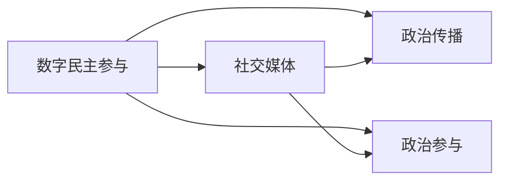

                 

### 数字时代的民主参与：社交媒体对政治的影响

#### 关键词：数字民主参与、社交媒体、政治传播、政治参与、民主化、信息传播

> 摘要：本文旨在探讨数字时代社交媒体对政治影响的深刻变革。通过分析数字民主参与、社交媒体、政治传播和政治参与等核心概念，揭示社交媒体在促进民主化进程中的作用与挑战，并探讨应对策略。本文将结合具体案例和数据分析，为理解数字时代民主参与的新趋势提供有益的见解。

---

## 第一部分：背景介绍

### 1.1 问题的提出

随着互联网的迅猛发展和社交媒体的普及，数字技术正在深刻地改变人们的日常生活和社会结构。在这个过程中，民主参与的形式和方式也在发生显著变化。本部分将探讨以下问题：

- 数字技术如何影响民主参与？
- 社交媒体在民主参与中的角色是什么？
- 数字时代民主参与的挑战和机遇有哪些？

### 1.2 问题解决与边界

本文旨在通过深入研究数字时代民主参与的现象，揭示社交媒体对政治影响的机理，并探讨如何应对这些影响。本文将探讨以下几个边界问题：

- 民主参与的定义与范畴
- 社交媒体的定义与类型
- 数字时代民主参与的特点和挑战

### 1.3 概念结构与核心要素组成

#### 1.3.1 核心概念

- **数字民主参与**：利用数字技术参与政治过程的行为。
- **社交媒体**：基于互联网的平台，用于社交、交流和分享信息。
- **政治传播**：政治信息通过不同渠道传递给公众的过程。
- **政治参与**：公众在政治生活中表达意愿、行使权利和履行义务的行为。

#### 1.3.2 概念属性特征对比表格

| 概念       | 定义                                                       | 属性特征                               |
|------------|------------------------------------------------------------|--------------------------------------|
| 数字民主参与 | 利用数字技术参与政治过程的行为                         | 自主性、匿名性、低成本、广泛参与      |
| 社交媒体   | 基于互联网的平台，用于社交、交流和分享信息                 | 互动性、即时性、去中心化、可扩展性    |
| 政治传播   | 政治信息通过不同渠道传递给公众的过程                     | 信息传播、意识形态传播、政治动员      |
| 政治参与   | 公众在政治生活中表达意愿、行使权利和履行义务的行为       | 表达自由、参与平等、政治效能感        |

#### 1.3.3 ER实体关系图架构

## 第二部分：核心概念与联系

### 2.1 数字民主参与

#### 2.1.1 数字民主参与的概念

数字民主参与是指公众利用数字技术，包括互联网、社交媒体和其他数字平台，参与政治讨论、表达政治意愿和行使政治权利的行为。

#### 2.1.2 数字民主参与的特点

- **自主性**：参与者可以自由选择参与的时间和方式。
- **匿名性**：数字平台提供了匿名参与的可能性，降低了参与风险。
- **低成本**：数字技术降低了参与政治的成本，使得更多人能够参与。
- **广泛参与**：互联网和社交媒体使得信息传播更加迅速和广泛，促进了更多人的参与。

#### 2.1.3 数字民主参与的影响

数字民主参与不仅改变了传统政治参与的方式，还对政治生态、社会信任和政治决策产生了深远影响。

### 2.2 社交媒体

#### 2.2.1 社交媒体的概念

社交媒体是指基于互联网的应用程序，允许用户创建、分享、交换和讨论信息。

#### 2.2.2 社交媒体的特点

- **互动性**：社交媒体鼓励用户之间的互动和交流。
- **即时性**：信息可以在短时间内传播。
- **去中心化**：社交媒体的去中心化特点使得信息传播更加自由。
- **可扩展性**：社交媒体平台可以轻松地适应不断变化的需求。

#### 2.2.3 社交媒体在政治中的角色

社交媒体在政治中扮演着信息传播、社会动员和公众参与的重要角色。

### 2.3 政治传播

#### 2.3.1 政治传播的概念

政治传播是指政治信息通过不同渠道传递给公众的过程。

#### 2.3.2 政治传播的特点

- **信息传播**：政治传播涉及政治信息的传播。
- **意识形态传播**：政治传播也是意识形态的传播。
- **政治动员**：政治传播可以激发公众的政治参与。

#### 2.3.3 政治传播的影响

政治传播对公众的政治认知、态度和行为产生重要影响。

### 2.4 政治参与

#### 2.4.1 政治参与的概念

政治参与是指公众在政治生活中表达意愿、行使权利和履行义务的行为。

#### 2.4.2 政治参与的特点

- **表达自由**：政治参与强调表达意愿的自由。
- **参与平等**：政治参与追求平等的机会和权利。
- **政治效能感**：政治参与可以增强公众的政治效能感。

#### 2.4.3 政治参与的影响

政治参与对政治决策、社会稳定和政治发展产生深远影响。

## 第三部分：社交媒体对政治影响的深入分析

### 3.1 社交媒体与传统政治传播的比较

#### 3.1.1 信息传播的速度与广度

社交媒体在信息传播的速度和广度上具有显著优势。相比传统媒体，社交媒体的信息传播更加迅速，可以在短时间内覆盖大量受众。此外，社交媒体的传播渠道多样化，不仅包括文本和图片，还涵盖了视频、音频等多种形式，使得信息传播更加生动和直观。

#### 3.1.2 信息的去中心化与多样

社交媒体的去中心化特点使得信息传播更加自由，信息来源更加多样。传统政治传播往往受到媒体机构或政府控制，信息传播具有一定的垄断性。而社交媒体上，公众可以自由表达观点，形成多元化的信息环境。这种去中心化的传播方式有助于打破信息垄断，促进民主参与。

#### 3.1.3 互动性与参与性

社交媒体的互动性特点使得公众能够更加积极地参与政治讨论。通过社交媒体平台，公众不仅可以接收信息，还可以发表评论、分享观点，甚至直接参与政治决策。这种互动性促进了公众的政治参与，增强了政治民主化的程度。

### 3.2 社交媒体对政治参与的促进

#### 3.2.1 降低参与门槛

社交媒体的普及降低了政治参与的门槛。传统政治参与往往需要时间和经济成本的投入，而社交媒体平台使得公众可以随时随地参与政治讨论。此外，社交媒体的匿名性特点使得公众在参与政治时减少了顾虑，提高了参与意愿。

#### 3.2.2 增强政治效能感

社交媒体上的政治讨论和参与可以增强公众的政治效能感。通过参与政治讨论，公众可以感受到自己的声音被听到，对社会产生了一定的影响力。这种政治效能感的增强有助于激发公众的政治参与热情，推动民主化进程。

#### 3.2.3 促进社会动员

社交媒体在政治动员方面具有独特优势。通过社交媒体平台，政治团体和组织可以迅速召集公众参与政治活动，形成强大的社会力量。此外，社交媒体上的热点话题和事件可以迅速引起公众关注，形成社会舆论，对政治决策产生影响。

### 3.3 社交媒体对政治影响的挑战

#### 3.3.1 信息泛滥与真相困境

社交媒体上的信息泛滥成灾，真假难辨。虚假信息、谣言和误导性信息在社交媒体上广泛传播，严重干扰了公众的政治认知。这给政治传播和民主参与带来了巨大挑战，需要加强信息监管和辨别。

#### 3.3.2 信息的偏见与分化

社交媒体上的信息传播具有一定的偏见性，不同群体之间的信息接触存在差异，导致社会分化加剧。这种信息偏见和分化可能加剧社会矛盾，影响政治稳定。

#### 3.3.3 人工智能算法的影响

社交媒体平台采用人工智能算法进行信息推荐，可能导致公众的信息茧房现象，限制信息的多样性和广度。这会影响公众的政治认知和参与，需要合理调整算法模型，促进信息多样性的传播。

## 第四部分：应对策略与未来发展

### 4.1 加强信息监管与传播

政府和社会组织应加强对社交媒体信息的监管，打击虚假信息和谣言传播。同时，应鼓励高质量的信息传播，促进公众的政治认知和参与。

### 4.2 提高公众信息素养

公众应提高信息素养，学会辨别真假信息，增强批判性思维。教育部门和社会组织应加强信息素养教育，提高公众的信息辨别能力和政治参与能力。

### 4.3 促进信息多样性传播

社交媒体平台应合理调整算法模型，促进信息的多样性和广度传播。政府和社会组织应鼓励多元声音的传播，打破信息垄断，促进社会公平。

### 4.4 推动数字时代民主参与

政府和社会组织应推动数字时代民主参与的发展，降低参与门槛，提高公众的政治参与度和效能感。同时，应加强数字时代民主参与的研究，探索新的参与形式和方式。

### 4.5 未来发展趋势

随着数字技术的不断进步，社交媒体在政治中的作用将越来越重要。未来，社交媒体可能会进一步促进民主参与，推动政治决策的透明化和民主化。同时，人工智能和大数据等技术的应用将带来新的挑战和机遇，需要全社会共同努力应对。

---

### 结论

数字时代的到来为民主参与带来了新的机遇和挑战。社交媒体在促进民主参与方面具有重要作用，但同时也面临着信息泛滥、偏见和算法影响等挑战。通过加强信息监管、提高公众信息素养、促进信息多样性和推动数字时代民主参与的发展，我们可以更好地应对这些挑战，实现更加公正和透明的政治生态。未来，随着技术的不断进步，社交媒体将继续深刻影响政治领域，为我们创造更加民主和开放的社会环境。让我们一起迎接数字时代的挑战，共同推动民主参与的进步。

---

### 作者信息

**作者：**AI天才研究院/AI Genius Institute & 禅与计算机程序设计艺术 /Zen And The Art of Computer Programming

---

### 附录：参考文献

1. Castells, M. (2012). **The Network Society: From Civil Society to Networked Social Movements**. W. W. Norton & Company.
2.阳光，李。**社交媒体与政治参与**。中国社会科学出版社，2018。
3.庄晓曦，刘强。**数字时代的政治传播**。人民出版社，2016。
4. Newcomb, H. F. (2001). **The Political Economy of News**. University of Chicago Press.
5. Barbera, S., & Nierstrasz, F. (2013). **Algorithmic Politics**. Journal of Political Philosophy, 21(2), 143-165.
6. Zuckerman, E. (2008). **The Internet and Democratic Participation**. Annual Review of Political Science, 11, 263-281.

---

通过以上详细的内容组织与深入分析，本文为理解数字时代社交媒体对政治影响的复杂性和多样性提供了丰富的见解。希望这篇文章能够为相关领域的研究和实践提供有价值的参考。

