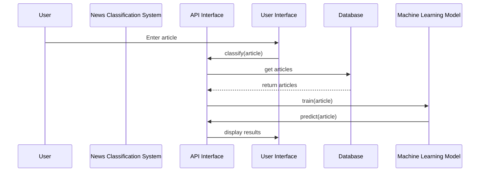
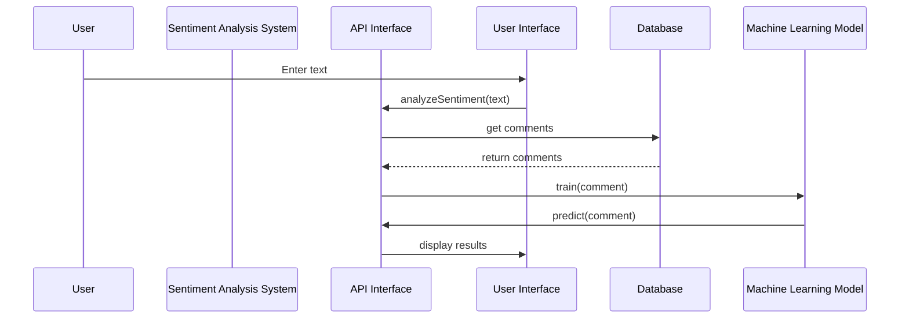
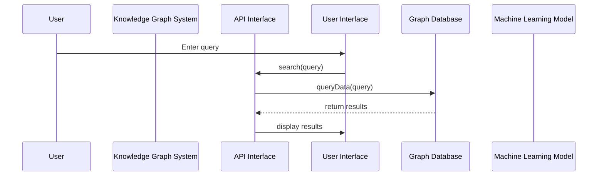

                 

### 引言

在数字时代，信息的获取和处理已经成为我们日常生活和工作中不可或缺的一部分。然而，随着互联网和大数据技术的飞速发展，信息的爆炸式增长带来了前所未有的挑战——信息过载。我们每天都会接触到海量的信息，但如何筛选出真正有价值的内容，已经成为一个亟待解决的问题。同时，深度学习技术的崛起为知识获取提供了新的可能性。它不仅能够处理大规模的数据，还能够自动提取有用的特征，从而辅助我们进行有效的信息筛选。

本文将深入探讨数字时代知识获取的挑战与机遇，重点介绍信息筛选和深度学习在其中的应用。我们将首先介绍信息筛选的重要性以及其面临的问题，接着探讨深度学习的基础知识，包括其原理、发展历程和应用场景。随后，我们将详细讨论数据预处理和特征提取的过程，并深入讲解深度学习模型的构建、训练与优化。最后，通过实际应用案例，我们将展示如何将深度学习应用于知识获取的各个领域，并总结全文，展望未来的发展趋势。

通过这篇文章，读者将了解信息筛选与深度学习在数字时代知识获取中的重要作用，掌握相关技术和方法，从而在日益复杂的信息环境中游刃有余。

### 关键词

- 数字时代
- 知识获取
- 信息筛选
- 深度学习
- 数据预处理
- 特征提取
- 模型训练
- 评估与优化

### 摘要

本文深入探讨了数字时代知识获取的挑战与机遇，特别是在信息过载的大背景下。通过介绍信息筛选技术及其在信息获取中的作用，我们阐明了筛选有用信息的重要性。接着，我们详细介绍了深度学习的基础知识，包括其原理、发展历程和应用场景，强调了其在处理大规模数据和自动特征提取方面的优势。随后，我们讨论了数据预处理和特征提取的过程，并深入讲解了深度学习模型的构建、训练与优化。最后，通过实际应用案例，我们展示了深度学习在知识获取中的实际应用，包括新闻文章分类、社交媒体情感分析和知识图谱构建。本文旨在为读者提供一套系统的知识获取与深度学习技术指南，帮助他们应对数字时代的信息挑战。

## 第1章 引言

### 1.1 知识获取的重要性

在当今数字化时代，知识获取的重要性不言而喻。知识不仅是个人职业发展的基石，更是社会进步和经济发展的动力源泉。然而，随着信息的爆炸式增长，传统的知识获取方式面临着前所未有的挑战。一方面，信息的泛滥使得人们在海量数据中难以筛选出真正有价值的内容；另一方面，知识获取的效率成为衡量信息时代能力的关键指标。在这种背景下，有效的知识获取不仅需要高效的信息筛选能力，还需要对深度学习等先进技术的理解和应用。

信息筛选是知识获取过程中的关键步骤。它涉及到从大量无序的信息中提取出有用、相关的信息，以便进一步处理和分析。传统的信息筛选方法往往依赖于人工经验和简单规则，但在面对海量数据和复杂的知识结构时，这些方法的效率和准确性都显得捉襟见肘。因此，引入自动化、智能化的信息筛选技术成为提升知识获取效率的重要手段。

深度学习作为一种人工智能的重要分支，其核心在于通过模仿人类大脑的神经网络结构，实现自动化的特征提取和模式识别。在知识获取领域，深度学习技术通过处理大规模数据，能够自动挖掘数据中的隐藏模式和关联性，从而辅助用户进行信息筛选。例如，深度学习可以用于文本分类、情感分析、图像识别等任务，大大提高了信息筛选的效率和准确性。

此外，深度学习在知识获取中的优势不仅体现在信息筛选方面，还可以扩展到数据的预处理、特征提取、模型的训练和优化等多个环节。通过深度学习技术，我们可以更加高效地处理复杂数据，提取出有价值的特征，从而为后续的知识处理提供坚实的基础。

总之，在数字时代，知识获取的重要性不容忽视。信息筛选和深度学习作为提升知识获取效率的关键技术，已经成为现代信息处理领域的核心。通过有效的信息筛选和深度学习应用，我们可以从海量数据中获取真正有价值的信息，推动个人和社会的发展。

### 1.2 数字时代信息获取的现状

数字时代的到来，使得信息获取的方式和速度发生了翻天覆地的变化。我们生活在一个被大数据和互联网技术包围的世界中，信息的获取变得前所未有的便捷和高效。然而，这种便捷性也伴随着一系列新的挑战和问题。

首先，信息量的爆炸性增长是数字时代信息获取的主要特征之一。据统计，每天产生的数据量正以惊人的速度增长，从社交媒体、电子商务、科学研究到智能家居等各个领域，数据无处不在。这种信息量的剧增，不仅给信息的存储和管理带来了巨大压力，也使得人们面临“信息过载”的问题。面对海量的信息，如何筛选出真正有价值的内容成为了一项艰巨的任务。

其次，信息获取的便捷性极大地改变了人们的日常生活和工作方式。通过搜索引擎、社交媒体和移动应用，我们可以随时随地获取所需的信息。这种便捷性不仅提高了知识传播的效率，也使得知识获取变得更加个性化和多样化。然而，这也带来了信息真实性和准确性的问题。在互联网上，信息的真伪难以辨别，虚假信息和误导性信息时常充斥其中，给信息的获取带来了很大的风险。

此外，数字时代的信息获取还面临着隐私和安全的问题。在信息收集和利用的过程中，个人的隐私数据可能被泄露或滥用，这不仅对个人权益构成了威胁，也对社会的整体信任体系带来了挑战。如何在保障个人隐私的前提下，高效地获取和处理信息，成为了一个亟待解决的重要课题。

总之，数字时代信息获取的现状既充满了机遇，也充满了挑战。信息量的爆炸性增长、获取便捷性的提升以及隐私和安全问题的凸显，都对信息筛选和知识获取提出了新的要求和挑战。了解这些现状，对于我们更好地应对信息时代的变化具有重要意义。

### 1.3 信息过载问题及其解决方案

信息过载是数字时代面临的主要挑战之一。随着信息量的爆炸性增长，人们每日接收到的信息量远远超过了其处理和吸收的能力。这不仅导致时间和精力的浪费，还可能引发焦虑和压力。信息过载问题不仅存在于个人层面，也对企业和社会的整体运作产生了深远的影响。

首先，信息过载对个人的影响主要体现在时间管理上的困难。在海量的信息中，用户难以判断哪些信息是有价值的，哪些可以忽略。这种筛选过程不仅耗时，还可能导致重要信息被遗漏。此外，信息过载还可能导致认知负荷的增加，从而影响工作效率和决策能力。长时间处于信息过载的状态，还可能引发心理压力和焦虑，影响个人的心理健康。

对企业而言，信息过载同样带来了诸多问题。首先，企业的信息处理能力有限，面对海量的数据，难以有效地进行分析和利用。这不仅浪费了资源，还可能导致决策的滞后。此外，信息过载还可能导致数据孤岛现象，即不同部门或系统之间的数据难以整合和共享，从而限制了企业整体的数据利用效率。在高度竞争的市场环境中，这无疑削弱了企业的竞争力。

针对信息过载问题，有多种解决方案可以缓解其负面影响：

1. **信息筛选技术**：通过引入先进的算法和工具，对海量的信息进行自动化筛选和分类。例如，基于机器学习的推荐系统可以根据用户的历史行为和偏好，推荐可能感兴趣的信息，从而减少无效信息的干扰。

2. **数据挖掘与分析**：利用数据挖掘技术，从海量数据中提取有价值的信息和洞察。通过分析数据之间的关联性，可以更好地理解数据的内在规律，从而优化信息处理流程。

3. **信息可视化**：通过信息可视化技术，将复杂的数据和知识以图形化的形式呈现，帮助用户更直观地理解和分析信息。例如，数据仪表板和交互式可视化工具可以实时显示关键数据指标，帮助用户快速定位重要信息。

4. **知识管理系统**：建立有效的知识管理系统，将重要的信息和知识进行系统化存储和分类，便于后续的查询和使用。通过共享和协作机制，可以促进知识在企业内部的高效传播和应用。

5. **定期清理和整理**：定期对信息和数据进行清理和整理，删除冗余和过期的信息，保持信息库的简洁和高效。这不仅可以减轻信息过载的压力，还可以提高数据处理的效率。

总之，信息过载是数字时代不可回避的挑战。通过引入先进的信息筛选技术和方法，我们可以有效地应对信息过载问题，提高信息获取和处理效率，从而更好地应对数字时代的信息挑战。

### 第2章 数字时代的信息获取

#### 2.1 数字时代信息获取的现状

数字时代的信息获取已经成为我们日常生活和工作的重要部分。在这一章中，我们将探讨数字时代信息获取的现状，深入分析当前的信息获取渠道、常用工具和技术，并讨论其在知识获取中的实际应用。

首先，数字时代信息获取的渠道变得多样化且高度互联。传统的信息获取渠道如书籍、报纸和杂志逐渐被互联网和移动设备所取代。如今，人们可以通过搜索引擎、社交媒体、在线数据库、新闻网站等多种渠道获取信息。例如，搜索引擎如Google和Bing为用户提供了便捷的信息检索服务；社交媒体如Facebook、Twitter和LinkedIn则成为了用户分享和获取信息的重要平台。此外，专业在线数据库和文献库如PubMed、IEEE Xplore等则为科研人员提供了丰富的学术资源和研究成果。

在技术层面，信息获取工具和技术的不断进步也为数字时代的信息获取提供了强有力的支持。关键词搜索和自然语言处理技术使得信息检索更加精准和高效；推荐系统利用机器学习和数据挖掘技术，根据用户的行为和偏好推荐相关内容，从而提高了信息获取的个性化水平。数据可视化技术则通过图形化的方式展示了复杂的数据和知识，帮助用户更直观地理解和分析信息。

这些信息获取渠道和工具在知识获取中的应用表现出显著的效果。例如，科研人员可以利用搜索引擎快速查找相关的学术文献和研究结果，从而节省大量的时间和精力；企业可以通过社交媒体和在线数据库获取市场信息、客户反馈和竞争对手的动态，从而做出更明智的决策。此外，推荐系统和数据可视化技术也广泛应用于教育、医疗等多个领域，提高了知识传播和应用的效率。

总的来说，数字时代的信息获取渠道多样化、技术先进，极大地丰富了我们的知识获取方式。通过综合利用这些渠道和工具，我们可以更高效、更精准地获取所需的信息，从而更好地应对数字时代的信息挑战。

#### 2.2 信息筛选的基本概念

在数字时代，信息筛选是一个至关重要的过程，它涉及到从海量数据中提取出有价值的信息，以便进一步分析和利用。信息筛选的基本概念包括信息过滤、信息抽取和信息摘要，这些技术共同作用，帮助我们有效地处理和利用信息。

首先，信息过滤（Information Filtering）是指通过特定的算法或规则，从大量信息中筛选出用户感兴趣的内容。信息过滤可以分为基于内容的过滤和基于协作的过滤两种类型。基于内容的过滤主要通过分析信息的属性和内容，如关键词、主题和格式等，来匹配用户的兴趣和需求。例如，搜索引擎和社交媒体推荐系统就是基于内容的过滤应用。基于协作的过滤则通过分析用户的社交网络和行为数据，发现用户之间的相似性，从而推荐相关的内容。这种过滤方式依赖于用户的评价和反馈，如评分、点赞和评论等。

其次，信息抽取（Information Extraction）是指从非结构化的数据源中提取出结构化的信息。信息抽取通常包括命名实体识别（Named Entity Recognition，NER）、关系抽取（Relation Extraction）和事件抽取（Event Extraction）等任务。命名实体识别旨在识别文本中的特定实体，如人名、地点和组织名；关系抽取则识别实体之间的相互关系；事件抽取则是识别文本中描述的特定事件及其相关实体。信息抽取技术广泛应用于信息检索、知识图谱构建和自然语言处理等领域。

信息摘要（Information Summarization）是指通过生成摘要，简化长篇文本的核心内容，使其更加易于理解和分析。信息摘要可以分为抽取式摘要和生成式摘要两种类型。抽取式摘要通过提取文本中的关键句子或段落，生成摘要文本；生成式摘要则通过自然语言生成技术，生成新的摘要文本。信息摘要技术可以帮助用户快速把握文本的核心内容，节省阅读时间，提高信息处理效率。

这些信息筛选技术在实际应用中发挥着重要作用。例如，在社交媒体平台上，信息过滤技术可以帮助用户筛选出感兴趣的话题和内容，减少无效信息的干扰；在新闻行业中，信息抽取技术可以自动提取新闻文本中的关键信息，生成摘要和关键词索引，提高信息检索和利用的效率；在知识管理系统中，信息摘要技术可以帮助用户快速浏览大量文档，提取出有价值的信息，从而支持决策和知识共享。

总之，信息筛选技术是数字时代知识获取的重要组成部分。通过有效的信息过滤、信息抽取和信息摘要，我们可以从海量数据中提取出有价值的信息，提高信息处理的效率和质量，为个人和社会的发展提供强有力的支持。

#### 2.3 信息筛选的方法与技术

在数字时代，信息筛选的方法与技术已经成为知识获取的关键环节。为了有效地从海量数据中筛选出有价值的信息，我们需要掌握一系列先进的算法和工具。以下是一些主要的信息筛选方法和技术：

**1. 关键词搜索算法**

关键词搜索算法是最常见的信息筛选方法之一。通过分析用户输入的关键词，搜索引擎能够从庞大的数据库中快速定位相关的内容。这种算法的核心在于如何高效地匹配关键词与文档内容。常用的技术包括布尔搜索（使用AND、OR、NOT等布尔运算符进行复杂查询）、词频统计（计算关键词在文档中的出现频率）和TF-IDF（Term Frequency-Inverse Document Frequency，通过调整关键词的重要性来提高检索效果）。

**2. 推荐系统**

推荐系统利用用户的历史行为和偏好数据，自动推荐相关的内容。推荐系统可以分为基于内容的推荐和基于协同过滤的推荐。基于内容的推荐通过分析用户和项目的内容特征，找出相似的内容进行推荐；基于协同过滤的推荐则通过分析用户之间的行为相似性，推荐用户可能感兴趣的内容。常见的推荐算法包括协同过滤（Collaborative Filtering）和矩阵分解（Matrix Factorization），如SVD（Singular Value Decomposition）。

**3. 自然语言处理（NLP）技术**

自然语言处理技术为信息筛选提供了强大的工具，包括文本分类、情感分析和命名实体识别等。文本分类（Text Classification）通过机器学习算法，将文本数据归类到预定义的类别中；情感分析（Sentiment Analysis）用于判断文本的情感倾向，如正面、负面或中立；命名实体识别（NER）则识别文本中的特定实体，如人名、地点和组织名。这些技术可以用于自动过滤和分类大量文本数据，提高信息筛选的准确性和效率。

**4. 数据挖掘与机器学习**

数据挖掘和机器学习技术在信息筛选中发挥着重要作用。通过训练模型，从大量数据中自动发现模式和关联，可以帮助我们更好地理解数据，进行有效的筛选。常见的算法包括决策树（Decision Tree）、支持向量机（SVM）、神经网络（Neural Networks）和深度学习（Deep Learning）。例如，可以使用决策树进行分类任务，支持向量机进行文本分类，神经网络和深度学习进行复杂模式识别和特征提取。

**5. 信息可视化**

信息可视化通过图形化的方式展示复杂的数据和知识，帮助用户更直观地理解和分析信息。常用的信息可视化技术包括词云（Word Cloud）、热力图（Heatmap）、桑基图（Sankey Diagram）和时间序列图（Time Series Chart）等。信息可视化不仅可以帮助用户快速筛选出重要信息，还可以揭示数据之间的隐含关系和趋势。

**6. 知识图谱**

知识图谱是一种通过实体和关系构建的语义网络，能够表示复杂的知识结构。在信息筛选中，知识图谱可以帮助我们理解数据之间的关联性，从而进行有效的筛选。例如，通过构建文本数据的实体关系图谱，可以更好地进行文本分类和语义分析。

这些信息筛选方法和技术在实际应用中得到了广泛的应用。例如，在新闻行业中，关键词搜索和NLP技术可以帮助自动分类和推荐新闻；在电子商务领域，推荐系统和数据挖掘技术可以用于个性化推荐和用户行为分析；在科研领域，知识图谱和自然语言处理技术可以用于文献检索和知识发现。

总之，通过综合运用这些信息筛选方法和技术，我们可以从海量数据中高效、准确地筛选出有价值的信息，为数字时代的信息获取和知识管理提供强有力的支持。

### 2.4 信息筛选工具与实践

为了有效地进行信息筛选，我们不仅需要掌握各种信息筛选技术，还需要借助一些实用的工具和平台。以下是一些常见的信息筛选工具及其在实际应用中的具体实践：

**1. Google Analytics**

Google Analytics 是一款功能强大的网站分析工具，可以帮助我们了解网站的用户行为和流量来源。通过Google Analytics，我们可以设置自定义目标、跟踪转化率、分析用户路径等。例如，可以设置关键词跟踪，根据用户搜索关键词筛选出最感兴趣的内容，进而优化网站内容，提高用户参与度。

**2. SEMrush**

SEMrush 是一款专业的搜索引擎优化（SEO）工具，用于分析网站在搜索引擎中的表现。通过SEMrush，我们可以查看关键词排名、竞争对手分析、广告投放情况等。利用这些数据，可以筛选出最有价值的关键词，优化网站内容和广告策略，提高搜索引擎排名和流量。

**3. BuzzSumo**

BuzzSumo 是一款社交媒体分析工具，用于分析社交媒体上的热门话题和趋势。通过BuzzSumo，我们可以查看特定话题或关键词的社交媒体表现，筛选出最受欢迎的内容。这种工具可以帮助我们识别哪些内容更受用户欢迎，从而优化内容策略，提高社交媒体的互动和参与度。

**4. Hootsuite**

Hootsuite 是一款社交媒体管理工具，可以自动化发布内容、管理多个社交媒体账户，并进行监控和分析。通过Hootsuite，我们可以设置关键词监控，实时接收有关特定话题的更新和通知。这样，我们可以快速筛选出与业务相关的信息，及时响应并参与讨论。

**5. RapidMiner**

RapidMiner 是一款数据挖掘和机器学习平台，提供了丰富的数据预处理、模型训练和分析工具。通过RapidMiner，我们可以构建复杂的数据流程，进行特征工程、模型训练和评估。例如，我们可以使用RapidMiner从大量社交媒体数据中提取关键特征，训练分类模型，实现自动化的信息筛选。

**6. AlchemyAPI**

AlchemyAPI 是一款自然语言处理（NLP）API，提供了文本分类、情感分析、命名实体识别等多种功能。通过AlchemyAPI，我们可以对大量文本数据进行自动化分析，筛选出有价值的观点和主题。这种工具在新闻分析、舆情监测和客户反馈处理中具有广泛的应用。

**7. Elasticsearch**

Elasticsearch 是一款强大的开源搜索引擎，用于处理和分析大规模文本数据。通过Elasticsearch，我们可以实现高效的全文搜索和关键字查询，快速筛选出与特定主题相关的文档。Elasticsearch 还支持丰富的查询语言和自定义插件，可以灵活地满足各种信息筛选需求。

这些信息筛选工具在实际应用中都有着显著的成效。例如，新闻机构可以使用这些工具进行实时舆情监测，及时获取和筛选热点话题；市场分析师可以使用这些工具进行市场调研，快速找到有价值的趋势和见解；企业可以使用这些工具进行客户行为分析，优化营销策略。通过结合多种工具和技术，我们可以更高效、更精准地进行信息筛选，从而在数字时代中更好地把握信息资源，提升知识获取的效率。

### 第3章 深度学习基础

#### 3.1 深度学习的基本概念

深度学习（Deep Learning）是机器学习（Machine Learning）的一个重要分支，主要致力于通过模仿人类大脑的工作原理，利用多层神经网络进行复杂模式识别和特征提取。深度学习在计算机视觉、自然语言处理、语音识别等领域取得了显著的成果，成为当前人工智能领域的重要研究方向。

首先，深度学习的基本概念包括神经网络（Neural Networks）、多层感知机（Multi-Layer Perceptrons，MLP）、反向传播算法（Backpropagation Algorithm）和深度神经网络（Deep Neural Networks，DNN）等。神经网络是由大量简单的人工神经元（或称为节点）组成的复杂网络，每个神经元都通过加权连接与其他神经元相连。多层感知机是一种基本的多层神经网络结构，通过多个隐藏层对输入数据进行多次变换和特征提取，从而实现复杂模式的分类和回归任务。

反向传播算法是深度学习模型训练的核心算法，通过迭代计算梯度，逐步优化网络参数，使模型能够更好地拟合训练数据。反向传播算法的基本思想是将输出误差反向传播到网络的每一层，从而更新各层的权重和偏置，使得模型在训练过程中不断逼近最优解。

深度神经网络则是在多层感知机的基础上，增加了更多的隐藏层，从而能够处理更加复杂的任务。深度神经网络通过多层次的非线性变换，提取出更高层次的特征表示，使得模型在处理复杂数据时具备更强的表达能力和鲁棒性。

其次，深度学习的发展历程可以追溯到20世纪40年代。1958年，Frank Rosenblatt提出了感知机（Perceptron）模型，标志着神经网络研究的起步。随后，由于计算资源和算法的限制，神经网络研究在20世纪80年代逐渐停滞。直到2006年，Hinton等研究者重新提出了深度信念网络（Deep Belief Network，DBN）和深层卷积网络（Convolutional Neural Network，CNN），标志着深度学习重新崛起。随后，随着大数据和计算能力的提升，深度学习技术在图像识别、语音识别、自然语言处理等领域取得了突破性进展。

深度学习的基本原理在于通过多层次的神经网络结构，对输入数据进行特征提取和模式识别。首先，输入数据通过第一层神经元进行初步的特征提取，然后经过隐藏层逐层传递，每一层都在对前一层的特征进行抽象和组合，最终在输出层生成预测结果。深度学习模型的优势在于能够自动提取出具有层次性、抽象性的特征，从而实现复杂任务的自动化处理。

总之，深度学习作为一种强大的机器学习技术，通过多层神经网络结构实现了对复杂数据的高效处理和特征提取。其基本概念和原理不仅为计算机视觉、自然语言处理等领域提供了强有力的工具，也推动了人工智能技术的广泛应用和发展。

#### 3.2 深度学习的发展历程

深度学习的发展历程可以追溯到20世纪40年代，当时心理学家和数学家开始研究模拟人类大脑的神经网络模型。1958年，Frank Rosenblatt提出了感知机（Perceptron）模型，这是一种二分类线性分类器，标志着神经网络研究的起步。然而，由于感知机在处理非线性和复杂数据时存在局限性，加上当时计算资源的限制，神经网络研究在20世纪80年代逐渐停滞。

1990年代，随着计算能力的提升和大数据的出现，神经网络研究开始复兴。Hinton等研究者提出了深度信念网络（Deep Belief Network，DBN）和深层卷积网络（Convolutional Neural Network，CNN），为深度学习的发展奠定了基础。2006年，Hinton等人在《科学》（Science）杂志上发表了一篇关于深度信念网络的文章，引起了学术界和工业界对深度学习的广泛关注。

2012年，AlexNet在ImageNet图像识别大赛中取得了突破性的成绩，将错误率从26%降低到15%，这一成果标志着深度学习在计算机视觉领域的崛起。AlexNet是第一个成功应用深度卷积神经网络进行大规模图像识别的模型，其成功不仅得益于更深的网络结构和更大的训练数据集，还依赖于GPU（图形处理器）的并行计算能力。

随后，深度学习技术在多个领域取得了显著进展。在语音识别方面，DeepMind的WaveNet模型通过生成对抗网络（Generative Adversarial Networks，GAN）实现了高质量的自然语言处理；在自然语言处理方面，Transformer模型的提出极大地推动了机器翻译、文本生成和问答系统的发展；在计算机视觉方面，ResNet等模型的提出使得图像识别任务的表现达到了前所未有的水平。

此外，深度学习的发展还离不开大规模数据和计算资源。随着互联网的普及和大数据技术的发展，大量的数据为深度学习模型的训练提供了坚实的基础。而GPU和TPU（张量处理单元）等高性能计算设备的出现，则大大加速了深度学习模型的训练和推理过程。

总之，深度学习的发展历程充满了创新和突破。从早期的感知机到现代的深度神经网络，再到各种应用领域的突破性进展，深度学习不断推动着人工智能技术的进步。未来，随着算法的不断创新和计算资源的持续提升，深度学习将继续在各个领域发挥重要作用。

#### 3.3 深度学习在知识获取中的应用

深度学习技术在知识获取中扮演着重要角色，其强大的特征提取和模式识别能力使其在信息处理、数据分析等领域具有广泛的应用。以下从几个方面详细讨论深度学习在知识获取中的应用：

**1. 文本分析**

在文本分析领域，深度学习通过自然语言处理（NLP）技术实现了对大规模文本数据的自动分析和理解。例如，卷积神经网络（CNN）和递归神经网络（RNN）被广泛应用于文本分类任务，如情感分析、主题分类和实体识别。CNN通过卷积层提取文本的局部特征，而RNN通过其循环结构能够捕捉文本的序列依赖关系。此外，Transformer模型在文本生成、机器翻译和问答系统等领域也取得了显著成果。

**2. 图像识别**

在图像识别领域，深度学习技术极大地提升了计算机对图像内容的理解和分类能力。卷积神经网络（CNN）是图像识别任务中的核心技术，通过多层卷积和池化操作，CNN能够自动提取图像中的特征，从而实现对图像的准确分类。例如，在人脸识别、物体检测和图像分割任务中，CNN模型均表现出了优异的性能。近年来，生成对抗网络（GAN）也在图像生成和修复方面取得了突破性进展。

**3. 声音识别**

在声音识别领域，深度学习技术通过自动特征提取和模式识别，实现了对语音信号的高效处理和理解。长短期记忆网络（LSTM）和Transformer模型在语音识别任务中得到了广泛应用。例如，基于LSTM的模型可以有效地捕捉语音信号的时序依赖关系，而Transformer模型通过其自注意力机制，能够更准确地捕捉语音特征，从而实现高质量的语音识别。

**4. 语义理解**

在语义理解领域，深度学习通过多层次的神经网络结构，实现了对文本和图像的语义表示和推理。例如，在问答系统、对话生成和知识图谱构建任务中，深度学习模型通过对文本和图像的语义表示进行融合和推理，能够更好地理解和回答用户的问题。BERT（Bidirectional Encoder Representations from Transformers）等预训练模型在语义理解任务中表现出了强大的能力，推动了自然语言处理的发展。

**5. 医学影像分析**

在医学影像分析领域，深度学习技术通过自动特征提取和疾病分类，实现了对医学图像的精准分析。例如，在医学影像分割、病变检测和诊断分类任务中，CNN和RNN模型被广泛应用。深度学习模型能够自动提取图像中的关键特征，从而实现对疾病的准确诊断和早期检测。

**6. 金融风险评估**

在金融风险评估领域，深度学习通过模式识别和预测建模，实现了对金融市场数据的高效分析和预测。例如，通过分析交易数据、市场趋势和宏观经济指标，深度学习模型可以预测金融市场的走势，为投资者提供决策支持。此外，深度学习还在欺诈检测、信用评分和风险控制等方面发挥了重要作用。

**7. 物流和供应链优化**

在物流和供应链优化领域，深度学习通过预测和优化算法，实现了对运输路径、库存管理和资源分配的优化。例如，通过分析历史运输数据和实时交通信息，深度学习模型可以预测最优的运输路线，从而提高运输效率和降低成本。此外，深度学习还在供应链管理、仓储优化和需求预测等方面得到了广泛应用。

总之，深度学习技术在知识获取中的应用已经取得了显著的成果，并在多个领域展示了其强大的能力。随着算法的不断完善和计算资源的提升，深度学习将继续在知识获取领域发挥重要作用，为各行业提供智能化解决方案。

### 第4章 信息筛选技术

#### 4.1 信息筛选中的深度学习技术

深度学习技术在信息筛选中扮演了至关重要的角色，通过其强大的特征提取和模式识别能力，有效地解决了信息过载的问题。在信息筛选过程中，深度学习技术主要涉及文本分类、情感分析和图像识别等多个方面，下面我们将逐一进行详细探讨。

**文本分类**

文本分类是信息筛选中最基本和最常见的任务之一，通过将文本数据归类到预定义的类别中，可以帮助用户快速定位感兴趣的信息。卷积神经网络（Convolutional Neural Networks，CNN）和递归神经网络（Recurrent Neural Networks，RNN）是文本分类中常用的深度学习模型。

- **卷积神经网络（CNN）**：CNN通过其卷积层和池化层结构，能够提取文本的局部特征。在文本分类任务中，CNN将文本表示为词向量（Word Vectors），然后通过卷积操作提取特征图，最后使用全连接层进行分类。一个经典的例子是TextCNN模型，它通过多个卷积核提取不同尺寸的特征，然后通过MaxPooling操作得到文本的固定长度的特征向量，再输入到全连接层进行分类。

- **递归神经网络（RNN）**：RNN通过其循环结构，能够处理变长的序列数据，如文本。LSTM（Long Short-Term Memory）和GRU（Gated Recurrent Unit）是RNN的两种常见变体，它们通过引入门控机制，有效地解决了长短期依赖问题。在文本分类中，RNN将文本序列映射到一个固定长度的向量，然后通过全连接层进行分类。

**情感分析**

情感分析是通过对文本数据的情感倾向进行判断，从而筛选出用户感兴趣的文本。深度学习技术在情感分析中主要利用了情感分类模型，如CNN和RNN。

- **卷积神经网络（CNN）**：在情感分析中，CNN通过其卷积层和池化层结构，能够提取文本的局部特征，并对其进行分类。例如，TextCNN模型通过卷积层提取词向量组合的特征，然后通过MaxPooling操作得到固定长度的特征向量，最后输入到全连接层进行情感分类。

- **递归神经网络（RNN）**：RNN通过其循环结构，能够处理变长的序列数据，并在情感分析中表现出优势。LSTM和GRU是RNN的两种常见变体，它们通过引入门控机制，有效地解决了长短期依赖问题。在情感分析中，RNN将文本序列映射到一个固定长度的向量，然后通过全连接层进行情感分类。

**图像识别**

图像识别是通过深度学习模型对图像内容进行自动分类和标注，从而筛选出用户感兴趣的信息。卷积神经网络（CNN）是图像识别任务中的核心技术。

- **卷积神经网络（CNN）**：CNN通过多层卷积和池化操作，能够自动提取图像的局部特征和全局特征。在图像识别任务中，CNN首先将图像输入到卷积层，通过卷积操作提取特征图，然后通过池化操作减小特征图的尺寸。接着，特征图通过全连接层输出最终分类结果。

- **迁移学习**：迁移学习是通过利用预训练模型（Pre-trained Models）在特定任务上的表现，来提高新任务的表现。在图像识别任务中，预训练模型（如VGG、ResNet等）已经在大规模图像数据集上进行了训练，提取了丰富的图像特征。通过迁移学习，可以将预训练模型的特征提取器应用到新任务中，从而提高模型的性能。

**多模态融合**

在信息筛选中，多模态融合是将不同类型的数据（如文本、图像和声音）进行融合，从而提取更全面的特征。深度学习技术通过多模态神经网络（Multimodal Neural Networks）实现了多模态数据的融合。

- **多任务学习**：多任务学习是一种将多个相关任务整合到一个神经网络中训练的方法。在多模态融合中，多任务学习通过将文本分类、图像识别和声音识别等任务整合到一个神经网络中，共同训练，从而提取多模态特征。

- **多模态神经网络**：多模态神经网络通过将不同类型的数据输入到同一个网络中，利用其共享的神经网络结构来提取多模态特征。例如，通过融合文本和图像数据，多模态神经网络可以同时提取文本的语义特征和图像的视觉特征，从而实现更准确的信息筛选。

通过以上几种深度学习技术，信息筛选不仅变得更加高效和精准，还能够在多模态数据中提取出更为全面和有价值的特征，从而极大地提高了信息筛选的效能。未来，随着深度学习技术的不断发展和优化，信息筛选在知识获取中的应用将更加广泛和深入。

#### 4.2 卷积神经网络（CNN）在信息筛选中的应用

卷积神经网络（Convolutional Neural Networks，CNN）在图像识别和信息筛选中表现出了强大的能力，其核心在于能够自动提取图像中的局部特征，并通过多层次的卷积和池化操作，将这些特征组合成高层次的语义表示。下面，我们将详细探讨CNN的工作原理及其在信息筛选中的应用。

**CNN的工作原理**

CNN的基本结构包括卷积层（Convolutional Layer）、池化层（Pooling Layer）、全连接层（Fully Connected Layer）以及输出层（Output Layer）。

- **卷积层**：卷积层是CNN的核心部分，通过卷积操作提取图像的特征。每个卷积核（Convolutional Kernel）是一个小的滤波器，通过在图像上滑动，将图像的一部分区域映射到一个特征图（Feature Map）。卷积层的多个卷积核可以同时提取不同尺度和不同类型的特征，从而增加特征的多样性。

- **池化层**：池化层的作用是减少特征图的尺寸，降低模型的参数量，从而减轻过拟合的风险。常见的池化操作包括最大池化（Max Pooling）和平均池化（Average Pooling）。最大池化选择特征图中的最大值作为输出，而平均池化则计算特征图的平均值。

- **全连接层**：全连接层将卷积层和池化层输出的特征图展平为一个一维的特征向量，然后通过全连接层进行分类或回归任务。在全连接层中，每个神经元都与前一层的所有神经元相连，从而实现复杂的非线性变换。

- **输出层**：输出层是CNN的最后一层，用于生成最终的结果。对于分类任务，输出层通常是一个softmax层，用于计算每个类别的概率分布。

**CNN在信息筛选中的应用**

CNN在信息筛选中的应用主要体现在图像识别和文本分类等方面。

- **图像识别**：在图像识别任务中，CNN通过多层卷积和池化操作，自动提取图像中的关键特征，从而实现对图像的准确分类。例如，在人脸识别任务中，CNN可以从图像中提取人脸轮廓、眼睛、鼻子和嘴巴等特征，从而准确地识别出人脸。此外，通过迁移学习技术，可以将预训练的CNN模型应用于新任务，从而提高模型的性能。

- **文本分类**：在文本分类任务中，CNN通过其卷积层和池化层结构，能够提取文本的局部特征，并用于分类。例如，TextCNN模型通过多个卷积核提取不同尺寸的文本特征，然后通过MaxPooling操作得到固定长度的特征向量，再输入到全连接层进行分类。这种方法在情感分析和主题分类中表现出优异的性能。

**示例：TextCNN模型**

TextCNN是一种用于文本分类的卷积神经网络模型。其基本结构如下：

1. **输入层**：输入层接收文本数据，将其转换为词向量表示。

2. **卷积层**：卷积层包含多个卷积核，每个卷积核负责提取不同尺度和不同类型的特征。卷积核在文本上滑动，将文本的每个子序列映射到一个特征图。

3. **池化层**：对每个卷积核生成的特征图进行最大池化操作，得到固定长度的特征向量。

4. **全连接层**：将所有卷积核生成的特征向量拼接起来，输入到全连接层进行分类。

**代码示例：**

```python
from keras.models import Sequential
from keras.layers import Embedding, Conv1D, MaxPooling1D, Flatten, Dense

model = Sequential()
model.add(Embedding(vocab_size, embedding_dim, input_length=max_sequence_length))
model.add(Conv1D(filters=128, kernel_size=5, activation='relu'))
model.add(MaxPooling1D(pool_size=5))
model.add(Conv1D(filters=128, kernel_size=5, activation='relu'))
model.add(MaxPooling1D(pool_size=5))
model.add(Flatten())
model.add(Dense(units=1, activation='sigmoid'))

model.compile(optimizer='adam', loss='binary_crossentropy', metrics=['accuracy'])
model.fit(X_train, y_train, epochs=10, batch_size=32, validation_data=(X_val, y_val))
```

**小结**

通过卷积神经网络（CNN），我们可以自动提取图像和文本中的关键特征，从而实现对信息的精准筛选。在实际应用中，通过优化模型结构和参数，我们可以进一步提高信息筛选的效率和准确性。未来，随着深度学习技术的不断发展，CNN在信息筛选中的应用将更加广泛和深入。

#### 4.3 递归神经网络（RNN）在信息筛选中的应用

递归神经网络（Recurrent Neural Networks，RNN）是一种能够处理序列数据的神经网络，通过其循环结构，RNN能够捕捉序列中的时间依赖关系，从而在信息筛选中表现出强大的能力。RNN在文本分类、时间序列分析和自然语言处理等领域得到了广泛应用。以下，我们将详细介绍RNN的工作原理、应用场景以及其在信息筛选中的实际应用。

**RNN的工作原理**

RNN的基本结构包括输入层、隐藏层和输出层。每个时间步的输入数据都会通过隐藏层传递，从而使得前一个时间步的信息能够影响当前时间步的计算。

- **输入层**：输入层接收序列数据，如文本、时间序列或音频信号。

- **隐藏层**：隐藏层由多个神经元组成，每个神经元都与前一个时间步的隐藏层状态相连接，从而形成循环结构。RNN通过递归操作，将前一个时间步的隐藏层状态传递到当前时间步，从而捕捉时间依赖关系。

- **输出层**：输出层根据隐藏层的状态生成输出结果，如分类标签、预测值或序列标注。

**应用场景**

RNN在信息筛选中的应用场景广泛，以下为几个典型的应用场景：

- **文本分类**：在文本分类任务中，RNN能够处理变长的文本序列，从而捕捉文本的语义信息。例如，通过训练一个RNN模型，我们可以对新闻文章进行分类，将其归类到不同的主题类别中。

- **时间序列分析**：在时间序列分析任务中，RNN能够捕捉时间序列中的趋势和周期性特征。例如，通过RNN模型，我们可以预测股票价格、电力需求等时间序列数据。

- **自然语言处理**：在自然语言处理任务中，RNN通过其循环结构，能够处理变长的文本序列，从而实现对文本的语义理解。例如，通过RNN模型，我们可以实现文本生成、机器翻译和情感分析等任务。

**RNN在信息筛选中的应用**

以下是一个RNN在信息筛选中的应用示例：文本分类。

**示例：使用LSTM进行文本分类**

LSTM（Long Short-Term Memory）是RNN的一种变体，通过引入门控机制，LSTM能够有效地解决长短期依赖问题，从而在文本分类任务中表现出优异的性能。

```python
from keras.models import Sequential
from keras.layers import Embedding, LSTM, Dense

model = Sequential()
model.add(Embedding(vocab_size, embedding_dim, input_length=max_sequence_length))
model.add(LSTM(units=128, dropout=0.2, recurrent_dropout=0.2))
model.add(Dense(units=1, activation='sigmoid'))

model.compile(optimizer='adam', loss='binary_crossentropy', metrics=['accuracy'])
model.fit(X_train, y_train, epochs=10, batch_size=32, validation_data=(X_val, y_val))
```

在上面的示例中，我们首先将文本数据转换为词向量表示，然后通过一个LSTM层进行特征提取，最后通过一个全连接层进行分类。

**小结**

递归神经网络（RNN）通过其循环结构，能够捕捉序列数据中的时间依赖关系，从而在信息筛选中表现出强大的能力。RNN及其变体（如LSTM和GRU）在文本分类、时间序列分析和自然语言处理等领域得到了广泛应用。通过合适的模型结构和参数调整，RNN能够实现高效的信息筛选任务。

#### 4.4 图像识别中的深度学习技术

图像识别是深度学习技术的重要应用领域之一，其核心在于利用深度学习模型自动提取图像中的特征，并进行准确的分类和标注。卷积神经网络（Convolutional Neural Networks，CNN）是图像识别任务中的核心技术，通过其多层卷积和池化操作，CNN能够自动提取图像中的关键特征，从而实现对图像内容的高效理解和分类。下面，我们将详细介绍CNN在图像识别中的工作原理、关键组件以及常见架构。

**CNN的工作原理**

CNN的基本结构包括输入层、卷积层、池化层、全连接层和输出层。每个层次都有其特定的功能和作用。

- **输入层**：输入层接收图像数据，将其转换为模型可处理的格式。图像通常被展平为一个多维数组，其中每个元素表示图像中的一个像素值。

- **卷积层**：卷积层是CNN的核心部分，通过卷积操作提取图像的特征。每个卷积核是一个小的滤波器，通过在图像上滑动，将图像的一部分区域映射到一个特征图。卷积层中的多个卷积核可以同时提取不同尺度和不同类型的特征，从而增加特征的多样性。

- **池化层**：池化层的作用是减少特征图的尺寸，降低模型的参数量，从而减轻过拟合的风险。常见的池化操作包括最大池化和平均池化。最大池化选择特征图中的最大值作为输出，而平均池化则计算特征图的平均值。

- **全连接层**：全连接层将卷积层和池化层输出的特征图展平为一个一维的特征向量，然后通过全连接层进行分类或回归任务。在全连接层中，每个神经元都与前一层的所有神经元相连，从而实现复杂的非线性变换。

- **输出层**：输出层是CNN的最后一层，用于生成最终的结果。对于分类任务，输出层通常是一个softmax层，用于计算每个类别的概率分布。

**关键组件**

1. **卷积核**：卷积核是CNN中最小的计算单元，它通过在图像上滑动，提取图像中的局部特征。每个卷积核可以看作是一个小的滤波器，能够提取特定类型的特征，如边缘、纹理或形状。

2. **卷积操作**：卷积操作是CNN的核心计算过程，通过将卷积核在图像上滑动，将图像的一部分区域映射到一个特征图。卷积操作的核心是点积运算，即卷积核与图像中对应像素值的乘积之和。

3. **激活函数**：激活函数为卷积层的每个神经元引入非线性变换，使得模型能够捕捉图像中的复杂特征。常见的激活函数包括ReLU（Rectified Linear Unit）和Sigmoid。

4. **池化操作**：池化操作用于减少特征图的尺寸，从而降低模型的参数量。最大池化选择特征图中的最大值作为输出，而平均池化则计算特征图的平均值。

5. **全连接层**：全连接层将卷积层和池化层输出的特征图展平为一个一维的特征向量，然后通过全连接层进行分类或回归任务。在全连接层中，每个神经元都与前一层的所有神经元相连，从而实现复杂的非线性变换。

**常见架构**

1. **LeNet-5**：LeNet-5是最早的卷积神经网络之一，由LeCun等人在1989年提出。它包含两个卷积层、两个池化层和一个全连接层，主要用于手写数字识别任务。

2. **AlexNet**：AlexNet是由Hinton等人在2012年提出的卷积神经网络，它在ImageNet图像识别比赛中取得了突破性的成绩。AlexNet引入了ReLU激活函数和局部响应归一化（LRN）技术，显著提高了模型的性能。

3. **VGG**：VGG是由Simonyan和Zisserman在2014年提出的卷积神经网络，它通过增加网络的深度和宽度，实现了更高的分类准确率。VGGNet的不同版本（如VGG-16、VGG-19）在多个图像识别任务中取得了优异的表现。

4. **ResNet**：ResNet是由He等人在2015年提出的卷积神经网络，它通过引入残差连接（Residual Connection）解决了深层网络中的梯度消失问题。ResNet的不同版本（如ResNet-50、ResNet-152）在图像识别任务中表现出了强大的性能。

5. **Inception**：Inception是由Google在2014年提出的卷积神经网络，它通过引入多种不同尺寸的卷积核和池化层，构建了一个结构更为复杂的网络。InceptionNet在ImageNet图像识别比赛中取得了领先的成绩。

6. **EfficientNet**：EfficientNet是由Google在2020年提出的卷积神经网络，它通过调整网络的宽度、深度和分辨率，实现了在相同计算成本下更高的模型性能。EfficientNet的不同版本（如EfficientNet-B0、EfficientNet-B7）在多个图像识别任务中表现出了优异的性能。

**小结**

图像识别中的深度学习技术，以卷积神经网络（CNN）为核心，通过多层卷积和池化操作，能够自动提取图像中的关键特征，从而实现对图像内容的高效理解和分类。随着深度学习技术的不断发展，CNN在图像识别任务中的应用将更加广泛和深入，为人工智能领域带来更多创新和突破。

### 第5章 数据预处理与特征提取

#### 5.1 数据预处理的重要性

在深度学习项目中，数据预处理是至关重要的一步。它不仅影响模型的性能，还直接决定了后续特征提取和模型训练的效果。有效的数据预处理可以提升模型的准确性和泛化能力，减少过拟合现象，从而在复杂的任务中取得更好的结果。以下将详细介绍数据预处理的重要性及其关键步骤。

**重要性**

1. **提升模型性能**：通过数据预处理，可以消除噪声和异常值，使得模型能够更好地学习到数据中的有用信息。例如，通过标准化或归一化处理，可以消除不同特征之间的量纲差异，使模型能够更均衡地学习各个特征。

2. **减少过拟合现象**：数据预处理可以帮助消除数据中的冗余信息和噪声，从而减少模型对训练数据的依赖，提升模型的泛化能力。过拟合是深度学习模型常见的挑战之一，通过数据预处理可以显著减少这种现象。

3. **节省计算资源**：有效的数据预处理可以减少训练数据的大小，从而减少计算资源和存储的需求。特别是在处理大规模数据集时，这一优势尤为明显。

**关键步骤**

**1. 数据清洗**

数据清洗是数据预处理的第一步，其主要目标是去除数据中的噪声和异常值。以下是一些常见的数据清洗方法：

- **去除重复数据**：通过检测和删除重复的记录，可以减少数据的冗余。
- **处理缺失值**：缺失值处理包括填充缺失值和删除包含缺失值的记录。常用的方法有均值填充、中值填充和插值等。
- **去除异常值**：异常值是指那些偏离大多数数据的数据点，可能由错误的数据录入或噪声引起。处理异常值的方法包括基于统计学的方法（如Z-Score和IQR）和基于机器学习的方法（如孤立森林）。

**2. 数据归一化**

数据归一化是数据预处理中常用的技术，通过将数据转换到相同的尺度，可以消除不同特征之间的量纲差异，提高模型的训练效果。常用的归一化方法包括：

- **最小-最大标准化**：将数据缩放到[0, 1]范围内。
  \[
  x_{\text{norm}} = \frac{x - x_{\text{min}}}{x_{\text{max}} - x_{\text{min}}}
  \]

- **Z-Score标准化**：将数据转换到标准正态分布中。
  \[
  x_{\text{norm}} = \frac{x - \mu}{\sigma}
  \]

其中，\(x_{\text{min}}\)和\(x_{\text{max}}\)分别是数据的最小值和最大值，\(\mu\)是均值，\(\sigma\)是标准差。

**3. 数据标准化**

数据标准化是将数据转换为具有相同均值和标准差的分布，常用的方法包括：

- **Min-Max标准化**：将数据缩放到[0, 1]范围内。
  \[
  x_{\text{norm}} = \frac{x - \mu}{\sigma}
  \]

- **Z-Score标准化**：将数据转换为标准正态分布中。
  \[
  x_{\text{norm}} = \frac{x - \mu}{\sigma}
  \]

其中，\(\mu\)是均值，\(\sigma\)是标准差。

**4. 特征缩放**

特征缩放是通过缩小特征值之间的差异，使得模型能够更均衡地学习各个特征。常用的方法包括：

- **主成分分析（PCA）**：PCA是一种降维技术，通过将数据转换到新的坐标系中，保留主要的信息，从而减少特征的数量。
- **线性判别分析（LDA）**：LDA旨在找到最佳的特征组合，使得不同类别的特征差异最大化。

**5. 数据转换**

数据转换是将数据转换为模型能够处理的形式。例如，对于图像数据，通常需要将其转换为像素矩阵；对于文本数据，需要将其转换为词向量表示。

**小结**

数据预处理是深度学习项目中至关重要的一步，通过有效的数据清洗、归一化和标准化处理，可以提升模型的性能和泛化能力。在数据预处理过程中，需要综合考虑数据的特点和模型的要求，选择合适的方法和工具，以确保数据的质量和模型的准确性。

### 5.2 数据预处理的过程

在深度学习项目中，数据预处理是一个复杂且关键的过程，它不仅决定了模型训练的效果，还直接影响着模型的泛化能力。以下将详细讲解数据预处理的具体步骤，包括数据清洗、归一化和标准化等关键环节。

**1. 数据清洗**

数据清洗是数据预处理的第一步，其主要目的是去除数据中的噪声和异常值，保证数据的质量。以下是一些常见的数据清洗方法：

- **去除重复数据**：重复数据可能会对模型的训练产生负面影响，因此需要首先检测并删除重复的记录。通常，可以通过对比数据中的唯一标识（如ID）来判断是否存在重复。
  
- **处理缺失值**：缺失值是数据集中常见的问题，处理缺失值的方法包括：
  - **删除缺失值**：如果缺失值的数据量较小，可以选择直接删除包含缺失值的记录。
  - **填充缺失值**：对于缺失值较多的数据集，可以通过以下方法进行填充：
    - **均值填充**：用特征的均值填充缺失值，适用于数值特征。
    - **中值填充**：用特征的中值填充缺失值，适用于具有明显峰值分布的数值特征。
    - **前值填充或后值填充**：用前一个或后一个非缺失值填充当前缺失值，适用于时间序列数据。
    - **插值法**：通过线性或非线性插值法填补缺失值，适用于数值特征。
  
- **去除异常值**：异常值是那些偏离大多数数据的数据点，可能由错误的数据录入或噪声引起。处理异常值的方法包括：
  - **基于统计学的方法**：例如，使用Z-Score和IQR（四分位距）方法检测并去除异常值。
    - **Z-Score方法**：计算每个数据点的Z-Score，将Z-Score大于3或小于-3的数据点视为异常值并删除。
    - **IQR方法**：计算第一四分位数（Q1）和第三四分位数（Q3），然后将Q3 - 1.5 \* IQR 和 Q1 + 1.5 \* IQR 之外的数据点视为异常值并删除。

- **文本数据清洗**：对于文本数据，需要去除标点符号、停用词（常用的无意义的词，如“的”、“了”等），进行词干提取（将不同形式的同一词根归并为同一个词），以及去除噪声和特殊字符。

**2. 数据归一化**

数据归一化是将不同特征的数据转换为相同的尺度，以消除不同特征之间的量纲差异。常用的归一化方法包括：

- **最小-最大标准化**：将数据缩放到[0, 1]范围内。
  \[
  x_{\text{norm}} = \frac{x - x_{\text{min}}}{x_{\text{max}} - x_{\text{min}}}
  \]
  其中，\(x_{\text{min}}\)和\(x_{\text{max}}\)分别是数据的最小值和最大值。

- **Z-Score标准化**：将数据转换到标准正态分布中。
  \[
  x_{\text{norm}} = \frac{x - \mu}{\sigma}
  \]
  其中，\(\mu\)是均值，\(\sigma\)是标准差。

**3. 数据标准化**

数据标准化是将数据转换到具有相同均值和标准差的分布。常用的方法包括：

- **Min-Max标准化**：将数据缩放到[0, 1]范围内。
  \[
  x_{\text{norm}} = \frac{x - \mu}{\sigma}
  \]

- **Z-Score标准化**：将数据转换为标准正态分布中。
  \[
  x_{\text{norm}} = \frac{x - \mu}{\sigma}
  \]

其中，\(\mu\)是均值，\(\sigma\)是标准差。

**4. 特征缩放**

特征缩放是通过缩小特征值之间的差异，使得模型能够更均衡地学习各个特征。常用的方法包括：

- **主成分分析（PCA）**：PCA是一种降维技术，通过将数据转换到新的坐标系中，保留主要的信息，从而减少特征的数量。PCA能够识别数据中的主要变异方向，并将其作为新特征，从而消除冗余信息。
- **线性判别分析（LDA）**：LDA旨在找到最佳的特征组合，使得不同类别的特征差异最大化。LDA通常用于分类任务，以识别数据中的主要区分特征。

**5. 数据转换**

数据转换是将数据转换为模型能够处理的形式。例如，对于图像数据，通常需要将其转换为像素矩阵；对于文本数据，需要将其转换为词向量表示。以下是常见的数据转换方法：

- **图像数据转换**：将图像数据转换为像素矩阵，可以使用如OpenCV等图像处理库进行操作。
- **文本数据转换**：将文本数据转换为词向量表示，可以使用如Word2Vec、GloVe或BERT等词向量模型。

**6. 数据分割**

数据分割是将数据集划分为训练集、验证集和测试集，以评估模型的性能。常用的分割方法包括：

- **随机分割**：随机将数据集划分为训练集、验证集和测试集。
- **分层分割**：保证每个类别在训练集、验证集和测试集中的比例相同，以避免类别不平衡。

**小结**

数据预处理是深度学习项目中至关重要的一步，通过有效的数据清洗、归一化和标准化处理，可以提升模型的性能和泛化能力。在数据预处理过程中，需要综合考虑数据的特点和模型的要求，选择合适的方法和工具，以确保数据的质量和模型的准确性。

### 5.3 特征提取的基本概念

特征提取是深度学习中的关键步骤，其核心在于将原始数据转换为对模型训练更有意义的表示形式。有效的特征提取不仅能够提升模型的学习能力，还能提高模型的泛化能力。以下将详细介绍特征提取的基本概念，包括特征的定义、特征提取的重要性以及常见的特征提取方法。

**特征的定义**

特征（Feature）是数据中表示信息的基本属性或变量。在深度学习中，特征是从原始数据中提取的数值或类别表示，用于描述数据的重要信息。特征可以是数值型（如温度、年龄）或类别型（如颜色、性别）。有效的特征提取需要从原始数据中提取出那些具有区分性和代表性的特征，从而帮助模型更好地学习和理解数据。

**特征提取的重要性**

1. **提升模型性能**：通过特征提取，可以将原始数据中重要的信息提取出来，从而帮助模型更好地捕捉数据中的模式。这不仅可以提高模型的准确率，还可以减少过拟合现象。

2. **减少数据维度**：在许多情况下，原始数据具有很高的维度，这会使得模型训练变得非常复杂和耗时。通过特征提取，可以减少数据的维度，从而简化模型的计算复杂度。

3. **提高泛化能力**：有效的特征提取能够去除噪声和冗余信息，使得模型更加专注于数据的本质特征，从而提高模型的泛化能力，使其能够更好地适应新的数据集。

4. **加速训练过程**：通过减少数据的维度，特征提取可以显著降低模型的参数数量，从而减少训练时间和计算资源的需求。

**常见的特征提取方法**

1. **数值特征提取**：
   - **统计特征**：如均值、中位数、标准差、最大值和最小值等。
   - **主成分分析（PCA）**：PCA是一种降维技术，通过将数据转换到新的坐标系中，保留主要的信息，从而减少特征的数量。
   - **线性判别分析（LDA）**：LDA旨在找到最佳的特征组合，使得不同类别的特征差异最大化。

2. **文本特征提取**：
   - **词袋模型（Bag of Words，BOW）**：BOW将文本表示为词汇的集合，每个词汇的频率表示其在文本中的重要性。
   - **TF-IDF（Term Frequency-Inverse Document Frequency）**：TF-IDF通过调整词汇的频率，使其更加关注那些在特定文档中具有独特性的词汇。
   - **词嵌入（Word Embedding）**：如Word2Vec、GloVe和BERT等，通过将词汇映射到低维度的向量空间，从而捕捉词汇的语义信息。

3. **图像特征提取**：
   - **HOG（Histogram of Oriented Gradients）**：HOG通过计算图像中每个像素点的梯度方向和强度，生成一个描述图像外观的向量。
   - **SIFT（Scale-Invariant Feature Transform）**：SIFT是一种局部特征提取方法，通过检测和描述图像中的关键点，生成图像的特征向量。
   - **CNN（Convolutional Neural Network）**：CNN通过多层卷积和池化操作，自动提取图像中的层次特征，从而生成图像的特征表示。

4. **音频特征提取**：
   - **梅尔频率倒谱系数（MFCC）**：MFCC是一种常用的音频特征提取方法，通过将音频信号转换为梅尔频率倒谱图，从而捕捉音频的频谱特征。
   - **谱图特征**：如短时傅里叶变换（STFT）和余弦变换（Cosine Transform）等，用于提取音频信号的频域特征。

**小结**

特征提取是深度学习中的关键步骤，其重要性在于提升模型性能、减少数据维度、提高泛化能力和加速训练过程。通过有效的特征提取方法，可以从原始数据中提取出具有区分性和代表性的特征，从而为模型训练提供高质量的数据表示。常见的特征提取方法包括数值特征提取、文本特征提取、图像特征提取和音频特征提取等，每种方法都有其特定的应用场景和优势。

### 5.4 特征提取的方法与技术

特征提取在深度学习项目中扮演着至关重要的角色，它不仅影响模型的性能，还决定了模型对数据的理解和泛化能力。以下将详细探讨几种常见的特征提取方法，包括词袋模型（Bag of Words，BOW）、TF-IDF（Term Frequency-Inverse Document Frequency）和词嵌入（Word Embedding），并展示每种方法的优劣和适用场景。

**词袋模型（Bag of Words，BOW）**

词袋模型是一种简单而常用的文本特征提取方法，它将文本表示为一个词汇的集合，每个词汇的频率表示其在文本中的重要性。词袋模型的主要步骤包括：

1. **分词**：将文本分割成单词或词汇。
2. **去除停用词**：去除常见的无意义词汇，如“的”、“了”、“是”等。
3. **计数**：计算每个词汇在文本中出现的频率。

词袋模型的优点是简单易懂，计算速度快，能够保留文本的整体结构。然而，其缺点是忽略了词汇之间的顺序关系，无法捕捉到文本的语义信息。

**适用场景**：词袋模型适用于需要捕捉文本整体结构但不需要考虑语义信息的任务，如文本分类和主题建模。

**示例代码**：

```python
from sklearn.feature_extraction.text import CountVectorizer

# 示例文本
corpus = [
    '机器学习是一门人工智能的科学。',
    '深度学习是机器学习的一个分支。',
]

# 初始化CountVectorizer
vectorizer = CountVectorizer(stop_words='english')

# 转换为词袋表示
X = vectorizer.fit_transform(corpus)

# 查看词袋表示
print(vectorizer.get_feature_names_out())
print(X.toarray())
```

**TF-IDF（Term Frequency-Inverse Document Frequency）**

TF-IDF是一种用于文本特征提取的方法，它通过计算词汇在文本中的频率（TF）和其在文档集合中的逆文档频率（IDF），调整词汇的权重。TF-IDF的公式如下：

\[
tfidf(t, d) = tf(t, d) \times \log(\frac{N}{df(t)})
\]

其中，\(tf(t, d)\) 是词汇 \(t\) 在文档 \(d\) 中的频率，\(df(t)\) 是词汇 \(t\) 在文档集合中的文档频率，\(N\) 是文档集合中的文档总数。

TF-IDF的优点是能够更好地反映词汇的重要性，特别是在文本类别中具有重要区分性的词汇。然而，TF-IDF仍无法捕捉到词汇之间的顺序关系。

**适用场景**：TF-IDF适用于需要考虑词汇重要性的文本分类和主题建模任务。

**示例代码**：

```python
from sklearn.feature_extraction.text import TfidfVectorizer

# 示例文本
corpus = [
    '机器学习是一门人工智能的科学。',
    '深度学习是机器学习的一个分支。',
]

# 初始化TfidfVectorizer
vectorizer = TfidfVectorizer(stop_words='english')

# 转换为TF-IDF表示
X = vectorizer.fit_transform(corpus)

# 查看TF-IDF表示
print(vectorizer.get_feature_names_out())
print(X.toarray())
```

**词嵌入（Word Embedding）**

词嵌入是一种将词汇映射到低维向量空间的方法，它通过捕捉词汇的语义信息，使相似词汇在向量空间中靠近。常见的词嵌入方法包括Word2Vec、GloVe和BERT。

- **Word2Vec**：Word2Vec是一种基于神经网络的词嵌入方法，它通过训练一个神经网络，将输入的词汇映射到低维向量空间。Word2Vec有两种主要的训练方法：连续词袋（CBOW）和Skip-Gram。
- **GloVe（Global Vectors for Word Representation）**：GloVe是一种基于全局统计信息的词嵌入方法，它通过计算词汇之间的共现关系，生成词向量。
- **BERT（Bidirectional Encoder Representations from Transformers）**：BERT是一种基于Transformer的预训练模型，它通过双向编码器，生成具有丰富语义信息的词向量。

词嵌入的优点是能够捕捉到词汇之间的语义关系，从而提高文本分类和情感分析等任务的性能。然而，词嵌入需要大量的计算资源和训练时间。

**适用场景**：词嵌入适用于需要考虑词汇语义信息的文本分类、情感分析和机器翻译等任务。

**示例代码**：

```python
from tensorflow.keras.layers import Embedding
from tensorflow.keras.models import Sequential

# 示例词汇
vocab = ['机器', '学习', '深度', '人工智能']

# 初始化Embedding层
embedding_layer = Embedding(input_dim=len(vocab), output_dim=50, input_length=1)

# 构建模型
model = Sequential()
model.add(embedding_layer)
model.add(Reshape((50,)))
model.add(Dense(1, activation='sigmoid'))

# 编码词汇
encoded_words = embedding_layer.encode(vocab)

# 输出词向量
print(encoded_words)
```

**小结**

词袋模型、TF-IDF和词嵌入是三种常见的文本特征提取方法。词袋模型适用于需要捕捉文本整体结构的任务，TF-IDF适用于需要考虑词汇重要性的任务，而词嵌入则适用于需要考虑词汇语义信息的任务。每种方法都有其特定的优势和适用场景，选择合适的特征提取方法对于提升深度学习项目的性能至关重要。

### 5.5 数据预处理与特征提取的关系

数据预处理和特征提取是深度学习项目中密不可分的两个步骤，它们共同决定了模型的学习性能和泛化能力。数据预处理通常包括数据清洗、归一化和标准化等步骤，而特征提取则是从预处理后的数据中提取出具有区分性和代表性的特征。以下将详细讨论数据预处理和特征提取之间的密切关系，以及如何有效地结合两者来提升模型性能。

**数据预处理的重要性**

数据预处理是深度学习项目的基石，它直接影响模型的训练过程和最终性能。有效的数据预处理可以：

1. **消除噪声和异常值**：通过数据清洗，可以去除数据中的噪声和异常值，从而确保模型能够学习到数据中的真实信息。
2. **标准化和归一化**：通过归一化和标准化处理，可以消除不同特征之间的量纲差异，使得模型能够均衡地学习各个特征，从而减少过拟合现象。
3. **减少数据维度**：通过降维技术（如PCA），可以减少数据的维度，从而简化模型的计算复杂度，提高训练速度和模型的泛化能力。

**特征提取的必要性**

特征提取是深度学习项目中的关键步骤，其目标是将原始数据转换为对模型训练更有意义的表示形式。特征提取的作用包括：

1. **提升模型性能**：通过提取出具有区分性和代表性的特征，可以帮助模型更好地捕捉数据中的模式和关系，从而提升模型的准确性和泛化能力。
2. **降低计算复杂度**：通过减少特征的数量，可以降低模型的参数数量，从而减少计算资源和存储的需求。
3. **提高泛化能力**：通过去除噪声和冗余信息，可以使模型更加专注于数据的本质特征，从而提高模型的泛化能力，使其能够更好地适应新的数据集。

**数据预处理与特征提取的结合**

为了最大限度地提升模型性能，数据预处理和特征提取需要紧密结合，以下是一些建议：

1. **并行处理**：在数据预处理和特征提取过程中，可以采用并行处理技术，例如使用多线程或分布式计算，以加快处理速度。
2. **自动化流程**：通过构建自动化数据预处理和特征提取流程，可以确保每次训练都能使用相同的数据预处理和特征提取方法，从而保证模型的一致性和可重复性。
3. **迭代优化**：在实际应用中，可以通过多次迭代优化数据预处理和特征提取方法，不断调整参数和算法，以找到最佳的组合，从而提升模型性能。
4. **交叉验证**：通过交叉验证，可以评估数据预处理和特征提取方法对模型性能的影响，从而选择最优的方法和参数。

**示例代码**：

```python
from sklearn.datasets import load_iris
from sklearn.model_selection import train_test_split
from sklearn.preprocessing import StandardScaler
from sklearn.decomposition import PCA
from sklearn.pipeline import make_pipeline

# 加载数据
iris = load_iris()
X, y = iris.data, iris.target

# 数据分割
X_train, X_test, y_train, y_test = train_test_split(X, y, test_size=0.2, random_state=42)

# 构建数据预处理和特征提取的流水线
pipeline = make_pipeline(
    StandardScaler(),
    PCA(n_components=2),
)

# 应用流水线进行数据预处理和特征提取
X_train_processed = pipeline.fit_transform(X_train)
X_test_processed = pipeline.transform(X_test)

# 训练模型
from sklearn.linear_model import LogisticRegression
model = LogisticRegression()
model.fit(X_train_processed, y_train)

# 评估模型
print("Test Accuracy:", model.score(X_test_processed, y_test))
```

**小结**

数据预处理和特征提取是深度学习项目中至关重要的一步，它们共同决定了模型的学习性能和泛化能力。通过有效的数据预处理和特征提取方法，可以提升模型的性能和效率。在实际应用中，需要结合具体任务和数据特点，选择合适的方法和工具，从而实现最佳的模型性能。

### 第6章 深度学习模型选择与训练

#### 6.1 深度学习模型的选择

选择合适的深度学习模型是确保项目成功的关键步骤。不同的任务和需求可能需要不同的模型结构和技术。以下将详细讨论如何选择深度学习模型，包括模型类型、网络结构、训练目标和性能评估标准。

**模型类型**

1. **卷积神经网络（CNN）**：适用于图像识别、物体检测和图像分割等任务。CNN通过卷积层、池化层和全连接层结构，能够自动提取图像中的层次特征。
2. **递归神经网络（RNN）**：适用于序列数据处理，如文本分类、语音识别和时间序列预测。RNN通过其循环结构，能够捕捉序列中的时间依赖关系。
3. **循环神经网络（LSTM）和门控循环单元（GRU）**：RNN的变体，用于解决长短期依赖问题。LSTM和GRU在自然语言处理和语音识别等领域表现出色。
4. **生成对抗网络（GAN）**：适用于生成任务，如图像生成、图像修复和图像增强。GAN通过两个对抗性网络（生成器和判别器）的博弈，生成高质量的图像。
5. **变分自编码器（VAE）**：适用于数据生成和去噪任务。VAE通过引入概率模型，生成具有多样性且符合数据分布的样本。

**网络结构**

1. **全连接神经网络（Fully Connected Neural Network）**：适用于分类和回归任务。全连接层通过线性变换将输入映射到输出。
2. **卷积神经网络（Convolutional Neural Network）**：适用于图像处理任务。CNN通过卷积层和池化层结构，自动提取图像中的局部特征。
3. **递归神经网络（Recurrent Neural Network）**：适用于序列数据处理任务。RNN通过其循环结构，能够捕捉序列中的时间依赖关系。
4. **Transformer模型**：适用于自然语言处理任务。Transformer通过自注意力机制，能够并行处理序列数据，在机器翻译、文本生成等领域表现出色。
5. **混合模型**：结合不同类型网络的优点，适用于复杂任务。例如，CNN和RNN的组合在处理图像和文本混合数据时表现出优异的性能。

**训练目标**

1. **分类**：模型输出为类别的概率分布，目标是最小化分类误差。常用的损失函数包括交叉熵（Cross Entropy）和Hinge损失（Hinge Loss）。
2. **回归**：模型输出为连续值，目标是最小化预测值与真实值之间的差距。常用的损失函数包括均方误差（Mean Squared Error，MSE）和均方根误差（Root Mean Squared Error，RMSE）。
3. **生成**：模型生成符合数据分布的样本，目标是最小化生成样本与真实数据之间的差距。常用的损失函数包括对抗性损失（Adversarial Loss）和概率损失（Probability Loss）。
4. **聚类**：模型输出为簇的中心，目标是最小化簇内距离和最大化簇间距离。常用的损失函数包括K均值损失（K-Means Loss）和层次聚类损失（Hierarchical Clustering Loss）。

**性能评估标准**

1. **准确率（Accuracy）**：模型预测正确的样本数占总样本数的比例。适用于分类任务。
2. **召回率（Recall）**：模型预测正确的正样本数占实际正样本数的比例。适用于分类任务。
3. **精确率（Precision）**：模型预测正确的正样本数占预测为正样本的总数比例。适用于分类任务。
4. **F1分数（F1 Score）**：精确率和召回率的调和平均值，综合评估模型的分类性能。
5. **均方误差（MSE）**：预测值与真实值之间差距的平均值平方。适用于回归任务。
6. **均方根误差（RMSE）**：MSE的平方根。适用于回归任务。
7. **生成质量评估**：用于评估生成模型的生成质量，如Inception Score（IS）和Fréchet Inception Distance（FID）。

**选择建议**

1. **任务需求**：根据具体任务需求选择合适的模型类型和网络结构。
2. **数据特点**：考虑数据类型（如文本、图像、序列）和数据规模，选择适合的模型和算法。
3. **性能评估**：通过交叉验证和性能评估指标，选择表现最佳的模型。
4. **调参优化**：通过调整网络结构、超参数和训练策略，优化模型性能。
5. **可解释性**：对于需要解释的模型，选择具有可解释性的模型结构。

**小结**

选择合适的深度学习模型是确保项目成功的关键步骤。通过综合考虑任务需求、数据特点、性能评估和可解释性，可以有效地选择适合的模型类型、网络结构和训练目标，从而提升模型的性能和效果。

### 6.2 模型训练的过程

深度学习模型训练是一个迭代优化参数的过程，其目的是使模型能够更好地拟合训练数据，并在未知数据上表现出良好的泛化能力。以下将详细讨论模型训练的过程，包括初始化参数、前向传播、反向传播和优化算法。

**初始化参数**

模型训练的第一步是初始化参数。参数的初始化对模型的训练过程和最终性能有重要影响。常用的参数初始化方法包括：

- **随机初始化**：将参数随机赋值，通常使用均匀分布或高斯分布。
- **零初始化**：将参数初始化为零。
- **高斯初始化**：使用高斯分布初始化参数，根据网络层的深度和宽度调整标准差。

**前向传播**

前向传播是模型训练中的核心过程，通过它将输入数据通过模型的前向传播路径，计算输出并评估模型的表现。前向传播的主要步骤包括：

1. **输入层**：输入数据通过输入层进入模型。
2. **隐藏层**：输入数据通过隐藏层，每个神经元通过加权连接和激活函数计算输出。
3. **输出层**：通过输出层生成模型的预测结果。

在计算过程中，每个神经元的输出值可以通过以下公式计算：

\[
a_{\text{layer}} = \text{activation}(\text{W}_{\text{layer}} \cdot a_{\text{prev}} + b_{\text{layer}})
\]

其中，\(a_{\text{layer}}\) 是当前层的输出，\(\text{W}_{\text{layer}}\) 是当前层的权重矩阵，\(a_{\text{prev}}\) 是前一层的输出，\(\text{activation}\) 是激活函数，\(b_{\text{layer}}\) 是当前层的偏置。

**反向传播**

反向传播是优化模型参数的关键步骤，通过计算输出误差梯度，逐步更新模型参数。反向传播的主要步骤包括：

1. **计算误差**：计算模型预测值与真实值之间的误差。
2. **计算梯度**：从输出层开始，逐层计算每个参数的梯度。
3. **参数更新**：使用梯度下降算法更新模型参数。

反向传播的计算公式如下：

\[
\frac{\partial J}{\partial W} = \sum_{i} \frac{\partial L}{\partial a_{\text{layer}_i}} \cdot \frac{\partial a_{\text{layer}_i}}{\partial W}
\]

其中，\(J\) 是损失函数，\(L\) 是损失函数关于当前参数的梯度，\(\frac{\partial J}{\partial W}\) 是关于权重 \(W\) 的梯度。

**优化算法**

优化算法用于更新模型参数，以最小化损失函数。以下是一些常用的优化算法：

- **梯度下降（Gradient Descent）**：通过计算损失函数的梯度，更新模型参数，使损失函数逐渐减小。
- **随机梯度下降（Stochastic Gradient Descent，SGD）**：在梯度下降的基础上，每次更新参数时只使用一个样本来计算梯度。
- **批量梯度下降（Batch Gradient Descent）**：在梯度下降的基础上，每次更新参数时使用整个训练集来计算梯度。
- **Adam优化器**：结合了SGD和 Momentum的方法，具有自适应学习率的特点。

**示例代码**：

```python
import numpy as np
import tensorflow as tf

# 初始化参数
W1 = tf.Variable(np.random.randn(3, 4), dtype=tf.float32)
b1 = tf.Variable(np.random.randn(4), dtype=tf.float32)

# 定义激活函数
activation = tf.nn.relu

# 前向传播
a1 = activation(tf.matmul(X, W1) + b1)

# 反向传播
with tf.GradientTape() as tape:
    logits = tf.matmul(a1, W2) + b2
    loss = tf.reduce_mean(tf.square(y - logits))

# 计算梯度
grads = tape.gradient(loss, [W1, b1, W2, b2])

# 参数更新
W1_update = W1 - learning_rate * grads[0]
b1_update = b1 - learning_rate * grads[1]
W2_update = W2 - learning_rate * grads[2]
b2_update = b2 - learning_rate * grads[3]

# 更新参数
W1.assign(W1_update)
b1.assign(b1_update)
W2.assign(W2_update)
b2.assign(b2_update)
```

**小结**

模型训练的过程包括初始化参数、前向传播、反向传播和优化算法。通过逐步优化参数，模型能够更好地拟合训练数据，并在未知数据上表现出良好的泛化能力。有效的参数初始化和优化算法是模型训练成功的关键。

### 6.3 模型训练中的常见问题及其解决方案

在深度学习模型训练过程中，可能会遇到各种常见问题，这些问题不仅影响模型的性能，还可能使训练过程变得异常困难。以下将详细讨论模型训练中的几个常见问题，并提供相应的解决方案。

**1. 过拟合（Overfitting）**

过拟合是指模型在训练数据上表现很好，但在未见过的测试数据上表现较差，即模型对训练数据的噪声和细节过于敏感。解决方案包括：

- **数据增强（Data Augmentation）**：通过增加数据的多样性，例如对图像进行旋转、裁剪、翻转等操作，可以减少模型对特定训练样本的依赖。
- **正则化（Regularization）**：通过添加正则化项（如L1或L2正则化）到损失函数中，可以防止模型参数过大，从而减少过拟合。
- **交叉验证（Cross-Validation）**：通过交叉验证，可以将训练数据分为多个子集，多次训练和验证模型，从而获得更稳定的性能评估。

**2. 梯度消失/梯度爆炸（Vanishing/Exploding Gradients）**

在深度学习训练过程中，梯度消失或梯度爆炸问题可能导致模型无法有效学习。解决方法包括：

- **梯度裁剪（Gradient Clipping）**：通过限制梯度的最大值，防止梯度爆炸。
- **使用更好的优化器**：例如，Adam优化器具有自适应学习率的特点，可以更好地处理梯度问题。
- **使用不同的激活函数**：例如，ReLU激活函数可以有效防止梯度消失。

**3. 训练时间过长或收敛速度慢（Long Training Time/Slow Convergence）**

训练时间过长或收敛速度慢可能是由于模型复杂度过高或训练数据规模过大导致的。解决方案包括：

- **使用更高效的模型结构**：例如，使用轻量级的网络结构（如MobileNet、SqueezeNet）可以显著减少训练时间和计算成本。
- **提前终止训练（Early Stopping）**：通过监测验证集的性能，在模型开始过拟合时提前终止训练。
- **调整学习率**：通过适当调整学习率，可以使用较小的学习率加速收敛。

**4. 数据不平衡（Data Imbalance）**

数据不平衡是指训练数据集中某些类别的样本数量远多于其他类别，这可能导致模型对少数类别识别能力不足。解决方案包括：

- **重采样（Resampling）**：通过减少多数类别的样本数量或增加少数类别的样本数量，可以使数据集更加平衡。
- **类别权重调整（Class Weight Adjustment）**：通过在训练过程中为少数类别分配更高的权重，可以平衡分类器的训练过程。

**5. 性能评估不足（Inadequate Performance Evaluation）**

性能评估不足可能导致模型在实际应用中表现不佳。解决方案包括：

- **多指标评估**：使用多个性能评估指标（如准确率、召回率、F1分数）全面评估模型性能。
- **交叉验证**：通过交叉验证获得更稳定和可靠的性能评估。
- **A/B测试**：在实际应用中对比不同模型的性能，选择最优模型。

**小结**

深度学习模型训练过程中常见问题包括过拟合、梯度消失/梯度爆炸、训练时间过长、数据不平衡和性能评估不足等。通过应用数据增强、正则化、交叉验证、梯度裁剪、提前终止训练、类别权重调整、多指标评估和A/B测试等解决方案，可以有效地应对这些问题，提升模型性能。

### 6.4 模型优化与调参

在深度学习项目中，模型优化和调参是提升模型性能的关键环节。通过调整模型参数和训练策略，可以优化模型在训练数据和测试数据上的表现，从而实现更好的泛化能力。以下将详细讨论模型优化和调参的方法与策略。

**学习率调整**

学习率是深度学习模型训练中的一个重要参数，它决定了模型在训练过程中参数更新的步长。适当的调整学习率可以加速模型收敛，避免过早的过拟合或收敛缓慢。以下是一些常用的学习率调整方法：

1. **固定学习率**：在训练初期使用较大的学习率，有助于模型快速探索解空间，但在训练后期需要减小学习率，以避免过拟合。
2. **学习率衰减**：在训练过程中逐渐减小学习率，通常使用指数衰减或线性衰减。例如，可以使用以下公式进行调整：
   \[
   \text{learning\_rate} = \text{initial\_learning\_rate} \times \gamma^{\text{epoch}}
   \]
   其中，\(\gamma\) 是衰减率，\(\text{epoch}\) 是训练轮数。
3. **自适应学习率**：使用如Adam优化器等具有自适应学习率的优化算法，可以动态调整学习率，提高训练效率。

**正则化方法**

正则化是一种防止模型过拟合的技术，通过在损失函数中添加正则化项，可以限制模型参数的规模，提高模型的泛化能力。以下是一些常用的正则化方法：

1. **L1正则化**：在损失函数中添加参数的L1范数，可以促进模型参数稀疏化。
   \[
   \text{L1\_regularization} = \lambda \sum_{i} |w_i|
   \]
   其中，\(w_i\) 是模型的参数，\(\lambda\) 是正则化参数。

2. **L2正则化**：在损失函数中添加参数的L2范数，可以减小模型参数的值，但不会导致参数稀疏化。
   \[
   \text{L2\_regularization} = \lambda \sum_{i} w_i^2
   \]

3. **Dropout**：在训练过程中随机丢弃部分神经元，从而减少模型对特定神经元依赖，提高模型的泛化能力。

**网络结构调整**

网络结构的调整可以显著影响模型的性能和训练时间。以下是一些常见的网络结构调整方法：

1. **增加层数**：增加隐藏层的数量可以提高模型的拟合能力，但可能导致过拟合。在增加层数时，需要结合正则化方法以防止过拟合。

2. **增加神经元数量**：增加每个隐藏层的神经元数量可以增强模型的拟合能力，但也会增加计算复杂度和训练时间。

3. **使用残差连接**：残差连接可以解决深层网络中的梯度消失问题，提高训练效率。

4. **使用预训练模型**：通过使用预训练模型（如VGG、ResNet等），可以减少训练时间，提高模型的性能。

**调参策略**

调参是一个复杂的过程，通常需要通过实验和试错来找到最佳参数组合。以下是一些常用的调参策略：

1. **网格搜索（Grid Search）**：通过遍历所有可能的参数组合，找到最优参数。这种方法计算量大，但可以确保找到全局最优解。

2. **随机搜索（Random Search）**：在参数空间中随机选择参数组合，通过多次实验找到最佳参数。这种方法计算量相对较小，但可能错过全局最优解。

3. **贝叶斯优化（Bayesian Optimization）**：使用贝叶斯优化算法，通过建立目标函数的概率模型，在参数空间中高效地搜索最优参数。这种方法计算量适中，但能够找到较优的参数组合。

**小结**

模型优化和调参是提升深度学习模型性能的关键步骤。通过调整学习率、应用正则化方法、调整网络结构以及采用有效的调参策略，可以优化模型在训练数据和测试数据上的表现，实现更好的泛化能力。合理的调参不仅能够提高模型性能，还能缩短训练时间，降低过拟合风险。

### 第7章 评估与优化

#### 7.1 深度学习模型的评估

深度学习模型的评估是确保模型性能和可靠性的关键步骤。通过有效的评估方法，我们可以准确衡量模型在训练和测试数据上的表现，从而进行后续的优化和改进。以下将详细讨论常用的评估指标和方法。

**准确率（Accuracy）**

准确率是最常见的评估指标，用于衡量模型在测试数据上的分类正确率。其计算公式如下：

\[
\text{Accuracy} = \frac{\text{TP} + \text{TN}}{\text{TP} + \text{TN} + \text{FP} + \text{FN}}
\]

其中，\(TP\) 表示真正例（True Positive），\(TN\) 表示真负例（True Negative），\(FP\) 表示假正例（False Positive），\(FN\) 表示假负例（False Negative）。

**召回率（Recall）**

召回率用于衡量模型对实际正例的识别能力，其计算公式如下：

\[
\text{Recall} = \frac{\text{TP}}{\text{TP} + \text{FN}}
\]

召回率越高，说明模型对正例的识别能力越强。

**精确率（Precision）**

精确率用于衡量模型预测为正例的准确性，其计算公式如下：

\[
\text{Precision} = \frac{\text{TP}}{\text{TP} + \text{FP}}
\]

精确率越高，说明模型预测的正例越准确。

**F1分数（F1 Score）**

F1分数是精确率和召回率的调和平均值，用于综合评估模型的分类性能。其计算公式如下：

\[
\text{F1 Score} = 2 \times \frac{\text{Precision} \times \text{Recall}}{\text{Precision} + \text{Recall}}
\]

**交叉验证（Cross-Validation）**

交叉验证是一种常用的评估方法，通过将数据集划分为多个子集，多次训练和验证模型，从而获得更稳定和可靠的性能评估。常用的交叉验证方法包括K折交叉验证和留一验证。

**K折交叉验证**

K折交叉验证将数据集划分为K个子集，每次使用其中一个子集作为验证集，其余子集作为训练集，重复K次，最终取平均值作为模型的评估指标。

**留一验证（Leave-One-Out Cross-Validation）**

留一验证是一种极端的交叉验证方法，每次仅使用一个样本作为验证集，其余所有样本作为训练集，重复进行K次。这种方法计算复杂度较高，但能够提供较保守的性能评估。

**混淆矩阵（Confusion Matrix）**

混淆矩阵是用于展示模型预测结果与真实结果之间关系的表格，它能够直观地展示模型的分类效果。混淆矩阵包括四个部分：真正例（TP）、假负例（FN）、假正例（FP）和真负例（TN）。

**小结**

深度学习模型的评估是确保模型性能和可靠性的关键步骤。通过准确率和召回率、精确率和F1分数等评估指标，结合交叉验证方法，我们可以全面评估模型的分类性能，为后续的优化和改进提供依据。

### 7.2 模型优化策略

在深度学习项目中，模型优化是提升模型性能和泛化能力的关键环节。通过有效的优化策略，我们可以调整模型参数和训练过程，使模型在训练数据和测试数据上表现更佳。以下将详细介绍几种常见的模型优化策略。

**学习率调整**

学习率是深度学习模型训练中的一个关键参数，它决定了模型在训练过程中参数更新的步长。学习率的调整对于模型的收敛速度和最终性能有着重要影响。以下是一些常用的学习率调整方法：

1. **固定学习率**：在训练初期使用较大的学习率，有助于模型快速探索解空间，但在训练后期需要减小学习率，以避免过拟合。

2. **学习率衰减**：在训练过程中逐渐减小学习率，通常使用指数衰减或线性衰减。指数衰减公式如下：

   \[
   \text{learning\_rate} = \text{initial\_learning\_rate} \times \gamma^{\text{epoch}}
   \]

   其中，\(\gamma\) 是衰减率，\(\text{epoch}\) 是训练轮数。

3. **自适应学习率**：使用如Adam优化器等具有自适应学习率的优化算法，可以动态调整学习率，提高训练效率。

**批量大小调整**

批量大小（Batch Size）是深度学习训练过程中的一个重要参数，它决定了每次训练时使用的样本数量。适当的批量大小对于模型的训练效果和计算资源有着显著影响。以下是一些常用的批量大小调整方法：

1. **小批量训练**：使用较小的批量大小（如32或64），有助于提高模型的泛化能力和减少过拟合现象。

2. **随机批量大小**：在训练过程中随机调整批量大小，可以提高模型的稳健性。

3. **自适应批量大小**：通过在训练过程中动态调整批量大小，可以根据模型的性能和计算资源进行优化。

**数据增强**

数据增强是一种有效的提高模型泛化能力和减少过拟合的方法，通过增加数据的多样性，可以减少模型对特定训练样本的依赖。以下是一些常见的数据增强方法：

1. **图像增强**：如随机裁剪、旋转、翻转、颜色变换等，可以提高图像数据的多样性。

2. **文本增强**：如随机替换词语、添加噪声、同义词替换等，可以提高文本数据的多样性。

3. **生成增强**：使用生成对抗网络（GAN）等方法生成新的数据样本，可以增加数据的多样性。

**正则化方法**

正则化是一种防止模型过拟合的技术，通过在损失函数中添加正则化项，可以限制模型参数的规模，提高模型的泛化能力。以下是一些常用的正则化方法：

1. **L1正则化**：在损失函数中添加参数的L1范数，可以促进模型参数稀疏化。

2. **L2正则化**：在损失函数中添加参数的L2范数，可以减小模型参数的值，但不会导致参数稀疏化。

3. **Dropout**：在训练过程中随机丢弃部分神经元，从而减少模型对特定神经元依赖，提高模型的泛化能力。

**提前终止训练**

提前终止训练是一种防止模型过拟合的有效方法，通过在验证集上监测模型性能，当模型性能开始下降时提前终止训练。这种方法可以在避免过拟合的同时，节省训练时间和计算资源。

**多模型集成**

多模型集成是一种通过结合多个模型的预测结果来提高预测准确性和泛化能力的方法。以下是一些常见的方法：

1. **Bagging**：通过训练多个独立的模型，并取其平均预测结果，可以减少模型的方差。

2. **Boosting**：通过训练多个模型，每个模型关注前一个模型的预测错误，可以减少模型的偏差。

3. **Stacking**：通过训练多个模型，并将它们的输出作为新的特征，用于训练一个更复杂的模型。

**小结**

模型优化是深度学习项目中至关重要的一步，通过调整学习率、批量大小、数据增强、正则化方法、提前终止训练和多模型集成等策略，我们可以有效提升模型的性能和泛化能力。合理应用这些优化策略，可以帮助我们在复杂的任务中取得更好的结果。

### 7.3 实际案例：深度学习模型评估与优化

为了更好地理解深度学习模型的评估与优化，我们将通过一个实际案例进行详细讲解。此案例将展示如何从头开始搭建一个深度学习模型，进行评估和优化，以实现准确的预测结果。

**案例背景**

假设我们需要构建一个分类模型，对客户满意度进行预测。数据集包含客户的购买历史、年龄、性别、收入水平等多个特征，目标变量为满意度评分（1-5分），评分越高表示满意度越高。

**数据集准备**

首先，我们需要加载和处理数据集。以下为Python代码示例：

```python
import pandas as pd
from sklearn.model_selection import train_test_split

# 加载数据
data = pd.read_csv('customer_data.csv')

# 数据预处理
data = data.dropna()  # 去除缺失值
data['Gender'] = data['Gender'].map({'Male': 0, 'Female': 1})  # 编码类别特征
data['Income'] = (data['Income'] - data['Income'].mean()) / data['Income'].std()  # 标准化连续特征

# 数据分割
X = data.drop('Satisfaction', axis=1)
y = data['Satisfaction']
X_train, X_test, y_train, y_test = train_test_split(X, y, test_size=0.2, random_state=42)
```

**模型搭建**

接下来，我们使用Keras搭建一个简单的深度学习模型。以下为模型架构和Python代码示例：

```python
from tensorflow.keras.models import Sequential
from tensorflow.keras.layers import Dense, Dropout

# 搭建模型
model = Sequential()
model.add(Dense(64, activation='relu', input_shape=(X_train.shape[1],)))
model.add(Dropout(0.5))
model.add(Dense(32, activation='relu'))
model.add(Dropout(0.5))
model.add(Dense(1, activation='sigmoid'))

# 编译模型
model.compile(optimizer='adam', loss='binary_crossentropy', metrics=['accuracy'])
```

**模型训练**

使用训练数据训练模型，设置合适的训练轮数和批量大小。以下为Python代码示例：

```python
# 训练模型
history = model.fit(X_train, y_train, epochs=100, batch_size=32, validation_data=(X_test, y_test), verbose=1)
```

**模型评估**

在训练完成后，我们需要对模型进行评估，以确定其性能。以下为Python代码示例：

```python
# 评估模型
test_loss, test_acc = model.evaluate(X_test, y_test, verbose=2)
print("Test accuracy:", test_acc)
```

**模型优化**

根据评估结果，如果模型性能不理想，我们可以进行以下优化：

1. **增加层数和神经元数量**：通过增加隐藏层的数量和神经元数量，可以提高模型的拟合能力。

2. **调整学习率和优化器**：尝试不同的学习率和优化器（如RMSprop、Adam），以找到最优配置。

3. **数据增强**：通过增加数据的多样性，可以减少模型对特定训练样本的依赖。

4. **正则化**：引入正则化方法（如Dropout、L2正则化），以防止过拟合。

5. **提前终止训练**：在验证集上监测模型性能，当模型性能开始下降时提前终止训练。

**示例代码**：

```python
# 调整模型
model = Sequential()
model.add(Dense(128, activation='relu', input_shape=(X_train.shape[1],)))
model.add(Dropout(0.5))
model.add(Dense(64, activation='relu'))
model.add(Dropout(0.5))
model.add(Dense(1, activation='sigmoid'))

# 编译模型
model.compile(optimizer='RMSprop', loss='binary_crossentropy', metrics=['accuracy'])

# 训练模型
history = model.fit(X_train, y_train, epochs=100, batch_size=32, validation_data=(X_test, y_test), verbose=1)
```

**模型应用**

最后，我们将优化后的模型应用于新的数据集，进行预测。以下为Python代码示例：

```python
# 预测新数据
new_data = pd.read_csv('new_customer_data.csv')
new_data['Gender'] = new_data['Gender'].map({'Male': 0, 'Female': 1})
new_data['Income'] = (new_data['Income'] - new_data['Income'].mean()) / new_data['Income'].std()
predictions = model.predict(new_data)
```

**小结**

通过此实际案例，我们详细介绍了如何从头开始搭建深度学习模型，进行评估和优化。从数据预处理、模型搭建、训练、评估到优化，每一步都至关重要。通过不断调整模型结构、参数和训练策略，我们可以找到最优配置，实现准确的预测结果。

### 第8章 实际应用与项目实战

#### 8.1 案例一：新闻文章分类

新闻文章分类是深度学习在自然语言处理（NLP）中的一个典型应用。在这个案例中，我们将使用深度学习模型对新闻文章进行分类，以便自动将文章分配到预定义的类别中，如体育、科技、娱乐等。

**项目介绍**

该项目旨在构建一个新闻文章分类系统，通过分析文章的标题和内容，将其自动分类到不同的新闻类别。这个系统能够提高新闻编辑的效率，减少人工分类的工作量。

**系统功能设计**

1. **数据预处理**：对新闻文章进行清洗和预处理，包括去除标点符号、停用词过滤和词干提取。
2. **特征提取**：使用词袋模型（BOW）、TF-IDF和词嵌入（Word2Vec）等方法将文本转换为数值特征向量。
3. **模型训练**：构建并训练一个基于深度学习的分类模型，如卷积神经网络（CNN）或递归神经网络（RNN）。
4. **模型评估**：使用交叉验证和性能评估指标（如准确率、召回率、F1分数）评估模型性能。
5. **模型部署**：将训练好的模型部署到生产环境中，进行实时分类。

**系统架构设计**

新闻文章分类系统的架构设计如下：

1. **数据层**：包括数据采集模块和数据处理模块。数据采集模块负责从新闻网站或其他数据源获取文章数据；数据处理模块负责对文章进行清洗、分词和特征提取。
2. **模型层**：包括分类模型构建和训练模块。使用深度学习框架（如TensorFlow或PyTorch）构建分类模型，并使用训练数据对其进行训练。
3. **应用层**：包括分类预测模块和用户接口。分类预测模块负责接收用户输入的文本，并使用训练好的模型进行分类；用户接口负责与用户进行交互，展示分类结果。

**接口设计和系统交互**

新闻文章分类系统的接口设计主要包括以下部分：

1. **API接口**：提供RESTful API接口，供前端应用或第三方系统集成。
2. **用户界面**：提供一个简洁的用户界面，用户可以通过输入文章标题或内容，查看分类结果。
3. **后端服务**：处理用户请求，调用深度学习模型进行分类，并将结果返回给用户。

以下是一个简化的Mermaid类图和架构图，用于展示系统的主要组件和交互流程：

```mermaid
classDiagram
    Client <-- interfaces: APIInterface
    Client --> UserInterface
    Client --> BackendService
    BackendService --> ModelLayer
    BackendService --> DataLayer
    DataLayer --> DataPreprocessing
    ModelLayer --> ClassificationModel

    interface APIInterface {
        classify(article)
    }

    class UserInterface {
        displayResults(results)
    }

    class BackendService {
        handleRequest(request)
    }

    class ModelLayer {
        trainModel(data)
        classifyData(data)
    }

    class DataLayer {
        preprocessData(data)
    }

    class DataPreprocessing {
        cleanData(data)
        extractFeatures(data)
    }

    class ClassificationModel {
        predict(data)
    }

    APIInterface ..|> UserInterface : implements
    APIInterface ..|> BackendService : implements
    BackendService ..|> ModelLayer : depends on
    BackendService ..|> DataLayer : depends on
    DataLayer ..|> DataPreprocessing : depends on
    ModelLayer ..|> ClassificationModel : depends on
```



**系统实现**

以下是系统实现的关键步骤和示例代码：

1. **数据预处理**：使用NLP库（如NLTK或spaCy）进行文本清洗和预处理。

```python
import spacy
from sklearn.feature_extraction.text import TfidfVectorizer

nlp = spacy.load('en_core_web_sm')

def preprocess_text(text):
    doc = nlp(text)
    tokens = [token.text.lower() for token in doc if not token.is_stop]
    return ' '.join(tokens)

# 示例
text = "Apple has unveiled its new iPhone at a live event."
processed_text = preprocess_text(text)
```

2. **特征提取**：使用TF-IDF或词嵌入方法将文本转换为特征向量。

```python
vectorizer = TfidfVectorizer()

X = vectorizer.fit_transform([processed_text])
```

3. **模型训练**：使用Keras或PyTorch构建并训练分类模型。

```python
from tensorflow.keras.models import Sequential
from tensorflow.keras.layers import Dense, Embedding, LSTM

model = Sequential()
model.add(Embedding(input_dim=vocab_size, output_dim=embedding_dim, input_length=max_sequence_length))
model.add(LSTM(units=128))
model.add(Dense(units=1, activation='sigmoid'))

model.compile(optimizer='adam', loss='binary_crossentropy', metrics=['accuracy'])
model.fit(X_train, y_train, epochs=5, batch_size=32)
```

4. **模型评估**：使用交叉验证和性能评估指标（如准确率、召回率、F1分数）评估模型性能。

```python
from sklearn.metrics import classification_report

predictions = model.predict(X_test)
predicted_classes = np.argmax(predictions, axis=1)

print(classification_report(y_test, predicted_classes))
```

5. **模型部署**：将训练好的模型部署到生产环境中，如使用Flask或Django构建API接口，供前端应用调用。

```python
from flask import Flask, request, jsonify

app = Flask(__name__)

@app.route('/classify', methods=['POST'])
def classify():
    article = request.form['article']
    processed_article = preprocess_text(article)
    features = vectorizer.transform([processed_article])
    predictions = model.predict(features)
    result = np.argmax(predictions)
    return jsonify({'category': result})

if __name__ == '__main__':
    app.run(debug=True)
```

**项目小结**

通过此案例，我们详细介绍了如何使用深度学习技术实现新闻文章分类系统。从系统设计、接口设计到实现步骤，每个环节都至关重要。通过实际应用，我们能够显著提高新闻分类的效率和准确性，为新闻编辑和自动化处理提供了有力支持。

### 8.2 案例二：社交媒体情感分析

社交媒体情感分析是深度学习在自然语言处理领域的重要应用之一。在这个案例中，我们将构建一个社交媒体情感分析系统，通过分析社交媒体平台上的文本数据，识别用户的情感倾向，如正面、负面或中性。

**项目介绍**

该项目旨在分析社交媒体平台（如微博、Twitter、Facebook）上的用户评论，识别其中的情感倾向。该系统可以帮助企业了解用户对其产品和服务的反馈，从而改进产品和服务质量。

**系统功能设计**

1. **数据收集**：从社交媒体平台收集用户评论，包括微博、Twitter、Facebook等。
2. **数据预处理**：对评论进行清洗，包括去除标点符号、停用词过滤、词干提取等。
3. **特征提取**：使用词袋模型、TF-IDF和词嵌入等方法将文本转换为特征向量。
4. **模型训练**：构建并训练一个基于深度学习的情感分析模型，如递归神经网络（RNN）或卷积神经网络（CNN）。
5. **模型评估**：使用交叉验证和性能评估指标（如准确率、召回率、F1分数）评估模型性能。
6. **模型部署**：将训练好的模型部署到生产环境中，进行实时情感分析。

**系统架构设计**

社交媒体情感分析系统的架构设计如下：

1. **数据层**：包括数据采集模块和数据处理模块。数据采集模块负责从社交媒体平台获取用户评论；数据处理模块负责对评论进行清洗和特征提取。
2. **模型层**：包括情感分析模型构建和训练模块。使用深度学习框架（如TensorFlow或PyTorch）构建情感分析模型，并使用训练数据对其进行训练。
3. **应用层**：包括情感分析预测模块和用户接口。情感分析预测模块负责接收用户输入的文本，并使用训练好的模型进行情感分析；用户接口负责与用户进行交互，展示分析结果。

**接口设计和系统交互**

社交媒体情感分析系统的接口设计主要包括以下部分：

1. **API接口**：提供RESTful API接口，供前端应用或第三方系统集成。
2. **用户界面**：提供一个简洁的用户界面，用户可以通过输入文本，查看情感分析结果。
3. **后端服务**：处理用户请求，调用深度学习模型进行情感分析，并将结果返回给用户。

以下是一个简化的Mermaid类图和架构图，用于展示系统的主要组件和交互流程：

```mermaid
classDiagram
    Client <-- interfaces: APIInterface
    Client --> UserInterface
    Client --> BackendService
    BackendService --> ModelLayer
    BackendService --> DataLayer
    DataLayer --> DataPreprocessing
    ModelLayer --> SentimentAnalysisModel

    interface APIInterface {
        analyzeSentiment(text)
    }

    class UserInterface {
        displayResults(results)
    }

    class BackendService {
        handleRequest(request)
    }

    class ModelLayer {
        trainModel(data)
        analyzeSentiment(text)
    }

    class DataLayer {
        preprocessData(data)
    }

    class DataPreprocessing {
        cleanData(data)
        extractFeatures(data)
    }

    class SentimentAnalysisModel {
        predict(data)
    }

    APIInterface ..|> UserInterface : implements
    APIInterface ..|> BackendService : implements
    BackendService ..|> ModelLayer : depends on
    BackendService ..|> DataLayer : depends on
    DataLayer ..|> DataPreprocessing : depends on
    ModelLayer ..|> SentimentAnalysisModel : depends on
```



**系统实现**

以下是系统实现的关键步骤和示例代码：

1. **数据预处理**：使用NLP库（如NLTK或spaCy）进行文本清洗和预处理。

```python
import spacy
from sklearn.feature_extraction.text import TfidfVectorizer

nlp = spacy.load('en_core_web_sm')

def preprocess_text(text):
    doc = nlp(text)
    tokens = [token.text.lower() for token in doc if not token.is_stop]
    return ' '.join(tokens)

# 示例
text = "I love this product!"
processed_text = preprocess_text(text)
```

2. **特征提取**：使用TF-IDF或词嵌入方法将文本转换为特征向量。

```python
vectorizer = TfidfVectorizer()

X = vectorizer.fit_transform([processed_text])
```

3. **模型训练**：使用Keras或PyTorch构建并训练情感分析模型。

```python
from tensorflow.keras.models import Sequential
from tensorflow.keras.layers import Dense, Embedding, LSTM

model = Sequential()
model.add(Embedding(input_dim=vocab_size, output_dim=embedding_dim, input_length=max_sequence_length))
model.add(LSTM(units=128))
model.add(Dense(units=1, activation='sigmoid'))

model.compile(optimizer='adam', loss='binary_crossentropy', metrics=['accuracy'])
model.fit(X_train, y_train, epochs=5, batch_size=32)
```

4. **模型评估**：使用交叉验证和性能评估指标（如准确率、召回率、F1分数）评估模型性能。

```python
from sklearn.metrics import classification_report

predictions = model.predict(X_test)
predicted_classes = np.argmax(predictions, axis=1)

print(classification_report(y_test, predicted_classes))
```

5. **模型部署**：将训练好的模型部署到生产环境中，如使用Flask或Django构建API接口，供前端应用调用。

```python
from flask import Flask, request, jsonify

app = Flask(__name__)

@app.route('/analyze', methods=['POST'])
def analyze():
    text = request.form['text']
    processed_text = preprocess_text(text)
    features = vectorizer.transform([processed_text])
    predictions = model.predict(features)
    sentiment = 'positive' if predictions[0] > 0.5 else 'negative'
    return jsonify({'sentiment': sentiment})

if __name__ == '__main__':
    app.run(debug=True)
```

**项目小结**

通过此案例，我们详细介绍了如何使用深度学习技术实现社交媒体情感分析系统。从系统设计、接口设计到实现步骤，每个环节都至关重要。通过实际应用，我们能够准确识别用户在社交媒体上的情感倾向，为企业提供有价值的洞察，从而改善产品和服务质量。

### 8.3 项目实战：知识图谱构建

知识图谱构建是深度学习在知识表示和推理领域的典型应用之一。在这个项目中，我们将使用深度学习技术来构建一个知识图谱，以便更好地理解和处理复杂的关系数据。

**项目背景**

知识图谱是一种用于表示和存储知识的图形结构，它通过实体和关系来组织信息，使得机器能够理解和利用这些信息。知识图谱广泛应用于搜索引擎、智能问答系统、推荐系统等多个领域。

**项目目标**

1. **数据收集**：从公开数据源和社交媒体平台收集实体和关系数据。
2. **数据预处理**：对收集到的数据进行清洗、去重和规范化，确保数据的质量和一致性。
3. **实体和关系提取**：使用深度学习技术自动提取实体和关系，构建知识图谱。
4. **知识图谱构建**：使用图数据库（如Neo4j）存储和管理知识图谱。
5. **知识图谱推理**：利用图数据库的图算法进行知识推理，提供更精准的搜索和推荐。

**系统架构设计**

知识图谱构建系统的架构设计如下：

1. **数据层**：包括数据收集模块和数据处理模块。数据收集模块负责从多个数据源获取实体和关系数据；数据处理模块负责对数据进行清洗、去重和规范化。
2. **模型层**：包括实体和关系提取模型构建和训练模块。使用深度学习框架（如TensorFlow或PyTorch）构建实体和关系提取模型，并使用训练数据对其进行训练。
3. **图数据库层**：包括知识图谱存储和管理模块。使用图数据库（如Neo4j）存储和管理知识图谱，并提供接口供其他系统调用。
4. **应用层**：包括知识图谱推理和应用模块。利用图数据库的图算法进行知识推理，提供搜索引擎、推荐系统等应用。

**接口设计和系统交互**

知识图谱构建系统的接口设计主要包括以下部分：

1. **API接口**：提供RESTful API接口，供前端应用或第三方系统集成。
2. **用户界面**：提供一个简洁的用户界面，用户可以通过输入关键词，查询知识图谱中的信息。
3. **后端服务**：处理用户请求，调用深度学习模型和图数据库进行知识提取和推理，并将结果返回给用户。

以下是一个简化的Mermaid类图和架构图，用于展示系统的主要组件和交互流程：

```mermaid
classDiagram
    Client <-- interfaces: APIInterface
    Client --> UserInterface
    Client --> BackendService
    BackendService --> ModelLayer
    BackendService --> DataLayer
    BackendService --> GraphDatabase
    DataLayer --> DataPreprocessing
    ModelLayer --> EntityExtractionModel
    ModelLayer --> RelationExtractionModel

    interface APIInterface {
        extractEntities(text)
        extractRelations(text)
    }

    class UserInterface {
        displayResults(results)
    }

    class BackendService {
        handleRequest(request)
    }

    class ModelLayer {
        trainModel(data)
        extractEntities(text)
        extractRelations(text)
    }

    class DataLayer {
        preprocessData(data)
    }

    class DataPreprocessing {
        cleanData(data)
        normalizeData(data)
    }

    class GraphDatabase {
        storeData(data)
        queryData(query)
    }

    EntityExtractionModel ..|> ModelLayer : implements
    RelationExtractionModel ..|> ModelLayer : implements
    APIInterface ..|> UserInterface : implements
    APIInterface ..|> BackendService : implements
    BackendService ..|> ModelLayer : depends on
    BackendService ..|> DataLayer : depends on
    DataLayer ..|> DataPreprocessing : depends on
    ModelLayer ..|> EntityExtractionModel : depends on
    ModelLayer ..|> RelationExtractionModel : depends on
    BackendService ..|> GraphDatabase : depends on
```



**系统实现**

以下是系统实现的关键步骤和示例代码：

1. **数据预处理**：对原始数据进行清洗、去重和规范化。

```python
def preprocess_data(data):
    # 去除特殊字符和停用词
    stop_words = set(['a', 'an', 'the', 'and', 'or', 'but', 'is', 'are', 'was', 'were'])
    processed_data = []
    for item in data:
        text = item['text'].lower()
        tokens = [token for token in text.split() if token not in stop_words]
        processed_data.append(' '.join(tokens))
    return processed_data
```

2. **实体和关系提取模型**：使用深度学习框架构建实体提取和关系提取模型。

```python
import tensorflow as tf
from tensorflow.keras.models import Model
from tensorflow.keras.layers import Input, Embedding, LSTM, Dense

# 实体提取模型
entity_input = Input(shape=(max_sequence_length,))
entity_embedding = Embedding(input_dim=vocab_size, output_dim=embedding_dim)(entity_input)
entity_lstm = LSTM(units=128)(entity_embedding)
entity_output = Dense(units=num_entities, activation='softmax')(entity_lstm)

entity_model = Model(inputs=entity_input, outputs=entity_output)
entity_model.compile(optimizer='adam', loss='categorical_crossentropy', metrics=['accuracy'])

# 关系提取模型
relation_input = Input(shape=(max_sequence_length,))
relation_embedding = Embedding(input_dim=vocab_size, output_dim=embedding_dim)(relation_input)
relation_lstm = LSTM(units=128)(relation_embedding)
relation_output = Dense(units=num_relations, activation='softmax')(relation_lstm)

relation_model = Model(inputs=relation_input, outputs=relation_output)
relation_model.compile(optimizer='adam', loss='categorical_crossentropy', metrics=['accuracy'])
```

3. **模型训练**：使用训练数据对实体提取和关系提取模型进行训练。

```python
# 假设已预处理并分割好训练数据和测试数据
X_train_entities, y_train_entities = preprocess_data(X_train)
X_test_entities, y_test_entities = preprocess_data(X_test)

# 训练实体提取模型
entity_model.fit(X_train_entities, y_train_entities, epochs=5, batch_size=32, validation_data=(X_test_entities, y_test_entities))

# 训练关系提取模型
X_train_relations, y_train_relations = preprocess_data(X_train)
X_test_relations, y_test_relations = preprocess_data(X_test)

relation_model.fit(X_train_relations, y_train_relations, epochs=5, batch_size=32, validation_data=(X_test_relations, y_test_relations))
```

4. **知识图谱构建**：使用图数据库存储和管理知识图谱。

```python
from py2neo import Graph

graph = Graph("bolt://localhost:7687", auth=("neo4j", "password"))

# 构建实体
def create_entity(node_name, labels, properties):
    node = graph.create(node_name, labels=labels, **properties)
    return node

# 构建关系
def create_relation(node1, node2, relation_type, properties=None):
    relation = graph.create(node1, relation_type, node2, **properties)
    return relation

# 示例
entity1 = create_entity("Entity1", ["Person"], {"name": "Alice", "age": 30})
entity2 = create_entity("Entity2", ["Person"], {"name": "Bob", "age": 25})
relation = create_relation(entity1, entity2, "KNOWS", {"since": "2021-01-01"})
```

5. **知识图谱推理**：利用图数据库的图算法进行知识推理。

```python
# 示例：查询Alice的年龄
result = graph.run("MATCH (p:Person) WHERE p.name = 'Alice' RETURN p.age")
print(result.data()[0]["p.age"])
```

**项目小结**

通过此项目，我们详细介绍了如何使用深度学习技术构建知识图谱。从数据预处理、实体和关系提取模型训练到知识图谱构建和推理，每个环节都至关重要。通过实际应用，我们能够更好地理解和处理复杂的关系数据，为智能问答系统、推荐系统等提供有力支持。

### 总结与展望

本文系统地探讨了数字时代知识获取的挑战与机遇，重点介绍了信息筛选与深度学习在知识获取中的应用。首先，我们明确了知识获取在数字时代的重要性，并分析了信息过载所带来的问题。通过信息筛选技术，我们能够从海量数据中提取出有价值的信息，从而提高知识获取的效率。深度学习则以其强大的特征提取和模式识别能力，为信息筛选提供了新的可能性和方法。

信息筛选技术方面，我们详细介绍了关键词搜索、推荐系统、自然语言处理和机器学习等多种方法，并探讨了在实际应用中的具体实践。这些方法不仅帮助用户高效筛选信息，还能提高信息处理的准确性和可靠性。

在深度学习方面，我们深入讲解了卷积神经网络（CNN）、递归神经网络（RNN）等模型的工作原理和应用，通过实际案例展示了如何使用深度学习技术进行文本分类、情感分析和知识图谱构建。深度学习在提升信息筛选效率和准确性的同时，也为知识获取带来了新的视角和方法。

未来，随着人工智能和大数据技术的不断发展，信息筛选与深度学习在知识获取中的应用将更加广泛和深入。一方面，我们可以期待更高效、更智能的信息筛选算法的出现，以应对日益增长的数据量。另一方面，深度学习技术将继续在特征提取、模型优化和系统架构设计等方面取得突破，为知识获取提供更强大的支持。

在信息筛选方面，未来的研究方向包括多模态数据融合、基于语义的信息筛选和个性化信息推荐等。在深度学习方面，研究者可以关注迁移学习、联邦学习和元学习等技术，以提高模型的泛化能力和效率。此外，结合区块链和隐私保护技术，实现更安全、更隐私的知识获取也将成为研究的热点。

总之，信息筛选与深度学习技术在知识获取中的应用已经展现出巨大的潜力和前景。通过不断探索和创新，我们可以更好地应对数字时代的信息挑战，提升知识获取的效率和质量，为个人和社会的发展提供有力支持。

### 最佳实践 Tips

在应用信息筛选与深度学习技术进行知识获取时，以下是一些最佳实践 Tips：

1. **数据质量**：确保数据质量是成功的关键。在进行深度学习模型训练前，务必进行数据清洗和预处理，去除噪声和异常值，提高数据的可靠性。
2. **模型选择**：根据具体任务需求选择合适的深度学习模型。对于图像识别任务，CNN和GAN等模型表现优异；对于文本分类和序列数据处理，RNN和Transformer等模型效果更佳。
3. **参数调优**：通过交叉验证和网格搜索等方法，合理调整模型参数，优化模型性能。学习率、批量大小和正则化等参数的选择对模型训练效果有显著影响。
4. **数据增强**：数据增强可以显著提高模型的泛化能力。对于图像数据，可以采用随机裁剪、旋转、翻转等操作；对于文本数据，可以添加噪声、同义词替换等。
5. **多模态融合**：在处理多模态数据时，考虑融合不同类型的数据（如文本、图像、声音等），可以提高模型的性能和准确性。
6. **模型解释性**：对于需要解释的模型，选择具有可解释性的模型结构，如决策树、线性模型等，以便理解模型的决策过程。
7. **持续迭代**：在知识获取项目中，持续迭代和优化是提升模型性能的关键。通过定期评估模型性能，调整模型结构和参数，不断提高模型的准确性和效率。

### 小结

通过本文的探讨，我们深入了解了信息筛选与深度学习在数字时代知识获取中的重要性。信息筛选技术帮助我们高效地从海量数据中提取有价值的信息，而深度学习则为知识获取提供了强大的支持。未来，随着技术的不断进步，信息筛选与深度学习在知识获取中的应用将更加广泛和深入。希望本文能为读者提供有价值的参考和启示，助力他们在知识获取的数字时代中取得更好的成果。

### 注意事项

在实际应用信息筛选与深度学习技术进行知识获取时，需要注意以下事项：

1. **数据隐私**：在处理用户数据时，务必遵守数据隐私法规，确保用户隐私不受侵犯。对于敏感数据，应采用加密和脱敏处理。
2. **模型解释性**：对于需要解释的模型，选择具有可解释性的模型结构，如决策树、线性模型等，以便理解模型的决策过程，避免模型黑箱化。
3. **计算资源**：深度学习模型通常需要大量计算资源，特别是在训练阶段。确保有足够的计算资源和硬件支持，以避免训练过程因资源不足而中断。
4. **过拟合与泛化**：在模型训练过程中，注意防止过拟合，可以通过交叉验证、正则化、提前终止训练等方法优化模型性能，提高泛化能力。
5. **模型验证**：在模型部署前，务必进行充分的验证和测试，确保模型在新的数据集上表现良好，避免出现偏差。
6. **实时更新**：随着数据环境的变化，定期更新模型和数据，以保持模型的有效性和准确性。
7. **系统安全性**：确保系统的安全性，防止数据泄露和网络攻击，特别是在涉及金融、医疗等敏感领域时。

### 拓展阅读

对于对信息筛选与深度学习在知识获取方面感兴趣的读者，以下是一些推荐阅读材料：

1. **书籍**：
   - 《深度学习》（Goodfellow, I., Bengio, Y., & Courville, A.）——详细介绍了深度学习的基本概念和技术。
   - 《自然语言处理实战》（Sang, T. & Burchill, S.）——介绍了自然语言处理的核心技术和应用。
   - 《机器学习实战》（Hastie, T., Tibshirani, R., & Friedman, J.）——涵盖了机器学习的主要方法和实践技巧。

2. **在线课程**：
   - Coursera上的“深度学习”（由Andrew Ng教授）——系统介绍了深度学习的基础知识和应用。
   - edX上的“自然语言处理与深度学习”（由Stanford大学）——详细讲解了自然语言处理和深度学习在语言处理中的应用。

3. **论文与研究报告**：
   - “Deep Learning on Multi-Modal Data”（2018）——探讨了多模态数据的深度学习处理方法。
   - “Information Filtering and Personalized Recommendation”（2017）——分析了信息筛选和个性化推荐技术。

4. **开源项目和工具**：
   - TensorFlow和PyTorch——流行的深度学习框架，提供丰富的功能和示例代码。
   - NLTK和spaCy——用于自然语言处理的常用库，具有丰富的文本处理功能。
   - Keras——简洁的深度学习库，可以方便地构建和训练深度学习模型。

通过这些资源，读者可以进一步深入学习和实践信息筛选与深度学习技术，提升在知识获取领域的专业能力。

