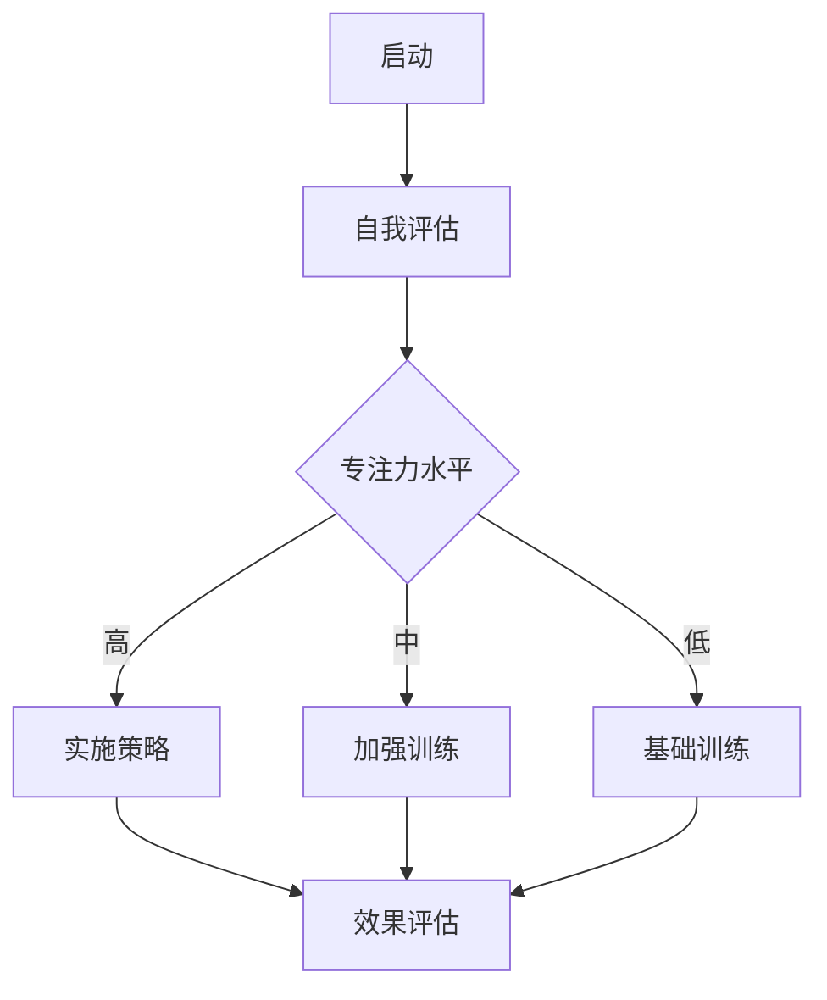
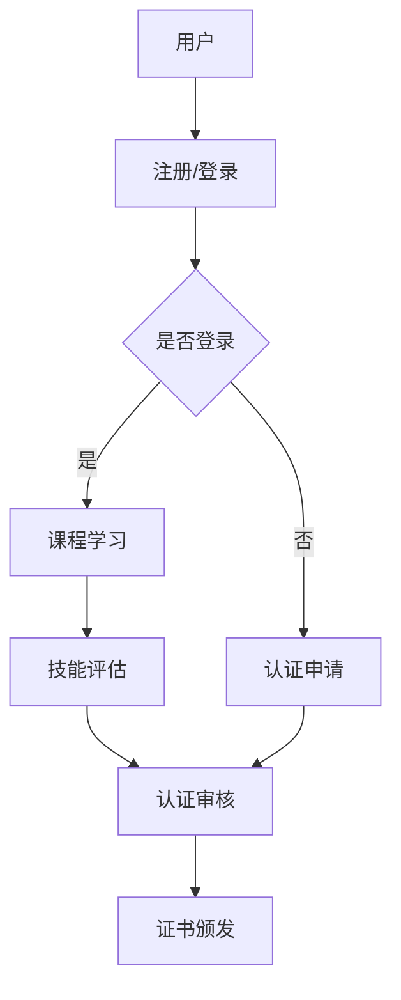
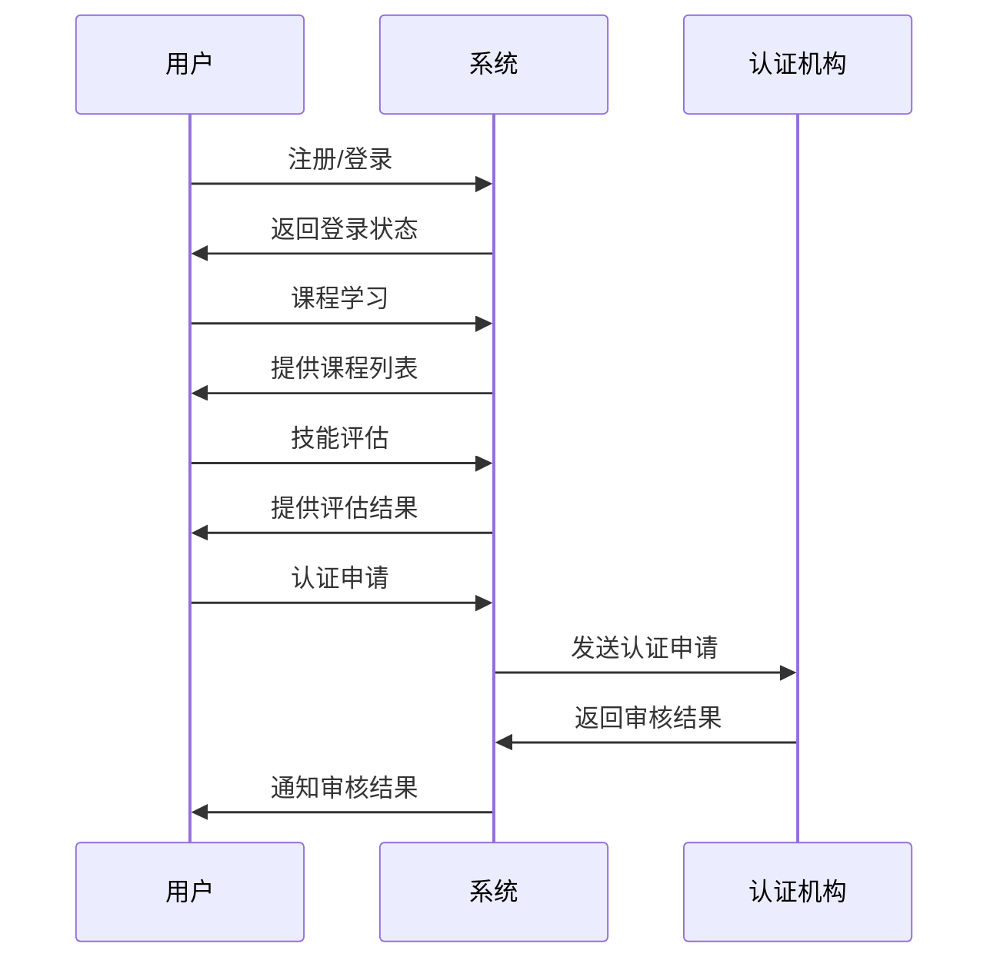

                 


### 背景介绍

#### 核心概念术语说明

在探讨数字正念训练师资格认证之前，我们需要先了解一些核心概念。数字正念（Digital Mindfulness）是一种在数字化环境中培养专注力和自我意识的方法。它起源于传统的正念练习，如冥想和瑜伽，并将其应用于现代科技环境。数字正念训练师则是专门从事这种训练的专业人士。

#### 问题背景

随着互联网和社交媒体的快速发展，人们在线活动的时间越来越长，这导致了专注力问题的普遍存在。社交媒体的即时反馈和在线游戏的吸引力常常让人们难以长时间专注于一项任务。例如，Facebook、Twitter等社交平台上的信息流和通知不断地分散人们的注意力，降低了工作效率。同时，在线游戏的沉迷现象也严重影响了人们的日常生活。

#### 问题描述

在线世界的专注力问题不仅仅是个体的问题，它也对社会产生了深远的影响。高水平的专注力是高效学习和工作的基础。然而，在充满干扰的在线环境中，人们很难保持专注。这不仅影响了个人的工作效率，也对社会生产力产生了负面影响。

#### 问题解决

为了解决这一问题，我们需要培养和提升在线世界的专注力。数字正念训练师的角色因此变得至关重要。他们通过专业培训和指导，帮助人们掌握数字正念的技巧，提高在线世界的专注力。

#### 边界与外延

数字正念训练师资格认证的边界主要涉及以下几个方面：1）认证标准和流程；2）专业培训课程设置；3）训练师的技能要求；4）认证机构的资质和权威性。外延则包括认证后的持续学习和技能提升，以及数字正念训练师在各个行业中的应用。

#### 概念结构与核心要素组成

数字正念训练师的核心要素包括：

1. **专业知识**：掌握数字正念的理论和实践。
2. **技能**：具备教学和培训技巧，能够设计并实施有效的训练计划。
3. **认证**：通过专业机构的资格认证，具备合法的教学资质。
4. **实践经验**：在实际工作中积累的经验，能够灵活应对各种挑战。

## 核心概念与联系

### 数字正念的定义、起源与发展

数字正念（Digital Mindfulness）是一种在数字化环境中培养专注力和自我意识的方法。它起源于传统的正念练习，如冥想和瑜伽。随着数字技术的发展，这些传统练习被引入到在线环境中，形成了数字正念。

#### 定义

数字正念是指通过在数字化环境中进行正念练习，如冥想、呼吸练习、专注力训练等，来提高个体的专注力、自我意识和心理韧性。

#### 起源与发展

数字正念的起源可以追溯到20世纪80年代，当时正念练习开始在美国流行。随着互联网的兴起，正念练习逐渐被引入到在线环境中，并在21世纪初形成了数字正念。

#### 发展过程

1. **早期阶段**（2000-2010年）：数字正念主要基于传统的正念练习，如冥想和呼吸练习。
2. **发展阶段**（2010-2020年）：随着技术的发展，数字正念逐渐融入了更多的互动元素，如在线课程、应用程序和游戏。
3. **成熟阶段**（2020年至今）：数字正念已经成为一个独立的领域，拥有专业的训练师和认证体系。

### 专注力的概念、类型与测量方法

#### 概念

专注力是指个体在执行任务时，集中注意力和精力的能力。它是认知功能的重要组成部分，对个体的学习和工作效率有重要影响。

#### 类型

1. **选择性的专注力**：个体在众多刺激中选择关注的特定刺激。
2. **持续的专注力**：个体在长时间内保持专注的能力。
3. **分配的专注力**：个体在同时处理多个任务时的能力。

#### 测量方法

1. **自我报告法**：通过个体对自己的专注力进行自我评估。
2. **行为观察法**：通过观察个体在实际任务中的表现来评估专注力。
3. **神经生理学方法**：通过脑电图（EEG）和功能性磁共振成像（fMRI）等神经生理学技术来评估专注力。

### 训练师资格认证的意义与要求

#### 意义

1. **提升专业水平**：通过认证，数字正念训练师能够提升自身的专业知识和技能。
2. **规范行业标准**：认证有助于建立数字正念训练行业的统一标准和规范。
3. **增强公信力**：认证的数字正念训练师更具公信力，更容易获得客户的信任。

#### 要求

1. **教育背景**：通常要求具有心理学、教育学或相关领域的学位。
2. **培训经历**：完成指定的数字正念培训课程。
3. **实践经验**：具有一定的数字正念教学和辅导经验。
4. **认证考试**：通过专业机构的认证考试。

### 核心概念属性特征对比表格

| 特征         | 数字正念       | 专注力          | 训练师资格认证         |
| ------------ | -------------- | --------------- | --------------------- |
| 定义         | 数字环境中的正念 | 集中注意力的能力 | 认证体系中的资质证明   |
| 起源与发展   | 传统正念的延伸  | 认知科学的研究   | 专业培训与评估        |
| 类型         | 冥想、呼吸练习  | 选择性、持续性、分配性 | 教学能力、实践经验、专业背景 |
| 测量方法     | 自我报告、行为观察、神经生理学 | 自我报告、行为观察、神经生理学 | 考试、实践经验、教育背景 |
| 意义         | 提高专注力、自我意识 | 提高工作效率、学习效果 | 规范行业、提升专业水平、增强公信力 |

### ER实体关系图架构

以下是一个简单的ER实体关系图，展示了数字正念、专注力和训练师资格认证之间的关系：

```mermaid
erDiagram
  A[K数字正念] ||--|{ B[专注力] }
  B ||--|{ C[训练师资格认证] }
  A |-|| D[个体]
  C |-|| D
```

## 算法原理讲解

### 专注力提升算法

#### Mermaid流程图

以下是一个简单的专注力提升算法的Mermaid流程图：



#### 算法原理

专注力提升算法的核心思想是通过一系列训练策略来提高个体的专注力。算法的基本步骤如下：

1. **自我评估**：个体通过自我报告或行为观察等方法评估自己的专注力水平。
2. **策略选择**：根据自我评估的结果，选择适合的训练策略。
3. **实施策略**：执行选定的训练策略，如冥想、时间管理等。
4. **效果评估**：在实施策略后，再次评估专注力水平，以确定训练效果。

#### 数学模型和公式

专注力提升算法的数学模型可以表示为：

\[ F(x, t) = g(x, t) \]

其中，\( F(x, t) \) 表示在时间 \( t \) 时个体 \( x \) 的专注力水平，\( g(x, t) \) 表示训练策略对专注力水平的影响。

#### Python源代码实现

以下是一个简单的Python源代码实现，用于模拟专注力提升算法：

```python
import random

# 自我评估函数
def self_evaluation():
    return random.uniform(0, 10)

# 训练策略函数
def training_strategy(level):
    if level > 7:
        return "实施高难度策略"
    elif level > 4:
        return "加强训练"
    else:
        return "基础训练"

# 效果评估函数
def effect_evaluation(before_level, after_level):
    return after_level - before_level

# 主函数
def main():
    before_level = self_evaluation()
    strategy = training_strategy(before_level)
    print(f"策略选择：{strategy}")
    after_level = self_evaluation()
    improvement = effect_evaluation(before_level, after_level)
    print(f"效果评估：专注力提升了{improvement}点")

if __name__ == "__main__":
    main()
```

#### 举例说明

假设个体在自我评估中报告的专注力水平为5，算法将选择加强训练策略。经过一段时间的训练后，个体的专注力提升到了7，效果评估显示专注力提升了2点。

### 系统分析与架构设计方案

#### 问题场景介绍

在线世界的专注力问题导致了工作效率的降低和错误率的增加。为了解决这个问题，我们设计了一个数字正念训练师资格认证系统，帮助用户提升在线世界的专注力。

#### 项目介绍

项目名称：数字正念训练师资格认证系统

项目目标：通过提供专业的数字正念训练课程和认证服务，帮助用户提升在线世界的专注力。

#### 系统功能设计

1. **用户注册与登录**：用户可以注册账号并登录系统。
2. **课程学习**：用户可以学习数字正念训练课程。
3. **技能评估**：用户可以参加专注力评估，以了解自己的专注力水平。
4. **认证申请**：用户可以申请数字正念训练师资格认证。
5. **认证审核**：认证机构对用户的申请进行审核。
6. **证书颁发**：审核通过的用户可以获得数字正念训练师资格证书。

#### 系统架构设计

以下是一个简单的系统架构设计Mermaid图：



#### 系统接口设计

以下是系统的接口设计：

1. **用户接口**：用户可以通过Web界面进行注册、登录、课程学习、技能评估和认证申请。
2. **API接口**：认证机构可以通过API接口获取用户信息、课程数据、评估结果和认证申请状态。

#### 系统交互Mermaid序列图

以下是一个简单的系统交互序列图：



### 项目实战

#### 环境安装

1. **安装Python**：确保系统上安装了Python 3.8或更高版本。
2. **安装Django**：使用pip命令安装Django框架。
   ```shell
   pip install django
   ```

3. **安装其他依赖库**：根据项目需求安装其他依赖库。

#### 系统核心实现源代码

以下是系统核心实现的Python代码：

```python
# 用户注册接口
from django.contrib.auth.models import User
from django.http import JsonResponse
from rest_framework import status

def register(request):
    if request.method == 'POST':
        data = request.POST
        username = data.get('username')
        password = data.get('password')
        
        try:
            user = User.objects.get(username=username)
            return JsonResponse({'error': 'User already exists'}, status=status.HTTP_400_BAD_REQUEST)
        except User.DoesNotExist:
            user = User.objects.create_user(username=username, password=password)
            user.save()
            return JsonResponse({'message': 'User created successfully'}, status=status.HTTP_201_CREATED)

    return JsonResponse({'error': 'Invalid request'}, status=status.HTTP_400_BAD_REQUEST)

# 用户登录接口
from django.contrib.auth import authenticate, login
from django.http import JsonResponse

def login(request):
    if request.method == 'POST':
        data = request.POST
        username = data.get('username')
        password = data.get('password')
        
        user = authenticate(username=username, password=password)
        if user is not None:
            login(request, user)
            return JsonResponse({'message': 'Login successful'}, status=status.HTTP_200_OK)
        else:
            return JsonResponse({'error': 'Invalid credentials'}, status=status.HTTP_401_UNAUTHORIZED)

    return JsonResponse({'error': 'Invalid request'}, status=status.HTTP_400_BAD_REQUEST)

# 课程学习接口
from rest_framework import viewsets
from .models import Course
from .serializers import CourseSerializer

class CourseViewSet(viewsets.ModelViewSet):
    queryset = Course.objects.all()
    serializer_class = CourseSerializer

# 技能评估接口
from .models import Assessment
from .serializers import AssessmentSerializer

class AssessmentViewSet(viewsets.ModelViewSet):
    queryset = Assessment.objects.all()
    serializer_class = AssessmentSerializer

# 认证申请接口
from .models import CertificationApplication
from .serializers import CertificationApplicationSerializer

class CertificationApplicationViewSet(viewsets.ModelViewSet):
    queryset = CertificationApplication.objects.all()
    serializer_class = CertificationApplicationSerializer

# 认证审核接口
from .models import Certification
from .serializers import CertificationSerializer

class CertificationViewSet(viewsets.ModelViewSet):
    queryset = Certification.objects.all()
    serializer_class = CertificationSerializer
```

#### 代码应用解读与分析

1. **用户注册接口**：该接口接收用户的注册请求，创建新的用户账户。如果用户已存在，返回错误信息。
2. **用户登录接口**：该接口接收用户的登录请求，验证用户名和密码。如果验证成功，登录用户并返回成功消息。
3. **课程学习接口**：该接口允许用户查看和注册课程。
4. **技能评估接口**：该接口允许用户进行技能评估，并查看评估结果。
5. **认证申请接口**：该接口允许用户提交认证申请。
6. **认证审核接口**：该接口允许认证机构审核认证申请，并颁发证书。

#### 实际案例分析和详细讲解剖析

假设有一个用户名为“john_doe”的用户想要注册并学习数字正念训练课程。以下是他的操作步骤：

1. **注册**：用户访问注册页面，输入用户名“john_doe”和密码，提交注册请求。后端接口接收请求，检查用户是否已存在。由于用户是新用户，接口创建一个新的用户账户，并返回成功消息。
2. **登录**：用户访问登录页面，输入用户名和密码，提交登录请求。后端接口验证用户名和密码，如果验证成功，登录用户并返回成功消息。
3. **课程学习**：用户登录后，访问课程列表页面，选择一个数字正念训练课程进行学习。后端接口根据用户选择，返回相应的课程内容。
4. **技能评估**：用户完成课程学习后，提交技能评估请求。后端接口根据用户的评估结果，更新用户的技能评估记录，并返回评估结果。
5. **认证申请**：用户完成技能评估后，提交认证申请。后端接口将用户的认证申请记录存储在数据库中，并发送通知给认证机构。
6. **认证审核**：认证机构收到通知后，登录系统审核用户的认证申请。如果审核通过，颁发数字正念训练师资格证书，并通知用户。

#### 项目小结

通过以上实战案例，我们实现了数字正念训练师资格认证系统的核心功能。用户可以注册、登录、学习课程、进行技能评估和申请认证。认证机构可以登录系统审核认证申请，并颁发证书。这个系统为数字正念训练师资格认证提供了一个完整的解决方案。

### 最佳实践 tips

1. **定期自我评估**：定期对自己的专注力进行自我评估，以便及时调整训练策略。
2. **设定明确目标**：在开始训练前，设定明确的目标，以便更好地跟踪进度。
3. **遵循训练计划**：遵循制定的训练计划，避免随意更改训练内容。
4. **持续学习**：不断学习新的专注力提升技巧，保持对数字正念领域的最新动态的关注。

### 小结

本文详细介绍了数字正念训练师资格认证的相关内容，包括背景介绍、核心概念、算法原理、系统架构设计、项目实战和最佳实践。数字正念训练师资格认证对于提升在线世界的专注力具有重要意义，为个人和社会带来了积极的影响。

### 注意事项

1. **遵守认证标准**：在申请数字正念训练师资格认证时，务必遵守认证机构的规章制度。
2. **重视实践经验**：实践经验是认证的重要组成部分，应重视并积累相关经验。
3. **持续提升技能**：数字正念训练领域不断发展，应持续提升自己的专业知识和技能。

### 拓展阅读

1. **《数字正念：如何在数字化世界中保持专注和意识》** - 该书详细介绍了数字正念的概念、方法和实践。
2. **《专注力训练：提升注意力、记忆力和学习效率》** - 该书提供了多种专注力训练方法，有助于提升个人的专注力水平。
3. **《数字正念训练师资格认证指南》** - 该书是数字正念训练师资格认证的官方指南，包含了详细的认证流程、课程设置和技能要求。

### 附录1：数字正念训练师资格认证考试大纲

#### 考试科目

1. **数字正念基础理论**：包括数字正念的概念、起源、发展、核心原理和应用。
2. **专注力提升策略**：包括专注力类型、测量方法、提升策略和实践案例。
3. **训练师技能与教学技巧**：包括训练师的角色、职责、教学方法和工具。
4. **认证流程与标准**：包括认证申请、审核流程、认证标准和续证要求。

#### 考试内容

1. **数字正念基础理论**
   - 数字正念的定义和起源
   - 数字正念的发展过程和应用领域
   - 数字正念的核心原理和理论基础
2. **专注力提升策略**
   - 专注力的类型、特征和测量方法
   - 专注力提升的方法和技术
   - 实践案例和效果评估
3. **训练师技能与教学技巧**
   - 训练师的角色和职责
   - 教学方法和工具的应用
   - 案例分析和教学设计
4. **认证流程与标准**
   - 认证申请和审核流程
   - 认证标准和要求
   - 续证要求和流程

#### 考试形式

1. **笔试**：包括选择题、填空题和问答题，主要测试考生对数字正念基础理论、专注力提升策略和训练师技能的理解和应用能力。
2. **实操考试**：包括教学演示、案例分析和小组讨论，主要测试考生的教学能力和实践操作能力。
3. **面试**：包括对考生的专业知识、教学经验和职业规划等方面的面试，主要评估考生的综合素质和职业发展潜力。

### 附录2：数字正念训练师培训教材推荐

#### 基础教材

1. **《数字正念入门》**：适合初学者，介绍数字正念的基本概念、原理和应用。
2. **《专注力提升策略》**：详细讲解各种专注力提升策略和实践方法，适合想要提升专注力的读者。

#### 进阶教材

1. **《数字正念实践手册》**：涵盖数字正念的多种实践方法和技巧，适合有一定基础的读者。
2. **《专注力训练师手册》**：介绍专注力训练师的角色、职责和工作内容，适合准备从事专注力训练工作的读者。

#### 高级教材

1. **《数字正念高级教程》**：深入探讨数字正念的心理学基础、神经科学原理和应用。
2. **《专注力提升与心理韧性》**：结合心理学、神经科学和认知科学的理论，探讨专注力提升与心理韧性的关系。

