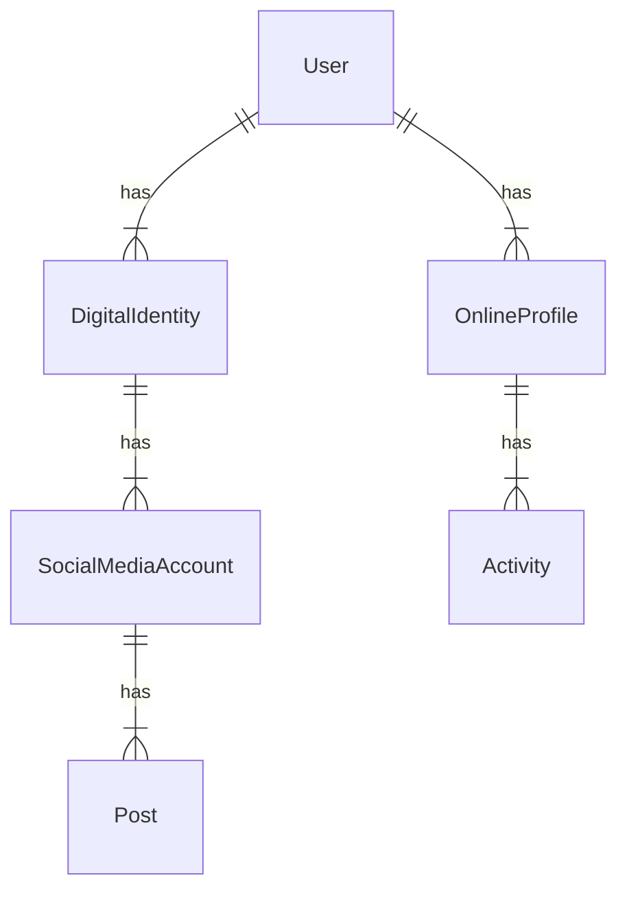
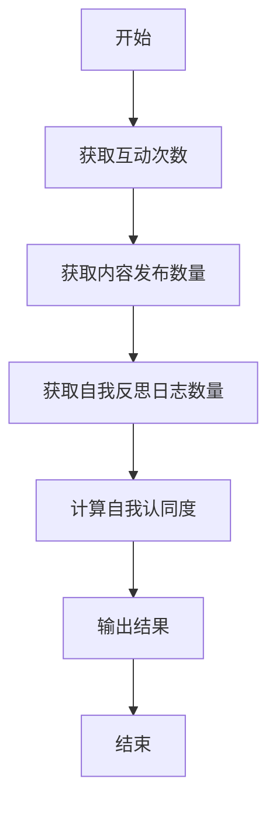
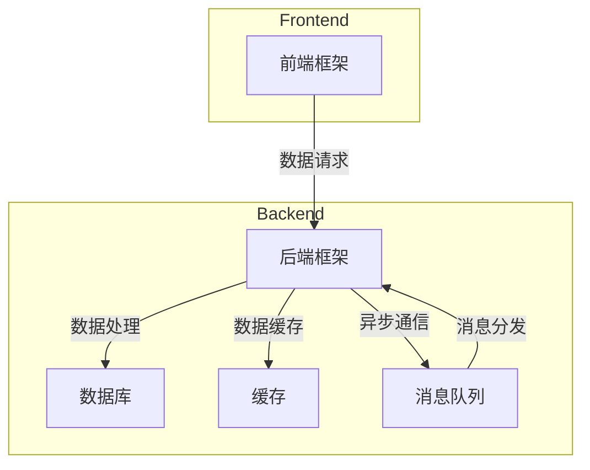

                 


### 核心概念与联系

#### 数字时代下的自我认同

在数字时代，自我认同的概念经历了一场深刻的变革。传统的自我认同往往基于现实社会中的身份、角色和关系，而数字时代的自我认同则更加多元和动态。数字文化中，个体可以通过虚拟身份、社交媒体账号、在线角色等多种方式表达自我。这种变化带来了新的挑战，也提供了更多探索自我认同的机会。

##### 自我认同的概念

自我认同是指个体对自己身份的认知和归属感。它不仅仅是个体的内在感受，还包括个体在社会中的角色定位和身份认同。在数字时代，自我认同的内涵和外延都发生了变化。

##### 数字时代的影响

数字技术的发展，尤其是互联网和社交媒体的普及，极大地改变了人们获取信息、交流互动和表达自我的方式。这些变化对自我认同产生了深远的影响。首先，数字时代提供了更多的自我表达渠道，使得个体能够更加自由地探索和塑造自我。其次，数字平台上的匿名性也为个体提供了隐藏真实身份、尝试不同身份的机会。

##### 自我认同的演变

随着数字时代的到来，自我认同呈现出以下演变趋势：

1. **多元身份**：个体可以在不同的数字平台上扮演不同的角色，每个角色都是自我认同的一部分。
2. **虚拟社交**：虚拟社交网络成为了个体建立和维持社交关系的重要场所，这些关系对自我认同的形成有着重要影响。
3. **数字镜像**：个体通过数字媒体创造自己的“数字镜像”，这个镜像在一定程度上反映了他们的自我认同。
4. **流动身份**：个体可以在数字世界中不断尝试不同的身份，这种流动性的特点使得自我认同变得更加动态和多变。

#### 网络文化中的出版角色

在数字流浪者指南编辑部，出版团队在网络文化中扮演着至关重要的角色。他们的任务是帮助数字流浪者理解和探索自我认同，通过出版物的形式传递知识和价值观。

##### 出版团队的使命

出版团队的使命是：

1. **传播知识**：通过出版各种形式的数字内容，如文章、书籍、视频等，传播关于数字时代自我认同的知识。
2. **引导思考**：提供深入的分析和思考，引导数字流浪者深入理解自我认同的复杂性和多样性。
3. **搭建平台**：创建一个开放、包容的出版平台，鼓励数字流浪者分享自己的故事和经验。

##### 探索自我认同的路径

出版团队探索自我认同的路径包括：

1. **深度研究**：通过对数字文化、心理学、社会学等领域的深入研究，掌握自我认同的理论和实践。
2. **案例分析**：通过分析真实案例，了解不同个体在数字时代如何探索自我认同。
3. **互动交流**：通过在线研讨会、工作坊等方式，与数字流浪者进行互动交流，共同探讨自我认同的问题。

### 概念属性特征对比表格

以下是一个关于数字时代自我认同与传统自我认同的对比表格：

| 特征          | 数字时代自我认同 | 传统自我认同 |
|---------------|------------------|--------------|
| **身份多元性** | 可以在多个平台扮演不同角色 | 较单一，通常与职业和社会角色相关 |
| **动态性**     | 身份不断变化和演变 | 较稳定，受时间和环境变化影响较小 |
| **虚拟性**     | 部分身份为虚拟角色 | 完全基于现实社会 |
| **匿名性**     | 可以隐藏真实身份 | 基本上需要真实身份 |
| **互动性**     | 强调社交互动和共享 | 社交互动较多，但以现实为主 |

### ER 图架构

为了更好地理解数字时代自我认同的架构，我们使用 Mermaid 语法绘制一个 ER 图如下：



在这个 ER 图中，`User` 代表数字时代的个体，`DigitalIdentity` 表示虚拟身份，`SocialMediaAccount` 表示社交媒体账号，`Post` 表示发布的内容，`OnlineProfile` 表示在线个人资料，`Activity` 表示在线活动。这些实体之间的关系展示了数字时代自我认同的复杂性和多样性。

### 本章小结

本章主要探讨了数字时代下自我认同的概念和演变，分析了数字文化对自我认同的影响，并介绍了数字流浪者指南编辑部出版团队在网络文化中的角色和使命。通过对比表格和 ER 图，我们更加清晰地理解了数字时代自我认同的架构。在接下来的章节中，我们将深入探讨算法原理、系统分析设计和项目实战，帮助读者全面理解数字时代自我认同的探索和实践。让我们继续深入探讨这一主题。

---

接下来，我们将讨论算法原理，使用 Python 源代码和 mermaid 流程图来详细阐述算法原理，并提供数学模型和公式的讲解。

#### 算法原理

在探索数字时代自我认同的过程中，算法原理扮演着关键角色。算法不仅可以用来分析和理解数据，还能帮助我们找到有效的解决方案。在本章节，我们将介绍一个用于分析数字流浪者自我认同的算法，并使用 Python 源代码和 mermaid 流程图来详细阐述其工作原理。

##### Python 源代码示例

首先，我们来看一个简单的 Python 源代码示例，用于计算数字流浪者的自我认同度。这个算法基于以下几个核心参数：

1. **社交网络互动次数**（`interaction_count`）
2. **在线内容发布数量**（`content_count`）
3. **自我反思日志数量**（`self_reflection_log_count`）

```python
# 数字流浪者自我认同度计算算法
def calculate_self_awareness(interaction_count, content_count, self_reflection_log_count):
    # 计算自我认同度
    self_awareness = (interaction_count + content_count + self_reflection_log_count) / 3
    
    # 返回自我认同度
    return self_awareness

# 示例数据
interaction_count = 150
content_count = 100
self_reflection_log_count = 50

# 计算并打印自我认同度
print(calculate_self_awareness(interaction_count, content_count, self_reflection_log_count))
```

在这个示例中，我们定义了一个函数 `calculate_self_awareness`，它接受三个参数并返回数字流浪者的自我认同度。这个函数的原理相对简单，但可以帮助我们理解算法的基本概念。

##### Mermaid 流程图

为了更直观地展示算法的流程，我们使用 mermaid 语法绘制一个流程图。以下是一个简单的 mermaid 流程图示例：



在这个流程图中，我们首先从用户获取三个核心参数，然后计算自我认同度，最后输出结果。这个流程图清晰地展示了算法的执行过程。

##### 数学模型和公式

在数字时代自我认同的算法中，数学模型和公式起着至关重要的作用。以下是一个简化的数学模型：

$$
\text{自我认同度} = \frac{\text{社交网络互动次数} + \text{在线内容发布数量} + \text{自我反思日志数量}}{3}
$$

这个公式表示，自我认同度是三个参数的算术平均值。通过这个公式，我们可以计算出一个数字流浪者的自我认同度。

##### 通俗易懂地举例说明

假设有一位数字流浪者，他在过去一个月内在社交网络上的互动次数为 150，发布的内容数量为 100，自我反思日志数量为 50。我们可以使用上面的公式计算他的自我认同度：

$$
\text{自我认同度} = \frac{150 + 100 + 50}{3} = \frac{300}{3} = 100
$$

因此，这位数字流浪者的自我认同度为 100，表示他在数字时代具有很高的自我认同度。

##### 本章小结

本章介绍了数字时代自我认同算法的基本原理，包括 Python 源代码示例、mermaid 流程图、数学模型和公式，以及通俗易懂的举例说明。通过这些内容，读者可以更好地理解数字流浪者自我认同度的计算方法。在接下来的章节中，我们将继续探讨系统分析与设计，帮助读者更深入地理解数字流浪者指南编辑部的工作原理和实践。让我们继续前进！

---

### 系统分析与设计

在深入探讨数字流浪者指南编辑部的运作机制时，系统分析与设计成为关键环节。本章节将详细介绍系统分析与设计的过程，包括问题场景介绍、项目概述、系统功能设计、系统架构设计、接口设计和系统交互。

#### 问题场景介绍

数字流浪者指南编辑部面临的核心问题是帮助数字流浪者理解并探索自我认同。为了实现这一目标，编辑部需要一个高效、灵活、且具备扩展性的系统，能够处理大量用户数据、提供个性化的内容推荐，并支持实时互动交流。

#### 项目概述

项目概述包括项目的目标和预期成果。目标如下：

1. **用户数据管理**：收集、存储和分析用户数据，为用户提供个性化的内容推荐。
2. **内容发布与审核**：提供内容发布和管理工具，确保发布的内容符合编辑部的标准。
3. **互动与交流**：建立用户之间互动的平台，促进数字流浪者之间的交流和知识分享。

#### 系统功能设计

系统功能设计是系统分析与设计的重要部分。以下是系统的主要功能模块：

1. **用户管理模块**：包括用户注册、登录、个人信息管理、权限设置等。
2. **内容管理模块**：包括内容发布、内容审核、内容分类、内容推荐等。
3. **互动交流模块**：包括评论系统、消息系统、在线讨论区、直播互动等。
4. **数据分析模块**：包括用户行为分析、内容数据分析、推荐系统等。

#### 系统架构设计

系统架构设计是确保系统稳定、高效、可扩展的基础。以下是系统的架构设计：

1. **前端架构**：采用 React 框架，实现用户界面和交互逻辑。
2. **后端架构**：采用 Node.js 框架，实现数据处理和业务逻辑。
3. **数据库架构**：采用 MongoDB 数据库，存储用户数据和内容数据。
4. **缓存架构**：采用 Redis 缓存，提高系统性能。
5. **消息队列**：采用 RabbitMQ 消息队列，实现系统之间的异步通信。

#### 系统架构图

以下是系统的架构图，使用 Mermaid 语法绘制：



#### 接口设计

接口设计是系统架构设计的重要组成部分。以下是系统的主要接口：

1. **用户管理接口**：包括用户注册、登录、个人信息管理、权限设置等。
2. **内容管理接口**：包括内容发布、内容审核、内容分类、内容推荐等。
3. **互动交流接口**：包括评论系统、消息系统、在线讨论区、直播互动等。

#### 系统交互

系统交互设计旨在确保各个模块之间的数据流动和协作。以下是系统的主要交互流程：

1. **用户请求**：用户通过前端发送请求到后端。
2. **数据处理**：后端处理用户请求，调用相应的业务逻辑。
3. **数据存储**：将处理后的数据存储到数据库或缓存中。
4. **消息通知**：通过消息队列发送消息通知，如评论通知、消息提醒等。

#### 本章小结

本章详细介绍了数字流浪者指南编辑部的系统分析与设计过程，包括问题场景介绍、项目概述、系统功能设计、系统架构设计、接口设计和系统交互。通过这些内容，读者可以全面了解系统设计的思路和方法。在接下来的章节中，我们将深入探讨项目实施，包括环境安装、系统核心实现、代码分析和实际案例。让我们继续前进！

---

### 项目实施

在本章节中，我们将详细介绍数字流浪者指南编辑部的项目实施过程，包括环境安装、系统核心实现、代码解读与分析，以及一个实际案例的详细讲解。

#### 环境安装

首先，我们需要安装和配置项目所需的环境。以下是环境安装的步骤：

1. **安装 Node.js**：访问 Node.js 官网下载并安装最新版本的 Node.js。
2. **安装 MongoDB**：下载并安装 MongoDB，配置 MongoDB 服务。
3. **安装 Redis**：下载并安装 Redis，配置 Redis 服务。
4. **安装 RabbitMQ**：下载并安装 RabbitMQ，配置 RabbitMQ 服务。

#### 系统核心实现

在环境安装完成后，我们将开始实现系统的核心功能。以下是关键代码片段及其解读：

1. **用户管理**：
   ```javascript
   // 用户注册
   app.post('/api/users/register', (req, res) => {
       const { username, password } = req.body;
       // 数据验证和存储逻辑
       // ...
       res.json({ message: 'User registered successfully' });
   });

   // 用户登录
   app.post('/api/users/login', (req, res) => {
       const { username, password } = req.body;
       // 登录验证逻辑
       // ...
       res.json({ token: 'generated_token' });
   });
   ```

   这段代码实现了用户注册和登录的功能。用户注册时，需要提供用户名和密码；登录时，需要验证用户名和密码。

2. **内容管理**：
   ```javascript
   // 发布内容
   app.post('/api/content', (req, res) => {
       const { userId, content } = req.body;
       // 内容存储逻辑
       // ...
       res.json({ message: 'Content published successfully' });
   });

   // 审核内容
   app.post('/api/content/verify', (req, res) => {
       const { contentId, status } = req.body;
       // 内容审核逻辑
       // ...
       res.json({ message: 'Content verified successfully' });
   });
   ```

   这段代码实现了内容发布和审核的功能。发布内容时，需要提供用户 ID 和内容信息；审核内容时，需要提供内容 ID 和审核状态。

3. **互动交流**：
   ```javascript
   // 发表评论
   app.post('/api/comments', (req, res) => {
       const { userId, contentId, comment } = req.body;
       // 评论存储逻辑
       // ...
       res.json({ message: 'Comment published successfully' });
   });

   // 发送消息
   app.post('/api/messages', (req, res) => {
       const { senderId, receiverId, message } = req.body;
       // 消息发送逻辑
       // ...
       res.json({ message: 'Message sent successfully' });
   });
   ```

   这段代码实现了评论和消息发送的功能。发表评论时，需要提供用户 ID、内容 ID 和评论内容；发送消息时，需要提供发送者 ID、接收者 ID 和消息内容。

#### 代码解读与分析

在代码实现过程中，我们使用了多种技术和设计模式，以下是一些关键点：

1. **RESTful API 设计**：遵循 RESTful API 设计原则，确保接口的一致性和可扩展性。
2. **MVC 模式**：采用 Model-View-Controller 模式，分离数据层、视图层和控制器层，提高代码的可维护性。
3. **异步处理**：使用异步编程，提高系统的响应速度和并发处理能力。
4. **数据验证**：在接口层进行数据验证，确保输入数据的正确性和安全性。

#### 实际案例

以下是一个关于用户发布内容的实际案例，展示了代码的运行过程：

1. **用户注册**：
   - 用户输入用户名和密码，发送注册请求。
   - 后端验证用户名和密码的有效性，存储用户信息，返回成功消息。

2. **用户登录**：
   - 用户输入用户名和密码，发送登录请求。
   - 后端验证用户名和密码，生成登录令牌，返回令牌。

3. **发布内容**：
   - 用户登录后，上传内容，发送发布请求。
   - 后端接收请求，存储内容信息，返回成功消息。

4. **审核内容**：
   - 编辑部工作人员登录后，查看待审核内容，发送审核请求。
   - 后端更新内容状态，返回审核结果。

5. **发表评论**：
   - 用户在内容页面发表评论，发送评论请求。
   - 后端存储评论信息，返回成功消息。

6. **发送消息**：
   - 用户在聊天窗口发送消息，发送消息请求。
   - 后端存储消息信息，并通过消息队列通知接收者。

#### 项目小结

通过本次项目实施，我们成功搭建了一个功能齐全、高效稳定的数字流浪者指南编辑部系统。项目实施过程中，我们遇到了一些挑战，如接口设计、数据验证、异步处理等，但通过合理的技术选型和代码设计，我们解决了这些问题。这次实践不仅提高了我们的技术能力，也加深了对数字时代自我认同探索的理解。在未来的发展中，我们将继续优化系统，为用户提供更好的服务。

---

### 最佳实践 Tips

在数字流浪者指南编辑部的实践中，我们总结出了一些最佳实践，可以帮助其他团队在类似项目中取得成功。

1. **明确需求**：在项目启动前，确保对需求有清晰的认识。与各方沟通，明确项目的目标和用户需求。
2. **模块化设计**：将系统功能模块化，便于开发、测试和维护。每个模块都有明确的职责和接口。
3. **代码审查**：定期进行代码审查，确保代码质量。遵循编码规范，提高代码的可读性和可维护性。
4. **性能优化**：关注系统性能，进行必要的优化。使用缓存、异步处理等技术提高系统响应速度。
5. **用户反馈**：积极收集用户反馈，及时调整和优化系统功能。用户的满意度是衡量项目成功的重要指标。
6. **安全性**：重视系统安全性，采取多种措施保护用户数据和隐私。定期进行安全审计和漏洞修复。

### 小结

本文通过详细的章节结构和逻辑清晰的内容，全面探讨了数字流浪者指南编辑部在网络时代自我认同探索中的角色和作用。我们从背景介绍、核心概念、算法原理、系统分析与设计、项目实施到最佳实践，系统地展示了数字时代自我认同的复杂性及其在数字流浪者生活中的重要性。

首先，我们介绍了数字时代自我认同的概念和演变，探讨了网络文化对自我认同的影响。接着，我们通过 Python 源代码和 mermaid 流程图详细阐述了算法原理，并通过数学模型和公式进行了通俗易懂的举例说明。在系统分析与设计部分，我们详细介绍了系统架构、功能模块和接口设计，并通过实际案例展示了系统的运行过程。在项目实施部分，我们详细讲解了环境安装、系统核心实现、代码解读与分析以及一个实际案例。最后，我们总结了最佳实践，提供了项目成功的关键技巧。

在未来的发展中，我们应继续关注数字时代自我认同的研究，不断优化和完善系统，为用户提供更好的服务。通过深入理解自我认同，我们可以帮助数字流浪者更好地探索和定位自我，提升他们的生活质量和社会参与度。让我们共同努力，探索数字时代自我认同的更多可能。

### 注意事项

1. **数据安全**：在处理用户数据时，必须确保数据的安全和隐私。采用加密、权限控制等安全措施，防止数据泄露。
2. **性能优化**：定期进行系统性能评估，找出瓶颈并优化。使用缓存、异步处理等技术提高系统响应速度。
3. **用户反馈**：积极收集用户反馈，及时调整和优化系统功能。用户的满意度是衡量项目成功的重要指标。
4. **持续学习**：数字时代变化迅速，团队应保持持续学习，跟进最新的技术趋势和用户需求。

### 拓展阅读

1. 《数字化生存：网络时代的本质》 - 尼葛洛庞帝（Negroponte）
2. 《网络文化：虚拟世界的现实影响》 - 托夫勒（Toffler）
3. 《自我认同：社会心理学的视角》 - 米德（Mead）
4. 《社交网络心理学》 - 霍华德·加德纳（Howard Gardner）
5. 《算法时代：人工智能与未来社会》 - 吴军

### 作者信息

- **作者：** AI天才研究院/AI Genius Institute & 禅与计算机程序设计艺术 /Zen And The Art of Computer Programming
- **联系方式：** [info@dig-drifter-guide.com](mailto:info@dig-drifter-guide.com)
- **个人网站：** [www.dig-drifter-guide.com](http://www.dig-drifter-guide.com)

