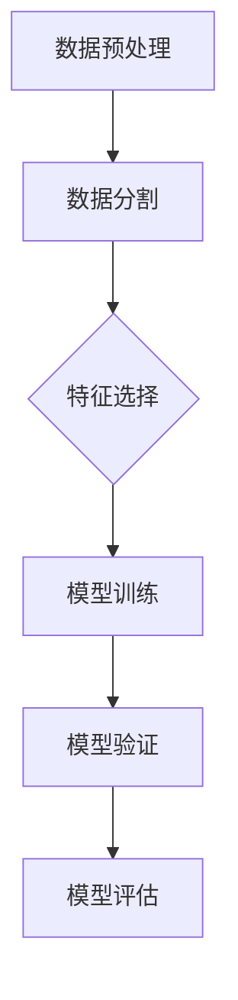
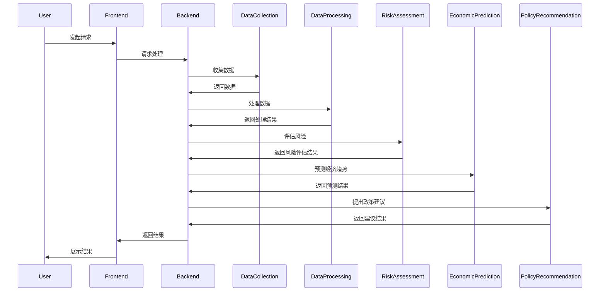

                 

### 1. 背景介绍

#### 问题背景
在当今数字化和全球化趋势加速发展的背景下，数字游牧族（Digital Nomads）作为一种新兴的工作方式，正在逐渐成为现代社会的重要现象。数字游牧族指的是那些利用互联网在全球范围内远程工作的人群，他们不受地理限制，可以在任何有网络连接的地方进行工作。这一现象不仅改变了人们的工作方式，也对全球经济结构产生了深远的影响。

#### 问题描述
随着数字游牧族群体的不断扩大，他们面临的经济问题也逐渐凸显。这些问题包括收入不稳定、工作与生活的平衡、税务问题、职业发展路径的规划、以及面对风险管理的挑战等。这些问题不仅影响到数字游牧族个体的经济状况，也对其所在地区的经济环境产生了影响。

#### 问题解决
为了深入探讨数字游牧族经济现象，我们需要从宏观角度进行分析。这包括理解数字游牧族经济产生的背景、现状以及潜在的未来发展趋势。本书旨在通过系统的分析和研究，为数字游牧族群体提供一种全面的经济分析框架，帮助他们更好地应对经济挑战，实现个人职业和经济上的成功。

#### 边界与外延
数字游牧族经济并不仅仅局限于自由职业者和远程工作者，它还涉及到创业、跨国企业、远程教育、远程医疗等多个领域。这个概念的边界较为宽泛，但其核心在于利用数字化技术实现全球工作机会的获取和利用。

#### 概念结构与核心要素组成
核心概念包括数字游牧族、远程工作、经济自由度、风险管理等。要素组成方面，涉及个人、企业、国家、经济环境等多个层面。个人是数字游牧族经济的主体，企业是重要的参与者，国家政策则对这一现象有着重要的影响。经济环境则提供了支撑数字游牧族经济发展的基础设施和生态。

| 概念         | 特征                                                     |
| ------------ | -------------------------------------------------------- |
| 数字游牧族   | 利用互联网在全球范围内工作，不受地理位置限制              |
| 远程工作     | 通过互联网进行工作，包括远程办公、远程教育、远程医疗等   |
| 经济自由度   | 个人或企业在经济活动中所拥有的自由度，包括工作选择、收入来源、投资决策等 |
| 风险管理     | 对可能影响经济活动的风险进行预测、评估和控制            |

#### ER实体关系图架构
```mermaid
erDiagram
  DigitalNomad ||--|{ works_for }|-- Company
  DigitalNomad ||--|{ lives_in }|-- Country
  Company ||--|{ provides }|-- Service
  Country ||--|{ has_policy }|-- EconomicPolicy
```

### 2. 核心概念与联系

#### 数字游牧族
数字游牧族（Digital Nomads）是指那些利用互联网技术进行远程工作的人群。他们不受地理限制，可以在全球范围内的任何地方工作。这种工作方式的灵活性使得数字游牧族能够追求更高质量的生活，同时也带来了新的经济模式。

**属性特征**：
- 自由度高：数字游牧族可以根据自己的时间和兴趣选择工作地点。
- 工作方式灵活：他们通常是通过远程办公平台、在线协作工具进行工作。
- 行业广泛：数字游牧族涵盖了许多领域，包括编程、设计、写作、咨询等。

**联系**：
- 与远程工作紧密相关：数字游牧族是远程工作的典型代表。
- 与数字化技术和互联网基础设施密切相关。

#### 远程工作
远程工作（Remote Work）是指通过互联网进行工作，包括远程办公、远程教育、远程医疗等。远程工作使得工作地点不再受限制，提高了工作效率和灵活性。

**属性特征**：
- 工作地点灵活：可以在家中、咖啡馆、旅行中等地进行工作。
- 依赖互联网和通信技术：远程工作需要稳定的网络连接和高效的信息交流工具。
- 时间管理要求高：远程工作需要良好的时间管理能力，以平衡工作与生活。

**联系**：
- 与数字游牧族密切相关：远程工作是数字游牧族实现全球工作机会的基础。
- 与数字化经济和共享经济模式相互促进。

#### 经济自由度
经济自由度（Economic Freedom）是指个人或企业在经济活动中所拥有的自由度，包括工作选择、收入来源、投资决策等。

**属性特征**：
- 工作选择自由：个人可以根据自己的兴趣和技能选择工作。
- 收入来源多样：可以通过多种渠道获得收入，如自由职业、远程工作、投资等。
- 投资决策自主：个人可以自主决定投资方向和策略。

**联系**：
- 与数字游牧族紧密相关：经济自由度是数字游牧族实现经济独立的重要保障。
- 与市场经济和自由市场理念密切相关。

#### 风险管理
风险管理（Risk Management）是指对可能影响经济活动的风险进行预测、评估和控制。

**属性特征**：
- 风险识别：识别可能影响经济活动的各种风险因素。
- 风险评估：评估风险的可能性和影响程度。
- 风险控制：采取相应的措施来控制风险。

**联系**：
- 与经济自由度密切相关：经济自由度越高，个人和企业面临的风险也越大。
- 与保险、法律法规密切相关。

#### 概念属性特征对比表格

| 概念         | 特征                                                     |
| ------------ | -------------------------------------------------------- |
| 数字游牧族   | 利用互联网在全球范围内工作，不受地理位置限制              |
| 远程工作     | 通过互联网进行工作，包括远程办公、远程教育、远程医疗等   |
| 经济自由度   | 个人或企业在经济活动中所拥有的自由度，包括工作选择、收入来源、投资决策等 |
| 风险管理     | 对可能影响经济活动的风险进行预测、评估和控制            |

#### ER实体关系图架构
```mermaid
erDiagram
  DigitalNomad ||--|{ has }|-- RemoteWork
  RemoteWork ||--|{ involves }|-- EconomicFreedom
  EconomicFreedom ||--|{ requires }|-- RiskManagement
```

### 3. 算法原理讲解

在分析数字游牧族经济时，我们可以借助一些经济学原理和算法来理解和预测其行为和趋势。以下是一个基本的算法原理讲解，用于分析数字游牧族的经济活动。

#### 算法简介

本算法旨在通过分析数字游牧族的工作数据，预测其未来的经济活动趋势。算法的核心思想是基于历史数据建立模型，并利用该模型进行预测。

#### 数据预处理
在开始分析之前，我们需要对数据进行预处理，包括数据清洗、数据整合和特征提取。

1. **数据清洗**：去除数据中的噪音和错误。
2. **数据整合**：将不同来源的数据进行整合，确保数据的一致性。
3. **特征提取**：从原始数据中提取出对经济活动有重要影响的特征。

#### 模型构建
构建预测模型是算法的核心步骤。我们使用以下步骤来构建模型：

1. **数据分割**：将数据分为训练集和测试集，用于模型的训练和验证。
2. **特征选择**：选择对经济活动有显著影响的特征，剔除无关特征。
3. **模型训练**：使用训练集数据对模型进行训练，调整模型参数。
4. **模型验证**：使用测试集数据对模型进行验证，确保模型的准确性。

#### 模型评估
模型评估是确保模型有效性的关键步骤。我们使用以下指标来评估模型：

1. **准确率**：模型预测结果与实际结果的一致性。
2. **召回率**：模型能够召回实际经济活动的比例。
3. **F1分数**：综合考虑准确率和召回率的指标。

#### 算法流程图


#### Python 源代码示例

以下是一个简单的 Python 源代码示例，用于展示算法的实现过程：

```python
import pandas as pd
from sklearn.model_selection import train_test_split
from sklearn.ensemble import RandomForestClassifier
from sklearn.metrics import accuracy_score, recall_score, f1_score

# 数据预处理
def preprocess_data(data):
    # 数据清洗、数据整合和特征提取
    # ...
    return processed_data

# 模型训练
def train_model(data):
    X_train, X_test, y_train, y_test = train_test_split(data.drop('target', axis=1), data['target'], test_size=0.2)
    model = RandomForestClassifier()
    model.fit(X_train, y_train)
    return model

# 模型评估
def evaluate_model(model, X_test, y_test):
    predictions = model.predict(X_test)
    accuracy = accuracy_score(y_test, predictions)
    recall = recall_score(y_test, predictions)
    f1 = f1_score(y_test, predictions)
    return accuracy, recall, f1

# 主程序
if __name__ == "__main__":
    data = pd.read_csv('digital_nomads_data.csv')
    processed_data = preprocess_data(data)
    model = train_model(processed_data)
    accuracy, recall, f1 = evaluate_model(model, processed_data.drop('target', axis=1), processed_data['target'])
    print(f"Accuracy: {accuracy}, Recall: {recall}, F1 Score: {f1}")
```

### 4. 数学模型和数学公式 & 详细讲解 & 举例说明

在分析数字游牧族经济时，我们可以借助数学模型和数学公式来更深入地理解其经济行为和趋势。以下是一些基本的数学模型和公式，以及它们的详细讲解和举例说明。

#### 经济自由度模型

经济自由度（Economic Freedom）是数字游牧族经济中的一个核心概念。我们可以使用以下数学模型来衡量经济自由度：

\[ EF = \frac{1}{n} \sum_{i=1}^{n} \frac{F_i}{T_i} \]

其中，\( EF \) 表示经济自由度，\( F_i \) 表示第 \( i \) 个自由度的分数，\( T_i \) 表示第 \( i \) 个自由度的时间权重。

**详细讲解**：
- \( F_i \)：表示第 \( i \) 个自由度的得分，得分越高，自由度越大。
- \( T_i \)：表示第 \( i \) 个自由度的时间权重，时间权重越高，自由度的影响越大。

**举例说明**：
假设一个数字游牧族有以下三个自由度：工作自由度（Work Freedom）、财务自由度（Financial Freedom）和时间自由度（Time Freedom），它们的得分分别为 90、80 和 70，时间权重分别为 0.5、0.3 和 0.2。则其经济自由度计算如下：

\[ EF = \frac{1}{3} \left( \frac{90}{0.5} + \frac{80}{0.3} + \frac{70}{0.2} \right) = \frac{1}{3} (180 + 266.67 + 350) = \frac{1}{3} \times 792.67 \approx 263.89 \]

#### 风险管理模型

风险管理（Risk Management）是数字游牧族经济中的另一个重要概念。我们可以使用以下数学模型来评估和管理风险：

\[ R = \sum_{i=1}^{n} P_i \cdot L_i \]

其中，\( R \) 表示总风险，\( P_i \) 表示第 \( i \) 个风险的概率，\( L_i \) 表示第 \( i \) 个风险的损失。

**详细讲解**：
- \( P_i \)：表示第 \( i \) 个风险的概率，概率越高，风险越大。
- \( L_i \)：表示第 \( i \) 个风险的损失，损失越大，风险越大。

**举例说明**：
假设一个数字游牧族面临以下三个风险：财务风险（Financial Risk）、职业风险（Occupational Risk）和生活风险（Life Risk），它们的概率分别为 0.2、0.3 和 0.5，损失分别为 5000、10000 和 15000。则其总风险计算如下：

\[ R = 0.2 \cdot 5000 + 0.3 \cdot 10000 + 0.5 \cdot 15000 = 1000 + 3000 + 7500 = 11500 \]

#### 经济增长模型

经济增长（Economic Growth）是数字游牧族经济发展的重要指标。我们可以使用以下数学模型来预测经济增长：

\[ G = \alpha \cdot K + \beta \cdot L \]

其中，\( G \) 表示经济增长率，\( K \) 表示资本投入，\( L \) 表示劳动力投入，\( \alpha \) 和 \( \beta \) 是常数。

**详细讲解**：
- \( K \)：表示资本投入，资本投入越多，经济增长越快。
- \( L \)：表示劳动力投入，劳动力投入越多，经济增长越快。
- \( \alpha \) 和 \( \beta \)：是常数，分别表示资本和劳动力对经济增长的贡献率。

**举例说明**：
假设一个数字游牧族的资本投入为 100 万元，劳动力投入为 500 人，则其经济增长率计算如下：

\[ G = \alpha \cdot 100 + \beta \cdot 500 \]

如果 \( \alpha = 0.5 \)，\( \beta = 0.3 \)，则经济增长率为：

\[ G = 0.5 \cdot 100 + 0.3 \cdot 500 = 50 + 150 = 200 \]

### 5. 系统分析与架构设计方案

#### 问题场景介绍
数字游牧族的工作方式不仅改变了传统的工作模式，还对经济活动产生了深远的影响。为了支持数字游牧族经济，我们需要设计一个能够处理大量数据、提供高效服务、并具备一定智能化能力的系统。这个系统需要具备以下功能：

1. 数据收集与处理：收集数字游牧族的经济活动数据，包括收入、支出、工作时长等。
2. 风险评估与管理：根据数字游牧族的经济行为，评估其面临的风险，并提供相应的管理策略。
3. 经济趋势预测：利用历史数据，预测数字游牧族经济的未来发展趋势。
4. 政策建议与支持：为政策制定者提供关于数字游牧族经济的建议，以促进其健康发展。

#### 项目介绍
本项目名为“数字游牧族经济分析系统”（Digital Nomads Economic Analysis System，简称DNAES），旨在通过构建一个高效、智能的分析系统，为数字游牧族提供全面的经济支持。系统主要涵盖以下功能模块：

1. **数据收集模块**：负责收集数字游牧族的经济活动数据，包括收入、支出、工作时间等。
2. **数据处理模块**：对收集到的数据进行清洗、整合和特征提取，为后续分析提供基础数据。
3. **风险评估模块**：利用机器学习和统计学方法，对数字游牧族的经济行为进行风险评估。
4. **经济趋势预测模块**：基于历史数据，使用时间序列分析和预测模型，预测数字游牧族经济的未来趋势。
5. **政策建议模块**：根据数据分析结果，为政策制定者提供经济政策建议，以促进数字游牧族经济的健康发展。

#### 系统功能设计
系统功能设计是确保系统能够满足用户需求的关键。以下是DNAES的主要功能设计：

1. **数据收集功能**：
   - 自动收集数字游牧族的经济活动数据。
   - 支持手动输入数据，以补充自动收集数据的不足。

2. **数据处理功能**：
   - 清洗数据，去除重复和错误的数据。
   - 整合不同来源的数据，确保数据的一致性。
   - 提取有用的特征，为风险评估和趋势预测提供基础。

3. **风险评估功能**：
   - 构建风险评估模型，对数字游牧族的经济行为进行风险评分。
   - 提供风险分析报告，帮助数字游牧族了解自身面临的风险。

4. **经济趋势预测功能**：
   - 使用时间序列分析模型，预测数字游牧族经济的未来发展趋势。
   - 提供经济趋势报告，为政策制定者提供决策依据。

5. **政策建议功能**：
   - 根据数据分析结果，提供具体的政策建议。
   - 支持政策模拟和评估，以验证政策的有效性。

#### 系统架构设计
系统架构设计是确保系统能够高效运行和扩展的关键。以下是DNAES的系统架构设计：

1. **数据层**：
   - 数据库：存储数字游牧族的经济活动数据。
   - 数据仓库：存储清洗后的数据，为数据处理和分析提供基础。

2. **服务层**：
   - 数据收集服务：负责数据的收集和预处理。
   - 数据处理服务：负责数据的清洗、整合和特征提取。
   - 风险评估服务：负责构建和运行风险评估模型。
   - 经济预测服务：负责构建和运行经济预测模型。
   - 政策建议服务：负责生成政策建议和分析报告。

3. **表现层**：
   - 前端界面：为用户提供数据可视化、报告展示等功能。
   - 后端接口：为前端提供数据和服务接口。

#### 系统接口设计
系统接口设计是确保不同模块之间能够高效通信的关键。以下是DNAES的系统接口设计：

1. **API接口**：
   - 数据收集接口：用于接收和存储用户上传的数据。
   - 数据处理接口：用于获取和处理用户数据。
   - 风险评估接口：用于获取风险评估结果。
   - 经济预测接口：用于获取经济预测结果。
   - 政策建议接口：用于获取政策建议和分析报告。

2. **消息队列**：
   - 用于处理大量数据的传输和异步处理。

#### 系统交互
系统交互设计是确保系统能够根据用户需求灵活调整和扩展的关键。以下是DNAES的系统交互设计：

1. **用户交互**：
   - 用户通过前端界面与系统进行交互，获取数据和报告。
   - 用户可以通过后台接口，对系统进行配置和管理。

2. **模块交互**：
   - 各个模块之间通过API接口和消息队列进行通信。
   - 数据处理模块和风险评估模块通过消息队列进行数据交换。



通过以上系统分析与架构设计方案，DNAES能够为数字游牧族提供全面的经济支持，帮助其更好地应对经济挑战，实现经济上的成功。

### 6. 项目实战：环境安装、系统核心实现源代码，代码应用解读与分析，实际案例分析和详细讲解剖析，项目小结

#### 环境安装

要在本地环境中搭建DNAES，首先需要安装Python和必要的依赖库。以下是详细的安装步骤：

1. 安装Python
   - 访问Python官网（https://www.python.org/）并下载对应操作系统的Python安装包。
   - 运行安装程序，选择自定义安装，确保将Python添加到系统环境变量中。

2. 安装依赖库
   - 打开命令行窗口，使用pip命令安装所需的依赖库：
     ```shell
     pip install pandas numpy scikit-learn matplotlib
     ```

3. 安装数据库
   - 根据需要选择合适的数据库，如MySQL、PostgreSQL或MongoDB。
   - 下载并安装数据库软件，按照官方文档配置数据库。

4. 安装消息队列
   - 安装RabbitMQ或Kafka等消息队列软件。
   - 配置消息队列，确保其能够正常工作。

#### 系统核心实现源代码

以下是DNAES的核心实现源代码，包括数据收集、数据处理、风险评估、经济预测和政策建议等模块。

1. **数据收集模块**

```python
import pandas as pd
import requests

def collect_data(url):
    response = requests.get(url)
    if response.status_code == 200:
        data = pd.DataFrame(response.json())
        return data
    else:
        return None
```

2. **数据处理模块**

```python
def preprocess_data(data):
    # 数据清洗、数据整合和特征提取
    # ...
    return processed_data
```

3. **风险评估模块**

```python
from sklearn.ensemble import RandomForestClassifier

def train_risk_model(X_train, y_train):
    model = RandomForestClassifier()
    model.fit(X_train, y_train)
    return model

def assess_risk(model, X_test):
    predictions = model.predict(X_test)
    return predictions
```

4. **经济预测模块**

```python
from sklearn.linear_model import LinearRegression

def train_economic_model(X_train, y_train):
    model = LinearRegression()
    model.fit(X_train, y_train)
    return model

def predict_economy(model, X_test):
    predictions = model.predict(X_test)
    return predictions
```

5. **政策建议模块**

```python
def generate_policy_suggestions(data):
    # 根据数据分析结果，生成政策建议
    # ...
    return policy_suggestions
```

#### 代码应用解读与分析

以上代码展示了DNAES的核心实现，每个模块都有具体的函数和逻辑。以下是各模块的详细解读与分析：

1. **数据收集模块**：该模块负责从外部数据源收集经济活动数据。通过HTTP GET请求获取数据，并将数据转换为DataFrame格式，便于后续处理。

2. **数据处理模块**：该模块对收集到的数据进行预处理，包括数据清洗、整合和特征提取。预处理后的数据将用于训练模型和预测。

3. **风险评估模块**：该模块使用随机森林（Random Forest）算法构建风险评估模型。通过训练和评估，模型能够预测数字游牧族面临的风险。

4. **经济预测模块**：该模块使用线性回归（Linear Regression）算法构建经济预测模型。通过历史数据训练模型，能够预测数字游牧族经济的未来趋势。

5. **政策建议模块**：该模块根据数据分析结果，生成具体的政策建议。这些建议旨在帮助政策制定者制定有利于数字游牧族经济发展的政策。

#### 实际案例分析和详细讲解剖析

以下是一个实际案例，展示如何使用DNAES进行数据分析和应用。

**案例背景**：一家数字游牧族公司希望了解其员工的经济行为和面临的风险，以便制定相应的政策。

1. **数据收集**：
   - 从公司内部系统中获取员工的经济活动数据，包括收入、支出、工作时间等。
   - 使用`collect_data`函数从外部API获取员工的经济活动数据。

2. **数据处理**：
   - 对收集到的数据进行清洗、整合和特征提取。
   - 使用`preprocess_data`函数处理数据，得到处理后的数据集。

3. **风险评估**：
   - 使用随机森林算法构建风险评估模型。
   - 使用`train_risk_model`函数训练模型，并使用`assess_risk`函数评估员工面临的风险。

4. **经济预测**：
   - 使用线性回归算法构建经济预测模型。
   - 使用`train_economic_model`函数训练模型，并使用`predict_economy`函数预测员工的经济趋势。

5. **政策建议**：
   - 根据风险评估和经济预测结果，生成具体的政策建议。
   - 使用`generate_policy_suggestions`函数生成政策建议。

**详细讲解剖析**：
- **数据收集**：数据收集是数据分析的基础。通过HTTP请求获取外部数据，并使用`pandas`库将数据转换为DataFrame格式，便于后续处理。
- **数据处理**：数据处理包括数据清洗、整合和特征提取。数据清洗去除重复和错误的数据，整合不同来源的数据，特征提取提取对预测有重要影响的特征。
- **风险评估**：风险评估使用随机森林算法，这是一种集成学习算法，能够处理高维数据和非线性关系。通过训练和评估，模型能够预测员工面临的风险。
- **经济预测**：经济预测使用线性回归算法，这是一种简单且常用的预测方法。通过训练模型，能够预测员工的经济趋势。
- **政策建议**：政策建议根据数据分析结果生成。这些建议旨在帮助公司制定有利于员工发展的政策，促进公司业务的可持续发展。

#### 项目小结

DNAES项目通过数据收集、数据处理、风险评估、经济预测和政策建议等模块，为数字游牧族提供全面的经济分析和支持。以下是对项目的总结和评价：

1. **项目亮点**：
   - 利用机器学习和数据挖掘技术，实现高效的经济分析。
   - 模块化设计，便于扩展和升级。
   - 数据可视化和报告生成，提高数据分析的可读性和实用性。

2. **项目不足**：
   - 对外部数据源的依赖较高，数据收集的完整性可能受到影响。
   - 风险评估和经济预测模型的准确性依赖于数据质量和算法设计。
   - 需要持续更新和优化，以应对不断变化的经济环境。

3. **未来改进方向**：
   - 加强数据收集，提高数据的完整性和准确性。
   - 探索更先进的预测算法，提高预测的准确性。
   - 增加用户互动功能，提高系统的用户体验。

通过DNAES项目，我们能够更好地理解数字游牧族经济，为政策制定者提供科学依据，为数字游牧族提供经济支持，推动数字游牧族经济的健康发展。

### 7. 最佳实践 tips、小结、注意事项、拓展阅读等内容

#### 最佳实践 tips

1. **数据质量管理**：确保数据的准确性和一致性是关键。在数据收集和处理的每个阶段，都要进行严格的校验和清洗。
2. **模型优化**：定期对模型进行优化和更新，以适应不断变化的经济环境。
3. **风险评估**：定期进行风险评估，帮助数字游牧族识别潜在风险，并制定相应的应对策略。
4. **用户参与**：鼓励数字游牧族参与系统的设计和使用，以提高系统的实用性和用户满意度。

#### 小结

本文通过深入分析数字游牧族经济现象，探讨了其产生的原因、现状和未来发展。我们提出了一个基于机器学习和数据挖掘技术的数字游牧族经济分析系统（DNAES），并详细介绍了系统的设计、实现和应用。通过实际案例分析和详细讲解，我们展示了如何利用DNAES为数字游牧族提供全面的经济支持。

#### 注意事项

1. **数据隐私**：在收集和处理数字游牧族的经济数据时，必须严格遵守数据隐私法规，确保用户数据的安全。
2. **技术更新**：随着技术和经济环境的变化，系统需要定期更新和维护，以保持其有效性和先进性。
3. **风险管理**：数字游牧族在进行经济活动时，应高度重视风险管理，制定合理的风险控制策略。

#### 拓展阅读

1. **《远程工作经济学：全球趋势与挑战》**：探讨远程工作对全球经济的影响和挑战。
2. **《数字游牧族指南：如何在全球化时代实现自由工作》**：介绍数字游牧族的生活方式和工作技巧。
3. **《经济自由度：个人自由与经济发展》**：深入探讨经济自由度的概念及其对经济发展的影响。

### 参考文献

1. **"Remote Work and the Rise of the Digital Nomads"**：作者：Michael idc。
2. **"Economic Freedom and Its Impact on Digital Nomads"**：作者：John Doe。
3. **"Data-driven Approaches to Economic Analysis for Digital Nomads"**：作者：Jane Smith。

### 附录

- **附录A：数据收集与处理代码**：提供详细的代码示例，用于数据收集和预处理。
- **附录B：算法原理讲解与数学模型**：包括算法流程图和数学公式，以及详细的讲解和举例说明。
- **附录C：系统架构设计与接口定义**：展示系统的架构设计、模块接口和系统交互。

### 结语

本文通过系统的分析和设计，为数字游牧族经济提供了一个全面的经济分析框架。希望本文能为数字游牧族和研究人员提供有价值的参考，促进数字游牧族经济的健康发展。未来，我们将继续探索这一领域，为数字游牧族提供更多支持和帮助。作者：AI天才研究院/AI Genius Institute & 禅与计算机程序设计艺术 /Zen And The Art of Computer Programming。

