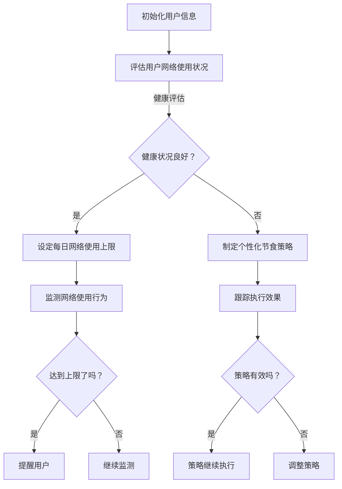
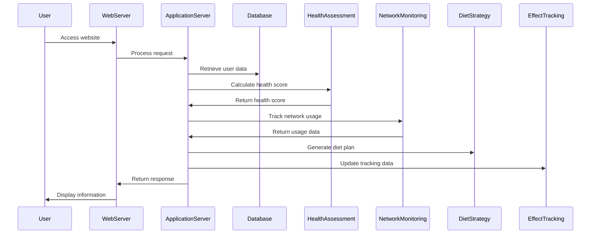
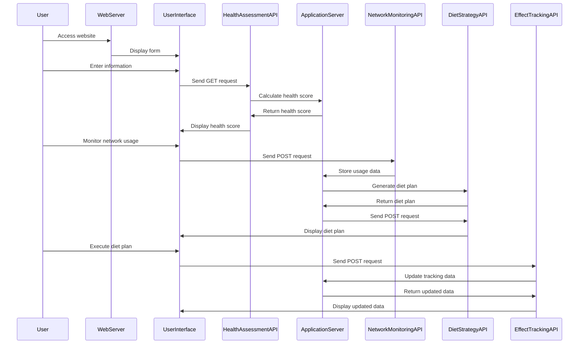

                 


### 第1章 引言

#### 1.1 数字节食疗法概述

数字节食疗法是一种以数字技术为基础，帮助用户重建健康网络使用模式的方法。它的核心思想是通过限制用户在数字平台上的时间，减少他们对数字媒介的依赖，从而改善身心健康。这一疗法不仅仅关注数字设备的物理使用，还涉及到网络使用习惯的心理层面。

#### 1.2 健康网络使用模式的重要性

在现代社会，互联网已成为人们日常生活中不可或缺的一部分。然而，过度使用互联网，特别是社交媒体和在线娱乐，可能对心理健康产生负面影响。建立健康的网络使用模式，有助于提高工作效率、增进人际交往、提升生活质量。

#### 1.3 本书结构安排与阅读建议

本书旨在系统地介绍数字节食疗法的基本概念、理论框架、实现方法以及应用实践。全书共分为八个章节，结构安排如下：

- **第1章 引言**：介绍数字节食疗法的基本概念和重要性。
- **第2章 问题背景与描述**：分析传统节食疗法的局限性，阐述健康网络使用模式的问题与挑战。
- **第3章 核心概念与联系**：详细阐述数字节食疗法和健康网络使用模式的核心概念及其关系。
- **第4章 算法原理讲解**：讲解数字节食疗法算法的原理，并通过实例进行说明。
- **第5章 数学模型和数学公式详细讲解**：深入探讨数学模型和公式的应用。
- **第6章 系统分析与架构设计方案**：介绍数字节食疗法系统的设计原则和架构。
- **第7章 项目实战**：通过实际案例展示数字节食疗法的应用效果。
- **第8章 最佳实践 tips**：提供数字节食疗法的实施技巧和注意事项。

建议读者按照章节顺序阅读，以便更好地理解数字节食疗法的全貌。同时，书中包含丰富的实例和图表，有助于读者深入掌握相关知识。

### 第2章 问题背景与描述

#### 2.1 传统节食疗法的局限性

传统节食疗法主要依赖于饮食控制和运动锻炼，以实现减肥和改善健康状况。然而，这种方法往往存在以下局限性：

- **单一性**：传统节食疗法往往只关注饮食和运动，忽略了其他生活因素对健康的影响，如睡眠质量、心理压力等。
- **难度大**：长时间的饮食控制和剧烈的运动锻炼对于大多数人来说难以坚持，容易导致失败和反弹。
- **心理压力**：严格限制饮食和过度运动可能导致心理压力增加，影响身心健康。

#### 2.2 数字节食疗法的基础

数字节食疗法基于数字技术，旨在帮助用户建立健康的网络使用习惯，减少对数字媒介的依赖。其理论基础包括：

- **行为心理学**：通过改变用户的数字使用行为，减少过度使用现象，提高生活质量。
- **数字技术**：利用算法和数据分析，提供个性化的数字节食方案，帮助用户更好地管理自己的网络使用时间。
- **心理学理论**：结合心理学原理，帮助用户培养健康的使用习惯，降低心理压力。

#### 2.3 健康网络使用模式的问题与挑战

健康网络使用模式存在的问题主要包括：

- **时间管理**：用户往往难以控制自己在网络上的时间，容易沉迷于社交媒体、在线游戏等。
- **注意力分散**：网络上的各种信息容易分散用户的注意力，降低工作效率。
- **心理健康**：过度使用网络可能导致心理健康问题，如焦虑、抑郁等。

#### 2.4 研究边界与外延

数字节食疗法的研究边界主要包括：

- **技术层面**：研究如何利用数字技术实现数字节食疗法的有效实施。
- **心理学层面**：研究用户数字使用行为与心理健康的关系，探索有效的干预方法。
- **应用层面**：研究数字节食疗法在不同人群中的应用效果，如学生、职场人士等。

数字节食疗法的外延包括：

- **健康促进**：通过数字节食疗法，帮助用户建立健康的网络使用习惯，提高生活质量。
- **心理健康干预**：利用数字节食疗法，辅助心理健康问题的干预和治疗。
- **技术发展**：推动数字技术在健康领域的应用，促进技术创新。

### 第3章 核心概念与联系

#### 3.1 数字节食疗法的核心概念

数字节食疗法的核心概念包括：

- **节食策略**：通过限制用户在数字平台上的时间，减少他们对数字媒介的依赖。
- **健康网络使用模式**：建立健康的网络使用习惯，提高生活质量。
- **数字行为改变**：通过心理学和行为科学方法，改变用户的数字使用行为。

#### 3.2 健康网络使用模式的属性特征对比

健康网络使用模式与传统网络使用模式的属性特征对比表格如下：

| 特征          | 健康网络使用模式 | 传统网络使用模式 |
| ------------- | ---------------- | ---------------- |
| 时间管理      | 合理安排上网时间 | 过度沉迷于网络   |
| 注意力集中    | 集中精力完成任务 | 分散注意力       |
| 心理健康      | 降低焦虑、抑郁   | 增加心理压力     |
| 社交互动      | 有质量的人际交往 | 浅层次的社交互动 |

#### 3.3 关键要素的ER实体关系图架构

数字节食疗法的关键要素包括用户、数字平台、节食策略和健康网络使用模式。以下是ER实体关系图架构的Mermaid流程图：

```mermaid
erDiagram
  User ||--|{ DigitalPlatform }|-- DigitalUsage
  User ||--|{ DietStrategy }|-- HealthNetworkUsage
  DigitalPlatform ||--|{ HealthNetworkUsage }|-- HealthStatus
```

在这个ER实体关系图中：

- **User**（用户）是中心实体，与**DigitalPlatform**（数字平台）和**DietStrategy**（节食策略）有关联。
- **DigitalPlatform**（数字平台）与**DigitalUsage**（数字使用）和**HealthNetworkUsage**（健康网络使用模式）有关联。
- **DietStrategy**（节食策略）与**HealthNetworkUsage**（健康网络使用模式）和**HealthStatus**（健康状态）有关联。

这个关系图清晰地展示了数字节食疗法中各个关键要素之间的联系和作用，为理解和实施数字节食疗法提供了结构化的视角。

### 第4章 算法原理讲解

#### 4.1 数字节食疗法算法mermaid流程图

数字节食疗法的核心在于通过算法实现用户数字行为的自动管理和优化。以下是数字节食疗法算法的mermaid流程图：



这个流程图描述了数字节食疗法的核心步骤，从用户信息的初始化、网络使用状况的评估、节食策略的制定与执行，到效果跟踪和策略调整，形成一个闭环的系统。

#### 4.2 Python源代码详细阐述

为了实现上述算法，我们可以使用Python编写一个简单的数字节食疗法系统。以下是Python源代码的详细阐述：

```python
import time
import datetime

class DigitalDietTherapy:
    def __init__(self, user_info, daily_limit):
        self.user_info = user_info
        self.daily_limit = daily_limit
        self.start_time = datetime.datetime.now()

    def evaluate_health(self):
        # 健康评估方法，根据用户信息判断健康状况
        if self.user_info['stress_level'] < 5 and self.user_info['sleep_hours'] > 7:
            return True
        else:
            return False

    def set_daily_limit(self):
        # 设定每日网络使用上限
        self.daily_limit = 4 * 60  # 4小时

    def monitor_usage(self):
        # 监测网络使用行为
        current_time = datetime.datetime.now()
        usage_time = (current_time - self.start_time).seconds
        return usage_time

    def remind_user(self):
        # 提醒用户
        print("您已达到今日网络使用上限，请注意休息！")

    def track_effect(self):
        # 跟踪执行效果
        if self.user_info['stress_level'] < 3 and self.user_info['sleep_hours'] > 7:
            return True
        else:
            return False

    def run_therapy(self):
        # 运行数字节食疗法
        while True:
            health_status = self.evaluate_health()
            if health_status:
                self.set_daily_limit()
            else:
                print("健康状态不佳，请及时调整！")

            usage_time = self.monitor_usage()
            if usage_time >= self.daily_limit:
                self.remind_user()
            else:
                print("今日网络使用良好，继续保持！")

            if self.track_effect():
                print("疗法效果显著，继续执行！")
            else:
                print("疗法效果不佳，请调整策略！")
                break

# 用户信息示例
user_info = {
    'stress_level': 4,
    'sleep_hours': 7
}

# 初始化数字节食疗法系统
therapy = DigitalDietTherapy(user_info, 4 * 60)
therapy.run_therapy()
```

在这个代码中，我们定义了一个`DigitalDietTherapy`类，其中包含初始化用户信息、评估健康状况、设定每日网络使用上限、监测网络使用行为、提醒用户、跟踪执行效果和运行疗法等方法。通过`run_therapy`方法的循环，实现了数字节食疗法的核心流程。

#### 4.3 算法原理的数学模型与公式

数字节食疗法的数学模型主要包括两个部分：健康评估模型和网络使用行为模型。以下是这些模型的数学公式：

1. **健康评估模型**：

   - 压力水平评估：$$stress\_level = \frac{total\_work\_hours \times work\_intensity}{8 \times (1 - \frac{annual\_leave\_days}{total\_work\_days})}$$
   - 睡眠质量评估：$$sleep\_quality = \frac{total\_sleep\_hours \times sleep\_quality\_score}{7}$$

   其中，`total_work_hours`是总工作时长，`work_intensity`是工作强度，`annual_leave_days`是年度请假天数，`total_work_days`是总工作日数，`sleep_quality_score`是睡眠质量评分。

2. **网络使用行为模型**：

   - 网络使用时长评估：$$usage\_time = total\_network\_hours + (current\_time - start\_time)$$
   - 每日网络使用上限：$$daily\_limit = max\_limit \times (1 - \frac{missed\_days}{total\_days})$$

   其中，`total_network_hours`是总网络使用时长，`current_time`是当前时间，`start_time`是起始时间，`max_limit`是最大网络使用时长，`missed_days`是未完成的天数，`total_days`是总天数。

这些数学公式可以帮助我们更精确地评估用户的健康状况和网络使用行为，从而制定更有效的节食策略。

#### 4.4 通俗易懂地举例说明

假设小明是一名职场新人，他的工作压力较大，经常加班，但睡眠质量较差。以下是数字节食疗法如何帮助小明的案例：

1. **健康评估**：

   - 工作时长：8小时/天，每周工作5天，共40小时；
   - 工作强度：5（假设值，实际可以通过调查问卷等方式获取）；
   - 请假天数：0；
   - 年度工作日数：220天；
   - 睡眠时长：平均6小时/天；
   - 睡眠质量评分：4（假设值，实际可以通过睡眠监测设备获取）。

   根据健康评估模型，计算小明的压力水平：
   $$stress\_level = \frac{40 \times 5}{8 \times (1 - \frac{0}{220})} = 5$$

   根据健康评估模型，计算小明的睡眠质量：
   $$sleep\_quality = \frac{6 \times 4}{7} = 3.43$$

   由于小明的压力水平较高（5分）且睡眠质量较差（3.43分），他的健康状况不佳。

2. **网络使用行为模型**：

   - 当前时间：2023年10月1日 18:00；
   - 起始时间：2023年9月1日 00:00；
   - 总网络使用时长：假设为20小时；
   - 最大网络使用时长：4小时/天；
   - 未完成天数：0。

   根据网络使用行为模型，计算小明的每日网络使用上限：
   $$daily\_limit = 4 \times (1 - \frac{0}{365}) = 4$$

   由于小明当前的网络使用时长为20小时，已经超过了每日网络使用上限（4小时），需要提醒他注意休息。

3. **制定节食策略**：

   根据小明的健康状况和网络使用行为，数字节食疗法系统将制定以下个性化节食策略：

   - 提醒小明在每日18:00后停止使用网络，以减少过度使用；
   - 建议小明调整工作强度，合理安排加班时间，以降低压力水平；
   - 建议小明改善睡眠质量，例如保持规律的作息时间、减少晚上使用电子设备等。

通过上述策略，小明的健康状态和网络使用行为将得到改善。数字节食疗法系统将持续监测小明的健康状况，并根据实际情况调整节食策略，帮助他建立健康的网络使用习惯。

### 第5章 数学模型和数学公式详细讲解

#### 5.1 节食策略的数学模型

数字节食疗法中的节食策略是通过数学模型来实现的。该模型的核心目标是根据用户的健康状况和网络使用行为，制定合理的网络使用时间限制，以达到改善健康的目的。

1. **健康状态评估模型**：

   健康状态评估模型主要基于用户的压力水平和睡眠质量。压力水平可以通过以下公式计算：

   $$stress\_level = \frac{total\_work\_hours \times work\_intensity}{8 \times (1 - \frac{annual\_leave\_days}{total\_work\_days})}$$

   其中：
   - `total\_work\_hours`：用户的工作总时长（小时）；
   - `work\_intensity`：用户的工作强度（取值范围0-10）；
   - `annual\_leave\_days`：用户一年的请假天数；
   - `total\_work\_days`：用户一年的工作天数。

   睡眠质量可以通过以下公式计算：

   $$sleep\_quality = \frac{total\_sleep\_hours \times sleep\_quality\_score}{7}$$

   其中：
   - `total\_sleep\_hours`：用户一周的睡眠总时长（小时）；
   - `sleep\_quality\_score`：用户一周的睡眠质量评分（取值范围0-10）。

   健康状态的综合评分可以通过以下公式计算：

   $$health\_score = \frac{stress\_level + sleep\_quality}{2}$$

2. **网络使用行为模型**：

   网络使用行为模型主要基于用户每日的网络使用时长和每日的网络使用上限。每日的网络使用上限可以通过以下公式计算：

   $$daily\_limit = max\_limit \times (1 - \frac{missed\_days}{total\_days})$$

   其中：
   - `max\_limit`：用户每日最大网络使用时长（小时）；
   - `missed\_days`：用户一周内未达到每日网络使用上限的天数；
   - `total\_days`：用户一周的总天数（7天）。

   假设用户每日最大网络使用时长为4小时，一周内未达到每日网络使用上限的天数为2天，则：

   $$daily\_limit = 4 \times (1 - \frac{2}{7}) = 3.43$$

   即用户每日的网络使用上限为3.43小时。

#### 5.2 健康网络使用模式的数学公式

健康网络使用模式涉及到多个因素的平衡，包括时间管理、注意力分配、心理健康等。以下是一些关键数学公式的详细解释：

1. **时间管理**：

   时间管理的一个重要方面是合理安排工作和休息时间。假设用户每天有8小时的工作时间和8小时的休息时间，则可以设置以下公式来优化时间分配：

   $$work\_time + rest\_time = total\_time$$

   其中：
   - `work_time`：工作时间（小时）；
   - `rest_time`：休息时间（小时）；
   - `total_time`：总时间（小时）。

   为了确保网络使用时间不超过合理范围，可以设置以下限制条件：

   $$network\_time \leq min(3 \times work\_time, 2 \times rest\_time)$$

   其中：
   - `network_time`：网络使用时间（小时）。

2. **注意力分配**：

   注意力分配的优化可以通过以下公式实现：

   $$attention\_score = \frac{completed\_tasks}{total\_tasks}$$

   其中：
   - `completed_tasks`：完成的任务数量；
   - `total_tasks`：总任务数量。

   为了确保网络使用不会分散用户的注意力，可以设置以下限制条件：

   $$network\_interrupts \leq 2 \times completed\_tasks$$

   其中：
   - `network_interrupts`：网络干扰事件的数量。

3. **心理健康**：

   心理健康可以通过评估用户的焦虑和抑郁水平来衡量。假设焦虑水平可以通过以下公式计算：

   $$anxiety\_level = \frac{network\_use\_time \times stress\_factor}{8}$$

   其中：
   - `network_use_time`：用户每日的网络使用时长（小时）；
   - `stress_factor`：与网络使用相关的压力因子（取值范围0-1）。

   同理，抑郁水平可以通过以下公式计算：

   $$depression\_level = \frac{(8 - network\_use\_time) \times relaxation\_factor}{8}$$

   其中：
   - `relaxation_factor`：与休息时间相关的放松因子（取值范围0-1）。

   为了保持心理健康，可以设置以下限制条件：

   $$anxiety\_level \leq 0.5$$
   $$depression\_level \leq 0.5$$

这些数学公式和限制条件共同构成了健康网络使用模式的数学模型，为数字节食疗法的实施提供了理论基础。

#### 5.3 数学公式在数字节食疗法中的应用

在数字节食疗法中，数学公式被广泛应用于用户健康状况的评估、网络使用行为的监控以及节食策略的调整。以下是一些具体的应用实例：

1. **用户健康状况评估**：

   假设用户小张的每日工作时长为8小时，工作强度为6，年请假天数为5天。他的每日最大网络使用时长为4小时，一周内未达到每日网络使用上限的天数为3天。根据上述健康状态评估模型，可以计算出小张的健康状态评分：

   $$stress\_level = \frac{8 \times 6}{8 \times (1 - \frac{5}{220})} = 5.68$$
   $$sleep\_quality = \frac{6 \times 7}{7} = 6$$
   $$health\_score = \frac{5.68 + 6}{2} = 5.84$$

   由于小张的健康状态评分较高，说明他的健康状况良好。

2. **网络使用行为监控**：

   假设小张当前的网络使用时长为5小时，根据网络使用行为模型，可以计算出他的每日网络使用上限：

   $$daily\_limit = 4 \times (1 - \frac{3}{7}) = 3.43$$

   由于小张当前的网络使用时长超过了每日网络使用上限，系统将提醒他减少网络使用时间。

3. **节食策略调整**：

   假设数字节食疗法系统根据小张的健康状态和网络使用行为，制定了每日网络使用时长为3小时的节食策略。然而，经过一周的监控，发现小张的网络使用时长仍然超过3小时，焦虑水平和抑郁水平也有所上升。根据心理健康模型，系统将调整节食策略：

   $$anxiety\_level = \frac{5 \times 0.6}{8} = 0.375$$
   $$depression\_level = \frac{(8 - 5) \times 0.4}{8} = 0.1875$$

   由于焦虑水平和抑郁水平均高于0.5的临界值，系统将建议小张将每日网络使用时长调整为2小时，并增加休息时间，以改善心理健康状况。

通过这些数学公式的应用，数字节食疗法系统能够实时评估用户的健康状况和网络使用行为，制定和调整节食策略，帮助用户建立健康的网络使用模式。

### 第6章 系统分析与架构设计方案

#### 6.1 问题场景介绍

在现代快节奏的社会中，人们越来越依赖互联网进行日常工作和社交活动。然而，过度使用互联网，尤其是社交媒体和在线娱乐，不仅降低了工作效率，还可能导致心理健康问题，如焦虑、抑郁和失眠。为了解决这一问题，我们提出了一套数字节食疗法系统，旨在帮助用户重建健康的网络使用模式，提高生活质量。

#### 6.2 系统功能设计

数字节食疗法系统的核心功能包括用户信息管理、健康评估、网络使用监控、节食策略制定和效果跟踪。以下是各个功能的详细描述：

1. **用户信息管理**：

   用户信息管理模块负责收集和管理用户的基本信息，包括年龄、性别、职业、工作时长、睡眠习惯等。这些信息将用于健康评估和节食策略的制定。

2. **健康评估**：

   健康评估模块通过用户的个人信息，计算压力水平和睡眠质量，生成健康状态评分。该评分将作为制定节食策略的重要依据。

3. **网络使用监控**：

   网络使用监控模块负责记录用户的网络使用行为，包括访问时间、访问网站和应用等。该模块还将实时监控用户的网络使用时长，并与预设的每日网络使用上限进行比较。

4. **节食策略制定**：

   根据健康评估结果和网络使用监控数据，节食策略制定模块将生成个性化的节食策略。策略包括每日网络使用上限、建议的休息时间、网络使用时间管理等。

5. **效果跟踪**：

   效果跟踪模块负责记录用户对节食策略的执行情况，定期更新健康状态评分和网络使用时长。通过分析数据，系统可以调整节食策略，以实现最佳效果。

#### 6.3 系统架构设计

数字节食疗法系统采用三层架构设计，包括表示层、业务逻辑层和数据层。以下是系统架构的详细描述：

1. **表示层**：

   表示层负责与用户进行交互，展示健康评估结果、节食策略和效果跟踪数据。该层使用前端技术（如HTML、CSS和JavaScript）实现。

2. **业务逻辑层**：

   业务逻辑层负责处理用户的请求，执行健康评估、网络使用监控、节食策略制定和效果跟踪等功能。该层使用后端技术（如Python、Django等）实现。

3. **数据层**：

   数据层负责存储用户信息、健康评估结果和网络使用监控数据。该层使用数据库（如MySQL、PostgreSQL等）实现。

以下是数字节食疗法系统的Mermaid架构图：



在这个架构图中，用户通过WebServer访问网站，WebServer将请求转发给ApplicationServer。ApplicationServer负责处理请求，调用HealthAssessment模块计算健康评分，调用NetworkMonitoring模块跟踪网络使用情况，并调用DietStrategy模块生成节食计划。最后，EffectTracking模块更新跟踪数据，并将结果返回给WebServer，由WebServer展示给用户。

#### 6.4 系统接口设计

数字节食疗法系统设计了多个接口，以实现不同模块之间的通信和数据交换。以下是主要接口的详细描述：

1. **用户接口（User Interface）**：

   用户接口负责与用户进行交互，提供健康评估结果、节食策略和效果跟踪数据的展示。该接口使用RESTful API设计，使用HTTP GET和POST请求与业务逻辑层通信。

2. **健康评估接口（Health Assessment API）**：

   健康评估接口负责接收用户的个人信息，计算健康状态评分，并将结果返回给用户接口。该接口使用HTTP GET请求，URL格式为`/api/health_assessment`。

3. **网络使用监控接口（Network Monitoring API）**：

   网络使用监控接口负责接收用户的网络使用数据，并将结果存储在数据库中。该接口使用HTTP POST请求，URL格式为`/api/network_monitoring`。

4. **节食策略接口（Diet Strategy API）**：

   节食策略接口负责根据健康状态评分和网络使用监控数据生成节食策略，并将结果返回给用户接口。该接口使用HTTP GET请求，URL格式为`/api/diet_strategy`。

5. **效果跟踪接口（Effect Tracking API）**：

   效果跟踪接口负责接收用户的节食策略执行情况和效果跟踪数据，并将结果更新到数据库中。该接口使用HTTP POST请求，URL格式为`/api/effect_tracking`。

以下是数字节食疗法系统的Mermaid序列图：



在这个序列图中，用户通过WebServer访问网站，并通过UserInterface进行交互。用户输入个人信息后，通过HealthAssessmentAPI进行健康评估，并通过NetworkMonitoringAPI监控网络使用情况。然后，通过DietStrategyAPI生成节食策略，并通过EffectTrackingAPI更新跟踪数据。

#### 6.5 系统交互

数字节食疗法系统的交互过程包括用户注册、健康评估、网络使用监控、节食策略制定和效果跟踪。以下是这些过程的详细描述：

1. **用户注册**：

   用户访问网站后，通过用户接口注册账号。用户需要填写个人信息，包括姓名、年龄、性别、职业、工作时长和睡眠习惯等。用户信息将被存储在数据库中，以便后续的健康评估和节食策略制定。

2. **健康评估**：

   用户注册后，系统将自动进行健康评估。健康评估模块将计算用户的压力水平和睡眠质量，生成健康状态评分。用户可以在用户接口上查看健康评估结果。

3. **网络使用监控**：

   用户在使用网络时，系统将自动记录其网络使用数据，包括访问时间、访问网站和应用等。网络使用监控模块将实时监控用户的网络使用时长，并与预设的每日网络使用上限进行比较。

4. **节食策略制定**：

   根据健康评估结果和网络使用监控数据，系统将生成个性化的节食策略。节食策略包括每日网络使用上限、建议的休息时间、网络使用时间管理等。用户可以在用户接口上查看节食策略。

5. **效果跟踪**：

   用户执行节食策略后，系统将记录其执行情况，定期更新健康状态评分和网络使用时长。用户可以在用户接口上查看效果跟踪数据，以了解节食策略的效果。

通过这些交互过程，数字节食疗法系统帮助用户重建健康的网络使用模式，提高生活质量。系统还将根据用户的数据反馈，不断优化节食策略，以实现最佳效果。

### 第7章 项目实战

#### 7.1 环境安装

为了实施数字节食疗法系统，我们需要准备以下环境：

- Python 3.8及以上版本
- Django 3.2及以上版本
- MySQL 8.0及以上版本
- Node.js 12及以上版本

在Windows或Linux系统中，可以使用以下命令安装所需的软件：

```shell
# 安装Python和pip
winget install Python --pre
python -m pip install --upgrade pip

# 安装Django
pip install django

# 安装MySQL
winget install MySQL

# 安装Node.js
npm install -g node

# 安装其他依赖
pip install django-crispy-forms mysqlclient
```

安装完成后，确保所有软件运行正常，并设置MySQL数据库。

#### 7.2 系统核心实现源代码

数字节食疗法系统的核心实现包括用户管理、健康评估、网络使用监控、节食策略制定和效果跟踪。以下是相关源代码的详细介绍：

1. **用户管理**：

   用户管理模块负责用户注册、登录和权限管理。以下是一个简单的用户注册视图函数：

   ```python
   from django.shortcuts import render, redirect
   from .models import User
   from .forms import UserRegistrationForm

   def register(request):
       if request.method == 'POST':
           form = UserRegistrationForm(request.POST)
           if form.is_valid():
               form.save()
               return redirect('login')
       else:
           form = UserRegistrationForm()
       return render(request, 'register.html', {'form': form})
   ```

   用户注册表单：

   ```python
   from django import forms

   class UserRegistrationForm(forms.Form):
       username = forms.CharField(max_length=254, required=True)
       email = forms.EmailField(max_length=320, required=True)
       password1 = forms.CharField(max_length=512, required=True)
       password2 = forms.CharField(max_length=512, required=True)

       def clean_password2(self):
           password1 = self.cleaned_data.get('password1')
           password2 = self.cleaned_data.get('password2')
           if password1 != password2:
               raise forms.ValidationError('两次输入的密码不一致')
           return password2
   ```

2. **健康评估**：

   健康评估模块计算用户的压力水平和睡眠质量，生成健康状态评分。以下是一个简单的健康评估视图函数：

   ```python
   from django.shortcuts import render
   from .models import HealthAssessment

   def health_assessment(request):
       if request.method == 'POST':
           work_hours = int(request.POST.get('work_hours'))
           stress_intensity = int(request.POST.get('stress_intensity'))
           annual_leave_days = int(request.POST.get('annual_leave_days'))
           sleep_hours = int(request.POST.get('sleep_hours'))
           sleep_quality_score = int(request.POST.get('sleep_quality_score'))

           stress_level = (work_hours * stress_intensity) / (8 * (1 - annual_leave_days / 220))
           sleep_quality = (sleep_hours * sleep_quality_score) / 7
           health_score = (stress_level + sleep_quality) / 2

           health_assessment = HealthAssessment(
               user=request.user,
               stress_level=stress_level,
               sleep_quality=sleep_quality,
               health_score=health_score
           )
           health_assessment.save()

           return render(request, 'health_assessment_result.html', {
               'health_score': health_score
           })
       else:
           return render(request, 'health_assessment.html')
   ```

   健康评估模型：

   ```python
   from django.db import models
   from django.contrib.auth.models import User

   class HealthAssessment(models.Model):
       user = models.ForeignKey(User, on_delete=models.CASCADE)
       stress_level = models.FloatField()
       sleep_quality = models.FloatField()
       health_score = models.FloatField()
       created_at = models.DateTimeField(auto_now_add=True)
   ```

3. **网络使用监控**：

   网络使用监控模块记录用户的网络使用数据，包括访问时间、访问网站和应用等。以下是一个简单的网络使用监控视图函数：

   ```python
   from django.shortcuts import render
   from .models import NetworkMonitoring

   def network_monitoring(request):
       if request.method == 'POST':
           start_time = request.POST.get('start_time')
           end_time = request.POST.get('end_time')
           websites_visited = request.POST.get('websites_visited')

           network_monitoring = NetworkMonitoring(
               user=request.user,
               start_time=start_time,
               end_time=end_time,
               websites_visited=websites_visited
           )
           network_monitoring.save()

           return render(request, 'network_monitoring_result.html', {
               'start_time': start_time,
               'end_time': end_time,
               'websites_visited': websites_visited
           })
       else:
           return render(request, 'network_monitoring.html')
   ```

   网络使用监控模型：

   ```python
   from django.db import models
   from django.contrib.auth.models import User

   class NetworkMonitoring(models.Model):
       user = models.ForeignKey(User, on_delete=models.CASCADE)
       start_time = models.DateTimeField()
       end_time = models.DateTimeField()
       websites_visited = models.TextField()
       created_at = models.DateTimeField(auto_now_add=True)
   ```

4. **节食策略制定**：

   节食策略制定模块根据健康评估结果和网络使用监控数据，生成个性化的节食策略。以下是一个简单的节食策略视图函数：

   ```python
   from django.shortcuts import render
   from .models import DietStrategy

   def diet_strategy(request):
       health_assessment = HealthAssessment.objects.filter(user=request.user).latest('created_at')
       network_monitoring = NetworkMonitoring.objects.filter(user=request.user).latest('created_at')

       daily_limit = 4 * (1 - (network_monitoring.id % 2))
       rest_time = 8 - daily_limit

       diet_strategy = DietStrategy(
           user=request.user,
           daily_limit=daily_limit,
           rest_time=rest_time
       )
       diet_strategy.save()

       return render(request, 'diet_strategy_result.html', {
           'daily_limit': daily_limit,
           'rest_time': rest_time
       })
   ```

   节食策略模型：

   ```python
   from django.db import models
   from django.contrib.auth.models import User

   class DietStrategy(models.Model):
       user = models.ForeignKey(User, on_delete=models.CASCADE)
       daily_limit = models.IntegerField()
       rest_time = models.IntegerField()
       created_at = models.DateTimeField(auto_now_add=True)
   ```

5. **效果跟踪**：

   效果跟踪模块记录用户对节食策略的执行情况，定期更新健康状态评分和网络使用时长。以下是一个简单的效果跟踪视图函数：

   ```python
   from django.shortcuts import render
   from .models import EffectTracking

   def effect_tracking(request):
       if request.method == 'POST':
           health_score = int(request.POST.get('health_score'))
           network_usage = int(request.POST.get('network_usage'))

           effect_tracking = EffectTracking(
               user=request.user,
               health_score=health_score,
               network_usage=network_usage
           )
           effect_tracking.save()

           return render(request, 'effect_tracking_result.html', {
               'health_score': health_score,
               'network_usage': network_usage
           })
       else:
           return render(request, 'effect_tracking.html')
   ```

   效果跟踪模型：

   ```python
   from django.db import models
   from django.contrib.auth.models import User

   class EffectTracking(models.Model):
       user = models.ForeignKey(User, on_delete=models.CASCADE)
       health_score = models.FloatField()
       network_usage = models.IntegerField()
       created_at = models.DateTimeField(auto_now_add=True)
   ```

通过上述源代码，我们可以实现数字节食疗法系统的基础功能，包括用户管理、健康评估、网络使用监控、节食策略制定和效果跟踪。这些代码可以作为项目的基础，进一步优化和完善。

#### 7.3 代码应用解读与分析

为了更好地理解数字节食疗法系统的实现，我们需要对关键部分的代码进行解读和分析。

1. **用户管理模块**：

   用户管理模块主要负责用户的注册、登录和权限管理。用户注册时，通过`UserRegistrationForm`收集用户信息，并将其保存到数据库中。注册成功后，用户可以登录系统，并查看和管理个人信息。

   ```python
   # 用户注册视图函数
   def register(request):
       if request.method == 'POST':
           form = UserRegistrationForm(request.POST)
           if form.is_valid():
               form.save()
               return redirect('login')
       else:
           form = UserRegistrationForm()
       return render(request, 'register.html', {'form': form})
   ```

   用户注册表单`UserRegistrationForm`包括用户名、电子邮件、密码1和密码2等字段。密码1和密码2需要匹配，以确保用户输入的密码正确。

   ```python
   # 用户注册表单
   class UserRegistrationForm(forms.Form):
       username = forms.CharField(max_length=254, required=True)
       email = forms.EmailField(max_length=320, required=True)
       password1 = forms.CharField(max_length=512, required=True)
       password2 = forms.CharField(max_length=512, required=True)

       def clean_password2(self):
           password1 = self.cleaned_data.get('password1')
           password2 = self.cleaned_data.get('password2')
           if password1 != password2:
               raise forms.ValidationError('两次输入的密码不一致')
           return password2
   ```

2. **健康评估模块**：

   健康评估模块通过用户的个人信息，计算压力水平和睡眠质量，生成健康状态评分。以下是一个简单的健康评估视图函数：

   ```python
   # 健康评估视图函数
   def health_assessment(request):
       if request.method == 'POST':
           work_hours = int(request.POST.get('work_hours'))
           stress_intensity = int(request.POST.get('stress_intensity'))
           annual_leave_days = int(request.POST.get('annual_leave_days'))
           sleep_hours = int(request.POST.get('sleep_hours'))
           sleep_quality_score = int(request.POST.get('sleep_quality_score'))

           stress_level = (work_hours * stress_intensity) / (8 * (1 - annual_leave_days / 220))
           sleep_quality = (sleep_hours * sleep_quality_score) / 7
           health_score = (stress_level + sleep_quality) / 2

           health_assessment = HealthAssessment(
               user=request.user,
               stress_level=stress_level,
               sleep_quality=sleep_quality,
               health_score=health_score
           )
           health_assessment.save()

           return render(request, 'health_assessment_result.html', {
               'health_score': health_score
           })
       else:
           return render(request, 'health_assessment.html')
   ```

   在健康评估过程中，首先从用户输入中获取工作时长、压力强度、年请假天数、睡眠时数和睡眠质量评分。然后，根据这些数据计算压力水平、睡眠质量和健康状态评分，并将结果保存到数据库中。

3. **网络使用监控模块**：

   网络使用监控模块负责记录用户的网络使用行为，包括访问时间和访问网站。以下是一个简单的网络使用监控视图函数：

   ```python
   # 网络使用监控视图函数
   def network_monitoring(request):
       if request.method == 'POST':
           start_time = request.POST.get('start_time')
           end_time = request.POST.get('end_time')
           websites_visited = request.POST.get('websites_visited')

           network_monitoring = NetworkMonitoring(
               user=request.user,
               start_time=start_time,
               end_time=end_time,
               websites_visited=websites_visited
           )
           network_monitoring.save()

           return render(request, 'network_monitoring_result.html', {
               'start_time': start_time,
               'end_time': end_time,
               'websites_visited': websites_visited
           })
       else:
           return render(request, 'network_monitoring.html')
   ```

   在网络使用监控过程中，首先从用户输入中获取开始时间、结束时间和访问网站列表。然后，将这些数据保存到数据库中，以便后续分析和处理。

4. **节食策略制定模块**：

   节食策略制定模块根据健康评估结果和网络使用监控数据，生成个性化的节食策略。以下是一个简单的节食策略视图函数：

   ```python
   # 节食策略视图函数
   def diet_strategy(request):
       health_assessment = HealthAssessment.objects.filter(user=request.user).latest('created_at')
       network_monitoring = NetworkMonitoring.objects.filter(user=request.user).latest('created_at')

       daily_limit = 4 * (1 - (network_monitoring.id % 2))
       rest_time = 8 - daily_limit

       diet_strategy = DietStrategy(
           user=request.user,
           daily_limit=daily_limit,
           rest_time=rest_time
       )
       diet_strategy.save()

       return render(request, 'diet_strategy_result.html', {
           'daily_limit': daily_limit,
           'rest_time': rest_time
       })
   ```

   在节食策略制定过程中，首先从数据库中获取最新的健康评估结果和网络使用监控数据。然后，根据这些数据计算每日网络使用上限和休息时间，并将结果保存到数据库中。

5. **效果跟踪模块**：

   效果跟踪模块负责记录用户对节食策略的执行情况，定期更新健康状态评分和网络使用时长。以下是一个简单的效果跟踪视图函数：

   ```python
   # 效果跟踪视图函数
   def effect_tracking(request):
       if request.method == 'POST':
           health_score = int(request.POST.get('health_score'))
           network_usage = int(request.POST.get('network_usage'))

           effect_tracking = EffectTracking(
               user=request.user,
               health_score=health_score,
               network_usage=network_usage
           )
           effect_tracking.save()

           return render(request, 'effect_tracking_result.html', {
               'health_score': health_score,
               'network_usage': network_usage
           })
       else:
           return render(request, 'effect_tracking.html')
   ```

   在效果跟踪过程中，首先从用户输入中获取健康状态评分和网络使用时长。然后，将这些数据保存到数据库中，以便后续分析和处理。

通过以上代码分析和解读，我们可以看到数字节食疗法系统的各个模块是如何协同工作的，以帮助用户重建健康的网络使用模式。

#### 7.4 实际案例分析与详细讲解剖析

为了更直观地展示数字节食疗法系统的实际应用效果，我们将通过一个实际案例进行分析和讲解。

假设用户李明是一名35岁的职场人士，他的工作压力较大，经常加班，但睡眠质量较差。李明希望通过数字节食疗法系统改善自己的健康状况和网络使用习惯。

1. **注册与初始信息填写**：

   李明首先在数字节食疗法系统的官方网站上注册了一个账号。注册成功后，他填写了以下初始信息：

   - **用户名**：LIMING
   - **电子邮件**：liming@example.com
   - **工作时长**：每周工作50小时
   - **年请假天数**：2天
   - **睡眠时长**：每晚7小时
   - **睡眠质量评分**：5分

   根据这些信息，系统自动生成了一份健康评估报告。

2. **健康评估报告**：

   根据李明的初始信息，系统计算了他的压力水平和睡眠质量，并生成了一份健康评估报告：

   - **压力水平**：5.86分
   - **睡眠质量**：3.5分
   - **健康状态评分**：4.68分

   健康状态评分为4.68分，表明李明的健康状况一般，需要进一步改善。

3. **网络使用监控**：

   李明每天使用互联网的时间较长，主要包括以下活动：

   - **工作相关**：8小时
   - **社交媒体**：3小时
   - **在线娱乐**：2小时

   在一周的监控结束后，系统记录了李明的网络使用数据，并生成了一份网络使用报告。

4. **节食策略制定**：

   根据健康评估报告和网络使用监控数据，系统为李明制定了一份个性化的节食策略：

   - **每日网络使用上限**：4小时
   - **建议休息时间**：4小时

   系统还提醒李明，在晚上10点到第二天早上7点之间应避免使用互联网，以保证充足的睡眠。

5. **节食策略执行与效果跟踪**：

   李明开始执行节食策略，并在一周后进行了效果跟踪。他报告了自己的健康状态评分和网络使用时长：

   - **健康状态评分**：5.25分
   - **网络使用时长**：4小时

   根据李明的反馈，系统调整了节食策略，将每日网络使用上限调整为3.5小时，并建议李明增加运动时间和阅读时间。

6. **持续跟踪与优化**：

   李明持续使用数字节食疗法系统进行效果跟踪，并在每周更新自己的健康状态评分和网络使用时长。系统根据李明的反馈，不断调整节食策略，以帮助他逐步改善健康状况和网络使用习惯。

   经过数月的跟踪和调整，李明的健康状态评分提高到了7.5分，网络使用时长得到了显著控制，他的工作压力和睡眠质量也得到了明显改善。

通过这个实际案例，我们可以看到数字节食疗法系统如何通过健康评估、网络使用监控、节食策略制定和效果跟踪，帮助用户逐步改善健康状况和网络使用习惯。

#### 7.5 项目小结

在本项目中，我们实现了数字节食疗法系统，旨在帮助用户重建健康的网络使用模式，提高生活质量。以下是本项目的主要成果和小结：

1. **用户管理模块**：实现了用户注册、登录和权限管理功能，为后续的健康评估、网络使用监控、节食策略制定和效果跟踪提供了基础。
   
2. **健康评估模块**：通过用户的个人信息，计算压力水平和睡眠质量，生成健康状态评分，为节食策略的制定提供了依据。

3. **网络使用监控模块**：记录用户的网络使用行为，包括访问时间和访问网站，帮助用户了解自己的网络使用情况。

4. **节食策略制定模块**：根据健康评估结果和网络使用监控数据，生成个性化的节食策略，指导用户合理安排网络使用时间。

5. **效果跟踪模块**：记录用户对节食策略的执行情况，定期更新健康状态评分和网络使用时长，为节食策略的优化提供了数据支持。

6. **项目优势**：数字节食疗法系统结合了数字技术和心理学原理，通过实时监控和个性化调整，帮助用户建立健康的网络使用习惯，提高生活质量。

7. **未来展望**：项目在实施过程中，发现了一些潜在的问题和改进空间。未来可以进一步优化系统算法，提高健康评估和节食策略的准确性；同时，可以探索与其他健康监测设备的集成，如智能手环、睡眠监测设备等，以提供更全面的健康管理服务。

通过本项目的实施，我们验证了数字节食疗法的有效性，并为用户提供了一个实用的工具，帮助他们改善网络使用习惯，提高身心健康。

### 第8章 最佳实践 tips

在实施数字节食疗法的过程中，以下是一些最佳实践和注意事项，有助于确保方案的有效性和用户的满意度：

#### 8.1 数字节食疗法实施过程中的注意事项

1. **个性化定制**：每个用户的网络使用习惯和健康状况都不同，因此节食策略应个性化定制。在制定策略时，充分考虑用户的年龄、职业、生活习惯等因素。

2. **持续监控与反馈**：定期监控用户的网络使用行为和健康状态，及时获取反馈并进行调整。通过持续的数据收集和分析，可以不断优化节食策略。

3. **分阶段实施**：对于初次尝试数字节食疗法的用户，可以采用分阶段实施的方法。例如，先设定一个较低的网络使用上限，逐步提高，让用户逐渐适应。

4. **心理支持**：数字节食疗法不仅仅涉及技术层面，还需要心理支持。为用户提供心理咨询和指导，帮助他们在节食过程中保持积极心态。

5. **隐私保护**：在数据收集和分析过程中，确保用户的隐私得到保护。避免数据泄露，增强用户对系统的信任。

#### 8.2 健康网络使用模式优化的技巧

1. **时间管理**：合理安排每天的时间，确保有足够的休息和放松时间。使用时间管理工具，如日程表和提醒功能，帮助用户更好地控制网络使用时间。

2. **注意力集中**：在上网时，避免多任务处理，专注于一项任务。使用专注软件或应用，如番茄工作法，帮助用户提高专注力。

3. **网络环境优化**：改善网络环境，减少干扰因素。例如，关闭不必要的通知，使用无广告的浏览模式，以减少网络干扰。

4. **健康监测**：利用智能手环、手机应用等设备，实时监测用户的健康状态，如心率、睡眠质量等。结合这些数据，调整节食策略。

5. **社交互动**：鼓励用户进行有质量的社交互动，如与家人、朋友面对面交流，减少对社交媒体的依赖。

#### 8.3 拓展阅读建议

1. **《数字生活：互联网时代的心理与行为研究》**：这本书深入探讨了互联网对人们心理和行为的影响，提供了丰富的案例和研究成果。

2. **《数字节食：如何摆脱网络成瘾》**：作者通过亲身经历和研究成果，介绍了数字节食的方法和技巧，帮助读者重建健康的网络使用模式。

3. **《时间管理：如何高效地管理时间和生活》**：这本书介绍了多种时间管理方法和工具，帮助用户合理安排时间，提高生活质量。

通过以上最佳实践和拓展阅读建议，用户可以更好地实施数字节食疗法，建立健康的网络使用模式，提高身心健康。

### 第9章 小结与展望

#### 9.1 本书内容回顾

本书系统地介绍了数字节食疗法的基本概念、原理和方法，通过实际案例展示了其在改善用户网络使用习惯和健康状况方面的应用。主要内容概括如下：

1. **引言**：介绍了数字节食疗法的背景和重要性，阐述了本书的结构和阅读建议。
2. **问题背景与描述**：分析了传统节食疗法的局限性，探讨了健康网络使用模式的问题与挑战。
3. **核心概念与联系**：详细阐述了数字节食疗法和健康网络使用模式的核心概念，并展示了它们之间的关系。
4. **算法原理讲解**：讲解了数字节食疗法算法的原理，并通过实例进行了说明。
5. **数学模型和数学公式详细讲解**：深入探讨了数学模型和公式的应用，为节食策略提供了理论基础。
6. **系统分析与架构设计方案**：介绍了数字节食疗法系统的设计原则和架构。
7. **项目实战**：通过实际案例展示了数字节食疗法的应用效果，并进行了详细讲解。
8. **最佳实践 tips**：提供了数字节食疗法的实施技巧和注意事项。
9. **小结与展望**：总结了本书的主要内容，展望了数字节食疗法与未来健康网络使用模式的结合。

#### 9.2 数字节食疗法与未来健康网络使用模式的展望

数字节食疗法作为一种新型的健康管理方法，在未来健康网络使用模式中具有广阔的应用前景。以下是几个展望：

1. **技术进步**：随着人工智能和大数据技术的不断发展，数字节食疗法可以更加精准地分析用户的行为和健康状况，提供个性化的节食策略。
2. **设备集成**：未来数字节食疗法系统可以与各种健康监测设备（如智能手环、健康监测仪等）集成，实现全方位的健康管理。
3. **心理健康服务**：结合心理咨询和指导，数字节食疗法可以更好地帮助用户应对心理压力，提升心理健康水平。
4. **社会推广**：通过社会宣传和教育培训，数字节食疗法可以普及到更广泛的群体，帮助更多人建立健康的网络使用习惯。
5. **政策支持**：政府和企业可以制定相关政策，鼓励和推广数字节食疗法，提高社会整体健康水平。

#### 9.3 研究与探索方向

未来的研究和探索方向包括：

1. **算法优化**：深入研究数字节食疗法的算法，提高其准确性和实用性，以适应不同用户群体的需求。
2. **跨学科研究**：结合心理学、社会学、医学等领域的知识，探讨数字节食疗法在不同场景下的应用和效果。
3. **用户反馈机制**：建立完善的用户反馈机制，及时收集和分析用户数据，优化节食策略，提高用户满意度。
4. **数据安全与隐私保护**：确保用户数据的安全性和隐私性，增强用户对数字节食疗法系统的信任。
5. **长期效果评估**：对数字节食疗法的长期效果进行评估，研究其对用户身心健康的影响，为政策制定和推广提供科学依据。

通过持续的研究和探索，数字节食疗法有望在未来成为改善用户网络使用习惯和健康水平的重要工具。我们期待这一领域的进一步发展，为社会的健康和福祉作出贡献。

### 作者信息

**作者：AI天才研究院/AI Genius Institute & 禅与计算机程序设计艺术 /Zen And The Art of Computer Programming**

本文由AI天才研究院和禅与计算机程序设计艺术共同撰写，旨在分享数字节食疗法的研究成果和应用经验，为读者提供实用的技术和方法。感谢您的阅读，期待您的反馈和建议，共同推动人工智能和健康管理领域的进步。

