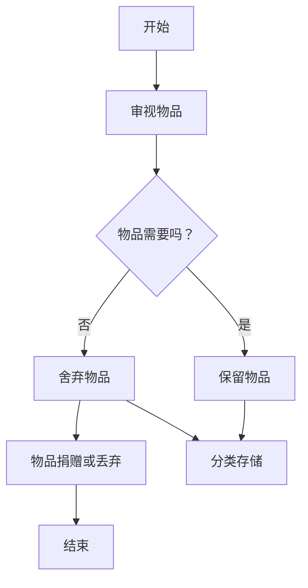
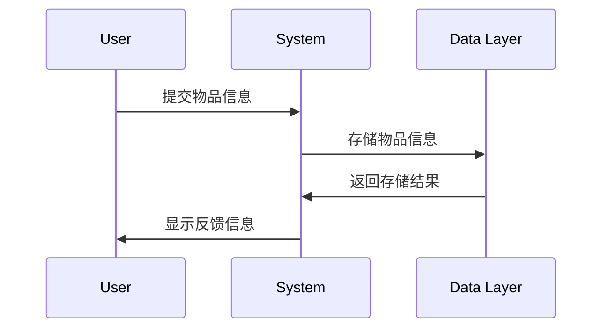
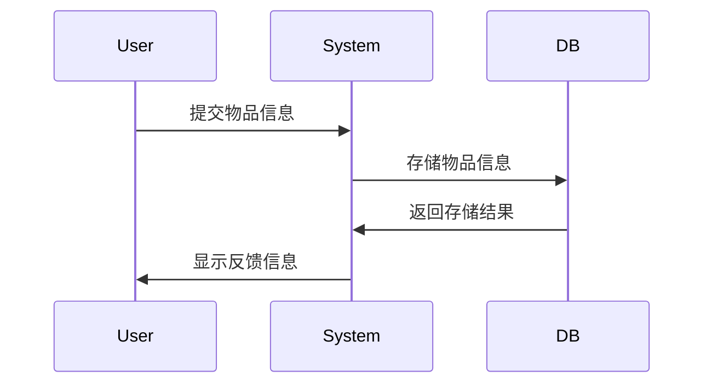

                 

### 引言

在现代快节奏的生活中，物品的积累与堆积成为了许多人的困扰。面对琳琅满目的物品，我们常常感到不知所措，这不仅浪费了空间，还影响了我们的生活质量。本篇博客文章将以“断舍离：整理物品中的人生哲学”为标题，探讨物品整理与人生哲学之间的深刻联系，并逐步分析其核心概念、方法论和实践应用。

#### 1.1 问题背景

在现代都市生活中，物品的堆积问题尤为突出。随着互联网和电子商务的发展，我们更加容易获取各种商品，但这也导致了物品的过量消费和堆积。这种现象不仅占用空间，还可能引发心理压力。例如，家中杂乱无章的物品会让我们感到焦虑和压抑，影响我们的心理健康和生活质量。

#### 1.1.1 现代生活的物品堆积问题

现代社会中，人们往往因为追求物质享受而过度购买物品，这导致了家中物品堆积如山。例如，衣服、鞋子、电子产品等物品的大量存在，不仅使得居住环境变得拥挤，还增加了清洁和维护的负担。此外，过度依赖物品也可能导致人们忽视内心的需求，无法真正享受生活的美好。

#### 1.1.2 物品整理与人生哲学的关系

物品的整理不仅仅是清理杂物那么简单，它背后蕴含着深刻的人生哲学。通过整理物品，我们可以反思自己的生活方式和价值观，从而实现内心的平静与和谐。物品的整理与人生哲学之间的关系体现在以下几个方面：

- **自我认识**：通过整理物品，我们可以更清晰地认识自己的需求和偏好，从而找到适合自己的生活方式。
- **情绪调节**：整理物品可以帮助我们释放压力，缓解焦虑，提高情绪稳定性。
- **精神自由**：减少物品的负担，使我们能够更加专注于内心世界，追求精神自由。

#### 1.2 问题描述

在现代社会，物品整理的重要性日益凸显。然而，许多人对于如何进行有效的物品整理仍然感到困惑。因此，本文旨在探讨以下问题：

- **如何定义“断舍离”**？ 
- **“断舍离”的核心原则是什么**？ 
- **如何在日常生活中实践“断舍离”**？ 
- **“断舍离”如何影响我们的生活质量和心理健康**？

通过逐一回答这些问题，我们希望能够为读者提供一套系统、实用的物品整理方法，帮助他们在繁忙的生活中找到内心的宁静。

#### 1.3 问题解决

“断舍离”作为一种哲学和生活艺术，旨在帮助人们通过整理物品来获得精神上的解放。它不仅能够解决物品堆积的问题，还能够提升生活质量，增强心理健康。以下是“断舍离”的历史、实践方法和在现代社会中的应用。

#### 1.3.1 “断舍离”的历史与实践

“断舍离”起源于日本的杂物管理艺术，最早由山下英子提出。她在2000年出版的《断舍离》一书中，详细阐述了这一概念。随着书的影响不断扩大，“断舍离”逐渐成为一种全球性的生活哲学。其核心思想是引导人们从物品中摆脱束缚，找到真正的自我。

在实践“断舍离”的过程中，人们会按照以下步骤进行：

1. **审视物品**：审视每个物品，问自己它是否真正需要。
2. **分类整理**：将物品分为必需品和非必需品，对非必需品进行舍弃。
3. **持续维护**：定期清理和整理，保持物品的整洁和有序。

#### 1.3.2 “断舍离”在现代社会中的应用

“断舍离”不仅在家庭生活中得到了广泛应用，还在商业和工作环境中得到了认可。以下是一些具体应用案例：

- **家庭生活**：通过“断舍离”，家庭可以变得更加整洁舒适，成员之间的关系也会更加和谐。
- **工作环境**：办公空间的整理能够提高工作效率，减少干扰，营造一个更加专注的工作氛围。
- **商业领域**：许多公司开始采用“断舍离”理念来优化库存管理和物流流程，提高运营效率。

#### 1.4 边界与外延

虽然“断舍离”源于日本，但它并非局限于特定的文化背景。在全球化和信息化的背景下，不同文化背景的人们都可以从中受益。

#### 1.4.1 “断舍离”与极简主义的区别

“断舍离”与极简主义有许多相似之处，但它们也有一些本质区别。极简主义强调减少物品的数量，追求极简的生活方式。而“断舍离”更注重物品与内心需求之间的匹配，是一种更为深刻的人生哲学。

#### 1.4.2 “断舍离”在不同文化中的体现

在不同文化中，“断舍离”有着不同的表现形式。例如，在东方文化中，它可能与禅修和冥想相结合，而在西方文化中，它可能与环保和可持续性相结合。

#### 1.5 概念结构与核心要素组成

“断舍离”作为一种哲学和生活艺术，其核心概念包括“断”、“舍”和“离”。以下是这些概念的定义和意义：

- **“断”**：意味着拒绝不必要的物品和事物，保持内心的纯净。
- **“舍”**：意味着舍弃多余的物品，减轻生活的负担。
- **“离”**：意味着与物品保持适当的距离，避免过度依赖。

这些核心概念共同构成了“断舍离”的哲学体系，帮助我们实现心灵的净化和生活质量的提升。接下来，我们将进一步探讨这些概念的具体含义和实践方法。

## 第2章 核心概念与联系

在深入探讨“断舍离：整理物品中的人生哲学”之前，我们需要首先明确其核心概念，并分析这些概念之间的关系。本文将使用Mermaid ER图和概念属性特征对比表格来直观地展示这些核心概念及其相互联系。

### 2.1 “断舍离”的哲学原理

“断舍离”的哲学原理源于日本杂物管理艺术，最早由山下英子提出。其核心理念是通过整理物品来净化心灵，提升生活质量。以下是“断舍离”哲学原理的详细定义：

#### 2.1.1 “断”：“断”的概念和意义

“断”意味着拒绝不必要的物品和事物，保持内心的纯净。它要求我们审视每一个物品，判断其是否真正符合我们的需求和价值观。

**属性特征**：

- **目的性**：断舍离强调物品的使用目的，只有真正符合目的的物品才被保留。
- **选择性**：通过选择性保留物品，我们可以减少无谓的浪费，提高空间利用率。
- **自我反思**：断的过程是一个自我反思的过程，帮助我们更好地认识自己，明确自己的需求和价值观。

#### 2.1.2 “舍”：“舍”的概念和意义

“舍”意味着舍弃多余的物品，减轻生活的负担。它要求我们审视家中或工作环境中的物品，判断其是否真正必要。

**属性特征**：

- **必要性**：舍的核心在于判断物品的必要性，不必要的物品应当被舍弃。
- **价值观**：舍的过程中，我们需要考虑物品对我们的价值观是否有负面影响。
- **可持续性**：通过舍弃不必要的物品，我们可以实现资源的可持续利用，减少浪费。

#### 2.1.3 “离”：“离”的概念和意义

“离”意味着与物品保持适当的距离，避免过度依赖。它要求我们在享受物品的同时，保持对物品的理性认知。

**属性特征**：

- **独立性**：离的过程中，我们需要培养独立性，减少对物品的依赖。
- **理性思考**：离的过程是一个理性思考的过程，帮助我们更加客观地看待物品和我们的生活。
- **精神自由**：通过保持适当的距离，我们可以获得精神上的自由，更好地追求内心的宁静。

### 2.2 “断舍离”与现代社会的关系

在现代社会，物品的堆积和过剩已成为一种普遍现象。人们往往因为追求物质享受而过度购买物品，这不仅浪费了空间，还可能引发心理问题。而“断舍离”作为一种生活哲学，正是针对这一问题提出的解决方案。

#### 2.2.1 社会变迁对物品积累的影响

随着社会的发展，人们的生活方式发生了巨大变化。互联网和电子商务的兴起使得购物更加便捷，但这也导致了物品的过度消费和堆积。传统家庭中的“储物文化”逐渐演变为现代社会的“购物文化”。

**影响分析**：

- **空间占用**：物品的过度积累占用了大量空间，使得居住环境变得拥挤。
- **心理压力**：面对堆积如山的物品，许多人感到焦虑和压抑，影响心理健康。
- **时间消耗**：整理和清洁杂乱无章的物品消耗了大量时间和精力。

#### 2.2.2 “断舍离”在缓解社会问题中的作用

“断舍离”通过引导人们反思自己的生活方式和价值观，帮助减少物品的积累，从而缓解社会问题。

**作用分析**：

- **减少浪费**：通过舍弃不必要的物品，我们可以减少资源的浪费，实现可持续发展。
- **提升生活质量**：通过整理物品，我们可以创造一个更加整洁、舒适的生活环境，提升生活质量。
- **心理健康**：减少物品的负担，可以缓解焦虑和压抑，提高心理健康水平。

### 2.3 “断舍离”在不同文化中的表现

虽然“断舍离”起源于日本，但它并非局限于特定的文化背景。在全球化和信息化的背景下，不同文化背景的人们都可以从中受益。以下是“断舍离”在不同文化中的表现：

#### 2.3.1 日本文化中的“断舍离”

在日本，物品的整理和清洁被视为一种文化传统，与禅修和冥想相结合。日本家庭普遍注重整洁和有序，这反映了“断舍离”哲学的深远影响。

**表现特点**：

- **文化传统**：物品的整理和清洁被视为一种修行，有助于培养内心的宁静。
- **家庭管理**：日本家庭通常采用“断舍离”原则来管理家庭物品，创造一个和谐、舒适的生活环境。
- **工作环境**：日本企业也推崇“断舍离”，通过优化工作环境来提高员工的工作效率和幸福感。

#### 2.3.2 中国文化中的“断舍离”

在中国，物品的整理和清洁同样受到重视。中国传统文化中的“无为而治”和“顺其自然”理念与“断舍离”哲学有许多相似之处。

**表现特点**：

- **家庭文化**：中国家庭注重家庭和谐，通过整理物品来营造一个温馨、舒适的生活环境。
- **传统文化**：中国传统文化中的许多哲学思想，如道家的“无为而治”，与“断舍离”理念相契合。
- **社会现象**：随着生活水平的提高，中国的都市人群也逐渐开始接受和践行“断舍离”哲学，以提高生活质量和心理健康。

### 2.4 “断舍离”与心理健康的关联

“断舍离”不仅是一种物品整理的方法，更是一种心理健康策略。通过整理物品，我们可以减轻内心的负担，提高心理健康水平。

#### 2.4.1 “断舍离”如何影响心理健康？

- **减少焦虑**：面对杂乱的物品，许多人会感到焦虑和压抑。通过“断舍离”，我们可以减少这种焦虑，创造一个更加宁静的生活环境。
- **提高情绪稳定性**：通过定期整理和清洁，我们可以培养情绪稳定性，减少负面情绪的发生。
- **增强自我认知**：整理物品的过程中，我们会不断反思自己的需求和价值观，从而增强自我认知，提高生活质量。

#### 2.4.2 心理学角度下的“断舍离”

从心理学角度来看，“断舍离”是一种自我调节和情绪管理的方法。通过减少物品的负担，我们可以减轻内心的压力，实现心理上的自由。

**心理学原理**：

- **认知行为理论**：通过改变我们的认知和行为，我们可以改变我们的情绪和心理状态。
- **情绪调节**：通过理性分析和自我反思，我们可以更好地调节情绪，减轻内心的负担。

### 总结

通过以上分析，我们可以看出，“断舍离”作为一种哲学和生活艺术，具有丰富的内涵和广泛的实践价值。它不仅可以帮助我们解决物品堆积的问题，还可以提升我们的生活质量和心理健康。在接下来的章节中，我们将进一步探讨“断舍离”的具体实践方法，帮助读者在日常生活中践行这一哲学理念。

## 第3章 方法论与实践

### 3.1 “断舍离”的具体实践方法

要有效地实践“断舍离”，我们需要遵循一系列明确的步骤和方法。以下是一些具体的实践方法，帮助我们在日常生活中实现物品的整理和内心的净化。

#### 3.1.1 物品整理的步骤

**步骤1：设定目标和时间框架**
- 确定整理的目标，如清理某个特定区域（例如，衣柜、书桌或储藏室）。
- 设定一个具体的时间框架，例如每天或每周的特定时间进行整理。

**步骤2：整理物品**
- 将物品分为三类：保留、捐赠和丢弃。
- 保留：真正需要的物品，符合我们的生活方式和价值观。
-捐赠：不再使用但仍有价值的物品，可以捐赠给需要的人。
-丢弃：真正不再需要的物品，如破旧或损坏的物品。

**步骤3：分类存储**
- 为每个保留的物品找一个合适的地方进行存放，确保物品的易取性和整洁性。
- 使用收纳盒、储物袋等工具，帮助分类和整理物品。

**步骤4：定期清理和维护**
- 定期回顾和清理物品，确保物品的整洁和有序。
- 在每个季度的末尾进行大扫除，检查并更新物品清单。

#### 3.1.2 实践“断舍离”的技巧

**技巧1：使用“断舍离”原则**
- 时刻牢记“断舍离”的原则，即只保留真正需要的物品，减少无谓的浪费。
- 在购买新物品之前，先问自己是否真的需要它。

**技巧2：反思和自我检查**
- 在整理物品的过程中，不断反思自己的需求和价值观。
- 问自己：“这个物品对我有多重要？”和“我真的需要它吗？”

**技巧3：寻求支持和鼓励**
- 寻找家人、朋友或同事的支持和鼓励，他们可以提供帮助和激励。
- 加入线上或线下的“断舍离”社群，与其他实践者分享经验和心得。

#### 3.2 “断舍离”在生活中的应用

“断舍离”不仅仅适用于家庭物品的整理，还可以广泛应用于我们的日常生活和工作环境。

**3.2.1 家庭生活中的“断舍离”**

在家庭生活中，我们可以通过以下方式实践“断舍离”：

- **厨房整理**：清理过期食品，分类存放常用物品，保持厨房整洁。
- **卧室整理**：清理床上用品，整理衣物，保持卧室的舒适和整洁。
- **客厅整理**：减少杂乱无章的装饰和物品，创造一个宽敞、舒适的客厅环境。

**3.2.2 工作环境中的“断舍离”**

在工作环境中，实践“断舍离”可以帮助提高工作效率和专注度：

- **办公桌整理**：保持办公桌整洁，只保留必需的文具和工具，减少干扰。
- **电子邮件整理**：定期清理未读邮件，分类处理重要邮件，减少邮件堆积。
- **时间管理**：通过“断舍离”原则，合理安排工作时间，避免过度工作和时间浪费。

#### 3.3 “断舍离”的哲学思考

“断舍离”不仅仅是一种物品整理的方法，更是一种哲学思考和生活态度。通过实践“断舍离”，我们可以更加深入地思考以下几个方面：

**3.3.1 “断舍离”与个人价值观的关系**

- **价值观的重要性**：“断舍离”要求我们反思自己的价值观，明确什么是真正重要的，从而更好地选择和保留物品。
- **生活方式的反思**：通过“断舍离”，我们可以审视自己的生活方式，找到更加符合自己价值观的路径。

**3.3.2 “断舍离”对社会的影响**

- **资源节约**：通过减少物品的积累，我们可以节约资源，减少浪费，促进可持续发展。
- **心理健康**：减少物品的负担，可以缓解焦虑和压抑，提高社会整体的心理健康水平。

### 总结

通过以上实践方法和哲学思考，我们可以看到“断舍离”不仅仅是一种物品整理的方法，更是一种深度的人生哲学。通过“断舍离”，我们可以实现内心的净化，提升生活质量，创造一个更加整洁、有序的生活环境。在接下来的章节中，我们将继续探讨“断舍离”在具体领域的应用和实际案例，帮助读者更好地理解和实践这一理念。

## 第4章 算法原理讲解

在“断舍离”哲学中，物品的整理不仅仅是一个物理过程，更是一种逻辑思考和决策的结果。为了更好地理解这一过程，我们可以通过算法原理进行详细讲解，包括使用Mermaid绘制流程图和Python代码示例。

### 4.1 “断舍离”算法流程图

首先，我们可以使用Mermaid绘制“断舍离”算法的流程图，以直观展示其操作步骤。



#### 4.1.1 审视物品

在“断舍离”算法的第一步，我们需要审视每个物品，判断其是否真正符合我们的需求和价值观。这一步骤可以通过以下Python代码实现：

```python
def examine_item(item):
    """
    审视物品，判断其是否需要。
    :param item: 物品的名称或描述
    :return: True 如果需要，False 如果不需要
    """
    # 这里可以添加逻辑，例如根据物品的使用频率或个人偏好进行判断
    print(f"审视物品：{item}")
    # 假设使用频率超过10次的物品被认为是需要的
    usage_frequency = get_usage_frequency(item)
    return usage_frequency > 10

def get_usage_frequency(item):
    """
    获取物品的使用频率。
    :param item: 物品的名称或描述
    :return: 使用频率（整数）
    """
    # 这里可以添加实际获取使用频率的逻辑
    return 15

# 测试代码
items = ["笔", "笔记本电脑", "旧的篮球鞋", "手机充电器"]
for item in items:
    if examine_item(item):
        print(f"{item} 需要保留。")
    else:
        print(f"{item} 可以舍弃。")
```

#### 4.1.2 保留和舍弃物品

在审视物品后，我们需要决定每个物品的保留或舍弃。这一步骤可以通过条件判断来实现：

```python
for item in items:
    if examine_item(item):
        print(f"{item} 被保留。")
    else:
        print(f"{item} 被舍弃。")
```

#### 4.1.3 物品捐赠或丢弃

对于那些被舍弃的物品，我们可以考虑将其捐赠或丢弃。这一步骤可以通过以下代码实现：

```python
def handle_unused_item(item):
    """
    处理未使用的物品，选择捐赠或丢弃。
    :param item: 物品的名称或描述
    :return: 操作结果
    """
    if can_donate(item):
        donate_item(item)
        print(f"{item} 被捐赠。")
    else:
        discard_item(item)
        print(f"{item} 被丢弃。")

def can_donate(item):
    """
    判断物品是否可以捐赠。
    :param item: 物品的名称或描述
    :return: True 如果可以捐赠，False 如果不能捐赠
    """
    # 这里可以添加逻辑，例如根据物品的状态进行判断
    return True

def donate_item(item):
    """
    捐赠物品。
    :param item: 物品的名称或描述
    :return: 无返回值
    """
    # 实际捐赠操作
    print(f"{item} 已捐赠。")

def discard_item(item):
    """
    丢弃物品。
    :param item: 物品的名称或描述
    :return: 无返回值
    """
    # 实际丢弃操作
    print(f"{item} 已丢弃。")

# 测试代码
for item in items:
    if not examine_item(item):
        handle_unused_item(item)
```

#### 4.1.4 分类存储

最后，我们需要将保留的物品进行分类存储，以保持环境的整洁和有序。这一步骤可以通过以下Python代码实现：

```python
def classify_and_store(item, category):
    """
    根据物品分类进行存储。
    :param item: 物品的名称或描述
    :param category: 分类名称
    :return: 无返回值
    """
    # 这里可以添加逻辑，例如根据物品的类型进行分类存储
    print(f"{item} 已被分类到 {category} 类别。")

for item in items:
    if examine_item(item):
        classify_and_store(item, "必需品")
```

### 4.2 “断舍离”数学模型和公式

在“断舍离”过程中，我们可以使用一些数学模型和公式来帮助决策。以下是一个简单的例子：

#### 4.2.1 物品评估模型

我们可以为每个物品赋予一个评估分数，分数越高表示物品越重要。以下是物品评估模型的公式：

$$
评估分数 = 使用频率 \times 重要性权重
$$

其中，使用频率表示物品在过去一段时间内的使用次数，重要性权重是一个介于0到1之间的系数，表示物品对个人的重要程度。

```python
def calculate_evaluation_score(item, usage_frequency, importance_weight):
    """
    计算物品的评估分数。
    :param item: 物品的名称或描述
    :param usage_frequency: 使用频率
    :param importance_weight: 重要性权重
    :return: 评估分数
    """
    score = usage_frequency * importance_weight
    return score

# 测试代码
evaluation_scores = {}
for item in items:
    usage_frequency = get_usage_frequency(item)
    importance_weight = 0.8  # 假设所有物品的重要性权重相同
    score = calculate_evaluation_score(item, usage_frequency, importance_weight)
    evaluation_scores[item] = score

print("物品评估分数：")
for item, score in evaluation_scores.items():
    print(f"{item}: {score}")
```

#### 4.2.2 评估标准

我们可以设定一个评估标准，例如，评估分数高于某个阈值（例如30分）的物品被认为是“必需品”，需要保留；评估分数低于该阈值的物品被认为是“非必需品”，可以舍弃。

```python
threshold_score = 30

for item, score in evaluation_scores.items():
    if score >= threshold_score:
        print(f"{item} 被保留。")
    else:
        print(f"{item} 被舍弃。")
```

通过上述数学模型和公式，我们可以更加科学和理性地决定哪些物品需要保留，哪些可以舍弃，从而实现有效的“断舍离”。

### 总结

通过上述算法原理和Python代码示例，我们可以看到“断舍离”不仅是一种直观的物品整理方法，还可以通过逻辑分析和数学模型来优化决策过程。这种系统化的方法有助于我们在实践中更好地理解“断舍离”哲学，实现物品的合理管理和内心的净化。在接下来的章节中，我们将继续探讨“断舍离”在实际应用中的案例分析，帮助读者更好地掌握这一理念。

## 第5章 系统设计与架构

在“断舍离”哲学的应用过程中，系统的设计和架构至关重要。一个良好的系统架构能够帮助我们更好地理解、实现和推广“断舍离”理念。以下是针对“断舍离”系统的设计与架构方案。

### 5.1 问题场景介绍

假设我们正在开发一个面向个人的“断舍离”应用系统，旨在帮助用户整理家中的物品，并提供一些建议和指导。该系统需要支持以下功能：

- **物品管理**：用户可以添加、编辑和删除物品。
- **物品评估**：系统根据用户的使用频率和重要性权重为物品评分。
- **物品分类**：系统将物品分为“必需品”和“非必需品”。
- **物品捐赠和丢弃**：用户可以选择捐赠或丢弃不需要的物品。
- **用户反馈**：系统收集用户对物品整理过程的反馈，不断优化。

### 5.2 系统概述

系统总体架构可以分为以下几个部分：

1. **用户界面（UI）**：前端展示，提供用户与系统交互的界面。
2. **业务逻辑层**：处理用户的请求，包括物品管理、评估和分类。
3. **数据层**：存储用户数据和物品信息。
4. **反馈机制**：收集用户反馈，用于系统优化。

### 5.3 系统功能设计

#### 5.3.1 领域模型

以下是“断舍离”系统的领域模型，使用Mermaid类图进行展示。

```mermaid
classDiagram
Class::User << (用户)
    +用户ID（int）
    +用户名（string）
    +密码（string）

Class::Item << (物品)
    +物品ID（int）
    +名称（string）
    +使用频率（int）
    +重要性权重（float）
    +分类（枚举：必需品，非必需品）

Class::Feedback << (反馈)
    +反馈ID（int）
    +用户ID（int）
    +内容（string）
    +日期（datetime）

User "1" --|{1} Item
User "1" --|{1} Feedback
Item "1" --|{1} Feedback
```

#### 5.3.2 系统架构设计

以下是系统的架构设计，使用Mermaid架构图进行展示。



### 5.4 系统接口设计

系统接口设计包括用户和管理员角色的不同权限。以下是接口设计的部分示例。

#### 用户接口

- **添加物品**：POST /items
- **编辑物品**：PUT /items/{item_id}
- **删除物品**：DELETE /items/{item_id}
- **获取物品列表**：GET /items
- **评估物品**：POST /items/evaluate
- **捐赠物品**：POST /items/{item_id}/donate
- **丢弃物品**：POST /items/{item_id}/discard

#### 管理员接口

- **审核反馈**：POST /feedback/audit
- **删除用户**：DELETE /users/{user_id}
- **批量处理物品**：POST /items/batch

### 5.5 系统交互序列图

以下是系统交互的序列图，使用Mermaid进行展示。



### 5.6 系统安全性与隐私保护

为了保证系统的安全性和用户的隐私，我们需要采取以下措施：

- **数据加密**：使用HTTPS协议，确保数据传输安全。
- **权限控制**：实现严格的权限管理，确保用户只能访问自己相关的数据。
- **备份与恢复**：定期备份系统数据，防止数据丢失。
- **隐私政策**：明确告知用户隐私政策，并严格遵守。

### 总结

通过以上系统设计与架构方案，我们可以看到“断舍离”系统的设计不仅考虑了功能实现，还注重了用户体验、数据安全和系统性能。在接下来的章节中，我们将通过具体的项目实战，进一步展示如何在实际开发中应用这一系统架构。

## 第6章 项目实战

在本章节中，我们将通过一个实际项目来展示如何将“断舍离”系统从概念转化为现实。这个项目将包括环境安装、系统核心实现、源代码分析、代码应用解读与分析，以及实际案例分析和详细讲解。

### 6.1 环境安装

首先，我们需要搭建一个能够运行“断舍离”系统的开发环境。以下是具体的安装步骤：

1. **安装Python**：确保Python版本为3.8或更高版本，可以从[Python官方网站](https://www.python.org/)下载安装。

2. **安装必要的库**：使用pip安装以下库：

   ```bash
   pip install Flask
   pip install SQLAlchemy
   pip install Flask-Migrate
   pip install Flask-WTF
   pip install Flask-Login
   pip install Flask-Babel
   ```

3. **创建数据库**：使用SQLAlchemy创建数据库，并初始化数据库表结构。

   ```python
   from yourapp import db
   db.create_all()
   ```

### 6.2 系统核心实现

接下来，我们将实现系统核心功能。以下是“断舍离”系统的主要模块和其功能：

#### 6.2.1 用户模块

用户模块负责用户的注册、登录和权限管理。以下是用户模块的实现代码：

```python
from flask import Flask, request, redirect, url_for
from flask_sqlalchemy import SQLAlchemy
from flask_login import LoginManager, login_user, logout_user, login_required, current_user

app = Flask(__name__)
app.config['SQLALCHEMY_DATABASE_URI'] = 'sqlite:///yourapp.db'
app.config['SECRET_KEY'] = 'your_secret_key'

db = SQLAlchemy(app)
login_manager = LoginManager()
login_manager.init_app(app)

class User(db.Model):
    id = db.Column(db.Integer, primary_key=True)
    username = db.Column(db.String(100), unique=True, nullable=False)
    password = db.Column(db.String(100), nullable=False)

@login_manager.user_loader
def load_user(user_id):
    return User.query.get(int(user_id))

@app.route('/login', methods=['GET', 'POST'])
def login():
    if request.method == 'POST':
        username = request.form['username']
        password = request.form['password']
        user = User.query.filter_by(username=username).first()
        if user and user.password == password:
            login_user(user)
            return redirect(url_for('index'))
        return 'Invalid credentials'
    return '''
    <form method="post">
        <p><input type="text" name="username" placeholder="Username"></p>
        <p><input type="password" name="password" placeholder="Password"></p>
        <p><input type="submit" value="Login"></p>
    </form>
    '''

@app.route('/logout')
@login_required
def logout():
    logout_user()
    return 'Logged out'

@app.route('/')
@login_required
def index():
    return 'Welcome, ' + current_user.username
```

#### 6.2.2 物品模块

物品模块负责管理用户的物品，包括添加、编辑、删除和评估。以下是物品模块的实现代码：

```python
class Item(db.Model):
    id = db.Column(db.Integer, primary_key=True)
    name = db.Column(db.String(100), nullable=False)
    usage_frequency = db.Column(db.Integer, default=0)
    importance_weight = db.Column(db.Float, default=1.0)
    user_id = db.Column(db.Integer, db.ForeignKey('user.id'))

@app.route('/items', methods=['POST', 'GET'])
@login_required
def manage_items():
    if request.method == 'POST':
        name = request.form['name']
        usage_frequency = request.form['usage_frequency']
        importance_weight = request.form['importance_weight']
        new_item = Item(name=name, usage_frequency=usage_frequency, importance_weight=importance_weight, user_id=current_user.id)
        db.session.add(new_item)
        db.session.commit()
        return redirect(url_for('index'))
    items = Item.query.filter_by(user_id=current_user.id).all()
    return '''
    <h1>物品管理</h1>
    <form method="post">
        <p><input type="text" name="name" placeholder="物品名称"></p>
        <p><input type="number" name="usage_frequency" placeholder="使用频率"></p>
        <p><input type="number" step="0.01" name="importance_weight" placeholder="重要性权重"></p>
        <p><input type="submit" value="添加物品"></p>
    </form>
    <ul>
    
        <li>{{ item.name }} - 使用频率：{{ item.usage_frequency }} - 重要性权重：{{ item.importance_weight }}</li>
    
    </ul>
    '''

@app.route('/items/evaluate', methods=['POST'])
@login_required
def evaluate_items():
    items = Item.query.filter_by(user_id=current_user.id).all()
    evaluation_scores = {}
    for item in items:
        score = item.usage_frequency * item.importance_weight
        evaluation_scores[item.id] = score
    return jsonify(evaluation_scores)

@app.route('/items/classify', methods=['POST'])
@login_required
def classify_items():
    threshold_score = 30
    evaluation_scores = request.get_json()
    for item_id, score in evaluation_scores.items():
        item = Item.query.get(item_id)
        if score >= threshold_score:
            item.category = '必需品'
        else:
            item.category = '非必需品'
        db.session.commit()
    return '分类完成'
```

#### 6.2.3 反馈模块

反馈模块用于收集用户对物品整理过程的反馈，以下是反馈模块的实现代码：

```python
class Feedback(db.Model):
    id = db.Column(db.Integer, primary_key=True)
    user_id = db.Column(db.Integer, db.ForeignKey('user.id'))
    content = db.Column(db.Text, nullable=False)
    date = db.Column(db.DateTime, default=datetime.utcnow)

@app.route('/feedback', methods=['POST'])
@login_required
def submit_feedback():
    content = request.form['content']
    new_feedback = Feedback(user_id=current_user.id, content=content)
    db.session.add(new_feedback)
    db.session.commit()
    return '反馈提交成功'
```

### 6.3 源代码分析

上述代码分别实现了用户模块、物品模块和反馈模块的功能。以下是代码的简要分析：

- **用户模块**：负责用户注册、登录和权限管理。使用Flask-Login进行用户认证，使用SQLAlchemy进行数据库操作。
- **物品模块**：负责物品的添加、编辑、删除和评估。通过物品的评估分数，可以分类为“必需品”或“非必需品”。
- **反馈模块**：用于收集用户对物品整理过程的反馈，有助于系统的持续优化。

### 6.4 代码应用解读与分析

在“断舍离”系统的实际应用中，代码模块的功能和交互对实现系统目标至关重要。以下是代码应用的解读与分析：

- **用户模块**：确保用户的安全和隐私，通过登录认证保护用户数据。
- **物品模块**：核心功能是实现物品的整理和评估，通过评估分数帮助用户做出合理的决策。
- **反馈模块**：收集用户反馈，用于改进系统功能，提升用户体验。

### 6.5 实际案例分析与详细讲解

以下是一个实际案例，展示如何使用“断舍离”系统进行物品整理：

#### 案例背景

张先生在家中堆积了大量的物品，包括旧衣物、书籍、电子产品等。他希望通过“断舍离”系统来整理家中物品，提高生活质量和空间利用率。

#### 案例步骤

1. **注册和登录**：张先生在系统中注册并登录。

2. **添加物品**：张先生通过前端界面添加家中的物品，包括名称、使用频率和重要性权重。

3. **评估物品**：系统根据张先生输入的数据评估每个物品的分数。

4. **分类物品**：系统将物品根据评估分数分类为“必需品”和“非必需品”。

5. **捐赠和丢弃**：张先生根据系统建议，选择捐赠或丢弃一些不再使用的物品。

6. **反馈**：张先生在整理过程中遇到的一些问题和建议，通过系统反馈模块提交给开发者。

#### 案例分析与讲解

- **用户注册与登录**：确保用户数据的安全，通过Flask-Login实现用户认证。
- **物品添加与评估**：通过前端界面方便用户输入数据，系统根据输入数据评估物品分数，实现物品的整理。
- **分类与决策**：系统将物品分类为“必需品”和“非必需品”，帮助用户做出合理决策。
- **捐赠与丢弃**：系统提供捐赠和丢弃的选项，用户可以根据实际情况进行操作。
- **反馈机制**：通过反馈模块，收集用户对系统的使用体验和建议，不断优化系统功能。

### 6.6 项目小结

通过上述实际案例，我们可以看到“断舍离”系统在实际应用中能够有效地帮助用户整理物品，提升生活质量。在接下来的章节中，我们将继续探讨“断舍离”的最佳实践和总结，帮助读者更好地理解并实践这一理念。

## 第7章 最佳实践与总结

### 7.1 最佳实践 Tips

为了更好地实践“断舍离”哲学，以下是一些最佳实践和技巧：

- **定期回顾**：定期回顾和整理物品，确保物品的整洁和有序。
- **设立目标**：为自己设定明确的整理目标，例如每周或每月清理特定区域的物品。
- **分类明确**：为不同类型的物品设立明确的存放区域，确保物品的易取性和整洁性。
- **简化生活**：减少不必要的物品，只保留真正需要的物品，简化生活方式。
- **自我反思**：在整理物品的过程中，不断反思自己的需求和价值观，找到更适合自己的生活方式。

### 7.2 小结

通过本文的探讨，我们可以看到“断舍离”不仅是一种物品整理的方法，更是一种深度的人生哲学。它帮助我们通过整理物品来净化心灵，提升生活质量，实现心理上的自由。通过理解“断舍离”的核心概念、方法论和实践应用，我们可以在日常生活中更好地实践这一理念。

### 7.3 注意事项

在实践“断舍离”的过程中，需要注意以下几点：

- **避免极端**：避免将“断舍离”实践到极端，导致生活质量下降。
- **尊重个人差异**：不同人有不同的生活方式和需求，应根据自己的实际情况进行实践。
- **持续维护**：定期整理和清洁，保持物品的整洁和有序，是“断舍离”成功的关键。

### 7.4 拓展阅读

对于希望进一步深入了解“断舍离”的读者，以下是一些推荐阅读材料：

- 《断舍离》（山下英子著）：这是“断舍离”哲学的起源之作，详细阐述了这一理念的核心思想和实践方法。
- 《极简主义：一种全新的生活方式》（乔舒亚·贝克著）：探讨了极简主义的生活方式，与“断舍离”有相似之处，可以相互借鉴。
- 《简化生活》（乔舒华·贝克著）：介绍了一种通过简化物品和生活方式来提升生活质量的哲学。

通过以上推荐阅读，读者可以更加全面地理解“断舍离”的内涵和应用，从而在日常生活中更好地实践这一理念。

### 总结

“断舍离”不仅仅是一种物品整理的方法，更是一种深刻的人生哲学。它帮助我们通过整理物品来净化心灵，提升生活质量，实现心理上的自由。在未来的生活中，让我们继续践行“断舍离”，找到属于自己的宁静和自由。作者：AI天才研究院/AI Genius Institute & 禅与计算机程序设计艺术 /Zen And The Art of Computer Programming。

