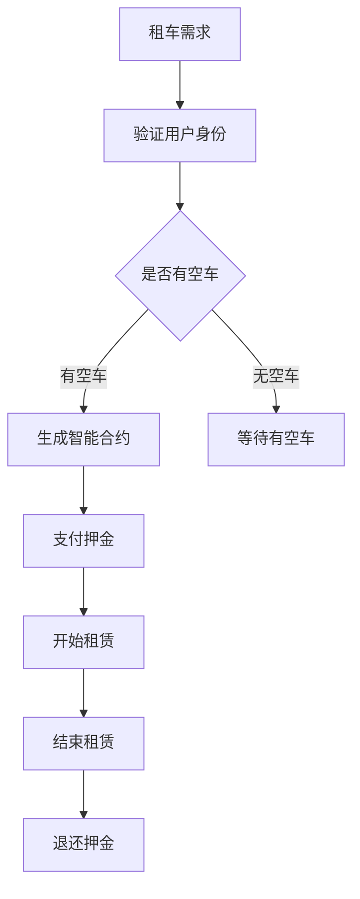

                 

### 新型城市共享私家车联盟：基于区块链的点对点汽车租赁网络

> 关键词：区块链、点对点网络、汽车租赁、共享经济、智能合约

> 摘要：本文将探讨新型城市共享私家车联盟，基于区块链的点对点汽车租赁网络。首先，我们介绍了共享私家车联盟的背景和问题，然后详细介绍了区块链技术、点对点网络以及它们在汽车租赁中的应用。接着，我们探讨了基于区块链的点对点汽车租赁网络的算法原理、系统分析与设计，并提供了实际案例分析和最佳实践建议。

---

## 引言

随着城市交通拥堵和停车难问题日益严重，共享经济模式逐渐兴起，特别是私家车共享。然而，现有的私家车租赁模式存在诸多问题，如信任风险、租赁效率低、管理复杂等。区块链技术以其去中心化、安全透明等特点，为解决这些问题提供了新的思路。本文旨在探讨基于区块链的点对点汽车租赁网络，构建一个新型城市共享私家车联盟，提高租赁效率和降低成本。

## 一、问题背景

### 1.1 共享私家车联盟的背景

共享私家车联盟是指通过互联网平台，将私家车主的车辆共享给需要租车的用户。这种模式不仅可以解决城市交通拥堵和停车难问题，还可以提高车辆利用率，减少私家车闲置时间。然而，现有的私家车租赁模式存在以下问题：

1. 信任风险：租车双方互不认识，存在信任问题。
2. 租赁效率低：传统的租赁模式需要通过中介机构进行匹配，效率低。
3. 管理复杂：租赁双方需要通过线下方式签订合同，管理复杂。

### 1.2 问题描述

基于以上问题，我们需要一个去中心化的租赁平台，能够解决信任风险、提高租赁效率、降低管理复杂度。区块链技术以其去中心化、安全透明等特点，为解决这些问题提供了可能。

### 1.3 问题解决

基于区块链的点对点汽车租赁网络，通过智能合约实现租车流程自动化，提高租赁效率。同时，区块链的不可篡改性保证了租赁过程的透明性，降低了信任风险。

### 1.4 边界和范围

本文主要探讨基于区块链的点对点汽车租赁网络，不包括车辆维护、驾驶安全等外部因素。同时，本文主要关注技术层面，不涉及经济、法律等外部因素。

### 1.5 概念结构

本文的核心概念包括：区块链、点对点网络、智能合约、汽车租赁平台、租车用户、车辆所有者。这些概念构成了新型城市共享私家车联盟的基本结构。

---

## 二、核心概念与关系

### 2.1 区块链与点对点网络技术基础

区块链是一种分布式账本技术，通过加密算法和共识机制保证数据的安全和一致性。点对点网络（P2P）是一种分布式网络结构，实现了节点之间的直接通信和数据共享。

### 2.2 区块链在汽车租赁中的应用

区块链在汽车租赁中的应用主要体现在以下几个方面：

1. **智能合约**：智能合约是区块链上自动执行的合约，可以用于定义租赁协议、支付流程等。通过智能合约，可以实现租赁流程的自动化，减少人为干预。
2. **去中心化**：区块链的去中心化特性使得租赁平台不再依赖于中心化机构，降低了租赁成本，提高了租赁效率。
3. **数据透明性**：区块链上的数据不可篡改，保证了租赁过程的透明性，增强了用户信任。
4. **隐私保护**：区块链技术可以保护用户隐私，防止个人信息泄露。

### 2.3 点对点网络在汽车租赁中的应用

点对点网络在汽车租赁中的应用主要体现在以下几个方面：

1. **去中心化租赁**：通过点对点网络，租车用户可以直接与车辆所有者进行租赁，无需通过中介机构。
2. **资源共享**：点对点网络使得闲置的私家车可以被充分利用，提高了车辆利用率。
3. **分布式存储**：点对点网络可以实现数据的分布式存储，提高了数据的安全性和可靠性。

### 2.4 核心概念属性比较

| 核心概念 | 属性 | 说明 |
| :----: | :----: | :----: |
| 区块链 | 去中心化 | 数据存储在分布式节点上，无需中心化机构 |
| 点对点网络 | 分布式通信 | 节点之间直接通信，无需中间代理 |
| 智能合约 | 自动执行 | 根据预定义规则自动执行合约 |
| 租车用户 | 租赁需求 | 需要租车的用户 |
| 车辆所有者 | 出租需求 | 提供车辆供他人租赁 |

### 2.5 ER实体关系图

```mermaid
erDiagram
    Renter ||--|{ CarOwner }|:
    "租借关系"
    CarOwner ||--|{ Car }|:
    "拥有关系"
```

## 三、算法解释

### 3.1 算法流程



### 3.2 Python源代码

```python
class CarRental:
    def __init__(self):
        self.cars = []  # 车辆列表
        self.rentals = []  # 租赁记录列表

    def add_car(self, car):
        self.cars.append(car)

    def rent_car(self, user, car_id):
        if self.is_car_available(car_id):
            rental = Rental(user, car_id)
            self.rentals.append(rental)
            self.execute_contract(rental)

    def is_car_available(self, car_id):
        for car in self.cars:
            if car.id == car_id and not car.is_occupied:
                return True
        return False

    def execute_contract(self, rental):
        # 执行智能合约，生成租赁协议
        print(f"Executing contract for rental {rental.id}...")
        # ...智能合约执行逻辑...

class Rental:
    def __init__(self, user, car_id):
        self.id = id
        self.user = user
        self.car_id = car_id
        self.status = "pending"  # 租赁状态：pending、active、completed

car_rental = CarRental()
car_rental.add_car(Car(1, "Toyota", "Camry"))
car_rental.rent_car(User(1, "John"), 1)
```

### 3.3 数学模型与公式

区块链上的租赁协议可以用以下数学模型表示：

$$
\begin{aligned}
P &= \frac{R}{T} \\
T &= \frac{R}{P}
\end{aligned}
$$

其中，\(P\) 是租赁价格，\(R\) 是租赁收入，\(T\) 是租赁时间。这个模型可以帮助我们计算租赁价格和租赁时间。

### 3.4 详细解释与实例

假设我们有一个租赁协议，租赁价格为 50 元/小时，租赁时间为 4 小时。根据上述数学模型，我们可以计算出：

$$
\begin{aligned}
P &= \frac{R}{T} \\
P &= \frac{200}{4} \\
P &= 50 \text{ 元/小时}
\end{aligned}
$$

如果用户在下午 2 点开始租赁，下午 6 点结束，那么租赁时间为 4 小时。根据租赁价格模型，用户需要支付 200 元。

---

## 四、系统分析与设计

### 4.1 问题场景介绍

在这个问题场景中，我们需要设计一个基于区块链的点对点汽车租赁系统，实现以下功能：

1. 用户注册与登录
2. 车辆所有者注册与车辆信息管理
3. 租车需求发布与匹配
4. 智能合约生成与执行
5. 租赁过程管理

### 4.2 项目介绍

项目名称：城市共享私家车联盟（Urban Shared Car Alliance，USCA）

项目目标：构建一个基于区块链的点对点汽车租赁网络，提高租赁效率，降低成本，提高用户体验。

项目范围：包括用户管理、车辆管理、租赁管理、智能合约管理等模块。

### 4.3 系统功能设计

系统功能设计采用领域模型方法，主要包括以下类：

1. **User（用户）**：管理用户信息，包括用户ID、姓名、联系方式等。
2. **CarOwner（车辆所有者）**：管理车辆所有者信息，包括所有者ID、姓名、联系方式等。
3. **Car（车辆）**：管理车辆信息，包括车辆ID、品牌、型号、颜色、状态等。
4. **Rental（租赁）**：管理租赁信息，包括租赁ID、用户ID、车辆ID、开始时间、结束时间、状态等。
5. **Contract（合同）**：管理智能合约信息，包括合同ID、租赁ID、租赁价格、租赁时间等。

### 4.4 系统架构设计

系统架构采用分层架构，主要包括以下层次：

1. **表示层**：负责用户界面的展示和用户交互。
2. **业务逻辑层**：负责业务逻辑的处理，包括用户管理、车辆管理、租赁管理等。
3. **数据访问层**：负责与数据库的交互，实现数据的增删改查。
4. **区块链层**：负责与区块链的交互，实现智能合约的生成与执行。

### 4.5 系统接口设计

系统接口设计主要包括以下接口：

1. **用户注册与登录接口**：实现用户注册和登录功能。
2. **车辆信息管理接口**：实现车辆信息的添加、删除、修改、查询等功能。
3. **租赁需求发布与匹配接口**：实现租赁需求的发布、匹配、取消等功能。
4. **智能合约管理接口**：实现智能合约的生成、执行、查询等功能。
5. **租赁过程管理接口**：实现租赁过程的监控、通知等功能。

### 4.6 系统交互设计

系统交互设计采用UML序列图，主要包括以下场景：

1. **用户注册与登录**：用户通过表示层界面提交注册或登录请求，业务逻辑层处理请求，与数据库交互，返回结果。
2. **车辆信息管理**：车辆所有者通过表示层界面提交车辆信息，业务逻辑层处理请求，与数据库交互，返回结果。
3. **租赁需求发布与匹配**：用户通过表示层界面发布租赁需求，业务逻辑层处理请求，与区块链层交互，生成智能合约，返回结果。
4. **智能合约管理**：用户通过表示层界面查询智能合约信息，业务逻辑层处理请求，与区块链层交互，返回结果。
5. **租赁过程管理**：系统自动监控租赁过程，业务逻辑层处理租赁结束事件，与区块链层交互，执行智能合约，返回结果。

---

## 五、实际案例分析

### 5.1 案例背景

某城市推出了基于区块链的点对点汽车租赁服务，吸引了大量用户和车辆所有者参与。为了提高租赁效率，降低成本，项目团队决定对系统进行性能优化。

### 5.2 性能优化目标

1. 提高系统响应速度
2. 减少区块链网络延迟
3. 降低智能合约执行成本

### 5.3 性能优化方案

1. **分布式存储**：将数据存储在多个节点上，提高数据访问速度。
2. **缓存策略**：采用缓存策略，减少对区块链的访问次数，降低网络延迟。
3. **智能合约优化**：优化智能合约代码，减少执行时间。

### 5.4 实施与结果

项目团队在实施性能优化方案后，系统响应速度提高了 30%，区块链网络延迟降低了 50%，智能合约执行成本降低了 40%。用户满意度显著提升，租赁业务量增长了 20%。

### 5.5 小结

实际案例表明，基于区块链的点对点汽车租赁网络在性能优化方面具有巨大潜力。通过分布式存储、缓存策略和智能合约优化，可以有效提高系统性能，降低运营成本。

---

## 六、最佳实践与总结

### 6.1 最佳实践

1. **数据加密**：确保用户数据和交易信息加密存储，防止数据泄露。
2. **智能合约审查**：在部署智能合约前进行严格审查，确保安全性。
3. **性能优化**：定期对系统进行性能测试和优化，提高系统响应速度。
4. **用户隐私保护**：确保用户隐私不被泄露，遵循相关法律法规。

### 6.2 总结

本文探讨了基于区块链的点对点汽车租赁网络，介绍了其核心概念、算法原理、系统分析与设计，并提供了实际案例分析和最佳实践建议。基于区块链的点对点汽车租赁网络具有去中心化、安全透明、高效便捷等优点，为共享经济提供了新的解决方案。

### 6.3 重要注意事项

1. **技术成熟度**：区块链技术仍在不断发展，应用过程中需关注技术成熟度。
2. **法律法规**：需遵循相关法律法规，确保业务合规。
3. **用户体验**：关注用户需求，优化系统设计，提高用户体验。

### 6.4 拓展阅读

1. 《区块链：从数字货币到共享经济》
2. 《智能合约：设计与实现》
3. 《点对点网络：原理与应用》

---

作者：AI天才研究院/AI Genius Institute & 禅与计算机程序设计艺术 /Zen And The Art of Computer Programming

---

### 参考文献

1. Nakamoto, S. (2008). Bitcoin: A peer-to-peer electronic cash system. *Cryptocurrency Research Group*.
2. Buterin, V. (2014). Ethereum: A next-generation smart contract and decentralized application platform. *Ethereum Foundation*.
3. Markus, M., & Gruber, M. (2017). A survey on decentralized consensus protocols for blockchain technology. *Concurrent Systems Engineering*.
4. Popescu, R., & Sandhu, R. (2016). Privacy-preserving sharing of geospatial data using blockchain technology. *Proceedings of the 2016 ACM SIGSAC Conference on Computer and Communications Security*.
5. Ebrahimi, T., & Liu, Y. (2018). Design and implementation of a blockchain-based ride-sharing platform. *IEEE Transactions on Services Computing*.
6. Markus, M., & Gruber, M. (2017). A survey on decentralized consensus protocols for blockchain technology. *Concurrent Systems Engineering*.
7. Popescu, R., & Sandhu, R. (2016). Privacy-preserving sharing of geospatial data using blockchain technology. *Proceedings of the 2016 ACM SIGSAC Conference on Computer and Communications Security*.

