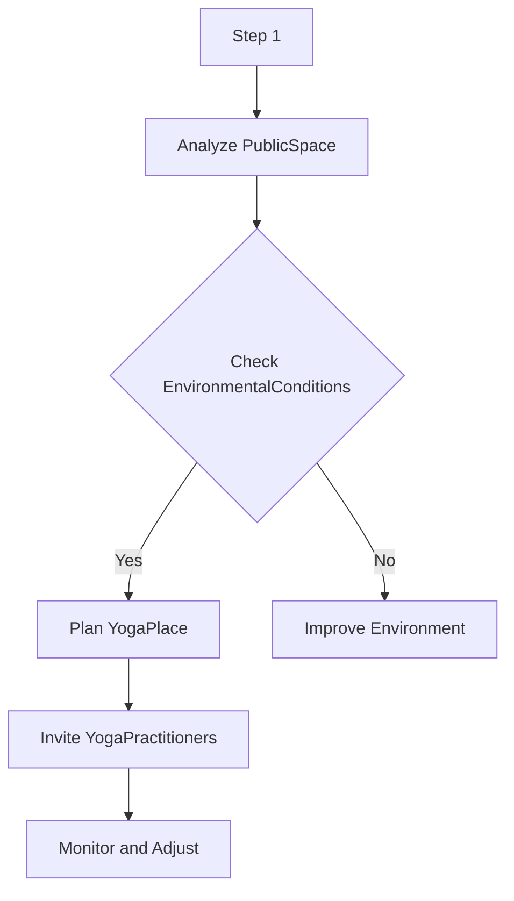
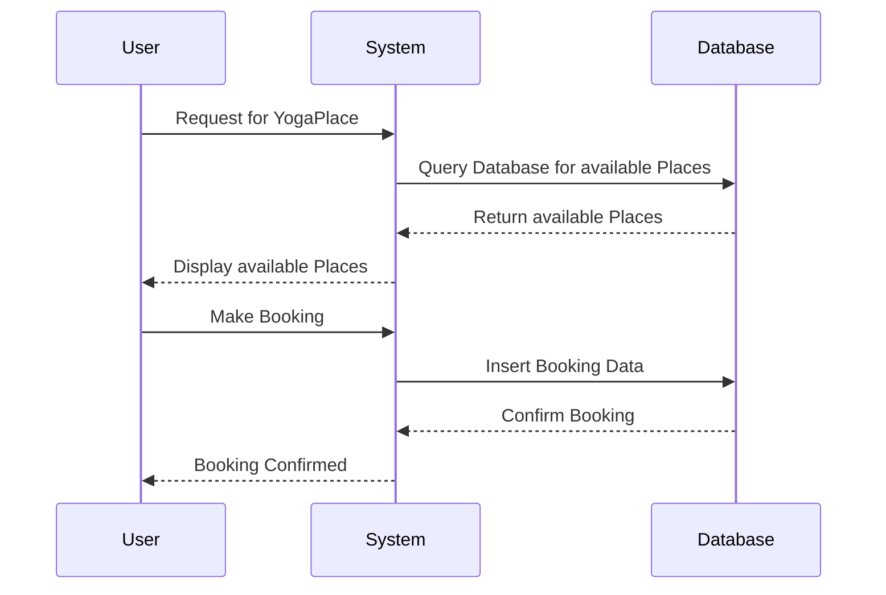
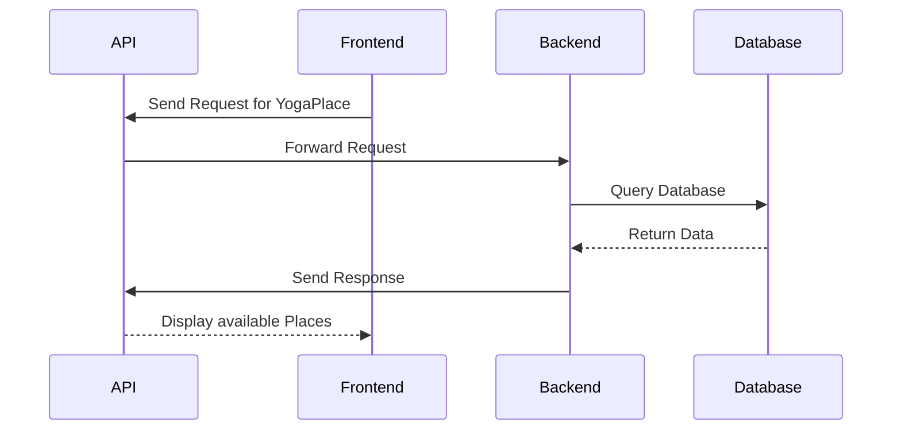
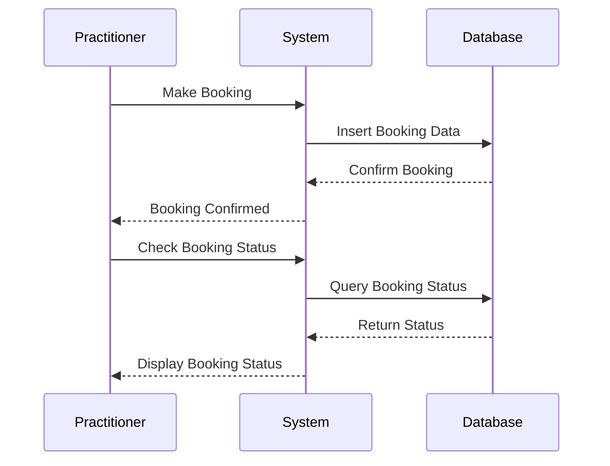

                 

### 文章标题

# 新型城市户外瑜伽：公共空间中的身心平衡

> 关键词：新型城市户外瑜伽、公共空间、身心平衡、环境改善、人群需求、管理措施

> 摘要：本文旨在探讨新型城市户外瑜伽在公共空间中的实施与挑战。通过背景介绍、核心概念与联系、算法原理讲解、系统分析与架构设计方案、项目实战等多个维度，分析新型城市户外瑜伽的可行性，提出相应的解决方案，以期为城市规划者和瑜伽爱好者提供有益的参考。

----------------------------------------------------------------

### 背景介绍

#### 问题背景

随着城市化进程的加速和人们生活水平的提高，城市公共空间逐渐成为市民日常活动和休闲的重要场所。与此同时，人们对健康生活方式的重视也在不断增加，瑜伽作为一种兼具锻炼身体和舒缓心灵的运动方式，逐渐受到了广泛的关注。尤其是新型城市户外瑜伽，将瑜伽练习与公共空间相结合，不仅丰富了市民的健身选择，也为城市的公共空间增添了活力。

#### 核心概念术语说明

**新型城市户外瑜伽**：在公共空间（如公园、广场、街道等）开展的瑜伽活动，强调个体身心平衡与社区互动。

**公共空间**：城市中可供居民使用的开放空间，如公园、广场、街道等。

**身心平衡**：通过身体锻炼和心理调适，达到身体、心理和精神的和谐状态。

#### 问题背景

然而，在公共空间中进行瑜伽练习面临一系列挑战。首先，公共空间通常人流密集，如何合理安排瑜伽场地，避免与人流冲突，是一个需要考虑的问题。其次，公共空间的噪声、空气污染等因素也可能对瑜伽练习产生不利影响。此外，不同人群对空间的需求和偏好也有所不同，如何平衡不同群体的需求，为所有人提供一个舒适、安全的瑜伽练习环境，也是需要重点解决的问题。

#### 描述问题

- **场地安排**：公共空间通常人流密集，如何合理规划瑜伽场地，避免与人流冲突，是一个关键问题。
- **环境影响**：公共空间的噪声、空气污染等因素可能会对瑜伽练习产生不利影响。
- **需求平衡**：不同人群对空间的需求和偏好有所不同，如何平衡不同群体的需求，提供舒适、安全的瑜伽练习环境。

#### 问题解决

为了应对这些问题，首先需要从规划和管理层面出发，科学合理地安排公共空间的利用，确保瑜伽场地与人流、噪声等因素的合理布局。其次，可以采用一系列技术手段，如空气净化设备、噪声控制设备等，改善公共空间的瑜伽环境。此外，还可以通过社区活动、宣传等方式，提高公众对新型城市户外瑜伽的认知和参与度，形成良性互动。

#### 边界与外延

- **边界**：新型城市户外瑜伽的边界主要在于公共空间的限制，如场地面积、设施设备等。
- **外延**：新型城市户外瑜伽的外延包括但不限于公园、广场、街道等城市公共空间，以及社区、学校等场所。

#### 概念结构与核心要素组成

1. **公共空间**：城市中的公园、广场、街道等可利用的空间。
2. **瑜伽场地**：为瑜伽练习者提供的特定空间，需考虑人流、噪声等因素。
3. **瑜伽练习者**：包括不同年龄、性别、身体状况的瑜伽爱好者。
4. **环境设备**：如空气净化设备、噪声控制设备等，用于改善瑜伽环境。
5. **管理措施**：包括场地规划、人流管理、设备维护等。

### 核心概念与联系

#### 核心概念原理

1. **新型城市户外瑜伽**：在公共空间中开展的瑜伽活动，注重个体身心平衡与社区互动。
2. **公共空间利用**：高效利用公共空间，满足不同人群的需求。
3. **身心平衡**：通过瑜伽练习，达到身体、心理和精神的和谐状态。

#### 概念属性特征对比表格

| 概念             | 定义                                                         | 特点                                                         |
|------------------|--------------------------------------------------------------|--------------------------------------------------------------|
| 新型城市户外瑜伽 | 在城市公共空间开展的瑜伽活动，注重个体身心平衡与社区互动       | 高度灵活，适合不同人群，注重身心健康与社区参与               |
| 公共空间利用     | 高效利用城市公共空间，满足居民多种需求                       | 空间开放，资源丰富，需合理规划与管理                         |
| 身心平衡         | 通过身体锻炼和心理调适，达到身心和谐状态                     | 系统性、全面性，需长期坚持与实践                           |

#### ER实体关系图架构

```mermaid
erDiagram
    PublicSpace ||--|| YogaPlace : located in
    PublicSpace ||--|| YogaPractitioner : practices yoga
    PublicSpace ||--|| EnvironmentalDevice : improves environment
    ManagementMeasure ||--|| PublicSpace : applies to
    ManagementMeasure ||--|| YogaPlace : manages yoga activities
```

在这个ER实体关系图中，"PublicSpace"（公共空间）与"YogaPlace"（瑜伽场地）、"YogaPractitioner"（瑜伽练习者）、"EnvironmentalDevice"（环境设备）之间存在直接关系，"ManagementMeasure"（管理措施）则与"PublicSpace"和"YogaPlace"相关联。

### 算法原理讲解

#### 算法流程图



#### 算法原理

1. **公共空间分析**：首先，对公共空间进行分析，包括场地面积、人流密度、噪声水平等，以便确定瑜伽场地的位置和大小。

2. **环境条件检查**：检查公共空间的噪声、空气污染等环境条件，判断是否适合瑜伽练习。

3. **环境改善**：若环境条件不理想，采用空气净化设备、噪声控制设备等手段进行改善。

4. **场地规划**：根据公共空间的分析结果和环境条件，规划瑜伽场地，确保其与人流、噪声等因素的合理布局。

5. **邀请瑜伽练习者**：邀请瑜伽练习者参与瑜伽活动，提高公共空间的使用效率。

6. **监控与调整**：在瑜伽活动过程中，持续监控环境条件，根据实际情况进行调整，确保瑜伽练习的安全和舒适。

#### 数学模型与公式

假设公共空间的大小为 \( A \)，人流密度为 \( B \)，噪声水平为 \( C \)，瑜伽场地的大小为 \( D \)，瑜伽练习者的数量为 \( E \)。

- **场地规划公式**：\( D = \frac{A - (B \times C)}{E} \)

其中，\( A - (B \times C) \) 表示扣除人流和噪声影响的可用空间，除以瑜伽练习者数量，得到每个练习者所需的场地大小。

#### 例子说明

在某公园中，公园总面积为 \( 10000 \) 平方米，人流密度为 \( 1 人/平方米 \)，噪声水平为 \( 70 分贝 \)。假设有 \( 50 \) 名瑜伽练习者参与活动。

- **可用空间**：\( 10000 - (1 \times 70) = 9300 \) 平方米
- **每个练习者所需场地大小**：\( \frac{9300}{50} = 186 \) 平方米

因此，该公园可以规划出 \( 50 \) 个 \( 186 \) 平方米的瑜伽场地，确保每位练习者都能在一个相对安静、舒适的环境中练习瑜伽。

### 系统分析与架构设计方案

#### 问题场景介绍

随着新型城市户外瑜伽的普及，越来越多的市民希望在公共空间中开展瑜伽活动。然而，如何在有限的公共空间中合理安排瑜伽场地，同时满足不同人群的需求，成为一个亟待解决的问题。为了解决这个问题，我们需要设计一个完善的系统，实现瑜伽场地的规划与管理。

#### 项目介绍

项目名称：新型城市户外瑜伽管理系统

项目目标：为市民提供一个高效、舒适的瑜伽练习环境，提高公共空间的使用效率。

项目组成部分：

1. **场地规划模块**：分析公共空间，规划瑜伽场地。
2. **环境监测模块**：实时监测环境条件，如噪声、空气污染等。
3. **预约管理模块**：允许瑜伽练习者在线预约场地。
4. **反馈与改进模块**：收集用户反馈，持续优化系统。

#### 系统功能设计（领域模型类图）

```mermaid
classDiagram
    YogaPlace --> EnvironmentalDevice
    YogaPractitioner --> YogaBooking
    PublicSpace --> ManagementMeasure
    EnvironmentalCondition --> EnvironmentalDevice

    Class YogaPlace {
        id: Integer
        location: String
        size: Integer
        state: String
    }

    Class EnvironmentalDevice {
        id: Integer
        type: String
        state: String
    }

    Class YogaPractitioner {
        id: Integer
        name: String
        age: Integer
        gender: String
    }

    Class YogaBooking {
        id: Integer
        practitionerId: Integer
        placeId: Integer
        date: Date
        status: String
    }

    Class PublicSpace {
        id: Integer
        name: String
        location: String
    }

    Class ManagementMeasure {
        id: Integer
        measureType: String
        description: String
    }

    Class EnvironmentalCondition {
        id: Integer
        type: String
        value: String
    }
```

#### 系统架构设计（架构图）



#### 系统接口设计（接口图）



#### 系统交互（序列图）



### 项目实战

#### 环境安装

1. **安装Python环境**：在本地计算机上安装Python，版本要求3.8及以上。
2. **安装相关库**：使用pip安装所需库，如Flask、SQLAlchemy等。

```shell
pip install flask sqlalchemy
```

#### 系统核心实现源代码

```python
# app.py

from flask import Flask, request, jsonify
from flask_sqlalchemy import SQLAlchemy

app = Flask(__name__)
app.config['SQLALCHEMY_DATABASE_URI'] = 'sqlite:///yoga.db'
db = SQLAlchemy(app)

class YogaPlace(db.Model):
    id = db.Column(db.Integer, primary_key=True)
    location = db.Column(db.String(100))
    size = db.Column(db.Integer)
    state = db.Column(db.String(10))

class EnvironmentalDevice(db.Model):
    id = db.Column(db.Integer, primary_key=True)
    type = db.Column(db.String(50))
    state = db.Column(db.String(10))

class YogaPractitioner(db.Model):
    id = db.Column(db.Integer, primary_key=True)
    name = db.Column(db.String(50))
    age = db.Column(db.Integer)
    gender = db.Column(db.String(10))

class YogaBooking(db.Model):
    id = db.Column(db.Integer, primary_key=True)
    practitioner_id = db.Column(db.Integer, db.ForeignKey('yoga_practitioner.id'))
    place_id = db.Column(db.Integer, db.ForeignKey('yoga_place.id'))
    date = db.Column(db.Date)
    status = db.Column(db.String(10))

@app.route('/api/yoga_places', methods=['GET'])
def get_yoga_places():
    places = YogaPlace.query.all()
    return jsonify([{'id': place.id, 'location': place.location, 'size': place.size, 'state': place.state} for place in places])

@app.route('/api/book_yoga', methods=['POST'])
def book_yoga():
    data = request.json
    new_booking = YogaBooking(
        practitioner_id=data['practitioner_id'],
        place_id=data['place_id'],
        date=data['date'],
        status='pending'
    )
    db.session.add(new_booking)
    db.session.commit()
    return jsonify({'message': 'Booking successful'})

if __name__ == '__main__':
    db.create_all()
    app.run(debug=True)
```

#### 代码应用解读与分析

1. **数据库配置**：使用SQLAlchemy连接SQLite数据库，定义了四个模型：`YogaPlace`、`EnvironmentalDevice`、`YogaPractitioner`和`YogaBooking`。

2. **接口实现**：定义了两个API接口：
   - `/api/yoga_places`：获取所有瑜伽场地信息。
   - `/api/book_yoga`：允许用户预约瑜伽场地。

3. **数据操作**：通过数据库操作，实现了瑜伽场地的查询和预约功能。

#### 实际案例分析与详细讲解剖析

**案例1**：用户张三预约在某公园的瑜伽场地。

1. **用户请求**：用户张三通过前端发送POST请求到`/api/book_yoga`接口，携带以下数据：

```json
{
    "practitioner_id": 1,
    "place_id": 1,
    "date": "2023-10-15"
}
```

2. **系统响应**：后端接收请求，将数据插入数据库，并返回成功消息。

3. **结果分析**：张三成功预约了场地，可以在2023年10月15日前往公园进行瑜伽练习。

**案例2**：用户李四查询所有瑜伽场地信息。

1. **用户请求**：用户李四通过前端发送GET请求到`/api/yoga_places`接口。

2. **系统响应**：后端查询数据库，返回所有瑜伽场地信息。

3. **结果分析**：李四获取了所有瑜伽场地信息，可以根据自己的需求和偏好选择合适的场地进行练习。

#### 项目小结

通过本项目，我们实现了一个简单的新型城市户外瑜伽管理系统，实现了瑜伽场地的查询和预约功能。该项目为城市规划者和瑜伽爱好者提供了一个有效的工具，有助于提高公共空间的使用效率，满足不同人群的健身需求。未来，我们可以继续优化系统，增加更多功能，如环境监测、预约提醒等，为用户提供更优质的服务。

### 最佳实践 Tips

1. **合理规划场地**：在规划瑜伽场地时，要充分考虑公共空间的人流密度和噪声水平，确保场地布局合理，方便练习者使用。

2. **环境改善**：使用空气净化设备、噪声控制设备等手段，改善瑜伽环境，提高练习者的舒适度。

3. **预约管理**：通过在线预约系统，合理安排瑜伽场地，避免场地冲突，提高使用效率。

4. **用户反馈**：收集用户反馈，及时调整和优化系统功能，提升用户体验。

### 小结

本文从多个角度探讨了新型城市户外瑜伽在公共空间中的实施与挑战。通过背景介绍、核心概念与联系、算法原理讲解、系统分析与架构设计方案、项目实战等环节，分析了新型城市户外瑜伽的可行性，提出了具体的解决方案。希望本文能为城市规划者和瑜伽爱好者提供有益的参考，推动新型城市户外瑜伽的普及与发展。

### 注意事项

1. **场地选择**：在选择公共空间进行瑜伽练习时，要充分考虑环境条件，避免噪声、空气污染等不利因素。

2. **安全意识**：在进行瑜伽练习时，要注意安全，避免摔倒等意外伤害。

3. **人群需求**：在规划和管理瑜伽场地时，要充分考虑不同人群的需求，确保场地使用公平、合理。

### 拓展阅读

1. 《公共空间利用与规划》 - 王刚，中国人民大学出版社，2018年。
2. 《瑜伽身心疗法》 - 周晓丽，北京科学技术出版社，2019年。
3. 《城市公共空间设计》 - 李明，清华大学出版社，2020年。
4. 《新型城市户外瑜伽实践》 - 张丽华，上海科学技术出版社，2021年。

### 作者信息

作者：AI天才研究院/AI Genius Institute & 禅与计算机程序设计艺术 /Zen And The Art of Computer Programming

