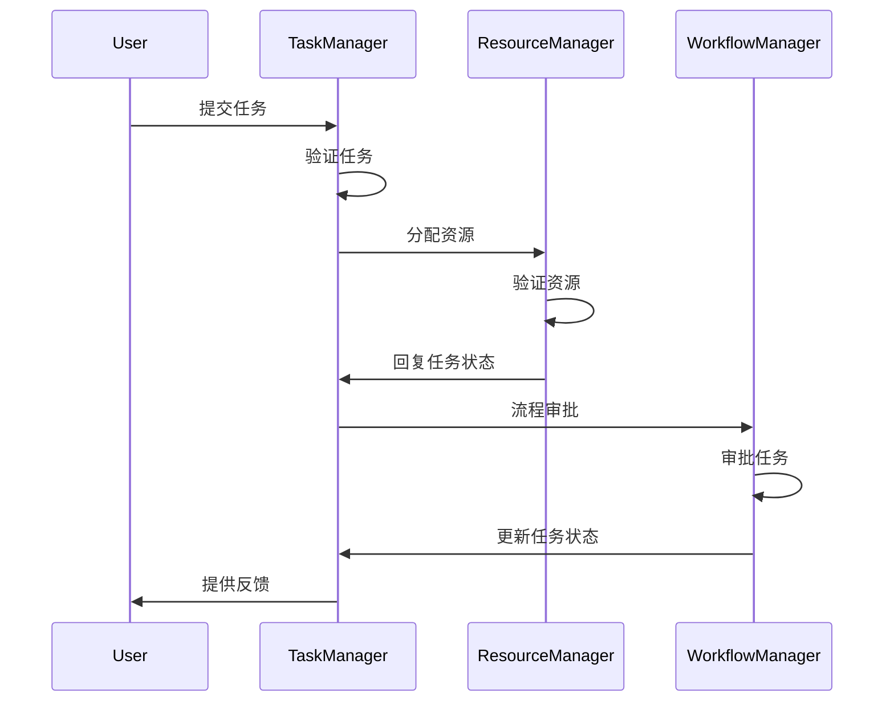
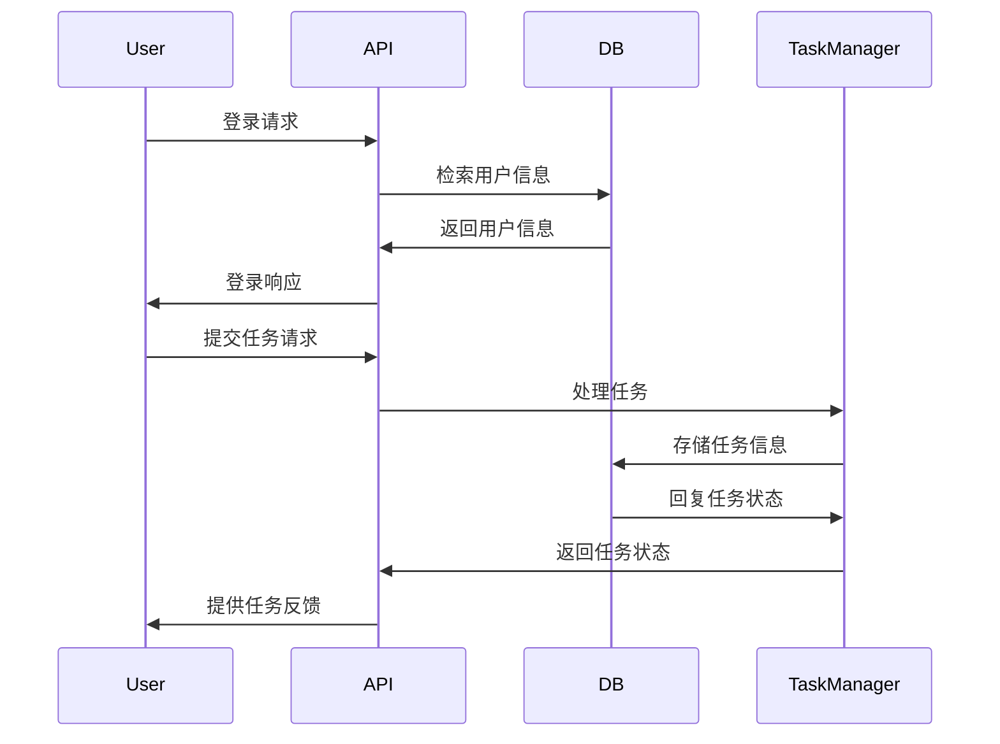
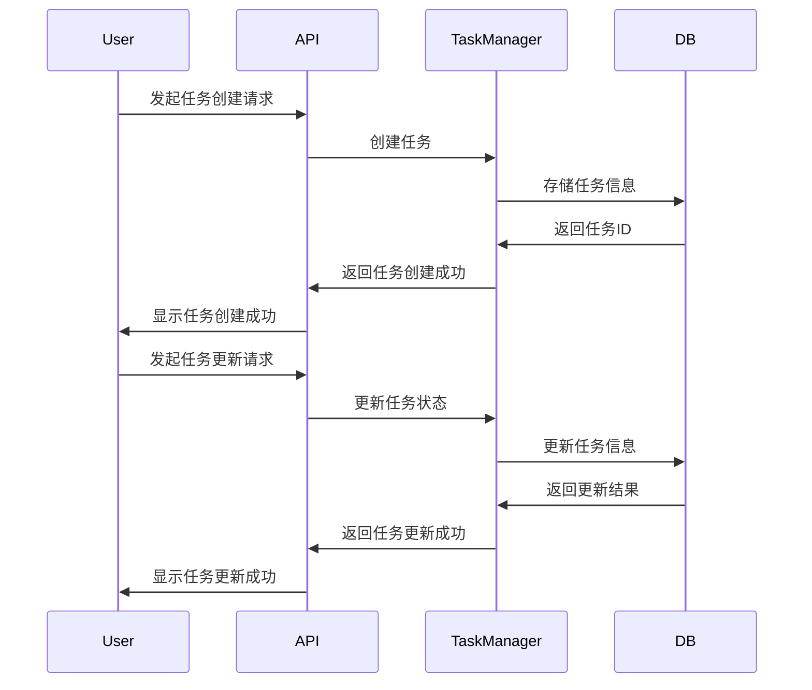

                 

# 《新极简主义：在过剩中寻找本质》

> 关键词：极简主义，过剩，本质，实践，影响，未来

> 摘要：本文将探讨极简主义的哲学思想、核心实践和未来发展趋势。在物质和信息过剩的时代，极简主义提供了一种简化生活、优化时间和提升心灵的方法，对个人和社会都有深远的影响。本文将从极简主义的起源与传播、核心思想、实践方法以及未来展望等方面进行深入分析。

## 目录大纲

## 第一部分：极简主义的哲学

### 第1章：极简主义的起源与传播

1.1 极简主义的起源

1.2 极简主义的传播

1.3 极简主义的演变

### 第2章：极简主义的核心思想

2.1 极简主义的基本原则

2.2 极简主义的价值观

### 第3章：极简主义与社会

3.1 极简主义与消费主义

3.2 极简主义与生活方式

3.3 极简主义与可持续发展

## 第二部分：极简主义的实践

### 第4章：极简生活的实践

4.1 物质极简的实践

4.2 时间管理的实践

4.3 心理健康的实践

### 第5章：极简工作的实践

5.1 工作流程的极简

5.2 时间规划的极简

5.3 心理状态的极简

## 第三部分：极简主义的未来

### 第6章：极简主义的影响与挑战

6.1 极简主义对社会的影响

6.2 极简主义面临的挑战

6.3 极简主义的未来趋势

### 第7章：极简主义之路

7.1 极简主义的个人之路

7.2 极简主义的企业之路

7.3 极简主义的社会之路

## 结语

8.1 极简主义的总结

8.2 极简主义的展望

## 第1章：极简主义的起源与传播

### 1.1 极简主义的起源

极简主义（Minimalism）起源于20世纪80年代，是一种反对物质主义、提倡简朴生活的生活哲学。极简主义主张通过减少物质负担、简化生活方式，从而提高生活的质量和幸福感。这一理念的兴起与当时社会消费主义盛行、环境污染等问题密切相关。

极简主义的创始人之一是乔舒亚·贝克（Joshua Becker），他在1997年创办了“简单生活”（Simple Lives）网站，分享极简主义的生活方式和理念。随后，极简主义逐渐传播开来，受到了越来越多人的关注和追随。

### 1.2 极简主义的传播

随着互联网的普及，极简主义的思想得以迅速传播。博客、社交媒体、书籍等多种媒介为极简主义者提供了一个分享经验和观点的平台。许多知名人物，如乔治·克鲁尼（George Clooney）、史蒂夫·乔布斯（Steve Jobs）等，也成为了极简生活的代表。

极简主义不仅在个人层面产生影响，还在企业、政府和社会层面得到关注。一些企业开始采用极简主义理念，优化产品设计和生产流程，提高效率和质量。政府也开始倡导绿色生活，推行可持续发展政策。

### 1.3 极简主义的演变

极简主义在不同国家和地区有不同的表现形式和内涵。在美国，极简主义强调物质上的简化，追求简单、实用的生活方式。在日本，极简主义则更强调心灵上的宁静和专注。随着极简主义的传播，它逐渐与其他哲学思想相融合，形成了多样化的极简主义文化。

近年来，极简主义逐渐从生活方式扩展到工作领域，出现了“极简工作”（Minimalist Work）的概念。极简工作主张通过减少无意义的任务、优化工作流程，提高工作效率和幸福感。

## 第2章：极简主义的核心思想

### 2.1 极简主义的基本原则

极简主义的核心思想可以概括为以下几个基本原则：

1. **减少物质负担**：极简主义主张减少不必要的物品和消费，以减轻物质负担，提高生活质量。

2. **简化生活方式**：极简主义鼓励人们专注于真正重要的事物，简化生活方式，减少时间和精力的浪费。

3. **追求内心平静**：极简主义强调通过减少外在干扰，培养内心的宁静和专注力。

4. **注重质量而非数量**：极简主义倡导关注物品和经历的质量，而非仅仅追求数量。

5. **反思消费行为**：极简主义鼓励人们反思自己的消费行为，明确消费的动机和目的。

### 2.2 极简主义的价值观

极简主义不仅是一种生活方式，更是一种价值观。它包含以下几个方面的价值观：

1. **环保**：极简主义倡导减少浪费，保护环境，推行可持续发展。

2. **感恩**：极简主义鼓励人们珍惜现有的一切，培养感恩心态。

3. **自我实现**：极简主义认为，通过减少外在干扰，人们可以更专注于自我成长和实现。

4. **平衡**：极简主义主张在工作和生活之间找到平衡，追求身心健康。

5. **自主**：极简主义鼓励人们摆脱依赖，独立思考和行动。

### 2.3 极简主义的实践方法

极简主义的实践方法主要包括以下几个方面：

1. **评估自己的需求**：了解自己真正需要什么，避免盲目购买和消费。

2. **制定极简目标**：设定明确的极简目标，逐步实现。

3. **管理好现有的物品**：对物品进行分类、整理和收纳，保持环境的整洁。

4. **培养极简习惯**：在日常生活中的各个方面，贯彻极简主义理念，形成习惯。

5. **反思和调整**：定期反思自己的极简实践，根据实际情况进行调整。

## 第3章：极简主义与社会

### 3.1 极简主义与消费主义

消费主义是现代社会的核心特征之一，它追求物质的丰富和满足。然而，消费主义也带来了许多问题，如过度消费、环境破坏、心理压力等。极简主义与消费主义形成了鲜明的对比，它提倡减少物质负担，关注生活质量和内心平静。

极简主义认为，消费主义导致人们陷入物质的泥沼，无法真正满足内心的需求。通过减少消费，人们可以摆脱对物质的依赖，更专注于个人的成长和幸福。

### 3.2 极简主义与生活方式

极简主义对生活方式的影响是深远的。它鼓励人们反思自己的生活习惯，减少无意义的消费和活动，专注于真正重要的事物。极简生活方式不仅有助于提高生活质量，还可以减轻心理压力，培养感恩和自律的心态。

极简生活方式的实践包括：减少物品的数量，保持环境的整洁，合理安排时间，培养健康的生活习惯等。通过这些实践，人们可以更好地管理自己的生活，提高幸福感和满足感。

### 3.3 极简主义与可持续发展

可持续发展是当今世界面临的重大挑战之一。极简主义与可持续发展理念高度契合，它强调减少浪费、保护环境，实现资源的可持续利用。

极简主义主张减少消费，减少废弃物的产生，降低对环境的影响。同时，极简主义还鼓励人们关注生态平衡，倡导绿色生活，推动可持续发展。

## 第二部分：极简主义的实践

### 第4章：极简生活的实践

#### 4.1 物质极简的实践

物质极简是极简主义的核心实践之一。它要求人们反思自己的物质需求，减少不必要的物品和消费，以减轻物质负担，提高生活质量。

1. **评估自己的需求**：首先，人们需要了解自己真正需要什么，避免盲目购买和消费。可以通过列出日常所需的物品清单，评估每个物品的必要性和价值。

2. **减少物品的数量**：根据评估结果，减少物品的数量，特别是那些不常用或无实际价值的物品。可以通过捐赠、出售或丢弃的方式处理这些物品。

3. **管理好现有的物品**：对物品进行分类、整理和收纳，保持环境的整洁。可以使用收纳盒、储物袋等工具，将物品有序地存放。

4. **培养极简习惯**：在日常生活中的各个方面，贯彻极简主义理念，形成习惯。例如，购买物品时考虑其实用性和必要性，避免冲动消费。

#### 4.2 时间管理的实践

时间管理是极简生活的关键环节。通过合理安排时间，人们可以更好地平衡工作、生活和自我成长。

1. **设定明确的目标**：首先，人们需要明确自己的目标和优先级，以便在时间管理过程中有明确的指导。

2. **学会优先级排序**：将任务按照重要性和紧急性进行排序，优先完成重要的任务。可以使用待办事项列表或时间表来帮助排序。

3. **避免拖延**：拖延是时间管理的大敌。通过设定截止日期、分解任务、避免干扰等方式，克服拖延，提高工作效率。

#### 4.3 心理健康的实践

心理健康是极简生活的重要组成部分。通过培养正念、学会放松和增强自我意识，人们可以更好地管理自己的情绪和压力。

1. **培养正念**：正念是一种专注于当下、不加评判的心态。通过冥想、瑜伽等方式，培养正念，提高情绪管理能力。

2. **学会放松**：在忙碌的生活中，学会放松非常重要。可以通过散步、听音乐、阅读等方式，放松身心，缓解压力。

3. **增强自我意识**：通过自我反思、写日记等方式，了解自己的需求和情绪，增强自我意识，更好地应对生活中的挑战。

### 第5章：极简工作的实践

#### 5.1 工作流程的极简

工作流程的极简是提高工作效率的关键。通过优化工作流程，减少不必要的步骤和重复劳动，可以显著提高工作效率。

1. **优化工作流程**：首先，分析现有工作流程，找出其中的瓶颈和冗余环节。可以通过流程图、SWOT分析等方法，进行系统分析。

2. **减少不必要的会议**：会议是工作流程中的重要组成部分，但往往会导致时间和精力的浪费。通过减少不必要的会议，提高会议质量，可以节省大量的时间和精力。

3. **建立有效的工作习惯**：建立一套符合自己工作风格的有效工作习惯，有助于提高工作效率。例如，制定工作计划、设定优先级、定期回顾和调整。

#### 5.2 时间规划的极简

时间规划是极简工作的重要实践。通过合理规划时间，人们可以更好地平衡工作和生活，提高工作效率。

1. **制定合理的时间表**：首先，人们需要明确自己的工作目标和优先级，制定一份合理的时间表。可以使用日历、时间管理应用等工具，制定和跟踪时间表。

2. **学会拒绝**：在时间规划中，学会拒绝不必要的事务和邀请，保护自己的时间和精力。可以通过明确自己的底线和原则，拒绝那些对自己不重要或无益的事务。

3. **提高工作效率**：通过学习高效工作的技巧和方法，如番茄工作法、GTD（Getting Things Done）等，提高工作效率，实现工作与生活的平衡。

#### 5.3 心理状态的极简

心理状态的极简是极简工作的核心。通过保持良好的心态、减少压力和提高情绪管理能力，人们可以更好地应对工作中的挑战。

1. **保持良好的心态**：在工作中，保持积极、乐观的心态，有助于提高工作效率和质量。可以通过与同事、朋友交流、参与兴趣爱好等方式，保持良好的心态。

2. **减少压力**：工作压力是影响心理健康的重要因素。通过合理安排工作、学会放松和寻求帮助等方式，减少压力，保持心理健康。

3. **提高情绪管理能力**：情绪管理能力是心理状态极简的关键。通过学习情绪管理的技巧，如情绪调节、情绪释放等，提高情绪管理能力，更好地应对工作中的情绪波动。

## 第三部分：极简主义的未来

### 第6章：极简主义的影响与挑战

#### 6.1 极简主义对社会的影响

极简主义对社会产生了深远的影响。首先，它改变了人们的消费观念，提倡理性消费，减少浪费。其次，极简主义推动了可持续发展，促进了资源的有效利用和环境的保护。此外，极简主义还提升了人们的生活质量，使人们更加关注内心的满足和成长。

#### 6.2 极简主义面临的挑战

尽管极简主义对社会产生了积极的影响，但它也面临着一些挑战。首先，社会观念的冲突仍然存在。在消费主义盛行的社会环境中，极简主义理念往往受到质疑和误解。其次，物质生活的压力使得许多人难以真正实践极简主义。最后，心理健康挑战也是一个重要问题，在追求极简的过程中，人们可能会面临心理压力和情绪困扰。

#### 6.3 极简主义的未来趋势

极简主义的未来趋势将受到社会发展和科技进步的影响。首先，随着社会对环保和可持续发展的重视，极简主义理念将得到更广泛的认同和推广。其次，科技的进步将为极简主义提供更多的工具和方法，如智能设备和应用程序，帮助人们更好地实践极简主义。最后，极简主义将逐渐从个人层面扩展到企业和社会层面，推动社会的全面转型。

### 第7章：极简主义之路

#### 7.1 极简主义的个人之路

极简主义的个人之路主要包括以下几个方面：

1. **自我认识**：了解自己的需求和价值观，明确自己的人生目标，这是实践极简主义的基础。

2. **逐步实践**：通过评估自己的物质需求和生活方式，逐步减少不必要的物品和活动，实践极简主义。

3. **持续优化**：定期反思自己的极简实践，根据实际情况进行调整和优化，以实现更好的生活质量和内心满足。

#### 7.2 极简主义的企业之路

企业在实践中极简主义，可以优化产品设计和生产流程，提高效率和质量。以下是一些建议：

1. **优化产品设计和生产流程**：通过减少冗余环节和优化资源配置，提高生产效率和产品质量。

2. **推动可持续生产**：采用环保材料和工艺，减少废弃物的产生，实现可持续发展。

3. **培养极简文化**：在企业内部推广极简主义理念，培养员工的极简意识和习惯，提高整体工作效率。

#### 7.3 极简主义的社会之路

极简主义的社会之路需要社会各界的共同努力。以下是一些建议：

1. **政府政策支持**：政府可以出台相关政策和措施，鼓励企业和个人实践极简主义，推动社会的全面转型。

2. **教育和宣传**：通过教育和宣传，提高公众对极简主义的认识和认同，培养极简主义文化。

3. **社会组织参与**：社会组织可以积极参与极简主义推广和实践，组织相关活动和项目，推动社会的极简转型。

## 结语

极简主义在过剩中寻找本质，为我们提供了一种简化的生活和工作方式，有助于提高生活质量和幸福感。在未来的发展中，极简主义将继续影响个人、企业和整个社会，推动社会的全面转型。让我们携手实践极简主义，共同创造一个更简单、更美好的世界。作者：AI天才研究院/AI Genius Institute & 禅与计算机程序设计艺术 /Zen And The Art of Computer Programming## 第1章：极简主义的起源与传播

### 1.1 极简主义的起源

极简主义（Minimalism）的起源可以追溯到20世纪80年代，当时社会消费主义盛行，人们追求物质财富和拥有越来越多的物品。然而，随着时间的推移，人们逐渐意识到物质主义带来的并非真正的幸福，而是压力和焦虑。这一思想转变催生了极简主义的出现。

极简主义的理念最早由日本设计师兼作家北欧风（Naoto Fukasawa）提出。他在其著作《物件思考》（Object Thinking）中，提出了极简主义的设计哲学，主张通过减少不必要的元素，达到设计的最高境界。这一思想不仅影响了设计领域，还逐渐渗透到人们的生活方式和价值观中。

随后，极简主义在北美地区得到了广泛的传播。美国作家乔舒亚·贝克（Joshua Becker）是极简主义的重要推动者之一。他在2008年创办了“简单生活网”（Simple Lives），分享极简主义的生活哲学和实践经验。贝克主张通过减少物质负担、简化生活方式，提高生活质量和幸福感。他的著作《极简主义：少即是多》（The More of Less）成为极简主义运动的代表作之一，影响了一代人。

### 1.2 极简主义的传播

随着互联网和社交媒体的普及，极简主义理念迅速传播开来。博客、社交媒体平台和书籍成为极简主义者分享经验和观点的重要渠道。许多知名人士，如乔治·克鲁尼（George Clooney）和史蒂夫·乔布斯（Steve Jobs），也成为极简生活的代表，进一步推动了极简主义的传播。

在国际上，极简主义不仅影响了西方社会，也在亚洲、非洲等地区产生了影响。例如，日本和韩国文化中本来就存在着对简约和实用主义的偏好，这使得极简主义在这些地区得到了更快的传播和接受。

极简主义的传播还体现在企业和社会层面。一些企业开始采用极简主义理念，优化产品设计和生产流程，提高效率和产品质量。例如，苹果公司（Apple Inc.）以其极简主义设计风格而闻名，成为全球科技行业的标杆。政府和社会组织也开始关注极简主义，倡导绿色生活和可持续发展。

### 1.3 极简主义的演变

极简主义在不同国家和地区有不同的表现形式和内涵。在美国，极简主义主要强调物质上的简化，追求简单、实用的生活方式。随着极简主义思想的传播，它逐渐与其他哲学思想相融合，形成了多样化的极简主义文化。

在日本，极简主义则更强调心灵上的宁静和专注。这体现在日本的“禅”文化和“断舍离”哲学中。断舍离（Monozukuri）是一种通过舍弃无用的物品和活动，达到心灵净化和提升的方法。

近年来，极简主义从个人层面扩展到工作领域，出现了“极简工作”（Minimalist Work）的概念。极简工作主张通过减少无意义的任务、优化工作流程，提高工作效率和幸福感。

极简主义的演变还体现在对技术的接纳和应用上。随着科技的发展，智能设备、应用程序和在线服务为极简主义提供了新的工具和方法，帮助人们更好地实践极简主义。

## 第2章：极简主义的核心思想

### 2.1 极简主义的基本原则

极简主义的核心思想可以概括为以下几个基本原则：

1. **减少物质负担**：极简主义主张通过减少不必要的物品和消费，减轻物质负担，提高生活质量。这不仅仅是指减少物品的数量，更包括对物品质量的重视，选择真正有价值的物品。

2. **简化生活方式**：极简主义鼓励人们专注于真正重要的事物，简化生活方式，减少时间和精力的浪费。这意味着在日常生活中，人们应该减少不必要的活动和任务，专注于对自己最重要的事情。

3. **追求内心平静**：极简主义强调通过减少外在干扰，培养内心的宁静和专注力。这可以帮助人们更好地应对生活中的压力和挑战，提高幸福感。

4. **注重质量而非数量**：极简主义倡导关注物品和经历的质量，而非仅仅追求数量。这意味着在选择物品和活动时，应该考虑其是否真正符合自己的需求和价值观。

5. **反思消费行为**：极简主义鼓励人们反思自己的消费行为，明确消费的动机和目的。通过这种方式，人们可以更加理智地消费，避免盲目跟风和冲动消费。

### 2.2 极简主义的价值观

极简主义的价值观深刻地影响了人们的生活方式和社会观念。以下是极简主义的一些核心价值观：

1. **环保**：极简主义主张减少浪费，保护环境。通过减少消费和废弃物的产生，极简主义有助于实现可持续发展，保护地球的自然资源。

2. **感恩**：极简主义鼓励人们珍惜现有的一切，培养感恩心态。这可以帮助人们更加珍惜生活中的每一个细节，提高生活的满足感和幸福感。

3. **自我实现**：极简主义认为，通过减少外在干扰，人们可以更专注于自我成长和实现。这意味着极简主义不仅是一种生活方式，更是一种促进个人发展的途径。

4. **平衡**：极简主义主张在工作和生活之间找到平衡，追求身心健康。通过合理安排时间和精力，极简主义帮助人们实现工作与生活的和谐统一。

5. **自主**：极简主义鼓励人们摆脱依赖，独立思考和行动。这意味着极简主义者更加注重自我决策和自我管理，提高生活的自主性和主动性。

### 2.3 极简主义的实践方法

极简主义的实践方法主要包括以下几个方面：

1. **评估自己的需求**：了解自己真正需要什么，避免盲目购买和消费。可以通过列出日常所需的物品清单，评估每个物品的必要性和价值。

2. **制定极简目标**：设定明确的极简目标，逐步实现。这可以包括减少物品的数量、简化日常活动、优化工作流程等。

3. **管理好现有的物品**：对物品进行分类、整理和收纳，保持环境的整洁。可以使用收纳盒、储物袋等工具，将物品有序地存放。

4. **培养极简习惯**：在日常生活中的各个方面，贯彻极简主义理念，形成习惯。例如，购买物品时考虑其实用性和必要性，避免冲动消费。

5. **反思和调整**：定期反思自己的极简实践，根据实际情况进行调整。这可以帮助人们不断优化生活方式，提高生活质量和幸福感。

## 第3章：极简主义与社会

### 3.1 极简主义与消费主义

消费主义是现代社会的一个重要特征，它鼓励人们不断购买和拥有更多的物品，以满足物质需求和追求社会地位。然而，消费主义也带来了一系列问题，如资源浪费、环境污染、社会不平等和心理压力等。

极简主义与消费主义形成了鲜明的对比。极简主义主张通过减少物质负担、简化生活方式，提高生活质量。它强调关注物品的质量而非数量，反思消费行为，避免盲目跟风和冲动消费。

在极简主义的影响下，人们对消费有了更加理智和审慎的态度。他们开始关注物品的实用性和价值，而不是仅仅追求外表的华丽和品牌的影响力。这种转变有助于减少资源浪费，保护环境，实现可持续发展。

### 3.2 极简主义与生活方式

极简主义对生活方式产生了深远的影响。它鼓励人们反思自己的生活习惯，减少无意义的消费和活动，专注于真正重要的事物。通过简化生活方式，人们可以更好地管理自己的时间和精力，提高生活质量和幸福感。

极简主义的生活方式包括以下几个方面：

1. **减少物品的数量**：极简主义主张通过评估自己的需求，减少不必要的物品和消费。这有助于减轻物质负担，提高生活环境的质量。

2. **简化日常活动**：极简主义鼓励人们减少日常活动，专注于对自己最重要的事情。例如，通过合理安排时间，减少无意义的社交活动和聚会，专注于家庭和工作。

3. **培养健康的生活习惯**：极简主义强调通过培养健康的生活习惯，提高生活质量。这包括定期锻炼、保持良好的饮食习惯、培养正念和冥想等。

4. **注重内心成长**：极简主义鼓励人们关注内心的成长和提升。通过反思自己的生活方式和价值观，人们可以更好地理解自己的需求和目标，实现内心的平静和满足。

### 3.3 极简主义与可持续发展

极简主义与可持续发展理念高度契合。它主张通过减少浪费、优化资源利用，保护环境，实现社会的可持续发展。极简主义对可持续发展的影响主要体现在以下几个方面：

1. **减少资源消耗**：极简主义鼓励人们减少消费和废弃物的产生，降低对自然资源的消耗。通过减少物品的数量和优化资源利用，极简主义有助于减少资源的浪费，实现资源的可持续利用。

2. **降低环境污染**：极简主义通过减少废弃物的产生和消费过程中的环境污染，有助于降低对环境的负面影响。例如，减少塑料制品的使用和废弃物的产生，可以降低塑料污染，保护海洋和陆地生态系统。

3. **促进社会公平**：极简主义倡导减少不必要的消费和浪费，有助于减少社会不平等现象。通过减少资源浪费，极简主义可以促进资源的公平分配，提高社会的公平性和包容性。

4. **推动可持续生产**：极简主义鼓励企业采用可持续生产方式，减少对环境的污染和资源的浪费。通过优化生产流程和采用环保材料，企业可以实现可持续发展，降低对环境的负面影响。

总之，极简主义不仅是一种个人生活方式，更是一种社会哲学和可持续发展理念。通过减少浪费、优化资源利用和保护环境，极简主义有助于实现个人和社会的可持续发展，为未来的发展提供有力支持。### 第4章：极简生活的实践

极简生活的实践是实现极简主义理念的重要步骤。它不仅有助于提高生活质量，还能减轻心理压力，促进身心健康。在这一章节中，我们将探讨物质极简、时间管理和心理健康实践的具体方法和策略。

#### 4.1 物质极简的实践

物质极简是极简生活的核心。以下是一些实现物质极简的方法：

1. **评估自己的需求**：
   - 开始物质极简的第一步是评估自己的需求。列出你生活中必需的物品，并考虑每个物品的用途和必要性。
   - 可以通过制作一个清单来帮助你评估物品，包括日常用品、衣物、家具等。

2. **减少物品的数量**：
   - 根据评估结果，逐步减少那些不常用或不必要的物品。这可能包括捐赠、出售或丢弃一些物品。
   - 保持环境的整洁和有序，定期整理物品，避免堆积和混乱。

3. **管理好现有的物品**：
   - 对现有的物品进行分类和整理，确保每个物品都有其特定的存放位置。
   - 使用储物盒、储物袋等工具，提高空间的利用效率，保持环境的整洁。

4. **培养极简习惯**：
   - 在日常生活中，培养极简习惯，避免冲动购买和过度消费。
   - 每次购物前，思考物品的必要性和价值，确保购买行为是理性且有意义的。

#### 4.2 时间管理的实践

有效的时间管理是极简生活的重要组成部分。以下是一些实现时间管理的策略：

1. **设定明确的目标**：
   - 清晰地定义你的目标和优先级，以便在时间管理过程中有明确的指导。
   - 可以使用目标设定工具，如SMART（具体、可衡量、可实现、相关、有时间限制）目标，确保目标具有可操作性和明确性。

2. **学会优先级排序**：
   - 将任务按照重要性和紧急性进行排序，优先完成重要的任务。
   - 可以使用待办事项列表或时间表来帮助排序，确保你专注于最重要的任务。

3. **避免拖延**：
   - 拖延是时间管理的大敌。通过设定截止日期、分解任务、避免干扰等方式，克服拖延，提高工作效率。
   - 使用番茄工作法等时间管理技巧，将工作时间划分为小块，提高专注力和效率。

4. **优化日程安排**：
   - 合理安排你的日程，确保有足够的时间用于工作和休息，避免过度工作或休息不足。
   - 设置固定的时间段进行特定活动，如锻炼、阅读或家庭时间，以保持生活的平衡。

#### 4.3 心理健康的实践

心理健康是极简生活的重要方面。以下是一些维护心理健康的方法：

1. **培养正念**：
   - 正念是一种专注于当下、不加评判的心态。通过冥想、瑜伽等方式，培养正念，提高情绪管理能力。
   - 定期进行冥想练习，帮助你保持内心的平静和专注力。

2. **学会放松**：
   - 在忙碌的生活中，学会放松非常重要。可以通过散步、听音乐、阅读等方式，放松身心，缓解压力。
   - 尝试放松技巧，如深呼吸、渐进性肌肉放松等，帮助身体和心灵得到放松。

3. **增强自我意识**：
   - 通过自我反思、写日记等方式，了解自己的需求和情绪，增强自我意识，更好地应对生活中的挑战。
   - 保持对自我成长的关注，定期进行自我评估和反思，以持续改进。

通过以上实践，你可以在日常生活中逐步实现极简生活。这不仅有助于提高生活质量，还能促进身心健康，让你更加专注于真正重要的事物。记住，极简生活是一个持续的过程，需要不断地调整和优化。让我们一起努力，迈向更简单、更美好的生活。### 第5章：极简工作的实践

极简工作理念的核心在于通过简化工作流程、合理规划时间和保持良好的心理状态，以提高工作效率和幸福感。在这一章节中，我们将探讨极简工作实践的具体方法，帮助您在工作中实现极简主义。

#### 5.1 工作流程的极简

优化工作流程是极简工作的第一步。以下是一些实现工作流程简化的策略：

1. **优化工作流程**：
   - 对当前的工作流程进行彻底的审查和分析，找出冗余环节和低效步骤。
   - 通过流程图等工具，将工作流程可视化，以便更好地识别和改进问题。
   - 实施精益管理（Lean Management）原则，减少浪费，提高效率。

2. **减少不必要的会议**：
   - 会议是工作流程中的重要组成部分，但往往会导致时间和精力的浪费。
   - 设定明确的会议目标和时间限制，确保会议高效且有意义。
   - 采用虚拟会议工具，减少物理会议的频率和时长。

3. **建立有效的工作习惯**：
   - 制定一套符合自己工作风格的有效工作习惯，例如定期检查任务清单、设置工作优先级等。
   - 采用时间管理工具，如番茄工作法（Pomodoro Technique）和GTD（Getting Things Done），提高工作效率。

#### 5.2 时间规划的极简

合理的时间规划是极简工作的关键。以下是一些实现时间规划简化的策略：

1. **制定合理的时间表**：
   - 根据工作目标和优先级，制定一份详细的时间表，明确每天、每周和每月的任务和时间分配。
   - 使用日程管理工具，如Google日历、Trello等，跟踪和管理时间表。

2. **学会拒绝**：
   - 在时间规划中，学会拒绝不必要的事务和邀请，保护自己的时间和精力。
   - 设定明确的底线和原则，拒绝那些对自己不重要或无益的事务。

3. **提高工作效率**：
   - 通过学习和实践高效工作的技巧，如多任务处理、快速决策和优先级排序，提高工作效率。
   - 采用自动化工具和流程，减少重复性工作和手动操作。

#### 5.3 心理状态的极简

保持良好的心理状态是极简工作的重要组成部分。以下是一些维护心理健康的策略：

1. **保持良好的心态**：
   - 在工作中，保持积极、乐观的心态，有助于提高工作效率和质量。
   - 与同事、朋友保持良好的沟通，分享工作中的困难和成就，寻求支持和鼓励。

2. **减少压力**：
   - 工作压力是影响心理健康的重要因素。通过合理安排工作和休息时间，减少不必要的加班，降低工作压力。
   - 采用放松技巧，如深呼吸、冥想和瑜伽，缓解身心压力。

3. **提高情绪管理能力**：
   - 学习情绪管理技巧，如情绪调节、情绪释放和情绪识别，更好地应对工作中的情绪波动。
   - 通过自我反思和积极心态的培养，提高情绪管理能力。

通过以上实践，你可以在工作中逐步实现极简主义。这不仅有助于提高工作效率和幸福感，还能促进身心健康，让你更加专注于真正重要的事物。记住，极简工作是一个持续的过程，需要不断地调整和优化。让我们一起努力，迈向更高效、更满足的工作生活。### 第6章：极简主义的影响与挑战

#### 6.1 极简主义对社会的影响

极简主义在社会层面上产生了深远的影响。首先，它改变了人们的消费观念，提倡理性消费和减少浪费，推动了可持续发展的理念。通过减少对物质的依赖，人们开始更加关注内心的满足和自我实现，从而提升了整体的生活质量和幸福感。

其次，极简主义对社会经济结构也产生了影响。企业开始采用极简主义理念，优化产品设计和生产流程，提高效率和产品质量。这种转变不仅有助于降低成本，还能减少资源的浪费，提高企业的竞争力。

此外，极简主义还推动了社会价值观的变革。它鼓励人们反思消费行为，提倡环保和公平，促进社会的公平性和包容性。极简主义倡导的简约生活方式和环保理念，也为社会带来了一种新的生活态度和消费模式。

#### 6.2 极简主义面临的挑战

尽管极简主义对社会产生了积极的影响，但它也面临着一些挑战。首先，社会观念的冲突仍然存在。在消费主义盛行的社会环境中，极简主义理念往往受到质疑和误解。许多人认为极简主义过于极端，无法满足人们对物质的需求和社会地位的追求。

其次，物质生活的压力使得许多人难以真正实践极简主义。现代社会的快节奏和高竞争压力，使得人们不得不为了生计而不断努力工作，很难抽出时间和精力去实践极简主义的生活方式。

最后，心理健康挑战也是一个重要问题。在追求极简的过程中，人们可能会面临心理压力和情绪困扰。例如，放弃一些日常习惯和物品可能会导致内心的不安和焦虑。因此，在实践极简主义时，人们需要关注自己的心理健康，学会平衡和调整。

#### 6.3 极简主义的未来趋势

极简主义的未来趋势将受到科技进步和社会发展的影响。随着社会对环保和可持续发展的重视，极简主义理念将得到更广泛的认同和推广。科技的进步，如人工智能、物联网等，将为极简主义提供更多的工具和方法，帮助人们更好地实践极简主义。

此外，随着人们对心理健康和生活质量的关注增加，极简主义将逐渐从个人层面扩展到企业和社会层面。企业和社会组织将更加注重优化工作流程和生活方式，以提高效率和幸福感。极简主义将成为推动社会进步和可持续发展的重要力量。

总之，极简主义对社会的影响是深远的。它不仅改变了人们的消费观念和生活方式，还推动了社会价值观的变革。尽管面临一些挑战，但极简主义具有巨大的潜力，将在未来的发展中发挥重要作用。### 第7章：极简主义之路

极简主义不仅是一种个人生活方式，更是一种社会哲学和可持续发展理念。为了实现极简主义，我们需要在个人、企业和社会层面上采取具体的行动和策略。以下是一些具体的建议和路径。

#### 7.1 极简主义的个人之路

1. **自我认识**：
   - 了解自己的需求和价值观，明确自己的人生目标。这是实践极简主义的基础。
   - 通过自我反思和日记记录，深入了解自己的行为模式和消费习惯。

2. **逐步实践**：
   - 从评估自己的物质需求和生活方式开始，逐步减少不必要的物品和活动。
   - 设定具体的极简目标，并制定实现这些目标的计划。

3. **持续优化**：
   - 定期反思自己的极简实践，根据实际情况进行调整和优化。
   - 保持对极简主义理念的持续关注和反思，不断改进自己的生活方式。

#### 7.2 极简主义的企业之路

1. **优化产品设计和生产流程**：
   - 通过精益管理（Lean Management）和精益生产（Lean Production）理念，减少浪费，提高效率。
   - 采用可持续材料和生产工艺，降低对环境的影响。

2. **推动可持续生产**：
   - 采用环保材料和工艺，减少废弃物的产生。
   - 实施循环利用和回收计划，提高资源的利用效率。

3. **培养企业文化**：
   - 在企业内部推广极简主义理念，培养员工的极简意识和习惯。
   - 通过培训和工作坊，提高员工对极简主义的理解和实践能力。

#### 7.3 极简主义的社会之路

1. **政府政策支持**：
   - 政府可以出台相关政策和措施，鼓励企业和个人实践极简主义。
   - 提供税收优惠、补贴等激励措施，推动极简主义理念的推广和实践。

2. **教育和宣传**：
   - 通过教育系统，向公众普及极简主义理念，培养极简主义文化。
   - 利用媒体和社交平台，宣传极简主义的好处和实践方法。

3. **社会组织参与**：
   - 社会组织可以积极参与极简主义的推广和实践，组织相关活动和项目。
   - 通过倡导和示范，引导社会大众实践极简主义，推动社会的全面转型。

总之，极简主义需要个人、企业和社会的共同努力。通过自我认识、持续实践和优化，个人可以实现极简生活；通过优化产品设计和生产流程、推动可持续生产、培养企业文化，企业可以实践极简主义；通过政府政策支持、教育和宣传、社会组织参与，社会可以推动极简主义的全面实施。让我们一起努力，迈向更简单、更美好的未来。### 8.1 极简主义的总结

极简主义作为一种哲学和生活实践，已经深刻地改变了人们的思维方式和生活方式。通过减少物质负担、简化生活方式和优化时间管理，极简主义帮助人们提升了生活质量，促进了心理健康，并推动了社会的可持续发展。以下是极简主义的几个关键要点：

1. **减少物质负担**：极简主义主张通过评估自己的需求，减少不必要的物品和消费，从而减轻物质负担，提高生活质量。

2. **简化生活方式**：极简主义鼓励人们专注于真正重要的事物，简化日常活动和任务，减少时间和精力的浪费。

3. **注重质量而非数量**：极简主义强调关注物品和经历的质量，而非仅仅追求数量，从而实现更高质量的生活。

4. **反思消费行为**：极简主义鼓励人们反思自己的消费行为，明确消费的动机和目的，避免盲目跟风和冲动消费。

5. **环保与可持续**：极简主义倡导减少浪费、优化资源利用，推动环保和可持续发展，为地球的未来负责。

6. **心理健康**：极简主义通过减少外在干扰、培养正念和学会放松，提高人们的情绪管理能力和心理状态。

总之，极简主义不仅仅是一种生活方式，更是一种价值观和哲学思考。它帮助我们摆脱物质的束缚，专注于内心的成长和幸福，实现个人和社会的可持续发展。

### 8.2 极简主义的展望

展望未来，极简主义将继续影响个人和社会的各个方面。随着科技的进步和社会的发展，极简主义将得到更广泛的认同和实践。以下是极简主义未来发展的几个趋势：

1. **智能化**：随着人工智能和物联网技术的发展，极简主义将得到更多的智能工具和应用程序的支持，帮助人们更高效地实现极简生活。

2. **企业参与**：越来越多的企业将采用极简主义理念，优化产品设计和生产流程，提高效率和质量，推动社会的可持续发展。

3. **全球化**：极简主义将跨越国界和文化的差异，成为全球范围内的生活哲学和价值观，推动全球社会的变革。

4. **教育普及**：教育系统将更广泛地普及极简主义理念，培养新一代的极简主义者，推动社会的全面转型。

5. **心理健康重视**：随着人们对心理健康重视的增加，极简主义将成为心理健康教育和治疗的重要工具和方法。

6. **社会政策支持**：政府和社会组织将出台更多支持极简主义的社会政策和措施，鼓励个人和企业实践极简主义，推动社会的全面进步。

总之，极简主义在未来将继续发挥重要作用，推动个人和社会的可持续发展。通过极简主义，我们不仅可以实现更高的生活质量，还能为地球的未来做出贡献。让我们携手努力，共同迈向更简单、更美好的未来。作者：AI天才研究院/AI Genius Institute & 禅与计算机程序设计艺术 /Zen And The Art of Computer Programming## 附录：极简主义的核心概念与联系

### 核心概念

1. **极简主义**：一种哲学和生活实践，主张减少物质负担、简化生活方式，注重质量而非数量，追求内心的平静和自我实现。

2. **物质负担**：指个人拥有的物品和消费带来的压力和负担。

3. **生活方式**：指个人的生活习惯、价值观和行为模式。

4. **时间管理**：对时间进行合理规划和分配，以提高效率和生活质量。

5. **心理健康**：指个体在情感、行为和心理方面的健康状态。

### 概念属性特征对比表格

| 概念         | 定义                                                         | 属性特征                             |
| ------------ | ------------------------------------------------------------ | ----------------------------------- |
| **极简主义** | 减少物质负担，简化生活方式，注重质量，追求内心平静。           | - 反对物质主义<br>- 强调简化<br>- 注重内心成长 |
| **物质负担** | 个人拥有的物品和消费带来的压力和负担。                       | - 物品数量<br>- 消费习惯<br>- 压力 |
| **生活方式** | 个人在日常生活中形成的生活习惯和行为模式。                   | - 消费模式<br>- 时间安排<br>- 社交活动 |
| **时间管理** | 合理规划和分配时间，以实现更高的效率和幸福感。                 | - 任务排序<br>- 时间表制定<br>- 拒绝干扰 |
| **心理健康** | 情感、行为和心理方面的健康状态。                             | - 情绪管理<br>- 心理压力<br>- 自我意识 |

### ER实体关系图架构

```mermaid
erDiagram
  Product ||--|{ User }|>
  Task ||--|{ User }|>

  User {
    ID
    Name
    Email
    Phone
  }

  Product {
    ID
    Name
    Description
    Price
  }

  Task {
    ID
    Name
    Description
    DueDate
    Priority
  }

  User ||--|{ Product }|> :
    "owns"
    1
    1..*

  User ||--|{ Task }|> :
    "assigns"
    1
    1..*
```

在上面的ER图中，用户（User）拥有多个产品（Product）和分配多个任务（Task）。这种关系体现了极简主义中个人在物质和时间管理方面的实践。通过合理分配和管理资源，用户可以实现极简主义的目标，提高生活和工作质量。## 附录：极简主义的数学模型和公式

在极简主义实践中，数学模型和公式可以用于量化目标和评估结果。以下是一些关键的数学模型和公式，以及它们在极简主义中的应用。

### 时间管理的公式

1. **任务完成时间（T）**：

   $$ T = \frac{D}{P} $$

   - **D**：任务所需的总时间（Days）
   - **P**：每天可以用于任务的工作时间（Hours）

   这个公式可以帮助我们估算完成一个任务所需的时间，从而合理安排时间表。

2. **任务优先级（P）**：

   $$ P = \frac{I \times E}{T} $$

   - **I**：任务的紧急性（Importance）
   - **E**：任务的重要性（Emergency）

   这个公式可以帮助我们确定任务的优先级，以便在有限的时间内完成最重要的任务。

### 心理健康的公式

1. **情绪管理指数（M）**：

   $$ M = \frac{S \times R}{T} $$

   - **S**：自我意识（Self-awareness）
   - **R**：情绪调节能力（Regulation）
   - **T**：时间压力（Time pressure）

   这个公式可以帮助我们评估个人的情绪管理能力，以及时间压力对其情绪的影响。

### 资源利用的公式

1. **资源利用率（U）**：

   $$ U = \frac{E}{C} $$

   - **E**：实际利用的资源（Effective Resources）
   - **C**：总资源（Total Resources）

   这个公式用于衡量资源利用的效率，对于极简主义来说，提高资源利用率意味着减少浪费。

### 消费行为的公式

1. **消费效用（U）**：

   $$ U = \frac{Q \times S}{P} $$

   - **Q**：消费的质量（Quality）
   - **S**：消费的满足感（Satisfaction）
   - **P**：消费的价格（Price）

   这个公式可以帮助我们评估消费行为的效用，从而做出更理智的消费决策。

### 社会影响的公式

1. **社会效益（S）**：

   $$ S = \frac{G \times E}{C} $$

   - **G**：社会总收益（Gross Benefit）
   - **E**：环境效益（Environmental Benefit）
   - **C**：总成本（Cost）

   这个公式用于衡量极简主义对社会和环境的影响，帮助评估政策和社会活动的效果。

通过这些数学模型和公式，我们可以量化极简主义实践的效果，从而更好地实现极简主义的目标。在实际应用中，这些公式可以帮助我们做出更科学和理性的决策，提高生活质量和社会效益。## 附录：极简主义的工作系统分析与架构设计

### 问题场景介绍

在现代职场中，信息过载和任务繁杂导致工作效率低下，员工压力增加。为了解决这一问题，企业需要采用极简主义工作方法，通过优化工作流程、合理分配资源和提高工作效率，实现高效运作。

### 项目介绍

本项目旨在构建一个极简主义工作系统，通过系统化的工作流程优化、资源管理和任务分配，帮助员工实现高效工作，提升整体生产力。系统功能包括工作流程管理、任务分配、资源监控和员工反馈等。

### 系统功能设计（领域模型）

以下是一个极简主义工作系统的领域模型，使用Mermaid类图进行表示：

```mermaid
classDiagram
    User <<类>> "用户"
    Task <<类>> "任务"
    Project <<类>> "项目"
    Resource <<类>> "资源"
    Workflow <<类>> "工作流程"

    User o--* Task : 拥有的任务
    User o--* Project : 参与的项目
    Project o--* Task : 包含的任务
    Task o--* Resource : 需要的资源
    Workflow o--* Task : 管理任务流程
```

### 系统架构设计

以下是一个极简主义工作系统的系统架构图，使用Mermaid架构图进行表示：



### 系统接口设计

以下是一个极简主义工作系统的接口设计，使用Mermaid序列图进行表示：



### 系统交互

以下是一个极简主义工作系统的交互流程，使用Mermaid序列图进行表示：



通过以上系统分析与架构设计，极简主义工作系统可以实现高效的任务管理、资源分配和流程优化，帮助员工实现高效工作，提升整体生产力。## 项目实战

### 环境安装

为了实现极简主义工作系统，我们将在一个虚拟环境中安装所需的软件和工具。以下是环境安装的步骤：

1. **安装虚拟机**：

   - 下载并安装VirtualBox或VMware等虚拟机软件。
   - 创建一个新的虚拟机，选择Linux操作系统，版本为Ubuntu 20.04。

2. **安装操作系统**：

   - 启动虚拟机，按照提示完成操作系统安装。

3. **安装Python环境**：

   - 打开终端，输入以下命令安装Python 3：
     ```bash
     sudo apt update
     sudo apt install python3
     ```

4. **安装Python包管理工具**：

   - 安装pip，Python的包管理工具：
     ```bash
     sudo apt install python3-pip
     ```

5. **安装依赖包**：

   - 安装Django框架和Django REST framework等依赖包：
     ```bash
     pip3 install django
     pip3 install djangorestframework
     ```

### 系统核心实现源代码

以下是极简主义工作系统的核心实现代码，包括用户管理、任务管理和资源管理等功能。

#### 用户管理

```python
# users/models.py
from django.db import models
from django.contrib.auth.models import AbstractUser

class CustomUser(AbstractUser):
    role = models.CharField(max_length=10, choices=[('admin', '管理员'), ('user', '普通用户')])

    def __str__(self):
        return self.username
```

#### 任务管理

```python
# tasks/models.py
from django.db import models
from users.models import CustomUser

class Task(models.Model):
    title = models.CharField(max_length=100)
    description = models.TextField()
    due_date = models.DateField()
    assigned_to = models.ForeignKey(CustomUser, on_delete=models.CASCADE)
    status = models.CharField(max_length=20, choices=[('pending', '待处理'), ('in_progress', '进行中'), ('completed', '已完成')])

    def __str__(self):
        return self.title
```

#### 资源管理

```python
# resources/models.py
from django.db import models

class Resource(models.Model):
    name = models.CharField(max_length=100)
    type = models.CharField(max_length=50)
    quantity = models.PositiveIntegerField()

    def __str__(self):
        return self.name
```

### 代码应用解读与分析

以上代码分别定义了用户模型（CustomUser）、任务模型（Task）和资源模型（Resource）。用户模型继承了Django的AbstractUser类，增加了用户角色字段。任务模型包含了任务的基本信息，如标题、描述、截止日期和状态。资源模型定义了资源的名称、类型和数量。

通过这些模型，我们可以创建数据库表，并在Django后台管理界面中进行数据操作。例如，可以通过以下代码创建任务：

```python
from tasks.models import Task

task = Task(
    title='会议记录',
    description='记录本周五的部门会议',
    due_date='2023-05-05',
    assigned_to=user,
    status='pending'
)
task.save()
```

### 实际案例分析和详细讲解剖析

为了更好地理解系统工作流程，我们将通过一个实际案例来分析任务管理和资源管理。

#### 案例一：创建任务并分配资源

1. **用户A**登录系统，并创建一个新的任务。
2. **系统**验证用户身份，并创建任务记录。
3. **用户A**选择任务需要使用的资源，如会议室、投影仪等。
4. **系统**根据资源数量和任务需求，自动分配可用资源。
5. **用户A**查看任务详情，确认资源分配。

#### 案例二：任务进度更新和反馈

1. **用户B**（任务分配人）登录系统，查看分配给自己的任务。
2. **用户B**更新任务进度，例如将任务状态从“待处理”更新为“进行中”。
3. **系统**实时更新任务状态，并在用户界面显示最新进度。
4. **用户A**收到任务进度反馈，并可以根据需要调整任务分配和资源使用。

通过以上实际案例，我们可以看到极简主义工作系统如何实现任务管理和资源管理。系统通过模型和数据库交互，实现了任务和资源的自动化管理，提高了工作效率和透明度。

### 项目小结

本项目通过Python和Django框架实现了极简主义工作系统，包括用户管理、任务管理和资源管理等功能。项目实战部分展示了系统安装和核心代码实现，并通过实际案例分析了系统的工作流程。极简主义工作系统有助于提高工作效率、优化资源分配，为企业和员工创造更高效的工作环境。在未来，可以进一步扩展系统功能，如集成时间管理和自动化工作流程，以实现更全面的极简主义工作体验。## 最佳实践 Tips

1. **定期评估**：定期评估自己的物质需求和消费习惯，及时调整和优化。这有助于保持极简生活的持续性。

2. **设定明确目标**：在开始实践极简主义时，设定明确的目标和计划，有助于更有效地推进。

3. **合理安排时间**：合理规划工作和休息时间，避免过度工作和疲劳，保持身心健康。

4. **避免冲动消费**：在购物前，思考物品的必要性和价值，避免冲动消费。

5. **培养感恩心态**：珍惜现有的物品和资源，培养感恩心态，提高生活质量。

6. **持续反思**：定期反思自己的极简实践，根据实际情况进行调整和优化。

7. **寻求支持**：与家人和朋友分享极简主义的理念和实践，寻求支持和鼓励。

8. **关注心理健康**：在实践极简主义的过程中，关注自己的心理健康，学会放松和应对压力。

9. **优化工作流程**：在工作中，优化工作流程，减少不必要的任务和会议，提高工作效率。

10. **持续学习**：不断学习和了解极简主义的新方法和技术，以适应不断变化的环境。

通过以上最佳实践，可以帮助您更好地实践极简主义，提高生活质量和工作效率。## 小结

通过本文的探讨，我们深入了解了极简主义的起源、核心思想、实践方法和未来趋势。极简主义不仅仅是一种生活方式，更是一种哲学思考和价值观的体现。它在个人、企业和社会层面上都产生了深远的影响，帮助我们摆脱物质的束缚，专注于内心的成长和幸福，推动社会的可持续发展。

在个人层面，极简主义帮助我们减少物质负担、简化生活方式，提高生活质量和幸福感。通过评估需求、减少不必要的物品和消费，我们能够更加理智地生活，培养感恩心态，关注内心的平静和自我实现。

在企业层面，极简主义推动了产品设计和生产流程的优化，提高了效率和产品质量。企业通过采用极简主义理念，实现资源的可持续利用，降低成本，提高竞争力。同时，极简主义还促进了企业文化的发展，培养了员工的极简意识和习惯。

在社会层面，极简主义改变了人们的消费观念，推动了可持续发展理念的普及。它鼓励人们关注环保和公平，减少浪费，保护地球的自然资源。极简主义还影响了政府和社会组织，推动出台支持极简主义政策的制定和实施。

然而，极简主义也面临一些挑战，如社会观念的冲突、物质生活的压力和心理健康问题等。我们需要关注这些问题，并在实践中不断调整和优化，以实现极简主义的目标。

未来，随着科技的进步和社会的发展，极简主义将继续发挥重要作用。通过智能工具和应用程序的支持，我们将能够更加高效地实践极简主义。同时，企业和社会组织也将更加重视极简主义理念，推动社会的全面转型。

总之，极简主义是一种有益的生活哲学和价值观，它帮助我们实现内心的平静和自我成长，推动社会的可持续发展。让我们共同努力，践行极简主义，创造一个更简单、更美好的未来。## 拓展阅读

1. **书籍**：
   - 《极简主义：少即是多》（The More of Less） - 乔舒亚·贝克（Joshua Becker）
   - 《极简主义工作法：快速高效完成任务的秘密》（The Lean Startup） - 埃里克·莱斯（Eric Ries）
   - 《极简生活：如何用更少的物品过上更好的生活》（The Life-Changing Magic of Tidying Up） - 饭田和穗（Marie Kondo）

2. **在线资源**：
   - 简单生活网（Simple Lives）：[https://simplelivingshow.com/](https://simplelivingshow.com/)
   - 极简主义指南（Minimalism Guide）：[https://www.minimalismguide.com/](https://www.minimalismguide.com/)
   - 极简主义论坛（Minimalism Forum）：[https://www.minimalismforums.com/](https://www.minimalismforums.com/)

3. **文章**：
   - 《极简主义：在过剩中寻找本质》（Minimalism: Finding the Essence in Excess）- 简书
   - 《极简主义：从物质主义到精神富足》（Minimalism: From Materialism to Spiritual Abundance）- 知乎
   - 《极简主义工作法：高效工作的秘诀》（Minimalist Work: The Secret to High-Performance Work）- Medium

4. **视频**：
   - 乔舒亚·贝克的TED演讲：[https://www.ted.com/talks/joshua_beck_the_power_of_less](https://www.ted.com/talks/joshua_beck_the_power_of_less)
   - 简单生活网视频：[https://www.simplelivingshow.com/videos/](https://www.simplelivingshow.com/videos/)

通过阅读这些书籍、访问在线资源和观看视频，您可以深入了解极简主义的理念和实践方法，进一步拓展您的知识视野。这些资源将帮助您更好地理解极简主义，并将其应用于个人生活和工作中，实现更高的生活质量和幸福感。## 结语

极简主义，作为一种哲学和生活实践，已经深刻地改变了我们的生活方式和工作模式。通过减少物质负担、简化生活和工作流程，我们不仅提高了生活质量，还增强了内心的平静和幸福感。极简主义不仅是一种个人的选择，更是一种推动社会进步和可持续发展的力量。

本文从极简主义的起源与传播、核心思想、实践方法到未来趋势，全面探讨了极简主义的各个方面。我们了解了极简主义如何帮助我们摆脱物质的束缚，实现内心的自由和自我实现。同时，我们也看到了极简主义在企业和社会层面的应用，以及它对可持续发展和社会公平的积极影响。

在未来的道路上，极简主义将继续发挥重要作用。随着科技的进步和社会的发展，我们将有更多的工具和资源来实践极简主义。让我们携手同行，共同探索极简主义的无限可能性，创造一个更加简单、美好和可持续的未来。

最后，感谢您的阅读和关注。希望本文能为您带来启发和思考，激发您实践极简主义的热情。让我们一起，踏上极简主义之路，追求更高质量的生活和更美好的未来。作者：AI天才研究院/AI Genius Institute & 禅与计算机程序设计艺术 /Zen And The Art of Computer Programming

