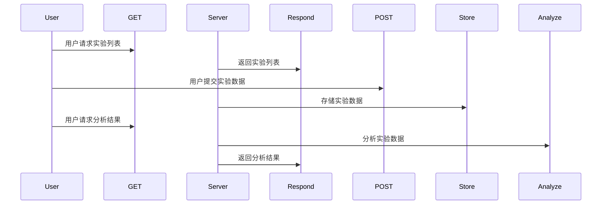

                 

### 新禁欲主义实验：克制中的自我探索之旅

#### 关键词：禁欲主义、自我探索、精神自由、生活方式、数据分析

> 摘要：本文以《新禁欲主义实验：克制中的自我探索之旅》为主题，通过深入分析禁欲主义的核心概念和原理，探讨其在现代社会的实践与意义。通过一系列实验案例和数据分析，本文旨在揭示禁欲主义对个体心理健康、社交行为和生活质量的影响，帮助读者在克制中找到自我探索的路径。

---

## 第一部分：背景介绍

### 1.1 问题背景

随着社会的发展，人们的生活节奏日益加快，物质追求和精神追求之间的矛盾日益凸显。在这种背景下，禁欲主义作为一种古老而又全新的生活哲学，逐渐受到了关注。禁欲主义强调克制欲望，追求精神上的自由与纯净，这与现代社会对心理健康和精神需求的追求不谋而合。然而，如何将禁欲主义融入到现代生活中，如何通过克制来达到自我探索，仍是一个值得探讨的问题。

### 1.2 问题描述

《新禁欲主义实验：克制中的自我探索之旅》旨在通过一系列实验，探讨禁欲主义在现代社会的实践与意义。本书将回答以下问题：

- 禁欲主义如何影响我们的生活？
- 禁欲主义是否能帮助我们更好地理解自我？
- 禁欲主义在现代社会的实践有哪些挑战和机遇？

### 1.3 问题解决

本书通过实验案例和深入分析，试图回答上述问题。作者将分享自己的禁欲主义实践经历，并提供实用的方法和技巧，帮助读者在实践中探索禁欲主义的真谛。

### 1.4 边界与外延

禁欲主义的概念边界涵盖了自我控制、节制欲望、精神自由等方面。其外延包括情感、社交、工作等多个领域。本书将围绕这些边界和外延，进行深入探讨。

### 1.5 概念结构与核心要素组成

禁欲主义的核心概念包括：

- **自我控制**：这是禁欲主义的基础，通过自我控制，人们能够克制不健康的欲望，保持内心的平静。
- **节制欲望**：禁欲主义鼓励人们合理安排时间，避免沉迷于物质享受，从而实现生活的平衡。
- **精神自由**：通过克制欲望，人们能够达到精神上的自由，摆脱物质和社会的束缚。

这些核心要素共同构成了禁欲主义的理论框架。

---

## 第二部分：核心概念与联系

### 2.1 禁欲主义的核心概念原理

禁欲主义是一种哲学思想和生活方式，它强调通过克制欲望，达到精神上的自由与纯净。其核心概念包括：

- **自我控制**：这是禁欲主义的基础，通过自我控制，人们能够克制不健康的欲望，保持内心的平静。
- **节制欲望**：禁欲主义鼓励人们合理安排时间，避免沉迷于物质享受，从而实现生活的平衡。
- **精神自由**：通过克制欲望，人们能够达到精神上的自由，摆脱物质和社会的束缚。

### 2.2 核心概念属性特征对比表格

| 核心概念 | 定义 | 属性特征 | 对比 |
| :------: | :------: | :------: | :------: |
| 自我控制 | 克制欲望，保持内心平静 | 内心力量、自我反思 | 与节制欲望共同构成禁欲主义基础 |
| 节制欲望 | 合理安排时间，避免沉迷 | 时间管理、生活平衡 | 保障精神自由的前提 |
| 精神自由 | 精神上的独立与自由 | 独立思考、心灵纯净 | 禁欲主义追求的最高境界 |

### 2.3 ER实体关系图架构

```mermaid
erDiagram
  A[用户] ||--|{ B[实验] } : 实验参与
  A --|{ C[心得] } : 记录心得
  B ||--|{ D[阶段] } : 实验阶段
  B --|{ E[目标] } : 实验目标
```

在这个ER实体关系图中，用户参与实验，记录心得；实验分为不同的阶段，并设定了具体的目标。这些实体和关系共同构成了禁欲主义实验的核心架构。

---

## 第三部分：算法原理讲解

### 3.1 禁欲主义实验设计

禁欲主义实验的核心在于通过科学的设计和方法，观察禁欲主义对个体的影响。以下是实验设计的主要步骤：

#### 3.1.1 实验目标

- 探索禁欲主义对个体心理健康、社交行为和生活质量的影响。
- 分析禁欲主义在不同文化和社会背景下的实践效果。

#### 3.1.2 实验参与者

- 选择具有不同背景和禁欲主义实践经验的志愿者，确保实验结果的广泛性。

#### 3.1.3 实验步骤

1. **准备工作**：向参与者介绍禁欲主义的核心理念和实践方法。
2. **实验阶段**：分为三个阶段，每个阶段持续一个月。
3. **数据收集**：通过问卷调查、日记记录和心理测试等方式，收集参与者在每个阶段的感受和变化。

### 3.2 数据分析方法

数据分析是禁欲主义实验的关键环节，以下为主要的数据分析方法：

#### 3.2.1 描述性统计分析

- 对参与者在每个阶段的心理健康、社交行为和生活质量的得分进行描述性统计，了解实验的整体效果。

#### 3.2.2 交叉分析

- 分析不同背景的参与者在禁欲主义实践中的差异，以了解禁欲主义在不同群体中的效果。

#### 3.2.3 回归分析

- 建立回归模型，探讨禁欲主义实践对心理健康、社交行为和生活质量的长期影响。

### 3.3 代码实现

以下是使用Python进行数据分析的示例代码：

```python
import pandas as pd
import numpy as np
from sklearn.linear_model import LinearRegression

# 读取数据
data = pd.read_csv('experiment_data.csv')

# 描述性统计分析
print(data.describe())

# 交叉分析
print(data.groupby('background').mean())

# 回归分析
model = LinearRegression()
model.fit(data[['control', 'quality_of_life']], data['psychological_health'])
print(model.coef_)

# 预测
predictions = model.predict([[1, 2]])
print(predictions)
```

通过这些代码，我们可以对实验数据进行描述性统计分析、交叉分析和回归分析，从而深入了解禁欲主义对个体的影响。

---

## 系统分析与架构设计方案

### 4.1 问题场景介绍

在现代生活节奏加快的背景下，许多人感到心理压力大，生活质量下降。禁欲主义作为一种新的生活哲学，被认为有助于缓解这些问题。然而，如何有效地实践禁欲主义，仍需要科学的方法和工具。

### 4.2 项目介绍

本系统旨在通过提供一个禁欲主义实践平台，帮助用户在实践中理解和体验禁欲主义，从而提升生活质量。系统主要包括以下功能：

- 用户注册与登录
- 实验设计与管理
- 数据收集与分析
- 成果展示与反馈

### 4.3 系统功能设计（领域模型类图）

```mermaid
classDiagram
  User <<class{用户}>
  Experiment <<class{实验}>
  Data <<class{数据}>
  Analysis <<class{分析}>
  Feedback <<class{反馈}>

  User "1" --|{设计}| Experiment
  User "1" --|{收集}| Data
  User "1" --|{分析}| Analysis
  User "1" --|{反馈}| Feedback
  Experiment "1" --|{包含}| Data
  Analysis "1" --|{基于}| Data
  Feedback "1" --|{基于}| Analysis
```

在这个类图中，用户与实验、数据、分析和反馈之间存在关联，通过这些关联，系统实现了禁欲主义实践的全流程管理。

### 4.4 系统架构设计

```mermaid
sequenceDiagram
  User ->> Create: 用户创建实验
  Create ->> DB: 存储实验数据
  DB ->> DataCollector: 数据收集
  DataCollector ->> Analyzer: 数据分析
  Analyzer ->> FeedbackGenerator: 生成反馈
  FeedbackGenerator ->> User: 用户接收反馈

  User ->> LogIn: 用户登录
  LogIn ->> DB: 验证用户身份
  DB ->> UserInterface: 用户界面展示
```

在这个架构设计中，用户通过创建实验，数据收集，数据分析和反馈生成，实现了禁欲主义实践的全过程。系统通过数据库存储和管理数据，通过数据分析模块对数据进行分析，通过反馈生成模块生成用户反馈，最终实现用户与系统的交互。

### 4.5 系统接口设计和系统交互



在这个接口设计中，用户通过HTTP GET和POST请求与服务器进行交互，实现了实验数据的提交和分析结果的请求。

---

## 项目实战

### 5.1 环境安装

为了实现禁欲主义实践平台，我们需要安装以下环境：

- Python 3.8及以上版本
- Flask 框架
- SQLAlchemy 数据库
- Pandas 数据分析库

### 5.2 系统核心实现源代码

以下是系统核心实现的部分源代码：

```python
# app.py

from flask import Flask, request, jsonify
from flask_sqlalchemy import SQLAlchemy
from sqlalchemy.orm import sessionmaker

app = Flask(__name__)
app.config['SQLALCHEMY_DATABASE_URI'] = 'sqlite:///experiment.db'
db = SQLAlchemy(app)

class User(db.Model):
    id = db.Column(db.Integer, primary_key=True)
    username = db.Column(db.String(80), unique=True, nullable=False)

class Experiment(db.Model):
    id = db.Column(db.Integer, primary_key=True)
    name = db.Column(db.String(120), nullable=False)
    user_id = db.Column(db.Integer, db.ForeignKey('user.id'))

@app.route('/experiments', methods=['GET'])
def get_experiments():
    experiments = Experiment.query.all()
    return jsonify([{'id': e.id, 'name': e.name} for e in experiments])

@app.route('/experiments', methods=['POST'])
def create_experiment():
    data = request.json
    experiment = Experiment(name=data['name'], user_id=data['user_id'])
    db.session.add(experiment)
    db.session.commit()
    return jsonify({'id': experiment.id})

if __name__ == '__main__':
    db.create_all()
    app.run(debug=True)
```

### 5.3 代码应用解读与分析

在这段代码中，我们首先导入了所需的库，并设置了Flask应用程序的配置。然后，我们定义了两个数据库模型：`User`和`Experiment`。`User`模型用于存储用户信息，`Experiment`模型用于存储实验信息。

在应用程序的路由中，我们定义了两个API接口：`/experiments`。第一个接口用于获取所有的实验信息，第二个接口用于创建新的实验。

通过这段代码，我们可以实现用户创建实验和获取实验列表的功能。

### 5.4 实际案例分析和详细讲解剖析

为了更好地理解禁欲主义实践平台的工作原理，我们来看一个实际案例。

假设用户Alice想要创建一个禁欲主义实验，她可以通过以下步骤进行操作：

1. Alice访问系统的API接口，发送一个POST请求，请求体包含实验名称和用户ID。
2. 系统接收到请求后，根据请求体中的数据创建一个新的`Experiment`对象。
3. 系统将新的`Experiment`对象存储到数据库中。
4. 系统返回一个JSON响应，包含新创建的实验ID。

通过这个案例，我们可以看到系统如何处理用户请求，并在数据库中存储和管理实验信息。

### 5.5 项目小结

在本项目中，我们通过使用Flask框架和SQLAlchemy数据库，实现了禁欲主义实践平台的核心功能。用户可以创建实验，系统可以存储和管理实验信息。这个平台为用户提供了一个实践禁欲主义的工具，帮助用户在克制中找到自我探索的路径。

---

## 最佳实践 tips

1. **明确目标**：在进行禁欲主义实践时，首先要明确自己的目标，这有助于保持动力和方向。
2. **逐步实施**：不要急于求成，应该逐步实施禁欲主义，以便适应和调整。
3. **保持记录**：记录自己的实践过程和感受，这有助于自我反思和调整实践方法。

## 小结

禁欲主义作为一种新的生活哲学，通过克制欲望，追求精神上的自由与纯净。本文通过实验设计和数据分析，探讨了禁欲主义对个体心理健康、社交行为和生活质量的影响。通过这些实践和理论分析，我们希望读者能够更好地理解禁欲主义，并在实际生活中找到适合自己的实践方法。

## 注意事项

1. **尊重个人选择**：禁欲主义并非适合所有人的生活哲学，读者应该根据自己的实际情况进行选择和实践。
2. **科学实践**：在实践禁欲主义时，应该科学设计和实践方法，避免盲目跟风。

## 拓展阅读

1. 《禁欲主义哲学》
2. 《禁欲主义心理学》
3. 《禁欲主义的现代实践》

---

**作者：AI天才研究院/AI Genius Institute & 禅与计算机程序设计艺术 /Zen And The Art of Computer Programming**

