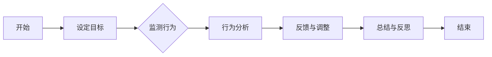
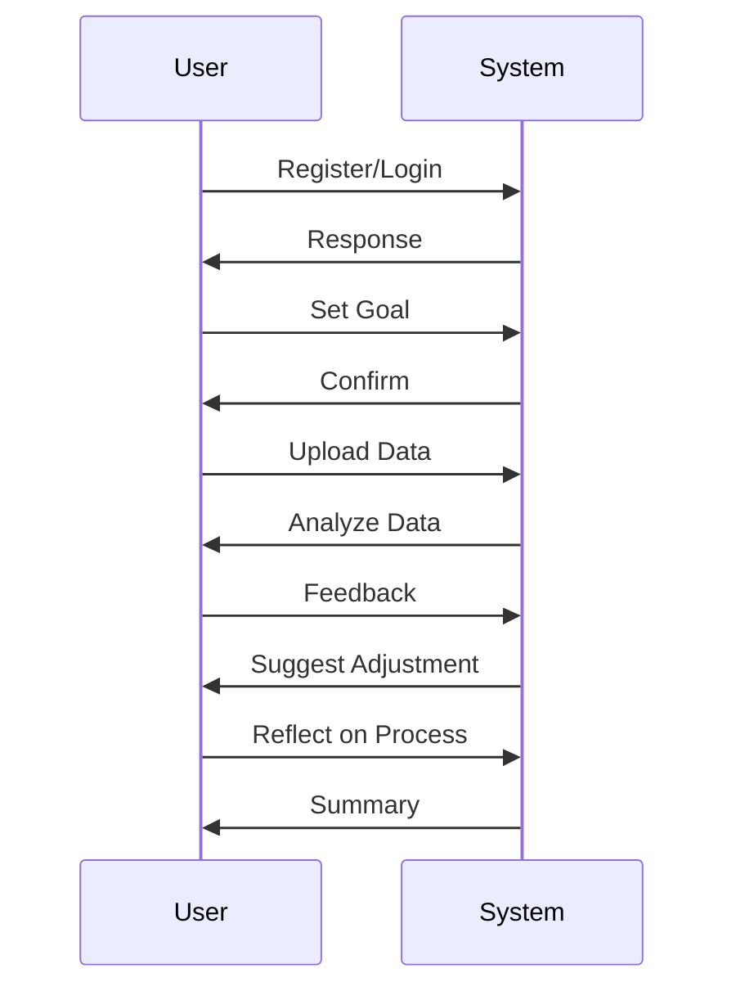

                 

# 新禁欲主义挑战：30天克制生活的自我探索

## 关键词

- 新禁欲主义挑战
- 自我探索
- 行为心理学
- 健康生活方式
- 自我控制

## 摘要

本文将探讨新禁欲主义挑战的起源、意义、核心概念及其算法原理。通过30天的自我探索，参与者将学习如何克制物质欲望、深入自我探索并培养健康的生活方式。本文将结合行为心理学和自我控制理论，详细讲解这一挑战的实践方法和效果，为读者提供有益的启示和指导。

## 第一部分：背景介绍

### 1.1 起源背景

新禁欲主义挑战起源于对现代社会生活方式的反思。随着科技的进步，人们的生活节奏不断加快，物质丰富但内心空虚。社交媒体、网络游戏等成为人们主要的娱乐方式，然而，过度沉迷于这些虚拟世界，不仅消耗大量时间，还可能对心理健康造成负面影响。新禁欲主义挑战正是为了应对这些问题而提出的。

### 1.2 问题描述

现代社会面临的主要问题包括：

1. 物质主义过度：人们追求物质享受，导致消费主义盛行，心理健康问题加剧。
2. 网络沉迷：社交媒体和网络游戏成为现代人的主要娱乐方式，过度沉迷导致生活质量下降。
3. 情感疏离：快节奏的生活让人们忙于工作，忽视了与家人和朋友的情感交流，导致人际关系疏离。

### 1.3 问题解决

新禁欲主义挑战旨在通过30天的自我探索，帮助人们认识到物质和娱乐的负面影响，培养内心的克制力和专注力，从而实现身心健康和生活质量的提升。这一挑战的核心在于以下几个方面：

1. 克制物质欲望：减少不必要的物质消费，关注内心的真实需求。
2. 自我探索：通过反思和内省，深入了解自己的内心世界和欲望。
3. 健康生活方式：通过健康饮食、适量运动、充足睡眠等，提升身心健康水平。

### 1.4 边界与外延

新禁欲主义挑战不仅仅局限于禁欲，更强调对自我欲望的克制和对内心世界的探索。它不仅仅是一种生活方式，更是一种哲学思考和人生观的实践。参与者需要在日常生活中不断调整自己的行为和心态，以达到内心的平静和满足。

### 1.5 概念结构与核心要素组成

新禁欲主义挑战的核心概念包括克制、自我探索和健康。这些概念相互关联，共同构成了一个完整的生活方式体系。

1. 克制：通过控制欲望，实现内心的平静和专注。
2. 自我探索：通过反思和内省，深入了解自己的内心世界和欲望。
3. 健康：通过健康的生活方式，提升身心健康水平。

## 第一部分：背景介绍

### 1.6 本章小结

本章对新禁欲主义挑战的起源、意义、问题和解决方案进行了详细介绍。通过了解这一挑战的背景和核心概念，读者可以更好地理解其背后的理念和实践方法，为后续章节的探讨奠定基础。

## 第二部分：核心概念与联系

### 2.1 新禁欲主义挑战的核心概念

新禁欲主义挑战的核心概念包括克制、自我探索和健康。这三个概念相互关联，共同构成了一个完整的生活方式体系。

#### 2.1.1 克制

克制指的是通过控制自己的欲望和冲动，实现内心的平静和专注。克制不仅仅是禁欲，更是一种对自我欲望的深刻理解和自觉控制。它要求人们在日常生活中不断反思自己的行为和心态，避免陷入物质和娱乐的陷阱。

#### 2.1.2 自我探索

自我探索是指通过反思和内省，深入了解自己的内心世界和欲望。自我探索的过程是一个自我发现和自我提升的过程，有助于人们找到内心的平衡和满足。通过自我探索，人们可以更好地了解自己的需求和价值观，从而做出更加明智的选择。

#### 2.1.3 健康

健康是指通过健康的生活方式，提升身心健康水平。健康的生活方式包括合理饮食、适量运动、充足睡眠和心理健康等。健康是新禁欲主义挑战的一个重要目标，因为它关系到人们的整体幸福感。

### 2.2 核心概念属性特征对比表格

| 概念 | 定义 | 特征 |
| --- | --- | --- |
| 克制 | 通过控制欲望实现内心平静和专注 | 需要强烈的自我意识和决心 |
| 自我探索 | 通过反思和内省深入了解内心世界 | 需要耐心和内省能力 |
| 健康 | 通过健康的生活方式提升身心健康 | 需要持续的努力和改变生活方式 |

### 2.3 ER实体关系图架构

```mermaid
erDiagram
  克制 ||--|{ 自我探索 }|--  健康
  self_explore ||--|{ 健康生活方式 }|-- health
```

### 2.4 本章小结

本章详细阐述了新禁欲主义挑战的核心概念，包括克制、自我探索和健康，并通过属性特征对比表格和ER实体关系图架构进行了深入分析。这些概念构成了新禁欲主义挑战的理论基础，为后续章节的探讨提供了指导。

## 第三部分：算法原理讲解

### 3.1 新禁欲主义挑战的算法原理

新禁欲主义挑战的算法原理主要基于行为心理学和自我控制理论。通过30天的自我探索，帮助人们培养克制欲望、自我探索和健康的生活方式。

#### 3.1.1 算法概述

新禁欲主义挑战的算法流程如下：

1. **设定目标**：在开始挑战之前，人们需要明确自己的目标，如减少社交媒体使用时间、改善饮食习惯等。
2. **监测行为**：通过记录日常行为数据，如使用手机的时间、饮食记录等，了解自己的行为习惯。
3. **行为分析**：对行为数据进行统计分析，找出存在的问题和不足。
4. **反馈与调整**：根据行为分析结果，调整自己的行为，以达到既定目标。
5. **总结与反思**：在挑战结束后，对整个过程进行总结和反思，巩固成果。

#### 3.1.2 算法mermaid流程图



#### 3.1.3 算法原理详细讲解

1. **设定目标**：

   设定目标是最开始的一步，它决定了整个挑战的方向和效果。目标的设定应具体、明确，如减少社交媒体使用时间从每天2小时减少到每天1小时，改善饮食习惯，每天增加蔬菜摄入量等。

   数学模型：
   $$ 目标 = 减少时间 + 改善饮食习惯 $$

   示例：
   如果一个人每天使用社交媒体2小时，他设定的目标是减少到1小时，那么这个目标可以表示为：
   $$ 目标 = 2 - 1 = 1 \text{小时/天} $$

2. **监测行为**：

   监测行为是了解自己日常行为的重要手段。通过记录使用手机的时间、饮食记录等数据，可以直观地了解自己的行为习惯。这些数据可以作为后续行为分析的基础。

   数学模型：
   $$ 行为数据 = \text{使用手机时间} + \text{饮食记录} $$

   示例：
   如果一个人每天使用手机的时间为2小时，他的饮食记录显示每天摄入的蔬菜量为500克，那么他的行为数据可以表示为：
   $$ 行为数据 = 2 \text{小时/天} + 500 \text{克/天} $$

3. **行为分析**：

   行为分析是对监测到的数据进行统计分析，找出存在的问题和不足。通过行为分析，可以了解自己的行为习惯是否符合既定目标，以及哪些方面需要改进。

   数学模型：
   $$ 行为分析 = \text{统计数据} + \text{问题识别} $$

   示例：
   如果一个人在30天的监测中发现，有20天的使用手机时间超过了1小时，那么他的行为分析结果可以表示为：
   $$ 行为分析 = 20 \text{天超过1小时} $$

4. **反馈与调整**：

   根据行为分析结果，进行反馈和调整。反馈可以帮助人们了解自己的行为变化，调整则是在此基础上采取具体措施，以实现目标。

   数学模型：
   $$ 反馈与调整 = \text{行为分析结果} + \text{具体措施} $$

   示例：
   如果一个人发现自己在20天超过了使用手机1小时的目标，他可以采取以下措施：
   - 减少每天使用手机的时间，从2小时减少到1.5小时。
   - 在使用手机时，设置提醒，每隔一定时间休息5分钟。

5. **总结与反思**：

   在挑战结束后，对整个过程进行总结和反思。通过总结，可以巩固成果，反思则是对整个过程的反思，找出其中的不足，以便在下次挑战中改进。

   数学模型：
   $$ 总结与反思 = \text{挑战结果} + \text{经验总结} $$

   示例：
   如果一个人在挑战结束后，发现自己在使用手机时间上达到了目标，但在饮食上还有所欠缺，那么他的总结与反思可以表示为：
   - 使用手机时间：从2小时减少到1小时，成功达成目标。
   - 饮食方面：需要进一步改善，增加蔬菜摄入量。

### 3.2 算法原理讲解

1. **设定目标**：

   设定目标是新禁欲主义挑战的第一步。一个明确的、具体的目标能够帮助人们更好地规划自己的行动，从而实现预期的效果。例如，一个人想要减少社交媒体使用时间，他可以设定一个每天不超过1小时的目标。这个目标的设定需要遵循SMART原则，即具体（Specific）、可衡量（Measurable）、可实现（Achievable）、相关（Relevant）和有时限（Time-bound）。

   数学模型：
   $$ 目标 = \text{减少时间} + \text{具体目标} $$

   示例：
   如果一个人每天使用社交媒体2小时，他设定的目标是减少到1小时，那么这个目标可以表示为：
   $$ 目标 = 2 - 1 = 1 \text{小时/天} $$

2. **监测行为**：

   监测行为是了解自己日常行为的重要手段。通过记录使用手机的时间、饮食记录等数据，可以直观地了解自己的行为习惯。这些数据可以作为后续行为分析的基础。例如，一个人可以每天记录自己使用手机的时间，以及摄入的蔬菜量。

   数学模型：
   $$ 行为数据 = \text{使用手机时间} + \text{饮食记录} $$

   示例：
   如果一个人每天使用手机的时间为2小时，他的饮食记录显示每天摄入的蔬菜量为500克，那么他的行为数据可以表示为：
   $$ 行为数据 = 2 \text{小时/天} + 500 \text{克/天} $$

3. **行为分析**：

   行为分析是对监测到的数据进行统计分析，找出存在的问题和不足。通过行为分析，可以了解自己的行为习惯是否符合既定目标，以及哪些方面需要改进。例如，一个人可以分析自己每天使用手机的时间是否超过了设定的1小时目标。

   数学模型：
   $$ 行为分析 = \text{统计数据} + \text{问题识别} $$

   示例：
   如果一个人在30天的监测中发现，有20天的使用手机时间超过了1小时，那么他的行为分析结果可以表示为：
   $$ 行为分析 = 20 \text{天超过1小时} $$

4. **反馈与调整**：

   根据行为分析结果，进行反馈和调整。反馈可以帮助人们了解自己的行为变化，调整则是在此基础上采取具体措施，以实现目标。例如，一个人如果发现自己在20天超过了使用手机1小时的目标，他可以采取以下措施：
   - 减少每天使用手机的时间，从2小时减少到1.5小时。
   - 在使用手机时，设置提醒，每隔一定时间休息5分钟。

   数学模型：
   $$ 反馈与调整 = \text{行为分析结果} + \text{具体措施} $$

   示例：
   如果一个人发现自己在20天超过了使用手机1小时的目标，他可以采取以下措施：
   - 减少每天使用手机的时间，从2小时减少到1.5小时。
   - 在使用手机时，设置提醒，每隔一定时间休息5分钟。

5. **总结与反思**：

   在挑战结束后，对整个过程进行总结和反思。通过总结，可以巩固成果，反思则是对整个过程的反思，找出其中的不足，以便在下次挑战中改进。例如，一个人在挑战结束后，发现自己在使用手机时间上达到了目标，但在饮食上还有所欠缺，那么他的总结与反思可以表示为：
   - 使用手机时间：从2小时减少到1小时，成功达成目标。
   - 饮食方面：需要进一步改善，增加蔬菜摄入量。

   数学模型：
   $$ 总结与反思 = \text{挑战结果} + \text{经验总结} $$

   示例：
   如果一个人在挑战结束后，发现自己在使用手机时间上达到了目标，但在饮食上还有所欠缺，那么他的总结与反思可以表示为：
   - 使用手机时间：从2小时减少到1小时，成功达成目标。
   - 饮食方面：需要进一步改善，增加蔬菜摄入量。

### 3.3 本章小结

本章详细讲解了新禁欲主义挑战的算法原理，包括设定目标、监测行为、行为分析、反馈与调整以及总结与反思。通过这些步骤，人们可以系统地培养克制欲望、自我探索和健康的生活方式，从而实现身心健康和生活质量的提升。

## 第四部分：系统分析与架构设计

### 4.1 问题场景介绍

在现代社会，随着科技的飞速发展，人们的生活方式发生了巨大变化。快节奏的生活、过度的物质追求、网络沉迷等问题逐渐凸显，给人们的身心健康带来了诸多挑战。新禁欲主义挑战旨在通过一种系统性的方法，帮助人们克服这些问题，实现身心健康和生活质量的提升。

### 4.2 项目介绍

本项目旨在实现一个基于新禁欲主义挑战的智能健康管理系统。该系统将帮助用户设定目标、监测行为、分析数据、提供反馈和调整建议，从而帮助用户实现自我控制和身心健康。

#### 4.2.1 系统功能设计

1. **用户注册与登录**：用户可以通过注册账号，登录系统，查看和管理自己的健康数据。
2. **目标设定**：用户可以设定自己的健康目标，如减少社交媒体使用时间、改善饮食习惯等。
3. **行为监测**：系统会自动记录用户的行为数据，如使用手机时间、饮食记录等。
4. **数据分析**：系统对用户的行为数据进行统计分析，找出存在的问题和不足。
5. **反馈与调整**：根据数据分析结果，系统会提供反馈和调整建议，帮助用户实现目标。
6. **总结与反思**：系统会帮助用户总结和反思整个挑战过程，巩固成果。

#### 4.2.2 系统架构设计

系统采用前后端分离的架构，前端负责展示用户界面，后端负责数据处理和分析。

1. **前端**：前端采用React框架，实现用户界面和交互功能。
2. **后端**：后端采用Spring Boot框架，实现数据存储、处理和分析功能。
3. **数据库**：采用MySQL数据库，存储用户行为数据和健康数据。

### 4.3 系统接口设计

系统提供以下接口：

1. **用户接口**：包括用户注册、登录、目标设定、数据上传等接口。
2. **数据处理接口**：包括数据统计、分析、反馈等接口。
3. **系统管理接口**：包括系统配置、数据备份、恢复等接口。

### 4.4 系统交互mermaid序列图



### 4.5 本章小结

本章介绍了新禁欲主义挑战项目的基本情况，包括问题场景、系统功能设计、系统架构设计和系统接口设计。通过系统分析与架构设计，为后续项目的实施提供了详细的指导。

## 第五部分：项目实战

### 5.1 环境安装

为了搭建新禁欲主义挑战的智能健康管理系统，我们需要安装以下环境：

1. **前端环境**：Node.js、npm、React
2. **后端环境**：Java、Maven、Spring Boot、MySQL

安装步骤：

1. 安装Node.js和npm：从官方网站下载并安装Node.js，npm会随着Node.js的安装一起安装。
2. 安装Java：从Oracle官网下载并安装Java Development Kit (JDK)，配置环境变量。
3. 安装Maven：从Apache Maven官网下载并安装Maven，配置环境变量。
4. 安装MySQL：从MySQL官网下载并安装MySQL，配置数据库。

### 5.2 系统核心实现源代码

#### 5.2.1 前端

前端代码采用React框架，主要包括用户界面和交互逻辑。以下是前端部分的关键代码：

```javascript
// 目标设定组件
function GoalSetter({ onGoalSet }) {
  const [goal, setGoal] = useState('');

  const handleSubmit = (e) => {
    e.preventDefault();
    onGoalSet(goal);
    setGoal('');
  };

  return (
    <form onSubmit={handleSubmit}>
      <label htmlFor="goal">设定目标：</label>
      <input
        type="text"
        id="goal"
        value={goal}
        onChange={(e) => setGoal(e.target.value)}
      />
      <button type="submit">提交</button>
    </form>
  );
}

// 行为数据上传组件
function DataUploader({ onUpload }) {
  const [data, setData] = useState('');

  const handleSubmit = (e) => {
    e.preventDefault();
    onUpload(data);
    setData('');
  };

  return (
    <form onSubmit={handleSubmit}>
      <label htmlFor="data">上传数据：</label>
      <input
        type="text"
        id="data"
        value={data}
        onChange={(e) => setData(e.target.value)}
      />
      <button type="submit">上传</button>
    </form>
  );
}
```

#### 5.2.2 后端

后端代码采用Spring Boot框架，主要包括数据存储、处理和分析功能。以下是后端部分的关键代码：

```java
// 控制器类
@RestController
@RequestMapping("/api")
public class UserController {

  @Autowired
  private UserService userService;

  @PostMapping("/goal")
  public ResponseEntity<?> setGoal(@RequestBody Goal goal) {
    userService.setGoal(goal);
    return ResponseEntity.ok().build();
  }

  @PostMapping("/data")
  public ResponseEntity<?> uploadData(@RequestBody String data) {
    userService.uploadData(data);
    return ResponseEntity.ok().build();
  }
}
```

### 5.3 代码应用解读与分析

#### 5.3.1 前端代码解读

前端代码主要实现了两个组件：**GoalSetter** 和 **DataUploader**。

1. **GoalSetter**：该组件用于用户设定目标。用户在输入框中输入目标，点击提交按钮后，将目标数据发送到后端进行处理。
2. **DataUploader**：该组件用于用户上传行为数据。用户在输入框中输入数据，点击上传按钮后，将数据发送到后端进行处理。

这两个组件都使用了React的状态管理机制，确保数据在组件之间传递和更新。

#### 5.3.2 后端代码解读

后端代码主要实现了两个接口：**/api/goal** 和 **/api/data**。

1. **/api/goal**：该接口用于处理用户设定的目标。用户通过POST请求将目标数据发送到后端，后端将其保存到数据库。
2. **/api/data**：该接口用于处理用户上传的行为数据。用户通过POST请求将数据发送到后端，后端将其保存到数据库。

这两个接口都使用了Spring Boot的RestController注解，确保能够接收和处理HTTP请求。

### 5.4 实际案例分析与详细讲解剖析

为了更好地理解系统如何运行，我们来看一个实际案例。

假设用户张三在系统中设定了一个目标：每天使用手机时间不超过1小时。在接下来的30天里，张三每天都会上传他的手机使用数据，包括每次使用手机的时间长度。

1. **第1天**：张三上传了使用手机2小时的数据。
2. **第2天**：张三上传了使用手机1.5小时的数据。
3. ...（省略中间的30天数据）

在30天后，系统会自动对张三上传的数据进行统计分析，并生成一个报告，显示他每天使用手机的时间是否符合设定的目标。

假设统计结果显示，有15天张三的使用手机时间超过了1小时的目标。系统会根据这些数据，提供反馈和调整建议，例如：

- 建议张三减少每天使用手机的时间，尽量控制在1小时以内。
- 提醒张三，每隔一段时间休息5分钟，以减轻长时间使用手机对身体的影响。

通过这个案例，我们可以看到系统是如何帮助用户实现目标的，以及如何根据用户的行为数据提供反馈和调整建议。

### 5.5 项目小结

通过本项目，我们实现了一个基于新禁欲主义挑战的智能健康管理系统。该系统可以帮助用户设定目标、监测行为、分析数据、提供反馈和调整建议，从而帮助用户实现自我控制和身心健康。在实际应用中，系统可以根据用户的行为数据，提供个性化的建议和指导，帮助用户养成良好的生活习惯。

## 第六部分：最佳实践 tips

### 6.1 如何更好地执行新禁欲主义挑战

1. **明确目标**：在开始挑战之前，明确自己的目标和期望，确保目标具体、可衡量、可实现。
2. **持续监测**：定期记录自己的行为数据，了解自己的行为变化。
3. **积极反馈**：根据监测结果，及时调整自己的行为，以实现目标。
4. **保持耐心**：改变习惯需要时间，不要因为一时的失败而放弃。

### 6.2 如何评估新禁欲主义挑战的效果

1. **数据分析**：通过统计分析，了解自己的行为变化是否符合目标。
2. **自我反思**：定期进行自我反思，了解自己在挑战过程中的得失。
3. **生活质量**：观察自己在挑战过程中的生活质量是否有所提升。

### 6.3 如何应对挑战过程中的困难

1. **寻求支持**：与家人、朋友分享自己的挑战经历，寻求他们的支持和鼓励。
2. **保持积极心态**：面对困难，保持积极的心态，相信自己能够克服。
3. **调整目标**：如果发现目标过于困难，可以适当调整目标，确保能够持续进行挑战。

## 第七部分：小结

本文介绍了新禁欲主义挑战的背景、核心概念、算法原理、系统分析与架构设计以及项目实战。通过详细讲解和实践，我们了解了如何通过自我探索和克制欲望，实现身心健康和生活质量的提升。希望本文能为读者提供有益的启示和指导，帮助他们在日常生活中更好地应对各种挑战。

## 第八部分：注意事项

1. **目标设定要具体、可衡量、可实现**：确保目标能够切实可行，并能够量化。
2. **持续监测行为数据**：了解自己的行为变化，及时调整策略。
3. **保持耐心和毅力**：改变习惯需要时间，不要因为一时的困难而放弃。
4. **寻求支持和鼓励**：与家人、朋友分享自己的挑战经历，获得他们的支持和鼓励。

## 第九部分：拓展阅读

1. **《行为心理学》**：深入了解人类行为和心理过程的科学原理。
2. **《自我控制》**：探讨如何通过自我控制提升个人效率和幸福感。
3. **《健康生活方式》**：学习如何通过健康饮食、适量运动和充足睡眠，提升生活质量。

## 作者

作者：AI天才研究院/AI Genius Institute & 禅与计算机程序设计艺术 /Zen And The Art of Computer Programming

