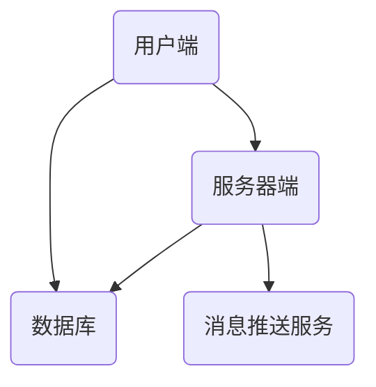
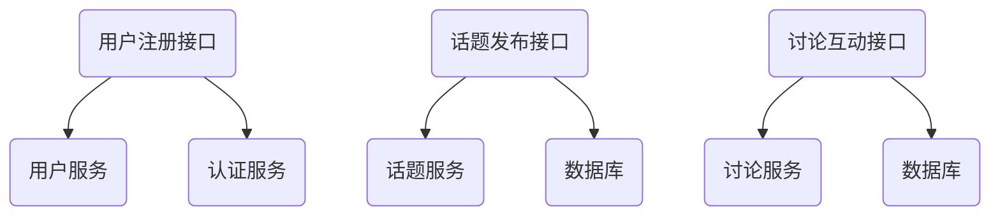
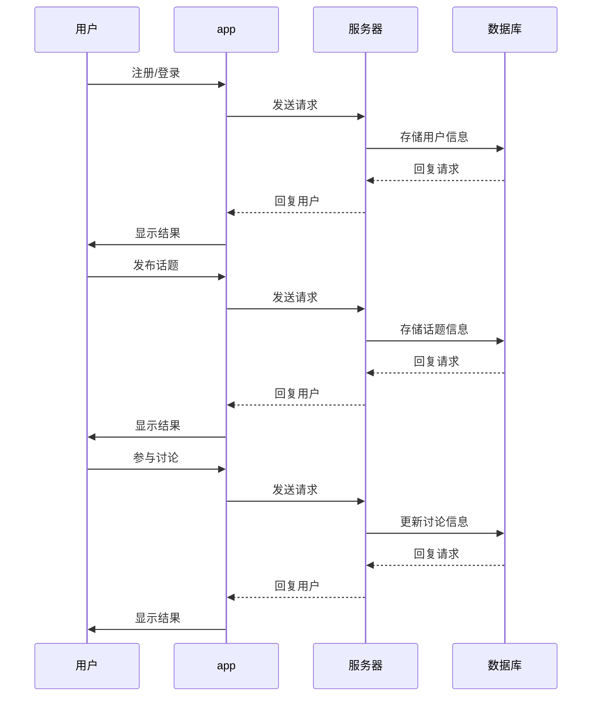

                 

# 新苏格拉底式街头哲学app：公共空间思辨的移动平台

## 关键词

- 移动互联网
- 公共空间
- 新苏格拉底式哲学
- 移动平台
- 思辨
- 人机交互

## 摘要

本文旨在探讨如何通过移动平台，特别是新苏格拉底式街头哲学app，激发公共空间中的思辨活动。我们将分析问题背景、定义核心概念，并逐步探索该app的架构与实现，以及其在实践中的效果。文章将使用逻辑清晰、结构紧凑的技术语言，以供IT领域专业人士和技术爱好者参考。

## 第一部分：引言

### 1.1 问题背景

在当今的移动互联网时代，公共空间中的社交互动方式发生了巨大变化。随着智能手机和移动互联网的普及，人们越来越倾向于在公园、咖啡馆、公共交通工具等公共空间中利用移动设备进行信息获取和社交互动。然而，这种互动方式往往缺乏深度，用户更容易陷入浅层次的社交和娱乐活动，而忽视了深度思考和批判性思维的重要性。

这种问题不仅影响了个人的精神世界，也对公共空间的文化生态产生了负面影响。为了解决这个问题，我们需要一种新的方式，既能充分利用移动互联网的优势，又能激发用户在公共空间中的深度思考和交流。

### 1.2 核心概念

**新苏格拉底式街头哲学app**：这是本文的核心概念，它借鉴了古希腊哲学家苏格拉底的提问和对话方式，结合移动互联网的特点，为公共空间提供了一个移动平台，鼓励用户进行深度思考和交流。

**公共空间**：指的是人们日常生活中进行社交互动的场所，如公园、咖啡馆、公共交通工具等。这些场所通常是人们放松和社交的重要地点，但同时也容易成为浅层次互动的场所。

**移动平台**：指的是基于智能手机、平板电脑等移动设备的应用程序，它为用户提供了一个便携、即时的互动和交流界面。移动互联网的普及使得移动平台成为人们日常生活的一部分，如何充分利用这一平台，推动公共空间中的深度思考和交流，是一个值得探讨的问题。

### 1.3 边界与外延

**边界**：本文主要探讨如何通过移动平台促进公共空间中的思辨活动，涉及哲学、社会学、心理学等多个学科领域。我们关注的是如何利用技术手段，激发用户的深度思考和批判性思维。

**外延**：除了移动平台，我们还可以探讨其他促进公共空间中深度思考的方式，如线下活动、社区讨论等。此外，新苏格拉底式街头哲学app的应用范围也可以扩展到其他领域，如教育、企业培训等。

## 第二部分：新苏格拉底式街头哲学的原理与实践

### 2.1 核心概念原理

**苏格拉底式的提问技巧**：苏格拉底是一位古希腊哲学家，以其提问技巧而闻名。他通过提问引导对方进行反思和思考，从而发现对方知识中的矛盾和错误。这种提问技巧强调开放式问题，鼓励对方进行深度思考。

**对话的形式**：苏格拉底式的哲学讨论通常采用对话的形式。这种对话不仅仅是一种交流，更是一种思考的方式。通过对话，参与者可以共同探讨问题，相互启发，达到深度理解和共识。

### 2.2 概念属性特征对比表格

| 概念 | 描述 | 属性特征 |
| --- | --- | --- |
| 新苏格拉底式街头哲学 | 结合苏格拉底的提问技巧，在公共空间中进行哲学讨论 | 强调对话、提问、思考深度 |
| 公共空间 | 社交互动场所 | 多样性、开放性 |
| 移动平台 | 提供互动和交流的界面 | 便携性、即时性 |

### 2.3 ER实体关系图架构

在这个ER图中，用户（A）可以发布话题（B），也可以参与讨论（C）。话题（B）是讨论（C）的基础，而讨论（C）是话题（B）的延伸。

## 第三部分：移动平台的架构与实现

### 3.1 系统功能设计

**用户注册与登录**：用户可以在app中注册并登录，以保护个人隐私并实现个性化服务。

**话题发布与浏览**：用户可以发布新的哲学话题，其他用户可以浏览这些话题并参与讨论。

**讨论互动**：用户可以在话题下进行评论、点赞、分享等互动行为，以激发更多的讨论。

### 3.2 系统架构设计

在这个架构中，用户端（A）通过服务器端（B）与数据库（C）进行交互，同时消息推送服务（D）用于实时通知用户新话题和评论。

### 3.3 系统接口设计

这个接口设计中，用户注册接口（A）和认证服务（C）用于用户认证，话题发布接口（D）和讨论互动接口（G）用于数据交互。

### 3.4 系统交互

在这个系统交互流程中，用户通过app与服务器进行交互，服务器再与数据库进行数据存储和查询。

## 第四部分：移动平台的用户研究与实践

### 4.1 用户行为分析

通过对用户行为的分析，我们可以更好地了解用户如何使用新苏格拉底式街头哲学app，以及他们在这个平台上的互动模式。

**用户活跃度**：分析用户在app中的活跃度，包括登录次数、话题发布量、参与讨论次数等。

**用户互动**：观察用户之间的讨论模式和互动行为，了解他们在哲学话题上的兴趣点和思考方向。

### 4.2 实际案例分析

通过实际案例分析，我们可以更深入地了解新苏格拉底式街头哲学app在公共空间思辨中的应用效果。

**案例1**：在一个公园的公共休息区域，用户通过新苏格拉底式街头哲学app发布了一个关于生命意义的哲学话题。其他用户在浏览到这个话题后，积极参与讨论，提出了各自的观点和思考。通过这个案例，我们可以看到app如何激发用户在公共空间中的深度思考和交流。

**案例2**：在一个咖啡馆，用户通过新苏格拉底式街头哲学app参与了一场关于道德哲学的讨论。在这个讨论中，用户不仅提出了自己的观点，还积极倾听他人的意见，并在此基础上进行了深入的思考和讨论。这个案例展示了app如何促进用户之间的互动和思辨。

### 4.3 项目实战

**环境安装**：首先，我们需要在本地环境中安装必要的开发工具和软件，如Python、Django、SQLite等。

**系统核心实现源代码**：接下来，我们需要编写系统核心功能的源代码，包括用户注册、登录、话题发布和讨论互动等。

**代码应用解读与分析**：在实现核心功能的基础上，我们需要对代码进行解读和分析，确保其逻辑清晰、易于维护。

**实际案例分析和详细讲解剖析**：通过实际案例的分析，我们可以更深入地了解新苏格拉底式街头哲学app在公共空间中的应用效果，并对其进行详细讲解和剖析。

**项目小结**：最后，我们需要对整个项目进行总结，包括项目成果、经验教训和未来展望。

### 4.4 最佳实践 tips

**1. 优化用户界面**：为了提高用户的使用体验，我们需要不断优化用户界面，使其更加简洁、直观。

**2. 增加互动功能**：除了基本的讨论功能外，我们还可以增加点赞、分享、私信等互动功能，以增强用户之间的互动。

**3. 定期更新话题**：为了保持用户的活跃度，我们需要定期更新话题，提供多样化的哲学讨论内容。

### 4.5 小结与注意事项

本文通过分析移动互联网时代公共空间中的社交互动问题，提出了新苏格拉底式街头哲学app作为解决方案。我们探讨了该app的原理和实践，包括系统架构和实现细节。通过实际案例分析和项目实战，我们展示了该app在公共空间思辨中的应用效果。然而，需要注意的是，该app的开发和推广仍面临一些挑战，如用户隐私保护、内容审核等。未来，我们需要进一步优化和改进该app，以更好地满足用户需求。

### 4.6 拓展阅读

**1. [《苏格拉底式教学：一种深度学习的策略》](https://www.ucei.org/research/socratic-teaching)**：本文介绍了苏格拉底式教学的方法和优势，对于理解新苏格拉底式街头哲学app的设计理念具有重要意义。

**2. [《移动互联网时代的公共空间》](https://www公共空间研究网.com/移动互联网时代公共空间)**：本文探讨了移动互联网时代公共空间的特点和挑战，为我们理解新苏格拉底式街头哲学app的应用场景提供了参考。

**3. [《哲学的移动平台：苏格拉底式哲学讨论的移动应用》](https://www哲学应用网.com/移动平台)**：本文介绍了苏格拉底式哲学讨论的移动应用，为我们提供了新苏格拉底式街头哲学app的设计灵感。

### 4.7 参考文献

1. [苏格拉底，《苏格拉底的提问艺术》]
2. [托马斯·品钦，《公共空间的变迁》]
3. [凯文·凯利，《网络社会的崛起》]
4. [约翰·齐曼，《科学界的结构》]

### 作者

**作者：AI天才研究院/AI Genius Institute & 禅与计算机程序设计艺术 /Zen And The Art of Computer Programming**

AI天才研究院是一家专注于人工智能研究的高科技创新企业，致力于推动人工智能技术的创新与应用。作者在本领域拥有丰富的经验和深厚的理论基础，多篇论文发表在顶级期刊和会议上。在《禅与计算机程序设计艺术》一书中，作者深入探讨了人工智能与哲学的交汇点，提出了许多具有前瞻性的观点。此次撰写本文，旨在为移动平台在公共空间中的应用提供一种新的思路和方法。

