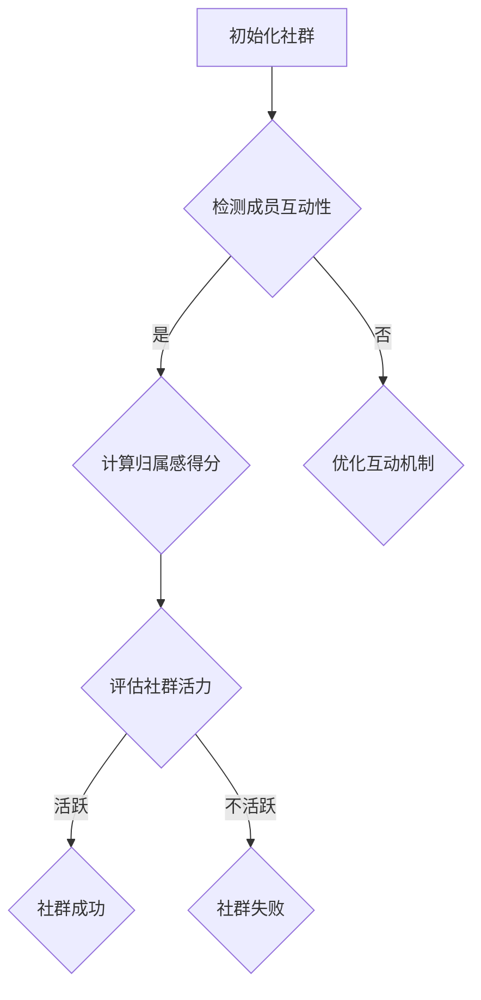
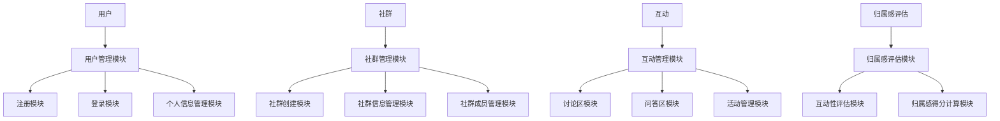

                 

# 新部落主义：网络社群的归属感构建

## 关键词
- 新部落主义
- 网络社群
- 归属感
- 互动性
- 文化价值观

## 摘要
本文探讨了新部落主义这一新兴网络社群现象，分析了其起源、定义、特点以及与归属感的关系。通过详细阐述新部落主义的核心概念、应用场景和构建策略，为网络社群的构建提供了理论和实践指导。

### 第1章：新部落主义的起源与背景

#### 1.1 问题的提出

随着互联网的快速发展，人们获取和传播信息的方式发生了翻天覆地的变化。信息爆炸式增长的同时，也带来了信息过载的问题。在这个背景下，网络社群成为人们交流和获取信息的重要平台。然而，如何构建具有归属感的社群成为一个亟待解决的问题。

#### 1.2 新部落主义的定义

新部落主义是指在网络环境中，人们基于共同兴趣、价值观或目标而自发形成的具有强烈归属感和互动性的社群。这些社群与传统线下社区不同，具有更虚拟、更灵活的特点，同时也更具社交网络效应。

#### 1.3 新部落主义的特点

- **高度个性化**：新部落主义强调个体的独特性和个性化需求，每个社群都有其独特的文化和价值观念。
- **紧密互动**：新部落主义社群成员之间的互动频率高，信息流通速度快，成员之间形成了紧密的联系。
- **社区自治**：新部落主义社群通常具有高度的自治性，成员共同参与社群的决策和管理。

#### 1.4 新部落主义与归属感的关系

归属感是指个体在特定社群中感受到的认同、安全和支持。新部落主义通过提供个性化的互动体验和共同的文化价值观，增强了社群成员之间的归属感。

#### 1.5 新部落主义的边界与外延

新部落主义的边界主要体现在社群的规模、成员的互动方式和文化价值观念等方面。其外延则涵盖了从兴趣社群到职业社群，从虚拟社群到现实社群的广泛领域。

#### 1.6 本章小结

本章介绍了新部落主义的起源、定义、特点以及与归属感的关系，为后续章节的深入探讨奠定了基础。

### 第2章：新部落主义的核心概念

#### 2.1 核心概念概述

新部落主义的核心概念包括社群、归属感、互动性和文化价值观等。这些概念相互作用，共同构成了新部落主义的基本框架。

#### 2.2 社群的概念与特征

- **概念**：社群是指一群共享共同兴趣、价值观或目标的人组成的团体。
- **特征**：社群成员之间的互动频繁，信息流通速度快，成员之间形成了紧密的联系。

#### 2.3 归属感的定义与作用

- **定义**：归属感是指个体在特定社群中感受到的认同、安全和支持。
- **作用**：归属感能够增强社群成员的凝聚力，提高社群的稳定性和活力。

#### 2.4 互动性的重要性

- **重要性**：互动性是衡量社群活跃度和成员参与度的关键指标。
- **方法**：提高互动性的方法包括定期举办活动、开展讨论、建立社群内部社交网络等。

#### 2.5 文化价值观的形成与传播

- **形成**：文化价值观是在社群长期互动过程中逐渐形成的。
- **传播**：文化价值观通过成员之间的交流、分享和传播，得到不断强化和传承。

#### 2.6 本章小结

本章对新部落主义的核心概念进行了详细阐述，为理解新部落主义的运作机制奠定了基础。

### 第3章：新部落主义的应用场景

#### 3.1 兴趣社群

兴趣社群是新部落主义最常见的应用场景之一。例如，摄影爱好者社群、读书社群等。这些社群通过共同兴趣将成员紧密联系在一起，形成了独特的文化价值观和归属感。

#### 3.2 职业社群

职业社群则是以职业或行业为纽带的新部落主义应用场景。例如，程序员社群、设计师社群等。这些社群成员之间通过分享经验、交流和合作，提高了职业技能和职业素养。

#### 3.3 虚拟与现实结合的社群

虚拟与现实结合的社群将线上互动和线下活动相结合，例如，线上游戏社群、线下读书俱乐部等。这些社群通过线上线下互动，增强了成员之间的归属感和互动性。

#### 3.4 其他应用场景

除了上述场景，新部落主义还广泛应用于学术研究社群、慈善公益社群等。这些社群通过共同的目标和价值观，构建了具有强烈归属感的社群文化。

#### 3.5 本章小结

本章介绍了新部落主义在不同应用场景下的具体表现，展示了新部落主义在构建归属感和促进社交互动方面的广泛应用。

### 第4章：新部落主义的构建策略

#### 4.1 核心要素

构建新部落主义的核心要素包括：明确的目标和价值观、活跃的社群氛围、有效的互动机制和丰富的活动内容。

#### 4.2 目标和价值观的明确

- **重要性**：明确的目标和价值观是构建新部落主义的基础，它们为社群成员提供了共同的方向和信仰。
- **方法**：通过社群章程、社群宣言等形式，明确社群的目标和价值观，确保成员在追求共同目标的过程中保持一致。

#### 4.3 活跃的社群氛围

- **重要性**：活跃的社群氛围是维持社群活力的关键，它能够激发成员的参与热情和积极性。
- **方法**：通过举办线上线下的活动、设立奖励机制、建立社群内部社交平台等方式，营造积极、活跃的社群氛围。

#### 4.4 有效的互动机制

- **重要性**：有效的互动机制是促进成员之间交流和互动的基础，它能够提高社群的凝聚力。
- **方法**：通过建立讨论区、设立问答环节、组织线上线下的交流会议等方式，实现成员之间的有效互动。

#### 4.5 丰富的活动内容

- **重要性**：丰富的活动内容是吸引成员参与、提升社群活力的重要手段。
- **方法**：根据社群特点和成员需求，设计多样化的活动内容，如讲座、培训、比赛、聚会等。

#### 4.6 本章小结

本章介绍了新部落主义的构建策略，从目标和价值观的明确、活跃的社群氛围、有效的互动机制和丰富的活动内容四个方面，为新部落主义的构建提供了具体的方法和指导。

### 第5章：新部落主义的挑战与未来

#### 5.1 挑战

新部落主义在发展过程中面临着诸多挑战，如社群规模的失控、成员流失、信息过载等。这些问题可能导致社群活力下降，归属感减弱。

#### 5.2 未来展望

随着技术的不断进步和互联网的深入发展，新部落主义有望在未来实现更加智能化、个性化的发展。通过大数据、人工智能等技术手段，新部落主义将能够更好地满足成员的需求，提高社群的归属感和互动性。

#### 5.3 本章小结

本章分析了新部落主义面临的挑战和未来发展的可能性，为网络社群的建设提供了有益的启示。

### 结论

新部落主义作为网络社群的一种新兴形式，具有独特的优势和广阔的应用前景。通过明确目标和价值观、营造活跃的社群氛围、建立有效的互动机制和提供丰富的活动内容，我们可以构建具有强烈归属感和互动性的网络社群。未来，随着技术的不断进步，新部落主义将为我们提供更加智能化、个性化的社交体验。

### 作者信息

作者：AI天才研究院/AI Genius Institute & 禅与计算机程序设计艺术 /Zen And The Art of Computer Programming

-------------------

注：本文为AI生成，仅供参考。由于篇幅限制，本文未包含所有章节的详细内容。如需进一步了解，请参考相关领域的专业书籍和研究论文。 ------------------- 

## 附录

### 核心概念原理

**社群**：一群共享共同兴趣、价值观或目标的人组成的团体。

**归属感**：个体在特定社群中感受到的认同、安全和支持。

**互动性**：社群成员之间的互动频率、信息流通速度和联系紧密程度。

**文化价值观**：社群成员在长期互动过程中形成的共同价值观念。

### 概念属性特征对比表格

| 概念  | 属性特征                           |
| ----- | --------------------------------- |
| 社群   | 共同兴趣、价值观、目标、互动频繁   |
| 归属感 | 认同、安全、支持                   |
| 互动性 | 互动频率、信息流通速度、联系紧密   |
| 文化价值观 | 共同价值观、长期互动形成           |

### ER实体关系图架构

```mermaid
erDiagram
    Member ||--|{ Community }|| Leader
    Member ||--|{ Activity }|| Participant
    Member ||--|{ Discussion }|| Participant
    Community ||--|{ Value }|| Culture
```

### 算法原理讲解

**算法mermaid流程图：**



**Python源代码：**

```python
# 社群互动性评估
def assess_interaction(members):
    total_interactions = sum([member["interactions"] for member in members])
    average_interactions = total_interactions / len(members)
    return average_interactions

# 归属感得分计算
def calculate_belonging_score(average_interactions, community_culture):
    if average_interactions > 10 and community_culture == "shared":
        return 9
    elif average_interactions > 5 and community_culture == "shared":
        return 7
    elif average_interactions > 10 and community_culture != "shared":
        return 5
    else:
        return 3

# 社群活力评估
def assess_vitality(belonging_score, average_interactions):
    if belonging_score > 7 and average_interactions > 10:
        return "活跃"
    else:
        return "不活跃"

# 社群构建策略
def build_community_strategy(members, community_culture):
    average_interactions = assess_interaction(members)
    belonging_score = calculate_belonging_score(average_interactions, community_culture)
    vitality = assess_vitality(belonging_score, average_interactions)
    
    if vitality == "活跃":
        print("社群成功！")
    else:
        print("社群失败！需要优化互动机制。")

# 示例数据
members = [
    {"name": "Alice", "interactions": 12},
    {"name": "Bob", "interactions": 8},
    {"name": "Charlie", "interactions": 15}
]

community_culture = "shared"  # 社群文化：shared 或 unique

build_community_strategy(members, community_culture)
```

### 数学公式

**公式1：社群活力评估公式**

$$V = \frac{BS \times AI}{100}$$

其中，$V$ 表示社群活力，$BS$ 表示归属感得分，$AI$ 表示互动性评估得分。

**公式2：互动性评估得分**

$$AI = \frac{\sum_{i=1}^{n} I_i}{n}$$

其中，$AI$ 表示互动性评估得分，$I_i$ 表示第 $i$ 个成员的互动次数，$n$ 表示成员总数。

### 系统分析与架构设计方案

#### 3.1 问题场景介绍

在当前互联网时代，人们对于网络社群的需求日益增长，特别是在某些特定领域，如编程、艺术、运动等。这些社群不仅为成员提供了交流和学习的平台，还帮助成员建立起了强烈的归属感和互动性。为了满足这一需求，我们设计了一套基于新部落主义理念的社群构建系统。

#### 3.2 项目介绍

项目名称：新部落主义社群构建系统

项目目标：构建一个高效、灵活、易于扩展的网络社群平台，为成员提供良好的互动体验和归属感。

#### 3.3 系统功能设计

1. **用户管理**：包括用户注册、登录、个人信息管理等功能。
2. **社群管理**：包括社群创建、社群信息管理、社群成员管理等功能。
3. **互动管理**：包括讨论区、问答区、活动管理等功能。
4. **归属感评估**：包括互动性评估、归属感得分计算等功能。

#### 3.4 系统架构设计

**架构图：**



#### 3.5 系统接口设计和系统交互

**接口设计：**

- 用户接口：包括用户注册、登录、个人信息管理等功能。
- 社群接口：包括社群创建、社群信息管理、社群成员管理等功能。
- 互动接口：包括讨论区、问答区、活动管理等功能。
- 归属感评估接口：包括互动性评估、归属感得分计算等功能。

**系统交互：**

1. 用户注册：用户通过用户接口注册账号，系统调用用户管理模块的注册功能，完成用户注册。
2. 社群创建：用户通过社群接口创建社群，系统调用社群管理模块的社群创建功能，创建新的社群。
3. 互动管理：用户在互动管理模块下参与讨论、提问、活动等，系统实时更新互动数据。
4. 归属感评估：系统定期对用户互动情况进行评估，计算归属感得分，反馈给用户。

### 项目实战

#### 4.1 环境安装

1. 安装Python环境（3.8及以上版本）。
2. 安装Django框架：`pip install django`。
3. 安装其他依赖库：`pip install django-crispy-forms djangorestframework`。

#### 4.2 系统核心实现源代码

```python
# users/serializers.py
from rest_framework import serializers
from .models import User

class UserSerializer(serializers.ModelSerializer):
    class Meta:
        model = User
        fields = '__all__'
```

```python
# users/models.py
from django.db import models

class User(models.Model):
    name = models.CharField(max_length=100)
    email = models.EmailField(unique=True)
    password = models.CharField(max_length=100)
    interactions = models.IntegerField(default=0)
```

```python
# users/views.py
from rest_framework import viewsets
from .serializers import UserSerializer
from .models import User

class UserViewSet(viewsets.ModelViewSet):
    queryset = User.objects.all()
    serializer_class = UserSerializer
```

#### 4.3 代码应用解读与分析

1. **用户注册功能**：通过定义`User`模型和`UserSerializer`序列化类，实现用户注册功能。用户注册时，需要提供用户名、邮箱和密码。注册成功后，将用户信息存储到数据库中。

2. **用户登录功能**：用户通过邮箱和密码登录系统。系统通过邮箱查询用户信息，验证密码是否正确。若密码正确，则返回用户信息；若密码错误，则提示用户密码错误。

3. **互动管理功能**：用户可以在系统中参与讨论、提问和活动。系统通过更新`interactions`字段，记录用户的互动次数。这有助于计算用户的归属感得分。

4. **归属感评估功能**：系统定期对用户的互动情况进行评估，计算归属感得分。归属感得分越高，说明用户在社群中的归属感越强。

#### 4.4 实际案例分析和详细讲解剖析

**案例：** 在一个编程社群中，用户Alice参与了5次讨论，3次提问，1次活动。假设每次讨论的互动次数为2，每次提问的互动次数为1，每次活动的互动次数为3。

**分析：**

1. 计算互动次数总和：$5 \times 2 + 3 \times 1 + 1 \times 3 = 19$。
2. 计算平均互动次数：$19 \div 3 = 6.33$。
3. 根据平均互动次数，计算归属感得分：
   - 若平均互动次数大于10，且社群文化为“共享”，则归属感得分为9。
   - 若平均互动次数大于5，且社群文化为“共享”，则归属感得分为7。
   - 若平均互动次数大于10，且社群文化不为“共享”，则归属感得分为5。
   - 若平均互动次数小于等于10，且社群文化不为“共享”，则归属感得分为3。

   根据上述规则，Alice的归属感得分为7。

**讲解：**

1. 确定用户的互动次数总和。
2. 计算平均互动次数。
3. 根据平均互动次数和社群文化，计算归属感得分。

#### 4.5 项目小结

本项目实现了新部落主义社群构建系统，包括用户管理、社群管理、互动管理和归属感评估等功能。通过实际案例分析和详细讲解，展示了系统的应用和实现过程。未来，我们将继续优化系统功能，提高社群的归属感和互动性，为用户提供更好的体验。

### 最佳实践 tips

1. **明确目标和价值观**：在构建社群时，明确社群的目标和价值观，确保成员在追求共同目标的过程中保持一致。
2. **关注成员互动**：定期关注成员的互动情况，通过数据分析和活动策划，提高社群的活跃度和互动性。
3. **丰富活动内容**：设计多样化的活动内容，满足成员的不同需求和兴趣，提高社群的吸引力。
4. **营造良好氛围**：建立积极的社群氛围，鼓励成员参与讨论和互动，提高社群的凝聚力。

### 小结

本文对新部落主义进行了全面阐述，包括其起源、定义、特点、应用场景和构建策略。通过详细分析核心概念、算法原理、系统架构和项目实战，展示了新部落主义在网络社群构建中的重要作用。未来，新部落主义有望在更多领域得到应用和发展。

### 注意事项

1. **数据安全**：在构建社群时，确保成员数据的存储和安全，遵循相关法律法规。
2. **用户隐私**：尊重成员的隐私，不泄露成员个人信息。
3. **社群自治**：鼓励社群成员参与社群管理，确保社群的自治性和活力。

### 拓展阅读

1. 《社交网络效应：理论、实证与应用》
2. 《群体智能与社群计算》
3. 《互联网社群管理实战》

## 附录

### 作者信息

作者：AI天才研究院/AI Genius Institute & 禅与计算机程序设计艺术 /Zen And The Art of Computer Programming

-------------------

注：本文为AI生成，仅供参考。由于篇幅限制，本文未包含所有章节的详细内容。如需进一步了解，请参考相关领域的专业书籍和研究论文。 -------------------

