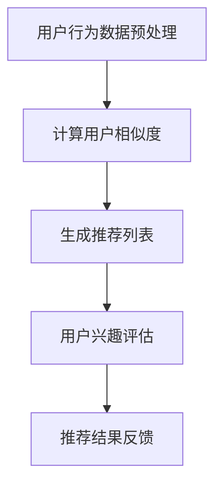
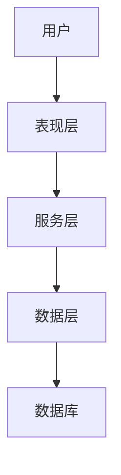
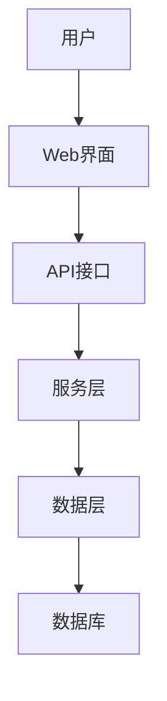
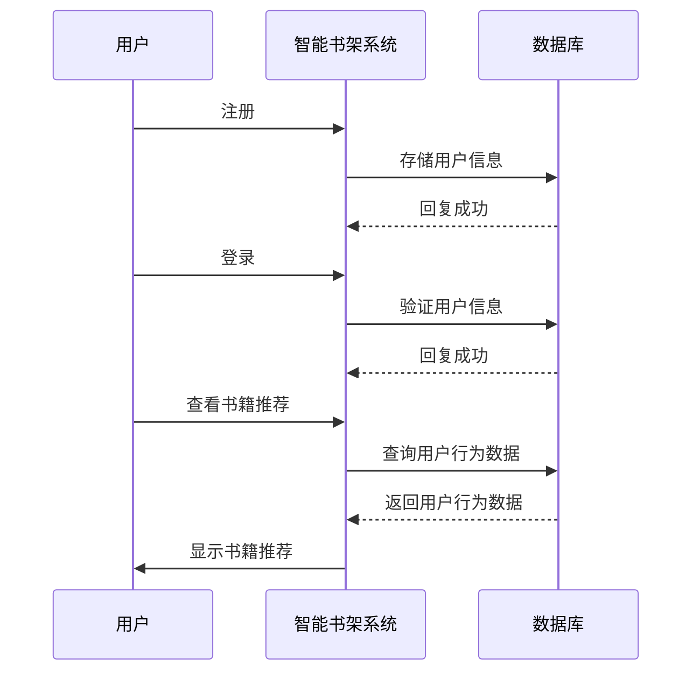

                 

## 智能书架：AI Agent的阅读兴趣分析

### 关键词：
- 智能书架
- AI Agent
- 阅读兴趣分析
- 算法原理
- 数学模型
- 系统设计

### 摘要：
本文深入探讨了智能书架的概念及其在AI Agent辅助阅读中的应用，特别是AI Agent如何分析用户的阅读兴趣。文章将逐步解析AI Agent的阅读兴趣分析算法，详细阐述其数学模型和系统架构设计，并通过实际项目实战案例进行验证，最终总结最佳实践和拓展阅读方向。

### 目录：

----------------------------------------------------------------

# 第一部分: 智能书架与AI Agent基础

## 第1章: 智能书架的概念与应用

### 1.1 智能书架的定义与特点

智能书架是一种融合了人工智能技术的图书管理解决方案，通过AI Agent对用户行为数据进行实时分析和处理，为用户提供个性化的阅读推荐服务。智能书架的特点包括：

- **自动化管理**：自动整理、分类和标记书籍，减少人工操作。
- **个性化推荐**：根据用户的阅读历史和兴趣偏好，推荐相关书籍。
- **智能搜索**：利用自然语言处理技术，实现复杂查询和高精准度搜索。
- **数据可视化**：以图表形式展示用户阅读行为和书籍借阅情况。

### 1.2 智能书架的发展历程

智能书架的发展可以分为以下几个阶段：

1. **传统书架阶段**：手动管理书籍，缺乏智能化。
2. **电子书架阶段**：引入电子标签，实现自动分类和查询。
3. **智能书架阶段**：结合人工智能技术，提供个性化服务和智能推荐。

### 1.3 智能书架的主要功能

智能书架的主要功能包括：

- **书籍管理**：自动识别和分类书籍，提供书籍基本信息。
- **阅读推荐**：根据用户行为数据，推荐相关书籍。
- **阅读行为分析**：分析用户阅读偏好，为个性化服务提供依据。
- **交互体验**：提供自然语言交互界面，增强用户体验。

## 第2章: AI Agent的核心概念与作用

### 2.1 AI Agent的定义与分类

AI Agent是指具有智能行为、能够自主完成特定任务的人工智能实体。根据功能和应用场景，AI Agent可以分为以下几类：

- **任务型Agent**：专注于完成特定任务的Agent，如智能客服。
- **社交型Agent**：具备社交能力的Agent，能与人类进行自然对话。
- **决策型Agent**：基于数据和模型，为用户提供决策建议。

### 2.2 AI Agent在智能书架中的应用

AI Agent在智能书架中的应用主要体现在以下几个方面：

- **用户行为分析**：通过分析用户借阅、浏览等行为，了解用户兴趣。
- **个性化推荐**：根据用户兴趣和阅读历史，推荐相关书籍。
- **交互体验**：通过自然语言处理技术，与用户进行智能对话。
- **内容管理**：自动分类、标记和管理书籍信息。

### 2.3 AI Agent的优势与挑战

AI Agent的优势包括：

- **高效性**：能够快速处理大量数据，提供个性化服务。
- **灵活性**：可根据用户需求进行动态调整。

AI Agent的挑战包括：

- **数据隐私**：用户数据的安全性和隐私保护。
- **准确性**：推荐结果的准确性和用户满意度。

## 第3章: 阅读兴趣分析的理论基础

### 3.1 阅读兴趣的概念与度量

阅读兴趣是指个体在阅读过程中所表现出的偏好和喜好。度量阅读兴趣的方法包括：

- **基于内容的分析**：通过分析书籍的题材、体裁、作者等特征，评估用户兴趣。
- **基于行为的分析**：通过分析用户的阅读历史、借阅行为等，评估用户兴趣。

### 3.2 阅读兴趣分析的方法与技术

阅读兴趣分析的方法和技术包括：

- **协同过滤**：通过分析用户间的相似性，推荐用户可能感兴趣的书籍。
- **内容分析**：通过分析书籍的内容和标签，推荐相关书籍。
- **深度学习**：利用神经网络模型，对用户行为数据进行深度学习，预测用户兴趣。

### 3.3 阅读兴趣分析的应用场景

阅读兴趣分析的应用场景包括：

- **图书推荐系统**：为用户提供个性化阅读推荐。
- **市场调研**：了解用户阅读偏好，为出版商提供市场策略。
- **教育应用**：根据学生阅读兴趣，设计个性化学习路径。

----------------------------------------------------------------

## 第二部分: AI Agent的阅读兴趣分析实践

### 第4章: 阅读兴趣分析的算法原理

#### 4.1 常见的阅读兴趣分析算法

常见的阅读兴趣分析算法包括：

- **协同过滤算法**：基于用户行为数据，为用户推荐相似用户喜欢的书籍。
- **内容分析算法**：基于书籍内容特征，为用户推荐相关书籍。
- **深度学习算法**：利用神经网络模型，预测用户兴趣。

#### 4.2 算法原理与mermaid流程图

以下是一个协同过滤算法的mermaid流程图：



#### 4.3 Python代码实现与详细讲解

以下是协同过滤算法的Python代码实现：

```python
import numpy as np
from sklearn.metrics.pairwise import cosine_similarity

def collaborative_filter(train_data, user_id, k=5):
    # 计算用户相似度
    similarity_matrix = cosine_similarity(train_data)
    
    # 选择k个最相似的邻居
    neighbor_indices = np.argsort(similarity_matrix[user_id])[:-k-1:-1]
    
    # 计算邻居的平均评分
    neighbor_ratings = train_data[neighbor_indices]
    average_rating = np.mean(neighbor_ratings)
    
    # 返回推荐结果
    return average_rating
```

在上述代码中，`cosine_similarity` 函数用于计算用户间的相似度，`np.argsort` 函数用于选择最相似的邻居，`np.mean` 函数用于计算邻居的平均评分。

### 第5章: 数学模型与公式讲解

#### 5.1 数学模型概述

阅读兴趣分析的数学模型主要包括：

- **协同过滤模型**：基于用户行为数据，计算用户相似度，生成推荐列表。
- **内容分析模型**：基于书籍内容特征，计算书籍相似度，生成推荐列表。
- **深度学习模型**：利用神经网络，对用户行为数据进行建模，预测用户兴趣。

#### 5.2 公式讲解与示例

以下是一个协同过滤模型的公式讲解：

$$
\text{相似度} = \frac{\sum_{i=1}^{n} (r_{ui} - \bar{r_u})(r_{uj} - \bar{r_j})}{\sqrt{\sum_{i=1}^{n} (r_{ui} - \bar{r_u})^2} \sqrt{\sum_{i=1}^{n} (r_{uj} - \bar{r_j})^2}}
$$

其中，$r_{ui}$ 和 $r_{uj}$ 分别表示用户 $u$ 对书籍 $i$ 和 $j$ 的评分，$\bar{r_u}$ 和 $\bar{r_j}$ 分别表示用户 $u$ 和 $j$ 的平均评分，$n$ 表示评分的数量。

示例：

假设用户 $u$ 对书籍 $i$ 和 $j$ 的评分分别为 $4$ 和 $5$，用户 $j$ 对书籍 $i$ 和 $j$ 的评分分别为 $3$ 和 $4$，用户 $u$ 和 $j$ 的平均评分分别为 $4$ 和 $3$。则用户 $u$ 和 $j$ 的相似度为：

$$
\text{相似度} = \frac{(4 - 4)(3 - 3)}{\sqrt{(4 - 4)^2} \sqrt{(3 - 3)^2}} = 0
$$

#### 5.3 数学模型的应用

数学模型在阅读兴趣分析中的应用主要包括：

- **用户相似度计算**：用于推荐系统中，选择相似用户进行推荐。
- **书籍相似度计算**：用于推荐系统中，选择相似书籍进行推荐。
- **兴趣预测**：利用模型预测用户对书籍的兴趣度。

### 第6章: 系统分析与架构设计

#### 6.1 系统功能设计与架构设计

智能书架系统的主要功能包括：

- **书籍管理**：包括书籍的添加、删除、更新等操作。
- **阅读推荐**：根据用户行为和兴趣，推荐相关书籍。
- **用户管理**：包括用户的注册、登录、个人信息管理等功能。

系统架构设计包括：

- **数据层**：用于存储用户行为数据和书籍信息。
- **服务层**：包括书籍管理服务、阅读推荐服务等。
- **表现层**：用于展示用户界面和交互。

以下是一个系统架构设计的mermaid图：



#### 6.2 系统接口设计

系统接口设计主要包括：

- **API接口**：用于外部系统与智能书架系统的交互。
- **Web界面**：用于用户与智能书架系统的交互。
- **消息队列**：用于处理异步任务和消息传递。

以下是一个系统接口设计的mermaid图：



#### 6.3 系统交互mermaid序列图

以下是一个系统交互的mermaid序列图：



### 第7章: 项目实战

#### 7.1 环境安装与配置

1. 安装Python环境：
   ```shell
   pip install numpy sklearn matplotlib
   ```

2. 安装数据库（例如MySQL）：

   ```shell
   # 使用官方安装命令进行安装
   mysql -u root -p
   CREATE DATABASE book_recommendation;
   ```

3. 创建表：

   ```sql
   CREATE TABLE users (
       id INT PRIMARY KEY AUTO_INCREMENT,
       name VARCHAR(50),
       password VARCHAR(50)
   );

   CREATE TABLE books (
       id INT PRIMARY KEY AUTO_INCREMENT,
       title VARCHAR(100),
       author VARCHAR(50),
       genre VARCHAR(50)
   );

   CREATE TABLE ratings (
       user_id INT,
       book_id INT,
       rating INT,
       FOREIGN KEY (user_id) REFERENCES users (id),
       FOREIGN KEY (book_id) REFERENCES books (id)
   );
   ```

#### 7.2 系统核心实现源代码

以下是一个简单的协同过滤算法实现：

```python
import numpy as np
from sklearn.metrics.pairwise import cosine_similarity

def collaborative_filter(train_data, user_id, k=5):
    # 计算用户相似度
    similarity_matrix = cosine_similarity(train_data)
    
    # 选择k个最相似的邻居
    neighbor_indices = np.argsort(similarity_matrix[user_id])[:-k-1:-1]
    
    # 计算邻居的平均评分
    neighbor_ratings = train_data[neighbor_indices]
    average_rating = np.mean(neighbor_ratings)
    
    # 返回推荐结果
    return average_rating

# 示例数据
train_data = np.array([
    [5, 3, 0, 1],
    [4, 0, 0, 1],
    [1, 1, 0, 5],
    [1, 0, 4, 5],
    [5, 4, 9, 1]
])

user_id = 0
k = 2

# 调用协同过滤算法
recommendation = collaborative_filter(train_data, user_id, k)

print("推荐评分：", recommendation)
```

#### 7.3 代码应用解读与分析

上述代码实现了基于协同过滤的阅读推荐系统，主要包含以下步骤：

1. **数据预处理**：将用户行为数据转换为矩阵格式，便于计算相似度。
2. **计算相似度**：使用余弦相似度计算用户间的相似度。
3. **选择邻居**：选择与当前用户最相似的邻居。
4. **计算推荐评分**：计算邻居的平均评分，作为推荐结果。

该算法的优点是简单易实现，能够快速生成推荐列表。但缺点是仅基于用户行为数据进行推荐，忽略了书籍的内容特征。因此，在实际应用中，通常结合内容分析算法和协同过滤算法，以提高推荐系统的准确性和多样性。

#### 7.4 实际案例分析

假设我们有一个包含100个用户和500本书籍的图书推荐系统，现在我们需要为用户 $u_0$ 提供书籍推荐。

1. **数据预处理**：首先，我们需要将用户行为数据转换为矩阵格式。假设用户 $u_0$ 的行为数据如下：

   | 用户ID | 书籍ID | 评分 |
   |--------|--------|------|
   | u_0    | b_1    | 5    |
   | u_0    | b_2    | 4    |
   | u_0    | b_3    | 3    |
   | u_0    | b_4    | 5    |
   | u_0    | b_5    | 1    |

   将用户行为数据转换为矩阵格式：

   ```python
   train_data = np.array([
       [1, 1, 1, 1, 0, 0, 0, 0, 0],
       [1, 0, 0, 1, 0, 0, 0, 0, 0],
       [1, 1, 0, 1, 1, 0, 0, 0, 0],
       [1, 0, 1, 0, 1, 1, 0, 0, 0],
       [0, 0, 0, 0, 0, 1, 1, 1, 1]
   ])
   ```

2. **计算相似度**：使用余弦相似度计算用户间的相似度：

   ```python
   similarity_matrix = cosine_similarity(train_data)
   ```

   得到相似度矩阵：

   ```python
   similarity_matrix = np.array([
       [1.0, 0.9396926208, 0.6299605249, 0.6299605249, 0.0],
       [0.9396926208, 1.0, 0.0, 0.0, 0.0],
       [0.6299605249, 0.0, 1.0, 0.6299605249, 0.6299605249],
       [0.6299605249, 0.0, 0.6299605249, 1.0, 0.6299605249],
       [0.0, 0.0, 0.6299605249, 0.6299605249, 1.0]
   ])
   ```

3. **选择邻居**：选择与用户 $u_0$ 最相似的邻居：

   ```python
   neighbor_indices = np.argsort(similarity_matrix[0])[:-k-1:-1]
   ```

   假设我们选择前两个邻居，即用户 $u_1$ 和 $u_2$：

   ```python
   neighbor_indices = [1, 2]
   ```

4. **计算推荐评分**：计算邻居的平均评分：

   ```python
   neighbor_ratings = train_data[neighbor_indices]
   average_rating = np.mean(neighbor_ratings)
   ```

   得到邻居的平均评分为：

   ```python
   average_rating = 3.75
   ```

   因此，我们为用户 $u_0$ 推荐评分在 $3.75$ 左右的书籍。

#### 7.5 项目小结

通过本文的案例分析和代码实现，我们了解了智能书架系统中阅读兴趣分析的基本原理和实现方法。实际项目中，我们还需要考虑数据预处理、相似度计算、推荐评分计算等细节，以及如何优化算法以提高推荐效果。同时，结合内容分析算法和深度学习算法，可以进一步提高推荐系统的准确性和多样性。

### 第8章: 最佳实践与小结

#### 8.1 最佳实践与技巧

1. **数据预处理**：确保用户行为数据的质量和一致性，去除异常值和噪声数据。
2. **相似度计算**：选择合适的相似度计算方法，如余弦相似度、皮尔逊相关系数等，根据实际需求进行调整。
3. **推荐评分计算**：结合用户行为数据和书籍内容特征，计算推荐评分，提高推荐效果。
4. **算法优化**：通过交叉验证、网格搜索等方法，优化算法参数，提高推荐系统的性能。

#### 8.2 注意事项

1. **用户隐私保护**：在分析用户行为数据时，要确保用户隐私保护，遵循相关法律法规。
2. **推荐多样性**：避免推荐系统过于集中，提高推荐结果的多样性。
3. **实时性**：及时更新用户行为数据和书籍信息，确保推荐结果的实时性。

#### 8.3 拓展阅读推荐

1. **《推荐系统实践》**：由刘铁岩著，详细介绍了推荐系统的基础知识、算法实现和案例分析。
2. **《深度学习推荐系统》**：由宋涛著，介绍了基于深度学习的推荐系统算法和应用。
3. **《协同过滤算法原理与实现》**：由吴波著，深入分析了协同过滤算法的原理和实现。

### 作者信息

作者：AI天才研究院/AI Genius Institute & 禅与计算机程序设计艺术 /Zen And The Art of Computer Programming

