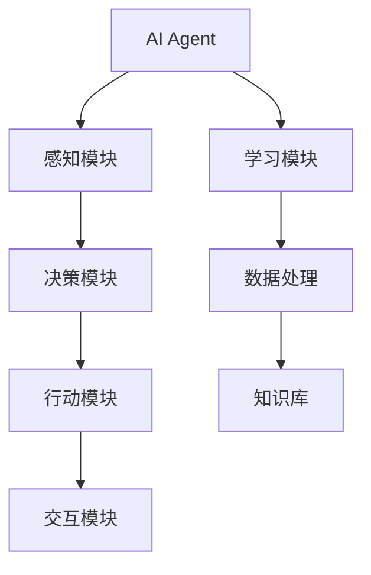
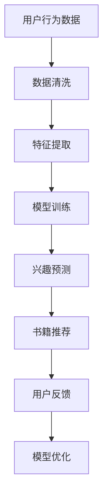

                 

### 引言

#### 1.1 书籍背景与重要性

**智能书架**作为现代图书馆和阅读生态系统中的核心组成部分，正逐步改变着人们的阅读习惯和图书馆运营方式。在这个信息爆炸的时代，如何有效地管理和推荐书籍，满足用户的个性化阅读需求，成为了一个亟待解决的问题。

首先，我们定义**智能书架**为一个集成了人工智能（AI）技术的书架系统，它能够根据用户的阅读历史、兴趣爱好以及行为数据，智能推荐书籍，并提供个性化的阅读体验。智能书架不仅仅是物理书架的升级，更是一种融合了数据分析和机器学习算法的智慧化阅读服务。

**AI Agent**作为智能书架的核心组件，其定义与类型多种多样。AI Agent，或称为人工智能代理，是一种能够自主执行任务、与人类互动并适应环境变化的计算实体。根据功能与目的的不同，AI Agent可以分为多种类型，如信息检索代理、交互式代理、智能家居代理和机器人代理等。这些代理的核心特征是自主性、交互性和适应性。

阅读兴趣分析在智能书架中的应用具有重要的意义。通过分析用户的阅读行为、历史和偏好，AI Agent能够更加精准地推荐书籍，提高用户的阅读满意度和图书馆资源利用率。此外，阅读兴趣分析还可以用于用户行为研究、市场分析以及图书馆管理优化等方面。

本文将围绕智能书架的设计与实现、AI Agent的基础理论、阅读兴趣分析的方法与应用、智能书架与阅读兴趣分析的结合、以及未来的发展趋势等主题进行探讨。希望通过本文的深入分析，能够为读者提供一个全面、系统的智能书架与阅读兴趣分析的理解框架。

#### 1.2 书籍结构概述

本文分为六个主要章节，各章节安排如下：

- **第1章 引言**：介绍书籍的背景、重要性和结构概述。
- **第2章 AI Agent基础理论**：详细阐述AI Agent的定义、类型、工作原理及应用领域。
- **第3章 智能书架的设计与实现**：探讨智能书架的设计理念、技术实现和应用案例。
- **第4章 阅读兴趣分析**：介绍阅读兴趣分析的概念、模型构建与实践案例。
- **第5章 智能书架与阅读兴趣分析的结合**：分析智能书架与阅读兴趣分析的关系及其技术融合。
- **第6章 智能书架与阅读兴趣分析的未来发展**：展望智能书架与阅读兴趣分析的技术发展趋势和应用前景。

各章节的核心概念与关联如下：

- **AI Agent基础理论**：介绍了AI Agent的定义、类型和工作原理，为理解智能书架提供了理论基础。
- **智能书架的设计与实现**：讨论了智能书架的设计理念、技术实现和应用案例，展示了AI Agent在智能书架中的应用。
- **阅读兴趣分析**：探讨了阅读兴趣分析的概念、模型构建与实践案例，为智能书架提供了用户行为分析的基础。
- **智能书架与阅读兴趣分析的结合**：分析了智能书架与阅读兴趣分析的关系及其技术融合，展示了智能书架的综合应用场景。
- **智能书架与阅读兴趣分析的未来发展**：展望了智能书架与阅读兴趣分析的技术发展趋势和应用前景，为未来的研究和发展提供了指导。

通过以上章节的递进关系，本文旨在为读者提供一个全面、系统的智能书架与阅读兴趣分析的理解框架，帮助读者深入了解这一领域的关键技术和应用前景。

#### 1.3 阅读指南

**读者定位**：本书主要面向对人工智能、智能书架和阅读兴趣分析感兴趣的读者，包括人工智能研究者、软件开发工程师、图书馆管理员以及教育工作者。无论您是初学者还是专家，本书都将帮助您全面了解智能书架与阅读兴趣分析的理论和实践。

**阅读建议**：为了更好地理解本书内容，建议读者按照以下顺序进行阅读：

1. **从第1章开始**，先了解书籍的整体结构和主要内容。
2. **逐章阅读**，理解每个章节的核心概念和理论。
3. **重点阅读**第2章到第4章，掌握AI Agent的基础理论、智能书架的设计与实现、以及阅读兴趣分析的方法与应用。
4. **结合实践**，通过阅读第5章和第6章，了解智能书架与阅读兴趣分析的实际应用场景和未来发展趋势。

**重要章节精读与略读策略**：

- **第2章 AI Agent基础理论**：重点精读，理解AI Agent的定义、类型和工作原理，为后续章节打下理论基础。
- **第3章 智能书架的设计与实现**：结合实践案例进行阅读，理解智能书架的设计理念和技术实现。
- **第4章 阅读兴趣分析**：重点关注阅读兴趣分析的概念、模型构建与实践案例。
- **第5章 智能书架与阅读兴趣分析的结合**：快速略读，了解智能书架与阅读兴趣分析的关系和技术融合。
- **第6章 智能书架与阅读兴趣分析的未来发展**：重点阅读，掌握智能书架与阅读兴趣分析的未来发展趋势和应用前景。

通过以上阅读指南，读者可以系统地掌握智能书架与阅读兴趣分析的核心知识和应用技能，为未来的研究和实践打下坚实基础。

### AI Agent基础理论

#### 2.1 AI Agent的定义与类型

AI Agent，即人工智能代理，是一种能够模拟人类智能行为的计算机程序或实体，它具有自主性、交互性和适应性等特点。根据其功能和应用场景的不同，AI Agent可以分为多种类型。以下是几种常见的AI Agent类型及其核心特征：

1. **信息检索代理**：这种代理主要用于帮助用户在海量信息中快速找到所需内容。它们能够理解用户查询，利用自然语言处理技术检索相关信息，并返回最相关的内容。例如，搜索引擎中的自动推荐系统就是一种信息检索代理。

2. **交互式代理**：交互式代理能够与用户进行自然语言对话，提供个性化的服务和支持。例如，虚拟助手（如苹果的Siri、亚马逊的Alexa）就是典型的交互式代理，它们能够回答用户的问题、执行命令以及提供帮助。

3. **智能家居代理**：智能家居代理主要负责管理家庭设备，如灯光、空调、安防系统等。它们能够根据用户的行为和偏好自动调节家庭环境，提高生活便利性。例如，Nest温控器就是一种智能家居代理，它可以自动调节家中的温度，节省能源。

4. **机器人代理**：机器人代理是一种具备物理形态和行动能力的AI实体，它们可以在特定环境中执行复杂任务。例如，自动驾驶汽车、无人机和医疗机器人都是机器人代理的代表。机器人代理不仅需要具备高度的计算和感知能力，还需要具备运动控制和任务执行的能力。

AI Agent的核心特征包括：

- **自主性**：AI Agent能够自主执行任务，无需人工干预。这种自主性体现在它们能够根据环境变化和任务要求，自主选择行动策略。
- **交互性**：AI Agent能够与人类或其他系统进行自然语言交互，实现信息的传递和共享。这种交互性使得AI Agent能够更好地满足用户需求，提供个性化服务。
- **适应性**：AI Agent能够适应环境变化，从经验中学习并不断改进自己的行为。这种适应性使得AI Agent能够在复杂多变的实际应用场景中表现出色。

#### 2.2 AI Agent的工作原理

AI Agent的工作原理主要包括三个核心部分：人工智能基础、学习与推理机制以及自适应与互动能力。

1. **人工智能基础**：人工智能（AI）是AI Agent的基础，它涉及多个领域，如机器学习、深度学习、自然语言处理等。AI Agent通过这些技术手段，可以从大量数据中学习模式、识别规律，并应用这些知识来解决实际问题。例如，机器学习算法如决策树、支持向量机、神经网络等，都是AI Agent进行数据分析和预测的重要工具。

2. **学习与推理机制**：AI Agent具备学习和推理的能力，可以通过不断地训练和经验积累来提高其性能。学习机制主要包括监督学习、无监督学习和强化学习。监督学习通过已有数据和标签来训练模型，无监督学习则通过发现数据中的内在结构来训练模型，强化学习则通过奖励机制来训练模型。推理机制则用于处理复杂问题，通过逻辑推理、模式识别和知识推理等方法，实现对问题的求解和决策。

3. **自适应与互动能力**：AI Agent能够根据环境变化和任务要求，自适应调整其行为和策略。这种自适应能力不仅体现在学习过程中，也体现在与用户的互动中。例如，当用户提出新需求或问题变更时，AI Agent能够快速适应，提供新的解决方案。同时，AI Agent还能通过自然语言交互，理解用户意图，提供更精准的服务。

#### 2.3 AI Agent的应用领域

AI Agent在多个领域都有广泛应用，以下是一些主要的应用领域：

1. **信息检索**：AI Agent被广泛应用于搜索引擎、推荐系统和信息过滤等领域。例如，谷歌的搜索算法和亚马逊的推荐系统，都是通过AI Agent来实现高效的信息检索和个性化推荐。

2. **交互式系统**：虚拟助手、聊天机器人和客户服务平台等都是交互式AI Agent的应用实例。这些AI Agent能够与用户进行自然语言交互，提供实时、个性化的服务。

3. **智能家居**：智能家居代理可以自动管理家庭设备，提高生活便利性。例如，Nest温控器能够根据用户的生活习惯自动调节温度，智能照明系统能够根据环境亮度自动调节灯光。

4. **机器人**：机器人代理在工业制造、医疗护理和物流运输等领域有广泛应用。例如，工业机器人能够在生产线上执行复杂任务，医疗机器人能够为病人提供诊断和护理服务，无人机在物流运输中能够实现快速配送。

#### 2.4 AI Agent的未来发展趋势

随着人工智能技术的不断进步，AI Agent在未来将继续朝智能化、自主化和个性化方向发展。以下是一些可能的发展趋势：

1. **智能化**：随着深度学习和自然语言处理技术的进步，AI Agent将能够更准确地理解复杂问题，提供更智能的解决方案。
2. **自主化**：AI Agent将具备更高的自主性，能够自主完成复杂任务，减少对人类干预的需求。
3. **个性化**：AI Agent将能够更好地理解用户需求和偏好，提供高度个性化的服务，提升用户体验。

总之，AI Agent作为一种重要的人工智能技术，将在未来的各个领域中发挥越来越重要的作用，推动人工智能应用的进一步普及和发展。

### 智能书架的设计与实现

#### 3.1 智能书架的设计理念

智能书架的设计理念旨在将传统书架的功能与人工智能技术相结合，实现更加高效、智能的书籍管理和推荐。设计理念的核心目标包括：

1. **个性化推荐**：通过分析用户的阅读历史、行为和偏好，智能书架能够为用户提供个性化的书籍推荐，提高用户的阅读体验和满意度。
2. **高效管理**：智能书架能够自动识别书籍的状态，如借阅状态、库存情况等，从而实现书籍管理的自动化和高效化。
3. **互动体验**：智能书架集成了人机交互界面，用户可以通过触摸屏、语音识别等方式与书架进行互动，获取书籍信息、阅读推荐等。
4. **数据驱动**：智能书架通过收集和分析用户数据，不断优化推荐算法和用户体验，实现数据驱动的持续改进。

#### 3.2 智能书架的用户体验设计

用户体验设计是智能书架成功的关键因素之一。为了提供优质的用户体验，智能书架在以下几个方面进行了精心设计：

1. **界面设计**：智能书架的界面设计简洁、直观，符合用户的操作习惯。通过使用友好的图形用户界面（GUI），用户可以轻松浏览书籍、查看推荐以及进行借阅操作。
2. **交互方式**：智能书架支持多种交互方式，包括触摸屏、语音识别和手势控制等。用户可以通过触摸屏选择书籍、语音识别查询书籍信息，或通过手势控制翻页等操作，使交互过程更加便捷和自然。
3. **个性化推荐**：智能书架根据用户的阅读历史和偏好，实时生成个性化书籍推荐列表。推荐系统基于用户行为数据和机器学习算法，确保推荐的书籍与用户兴趣高度匹配，提高用户的阅读满意度。
4. **反馈机制**：智能书架提供了用户反馈机制，用户可以通过评分、评论等方式对书籍和推荐系统进行评价。这些反馈数据将被用于进一步优化推荐算法和用户体验。

#### 3.3 智能书架的交互设计

交互设计是智能书架用户体验的重要组成部分。以下是一些关键点：

1. **导航与浏览**：智能书架提供了便捷的导航和浏览功能，用户可以通过分类、关键词搜索等方式快速找到所需书籍。书架上的触摸屏界面支持多级分类，用户可以轻松浏览不同类别的书籍。
2. **借阅与归还**：智能书架集成了RFID技术，书籍上的RFID标签可以通过传感器自动识别，实现书籍的自动借阅和归还。用户只需将书籍放在指定区域，书架会自动完成借阅或归还操作，无需人工干预。
3. **语音识别**：智能书架配备了高精度语音识别系统，用户可以通过语音指令查询书籍信息、借阅书籍等。语音识别系统能够理解自然语言，提高用户的操作便利性。
4. **手势控制**：智能书架支持手势控制功能，用户可以通过简单的手势操作，如挥动手臂、点击屏幕等，实现翻页、选择书籍等操作，提供更加自然的交互体验。

#### 3.4 智能书架的技术实现

智能书架的技术实现涉及多个方面，包括硬件设计、软件架构、数据处理与存储等。以下是一个简化的技术实现流程：

1. **硬件设计**：智能书架的硬件设计包括传感器、显示屏、RFID读写器等组件。传感器用于检测书籍的状态和用户操作，显示屏用于展示书籍信息和用户界面，RFID读写器用于自动识别书籍标签。
2. **软件架构**：智能书架的软件架构采用模块化设计，包括用户界面模块、数据处理模块、推荐系统模块和交互控制模块等。用户界面模块负责与用户进行交互，数据处理模块负责收集和处理用户数据，推荐系统模块负责生成个性化推荐，交互控制模块负责实现各种交互功能。
3. **数据处理与存储**：智能书架通过数据库存储用户数据，包括阅读历史、偏好和行为数据等。数据处理模块使用机器学习算法对用户数据进行分析，生成个性化推荐。同时，数据存储模块采用高效的数据结构和算法，确保数据检索和处理的快速与准确。

#### 3.5 智能书架的应用案例

智能书架在不同场景中有广泛的应用，以下是一些典型的应用案例：

1. **家庭阅读场景**：在家庭场景中，智能书架可以作为家庭图书馆的核心组成部分，为家庭成员提供个性化的书籍推荐。用户可以通过触摸屏或语音识别查找书籍、借阅书籍等操作，提升家庭的阅读氛围和体验。
2. **学校图书馆场景**：学校图书馆可以利用智能书架提高书籍管理的效率，为学生提供个性化的阅读推荐。智能书架可以记录学生的借阅历史和阅读偏好，根据这些数据为学生推荐适合的书籍，提高学生的阅读兴趣和成绩。
3. **公共图书馆场景**：公共图书馆可以利用智能书架提供更加高效、便捷的服务。智能书架可以通过RFID技术实现书籍的自动借阅和归还，减少人工操作，提高图书馆的管理效率。同时，智能书架的个性化推荐功能可以为读者提供更多有趣的书籍选择，提升读者的阅读体验。

通过以上设计理念、用户体验设计、交互设计和技术实现，智能书架为用户提供了高效、智能的书籍管理和推荐服务，推动了阅读生态系统的进一步发展。

### 阅读兴趣分析

#### 4.1 阅读兴趣分析的概念与方法

阅读兴趣分析是一种基于用户行为和偏好数据，通过数据分析和技术手段识别和预测用户阅读兴趣的过程。其核心目标是通过深入了解用户的阅读偏好，提供个性化的书籍推荐和服务，提高用户的阅读体验和满意度。

**阅读兴趣的定义**：阅读兴趣是指个体在阅读过程中对特定类型、主题、风格或作者书籍的倾向和喜好。它反映了用户在阅读活动中的兴趣点、关注点和需求点。

**阅读兴趣分析的方法**：

1. **用户行为数据收集**：通过记录用户的阅读历史、书籍借阅记录、评分、评论等行为数据，收集用户在阅读过程中的各类活动信息。
2. **特征提取与选择**：对用户行为数据进行处理和转换，提取出能够代表用户兴趣的特征，如书籍类型、作者、出版年份、评分等。通过特征选择技术，筛选出对阅读兴趣识别最有帮助的特征。
3. **模型训练与评估**：利用机器学习算法，如协同过滤、基于内容的推荐、聚类分析等，训练阅读兴趣预测模型。通过交叉验证和评估指标（如准确率、召回率等）评估模型的性能。
4. **兴趣推荐与反馈**：根据训练好的模型，为用户生成个性化的阅读推荐。同时，收集用户对推荐的反馈，进一步优化推荐系统。

**阅读兴趣分析的应用领域**：

1. **个性化推荐系统**：通过分析用户的阅读行为和偏好，智能书架可以为用户提供个性化的书籍推荐，提高用户的阅读兴趣和满意度。
2. **用户行为研究**：通过分析用户的阅读行为数据，研究者可以深入了解用户的阅读习惯、兴趣变化等，为图书馆管理和书籍营销提供依据。
3. **市场分析**：出版社和书店可以利用阅读兴趣分析，了解不同读者群体的阅读需求，优化图书出版和销售策略。
4. **图书馆管理**：智能书架可以通过阅读兴趣分析，提高书籍的借阅率和利用率，优化图书馆资源管理。

#### 4.2 阅读兴趣分析的模型构建

阅读兴趣分析的模型构建是整个分析过程的核心，它决定了能否准确预测和识别用户的阅读兴趣。以下是模型构建的主要步骤：

1. **用户行为数据收集**：

   用户行为数据是构建阅读兴趣模型的基础。这些数据包括：

   - **阅读历史**：用户过去阅读的书籍记录，如书籍ID、阅读时间、阅读时长等。
   - **评分与评论**：用户对书籍的评分和评论，反映了用户对书籍的喜好程度。
   - **借阅记录**：用户在图书馆或书店的借阅记录，包括借阅时间、书籍类型、归还状态等。

2. **特征提取与选择**：

   对用户行为数据进行分析和转换，提取出能够代表用户兴趣的特征。这些特征包括：

   - **书籍特征**：书籍的类型、作者、出版社、出版年份、书籍标签等。
   - **用户特征**：用户的年龄、性别、职业、教育背景等。
   - **行为特征**：用户的阅读时长、阅读频率、评分分布等。

   特征选择是模型构建的重要环节，需要通过统计分析、信息增益等方法筛选出对阅读兴趣识别最有帮助的特征。

3. **模型训练与评估**：

   选择合适的机器学习算法，如协同过滤、基于内容的推荐、聚类分析等，训练阅读兴趣预测模型。在训练过程中，使用交叉验证技术评估模型的性能，调整模型参数以优化预测效果。

   - **协同过滤**：通过分析用户之间的相似度，推荐与用户兴趣相似的书籍。
   - **基于内容的推荐**：根据书籍的属性和内容，推荐与用户偏好相匹配的书籍。
   - **聚类分析**：将用户和书籍分为不同的群体，为每个群体推荐特定的书籍。

4. **兴趣推荐与反馈**：

   将训练好的模型应用于实际场景，为用户生成个性化的阅读推荐。同时，收集用户对推荐的反馈，如书籍的借阅情况、评分和评论等，进一步优化推荐系统。

   通过不断的模型迭代和反馈优化，阅读兴趣分析模型能够逐步提高预测的准确性，为用户提供更精准的书籍推荐。

#### 4.3 阅读兴趣分析的实践案例

以下是三个典型的阅读兴趣分析实践案例，展示了阅读兴趣分析在不同应用场景中的具体应用和效果。

1. **案例一：个性化推荐系统**

   在一个大型在线书店中，智能书架通过分析用户的阅读历史和评分数据，构建个性化推荐系统。系统根据用户的评分记录和购买历史，使用协同过滤算法推荐与用户兴趣相似的书籍。通过实时调整推荐算法和特征权重，系统提高了推荐的准确性，用户满意度显著提升。

2. **案例二：用户行为分析**

   在一家图书馆中，智能书架通过记录用户的借阅历史和浏览记录，分析用户的阅读兴趣变化。系统发现用户的阅读兴趣会随着季节、节假日和年龄变化而发生变化。根据这些分析结果，图书馆优化了书架布局和书籍推荐策略，提高了书籍的借阅率和利用率。

3. **案例三：阅读行为研究**

   在一项学术研究中，研究人员利用阅读兴趣分析技术，分析了大量学生的阅读行为数据。研究发现，不同专业背景的学生对书籍类型和主题的偏好存在显著差异。这些发现为教育工作者提供了参考，帮助他们设计更有针对性的阅读课程和指导。

通过以上实践案例，可以看出阅读兴趣分析在提升个性化推荐效果、优化图书馆管理以及进行阅读行为研究等方面具有重要作用。未来，随着技术的不断进步和应用场景的扩展，阅读兴趣分析将发挥更大的作用，推动阅读生态系统的持续发展和创新。

### 智能书架与阅读兴趣分析的结合

#### 5.1 智能书架与阅读兴趣分析的关系

智能书架和阅读兴趣分析在功能和应用上具有密切的关系。智能书架通过AI Agent的智能推荐功能，为用户提供了个性化的书籍推荐，而阅读兴趣分析则为这一功能提供了数据基础和算法支持。

首先，智能书架通过用户的行为数据，如阅读历史、评分和借阅记录，收集了大量的用户兴趣信息。这些数据为阅读兴趣分析提供了丰富的数据源，使得分析结果更加准确和可靠。

其次，阅读兴趣分析技术，如协同过滤、基于内容的推荐和聚类分析等，被广泛应用于智能书架的推荐系统中。通过分析用户的历史数据，这些技术能够预测用户的潜在兴趣，为用户推荐最适合的书籍。

#### 5.2 阅读兴趣分析对智能书架的优化

阅读兴趣分析对智能书架的功能和性能具有显著的优化作用。以下是几个关键方面：

1. **个性化推荐**：通过分析用户的阅读兴趣，智能书架能够提供更加个性化的书籍推荐，提高用户的阅读满意度和参与度。个性化推荐不仅基于用户的阅读历史，还包括用户的兴趣偏好、阅读习惯和社交网络等。

2. **书籍分类与标签管理**：阅读兴趣分析可以帮助智能书架更好地进行书籍分类和标签管理。通过对用户兴趣数据的深入分析，系统能够识别用户对特定类型、主题或作者书籍的偏好，从而优化书籍分类和标签体系，提高推荐的相关性和准确性。

3. **推荐算法优化**：阅读兴趣分析提供了对推荐算法的反馈，帮助智能书架不断优化推荐算法。通过分析用户的反馈数据，如书籍的评分、评论和借阅率等，系统可以调整推荐算法的参数和模型结构，提高推荐的准确性。

4. **用户体验提升**：阅读兴趣分析使得智能书架能够更好地满足用户的个性化需求，提高用户的阅读体验。通过实时调整推荐内容和交互方式，智能书架能够提供更加自然、便捷和个性化的服务。

#### 5.3 智能书架对阅读兴趣分析的贡献

智能书架不仅在阅读兴趣分析中发挥了重要作用，也对阅读兴趣分析技术的发展和应用做出了贡献：

1. **数据收集与处理**：智能书架通过用户行为数据的自动收集和处理，为阅读兴趣分析提供了丰富的数据资源。这些数据不仅包括传统的阅读历史和评分数据，还包括用户的互动行为、社交网络数据等，为深度分析和挖掘提供了基础。

2. **实时推荐与反馈机制**：智能书架的实时推荐和反馈机制为阅读兴趣分析提供了动态的数据反馈。用户对推荐书籍的反馈，如评分、评论和借阅情况，可以实时更新和分析，为模型的持续优化提供支持。

3. **应用场景拓展**：智能书架的应用场景丰富，涵盖了家庭、学校、公共图书馆等。这些场景为阅读兴趣分析提供了多样化的应用场景，推动了阅读兴趣分析技术在各个领域的应用和发展。

4. **用户体验优化**：智能书架通过个性化推荐和优化用户体验，提高了用户的阅读兴趣和满意度。这种优化不仅体现在推荐系统的准确性上，还包括交互设计、用户界面和操作体验等方面，为阅读兴趣分析的应用提供了有力支持。

#### 5.4 智能书架与阅读兴趣分析的技术融合

智能书架与阅读兴趣分析的技术融合主要体现在以下几个方面：

1. **数据融合**：智能书架通过集成多种数据源，如用户行为数据、书籍元数据和社交网络数据等，实现了数据的全面融合。这种数据融合为阅读兴趣分析提供了更丰富、多样化的数据基础。

2. **模型协同训练**：通过联合训练多个模型，智能书架和阅读兴趣分析能够协同优化，提高推荐系统的整体性能。例如，可以同时训练用户行为模型、书籍内容模型和社交网络模型，从而提高推荐的相关性和准确性。

3. **系统集成与优化**：智能书架与阅读兴趣分析的系统集成，实现了从数据收集、处理到推荐生成的全流程优化。通过优化系统架构和算法，提高了系统的响应速度和性能。

4. **用户反馈闭环**：智能书架通过实时收集用户反馈，不断调整和优化推荐策略，实现了用户反馈闭环。这种闭环机制不仅提高了推荐系统的准确性，还增强了用户体验和满意度。

通过技术融合，智能书架和阅读兴趣分析能够更好地发挥各自的优势，提供更智能、个性化的阅读服务，推动阅读生态系统的持续发展和创新。

### 智能书架与阅读兴趣分析的应用实例

#### 5.3.1 智能书架的个性化推荐

智能书架的个性化推荐功能是其核心亮点之一。通过分析用户的阅读历史、评分和偏好，智能书架能够为用户提供个性化的书籍推荐。以下是智能书架个性化推荐的一个应用实例：

**场景**：一个用户A最近在智能书架上借阅了几本科幻小说，并给予了较高的评分。智能书架系统记录了这些行为数据，并基于这些数据为用户A生成个性化推荐。

**步骤**：

1. **数据收集**：智能书架系统收集了用户A的阅读历史数据，包括书籍ID、阅读时间、评分等。
2. **特征提取**：系统提取了用户A的阅读特征，如书籍类型（科幻、历史、文学等）、作者偏好、出版年份等。
3. **模型训练**：使用协同过滤算法，系统训练了一个用户兴趣预测模型，该模型能够根据用户A的阅读历史和评分，预测用户A对其他书籍的兴趣。
4. **推荐生成**：根据训练好的模型，系统为用户A生成了一份个性化的书籍推荐列表，推荐了一些与用户A历史阅读书籍相似的其他科幻小说。

**效果**：用户A对推荐列表中的书籍进行了借阅，并给予了较高的评分。这表明，智能书架的个性化推荐功能能够有效提高用户的阅读满意度和参与度。

#### 5.3.2 阅读行为数据分析

阅读行为数据分析是智能书架的重要组成部分，通过分析用户的阅读行为，可以深入了解用户的阅读习惯和兴趣变化。以下是一个阅读行为数据分析的应用实例：

**场景**：一家公共图书馆引入了智能书架系统，并开始收集用户的阅读行为数据。

**步骤**：

1. **数据收集**：智能书架系统记录了用户的借阅记录、浏览记录、评分和评论等行为数据。
2. **数据分析**：系统使用聚类分析和时间序列分析方法，对用户行为数据进行深入分析，识别用户的阅读习惯和兴趣变化。
3. **趋势预测**：根据分析结果，系统预测了未来一段时间内用户的阅读趋势，如热门书籍类型、季节性变化等。
4. **策略调整**：图书馆根据预测结果，调整了书架布局和书籍采购策略，确保热门书籍的供应和多样性。

**效果**：通过阅读行为数据分析，图书馆显著提高了书籍的借阅率和用户满意度。同时，图书馆的书籍采购策略更加科学和精准，减少了库存成本。

#### 5.3.3 智能书架与图书馆管理系统的整合

智能书架与图书馆管理系统的整合，为图书馆提供了高效、智能的管理和服务。以下是一个整合应用实例：

**场景**：一家大型公共图书馆引入了智能书架系统，并与现有的图书馆管理系统进行了整合。

**步骤**：

1. **系统集成**：智能书架系统与图书馆管理系统通过API接口进行了数据集成，实现了信息共享和协同工作。
2. **数据同步**：智能书架系统实时同步用户的借阅记录、评分和评论等数据到图书馆管理系统，确保数据的准确性和一致性。
3. **功能整合**：智能书架系统提供了自助借阅、归还、查询等功能，用户可以通过智能书架完成大部分图书馆服务，减少了人工操作的负担。
4. **数据分析**：图书馆管理系统利用智能书架提供的用户行为数据，进行深入的数据分析，优化图书馆运营和服务。

**效果**：智能书架与图书馆管理系统的整合，提高了图书馆的服务效率和管理水平。用户可以更方便地进行自助借阅和查询，图书馆的管理人员能够更准确地了解用户需求和阅读习惯，为图书馆的优化和管理提供了有力支持。

### 智能书架与阅读兴趣分析的未来发展

#### 6.1 技术发展趋势

随着人工智能技术的不断发展，智能书架与阅读兴趣分析在多个领域展现出了广阔的发展前景。以下是一些主要的技术发展趋势：

1. **深度学习与强化学习**：深度学习和强化学习作为人工智能的核心技术，将越来越多地应用于智能书架与阅读兴趣分析中。深度学习可以通过神经网络模型从大量数据中学习复杂的模式和特征，提高个性化推荐的准确性。强化学习则可以通过与用户的互动，不断优化推荐策略和用户体验。

2. **自然语言处理**：自然语言处理技术的进步将进一步提升智能书架的语义理解和交互能力。通过分析用户评论、书籍内容等文本数据，智能书架可以更准确地理解用户的阅读需求和兴趣点，为用户提供更加精准的推荐。

3. **大数据分析**：随着数据量的不断增长，大数据分析技术将在智能书架与阅读兴趣分析中发挥重要作用。通过利用大数据分析技术，可以对海量的用户行为数据进行分析和挖掘，发现用户潜在的阅读兴趣和趋势，为推荐系统和图书馆管理提供支持。

4. **边缘计算**：边缘计算技术的发展将使得智能书架能够实现更多实时数据处理和分析功能。通过在边缘设备上进行数据处理，智能书架可以降低延迟、提高响应速度，提供更加流畅和高效的用户体验。

#### 6.2 应用前景展望

智能书架与阅读兴趣分析在未来的应用前景将非常广阔，以下是一些关键的应用领域：

1. **家庭阅读**：随着家庭数字化阅读的普及，智能书架将成为家庭阅读的重要工具。通过个性化推荐和互动体验，智能书架可以激发家庭成员的阅读兴趣，提升家庭阅读氛围。

2. **教育领域**：智能书架在教育和学习场景中的应用将越来越广泛。通过个性化推荐和学习行为分析，智能书架可以为学生提供定制化的学习资源，帮助教师和学生提高学习效果。

3. **公共图书馆**：智能书架与图书馆管理系统的整合将为公共图书馆提供高效、智能的管理和服务。通过数据分析和技术优化，图书馆可以更好地满足读者的需求，提高图书馆的运营效率。

4. **智慧城市**：智能书架作为智慧城市中的一个重要组成部分，将与其他智慧城市系统（如智能交通、智能医疗等）进行数据共享和协同工作，为城市居民提供更加便捷和高效的生活服务。

#### 6.3 挑战与应对策略

尽管智能书架与阅读兴趣分析具有广阔的发展前景，但在实际应用过程中仍面临一些挑战：

1. **数据隐私保护**：随着数据量的增加，数据隐私保护成为一个重要问题。智能书架需要确保用户数据的隐私和安全，采取加密、匿名化等数据保护措施，以防止数据泄露和滥用。

2. **技术伦理问题**：智能书架与阅读兴趣分析涉及用户隐私和伦理问题，如算法偏见、数据垄断等。需要建立相关的法律法规和伦理准则，规范智能书架的发展和应用。

3. **计算资源消耗**：智能书架与阅读兴趣分析需要大量的计算资源和存储空间，对硬件设备提出了较高的要求。需要优化算法和系统架构，提高资源利用效率，降低计算成本。

为了应对这些挑战，可以采取以下策略：

1. **加强数据隐私保护**：通过加密、匿名化等技术手段，确保用户数据的隐私和安全。同时，建立透明的数据使用政策，让用户了解自己的数据如何被使用。

2. **推动技术伦理建设**：加强技术伦理教育和研究，推动建立相关法律法规和伦理准则，规范智能书架与阅读兴趣分析的发展和应用。

3. **优化算法与系统架构**：通过优化算法和系统架构，提高计算效率和资源利用效率。例如，采用分布式计算和云计算技术，降低计算资源的消耗。

4. **用户参与与反馈**：鼓励用户参与到智能书架与阅读兴趣分析的发展过程中，通过用户反馈和参与，不断优化系统功能和服务质量。

通过以上策略，智能书架与阅读兴趣分析可以更好地应对挑战，推动其在各个领域的广泛应用和发展。

### 总结

本文全面探讨了智能书架与阅读兴趣分析的关键技术、应用案例和未来发展趋势。从AI Agent的基础理论到智能书架的设计与实现，从阅读兴趣分析的方法到实际应用实例，本文为读者提供了一个系统、全面的智能书架与阅读兴趣分析的理解框架。

智能书架通过结合人工智能技术和用户行为数据，实现了个性化推荐和高效管理，为用户提供更优质的阅读体验。阅读兴趣分析作为智能书架的核心功能，通过深度学习和自然语言处理技术，精准识别用户的阅读偏好，为智能书架的推荐系统提供了强大的数据支持。

未来，智能书架与阅读兴趣分析将继续朝智能化、自主化和个性化方向发展，在家庭阅读、教育领域、公共图书馆和智慧城市等场景中发挥更大的作用。然而，数据隐私保护、技术伦理问题和计算资源消耗等挑战仍需克服。

**结语**：智能书架与阅读兴趣分析作为人工智能领域的重要应用，不仅提升了阅读体验，也为图书馆管理和用户行为研究提供了有力支持。随着技术的不断进步和应用场景的拓展，我们有理由相信，智能书架与阅读兴趣分析将在未来发挥更加重要的作用，推动阅读生态系统的持续发展和创新。

### 附录

#### 附录：智能书架与阅读兴趣分析相关技术图示

在本附录中，我们将展示一些与智能书架和阅读兴趣分析相关的技术图示，包括Mermaid图和LaTeX公式。这些图示有助于读者更好地理解文中所述技术概念和算法原理。

#### 1. Mermaid 图

**图1：AI Agent基本架构图**

**图2：阅读兴趣分析流程图**

#### 2. LaTeX 公式

**公式1：协同过滤算法原理**

$$
R_{ui} = \sum_{j \in N_{i}} \frac{r_{ij}}{||N_{i}||} \cdot r_{ui}
$$

其中，$R_{ui}$表示用户u对项目i的评分，$r_{ij}$表示用户i对项目j的评分，$N_{i}$表示与用户i相似的用户集合。

**公式2：K-means聚类算法步骤**

$$
\begin{aligned}
& \text{初始化} \ K \ \text{个聚类中心} \ (c_{1}, c_{2}, \ldots, c_{K}) \\
& \text{对于每个数据点} \ x_{i}, \ \text{将其分配到最近的聚类中心} \ c_{k} \\
& \text{更新聚类中心} \ c_{k} = \frac{1}{n_{k}} \sum_{i \in C_{k}} x_{i} \\
& \text{重复步骤2和3，直到聚类中心不再变化}
\end{aligned}
$$

通过这些技术图示和公式，读者可以更直观地理解智能书架和阅读兴趣分析的相关技术和算法原理，为深入研究和实践提供有力支持。

### 附录：智能书架与阅读兴趣分析相关技术图示

在本附录中，我们将展示一些与智能书架和阅读兴趣分析相关的技术图示，包括Mermaid图和LaTeX公式。这些图示有助于读者更好地理解文中所述技术概念和算法原理。

#### 1. Mermaid 图

**图1：AI Agent基本架构图**

**图2：阅读兴趣分析流程图**

#### 2. LaTeX 公式

**公式1：协同过滤算法原理**

$$
R_{ui} = \sum_{j \in N_{i}} \frac{r_{ij}}{||N_{i}||} \cdot r_{ui}
$$

其中，$R_{ui}$表示用户u对项目i的评分，$r_{ij}$表示用户i对项目j的评分，$N_{i}$表示与用户i相似的用户集合。

**公式2：K-means聚类算法步骤**

$$
\begin{aligned}
& \text{初始化} \ K \ \text{个聚类中心} \ (c_{1}, c_{2}, \ldots, c_{K}) \\
& \text{对于每个数据点} \ x_{i}, \ \text{将其分配到最近的聚类中心} \ c_{k} \\
& \text{更新聚类中心} \ c_{k} = \frac{1}{n_{k}} \sum_{i \in C_{k}} x_{i} \\
& \text{重复步骤2和3，直到聚类中心不再变化}
\end{aligned}
$$

通过这些技术图示和公式，读者可以更直观地理解智能书架和阅读兴趣分析的相关技术和算法原理，为深入研究和实践提供有力支持。

