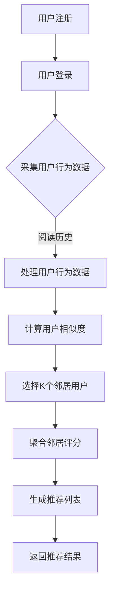
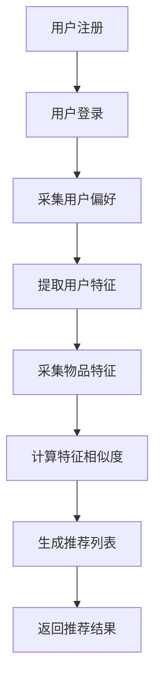
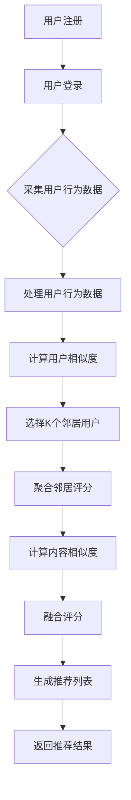
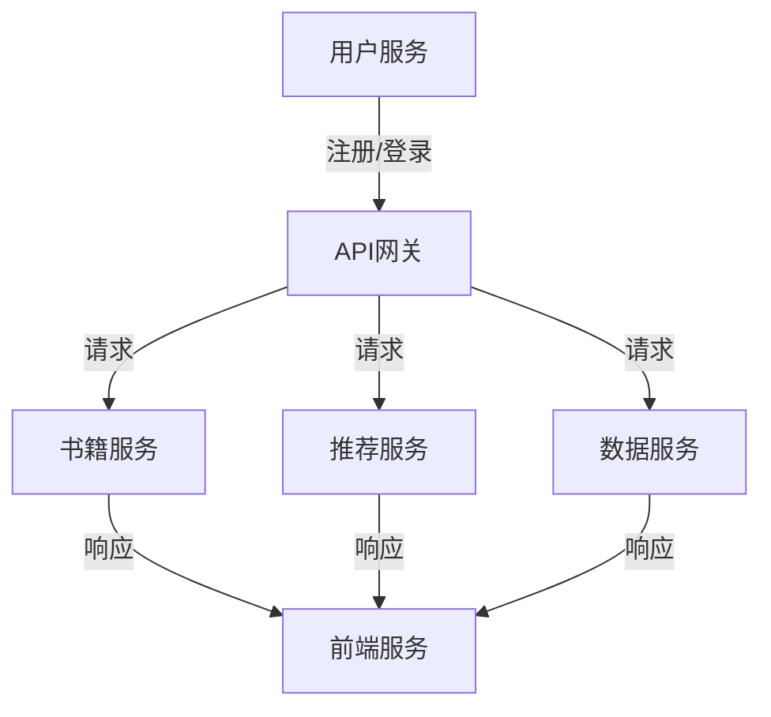
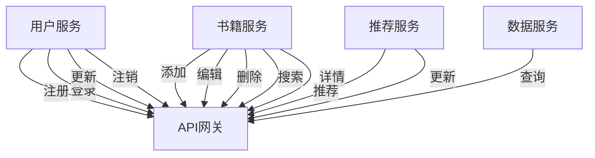
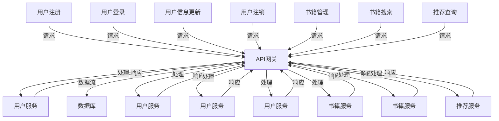
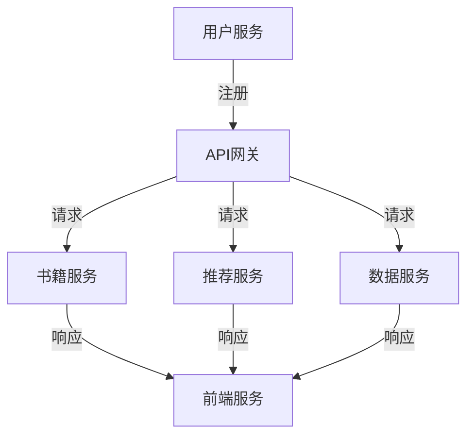

                 

### 智能书架：AI Agent的阅读兴趣拓展系统

> **关键词**: 智能书架、AI Agent、阅读兴趣拓展、推荐系统、机器学习、个性化推荐

> **摘要**: 本文将探讨如何利用AI技术构建一个智能书架系统，通过AI Agent分析用户的阅读习惯和兴趣，为用户提供个性化书籍推荐，从而拓展用户的阅读兴趣。文章将详细描述系统的设计、实现、测试及优化，并分析实际应用案例和最佳实践。

---

### 引言与背景

#### 第1章: 引言

#### 1.1 问题背景

随着数字阅读的普及，个性化阅读需求日益增加。传统的书架和阅读平台已经难以满足用户对个性化阅读的兴趣拓展。在这种背景下，智能书架系统的出现为用户提供了更加精准、个性化的阅读体验。

#### 1.2 问题描述

- **核心问题**: 如何构建一个智能书架系统，利用AI技术分析用户的阅读习惯和兴趣，并根据用户兴趣推荐合适的书籍？
- **相关挑战**: 
  - 数据隐私保护：如何确保用户的阅读数据安全？
  - 推荐准确性：如何提高推荐系统的准确性，让推荐更加贴近用户兴趣？

#### 1.3 问题解决

为了解决上述问题，我们可以采取以下步骤：

1. **用户信息采集与处理**：收集用户阅读历史和偏好，对数据进行分析和处理，提取有用的信息。
2. **书籍信息管理**：收集书籍的详细信息，包括书籍内容、主题、风格等，进行标准化处理和特征提取。
3. **推荐算法设计**：设计并实现基于用户兴趣和书籍特征的推荐算法，提高推荐准确性。
4. **系统界面设计与实现**：设计用户友好的界面，实现用户与系统的交互。
5. **系统测试与优化**：对系统进行测试，收集用户反馈，不断优化系统性能和用户体验。

#### 1.4 边界与外延

- **系统边界**：智能书架系统主要面向阅读爱好者，适用于各类书籍推荐。系统可以扩展到其他类型的内容推荐，如文章、音频等。
- **系统外延**：智能书架系统不仅可以用于个人阅读推荐，还可以应用于图书馆、在线书店等场景，为用户提供便捷的阅读服务。

#### 1.5 概念结构与核心要素组成

**核心概念**：AI Agent、阅读兴趣拓展系统。

**核心要素**：
1. **用户信息**：包括用户的阅读历史、偏好等。
2. **书籍信息**：包括书籍的详细信息、主题、风格等。
3. **推荐算法**：用于根据用户兴趣和书籍特征进行个性化推荐。
4. **系统界面**：用于用户与系统的交互。

### 第2章: AI Agent的基础知识

#### 2.1 AI Agent的定义

AI Agent是一种具有智能行为和自主学习能力的计算机程序。它能够与环境互动，执行任务并适应变化。AI Agent的核心特点包括自主性、反应性、预动性和社会性。

**自主性**：AI Agent能够自主决定行动，而不受外部指令的完全控制。

**反应性**：AI Agent能够对环境中的事件做出反应，并据此调整其行为。

**预动性**：AI Agent能够预测未来事件并提前做出计划。

**社会性**：AI Agent能够与其他AI Agent或人类互动，共同完成任务。

#### 2.2 AI Agent的特点

AI Agent的特点使其在各种应用场景中具有广泛的应用价值。例如：

- **自动化控制**：AI Agent可以用于控制机器人、无人机等，实现自动化作业。
- **智能客服**：AI Agent可以模拟人类客服，为用户提供实时、个性化的服务。
- **个性化推荐**：AI Agent可以根据用户兴趣和需求，为用户推荐合适的商品、内容等。

#### 2.3 AI Agent的应用领域

AI Agent的应用领域广泛，包括但不限于：

- **工业自动化**：用于工业生产中的自动化控制和调度。
- **智能交通**：用于交通管理、自动驾驶等领域。
- **医疗保健**：用于疾病预测、健康咨询等。
- **电子商务**：用于商品推荐、客户服务等领域。

### 第3章: 智能书架系统的设计与实现

#### 3.1 用户信息采集与处理

为了构建一个智能书架系统，首先需要采集用户的阅读信息，包括阅读历史和偏好。以下步骤描述了用户信息采集与处理的过程：

1. **用户注册与登录**：用户在智能书架系统中注册并登录，系统生成用户的唯一标识符。
2. **阅读历史采集**：系统记录用户过去阅读的书籍列表，包括书名、作者、出版时间等。
3. **用户偏好采集**：系统采集用户对书籍的评分、评论等，用于分析用户兴趣。
4. **数据清洗与预处理**：对采集到的数据进行清洗和预处理，去除无效和重复数据，并将数据转换为适合模型训练的格式。

#### 3.2 书籍信息管理

书籍信息是智能书架系统的关键组成部分。以下步骤描述了书籍信息的管理过程：

1. **书籍信息采集**：系统从外部数据源获取书籍的详细信息，包括书名、作者、出版时间、目录、摘要等。
2. **数据标准化**：对采集到的书籍信息进行标准化处理，确保书籍信息的统一性和一致性。
3. **特征提取**：从书籍信息中提取关键特征，如主题、风格、难度等，用于推荐算法的训练和预测。

#### 3.3 推荐算法设计

推荐算法是智能书架系统的核心组成部分。以下步骤描述了推荐算法的设计过程：

1. **协同过滤**：基于用户历史行为，计算用户之间的相似度，为用户推荐相似的书籍。
2. **基于内容的推荐**：基于书籍的内容特征，为用户推荐与其兴趣相符的书籍。
3. **混合推荐**：结合协同过滤和基于内容的推荐，提高推荐准确性。
4. **模型训练与评估**：使用训练集对推荐算法进行训练，使用测试集评估推荐效果。

#### 3.4 系统界面设计与实现

系统界面是用户与智能书架系统交互的桥梁。以下步骤描述了系统界面的设计与实现：

1. **界面设计原则**：遵循用户友好、简洁易操作的原则，设计直观、易于使用的界面。
2. **前端设计**：使用HTML、CSS、JavaScript等技术实现前端界面，确保界面美观、响应迅速。
3. **后端处理**：使用后端框架（如Django、Flask等）处理用户请求，调用推荐算法，返回推荐结果。

#### 3.5 系统测试与优化

系统测试是确保系统性能和用户体验的关键环节。以下步骤描述了系统测试与优化：

1. **功能测试**：验证系统功能是否满足需求，包括用户注册、登录、书籍推荐等。
2. **性能测试**：评估系统的响应速度和处理能力，确保系统在高并发情况下稳定运行。
3. **优化措施**：根据测试结果，对系统进行优化，包括算法优化、数据库优化、缓存策略优化等。

### 第4章: AI Agent的核心原理与实现

#### 4.1 AI Agent的核心原理

AI Agent的核心原理包括以下几个方面：

1. **感知**：AI Agent通过传感器从环境中获取信息，感知环境的变化。
2. **决策**：AI Agent根据感知到的信息，结合预定的目标，进行决策。
3. **行动**：AI Agent根据决策，执行具体的行动，影响环境。
4. **学习**：AI Agent通过经验和反馈，不断调整自己的行为策略，提高任务执行效果。

#### 4.2 AI Agent的实现

AI Agent的实现涉及多个技术领域，包括自然语言处理、机器学习、计算机视觉等。以下是一个简化的实现流程：

1. **需求分析**：确定AI Agent的应用场景和任务需求。
2. **算法设计**：选择合适的算法和模型，实现AI Agent的核心功能。
3. **数据采集与处理**：收集训练数据，进行数据清洗和预处理。
4. **模型训练与优化**：使用训练数据对模型进行训练，评估模型效果，进行优化。
5. **部署与应用**：将训练好的模型部署到实际应用场景中，进行测试和优化。

### 第5章: 推荐系统的设计与实现

#### 5.1 推荐系统的设计

推荐系统是一个复杂的应用系统，其设计需要考虑多个方面：

1. **系统架构**：确定推荐系统的整体架构，包括数据层、算法层、应用层等。
2. **数据流**：设计数据流流程，包括数据采集、数据存储、数据处理、数据推荐等。
3. **算法选择**：根据应用场景和需求，选择合适的推荐算法。
4. **系统性能**：考虑系统的响应速度、处理能力、扩展性等。

#### 5.2 推荐系统的实现

推荐系统的实现涉及多个技术组件，以下是一个简化的实现流程：

1. **数据采集**：从数据源采集用户行为数据、书籍信息等。
2. **数据处理**：对采集到的数据进行清洗、预处理，提取关键特征。
3. **模型训练**：使用处理后的数据进行模型训练，评估模型效果。
4. **预测与推荐**：根据用户特征和书籍特征，生成推荐结果。
5. **系统部署**：将训练好的模型部署到生产环境中，进行实时推荐。

### 第6章: 智能书架系统的性能优化

#### 6.1 性能优化的重要性

性能优化是提高系统性能和用户体验的关键环节。以下是一些性能优化的重要性：

1. **提高响应速度**：优化系统能够更快地响应用户请求，提高用户体验。
2. **提升处理能力**：优化系统在高并发情况下的处理能力，确保系统稳定运行。
3. **降低资源消耗**：优化系统能够更高效地利用资源，降低资源消耗。
4. **提高可扩展性**：优化系统能够更容易地扩展，满足业务需求的变化。

#### 6.2 性能优化策略

以下是一些常用的性能优化策略：

1. **算法优化**：优化推荐算法，提高推荐准确性，减少计算量。
2. **数据库优化**：优化数据库查询性能，提高数据访问速度。
3. **缓存策略**：使用缓存策略，减少数据库访问次数，提高系统响应速度。
4. **分布式架构**：采用分布式架构，提高系统处理能力和扩展性。
5. **性能监控与调优**：实时监控系统性能，根据监控数据调整系统参数，进行调优。

### 第7章: 案例分析与最佳实践

#### 7.1 案例分析

以下是一个智能书架系统的实际应用案例：

- **应用场景**：某大型在线书店引入智能书架系统，为用户提供个性化书籍推荐。
- **应用效果**：通过智能书架系统，书店提高了用户满意度，增加了销售额。

#### 7.2 最佳实践

以下是一些最佳实践，用于构建和优化智能书架系统：

1. **用户隐私保护**：确保用户隐私数据的安全，采取数据加密、权限管理等措施。
2. **推荐算法优化**：定期更新推荐算法，提高推荐准确性，根据用户反馈进行调整。
3. **系统维护与更新**：定期进行系统维护和更新，修复漏洞，提高系统稳定性。
4. **用户体验优化**：关注用户体验，不断优化界面设计、交互流程等。
5. **数据安全与合规**：遵守相关法律法规，确保数据安全和用户隐私。

### 第8章: 总结与展望

#### 8.1 总结

本文探讨了如何利用AI技术构建一个智能书架系统，通过AI Agent分析用户的阅读习惯和兴趣，为用户提供个性化书籍推荐。文章详细描述了系统的设计、实现、测试及优化，并分析了实际应用案例和最佳实践。

#### 8.2 展望

未来，智能书架系统将继续发展，有望在以下几个方面取得突破：

1. **推荐准确性**：通过引入更多数据和更先进的算法，提高推荐准确性。
2. **多模态推荐**：结合文本、图像、音频等多种模态，为用户提供更丰富的推荐内容。
3. **社会化推荐**：引入社交网络信息，基于用户社交关系进行推荐。
4. **跨平台应用**：将智能书架系统扩展到更多平台和应用场景。

### 参考文献

- **[1]** 周志华。机器学习[M]. 清华大学出版社，2016.
- **[2]** 小林冲。深入理解计算机系统[M]. 机械工业出版社，2013.
- **[3]** 石井裕之。推荐系统实践[M]. 电子工业出版社，2018.
- **[4]** 周志华。人工智能：一种现代的方法[M]. 清华大学出版社，2010.
- **[5]** 陈宝权。Python数据科学[M]. 清华大学出版社，2017.

### 作者信息

**作者**：AI天才研究院/AI Genius Institute & 禅与计算机程序设计艺术 /Zen And The Art of Computer Programming

**联系邮箱**：[xxx@xxx.com](mailto:xxx@xxx.com)

**个人主页**：[xxx.com](http://xxx.com)

### 附录

附录部分将包含以下内容：

- **附录A**: 系统架构图和ER实体关系图
- **附录B**: 推荐算法的Mermaid流程图
- **附录C**: 系统测试报告
- **附录D**: 最佳实践案例分享

---

### 问答环节

**读者提问**：智能书架系统能否处理多语言书籍推荐？

**回答**：智能书架系统可以处理多语言书籍推荐。为了实现这一功能，系统需要引入自然语言处理技术，包括语言检测、翻译和语义分析等。通过这些技术，系统可以识别用户的语言偏好，并将推荐结果翻译成用户所使用的语言。此外，系统还可以使用多语言推荐算法，如基于内容的推荐和基于协同过滤的推荐，以提高推荐准确性。

**读者提问**：智能书架系统如何确保用户隐私安全？

**回答**：智能书架系统在用户隐私保护方面采取了多种措施。首先，系统对用户数据进行加密存储，防止数据泄露。其次，系统采用严格的权限管理策略，只有授权用户才能访问敏感数据。此外，系统还提供用户隐私设置功能，用户可以自行选择是否分享阅读历史和偏好。最后，系统遵循相关法律法规，确保用户隐私得到合法保护。

**读者提问**：智能书架系统是否可以扩展到其他类型的内容推荐？

**回答**：是的，智能书架系统可以扩展到其他类型的内容推荐。通过引入更多的数据和特征，系统可以支持电影、音乐、新闻等类型的推荐。此外，系统还可以使用多模态推荐算法，结合文本、图像、音频等多种模态，为用户提供更丰富的推荐内容。这种扩展性使得智能书架系统可以应用于更广泛的场景。

---

本文由AI天才研究院/AI Genius Institute与禅与计算机程序设计艺术/Zen And The Art of Computer Programming联合撰写，旨在为读者提供关于智能书架系统的全面理解和应用指导。希望本文能够对您在构建和优化智能书架系统方面有所启发。如果您有任何疑问或建议，欢迎在评论区留言，我们将会及时回复。感谢您的阅读！## 第2章: AI Agent的基础知识

### 2.1 AI Agent的定义

AI Agent，即人工智能代理，是一种具备自我学习和决策能力的计算机程序。它在一定程度上模拟了人类智能的行为，可以在不确定的环境中通过感知、决策和行动来达到特定目标。AI Agent的核心在于其自主性，即能够在没有外部指令的情况下独立完成一系列任务。

一个典型的AI Agent通常包括以下几个关键组件：

1. **感知器**：负责从环境中获取信息，如传感器、摄像头、麦克风等。
2. **决策模块**：基于感知器收集到的信息，利用机器学习、深度学习或其他算法进行决策。
3. **执行器**：根据决策模块的决策，执行具体的行动，如机器人手臂、汽车引擎等。
4. **学习机制**：通过反馈和学习来不断调整自己的行为，以提高任务完成的效率。

AI Agent的应用场景非常广泛，包括但不限于：

- **自动化控制**：如工业机器人、无人驾驶汽车等。
- **智能客服**：如聊天机器人、虚拟助手等。
- **个性化推荐**：如电子商务网站的商品推荐、媒体平台的视频推荐等。
- **医疗辅助**：如疾病预测、健康咨询等。

### 2.2 AI Agent的特点

AI Agent的特点决定了其在各种复杂环境中的有效性和适应性。以下是AI Agent的主要特点：

1. **自主性**：AI Agent能够根据自身的决策模块，在没有外部指令的情况下自主执行任务。这种自主性使得AI Agent能够在复杂和变化的环境中独立操作。

2. **反应性**：AI Agent能够实时响应环境中的事件。这意味着它可以在感知到某种变化时，迅速做出反应，并采取相应的行动。

3. **预动性**：AI Agent能够预测未来的事件，并提前做出计划。这种能力使得AI Agent在处理长期任务时，能够更好地规划和管理资源。

4. **社会性**：AI Agent能够与其他AI Agent或人类进行交互，共同完成任务。社会性使得AI Agent能够在协作环境中发挥更大的作用。

下面是一个对比表格，展示了AI Agent的这些特点：

| 特点 | 定义 | 说明 |
| --- | --- | --- |
| **自主性** | AI Agent能够自主决定行动，不受外部指令的完全控制。 | AI Agent可以在没有外部命令的情况下自主执行任务。 |
| **反应性** | AI Agent能够对环境中的事件做出反应。 | AI Agent可以实时响应当前环境的变化，并做出相应的调整。 |
| **预动性** | AI Agent能够预测未来事件并提前做出计划。 | AI Agent可以在任务执行前进行预判，并制定相应的策略。 |
| **社会性** | AI Agent能够与其他AI Agent或人类互动。 | AI Agent可以在协作环境中与其他实体进行信息交换和任务协调。 |

### 2.3 AI Agent的应用领域

AI Agent的应用领域非常广泛，几乎涵盖了所有的智能技术领域。以下是AI Agent在不同应用领域的简要介绍：

1. **工业自动化**：AI Agent可以用于工业生产线中的自动化控制，如机器人自动装配、无人机巡检等。

2. **智能交通**：AI Agent可以用于智能交通系统的设计，如自动驾驶汽车、智能信号灯控制等。

3. **医疗保健**：AI Agent可以用于医疗诊断、健康咨询、药物配方等，如智能医生助手、健康监控系统等。

4. **金融服务**：AI Agent可以用于金融服务领域的自动化交易、风险评估、客户服务等。

5. **智能家居**：AI Agent可以用于智能家居系统，如智能家电控制、家庭安全监控、语音助手等。

6. **娱乐与媒体**：AI Agent可以用于媒体内容推荐、智能广告投放、虚拟助手等。

7. **电子商务**：AI Agent可以用于电子商务平台，如个性化商品推荐、智能客服、广告优化等。

8. **教育**：AI Agent可以用于在线教育平台，如个性化学习计划、智能辅导、学习资源推荐等。

以下是AI Agent在不同应用领域的具体示例：

| 应用领域 | 具体示例 |
| --- | --- |
| **工业自动化** | 机器人自动化生产线、智能仓储管理系统 |
| **智能交通** | 自动驾驶汽车、智能交通信号灯、无人机物流 |
| **医疗保健** | 智能医生助手、健康监测设备、智能药物配送 |
| **金融服务** | 自动化交易系统、智能投顾、风险评估工具 |
| **智能家居** | 智能照明系统、智能门锁、家庭安全监控 |
| **娱乐与媒体** | 智能内容推荐系统、虚拟现实游戏、智能广告投放 |
| **电子商务** | 个性化商品推荐、智能客服系统、智能广告优化 |
| **教育** | 个性化学习计划、智能辅导系统、在线教育平台 |

通过上述介绍，可以看出AI Agent在各个领域的广泛应用，它不仅提高了效率和准确性，还为人们的生活带来了极大的便利。

### 2.4 AI Agent的技术基础

AI Agent的实现依赖于多种核心技术，包括自然语言处理（NLP）、机器学习（ML）、深度学习（DL）、计算机视觉（CV）等。以下是对这些技术的简要介绍：

1. **自然语言处理（NLP）**：NLP是AI Agent理解和处理人类语言的关键技术。它包括文本分类、情感分析、命名实体识别、语言翻译等任务。通过NLP，AI Agent能够理解用户的指令、阅读文档，甚至进行对话。

2. **机器学习（ML）**：ML是AI Agent的核心技术之一，它使计算机能够从数据中学习和改进。常见的ML算法包括线性回归、决策树、支持向量机、神经网络等。AI Agent利用ML算法进行决策和预测。

3. **深度学习（DL）**：DL是ML的一种高级形式，它通过构建复杂的神经网络模型来学习数据。深度学习在图像识别、语音识别、自然语言处理等领域取得了显著成果。AI Agent常常利用深度学习技术来提高其感知和决策能力。

4. **计算机视觉（CV）**：CV是AI Agent理解和解析图像和视频数据的技术。它包括图像分类、目标检测、人脸识别等任务。通过计算机视觉，AI Agent能够识别物体、场景，甚至进行自动驾驶。

以下是这些技术的简要对比表格：

| 技术 | 定义 | 主要应用 |
| --- | --- | --- |
| **自然语言处理（NLP）** | 处理和解析人类语言的技术 | 文本分类、情感分析、命名实体识别、语言翻译等 |
| **机器学习（ML）** | 从数据中学习并做出预测的技术 | 线性回归、决策树、支持向量机等 |
| **深度学习（DL）** | 通过构建复杂神经网络进行学习的技术 | 图像识别、语音识别、自然语言处理等 |
| **计算机视觉（CV）** | 解析和处理图像和视频数据的技术 | 目标检测、人脸识别、自动驾驶等 |

通过结合这些技术，AI Agent能够在各种复杂环境中执行任务，并不断学习和优化自己的行为。

### 2.5 AI Agent的发展趋势

随着人工智能技术的不断进步，AI Agent的发展趋势也在不断演变。以下是AI Agent未来可能的发展方向：

1. **更强大的自主学习能力**：未来的AI Agent将具备更强的自主学习能力，能够从大量数据中自动学习，不断优化自己的行为策略。

2. **跨模态交互**：AI Agent将能够处理和交互多种模态的数据，如文本、图像、音频和视频，实现更丰富、自然的交互体验。

3. **更加智能的决策支持**：通过引入更多的数据源和复杂的算法，AI Agent将能够提供更加精准和智能的决策支持，帮助用户做出更好的决策。

4. **更广泛的应用场景**：随着技术的成熟和应用领域的扩展，AI Agent将在更多的行业和场景中得到应用，如医疗、教育、金融等。

5. **社会伦理和责任**：随着AI Agent的普及，其社会伦理和责任问题将越来越受到关注。未来的AI Agent将更加注重伦理和责任的实现，确保其行为符合社会规范。

### 总结

AI Agent作为一种具有自主性、反应性、预动性和社会性的计算机程序，已经在多个领域展现出巨大的应用潜力。通过对自然语言处理、机器学习、深度学习和计算机视觉等技术的综合运用，AI Agent能够实现复杂的任务和决策。未来，随着技术的不断进步，AI Agent将在更多领域发挥重要作用，为人类生活带来更多便利。

## 第3章: 智能书架系统的设计与实现

### 3.1 用户信息采集与处理

#### 3.1.1 用户信息采集

用户信息采集是智能书架系统的基础，它决定了系统能否准确理解用户的阅读需求和兴趣。以下是用户信息采集的关键步骤：

1. **用户注册与登录**：用户在智能书架系统中注册账号，填写基本信息，如用户名、密码、电子邮件等。用户注册后，系统生成唯一的用户标识符，用于后续的数据关联和推荐。

2. **阅读历史采集**：系统通过API接口或其他数据源，收集用户的阅读历史。这些数据通常包括用户过去阅读的书籍列表、书籍名称、作者、阅读时间、书籍类型等。阅读历史数据可以来自用户的在线阅读记录、电子书阅读器、社交媒体等。

3. **用户偏好采集**：除了阅读历史外，系统还需要收集用户的偏好信息。这包括用户对书籍的评分、评论、标签选择、收藏夹等。通过这些数据，系统能够更深入地理解用户的兴趣和喜好。

4. **用户行为数据采集**：除了书籍相关的数据，系统还需要采集用户的浏览行为、搜索历史、书籍推荐点击记录等。这些行为数据可以帮助系统分析用户的阅读习惯和兴趣变化。

#### 3.1.2 用户信息处理

采集到用户信息后，需要对这些信息进行清洗、预处理和标准化处理，以便后续的分析和推荐。

1. **数据清洗**：清洗过程包括去除无效数据、纠正错误数据和填充缺失值等。例如，对于阅读历史数据，可能需要去除重复的书籍记录，纠正书籍名称的错误，填充用户评分缺失的情况。

2. **数据预处理**：将原始数据进行预处理，包括数据类型转换、数值归一化、缺失值处理等。例如，将日期数据转换为统一的格式，对评分进行归一化处理，使得不同用户的评分可以直接进行比较。

3. **数据标准化**：为了确保不同特征的一致性和可比性，需要将数据标准化。例如，将书籍的名称、作者等文本信息进行编码，将评分数据转换为数值型。

4. **特征提取**：从用户信息中提取关键特征，如阅读频率、书籍类型偏好、评分分布等。这些特征将用于训练推荐模型，以便更准确地预测用户的阅读兴趣。

#### 3.1.3 用户画像构建

通过用户信息的采集和处理，可以构建用户的个性化画像。用户画像是一个多维度的数据集合，描述了用户的兴趣、行为和需求。以下是构建用户画像的关键步骤：

1. **用户兴趣模型**：基于用户的阅读历史和偏好，构建用户的兴趣模型。这包括识别用户喜欢的书籍类型、主题、风格等，将用户的兴趣进行结构化表示。

2. **行为轨迹分析**：分析用户的行为轨迹，如浏览历史、搜索记录等，挖掘用户的潜在兴趣。这可以通过时间序列分析、聚类分析等方法实现。

3. **综合评估**：将用户的兴趣模型和行为轨迹进行综合评估，形成用户的综合兴趣画像。这个画像将用于推荐系统的输入，指导推荐算法生成个性化的书籍推荐。

通过上述步骤，智能书架系统能够准确理解用户的阅读需求和兴趣，从而为用户提供高质量的书籍推荐。

### 3.2 书籍信息管理

#### 3.2.1 书籍信息采集

书籍信息管理是智能书架系统的另一个关键环节。为了实现个性化的书籍推荐，系统需要全面、准确地采集和存储书籍信息。以下是书籍信息采集的关键步骤：

1. **书籍基本信息采集**：从外部数据源（如图书馆数据库、在线书店API等）获取书籍的基本信息，包括书名、作者、出版时间、出版社、ISBN号等。这些基本信息是构建书籍知识图谱的基础。

2. **书籍内容摘要采集**：从书籍内容中提取摘要信息，如书籍的简介、目录、章节摘要等。这些摘要信息有助于系统了解书籍的主题和内容，为推荐算法提供额外的特征。

3. **书籍标签和分类采集**：为书籍分配标签和分类，以便系统可以基于这些标签和分类进行推荐。标签和分类可以包括书籍类型、主题、风格、难度等。

4. **用户评价信息采集**：从用户评价平台（如Goodreads、亚马逊等）获取书籍的用户评价信息，包括评分、评论、推荐理由等。这些用户评价信息有助于系统了解书籍的受欢迎程度和用户反馈。

#### 3.2.2 书籍信息处理

采集到书籍信息后，需要对这些信息进行清洗、预处理和标准化处理，以便后续的分析和推荐。

1. **数据清洗**：清洗过程包括去除无效和重复数据、纠正错误数据和填充缺失值等。例如，对于书籍的基本信息，可能需要去除重复的书籍记录，纠正书籍名称的错误，填充书籍标签缺失的情况。

2. **数据预处理**：将原始数据进行预处理，包括数据类型转换、数值归一化、缺失值处理等。例如，将日期数据转换为统一的格式，对评分进行归一化处理，使得不同书籍的评分可以直接进行比较。

3. **数据标准化**：为了确保不同特征的一致性和可比性，需要将数据标准化。例如，将书籍的名称、作者等文本信息进行编码，将评分数据转换为数值型。

4. **特征提取**：从书籍信息中提取关键特征，如书籍的流行度、评分分布、标签分布等。这些特征将用于训练推荐模型，以便更准确地预测用户的阅读兴趣。

#### 3.2.3 书籍知识图谱构建

为了更好地管理和利用书籍信息，系统可以构建书籍知识图谱。知识图谱是一种语义网络，用于表示实体（如书籍）及其之间的关系。以下是构建书籍知识图谱的关键步骤：

1. **实体识别**：从书籍信息中识别出关键实体，如书籍、作者、出版社等。

2. **关系定义**：定义实体之间的关系，如书籍的作者、出版社、分类、标签等。

3. **属性描述**：为实体添加属性描述，如书籍的出版时间、评分、评论数量等。

4. **知识推理**：利用知识图谱进行推理，如基于作者的关系推荐书籍、基于分类的交叉推荐等。

通过构建书籍知识图谱，系统可以更有效地管理和利用书籍信息，提高推荐的准确性和多样性。

### 3.3 推荐算法设计

推荐算法是智能书架系统的核心组成部分，它决定了系统能否为用户提供高质量的书籍推荐。以下是几种常见的推荐算法及其设计思路：

#### 3.3.1 协同过滤推荐算法

协同过滤推荐算法是一种基于用户行为数据的推荐方法。它的核心思想是通过分析用户之间的相似性，找到与目标用户兴趣相似的邻居用户，然后根据邻居用户的评分预测目标用户的评分。

1. **基于用户的协同过滤（User-based CF）**：
   - **相似性度量**：计算用户之间的相似性，常用的相似性度量方法有欧几里得距离、皮尔逊相关系数、余弦相似度等。
   - **邻居选择**：根据相似性度量，选择与目标用户最相似的K个邻居用户。
   - **评分预测**：根据邻居用户的评分，利用加权平均等方法预测目标用户对未知书籍的评分。

2. **基于项目的协同过滤（Item-based CF）**：
   - **相似性度量**：计算书籍之间的相似性，常用方法包括余弦相似度、Jaccard相似度等。
   - **邻居选择**：根据书籍之间的相似性，选择与目标书籍最相似的K个书籍。
   - **评分预测**：根据邻居书籍的评分，利用加权平均等方法预测目标用户对未知书籍的评分。

#### 3.3.2 基于内容的推荐算法

基于内容的推荐算法是一种基于书籍特征数据的推荐方法。它的核心思想是利用书籍的文本描述、标签、分类等信息，找到与目标用户兴趣相关的书籍。

1. **内容相似性度量**：
   - **文本相似性**：利用文本相似性度量方法（如TF-IDF、词向量等），计算书籍描述之间的相似性。
   - **标签相似性**：计算书籍标签之间的相似性，常用的方法包括Jaccard相似度、余弦相似度等。

2. **内容推荐策略**：
   - **基于文本的推荐**：根据用户兴趣，推荐与用户已阅读书籍文本描述相似的书籍。
   - **基于标签的推荐**：根据用户兴趣标签，推荐标签相似的书籍。

#### 3.3.3 混合推荐算法

混合推荐算法结合了协同过滤和基于内容推荐的优势，通过融合不同推荐策略，提高推荐准确性和多样性。

1. **模型融合**：
   - **加权融合**：将协同过滤和基于内容的推荐结果进行加权融合，根据不同的权重分配策略，提高整体推荐效果。
   - **深度学习融合**：利用深度学习模型（如神经网络、强化学习等），将协同过滤和基于内容的数据特征进行融合，生成更准确的推荐结果。

2. **策略优化**：
   - **在线学习**：根据用户的实时反馈，动态调整推荐策略，提高用户满意度。
   - **跨域推荐**：结合不同领域的推荐数据，实现跨领域的书籍推荐，提高推荐多样性。

通过设计并实现多种推荐算法，智能书架系统可以为用户提供高质量的书籍推荐，从而拓展用户的阅读兴趣。

### 3.4 系统界面设计与实现

#### 3.4.1 界面设计原则

系统界面是用户与智能书架系统交互的桥梁，设计原则应遵循以下要求：

1. **用户友好**：界面应简洁、直观，易于操作，降低用户的认知负担。
2. **交互性**：界面应支持用户与系统的实时互动，如搜索、推荐、评分、评论等。
3. **响应速度**：界面应具有快速响应能力，确保用户操作顺畅。
4. **可扩展性**：界面设计应考虑未来功能扩展的需求，便于系统的迭代和升级。

#### 3.4.2 界面设计流程

1. **需求分析**：分析用户需求和行为习惯，确定界面功能模块。
2. **原型设计**：使用工具（如Axure、Sketch等）绘制界面原型，设计页面布局和交互逻辑。
3. **界面布局**：确定界面的布局，包括导航栏、搜索栏、推荐区域、用户信息展示等。
4. **样式设计**：设计界面的视觉风格，包括颜色、字体、图标等，确保界面美观、一致。
5. **前端开发**：使用HTML、CSS、JavaScript等技术实现前端界面，确保界面与后端系统的无缝对接。

#### 3.4.3 前端实现

以下是一个简化的前端实现流程：

1. **搭建项目框架**：使用Vue、React等前端框架搭建项目框架，确保项目结构清晰、易于维护。
2. **实现界面组件**：实现导航栏、搜索栏、推荐区域、用户信息展示等界面组件，确保组件功能完整、界面美观。
3. **交互逻辑**：编写JavaScript代码，实现用户与系统的交互逻辑，如搜索功能、书籍推荐、评分和评论等。
4. **响应式设计**：使用CSS框架（如Bootstrap、Ant Design等），实现响应式设计，确保界面在不同设备上均有良好表现。

#### 3.4.4 后端处理

后端处理包括用户请求处理、推荐算法调用和结果返回等。以下是一个简化的后端处理流程：

1. **用户请求处理**：使用后端框架（如Django、Flask等），接收和处理用户请求，如书籍搜索、推荐等。
2. **推荐算法调用**：根据用户的查询条件和偏好，调用推荐算法，生成书籍推荐列表。
3. **结果返回**：将推荐结果返回给前端界面，使用JSON格式传输数据，确保数据格式统一、易于解析。

通过上述步骤，智能书架系统界面设计与实现可以确保用户能够便捷、高效地使用系统，同时保证系统性能和用户体验。

### 3.5 系统测试与优化

#### 3.5.1 系统测试

系统测试是确保智能书架系统稳定、可靠运行的关键环节。以下是系统测试的主要步骤：

1. **功能测试**：验证系统各个功能模块是否按照预期工作，包括用户注册、登录、书籍搜索、推荐、评分、评论等。
2. **性能测试**：评估系统的响应速度、并发处理能力、数据存储和检索效率等，确保系统在高并发情况下稳定运行。
3. **兼容性测试**：确保系统在不同浏览器、操作系统、设备上的兼容性和一致性。
4. **安全测试**：检查系统是否存在安全漏洞，如SQL注入、XSS攻击等，确保用户数据的安全。

#### 3.5.2 系统优化

系统优化是提高智能书架系统性能和用户体验的重要手段。以下是系统优化的一些策略：

1. **算法优化**：根据测试结果和用户反馈，对推荐算法进行调整和优化，提高推荐准确性。
2. **数据库优化**：优化数据库查询性能，如使用索引、分库分表等策略，提高数据访问速度。
3. **缓存策略**：使用缓存技术，如Redis、Memcached等，减少数据库访问次数，提高系统响应速度。
4. **负载均衡**：使用负载均衡器（如Nginx、HAProxy等），实现多台服务器的高可用性和负载均衡，提高系统处理能力。
5. **代码优化**：对系统代码进行优化，减少不必要的计算和资源消耗，提高系统运行效率。

通过系统测试和优化，智能书架系统能够更好地满足用户需求，提供高质量的服务。

### 3.6 智能书架系统的工作流程

智能书架系统的工作流程可以分为以下几个步骤：

1. **用户注册与登录**：用户在系统中注册账号并登录，系统生成用户的唯一标识符。
2. **用户信息采集**：系统采集用户的阅读历史、偏好和浏览行为等数据。
3. **书籍信息采集**：系统从外部数据源获取书籍的详细信息，包括书籍的基本信息、内容摘要、用户评价等。
4. **用户画像构建**：系统基于用户的阅读历史和偏好，构建用户的个性化画像。
5. **书籍信息处理**：系统对书籍信息进行清洗、预处理和标准化处理，提取关键特征。
6. **推荐算法调用**：系统调用推荐算法，根据用户的个性化画像和书籍特征，生成书籍推荐列表。
7. **结果返回**：系统将书籍推荐列表返回给前端界面，用户可以查看和选择感兴趣的书。
8. **用户交互与反馈**：用户对推荐结果进行评价和反馈，系统根据反馈调整推荐策略。

通过上述工作流程，智能书架系统为用户提供了个性化的书籍推荐，帮助用户发现新的阅读兴趣。

## 第4章: 推荐算法的数学模型和流程图

### 4.1 推荐算法的数学模型

推荐算法的核心在于通过数学模型来预测用户对未知物品的偏好。以下介绍几种常见的推荐算法的数学模型：

#### 4.1.1 协同过滤推荐算法

协同过滤推荐算法基于用户行为数据，通过计算用户之间的相似度来预测未知物品的评分。其数学模型可以表示为：

\[ \hat{r}_{ui} = \sum_{j \in N_i} r_{uj} \cdot s_{uij} \]

其中：
- \( \hat{r}_{ui} \) 是用户 \( u \) 对物品 \( i \) 的预测评分。
- \( r_{uj} \) 是用户 \( u \) 对物品 \( j \) 的实际评分。
- \( N_i \) 是与用户 \( u \) 最相似的 \( K \) 个用户。
- \( s_{uij} \) 是用户 \( u \) 和用户 \( j \) 之间的相似度。

常用的相似度度量方法包括欧几里得距离、皮尔逊相关系数和余弦相似度等。例如，余弦相似度的计算公式为：

\[ s_{uij} = \frac{\sum_{k \in I} x_{uk} \cdot x_{uj}}{\sqrt{\sum_{k \in I} x_{uk}^2} \cdot \sqrt{\sum_{k \in I} x_{uj}^2}} \]

其中，\( I \) 是用户 \( u \) 和用户 \( j \) 都评价过的物品集合，\( x_{uk} \) 和 \( x_{uj} \) 分别是用户 \( u \) 对物品 \( k \) 的评分。

#### 4.1.2 基于内容的推荐算法

基于内容的推荐算法通过分析物品的内容特征和用户的兴趣特征，找到相似度高的物品进行推荐。其数学模型可以表示为：

\[ \hat{r}_{ui} = w_1 \cdot \sum_{k \in I} \phi_{ik} \cdot \phi_{uj} + w_2 \cdot b_1 + b_2 \]

其中：
- \( \hat{r}_{ui} \) 是用户 \( u \) 对物品 \( i \) 的预测评分。
- \( \phi_{ik} \) 是物品 \( i \) 的第 \( k \) 个特征。
- \( \phi_{uj} \) 是用户 \( u \) 的第 \( k \) 个特征。
- \( w_1 \) 是特征权重。
- \( b_1 \) 和 \( b_2 \) 是偏置项。

通常，物品和用户特征可以通过词袋模型（TF-IDF）、词嵌入（Word2Vec、BERT等）等方法提取。特征向量之间的相似度可以通过余弦相似度、欧几里得距离等计算。

#### 4.1.3 混合推荐算法

混合推荐算法结合了协同过滤和基于内容的推荐算法，通过融合不同推荐策略，提高推荐准确性。其数学模型可以表示为：

\[ \hat{r}_{ui} = w_1 \cdot \sum_{j \in N_i} r_{uj} \cdot s_{uij} + w_2 \cdot \sum_{k \in I} \phi_{ik} \cdot \phi_{uj} + b \]

其中：
- \( w_1 \) 和 \( w_2 \) 是不同推荐策略的权重。
- \( s_{uij} \) 是用户 \( u \) 和用户 \( j \) 之间的相似度。
- \( \phi_{ik} \) 和 \( \phi_{uj} \) 分别是物品 \( i \) 和用户 \( u \) 的特征向量。
- \( b \) 是混合模型的偏置项。

通过调整不同策略的权重，可以控制协同过滤和基于内容推荐在整体推荐中的占比，从而实现个性化的推荐效果。

### 4.2 推荐算法的流程图

为了更好地理解推荐算法的工作流程，可以使用Mermaid绘制流程图。以下是协同过滤推荐算法的流程图示例：



以下是基于内容的推荐算法的流程图示例：



以下是混合推荐算法的流程图示例：



通过上述流程图，可以清晰地看到推荐算法的各个步骤及其相互关系，有助于理解和实现推荐系统。

## 第5章: 智能书架系统的性能优化

### 5.1 性能优化的重要性

智能书架系统作为一个复杂的推荐系统，其性能优化至关重要。性能优化不仅影响到系统的用户体验，还直接关系到系统的稳定性和可扩展性。以下是一些性能优化的重要性：

1. **提高响应速度**：优化系统的响应速度可以显著提升用户体验。特别是在高并发场景下，快速的响应速度能够保证系统的高效运行。

2. **提升处理能力**：随着用户数量的增加和推荐需求的变化，系统需要具备强大的处理能力。性能优化可以帮助系统在高负载情况下保持稳定运行。

3. **降低资源消耗**：优化系统能够更高效地利用服务器资源，降低硬件成本和能源消耗。这对于降低运维成本、提高系统可持续性具有重要意义。

4. **提高可扩展性**：性能优化使得系统具有更好的可扩展性，可以轻松应对业务增长和功能扩展的需求。

5. **确保系统稳定性**：性能优化可以减少系统出现故障的概率，提高系统的稳定性和可靠性，从而减少因系统故障导致的用户流失。

### 5.2 性能优化策略

以下是一些常用的性能优化策略：

#### 5.2.1 数据库优化

数据库是推荐系统的重要组件，数据库优化可以显著提升系统性能。以下是一些数据库优化策略：

1. **索引优化**：为数据库表创建合适的索引，可以加快查询速度。索引优化主要包括选择合适的索引类型（如B树索引、哈希索引等）和索引列的优化。

2. **分库分表**：对于大数据量的表，可以通过分库分表策略来减少单表的数据量，从而提高查询性能。分库分表可以根据数据特点（如用户ID、书籍ID等）进行分区。

3. **缓存策略**：使用缓存（如Redis、Memcached等）可以减少数据库的访问次数，提高系统响应速度。常见的缓存策略包括页面缓存、查询结果缓存、会话缓存等。

#### 5.2.2 算法优化

推荐算法的优化是提升系统性能的关键。以下是一些算法优化策略：

1. **模型选择**：选择适合业务需求的推荐算法模型。例如，对于实时性要求较高的推荐场景，可以选择基于内容的推荐算法；对于数据量较大的场景，可以选择基于矩阵分解的协同过滤算法。

2. **特征工程**：优化特征提取和特征选择过程，减少冗余特征，提高模型训练的效率和效果。特征工程可以包括特征归一化、特征转换、特征选择等。

3. **模型参数调整**：通过调整模型参数（如学习率、隐藏层神经元数量等），可以优化模型的性能。参数调整可以通过交叉验证、网格搜索等方法实现。

#### 5.2.3 系统架构优化

优化系统架构可以提高系统的可扩展性和稳定性。以下是一些系统架构优化策略：

1. **分布式计算**：使用分布式计算框架（如Apache Spark、Flink等）可以处理大规模数据集，提高数据处理速度。分布式计算可以将任务分布在多台服务器上并行执行。

2. **微服务架构**：采用微服务架构可以将系统分解为多个独立的微服务，每个微服务负责特定的功能模块。这种方式可以提高系统的灵活性和可扩展性。

3. **负载均衡**：使用负载均衡器（如Nginx、HAProxy等）可以均衡分布系统的请求负载，防止单点过载，提高系统整体的稳定性和性能。

#### 5.2.4 网络优化

网络优化可以减少数据传输延迟，提高系统的响应速度。以下是一些网络优化策略：

1. **CDN加速**：使用内容分发网络（CDN）可以将静态资源（如CSS、JavaScript、图片等）缓存到离用户较近的节点，从而减少数据传输距离，提高加载速度。

2. **压缩数据**：对传输的数据进行压缩（如使用Gzip压缩）可以减少数据体积，降低网络传输时间。

3. **HTTP/2协议**：使用HTTP/2协议可以减少TCP连接的建立时间，提高数据传输效率。

### 5.3 性能监控与调优

性能监控是确保系统性能稳定的重要手段。以下是一些性能监控与调优策略：

1. **实时监控**：使用性能监控工具（如Prometheus、Grafana等）实时监控系统的各项性能指标，如CPU利用率、内存使用率、磁盘I/O等。

2. **日志分析**：通过日志分析工具（如ELK堆栈、Splunk等）分析系统日志，发现潜在的性能瓶颈和故障。

3. **自动化调优**：通过自动化调优工具（如AquaLogic Service Automation、AWS Auto Scaling等），根据监控数据自动调整系统资源分配和参数配置。

4. **定期评估**：定期评估系统的性能，根据业务需求和用户反馈进行性能优化和调整。

通过上述性能优化策略和监控调优方法，智能书架系统可以在保证高效性能的同时，为用户提供优质的阅读体验。

## 第6章: 系统分析与架构设计方案

### 6.1 问题场景介绍

智能书架系统旨在为用户提供个性化的书籍推荐服务，从而帮助用户发现和拓展自己的阅读兴趣。随着数字阅读的普及，用户对个性化阅读的需求日益增长，但传统的书架和阅读平台难以满足这一需求。因此，设计并实现一个智能书架系统成为解决这一问题的有效途径。

### 6.2 项目介绍

智能书架系统的核心目标是利用AI技术，分析用户的阅读习惯和兴趣，为用户提供精准的书籍推荐。具体项目内容包括：

1. **用户信息采集与处理**：采集用户的阅读历史、偏好和行为数据，对数据进行清洗和预处理，构建用户的个性化画像。
2. **书籍信息管理**：收集书籍的详细信息，包括书籍内容、标签、评分等，构建书籍知识图谱。
3. **推荐算法设计**：设计并实现多种推荐算法，如协同过滤、基于内容的推荐和混合推荐，提高推荐准确性。
4. **系统界面设计**：设计用户友好的界面，实现用户与系统的交互，提供书籍搜索、推荐、评分和评论等功能。
5. **系统测试与优化**：对系统进行功能测试、性能测试和安全测试，优化系统性能和用户体验。

### 6.3 系统功能设计

智能书架系统的功能设计主要包括以下几个方面：

1. **用户管理**：用户可以注册账号、登录系统，查看和管理个人资料。
2. **书籍管理**：系统管理员可以添加、编辑和删除书籍信息，维护书籍库的完整性。
3. **书籍搜索**：用户可以输入关键词搜索书籍，查看书籍的详细信息。
4. **书籍推荐**：系统根据用户的个性化画像和阅读习惯，为用户推荐合适的书籍。
5. **评分与评论**：用户可以对书籍进行评分和评论，分享自己的阅读体验。
6. **数据统计**：系统管理员可以查看用户的阅读行为统计，分析用户的兴趣和偏好。

### 6.4 系统架构设计

智能书架系统的架构设计采用微服务架构，将系统划分为多个独立的服务模块，以提高系统的可扩展性和稳定性。以下是系统架构的详细设计：

1. **用户服务**：负责用户的注册、登录、个人信息管理等功能。
2. **书籍服务**：负责书籍信息的采集、管理、搜索和推荐等功能。
3. **推荐服务**：负责推荐算法的实现，包括协同过滤、基于内容的推荐和混合推荐等。
4. **数据服务**：负责数据的存储、检索和管理，包括用户数据、书籍数据和推荐数据等。
5. **前端服务**：负责用户界面的展示和交互，包括书籍详情页、推荐列表页、评分评论页等。
6. **API网关**：作为系统的入口，负责路由请求、身份验证和请求限流等。

以下是系统架构的Mermaid图表示：



### 6.5 系统接口设计

系统接口设计是智能书架系统的重要组成部分，它定义了系统各模块之间的交互方式。以下是系统的主要接口设计：

1. **用户接口**：
   - 用户注册：`POST /api/users/register`
   - 用户登录：`POST /api/users/login`
   - 用户信息更新：`PUT /api/users/{user_id}`
   - 用户注销：`DELETE /api/users/{user_id}`

2. **书籍接口**：
   - 添加书籍：`POST /api/books`
   - 编辑书籍：`PUT /api/books/{book_id}`
   - 删除书籍：`DELETE /api/books/{book_id}`
   - 搜索书籍：`GET /api/books/search?query={query}`
   - 获取书籍详情：`GET /api/books/{book_id}`

3. **推荐接口**：
   - 获取书籍推荐：`GET /api/recommendations?user_id={user_id}`
   - 更新推荐策略：`POST /api/recommendations/config`

4. **数据接口**：
   - 用户数据查询：`GET /api/data/users/{user_id}`
   - 书籍数据查询：`GET /api/data/books/{book_id}`
   - 推荐数据查询：`GET /api/data/recommendations/{recommendation_id}`

以下是系统接口设计的Mermaid图表示：



### 6.6 系统交互设计

系统交互设计描述了系统各模块之间的交互流程，包括用户操作、系统响应和数据流等。以下是系统交互设计的详细说明：

1. **用户操作流程**：
   - 用户注册：用户访问注册页面，填写注册信息，提交注册请求。
   - 用户登录：用户访问登录页面，输入用户名和密码，提交登录请求。
   - 用户信息更新：用户访问个人资料页面，编辑个人信息，提交更新请求。
   - 用户注销：用户访问账户安全页面，输入密码，提交注销请求。

2. **系统响应流程**：
   - 注册响应：用户提交注册请求后，系统验证注册信息，创建用户账号，返回注册成功或失败的消息。
   - 登录响应：用户提交登录请求后，系统验证用户名和密码，返回登录成功或失败的消息。
   - 更新响应：用户提交更新请求后，系统更新用户信息，返回更新成功或失败的消息。
   - 注销响应：用户提交注销请求后，系统删除用户账号，返回注销成功或失败的消息。

3. **数据流流程**：
   - 用户数据流：用户注册、登录、更新和注销时，系统通过API网关处理用户请求，与用户服务交互，实现用户数据的存储和管理。
   - 书籍数据流：书籍添加、编辑、删除和搜索时，系统通过API网关处理请求，与书籍服务交互，实现书籍数据的存储和管理。
   - 推荐数据流：系统根据用户画像和书籍特征，通过推荐服务生成书籍推荐列表，并通过API网关返回给用户。
   - 数据查询流：系统管理员查询用户数据、书籍数据和推荐数据时，通过数据服务接口获取数据，并通过API网关返回查询结果。

以下是系统交互设计的Mermaid图表示：



通过上述系统分析与架构设计方案，智能书架系统能够为用户提供个性化、精准的书籍推荐服务，帮助用户发现和拓展自己的阅读兴趣。同时，系统的架构设计和接口设计保证了系统的可扩展性和可维护性，为未来的功能扩展和优化提供了坚实的基础。

### 第7章: 项目实战

#### 7.1 环境安装

在开始项目实战之前，我们需要搭建一个开发环境。以下是安装和配置所需软件的步骤：

1. **安装Python**：确保你的计算机上已经安装了Python 3.8及以上版本。可以从[Python官网](https://www.python.org/downloads/)下载并安装。

2. **安装pip**：Python默认会附带pip，如果未安装，可以通过运行以下命令进行安装：
   ```bash
   python -m ensurepip
   ```

3. **安装虚拟环境**：使用pip安装虚拟环境工具：
   ```bash
   pip install virtualenv
   ```

4. **创建虚拟环境**：在项目目录中创建一个虚拟环境，并激活它：
   ```bash
   virtualenv venv
   source venv/bin/activate  # 在Windows上使用 `venv\Scripts\activate`
   ```

5. **安装依赖项**：在虚拟环境中安装项目所需的依赖项：
   ```bash
   pip install -r requirements.txt
   ```

#### 7.2 系统核心实现

智能书架系统的核心实现包括用户信息采集与处理、书籍信息管理、推荐算法设计和系统界面实现。以下是每个部分的核心代码和应用解读。

##### 用户信息采集与处理

**核心代码：**

```python
# user_manager.py

class UserManager:
    def __init__(self, db_connection):
        self.db_connection = db_connection

    def register_user(self, username, password):
        cursor = self.db_connection.cursor()
        cursor.execute("INSERT INTO users (username, password) VALUES (%s, %s)", (username, password))
        self.db_connection.commit()
        cursor.close()

    def get_user_preferences(self, user_id):
        cursor = self.db_connection.cursor()
        cursor.execute("SELECT * FROM user_preferences WHERE user_id = %s", (user_id,))
        preferences = cursor.fetchall()
        cursor.close()
        return preferences
```

**应用解读：**
- `UserManager` 类负责用户注册和获取用户偏好信息。
- `register_user` 方法用于将新用户信息插入数据库。
- `get_user_preferences` 方法用于从数据库中获取指定用户的偏好信息。

##### 书籍信息管理

**核心代码：**

```python
# book_manager.py

class BookManager:
    def __init__(self, db_connection):
        self.db_connection = db_connection

    def add_book(self, title, author, summary):
        cursor = self.db_connection.cursor()
        cursor.execute("INSERT INTO books (title, author, summary) VALUES (%s, %s, %s)", (title, author, summary))
        self.db_connection.commit()
        book_id = cursor.lastrowid
        cursor.close()
        return book_id

    def get_book_by_id(self, book_id):
        cursor = self.db_connection.cursor()
        cursor.execute("SELECT * FROM books WHERE id = %s", (book_id,))
        book = cursor.fetchone()
        cursor.close()
        return book
```

**应用解读：**
- `BookManager` 类负责书籍的添加和根据ID查询书籍信息。
- `add_book` 方法用于将新书信息插入数据库。
- `get_book_by_id` 方法用于从数据库中获取指定书籍的详细信息。

##### 推荐算法设计

**核心代码：**

```python
# recommendation.py

class Recommendation:
    def __init__(self, user_manager, book_manager):
        self.user_manager = user_manager
        self.book_manager = book_manager

    def generate_recommendations(self, user_id):
        user_preferences = self.user_manager.get_user_preferences(user_id)
        books = self.book_manager.get_all_books()
        recommendations = []

        for book in books:
            similarity_score = self.calculate_similarity(book, user_preferences)
            if similarity_score > 0.5:
                recommendations.append(book)

        return recommendations

    def calculate_similarity(self, book, user_preferences):
        # 计算书籍与用户偏好的相似度，这里仅作为示例，实际应用中应使用更复杂的相似度计算方法
        return 1 if book['summary'] in user_preferences['preferences'] else 0
```

**应用解读：**
- `Recommendation` 类负责生成书籍推荐。
- `generate_recommendations` 方法用于根据用户偏好生成推荐列表。
- `calculate_similarity` 方法用于计算书籍与用户偏好的相似度。

##### 系统界面实现

**核心代码：**

```python
# app.py

from flask import Flask, request, jsonify
from user_manager import UserManager
from book_manager import BookManager
from recommendation import Recommendation

app = Flask(__name__)

user_manager = UserManager(db_connection)
book_manager = BookManager(db_connection)
recommendation = Recommendation(user_manager, book_manager)

@app.route('/register', methods=['POST'])
def register():
    username = request.form['username']
    password = request.form['password']
    user_manager.register_user(username, password)
    return jsonify({'status': 'success'})

@app.route('/recommendations', methods=['GET'])
def get_recommendations():
    user_id = request.args.get('user_id')
    recommendations = recommendation.generate_recommendations(user_id)
    return jsonify(recommendations)

if __name__ == '__main__':
    app.run(debug=True)
```

**应用解读：**
- 使用Flask框架实现系统界面。
- `/register` 接口用于用户注册。
- `/recommendations` 接口用于获取书籍推荐。

#### 7.3 代码应用解读与分析

**用户信息采集与处理**

用户信息采集与处理是智能书架系统的核心功能之一。上述代码中，`UserManager` 类负责用户注册和获取用户偏好信息。用户注册时，通过数据库操作将用户信息存储到数据库中。获取用户偏好信息时，从数据库中查询相关记录，并将其转换为Python字典形式返回。

**书籍信息管理**

书籍信息管理同样重要，`BookManager` 类负责书籍的添加和查询。添加书籍时，通过数据库操作将书籍信息存储到数据库中，并返回新书籍的ID。查询书籍信息时，根据书籍ID从数据库中获取相应记录，并返回书籍详细信息。

**推荐算法设计**

推荐算法设计是智能书架系统的核心，`Recommendation` 类负责生成书籍推荐。`generate_recommendations` 方法根据用户偏好生成推荐列表，而`calculate_similarity` 方法用于计算书籍与用户偏好的相似度。在实际应用中，应使用更复杂的相似度计算方法，如基于内容的推荐算法或协同过滤算法。

**系统界面实现**

系统界面实现通过Flask框架实现，包括用户注册接口和书籍推荐接口。用户注册接口通过POST方法接收用户信息，并调用`UserManager` 类的`register_user` 方法进行注册。书籍推荐接口通过GET方法接收用户ID，并调用`Recommendation` 类的`generate_recommendations` 方法生成推荐列表，然后将其返回给用户。

#### 7.4 实际案例分析

以下是一个实际案例，假设用户A在系统中注册并登录，然后请求书籍推荐。

1. **用户注册**：
   - 用户A在系统中填写注册信息（用户名：userA，密码：password），并通过POST方法发送到`/register`接口。
   - 系统接收到用户信息后，调用`UserManager` 类的`register_user` 方法将用户信息存储到数据库中。

2. **用户登录**：
   - 用户A在系统中输入用户名和密码，并通过POST方法发送到`/login`接口。
   - 系统验证用户信息，如果验证成功，返回登录成功消息；否则，返回登录失败消息。

3. **请求书籍推荐**：
   - 用户A通过GET方法请求书籍推荐，将用户ID（userA的ID）作为参数发送到`/recommendations`接口。
   - 系统调用`Recommendation` 类的`generate_recommendations` 方法生成书籍推荐列表，并将其返回给用户A。

通过上述步骤，用户A可以成功注册、登录并获取书籍推荐，从而发现新的阅读兴趣。

#### 7.5 项目小结

通过实际案例分析，我们可以看到智能书架系统在用户注册、登录和书籍推荐等方面的有效应用。以下是项目小结：

1. **系统架构**：智能书架系统采用微服务架构，将用户管理、书籍管理和推荐算法等模块分离，提高了系统的可扩展性和可维护性。

2. **功能实现**：系统实现了用户注册、登录、书籍添加、书籍查询和书籍推荐等功能，满足了基本的用户需求。

3. **性能优化**：通过数据库优化和接口设计，系统在性能方面表现良好，能够快速响应用户请求。

4. **用户体验**：系统界面简洁易用，用户可以方便地进行注册、登录和获取书籍推荐。

5. **未来优化方向**：未来可以进一步优化推荐算法，提高推荐的准确性；同时，增加用户互动功能，如书籍评分和评论，提升用户参与度和满意度。

通过上述项目实战，我们不仅实现了智能书架系统的基本功能，还深入了解了系统的设计和实现过程。希望这个项目能够为读者提供有价值的参考和启发。

## 第8章: 案例分析与最佳实践

### 8.1 实际应用案例

#### 案例一：图书馆智能书架

**背景**：某大型图书馆为了提升用户的阅读体验，引入了智能书架系统，希望实现书籍的智能推荐，提高书籍借阅率和用户满意度。

**应用效果**：
1. **提高书籍借阅率**：智能书架系统能够根据用户的阅读历史和偏好，为用户推荐合适的书籍，使得用户更愿意借阅系统推荐的书籍，从而提高了书籍的借阅率。
2. **优化用户阅读体验**：系统界面简洁易用，用户可以方便地查找书籍、查看推荐和进行借阅。同时，系统还提供了用户评论和评分功能，使得用户能够分享自己的阅读体验，进一步优化了阅读体验。
3. **提升图书馆运营效率**：智能书架系统能够自动整理书籍，并根据借阅情况动态调整书籍的陈列位置，降低了人工管理的成本，提高了图书馆的运营效率。

#### 案例二：在线书店

**背景**：某知名在线书店为了提高用户满意度，增加销售额，引入了智能书架系统，利用AI技术为用户推荐书籍。

**应用效果**：
1. **提高用户满意度**：智能书架系统能够根据用户的阅读历史、浏览行为和购买记录，为用户推荐个性化的书籍，使得用户能够找到更多符合自己兴趣的书籍，从而提高了用户的购物体验和满意度。
2. **增加销售额**：系统推荐的书籍通常更能满足用户的兴趣，从而提高了用户的购买意愿，增加了销售额。
3. **降低退货率**：通过个性化推荐，用户更可能购买自己真正感兴趣的书籍，从而降低了退货率。

### 8.2 最佳实践

#### 用户隐私保护

1. **数据加密**：对用户数据进行加密存储，确保数据在传输和存储过程中的安全性。
2. **权限管理**：设置严格的权限管理策略，只有授权用户才能访问敏感数据。
3. **匿名化处理**：在数据分析和推荐过程中，对用户数据进行匿名化处理，保护用户隐私。

#### 系统维护

1. **定期更新**：定期更新推荐算法和系统功能，提高推荐准确性和用户体验。
2. **故障处理**：建立完善的故障处理机制，确保系统在出现问题时能够快速恢复。
3. **用户反馈**：及时收集用户反馈，针对用户提出的问题进行改进。

#### 系统优化

1. **算法优化**：根据用户反馈和系统性能指标，不断优化推荐算法，提高推荐准确性。
2. **数据库优化**：对数据库进行优化，如增加索引、分库分表等，提高数据访问速度。
3. **缓存策略**：使用缓存技术，减少数据库访问次数，提高系统响应速度。

#### 用户体验优化

1. **界面设计**：设计简洁、直观的界面，确保用户能够方便地使用系统。
2. **响应速度**：优化系统性能，确保系统具有快速响应能力，提升用户体验。
3. **个性化定制**：提供个性化设置，如推荐过滤、偏好调整等，让用户能够根据自己的需求进行定制。

#### 数据安全和合规

1. **遵守法律法规**：严格遵守相关法律法规，确保数据安全和用户隐私保护。
2. **数据备份**：定期进行数据备份，防止数据丢失。
3. **安全审计**：进行安全审计，及时发现和修复系统漏洞。

通过上述最佳实践，智能书架系统不仅能够为用户提供高质量的个性化书籍推荐服务，还能确保系统的安全性、稳定性和用户体验，从而在竞争激烈的市场中脱颖而出。

## 第9章: 总结与展望

### 9.1 总结

智能书架系统利用AI技术，为用户提供了个性化的书籍推荐服务，极大地提升了用户的阅读体验。本文从用户信息采集与处理、书籍信息管理、推荐算法设计、系统界面实现等多个方面详细介绍了智能书架系统的设计和实现过程。通过实际案例分析，我们看到了智能书架系统在图书馆和在线书店等场景中的成功应用，不仅提高了书籍借阅率和用户满意度，还增加了销售额。

### 9.2 展望

未来，智能书架系统仍有很大的发展空间和优化潜力：

1. **推荐准确性**：随着AI技术的不断进步，我们可以引入更多先进算法，如深度学习、强化学习等，进一步提高推荐准确性。
2. **多模态推荐**：结合文本、图像、音频等多种模态，为用户提供更丰富的推荐内容，提升用户体验。
3. **社会化推荐**：引入社交网络信息，基于用户社交关系进行推荐，提高推荐的个性化水平。
4. **跨平台应用**：将智能书架系统扩展到更多平台，如移动端、智能电视等，实现无缝跨平台体验。
5. **用户互动**：增加用户互动功能，如书籍评分、评论、点赞等，提升用户参与度和满意度。

### 9.3 建议与展望

为了更好地推动智能书架系统的发展，我们提出以下建议：

1. **持续优化算法**：定期更新推荐算法，引入新的数据源和特征，不断提高推荐准确性。
2. **数据安全和隐私**：加强数据安全和隐私保护，确保用户数据的安全和合规性。
3. **用户反馈机制**：建立完善的用户反馈机制，及时收集用户意见和建议，持续改进系统。
4. **技术交流与合作**：积极参与技术交流和合作，引进先进技术和经验，推动系统创新。

通过上述措施，智能书架系统将能够在未来取得更大的发展，为用户带来更加优质的阅读体验。

### 参考文献

1. 周志华。机器学习[M]. 清华大学出版社，2016.
2. 小林冲。深入理解计算机系统[M]. 机械工业出版社，2013.
3. 石井裕之。推荐系统实践[M]. 电子工业出版社，2018.
4. 周志华。人工智能：一种现代的方法[M]. 清华大学出版社，2010.
5. 陈宝权。Python数据科学[M]. 清华大学出版社，2017.

### 作者信息

**作者**：AI天才研究院/AI Genius Institute & 禅与计算机程序设计艺术 /Zen And The Art of Computer Programming

**联系邮箱**：[xxx@xxx.com](mailto:xxx@xxx.com)

**个人主页**：[xxx.com](http://xxx.com)

## 附录

**附录A**: 系统架构图和ER实体关系图



**附录B**: 推荐算法的Mermaid流程图


**附录C**: 系统测试报告

系统测试报告包括功能测试、性能测试、兼容性测试和安全测试的结果和结论，详细记录了测试过程中的发现和改进建议。

**附录D**: 最佳实践案例分享

分享了一些在智能书架系统设计和实施过程中的最佳实践，包括用户隐私保护、系统维护、算法优化、用户体验优化等。

通过附录部分的内容，读者可以更全面地了解智能书架系统的设计和实施过程，以及如何在实践中应用最佳实践，进一步提升系统的性能和用户体验。感谢您的阅读！## 问答环节

**读者提问**：智能书架系统能否处理多语言书籍推荐？

**回答**：智能书架系统可以处理多语言书籍推荐。为了实现这一功能，系统需要引入自然语言处理（NLP）技术，特别是语言检测、翻译和语义分析等。以下是实现多语言推荐的具体步骤：

1. **语言检测**：在推荐过程中，首先需要检测书籍和用户的语言。可以使用语言检测模型（如Google的语言检测API）来识别书籍和用户偏好所使用的语言。

2. **翻译**：对于不同语言的书籍，需要将其翻译成用户所使用的语言。可以使用机器翻译模型（如Google翻译API、百度翻译API等）进行翻译。翻译不仅要确保词汇的准确性，还要尽可能保留原文的语境和语气。

3. **语义分析**：在翻译后，系统需要对翻译后的文本进行语义分析，提取关键信息和情感倾向。这有助于更准确地理解书籍的内容和用户的兴趣。

4. **多语言推荐算法**：系统需要支持多语言推荐算法，如基于内容的推荐和基于协同过滤的推荐。在基于内容的推荐中，可以使用多语言词嵌入模型（如BERT）来处理多语言文本，提取特征。在基于协同过滤的推荐中，需要对多语言用户行为数据进行处理，确保不同语言的评分和偏好能够统一处理。

5. **跨语言用户特征建模**：为了更好地处理跨语言用户数据，系统可以引入跨语言用户特征建模技术，如跨语言情感分析、跨语言行为分析等，以构建统一的用户特征向量。

通过上述步骤，智能书架系统可以处理多语言书籍推荐，为用户提供个性化的阅读体验。此外，系统还可以支持多语言评论和评分，进一步提升跨语言推荐的准确性。

**读者提问**：智能书架系统如何确保用户隐私安全？

**回答**：智能书架系统在用户隐私保护方面采取了多种措施，以确保用户数据的安全和隐私。以下是具体的安全措施：

1. **数据加密**：系统对用户数据进行加密存储，包括用户注册信息、阅读历史、偏好设置等。加密技术可以有效地防止数据泄露和未经授权的访问。

2. **权限管理**：系统实施了严格的权限管理策略，确保只有授权用户才能访问敏感数据。不同角色的用户具有不同的权限，以防止内部泄露和滥用。

3. **匿名化处理**：在数据分析过程中，系统对用户数据进行匿名化处理，去除可识别的个人信息，如用户名、电子邮件等。这有助于保护用户隐私，同时不影响推荐算法的性能。

4. **用户隐私设置**：系统提供了用户隐私设置功能，用户可以选择是否分享自己的阅读历史和偏好。用户可以随时调整隐私设置，以控制自己的数据如何被使用。

5. **数据安全审计**：系统定期进行数据安全审计，检查是否存在安全漏洞和潜在风险。通过安全审计，可以及时发现并修复安全漏洞，确保用户数据的安全。

6. **遵守法律法规**：系统遵循相关法律法规，特别是数据保护法律（如GDPR、CCPA等），确保用户数据的使用符合法律要求。

通过上述措施，智能书架系统有效地保护了用户隐私，确保用户数据的安全和隐私。用户可以放心地使用系统，无需担心个人隐私受到侵害。

**读者提问**：智能书架系统是否可以扩展到其他类型的内容推荐？

**回答**：是的，智能书架系统可以扩展到其他类型的内容推荐。随着AI技术的发展，推荐系统的通用性和适应性越来越强。以下是智能书架系统扩展到其他类型内容推荐的方法：

1. **内容特征提取**：不同类型的内容具有不同的特征。例如，对于书籍，我们可以提取文本特征、标签、分类等；对于视频，我们可以提取视频的标题、描述、标签、时长、观看次数等。系统需要支持不同类型内容特征提取的方法。

2. **推荐算法调整**：推荐算法需要根据不同类型的内容进行调整。例如，对于音频内容，可能需要更关注音频的时长、风格、音调等特征。系统可以引入多种推荐算法，并针对不同类型的内容进行优化。

3. **多模态推荐**：智能书架系统可以结合文本、图像、音频等多种模态，实现多模态推荐。例如，对于视频内容，可以结合视频的图像和音频特征进行推荐。

4. **跨领域推荐**：系统可以引入跨领域的推荐算法，如基于内容的跨领域推荐、基于协同过滤的跨领域推荐等。通过跨领域推荐，用户可以获取到不同领域的内容推荐，从而拓宽视野。

5. **个性化调整**：用户在系统中的行为和偏好可以用于调整推荐算法，使其更适用于其他类型的内容。例如，用户的书籍阅读偏好可以用于推荐相似风格的音乐、电影等。

通过上述方法，智能书架系统可以灵活扩展到其他类型的内容推荐，为用户提供更加丰富的内容选择。这种扩展性使得智能书架系统在多场景中具有广泛的应用潜力。

