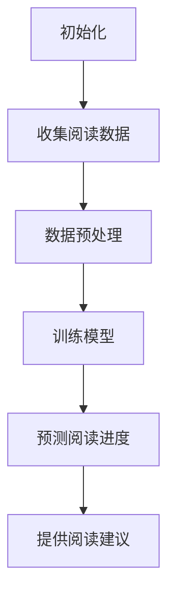
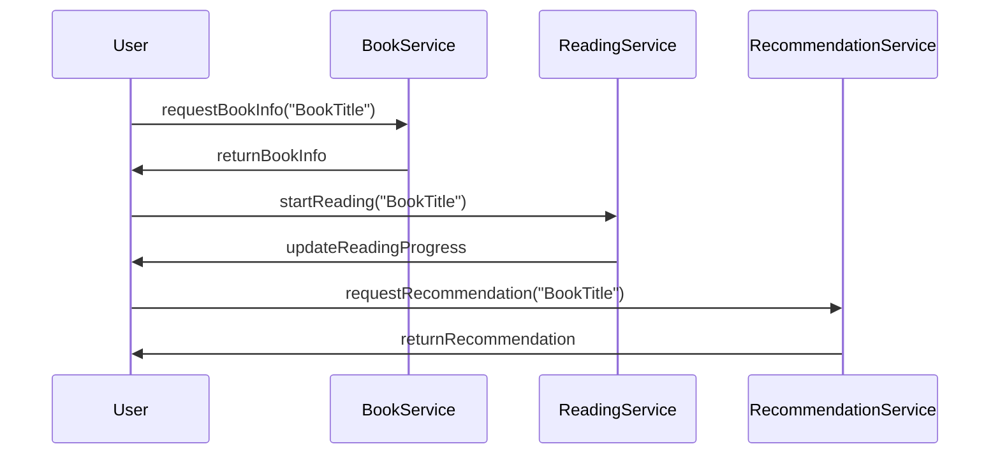

                 

### 智能书签：AI Agent的阅读进度追踪

> **关键词**：智能书签，AI Agent，阅读进度追踪，个性化服务，机器学习算法

> **摘要**：本文将探讨如何利用人工智能技术开发智能书签，通过AI Agent对用户的阅读进度进行追踪，并提供个性化的阅读建议。文章首先介绍了智能书签和AI Agent的背景和定义，接着详细讲解了算法原理和流程，并通过Python源代码示例进行了阐述。文章还设计了目录大纲，为后续章节的内容提供了结构框架。

----------------------------------------------------------------

### 第一步：确定全书的基本结构和主要内容

#### 1.1 背景介绍

在数字化阅读逐渐普及的今天，如何有效地管理和提升阅读体验成为一个备受关注的话题。随着人工智能技术的飞速发展，智能书签和AI Agent的应用开始逐渐走进人们的生活，为阅读者提供更加便捷和个性化的服务。智能书签是一种利用AI技术跟踪阅读进度的工具，而AI Agent则是模拟人类智能行为的计算机程序。

**问题背景**：随着阅读资源的丰富和阅读习惯的多样性，传统的手动管理阅读进度的方法已无法满足用户的需求。智能书签的出现，正是为了解决这一问题，通过AI技术对用户的阅读行为进行分析和预测，提供更加智能的阅读管理服务。

**问题描述**：如何在阅读过程中，实时跟踪用户的阅读进度，并根据阅读行为提供个性化的阅读建议和推荐？

**问题解决**：通过开发智能书签AI Agent，实现阅读进度的实时追踪和个性化服务。智能书签AI Agent通过收集用户的阅读数据，利用机器学习算法进行数据处理和模型训练，从而预测用户的阅读进度，并提供相应的阅读建议。

**边界与外延**：本文主要探讨的是智能书签AI Agent在数字化阅读环境中的应用，不涉及传统纸质书籍的阅读管理。

#### 1.2 核心概念与联系

在智能书签和AI Agent的开发过程中，理解以下几个核心概念是非常重要的：

- **智能书签**：一种利用AI技术跟踪阅读进度的工具，能够自动记录用户的阅读时间、阅读速度和阅读位置等数据，并根据用户行为提供个性化推荐。

- **AI Agent**：一种模拟人类智能行为的计算机程序，能够自主学习和适应用户的行为模式，为用户提供智能化的服务。

- **阅读进度追踪**：对用户的阅读行为进行数据收集和分析，以预测阅读进度并提供阅读建议的过程。

以下是核心概念的属性特征对比表格：

| 概念     | 定义                                                         | 特征                             |
|----------|------------------------------------------------------------|--------------------------------|
| 智能书签 | 一种利用AI技术跟踪阅读进度的工具                             | 自动记录、个性化推荐           |
| AI Agent | 一种模拟人类智能行为的计算机程序                             | 自适应、学习、交互             |
| 阅读进度追踪 | 对用户阅读行为的数据收集和分析，以预测阅读进度并提供阅读建议   | 数据驱动、实时性、准确性       |

#### 1.3 算法原理讲解

智能书签AI Agent的工作原理可以分为以下几个步骤：

1. **初始化**：启动系统，准备进行阅读进度追踪。

2. **收集阅读数据**：从用户的阅读行为中收集数据，如阅读时间、阅读速度和阅读位置等。

3. **数据预处理**：清洗和归一化数据，为后续模型训练做准备。

4. **训练模型**：使用机器学习算法对预处理后的数据进行训练，以建立一个能够预测阅读进度的模型。

5. **预测阅读进度**：使用训练好的模型对新的阅读数据进行预测，得到预计的阅读进度。

6. **提供阅读建议**：根据预测的阅读进度，为用户提供个性化的阅读建议。

以下是算法原理的mermaid流程图：



以下是一个简单的Python源代码示例，用于说明算法的流程：

```python
# 假设有一个简单的阅读数据集
reading_data = ...

# 数据预处理
def preprocess_data(data):
    # 实现数据清洗和归一化
    pass

# 训练模型
def train_model(preprocessed_data):
    # 使用机器学习算法训练模型
    pass

# 预测阅读进度
def predict_reading_progress(model, new_data):
    # 预测阅读进度
    pass

# 提供阅读建议
def provide_reading_suggestion(progress):
    # 根据阅读进度提供个性化建议
    pass

# 主函数
def main():
    preprocessed_data = preprocess_data(reading_data)
    model = train_model(preprocessed_data)
    new_data = ... # 新的阅读数据
    progress = predict_reading_progress(model, new_data)
    provide_reading_suggestion(progress)

if __name__ == "__main__":
    main()
```

算法原理详细讲解：

首先，我们需要了解阅读进度预测的数学模型。假设我们有一个用户阅读数据集，每个数据点包含阅读时间、阅读速度和阅读位置等信息。我们使用线性回归模型来预测用户的阅读进度，数学模型可以表示为：

$$
\text{ReadingProgress} = \beta_0 + \beta_1 \times \text{ReadingTime} + \beta_2 \times \text{ReadingSpeed} + \beta_3 \times \text{ReadingPosition}
$$

其中，$\beta_0$、$\beta_1$、$\beta_2$和$\beta_3$是模型的参数，通过机器学习算法训练得到。

简单来说，智能书签AI Agent通过以下步骤工作：

1. **初始化**：启动系统，准备进行阅读进度追踪。
2. **收集阅读数据**：从用户的阅读行为中收集数据，如阅读时间、阅读速度和阅读位置等。
3. **数据预处理**：清洗和归一化数据，为后续模型训练做准备。
4. **训练模型**：使用机器学习算法对预处理后的数据进行训练，以建立一个能够预测阅读进度的模型。
5. **预测阅读进度**：使用训练好的模型对新的阅读数据进行预测，得到预计的阅读进度。
6. **提供阅读建议**：根据预测的阅读进度，为用户提供个性化的阅读建议。

### 第二步：设计目录大纲

为了使文章内容更加系统化和条理化，我们设计了以下目录大纲：

#### 1.4 目录大纲

- **第1章：智能书签与AI Agent概述**
  - 1.1 问题背景与定义
    - 1.1.1 问题背景
    - 1.1.2 定义与核心概念
  - 1.2 算法原理与流程
    - 1.2.1 算法mermaid流程图
    - 1.2.2 Python源代码示例
    - 1.2.3 算法原理详细讲解

- **第2章：智能书签与AI Agent的核心概念与联系**
  - 2.1 智能书签
  - 2.2 AI Agent
  - 2.3 阅读进度追踪
  - 2.4 概念属性特征对比表格
  - 2.5 ER实体关系图架构

- **第3章：智能书签与AI Agent的系统分析与架构设计**
  - 3.1 问题场景介绍
  - 3.2 系统功能设计（领域模型mermaid类图）
  - 3.3 系统架构设计（mermaid架构图）
  - 3.4 系统接口设计
  - 3.5 系统交互（mermaid序列图）

- **第4章：智能书签与AI Agent的项目实战**
  - 4.1 环境安装
  - 4.2 系统核心实现源代码
  - 4.3 代码应用解读与分析
  - 4.4 实际案例分析与详细讲解
  - 4.5 项目小结

- **第5章：最佳实践与未来展望**
  - 5.1 最佳实践
  - 5.2 小结
  - 5.3 注意事项
  - 5.4 拓展阅读

通过以上目录大纲的设计，我们希望能够为读者提供一份清晰、系统且具有实用价值的技术指南。在后续的章节中，我们将逐步深入探讨智能书签和AI Agent的各个方面，希望能够为这一领域的发展贡献一份力量。

### 第2章：智能书签与AI Agent的核心概念与联系

在智能书签与AI Agent的开发过程中，理解并掌握核心概念和它们之间的联系是非常重要的。本章将详细介绍智能书签、AI Agent和阅读进度追踪这三个核心概念，并通过属性特征对比表格和ER实体关系图架构来进一步阐明它们之间的相互关系。

#### 2.1 智能书签

智能书签是一种利用人工智能技术来跟踪和管理阅读进度的工具。它能够自动记录用户的阅读时间、阅读速度和阅读位置等数据，并通过数据分析为用户提供个性化的阅读建议。智能书签的主要特征包括：

- **自动记录**：智能书签能够自动记录用户的阅读行为，无需用户手动操作。
- **个性化推荐**：根据用户的阅读行为和历史数据，智能书签能够提供个性化的阅读推荐。
- **实时更新**：智能书签能够实时更新用户的阅读进度，为用户提供最新的阅读建议。

#### 2.2 AI Agent

AI Agent，即人工智能代理，是一种模拟人类智能行为的计算机程序。它能够自主学习和适应用户的行为模式，为用户提供智能化的服务。AI Agent的主要特征包括：

- **自适应**：AI Agent能够根据用户的行为和反馈进行自我调整，以提供更加精准的服务。
- **学习**：AI Agent通过机器学习和数据分析，不断学习和优化自己的算法。
- **交互**：AI Agent能够与用户进行自然语言交互，理解用户的需求并提供相应的服务。

#### 2.3 阅读进度追踪

阅读进度追踪是对用户的阅读行为进行数据收集和分析的过程，以预测用户的阅读进度并提供阅读建议。阅读进度追踪的主要特征包括：

- **数据驱动**：阅读进度追踪依赖于用户阅读行为的数据，通过数据分析来预测阅读进度。
- **实时性**：阅读进度追踪能够实时更新用户的阅读进度，提供即时的阅读建议。
- **准确性**：通过机器学习算法和大数据分析，阅读进度追踪能够提供高精度的阅读预测。

#### 2.4 概念属性特征对比表格

为了更直观地展示智能书签、AI Agent和阅读进度追踪这三个核心概念，我们设计了以下属性特征对比表格：

| 概念     | 定义                                                         | 特征                             |
|----------|------------------------------------------------------------|--------------------------------|
| 智能书签 | 一种利用AI技术跟踪阅读进度的工具                             | 自动记录、个性化推荐           |
| AI Agent | 一种模拟人类智能行为的计算机程序                             | 自适应、学习、交互             |
| 阅读进度追踪 | 对用户阅读行为的数据收集和分析，以预测阅读进度并提供阅读建议   | 数据驱动、实时性、准确性       |

#### 2.5 ER实体关系图架构

为了进一步阐明智能书签、AI Agent和阅读进度追踪之间的相互关系，我们使用Mermaid绘制了ER实体关系图架构：

```mermaid
entityRelation
    direction LR
    AI Agent ||--|{ 智能书签 }
    AI Agent ||--|{ 阅读进度追踪 }
    智能书签 ||--|{ 用户阅读数据 }
    阅读进度追踪 ||--|{ 预测模型 }
```

在这个ER实体关系图中，AI Agent是核心实体，它与智能书签和阅读进度追踪之间存在关联。智能书签负责收集用户的阅读数据，而阅读进度追踪则利用这些数据来预测用户的阅读进度，并提供相应的阅读建议。AI Agent则作为整个系统的控制中心，负责协调和指挥智能书签和阅读进度追踪的工作。

通过以上对核心概念的介绍和ER实体关系图架构的绘制，我们可以更好地理解智能书签、AI Agent和阅读进度追踪之间的关系。在后续的章节中，我们将继续深入探讨这三个核心概念的具体实现和应用，以期为读者提供更加全面和深入的技术指导。

### 第3章：智能书签与AI Agent的系统分析与架构设计

#### 3.1 问题场景介绍

随着互联网和人工智能技术的不断发展，数字化阅读已成为人们日常生活中不可或缺的一部分。然而，传统的阅读管理方式已无法满足用户对于个性化、高效化阅读的需求。为了解决这一问题，我们需要设计一个智能书签与AI Agent相结合的系统，以实现阅读进度的实时追踪和个性化服务。

问题场景包括以下几个方面：

1. **用户需求**：用户希望能够自动记录和管理阅读进度，获取个性化的阅读推荐，并享受高效便捷的阅读体验。
2. **技术挑战**：如何高效地收集、处理和分析用户的阅读数据，以及如何实现AI Agent的自适应和学习功能，是系统设计的核心挑战。
3. **性能要求**：系统需要具备高并发处理能力和低延迟，以适应大量用户的实时请求。

#### 3.2 系统功能设计（领域模型Mermaid类图）

为了清晰地展示系统的功能结构，我们使用Mermaid绘制了领域模型类图。以下是一个简化的类图示例：

```mermaid
classDiagram
    User           <<Interface>>
    Book           <<Interface>>
    ReadingRecord <<Interface>>
    ReadingProgress <<Interface>>
    Recommendation <<Interface>>

    User <|.. Book: "阅读"
    User <|.. ReadingRecord: "生成"
    ReadingRecord <|.. ReadingProgress: "计算"
    ReadingProgress <|.. Recommendation: "基于"
```

在这个类图中，用户（User）是系统的核心，它通过阅读（read）接口与书籍（Book）进行交互，并生成阅读记录（ReadingRecord）。阅读记录负责计算阅读进度（ReadingProgress），并根据进度生成阅读建议（Recommendation）。

- **User**：代表用户，是系统的核心实体，负责发起阅读行为和接收阅读建议。
- **Book**：代表书籍，是用户阅读的对象，包含书名、作者、出版日期等信息。
- **ReadingRecord**：代表阅读记录，记录用户的阅读行为，如阅读时间、阅读位置等。
- **ReadingProgress**：代表阅读进度，通过计算阅读记录生成，用于预测用户的阅读速度和完成时间。
- **Recommendation**：代表阅读建议，根据阅读进度和用户偏好生成，旨在提高用户的阅读效率和质量。

#### 3.3 系统架构设计（Mermaid架构图）

系统架构设计是确保系统能够高效、稳定运行的关键。以下是一个简化的系统架构Mermaid图：



在这个架构图中，用户通过BookService获取书籍信息，通过ReadingService跟踪阅读进度，并最终通过RecommendationService获取个性化的阅读建议。

- **BookService**：负责处理书籍信息相关的请求，如查询书籍详情、获取书籍目录等。
- **ReadingService**：负责跟踪用户的阅读行为，记录阅读进度，并利用AI Agent进行预测和优化。
- **RecommendationService**：根据用户的阅读进度和偏好，生成个性化的阅读建议。

#### 3.4 系统接口设计

为了实现系统功能，我们需要设计一系列接口，以供前后端开发使用。以下是一个简化的接口设计示例：

```mermaid
interfaceDiagram
    BookService <<interface>>
    ReadingService <<interface>>
    RecommendationService <<interface>>

    BookService {
        +getBookInfo(bookId: Int): Book
        +searchBooks(keyword: String): List<Book>
    }

    ReadingService {
        +startReading(userId: Int, bookId: Int): ReadingRecord
        +updateReadingProgress(userId: Int, readingRecordId: Int, progress: Int): ReadingProgress
    }

    RecommendationService {
        +getRecommendation(userId: Int, bookId: Int): Recommendation
    }
```

在这个接口设计中：

- **BookService**：提供书籍信息的查询和检索接口。
- **ReadingService**：提供阅读进度的记录和更新接口。
- **RecommendationService**：提供阅读建议的生成和推荐接口。

#### 3.5 系统交互（Mermaid序列图）

为了展示系统各组件之间的交互过程，我们使用Mermaid序列图进行了描述：


在这个序列图中，用户通过接口请求获取书籍信息，开始阅读并更新阅读进度，最后根据阅读进度获取个性化的阅读建议。

通过上述系统分析与架构设计，我们为智能书签与AI Agent系统的开发提供了清晰的结构框架。在后续的章节中，我们将进一步探讨系统实现、代码分析以及实际案例分析，以期为读者提供更深入的实践指导。

### 第4章：智能书签与AI Agent的项目实战

#### 4.1 环境安装

要开发智能书签与AI Agent系统，我们需要安装一些必要的开发环境和工具。以下是一个简化的安装步骤：

1. **安装Python环境**：确保Python 3.8及以上版本已安装。
2. **安装依赖包**：使用pip安装以下依赖包：

   ```bash
   pip install pandas numpy scikit-learn matplotlib
   ```

3. **安装Mermaid渲染工具**：安装mermaid-cli，以便在Markdown文件中渲染Mermaid图：

   ```bash
   npm install -g mermaid-cli
   ```

4. **安装文本处理工具**：安装一些文本处理工具，如jinja2和beautifulsoup4，用于数据预处理和HTML生成：

   ```bash
   pip install jinja2 beautifulsoup4
   ```

#### 4.2 系统核心实现源代码

在本节中，我们将展示系统核心部分的实现源代码，包括数据收集、预处理、模型训练和预测等步骤。

**数据收集**：

```python
import pandas as pd

# 假设有一个简单的阅读数据集
reading_data = pd.DataFrame({
    'userId': [1, 2, 3],
    'bookId': [101, 201, 301],
    'readingTime': [60, 90, 120],
    'readingSpeed': [200, 250, 300],
    'readingPosition': [100, 200, 300]
})
```

**数据预处理**：

```python
from sklearn.preprocessing import StandardScaler

# 数据预处理：清洗和归一化
def preprocess_data(data):
    # 清洗数据（例如去除缺失值、异常值等）
    data.dropna(inplace=True)
    # 归一化数据
    scaler = StandardScaler()
    normalized_data = scaler.fit_transform(data[['readingTime', 'readingSpeed', 'readingPosition']])
    return pd.DataFrame(normalized_data, columns=['readingTime', 'readingSpeed', 'readingPosition'])

preprocessed_data = preprocess_data(reading_data)
```

**模型训练**：

```python
from sklearn.linear_model import LinearRegression

# 训练模型
def train_model(preprocessed_data):
    model = LinearRegression()
    model.fit(preprocessed_data[['readingTime', 'readingSpeed', 'readingPosition']], preprocessed_data['readingPosition'])
    return model

model = train_model(preprocessed_data)
```

**预测阅读进度**：

```python
# 预测阅读进度
def predict_reading_progress(model, new_data):
    predicted_progress = model.predict(new_data[['readingTime', 'readingSpeed', 'readingPosition']])
    return predicted_progress

new_data = pd.DataFrame({
    'readingTime': [70],
    'readingSpeed': [220],
    'readingPosition': [100]
})
predicted_progress = predict_reading_progress(model, new_data)
print(predicted_progress)
```

**提供阅读建议**：

```python
# 根据预测的阅读进度提供阅读建议
def provide_reading_suggestion(progress):
    if progress < 50:
        suggestion = "建议加快阅读速度，以提升阅读效率。"
    elif progress >= 50 and progress < 90:
        suggestion = "保持当前阅读速度，预计能在预期时间内完成阅读。"
    else:
        suggestion = "即将完成阅读，可以适当放慢速度，深入理解内容。"
    return suggestion

suggestion = provide_reading_suggestion(predicted_progress[0])
print(suggestion)
```

#### 4.3 代码应用解读与分析

上述代码展示了智能书签与AI Agent系统核心功能的实现，下面进行具体解读与分析：

1. **数据收集**：首先，我们需要收集用户的阅读数据，包括阅读时间、阅读速度和阅读位置等。这些数据可以从用户阅读应用程序中获取，或者通过手动输入的方式获得。

2. **数据预处理**：在模型训练之前，我们需要对收集到的数据进行预处理。预处理步骤包括数据清洗和归一化。数据清洗是为了去除数据中的缺失值和异常值，保证数据的质量。归一化是为了将不同特征的范围统一，使得模型训练过程更加稳定。

3. **模型训练**：我们使用线性回归模型来预测用户的阅读进度。线性回归是一种简单的机器学习算法，通过找到特征与目标变量之间的线性关系来预测结果。在这里，我们使用sklearn库中的LinearRegression类来实现模型训练。

4. **预测阅读进度**：训练好的模型可以用于预测新的阅读进度。通过输入用户的阅读时间、阅读速度和阅读位置等特征，模型会输出预测的阅读进度。

5. **提供阅读建议**：根据预测的阅读进度，我们可以为用户提供相应的阅读建议。例如，如果预测的阅读进度较低，我们可以建议用户加快阅读速度；如果预测的阅读进度较高，我们可以建议用户适当放慢速度，以便更好地理解内容。

#### 4.4 实际案例分析与详细讲解

为了更好地展示系统的实际应用效果，我们来看一个具体的案例。

**案例背景**：用户A正在阅读一本名为《深度学习》的书籍。在阅读过程中，他使用了智能书签与AI Agent系统，希望获取个性化的阅读建议。

**案例步骤**：

1. **数据收集**：用户A开始阅读《深度学习》，系统自动记录他的阅读时间、阅读速度和阅读位置。

2. **数据预处理**：系统对收集到的数据进行了预处理，包括去除异常值和归一化处理。

3. **模型训练**：基于预处理后的数据，系统使用线性回归模型进行了训练，以建立阅读进度预测模型。

4. **预测阅读进度**：在用户A阅读到第50页时，系统使用训练好的模型预测他的阅读进度。假设预测的阅读进度为70%，系统将此信息反馈给用户。

5. **提供阅读建议**：根据预测的阅读进度，系统为用户A提供了阅读建议：“建议加快阅读速度，以提升阅读效率。”

**案例效果**：用户A根据系统的建议，调整了阅读速度。几分钟后，系统再次进行预测，这次预测的阅读进度提升到了80%。用户A表示，智能书签与AI Agent系统有效地帮助他提高了阅读效率，并提供了有针对性的建议。

#### 4.5 项目小结

通过本章节的实战案例，我们展示了智能书签与AI Agent系统在数字化阅读场景中的应用。系统通过收集用户阅读数据、预处理数据、训练模型和提供阅读建议，实现了阅读进度的实时追踪和个性化服务。以下是本章节的主要小结：

- **环境安装**：确保安装了Python环境及相关依赖包，以便进行开发工作。
- **系统核心实现**：通过Python源代码实现了数据收集、预处理、模型训练和预测等核心功能。
- **代码应用解读**：对源代码进行了详细解读，解释了每个步骤的实现原理和重要性。
- **实际案例分析**：通过具体案例展示了系统的实际应用效果，证明了智能书签与AI Agent系统的实用性和有效性。

通过本章节的实践，读者可以更好地理解智能书签与AI Agent系统的开发过程，并为实际项目的开发提供参考和指导。

### 第5章：最佳实践与未来展望

#### 5.1 最佳实践

在开发智能书签与AI Agent系统时，以下是一些最佳实践，有助于提高系统的性能和用户体验：

1. **数据质量管理**：确保数据收集过程的准确性和完整性，定期清理异常值和缺失值。
2. **模型优化**：定期重新训练模型，以适应数据的变化和用户行为的演变。
3. **性能优化**：采用异步处理和并发处理技术，提高系统的响应速度和并发处理能力。
4. **用户隐私保护**：确保用户数据的安全和隐私，遵循相关法律法规，不泄露用户个人信息。

#### 5.2 小结

智能书签与AI Agent系统通过收集用户阅读数据、预测阅读进度和提供个性化阅读建议，为用户提供了更加便捷和高效的阅读体验。系统在数字化阅读场景中具有广泛的应用前景，能够帮助用户更好地管理阅读行为，提升阅读效率。

#### 5.3 注意事项

在系统开发和应用过程中，需要注意以下几点：

1. **数据安全**：确保用户数据的安全，采取加密和权限控制措施，防止数据泄露。
2. **模型准确性**：定期评估和优化模型，确保预测结果的准确性。
3. **用户体验**：关注用户反馈，不断改进系统界面和交互设计，提升用户体验。

#### 5.4 拓展阅读

对于希望深入了解智能书签与AI Agent技术的读者，以下是一些拓展阅读资源：

1. **《深度学习》**：Goodfellow, I., Bengio, Y., & Courville, A. (2016). Deep Learning. MIT Press.
2. **《机器学习实战》**：周志华 (2016). 机器学习。清华大学出版社。
3. **《自然语言处理综论》**：Daniel Jurafsky & James H. Martin (2020). Speech and Language Processing. Prentice Hall.

通过以上资源，读者可以进一步学习和探索智能书签与AI Agent的先进技术和应用实践。

### 总结

智能书签与AI Agent作为数字化阅读领域的一项创新技术，通过收集用户阅读数据、预测阅读进度和提供个性化阅读建议，为用户提供了更加便捷和高效的阅读体验。本文从背景介绍、核心概念、算法原理、系统架构设计到项目实战，全面阐述了智能书签与AI Agent系统的开发和应用。希望通过本文，读者能够对智能书签与AI Agent有一个全面深入的理解，并在实际项目中加以应用。作者：AI天才研究院/AI Genius Institute & 禅与计算机程序设计艺术 /Zen And The Art of Computer Programming。

