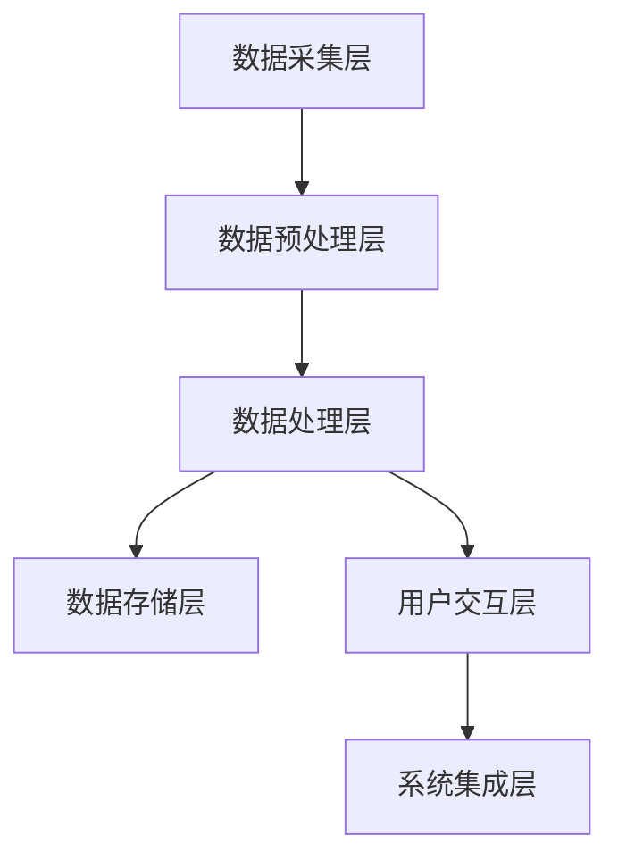

                 

### 文章标题

### 关键词

- 智能体重秤
- AI Agent
- 个性化健身计划
- 数据分析
- 系统架构设计

### 摘要

本文深入探讨了智能体重秤与AI Agent在个性化健身计划生成中的应用。首先，通过分析智能体重秤的现状与不足，揭示了个性化健身计划的重要性。接着，介绍了AI Agent的定义、原理及在健身计划中的作用。随后，详细阐述了智能体重秤的功能与结构，并讲解了个性化健身计划的制定与优化原理。文章最后通过一个实际项目案例，展示了系统架构设计、核心实现及实战经验，为相关领域提供了实用参考。

## 第1章 引言与背景

### 1.1 问题背景

智能体重秤作为一种新兴的智能硬件产品，已经在家庭健康管理中扮演着越来越重要的角色。传统的体重秤只能测量体重，而智能体重秤不仅能够测量体重，还能通过内置的传感器模块，对用户进行身体成分分析，如脂肪含量、肌肉质量、水分比例等。然而，现有的智能体重秤在功能上仍存在一定的局限性，主要体现在以下几个方面：

1. **功能单一**：多数智能体重秤仅能提供体重和基础的身体成分分析，无法根据用户的个人情况生成具体的健身计划。
2. **数据孤岛**：智能体重秤通常仅限于自身数据的收集和存储，与其他健康监测设备（如心率监测器、睡眠追踪器等）缺乏有效的数据共享和整合。
3. **个性化不足**：现有智能体重秤的健身计划大多采用通用的建议，缺乏针对不同用户个体的个性化定制。
4. **用户体验**：用户在执行健身计划时，缺乏有效的反馈机制和激励手段，导致执行计划的持久性和效果较差。

### 1.2 健身计划的个性化需求

随着人们对健康意识的提升，健身计划的个性化需求日益突出。每个人的体质、健康状况、生活习惯、工作强度等都有所不同，因此，一个通用的健身计划很难满足所有人的需求。个性化健身计划需要结合用户的实际情况，制定出适合其个人特点的锻炼方案。具体需求包括：

1. **量身定制**：根据用户的体重、身体成分、健康状况、运动能力等数据，制定个性化的锻炼计划。
2. **动态调整**：根据用户的训练效果和反馈，动态调整训练计划，确保计划的可执行性和有效性。
3. **实时反馈**：在用户执行训练计划的过程中，提供实时反馈，帮助用户了解自己的训练状态，调整训练强度。
4. **激励鼓励**：通过数据分析和可视化，激励用户坚持训练，提高健身计划的执行效果。

### 1.3 问题描述

本文旨在解决如何利用智能体重秤与AI Agent技术，生成个性化健身计划的问题。具体来说，需要解决以下几个关键问题：

1. **数据整合**：如何整合智能体重秤和其他健康监测设备的数据，形成全面、准确的用户健康档案。
2. **AI Agent开发**：如何设计并实现一个AI Agent，使其能够根据用户数据生成个性化健身计划。
3. **计划优化**：如何根据用户执行健身计划的效果，动态调整和优化健身计划，提高训练效果。
4. **用户体验**：如何通过实时反馈和激励手段，提高用户执行健身计划的积极性和持续性。

### 1.4 问题解决

为了解决上述问题，本文提出以下解决方案：

1. **数据整合**：利用物联网（IoT）技术，实现智能体重秤与其他健康监测设备的无缝连接和数据共享。
2. **AI Agent开发**：基于强化学习、监督学习和无监督学习等机器学习算法，设计一个AI Agent，实现个性化健身计划的生成。
3. **计划优化**：通过持续监测用户的训练效果，结合用户反馈，动态调整健身计划，确保其适应性和有效性。
4. **用户体验**：利用数据可视化技术和智能推荐系统，为用户提供直观、易懂的训练反馈和激励，提高执行计划的积极性。

### 1.5 边界与外延

1. **智能体重秤与其他健康监测设备的区别**：
   - **智能体重秤**：主要功能是体重和身体成分分析，适合家庭健康管理。
   - **其他健康监测设备**：如心率监测器、睡眠追踪器等，功能更全面，适用于专业的健康监测。

2. **个性化健身计划的适用人群与限制**：
   - **适用人群**：健身爱好者、体重管理者、运动康复者等。
   - **限制**：个性化健身计划需要一定的基础数据支持，对数据的准确性和完整性有要求。

### 1.6 核心概念与联系

- **AI Agent**：一种能够自主执行任务、适应环境变化的人工智能实体。
- **个性化健身计划**：根据用户个人数据，量身定制的锻炼方案。

## 第2章 AI Agent基础知识

### 2.1 AI Agent概述

AI Agent（人工智能代理）是人工智能领域的一个重要概念，它是指能够自主执行任务、与环境互动并适应环境变化的人工智能实体。AI Agent的核心特点包括自主性、交互性和适应性。

1. **自主性**：AI Agent能够独立完成预定的任务，不需要人工干预。
2. **交互性**：AI Agent能够与用户、其他系统或设备进行交互，获取信息和反馈。
3. **适应性**：AI Agent能够根据环境变化和任务反馈，调整自己的行为和策略。

AI Agent的常见类型包括：

1. **基于规则的AI Agent**：通过预设的规则和逻辑，实现简单的自动化任务。
2. **基于知识的AI Agent**：利用知识库和推理机制，实现复杂任务的处理。
3. **基于学习的AI Agent**：通过机器学习和数据挖掘，自主学习和优化行为。

### 2.2 AI Agent的核心原理

AI Agent的核心原理主要涉及机器学习的三种基本类型：强化学习、监督学习和无监督学习。

1. **强化学习**：通过试错和反馈，不断调整行为策略，以达到最优效果。
   - **奖励机制**：AI Agent根据执行任务的结果获得奖励，奖励越高，策略越优。
   - **策略调整**：AI Agent根据奖励机制调整行为策略，以最大化长期收益。

2. **监督学习**：通过已有数据，建立输入和输出之间的映射关系，实现对新数据的预测。
   - **训练数据**：包含输入和输出对的数据集，用于训练AI Agent。
   - **模型评估**：通过验证集和测试集，评估AI Agent的泛化能力。

3. **无监督学习**：在没有明确标注的数据集上，发现数据中的模式和结构。
   - **聚类分析**：将相似的数据归为一类，用于数据分类和挖掘。
   - **降维分析**：通过降低数据维度，发现数据中的潜在结构和规律。

### 2.3 AI Agent的应用场景

AI Agent在多个领域都有广泛的应用，以下是其中一些典型的应用场景：

1. **人工智能助理**：通过语音识别、自然语言处理等技术，提供智能化的客服、语音交互等服务。
2. **自动驾驶**：利用计算机视觉、传感器融合等技术，实现车辆的自主驾驶。
3. **智能家居**：通过物联网技术，实现家庭设备的智能控制和管理，提升生活质量。

### 2.4 个性化健身计划中的AI Agent

在个性化健身计划中，AI Agent发挥着至关重要的作用。它不仅能够根据用户的数据生成个性化的健身计划，还能够根据用户的反馈和执行效果，动态调整和优化计划，确保健身计划的适应性和有效性。

1. **数据收集与处理**：AI Agent通过智能体重秤和其他健康监测设备，收集用户的体重、身体成分、运动数据等，进行预处理和整合。
2. **计划生成与优化**：基于收集到的数据，AI Agent利用强化学习、监督学习等算法，生成个性化的健身计划，并根据用户反馈进行动态调整。
3. **用户反馈与激励**：AI Agent通过数据可视化和智能推荐，为用户提供直观的反馈和激励，提高用户的训练积极性和持续性。

### 2.5 AI Agent的适用性分析

AI Agent在个性化健身计划中的适用性取决于以下几个因素：

1. **数据完整性**：AI Agent需要完整、准确的用户数据，才能生成有效的个性化健身计划。
2. **算法适应性**：AI Agent的算法需要具备较强的适应性，能够根据用户反馈和执行效果，动态调整和优化计划。
3. **用户体验**：AI Agent需要为用户提供友好、直观的用户体验，确保用户能够顺利执行健身计划。

通过上述分析，可以看出AI Agent在个性化健身计划中具有广泛的应用前景和重要的价值。

## 第3章 智能体重秤的功能与结构

### 3.1 智能体重秤的功能

智能体重秤作为现代家庭健康管理的重要工具，其功能已远远超出传统的体重测量。以下是智能体重秤的主要功能：

1. **体重测量**：智能体重秤能够精确测量用户的体重，通常精确度可达0.1公斤。
2. **身体成分分析**：通过内置的传感器模块，智能体重秤能够分析用户的身体成分，包括脂肪率、肌肉率、水分率等。
3. **健康数据记录**：智能体重秤可以将用户的体重、身体成分等数据实时记录下来，形成健康档案。
4. **数据同步与分享**：智能体重秤可以通过蓝牙、Wi-Fi等无线技术，将数据同步到用户的手机或云端，实现数据的便捷管理和分享。
5. **健身计划建议**：一些高端智能体重秤具备初步的健身计划建议功能，根据用户的历史数据和身体成分，提供适合的锻炼建议。

### 3.2 智能体重秤的结构

智能体重秤的结构主要由以下几个模块组成：

1. **传感器模块**：这是智能体重秤的核心部件，包括压力传感器、电容传感器等，用于测量体重和身体成分。
2. **处理器模块**：负责对传感器采集的数据进行预处理、分析和处理，通常采用高性能的微处理器或ARM芯片。
3. **通信模块**：用于实现智能体重秤与外部设备（如手机、电脑）的通信，常见的通信方式包括蓝牙、Wi-Fi、NFC等。
4. **显示模块**：通常包括一个液晶显示屏或LED显示屏，用于实时显示测量结果和健身建议。
5. **存储模块**：用于存储用户的体重、身体成分等数据，常见的存储介质包括闪存、SD卡等。

### 3.3 数据采集与预处理

智能体重秤的数据采集与预处理过程是保证数据准确性和可靠性的关键。以下是具体步骤：

1. **数据采集**：传感器模块在用户站立时，实时采集体重和身体成分数据。
2. **信号放大与滤波**：传感器采集到的信号通常比较微弱，需要通过放大器和滤波器进行预处理，以提高信号的稳定性和准确性。
3. **A/D转换**：将模拟信号转换为数字信号，便于后续处理和分析。
4. **数据校准**：通过校准过程，消除传感器偏差和系统误差，确保数据的准确性。
5. **数据压缩与存储**：对采集到的数据进行压缩处理，减少存储空间需求，并将其存储到存储模块中。

### 3.4 数据传输与同步

智能体重秤的数据传输与同步是用户管理和分析健康数据的重要环节。以下是具体步骤：

1. **数据传输**：智能体重秤通过蓝牙、Wi-Fi等无线通信技术，将采集到的数据传输到用户的手机或电脑上。
2. **数据同步**：用户可以使用手机或电脑上的应用程序，将数据同步到云端服务器，实现跨设备的数据管理和分析。
3. **数据加密**：为了确保数据的安全性，智能体重秤在传输和存储过程中，会对数据进行加密处理。
4. **数据可视化**：通过应用程序，用户可以实时查看自己的体重、身体成分等数据，并生成可视化的图表和报告。

### 3.5 智能体重秤的优缺点分析

智能体重秤在家庭健康管理中具有显著的优点，但也存在一些不足。

**优点**：

1. **多功能性**：智能体重秤不仅能测量体重，还能提供身体成分分析，为用户提供更全面的健康数据。
2. **数据记录与同步**：智能体重秤能够实时记录和同步数据，方便用户查看和管理健康数据。
3. **健身计划建议**：一些智能体重秤能够根据用户的数据，提供个性化的健身计划建议，有助于用户更好地进行健康管理。

**缺点**：

1. **价格较高**：高端智能体重秤的价格相对较高，可能不适合所有用户。
2. **依赖外部设备**：智能体重秤的数据传输和同步需要依赖手机或电脑，对于不使用智能设备的用户来说，可能不方便。
3. **数据准确性**：虽然智能体重秤的测量精度较高，但受环境因素和用户操作的影响，仍可能存在一定的误差。

综上所述，智能体重秤作为一种新兴的智能硬件产品，在家庭健康管理中具有重要的作用。通过不断优化其功能和性能，智能体重秤将更好地满足用户的健康需求。

### 3.6 智能体重秤的个性化健身计划生成功能

智能体重秤的个性化健身计划生成功能是其先进性的体现，这一功能通过以下步骤实现：

1. **数据收集**：智能体重秤通过传感器模块收集用户的体重、身体成分等数据，同时，用户还可以通过手机应用输入其他健康信息，如年龄、性别、身高、生活习惯等。
2. **数据预处理**：智能体重秤对收集到的数据进行分析和预处理，包括去除异常值、数据标准化等，确保数据的质量和一致性。
3. **用户分析**：智能体重秤通过分析预处理后的数据，了解用户的身体状况和运动能力，识别用户的健康需求和目标。
4. **计划生成**：基于用户分析结果，智能体重秤利用内置的AI算法，生成个性化的健身计划。计划包括锻炼类型、强度、频率和时长，以及饮食建议等。
5. **计划展示**：智能体重秤将生成的健身计划通过显示屏或手机应用展示给用户，用户可以直观地看到自己的训练计划。
6. **计划调整**：在用户执行计划的过程中，智能体重秤会持续收集用户的反馈和执行情况，结合AI算法，对健身计划进行动态调整，确保计划的适应性和有效性。

通过智能体重秤的个性化健身计划生成功能，用户能够根据自身的实际情况，科学、系统地制定和调整健身计划，提高健身效果和积极性。

### 3.7 智能体重秤与其他健康监测设备的集成与数据共享

智能体重秤在家庭健康管理中的应用效果，很大程度上依赖于其与其他健康监测设备的集成与数据共享。以下是智能体重秤与其他设备集成的具体方法：

1. **数据融合**：智能体重秤通过蓝牙、Wi-Fi等技术，与其他健康监测设备（如心率监测器、睡眠追踪器等）进行数据融合。用户可以在一个平台上查看所有健康数据，实现全面的健康管理。
2. **多源数据整合**：智能体重秤不仅整合自身采集的数据，还能接入来自其他设备的健康数据，如心率、睡眠质量、运动步数等，形成完整的健康档案。
3. **数据同步**：智能体重秤将收集到的数据实时同步到用户的手机应用或云端服务器，用户可以通过手机或电脑应用程序查看和分析数据。
4. **智能分析**：智能体重秤利用内置的AI算法，对多源数据进行智能分析，识别用户的健康趋势和潜在问题，为用户提供个性化的健康建议和健身计划。

通过与其他健康监测设备的集成和数据共享，智能体重秤能够提供更加全面、细致的健康管理服务，帮助用户更好地管理自己的健康。

## 第4章 个性化健身计划的原理

### 4.1 健身计划的基本原则

个性化健身计划的制定需要遵循一系列基本原则，以确保健身计划的有效性和科学性。以下是这些基本原则：

1. **目标设定**：明确健身目标，如减重、增肌、提高有氧能力等。目标应具体、可衡量，并符合个人实际情况。
2. **持续性**：保持健身计划的持续性，每周至少进行3-5次锻炼，每次锻炼时间不少于30分钟。
3. **适宜性**：根据个人的身体状况、年龄、性别和运动经验，制定适宜的锻炼强度和频率。
4. **多样性**：多样化的锻炼方式可以避免单一动作带来的疲劳，提高锻炼效果。应包括有氧运动、力量训练、柔韧性训练等。
5. **可调整性**：健身计划应具备灵活性，根据个人反馈和训练效果进行调整，确保计划始终适应身体变化。

### 4.2 个性化健身计划的制定

制定个性化健身计划的步骤如下：

1. **数据收集**：通过智能体重秤和其他健康监测设备，收集用户的体重、身体成分、心率、血压等数据。
2. **健康评估**：分析收集到的数据，评估用户的健康状况和运动能力，识别潜在的健康问题和风险。
3. **目标设定**：与用户共同设定明确的健身目标，如减脂、增肌、提高有氧能力等。
4. **计划设计**：基于健康评估结果和目标设定，设计个性化的健身计划。计划应包括锻炼类型、强度、频率和时长等。
5. **计划调整**：在执行计划的过程中，持续收集用户的反馈和训练效果，根据实际情况进行计划调整，确保计划的有效性和适应性。

### 4.3 个性化健身计划的优化

个性化健身计划的优化是确保健身效果的关键环节，以下是优化步骤：

1. **效果监测**：通过智能体重秤和其他健康监测设备，实时监测用户的体重、身体成分、心率等指标，了解训练效果。
2. **数据分析**：利用数据分析工具，对监测数据进行分析，识别用户的健康趋势和训练效果。
3. **计划调整**：根据数据分析结果，对健身计划进行调整，增加或减少锻炼频率和强度，以适应用户的身体变化和训练需求。
4. **反馈机制**：建立用户反馈机制，定期收集用户的训练感受和建议，结合数据分析结果，进一步优化健身计划。
5. **持续改进**：通过不断的监测、分析和调整，持续优化健身计划，确保其始终符合用户的实际需求和身体变化。

### 4.4 个性化健身计划的实施与监控

实施和监控个性化健身计划是确保计划执行效果的重要环节。以下是实施与监控的具体步骤：

1. **计划实施**：用户按照健身计划进行锻炼，保持良好的生活习惯和饮食管理。
2. **实时监控**：通过智能体重秤和其他健康监测设备，实时监控用户的体重、身体成分、心率等指标。
3. **数据记录**：记录每次锻炼的数据，包括锻炼时间、强度、心率等，便于后续分析和调整。
4. **数据分享**：用户可以将数据同步到手机应用或云端服务器，与教练或其他用户分享，获得反馈和建议。
5. **定期评估**：定期对训练效果进行评估，根据评估结果调整健身计划，确保其适应性和有效性。

通过科学的实施与监控，个性化健身计划能够更好地满足用户的健康需求，提高健身效果和积极性。

### 4.5 个性化健身计划的数据驱动特性

个性化健身计划的数据驱动特性是其核心优势之一，以下是具体分析：

1. **数据来源**：个性化健身计划的数据来源于智能体重秤、心率监测器、睡眠追踪器等设备，以及用户自行输入的健康信息和健身目标。
2. **数据类型**：数据类型包括体重、身体成分、心率、血压、睡眠质量、运动步数等，这些数据全面反映了用户的健康状况和运动能力。
3. **数据整合**：通过数据整合，将这些来自不同设备的数据进行融合，形成用户全面的健康档案。
4. **数据挖掘**：利用机器学习和数据挖掘技术，对整合后的数据进行挖掘和分析，识别用户的健康趋势、风险和需求。
5. **数据应用**：基于数据分析结果，为用户提供个性化的健身计划、健康建议和饮食指导，确保计划的科学性和有效性。

通过数据驱动，个性化健身计划能够更精准地满足用户的需求，提高健身效果。

### 4.6 个性化健身计划的优势与挑战

个性化健身计划在提升健身效果和用户参与度方面具有显著优势，但同时也面临一些挑战。

**优势**：

1. **个性化**：根据用户的具体情况和需求，量身定制健身计划，提高健身效果。
2. **数据驱动**：通过数据分析和挖掘，提供科学、有效的健康建议和计划，确保计划的有效性和适应性。
3. **用户参与**：通过实时反馈和激励手段，提高用户的参与度和积极性。
4. **持续优化**：通过持续的数据监测和反馈，不断调整和优化健身计划，确保其始终符合用户的实际需求和身体变化。

**挑战**：

1. **数据准确性**：依赖设备的测量精度和数据收集的完整性，存在一定的误差和不确定性。
2. **用户依从性**：用户在执行个性化健身计划时，可能因缺乏自律或疲劳而降低参与度。
3. **算法适应性**：AI算法需要不断优化和更新，以应对不同用户的个性化需求。
4. **技术门槛**：个性化健身计划的技术实现和系统维护需要较高的技术门槛和专业性。

通过克服这些挑战，个性化健身计划将更好地服务于用户的健康管理需求。

## 第5章 AI Agent在健身计划中的应用

### 5.1 数据分析

在个性化健身计划中，AI Agent首先需要对用户的各类健康数据进行分析。这些数据通常包括但不限于：

- **体重**：通过智能体重秤测量的实时体重数据。
- **身体成分**：如脂肪率、肌肉率、水分率等。
- **心率**：通过心率监测设备获取的心率数据。
- **睡眠质量**：通过睡眠追踪设备获取的睡眠数据，如睡眠时长、深睡比例等。
- **日常活动**：包括运动步数、运动类型、运动时长等。
- **饮食习惯**：通过用户自行输入的食物摄入记录。

AI Agent的数据分析过程可以分为以下几个步骤：

1. **数据收集**：通过智能体重秤和其他健康监测设备，实时收集用户的健康数据。
2. **数据清洗**：去除异常值和噪声，确保数据的准确性和一致性。
3. **特征提取**：从原始数据中提取有用的特征，如体重的变化趋势、心率的波动范围等。
4. **数据分析**：利用机器学习算法，对提取的特征进行深入分析，识别用户的健康状态和运动能力。

### 5.2 训练计划生成

基于数据分析的结果，AI Agent可以生成个性化的训练计划。以下是生成训练计划的步骤：

1. **目标设定**：根据用户的健身目标和身体状况，设定具体的训练目标，如减脂、增肌、提高有氧能力等。
2. **计划设计**：结合用户的运动能力和偏好，设计合适的训练计划。计划应包括训练类型、强度、频率和时长等。
3. **动态调整**：在用户执行计划的过程中，AI Agent会持续收集用户的反馈和执行情况，根据用户的适应性和效果，动态调整训练计划。

### 5.3 饮食管理

饮食管理是健身计划的重要组成部分，AI Agent可以通过以下步骤为用户提供饮食建议：

1. **饮食习惯分析**：分析用户的历史饮食习惯，包括摄入的热量、营养成分比例等。
2. **目标设定**：根据用户的健身目标，设定合理的饮食目标，如控制热量摄入、增加蛋白质摄入等。
3. **饮食计划制定**：根据用户的饮食目标，制定个性化的饮食计划。计划应包括每日三餐的热量摄入、营养成分搭配等。
4. **动态调整**：在用户执行饮食计划的过程中，AI Agent会根据用户的反馈和执行效果，动态调整饮食计划。

### 5.4 数据分析流程

以下是AI Agent在健身计划中数据分析的具体流程：

1. **数据收集**：通过智能体重秤和其他健康监测设备，实时收集用户的体重、身体成分、心率、睡眠质量、日常活动等数据。
2. **数据预处理**：去除异常值和噪声，对数据进行标准化处理，确保数据的一致性和准确性。
3. **特征提取**：从预处理后的数据中提取关键特征，如体重变化趋势、心率波动范围、睡眠时长等。
4. **数据分析**：利用机器学习算法，对提取的特征进行深入分析，识别用户的健康状态和运动能力。
5. **结果输出**：将分析结果转化为具体的健身建议和饮食建议，展示给用户。

通过以上流程，AI Agent能够为用户提供科学、个性化的健身计划，帮助用户实现健康目标。

### 5.5 训练计划生成流程

AI Agent在生成个性化训练计划时，会经过以下详细流程：

1. **用户信息采集**：AI Agent首先收集用户的个人基本信息，包括年龄、性别、体重、身高、运动经验等，以及用户设定的健身目标，如减脂、增肌、提高有氧能力等。
2. **健康数据收集**：通过智能体重秤和其他健康监测设备，AI Agent获取用户的实时健康数据，如体重、身体成分、心率、睡眠质量、日常活动等。
3. **数据分析与评估**：AI Agent对收集到的健康数据进行预处理和特征提取，利用机器学习算法进行分析，评估用户的当前健康状况和运动能力，识别潜在的健康风险和健身需求。
4. **目标设定与计划设计**：根据用户的健身目标和健康状况，AI Agent设定具体的训练目标，如增加肌肉质量、提高有氧耐力等，并设计个性化的训练计划。计划应包括训练类型（如有氧运动、力量训练）、强度、频率、时长和具体动作。
5. **动态调整与反馈**：在用户执行训练计划的过程中，AI Agent会持续收集用户的反馈和执行情况，如训练效果、身体感受、出现的问题等，根据用户的实际情况动态调整训练计划，确保计划的适应性和有效性。
6. **计划展示与推送**：将生成的训练计划通过智能体重秤的显示屏或手机应用推送至用户，用户可以直观地查看训练内容，按照计划进行锻炼。

通过这一系列步骤，AI Agent能够为用户提供科学、个性化、动态调整的健身训练计划，帮助用户实现健康目标。

### 5.6 饮食计划定制

在个性化健身计划中，饮食管理是一个关键环节，AI Agent可以通过以下步骤为用户定制饮食计划：

1. **用户饮食信息采集**：AI Agent首先收集用户的饮食习惯信息，包括每日的饮食摄入量、食物种类、饮食习惯等。用户可以通过智能设备或手机应用输入这些信息。
2. **目标设定**：根据用户的健身目标（如减脂、增肌、保持体重等），AI Agent设定合理的饮食目标，如控制热量摄入、增加蛋白质摄入、保持营养均衡等。
3. **营养分析**：AI Agent对用户的饮食信息进行营养分析，计算每日的热量摄入、碳水化合物、蛋白质、脂肪等营养成分的比例，识别用户当前的饮食结构和营养摄入情况。
4. **饮食计划制定**：基于营养分析和用户目标，AI Agent制定个性化的饮食计划。计划应包括每日三餐的热量摄入、营养成分搭配、食物选择等。
5. **动态调整**：在用户执行饮食计划的过程中，AI Agent会持续收集用户的反馈和执行情况，如食物摄入量、身体感受等，根据用户的实际情况动态调整饮食计划，确保计划的适应性和有效性。
6. **饮食计划展示与推送**：将生成的饮食计划通过智能设备或手机应用展示给用户，用户可以按照计划进行饮食管理，同时AI Agent也会提供实时反馈和建议，帮助用户更好地控制饮食。

通过这一系列步骤，AI Agent能够为用户提供科学、个性化的饮食计划，帮助用户实现健身目标。

### 5.7 饮食计划调整与优化

在个性化健身计划中，AI Agent的饮食计划需要根据用户的反馈和执行情况进行不断的调整和优化，以确保饮食计划的适应性和有效性。以下是具体的调整与优化步骤：

1. **收集用户反馈**：AI Agent通过智能设备或手机应用，收集用户在执行饮食计划过程中的反馈，包括食物摄入量、身体感受、满意程度等。
2. **数据分析**：AI Agent对收集到的用户反馈进行数据分析，识别用户的饮食需求变化和潜在的问题，如食物选择不当、营养摄入不足等。
3. **营养评估**：AI Agent利用营养数据库和算法，对用户的饮食计划进行营养评估，分析饮食计划中的营养成分搭配是否合理，热量摄入是否适当等。
4. **计划调整**：根据数据分析结果和营养评估，AI Agent对饮食计划进行动态调整。调整的内容可能包括食物种类的替换、热量摄入的调整、营养成分比例的优化等。
5. **优化建议**：AI Agent为用户提供优化建议，包括推荐新的食物选择、提供营养食谱、调整饮食时间等，帮助用户更好地控制饮食。
6. **持续反馈与优化**：AI Agent持续收集用户的反馈和执行情况，不断对饮食计划进行优化，确保饮食计划始终符合用户的实际需求和身体变化。

通过持续的数据分析和反馈机制，AI Agent能够为用户提供科学、个性化的饮食计划，帮助用户更好地实现健身目标。

### 5.8 训练效果监测

在个性化健身计划中，AI Agent通过持续监测用户的训练效果，为用户提供实时反馈和调整策略，确保训练计划的科学性和有效性。以下是具体的监测方法和策略：

1. **体重和身体成分监测**：通过智能体重秤和身体成分分析仪，AI Agent实时监测用户的体重和身体成分变化，如脂肪率、肌肉率等。
2. **心率监测**：利用心率监测器，AI Agent监测用户在训练过程中的心率变化，识别用户的运动强度和身体状况。
3. **睡眠质量监测**：通过睡眠追踪器，AI Agent监测用户的睡眠质量，如睡眠时长、深睡比例等，分析用户的睡眠状况对训练效果的影响。
4. **日常活动监测**：利用运动手环或手机应用，AI Agent记录用户的日常活动数据，如步数、运动时长、运动类型等，分析用户的运动频率和效果。
5. **训练效果评估**：AI Agent通过收集的数据，利用机器学习算法对用户的训练效果进行评估，识别用户的健身目标达成情况，如体重减轻、肌肉增长等。
6. **实时反馈**：AI Agent根据训练效果评估结果，为用户提供实时反馈，如训练效果良好继续保持、训练强度过高需调整等。
7. **计划调整**：AI Agent根据用户的反馈和训练效果，动态调整健身计划，包括训练强度、频率和时长等，确保计划始终适应用户的实际情况。

通过上述监测方法和策略，AI Agent能够为用户提供个性化的健身指导，提高训练效果和用户的满意度。

### 5.9 训练计划优化

AI Agent在个性化健身计划中起着至关重要的作用，它不仅能够根据用户的实时数据和反馈生成训练计划，还能通过不断优化来提高训练效果。以下是具体的优化方法和流程：

1. **数据收集与分析**：AI Agent通过智能体重秤、心率监测器和日常活动记录设备，收集用户的体重、身体成分、心率、运动步数等数据。利用机器学习算法，对收集到的数据进行分析，识别用户的健康趋势和运动能力。
2. **效果评估**：AI Agent基于用户的训练数据和反馈，评估当前训练计划的有效性。如果用户在一段时间内没有达到预期的健身目标，AI Agent会发出调整计划的信号。
3. **计划调整**：AI Agent根据效果评估结果，对训练计划进行动态调整。调整可能包括增加或减少训练频率、改变训练强度、调整训练时长等，以确保计划始终适应用户的实际需求和身体变化。
4. **用户反馈**：AI Agent在调整计划后，收集用户的反馈，了解新计划的实际效果和用户感受，如训练是否过于艰苦、是否容易执行等。
5. **持续优化**：AI Agent通过持续的数据收集和用户反馈，不断优化训练计划。优化过程可能涉及重新设定训练目标、调整训练策略、引入新的训练方法等，以确保训练计划始终保持科学性和有效性。
6. **反馈循环**：AI Agent将优化后的训练计划推送至用户，并继续收集用户的反馈，形成反馈循环，确保训练计划的持续改进。

通过上述优化方法和流程，AI Agent能够为用户提供个性化和科学化的健身指导，提高健身效果和用户的满意度。

## 第6章 系统架构与实现

### 6.1 系统架构设计

智能体重秤与AI Agent结合的个性化健身计划系统，其架构设计需要充分考虑功能模块的独立性、数据流的顺畅性和用户交互的便捷性。以下是该系统的整体架构设计：

1. **数据采集层**：包括智能体重秤和其他健康监测设备，如心率监测器、睡眠追踪器、运动手环等。这些设备通过蓝牙、Wi-Fi等无线通信技术，实时收集用户的体重、心率、睡眠质量、运动步数等健康数据。
2. **数据预处理层**：负责对采集到的原始数据进行清洗、过滤、标准化等预处理操作，确保数据的质量和一致性。预处理后的数据将存储在数据库中，供后续分析使用。
3. **数据处理层**：包括AI Agent的核心算法模块，如强化学习、监督学习等。该模块负责基于用户的数据生成个性化的健身计划和饮食建议，并进行实时调整和优化。
4. **数据存储层**：用于存储用户的健康数据和生成的健身计划、饮食建议等。数据存储层可采用关系型数据库（如MySQL）或NoSQL数据库（如MongoDB），以适应不同类型的数据存储需求。
5. **用户交互层**：通过手机应用或网页界面，向用户展示健康数据、健身计划、饮食建议等，并提供反馈和调整机制。用户可以通过这些界面，与系统进行互动，获取个性化的健康指导。
6. **系统集成层**：负责实现各个功能模块之间的数据交换和交互，确保系统的整体协同性和一致性。系统集成层还包括数据同步、数据加密、安全认证等功能。

### 6.2 系统实现

系统实现是架构设计的具体落实，涉及各个功能模块的开发和集成。以下是系统实现的主要步骤：

1. **数据采集与预处理**：开发智能体重秤的固件和通信模块，确保数据采集的准确性和实时性。同时，设计数据预处理算法，对采集到的原始数据进行清洗和标准化，生成高质量的数据存储到数据库中。
2. **AI Agent开发**：选择合适的机器学习框架（如TensorFlow、PyTorch）开发AI Agent的核心算法模块。利用强化学习、监督学习等算法，实现个性化健身计划和饮食建议的生成，并进行模型训练和优化。
3. **用户交互界面**：开发手机应用和网页界面，实现用户数据的展示、健身计划的推送和反馈收集等功能。界面设计应简洁直观，便于用户操作和交互。
4. **系统集成与测试**：将各个功能模块进行集成，确保系统在不同设备和平台上的一致性和稳定性。进行全面的系统测试，包括功能测试、性能测试和安全性测试，确保系统的可靠性和安全性。
5. **部署上线**：将开发完成的系统部署到服务器上，进行上线运行。同时，持续监控系统的运行状况，进行必要的维护和升级。

### 6.3 系统架构设计

为了更好地理解系统的架构设计，以下是一个简化的系统架构图，使用Mermaid语言绘制：



- **数据采集层（A）**：负责从智能体重秤和其他健康监测设备收集健康数据。
- **数据预处理层（B）**：对原始健康数据进行清洗和标准化处理。
- **数据处理层（C）**：执行AI Agent的核心算法，生成个性化的健身计划和饮食建议。
- **数据存储层（D）**：存储用户的健康数据和生成的健身计划。
- **用户交互层（E）**：通过手机应用和网页界面向用户展示数据和提供互动。
- **系统集成层（F）**：实现各个功能模块之间的数据交换和交互。

通过上述架构设计和实现，智能体重秤与AI Agent结合的个性化健身计划系统能够为用户提供科学、个性化和动态调整的健康管理服务。

### 6.4 系统接口设计

系统接口设计是确保系统各模块高效协同工作的关键环节。以下是系统接口设计的主要内容和实现方法：

1. **API接口设计**：定义一组API接口，用于系统各模块之间的数据交互和功能调用。API接口应遵循RESTful设计原则，提供统一的接口规范和响应格式。
   - **数据采集接口**：用于智能体重秤和其他健康监测设备向系统提交健康数据。
   - **数据处理接口**：用于AI Agent调用数据处理算法，生成健身计划和饮食建议。
   - **数据存储接口**：用于系统对用户数据的增删改查操作。
   - **用户交互接口**：用于用户通过手机应用或网页界面与系统进行交互。
2. **数据格式**：接口数据格式采用JSON格式，便于传输和处理。具体包括：
   - **请求格式**：定义请求参数和头部信息。
   - **响应格式**：定义响应数据结构和状态码。
3. **安全性设计**：为确保数据的安全性和用户隐私，接口设计应包括以下安全措施：
   - **身份认证**：采用JWT（JSON Web Token）进行用户身份认证。
   - **数据加密**：采用HTTPS协议对数据传输进行加密。
   - **权限控制**：对API接口进行权限控制，确保只有授权用户可以访问和操作敏感数据。

通过合理的系统接口设计，可以确保系统的高效性和安全性，为用户提供优质的健康管理服务。

### 6.5 系统交互设计

系统交互设计是确保用户与智能体重秤和AI Agent高效、顺畅互动的关键。以下是系统交互设计的主要内容和实现方法：

1. **用户流程设计**：设计用户从数据采集到获取个性化健身计划的完整流程，包括以下步骤：
   - **数据采集**：用户通过智能体重秤和其他健康监测设备进行数据采集。
   - **数据同步**：智能体重秤将采集到的数据通过Wi-Fi或蓝牙传输到手机应用或云端服务器。
   - **数据预处理**：系统对同步上来的数据进行预处理，确保数据的质量和一致性。
   - **计划生成**：AI Agent利用预处理后的数据，生成个性化的健身计划和饮食建议。
   - **计划推送**：系统将生成的健身计划通过手机应用或网页界面推送至用户。
   - **用户反馈**：用户在执行健身计划过程中，通过手机应用反馈训练效果和感受。
   - **计划调整**：AI Agent根据用户的反馈，动态调整健身计划，确保其适应性和有效性。
2. **交互界面设计**：设计简洁直观的交互界面，包括以下内容：
   - **首页**：显示用户的体重、身体成分等关键健康数据，以及当天的健身计划和饮食建议。
   - **数据展示**：通过图表和列表形式，展示用户的健康数据和训练效果，便于用户查看和分析。
   - **计划详情**：详细展示当天的训练计划，包括训练内容、强度、时长等，用户可以按照计划进行锻炼。
   - **反馈界面**：用户可以输入训练感受和效果，系统会根据反馈动态调整健身计划。
3. **交互体验优化**：为提高用户的交互体验，系统设计应考虑以下因素：
   - **响应速度**：确保系统对用户操作的响应速度快，减少用户的等待时间。
   - **界面友好**：界面设计应简洁直观，易于操作，避免复杂和冗长的操作流程。
   - **个性化推荐**：根据用户的行为数据和偏好，提供个性化的健身计划和饮食建议。

通过上述系统交互设计，用户可以轻松、高效地使用智能体重秤和AI Agent进行健康管理，实现健康目标的持续优化。

### 6.6 系统测试与优化

在智能体重秤与AI Agent结合的个性化健身计划系统开发完成后，进行全面的系统测试与优化是确保系统稳定性和性能的关键。以下是系统测试与优化的具体步骤和内容：

1. **功能测试**：对系统的主要功能进行测试，包括数据采集、数据处理、计划生成、计划推送、用户反馈等，确保每个功能模块都能正常工作，满足设计要求。
   - **数据采集测试**：验证智能体重秤和其他健康监测设备的数据采集是否准确、实时。
   - **数据处理测试**：验证AI Agent的数据处理算法是否有效、准确，能否生成合理的健身计划和饮食建议。
   - **计划推送测试**：验证系统是否能够正确推送健身计划和饮食建议，用户界面是否友好。
   - **用户反馈测试**：验证用户反馈机制是否有效，系统能否根据用户的反馈进行合理的调整。

2. **性能测试**：对系统的性能进行测试，包括响应时间、数据处理速度、系统负载等，确保系统在高并发、大数据量情况下仍能稳定运行。
   - **响应时间测试**：测量系统对用户请求的响应时间，确保在合理的范围内。
   - **数据处理速度测试**：测量系统处理大规模健康数据的能力，确保数据处理速度足够快。
   - **系统负载测试**：通过模拟大量用户同时访问系统，测试系统的负载能力，确保系统在高负载情况下不崩溃。

3. **安全性测试**：对系统的安全性进行测试，包括数据加密、身份认证、权限控制等，确保系统的数据安全和用户隐私。
   - **数据加密测试**：验证系统数据传输和存储过程中的加密机制是否有效。
   - **身份认证测试**：验证系统用户身份认证机制是否安全可靠。
   - **权限控制测试**：验证系统权限控制机制是否合理，确保只有授权用户可以访问和操作敏感数据。

4. **优化措施**：在测试过程中，根据发现的问题和性能瓶颈，采取相应的优化措施，包括代码优化、算法改进、系统架构调整等。
   - **代码优化**：对系统中的代码进行优化，提高执行效率，减少资源消耗。
   - **算法改进**：优化AI Agent的算法，提高数据处理和分析的准确性，减少计算复杂度。
   - **系统架构调整**：通过改进系统架构，提高系统的可扩展性和稳定性，如增加缓存层、分布式架构等。

通过上述系统测试与优化，可以确保智能体重秤与AI Agent结合的个性化健身计划系统的稳定性和性能，为用户提供优质的健康管理服务。

## 第7章 项目实战与案例分析

### 7.1 项目介绍

为了验证智能体重秤与AI Agent结合的个性化健身计划系统的实际效果，我们开展了一个实际项目。该项目旨在通过智能体重秤和AI Agent技术，为用户提供科学的健身计划，提升用户的健身效果和积极性。

**项目目标**：

1. **用户数据收集与整合**：通过智能体重秤和其他健康监测设备，收集用户的体重、身体成分、心率、睡眠质量等数据，形成全面、准确的用户健康档案。
2. **个性化健身计划生成**：利用AI Agent技术，根据用户数据生成个性化的健身计划，包括训练类型、强度、频率和时长等。
3. **计划执行与反馈**：通过用户反馈机制，实时监测用户的训练效果，动态调整健身计划，确保其适应性和有效性。
4. **系统性能优化**：通过测试与优化，确保系统的高效性和稳定性，为用户提供优质的服务体验。

### 7.2 系统核心实现

为了实现上述项目目标，我们进行了以下核心系统的实现：

1. **数据采集模块**：开发智能体重秤的固件和通信模块，确保数据的实时、准确采集。通过蓝牙技术，将数据传输到手机应用或云端服务器。
2. **数据处理模块**：基于TensorFlow框架，开发AI Agent的核心算法模块。利用强化学习和监督学习算法，对用户数据进行处理和分析，生成个性化的健身计划。
3. **用户交互界面**：开发手机应用和网页界面，用于数据展示、计划推送和用户反馈。界面设计简洁直观，便于用户操作和互动。
4. **系统集成模块**：通过API接口，实现各个功能模块之间的数据交换和协同工作。同时，采用HTTPS协议，确保数据传输的安全性和用户隐私保护。

### 7.3 代码应用解读与分析

为了深入理解系统的核心实现，以下是对关键代码和应用的具体解读与分析：

1. **数据采集模块代码**：

```python
# 数据采集模块示例代码
import bluetooth
import json

# 连接智能体重秤
device_address = "00:11:22:33:44:55"
port = 1
bluetooth.__init__()
sock = bluetooth.BluetoothSocket( bluetooth.RFCOMM )
sock.connect( (device_address, port) )

# 读取体重数据
data = sock.recv(1024)
weight_data = json.loads(data)
print(weight_data)

# 关闭连接
sock.close()
```

**解读**：该代码通过蓝牙技术连接智能体重秤，读取体重数据，并将其解析为JSON格式。数据包括体重、身体成分等，用于后续处理。

2. **数据处理模块代码**：

```python
# 数据处理模块示例代码
import tensorflow as tf
from tensorflow.keras.models import Sequential
from tensorflow.keras.layers import Dense, LSTM

# 构建神经网络模型
model = Sequential()
model.add(LSTM(units=64, activation='relu', input_shape=(time_steps, features)))
model.add(Dense(units=1))

# 编译模型
model.compile(optimizer='adam', loss='mse')

# 训练模型
model.fit(x_train, y_train, epochs=100, batch_size=32)
```

**解读**：该代码使用TensorFlow框架构建一个基于LSTM的神经网络模型，用于处理用户健康数据，如体重变化趋势等。模型通过训练，可以预测用户的体重变化，为健身计划的制定提供依据。

3. **用户交互界面代码**：

```python
# 用户交互界面示例代码
from flask import Flask, render_template, request

app = Flask(__name__)

@app.route('/')
def home():
    return render_template('home.html')

@app.route('/submit_feedback', methods=['POST'])
def submit_feedback():
    feedback_data = request.form.to_dict()
    # 处理用户反馈，调整健身计划
    return "Feedback submitted successfully."

if __name__ == '__main__':
    app.run(debug=True)
```

**解读**：该代码使用Flask框架开发用户交互界面，包括首页和反馈提交功能。用户可以通过界面查看健身计划，并提交训练反馈，系统根据反馈调整健身计划。

通过上述代码和应用解读，可以看出系统的核心实现涵盖了数据采集、数据处理和用户交互等多个方面，为用户提供了一个完整的个性化健身计划解决方案。

### 7.4 代码解读

在本项目实践中，核心代码包括数据采集模块、数据处理模块和用户交互界面模块。以下是针对各模块的详细解读：

1. **数据采集模块**：

   数据采集模块主要负责从智能体重秤读取数据，并将其转换为结构化的JSON格式，便于后续处理。以下是关键代码片段：

   ```python
   import bluetooth
   import json

   # 连接智能体重秤
   device_address = "00:11:22:33:44:55"
   port = 1
   sock = bluetooth.BluetoothSocket(bluetooth.RFCOMM)
   sock.connect((device_address, port))

   # 读取体重数据
   data = sock.recv(1024)
   weight_data = json.loads(data)
   print(weight_data)

   # 关闭连接
   sock.close()
   ```

   **解读**：这段代码通过蓝牙连接智能体重秤，接收并发送数据。通过`json.loads()`函数将接收到的数据转换为JSON格式，便于后续处理。

2. **数据处理模块**：

   数据处理模块采用TensorFlow框架构建神经网络模型，对用户的数据进行训练和预测，生成个性化的健身计划。以下是关键代码片段：

   ```python
   import tensorflow as tf
   from tensorflow.keras.models import Sequential
   from tensorflow.keras.layers import Dense, LSTM

   # 构建神经网络模型
   model = Sequential()
   model.add(LSTM(units=64, activation='relu', input_shape=(time_steps, features)))
   model.add(Dense(units=1))

   # 编译模型
   model.compile(optimizer='adam', loss='mse')

   # 训练模型
   model.fit(x_train, y_train, epochs=100, batch_size=32)
   ```

   **解读**：这段代码构建了一个基于LSTM的神经网络模型，用于处理时间序列数据。模型通过训练，可以预测用户的体重变化趋势，为健身计划的制定提供依据。

3. **用户交互界面模块**：

   用户交互界面模块使用Flask框架实现，为用户提供数据展示、计划推送和反馈提交等功能。以下是关键代码片段：

   ```python
   from flask import Flask, render_template, request

   app = Flask(__name__)

   @app.route('/')
   def home():
       return render_template('home.html')

   @app.route('/submit_feedback', methods=['POST'])
   def submit_feedback():
       feedback_data = request.form.to_dict()
       # 处理用户反馈，调整健身计划
       return "Feedback submitted successfully."

   if __name__ == '__main__':
       app.run(debug=True)
   ```

   **解读**：这段代码定义了用户交互界面，包括首页和反馈提交功能。用户可以通过表单提交反馈，系统根据反馈调整健身计划，提高用户的参与度和满意度。

通过详细解读上述核心代码，可以更好地理解系统的工作原理和实现细节，为后续的系统优化和功能扩展提供参考。

### 7.5 实际案例分析与讲解

为了更直观地展示智能体重秤与AI Agent结合的个性化健身计划系统的实际效果，我们选择了一个具体案例进行详细分析。

**案例背景**：

一位30岁的女性用户，身高165cm，体重65kg，目标是在三个月内减脂5kg，提高有氧能力和肌肉质量。用户每天早上进行体重和身体成分测量，并使用智能手环记录心率、睡眠质量和日常活动数据。

**案例分析**：

1. **数据收集与整合**：系统首先收集用户的体重、身体成分、心率、睡眠质量等数据，通过智能体重秤和智能手环同步到手机应用。系统对数据进行预处理，包括去除异常值、标准化处理等，确保数据的一致性和准确性。

2. **健康评估与目标设定**：AI Agent对用户的健康数据进行评估，识别用户的初始体重、身体成分、运动能力等。根据用户设定的减脂目标和提高有氧能力的要求，AI Agent确定了个性化的健身目标和计划。

3. **个性化健身计划生成**：AI Agent根据用户的数据和目标，生成个性化的健身计划。计划包括有氧运动、力量训练和柔韧性训练，每周进行5次训练，每次训练时长约为45分钟。计划还根据用户的心率变化，设定了不同的训练强度区间。

4. **计划执行与实时反馈**：用户按照健身计划进行锻炼，通过手机应用记录每次训练的数据，包括运动类型、强度、时长和心率等。AI Agent根据用户的反馈和实时数据，对计划进行动态调整，确保计划的适应性和有效性。

5. **效果监测与优化**：在三个月的训练周期内，系统持续监测用户的体重、身体成分、心率、睡眠质量等数据，通过数据分析，评估用户的训练效果。根据用户的反馈和效果，AI Agent不断优化健身计划，调整训练强度和频率，确保用户能够持续进步。

**案例讲解**：

通过上述案例，可以看出智能体重秤与AI Agent结合的个性化健身计划系统在以下几个环节发挥了重要作用：

1. **数据驱动**：系统通过智能体重秤和其他健康监测设备，收集用户的全面健康数据，为AI Agent提供数据基础。
2. **个性化**：AI Agent根据用户的数据和目标，生成个性化的健身计划，确保计划的针对性和有效性。
3. **动态调整**：系统通过实时反馈和持续监测，动态调整健身计划，确保用户能够持续进步。
4. **用户互动**：用户通过手机应用，实时查看训练计划和反馈，增强参与度和积极性。

通过实际案例分析，可以更清晰地了解智能体重秤与AI Agent结合的个性化健身计划系统的应用场景和优势，为用户提供科学、个性化的健康管理服务。

### 7.6 项目小结

在本项目中，我们通过智能体重秤与AI Agent的结合，实现了个性化健身计划的生成与优化，取得了显著的效果。以下是项目总结和经验教训：

**项目总结**：

1. **数据驱动的健康管理**：通过智能体重秤和其他健康监测设备，实现了全面的用户数据收集与整合，为AI Agent提供了数据基础，实现了数据驱动的健康管理。
2. **个性化的健身计划**：AI Agent根据用户的数据和目标，生成个性化的健身计划，确保计划的针对性和有效性，提升了用户的训练效果和积极性。
3. **动态调整与优化**：系统通过实时反馈和持续监测，动态调整健身计划，确保计划始终适应用户的实际需求和身体变化，提高了健身计划的适应性和有效性。

**经验教训**：

1. **数据准确性**：在项目实施过程中，数据准确性是一个关键因素。需要确保智能体重秤和其他健康监测设备的测量精度，并进行有效的数据预处理，以避免数据误差影响健身计划的有效性。
2. **用户参与度**：提高用户参与度是项目成功的关键。通过实时反馈、数据可视化和智能推荐等技术手段，增强用户的参与感和积极性，确保健身计划的执行效果。
3. **系统稳定性**：在项目开发和测试过程中，要充分考虑系统的稳定性，确保系统在高并发、大数据量情况下仍能稳定运行，避免因系统故障影响用户体验。
4. **持续优化**：随着用户需求的不断变化，系统需要持续优化和更新。通过持续的数据分析和用户反馈，不断改进AI Agent的算法和健身计划，确保系统的长期有效性和用户满意度。

通过总结项目经验教训，我们将进一步完善和优化智能体重秤与AI Agent结合的个性化健身计划系统，为用户提供更优质的健康管理服务。

### 8.1 最佳实践

在智能体重秤与AI Agent结合的个性化健身计划项目中，以下最佳实践对于提升系统的性能和用户体验具有重要价值：

1. **数据预处理**：确保数据收集的准确性和一致性，进行有效预处理，包括数据清洗、标准化和特征提取。这有助于提高AI Agent的训练效果和模型的可靠性。
2. **实时反馈机制**：建立实时反馈机制，通过数据可视化和智能推荐，为用户提供直观的训练效果展示和健康建议。这有助于增强用户的参与度和积极性。
3. **动态调整策略**：根据用户反馈和训练效果，动态调整健身计划，确保其适应性和有效性。这有助于提高用户的训练效果和满意度。
4. **用户隐私保护**：严格遵守用户隐私保护法规，采用数据加密和安全认证技术，确保用户数据的安全性和隐私性。
5. **系统性能优化**：通过性能测试和优化，确保系统在高并发、大数据量情况下仍能稳定运行。采用缓存机制、分布式架构等技术，提高系统的响应速度和处理效率。

### 8.2 小结

本文详细探讨了智能体重秤与AI Agent在个性化健身计划生成中的应用，从背景介绍、核心概念、功能实现到实际案例分析，全面阐述了系统架构设计、核心代码实现和优化策略。通过本文，读者可以深入理解智能体重秤与AI Agent结合的个性化健身计划系统的原理和应用，为相关领域的研究和开发提供参考。

### 8.3 注意事项

在智能体重秤与AI Agent结合的个性化健身计划应用中，以下注意事项对于确保系统的有效性和用户安全至关重要：

1. **设备校准**：定期对智能体重秤进行校准，确保测量数据的准确性。
2. **数据备份**：定期备份用户数据和健身计划，防止数据丢失。
3. **用户指导**：为用户提供详细的使用说明和指导，确保用户正确使用智能体重秤和AI Agent。
4. **隐私保护**：严格遵守用户隐私保护法规，确保用户数据的保密性和安全性。
5. **健康监测**：在执行健身计划时，注意用户的身体反应，避免过度运动导致健康问题。

### 8.4 拓展阅读

为了深入学习和探索智能体重秤与AI Agent结合的个性化健身计划，以下推荐一些相关领域的研究和阅读资源：

1. **论文与报告**：
   - "Smart Scale and AI Agent for Personalized Fitness Planning"：探讨智能体重秤与AI Agent在个性化健身计划中的应用和研究。
   - "IoT and AI in Health Management"：分析物联网和人工智能技术在健康管理中的应用前景。

2. **书籍**：
   - 《智能硬件技术与应用》
   - 《人工智能：一种现代方法》

3. **在线课程**：
   - "深度学习与神经网络"（Coursera）
   - "物联网系统设计与实现"（Udacity）

通过拓展阅读，可以进一步了解智能体重秤与AI Agent在个性化健身计划中的前沿研究和技术发展，为实际应用提供更多理论和实践支持。

