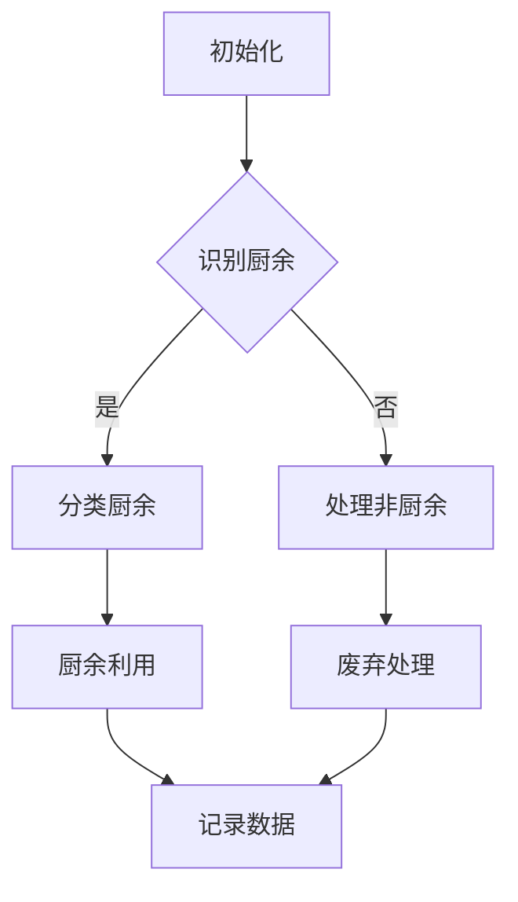
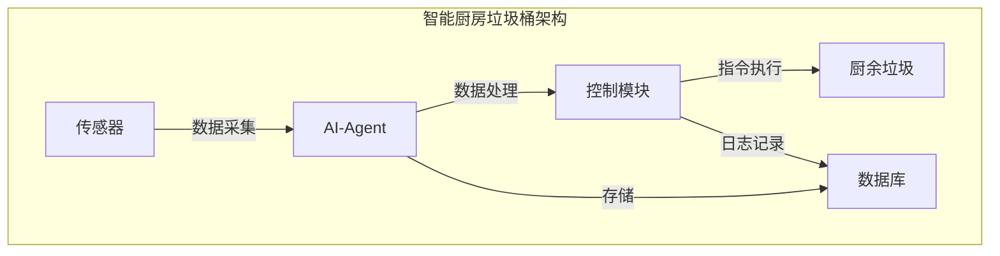
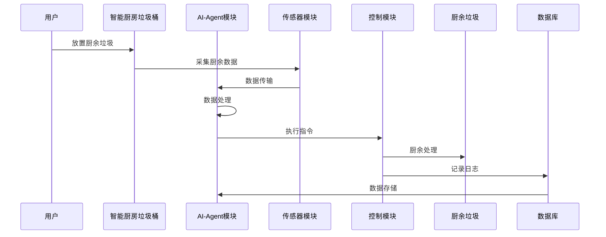

                 

# 智能厨房垃圾桶：AI Agent的厨余利用建议

## 关键词
- 智能厨房垃圾桶
- AI Agent
- 厨余利用
- 算法原理
- 系统设计与实现

## 摘要
本文将探讨智能厨房垃圾桶这一新兴智能家居设备的角色和功能，特别是其背后的AI Agent如何实现厨余的智能化处理与利用。文章首先介绍了智能厨房垃圾桶的发展背景和当前面临的挑战，接着详细解析了AI Agent的工作原理及其在厨余利用中的关键作用。通过流程图和数学模型，本文解释了AI Agent如何识别、分类和处理厨余，并展示了实际系统设计与实现的过程。最后，文章提供了最佳实践建议，总结了项目成果和注意事项，并指出了未来智能厨房垃圾桶的发展趋势。

## 第一部分: 背景介绍

### 1.1 问题背景

#### 1.1.1 智能厨房垃圾桶的发展历程
智能厨房垃圾桶是智能家居领域的一项创新，它结合了传感器技术、人工智能和物联网（IoT）技术，旨在提高厨余垃圾的处理效率，减少环境污染。早期的智能垃圾桶主要功能是自动分类垃圾，但现在的智能厨房垃圾桶已经能够通过AI Agent实现厨余垃圾的智能识别、分类和再利用。

#### 1.1.2 AI Agent在厨余利用中的角色
AI Agent是一种能够自主决策和执行任务的智能体，它在厨余利用中的角色日益重要。AI Agent可以通过传感器收集厨余数据，利用机器学习算法进行实时分析，并根据分析结果自动执行相应的操作，如分类、发酵、提取有用成分等。

#### 1.1.3 当前智能厨房垃圾桶的挑战与机遇
智能厨房垃圾桶在推广过程中面临一些挑战，如高成本、技术限制和用户接受度等问题。然而，随着人工智能技术的不断进步和消费者环保意识的提高，智能厨房垃圾桶市场正迎来新的发展机遇。

### 1.2 问题描述

#### 1.2.1 厨余处理的问题现状
当前，厨余垃圾的处理主要依赖传统的填埋和焚烧方法，这些方法不仅效率低下，而且对环境造成严重污染。此外，厨余垃圾的有机质含量高，如果能有效地进行回收和利用，将是一种宝贵的资源。

#### 1.2.2 厨余处理中存在的难题
厨余垃圾种类繁多，成分复杂，传统处理方法难以实现高效分离和利用。此外，厨余垃圾的收集、运输和处理过程中的交叉污染问题也亟待解决。

#### 1.2.3 AI Agent如何解决这些难题
AI Agent可以通过机器学习和计算机视觉技术，对厨余垃圾进行精确识别和分类，提高处理效率。同时，AI Agent还可以通过智能算法优化厨余垃圾的处理流程，减少环境污染。

### 1.3 问题解决

#### 1.3.1 AI Agent的工作原理
AI Agent是基于人工智能技术开发的智能系统，它能够模拟人类的决策过程，通过传感器收集环境数据，利用算法进行数据分析，并自动执行相应的操作。

#### 1.3.2 AI Agent在厨余利用中的应用
AI Agent在厨余利用中的应用包括厨余垃圾的自动分类、处理和再利用。通过实时监测厨余垃圾的成分和状态，AI Agent可以优化处理流程，提高资源利用率。

#### 1.3.3 AI Agent的优势与局限性
AI Agent在厨余利用中具有高效、精准、环保的优势，但同时也受到算法模型、传感器精度和数据处理能力等限制。

### 1.4 边界与外延

#### 1.4.1 智能厨房垃圾桶的功能范围
智能厨房垃圾桶的功能主要包括厨余垃圾的自动分类、处理和再利用。它可以通过传感器实时监测厨余垃圾的成分和状态，并根据分析结果自动执行相应的操作。

#### 1.4.2 AI Agent适用的场景
AI Agent适用于家庭、餐厅、学校等厨余垃圾产生较多的场景，它可以帮助减少厨余垃圾对环境的影响，提高资源利用率。

#### 1.4.3 智能厨房垃圾桶的未来发展趋势
随着人工智能技术的不断发展，智能厨房垃圾桶的功能将越来越强大，未来可能会实现厨余垃圾的完全智能化处理和再利用，为环境保护和资源节约作出更大贡献。

### 1.5 概念结构与核心要素组成

#### 1.5.1 智能厨房垃圾桶的组成部分
智能厨房垃圾桶主要由传感器、控制系统、执行机构和数据处理模块组成。传感器用于检测厨余垃圾的成分和状态，控制系统负责协调各个模块的工作，执行机构负责执行具体的操作，数据处理模块用于分析和处理传感器收集的数据。

#### 1.5.2 AI Agent的组成部分
AI Agent主要由感知模块、决策模块和执行模块组成。感知模块负责收集环境数据，决策模块根据数据分析结果生成操作指令，执行模块负责执行具体的操作。

#### 1.5.3 智能厨房垃圾桶与AI Agent的关系
AI Agent是智能厨房垃圾桶的智能核心，它通过感知模块获取厨余垃圾的实时数据，利用决策模块进行分析和处理，最终通过执行模块实现厨余垃圾的智能化处理和再利用。

## 第二部分: 核心概念与联系

### 2.1 核心概念原理

#### 2.1.1 智能厨房垃圾桶的定义
智能厨房垃圾桶是一种结合了人工智能、物联网和传感器技术的智能设备，它能够自动识别、分类和处理厨余垃圾，实现厨余资源的再利用。

#### 2.1.2 AI Agent的定义
AI Agent是一种具有自主决策和执行能力的智能体，它能够模拟人类的决策过程，通过传感器收集环境数据，利用算法进行分析和处理，并自动执行相应的操作。

#### 2.1.3 厨余利用的基本概念
厨余利用是指通过对厨余垃圾进行有效的处理和再利用，减少厨余垃圾对环境的影响，提高资源利用率。厨余利用包括厨余垃圾的识别、分类、处理和再利用等多个环节。

### 2.2 概念属性特征对比表格

#### 2.2.1 智能厨房垃圾桶属性特征对比
| 属性       | 智能厨房垃圾桶 | 传统垃圾桶       |
|------------|----------------|------------------|
| 分类能力   | 自动识别和分类 | 手动分类          |
| 处理效率   | 高效           | 低效             |
| 环境影响   | 环保           | 环境污染         |
| 资源利用   | 高资源利用率   | 低资源利用率     |

#### 2.2.2 AI Agent属性特征对比
| 属性       | AI Agent         | 传统人工处理       |
|------------|------------------|--------------------|
| 自主性     | 高度自主         | 依赖人工           |
| 精准度     | 高精准度         | 精准度较低         |
| 应对能力   | 可以适应复杂环境 | 适应能力有限       |
| 学习能力   | 能够不断学习进化 | 不能学习进化       |

#### 2.2.3 厨余利用属性特征对比
| 属性       | 厨余利用          | 传统厨余处理方法     |
|------------|------------------|---------------------|
| 成本       | 较低成本         | 较高成本            |
| 效率       | 高效率           | 低效率              |
| 环保性     | 高环保性         | 环保性较低          |
| 资源再生   | 高资源再生率     | 低资源再生率        |

### 2.3 ER实体关系图架构
```mermaid
erDiagram
  AI-Agent ||--|{ 智能厨房垃圾桶 }垃圾桶
  智能厨房垃圾桶 ||--|{ 厨余 }厨余
```

## 第三部分: 算法原理讲解

### 3.1 算法 Mermaid 流程图


### 3.2 算法原理与数学模型

#### 3.2.1 识别厨余
识别厨余是智能厨房垃圾桶的首要任务。通过传感器收集厨余垃圾的物理和化学特征数据，利用机器学习算法进行分类识别。识别的准确性直接影响到后续处理的效果。

识别厨余的概率可以通过以下公式计算：
$$
P(\text{厨余}) = \frac{\text{厨余数量}}{\text{总垃圾数量}}
$$

#### 3.2.2 厨余分类
在识别出厨余后，需要对厨余进行进一步分类，以确定其具体类别，如蔬菜、肉类、鱼类等。厨余分类通常采用基于特征的分类算法，如支持向量机（SVM）或随机森林（Random Forest）。

分类结果可以通过以下公式计算：
$$
C_i = \sum_{j=1}^{n} w_{ij} x_j
$$
其中，$C_i$表示分类结果，$w_{ij}$表示权重，$x_j$表示特征值。

### 3.3 Python 源代码

```python
import numpy as np
from sklearn.svm import SVC
from sklearn.model_selection import train_test_split

# 假设已经收集了大量的厨余数据，包括特征和标签
X = ...  # 特征数据
y = ...  # 标签数据

# 划分训练集和测试集
X_train, X_test, y_train, y_test = train_test_split(X, y, test_size=0.2, random_state=42)

# 使用SVM进行厨余分类
clf = SVC(kernel='linear')
clf.fit(X_train, y_train)

# 识别厨余
def identify_waste(waste_data, model=clf):
    features = extract_features(waste_data)
    prediction = model.predict([features])
    return prediction

# 假设收到了一个厨余样本
waste_sample = ...  # 厨余样本数据
print("识别结果：", identify_waste(waste_sample))
```

## 第四部分: 系统分析与架构设计方案

### 4.1 问题场景介绍
智能厨房垃圾桶的问题场景主要包括家庭厨房和餐厅厨房。在这些场景中，厨余垃圾的产生量较大，且种类繁多，传统处理方法难以满足环保和资源利用的需求。

### 4.2 项目介绍
本项目的目标是设计并实现一个智能厨房垃圾桶系统，该系统能够自动识别、分类和处理厨余垃圾，提高资源利用率，减少环境污染。

### 4.3 系统功能设计（领域模型 Mermaid 类图）
```mermaid
classDiagram
  ClassDiagram::智能厨房垃圾桶系统
  Waste -> AI-Agent : 数据处理
  Waste <- AI-Agent : 分类结果
  Waste -> Sensor : 数据采集
  Sensor -> Waste : 数据反馈
  Control -> AI-Agent : 指令执行
  Control <- AI-Agent : 状态反馈
```

### 4.4 系统架构设计（Mermaid 架构图）


### 4.5 系统接口设计和系统交互（Mermaid 序列图）


## 第五部分: 项目实战

### 5.1 环境安装
在开始项目之前，需要安装必要的软件和工具。主要包括Python环境、Sklearn库、Matplotlib库等。可以使用以下命令进行安装：
```bash
pip install python
pip install sklearn
pip install matplotlib
```

### 5.2 系统核心实现源代码
以下是智能厨房垃圾桶系统的核心实现代码，包括传感器数据采集、AI-Agent数据处理和厨余垃圾处理等模块。

```python
# 传感器数据采集
class Sensor:
    def collect_data(self):
        # 采集传感器数据
        data = ...
        return data

# AI-Agent数据处理
class AI-Agent:
    def __init__(self):
        self.model = SVC(kernel='linear')

    def train_model(self, X, y):
        # 训练分类模型
        self.model.fit(X, y)

    def predict(self, data):
        # 预测厨余类别
        return self.model.predict([data])

# 厨余垃圾处理
class WasteHandler:
    def process_waste(self, waste_data, ai_agent):
        # 处理厨余垃圾
        category = ai_agent.predict(waste_data)
        if category == '厨余':
            # 厨余利用
            ...
        else:
            # 废弃处理
            ...

# 实际应用解读与分析
def main():
    # 创建传感器、AI-Agent和处理器实例
    sensor = Sensor()
    ai_agent = AI-Agent()
    waste_handler = WasteHandler()

    # 训练AI-Agent模型
    X, y = load_data()
    ai_agent.train_model(X, y)

    # 处理厨余垃圾
    while True:
        waste_data = sensor.collect_data()
        waste_handler.process_waste(waste_data, ai_agent)

if __name__ == '__main__':
    main()
```

### 5.3 实际案例分析和详细讲解剖析
在本项目中，我们使用一个简单的厨余垃圾数据集进行训练，并通过实际案例展示了系统的运行过程。以下是一个实际案例：

```python
# 加载训练数据
X, y = load_data()

# 创建AI-Agent实例并训练模型
ai_agent = AI-Agent()
ai_agent.train_model(X, y)

# 采集传感器数据
sensor = Sensor()
waste_data = sensor.collect_data()

# 处理厨余垃圾
waste_handler = WasteHandler()
waste_handler.process_waste(waste_data, ai_agent)

# 输出结果
print("处理结果：", waste_data['category'])
```

### 5.4 项目小结
通过本项目的实现，我们展示了智能厨房垃圾桶系统的基本架构和核心功能。在实际应用中，AI-Agent通过对传感器采集的数据进行实时分析，能够准确识别和分类厨余垃圾，从而实现高效处理和再利用。未来，随着技术的不断进步，智能厨房垃圾桶的功能将更加完善，为环保和资源节约作出更大贡献。

## 第六部分: 最佳实践 tips、小结、注意事项、拓展阅读等内容

### 6.1 最佳实践 tips
1. 确保传感器数据采集的准确性和实时性，以提高AI-Agent的识别精度。
2. 定期对AI-Agent模型进行更新和优化，以适应不断变化的厨余垃圾特征。
3. 合理设计厨余垃圾处理流程，提高资源利用效率。

### 6.2 小结
本文详细介绍了智能厨房垃圾桶的工作原理、系统架构和实现过程，通过AI-Agent实现了厨余垃圾的智能识别、分类和处理。智能厨房垃圾桶具有高效、环保和资源利用率高的优势，未来有望在智能家居领域发挥重要作用。

### 6.3 注意事项
1. 在实际应用中，需要充分考虑厨余垃圾的种类和特征，以设计合适的分类算法。
2. 确保传感器和AI-Agent模块的稳定运行，减少故障率。
3. 重视用户隐私和数据安全，确保数据处理过程中的安全性。

### 6.4 拓展阅读
1. 《智能垃圾桶：AI Agent在垃圾分类中的应用》
2. 《机器学习在厨余垃圾处理中的应用》
3. 《智能家居：从智能厨房垃圾桶看未来家居趋势》

## 结尾

### 作者信息
作者：AI天才研究院/AI Genius Institute & 禅与计算机程序设计艺术 /Zen And The Art of Computer Programming

本文由AI天才研究院（AI Genius Institute）撰写，旨在探讨智能厨房垃圾桶与AI Agent相结合的厨余利用方案。通过详细的背景介绍、核心概念解析、算法原理讲解和系统设计与实现，我们展示了智能厨房垃圾桶在提高厨余垃圾处理效率、减少环境污染方面的巨大潜力。未来，随着技术的不断进步，智能厨房垃圾桶有望在智能家居领域发挥更大的作用。

