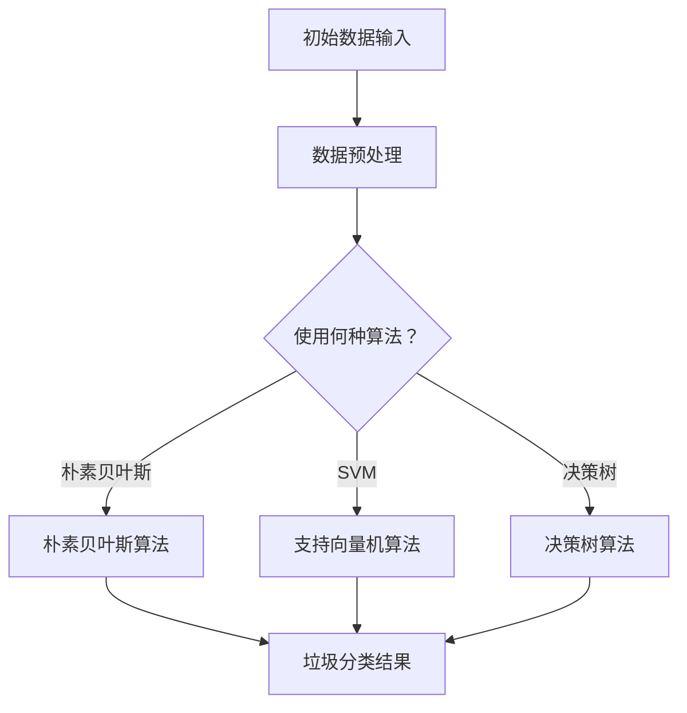
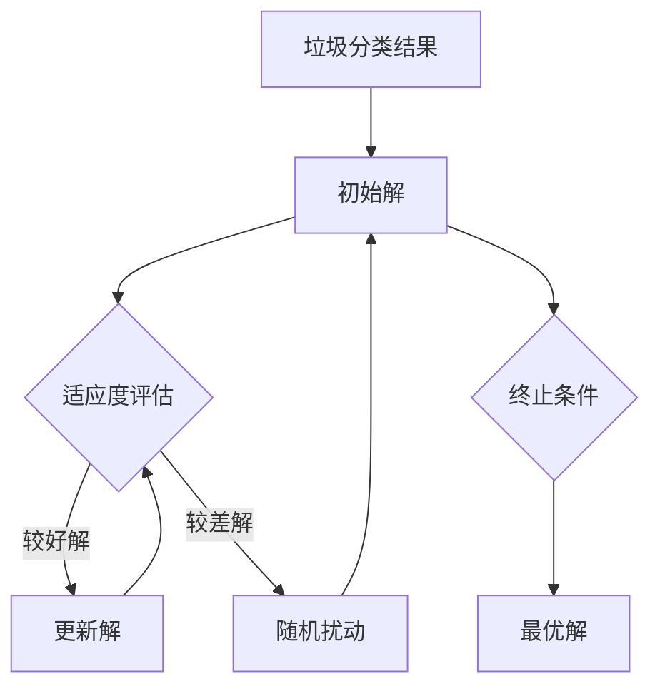
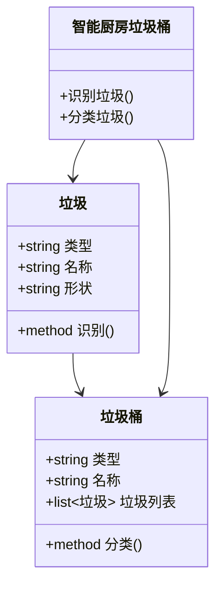
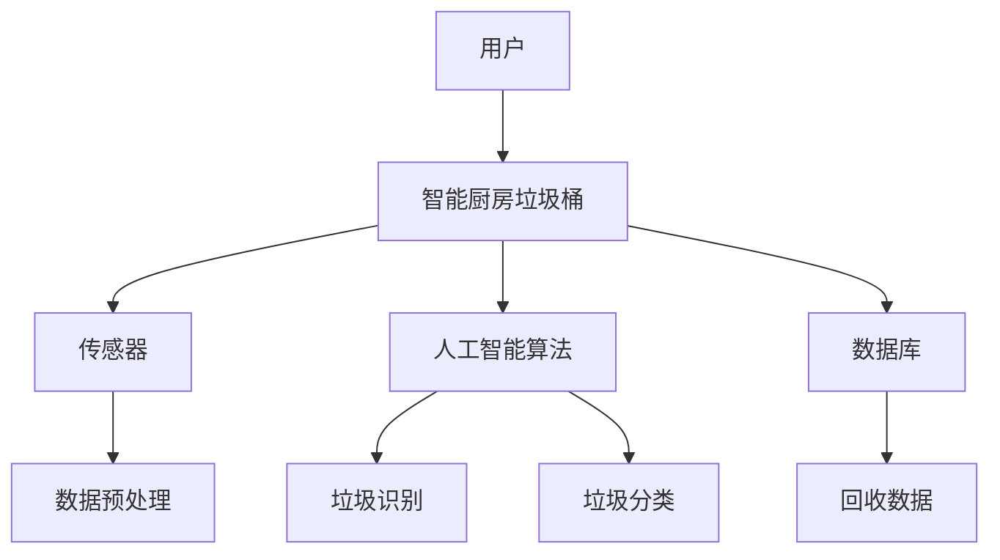
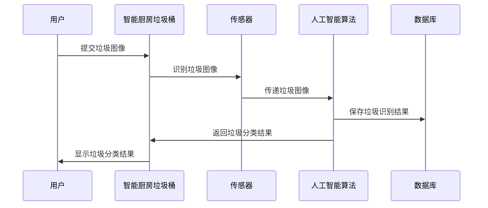

                 

# 智能厨房垃圾桶：AI Agent的废物回收建议

## 关键词

- **智能厨房垃圾桶**，**AI Agent**，**废物回收**，**垃圾分类**，**算法**，**系统架构**，**环境安装**

## 摘要

本文旨在探讨智能厨房垃圾桶中的AI Agent在废物回收中的应用，详细分析了其核心概念、算法原理、系统设计与实战案例。通过本文，读者将了解智能厨房垃圾桶的工作机制，AI Agent在废物回收中的角色及其优势，以及如何实现一个高效的废物回收系统。文章还将提供实际案例分析、最佳实践建议，并对未来技术趋势进行展望。

## 第1章：智能厨房垃圾桶的背景

### 1.1 智能厨房垃圾桶概述

**定义：** 智能厨房垃圾桶是一种结合了传感器技术、人工智能算法和互联网通信技术的智能设备，主要应用于家庭和公共场所的废物回收。

**起源与发展：** 随着城市化进程的加快和环保意识的增强，智能垃圾回收设备逐渐成为市场热点。早在20世纪末，一些发达国家就已经开始研发智能垃圾桶。随着技术的进步，智能垃圾桶的功能和性能不断提高，逐渐成为家庭和公共场所的标配。

**AI Agent在废物回收中的作用：** AI Agent可以实时监测垃圾桶的状态，识别垃圾种类，并自动进行垃圾分类和回收。这不仅可以提高垃圾回收效率，还能减轻环卫工人的劳动强度，减少环境污染。

### 1.2 当前废物回收问题

**垃圾分类难题：** 目前，全球范围内的垃圾分类问题日益严重。不同国家和地区对垃圾分类的标准和要求各不相同，导致垃圾分类难度加大。

**垃圾回收效率低：** 传统垃圾回收方式主要依靠人工进行分类和处理，效率低下，且容易导致垃圾二次污染。

**环境污染问题：** 垃圾堆积和不当处理会导致环境污染，对人类健康和生态系统造成威胁。

### 1.3 AI Agent在废物回收中的应用前景

AI Agent在废物回收中的应用具有巨大潜力。通过智能识别和分类技术，AI Agent可以显著提高垃圾回收效率，减少环境污染。同时，AI Agent还可以实现智能决策，为废物回收提供科学依据。

## 第2章：核心概念与联系

### 2.1 AI Agent的概念

**定义：** AI Agent是指能够自主感知环境、制定计划并采取行动的人工智能实体。

**分类：** 根据功能和应用场景，AI Agent可分为以下几类：

- **感知型AI Agent：** 主要负责感知环境，收集数据。
- **决策型AI Agent：** 负责分析数据，制定决策。
- **执行型AI Agent：** 负责执行决策，完成具体任务。

**功能：** AI Agent具有以下功能：

- **感知：** 通过传感器收集环境数据。
- **规划：** 根据数据制定行动计划。
- **决策：** 分析数据，做出最优决策。
- **执行：** 执行决策，完成任务。

### 2.2 智能厨房垃圾桶的关键技术

**传感器技术：** 智能厨房垃圾桶通常配备多种传感器，如温度传感器、湿度传感器、重量传感器等，用于实时监测垃圾桶的状态。

**人工智能算法：** 智能厨房垃圾桶利用人工智能算法进行垃圾识别和分类。常见的算法包括机器学习算法、深度学习算法等。

**垃圾分类与识别技术：** 智能厨房垃圾桶通过图像识别、语音识别等技术，实现对垃圾种类的准确识别。

### 2.3 AI Agent与废物回收的关系

**角色：** AI Agent在废物回收中扮演着感知、决策和执行的角色。通过感知垃圾桶的状态，AI Agent可以实时监测垃圾的投放情况，并根据垃圾种类进行分类。

**优势：** 

- **提高回收效率：** AI Agent可以自动识别和分类垃圾，提高回收效率。
- **减少人工劳动：** 通过自动化处理，减少环卫工人的劳动强度。
- **降低环境污染：** 准确分类垃圾，减少垃圾堆积和二次污染。

**挑战与应对策略：**

- **数据准确性：** AI Agent需要准确识别垃圾种类，这对算法和传感器技术提出了较高要求。
- **技术成本：** 智能垃圾桶的制造成本较高，需要降低成本以实现广泛应用。

## 第3章：废物回收的AI算法

### 3.1 垃圾分类算法

#### 3.1.1 算法概述

垃圾分类算法是智能厨房垃圾桶的核心算法之一，主要负责识别和分类垃圾。常见的垃圾分类算法包括：

- **朴素贝叶斯算法：** 基于贝叶斯定理进行垃圾分类。
- **支持向量机（SVM）：** 通过最大间隔分类器进行垃圾分类。
- **决策树：** 通过树形结构进行垃圾分类。

#### 3.1.2 算法mermaid流程图



#### 3.1.3 Python源代码讲解

```python
from sklearn.naive_bayes import GaussianNB
from sklearn.svm import SVC
from sklearn.tree import DecisionTreeClassifier
from sklearn.model_selection import train_test_split
from sklearn.metrics import accuracy_score

# 数据预处理
X_train, X_test, y_train, y_test = train_test_split(X, y, test_size=0.3, random_state=42)

# 朴素贝叶斯算法
gnb = GaussianNB()
gnb.fit(X_train, y_train)
y_pred_gnb = gnb.predict(X_test)

# 支持向量机算法
svm = SVC()
svm.fit(X_train, y_train)
y_pred_svm = svm.predict(X_test)

# 决策树算法
dt = DecisionTreeClassifier()
dt.fit(X_train, y_train)
y_pred_dt = dt.predict(X_test)

# 比较算法性能
print("朴素贝叶斯准确率：", accuracy_score(y_test, y_pred_gnb))
print("支持向量机准确率：", accuracy_score(y_test, y_pred_svm))
print("决策树准确率：", accuracy_score(y_test, y_pred_dt))
```

#### 3.1.4 数学模型与公式讲解

垃圾分类算法的数学模型通常包括概率模型、决策树模型和支持向量机模型。以下是各模型的简要介绍：

- **概率模型：** 基于贝叶斯定理，计算每个垃圾类别的概率，并根据最大概率原则进行分类。
- **决策树模型：** 通过树形结构，根据特征值进行分支，最终达到分类结果。
- **支持向量机模型：** 通过找到最优超平面，将不同垃圾类别分开。

### 3.2 智能决策算法

#### 3.2.1 算法概述

智能决策算法负责根据垃圾分类结果，制定最佳的废物回收计划。常见的智能决策算法包括遗传算法、模拟退火算法和人工神经网络等。

#### 3.2.2 算法mermaid流程图



#### 3.2.3 Python源代码讲解

```python
import numpy as np
import random

# 适应度评估函数
def fitness_function(solution):
    # 根据垃圾分类结果计算适应度值
    # ...
    return fitness_value

# 更新解函数
def update_solution(current_solution):
    # 根据适应度评估结果更新解
    # ...
    return new_solution

# 随机扰动函数
def random扰动(current_solution):
    # 对当前解进行随机扰动
    # ...
    return perturbed_solution

# 智能决策算法
def intelligent_decision_algorithm(initial_solution, termination_condition):
    current_solution = initial_solution
    while not termination_condition(current_solution):
        current_fitness = fitness_function(current_solution)
        new_solution = update_solution(current_solution)
        new_fitness = fitness_function(new_solution)
        if new_fitness > current_fitness:
            current_solution = new_solution
        else:
            current_solution = random扰动(current_solution)
    return current_solution
```

#### 3.2.4 数学模型与公式讲解

智能决策算法的数学模型通常基于优化理论，通过适应度函数评估解的优劣，并根据优化策略更新解。以下是各算法的简要介绍：

- **遗传算法：** 基于自然选择和遗传机制，通过交叉、变异和选择等操作，不断优化解。
- **模拟退火算法：** 基于物理退火过程，通过接受概率控制搜索方向，逐渐收敛到最优解。
- **人工神经网络：** 基于神经网络模型，通过训练学习，实现对废物回收问题的建模和预测。

## 第4章：系统分析与架构设计方案

### 4.1 问题场景介绍

**家庭垃圾分类问题：** 家庭垃圾分类问题是智能厨房垃圾桶需要解决的核心问题之一。不同类型的垃圾需要分别投入不同的垃圾桶，否则会导致垃圾无法有效回收。

**垃圾回收系统需求分析：** 垃圾回收系统需要实现以下功能：

- **垃圾识别：** 准确识别各种垃圾种类。
- **垃圾分类：** 根据垃圾种类进行分类。
- **废物回收：** 将分类后的垃圾投入相应的回收桶。

### 4.2 系统功能设计

**领域模型（mermaid类图）：**



**功能需求与设计：**

- **垃圾识别：** 利用图像识别技术，对垃圾进行实时识别。
- **垃圾分类：** 根据垃圾识别结果，将垃圾投入相应的垃圾桶。
- **废物回收：** 实现垃圾分类后的废物回收。

### 4.3 系统架构设计

**系统架构设计（mermaid架构图）：**



**架构组件介绍：**

- **用户：** 用户通过智能厨房垃圾桶进行垃圾分类。
- **智能厨房垃圾桶：** 负责接收用户输入，调用传感器、人工智能算法和数据库进行垃圾分类。
- **传感器：** 用于实时监测垃圾桶的状态。
- **人工智能算法：** 负责垃圾识别和分类。
- **数据库：** 用于存储垃圾识别和分类结果。

### 4.4 系统接口设计

**接口规范：**

- **垃圾分类接口：** 接受用户输入，返回垃圾分类结果。
- **垃圾识别接口：** 接受垃圾图像，返回垃圾类型。

**接口实现：**

```python
from flask import Flask, request, jsonify

app = Flask(__name__)

@app.route('/分类', methods=['POST'])
def classify():
    data = request.get_json()
   垃圾分类结果 = intelligent_classification(data['图像'])
    return jsonify({ '结果': 垃圾分类结果 })

@app.route('/识别', methods=['POST'])
def recognize():
    data = request.get_json()
    垃圾类型 = intelligent_recognition(data['图像'])
    return jsonify({ '类型': 垃圾类型 })
```

### 4.5 系统交互

**系统交互流程（mermaid序列图）：**



## 第5章：项目实战

### 5.1 环境安装

**硬件安装：**

1. 购买智能厨房垃圾桶设备。
2. 连接电源，确保设备通电。

**软件安装：**

1. 安装操作系统（如Linux或Windows）。
2. 安装开发环境（如Python环境、TensorFlow等）。
3. 安装智能厨房垃圾桶的软件包。

### 5.2 系统核心实现

**源代码解读：**

```python
import cv2
import numpy as np
from tensorflow.keras.models import load_model

# 载入预训练的垃圾识别模型
model = load_model('垃圾识别模型.h5')

# 定义垃圾识别函数
def intelligent_recognition(image):
    # 图像预处理
    processed_image = preprocess_image(image)
    # 进行垃圾识别
    prediction = model.predict(processed_image)
    # 获取最高概率的垃圾类型
    class_id = np.argmax(prediction)
    # 返回垃圾类型
    return class_id

# 定义垃圾分类函数
def intelligent_classification(image):
    # 识别垃圾类型
    class_id = intelligent_recognition(image)
    # 根据垃圾类型进行分类
    if class_id == 0:
        return '可回收物'
    elif class_id == 1:
        return '有害垃圾'
    elif class_id == 2:
        return '湿垃圾'
    else:
        return '干垃圾'
```

**代码应用解读与分析：**

1. **图像预处理：** 对输入的图像进行预处理，包括缩放、灰度化、归一化等操作，以便于模型处理。
2. **垃圾识别：** 利用预训练的垃圾识别模型，对预处理后的图像进行识别，得到垃圾的类型。
3. **垃圾分类：** 根据识别结果，将垃圾投入相应的垃圾桶。

### 5.3 实际案例分析

**家庭垃圾回收案例分析：**

1. 用户将垃圾图像上传到智能厨房垃圾桶。
2. 智能厨房垃圾桶识别垃圾，并返回分类结果。
3. 用户根据分类结果，将垃圾投入相应的垃圾桶。

**商业垃圾分类案例分析：**

1. 商场、餐厅等公共场所安装智能厨房垃圾桶。
2. 智能厨房垃圾桶实时监测垃圾投放情况，并自动分类。
3. 工作人员根据分类结果，将垃圾投放到指定的回收桶。

### 5.3.3 案例分析总结

通过实际案例分析，可以发现智能厨房垃圾桶在家庭和商业垃圾分类中均具有显著的优势。家庭垃圾分类能够有效减少垃圾堆积，提高回收效率；商业垃圾分类能够减轻环卫工人的劳动强度，提高垃圾回收质量。

## 第6章：最佳实践 tips

### 6.1 系统维护与升级

**维护策略：**

1. 定期检查传感器工作状态，确保正常运行。
2. 更新人工智能算法，提高垃圾分类准确率。
3. 定期备份数据库，防止数据丢失。

**升级流程：**

1. 停止系统运行，确保安全。
2. 更新软件版本，修复已知的漏洞和问题。
3. 恢复系统运行，并进行测试。

### 6.2 性能优化建议

**性能瓶颈分析：**

1. 数据处理速度慢：优化算法，减少计算复杂度。
2. 传感器精度低：更换高性能传感器，提高数据准确性。

**性能优化方法：**

1. 使用并行计算，提高数据处理速度。
2. 使用更高效的算法，降低计算复杂度。
3. 定期更新硬件设备，提高系统性能。

## 第7章：小结

### 7.1 本书总结

本文详细介绍了智能厨房垃圾桶的背景、核心概念、算法原理、系统设计与实战案例。通过本文，读者可以了解到智能厨房垃圾桶的工作机制，AI Agent在废物回收中的应用及其优势。同时，本文还提供了实际案例分析和最佳实践建议，为智能垃圾分类系统的开发与优化提供了有益参考。

### 7.1.2 AI Agent在废物回收中的应用前景

随着人工智能技术的不断发展，AI Agent在废物回收中的应用前景十分广阔。未来，智能垃圾分类系统将更加智能化、高效化，为环保事业做出更大贡献。

## 第8章：注意事项

### 8.1 数据隐私保护

在智能垃圾分类系统中，用户数据隐私保护至关重要。系统开发过程中，需确保用户数据的安全性，防止数据泄露。

### 8.2 垃圾识别准确率

垃圾识别准确率直接影响废物回收效果。为提高准确率，需不断优化算法，提高传感器性能。

### 8.3 系统稳定性和可靠性

智能垃圾分类系统需具备高稳定性和可靠性，确保长期运行不出现故障。

## 拓展阅读

1. **《智能垃圾分类系统设计与实现》：** 详细介绍了智能垃圾分类系统的设计原理与实现方法。
2. **《人工智能在环保领域的应用》：** 探讨了人工智能技术在环保领域的广泛应用。
3. **《传感器技术与应用》：** 介绍了传感器技术在智能垃圾分类系统中的应用。

作者：AI天才研究院/AI Genius Institute & 禅与计算机程序设计艺术 /Zen And The Art of Computer Programming

[返回目录](#目录)

