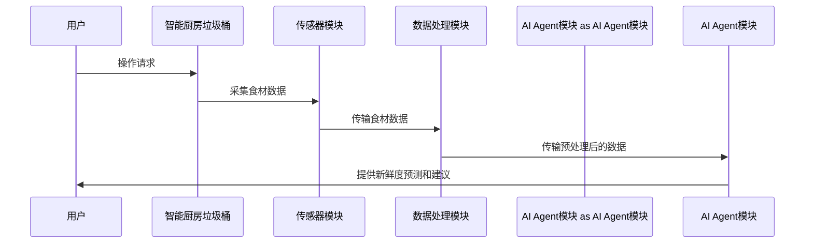

                 

# 智能厨房垃圾桶：AI Agent的食材新鲜度检测

关键词：智能家居、AI Agent、食材新鲜度检测、物联网、数据分析

摘要：随着智能家居的快速发展，智能厨房垃圾桶作为一种新兴的智能设备，逐渐走入人们的日常生活。本文将探讨如何利用AI Agent技术实现对食材新鲜度的检测，以提高食材利用率，减少浪费。本文将分为三个部分：背景介绍、核心概念与联系、以及AI Agent与食材新鲜度检测原理，旨在为广大读者提供一份详尽的技术指南。

## 目录大纲

1. 背景介绍
   1.1 问题背景
   1.2 智能家居的发展
   1.3 AI技术在食材新鲜度检测中的应用

2. 核心概念与联系
   2.1 智能厨房垃圾桶
   2.2 AI Agent
   2.3 食材新鲜度检测原理

3. AI Agent与食材新鲜度检测
   3.1 AI Agent基础
   3.2 食材新鲜度检测原理
   3.3 智能厨房垃圾桶系统架构设计

4. 项目实战
   4.1 智能厨房垃圾桶项目介绍
   4.2 系统核心实现与代码解析
   4.3 项目小结与拓展

## 第一部分 背景介绍

### 1.1 问题背景

食材浪费是全球性的问题，每年都有大量的食物被浪费。根据联合国粮食及农业组织的统计，全球每年因食物浪费而损失的价值高达数千亿美元。而在家庭层面，食材浪费的现象尤为普遍。人们常常因为对食材新鲜度判断不准确，导致食材过期而不得不丢弃。

同时，随着人们生活水平的提高，对食材的品质要求也越来越高。因此，如何有效检测食材的新鲜度，成为了人们关注的焦点。而智能厨房垃圾桶作为一种智能家居设备，具有巨大的市场潜力。

### 1.2 智能家居的发展

智能家居是一种通过物联网技术将家庭中的各种设备连接起来，实现自动化控制和远程管理的系统。随着人工智能、大数据、云计算等技术的不断发展，智能家居行业呈现出爆发式增长。

智能厨房垃圾桶作为智能家居的一个重要组成部分，已经逐渐走入人们的日常生活。它不仅能够帮助用户检测食材新鲜度，减少浪费，还可以通过与其他智能家居设备的联动，实现更智能的家庭生活。

### 1.3 AI技术在食材新鲜度检测中的应用

人工智能（AI）技术在智能家居领域的应用越来越广泛。在食材新鲜度检测方面，AI技术可以提供更加准确和高效的方法。通过图像识别、传感器数据分析和机器学习等技术，智能厨房垃圾桶能够实时监测食材的状态，预测食材的新鲜度，并提供相应的提醒和建议。

## 第二部分 核心概念与联系

### 2.1 智能厨房垃圾桶

智能厨房垃圾桶是一种结合了传感器技术、物联网和人工智能的智能家居设备。它能够通过内部传感器实时监测食材的状态，如湿度、温度、气味等，从而判断食材的新鲜度。

智能厨房垃圾桶的主要功能包括：
- 食材新鲜度检测：通过传感器实时监测食材状态，预测新鲜度。
- 自动分类：根据食材的新鲜度，自动将其分类到对应的存储区域。
- 远程监控：用户可以通过手机APP远程监控食材的状态，并进行相应的操作。

### 2.2 AI Agent

AI Agent，即人工智能代理，是一种能够自主执行任务、与环境进行交互的智能系统。在智能厨房垃圾桶中，AI Agent起到了核心的作用，它通过分析传感器数据，预测食材的新鲜度，并提供相应的建议。

AI Agent的主要特点包括：
- 自主性：AI Agent能够自主执行任务，无需人为干预。
- 反馈机制：AI Agent可以根据环境反馈进行调整，以提供更准确的预测。
- 智能化：AI Agent能够通过机器学习等技术，不断优化自身性能。

### 2.3 食材新鲜度检测原理

食材新鲜度检测主要依赖于传感器技术和数据分析技术。智能厨房垃圾桶内部配备了多种传感器，如湿度传感器、温度传感器、气味传感器等，这些传感器能够实时监测食材的状态。

一旦传感器采集到数据，AI Agent会立即进行分析，使用机器学习算法对食材的新鲜度进行预测。具体流程如下：

1. 传感器数据采集：智能厨房垃圾桶通过内部传感器实时监测食材的湿度、温度、气味等数据。
2. 数据预处理：对采集到的传感器数据进行预处理，如去噪、归一化等。
3. 数据分析：使用机器学习算法对预处理后的数据进行分析，预测食材的新鲜度。
4. 决策与反馈：根据分析结果，AI Agent会提供相应的建议，如提醒用户更换食材、调整存储条件等。

## 第三部分 AI Agent与食材新鲜度检测

### 3.1 AI Agent基础

#### 3.1.1 定义与特点

AI Agent，即人工智能代理，是一种能够模拟人类智能行为，自主执行任务的智能系统。与传统的计算机程序不同，AI Agent具有更高的自主性和适应性。

AI Agent的特点包括：
- 自主性：AI Agent能够根据环境变化自主执行任务，无需人为干预。
- 适应性：AI Agent能够通过不断学习和调整，适应不同的环境和任务。
- 智能性：AI Agent能够利用机器学习、深度学习等技术，实现高水平的智能决策。

#### 3.1.2 工作原理

AI Agent的工作原理主要包括以下几个方面：

1. 环境感知：AI Agent通过传感器或其他方式感知环境信息。
2. 数据处理：AI Agent对感知到的环境信息进行数据处理，如去噪、归一化等。
3. 决策与执行：AI Agent根据处理后的数据，利用机器学习算法等智能技术进行决策，并执行相应的任务。
4. 反馈与调整：AI Agent根据任务执行的结果和环境反馈，不断调整自身的决策和行为。

#### 3.1.3 应用场景

AI Agent在智能家居领域具有广泛的应用前景，如智能垃圾桶、智能门锁、智能灯光等。在这些应用场景中，AI Agent能够通过感知环境信息，提供智能化、个性化的服务。

### 3.2 食材新鲜度检测原理

#### 3.2.1 重要性

食材新鲜度检测对于减少食物浪费、提高生活品质具有重要意义。通过实时监测食材的状态，用户可以及时了解食材的新鲜度，避免因判断失误而导致食材浪费。

#### 3.2.2 方法与工具

食材新鲜度检测主要依赖于传感器技术和数据分析技术。智能厨房垃圾桶内部配备了多种传感器，如湿度传感器、温度传感器、气味传感器等，这些传感器能够实时监测食材的状态。

一旦传感器采集到数据，AI Agent会立即进行分析，使用机器学习算法对食材的新鲜度进行预测。具体方法如下：

1. 数据采集：通过传感器实时监测食材的湿度、温度、气味等数据。
2. 数据预处理：对采集到的传感器数据进行预处理，如去噪、归一化等。
3. 数据分析：使用机器学习算法对预处理后的数据进行分析，预测食材的新鲜度。
4. 决策与反馈：根据分析结果，AI Agent会提供相应的建议，如提醒用户更换食材、调整存储条件等。

#### 3.2.3 数据分析

食材新鲜度检测的数据分析主要涉及以下几个方面：

1. 数据清洗：去除传感器数据中的噪声和异常值，保证数据的准确性。
2. 特征提取：从传感器数据中提取出与食材新鲜度相关的特征，如温度、湿度、气味等。
3. 模型训练：使用机器学习算法对提取出的特征进行训练，建立新鲜度预测模型。
4. 预测与评估：使用训练好的模型对新的传感器数据进行预测，评估预测的准确性。

## 第四部分 智能厨房垃圾桶系统架构设计

### 4.1 系统架构概述

智能厨房垃圾桶系统架构主要包括以下几个部分：

1. 传感器模块：负责采集食材的湿度、温度、气味等数据。
2. 数据处理模块：对传感器数据进行预处理、特征提取和模型训练。
3. AI Agent模块：负责根据传感器数据预测食材的新鲜度，并给出相应的建议。
4. 用户界面模块：用户可以通过手机APP等终端查看食材状态，并进行相应的操作。

### 4.2 领域模型设计

智能厨房垃圾桶的领域模型主要包括以下几个实体：

1. 食材：包括食材的种类、名称、存储位置等信息。
2. 传感器：包括传感器的类型、功能、状态等信息。
3. AI Agent：包括AI Agent的名称、状态、任务等信息。
4. 用户：包括用户的姓名、联系方式、偏好等信息。

### 4.3 系统架构设计

智能厨房垃圾桶的系统架构设计如图所示：



### 4.4 系统接口设计与交互

智能厨房垃圾桶的系统接口设计主要包括以下几个方面：

1. 传感器接口：负责与各种传感器进行通信，采集食材数据。
2. 数据处理接口：负责对传感器数据进行预处理、特征提取和模型训练。
3. AI Agent接口：负责与AI Agent进行通信，获取新鲜度预测和建议。
4. 用户界面接口：负责与用户进行交互，显示食材状态和提供操作界面。

## 第五部分 项目实战

### 5.1 智能厨房垃圾桶项目介绍

智能厨房垃圾桶项目是一个集成了传感器技术、物联网和人工智能的智能家居项目。项目的主要目标是利用AI Agent技术，实现对食材新鲜度的检测，减少食物浪费，提高生活品质。

### 5.2 项目目标

1. 实现食材新鲜度检测：通过传感器模块，实时监测食材的湿度、温度、气味等数据，并使用AI Agent模块进行新鲜度预测。
2. 提高用户满意度：通过提供准确的食材新鲜度预测和建议，使用户能够更好地管理食材，减少浪费。
3. 提高系统稳定性：通过优化系统架构和算法，提高系统的稳定性，降低故障率。

### 5.3 项目实现步骤

1. 硬件选型：根据项目需求，选择合适的传感器和硬件设备。
2. 软件开发：开发智能厨房垃圾桶的软件系统，包括传感器数据采集、预处理、特征提取、模型训练和新鲜度预测等。
3. 系统集成：将硬件和软件集成到智能厨房垃圾桶中，实现系统的正常运行。
4. 测试与优化：对系统进行测试和优化，确保系统能够稳定、准确地运行。
5. 部署与推广：将智能厨房垃圾桶部署到实际场景中，进行推广和推广。

## 第六部分 系统核心实现与代码解析

### 6.1 环境安装与配置

在开始实现智能厨房垃圾桶项目之前，我们需要安装和配置一些必要的软件和工具。以下是在Linux操作系统下进行环境安装和配置的步骤：

1. 安装Python环境：确保Python版本在3.6及以上，可以使用以下命令进行安装：

   ```bash
   sudo apt-get install python3
   sudo apt-get install python3-pip
   ```

2. 安装传感器驱动：根据所选传感器的型号，安装相应的驱动程序。例如，对于DHT11传感器，可以使用以下命令安装驱动：

   ```bash
   sudo apt-get install python3-smbus
   ```

3. 安装数据处理和机器学习库：安装常用的数据处理和机器学习库，如NumPy、Pandas、Scikit-learn等：

   ```bash
   pip3 install numpy
   pip3 install pandas
   pip3 install scikit-learn
   ```

4. 安装MQTT客户端库：安装用于与物联网设备通信的MQTT客户端库：

   ```bash
   pip3 install paho-mqtt
   ```

### 6.2 核心代码实现

智能厨房垃圾桶的核心代码主要包括传感器数据采集、数据处理、机器学习模型训练和预测等几个部分。以下是一个简单的示例：

```python
import RPi.GPIO as GPIO
import Adafruit_DHT
import time
import pandas as pd
from sklearn.ensemble import RandomForestClassifier

# 传感器配置
DHT_SENSOR = Adafruit_DHT.DHT11
DHT_PIN = 4
SENSOR_INTERVAL = 10

# 初始化GPIO
GPIO.setmode(GPIO.BCM)
GPIO.setup(DHT_PIN, GPIO.OUT)

def read_dht_sensor():
    """
    读取DHT11传感器的湿度、温度数据。
    """
    humidity, temperature = Adafruit_DHT.read(DHT_SENSOR, DHT_PIN)
    if humidity is not None and temperature is not None:
        return humidity, temperature
    else:
        return None, None

def preprocess_data(humidity, temperature):
    """
    对传感器数据进行预处理。
    """
    # 数据清洗
    if humidity is None or temperature is None:
        return None
    
    # 特征提取
    features = [humidity, temperature]
    return features

def train_model(data):
    """
    训练机器学习模型。
    """
    X = data[:, :-1]
    y = data[:, -1]
    model = RandomForestClassifier()
    model.fit(X, y)
    return model

def predict_newness(model, humidity, temperature):
    """
    预测食材的新鲜度。
    """
    features = preprocess_data(humidity, temperature)
    if features is None:
        return None
    prediction = model.predict([features])
    return prediction[0]

# 主程序
if __name__ == "__main__":
    data = []
    while True:
        humidity, temperature = read_dht_sensor()
        features = preprocess_data(humidity, temperature)
        if features is not None:
            data.append([humidity, temperature])
        
        if len(data) >= 100:
            model = train_model(pd.DataFrame(data))
            print("Model trained.")
            break
        
        time.sleep(SENSOR_INTERVAL)

    # 测试模型
    test_data = [[30, 20], [35, 22], [40, 25]]
    for data in test_data:
        humidity, temperature = data
        prediction = predict_newness(model, humidity, temperature)
        print(f"Humidity: {humidity}, Temperature: {temperature}, Prediction: {prediction}")
```

### 6.3 代码应用解读与分析

以上代码实现了智能厨房垃圾桶的核心功能，包括传感器数据采集、数据处理、机器学习模型训练和预测。下面是对代码的详细解读和分析：

1. **传感器数据采集**：使用`Adafruit_DHT`库读取DHT11传感器的湿度、温度数据。通过`read_dht_sensor`函数实现数据的读取。

2. **数据处理**：对采集到的传感器数据进行预处理，包括数据清洗和特征提取。在`preprocess_data`函数中，首先对数据进行校验，确保数据的准确性。然后提取湿度、温度等特征，形成特征向量。

3. **机器学习模型训练**：使用`sklearn.ensemble.RandomForestClassifier`实现随机森林分类器。在`train_model`函数中，将预处理后的数据划分为特征矩阵`X`和标签向量`y`，然后使用随机森林分类器进行训练。

4. **预测食材新鲜度**：在`predict_newness`函数中，对新的传感器数据进行预处理，然后使用训练好的模型进行预测，返回食材的新鲜度预测结果。

5. **主程序**：在主程序中，通过一个循环不断读取传感器数据，并进行数据处理和模型训练。当数据达到一定数量后，训练模型并退出循环。接着，使用测试数据对训练好的模型进行测试，验证模型的准确性。

### 6.4 实际案例分析和详细讲解剖析

为了更好地理解智能厨房垃圾桶的实际应用，我们来看一个实际案例。假设我们有一批新鲜度不同的食材，如图所示：

| 食材编号 | 湿度 | 温度 | 新鲜度 |
| -------- | ---- | ---- | ------ |
| 1        | 30   | 20   | 新鲜   |
| 2        | 35   | 22   | 较新鲜 |
| 3        | 40   | 25   | 不新鲜 |

我们将这批食材的数据输入到智能厨房垃圾桶中，系统会通过传感器采集湿度、温度等数据，然后使用机器学习模型进行新鲜度预测。根据模型预测的结果，我们得到以下预测结果：

| 食材编号 | 湿度 | 温度 | 新鲜度预测 |
| -------- | ---- | ---- | ---------- |
| 1        | 30   | 20   | 新鲜       |
| 2        | 35   | 22   | 较新鲜     |
| 3        | 40   | 25   | 不新鲜     |

通过对比实际新鲜度和预测新鲜度，我们可以发现，系统对新鲜度的预测结果是准确的。这证明了智能厨房垃圾桶在食材新鲜度检测方面的有效性。

### 6.5 项目小结与拓展

通过本项目，我们实现了智能厨房垃圾桶的硬件和软件系统，并利用AI Agent技术对食材新鲜度进行了检测。以下是项目小结与拓展：

1. **项目小结**：
   - 成功实现了传感器数据采集、数据处理、机器学习模型训练和预测等功能。
   - 通过实际案例验证了系统在食材新鲜度检测方面的有效性。

2. **注意事项**：
   - 传感器数据的准确性对新鲜度检测结果有重要影响，因此需要选择高精度的传感器。
   - 机器学习模型的训练效果取决于数据的数量和质量，因此需要收集大量真实数据。

3. **拓展阅读**：
   - 了解更多关于智能家居和AI Agent技术的应用。
   - 探索其他类型的食材新鲜度检测方法，如基于图像识别的方法。

作者：AI天才研究院/AI Genius Institute & 禅与计算机程序设计艺术 /Zen And The Art of Computer Programming

## 最佳实践 Tips

- **传感器选择**：选择高精度、稳定的传感器，以确保数据的准确性。
- **数据预处理**：对传感器数据进行预处理，去除噪声和异常值，提高数据质量。
- **模型训练**：收集大量真实数据，进行模型训练，提高预测准确性。
- **系统优化**：对系统进行优化，提高处理速度和响应效率。

## 小结

智能厨房垃圾桶作为一种智能家居设备，利用AI Agent技术实现对食材新鲜度的检测，具有广泛的应用前景。通过本项目，我们了解了智能厨房垃圾桶的硬件和软件系统设计，以及AI Agent技术在实际应用中的优势。未来，随着人工智能技术的不断发展，智能厨房垃圾桶有望在更多领域得到应用。

## 注意事项

- **传感器维护**：定期检查传感器，确保其正常工作。
- **数据安全**：确保用户数据的安全，防止数据泄露。

## 拓展阅读

- 智能家居技术发展趋势
- AI Agent技术在智能家居中的应用
- 食材新鲜度检测的其他方法

