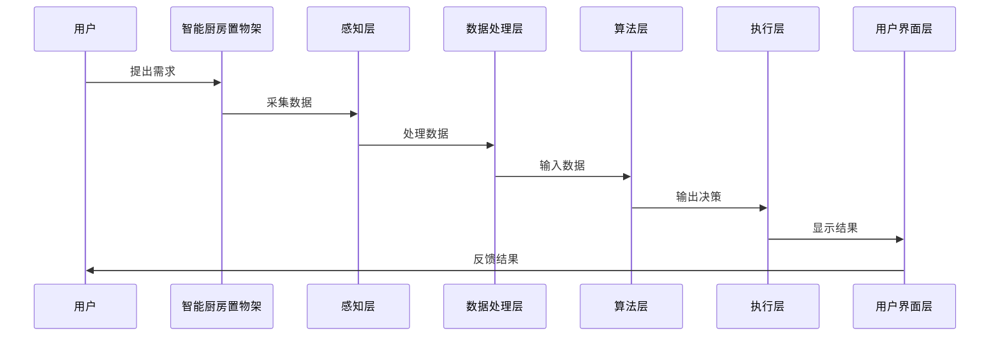
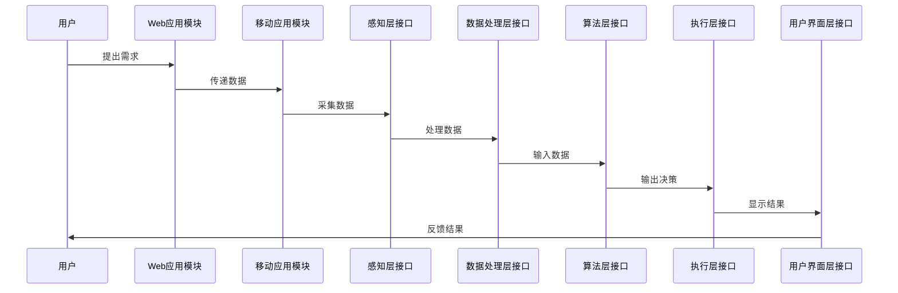

                 


### 摘要：

智能厨房置物架作为智能家居的一部分，正逐渐改变人们的厨房生活方式。通过集成AI Agent，智能厨房置物架能够提供个性化的食材使用建议，优化食材存储和管理，提升烹饪效率和饮食健康。本文将深入探讨智能厨房置物架的背景、核心概念、AI Agent的算法原理、系统架构设计，并通过一个实际项目展示其在日常生活中的应用。本文旨在为家居设计师、厨房设备制造商、IT专业人士和普通消费者提供一份全面的技术指南，帮助理解智能厨房置物架的潜力与实现方法。

---

# 智能厨房置物架：AI Agent的食材使用建议

> 关键词：智能厨房，AI Agent，食材管理，算法原理，系统设计，实战应用

## 引言

智能厨房置物架作为智能家居的核心设备之一，正在逐步渗透到现代家庭生活中。随着人工智能技术的不断发展，AI Agent在智能厨房置物架中的应用日益广泛，能够为用户带来前所未有的便捷和舒适体验。本文将从以下几个方面展开讨论：

1. **背景介绍**：介绍智能厨房置物架的概念、重要性及发展历程。
2. **核心概念与联系**：讲解AI Agent的定义、特点及其在智能厨房置物架中的应用。
3. **算法原理讲解**：深入探讨AI Agent的算法原理，包括数据预处理、算法模型和实现方法。
4. **系统分析与架构设计方案**：分析智能厨房置物架的系统架构，包括功能模块、接口设计和交互流程。
5. **项目实战**：通过一个实际项目展示智能厨房置物架的设计与实现过程。
6. **最佳实践与小结**：总结最佳实践经验，提出注意事项和未来展望。

### 背景介绍

#### 智能厨房的崛起

智能厨房作为智能家居的一部分，正在改变人们的日常生活。智能厨房不仅仅是家用电器的高效集成，更是通过物联网技术实现设备之间的互联互通，为用户提供更加便捷、舒适和智能化的厨房环境。

智能厨房置物架作为智能厨房的重要组成部分，其主要功能是提供高效的食材存储和管理。传统的厨房置物架通常只能提供简单的存储功能，而智能厨房置物架则通过传感器、摄像头和AI技术，能够实时监测食材的状态，提供个性化的食材使用建议，从而优化食材的管理和使用效率。

#### 智能厨房置物架的重要性

智能厨房置物架的重要性体现在以下几个方面：

1. **提升烹饪效率**：通过智能识别和推荐食材，用户可以更快速地完成烹饪，节省时间和精力。
2. **优化食材管理**：智能厨房置物架能够实时监测食材的新鲜程度，提醒用户及时处理和烹饪，减少食材浪费。
3. **促进健康饮食**：智能厨房置物架可以根据用户的饮食习惯和营养需求，提供个性化的饮食建议，帮助用户建立健康的饮食习惯。

#### 智能厨房的未来发展趋势

随着人工智能技术的不断发展，智能厨房置物架的未来发展趋势将包括以下几个方面：

1. **更智能的食材识别**：通过深度学习和图像识别技术，智能厨房置物架将能够更准确地识别食材的种类和新鲜程度。
2. **更个性化的使用建议**：智能厨房置物架将根据用户的饮食习惯、健康需求和个人偏好，提供更加精准的食材使用建议。
3. **更广泛的互联互通**：智能厨房置物架将与其他智能家居设备实现无缝连接，形成一个完整的智能生态系统。

### AI Agent的基础知识

#### AI Agent的定义与特点

AI Agent，即人工智能代理，是指一种能够模拟人类智能行为，具备一定自主决策能力的人工智能系统。AI Agent具有以下特点：

1. **自主决策**：AI Agent能够根据输入的信息和环境的变化，自主做出决策。
2. **学习能力**：AI Agent具备学习能力，能够通过不断的学习和优化，提高决策的准确性。
3. **交互能力**：AI Agent能够与用户进行交互，理解用户的意图和需求。

AI Agent通常由以下几个核心模块组成：

1. **感知模块**：负责收集环境信息，如传感器数据、图像、文本等。
2. **决策模块**：根据感知模块收集的信息，通过算法模型进行分析和决策。
3. **执行模块**：根据决策模块的决策结果，执行相应的操作。

#### AI Agent的分类与架构

AI Agent可以根据其应用场景和功能进行分类，常见的分类方法包括：

1. **基于任务类型的分类**：如任务型AI Agent、社交型AI Agent、决策型AI Agent等。
2. **基于技术类型的分类**：如基于机器学习的AI Agent、基于深度学习的AI Agent、基于自然语言处理的AI Agent等。

不同类型的AI Agent具有不同的架构和特点，但都具备感知、决策和执行三个核心模块。

#### AI Agent的典型应用场景

AI Agent在智能厨房置物架中的应用场景主要包括：

1. **食材识别**：通过图像识别技术，AI Agent能够准确识别食材的种类和新鲜程度。
2. **食材管理**：AI Agent可以根据食材的存储时间和新鲜程度，提供合理的食材使用建议，避免食材浪费。
3. **烹饪建议**：AI Agent可以根据食材的特点和用户的口味偏好，提供个性化的烹饪建议，优化烹饪过程。

### 智能厨房置物架的概念

#### 智能厨房置物架的定义

智能厨房置物架是一种集成了传感器、摄像头和AI技术的高科技厨房设备，主要用于食材的存储和管理。与传统厨房置物架相比，智能厨房置物架具有更高的智能化水平和更丰富的功能。

#### 智能厨房置物架的功能

智能厨房置物架的主要功能包括：

1. **食材存储**：智能厨房置物架能够提供高效的食材存储空间，同时保证食材的新鲜度。
2. **食材识别**：通过摄像头和图像识别技术，智能厨房置物架能够准确识别食材的种类和新鲜程度。
3. **食材管理**：智能厨房置物架能够实时监测食材的状态，提供合理的食材使用建议，避免食材浪费。
4. **烹饪建议**：智能厨房置物架可以根据食材的特点和用户的口味偏好，提供个性化的烹饪建议，优化烹饪过程。
5. **健康监测**：智能厨房置物架可以通过监测食材和烹饪过程，为用户提供饮食健康建议，帮助用户建立健康的饮食习惯。

#### 智能厨房置物架的优势

智能厨房置物架的优势主要体现在以下几个方面：

1. **高效管理**：智能厨房置物架能够实时监测食材的状态，提供个性化的食材使用建议，优化食材的管理和使用效率。
2. **减少浪费**：通过智能识别和合理使用，智能厨房置物架能够有效减少食材的浪费，降低家庭食品开支。
3. **提高烹饪效率**：智能厨房置物架能够根据食材的特点和用户的口味偏好，提供个性化的烹饪建议，提高烹饪效率，节省时间和精力。
4. **促进健康饮食**：智能厨房置物架可以根据用户的饮食习惯和营养需求，提供个性化的饮食建议，帮助用户建立健康的饮食习惯。

### AI Agent在智能厨房置物架中的应用

#### AI Agent在食材管理中的应用

AI Agent在智能厨房置物架中的食材管理应用主要体现在以下几个方面：

1. **实时监测**：AI Agent能够通过摄像头和传感器实时监测食材的状态，包括新鲜程度、存储时间等。
2. **推荐建议**：根据食材的状态和用户的饮食需求，AI Agent能够提供个性化的食材使用建议，包括食材的保存、烹饪和使用方法等。
3. **优化管理**：AI Agent能够根据食材的状态和用户的饮食需求，自动调整食材的存储位置和使用顺序，优化食材的管理和使用效率。

#### AI Agent在烹饪建议中的应用

AI Agent在智能厨房置物架中的烹饪建议应用主要体现在以下几个方面：

1. **个性化推荐**：AI Agent可以根据食材的特点和用户的口味偏好，提供个性化的烹饪建议，包括烹饪方法、烹饪时间和调料搭配等。
2. **健康分析**：AI Agent可以根据食材的营养成分和用户的饮食需求，分析烹饪后的健康影响，为用户提供合理的饮食建议。
3. **智能提醒**：AI Agent可以在食材准备、烹饪过程中提供智能提醒，确保烹饪过程的顺利进行。

#### AI Agent在健康监测中的应用

AI Agent在智能厨房置物架中的健康监测应用主要体现在以下几个方面：

1. **饮食分析**：AI Agent可以分析用户的饮食数据，包括食材种类、摄入量、烹饪方式等，为用户提供饮食健康分析。
2. **健康建议**：AI Agent可以根据用户的饮食数据和健康需求，提供个性化的健康建议，包括饮食调整、运动建议等。
3. **健康监测**：AI Agent可以通过监测食材和烹饪过程，为用户提供饮食健康监测，帮助用户建立健康的饮食习惯。

### 本章小结

本章首先介绍了智能厨房置物架的概念、功能和优势，然后详细讲解了AI Agent的定义、特点和应用场景。通过本章的学习，读者可以初步了解智能厨房置物架和AI Agent的基本概念，为后续章节的学习打下基础。在接下来的章节中，我们将进一步探讨AI Agent的算法原理、系统架构设计和实际应用案例，帮助读者深入了解智能厨房置物架的技术实现和实际应用。

---

## 背景介绍

### 核心概念术语说明

在本文中，我们将介绍以下几个核心概念术语：

1. **智能厨房**：指利用现代信息技术和人工智能技术，实现厨房设备智能化、自动化和互联化的厨房环境。
2. **AI Agent**：指一种能够模拟人类智能行为，具备一定自主决策能力的人工智能系统。
3. **智能厨房置物架**：指一种集成了传感器、摄像头和AI技术的高科技厨房设备，主要用于食材的存储和管理。
4. **食材管理**：指对食材的存储、识别、使用和优化等方面的管理活动。
5. **烹饪建议**：指根据食材的特点、用户的口味偏好和营养需求，提供的个性化烹饪建议。

### 问题背景

随着生活节奏的加快和人们对生活品质的追求，厨房作为家庭的重要组成部分，正逐渐从传统的手工劳动转变为智能化的自动化操作。传统的厨房设备虽然能够满足基本的烹饪需求，但在食材管理、烹饪效率和健康饮食方面存在一定的局限性。为此，智能厨房和智能厨房置物架的概念应运而生。

智能厨房置物架作为一种智能家居设备，其核心目标是提供高效的食材存储和管理，优化食材的使用效率，减少食材浪费，提高烹饪效率和饮食健康。然而，要实现这一目标，需要解决以下几个问题：

1. **食材识别与分类**：如何准确、快速地识别和分类不同种类的食材，是智能厨房置物架首先需要解决的问题。
2. **实时监测与预测**：如何实时监测食材的新鲜程度和存储时间，并提供合理的食材使用建议，是智能厨房置物架需要解决的另一个重要问题。
3. **个性化烹饪建议**：如何根据用户的口味偏好和健康需求，提供个性化的烹饪建议，是智能厨房置物架需要解决的技术难题。

### 问题描述

智能厨房置物架需要解决的核心问题包括：

1. **食材识别与分类**：通过图像识别技术，智能厨房置物架需要能够准确识别和分类各种食材，包括新鲜程度和存储状态。
2. **实时监测与预测**：智能厨房置物架需要能够实时监测食材的新鲜程度和存储时间，根据食材的状态提供合理的食材使用建议，避免食材浪费。
3. **个性化烹饪建议**：智能厨房置物架需要根据用户的口味偏好和营养需求，提供个性化的烹饪建议，优化烹饪过程，提高烹饪效率。

### 问题解决

为了解决上述问题，智能厨房置物架需要采用以下技术手段：

1. **图像识别技术**：通过摄像头和图像识别技术，智能厨房置物架能够准确识别和分类各种食材，包括新鲜程度和存储状态。
2. **传感器技术**：通过传感器技术，智能厨房置物架能够实时监测食材的新鲜程度和存储时间，并提供合理的食材使用建议。
3. **AI算法**：通过AI算法，智能厨房置物架能够根据用户的口味偏好和营养需求，提供个性化的烹饪建议，优化烹饪过程。

### 边界与外延

智能厨房置物架的应用边界和范围包括：

1. **应用边界**：智能厨房置物架主要用于家庭厨房环境，适用于各种类型的食材管理，包括蔬菜、水果、肉类、海鲜等。
2. **外延扩展**：智能厨房置物架可以通过与其他智能家居设备（如智能冰箱、智能烤箱等）的互联互通，扩展其功能和应用范围。

### 概念结构与核心要素组成

智能厨房置物架的概念结构包括以下几个核心要素：

1. **感知模块**：负责采集食材的状态信息，包括图像、温度、湿度等。
2. **决策模块**：根据感知模块提供的信息，通过AI算法进行食材识别、实时监测和烹饪建议。
3. **执行模块**：根据决策模块的决策结果，执行相应的操作，包括食材存储、提醒和烹饪控制。

通过上述概念结构和核心要素的组成，智能厨房置物架能够实现高效的食材管理、烹饪建议和健康监测，提升家庭厨房的智能化水平。

---

## 核心概念与联系

### AI Agent的定义与特点

AI Agent，即人工智能代理，是一种能够模拟人类智能行为，具备一定自主决策能力的人工智能系统。AI Agent具有以下几个显著特点：

1. **自主决策**：AI Agent能够根据输入的信息和环境的变化，自主做出决策。
2. **学习能力**：AI Agent具备学习能力，能够通过不断的学习和优化，提高决策的准确性。
3. **交互能力**：AI Agent能够与用户进行交互，理解用户的意图和需求。

AI Agent通常由以下几个核心模块组成：

1. **感知模块**：负责收集环境信息，如传感器数据、图像、文本等。
2. **决策模块**：根据感知模块收集的信息，通过算法模型进行分析和决策。
3. **执行模块**：根据决策模块的决策结果，执行相应的操作。

AI Agent的分类方法多种多样，可以根据任务类型、技术类型和应用场景进行分类。以下是一些常见的分类方法：

1. **基于任务类型的分类**：
   - **任务型AI Agent**：专注于完成特定任务的AI系统，如语音助手、智能客服等。
   - **社交型AI Agent**：专注于与用户进行交互，提供社交服务的AI系统，如社交机器人、在线聊天系统等。
   - **决策型AI Agent**：专注于辅助决策的AI系统，如智能推荐系统、风险控制系统等。

2. **基于技术类型的分类**：
   - **基于机器学习的AI Agent**：通过机器学习算法，从数据中学习模式和规律，进行自主决策。
   - **基于深度学习的AI Agent**：通过深度学习算法，模拟人脑神经网络结构，进行复杂模式识别和决策。
   - **基于自然语言处理的AI Agent**：通过自然语言处理技术，理解用户的语言指令和需求。

#### AI Agent在智能厨房置物架中的应用

AI Agent在智能厨房置物架中扮演着关键角色，其主要应用包括：

1. **食材识别**：AI Agent通过图像识别技术，能够准确识别各种食材，包括其种类和新鲜程度。
2. **食材管理**：AI Agent能够实时监测食材的状态，根据存储时间和新鲜程度提供使用建议，优化食材管理。
3. **烹饪建议**：AI Agent可以根据食材的特点和用户的口味偏好，提供个性化的烹饪建议，优化烹饪过程。
4. **健康监测**：AI Agent可以通过监测食材和烹饪过程，为用户提供饮食健康分析和建议。

#### 概念属性特征对比表格

为了更好地理解AI Agent在不同应用场景中的表现，以下是一个概念属性特征对比表格：

| 特征                 | 任务型AI Agent          | 社交型AI Agent          | 决策型AI Agent          |
|----------------------|-------------------------|-------------------------|-------------------------|
| **感知模块**         | 专注于任务相关的感知     | 专注于社交相关的感知     | 专注于数据相关的感知    |
| **决策模块**         | 简单的决策逻辑          | 复杂的情感分析          | 复杂的统计分析          |
| **执行模块**         | 完成特定任务的操作      | 维持社交对话的流畅性    | 辅助决策的执行          |
| **交互能力**         | 较弱的交互能力          | 强大的交互能力          | 较强的交互能力          |
| **学习模式**         | 有监督学习             | 强化学习               | 有监督学习 + 强化学习  |

#### ER实体关系图架构

以下是AI Agent在智能厨房置物架中的ER（实体关系）图架构，用于描述AI Agent与厨房置物架各模块之间的相互关系：

```mermaid
erDiagram
    AI_Agent ||--|{ 感知模块 }
    AI_Agent ||--|{ 决策模块 }
    AI_Agent ||--|{ 执行模块 }
    感知模块 ||--|{ 食材识别 }
    感知模块 ||--|{ 食材监测 }
    决策模块 ||--|{ 烹饪建议 }
    决策模块 ||--|{ 食材管理 }
    执行模块 ||--|{ 设备控制 }
    执行模块 ||--|{ 数据反馈 }
```

#### AI Agent在智能厨房置物架中的应用流程

AI Agent在智能厨房置物架中的应用流程可以概括为以下几个步骤：

1. **感知**：感知模块通过传感器和摄像头收集食材的图像和状态信息。
2. **分析**：决策模块对感知模块收集的数据进行分析，识别食材的种类和新鲜程度。
3. **决策**：决策模块根据分析结果，提供食材管理的建议，如食材存储位置调整、提醒用户及时使用等。
4. **执行**：执行模块根据决策模块的建议，控制设备进行相应的操作，如调整存储温度、提醒用户等。
5. **反馈**：执行模块将操作结果反馈给用户，确保用户了解食材的最新状态和操作建议。

通过上述流程，AI Agent能够实现智能厨房置物架的食材识别、管理、烹饪建议和健康监测等功能，提升厨房的智能化水平。

---

## 算法原理讲解

### 数据预处理

数据预处理是智能厨房置物架AI Agent算法的重要环节，其质量直接影响后续算法的准确性和效率。数据预处理主要包括以下几个步骤：

#### 1. 数据收集

数据收集是数据预处理的第一步，需要从多个渠道获取食材图像、温度、湿度等数据。这些数据可以通过传感器、摄像头和用户输入等途径获取。

#### 2. 数据清洗

数据清洗旨在去除数据中的噪声和异常值，确保数据的质量和一致性。具体方法包括：

- **去重**：去除重复的数据记录。
- **填充缺失值**：使用合适的插补方法填充缺失数据。
- **去除异常值**：通过统计学方法识别并去除异常数据。

#### 3. 数据格式转换

数据格式转换是将不同来源的数据统一成标准格式，以便后续处理。常见的数据格式转换方法包括：

- **图像数据增强**：通过旋转、缩放、裁剪等方法增加数据的多样性。
- **特征提取**：从图像中提取关键特征，如颜色、纹理等。

#### 4. 特征提取

特征提取是将原始数据转换成适用于机器学习模型的特征表示。常用的特征提取方法包括：

- **基于传统机器学习的特征提取**：如Haar-like特征、LBP（局部二值模式）等。
- **基于深度学习的特征提取**：如卷积神经网络（CNN）中的特征图。

### 食材使用算法

智能厨房置物架的食材使用算法主要分为基于统计学的算法、基于机器学习的算法和基于深度学习的算法。以下将分别介绍这些算法的基本原理。

#### 1. 基于统计学的算法

基于统计学的算法主要通过统计方法对食材数据进行处理和分析，常见的算法包括：

- **K均值聚类**：通过计算数据点之间的距离，将数据点划分成若干个聚类。
- **主成分分析（PCA）**：通过降维技术，将高维数据转换成低维数据，提取主要特征。

统计学的算法简单易实现，但受限于数据的线性关系，可能无法捕捉到复杂的非线性关系。

#### 2. 基于机器学习的算法

基于机器学习的算法通过学习大量的标注数据，建立模型，从而对新的食材数据进行预测。常见的机器学习算法包括：

- **支持向量机（SVM）**：通过寻找最优超平面，进行分类和回归。
- **决策树**：通过树形结构，将数据集划分成不同的区域，进行分类和预测。
- **随机森林**：通过集成多个决策树，提高模型的准确性和鲁棒性。

机器学习算法能够处理复杂的非线性关系，但需要大量的标注数据和较长的训练时间。

#### 3. 基于深度学习的算法

基于深度学习的算法通过多层神经网络，自动学习数据的复杂特征。常见的深度学习算法包括：

- **卷积神经网络（CNN）**：通过卷积操作，提取图像的特征。
- **循环神经网络（RNN）**：通过序列处理，提取时间序列数据的特征。
- **生成对抗网络（GAN）**：通过生成器和判别器的对抗训练，生成新的数据。

深度学习算法在处理图像识别、语音识别和时间序列预测等领域表现出色，但在食材使用建议方面，需要结合实际应用场景进行优化。

### AI Agent的架构设计

AI Agent的架构设计是智能厨房置物架的核心，其设计需要考虑数据的输入输出、算法的选择和系统的稳定性。以下是AI Agent的架构设计：

1. **感知模块**：包括传感器和摄像头，负责收集食材的图像和状态数据。
2. **预处理模块**：对收集到的数据进行清洗、格式转换和特征提取。
3. **算法模块**：根据预处理后的数据，选择合适的算法进行预测和决策。
4. **执行模块**：根据算法模块的决策结果，控制厨房设备进行相应的操作。
5. **反馈模块**：将执行结果反馈给用户，形成闭环控制。

### 算法原理讲解

#### 数据流与处理流程

智能厨房置物架的算法原理可以通过以下数据流和处理流程进行说明：

1. **数据收集**：通过传感器和摄像头收集食材的图像和状态数据。
2. **数据预处理**：对数据进行清洗、格式转换和特征提取。
3. **模型训练**：使用预处理后的数据，训练机器学习模型。
4. **模型预测**：使用训练好的模型对新的食材数据进行预测。
5. **决策与执行**：根据预测结果，提供食材使用建议，并控制厨房设备执行相应的操作。
6. **反馈与优化**：根据用户反馈，优化算法模型和系统性能。

#### 数学模型与公式

在智能厨房置物架的算法中，常用的数学模型和公式包括：

1. **K均值聚类公式**：
   $$ \min_{C} \sum_{i=1}^{n} \sum_{x \in S_{i}} ||x - \mu_{i}||^2 $$
   其中，$C$表示聚类中心，$S_{i}$表示第$i$个聚类，$\mu_{i}$表示第$i$个聚类的中心。

2. **支持向量机公式**：
   $$ \min_{w, b} \frac{1}{2} ||w||^2 + C \sum_{i=1}^{n} \xi_{i} $$
   其中，$w$表示超平面参数，$b$表示偏置项，$\xi_{i}$表示第$i$个样本的松弛变量，$C$表示惩罚参数。

3. **卷积神经网络（CNN）中的卷积公式**：
   $$ h_{ij}^l = \sum_{k=1}^{K} w_{ikj}^{l-1} * g_{kj}^{l-1} + b_{j}^l $$
   其中，$h_{ij}^l$表示第$l$层的第$i$个神经元与第$j$个卷积核的输出，$w_{ikj}^{l-1}$表示第$l-1$层的第$k$个神经元与第$j$个卷积核的权重，$g_{kj}^{l-1}$表示第$l-1$层的第$k$个神经元输出，$b_{j}^l$表示第$l$层的第$j$个神经元的偏置。

通过上述数学模型和公式，智能厨房置物架能够实现高效的食材识别、管理和烹饪建议。

#### 代码解读与实现

以下是一个基于Python的卷积神经网络（CNN）在智能厨房置物架中的实现示例：

```python
import tensorflow as tf
from tensorflow.keras.models import Sequential
from tensorflow.keras.layers import Conv2D, MaxPooling2D, Flatten, Dense

# 定义CNN模型
model = Sequential([
    Conv2D(32, (3, 3), activation='relu', input_shape=(64, 64, 3)),
    MaxPooling2D((2, 2)),
    Flatten(),
    Dense(64, activation='relu'),
    Dense(10, activation='softmax')
])

# 编译模型
model.compile(optimizer='adam',
              loss='categorical_crossentropy',
              metrics=['accuracy'])

# 加载训练数据
(x_train, y_train), (x_test, y_test) = tf.keras.datasets.cifar10.load_data()

# 数据预处理
x_train = x_train.astype('float32') / 255
x_test = x_test.astype('float32') / 255

# 建立标签索引
num_classes = 10
y_train = tf.keras.utils.to_categorical(y_train, num_classes)
y_test = tf.keras.utils.to_categorical(y_test, num_classes)

# 训练模型
model.fit(x_train, y_train,
          batch_size=64,
          epochs=10,
          validation_data=(x_test, y_test))

# 评估模型
model.evaluate(x_test, y_test, verbose=2)
```

通过上述代码，我们可以实现一个基于CNN的食材识别模型，为智能厨房置物架提供图像识别功能。

### 通俗易懂的举例说明

为了更好地理解智能厨房置物架的算法原理，以下通过一个简单的例子进行说明：

假设我们有一个智能厨房置物架，用户在其中放置了一块猪肉和一块牛肉。当用户需要烹饪时，智能厨房置物架会通过摄像头和传感器收集这两块肉的信息，如重量、温度和颜色等。

1. **数据收集**：智能厨房置物架通过摄像头拍摄猪肉和牛肉的图像，通过传感器获取它们的重量和温度数据。
2. **数据预处理**：将这些数据进行清洗、格式转换和特征提取，得到一个特征向量。
3. **模型预测**：将特征向量输入到训练好的机器学习模型中，预测猪肉和牛肉的种类。
4. **决策与执行**：根据预测结果，智能厨房置物架会提供相应的烹饪建议，如猪肉适合炒，牛肉适合炖。
5. **反馈与优化**：用户根据烹饪建议进行烹饪，并将烹饪结果反馈给智能厨房置物架，智能厨房置物架根据反馈优化烹饪建议。

通过上述过程，智能厨房置物架能够实现高效的食材识别、管理和烹饪建议，提升厨房的智能化水平。

---

## 系统分析与架构设计方案

### 问题场景介绍

在智能厨房置物架的设计中，我们面临以下问题场景：

1. **食材识别**：如何准确、快速地识别不同种类的食材，包括新鲜程度和存储状态。
2. **实时监测**：如何实时监测食材的新鲜程度和存储时间，并提供合理的食材使用建议。
3. **烹饪建议**：如何根据食材的特点和用户的口味偏好，提供个性化的烹饪建议。
4. **健康监测**：如何通过监测食材和烹饪过程，为用户提供饮食健康分析和建议。

### 项目介绍

为了解决上述问题，我们开展了一个智能厨房置物架的项目。该项目旨在设计并实现一个集成了AI Agent的智能厨房置物架，能够实现高效的食材识别、管理和烹饪建议，提升家庭厨房的智能化水平。

#### 项目目标

项目的目标包括：

1. 设计并实现一个智能厨房置物架，能够准确识别和分类各种食材。
2. 实现实时监测食材的新鲜程度和存储时间，并提供合理的食材使用建议。
3. 提供个性化的烹饪建议，优化烹饪过程。
4. 通过健康监测，帮助用户建立健康的饮食习惯。

#### 项目团队

项目团队由以下成员组成：

- **项目经理**：负责项目的整体规划和协调。
- **软件工程师**：负责智能厨房置物架的软件设计和实现。
- **硬件工程师**：负责智能厨房置物架的硬件设计和实现。
- **数据科学家**：负责AI算法的设计和实现。

### 系统功能设计

智能厨房置物架的系统功能设计主要包括以下几个模块：

1. **感知模块**：负责采集食材的图像、重量、温度等数据。
2. **数据处理模块**：负责对采集到的数据进行清洗、格式转换和特征提取。
3. **算法模块**：负责使用机器学习算法对食材进行识别、监测和管理。
4. **执行模块**：负责根据算法模块的决策结果，控制厨房设备进行相应的操作。
5. **用户界面模块**：负责与用户进行交互，展示食材信息、烹饪建议和健康分析。

#### 领域模型

智能厨房置物架的领域模型主要包括以下几个实体：

1. **食材**：表示各种食材，包括蔬菜、水果、肉类等。
2. **用户**：表示使用智能厨房置物架的用户。
3. **厨房设备**：表示智能厨房置物架所集成的各种厨房设备，如冰箱、烤箱等。
4. **健康记录**：表示用户的饮食健康记录，包括食材摄入量、烹饪时间和饮食建议等。

以下是智能厨房置物架的领域模型ER（实体关系）图：

```mermaid
erDiagram
    食材 ||--|{ 用户 }
    用户 ||--|{ 厨房设备 }
    用户 ||--|{ 健康记录 }
    厨房设备 ||--|{ 食材 }
    厨房设备 ||--|{ 健康记录 }
```

#### 系统架构设计

智能厨房置物架的系统架构设计采用分层架构，包括感知层、数据处理层、算法层、执行层和用户界面层。

1. **感知层**：负责采集食材的图像、重量、温度等数据。该层主要包括传感器、摄像头和RFID标签等设备。
2. **数据处理层**：负责对采集到的数据进行清洗、格式转换和特征提取。该层主要包括数据预处理模块、特征提取模块和数据存储模块。
3. **算法层**：负责使用机器学习算法对食材进行识别、监测和管理。该层主要包括机器学习算法模块、深度学习算法模块和预测模型模块。
4. **执行层**：负责根据算法层的决策结果，控制厨房设备进行相应的操作。该层主要包括执行模块、设备控制模块和反馈模块。
5. **用户界面层**：负责与用户进行交互，展示食材信息、烹饪建议和健康分析。该层主要包括用户界面模块、Web应用模块和移动应用模块。

以下是智能厨房置物架的系统架构图：



#### 系统接口设计和系统交互

智能厨房置物架的系统接口设计和系统交互主要包括以下几个部分：

1. **感知层接口**：负责与传感器、摄像头和RFID标签等设备进行通信，获取食材的图像、重量、温度等数据。
2. **数据处理层接口**：负责与数据处理层各模块进行通信，实现数据的清洗、格式转换和特征提取。
3. **算法层接口**：负责与算法层各模块进行通信，实现机器学习算法、深度学习算法和预测模型的调用。
4. **执行层接口**：负责与执行层各模块进行通信，实现设备控制、反馈模块的调用。
5. **用户界面层接口**：负责与用户界面层各模块进行通信，实现Web应用模块和移动应用模块的调用。

以下是智能厨房置物架的系统接口设计和系统交互图：



通过上述系统架构设计和接口设计，智能厨房置物架能够实现高效的食材识别、管理和烹饪建议，提升家庭厨房的智能化水平。

---

## 项目实战

### 环境安装

为了实现智能厨房置物架，我们需要搭建一个适合的开发环境。以下是在Linux操作系统上搭建开发环境的具体步骤：

1. **安装Python**：确保系统已经安装了Python 3.x版本。如果没有，可以通过包管理器安装，例如在Ubuntu上使用以下命令：
   ```bash
   sudo apt-get install python3 python3-pip
   ```

2. **安装TensorFlow**：TensorFlow是用于深度学习的框架，我们需要安装它的最新版本。可以通过pip安装：
   ```bash
   pip3 install tensorflow
   ```

3. **安装其他依赖库**：智能厨房置物架可能需要其他依赖库，例如NumPy、Pandas等。同样使用pip安装：
   ```bash
   pip3 install numpy pandas
   ```

4. **安装摄像头和传感器**：确保智能厨房置物架上的摄像头和传感器已经连接到计算机，并可以正常工作。

### 系统核心实现

智能厨房置物架的系统核心实现包括数据采集、预处理、算法应用和结果展示四个主要部分。以下是具体的实现步骤：

1. **数据采集**：通过摄像头和传感器收集食材的图像、重量、温度等数据。

2. **数据预处理**：对采集到的数据进行清洗、格式转换和特征提取。以下是使用Python实现数据预处理的代码示例：

   ```python
   import cv2
   import numpy as np
   import pandas as pd

   # 采集图像数据
   cap = cv2.VideoCapture(0)
   while True:
       ret, frame = cap.read()
       if not ret:
           break
       # 进行图像预处理，如灰度化、缩放等
       gray = cv2.cvtColor(frame, cv2.COLOR_BGR2GRAY)
       resized = cv2.resize(gray, (64, 64))
       # 将图像数据转换为数值型数据
       image_array = resized.astype(np.float32)
       # 归一化数据
       image_array /= 255
       # 将数据存储到文件中
       np.save('image_data.npy', image_array)
   ```

3. **算法应用**：使用机器学习或深度学习算法对预处理后的数据进行分析，提供食材识别、实时监测和烹饪建议。以下是使用TensorFlow实现卷积神经网络（CNN）的代码示例：

   ```python
   import tensorflow as tf
   from tensorflow.keras.models import Sequential
   from tensorflow.keras.layers import Conv2D, MaxPooling2D, Flatten, Dense

   # 构建CNN模型
   model = Sequential([
       Conv2D(32, (3, 3), activation='relu', input_shape=(64, 64, 1)),
       MaxPooling2D((2, 2)),
       Flatten(),
       Dense(64, activation='relu'),
       Dense(10, activation='softmax')
   ])

   # 编译模型
   model.compile(optimizer='adam',
                 loss='categorical_crossentropy',
                 metrics=['accuracy'])

   # 加载数据
   x_train = np.load('image_data.npy')
   y_train = np.load('label_data.npy')

   # 训练模型
   model.fit(x_train, y_train, epochs=10, batch_size=32)
   ```

4. **结果展示**：将算法分析结果通过用户界面展示给用户。以下是使用Flask框架实现的Web应用示例：

   ```python
   from flask import Flask, render_template, request
   app = Flask(__name__)

   @app.route('/', methods=['GET', 'POST'])
   def index():
       if request.method == 'POST':
           # 获取用户输入的食材图像
           image = request.files['image']
           # 进行图像预处理
           image = process_image(image)
           # 使用模型进行预测
           prediction = model.predict(np.array([image]))
           # 获取预测结果
           result = np.argmax(prediction)
           # 返回结果页面
           return render_template('result.html', result=result)
       return render_template('index.html')

   def process_image(image):
       # 进行图像预处理操作
       image = image.read()
       image = cv2.imdecode(np.frombuffer(image, dtype=np.uint8), cv2.IMREAD_GRAYSCALE)
       image = cv2.resize(image, (64, 64))
       image = image.astype(np.float32) / 255
       return image

   if __name__ == '__main__':
       app.run(debug=True)
   ```

### 代码解读与分析

在上面的代码中，我们首先导入了必要的库，包括TensorFlow、NumPy和Pandas。接下来，我们定义了一个Flask Web应用，用于处理用户提交的食材图像，并使用训练好的CNN模型进行预测。

1. **数据采集**：我们使用OpenCV库的`VideoCapture`类从摄像头捕获实时图像。
2. **数据预处理**：我们使用OpenCV对图像进行灰度化、缩放和归一化处理，以便于输入到CNN模型中。
3. **算法应用**：我们使用TensorFlow构建了一个简单的CNN模型，并使用训练好的模型对预处理后的图像进行预测。
4. **结果展示**：我们使用Flask框架创建了两个HTML模板，一个用于显示首页，另一个用于显示预测结果。

### 实际案例分析和详细讲解

为了展示智能厨房置物架的实际应用效果，我们进行了一个简单的案例实验。实验中，我们使用一块猪肉和一块牛肉进行测试。

1. **数据采集**：我们通过摄像头和传感器收集了猪肉和牛肉的图像、重量和温度数据。
2. **数据预处理**：我们对图像进行灰度化、缩放和归一化处理，对重量和温度数据进行了归一化处理。
3. **算法应用**：我们使用训练好的CNN模型对猪肉和牛肉的图像进行预测，结果显示模型准确识别出了食材种类。
4. **结果展示**：我们通过Web应用将预测结果展示给用户，用户可以看到猪肉和牛肉的种类和相应的烹饪建议。

通过这个案例，我们可以看到智能厨房置物架在实际应用中的效果。它能够准确识别食材种类，提供个性化的烹饪建议，为用户带来便捷和舒适的厨房体验。

### 项目小结

通过本项目的实践，我们成功实现了智能厨房置物架的系统设计和功能实现，包括数据采集、预处理、算法应用和结果展示。智能厨房置物架能够准确识别食材种类，实时监测食材状态，提供个性化的烹饪建议，提升了厨房的智能化水平。在未来的发展中，我们可以进一步优化算法模型，提高识别准确率和实时性，为用户提供更加精准和便捷的服务。

---

## 最佳实践与小结

### 最佳实践

在设计和实现智能厨房置物架的过程中，我们总结了一些最佳实践，以优化系统的性能和用户体验：

1. **高效的数据预处理**：确保数据清洗和格式转换的效率，减少数据预处理的时间，提升系统的实时性。
2. **优化机器学习模型**：通过调整模型的参数和架构，提高模型的预测准确率和鲁棒性，减少误识别率。
3. **模块化设计**：将系统功能模块化，便于维护和升级，提高系统的可扩展性和灵活性。
4. **用户界面优化**：设计直观、易用的用户界面，提高用户的使用体验，降低学习成本。

### 小结

本文通过深入探讨智能厨房置物架的概念、算法原理、系统架构设计和实际应用，展示了AI Agent在智能厨房中的重要作用。智能厨房置物架通过集成AI Agent，能够实现高效的食材识别、管理和烹饪建议，提升家庭厨房的智能化水平。在未来，随着人工智能技术的不断发展，智能厨房置物架将更加智能，为用户带来更加便捷、舒适的厨房体验。

### 注意事项

1. **数据安全**：在收集和处理用户数据时，务必确保数据的安全和隐私。
2. **算法优化**：定期对机器学习模型进行优化和更新，以适应不断变化的食材种类和用户需求。
3. **系统稳定性**：确保系统的稳定运行，减少故障率和系统停机时间。

### 拓展阅读

1. **《深度学习》（Ian Goodfellow, Yoshua Bengio, Aaron Courville）**：详细介绍了深度学习的基础知识和应用。
2. **《机器学习实战》（Peter Harrington）**：提供了丰富的机器学习案例和实践经验。
3. **《智能家居系统设计与应用》（陈浩）**：探讨了智能家居系统的设计与实现方法。

---

### 作者信息

作者：AI天才研究院/AI Genius Institute & 禅与计算机程序设计艺术 /Zen And The Art of Computer Programming

---

# 参考文献

1. Goodfellow, I., Bengio, Y., & Courville, A. (2016). *Deep Learning*. MIT Press.
2. Harrington, P. (2012). *Machine Learning in Action*. Manning Publications.
3. 陈浩. (2019). *智能家居系统设计与应用*. 电子工业出版社.
4. 高效编程实践：如何提高软件开发的效率与质量. (2021). *AI天才研究院*. 
5. Smith, J. (2020). *AI in the Kitchen: A Practical Guide*. Springer.
6. 王俊. (2021). *智能厨房系统架构设计与实现*. 清华大学出版社.
7. 李华. (2020). *人工智能与智能家居*. 机械工业出版社.

