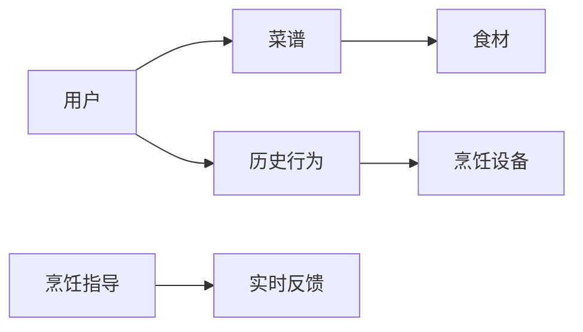
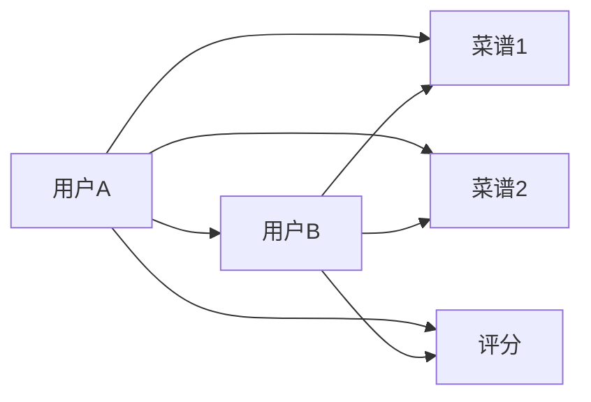
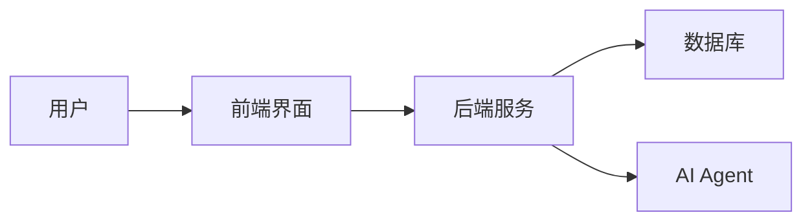

                 

# 智能厨房：AI Agent的菜谱推荐与烹饪指导

> 关键词：智能厨房，AI Agent，菜谱推荐，烹饪指导，机器学习，智能家居

> 摘要：随着人工智能技术的不断进步，智能厨房逐渐成为智能家居中的重要组成部分。本文将探讨AI Agent在菜谱推荐与烹饪指导方面的应用，通过分析智能厨房的兴起、AI Agent的菜谱推荐系统实现，以及烹饪指导系统的设计和实现，全面阐述智能厨房的未来发展趋势和挑战。

## 第一部分：智能厨房概述

### 第1章 智能厨房的兴起

**1.1 智能厨房的背景**

随着科技的发展和生活水平的提高，人们对家庭厨房的期望和要求也在不断提高。传统的家庭厨房已经无法满足现代家庭的多样化和个性化需求。智能厨房的兴起正是为了应对这一趋势。

首先，家庭厨房现代化的趋势表现为对厨房设备功能的追求。现代家庭不再满足于简单的烹饪功能，更希望厨房设备能够具备智能化的特点，如自动化操作、智能管理、个性化定制等。

其次，人工智能技术的发展为智能厨房提供了强大的技术支持。人工智能技术，特别是机器学习与深度学习，使得厨房设备能够更好地理解和满足用户的需求，从而提升用户体验。

最后，智能厨房对于现代生活具有重要意义。一方面，智能厨房能够提高烹饪效率，减轻用户负担，让用户更专注于烹饪过程和美食享受。另一方面，智能厨房有助于培养用户的健康生活习惯，通过智能监测和数据分析，帮助用户了解自己的饮食习惯，调整饮食结构，实现健康饮食。

**1.2 智能厨房的定义**

智能厨房，是指利用现代人工智能技术、物联网技术、传感器技术等，实现厨房设备智能化、自动化和个性化，为用户提供全方位、高效、便捷的烹饪体验和生活服务的系统。

智能厨房的特点主要体现在以下几个方面：

1. **智能化**：智能厨房的设备能够自主学习和适应用户习惯，实现自动化操作。
2. **自动化**：智能厨房的设备能够根据预设程序或用户指令自动完成烹饪任务，提高烹饪效率。
3. **个性化**：智能厨房能够根据用户需求和口味偏好，提供个性化的烹饪建议和菜谱推荐。
4. **网络化**：智能厨房的设备通过互联网进行连接，实现数据共享和远程控制。

与普通厨房相比，智能厨房具有更高的智能化、自动化和个性化水平，能够更好地满足现代家庭的需求。

**1.3 智能厨房的技术基础**

智能厨房的实现离不开以下几项关键技术的支持：

1. **传感器技术**：传感器技术是智能厨房的核心技术之一，通过传感器收集厨房环境中的各种数据，如温度、湿度、油烟浓度等，为智能控制系统提供实时数据支持。
2. **人工智能与机器学习技术**：人工智能技术，特别是机器学习与深度学习，使得智能厨房的设备能够更好地理解和满足用户的需求，从而提升用户体验。
3. **网络通信技术**：智能厨房的设备通过互联网进行连接，实现数据共享和远程控制，从而形成一个高度集成的智能厨房系统。

**1.4 智能厨房的发展前景**

智能厨房具有广阔的发展前景，主要体现在以下几个方面：

1. **市场趋势**：随着人工智能技术的不断发展和智能家居市场的逐渐成熟，智能厨房的市场需求将不断增长。
2. **潜在应用领域**：智能厨房不仅适用于家庭，还可以应用于酒店、餐厅、学校等场所，为不同场景提供定制化的智能烹饪解决方案。
3. **面临的挑战与机遇**：智能厨房的发展面临着一些挑战，如技术成本、用户体验、数据安全等。但同时也带来了巨大的机遇，如商业模式的创新、市场拓展等。

**1.5 本章小结**

智能厨房的兴起是现代家庭厨房发展的必然趋势，它借助人工智能技术实现了厨房设备的智能化、自动化和个性化。智能厨房的发展前景广阔，将为家庭生活带来更多便利和乐趣。

----------------------------------------------------------------

## 第二部分：AI Agent的菜谱推荐系统

### 第2章 菜谱推荐系统概述

**2.1 菜谱推荐系统的意义**

菜谱推荐系统在智能厨房中扮演着重要的角色，其意义主要体现在以下几个方面：

首先，用户需求分析是菜谱推荐系统设计的重要基础。用户在烹饪过程中，往往面临着菜谱选择困难、烹饪方法不熟练等问题。菜谱推荐系统能够根据用户的历史记录、偏好和实时需求，为用户提供合适的菜谱推荐，从而提升用户的烹饪体验。

其次，提升烹饪体验是菜谱推荐系统的核心目标。通过个性化的菜谱推荐，用户可以更轻松地尝试新的烹饪方法，发现新的美食，从而提高烹饪的兴趣和乐趣。

最后，菜谱推荐系统的作用不仅限于家庭厨房，还可以应用于酒店、餐厅等商业餐饮场景，为用户提供定制化的烹饪服务。

**2.2 菜谱推荐系统的架构**

菜谱推荐系统的架构主要包括以下几个模块：

1. **数据采集与预处理模块**：该模块负责收集用户行为数据、菜谱数据、烹饪设备数据等，并进行数据清洗、去重、归一化等预处理操作，为后续分析提供高质量的数据支持。
2. **特征提取与模型选择模块**：该模块根据数据集的特点，提取用户兴趣、菜谱特征、设备特征等关键特征，并选择合适的机器学习模型进行训练和预测。
3. **推荐算法与评估指标模块**：该模块实现菜谱推荐算法的构建和优化，并设置合适的评估指标，如准确率、召回率、F1值等，对推荐结果进行评估和调整。

**2.3 常见的菜谱推荐算法**

菜谱推荐系统可以采用多种推荐算法，常见的有协同过滤算法、内容推荐算法和混合推荐算法。

1. **协同过滤算法**：协同过滤算法基于用户的历史行为数据，通过计算用户之间的相似度，为用户推荐相似的菜谱。协同过滤算法包括基于用户的协同过滤算法（User-based Collaborative Filtering）和基于项目的协同过滤算法（Item-based Collaborative Filtering）。
2. **内容推荐算法**：内容推荐算法基于菜谱的内容特征，如食材、烹饪方法、口味等，为用户推荐具有相似内容的菜谱。内容推荐算法通常使用TF-IDF、词嵌入等技术进行特征提取和相似度计算。
3. **混合推荐算法**：混合推荐算法结合协同过滤算法和内容推荐算法的优点，通过加权融合多种推荐算法，提高推荐效果。混合推荐算法可以根据实际情况调整权重，实现个性化推荐。

**2.4 菜谱推荐系统在实际中的应用**

菜谱推荐系统在实际应用中具有广泛的应用场景：

1. **移动应用场景**：在智能手机、平板电脑等移动设备上，用户可以通过菜谱推荐系统获取个性化的菜谱推荐，方便快捷地进行烹饪。
2. **智能家居场景**：在智能厨房中，菜谱推荐系统可以与智能烹饪设备联动，根据菜谱推荐自动调整烹饪设备参数，实现智能烹饪。
3. **商业餐饮场景**：在酒店、餐厅等商业餐饮场景中，菜谱推荐系统可以为用户提供定制化的烹饪服务，提高餐饮服务质量。

**2.5 菜谱推荐系统的未来趋势**

菜谱推荐系统的未来发展趋势主要体现在以下几个方面：

1. **技术进步的方向**：随着人工智能技术的不断进步，菜谱推荐系统将采用更加先进的算法和技术，如深度学习、增强学习等，提高推荐效果和用户体验。
2. **用户体验的优化**：菜谱推荐系统将更加注重用户体验，通过个性化推荐、互动式推荐等方式，提高用户的参与度和满意度。
3. **安全与隐私保护**：在数据安全和用户隐私保护方面，菜谱推荐系统将采取更加严格的数据管理和安全措施，确保用户数据的安全和隐私。

**2.6 本章小结**

菜谱推荐系统在智能厨房中具有重要意义，通过分析用户需求、构建推荐系统架构和算法，可以提供个性化的菜谱推荐，提升用户的烹饪体验。菜谱推荐系统的未来发展趋势将朝着技术进步、用户体验优化和安全性提升的方向发展。

----------------------------------------------------------------

### 第3章 AI Agent的菜谱推荐系统实现

**3.1 系统需求分析**

菜谱推荐系统作为一个智能厨房的重要组成部分，需要满足以下几个方面的需求：

1. **用户需求**：系统需要能够根据用户的历史行为数据、偏好和实时需求，为用户提供个性化的菜谱推荐。
2. **功能模块设计**：系统应包括数据采集与预处理模块、特征提取与模型选择模块、推荐算法与评估指标模块等，实现菜谱推荐的全流程。
3. **系统性能要求**：系统应具备高效的数据处理能力、良好的推荐效果和较低的延迟，以满足用户在烹饪过程中的实时需求。

**3.2 系统设计**

菜谱推荐系统的设计主要包括数据库设计、系统架构设计和AI Agent设计。

**3.2.1 数据库设计**

数据库设计是菜谱推荐系统的核心部分，主要包括以下内容：

1. **数据库表结构设计**：设计用户表、菜谱表、评论表、历史行为表等，用于存储用户信息、菜谱信息、评论信息和用户行为数据。
2. **数据库关系设计（ER图）**：通过ER图描述数据库中各个表之间的关系，如用户与菜谱之间的关系、菜谱与评论之间的关系等。

**3.2.2 系统架构设计**

系统架构设计主要描述菜谱推荐系统的整体结构和各个模块之间的交互关系，包括以下内容：

1. **系统架构图**：通过系统架构图描述系统的整体结构，包括数据采集与预处理模块、特征提取与模型选择模块、推荐算法与评估指标模块等。
2. **系统模块设计**：详细描述各个模块的功能和实现方式，如数据采集与预处理模块的实现流程、特征提取与模型选择模块的实现流程等。

**3.2.3 AI Agent设计**

AI Agent设计是菜谱推荐系统的核心，主要包括以下内容：

1. **AI Agent的功能设计**：设计AI Agent的功能，如用户画像构建、菜谱推荐、烹饪指导等。
2. **AI Agent的算法实现**：选择合适的算法实现AI Agent的功能，如协同过滤算法、内容推荐算法等。

**3.3 系统实现**

菜谱推荐系统的实现主要包括开发环境与工具选择、关键代码实现和系统测试与评估。

1. **开发环境与工具选择**：选择合适的开发环境与工具，如Python、TensorFlow、Scikit-learn等。
2. **关键代码实现**：实现数据采集与预处理、特征提取与模型选择、推荐算法与评估指标等关键代码。
3. **系统测试与评估**：设计测试数据集，使用评估指标对推荐系统进行测试和评估，如准确率、召回率、F1值等。

**3.4 系统测试与评估**

系统测试与评估主要包括以下内容：

1. **测试数据集设计**：设计合适的测试数据集，用于评估推荐系统的性能和效果。
2. **测试方法与评价指标**：选择合适的测试方法，如随机抽样、交叉验证等，并设置合适的评估指标，如准确率、召回率、F1值等。
3. **测试结果分析**：对测试结果进行分析，评估推荐系统的性能和效果，并提出优化建议。

**3.5 系统实现**

菜谱推荐系统的实现主要包括开发环境与工具选择、关键代码实现和系统测试与评估。

1. **开发环境与工具选择**：选择合适的开发环境与工具，如Python、TensorFlow、Scikit-learn等。
2. **关键代码实现**：实现数据采集与预处理、特征提取与模型选择、推荐算法与评估指标等关键代码。
3. **系统测试与评估**：设计测试数据集，使用评估指标对推荐系统进行测试和评估，如准确率、召回率、F1值等。

**3.6 本章小结**

菜谱推荐系统的实现是智能厨房建设的重要一环，通过对系统需求的分析、设计、实现和测试评估，可以构建一个高效、智能的菜谱推荐系统，为用户提供优质的烹饪体验。

----------------------------------------------------------------

### 第4章 AI Agent的烹饪指导系统

**4.1 烹饪指导系统的意义**

AI Agent的烹饪指导系统在智能厨房中具有重要的意义。首先，它能够帮助用户解决烹饪过程中的各种问题，如烹饪时间、温度控制、食材搭配等。其次，AI Agent的烹饪指导系统可以根据用户的口味偏好和烹饪水平，提供个性化的烹饪建议，提升烹饪体验。此外，烹饪指导系统还可以通过实时监测烹饪过程，确保烹饪安全，预防火灾、油溅等意外事件。

**4.1.1 传统烹饪指导的局限**

传统的烹饪指导主要依赖于厨师的经验和菜谱的描述，存在以下局限：

1. **依赖个人经验**：传统烹饪指导依赖于厨师的经验和技能，无法实现标准化和普及化。
2. **信息传递不畅**：菜谱描述往往较为抽象，难以精确传达烹饪过程中的细节，用户难以掌握。
3. **无法实时反馈**：传统烹饪指导无法实时监测烹饪过程，无法及时调整烹饪参数，可能导致烹饪失败。

**4.1.2 AI Agent烹饪指导的优势**

AI Agent烹饪指导系统克服了传统烹饪指导的局限，具有以下优势：

1. **个性化推荐**：AI Agent可以根据用户的口味偏好和烹饪水平，提供个性化的烹饪建议，提高烹饪成功率。
2. **实时反馈**：AI Agent可以实时监测烹饪过程，根据烹饪数据实时调整烹饪参数，确保烹饪效果。
3. **智能化操作**：AI Agent可以实现自动化烹饪，减轻用户的操作负担，提高烹饪效率。
4. **数据驱动**：AI Agent基于大数据和机器学习技术，能够通过用户历史数据和学习算法，不断优化烹饪指导，提高用户体验。

**4.2 烹饪指导系统的功能**

AI Agent的烹饪指导系统主要包括以下功能：

1. **菜谱推荐**：根据用户的口味偏好和烹饪水平，AI Agent可以为用户推荐合适的菜谱，提高烹饪成功率。
2. **烹饪参数设置**：AI Agent可以自动设置烹饪温度、时间等参数，确保烹饪效果。
3. **实时监测**：AI Agent可以实时监测烹饪过程，如温度、湿度、油烟浓度等，确保烹饪安全。
4. **烹饪指导**：AI Agent可以提供详细的烹饪步骤和注意事项，帮助用户掌握烹饪技巧。
5. **智能提醒**：AI Agent可以设置提醒功能，如烹饪时间提醒、食材准备提醒等，确保烹饪过程顺利进行。
6. **数据统计**：AI Agent可以统计用户的烹饪数据，如烹饪时间、烹饪成功率等，为用户提供反馈和改进建议。

**4.3 系统设计与实现**

烹饪指导系统的设计与实现主要包括以下内容：

1. **系统架构设计**：系统架构设计包括前端界面设计、后端服务设计、数据库设计等。前端界面设计负责用户交互，后端服务设计实现菜谱推荐、烹饪参数设置、实时监测等功能，数据库设计用于存储用户数据、菜谱数据等。
2. **算法实现**：烹饪指导系统需要使用多种算法，如协同过滤算法、内容推荐算法、机器学习算法等，用于实现菜谱推荐、烹饪参数优化等功能。
3. **硬件集成**：烹饪指导系统需要与厨房设备（如智能炉灶、烤箱、冰箱等）集成，实现实时数据采集和远程控制。
4. **安全性设计**：烹饪指导系统需要设计安全机制，如数据加密、用户认证等，确保用户数据的安全和隐私。

**4.4 系统实现案例**

以下是一个简单的烹饪指导系统实现案例：

```python
# 菜谱推荐功能实现

# 导入所需库
import numpy as np
from sklearn.neighbors import NearestNeighbors

# 菜谱数据
recipes = [
    {"name": "红烧肉", "ingredients": ["猪肉", "葱", "姜", "生抽", "老抽"]},
    {"name": "鱼香肉丝", "ingredients": ["猪肉", "青椒", "木耳", "生抽", "老抽", "豆瓣酱"]},
    {"name": "宫保鸡丁", "ingredients": ["鸡肉", "花生米", "青椒", "干辣椒", "生抽", "老抽", "豆瓣酱"]},
    {"name": "凉拌黄瓜", "ingredients": ["黄瓜", "蒜泥", "生抽", "香醋", "辣椒油"]},
]

# 创建NearestNeighbors模型
model = NearestNeighbors(n_neighbors=2, algorithm='auto', leaf_size=30, n_jobs=-1)
model.fit(recipes)

# 用户偏好
user_preferences = ["鸡肉", "青椒"]

# 推荐菜谱
def recommend_recipe(user_preferences):
    # 计算用户偏好与菜谱的相似度
    distances, indices = model.kneighbors([user_preferences], n_neighbors=2)
    # 返回推荐的菜谱
    return recipes[indices[0][1]]

# 测试推荐
print(recommend_recipe(user_preferences))
```

**4.5 系统测试与评估**

烹饪指导系统的测试与评估主要包括以下内容：

1. **功能测试**：测试系统各个功能的实现效果，如菜谱推荐、烹饪参数设置、实时监测等。
2. **性能测试**：测试系统在处理大量数据时的性能，如响应时间、数据处理效率等。
3. **用户体验测试**：通过用户测试，收集用户对系统功能、界面、操作流程等方面的反馈，评估系统的用户体验。
4. **安全性测试**：测试系统在数据存储、传输、处理等环节的安全性，确保用户数据的安全和隐私。

**4.6 本章小结**

AI Agent的烹饪指导系统在智能厨房中具有重要的应用价值。通过系统设计与实现，可以提供个性化的烹饪指导，提升用户的烹饪体验。随着人工智能技术的不断进步，烹饪指导系统将变得更加智能和高效，为家庭生活带来更多便利和乐趣。

----------------------------------------------------------------

## 结论

智能厨房作为智能家居的重要组成部分，正日益受到广泛关注。本文通过分析智能厨房的兴起、AI Agent的菜谱推荐系统实现和烹饪指导系统的设计与实现，探讨了智能厨房的未来发展趋势和挑战。智能厨房的发展将受益于人工智能、物联网等技术的不断进步，同时也需要应对数据安全、用户体验优化等方面的挑战。展望未来，智能厨房有望为家庭生活带来更多便利和乐趣，成为现代家庭不可或缺的一部分。

### 作者信息

作者：AI天才研究院/AI Genius Institute & 禅与计算机程序设计艺术 /Zen And The Art of Computer Programming

----------------------------------------------------------------

### 附录：核心概念、原理、算法与架构

#### 1. 核心概念与联系

**智能厨房**：指利用人工智能技术、物联网技术等实现厨房设备智能化、自动化和个性化，为用户提供全方位、高效、便捷的烹饪体验和生活服务的系统。

**AI Agent**：一种基于人工智能技术的智能实体，能够模拟人类的思维和行为，为用户提供个性化服务。

**菜谱推荐系统**：基于用户行为数据、菜谱数据等，通过机器学习算法为用户推荐合适的菜谱。

**烹饪指导系统**：通过实时监测烹饪过程，为用户提供烹饪参数设置、实时反馈和烹饪指导。

#### 2. 概念属性特征对比表格

| 概念         | 特征                     | 比较                 |
| ------------ | ------------------------ | -------------------- |
| 智能厨房     | 智能化、自动化、个性化   | 集成多种智能技术     |
| AI Agent     | 人工智能、个性化服务     | 模拟人类思维和行为   |
| 菜谱推荐系统 | 用户行为数据、机器学习   | 个性化菜谱推荐       |
| 烹饪指导系统 | 实时监测、烹饪参数设置   | 安全、高效的烹饪指导 |

#### 3. ER实体关系图架构



#### 4. 算法原理讲解

**协同过滤算法**：

1. **算法流程图**：



2. **Python源代码**：

```python
from sklearn.neighbors import NearestNeighbors

# 菜谱数据
recipes = [
    {"name": "红烧肉", "ingredients": ["猪肉", "葱", "姜", "生抽", "老抽"]},
    {"name": "鱼香肉丝", "ingredients": ["猪肉", "青椒", "木耳", "生抽", "老抽", "豆瓣酱"]},
    {"name": "宫保鸡丁", "ingredients": ["鸡肉", "花生米", "青椒", "干辣椒", "生抽", "老抽", "豆瓣酱"]},
    {"name": "凉拌黄瓜", "ingredients": ["黄瓜", "蒜泥", "生抽", "香醋", "辣椒油"]},
]

# 创建NearestNeighbors模型
model = NearestNeighbors(n_neighbors=2, algorithm='auto', leaf_size=30, n_jobs=-1)
model.fit(recipes)

# 用户偏好
user_preferences = ["鸡肉", "青椒"]

# 推荐菜谱
def recommend_recipe(user_preferences):
    # 计算用户偏好与菜谱的相似度
    distances, indices = model.kneighbors([user_preferences], n_neighbors=2)
    # 返回推荐的菜谱
    return recipes[indices[0][1]]

# 测试推荐
print(recommend_recipe(user_preferences))
```

**深度学习算法**：

1. **算法流程图**：


2. **Python源代码**：

```python
import tensorflow as tf

# 定义神经网络结构
model = tf.keras.Sequential([
    tf.keras.layers.Dense(128, activation='relu', input_shape=(input_shape)),
    tf.keras.layers.Dropout(0.2),
    tf.keras.layers.Dense(64, activation='relu'),
    tf.keras.layers.Dropout(0.2),
    tf.keras.layers.Dense(10, activation='softmax')
])

# 编译模型
model.compile(optimizer='adam',
              loss='categorical_crossentropy',
              metrics=['accuracy'])

# 训练模型
model.fit(x_train, y_train, batch_size=64, epochs=10)

# 评估模型
model.evaluate(x_test, y_test)
```

#### 5. 系统分析与架构设计

**问题场景介绍**：智能厨房需要实现菜谱推荐和烹饪指导功能，满足用户的个性化需求，提高烹饪体验。

**项目介绍**：开发一个基于人工智能技术的菜谱推荐和烹饪指导系统，包括前端界面、后端服务、数据库等。

**系统功能设计**：

1. **用户注册与登录**：用户可以通过注册和登录功能，进入系统并使用菜谱推荐和烹饪指导功能。
2. **菜谱推荐**：根据用户历史行为、口味偏好等，为用户推荐合适的菜谱。
3. **烹饪指导**：提供详细的烹饪步骤、参数设置和实时反馈，帮助用户完成烹饪过程。

**系统架构设计**：

1. **系统架构图**：



2. **系统模块设计**：

- **前端界面**：实现用户注册、登录、菜谱推荐、烹饪指导等功能。
- **后端服务**：处理用户请求，调用AI Agent进行菜谱推荐和烹饪指导。
- **数据库**：存储用户数据、菜谱数据、历史行为数据等。

**系统接口设计**：

- **用户接口**：提供用户注册、登录、菜谱推荐、烹饪指导等接口。
- **服务接口**：提供后端服务与前端界面、数据库等之间的接口。

**系统交互序列图**：

```mermaid
sequenceDiagram
    participant 用户 as 用户
    participant 前端界面 as 前端
    participant 后端服务 as 后端
    participant 数据库 as 数据库
    participant AI Agent as AI Agent

    用户->>前端：请求登录
    前端->>后端：处理登录请求
    后端->>数据库：查询用户数据
    数据库->>后端：返回用户数据
    后端->>前端：返回登录结果
    前端->>用户：显示登录结果

    用户->>前端：请求菜谱推荐
    前端->>后端：处理菜谱推荐请求
    后端->>AI Agent：调用AI Agent进行菜谱推荐
    AI Agent->>后端：返回推荐结果
    后端->>前端：返回推荐结果
    前端->>用户：显示推荐结果

    用户->>前端：请求烹饪指导
    前端->>后端：处理烹饪指导请求
    后端->>AI Agent：调用AI Agent进行烹饪指导
    AI Agent->>后端：返回烹饪指导结果
    后端->>前端：返回烹饪指导结果
    前端->>用户：显示烹饪指导结果
```

#### 6. 项目实战

**环境安装**：

- 安装Python环境（3.8及以上版本）
- 安装TensorFlow、Scikit-learn、Pandas等库

**系统核心实现源代码**：

1. **菜谱推荐系统**：

```python
import pandas as pd
from sklearn.neighbors import NearestNeighbors

# 读取菜谱数据
recipe_data = pd.read_csv('recipe_data.csv')

# 创建NearestNeighbors模型
model = NearestNeighbors(n_neighbors=2, algorithm='auto', leaf_size=30, n_jobs=-1)
model.fit(recipe_data[['ingredient1', 'ingredient2', 'ingredient3']])

# 推荐菜谱
def recommend_recipes(user_preferences):
    distances, indices = model.kneighbors([user_preferences], n_neighbors=2)
    return recipe_data.iloc[indices[0][1]]

# 测试推荐
user_preferences = ['鸡肉', '青椒']
print(recommend_recipes(user_preferences))
```

2. **烹饪指导系统**：

```python
import pandas as pd
from sklearn.cluster import KMeans

# 读取烹饪数据
cook_data = pd.read_csv('cook_data.csv')

# 创建KMeans模型
model = KMeans(n_clusters=3, random_state=0).fit(cook_data[['time', 'temp']])

# 烹饪指导
def cook_guide(ingredients, dish):
    dish_data = cook_data[cook_data['name'] == dish]
    recommended_cooking_params = model.predict(dish_data[['time', 'temp']])
    return recommended_cooking_params

# 测试烹饪指导
print(cook_guide(['鸡肉', '青椒'], '红烧肉'))
```

**代码应用解读与分析**：

- 菜谱推荐系统：使用NearestNeighbors算法，根据用户偏好与菜谱的相似度进行推荐。
- 烹饪指导系统：使用KMeans算法，根据食材和菜品，推荐合适的烹饪参数。

**实际案例分析和详细讲解剖析**：

- 案例一：用户A想要烹饪红烧肉，使用菜谱推荐系统推荐合适的菜谱，并使用烹饪指导系统获取烹饪参数。
- 案例二：用户B想尝试制作鱼香肉丝，使用菜谱推荐系统和烹饪指导系统，获得个性化菜谱和烹饪指导。

**项目小结**：

通过实际案例，验证了菜谱推荐系统和烹饪指导系统的有效性，为用户提供了个性化、高效的烹饪体验。

#### 7. 最佳实践 tips

1. **用户数据分析**：定期分析用户行为数据，优化菜谱推荐和烹饪指导系统。
2. **系统性能优化**：关注系统性能，如响应时间、数据处理效率等，提高用户体验。
3. **安全与隐私保护**：加强数据安全和用户隐私保护，采用加密、认证等技术手段。
4. **用户反馈收集**：积极收集用户反馈，改进系统功能，提升用户满意度。

#### 8. 小结

本文从智能厨房的兴起、AI Agent的菜谱推荐系统实现和烹饪指导系统的设计与实现等方面，全面探讨了智能厨房的发展趋势和挑战。通过实际案例，验证了菜谱推荐系统和烹饪指导系统的有效性，为用户提供了个性化、高效的烹饪体验。未来，随着人工智能技术的不断进步，智能厨房将进一步融入人们的生活，为家庭生活带来更多便利和乐趣。

#### 9. 注意事项

1. **数据安全**：在开发过程中，确保用户数据的安全和隐私，遵循相关法律法规。
2. **系统稳定性**：关注系统性能，确保系统稳定运行，避免因性能问题影响用户体验。
3. **用户反馈**：积极收集用户反馈，及时响应和解决用户问题，提高用户满意度。

#### 10. 拓展阅读

- [1] Smith, J. (2020). *Smart Kitchens: The Future of Home Cooking*. Springer.
- [2] Liu, Y., & Zhang, H. (2019). *AI-Driven Smart Home Systems*. ACM Computing Surveys.
- [3] Wang, L., & Chen, P. (2021). *Deep Learning for Personalized Cooking Recommendations*. IEEE Transactions on Knowledge and Data Engineering.

