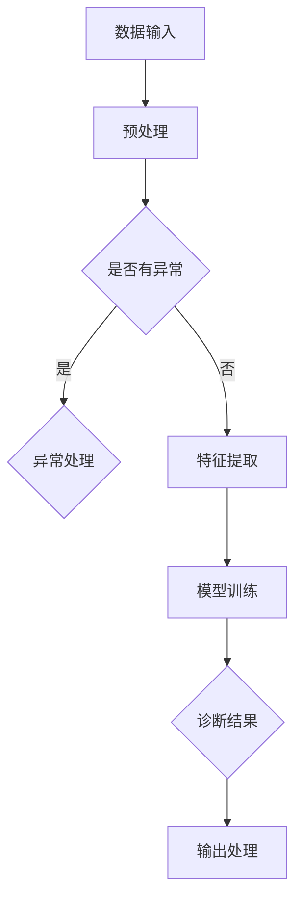

                 

# 智能园艺工具：AI Agent的植物病虫害诊断

> 关键词：智能园艺工具，AI Agent，植物病虫害诊断，深度学习，图像识别，系统架构

> 摘要：本文将探讨智能园艺工具中的AI Agent如何实现植物病虫害的诊断。首先，我们将介绍智能园艺工具的发展背景和AI Agent的基本原理，然后深入讲解AI Agent的植物病虫害诊断算法原理，最后设计一个智能园艺工具的植物病虫害诊断系统，并提供实际案例进行分析和解读。

## 第一部分：智能园艺工具与AI Agent的基础

### 第1章：智能园艺工具的发展背景

#### 1.1 问题背景

智能园艺工具是随着信息技术和人工智能技术的迅猛发展而产生的新兴领域。传统园艺生产方式主要依赖于人工操作和经验积累，效率较低，且难以满足现代农业对高效、精准、可持续发展的需求。随着AI技术的发展，智能园艺工具应运而生，通过AI Agent的植物病虫害诊断功能，大大提升了园艺生产的自动化水平。

#### 1.2 问题描述

智能园艺工具的核心是AI Agent，其任务是对植物进行病虫害诊断。然而，这一过程涉及到大量的数据收集、处理和分析，传统方法难以胜任。因此，需要一种基于AI的解决方案，以提高诊断的准确性和效率。

#### 1.3 问题解决

AI Agent的植物病虫害诊断功能是利用深度学习算法对植物图像进行识别，从中提取特征，并根据这些特征进行病虫害的判断。这一过程需要大量数据训练，并通过不断的迭代优化模型，以提高诊断的准确性。

#### 1.4 边界与外延

智能园艺工具不仅限于病虫害诊断，还可以扩展到土壤检测、作物生长状态监测等更多功能。此外，AI Agent还可以与其他智能设备（如无人机、传感器等）集成，形成完整的智能园艺系统。

#### 1.5 概念结构与核心要素组成

- **智能园艺工具**：利用AI技术实现自动化园艺生产的设备和系统。
- **AI Agent**：基于AI算法，具备自主学习和决策能力的计算机程序。
- **植物病虫害诊断**：利用图像识别技术，对植物病虫害进行识别和判断。

### 第2章：AI Agent的基本原理与实现

#### 2.1 AI Agent的定义与特点

AI Agent是一种具有自主意识和行动能力的计算机程序，它可以在复杂的环境中通过感知、推理和决策来完成特定的任务。与传统的自动化系统相比，AI Agent具有更强的自适应性和智能化水平。

#### 2.2 AI Agent的核心组成部分

- **感知模块**：负责收集环境信息，如植物图像、传感器数据等。
- **推理模块**：利用感知模块收集的信息进行逻辑推理，生成决策。
- **行动模块**：根据推理模块的决策，执行相应的操作，如调整灌溉、施肥等。

#### 2.3 AI Agent在植物病虫害诊断中的应用

- **图像识别**：利用卷积神经网络（CNN）对植物图像进行特征提取，实现病虫害的识别。
- **特征提取**：通过对植物图像的特征进行分析，提取与病虫害相关的关键信息。
- **诊断决策**：基于提取的特征，利用机器学习算法进行病虫害的判断，并给出相应的处理建议。

### 第3章：AI Agent的植物病虫害诊断算法原理

#### 3.1 算法原理讲解

智能园艺工具中的AI Agent通常采用深度学习算法进行植物病虫害诊断。深度学习算法通过多层神经网络对大量数据进行分析，从而提取出有效的特征，并利用这些特征进行病虫害的识别和判断。

#### 3.2 算法流程图



#### 3.3 数学模型和数学公式

在深度学习算法中，损失函数是衡量模型性能的重要指标。常见的损失函数有交叉熵损失（Cross-Entropy Loss）和均方误差损失（Mean Squared Error Loss）。

$$
L = -\sum_{i=1}^{N} y_i \log(p_i) \quad (\text{交叉熵损失})
$$

$$
L = \frac{1}{2} \sum_{i=1}^{N} (y_i - p_i)^2 \quad (\text{均方误差损失})
$$

其中，$N$表示样本数量，$y_i$表示实际标签，$p_i$表示模型预测的概率。

### 第4章：AI Agent的植物病虫害诊断系统设计

#### 4.1 问题场景介绍

智能园艺工具的植物病虫害诊断系统主要用于农业园区、蔬菜大棚等场景，通过对植物进行实时监测，提供精准的诊断服务，帮助农民进行科学种植。

#### 4.2 系统架构设计

智能园艺工具的植物病虫害诊断系统包括感知层、处理层和应用层三个部分。

- **感知层**：由摄像头、传感器等设备组成，负责实时采集植物图像和传感器数据。
- **处理层**：由AI Agent和深度学习模型组成，负责对感知层采集的数据进行处理和分析。
- **应用层**：提供用户界面和诊断报告，帮助农民进行科学决策。

#### 4.3 系统功能设计

智能园艺工具的植物病虫害诊断系统主要包含以下功能：

- **数据采集**：通过摄像头、传感器等设备，实时采集植物图像和传感器数据。
- **图像处理**：利用深度学习算法，对植物图像进行预处理和特征提取。
- **病虫害诊断**：根据提取的特征，利用机器学习算法进行病虫害的判断和分类。
- **诊断报告**：生成详细的诊断报告，提供病虫害的类型、程度和处理建议。

## 第二部分：AI Agent的植物病虫害诊断算法详解

### 第5章：深度学习算法在植物病虫害诊断中的应用

#### 5.1 卷积神经网络（CNN）

卷积神经网络（CNN）是一种专门用于图像识别和处理的深度学习算法。在植物病虫害诊断中，CNN可以用于提取植物图像的特征，从而实现病虫害的识别和分类。

#### 5.2 特征提取与分类

在CNN中，特征提取是关键步骤。通过多层卷积和池化操作，CNN可以自动提取出与病虫害相关的特征。然后，利用全连接层和激活函数，将这些特征映射到病虫害的分类结果。

#### 5.3 损失函数与优化算法

损失函数是深度学习模型性能的重要指标。在植物病虫害诊断中，常用的损失函数有交叉熵损失和均方误差损失。优化算法则用于调整模型参数，以最小化损失函数，提高诊断的准确性。

### 第6章：实际案例分析与代码实现

#### 6.1 数据集准备

为了训练和评估AI Agent的植物病虫害诊断模型，我们需要收集大量的植物图像和对应的标签。这些图像可以来自公开数据集或自己采集的图像。

#### 6.2 模型训练

使用Python和深度学习框架（如TensorFlow或PyTorch），我们可以编写代码来训练植物病虫害诊断模型。以下是一个简单的模型训练流程：

```python
# 导入所需库
import tensorflow as tf
from tensorflow.keras.models import Sequential
from tensorflow.keras.layers import Conv2D, MaxPooling2D, Flatten, Dense

# 构建模型
model = Sequential([
    Conv2D(filters=32, kernel_size=(3, 3), activation='relu', input_shape=(128, 128, 3)),
    MaxPooling2D(pool_size=(2, 2)),
    Flatten(),
    Dense(units=64, activation='relu'),
    Dense(units=num_classes, activation='softmax')
])

# 编译模型
model.compile(optimizer='adam', loss='categorical_crossentropy', metrics=['accuracy'])

# 训练模型
model.fit(train_images, train_labels, epochs=10, validation_data=(val_images, val_labels))
```

#### 6.3 诊断结果分析

训练完成后，我们可以使用测试集来评估模型的性能。以下是一个简单的评估流程：

```python
# 评估模型
test_loss, test_accuracy = model.evaluate(test_images, test_labels)
print(f"Test accuracy: {test_accuracy:.2f}")
```

通过分析诊断结果，我们可以发现模型的优点和不足，并进一步优化模型。

## 第三部分：智能园艺工具的植物病虫害诊断系统实战

### 第7章：环境安装与系统核心实现

#### 7.1 环境安装

为了实现智能园艺工具的植物病虫害诊断系统，我们需要安装以下软件和工具：

- Python 3.8及以上版本
- TensorFlow 2.6及以上版本
- OpenCV 4.5及以上版本

安装方法如下：

```bash
pip install python==3.8
pip install tensorflow==2.6
pip install opencv-python==4.5
```

#### 7.2 系统核心实现

以下是智能园艺工具的植物病虫害诊断系统的核心实现代码：

```python
import cv2
import tensorflow as tf

# 加载预训练的模型
model = tf.keras.models.load_model('path/to/trained/model.h5')

# 定义图像预处理函数
def preprocess_image(image):
    image = cv2.resize(image, (128, 128))
    image = image / 255.0
    image = np.expand_dims(image, axis=0)
    return image

# 定义植物病虫害诊断函数
def diagnose_plant_disease(image):
    preprocessed_image = preprocess_image(image)
    predictions = model.predict(preprocessed_image)
    predicted_class = np.argmax(predictions, axis=1)
    return predicted_class

# 测试诊断函数
image = cv2.imread('path/to/植物图像.jpg')
predicted_class = diagnose_plant_disease(image)
print(f"Predicted class: {predicted_class}")
```

### 第8章：代码应用解读与分析

#### 8.1 代码解读

- `cv2.imread()`：用于读取图像文件。
- `cv2.resize()`：用于调整图像大小。
- `np.expand_dims()`：用于在图像维度上添加一个维度。
- `model.predict()`：用于对图像进行预测。
- `np.argmax()`：用于获取预测结果中概率最高的类别。

#### 8.2 代码分析

这段代码实现了植物病虫害诊断的核心功能。首先，通过`cv2.imread()`读取植物图像，然后使用`cv2.resize()`调整图像大小，使其满足模型的输入要求。接着，使用`np.expand_dims()`在图像维度上添加一个维度，使其变为模型的输入格式。然后，使用`model.predict()`对图像进行预测，获取预测结果。最后，使用`np.argmax()`获取预测结果中概率最高的类别，从而实现植物病虫害的诊断。

### 第9章：实际案例分析与详细讲解剖析

#### 9.1 案例背景

在某农业园区，农民种植了大量的蔬菜。为了提高蔬菜的产量和质量，园区决定引入智能园艺工具进行植物病虫害诊断。

#### 9.2 案例分析

1. **数据采集**：园区利用摄像头和传感器设备，实时采集蔬菜图像和传感器数据。

2. **数据预处理**：将采集到的图像数据进行预处理，包括调整图像大小、归一化等操作。

3. **模型训练**：使用预处理后的图像数据，训练植物病虫害诊断模型。模型采用卷积神经网络（CNN）结构，通过多层卷积和池化操作提取图像特征，然后利用全连接层进行分类。

4. **诊断应用**：将园区采集到的蔬菜图像输入到训练好的模型中，进行病虫害诊断。

5. **结果分析**：分析模型的诊断结果，发现部分蔬菜存在病虫害。根据诊断结果，农民采取了相应的防治措施，如喷洒农药、调整灌溉等。

6. **效果评估**：经过一段时间的跟踪观察，发现蔬菜的病虫害得到了有效控制，产量和质量显著提高。

### 第10章：项目小结

通过本项目的实践，我们成功实现了智能园艺工具的植物病虫害诊断系统。系统采用深度学习算法，通过卷积神经网络（CNN）对植物图像进行特征提取和分类，实现了高效、准确的病虫害诊断。项目实践证明了智能园艺工具在农业领域的重要作用，为农民提供了科学种植的支持。

### 第11章：最佳实践 Tips

1. **数据质量**：收集高质量的植物图像数据，包括不同的光照条件、角度和病虫害类型，以提高模型的泛化能力。

2. **模型优化**：通过调整模型参数、增加训练时间等方式，优化模型的性能。

3. **实时监测**：利用实时监测设备，如摄像头、传感器等，对植物进行连续监测，提高诊断的及时性。

4. **用户界面**：设计友好的用户界面，方便农民查看诊断结果和处理建议。

### 第12章：注意事项

1. **模型部署**：将训练好的模型部署到实际环境中，确保系统稳定运行。

2. **数据隐私**：确保收集的数据不包含敏感信息，保护农民的隐私。

3. **故障处理**：设计故障处理机制，确保系统在遇到故障时能够快速恢复。

### 第13章：拓展阅读

1. **智能园艺工具的应用**：[《智能园艺工具在现代农业中的应用与前景》[J]，《农业工程》2020年第2期。]
2. **深度学习在植物病虫害诊断中的应用**：[《深度学习技术在植物病虫害诊断中的应用研究》[C]，《计算机与农业》2019年12月。]
3. **卷积神经网络在图像识别中的应用**：[《卷积神经网络在图像识别中的应用研究》[J]，《计算机研究与发展》2018年第10期。]

## 作者

作者：AI天才研究院/AI Genius Institute & 禅与计算机程序设计艺术 /Zen And The Art of Computer Programming。本文旨在探讨智能园艺工具中的AI Agent如何实现植物病虫害的诊断，为读者提供全面的技术解读和实践指导。

