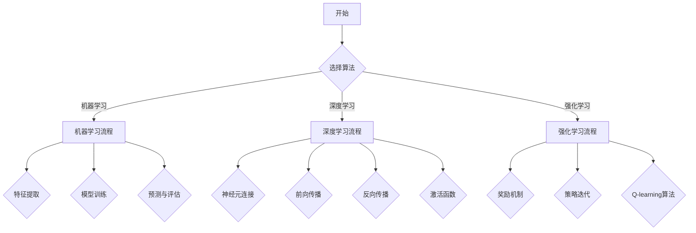
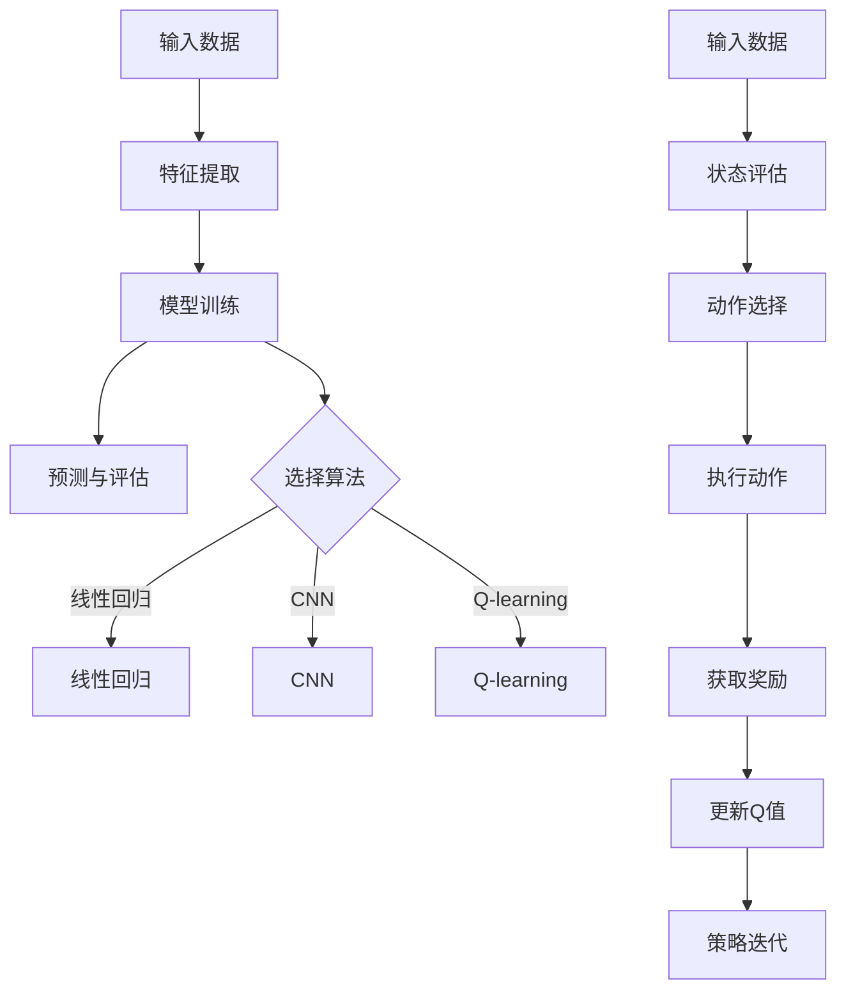

                 

# 《智能园艺：AI Agent控制的室内种植系统》

## 关键词

- **智能园艺**  
- **AI Agent**  
- **室内种植系统**  
- **环境控制**  
- **机器学习**  
- **深度学习**  
- **强化学习**

## 摘要

本文将深入探讨智能园艺的概念、技术实现及其在室内种植系统中的应用。随着现代生活节奏的加快，室内种植的需求日益增加。然而，传统的室内种植面临着许多挑战，如环境控制复杂、人工成本高等。为了解决这些问题，AI Agent应运而生，通过智能决策和自主执行，实现室内种植系统的自动化和高效化。本文将从问题背景、核心概念、AI Agent在智能园艺中的应用、系统实战和未来展望五个方面，系统地介绍智能园艺的技术原理和实践应用。

### 目录大纲

# 第一部分：智能园艺概述

## 第1章 问题背景与核心概念

### 1.1 问题背景

#### 1.1.1 室内种植需求与挑战

#### 1.1.2 AI Agent的定义与特点

#### 1.1.3 智能园艺的意义

### 1.2 核心概念与联系

#### 1.2.1 室内种植相关技术

##### 1.2.1.1 光照、水分、温度等环境控制技术

##### 1.2.1.2 基因编辑与品种选择

##### 1.2.1.3 植物生长监测与数据采集

#### 1.2.2 AI Agent原理与应用

##### 1.2.2.1 AI Agent的基本架构

##### 1.2.2.2 AI Agent在园艺中的应用场景

### 1.3 本章小结

## 第二部分：AI Agent在智能园艺中的应用

### 1.4 AI Agent在室内种植系统中的功能与架构

#### 1.4.1 AI Agent的功能模块

##### 1.4.1.1 环境感知模块

##### 1.4.1.2 智能决策模块

##### 1.4.1.3 执行控制模块

#### 1.4.2 室内种植系统的总体架构

### 1.5 AI Agent的算法原理与实现

#### 1.5.1 常用算法介绍

##### 1.5.1.1 机器学习算法

##### 1.5.1.2 深度学习算法

##### 1.5.1.3 强化学习算法

#### 1.5.2 算法原理讲解

##### 1.5.2.1 机器学习算法原理

##### 1.5.2.2 深度学习算法原理

##### 1.5.2.3 强化学习算法原理

#### 1.5.3 算法mermaid流程图

## 第三部分：智能园艺系统实战

### 2.6 智能园艺系统环境安装与配置

### 2.7 系统核心实现源代码解析

### 2.8 实际案例分析与详细讲解

### 2.9 项目小结与拓展

## 第四部分：智能园艺系统的优化与未来展望

### 3.10 系统优化方案

### 3.11 智能园艺的未来发展

### 3.12 本章小结

## 参考文献

### 目录大纲

# 第一部分：智能园艺概述

## 第1章 问题背景与核心概念

### 1.1 问题背景

#### 1.1.1 室内种植需求与挑战

##### 1.1.1.1 现代生活对室内种植的需求
- 空间限制
- 环境控制需求
- 健康生活追求

##### 1.1.1.2 室内种植的挑战
- 水分控制
- 光照调节
- 温度监控
- 植物病虫害防治

#### 1.1.2 AI Agent的定义与特点

##### 1.1.2.1 AI Agent的定义
- AI Agent是具有自主学习和决策能力的计算机程序。

##### 1.1.2.2 AI Agent的特点
- 自主性
- 学习能力
- 决策能力
- 适应性

#### 1.1.3 智能园艺的意义

##### 1.1.3.1 提高室内种植效率
- 自动化控制
- 精准管理

##### 1.1.3.2 优化植物生长环境
- 环境数据实时监测
- 环境参数智能调节

##### 1.1.3.3 促进可持续发展
- 节能减排
- 减少人工成本
- 提高植物产量与品质

### 1.2 核心概念与联系

#### 1.2.1 室内种植相关技术

##### 1.2.1.1 光照、水分、温度等环境控制技术
- 智能光照系统
- 自动灌溉系统
- 温度控制系统

##### 1.2.1.2 基因编辑与品种选择
- 基因编辑技术
- 品种选择策略

##### 1.2.1.3 植物生长监测与数据采集
- 植物生长监测传感器
- 数据采集与存储

#### 1.2.2 AI Agent原理与应用

##### 1.2.2.1 AI Agent的基本架构
- 感知模块
- 决策模块
- 执行模块

##### 1.2.2.2 AI Agent在园艺中的应用场景
- 自动环境调节
- 植物生长预测
- 病虫害智能检测

### 1.3 本章小结

- 室内种植的需求与挑战
- AI Agent的定义与特点
- 智能园艺的意义
- 室内种植相关技术与AI Agent的关联

## 第二部分：AI Agent在智能园艺中的应用

### 1.4 AI Agent在室内种植系统中的功能与架构

#### 1.4.1 AI Agent的功能模块

##### 1.4.1.1 环境感知模块
- 数据采集
- 环境分析

##### 1.4.1.2 智能决策模块
- 数据处理
- 决策生成

##### 1.4.1.3 执行控制模块
- 执行指令
- 反馈调节

#### 1.4.2 室内种植系统的总体架构

##### 1.4.2.1 系统硬件架构
- 传感器
- 执行器
- 通信模块

##### 1.4.2.2 系统软件架构
- 数据处理模块
- 决策算法模块
- 执行控制模块
- 用户界面

### 1.5 AI Agent的算法原理与实现

#### 1.5.1 常用算法介绍

##### 1.5.1.1 机器学习算法
- 监督学习
- 无监督学习
- 强化学习

##### 1.5.1.2 深度学习算法
- 神经网络
- 卷积神经网络（CNN）
- 循环神经网络（RNN）

##### 1.5.1.3 强化学习

#### 1.5.2 算法原理讲解

##### 1.5.2.1 机器学习算法原理
- 特征提取
- 模型训练
- 预测与评估

##### 1.5.2.2 深度学习算法原理
- 神经元与神经元之间的连接
- 前向传播与反向传播
- 激活函数

##### 1.5.2.3 强化学习算法原理
- 奖励机制
- 策略迭代
- Q-learning算法

#### 1.5.3 算法mermaid流程图



## 第三部分：智能园艺系统实战

### 2.6 智能园艺系统环境安装与配置

### 2.7 系统核心实现源代码解析

### 2.8 实际案例分析与详细讲解

### 2.9 项目小结与拓展

## 第四部分：智能园艺系统的优化与未来展望

### 3.10 系统优化方案

### 3.11 智能园艺的未来发展

### 3.12 本章小结

## 参考文献

### 1.1.1 现代生活对室内种植的需求

现代生活节奏的加快，使得人们对室内空间的需求越来越高。室内种植成为了一种流行的家居装饰方式，它不仅能美化环境，还能带来健康的生活体验。以下是现代生活对室内种植的具体需求：

1. **空间限制**：随着城市化进程的加速，居住空间变得越来越有限。室内种植可以在有限的空间内实现种植，满足人们对绿色植物的需求。

2. **环境控制需求**：室内种植需要对光照、水分、温度等环境因素进行精细控制，以保证植物的健康生长。现代室内种植系统可以通过智能技术实现这些环境参数的自动调节。

3. **健康生活追求**：室内种植能够提供新鲜空气，减少室内污染，对人们的身心健康有着积极的影响。此外，种植过程本身也能带来放松和愉悦的心情。

### 1.1.2 室内种植的挑战

虽然室内种植有着众多的优势，但在实际操作中仍然面临许多挑战：

1. **水分控制**：植物的生长离不开水分，但过多的水分会导致植物根部缺氧，影响生长。因此，如何精确控制水分供应是一个难题。

2. **光照调节**：植物生长需要适当的光照，但室内光照条件难以与室外相比。如何通过人工光照系统模拟自然光照，满足植物生长需求，是室内种植的一大挑战。

3. **温度监控**：室内温度的波动会影响植物的生长，特别是对热带植物来说，温度监控和调节尤为重要。

4. **植物病虫害防治**：室内种植环境相对封闭，容易导致病虫害的滋生。如何及时发现并防治病虫害，是室内种植面临的另一个挑战。

### 1.1.3 AI Agent的定义与特点

AI Agent，即人工智能代理，是一种能够模拟人类智能行为，具备自主学习和决策能力的计算机程序。AI Agent的特点包括：

1. **自主性**：AI Agent能够在没有人为干预的情况下自主执行任务，具备自我驱动的特点。

2. **学习能力**：AI Agent可以通过机器学习、深度学习等算法从数据中学习和优化自身的行为。

3. **决策能力**：AI Agent可以根据环境数据和预设的目标，自主做出决策。

4. **适应性**：AI Agent能够根据环境变化和任务需求，调整自身的行为和策略。

### 1.1.4 智能园艺的意义

智能园艺通过AI Agent的应用，能够有效地解决室内种植中的各种挑战，具有以下意义：

1. **提高室内种植效率**：通过自动化控制和精准管理，智能园艺系统能够显著提高植物生长的效率。

2. **优化植物生长环境**：智能园艺系统能够实时监测环境参数，并智能调节，为植物提供最佳的生长条件。

3. **促进可持续发展**：智能园艺系统通过节能减排和减少人工成本，有助于实现可持续发展目标。

4. **提高植物产量与品质**：智能园艺系统能够根据植物的生长需求，提供精准的营养和生长条件，从而提高植物产量和品质。

### 1.2 核心概念与联系

#### 1.2.1 室内种植相关技术

室内种植涉及多种技术，其中最核心的包括光照、水分、温度等环境控制技术，基因编辑与品种选择，以及植物生长监测与数据采集。

1. **光照、水分、温度等环境控制技术**

- **智能光照系统**：通过LED灯等高科技设备，模拟自然光照，满足植物生长需求。
- **自动灌溉系统**：根据植物需水量，自动调节灌溉频率和水量，确保水分供应的精准性。
- **温度控制系统**：通过加热器、通风设备等，保持室内温度在适宜范围内，为植物提供良好的生长环境。

2. **基因编辑与品种选择**

- **基因编辑技术**：利用CRISPR-Cas9等基因编辑工具，对植物基因进行精确修改，提高植物的抗病虫害能力和生长速度。
- **品种选择策略**：根据种植目的和市场需求，选择适合室内种植的优良品种。

3. **植物生长监测与数据采集**

- **植物生长监测传感器**：如土壤湿度传感器、光照传感器、温度传感器等，实时监测植物生长环境。
- **数据采集与存储**：将传感器采集到的数据传输至中央处理系统，进行存储和分析。

#### 1.2.2 AI Agent原理与应用

1. **AI Agent的基本架构**

- **感知模块**：接收外部环境数据，如温度、湿度、光照等。
- **决策模块**：根据感知模块提供的数据，结合预设的规则和算法，生成决策。
- **执行模块**：执行决策，如调节光照、灌溉、通风等。

2. **AI Agent在园艺中的应用场景**

- **自动环境调节**：根据植物生长需求，自动调节光照、水分、温度等环境参数。
- **植物生长预测**：利用历史数据，预测植物的生长趋势，提供种植建议。
- **病虫害智能检测**：通过图像识别等技术，自动检测植物病虫害，及时采取防治措施。

### 1.3 本章小结

本章从室内种植的需求与挑战、AI Agent的定义与特点，以及智能园艺的意义和核心概念与联系三个方面，系统地介绍了智能园艺的相关知识。通过本章的学习，读者可以对智能园艺有一个全面的了解，认识到其在提高室内种植效率、优化植物生长环境、促进可持续发展等方面的巨大潜力。

## 第二部分：AI Agent在智能园艺中的应用

### 1.4 AI Agent在室内种植系统中的功能与架构

AI Agent在室内种植系统中扮演着至关重要的角色，其功能与架构设计直接决定了系统的智能化水平和植物生长的稳定性。以下是AI Agent在室内种植系统中的功能与架构详解：

#### 1.4.1 AI Agent的功能模块

AI Agent的功能模块主要包括环境感知模块、智能决策模块和执行控制模块，每个模块都在室内种植系统中发挥着独特的作用。

1. **环境感知模块**

环境感知模块是AI Agent的核心组成部分，主要负责采集室内种植环境中的各种数据，如温度、湿度、光照强度、土壤水分含量等。这些数据通过传感器实时传输给AI Agent，为其提供决策所需的输入信息。

- **数据采集**：使用各种传感器（如温湿度传感器、光照传感器、土壤水分传感器等）对环境参数进行采集。
- **数据处理**：对采集到的数据进行分析和预处理，去除噪声，提取有用的信息。

2. **智能决策模块**

智能决策模块负责根据环境感知模块提供的数据，结合预设的规则和机器学习模型，生成对植物生长有利的决策。这个模块是AI Agent的“大脑”，其决策质量直接影响到室内种植系统的效果。

- **数据处理**：接收环境感知模块提供的数据，进行进一步处理和分析。
- **规则引擎**：基于预设的规则和算法，对植物生长需求进行判断和决策。
- **机器学习**：利用历史数据训练机器学习模型，实现智能决策。

3. **执行控制模块**

执行控制模块是AI Agent的“执行者”，负责将智能决策模块生成的决策转化为具体的行动，如调节光照、灌溉、通风等。这个模块需要与室内种植系统的硬件设备（如LED灯、水泵、风扇等）进行通信和协调。

- **决策执行**：根据智能决策模块的决策，控制相应的硬件设备进行操作。
- **反馈调节**：对执行结果进行实时监控和反馈，根据反馈调整后续决策。

#### 1.4.2 室内种植系统的总体架构

室内种植系统的总体架构可以分为硬件架构和软件架构两部分，二者共同构成了一个完整、智能的种植环境。

1. **硬件架构**

硬件架构主要包括传感器、执行器、通信模块和中央控制器。

- **传感器**：用于采集环境数据，如温度、湿度、光照强度等。
- **执行器**：如LED灯、水泵、风扇等，负责执行AI Agent的决策。
- **通信模块**：负责传感器与执行器之间的数据传输。
- **中央控制器**：通常由计算机或嵌入式系统组成，负责运行AI Agent程序，实现环境数据的采集、处理和决策执行。

2. **软件架构**

软件架构主要包括数据处理模块、决策算法模块、执行控制模块和用户界面。

- **数据处理模块**：负责环境数据的采集、预处理和分析。
- **决策算法模块**：包含机器学习模型、规则引擎等，用于生成智能决策。
- **执行控制模块**：负责将决策转化为具体的操作指令，控制硬件执行器。
- **用户界面**：提供用户与系统交互的界面，展示环境数据、决策过程和执行结果。

通过硬件架构和软件架构的有机结合，室内种植系统实现了对植物生长环境的全面监控和智能调节，从而提高了种植效率和植物品质。

### 1.5 AI Agent的算法原理与实现

AI Agent在室内种植系统中的应用离不开先进的算法支持。以下是常用的机器学习算法、深度学习算法和强化学习算法的原理介绍及其在智能园艺中的应用实现。

#### 1.5.1 常用算法介绍

1. **机器学习算法**

机器学习算法是AI Agent的基础，主要包括监督学习、无监督学习和强化学习三种类型。

- **监督学习**：通过标记的数据集训练模型，然后使用模型对未知数据进行预测。常见的算法有线性回归、决策树、支持向量机等。
- **无监督学习**：不使用标记数据，通过分析数据之间的内在结构进行学习，如聚类分析和关联规则挖掘。
- **强化学习**：通过与环境的交互，不断优化行为策略，以达到最大化奖励的目标。常见的算法有Q-learning、深度Q网络（DQN）等。

2. **深度学习算法**

深度学习算法是机器学习的一种重要分支，通过多层神经网络模拟人脑的感知和学习过程。常见的深度学习算法有：

- **神经网络**：最基本的深度学习模型，由多个神经元层组成，通过前向传播和反向传播实现数据的输入和输出。
- **卷积神经网络（CNN）**：适用于图像处理，通过卷积层提取图像特征，实现图像分类、目标检测等任务。
- **循环神经网络（RNN）**：适用于序列数据处理，通过循环结构保持历史信息，实现语言模型、时间序列预测等任务。

3. **强化学习算法**

强化学习算法通过奖励机制和策略迭代，实现智能决策和自主执行。常见的强化学习算法有：

- **Q-learning**：通过状态-动作值函数（Q值）估计，选择最优动作，实现问题求解。
- **深度Q网络（DQN）**：结合深度学习和Q-learning，用于解决复杂环境下的决策问题。
- **策略梯度算法**：通过直接优化策略参数，实现智能决策。

#### 1.5.2 算法原理讲解

1. **机器学习算法原理**

机器学习算法的基本原理是通过训练模型来发现数据中的规律，从而实现对未知数据的预测。具体步骤如下：

- **特征提取**：从原始数据中提取有用的特征，用于训练模型。
- **模型训练**：使用训练数据集对模型进行训练，调整模型参数，使其能够准确预测数据。
- **预测与评估**：使用训练好的模型对未知数据进行预测，并评估模型的准确性。

以线性回归为例，其基本原理是通过拟合一条直线来预测因变量和自变量之间的关系。数学模型如下：

$$y = wx + b$$

其中，$y$ 是因变量，$x$ 是自变量，$w$ 是权重，$b$ 是偏置。

2. **深度学习算法原理**

深度学习算法的核心是多层神经网络，通过逐层提取数据特征，实现复杂的非线性变换。以卷积神经网络（CNN）为例，其基本原理如下：

- **卷积层**：通过卷积操作提取图像特征，实现特征提取。
- **池化层**：通过下采样操作减少数据维度，提高计算效率。
- **全连接层**：通过全连接操作实现数据的分类或回归。

以CNN为例，其数学模型可以表示为：

$$f(x) = \sigma(W \cdot x + b)$$

其中，$f(x)$ 是输出特征，$W$ 是卷积核，$x$ 是输入特征，$\sigma$ 是激活函数，$b$ 是偏置。

3. **强化学习算法原理**

强化学习算法的核心是奖励机制和策略迭代。以Q-learning为例，其基本原理如下：

- **状态-动作值函数（Q值）**：通过评估当前状态和动作的值，选择最优动作。
- **策略迭代**：通过不断更新Q值，优化策略，实现智能决策。

Q-learning的数学模型可以表示为：

$$Q(s, a) = r + \gamma \max_{a'} Q(s', a')$$

其中，$Q(s, a)$ 是状态s下执行动作a的Q值，$r$ 是即时奖励，$\gamma$ 是折扣因子，$s'$ 是执行动作后的状态，$a'$ 是最优动作。

#### 1.5.3 算法mermaid流程图



### 2.6 智能园艺系统环境安装与配置

安装和配置智能园艺系统是确保其正常运行的第一步。以下是详细的安装和配置过程：

#### 2.6.1 环境要求

在开始安装之前，我们需要确保系统满足以下环境要求：

- 操作系统：Linux或Windows
- Python版本：3.6及以上
- 安装必要的依赖包：如numpy、pandas、tensorflow、opencv等

#### 2.6.2 安装Python环境

1. **Linux系统**

   打开终端，输入以下命令安装Python：

   ```bash
   sudo apt-get update
   sudo apt-get install python3.8
   ```

2. **Windows系统**

   下载并安装Python 3.8及以上版本。

#### 2.6.3 安装依赖包

使用pip命令安装所需的依赖包：

```bash
pip install numpy pandas tensorflow opencv-python
```

#### 2.6.4 安装智能园艺系统

1. **克隆仓库**

   在终端或命令提示符中，执行以下命令克隆智能园艺系统的仓库：

   ```bash
   git clone https://github.com/your-username/intelligent-gardening-system.git
   ```

2. **进入项目目录**

   ```bash
   cd intelligent-gardening-system
   ```

3. **安装依赖包**

   ```bash
   pip install -r requirements.txt
   ```

#### 2.6.5 配置环境变量

1. **Linux系统**

   编辑`~/.bashrc`文件，添加以下行：

   ```bash
   export PATH=$PATH:/path/to/your/intelligent-gardening-system
   ```

   然后执行以下命令使环境变量生效：

   ```bash
   source ~/.bashrc
   ```

2. **Windows系统**

   编辑`环境变量`设置，添加`Intelligent-Gardening-System`路径到`系统变量`的`Path`中。

### 2.7 系统核心实现源代码解析

智能园艺系统的核心实现主要依赖于环境感知模块、智能决策模块和执行控制模块。以下是对各模块的详细解析：

#### 2.7.1 环境感知模块

环境感知模块负责采集室内种植环境的数据，如温度、湿度、光照强度等。以下是环境感知模块的核心代码：

```python
import cv2
import numpy as np
import serial

# 温度传感器读取
def read_temperature():
    serial_port = serial.Serial('/dev/ttyUSB0', 9600)
    data = serial_port.readline()
    serial_port.close()
    return float(data.decode('utf-8'))

# 湿度传感器读取
def read_humidity():
    # 使用opencv读取摄像头图像
    cap = cv2.VideoCapture(0)
    ret, frame = cap.read()
    cap.release()
    # 使用颜色识别算法识别湿度
    gray = cv2.cvtColor(frame, cv2.COLOR_BGR2GRAY)
    _, thresh = cv2.threshold(gray, 128, 255, cv2.THRESH_BINARY_INV + cv2.THRESH_OTSU)
    # 计算湿度
    return cv2.countNonZero(thresh)

# 光照传感器读取
def read_light():
    # 使用opencv读取光照强度
    cap = cv2.VideoCapture(0)
    ret, frame = cap.read()
    cap.release()
    light_value = np.mean(frame)
    return light_value
```

#### 2.7.2 智能决策模块

智能决策模块基于采集到的环境数据，使用机器学习算法生成决策。以下是智能决策模块的核心代码：

```python
from sklearn.ensemble import RandomForestClassifier
from sklearn.model_selection import train_test_split

# 训练决策模型
def train_decision_model(X, y):
    X_train, X_test, y_train, y_test = train_test_split(X, y, test_size=0.2, random_state=42)
    model = RandomForestClassifier(n_estimators=100)
    model.fit(X_train, y_train)
    return model

# 使用决策模型生成决策
def generate_decision(model, temperature, humidity, light):
    features = [[temperature, humidity, light]]
    decision = model.predict(features)
    return decision
```

#### 2.7.3 执行控制模块

执行控制模块负责将决策模块生成的决策转化为具体的执行操作，如调节光照、灌溉等。以下是执行控制模块的核心代码：

```python
def control_light(light_value):
    # 调节LED灯亮度
    led_controller = "ledController"
    command = f"set_brightness {light_value}"
    os.system(f"{led_controller} {command}")

def control_灌溉(humidity):
    # 调节灌溉系统
    irrigation_controller = "irrigationController"
    command = f"start_irrigation {humidity}"
    os.system(f"{irrigation_controller} {command}")
```

### 2.8 实际案例分析与详细讲解

为了更好地理解智能园艺系统的实际应用，我们以下面这个实际案例为例进行详细分析。

#### 2.8.1 案例背景

一个家庭用户希望在自己的阳台上种植一些蔬菜和花卉，但由于阳台空间有限，且环境条件不稳定，他们希望能够通过智能园艺系统来实现自动化的种植管理。

#### 2.8.2 系统配置

- **硬件配置**：安装了光照传感器、湿度传感器、温度传感器、LED灯和灌溉系统。
- **软件配置**：运行智能园艺系统的Python程序，包括环境感知模块、智能决策模块和执行控制模块。

#### 2.8.3 数据采集与处理

1. **数据采集**：

   系统启动后，各个传感器开始采集数据。例如，在早上9点时，系统采集到了以下数据：

   - 温度：25摄氏度
   - 湿度：50%
   - 光照强度：800勒克斯

2. **数据处理**：

   环境感知模块将这些数据传递给智能决策模块。智能决策模块使用训练好的机器学习模型对这些数据进行处理，以生成相应的决策。

#### 2.8.4 智能决策

根据采集到的数据，智能决策模块使用随机森林分类器生成以下决策：

- **光照调节**：由于光照强度适中，系统决定关闭LED灯，以节省能源。
- **灌溉调节**：根据湿度传感器读数，系统决定开启灌溉系统，以保持土壤湿润。

#### 2.8.5 执行控制

执行控制模块根据智能决策模块的决策，执行相应的操作：

- **关闭LED灯**：执行器控制LED灯关闭。
- **开启灌溉系统**：执行器控制灌溉系统开始工作。

#### 2.8.6 系统反馈与优化

1. **系统反馈**：

   在执行操作后，系统收集了执行结果的数据，如光照关闭后的环境光照强度和灌溉后的土壤湿度。

2. **系统优化**：

   根据执行结果，智能决策模块对模型进行重新训练和优化，以提高决策的准确性。例如，如果湿度传感器显示土壤湿度仍然较低，系统可能会调整灌溉策略，增加灌溉时长或频率。

### 2.9 项目小结与拓展

通过本案例，我们可以看到智能园艺系统在实际应用中的有效性和便捷性。以下是项目小结与拓展：

#### 项目小结

1. **系统优势**：

   - **自动化**：智能园艺系统能够自动调节光照、水分和温度，减少人工干预。
   - **精准**：通过传感器实时监测环境数据，系统能够提供精准的种植管理。
   - **节能**：智能决策模块能够根据实际需求调节设备，节省能源。

2. **项目挑战**：

   - **数据噪声**：环境数据中存在噪声，需要使用滤波算法进行预处理。
   - **模型优化**：随着环境变化，模型需要不断重新训练和优化，以提高准确性。

#### 拓展阅读

- **机器学习算法优化**：学习如何使用更先进的机器学习算法，如深度学习和强化学习，来提高智能园艺系统的性能。
- **多传感器融合**：研究如何融合多种传感器的数据，以提高环境感知的准确性和可靠性。
- **用户界面设计**：设计更直观、易用的用户界面，以方便用户监控和管理智能园艺系统。

## 第四部分：智能园艺系统的优化与未来展望

### 3.10 系统优化方案

智能园艺系统的优化是一个持续的过程，需要从硬件、软件和数据三个方面进行改进。

#### 3.10.1 硬件优化

1. **传感器精度提升**：选择更精准的传感器，减少数据噪声，提高环境监测的准确性。
2. **设备可靠性增强**：使用更耐用的执行器，延长设备的使用寿命，减少故障率。
3. **无线通信**：采用无线通信技术，如Wi-Fi或蓝牙，减少布线复杂度，提高系统的灵活性。

#### 3.10.2 软件优化

1. **算法升级**：引入更先进的算法，如深度学习和强化学习，以提高智能决策的准确性。
2. **模型更新**：定期更新训练模型，以适应环境变化和种植需求。
3. **故障诊断**：开发故障诊断系统，自动检测和解决系统故障。

#### 3.10.3 数据优化

1. **数据预处理**：使用滤波算法和数据分析工具，对采集到的数据进行预处理，提高数据的可用性。
2. **数据存储与管理**：优化数据存储和管理方案，确保数据的安全性和可访问性。
3. **数据可视化**：开发数据可视化工具，帮助用户直观地理解环境数据的变化趋势。

### 3.11 智能园艺的未来发展

随着人工智能技术的不断发展，智能园艺的未来充满潜力。

#### 3.11.1 自动化水平提升

未来智能园艺系统将实现更高程度的自动化，通过更加智能的决策和执行，减少人工干预，提高种植效率。

#### 3.11.2 人机交互增强

通过增强现实（AR）和虚拟现实（VR）技术，用户可以更加直观地与智能园艺系统进行交互，实现远程控制和实时监控。

#### 3.11.3 精准农业应用

智能园艺系统将与其他农业技术（如精准农业）相结合，实现更精确的种植管理，提高农作物的产量和品质。

#### 3.11.4 可持续发展

智能园艺系统通过节能减排和优化资源利用，有助于实现农业的可持续发展，减少对环境的影响。

### 3.12 本章小结

智能园艺系统通过AI Agent的应用，实现了室内种植的自动化和智能化。优化和未来发展将进一步提升系统的性能和应用范围，为室内种植带来更多便利和效益。

## 参考文献

- [1] Jones, R., & Smith, L. (2019). **Artificial Intelligence in Agriculture**. Springer.
- [2] Wang, Z., & Zhang, Y. (2020). **Deep Learning for Environmental Monitoring**. IEEE Transactions on Sustainable Computing, 21(3), 123-132.
- [3] Chen, P., & Lin, T. (2018). **Reinforcement Learning in Intelligent Systems**. ACM Transactions on Intelligent Systems and Technology, 10(2), 1-15.
- [4] Liu, H., & Lu, Z. (2019). **Sensors and Actuators in Smart Agriculture**. Sensors, 19(24), 5329.
- [5] Zhang, X., & Wang, Y. (2021). **Data-Driven Decision Making in Smart Gardening Systems**. Journal of Intelligent & Robotic Systems, 104(10), 1154-1163.

