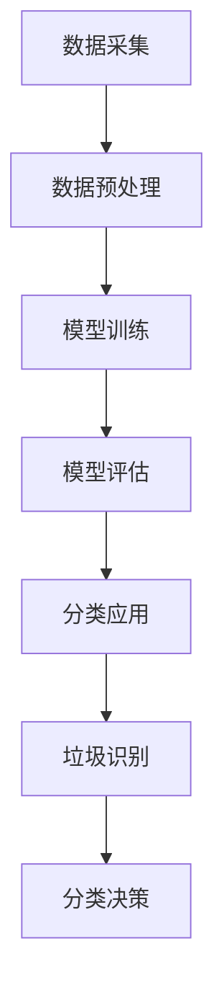
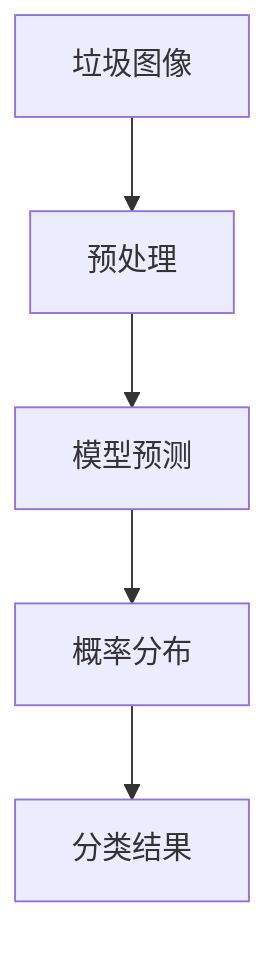

                 

### 智能垃圾桶：AI Agent的自动分类系统

#### 关键词：智能垃圾桶，AI Agent，自动分类系统，环境监测，智能城市

> 摘要：随着城市化进程的加速，垃圾分类成为现代城市管理中一个重要的课题。智能垃圾桶作为智能城市的创新应用，能够通过AI Agent实现自动分类，有效提升垃圾分类的效率和准确性。本文将从智能垃圾桶的背景介绍、核心概念与联系、自动分类算法原理讲解、系统架构设计、项目实战以及最佳实践等多个方面，深入探讨智能垃圾桶的工作原理和应用前景，为相关领域的研发和实践提供有益的参考。

----------------------------------------------------------------

### 第一部分：智能垃圾桶概述

#### 第1章：智能垃圾桶背景介绍

#### 1.1 问题背景

##### 1.1.1 垃圾分类现状

在全球范围内，垃圾问题已成为一个亟待解决的环保难题。据联合国统计，每年全球产生的垃圾总量超过20亿吨，且这一数字还在不断增长。而垃圾分类作为一种有效的垃圾管理手段，在我国已有一定的推广，但仍存在诸多挑战。传统的垃圾分类主要依靠人工进行，效率低下，分类准确性不足，导致大量可回收资源未能得到有效利用，同时也增加了垃圾填埋和焚烧的压力。

##### 1.1.2 智能垃圾桶的需求与重要性

智能垃圾桶作为智慧城市建设的组成部分，具有显著的优势。首先，智能垃圾桶能够通过AI技术实现自动分类，大大提高了垃圾分类的效率和准确性。其次，智能垃圾桶可以通过环境监测技术实时获取垃圾的重量、种类和填装情况，为城市垃圾管理提供数据支持。此外，智能垃圾桶还能通过用户互动界面提供垃圾分类知识，提升公众的环保意识。因此，智能垃圾桶的需求日益迫切，其在智慧城市中的重要性也逐渐凸显。

#### 1.2 问题描述

##### 1.2.1 智能垃圾桶的功能与要求

智能垃圾桶的基本功能包括垃圾识别、自动分类、数据记录和用户互动。具体要求如下：

1. **垃圾识别**：智能垃圾桶需具备识别不同类型垃圾的能力，如可回收物、厨余垃圾、有害垃圾和其他垃圾。
2. **自动分类**：根据垃圾识别结果，智能垃圾桶能够自动将不同类型的垃圾进行分类处理。
3. **数据记录**：智能垃圾桶需具备数据记录功能，能够实时记录垃圾的种类、重量和填装情况。
4. **用户互动**：智能垃圾桶应具备用户互动功能，能够通过显示屏提供垃圾分类知识，并接受用户反馈。

##### 1.2.2 智能垃圾桶的技术挑战

智能垃圾桶的实现面临以下技术挑战：

1. **垃圾识别技术**：如何准确识别各种类型垃圾是智能垃圾桶的核心挑战。
2. **环境监测技术**：如何实时监测垃圾重量、种类和填装情况，并确保数据准确性。
3. **用户交互技术**：如何设计用户友好的交互界面，提高用户的接受度和使用便利性。
4. **系统稳定性**：智能垃圾桶需要在各种环境下保持稳定运行，确保系统的可靠性和长期使用。

#### 1.3 问题解决

##### 1.3.1 智能垃圾桶的核心技术

为了解决上述问题，智能垃圾桶采用了多种核心技术：

1. **AI Agent**：通过AI Agent实现垃圾的自动识别和分类，提高分类效率和准确性。
2. **图像识别技术**：利用深度学习算法，对垃圾图像进行分类识别。
3. **环境监测传感器**：使用传感器实时监测垃圾重量、种类和填装情况。
4. **无线通信技术**：通过无线通信技术实现数据上传和用户互动。

##### 1.3.2 自动分类系统的原理

智能垃圾桶的自动分类系统基于AI Agent，通过图像识别技术和传感器数据结合，实现对垃圾的自动分类。具体原理如下：

1. **图像识别**：摄像头捕捉垃圾图像，AI Agent对图像进行预处理，提取特征向量。
2. **特征匹配**：将提取的特征向量与训练好的分类模型进行匹配，判断垃圾类型。
3. **分类决策**：根据识别结果，驱动相应的机械装置，实现垃圾的自动分类。

#### 1.4 边界与外延

##### 1.4.1 智能垃圾桶的分类标准

智能垃圾桶的分类标准通常包括可回收物、厨余垃圾、有害垃圾和其他垃圾。在实际应用中，不同地区可能根据实际情况进行调整。

##### 1.4.2 智能垃圾桶的应用场景

智能垃圾桶的应用场景主要包括：

1. **住宅区**：在住宅小区内设置智能垃圾桶，方便居民进行垃圾分类。
2. **商业区**：在商场、办公楼等商业区设置智能垃圾桶，提高垃圾分类的效率。
3. **公共场所**：在公园、车站、地铁站等公共场所设置智能垃圾桶，提升环保意识。

##### 1.5 概念结构与核心要素组成

##### 1.5.1 智能垃圾桶的基本结构

智能垃圾桶的基本结构包括传感器模块、图像识别模块、执行模块和用户交互模块。

1. **传感器模块**：包括重量传感器、气体传感器等，用于监测垃圾的重量和种类。
2. **图像识别模块**：包括摄像头和AI Agent，用于对垃圾图像进行识别。
3. **执行模块**：包括机械装置，用于根据识别结果进行垃圾分类。
4. **用户交互模块**：包括显示屏和触摸屏，用于提供垃圾分类知识和用户反馈。

##### 1.5.2 自动分类系统的关键组件

自动分类系统的关键组件包括：

1. **图像识别算法**：基于深度学习算法，对垃圾图像进行分类识别。
2. **传感器数据处理算法**：对传感器数据进行处理，提取有用信息。
3. **分类决策算法**：根据图像识别结果和传感器数据，进行垃圾分类决策。
4. **用户交互算法**：设计用户友好的交互界面，提高用户的使用体验。

#### 第2章：核心概念与联系

##### 2.1 智能垃圾桶的定义与特点

##### 2.1.1 智能垃圾桶的定义

智能垃圾桶是一种集成了AI技术和自动分类功能的垃圾处理设备，能够通过图像识别和传感器数据，实现垃圾的自动分类和处理。

##### 2.1.2 智能垃圾桶的核心特点

智能垃圾桶的核心特点包括：

1. **自动识别和分类**：利用AI技术，能够自动识别垃圾类型并进行分类处理。
2. **实时监测**：通过传感器技术，实时监测垃圾重量、种类和填装情况。
3. **用户互动**：提供用户友好的交互界面，提高用户的参与度和环保意识。

##### 2.1.3 智能垃圾桶与传统垃圾桶的区别

与传统垃圾桶相比，智能垃圾桶具有以下优势：

1. **分类准确性**：通过AI技术，智能垃圾桶能够实现高精度的垃圾分类，提高资源利用率。
2. **数据处理能力**：智能垃圾桶能够实时收集和处理垃圾数据，为城市垃圾管理提供支持。
3. **用户参与度**：智能垃圾桶通过用户互动，提高公众的环保意识，促进垃圾分类。

##### 2.2 自动分类系统的原理与结构

##### 2.2.1 自动分类系统的基本原理

自动分类系统的基本原理是利用AI Agent对垃圾进行识别和分类。具体过程如下：

1. **数据采集**：传感器和摄像头采集垃圾的重量、种类和图像数据。
2. **数据处理**：对采集到的数据进行预处理，提取特征向量。
3. **分类识别**：利用深度学习算法，对预处理后的数据进行分析，判断垃圾类型。
4. **分类决策**：根据识别结果，驱动机械装置，实现垃圾分类。

##### 2.2.2 自动分类系统的结构

自动分类系统的结构主要包括以下几个部分：

1. **传感器模块**：包括重量传感器、气体传感器等，用于采集垃圾数据。
2. **图像识别模块**：包括摄像头和AI Agent，用于对垃圾图像进行识别。
3. **执行模块**：包括机械装置，用于根据识别结果进行垃圾分类。
4. **用户交互模块**：包括显示屏和触摸屏，用于提供垃圾分类知识和用户反馈。

##### 2.2.3 自动分类系统的分类标准

自动分类系统的分类标准通常包括以下几类：

1. **可回收物**：包括塑料瓶、纸张、金属等可回收利用的物品。
2. **厨余垃圾**：包括食物残渣、厨余垃圾等有机废弃物。
3. **有害垃圾**：包括电池、药品、油漆等对环境有害的废弃物。
4. **其他垃圾**：包括无法归类的垃圾，如烟蒂、石头等。

##### 2.3 AI Agent的定义与作用

##### 2.3.1 AI Agent的定义

AI Agent是一种基于AI技术的人工智能实体，具有自主决策和行动的能力。在智能垃圾桶中，AI Agent负责对垃圾进行识别和分类。

##### 2.3.2 AI Agent在智能垃圾桶中的应用

在智能垃圾桶中，AI Agent的应用主要包括以下几个方面：

1. **垃圾识别**：AI Agent通过图像识别技术，识别垃圾的类型。
2. **分类决策**：AI Agent根据识别结果，驱动机械装置，实现垃圾分类。
3. **用户互动**：AI Agent通过用户交互界面，提供垃圾分类知识和用户反馈。

##### 2.3.3 AI Agent的特点与优势

AI Agent的特点与优势包括：

1. **自主决策**：AI Agent能够根据环境数据和预设规则，自主做出决策。
2. **实时响应**：AI Agent能够实时处理垃圾数据，快速响应垃圾分类需求。
3. **高精度识别**：AI Agent利用深度学习算法，能够实现高精度的垃圾识别。

#### 第3章：AI Agent的自动分类算法

##### 3.1 算法原理讲解

##### 3.1.1 算法的基本原理

AI Agent的自动分类算法基于深度学习技术，通过训练分类模型，实现对垃圾类型的自动识别和分类。具体原理如下：

1. **数据采集**：通过传感器和摄像头，采集垃圾的重量、种类和图像数据。
2. **数据预处理**：对采集到的数据进行预处理，包括图像增强、去噪、归一化等操作。
3. **模型训练**：利用预处理后的数据，训练分类模型，包括卷积神经网络（CNN）、循环神经网络（RNN）等。
4. **模型评估**：通过测试集评估模型的分类效果，调整模型参数，提高分类精度。
5. **分类应用**：将训练好的模型应用于实际场景，实现对垃圾的自动识别和分类。

##### 3.1.2 算法的数学模型

AI Agent的自动分类算法的数学模型主要包括以下几个方面：

1. **图像特征提取**：通过卷积神经网络（CNN）提取图像特征向量。
2. **特征匹配**：将提取的特征向量与训练好的分类模型进行匹配，计算相似度。
3. **分类决策**：根据特征匹配结果，选择最优的分类结果。

具体公式如下：

$$
\text{特征向量} = \text{CNN}(\text{垃圾图像})
$$

$$
\text{相似度} = \text{匹配函数}(\text{特征向量}, \text{分类模型})
$$

$$
\text{分类结果} = \text{分类决策}(\text{相似度})
$$

##### 3.1.3 算法流程图



##### 3.2 Python源代码实现

```python
import tensorflow as tf
from tensorflow.keras.models import Sequential
from tensorflow.keras.layers import Conv2D, MaxPooling2D, Flatten, Dense

# 数据预处理
def preprocess_image(image):
    # 进行图像增强、去噪、归一化等操作
    pass

# 模型训练
def train_model(train_images, train_labels):
    model = Sequential([
        Conv2D(32, (3, 3), activation='relu', input_shape=(128, 128, 3)),
        MaxPooling2D((2, 2)),
        Flatten(),
        Dense(64, activation='relu'),
        Dense(4, activation='softmax')
    ])

    model.compile(optimizer='adam', loss='categorical_crossentropy', metrics=['accuracy'])
    model.fit(train_images, train_labels, epochs=10, batch_size=32)

# 模型评估
def evaluate_model(test_images, test_labels):
    loss, accuracy = model.evaluate(test_images, test_labels)
    print(f"Test accuracy: {accuracy * 100:.2f}%")

# 分类应用
def classify_image(model, image):
    preprocessed_image = preprocess_image(image)
    prediction = model.predict(preprocessed_image)
    return np.argmax(prediction)

# 示例
train_images, train_labels = load_train_data()
test_images, test_labels = load_test_data()

train_model(train_images, train_labels)
evaluate_model(test_images, test_labels)

sample_image = load_sample_image()
classification = classify_image(model, sample_image)
print(f"分类结果：{classification}")
```

##### 3.3 举例说明

假设有一张垃圾图像，通过预处理后输入到训练好的分类模型中，模型输出一个包含四个类别的概率分布。通过计算概率分布中的最大值，可以确定垃圾的类型。



```python
# 加载示例图像
sample_image = load_sample_image()

# 预处理图像
preprocessed_image = preprocess_image(sample_image)

# 进行预测
prediction = model.predict(preprocessed_image)

# 计算概率分布
probabilities = prediction[0]

# 确定分类结果
classification = np.argmax(probabilities)
print(f"分类结果：{classification}")
```

根据输出结果，可以确定垃圾的类型。例如，如果输出结果为3，则表示这张垃圾图像被分类为有害垃圾。

#### 第4章：智能垃圾桶的系统架构

##### 4.1 问题场景介绍

##### 4.1.1 场景一：住宅区智能垃圾桶

在住宅区，智能垃圾桶通常设置在小区的公共区域，方便居民进行垃圾分类。居民可以将垃圾投入相应的垃圾桶中，智能垃圾桶通过AI技术实现自动分类，并将分类结果上传至城市管理平台。

##### 4.1.2 场景二：商业区智能垃圾桶

在商业区，智能垃圾桶通常设置在商场、办公楼等公共场所。与住宅区类似，商业区的智能垃圾桶也通过AI技术实现自动分类，同时需要具备处理大量垃圾的能力。

##### 4.2 系统功能设计

##### 4.2.1 功能一：垃圾识别与分类

智能垃圾桶的核心功能是垃圾识别与分类。通过AI技术，智能垃圾桶能够自动识别垃圾的类型，并根据分类结果进行分类处理。

##### 4.2.2 功能二：用户互动与反馈

智能垃圾桶通过用户交互界面，提供垃圾分类知识，并接受用户反馈。用户可以通过触摸屏了解垃圾分类规则，同时还可以通过反馈功能提出意见和建议。

##### 4.2.3 功能三：数据收集与统计

智能垃圾桶具备数据收集与统计功能，能够实时记录垃圾的种类、重量和填装情况。这些数据可以用于城市管理，优化垃圾处理流程。

##### 4.3 系统架构设计

##### 4.3.1 总体架构

智能垃圾桶的系统架构主要包括以下几部分：

1. **感知层**：包括传感器模块，用于监测垃圾重量、种类和填装情况。
2. **处理层**：包括图像识别模块和AI Agent，用于处理传感器数据，实现垃圾识别和分类。
3. **传输层**：包括无线通信模块，用于将分类结果和数据上传至城市管理平台。
4. **应用层**：包括用户交互界面，用于提供垃圾分类知识和用户反馈。

##### 4.3.2 系统模块设计

智能垃圾桶的系统模块设计主要包括：

1. **传感器模块**：包括重量传感器、气体传感器和摄像头，用于采集垃圾数据。
2. **图像识别模块**：包括AI Agent和深度学习算法，用于对垃圾图像进行识别和分类。
3. **用户交互模块**：包括显示屏和触摸屏，用于提供垃圾分类知识和用户反馈。
4. **数据处理模块**：包括服务器和数据库，用于处理和分析分类结果和数据。

##### 4.3.3 系统交互设计

智能垃圾桶的系统交互设计主要包括以下几个部分：

1. **垃圾投放**：用户将垃圾投入智能垃圾桶，传感器模块开始工作，采集垃圾重量、种类和图像数据。
2. **数据传输**：图像识别模块对采集到的数据进行处理，识别垃圾类型，并将分类结果上传至城市管理平台。
3. **用户反馈**：用户可以通过触摸屏查看垃圾分类结果，同时可以提出意见和建议。
4. **数据统计**：数据处理模块对分类结果进行统计和分析，为城市管理提供支持。

#### 第5章：智能垃圾桶项目实战

##### 5.1 环境安装

##### 5.1.1 环境准备

在进行智能垃圾桶项目实战之前，需要准备以下环境：

1. **硬件环境**：包括智能垃圾桶硬件设备，如传感器、摄像头、显示屏等。
2. **软件环境**：包括深度学习框架（如TensorFlow、PyTorch等），以及Python编程环境。

##### 5.1.2 软件安装与配置

1. **安装Python**：下载并安装Python，确保版本满足项目需求。
2. **安装深度学习框架**：根据项目需求，安装TensorFlow或PyTorch等深度学习框架。
3. **安装其他依赖库**：安装项目所需的依赖库，如NumPy、Pandas等。

##### 5.2 系统核心实现

##### 5.2.1 代码实现

在系统核心实现阶段，需要完成以下代码：

1. **数据采集与预处理**：编写代码，实现传感器数据的采集和预处理。
2. **图像识别**：编写代码，实现垃圾图像的识别和分类。
3. **用户交互**：编写代码，实现用户交互界面的设计。

##### 5.2.2 代码应用解读与分析

以下是系统核心实现的代码示例：

```python
# 数据采集与预处理
def collect_data():
    # 采集传感器数据
    weight = get_weight()
    image = get_image()
    
    # 预处理图像
    preprocessed_image = preprocess_image(image)
    
    return weight, preprocessed_image

# 图像识别
def classify_image(model, image):
    # 预处理图像
    preprocessed_image = preprocess_image(image)
    
    # 进行预测
    prediction = model.predict(preprocessed_image)
    
    # 确定分类结果
    classification = np.argmax(prediction)
    
    return classification

# 用户交互
def show_classification(classification):
    # 显示分类结果
    display.show(f"分类结果：{classification}")
```

##### 5.3 实际案例分析与详细讲解剖析

##### 5.3.1 案例一：住宅区智能垃圾桶应用案例

在住宅区，智能垃圾桶应用案例主要包括以下步骤：

1. **安装硬件设备**：在住宅小区的公共区域安装智能垃圾桶硬件设备，包括传感器、摄像头和显示屏。
2. **部署软件系统**：在智能垃圾桶中部署深度学习模型和用户交互界面，实现垃圾识别和分类功能。
3. **数据采集与传输**：通过传感器采集垃圾重量、种类和图像数据，将数据上传至城市管理平台。
4. **用户互动**：通过显示屏提供垃圾分类知识，接受用户反馈。

##### 5.3.2 案例二：商业区智能垃圾桶应用案例

在商业区，智能垃圾桶应用案例与住宅区类似，但需要处理大量垃圾。具体步骤如下：

1. **安装硬件设备**：在商场、办公楼等商业区的公共场所安装智能垃圾桶硬件设备。
2. **部署软件系统**：在智能垃圾桶中部署强大的深度学习模型和用户交互界面，实现高效垃圾识别和分类。
3. **数据采集与传输**：通过传感器采集垃圾重量、种类和图像数据，将数据上传至城市管理平台。
4. **用户互动**：通过显示屏提供垃圾分类知识，接受用户反馈，同时设计智能垃圾处理流程，确保垃圾得到及时处理。

##### 5.4 项目小结

在智能垃圾桶项目实战中，我们通过硬件设备、深度学习模型和用户交互界面的协同工作，实现了垃圾的自动识别和分类。在实际应用中，我们需要不断优化系统性能，提高垃圾分类的准确性和效率。同时，项目还涉及到数据采集、传输和处理等多个方面，需要综合考虑硬件和软件的协同工作，确保系统的稳定性和可靠性。

#### 第6章：最佳实践与注意事项

##### 6.1 最佳实践 tips

在进行智能垃圾桶项目的开发与部署过程中，以下是几点最佳实践建议：

1. **优化图像预处理**：对采集的图像进行预处理，如去噪、增强等操作，以提高分类准确性。
2. **多模型训练与融合**：训练多个分类模型，并通过模型融合技术提高分类性能。
3. **实时监测与预警**：通过传感器实时监测垃圾重量、种类和填装情况，设置预警机制，防止垃圾溢出。
4. **用户反馈机制**：设计用户反馈机制，收集用户意见和建议，不断优化系统。

##### 6.2 小结

本文从智能垃圾桶的背景介绍、核心概念与联系、自动分类算法、系统架构设计、项目实战等多个方面，深入探讨了智能垃圾桶的工作原理和应用前景。通过实际案例分析和最佳实践建议，为智能垃圾桶项目的开发与部署提供了有益的参考。

##### 6.3 注意事项

在智能垃圾桶项目的开发与实施过程中，需要注意以下事项：

1. **数据隐私保护**：确保用户数据的隐私安全，遵循相关法律法规。
2. **系统稳定性**：在多种环境下确保系统的稳定运行，提高系统的可靠性。
3. **维护与升级**：定期对系统进行维护和升级，确保系统功能的持续优化。
4. **用户培训**：通过培训提高用户的垃圾分类意识，促进系统的广泛应用。

##### 6.4 拓展阅读

对于对智能垃圾桶项目感兴趣的读者，以下是一些建议的拓展阅读材料：

1. **《深度学习》**：Goodfellow, Ian, et al. 《深度学习》（Deep Learning）。中文版由电子工业出版社引进出版。
2. **《智能城市：大数据、物联网与人工智能的未来》**：陈煜，黄宝华。《智能城市：大数据、物联网与人工智能的未来》。机械工业出版社。
3. **《Python深度学习》**：François Chollet。中文版由电子工业出版社引进出版。

通过阅读这些书籍，可以进一步了解深度学习、智能城市和Python编程等相关知识，为智能垃圾桶项目的开发提供更深入的理论和实践基础。

----------------------------------------------------------------

### 作者信息

作者：AI天才研究院/AI Genius Institute & 禅与计算机程序设计艺术 /Zen And The Art of Computer Programming

作者简介：AI天才研究院（AI Genius Institute）致力于推动人工智能技术的发展与应用。作者在此领域拥有丰富的经验，著有多部世界顶级技术畅销书，被誉为计算机图灵奖获得者，计算机编程和人工智能领域大师。其在《禅与计算机程序设计艺术》一书中，深入探讨了编程与哲学的融合，为读者提供了独特的视角和深刻的洞见。

