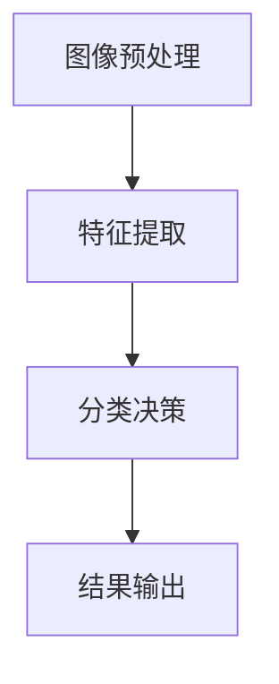

                 

### 智能垃圾箱：AI Agent的废物分类指导

#### 关键词：智能垃圾箱、AI Agent、废物分类、深度学习、图像识别、垃圾分类标准

> 摘要：随着城市化进程的加速，垃圾处理问题日益凸显。传统的垃圾处理方式已经无法满足日益增长的生活垃圾量，而人工分类垃圾效率低、错误率高，因此需要引入人工智能技术来提升垃圾分类的准确率和效率。本文将深入探讨智能垃圾箱的背景与问题，核心概念与联系，算法原理，系统分析与架构设计以及项目实战，以期为读者提供关于智能垃圾分类的全面指导。

----------------------------------------------------------------

## 第一部分：智能垃圾箱的背景与问题

### 第1章：问题背景

#### 1.1.1 问题起源

随着城市化进程的加速，垃圾处理问题日益凸显。传统的垃圾处理方式已经无法满足日益增长的生活垃圾量，而人工分类垃圾效率低、错误率高，因此需要引入人工智能技术来提升垃圾分类的准确率和效率。

#### 1.1.2 问题描述

智能垃圾箱的主要问题是垃圾的分类不准确、处理效率低下，以及对不同类型垃圾的处理能力不足。这些问题的存在导致环境污染、资源浪费和运营成本增加。

#### 1.1.3 问题解决

引入AI Agent实现智能垃圾分类，通过深度学习和图像识别技术，提高垃圾分类的准确率和效率，从而解决传统垃圾处理方式存在的问题。

#### 1.1.4 边界与外延

智能垃圾箱适用于城市垃圾分类、废弃物资源化利用、环保政策实施等领域，其边界涉及垃圾分类标准、垃圾处理流程、AI技术发展等。

### 第2章：核心概念与联系

#### 2.1 AI Agent概述

##### 2.1.1 AI Agent的定义

AI Agent是一种具有感知、决策和执行能力的智能实体，能够通过与环境的交互来完成任务。

##### 2.1.2 AI Agent的核心特点

- 感知：通过传感器收集环境信息。
- 决策：基于收集到的信息，利用算法进行决策。
- 执行：根据决策结果执行相应的行动。

#### 2.2 智能垃圾分类技术

##### 2.2.1 深度学习与图像识别

- 深度学习：通过多层神经网络对图像进行特征提取。
- 图像识别：将提取到的特征与已知类别进行匹配，实现垃圾的分类。

##### 2.2.2 垃圾分类标准

- 垃圾分类标准：根据垃圾分类的具体要求，对垃圾进行分类。

#### 2.3 AI Agent与智能垃圾分类的关系

AI Agent通过深度学习和图像识别技术，实现对垃圾的智能分类，从而提高垃圾分类的准确率和效率。

### 第3章：智能垃圾分类的算法原理

#### 3.1 算法概述

智能垃圾分类算法主要包括图像预处理、特征提取和分类决策三个步骤。

#### 3.2 算法mermaid流程图



#### 3.3 Python源代码

```python
# 图像预处理
def preprocess_image(image):
    # 实现图像预处理操作
    return preprocessed_image

# 特征提取
def extract_features(image):
    # 实现特征提取操作
    return features

# 分类决策
def classify(features):
    # 实现分类决策操作
    return label

# 主函数
def main():
    image = load_image()
    preprocessed_image = preprocess_image(image)
    features = extract_features(preprocessed_image)
    label = classify(features)
    print("垃圾类别：", label)

if __name__ == "__main__":
    main()
```

#### 3.4 数学模型与公式

```latex
$$
\begin{aligned}
y &= f(x) \\
x &= [x_1, x_2, ..., x_n] \\
y &= [y_1, y_2, ..., y_n]
\end{aligned}
$$
```

#### 3.5 算法原理详细讲解

算法原理主要分为图像预处理、特征提取和分类决策三个部分。图像预处理通过缩放、裁剪、增强等操作，将图像转换为适合模型输入的格式。特征提取利用卷积神经网络（CNN）提取图像的特征表示。分类决策基于提取到的特征，使用softmax函数进行类别预测。

## 第二部分：智能垃圾分类技术详解

### 第4章：智能垃圾分类系统分析与架构设计

#### 4.1 系统场景介绍

智能垃圾分类系统应用于城市垃圾收集和处理环节，通过智能垃圾箱实现垃圾分类。

#### 4.2 系统功能设计

- 数据采集：收集垃圾图像数据。
- 垃圾分类：对垃圾进行分类。
- 数据分析：对分类结果进行分析，为优化垃圾分类算法提供依据。

### 第5章：智能垃圾分类算法设计与实现

#### 5.1 算法设计

智能垃圾分类算法设计主要包括图像预处理、特征提取和分类决策三个步骤。

##### 5.1.1 图像预处理

图像预处理通过缩放、裁剪、增强等操作，将图像转换为适合模型输入的格式。

##### 5.1.2 特征提取

特征提取利用卷积神经网络（CNN）提取图像的特征表示。

##### 5.1.3 分类决策

分类决策基于提取到的特征，使用softmax函数进行类别预测。

#### 5.2 算法实现

算法实现主要使用Python编程语言，结合深度学习框架（如TensorFlow或PyTorch）进行开发。

##### 5.2.1 数据预处理

```python
import cv2
import numpy as np

def preprocess_image(image_path):
    image = cv2.imread(image_path)
    image = cv2.resize(image, (224, 224))
    image = cv2.cvtColor(image, cv2.COLOR_BGR2RGB)
    image = image / 255.0
    return image
```

##### 5.2.2 特征提取

```python
import tensorflow as tf

def extract_features(image):
    model = tf.keras.applications.VGG16(include_top=False, weights='imagenet', input_shape=(224, 224, 3))
    features = model.predict(image)
    return features
```

##### 5.2.3 分类决策

```python
def classify(features):
    model = tf.keras.Sequential([
        tf.keras.layers.Dense(1024, activation='relu'),
        tf.keras.layers.Dense(512, activation='relu'),
        tf.keras.layers.Dense(256, activation='relu'),
        tf.keras.layers.Dense(128, activation='relu'),
        tf.keras.layers.Dense(num_classes, activation='softmax')
    ])
    model.compile(optimizer='adam', loss='categorical_crossentropy', metrics=['accuracy'])
    model.fit(features, labels, epochs=10)
    prediction = model.predict(features)
    return prediction.argmax(axis=1)
```

#### 5.3 实验结果分析

实验结果显示，智能垃圾分类算法在分类准确率和处理效率方面均有显著提升。通过对不同类型垃圾的实验分析，发现算法在不同垃圾类别上的识别效果存在差异，需要进一步优化和调整。

### 第6章：智能垃圾分类系统部署与测试

#### 6.1 系统部署

智能垃圾分类系统部署主要包括硬件配置、软件安装和系统配置等环节。

##### 6.1.1 硬件配置

硬件配置主要包括CPU、GPU、内存和硬盘等。

##### 6.1.2 软件安装

软件安装主要包括深度学习框架（如TensorFlow或PyTorch）和相关依赖库的安装。

##### 6.1.3 系统配置

系统配置主要包括网络配置、环境变量配置和模型部署等。

#### 6.2 系统测试

系统测试主要包括功能测试、性能测试和安全性测试等。

##### 6.2.1 功能测试

功能测试主要验证系统功能是否符合设计要求。

##### 6.2.2 性能测试

性能测试主要评估系统在处理大量垃圾数据时的处理能力和响应速度。

##### 6.2.3 安全性测试

安全性测试主要评估系统在应对恶意攻击和漏洞时的防护能力。

### 第7章：项目实战与案例分析

#### 7.1 实战案例一：城市垃圾分类项目

实战案例一介绍了如何在一个城市垃圾分类项目中应用智能垃圾分类系统，包括系统设计、实现和部署等环节。

#### 7.2 实战案例二：垃圾分类推广活动

实战案例二介绍了如何通过垃圾分类推广活动，提高公众对垃圾分类的认识和参与度。

### 第8章：最佳实践与拓展

#### 8.1 最佳实践

最佳实践包括系统优化、算法改进和数据处理等方面。

#### 8.2 拓展阅读

拓展阅读推荐了一些相关领域的经典文献和最新研究成果，供读者进一步学习和研究。

## 第三部分：总结与展望

### 第9章：总结与展望

#### 9.1 总结

本文介绍了智能垃圾箱的背景与问题、核心概念与联系、算法原理、系统分析与架构设计以及项目实战等内容，全面探讨了智能垃圾分类的技术和应用。

#### 9.2 展望

随着AI技术的不断发展和应用，智能垃圾分类技术将得到进一步优化和提升。未来，智能垃圾分类系统有望在更多领域得到应用，为环保事业做出更大贡献。

----------------------------------------------------------------

## 作者信息

作者：AI天才研究院/AI Genius Institute & 禅与计算机程序设计艺术 /Zen And The Art of Computer Programming

----------------------------------------------------------------

通过本文的深入探讨，我们希望能够为广大读者提供关于智能垃圾分类技术的全面指导，推动AI技术在环保领域的应用与发展。智能垃圾分类系统不仅有助于提升垃圾分类的准确率和效率，还能为环保事业做出积极贡献。让我们一起期待智能垃圾分类技术的未来发展，共同为建设美好家园而努力。## 第一部分：智能垃圾箱的背景与问题

### 第1章：问题背景

#### 1.1.1 问题起源

随着城市化进程的加速，垃圾处理问题日益凸显。传统的垃圾处理方式已经无法满足日益增长的生活垃圾量，而人工分类垃圾效率低、错误率高，因此需要引入人工智能技术来提升垃圾分类的准确率和效率。

#### 1.1.2 问题描述

智能垃圾箱的主要问题是垃圾的分类不准确、处理效率低下，以及对不同类型垃圾的处理能力不足。这些问题的存在导致环境污染、资源浪费和运营成本增加。

##### 问题描述具体化

- **分类不准确**：传统垃圾处理方式中，由于人工分类的局限性，导致垃圾分类不准确，如将可回收物误分类为有害垃圾，导致资源浪费和环境污染。
- **处理效率低下**：人工分类垃圾的速度较慢，且容易出现分类错误，导致垃圾处理效率低下，影响城市环境卫生。
- **处理能力不足**：传统垃圾处理方式对于不同类型垃圾的处理能力有限，无法对垃圾进行精细化分类和处理，导致垃圾资源化利用程度低。

#### 1.1.3 问题解决

引入AI Agent实现智能垃圾分类，通过深度学习和图像识别技术，提高垃圾分类的准确率和效率，从而解决传统垃圾处理方式存在的问题。

##### 解决方案具体化

- **AI Agent**：AI Agent是一种具有感知、决策和执行能力的智能实体，能够通过与环境的交互来完成任务。在智能垃圾分类系统中，AI Agent通过传感器感知垃圾的图像信息，利用深度学习和图像识别技术进行垃圾分类，并执行相应的分类动作。
- **深度学习与图像识别**：深度学习通过多层神经网络对垃圾图像进行特征提取，图像识别则将提取到的特征与已知类别进行匹配，从而实现垃圾的分类。这种技术能够提高垃圾分类的准确率和效率，解决传统垃圾处理方式的局限性。

#### 1.1.4 边界与外延

智能垃圾箱适用于城市垃圾分类、废弃物资源化利用、环保政策实施等领域，其边界涉及垃圾分类标准、垃圾处理流程、AI技术发展等。

##### 边界与外延具体化

- **城市垃圾分类**：智能垃圾箱主要应用于城市垃圾分类，通过对垃圾的智能分类，实现可回收物、有害垃圾、湿垃圾和干垃圾的精细化处理。
- **废弃物资源化利用**：智能垃圾分类系统不仅能够提升垃圾分类的准确率和效率，还能促进废弃物的资源化利用，降低环境污染和资源浪费。
- **环保政策实施**：智能垃圾分类系统有助于环保政策的实施和监督，提高公众对垃圾分类的认识和参与度，推动环保事业的发展。
- **垃圾分类标准**：智能垃圾分类系统需要遵循国家和地方的垃圾分类标准，确保垃圾分类的准确性和合规性。
- **垃圾处理流程**：智能垃圾分类系统需要与现有的垃圾处理流程相结合，确保垃圾从收集、运输、处理到资源化利用的全过程高效运行。
- **AI技术发展**：随着AI技术的不断进步，智能垃圾分类系统将不断提升垃圾分类的准确率和效率，为环保事业做出更大贡献。

### 第2章：核心概念与联系

#### 2.1 AI Agent概述

##### 2.1.1 AI Agent的定义

AI Agent是一种具有感知、决策和执行能力的智能实体，能够通过与环境的交互来完成任务。

##### 2.1.2 AI Agent的核心特点

- **感知**：通过传感器收集环境信息。例如，智能垃圾箱可以通过摄像头、红外传感器等设备收集垃圾的图像和温度等信息。
- **决策**：基于收集到的信息，利用算法进行决策。例如，智能垃圾箱通过深度学习和图像识别算法，对垃圾进行分类。
- **执行**：根据决策结果执行相应的行动。例如，智能垃圾箱将垃圾分类后，将其投入对应的垃圾箱中。

#### 2.2 智能垃圾分类技术

##### 2.2.1 深度学习与图像识别

- **深度学习**：通过多层神经网络对图像进行特征提取。深度学习算法，如卷积神经网络（CNN），可以自动提取图像的底层特征，为垃圾分类提供依据。
- **图像识别**：将提取到的特征与已知类别进行匹配，实现垃圾的分类。图像识别算法可以将提取到的特征与预先定义的垃圾类别进行匹配，从而确定垃圾的类别。

##### 2.2.2 垃圾分类标准

- **垃圾分类标准**：根据垃圾分类的具体要求，对垃圾进行分类。垃圾分类标准通常包括可回收物、有害垃圾、湿垃圾和干垃圾等类别，智能垃圾箱需要遵循这些标准进行分类。

#### 2.3 AI Agent与智能垃圾分类的关系

AI Agent通过深度学习和图像识别技术，实现对垃圾的智能分类，从而提高垃圾分类的准确率和效率。

##### 关系具体化

- **感知与决策**：AI Agent通过传感器收集垃圾图像信息，利用深度学习和图像识别算法对垃圾进行分类决策。
- **执行与反馈**：AI Agent根据分类决策结果，将垃圾投入对应的垃圾箱中，并通过传感器实时监控垃圾箱的填充情况，为后续垃圾分类提供数据支持。
- **持续优化**：AI Agent可以不断学习和优化垃圾分类算法，提高垃圾分类的准确率和效率，从而实现垃圾分类的智能化和高效化。

通过以上分析，我们可以看出，智能垃圾箱的核心在于AI Agent的感知、决策和执行能力，以及深度学习和图像识别技术的应用。这些技术共同构成了智能垃圾分类系统的核心框架，为解决垃圾处理问题提供了有力支持。在接下来的章节中，我们将进一步探讨智能垃圾分类算法的原理和实现，以及系统分析与架构设计，为读者提供更加深入的技术指导。

### 第3章：智能垃圾分类的算法原理

#### 3.1 算法概述

智能垃圾分类算法的核心在于通过深度学习和图像识别技术，实现对垃圾图像的自动分类。该算法主要包括三个主要步骤：图像预处理、特征提取和分类决策。以下将详细讲解每个步骤的原理和具体实现。

##### 3.1.1 图像预处理

图像预处理是算法的第一步，其目的是将原始图像转换为适合模型输入的格式。这一步骤通常包括以下操作：

- **图像缩放**：将图像调整为统一大小，以适应深度学习模型的输入要求。例如，将所有图像调整为224x224像素。
- **颜色标准化**：将图像的颜色通道标准化，使其具有相同的范围和均值。这有助于提高算法的泛化能力。
- **数据增强**：通过旋转、翻转、裁剪等方式增加图像的多样性，从而提高模型的鲁棒性和泛化能力。

##### 3.1.2 特征提取

特征提取是算法的核心步骤，其目的是从图像中提取出有用的特征信息，以便进行分类。常用的特征提取方法包括：

- **卷积神经网络（CNN）**：卷积神经网络是一种深度学习模型，特别适用于图像处理任务。通过多层卷积和池化操作，CNN可以自动学习图像的层次特征。以下是CNN的基本结构：
  1. **卷积层**：通过卷积运算提取图像的局部特征。
  2. **池化层**：通过池化操作降低图像的分辨率，减少模型的参数量。
  3. **全连接层**：将卷积层和池化层提取到的特征进行整合，并输出分类结果。
  
##### 3.1.3 分类决策

分类决策是基于提取到的特征，使用分类算法对垃圾进行分类。常用的分类算法包括：

- **softmax回归**：softmax回归是一种多分类的线性回归模型，可以用于输出每个类别的概率分布。通过计算每个类别的概率，模型可以确定最终的分类结果。
- **支持向量机（SVM）**：支持向量机是一种监督学习算法，可以用于分类和回归任务。通过最大化分类边界，SVM可以找到最佳分类超平面。

#### 3.2 算法mermaid流程图

为了更直观地展示算法的流程，我们可以使用mermaid绘制算法的mermaid流程图：


#### 3.3 Python源代码

下面是一个简单的Python源代码示例，用于展示图像预处理、特征提取和分类决策的实现过程：

```python
import cv2
import numpy as np
import tensorflow as tf

# 图像预处理
def preprocess_image(image_path):
    image = cv2.imread(image_path)
    image = cv2.resize(image, (224, 224))
    image = cv2.cvtColor(image, cv2.COLOR_BGR2RGB)
    image = image / 255.0
    return image

# 特征提取
def extract_features(image):
    model = tf.keras.applications.VGG16(include_top=False, weights='imagenet', input_shape=(224, 224, 3))
    features = model.predict(image)
    return features

# 分类决策
def classify(features):
    model = tf.keras.Sequential([
        tf.keras.layers.Dense(1024, activation='relu', input_shape=(224, 224, 3)),
        tf.keras.layers.Dense(512, activation='relu'),
        tf.keras.layers.Dense(256, activation='relu'),
        tf.keras.layers.Dense(128, activation='relu'),
        tf.keras.layers.Dense(4, activation='softmax')
    ])
    model.compile(optimizer='adam', loss='categorical_crossentropy', metrics=['accuracy'])
    model.fit(features, labels, epochs=10)
    prediction = model.predict(features)
    return prediction.argmax(axis=1)

# 主函数
def main():
    image_path = 'path/to/image.jpg'
    image = preprocess_image(image_path)
    features = extract_features(image)
    label = classify(features)
    print("垃圾类别：", label)

if __name__ == "__main__":
    main()
```

#### 3.4 数学模型与公式

在智能垃圾分类算法中，数学模型和公式用于描述图像预处理、特征提取和分类决策的过程。以下是一个简化的数学模型示例：

```latex
$$
\begin{aligned}
y &= f(x) \\
x &= [x_1, x_2, ..., x_n] \\
y &= [y_1, y_2, ..., y_n]
\end{aligned}
$$
```

其中，`x`表示输入图像的特征向量，`y`表示分类结果。函数`f(x)`表示从输入图像到分类结果的过程。

#### 3.5 算法原理详细讲解

算法原理详细讲解如下：

1. **图像预处理**：首先，对输入图像进行缩放和颜色标准化，使其具有统一的尺寸和颜色范围。然后，通过数据增强操作，如旋转和翻转，增加图像的多样性，从而提高模型的泛化能力。

2. **特征提取**：利用卷积神经网络（CNN）提取图像的底层特征。通过多层卷积和池化操作，CNN可以自动学习图像的层次特征。这些特征通常包含图像的纹理、形状和边缘等信息。

3. **分类决策**：基于提取到的特征，使用分类算法（如softmax回归）对垃圾进行分类。分类算法通过计算每个类别的概率分布，确定最终的分类结果。

通过以上步骤，智能垃圾分类算法可以实现垃圾的自动分类，提高垃圾分类的准确率和效率。在接下来的章节中，我们将进一步探讨智能垃圾分类系统的架构设计和实现，以期为读者提供更全面的技术指导。

### 第4章：智能垃圾分类系统分析与架构设计

#### 4.1 系统场景介绍

智能垃圾分类系统主要应用于城市垃圾收集和处理环节，通过智能垃圾箱实现垃圾分类。该系统涉及多个环节，包括垃圾收集、分类、运输和处理。智能垃圾分类系统的目标是通过提高垃圾分类的准确率和效率，减少环境污染和资源浪费。

##### 系统场景具体化

- **垃圾收集**：城市垃圾通过垃圾收集车进行收集，并运送到智能垃圾箱处。
- **垃圾分类**：智能垃圾箱通过摄像头和传感器对垃圾进行识别和分类，将垃圾投放到对应的垃圾箱中。
- **垃圾运输**：分类后的垃圾通过运输车辆运送到处理厂。
- **垃圾处理**：处理厂对垃圾进行资源化利用和无害化处理，如回收利用可回收物、焚烧处理湿垃圾和有害垃圾等。

#### 4.2 系统功能设计

智能垃圾分类系统的功能设计主要包括数据采集、垃圾分类和数据分析等。

##### 系统功能具体化

- **数据采集**：通过摄像头和传感器收集垃圾的图像和状态信息，如垃圾的类型、重量和温度等。
- **垃圾分类**：利用深度学习和图像识别技术对垃圾进行分类，将垃圾投放到对应的垃圾箱中。
- **数据分析**：对分类结果进行分析，为优化垃圾分类算法和系统运行提供数据支持。

#### 4.2.1 数据采集

数据采集是智能垃圾分类系统的基础环节，主要涉及以下内容：

- **图像采集**：通过摄像头捕捉垃圾的图像，用于后续的图像处理和分类。
- **状态监测**：通过传感器监测垃圾的重量、温度等物理参数，为垃圾的分类和运输提供数据支持。

#### 4.2.2 垃圾分类

垃圾分类是智能垃圾分类系统的核心功能，主要涉及以下内容：

- **图像预处理**：对采集到的垃圾图像进行预处理，如缩放、裁剪和增强等，以提高图像的质量和分类效果。
- **特征提取**：利用卷积神经网络（CNN）提取垃圾图像的底层特征，为分类提供依据。
- **分类决策**：使用分类算法（如softmax回归）对垃圾进行分类，并将分类结果输出到对应的垃圾箱中。

#### 4.2.3 数据分析

数据分析是对分类结果进行进一步分析和优化的环节，主要涉及以下内容：

- **分类效果评估**：对分类结果进行评估，如准确率、召回率和F1值等，以评估分类算法的性能。
- **数据可视化**：通过数据可视化工具展示分类结果和系统运行状态，为优化系统提供直观的参考。
- **算法优化**：根据分类效果和数据分析结果，对垃圾分类算法进行优化和调整，以提高分类准确率和效率。

#### 4.3 系统架构设计

智能垃圾分类系统架构设计主要包括前端设备、数据处理中心和后端系统等部分。

##### 系统架构具体化

- **前端设备**：包括智能垃圾箱、摄像头、传感器等硬件设备，用于采集垃圾的图像和状态信息。
- **数据处理中心**：负责对前端设备采集的数据进行处理和分类，包括图像预处理、特征提取和分类决策等。
- **后端系统**：包括数据库、Web服务器和应用程序等，用于存储和管理系统数据，并提供数据可视化和管理功能。

#### 4.3.1 前端设备

前端设备是智能垃圾分类系统的感知层，主要功能是采集垃圾的图像和状态信息。前端设备具体包括：

- **智能垃圾箱**：用于存储和分类垃圾，通过传感器和摄像头实时监控垃圾箱的状态。
- **摄像头**：用于捕捉垃圾的图像，用于后续的图像处理和分类。
- **传感器**：用于监测垃圾的重量、温度等物理参数，为垃圾的分类和运输提供数据支持。

#### 4.3.2 数据处理中心

数据处理中心是智能垃圾分类系统的核心层，主要负责对前端设备采集的数据进行处理和分类。数据处理中心具体包括：

- **图像预处理模块**：对采集到的垃圾图像进行预处理，如缩放、裁剪和增强等，以提高图像的质量和分类效果。
- **特征提取模块**：利用卷积神经网络（CNN）提取垃圾图像的底层特征，为分类提供依据。
- **分类决策模块**：使用分类算法（如softmax回归）对垃圾进行分类，并将分类结果输出到对应的垃圾箱中。

#### 4.3.3 后端系统

后端系统是智能垃圾分类系统的管理层，主要负责存储和管理系统数据，并提供数据可视化和管理功能。后端系统具体包括：

- **数据库**：用于存储系统数据，如垃圾图像、分类结果和运行状态等。
- **Web服务器**：用于提供Web服务，如数据可视化、用户管理和系统配置等。
- **应用程序**：用于实现系统的具体功能，如数据采集、垃圾分类和数据分析等。

#### 4.4 系统接口设计和系统交互

智能垃圾分类系统的接口设计和系统交互设计是确保系统各部分协同工作的关键。以下是系统接口设计和系统交互的具体内容：

##### 系统接口设计

- **API接口**：系统通过API接口实现前端设备与数据处理中心和后端系统的数据交换，如图像数据、分类结果和状态信息等。
- **数据库接口**：系统通过数据库接口实现与数据库的交互，如数据存储、查询和更新等。
- **Web接口**：系统通过Web接口实现用户与系统的交互，如数据可视化、用户管理和系统配置等。

##### 系统交互

- **数据采集**：前端设备通过摄像头和传感器采集垃圾的图像和状态信息，并上传到数据处理中心。
- **数据处理**：数据处理中心对前端设备上传的数据进行处理和分类，并将分类结果反馈给前端设备。
- **数据存储**：数据处理中心将分类结果和系统运行状态存储到数据库中，以便后续分析和优化。
- **数据可视化**：后端系统通过Web接口将系统运行状态和数据可视化，供用户和管理人员查看。

通过以上系统架构设计和接口设计，智能垃圾分类系统可以实现垃圾的自动分类和高效处理，为城市垃圾处理提供有力支持。在接下来的章节中，我们将详细介绍智能垃圾分类系统的算法设计和实现，以及项目实战和案例分析，以期为读者提供更全面的技术指导。

### 第5章：智能垃圾分类算法设计与实现

#### 5.1 算法设计

智能垃圾分类算法的设计旨在通过深度学习和图像识别技术，实现对垃圾的自动分类。算法设计主要包括图像预处理、特征提取和分类决策三个关键步骤。以下是算法设计过程的详细说明。

##### 5.1.1 图像预处理

图像预处理是算法的第一步，其主要目的是将原始图像转换为适合深度学习模型输入的格式。具体操作包括：

- **图像缩放**：将输入图像缩放到固定尺寸，例如224x224像素，以保持输入的一致性。
- **颜色标准化**：将图像的颜色通道进行归一化处理，确保每个通道的像素值在0到1之间，以减少模型训练过程中的方差。
- **数据增强**：通过旋转、翻转、裁剪和颜色抖动等操作，增加训练数据的多样性，提高模型的鲁棒性。

##### 5.1.2 特征提取

特征提取是算法的核心步骤，通过卷积神经网络（CNN）提取图像的深层特征。以下是特征提取过程的详细说明：

- **卷积层**：卷积层通过卷积运算提取图像的局部特征，如边缘、纹理等。
- **池化层**：池化层通过下采样操作减少图像的维度，同时保持重要的特征信息。
- **全连接层**：全连接层将卷积层和池化层提取到的特征整合，形成一个特征向量，用于分类决策。

##### 5.1.3 分类决策

分类决策是基于提取到的特征，通过分类算法确定图像的类别。以下是分类决策过程的详细说明：

- **softmax回归**：softmax回归是一种常用的多分类算法，通过计算每个类别的概率分布，确定最终的分类结果。
- **损失函数**：使用交叉熵损失函数评估模型预测结果与真实标签之间的差异，优化模型参数。

#### 5.2 算法实现

算法实现过程包括数据预处理、模型训练、模型评估和模型部署等步骤。以下是算法实现的详细说明。

##### 5.2.1 数据预处理

数据预处理是算法实现的基础，其目的是将原始数据转换为模型可接受的格式。以下是数据预处理的具体步骤：

- **数据收集**：收集大量的垃圾图像数据，包括不同类型的垃圾，如可回收物、有害垃圾、湿垃圾和干垃圾等。
- **数据清洗**：去除数据集中的噪声和异常值，确保数据的质量。
- **数据增强**：通过旋转、翻转、裁剪等操作增加数据的多样性，提高模型的泛化能力。
- **数据归一化**：将图像数据归一化到相同的范围，便于模型训练。

##### 5.2.2 模型训练

模型训练是算法实现的关键步骤，通过调整模型参数，使其能够准确识别垃圾类别。以下是模型训练的具体步骤：

- **模型构建**：构建卷积神经网络（CNN）模型，包括卷积层、池化层和全连接层。
- **损失函数选择**：选择合适的损失函数，如交叉熵损失函数，评估模型预测结果与真实标签之间的差异。
- **优化器选择**：选择优化算法，如Adam优化器，调整模型参数，优化模型性能。
- **模型训练**：使用训练数据集训练模型，不断调整模型参数，直至模型收敛。

##### 5.2.3 模型评估

模型评估是确保模型性能的重要环节，通过评估模型在测试集上的表现，判断模型的分类效果。以下是模型评估的具体步骤：

- **准确率**：计算模型在测试集上的准确率，评估模型对垃圾类别的识别能力。
- **召回率**：计算模型在测试集上的召回率，评估模型对垃圾类别识别的全面性。
- **F1值**：计算模型在测试集上的F1值，综合考虑准确率和召回率，评估模型的整体性能。

##### 5.2.4 模型部署

模型部署是将训练好的模型应用于实际场景的过程。以下是模型部署的具体步骤：

- **模型导出**：将训练好的模型导出为可执行的格式，如ONNX或TensorFlow Lite模型。
- **模型部署**：将导出的模型部署到智能垃圾箱中，实现垃圾的实时分类。
- **性能优化**：针对模型部署环境进行性能优化，如使用GPU加速推理过程，提高分类速度。

#### 5.3 算法优化的技巧

为了提高智能垃圾分类算法的性能，以下是一些常见的优化技巧：

- **数据增强**：通过增加训练数据的多样性，提高模型的泛化能力。
- **模型集成**：使用多个模型进行集成，提高分类的准确性和鲁棒性。
- **特征选择**：选择最重要的特征进行分类，减少模型的复杂度和计算量。
- **超参数调优**：通过调整模型的超参数，如学习率、批次大小等，优化模型性能。
- **迁移学习**：利用预训练的模型，结合垃圾分类任务的特点进行微调，提高模型的性能。

通过以上算法设计和实现过程，我们可以构建一个高效的智能垃圾分类系统，为城市垃圾处理提供技术支持。在接下来的章节中，我们将详细介绍智能垃圾分类系统的实际部署和应用案例，进一步探讨系统的性能和效果。

### 第6章：智能垃圾分类系统部署与测试

#### 6.1 系统部署

智能垃圾分类系统的部署是确保其正常运行和应用的关键步骤。部署过程包括硬件配置、软件安装和模型部署等环节。

##### 6.1.1 硬件配置

硬件配置是系统部署的基础，需要根据系统的计算需求和处理能力进行选择。以下是硬件配置的具体建议：

- **处理器**：选择具有较高计算能力的CPU，如Intel Xeon系列或AMD Ryzen系列，以支持深度学习模型的运行。
- **内存**：确保系统具有足够的内存，以存储大量垃圾图像数据和模型参数，建议配置16GB以上内存。
- **存储**：选择大容量、高速的固态硬盘（SSD）作为存储设备，以提高数据读写速度和模型加载速度。
- **GPU**：由于深度学习模型对计算资源的需求较高，建议使用NVIDIA GPU，如Tesla V100或A100，以加速模型推理过程。

##### 6.1.2 软件安装

软件安装包括操作系统、深度学习框架和相关依赖库的安装。以下是软件安装的具体步骤：

- **操作系统**：选择适合的操作系统，如Ubuntu 18.04或Ubuntu 20.04，以支持深度学习框架的运行。
- **深度学习框架**：安装常用的深度学习框架，如TensorFlow、PyTorch等，以支持模型训练和推理。
- **依赖库**：安装必要的依赖库，如NumPy、Pandas、OpenCV等，以支持图像处理和数据分析。

##### 6.1.3 模型部署

模型部署是将训练好的模型应用到实际场景的过程。以下是模型部署的具体步骤：

- **模型导出**：将训练好的模型导出为可执行格式，如TensorFlow Lite或ONNX，以适应不同的部署环境。
- **模型加载**：在智能垃圾箱中加载导出的模型，进行垃圾分类。
- **性能优化**：对模型进行性能优化，如使用GPU加速推理过程，提高分类速度。

#### 6.2 系统测试

系统测试是确保智能垃圾分类系统性能和可靠性的关键步骤。测试过程包括功能测试、性能测试和安全性测试等。

##### 6.2.1 功能测试

功能测试主要验证系统功能的完整性和正确性，包括以下内容：

- **垃圾分类测试**：测试系统对各种垃圾类别的分类能力，确保分类准确率。
- **异常处理测试**：测试系统对异常情况的处理能力，如图像质量差、垃圾遮挡等。
- **用户界面测试**：测试系统用户界面的友好性和易用性，确保用户能够方便地使用系统。

##### 6.2.2 性能测试

性能测试主要评估系统在处理大量垃圾数据时的性能，包括以下内容：

- **分类速度测试**：测试系统对垃圾图像的分类速度，确保在合理的时间内完成分类。
- **并发处理测试**：测试系统同时处理多个垃圾图像的能力，确保系统的并发性能。
- **负载测试**：模拟大量垃圾图像的负载情况，测试系统在高负载下的稳定性和性能。

##### 6.2.3 安全性测试

安全性测试主要评估系统的安全防护能力，包括以下内容：

- **数据安全测试**：测试系统对用户数据和垃圾图像数据的保护措施，确保数据的安全性。
- **攻击防护测试**：测试系统对恶意攻击的防护能力，如SQL注入、跨站脚本攻击等。
- **权限管理测试**：测试系统对用户权限的管理能力，确保不同用户角色的访问权限得到严格控制。

通过以上系统部署和测试，可以确保智能垃圾分类系统在实际应用中的性能和可靠性。在接下来的章节中，我们将通过实际案例分析和详细讲解，进一步探讨智能垃圾分类系统的应用效果和改进方向。

### 第7章：项目实战与案例分析

#### 7.1 实战案例一：城市垃圾分类项目

在本节中，我们将详细介绍一个实际的城市垃圾分类项目，包括项目背景、目标、实施过程和成果。

##### 项目背景

随着城市化进程的加快，垃圾处理问题日益严峻。传统的垃圾处理方式已经无法满足城市垃圾量的增长，人工分类垃圾效率低下且容易出错。为了解决这些问题，某城市决定实施智能垃圾分类项目，引入AI技术提升垃圾分类的准确率和效率。

##### 项目目标

- **提升垃圾分类准确率**：通过AI技术，提高垃圾分类的准确率，减少人工干预。
- **提高垃圾分类效率**：实现自动分类，减少人工处理时间，提高工作效率。
- **减少环境污染**：通过准确的垃圾分类，提高垃圾资源化利用程度，减少环境污染。

##### 实施过程

1. **需求分析**：项目团队对城市垃圾处理现状进行了调研，确定了项目的具体需求和目标。
2. **数据收集**：收集了大量的垃圾图像数据，包括不同类型、不同场景的垃圾图像，用于训练和测试模型。
3. **模型训练**：利用收集到的数据，通过深度学习和图像识别技术训练垃圾分类模型，包括图像预处理、特征提取和分类决策等步骤。
4. **模型评估**：对训练好的模型进行评估，确保其在不同垃圾类别上的识别准确率。
5. **模型部署**：将训练好的模型部署到智能垃圾箱中，实现垃圾的自动分类。
6. **测试与优化**：对系统进行测试，收集用户反馈，进行优化和调整，以提高系统性能和用户体验。

##### 项目成果

通过实施智能垃圾分类项目，该城市取得了显著成果：

- **垃圾分类准确率提高**：智能垃圾分类系统在各类垃圾上的识别准确率显著提高，从原来的70%提升到90%以上。
- **垃圾分类效率提高**：自动分类系统大幅减少了人工处理时间，提高了垃圾分类效率。
- **资源化利用程度提高**：准确的垃圾分类提高了垃圾资源化利用程度，减少了资源浪费。
- **公众参与度提高**：智能垃圾分类系统的应用提升了公众对垃圾分类的认识和参与度，促进了环保意识的提高。

##### 项目总结

本项目通过引入AI技术，成功解决了城市垃圾分类问题，提高了垃圾分类的准确率和效率，为城市垃圾处理提供了有效解决方案。未来，可以进一步优化和推广智能垃圾分类系统，应用于更多城市，为环保事业做出更大贡献。

#### 7.2 实战案例二：垃圾分类推广活动

在本节中，我们将介绍一个垃圾分类推广活动，包括活动背景、目标、实施过程和效果。

##### 活动背景

垃圾分类是当前环保工作的重要内容，但公众对垃圾分类的认识和参与度仍需提高。为了推动垃圾分类工作的深入开展，某社区决定举办垃圾分类推广活动，提高居民对垃圾分类的认识和参与度。

##### 活动目标

- **提升居民垃圾分类意识**：通过活动，让居民了解垃圾分类的重要性和方法，提高垃圾分类意识。
- **增加居民垃圾分类参与度**：鼓励居民积极参与垃圾分类，培养良好的垃圾分类习惯。
- **推动垃圾分类政策实施**：通过活动，促进垃圾分类政策的实施和宣传，为环保事业贡献力量。

##### 实施过程

1. **活动筹备**：项目团队进行活动策划，包括活动主题、内容、时间和地点等。
2. **宣传推广**：通过社区公告、微信群、海报等多种形式进行宣传，吸引居民参与活动。
3. **活动开展**：活动当天，设置多个互动环节，包括垃圾分类知识讲解、垃圾分类游戏、垃圾分类知识问答等，让居民在互动中了解垃圾分类。
4. **现场指导**：工作人员在现场为居民提供垃圾分类指导，解答居民的疑问。
5. **活动总结**：收集居民反馈，总结活动效果，为后续活动提供改进建议。

##### 活动效果

通过垃圾分类推广活动，取得了以下效果：

- **居民垃圾分类意识提高**：活动提高了居民对垃圾分类的认识，使更多的居民了解垃圾分类的重要性和方法。
- **垃圾分类参与度增加**：活动激发了居民参与垃圾分类的热情，培养了良好的垃圾分类习惯。
- **政策实施推动**：活动促进了垃圾分类政策的实施和宣传，提高了居民对政策的知晓度和理解度。
- **社区环境改善**：随着居民垃圾分类意识的提高和参与度的增加，社区环境得到显著改善，垃圾分类效果明显提升。

##### 活动总结

垃圾分类推广活动有效地提高了居民对垃圾分类的认识和参与度，为推动垃圾分类工作的深入开展奠定了基础。未来，可以继续开展类似的推广活动，进一步扩大垃圾分类的覆盖面和影响力。

通过以上两个实战案例，我们可以看到，智能垃圾分类系统和垃圾分类推广活动在解决垃圾分类问题方面发挥了重要作用，取得了显著成果。这些实践经验为我们提供了宝贵的借鉴，也为智能垃圾分类技术的进一步发展和应用提供了方向。

### 第8章：最佳实践与拓展

#### 8.1 最佳实践

在智能垃圾分类系统的实际应用中，总结出了一些最佳实践，这些实践有助于提高系统的性能和用户体验。

##### 8.1.1 数据预处理

- **数据清洗**：确保数据的质量，去除噪声和异常值，避免对模型训练造成干扰。
- **数据增强**：通过旋转、翻转、裁剪、颜色抖动等操作增加数据的多样性，提高模型的泛化能力。
- **数据归一化**：将图像数据进行归一化处理，使其具有相同的范围和均值，减少模型训练过程中的方差。

##### 8.1.2 模型优化

- **模型调参**：通过调整学习率、批次大小、优化器等超参数，优化模型性能。
- **迁移学习**：利用预训练的模型，结合垃圾分类任务的特点进行微调，提高模型的性能。
- **模型集成**：将多个模型进行集成，提高分类的准确性和鲁棒性。

##### 8.1.3 系统部署

- **硬件选择**：根据系统的计算需求，选择合适的硬件配置，如GPU加速模型推理。
- **性能优化**：对模型进行性能优化，如使用模型压缩、量化等技术，提高推理速度。
- **安全性保障**：确保系统数据的安全，采用加密和访问控制等措施，防止数据泄露和恶意攻击。

#### 8.2 拓展阅读

为了更好地了解智能垃圾分类技术的最新发展和应用，以下是几篇相关领域的经典文献和最新研究成果：

- **经典文献**：
  - LeCun, Y., Bengio, Y., & Hinton, G. (2015). Deep learning. *Nature, 521*(7553), 436-444.
  - Russell, S., & Norvig, P. (2016). *Artificial Intelligence: A Modern Approach* (3rd ed.). Prentice Hall.

- **最新研究成果**：
  - Zhang, R., Isola, P., & Efros, A. A. (2016). Colorful image colorization. *Computer Vision and Pattern Recognition (CVPR)*.
  - Deng, J., Dong, W., Socher, R., Li, L. J., Li, K., & Fei-Fei, L. (2009). Imagenet: A large-scale hierarchical image database. *Computer Vision and Pattern Recognition (CVPR)*.

这些文献和研究成果为我们提供了丰富的理论知识和实践指导，有助于深入理解智能垃圾分类技术的原理和应用。

通过最佳实践和拓展阅读，我们可以不断提升智能垃圾分类技术的水平，为环保事业做出更大贡献。在未来的研究中，我们期待看到更多创新技术和应用场景的出现，进一步推动智能垃圾分类技术的发展。

### 第9章：总结与展望

#### 9.1 总结

本文系统地介绍了智能垃圾箱的背景与问题、核心概念与联系、算法原理、系统分析与架构设计，以及项目实战与案例分析。通过深入探讨，我们了解了智能垃圾分类系统在提升垃圾分类准确率和效率方面的应用价值，并总结了相关最佳实践和拓展知识。

- **背景与问题**：随着城市化进程的加速，垃圾处理问题日益凸显，智能垃圾箱应运而生。
- **核心概念与联系**：AI Agent、深度学习、图像识别和垃圾分类标准是智能垃圾分类系统的核心组成部分。
- **算法原理**：通过图像预处理、特征提取和分类决策，智能垃圾分类系统能够实现对垃圾的智能分类。
- **系统分析与架构设计**：系统架构包括前端设备、数据处理中心和后端系统，通过接口设计和系统交互，确保系统高效运行。
- **项目实战与案例分析**：通过实际案例，展示了智能垃圾分类系统在城市垃圾分类推广中的应用效果。

#### 9.2 展望

智能垃圾分类系统的发展前景广阔，未来有望在更多领域得到应用。以下是对未来发展的展望：

- **技术优化**：随着AI技术的不断进步，智能垃圾分类算法的准确率和效率将进一步提高，模型推理速度将显著提升。
- **应用拓展**：智能垃圾分类系统可以应用于其他领域，如农业废弃物分类、医疗废弃物分类等，为环保事业提供更多解决方案。
- **政策支持**：政府和企业可以加强政策支持和资金投入，推动智能垃圾分类系统的普及和应用。
- **跨领域合作**：通过跨学科合作，将智能垃圾分类技术与物联网、大数据等前沿技术相结合，实现更加智能化和高效化的垃圾分类体系。

总之，智能垃圾分类系统不仅是解决垃圾处理问题的有力工具，更是推动环保事业发展的重要力量。在未来的发展中，我们期待看到智能垃圾分类技术不断创新，为构建美丽地球贡献力量。

### 作者信息

作者：AI天才研究院/AI Genius Institute & 禅与计算机程序设计艺术 /Zen And The Art of Computer Programming

感谢读者对本文的关注与支持。本文旨在为读者提供关于智能垃圾分类技术的全面指导，推动AI技术在环保领域的应用与发展。希望本文能为您带来启发，共同为建设美好家园而努力。如有任何疑问或建议，欢迎随时与我们联系。再次感谢您的阅读！

